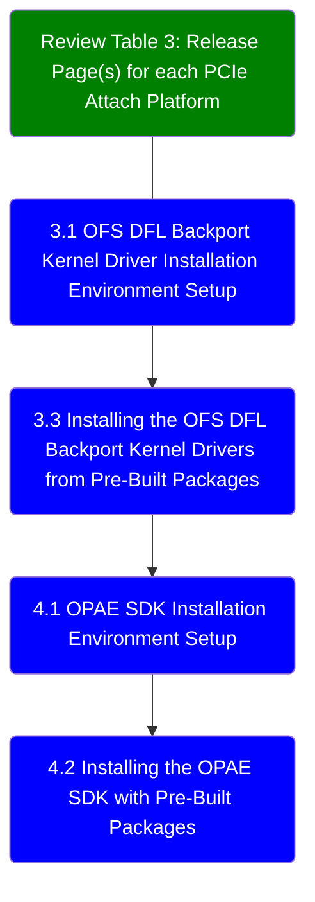

# Software Installation Guide: Open FPGA Stack for PCIe Attach
Last updated: **February 26, 2025** 

## 1.0 About This Document

The purpose of this document is to help users get started in setting up their local environments and installing the most recent release of the PCIe Attach software stack on the host. This document will not cover the process of board installation or platform bring-up. After reviewing this document, a user shall be able to:

* Set up a server environment according to the Best Known Configuration (BKC)
* Build and install the OPAE Software Development Kit (SDK) on the host
* Build and install the Linux DFL driver stack on the host

The simplest flow for installing OPAE SDK and Linux DFL are shown below:



### 1.1 Audience

The information in this document is intended for customers evaluating a PCIe Attach shell. The PCIe Attach shell design is supported on a number of board offerings, including the Agilex™ 7 FPGA F-Series Development Kit (2x F-Tile), Agilex™ 7 FPGA I-Series Development Kit (2x R-Tile and 1xF-Tile), Intel® FPGA SmartNIC N6001-PL, and Intel® FPGA PAC D5005.

*Note: Code command blocks are used throughout the document. Comments are preceded with '#'. Full command output may not be shown for the sake of brevity.*

#### Table 1: Terminology

| Term                      | Abbreviation | Description                                                  |
| :------------------------------------------------------------:| :------------:| ------------------------------------------------------------ |
|Advanced Error Reporting	|AER	|The PCIe AER driver is the extended PCI Express error reporting capability providing more robust error reporting. [(link)](https://docs.kernel.org/PCI/pcieaer-howto.html?highlight=aer)|
|Accelerator Functional Unit	|AFU	|Hardware Accelerator implemented in FPGA logic which offloads a computational operation for an application from the CPU to improve performance. Note: An AFU region is the part of the design where an AFU may reside. This AFU may or may not be a partial reconfiguration region.|
|Basic Building Block	|BBB|	Features within an AFU or part of an FPGA interface that can be reused across designs. These building blocks do not have stringent interface requirements like the FIM's AFU and host interface requires. All BBBs must have a (globally unique identifier) GUID.|
|Best Known Configuration	|BKC	|The software and hardware configuration Intel uses to verify the solution.|
|Board Management Controller|	BMC	|Supports features such as board power managment, flash management, configuration management, and board telemetry monitoring and protection. The majority of the BMC logic is in a separate component, such as an Intel® Max® 10 or Intel Cyclone® 10 device; a small portion of the BMC known as the PMCI resides in the main Agilex FPGA.
|Configuration and Status Register	|CSR	|The generic name for a register space which is accessed in order to interface with the module it resides in (e.g. AFU, BMC, various sub-systems and modules).|
|Data Parallel C++	|DPC++|	DPC++ is Intel’s implementation of the SYCL standard. It supports additional attributes and language extensions which ensure DCP++ (SYCL) is efficiently implanted on Intel hardware.
|Device Feature List	|DFL	| The DFL, which is implemented in RTL, consists of a self-describing data structure in PCI BAR space that allows the DFL driver to automatically load the drivers required for a given FPGA configuration. This concept is the foundation for the OFS software framework. [(link)](https://docs.kernel.org/fpga/dfl.html)|
|FPGA Interface Manager	|FIM|	Provides platform management, functionality, clocks, resets and standard interfaces to host and AFUs. The FIM resides in the static region of the FPGA and contains the FPGA Management Engine (FME) and I/O ring.|
|FPGA Management Engine	|FME	|Performs reconfiguration and other FPGA management functions. Each FPGA device only has one FME which is accessed through PF0.|
|Host Exerciser Module	|HEM	|Host exercisers are used to exercise and characterize the various host-FPGA interactions, including Memory Mapped Input/Output (MMIO), data transfer from host to FPGA, PR, host to FPGA memory, etc.|
|Input/Output Control|	IOCTL	|System calls used to manipulate underlying device parameters of special files.|
|Intel Virtualization Technology for Directed I/O	|Intel VT-d	|Extension of the VT-x and VT-I processor virtualization technologies which adds new support for I/O device virtualization.|
|Joint Test Action Group	|JTAG	| Refers to the IEEE 1149.1 JTAG standard; Another FPGA configuration methodology.|
|Memory Mapped Input/Output	|MMIO|	The memory space users may map and access both control registers and system memory buffers with accelerators.|
|oneAPI Accelerator Support Package	|oneAPI-asp	|A collection of hardware and software components that enable oneAPI kernel to communicate with oneAPI runtime and OFS shell components. oneAPI ASP hardware components and oneAPI kernel form the AFU region of a oneAPI system in OFS.|
|Open FPGA Stack	|OFS|	OFS is a software and hardware infrastructure providing an efficient approach to develop a custom FPGA-based platform or workload using an Intel, 3rd party, or custom board. |
|Open Programmable Acceleration Engine Software Development Kit|	OPAE SDK|	The OPAE SDK is a software framework for managing and accessing programmable accelerators (FPGAs). It consists of a collection of libraries and tools to facilitate the development of software applications and accelerators. The OPAE SDK resides exclusively in user-space.|
|Platform Interface Manager	|PIM|	An interface manager that comprises two components: a configurable platform specific interface for board developers and a collection of shims that AFU developers can use to handle clock crossing, response sorting, buffering and different protocols.|
|Platform Management Controller Interface|	PMCI|	The portion of the BMC that resides in the Agilex FPGA and allows the FPGA to communicate with the primary BMC component on the board.|
|Partial Reconfiguration	|PR	|The ability to dynamically reconfigure a portion of an FPGA while the remaining FPGA design continues to function. For OFS designs, the PR region is referred to as the pr_slot.|
|Port|	N/A	|When used in the context of the fpgainfo port command it represents the interfaces between the static FPGA fabric and the PR region containing the AFU.|
|Remote System Update|	RSU	|The process by which the host can remotely update images stored in flash through PCIe. This is done with the OPAE software command "fpgasupdate".|
|Secure Device Manager	|SDM|	The SDM is the point of entry to the FPGA for JTAG commands and interfaces, as well as for device configuration data (from flash, SD card, or through PCI Express* hard IP).|
|Static Region|	SR	|The portion of the FPGA design that cannot be dynamically reconfigured during run-time.|
|Single-Root Input-Output Virtualization|	SR-IOV	|Allows the isolation of PCI Express resources for manageability and performance.|
|SYCL	|SYCL|	SYCL (pronounced "sickle") is a royalty-free, cross-platform abstraction layer that enables code for heterogeneous and offload processors to be written using modern ISO C++ (at least C++ 17). It provides several features that make it well-suited for programming heterogeneous systems, allowing the same code to be used for CPUs, GPUs, FPGAs or any other hardware accelerator. SYCL was developed by the Khronos Group, a non-profit organization that develops open standards (including OpenCL) for graphics, compute, vision, and multimedia. SYCL is being used by a growing number of developers in a variety of industries, including automotive, aerospace, and consumer electronics.|
|Test Bench	|TB	|Testbench or Verification Environment is used to check the functional correctness of the Design Under Test (DUT) by generating and driving a predefined input sequence to a design, capturing the design output and comparing with-respect-to expected output.|
|Universal Verification Methodology	|UVM	|A modular, reusable, and scalable testbench structure via an API framework.  In the context of OFS, the UVM enviroment provides a system level simulation environment for your design.|
|Virtual Function Input/Output	|VFIO	|An Input-Output Memory Management Unit (IOMMU)/device agnostic framework for exposing direct device access to userspace. (link)|


#### Table 2: Software and Component Version Summary for OFS PCIe Attach

The OFS PCIe Attach release is built upon tightly coupled software and Operating System version(s). The repositories listed below are where the source code resides for each of the components discussed in this document.

| Component | Version | Download Link |
| ----- | ----- | ----- |
| Host Operating System |  RedHat® Enterprise Linux® (RHEL) 9.4 | [link](https://access.redhat.com/downloads/content/479/ver=/rhel---9/9.4/x86_64/product-software) |
| OPAE SDK| [ 2.14.0-2 ]( https://github.com/OFS/opae-sdk/releases/tag/2.14.0-2 ) | [ 2.14.0-2 ]( https://github.com/OFS/opae-sdk/releases/tag/2.14.0-2 )|
| Linux DFL | [intel-1.12.0-1](https://github.com/OFS/linux-dfl-backport/releases/tag/intel-1.12.0-1 ) | [intel-1.12.0-1](https://github.com/OFS/linux-dfl-backport/releases/tag/intel-1.12.0-1) |

#### Table 3: Release Page(s) for each PCIe Attach Platform

This is a comprehensive list of the platform(s) whose software build and installation steps are covered in this document.

|Platform|Release Page Link|
| ----- | ----- |
| Stratix® 10 FPGA | https://github.com/OFS/ofs-agx7-pcie-attach/releases/tag/ofs-2024.3-1 |
| Intel® FPGA SmartNIC N6001-PL |https://github.com/OFS/ofs-agx7-pcie-attach/releases/tag/ofs-2024.3-1 |
| Agilex™ 7 FPGA F-Series Development Kit (2x F-Tile) | https://github.com/OFS/ofs-agx7-pcie-attach/releases/tag/ofs-2024.3-1|
| Agilex™ 7 FPGA I-Series Development Kit (2x R-Tile and 1xF-Tile)|https://github.com/OFS/ofs-agx7-pcie-attach/releases/tag/ofs-2024.3-1 |

### 1.2 Server Requirements

#### 1.2.1 Host BIOS

These are the host BIOS settings required to work with the OFS stack, which relies on SR-IOV for some of its functionality. Information about any given server's currently loaded firmware and BIOS settings can be found through its remote access controller, or by manually entering the BIOS by hitting a specific key during power on. Your specific server platform will include instructions on proper BIOS configuration and should be followed when altering settings. Ensure the following has been set:

- PCIe slot width **must** be set to your design's width (1x16, 2x8)
- PCIe slot generation **must** be set to your design's supported generation (4, 5)
- Intel VT for Directed I/O (VT-d) must be enabled

Specific BIOS paths are not listed here as they can differ between BIOS vendors and versions.

#### 1.2.2 Host Server Kernel and GRUB Configuration

While many host Linux kernel and OS distributions may work with this design, only the following configuration(s) have been tested. You will need to download and install the OS on your host of choice; we will build the required kernel alongside the Linux DFL driver set.

* OS: RedHat® Enterprise Linux® (RHEL) 9.4
* Kernel: 5.14.0-dfl

### 2.0 OFS Software Overview

The responsibility of the OFS kernel drivers is to act as the lowest software layer in the FPGA software stack, providing a minimalist driver implementation between the host software and functionality that has been implemented on the development platform. This leaves the implementation of IP-specific software in user-land, not the kernel. The OFS software stack also provides a mechanism for interface and feature discovery of FPGA platforms.

The OPAE SDK is a software framework for managing and accessing programmable accelerators (FPGAs). It consists of a collection of libraries and tools to facilitate the development of software applications and accelerators. The OPAE SDK resides exclusively in user-space, and can be found on the [OPAE SDK Github](https://github.com/OFS/opae-sdk).

The OFS drivers decompose implemented functionality, including external FIM features such as HSSI, EMIF and SPI, into sets of individual Device Features. Each Device Feature has its associated Device Feature Header (DFH), which enables a uniform discovery mechanism by software. A set of Device Features are exposed through the host interface in a Device Feature List (DFL). The OFS drivers discover and "walk" the Device Features in a Device Feature List and associate each Device Feature with its matching kernel driver.

In this way the OFS software provides a clean and extensible framework for the creation and integration of additional functionalities and their features.

*Note: A deeper dive on available SW APIs and programming model is available in the [Software Reference Manual: Open FPGA Stack](https://ofs.github.io/ofs-2024.3-1/hw/common/reference_manual/ofs_sw/mnl_sw_ofs/), on [kernel.org](https://docs.kernel.org/fpga/dfl.html?highlight=fpga), and through the [Linux DFL wiki pages](https://github.com/OFS/linux-dfl/wiki).*

## 3.0 OFS DFL Kernel Drivers

OFS DFL driver software provides the bottom-most API to FPGA platforms. Libraries such as OPAE and frameworks like DPDK are consumers of the APIs provided by OFS. Applications may be built on top of these frameworks and libraries. The OFS software does not cover any out-of-band management interfaces. OFS driver software is designed to be extendable, flexible, and provide for bare-metal and virtualized functionality. An in depth look at the various aspects of the driver architecture such as the API, an explanation of the DFL framework, and instructions on how to port DFL driver patches to other kernel distributions can be found on [https://github.com/OPAE/linux-dfl/wiki](https://github.com/OPAE/linux-dfl/wiki).

An in-depth review of the Linux device driver architecture can be found on [opae.github.io](https://opae.github.io/latest/docs/drv_arch/drv_arch.html).

The DFL driver suite can be automatically installed using a supplied Python 3 installation script. This script ships with a README detailing execution instructions, and currently only supported the PCIe Attach release. Its usage is detailed in the relevant Quick Start Demonstration Guideline for your platform and will not be covered here.

### 3.1 OFS DFL Backport Kernel Driver Installation Environment Setup

All OFS DFL kernel driver primary release code for this release resides in the [Linux DFL Backport GitHub repository](https://github.com/OFS/linux-dfl-backport). This repository is open source and does not require any special permissions to access. It includes a snapshot of the Linux kernel with *most* of the OFS DFL drivers included in `/drivers/fpga/*`. Download, configuration, and compilation will be discussed in this section. Refer back to section [1.2.2 Host Server Kernel and GRUB Configuration](#122-host-server-kernel-and-grub-configuration) for a list of supported Operating System(s).

You can choose to install the DFL kernel drivers by either using pre-built binaries created for supported OS release(s), or by building them on your local server. If you decide to use the pre-built packages available on your platform's release page, skip to section [3.3 Installing the OFS DFL Kernel Drivers from Pre-Built Packages](#33-installing-the-ofs-dfl-kernel-drivers-from-pre-built-packages). Regardless of your choice you will need to follow the two steps in this section to prepare your server environment for installation.

This installation process assumes the user has access to an internet connection to clone specific GitHub repositories, and to satisfy package dependencies.

1. It is recommended you lock your Red Hat release version to 9.4 to prevent accidental upgrades. Update installed system packages to their latest versions. We need to enable the code-ready-builder and EPEL repositories.

    ```bash
    subscription-manager release --set=9.4
    sudo dnf update
    subscription-manager repos --enable codeready-builder-for-rhel-9-x86_64-rpms
    sudo dnf install https://dl.fedoraproject.org/pub/epel/epel-release-latest-9.noarch.rpm
    ```

2. Install the following package dependencies if building and installing drivers from source. If you do not require the use of a proxy to pull in downloads using `dnf`, you can safely remove those parameters from the following commands:
    
    ```bash
    If you require the use of a proxy, add it to DNF using by editing the following file
    sudo nano /etc/dnf/dnf.conf
    # Include your proxy by adding the following line, replacing the URL with your proxy's URL
    # proxy=http://proxy.server.com:port
    
    sudo dnf install python3 python3-pip python3-devel python3-jsonschema python3-pyyaml git gcc gcc-c++ make cmake libuuid-devel json-c-devel hwloc-devel tbb-devel cli11-devel spdlog-devel libedit-devel systemd-devel doxygen python3-sphinx pandoc rpm-build rpmdevtools python3-virtualenv yaml-cpp-devel libudev-devel libcap-devel numactl-devel bison flex automake autoconf
    
    python3 -m pip install --user jsonschema virtualenv pudb pyyaml setuptools pybind11

    # If setuptools and pybind11 were already installed
    python3 -m pip install --upgrade --user pybind11 setuptools

    # Check that required kernel files are installed. Requires a reboot after
    sudo dnf install kernel-5.14.0-427.13.1.el9_4.x86_64
    sudo dnf install kernel-devel-5.14.0-427.13.1.el9_4.x86_64
    sudo dnf install kernel-devel-matched-5.14.0-427.13.1.el9_4.x86_64
    sudo dnf install kernel-headers-5.14.0-427.13.1.el9_4.x86_64

    sudo grubby --default-kernel
    # This should be set to 5.14.0-427.13.1.el9_4.x86_64$. If not, change with the following:
    sudo grubby --default-kernel /boot/vmlinuz-5.14.0-427.13.1.el9_4.x86_64

    sudo reboot
    ```

    Now you have the choice to either follow the steps in section [3.2 Building and Installing the OFS DFL Backport Kernel Drivers from Source](#32-building-and-installing-the-ofs-dfl-backport-kernel-drivers-from-source) or [3.3 Installing the OFS DFL Backport Kernel Drivers from Pre-Built Packages](#33-installing-the-ofs-dfl-backport-kernel-drivers-from-pre-built-packages).

### 3.2 Building and Installing the OFS DFL Backport Kernel Drivers from Source

This section assumes you have already read through and followed any relevant environment setup steps in [Section 3.1 3.1 OFS DFL Backport Kernel Driver Installation Environment Setup](#31-ofs-dfl-backport-kernel-driver-installation-environment-setup)

It is recommended you create an empty top level directory for your OFS related repositories to keep the working environment clean. All steps in this installation will use a generic top-level directory at `/home/OFS/`. If you have created a different top-level directory, replace this path with your custom path.

1. Initialize an empty git repository and clone the DFL driver source code:

    ```bash
    mkdir /home/OFS/
    cd /home/OFS/
    git init
    git clone https://github.com/OFS/linux-dfl-backport
    cd /home/OFS/linux-dfl-backport
    git checkout tags/intel-1.12.0-1
    ```

    *Note: The linux-dfl repository is roughly 5 GB in size.*

2. Verify that the correct tag/branch have been checked out.

    ```bash
    git describe --tags
    intel-1.12.0-1
    ```

    *Note: If two different tagged releases are tied to the same commit, running git describe tags may report the other release's tag. This is why the match is made explicit.*

3. Build the kernel.

    ```bash
    cd /home/OFS/linux-dfl-backport
    make && make rpm
    ```

4. Install the newly compiled RPM package and reboot.

    ```bash
    sudo rpm -i intel-fpga-dfl-dkms-\*.noarch.rpm
    
    sudo reboot
    ```

5. Verify the DFL drivers have been successfully installed by reading version information directly from `/lib/modules`. Recall that the name of the kernel built as a part of this section is 5.14.0-dfl. If the user set a different name for their kernel, change this path as needed:

    ```bash
    cd /usr/lib/modules/5.14.0-427.13.1.el9_4.x86_64/extra/
    ls
    
    8250_dfl.ko.xz        dfl-n3000-nios.ko.xz       intel-m10-bmc-log.ko.xz         qsfp-mem-platform.ko.xz
    dfl-afu.ko.xz         dfl-pci.ko.xz              intel-m10-bmc-pmci.ko.xz        regmap-indirect-register.ko.xz
    dfl-cxl-cache.ko.xz   dfl-pci-sva.ko.xz          intel-m10-bmc-sec-update.ko.xz  regmap-mmio.ko.xz
    dfl-emif.ko.xz        dfl-platform.ko.xz         intel-m10-bmc-spi.ko.xz         regmap-spi-avmm.ko.xz
    dfl-fme-br.ko.xz      dfl-priv-feat.ko.xz        intel-s10-phy.ko.xz             s10hssi.ko.xz
    dfl-fme.ko.xz         fpga-bridge.ko.xz          n5010-hssi.ko.xz                spi-altera-core.ko.xz
    dfl-fme-mgr.ko.xz     fpga-mgr.ko.xz             n5010-phy.ko.xz                 spi-altera-dfl.ko.xz
    dfl-fme-region.ko.xz  fpga-region.ko.xz          ptp_dfl_tod.ko.xz               spi-altera-platform.ko.xz
    dfl-hssi.ko.xz        intel-m10-bmc-hwmon.ko.xz  qsfp-mem-core.ko.xz             uio-dfl.ko.xz
    dfl.ko.xz             intel-m10-bmc.ko.xz        qsfp-mem-dfl.ko.xz
    ```

    If an OFS device that is compatible with these drivers is installed on the server, you can double check the driver versions by listing the currently loaded kernel modules with `lsmod`:

    ```bash
    lsmod | grep dfl
    
    dfl_pci_sva            20480  0
    ptp_dfl_tod            16384  0
    dfl_cxl_cache          24576  0
    dfl_hssi               16384  0
    spi_altera_dfl         20480  0
    spi_altera_core        16384  1 spi_altera_dfl
    dfl_fme_mgr            20480  1
    qsfp_mem_dfl           16384  0
    uio_dfl                20480  0
    qsfp_mem_core          20480  1 qsfp_mem_dfl
    dfl_n3000_nios         20480  0
    uio                    32768  1 uio_dfl
    dfl_fme_br             16384  0
    dfl_emif               16384  0
    dfl_fme_region         20480  0
    8250_dfl               16384  0
    dfl_fme                57344  0
    dfl_afu                45056  1
    dfl_pci                20480  0
    dfl                    49152  16 dfl_pci,s10hssi,uio_dfl,dfl_hssi,dfl_fme,n5010_hssi,intel_m10_bmc_pmci,dfl_fme_br,qsfp_mem_dfl,dfl_n3000_nios,8250_dfl,ptp_dfl_tod,dfl_afu,spi_altera_dfl,dfl_emif,dfl_cxl_cache
    fpga_region            20480  3 dfl_fme_region,dfl_fme,dfl
    fpga_bridge            24576  4 dfl_fme_region,fpga_region,dfl_fme,dfl_fme_br
    fpga_mgr               28672  4 dfl_fme_region,fpga_region,dfl_fme_mgr,dfl_fme
    drm                   741376  6 drm_kms_helper,ast,drm_shmem_helper,dfl_cxl_cache
    ```

6. Four kernel parameters must be added to the boot command line for the newly installed kernel. They will be visible on next boot. If you wish to set your *hugepgaes* settings on a per-session basis you can remove them from the *grubby* command and see the note below.

    ```bash
    sudo grubby --update-kernel /boot/vmlinuz-5.14.0-427.13.1.el9_4.x86_64 --args "intel_iommu=on pcie=realloc hugepagesz=2M hugepages=200"
    sudo grub2-mkconfig -o /boot/grub2/grub.cfg --update-bls-cmdline
    sudo reboot
    
    # after reboot
    cat /proc/cmdline
    BOOT_IMAGE=(hd0,gpt3)/vmlinuz-5.14.0-427.13.1.el9_4.x86_64 ... rhgb quiet intel_iommu=on pcie=realloc hugepagesz=2M hugepages=200
    ```
    
    *Note: If you wish to instead set hugepages on a per session basis, you can perform the following steps. These settings will be lost on reboot.*
    
    ```bash
    mkdir -p /mnt/huge 
    mount -t hugetlbfs nodev /mnt/huge 
    echo 2048 > /sys/devices/system/node/node0/hugepages/hugepages-2048kB/nr_hugepages 
    echo 2048 > /sys/devices/system/node/node1/hugepages/hugepages-2048kB/nr_hugepages 
    ```
    
    A list of all DFL drivers and their purpose is maintained on the [DFL Wiki](https://github.com/OFS/linux-dfl/wiki/FPGA-DFL-Driver-Modules#fpga-driver-modules).

### 3.3 Installing the OFS DFL Backport Kernel Drivers from Pre-Built Packages

This section assumes you have already read through and followed any relevant environment setup steps in [Section 3.1 OFS DFL Backport Kernel Driver Installation Environment Setup](#31-ofs-dfl-backport-kernel-driver-installation-environment-setup)

To use the pre-built Linux DFL packages, you first need to download the files from your chosen platform's release page under the Artifacts tab. The name will resemble kernel-\*.tar.gz. You can also browse the releases on the [backport site](https://github.com/OFS/linux-dfl-backport/releases).

1. Download and install the pre-built kernel package.

```bash
wget https://github.com/OFS/ofs-agx7-pcie-attach/releases/download/intel-fpga-dfl-dkms-1.12.0-1.2025.01.17.g1ed87c2.noarch.rpm
sudo rpm -i intel-fpga-dfl-dkms-1.12.0-1.2025.01.17.g1ed87c2.noarch.rpm

# Double check the new kernel is your boot target
sudo grubby --default-kernel
/boot/vmlinuz-5.14.0-427.13.1.el9_4.x86_64

# If not, set the new kernel as your default boot target
sudo grubby --set-default /boot/vmlinuz-5.14.0-427.13.1.el9_4.x86_64
sudo reboot
```

Continue from step 5 of [Section 3.2 Building and Installing the OFS DFL Backport Kernel Drivers from Source](#32-building-and-installing-the-ofs-dfl-backport-kernel-drivers-from-source).

## 4.0 OPAE Software Development Kit

The OPAE SDK software stack sits in user space on top of the OFS kernel drivers. It is a common software infrastructure layer that simplifies and streamlines integration of programmable accelerators such as FPGAs into software applications and environments. OPAE consists of a set of drivers, user-space libraries, and tools to discover, enumerate, share, query, access, manipulate, and reconfigure programmable accelerators. OPAE is designed to support a layered, common programming model across different platforms and devices. To learn more about OPAE, its documentation, code samples, an explanation of the available tools, and an overview of the software architecture, visit [opae.github.io](https://opae.github.io/latest/index.html).

The OPAE SDK source code is contained within a single GitHub repository hosted at the [OPAE Github](https://github.com/OFS/opae-sdk/releases/tag/2.14.0-2). This repository is open source and does not require any permissions to access.

You can choose to install the OPAE SDK by either using pre-built binaries created for the BKC OS, or by building them on your local server. If you decide to use the pre-built packages available on your chosen platform's release page, skip to section [4.3 Installing the OPAE SDK with Pre-built Packages](#44-installing-the-opae-sdk-with-pre-built-packages). Regardless of your choice you will need to follow the steps in this section to prepare your server for installation.

You may also choose to use the supplied Python 3 installation script. This script ships with a README detailing execution instructions and is available on the PCIe Attach's platform release page. It can be used to automate installation of the pre-built packages, or to build from source.

### 4.1 OPAE SDK Installation Environment Setup

This installation process assumes you have access to an internet connection to pull specific GitHub repositories, and to satisfy package dependencies.

#### Table 4: OPAE Package Description
        
| Package Name| Description|
| -----| -----|
| opae | OPAE SDK is a collection of libraries and tools to facilitate the development of software applications and accelerators using OPAE. It provides a library implementing the OPAE C API for presenting a streamlined and easy-to-use interface for software applications to discover, access, and manage FPGA devices and accelerators using the OPAE software stack. |
| opae-debuginfo| This package provides debug information for package opae. Debug information is useful when developing applications that use this package or when debugging this package.|
| opae-debugsource| This package provides debug sources for package opae. Debug sources are useful when developing applications that use this package or when debugging this package.|
| opae-devel| OPAE headers, tools, sample source, and documentation|
| opae-devel-debuginfo|This package provides debug information for package opae-devel. Debug information is useful when developing applications that use this package or when debugging this package. |
| opae-tools| This package contains OPAE base tools binaries|
| opae-extra-tools| Additional OPAE tools|
| opae-extra-tools-debuginfo| This package provides debug information for package opae-extra-tools. Debug information is useful when developing applications that use this package or when debugging this package.|

1. Lock your RHEL installation to RHEL 9.4 and enable the ncessary repositories. If you have already completed these steps from [3.1 OFS DFL Backport Kernel Driver Installation Environment Setup](#31-ofs-dfl-backport-kernel-driver-installation-environment-setup) you can skip them here.

    ```bash
    subscription-manager release --set=9.4
    sudo dnf update
    subscription-manager repos --enable codeready-builder-for-rhel-9-x86_64-rpms
    sudo dnf install https://dl.fedoraproject.org/pub/epel/epel-release-latest-9.noarch.rpm
    ```

2. Remove any currently installed OPAE packages.

    ```bash
    sudo dnf remove opae*
    ```

3. Initialize an empty git repository and clone the tagged OPAE SDK source code.

    ```bash
    cd /home/OFS/
    git init
    git clone https://github.com/OFS/opae-sdk opae-sdk
    cd /home/OFS/opae-sdk
    git checkout tags/2.14.0-2
    ```

4. Verify that the correct tag/branch have been checkout out.

    ```bash
    git describe --tags
    2.14.0-2
    ```

5. Set up a temporary python virtual environment to build OPAE, which will allow you to customize the python installation without affecting system packages.
    
    ```bash
    cd /home/OFS
    
    sudo dnf install python3 python3-pip python3-devel python3-jsonschema python3-pyyaml git gcc gcc-c++ make cmake libuuid-devel json-c-devel hwloc-devel tbb-devel cli11-devel spdlog-devel libedit-devel systemd-devel doxygen python3-sphinx pandoc rpm-build rpmdevtools python3-virtualenv yaml-cpp-devel libudev-devel libcap-devel make automake autoconf
    
    # Create and source a python virtual environment
    python3 -m venv opae_venv
    (opae_venv) source opae_venv/bin/activate
    (opae_venv) python3 -m pip install --upgrade pybind11 wheel pyyaml jsonschema setuptools==70.0 
    (opae_venv) ./opae-sdk/packaging/opae/rpm/create unrestricted
    (opae_venv) exit
    ```

6. Install the packages you just created.
    
    ```bash
    cd /home/OFS/opae-sdk/packaging/opae/rpm
    rm -rf opae-*.src.rpm 
    sudo dnf localinstall -y opae*.rpm
    ```

7. Check that all packages have been installed and match expectation:
    
    ```bash
    rpm -qa | grep opae
    opae-2.14.0-2.el9.x86_64.rpm
    opae-debuginfo-2.14.0-2.el9.x86_64.rpm
    opae-debugsource-2.14.0-2.el9.x86_64.rpm
    opae-devel-2.14.0-2.el9.x86_64.rpm
    opae-devel-debuginfo-2.14.0-2.el9.x86_64.rpm
    opae-extra-tools-2.14.0-2.el9.x86_64.rpm
    opae-extra-tools-debuginfo-2.14.0-2.el9.x86_64.rpm
    ```

### 4.2 Installing the OPAE SDK with Pre-Built Packages

You can skip the entire build process and use a set of pre-built binaries supplied by Altera. Visit your chosen platform's release page. Ender the Assets tab you will see a file named opae-sdk-2.14.0-2-x86_64-rockylinux-9.zip on the [OFS release page](https://github.com/OFS/ofs-agx7-pcie-attach/releases/tag/ofs-2024.3-1). Download this package and extract its contents:

```bash
unzip xf opae-*.zip
```

For a fast installation you can delete the source RPM as it isn't necessary, and install all remaining OPAE RPMs:

```bash
rm opae-*.src.rpm
sudo dnf localinstall opae*.rpm
```

## Notices & Disclaimers

Altera® Corporation technologies may require enabled hardware, software or service activation. No product or component can be absolutely secure. Performance varies by use, configuration and other factors. Your costs and results may vary. You may not use or facilitate the use of this document in connection with any infringement or other legal analysis concerning Altera or Intel products described herein. You agree to grant Altera Corporation a non-exclusive, royalty-free license to any patent claim thereafter drafted which includes subject matter disclosed herein. No license (express or implied, by estoppel or otherwise) to any intellectual property rights is granted by this document, with the sole exception that you may publish an unmodified copy. You may create software implementations based on this document and in compliance with the foregoing that are intended to execute on the Altera or Intel product(s) referenced in this document. No rights are granted to create modifications or derivatives of this document. The products described may contain design defects or errors known as errata which may cause the product to deviate from published specifications. Current characterized errata are available on request. Altera disclaims all express and implied warranties, including without limitation, the implied warranties of merchantability, fitness for a particular purpose, and non-infringement, as well as any warranty arising from course of performance, course of dealing, or usage in trade. You are responsible for safety of the overall system, including compliance with applicable safety-related requirements or standards. © Altera Corporation. Altera, the Altera logo, and other Altera marks are trademarks of Altera Corporation. Other names and brands may be claimed as the property of others.

OpenCL* and the OpenCL* logo are trademarks of Apple Inc. used by permission of the Khronos Group™.
