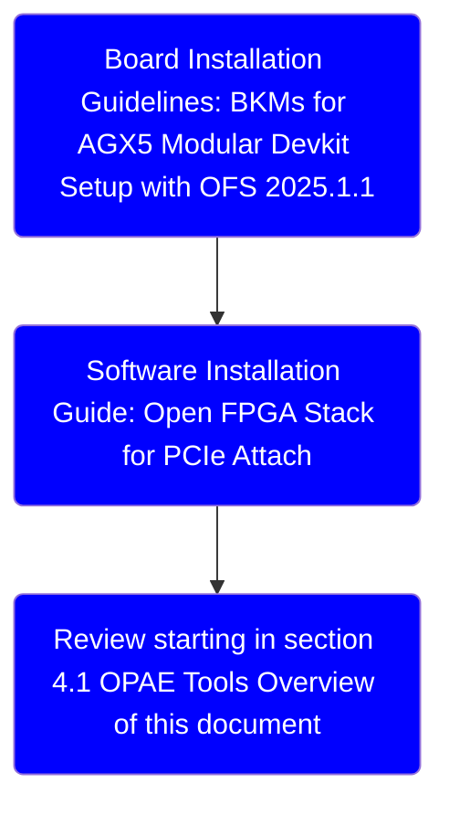
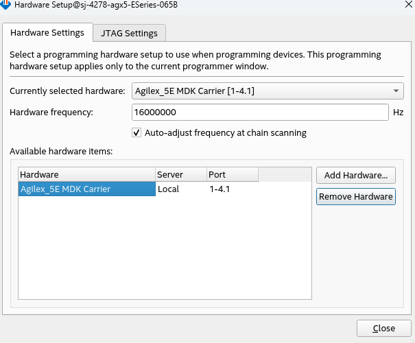
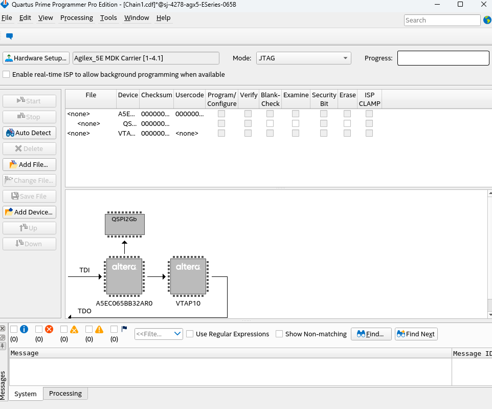
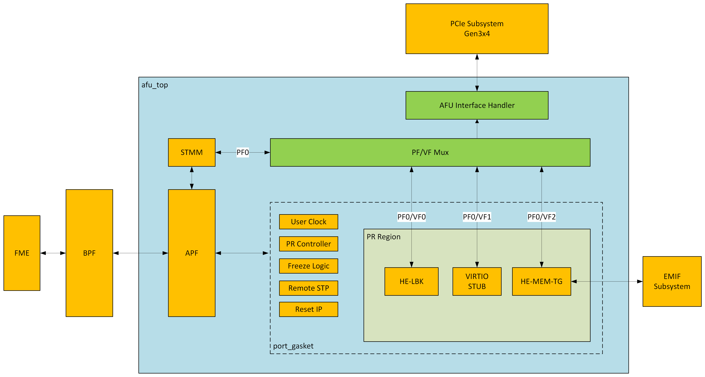

# Getting Started Guide: Open FPGA Stack for Agilex™ 5 FPGAs Targeting the Agilex™ 5 FPGA E-Series 065B Modular Development Kit

Last updated: **October 23, 2025** 

## 1.0 About This Document

The purpose of this document is to help users get started in evaluating the 2025.1-1 version of the PCIe Attach release targeting the Agilex 5 Modular Development Kit. After reviewing this document, a user shall be able to:

- Set up a server environment according to the Best Known Configuration (BKC)
- Load and verify firmware targeting the FIM and AFU regions of the Agilex FPGA
- Verify full stack functionality offered by the PCIe Attach OFS solution
- Learn where to find additional information on other PCIe Attach ingredients

### 1.1 Audience

The information in this document is intended for customers evaluating the PCIe Attach shell targeting Agilex™ 5 FPGA E-Series 065B Modular Development Kit. This platform is a Development Kit intended to be used as a starting point for evaluation and development.

*Note: Code command blocks are used throughout the document. Commands that are intended for you to run are preceded with the symbol '$', and comments with '#'. Full command output may not be shown.*

The minimal viable flow for dev kit installation through environment validation is as follows for Agilex 5 Modular DK:



### 1.2 Terminology

#### Table 1: Terminology

| Term                      | Abbreviation | Description                                                  |
| :------------------------------------------------------------:| :------------:| ------------------------------------------------------------ |
|Advanced Error Reporting	|AER	|The PCIe AER driver is the extended PCI Express error reporting capability providing more robust error reporting. [(link)](https://docs.kernel.org/PCI/pcieaer-howto.html?highlight=aer)|
|Accelerator Functional Unit	|AFU	|Hardware Accelerator implemented in FPGA logic which offloads a computational operation for an application from the CPU to improve performance. Note: An AFU region is the part of the design where an AFU may reside. This AFU may or may not be a partial reconfiguration region.|
|Basic Building Block	|BBB|	Features within an AFU or part of an FPGA interface that can be reused across designs. These building blocks do not have stringent interface requirements like the FIM's AFU and host interface requires. All BBBs must have a (globally unique identifier) GUID.|
|Best Known Configuration	|BKC	|The software and hardware configuration Intel uses to verify the solution.|
|Board Management Controller|	BMC	|Supports features such as board power managment, flash management, configuration management, and board telemetry monitoring and protection. The majority of the BMC logic is in a separate component, such as an Intel® Max® 10 or Intel Cyclone® 10 device; a small portion of the BMC known as the PMCI resides in the main Agilex FPGA.
|Configuration and Status Register	|CSR	|The generic name for a register space which is accessed in order to interface with the module it resides in (e.g. AFU, BMC, various sub-systems and modules).|
|Data Parallel C++	|DPC++|	DPC++ is Intel’s implementation of the SYCL standard. It supports additional attributes and language extensions which ensure DCP++ (SYCL) is efficiently implanted on Intel hardware.
|Device Feature List	|DFL	| The DFL, which is implemented in RTL, consists of a self-describing data structure in PCI BAR space that allows the DFL driver to automatically load the drivers required for a given FPGA configuration. This concept is the foundation for the OFS software framework. [(link)](https://docs.kernel.org/fpga/dfl.html)|
|FPGA Interface Manager	|FIM|	Provides platform management, functionality, clocks, resets and standard interfaces to host and AFUs. The FIM resides in the static region of the FPGA and contains the FPGA Management Engine (FME) and I/O ring.|
|FPGA Management Engine	|FME	|Performs reconfiguration and other FPGA management functions. Each FPGA device only has one FME which is accessed through PF0.|
|Host Exerciser Module	|HEM	|Host exercisers are used to exercise and characterize the various host-FPGA interactions, including Memory Mapped Input/Output (MMIO), data transfer from host to FPGA, PR, host to FPGA memory, etc.|
|Input/Output Control|	IOCTL	|System calls used to manipulate underlying device parameters of special files.|
|Intel Virtualization Technology for Directed I/O	|Intel VT-d	|Extension of the VT-x and VT-I processor virtualization technologies which adds new support for I/O device virtualization.|
|Joint Test Action Group	|JTAG	| Refers to the IEEE 1149.1 JTAG standard; Another FPGA configuration methodology.|
|Memory Mapped Input/Output	|MMIO|	The memory space users may map and access both control registers and system memory buffers with accelerators.|
|oneAPI Accelerator Support Package	|oneAPI-asp	|A collection of hardware and software components that enable oneAPI kernel to communicate with oneAPI runtime and OFS shell components. oneAPI ASP hardware components and oneAPI kernel form the AFU region of a oneAPI system in OFS.|
|Open FPGA Stack	|OFS|	OFS is a software and hardware infrastructure providing an efficient approach to develop a custom FPGA-based platform or workload using an Intel, 3rd party, or custom board. |
|Open Programmable Acceleration Engine Software Development Kit|	OPAE SDK|	The OPAE SDK is a software framework for managing and accessing programmable accelerators (FPGAs). It consists of a collection of libraries and tools to facilitate the development of software applications and accelerators. The OPAE SDK resides exclusively in user-space.|
|Platform Interface Manager	|PIM|	An interface manager that comprises two components: a configurable platform specific interface for board developers and a collection of shims that AFU developers can use to handle clock crossing, response sorting, buffering and different protocols.|
|Platform Management Controller Interface|	PMCI|	The portion of the BMC that resides in the Agilex FPGA and allows the FPGA to communicate with the primary BMC component on the board.|
|Partial Reconfiguration	|PR	|The ability to dynamically reconfigure a portion of an FPGA while the remaining FPGA design continues to function. For OFS designs, the PR region is referred to as the pr_slot.|
|Port|	N/A	|When used in the context of the fpgainfo port command it represents the interfaces between the static FPGA fabric and the PR region containing the AFU.|
|Remote System Update|	RSU	|The process by which the host can remotely update images stored in flash through PCIe. This is done with the OPAE software command "fpgasupdate".|
|Secure Device Manager	|SDM|	The SDM is the point of entry to the FPGA for JTAG commands and interfaces, as well as for device configuration data (from flash, SD card, or through PCI Express* hard IP).|
|Static Region|	SR	|The portion of the FPGA design that cannot be dynamically reconfigured during run-time.|
|Single-Root Input-Output Virtualization|	SR-IOV	|Allows the isolation of PCI Express resources for manageability and performance.|
|SYCL	|SYCL|	SYCL (pronounced "sickle") is a royalty-free, cross-platform abstraction layer that enables code for heterogeneous and offload processors to be written using modern ISO C++ (at least C++ 17). It provides several features that make it well-suited for programming heterogeneous systems, allowing the same code to be used for CPUs, GPUs, FPGAs or any other hardware accelerator. SYCL was developed by the Khronos Group, a non-profit organization that develops open standards (including OpenCL) for graphics, compute, vision, and multimedia. SYCL is being used by a growing number of developers in a variety of industries, including automotive, aerospace, and consumer electronics.|
|Test Bench	|TB	|Testbench or Verification Environment is used to check the functional correctness of the Design Under Test (DUT) by generating and driving a predefined input sequence to a design, capturing the design output and comparing with-respect-to expected output.|
|Universal Verification Methodology	|UVM	|A modular, reusable, and scalable testbench structure via an API framework.  In the context of OFS, the UVM enviroment provides a system level simulation environment for your design.|
|Virtual Function Input/Output	|VFIO	|An Input-Output Memory Management Unit (IOMMU)/device agnostic framework for exposing direct device access to userspace. (link)|


### 1.3 References and Versions

#### Table 2: Software and Component Version Summary for OFS PCIe Attach targeting the Agilex 5 Modular Development Kit

The OFS 2025.1-1 PCIe Attach release is built upon tightly coupled software and Operating System version(s). The repositories listed below are used to manually build the Shell and the AFU portion of any potential workloads. Use this section as a general reference for the versions which compose this release. Specific instructions on building the FIM or AFU are discussed in their respective documents.

| Component | Version |
| ----- | -----  |
| Quartus | https://www.intel.com/content/www/us/en/software-kit/851652/intel-quartus-prime-pro-edition-design-software-version-25-1-for-linux.html, patches: No patches for this release |
| Host Operating System | https://access.redhat.com/downloads/content/479/ver=/rhel---9/9.4/x86_64/product-software |
| OFS Platform AFU BBB  | https://github.com/OFS/ofs-platform-afu-bbb/releases/tag/ofs-2024.3-1|
| OFS FIM Common Resources| https://github.com/OFS/ofs-fim-common/releases/tag/ofs-2024.3-1 |
| AFU Examples | https://github.com/OFS/examples-afu/releases/tag/ofs-2024.3-1 |
| OPAE-SIM | https://github.com/OPAE/opae-sim |

#### Table 3: Programmable Firmware Version Summary for OFS PCIe Attach Targeting the Agilex 5 Modular Development Kit

OFS releases include pre-built binaries for the FPGA, OPAE SDK and Linux DFL which can be programmed out-of-box (OOB) and include known identifiers shown below. Installation of artifacts provided with this release will be discussed in their relevant sections.

| Component | Version| Link |
| ----- | ----- | ----- |
| FIM (shell) | Pr Interface ID: b68baf47-dd04-5ce7-ad8a-25a43bf2e30b  | https://github.com/OFS/ofs-agx5-pcie-attach/releases/tag/ofs-2025.1-1 |
| Host OPAE SDK| https://github.com/OPAE/opae-sdk, tag: 2.14.0-3| https://github.com/OFS/opae-sdk/releases/tag/2.14.0-3 |
| Host Linux Backport DFL Drivers| https://github.com/OPAE/linux-dfl, tag: intel-1.12.0-2 | https://github.com/OFS/linux-dfl-backport/releases/tag/intel-1.12.0-2|

#### Table 4: Hardware BKC for OFS PCIe Attach

The following table highlights the hardware which composes the Best Known Configuration (BKC) for the OFS 2025.1-1 PCIe Attach release. The Intel FPGA Download Cable II is not required when using the Agilex 5 Modular Dev Kit, as the device has an on-board blaster.

| Component | Link |
| ----- | ----- |
| Agilex™ 5 FPGA E-Series 065B Modular Development Kit | [Agilex™ 5 FPGA E-Series 065B Modular Development Kit](https://www.intel.com/content/www/us/en/products/details/fpga/development-kits/agilex/a5e065b-modular.html) |

### 1.4 Board Installation and Server Settings

Instructions detailing the board installation guidelines for an Agilex 5 Modular Dev Kit including server BIOS settings and regulatory information can be found in the [BKMs for AGX5 Modular Devkit Setup with OFS 2025.1.1](../../../common/board_installation/agx5_devkit_installation/agx5_devkit_install.md). This document also covers the installation of a JTAG cable, which is required for shell programming.

### 1.5 Reference Documents

Documentation is collected on [https://ofs.github.io/latest/](https://ofs.github.io/latest/).

### 1.6 Agilex 5 Modular Development Kit JTAG Driver Setup

A specific JTAG driver needs to be installed on the host OS. Follow the instructions under the driver setup for Red Hat 5+ on [Intel® FPGA Download Cable (formerly USB-Blaster) Driver for Linux*](https://www.intel.com/content/www/us/en/support/programmable/support-resources/download/dri-usb-b-lnx.html).

View the JTAG Chain after installing the proper driver and Quartus Programmer.

```bash
$ cd ~/intelFPGA_pro/quartus/bin
$ ./jtagconfig -D
1) Agilex_5E MDK Carrier [1-12.1]
   (JTAG Server Version 25.1.0 Build 129 03/26/2025 SC Pro Edition)
  0364F0DD   A5E(C065BB32AR0|D065BB32AR0) (IR=10)
    Design hash    F639ECA87C70D781A820
    + Node 10186E00  ROM/RAM/Constant #0
    + Node 10186E01  ROM/RAM/Constant #1
    + Node 07F86E00  Bridge #0
  020D10DD   VTAP10 (IR=10)
    Design hash    9998D4EC4E3E1E4E3499
    + Node 0C006E00  JTAG UART #0
    + Node 0C206E00  JTAG PHY #0
    + Node 19104600  Nios II #0

  Captured DR after reset = (0364F0DD020D10DD) [64]
  Captured IR after reset = (00555) [20]
  Captured Bypass after reset = (0) [2]
  Captured Bypass chain = (0) [2]
  JTAG clock speed auto-adjustment is enabled. To disable, set JtagClockAutoAdjust parameter to 0
  JTAG clock speed 24 MHz
```

### 1.7 Upgrading the Agilex 5 Modular Development Kit FIM via JTAG

Intel provides a pre-built FIM that can be used out-of-box for platform bring-up. This shell design is available on the [OFS 2025.1-1 Release Page](https://github.com/OFS/ofs-agx5-pcie-attach/releases/tag/ofs-2025.1-1). After programming the shell and installing both the OPAE SDK and Backport Linux DFL kernel drivers as shown in the [Software Installation Guide: OFS for PCIe Attach FPGAs](https://ofs.github.io/ofs-2025.1-1/hw/common/sw_installation/pcie_attach/sw_install_pcie_attach), you can confirm the correct FIM has been configured by checking the output of `fpgainfo fme` against the following table:

#### Table 5: FIM Version

|Identifier|Value|
|-----|-----|
|Pr Interface ID|b68baf47-dd04-5ce7-ad8a-25a43bf2e30b|
|Bitstream ID|360571656220705183|

1. Download and unpack the artifacts from the [2025.1-1 release page](https://github.com/OFS/ofs-agx5-pcie-attach/releases/download/ofs-2025.1-1/eseries-mdk-images_ofs-2025-1-1.tar.gz). The file `ofs_top.sof` is the base OFS FIM file. This file is loaded into the FPGA using the development kit built in USB Blaster. Please be aware this FPGA is not loaded into non-volatile storage, therefore if the server is power cycled, you will need to reload the FPGA .sof file.

    ```bash
    $ wget https://github.com/OFS/ofs-agx5-pcie-attach/releases/download/ofs-2025.1-1/eseries-mdk-images_ofs-2025-1-1.tar.gz
    $ tar -zxvf eseries-mdk-images_ofs-2025-1-1.tar.gz
    $ cd eseries-mdk-images_ofs-2025-1-1/
    ```

2. Remove the card from the PCIe bus to prevent a surprise link down. This step is not necessary if no image is currently loaded.
    
    ```bash
    $ lspci | grep bcce
    ca:00.0 Processing accelerators: Intel Corporation Device bcce (rev 01)
    # ca:00.0 is the PCIe BDF 
    $ sudo pci_device <PCIe BDF> unplug
    ```

3. Start the Quartus Prime Programmer GUI interface, `quartus_pgmw &`, located in the `bin` directory of your Quartus installation. Select "Hardware Setup", double click the Agilex_5E MDK Carrier hardware item and change the hardware frequency to 16MHz.

    

4. On the home screen select "Auto Detect" and accept the default device.

5. Left click on the line for device A5EC065BB32AR0 (the Agilex device) and hit "Change File". Load ofs_top.sof from the artifacts directory and check "Program / Configure". Hit start.

    

6. Re-add the card to the PCIe bus. This step is not necessary if no image was loaded beforehand.

    ```bash
    $ sudo pci_device <BDF> plug
    ```

7. If this is the first time you've loaded an image into the board, you will need to restart (warm boot) the server (not power cycle / cold boot).

8. Verify the PR Interface ID for your image matches expectation. When loading a FIM from the pre-compiled binary included in the artifacts archive, this ID will match the one listed in [Table 5](#Table-5-FIM-Version).

## 2.0 OFS Stack Architecture Overview for Reference Platform

### 2.1 Hardware Components

The OFS hardware architecture decomposes all designs into a standard set of modules, interfaces, and capabilities. Although the OFS infrastructure provides a standard set of functionality and capability, the user is responsible for making the customizations to their specific design in compliance with the specifications outlined in the [Shell Developer Guide: OFS for Agilex™ 5 PCIe Attach FPGAs](https://ofs.github.io/ofs-2025.1-1/hw/n6001/dev_guides/fim_dev/ug_dev_fim_ofs_n6001/).

OFS is a hardware and software infrastructure that provides an efficient approach to developing a custom FPGA-based platform or workload using an Intel, 3rd party, or custom board.

#### 2.1.1 FPGA Interface Manager



The FPGA Interface Manager (FIM), or shell of the FPGA provides platform management functionality, clocks, resets, and interface access to the host and peripheral features on the acceleration platform. The OFS architecture for Agilex™ 5 FPGA provides modularity, configurability, and scalability. The primary components of the FPGA Interface Manager or shell of the reference design are:

* PCIe Subsystem - PCIe Gen3x4 
* Memory Subsystem - 2 DDR Channels: 1x 8GB DDR4-1600 (x32 with ECC); 1x 8GB DDR4-1600 (x32 without ECC)
* Reset Controller
* FPGA Management Engine - Provides a way to manage the platform and enable acceleration functions on the platform.
* AFU Peripheral Fabric for AFU accesses to other interface peripherals
* Board Peripheral Fabric for master to slave CSR accesses from Host or AFU

The FPGA Management Engine (FME) provides management features for the platform and the loading/unloading of accelerators through partial reconfiguration. Each feature of the FME exposes itself to the kernel-level OFS drivers on the host through a Device Feature Header (DFH) register that is placed at the beginning of Control Status Register (CSR) space. Only one PCIe link can access the FME register space in a multi-host channel design architecture at a time.

*Note: For more information on the FIM and its external connections, refer to the [Shell Developer Guide: OFS for Agilex™ 5 PCIe Attach FPGAs](https://ofs.github.io/ofs-2025.1-1/hw/n6001/dev_guides/fim_dev/ug_dev_fim_ofs_n6001/)*

#### 2.1.2 AFU

An AFU is an acceleration workload that interfaces to the FIM. The AFU boundary in this reference design comprises both static and partial reconfiguration (PR) regions. You can decide how you want to partition these two areas or if you want your AFU region to only be a partial reconfiguration region. A port gasket within the design provides all the PR specific modules and logic required to support partial reconfiguration. Only one partial reconfiguration region is supported in this design.

Like the FME, the port gasket exposes its capability to the host software driver through a DFH register placed at the beginning of the port gasket CSR space. In addition, only one PCIe link can access the port register space.

You can compile your design in one of the following ways:

- Your entire AFU resides in a partial reconfiguration region of the FPGA.
- The AFU is part of the static region and is compiled as a flat design.
- Your AFU contains both static and PR regions.

In this design, the AFU region is comprised of:

- AFU Interface handler to verify transactions coming from AFU region.
- PF/VF Mux to route transactions to and from corresponding AFU components: ST2MM module, PCIe loopback host exerciser (HE-LB), Virtio LB stub and Traffic Generator to memory (HE-MEM-TG).
- AXI4 Streaming to Memory Map (ST2MM) Module that routes MMIO CSR accesses to FME and board peripherals.
- Host exercisers to test PCIe and external memory interfaces (these can be removed from the AFU region after your FIM design is complete to provide more resource area for workloads)
- Port gasket and partial reconfiguration support.

The AFU has the option to consume native packets from the host or interface channels or to instantiate a shim provided by the Platform Interface Manager (PIM) to translate between protocols.

*Note: For more information on the Platform Interface Manager and AFU development and testing, refer to the [Workload Developer Guide: OFS for Agilex™ 5 PCIe Attach FPGAs](https://ofs.github.io/ofs-2025.1-1/hw/agx5/dev_guides/afu_dev/ug_dev_afu_ofs_agx5/)*

### 2.2 OFS Software Overview

The responsibility of the OFS kernel drivers is to act as the lowest software layer in the FPGA software stack, providing a minimalist driver implementation between the host software and functionality that has been implemented on the development platform. This leaves the implementation of IP-specific software in user-land, not the kernel. The OFS software stack also provides a mechanism for interface and feature discovery of FPGA platforms.

The OPAE SDK is a software framework for managing and accessing programmable accelerators (FPGAs). It consists of a collection of libraries and tools to facilitate the development of software applications and accelerators. The OPAE SDK resides exclusively in user-space, and can be found on the [OPAE SDK Github](https://github.com/OFS/opae-sdk/releases/tag/2.14.0-3).

The OFS drivers decompose implemented functionality, including external FIM features such as HSSI, EMIF and SPI, into sets of individual Device Features. Each Device Feature has its associated Device Feature Header (DFH), which enables a uniform discovery mechanism by software. A set of Device Features are exposed through the host interface in a Device Feature List (DFL). The OFS drivers discover and "walk" the Device Features in a Device Feature List and associate each Device Feature with its matching kernel driver.

In this way the OFS software provides a clean and extensible framework for the creation and integration of additional functionalities and their features.

*Note: A deeper dive on available SW APIs and programming model is available in the [Software Reference Manual: Open FPGA Stack](https://ofs.github.io/ofs-2025.1-1/hw/common/reference_manual/ofs_sw/mnl_sw_ofs/), on [kernel.org](https://docs.kernel.org/fpga/dfl.html?highlight=fpga), and through the [Linux DFL wiki pages](https://github.com/OFS/linux-dfl/wiki).*

## 3.0 OFS DFL Kernel Drivers

OFS Backport DFL driver software provides the bottom-most API to FPGA platforms for this release. Libraries such as OPAE and frameworks like DPDK are consumers of the APIs provided by OFS. Applications may be built on top of these frameworks and libraries. The OFS software does not cover any out-of-band management interfaces. OFS driver software is designed to be extendable, flexible, and provide for bare-metal and virtualized functionality. An in depth look at the various aspects of the driver architecture such as the API, an explanation of the DFL framework, and instructions on how to port DFL driver patches to other kernel distributions can be found on [the wiki](https://github.com/OPAE/linux-dfl/wiki).

An in-depth review of the Linux device driver architecture can be found on [Software Reference Manual: Open FPGA Stack](https://ofs.github.io/ofs-2025.1-1/hw/common/reference_manual/ofs_sw/mnl_sw_ofs/).

The Backport DFL driver suite can be automatically installed using a supplied Python 3 installation script. This script ships with a README detailing execution instructions on the [OFS 2025.1-1 Release Page](https://github.com/OFS/ofs-agx5-pcie-attach/releases/tag/ofs-2025.1-1).

You can also build and install the software stack yourself from source as shown in the [Software Installation Guide: OFS for PCIe Attach FPGAs](https://ofs.github.io/ofs-2025.1-1/hw/common/sw_installation/pcie_attach/sw_install_pcie_attach).

## 4.0 OPAE Software Development Kit

The OPAE SDK software stack sits in user space on top of the OFS kernel drivers. It is a common software infrastructure layer that simplifies and streamlines integration of programmable accelerators such as FPGAs into software applications and environments. OPAE consists of a set of drivers, user-space libraries, and tools to discover, enumerate, share, query, access, manipulate, and reconfigure programmable accelerators. OPAE is designed to support a layered, common programming model across different platforms and devices. To learn more about OPAE, its documentation, code samples, an explanation of the available tools, and an overview of the software architecture, visit [Software Reference Manual: Open FPGA Stack](https://ofs.github.io/ofs-2025.1-1/hw/common/reference_manual/ofs_sw/mnl_sw_ofs/).

The OPAE SDK source code is contained within a single GitHub repository hosted at the [OPAE Github](https://github.com/OFS/opae-sdk/releases/tag/2.14.0-3). This repository is open source and does not require any permissions to access.

You may choose to use the supplied Python 3 installation script. This script ships with a README detailing execution instructions on the [OFS 2025.1-1 Release Page](https://github.com/OFS/ofs-agx5-pcie-attach/releases/tag/ofs-2025.1-1).

Instructions on building and installing the OPAE SDK from source can be found in the [Software Installation Guide: OFS for PCIe Attach FPGAs](https://ofs.github.io/ofs-2025.1-1/hw/common/sw_installation/pcie_attach/sw_install_pcie_attach).

### 4.1 OPAE Tools Overview

The following section offers a brief introduction including expected output values for the utilities included with OPAE. A full explanation of each command with a description of its syntax is available in the [opae-sdk GitHub repo](https://github.com/OPAE/opae-sdk/blob/2.14.0-3/doc/src/fpga_tools/readme.md).

A list of all tools included in the OPAE SDK release can be found on the [OPAE FPGA Tools](https://ofs.github.io/ofs-2023.3/sw/fpga_tools/fpgadiag/) tab of ofs.github.io.

#### 4.1.1 Board Management with fpgainfo

The **fpgainfo** utility displays FPGA information derived from sysfs files. As this release targets a development kit platform, it does not have access to an on-board BMC. Subcommands that target specific BMC functionality (such as reading temeletry) are not supported for this release.

Displays FPGA information derived from sysfs files. The command argument is one of the following: errors, power, temp, port, fme, bmc, phy or mac, security. Some commands may also have other arguments or options that control their behavior.

For systems with multiple FPGA devices, you can specify the BDF to limit the output to the FPGA resource with the corresponding PCIe configuration. If not specified, information displays for all resources for the given command.

*Note: Your Bitstream ID and PR Interface Id may not match the below examples.*

The following examples walk through sample outputs generated by `fpgainfo`. As the Agilex 5 Modular Development Kit does not contain a traditional BMC as used by other OFS products, those lines in `fpgainfo`'s output will not return valid objects. The subcommand `fpgainfo bmc` will likewise fail to report telemetry data.

```bash
$ fpgainfo fme
Intel Acceleration Development Platform 0001
//****** FME ******//
Interface                        : DFL
Object Id                        : 0xEC00000
PCIe s:b:d.f                     : 0000:CA:00.0
Vendor Id                        : 0x8086
Device Id                        : 0xBCCE
SubVendor Id                     : 0x8086
SubDevice Id                     : 0x0001
Socket Id                        : 0x00
Ports Num                        : 01
Bitstream Id                     : 0x5010202CD1C019F
Bitstream Version                : 5.0.1
Pr Interface Id                  : b68baf47-dd04-5ce7-ad8a-25a43bf2e30b
Boot Page                        : user
```

#### 4.1.2 Updating with fpgasupdate

The **fpgasupdate** tool is used to program AFU workloads into an open slot in a FIM. The **fpgasupdate** tool only accepts images that have been formatted using PACsign.

As the Agilex 5 Modular Development Kit does not contain a traditional BMC, you do not have access to a factory, user1, and user2 programmed image for both the FIM and BMC FW and RTL. Only the programming of a GBS workload is supported for this release.

The process of programming a SOF with a new FIM version is shown in section [1.7 Upgrading the Agilex 5 Modular Development Kit FIM via JTAG](#17-upgrading-the--envagx5_mod_dk_model_l--fim-via-jtag)

```bash
$ sudo fpgasupdate ofs_pr_afu.green_region_unsigned.gbs ca:00.0
[2025-10-14 12:14:59.83] [WARNING ] Update starting. Please do not interrupt.
[2025-10-14 12:15:00.03] [INFO    ]
Partial Reconfiguration OK
[2025-10-14 12:15:00.03] [INFO    ] Total time: 0:00:00.19
```

#### 4.1.3 Verify FME Interrupts with hello_events

The **hello_events** utility is used to verify FME interrupts. This tool injects FME errors and waits for error interrupts, then clears the errors.

Sample output from `sudo hello_events`.

```bash
$ sudo hello_events
Waiting for interrupts now...
injecting error
FME Interrupt occurred
Successfully tested Register/Unregister for FME events!
clearing error
```

#### 4.1.4 Host Exerciser Modules

The reference FIM and unchanged FIM compilations contain Host Exerciser Modules (HEMs). These are used to exercise and characterize the various host-FPGA interactions, including Memory Mapped Input/Output (MMIO), data transfer from host to FPGA, PR, host to FPGA memory, etc. There are three HEMs present in the Intel OFS Reference FIM - HE-LPBK, HE-MEM, and HE-HSSI. These exercisers are tied to three different VFs that must be enabled before they can be used.
Execution of these exercisers requires you bind specific VF endpoint to **vfio-pci**. The host-side software looks for these endpoints to grab the correct FPGA resource.

Refer to the Intel [Shell Technical Reference Manual: OFS for Agilex™ 5 PCIe Attach FPGAs] for a full description of these modules.

##### Table 6: Module PF/VF Mappings

| Module | PF/VF |
|----- | ----- |
|ST2MM| PF0|
|HE-LBK |PF0-VF0|
|VirtIO Stub|PF0-VF1|
|HE-MEM_TG|PF0-VF2|


##### 4.1.4.1 HE-LBK

The host exerciser used to exercise and characterize the various host-FPGA interactions eg. MMIO, Data transfer from host to FPGA , PR, host to FPGA memory etc.
**Host Exerciser Loopback (HE-LBK)** AFU can move data between host memory and FPGA.

HE-LBK supports:
- Latency (AFU to Host memory read)
- MMIO latency (Write+Read)
- MMIO BW (64B MMIO writes)
- BW (Read/Write, Read only, Wr only)

**HE-LBK** is responsible for generating traffic with the intention of exercising the path from the AFU to the Host at full bandwidth. 

Execution of these exercisers requires you to bind specific VF endpoint to **vfio-pci**. The following commands will bind the correct endpoint for a device with B/D/F 0000:ca:00.0 and run through a basic loopback test.

*Note: While running the `opae.io init` command listed below, the command has failed if no output is present after completion. Double check that Intel VT-D and IOMMU have been enabled in the kernel as discussed in section [3.0 OFS DFL Kernel Drivers](#30-ofs-dfl-kernel-drivers).* Repace *user* with your log in username.

```bash
$ sudo pci_device  0000:ca:00.0 vf 3

$ sudo opae.io init -d 0000:ca:00.1 $USER
Unbinding (0x8086,0xbccf) at 0000:ca:00.1 from dfl-pci
Binding (0x8086,0xbccf) at 0000:ca:00.1 to vfio-pci
iommu group for (0x8086,0xbccf) at 0000:ca:00.1 is 316
Assigning /dev/vfio/316 to <user>
Changing permissions for /dev/vfio/316 to rw-rw----

$ sudo host_exerciser --clock-mhz 400 lpbk
    starting test run, count of 1
API version: 4
Bus width: 32 bytes
AFU clock from command line: 400 MHz
Allocate SRC Buffer
Allocate DST Buffer
Allocate DSM Buffer
    Host Exerciser Performance Counter:
    Host Exerciser numReads: 2048
    Host Exerciser numWrites: 2049
    Host Exerciser numPendReads: 0
    Host Exerciser numPendWrites: 0
    Host Exerciser numPendEmifReads: 0
    Host Exerciser numPendEmifWrites: 0
    Number of clocks: 12469
    Total number of Reads sent: 2048
    Total number of Writes sent: 2048
    Bandwidth: 2.102 GB/s
    Test lpbk(1): PASS
```

The following example will run a loopback throughput test using one cache line per request.

```bash
$ sudo host_exerciser --clock-mhz 400 --mode trput --cls cl_1 lpbk
    starting test run, count of 1
API version: 4
Bus width: 32 bytes
AFU clock from command line: 400 MHz
Allocate SRC Buffer
Allocate DST Buffer
Allocate DSM Buffer
    Host Exerciser Performance Counter:
    Host Exerciser numReads: 1024
    Host Exerciser numWrites: 1025
    Host Exerciser numPendReads: 0
    Host Exerciser numPendWrites: 0
    Host Exerciser numPendEmifReads: 0
    Host Exerciser numPendEmifWrites: 0
    Number of clocks: 6397
    Total number of Reads sent: 1024
    Total number of Writes sent: 1024
    Bandwidth: 4.098 GB/s
    Test lpbk(1): PASS

```

##### 4.1.4.2 Traffic Generator AFU Test Application

Beginning in OPAE version 2.0.11-1+ the TG AFU has an OPAE application to access & exercise traffic, targeting a specific bank. The supported arguments for test configuration are:

- Number of test loops: --loops
- Number of read transfers per test loop: -r,--read
- Number of write transfers per test loop: -w,--write
- Burst size of each transfer: -b,--bls
- Address stride between each transfer: --stride
- Target memory TG: -m,--mem-channel

Below are some example commands for how to execute the test application.
To run the preconfigured write/read traffic test on channel 0:

```bash
$ sudo opae.io init -d 0000:ca:00.3 $USER
Unbinding (0x8086,0xbccf) at 0000:ca:00.3 from dfl-pci
Binding (0x8086,0xbccf) at 0000:ca:00.3 to vfio-pci
iommu group for (0x8086,0xbccf) at 0000:ca:00.3 is 318
Assigning /dev/vfio/318 to <user>
Changing permissions for /dev/vfio/318 to rw-rw----
```

Target channel 0 with default test
 
```bash
$ mem_tg tg_test
[2025-10-15 16:40:21.293] [tg_test] [info] starting test run, count of 1
Memory channel clock frequency unknown. Assuming 300 MHz.
Channel 0:
TG PASS
Mem Clock Cycles: 71
DEBUG: wcnt_ 1
DEBUG: rcnt_ 1
DEBUG: waddr_ 0
DEBUG: raddr_ 0
DEBUG: bcnt_ 1
DEBUG: loop_ 1
DEBUG: num_ticks 71
Write BW: 0.270423 GB/s
Read BW: 0.270423 GB/s

Thread on channel 0 exited with status 0
[2025-10-15 16:40:21.294] [tg_test] [info] Test tg_test(1): PASS
```

Target channel 1 with a 1MB single-word write only test for 1000 iterations

```bash
$ mem_tg --loops 1000 -r 0 -w 2000 -m 1 tg_test
[2025-10-15 16:41:33.741] [tg_test] [info] starting test run, count of 1
Memory channel clock frequency unknown. Assuming 300 MHz.
Channel 1:
TG PASS
Mem Clock Cycles: 4138100
DEBUG: wcnt_ 2000
DEBUG: rcnt_ 0
DEBUG: waddr_ 0
DEBUG: raddr_ 0
DEBUG: bcnt_ 1
DEBUG: loop_ 1000
DEBUG: num_ticks 4138100
Write BW: 9.27962 GB/s
Read BW: 0 GB/s

Thread on channel 1 exited with status 0
[2025-10-15 16:41:33.762] [tg_test] [info] Test tg_test(1): PASS
```

```bash
$ sudo mem_tg --loops 1000 -r 2000 -w 2000 --stride 2 --bls 2  -m 1 tg_test
[2025-10-15 16:43:29.725] [tg_test] [info] starting test run, count of 1
Memory channel clock frequency unknown. Assuming 300 MHz.
Channel 1:
TG PASS
Mem Clock Cycles: 8900990
DEBUG: wcnt_ 2000
DEBUG: rcnt_ 2000
DEBUG: waddr_ 0
DEBUG: raddr_ 0
DEBUG: bcnt_ 2
DEBUG: loop_ 1000
DEBUG: num_ticks 8900990
Write BW: 8.62825 GB/s
Read BW: 8.62825 GB/s

Thread on channel 1 exited with status 0
[2025-10-15 16:43:29.770] [tg_test] [info] Test tg_test(1): PASS
```


[Open FPGA Stack (OFS) Collateral Site]: https://ofs.github.io/ofs-2025.1-1
[OFS Welcome Page]: https://ofs.github.io/ofs-2025.1-1
[OFS Collateral for Stratix® 10 FPGA PCIe Attach Reference FIM]: https://ofs.github.io/ofs-2025.1-1/hw/doc_modules/contents_s10_pcie_attach
[OFS Collateral for Agilex™ 7 FPGA PCIe Attach Reference FIM]: https://ofs.github.io/ofs-2025.1-1/hw/doc_modules/contents_agx7_pcie_attach
[OFS Collateral for Agilex™ SoC Attach Reference FIM]: https://ofs.github.io/ofs-2025.1-1/hw/doc_modules/contents_agx7_soc_attach


[Automated Evaluation User Guide: OFS for Stratix® 10 PCIe Attach FPGAs]: https://ofs.github.io/ofs-2025.1-1/hw/d5005/user_guides/ug_eval_ofs_d5005/ug_eval_script_ofs_d5005/
[Automated Evaluation User Guide: OFS for Agilex™ 7 PCIe Attach FPGAs]: https://ofs.github.io/ofs-2025.1-1/hw/common/user_guides/ug_eval_script_ofs_agx7_pcie_attach/ug_eval_script_ofs_agx7_pcie_attach/
[Automated Evaluation User Guide: OFS for Agilex™ 7 SoC Attach FPGAs]: https://ofs.github.io/ofs-2025.1-1/hw/f2000x/user_guides/ug_eval_ofs/ug_eval_script_ofs_f2000x/


[Board Installation Guide: OFS for Acceleration Development Platforms]: https://ofs.github.io/ofs-2025.1-1/hw/common/board_installation/adp_board_installation/adp_board_installation_guidelines
[Board Installation Guide: OFS for Agilex™ 7 PCIe Attach Development Kits]: https://ofs.github.io/ofs-2025.1-1/hw/common/board_installation/devkit_board_installation/devkit_board_installation_guidelines
[Board Installation Guide: OFS For Agilex™ 7 SoC Attach IPU F2000X-PL]: https://ofs.github.io/ofs-2025.1-1/hw/common/board_installation/f2000x_board_installation/f2000x_board_installation
[Board Installation Guide: OFS for Agilex™ 5 PCIe Attach Development Kits]: https://ofs.github.io/ofs-2025.1-1/hw/common/board_installation/devkit_board_installation/devkit_board_installation_guidelines


[Software Installation Guide: OFS for PCIe Attach FPGAs]: https://ofs.github.io/ofs-2025.1-1/hw/common/sw_installation/pcie_attach/sw_install_pcie_attach
[Software Installation Guide: OFS for Agilex™ 7 SoC Attach FPGAs]: https://ofs.github.io/ofs-2025.1-1/hw/common/sw_installation/soc_attach/sw_install_soc_attach


[Getting Started Guide: OFS for Stratix 10® FPGA PCIe Attach FPGAs]: https://ofs.github.io/ofs-2025.1-1/hw/d5005/user_guides/ug_qs_ofs_d5005/ug_qs_ofs_d5005/
[Getting Started Guide: OFS for Agilex™ 7 PCIe Attach FPGAs (I-Series Development Kit (2xR-Tile, 1xF-Tile))]: https://ofs.github.io/ofs-2025.1-1/hw/iseries_devkit/user_guides/ug_qs_ofs_iseries/ug_qs_ofs_iseries/
[Getting Started Guide: OFS for Agilex™ 7 PCIe Attach FPGAs (F-Series Development Kit (2xF-Tile))]: https://ofs.github.io/ofs-2025.1-1/hw/ftile_devkit/user_guides/ug_qs_ofs_ftile/ug_qs_ofs_ftile/
[Getting Started Guide: OFS for Agilex™ 7 PCIe Attach FPGAs (Intel® FPGA SmartNIC N6001-PL/N6000-PL)]: https://ofs.github.io/ofs-2025.1-1/hw/n6001/user_guides/ug_qs_ofs_n6001/ug_qs_ofs_n6001/
[Getting Started Guide: OFS for Agilex™ 7 SoC Attach FPGAs]: https://ofs.github.io/ofs-2025.1-1/hw/f2000x/user_guides/ug_qs_ofs_f2000x/ug_qs_ofs_f2000x/


[Shell Technical Reference Manual: OFS for Stratix® 10 PCIe Attach FPGAs]: https://ofs.github.io/ofs-2025.1-1/hw/d5005/reference_manuals/ofs_fim/mnl_fim_ofs_d5005/
[Shell Technical Reference Manual: OFS for Agilex™ 7 PCIe Attach FPGAs]: https://ofs.github.io/ofs-2025.1-1/hw/n6001/reference_manuals/ofs_fim/mnl_fim_ofs_n6001/
[Shell Technical Reference Manual: OFS for Agilex™ 7 SoC Attach FPGAs]: https://ofs.github.io/ofs-2025.1-1/hw/f2000x/reference_manuals/ofs_fim/mnl_fim_ofs/


[Shell Developer Guide: OFS for Stratix® 10 PCIe Attach FPGAs]: https://ofs.github.io/ofs-2025.1-1/hw/d5005/dev_guides/fim_dev/ug_dev_fim_ofs_d5005/
[Shell Developer Guide: OFS for Agilex™ 7 PCIe Attach (2xR-tile, F-tile) FPGAs]: https://ofs.github.io/ofs-2025.1-1/hw/iseries_devkit/dev_guides/fim_dev/ug_ofs_iseries_dk_fim_dev/
[Shell Developer Guide: OFS for Agilex™ 7 PCIe Attach (2xF-tile) FPGAs]: https://ofs.github.io/ofs-2025.1-1/hw/ftile_devkit/dev_guides/fim_dev/ug_ofs_ftile_dk_fim_dev/
[Shell Developer Guide: OFS for Agilex™ 7 PCIe Attach (P-tile, E-tile) FPGAs]: https://ofs.github.io/ofs-2025.1-1/hw/n6001/dev_guides/fim_dev/ug_dev_fim_ofs_n6001/
[Shell Developer Guide: OFS for Agilex™ 7 SoC Attach FPGAs]: https://ofs.github.io/ofs-2025.1-1/hw/f2000x/dev_guides/fim_dev/ug_dev_fim_ofs/
[Shell Developer Guide: OFS for Agilex™ 5 PCIe Attach FPGAs]: https://ofs.github.io/ofs-2025.1-1/hw/n6001/dev_guides/fim_dev/ug_dev_fim_ofs_n6001/


[Workload Developer Guide: OFS for Stratix® 10 PCIe Attach FPGAs]: https://ofs.github.io/ofs-2025.1-1/hw/d5005/dev_guides/afu_dev/ug_dev_afu_d5005/
[Workload Developer Guide: OFS for Agilex™ 7 PCIe Attach FPGAs]: https://ofs.github.io/ofs-2025.1-1/hw/common/user_guides/afu_dev/ug_dev_afu_ofs_agx7_pcie_attach/ug_dev_afu_ofs_agx7_pcie_attach/
[Workload Developer Guide: OFS for Agilex™ 7 SoC Attach FPGAs]: https://ofs.github.io/ofs-2025.1-1/hw/f2000x/dev_guides/afu_dev/ug_dev_afu_ofs_f2000x/
[Workload Developer Guide: OFS for Agilex™ 5 PCIe Attach FPGAs]: https://ofs.github.io/ofs-2025.1-1/hw/agx5/dev_guides/afu_dev/ug_dev_afu_ofs_agx5/


[oneAPI Accelerator Support Package (ASP): Getting Started User Guide]: https://ofs.github.io/ofs-2025.1-1/hw/common/user_guides/oneapi_asp/ug_oneapi_asp/
[oneAPI Accelerator Support Package(ASP) Reference Manual: Open FPGA Stack]: https://ofs.github.io/ofs-2025.1-1/hw/common/reference_manual/oneapi_asp/oneapi_asp_ref_mnl/


[UVM Simulation User Guide: OFS for Stratix® 10 PCIe Attach]: https://ofs.github.io/ofs-2025.1-1/hw/d5005/user_guides/ug_sim_ofs_d5005/ug_sim_ofs_d5005/
[UVM Simulation User Guide: OFS for Agilex™ 7 PCIe Attach]: https://ofs.github.io/ofs-2025.1-1/hw/common/user_guides/ug_sim_ofs_agx7_pcie_attach/ug_sim_ofs_agx7_pcie_attach/
[UVM Simulation User Guide: OFS for Agilex™ 7 SoC Attach]: https://ofs.github.io/ofs-2025.1-1/hw/f2000x/user_guides/ug_sim_ofs/ug_sim_ofs/


[FPGA Developer Journey Guide: Open FPGA Stack]: https://ofs.github.io/ofs-2025.1-1/hw/common/user_guides/ug_fpga_developer/ug_fpga_developer/ 
[PIM Based AFU Developer Guide]: https://ofs.github.io/ofs-2025.1-1/hw/common/user_guides/afu_dev/ug_dev_pim_based_afu/ug_dev_pim_based_afu/
[AFU Simulation Environment User Guide]: https://ofs.github.io/ofs-2025.1-1/hw/common/user_guides/afu_dev/ug_dev_afu_sim_env/ug_dev_afu_sim_env/
[AFU Host Software Developer Guide]: https://ofs.github.io/ofs-2025.1-1/hw/common/user_guides/afu_dev/ug_dev_afu_host_software/ug_dev_afu_host_software/
[Docker User Guide: Open FPGA Stack]: https://ofs.github.io/ofs-2025.1-1/hw/common/user_guides/ug_docker/ug_docker/
[KVM User Guide: Open FPGA Stack]: https://ofs.github.io/ofs-2025.1-1/hw/common/user_guides/ug_kvm/ug_kvm/
[Hard Processor System Software Developer Guide: OFS for Agilex™ FPGAs]: https://ofs.github.io/ofs-2025.1-1/hw/n6001/dev_guides/hps_dev/hps_developer_ug/
[Software Reference Manual: Open FPGA Stack]: https://ofs.github.io/ofs-2025.1-1/hw/common/reference_manual/ofs_sw/mnl_sw_ofs/
[Troubleshooting Guide for OFS Agilex™ 7 PCIe Attach FPGAs]: https://ofs.github.io/ofs-2025.1-1/hw/common/user_guides/ug_troubleshoot/ug_agx7_troubleshoot/


[OFS repository - linux-dfl]: https://github.com/OFS/linux-dfl
[OFS repository - linux-dfl - wiki page]: https://github.com/OFS/linux-dfl/wiki
[OPAE SDK repository]: https://github.com/OFS/opae-sdk
[OFS Site]: https://ofs.github.io
[examples-afu]: https://github.com/OFS/examples-afu.git


[Intel® oneAPI Base Toolkit (Base Kit)]: https://www.intel.com/content/www/us/en/developer/tools/oneapi/toolkits.html
[Intel® oneAPI Toolkits Installation Guide for Linux* OS]: https://www.intel.com/content/www/us/en/develop/documentation/installation-guide-for-intel-oneapi-toolkits-linux/top.html
[Intel® oneAPI Programming Guide]: https://www.intel.com/content/www/us/en/develop/documentation/oneapi-programming-guide/top.html
[FPGA Optimization Guide for Intel® oneAPI Toolkits]: https://www.intel.com/content/www/us/en/develop/documentation/oneapi-fpga-optimization-guide/top.html
[oneAPI-samples]: https://github.com/oneapi-src/oneAPI-samples.git
[Intel® oneAPI DPC++/C++ Compiler Handbook for Intel® FPGAs]: https://www.intel.com/content/www/us/en/docs/oneapi-fpga-add-on/developer-guide/current.html


[OPAE SDK]: https://ofs.github.io/ofs-2025.1-1/sw/fpga_api/quick_start/readme/
[OFS DFL kernel driver]: https://ofs.github.io/ofs-2025.1-1/sw/fpga_api/quick_start/readme/#build-the-opae-linux-device-drivers-from-the-source


[Connecting an AFU to a Platform using PIM]: https://github.com/OPAE/ofs-platform-afu-bbb/blob/master/plat_if_develop/ofs_plat_if/docs/PIM_AFU_interface.md
[PIM Tutorial]: https://github.com/OFS/examples-afu/tree/main/tutorial/afu_types/01_pim_ifc
[Non-PIM AFU Development]: https://github.com/OFS/examples-afu/tree/main/tutorial/afu_types/03_afu_main
[Multi-PCIe Link AFUs]: https://github.com/OFS/examples-afu/tree/main/tutorial/afu_types/04_multi_link
[VChan Muxed AFUs]:  https://github.com/OFS/examples-afu/tree/main/tutorial/afu_types/05_pim_vchan
[PIM AFU Interface]: https://github.com/OFS/ofs-platform-afu-bbb/blob/master/plat_if_develop/ofs_plat_if/docs/PIM_AFU_interface.md
[PIM Board Vendors]: https://github.com/OFS/ofs-platform-afu-bbb/blob/master/plat_if_develop/ofs_plat_if/docs/PIM_board_vendors.md
[PIM Core Concepts]: https://github.com/OFS/ofs-platform-afu-bbb/blob/master/plat_if_develop/ofs_plat_if/docs/PIM_core_concepts.md
[PIM IFC Host Channel]: https://github.com/OFS/ofs-platform-afu-bbb/blob/master/plat_if_develop/ofs_plat_if/docs/PIM_ifc_host_channel.md
[PIM IFC Local Memory]: https://github.com/OFS/ofs-platform-afu-bbb/blob/master/plat_if_develop/ofs_plat_if/docs/PIM_ifc_local_mem.md
[base_ifcs]: https://github.com/OFS/ofs-platform-afu-bbb/tree/master/plat_if_develop/ofs_plat_if/src/rtl/base_ifcs
[ifcs_classes]: https://github.com/OFS/ofs-platform-afu-bbb/tree/master/plat_if_develop/ofs_plat_if/src/rtl/ifc_classes
[utils]: https://github.com/OFS/ofs-platform-afu-bbb/tree/master/plat_if_develop/ofs_plat_if/src/rtl/utils
[Device Feature List Overview]: https://github.com/OFS/linux-dfl/blob/fpga-ofs-dev/Documentation/fpga/dfl.rst#device-feature-list-dfl-overview


[Token authentication requirements for Git operations]: https://github.blog/2020-12-15-token-authentication-requirements-for-git-operations
[4.0 OPAE Software Development Kit]: https://ofs.github.io/ofs-2025.1-1/hw/n6001/user_guides/ug_qs_ofs_n6001/ug_qs_ofs_n6001/#40-opae-software-development-kit
[6.2 Installing the OPAE SDK On the Host]: https://ofs.github.io/ofs-2025.1-1/hw/f2000x/user_guides/ug_qs_ofs_f2000x/ug_qs_ofs_f2000x/#62-installing-the-opae-sdk-on-the-host

[Signal Tap Logic Analyzer: Introduction & Getting Started]: https://www.intel.com/content/www/us/en/programmable/support/training/course/odsw1164.html
[Quartus Pro Prime Download]: https://www.intel.com/content/www/us/en/software-kit/839515/intel-quartus-prime-pro-edition-design-software-version-24-3-for-linux.html

[Red Hat Linux]: https://access.redhat.com/downloads/content/479/ver=/rhel---9/9.4/x86_64/product-software
[OFS GitHub Docker]: https://github.com/OFS/ofs.github.io/tree/main/docs/hw/common/user_guides/ug_docker

[Security User Guide: Open FPGA Stack]: https://github.com/otcshare/ofs-bmc/blob/main/docs/user_guides/security/ug-pac-security.md

[Device Feature List Feature IDs]: https://github.com/OFS/dfl-feature-id/blob/main/dfl-feature-ids.rst

[OFS 2024.1 F2000X-PL Release Notes]: https://github.com/OFS/ofs-f2000x-pl/releases/tag/ofs-2025.1-1

[AXI Streaming IP for PCI Express User Guide]: https://www.intel.com/content/www/us/en/docs/programmable/790711/24-3-1/introduction.html

[PIM Core Concepts]: https://github.com/OFS/ofs-platform-afu-bbb/blob/master/plat_if_develop/ofs_plat_if/docs/PIM_core_concepts.md

