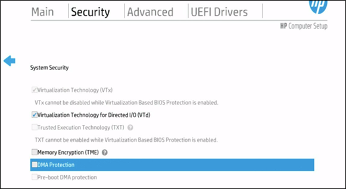
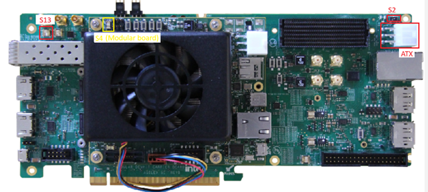

# BKMs for AGX5 Modular Devkit Setup with OFS 2025.1.1

The following instructions are intended to enable users in using an Agilex 5 Modular Development Kit with the OFS 2025.1-1 release. 

## 1.0 Host Machine  Settings

The following BIOS settings will need to be changed to support the Agilex 5 Modular Development Kit on an HP server running ILO 5+. The location of specific settings in the BIOS menu may change depending on the server manufacturer and BIOS revision.

1. BIOS Setting: System Security.

    1.a. Enable Virtualization Technology for Directed I/O (VTd) 




2. BIOS Setting: PCIe Slot Setting (Everything default) 


 

## 2.0 AGX5 E-Series Modular Devkit Installation



### 2.1 Switch Settings

1. Enable the following switch settings for JTAG programming:

#### Table 1: SW for Jtag Programming

    |Switch|Position|Description|
    |----|----|----|
    |SW2|POS-3|POS-3 - Enable ATX 12V input for system power \n POS-1 - for PCIe EF 12V input for system power|
    |SW4|OFF|ON - Enables PCIe JTAG mode \n OFF - Enables onboard UBII mode|
    |SW4.1|ON|ON - MSEL 1 Low \n OFF - MSEL 1 High \n\n **Note:** If you want to control the configuration over BTS, set this switch to OFF|
    |SW4.2|ON|ON - MSEL 2 Low \n OFF - MSEL 2 High \n\n **Note:** If you want to control the configuration over BTS, set this switch to OFF|

2. Connect the devkit to host machine via PCIe Gen3 (or higher) slot.

3. Connect the devkit to ATX power supply between it and the host.


## 3.0 How to Program the FIM USING JTAG


1. Download the OFS 2025.1-1 FIM from https://github.com/OFS/ofs-agx5-pcie-attach/releases/download/ofs-2025.1-1/. 
2. If you haven't already, add the Quartus Programmer binaries to PATH. 

    ```bash session
    export PATH="$PATH:"/<quartus_install_path>/intelFPGA_pro/<quartus version>/qprogrammer/quartus/bin 
    ```

3. List FPGA connected via JTAG. 

    ```bash session
    jtagconfig 
    ```
    
    

4. Program the FIM  onto FPGA. (Note the device_number from `jtagconfig`).  

    ```bash session
    quartus_pgm -c 1 -m jtag -o "p;/<path_to_image>/eseries-mdk-images_ofs-2025-1-1/ofs_top.sof@1" 
    ```

5. Reboot. 

    ```bash session
    sudo reboot 
    ```

6. After programming FIM and reboot, the host machine should be able to detect the new FPGA via its PCIe connection. 

    ```bash session
    lspci | grep acc 
    ```

    

    In this case, the PCI-address of AGX5E Modular Devkit is 5e:00.0 