# oneAPI Accelerator Support Package(ASP) Reference Manual: Open FPGA Stack

## **1.0 Overview**

### **1.1 About this Document**

This document serves as a reference manual for platform designers wanting to enable [oneAPI](https://www.intel.com/content/www/us/en/developer/tools/oneapi/base-toolkit.html#gs.jxodgk) support on their Open FPGA Stack(OFS) platforms. The document describes essential hardware and software components required for enabling this design flow using OFS.

Please use table below as a quick reference for the contents in this document.

**Table 1-1: Document Overview**

| Concept | Description | Sections |
|---------|---------|---------|
| Overview, Prerequisites | Covers the flow of the document, important terms and prerequisite knowledge for this manual | * [1.0 Overview](#10-overview)   * [1.1 About this Document](#11-about-this-document)   * [1.2 Terminology](#12-terminology)   * [1.3 Prerequisites](#13-prerequisites) |
| Introduction to the oneAPI FPGA Acceleration Flow using Open FPGA Stack | Covers the introduction to accelerating oneAPI applications on an FPGA platform design using Open FPGA Stack. This gives an overview of the complete stack consisting of the oneAPI application and explains the high level tool . it also covers an introduction to what the oneAPI Accelerator Support Package | [1.4 Introduction to oneAPI on Open FPGA Stack(OFS)](#14-introduction-to-oneapi-on-open-fpga-stackofs)   * [1.5 Introduction to oneAPI Accelerator Support Package(ASP)](#15-introduction-to-oneapi-accelerator-support-packageasp) |
| oneAPI Accelerator Support Package Design Fundamentals | This covers the information on design elements required to ensure the FPGA hardware design is functional with the oneAPI base toolkit. It covers both the components required in hardware design as well as in the software layer that oneAPI runtime requires | * [2.0 XML Files in oneAPI ASP](#20-xml-files-in-oneapi-asp)   * [2.1 board_spec.xml File](#21-board_specxml-file)   * 2.2 [board_env.xml File](#22-board_envxml-file)   * [3.0 oneAPI ASP Hardware](#30-oneapi-asp-hardware)   * [3.1 Host to External Memory Interface(EMIF)](#31-host-to-external-memory-interfaceemif)   * [3.2 Host to Kernel Interface](#32-host-to-kernel-interface)   * [3.3 Kernel to External Memory Interface](#33-kernel-to-external-memory-interface)   * [4.0 oneAPI ASP Software](#40-oneapi-asp-software)   * [4.1 Memory Mapped Device(MMD) Layer](#41-memory-mapped-devicemmd-layer)   * [4.2 Board Utilities](#42-board-utilities) |
| oneAPI ASP Implementation on OFS Reference Platforms | Provides detailed explanation of the oneAPI ASP design for OFS reference platforms. These sections cover information about the harware as well as software design files in the [`oneapi-asp` repository](https://github.com/OFS/oneapi-asp) | * [5.0 oneapi-asp Implementation Details](#50-oneapi-asp-implementation-details)   * [5.1 oneapi-asp Directory Structure](#51-oneapi-asp-directory-structure)   * [5.2 oneapi-asp Build Flow](#52-oneapi-asp-build-flow)   * [5.3 oneapi-asp Hardware Implementation](#53-oneapi-asp-hardware-implementation)   * [5.4 oneapi-asp Memory Mapped Device(MMD) Layer Implementation](#54-oneapi-asp-memory-mapped-devicemmd-layer-implementation)   * [5.5 oneapi-asp Utilities Implementation](#55-oneapi-asp-utilities-implementation) |
| Appendix | This currently has information about additional features provided in the [`oneapi-asp` repository](https://github.com/OFS/oneapi-asp). Appendix A covers debug capabilities in the MMD. Appendix B has information about a new functionality added in the `oneapi-asp` tag ofs-2024.2-1 called `oneAPI ASP Editor`, enabling a GUI based approach to design oneAPI ASPs | * [Appendix A: Memory Mapped Device(MMD) Layer Debug Variables](#appendix-a-memory-mapped-devicemmd-layer-debug-variables)   * [Appendix B: oneAPI Accelerator Support Package(ASP) Editor](#appendix-b-oneapi-accelerator-support-packageasp-editor) |

> **Note:** Table 1-1 in [oneAPI Accelerator Support Package (ASP): Getting Started User Guide] lists OFS reference platforms.

For more information about developing application kernels for FPGA using oneAPI Base Toolkit (Base Kit) refer to [Intel® FPGA Add-on for oneAPI Base Toolkit](https://www.intel.com/content/www/us/en/developer/tools/oneapi/fpga.html#gs.jxoidi) webpage.

### **1.2 Terminology**

This table defines some of the common terms used when discussing OFS. 

**Table 1-2: Terminology**

| Term  | Abbreviation | Description |
|---------|---------|---------|
| Open FPGA Stack | OFS | A modular collection of hardware platform components, open source software, and broad ecosystem support that provides a standard and scalable model for AFU and software developers to optimize and reuse their designs. |
| Accelerator Functional Unit | AFU |Hardware Accelerator implemented in FPGA logic which offloads a computational operation for an application from the CPU to improve performance. *Note: An AFU region is the part of the design where an AFU may reside.  This AFU may or may not be a partial reconfiguration region.* |
| FPGA Interface Manager | FIM | Provides platform management, functionality, clocks, resets and standard interfaces to host and AFUs.  The FIM resides in the static region of the FPGA and contains the FPGA Management Engine (FME) and I/O ring.|
| High Level Design | HLD | For the purpose of this guide, this term refers to designing with High Level Design tools like oneAPI Base Toolkit (Base Kit). |
| oneAPI Accelerator Support Package | oneAPI ASP | A collection of hardware and software components that enable oneAPI kernel to communicate with oneAPI runtime and other OFS hardware, software components. oneAPI ASP hardware components and oneAPI kernel form the AFU region of a oneAPI system in OFS. |
| Intel® FPGA Basic Building Blocks | BBB | Basic Building Blocks (BBB) for Altera® FPGAs is a suite of application building blocks and shims like Memory Properties Factory (MPF). |
| BBB Memory Properties Factory | BBB MPF | Intel® FPGA BBB MPF block provides features like virtual to physical address (VTP), ordering read responses, read/write hazard detection, and masked (partial) writes. `oneapi-asp` uses MPF VTP feature. |
| Open Programmable Acceleration Engine Software Development Kit | OPAE SDK | A collection of libraries and tools to facilitate the development of software applications and accelerators using OPAE. |
| Platform Interface Manager | PIM | An interface manager that comprises two components: a configurable platform specific interface for board developers and a collection of shims that AFU developers can use to handle clock crossing, response sorting, buffering and different protocols. |
| Device Feature List | DFL | A concept inherited from OFS. The DFL drivers provide support for FPGA devices that are designed to support the Device Feature List. The DFL, which is implemented in RTL, consists of a self-describing data structure in PCI BAR space that allows the DFL driver to automatically load the drivers required for a given FPGA configuration. |
| Best Known Configuration | BKC | The exact hardware configuration that the solution has been optimized and validated against. |
| SYCL | - | [SYCL](https://www.khronos.org/sycl/) (pronounced "sickle") is a royalty-free, cross-platform abstraction layer that enables code for heterogeneous and offload processors to be written using modern ISO C++ (at least C++ 17). It provides several features that make it well-suited for programming heterogeneous systems, allowing the same code to be used for CPUs, GPUs, FPGAs or any other hardware accelerator. SYCL was developed by the Khronos Group, a non-profit organization that develops open standards (including OpenCL™) for graphics, compute, vision, and multimedia. SYCL is being used by a growing number of developers in a variety of industries, including automotive, aerospace, and consumer electronics.|
| Data Parallel C++ | DPC++ | [DPC++](https://www.intel.com/content/www/us/en/developer/tools/oneapi/data-parallel-c-plus-plus.html#gs.5sqn4j) is Intel’s implementation of the SYCL standard. It supports additional attributes and language extensions which ensure DCP++ (SYCL) is efficiently implanted on Intel hardware. |
| Installable Client Driver | ICD | [Intel® FPGA Runtime for OpenCL™ Software Technology](https://github.com/intel/fpga-runtime-for-opencl) supports the OpenCL ICD extension from the Khronos Group™. The OpenCL ICD extension allows you to have multiple OpenCL implementations on your system. With the OpenCL ICD Loader Library, you may choose from a list of installed platforms and execute OpenCL API calls that are specific to your OpenCL implementation of choice. |
| FPGA Client Driver | FCD | [Intel® FPGA Runtime for OpenCL™ Software Technology](https://github.com/intel/fpga-runtime-for-opencl) supports FPGA Client Driver(FCD) extension. FCD allows the runtime to automatically find and load the oneAPI ASP libraries at host run time |

> **Note:** `oneapi-asp` was referred to as `ofs-hld-shim` in OFS (for Agilex™ 7 FPGA & Stratix® 10 FPGA) and OpenCL AFU Shim (`ofs-opencl-afu-shim`) in OFS early access(EA) release (for Stratix® 10 FPGA with Intel® FPGA PAC D5005 as reference platform).

### **1.3 Prerequisites**

The content in this manual requires readers to be familiar with:

* [Hardware and software components of Open FPGA Stack](https://github.com/OFS), especially the following:
  * FPGA Interface Manager(FIM)
    * Stratix® 10 FPGA:
      * [Shell Technical Reference Manual: OFS for Stratix® 10 PCIe Attach FPGAs]
      * [Shell Developer Guide: OFS for Stratix® 10 PCIe Attach FPGAs]
    * Agilex™ 7 FPGA:
      * [Shell Technical Reference Manual: OFS for Agilex™ 7 PCIe Attach FPGAs]
      * [Shell Developer Guide: OFS for Agilex™ 7 PCIe Attach (P-tile, E-tile) FPGAs]
      * [Shell Developer Guide: OFS for Agilex™ 7 PCIe Attach (2xF-tile) FPGAs]
      * [Shell Developer Guide: OFS for Agilex™ 7 PCIe Attach (2xR-tile, F-tile) FPGAs]
  * Accelerator Functional Unit(AFU)
    * Stratix® 10 FPGA: [Workload Developer Guide: OFS for Stratix® 10 PCIe Attach FPGAs]
    * Agilex™ 7 FPGA: [Workload Developer Guide: OFS for Agilex™ 7 PCIe Attach FPGAs]
  * [Software Reference Manual: Open FPGA Stack] (OPAE SDK and Linux-DFL section)
  * [ofs-platform-afu-bbb](https://github.com/OFS/ofs-platform-afu-bbb)

In addition to above, developers must be familiar with the following tools & concepts:

* [Quartus® Prime Design Software](https://www.intel.com/content/www/us/en/support/programmable/support-resources/design-software/user-guides.html) (Quartus® software revisions, Platform Designer, compilation Flows, timing analysis, compilation reports, understanding FPGA resource utilization, programming Altera® FPGAs) 
* [Partial Reconfiguration (PR)](https://www.intel.com/content/www/us/en/software/programmable/quartus-prime/partial-reconfiguration.html)
* FPGA Peripheral IPs (PCIe, External Memory IP, Ethernet IP) 
* [Avalon® Interface](https://www.intel.com/content/www/us/en/docs/programmable/683091/current/introduction-to-the-interface-specifications.html)
* Scripting (TCL, Python, Shell scripts) 
* Verilog, SystemVerilog 
* C++ 
* [Familiarity with SYCL](https://www.intel.com/content/www/us/en/docs/oneapi/programming-guide/current/data-parallelism-in-c-using-sycl.html) 
* Familiarity with [oneAPI compilation process for FPGAs](https://www.intel.com/content/www/us/en/docs/oneapi/programming-guide/current/fpga-flow.html) & [oneAPI code samples](https://github.com/oneapi-src/oneAPI-samples) 
* Familiarity with [oneAPI Accelerator Support Package (ASP): Getting Started User Guide]

### **1.4 Introduction to oneAPI on Open FPGA Stack(OFS)**

The [Intel® oneAPI Base Toolkit (Base Kit)] is a core set of tools and libraries for developing high-performance, data-centric applications across diverse architectures (CPUs, GPUs and FPGAs). It features an industry-leading C++ compiler that implements SYCL, an evolution of C++ for heterogeneous computing.

Figure 1-1 shows the high-level representation of oneAPI application developers using FPGAs for acceleration. The runtime flow consists of a host code running on a processor and an application kernel code running on an FPGA. Open FPGA Stack enables vendors to enable support for this flow on their platforms.

**Figure 1-1: oneAPI Application on OFS Platforms**

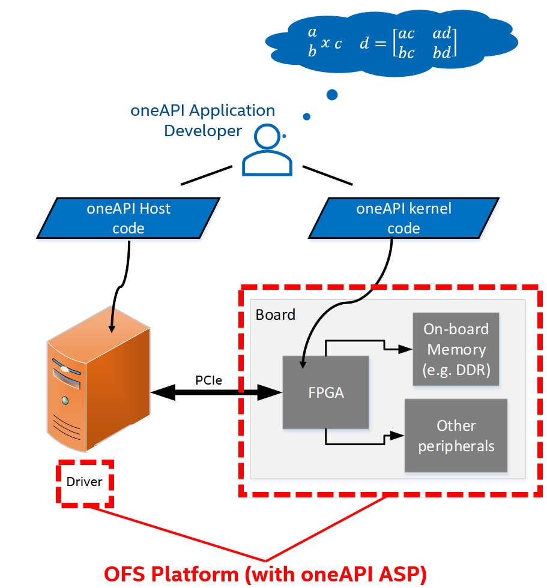

oneAPI Base Toolkit (Base Kit) consists of a compiler and runtime environment. The compiler converts a SYCL kernel (FPGA application code) into a hardware circuit. This hardware circuit requires additional logic to communicate with the runtime and FPGA board peripherals. This additional logic is provided by *oneAPI Accelerator Support Package(oneAPI ASP)*. oneAPI ASP consists of hardware components that enable this generated hardware circuit to communicate with the host processor as well as software components that enable the runtime to identify and communicate with the kernel.

Figure 1-2 shows the workload design steps and steps in which the oneAPI Base Toolkit (Base Kit) requires oneAPI ASP as input. For more information about workload development and how workload developers target a specific platform during compilation, refer to [Intel oneAPI Programming Guide](https://www.intel.com/content/www/us/en/docs/oneapi/programming-guide/current/fpga-flow.html) and [Intel® oneAPI DPC++/C++ Compiler Handbook for Intel® FPGAs]. The next section introduces oneAPI ASP.

**Figure 1-2: High Level Design Flow for FPGAs with oneAPI Base Toolkit (Base Kit)**

### **1.5 Introduction to oneAPI Accelerator Support Package(ASP)**

As mentioned in previous section, oneAPI ASP is a collection of hardware and software components that interface with the hardware circuit generated by the oneAPI compiler. The hardware circuit generated by the oneAPI compiler from a oneAPI kernel is referred to as the `kernel system`. While the `kernel system` consists of logic controlled by the workload developer's specifications, the `kernel system` *interfaces* are generated by the oneAPI compiler based on specifications provided by the oneAPI ASP designer. These specifications are input to the compiler using *XML files* (discussed in section 2.0).

> **Note:** All the interfaces generated by the oneAPI compiler are [Avalon® Interfaces](https://www.intel.com/content/www/us/en/docs/programmable/683091/current/introduction-to-the-interface-specifications.html).

**Figure 1-3: Kernel System Interfaces**

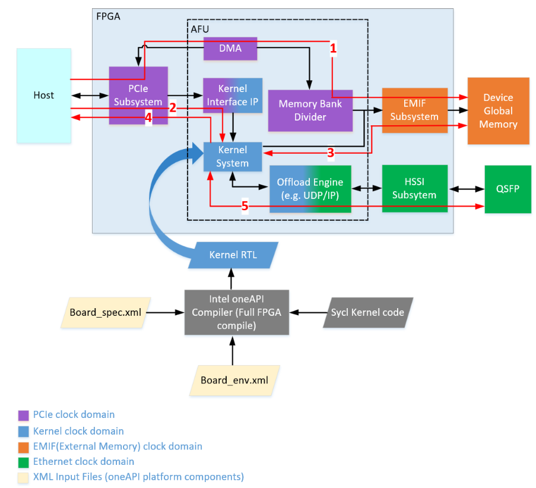

Figure 1-3 shows a high-level representation of an OFS hardware design and interfaces to/from `kernel_system`. The numbered arrows depict the following:

* Path 1 represents host-to-External Memory Interface (EMIF)
* Path 2 represents the host to kernel interface
* Path 3 represents kernel to EMIF
* Path 4 represents kernel to Unified Shared Memory (USM) Interface
* Path 5 represents kernel to HSSI interface

oneAPI ASP hardware components can be divided into 3 categories:

1. RTL components: constituting various interface logic, for example, host to External Memory Interface (EMIF), kernel to EMIF interface, host to kernel interface, kernel to host memory interface as well as additional components to handle kernel control signals and perform Direct Memory Access (DMA)
2. XML files: for describing hardware interfaces and compilation environment to oneAPI Base Toolkit (Base Kit)
3. Scripts: to control compile flow

In addition to the hardware components, a software layer is required for handling I/O operations between oneAPI runtime and the board. The oneAPI ASP software layer can be divided into 2 categories:

1. Memory Mapped Device (MMD) Layer: required by the host & runtime to communicate with the oneAPI kernel & other oneAPI ASP hardware registers
2. oneAPI ASP utilities: required to setup and diagnose the board

The MMD uses API provided by [OPAE SDK](https://github.com/OFS/opae-sdk) to communicate with the device. The FPGA driver is provided by the [linux-DFL](https://github.com/OFS/linux-dfl) kernel driver.

Figure 1-4 shows how the above oneAPI ASP components tie into Open FPGA Stack.

**Figure 1-4: Open FPGA Stack (OFS) components**

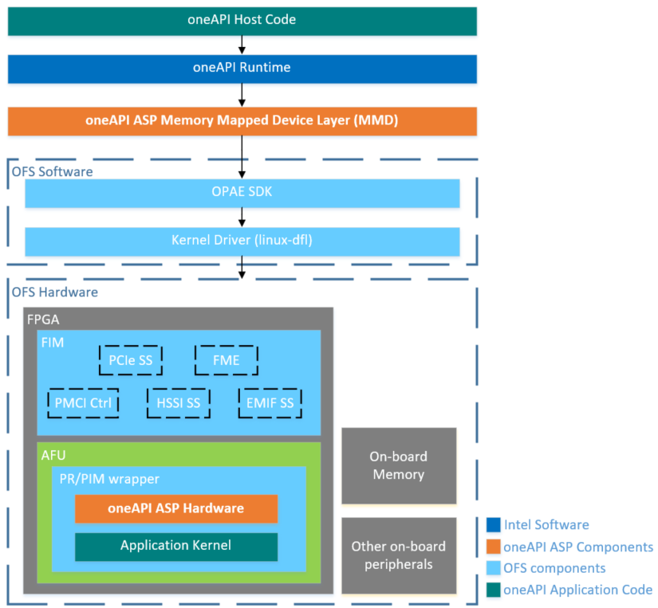

## **2.0 XML Files in oneAPI ASP**

The `kernel system` *interfaces* generated by the oneAPI compiler are based on specifications provided by oneAPI ASP developer. An XML file, called `board_spec.xml` is used to pass the specifications to the oneAPI compiler. oneAPI ASP developers must create this XML file for their boards.

In addition to `board_spec.xml`, the oneAPI Base Toolkit (Base Kit) relies on another XML file called `board_env.xml` to get information about the board environment. The `board_env.xml` file helps the runtime setup board installation.

The next section explains the contents of board_spec.xml. Section 2.2 covers contents of `board_env.xml` file.

### **2.1 `board_spec.xml` File**

A typical board_spec.xml structure is shown in Fig 2-1. In addition to kernel system interfaces, the `board_spec.xml` file is also used to specify other compilation details like Quartus® Prime Pro Edition Software version used in platform design, compilation scripts to help control Quartus® software compile flows, FPGA resource utilization details.

Elements of board_spec.xml file are summarized in table 2-1. Each element has additional attributes and parameters. Details are covered in respective sections for each element.

**Figure 2-1: `board_spec.xml` File Structure**

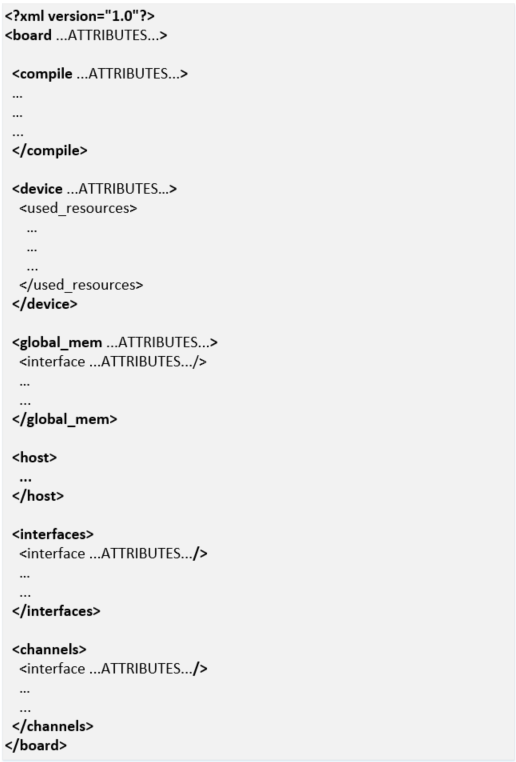

**Table 2-1: Elements of board_spec.xml**

| Element | Use of Element | Attributes |
|---------|---------|---------|
| board | Used to specify a name for the board and the version of Quartus® Prime Pro Edition Software used to develop the platform design. This board name is used to identify the board design to be compiled and must match the name of the directory in which board_spec.xml resides. | version, name |
| compile | Used to describe different compile flows | project, revision, qsys_file, generic_kernel, generate_cmd, synthesize_cmd, auto_migrate |
| device | Used to specify the FPGA device model file for the FPGA part on the board. | device_model, used_resources |
| global_mem | Different attributes in this element are used to provide details about the external memory used as the global memory for the FPGA oneAPI kernel/application. | name, max_bandwidth, interleaved_bytes, config_addr, default, interface |
| host | Used to specify the offset at which the kernel resides. | kernel_config |
| interfaces | Used to specify control signals to oneAPI kernels | interface, kernel_clk_reset |
| channels | Used to describe interface to stream data directly between kernels and I/O | interface |

The compiler expects a separate `board_spec.xml` file for every board variant a platform supports. Board variants are different hardware design implementations for the same platform, a oneAPI ASP can have multiple board variants. A oneAPI kernel developer can select the board variant suitable for their application at compile time.

A `board_spec.xml` file must be located at the top most level of each board variant's hardware directory (the hardware directory is specified by `board_env.xml`, please refer to section 2.2 for details on `hardware` element). For example, a separate `board_spec.xml` file for each board variant for OFS reference platforms is located in `oneapi-asp/Platform-Name/hardware/Board-Variant/` directory, where `Platform-Name` is `n6001`, `fseries-dk`, `iseries-dk` for OFS targeting Agilex™ 7 FPGA and `d5005` for OFS targeting Stratix® 10 FPGA.

#### **2.1.1 board Element**

The board element of the board_spec.xml file provides the Quartus® Prime Pro Edition Software version and the name of the board.

**Table 2-2: Attributes for the `board` Element**

| Attribute | Description |
|---------|---------|
| version | The version of the board. The board version should match the version of the Quartus® Prime Pro Edition Software you use to develop the platform design. The oneAPI compiler uses this value to perform environment checks for supported version during application compile |
| name | The name of the accelerator board, which must match the name of the directory in which the board_spec.xml file resides. The name must contain a combination of only letters, numbers, underscores (_), hyphens (-), or periods (.) (for example, ofs_n6000). |

Example below shows the `board` element populated for a board designed with Quartus® Prime Pro Edition Software version 22.3 and board variant named "Agilex_brd1".

> **Note:** A board variant name is different from a platform directory name. Please see Note in section 2.2 for more information on board variants.

**Figure 2-2: `board` Element**

#### **2.1.2 compile Element**

Depending on the application requirements, the design may have different compilation flows and different design settings for each flow (for example, there can be a flat flow without partial reconfiguration support or a flow with partitions in the design to enable partial reconfiguration). Designers can control the flow and its settings using scripts.
To allow selection of compile flow during application compile & to describe control of Quartus® software compilation as well as registration, automigration, the `compile` element of the board_spec.xml file and its associated attributes and parameters are used.

**Table 2-3: Attributes for `compile` Element**

| Attribute | Description |
|---------|---------|
| name | Name of the compilation flow. This name can be used to differentiate between flows at oneAPI kernel compilation time. oneAPI compiler allows selecting a compile flow using `-Xsbsp-flow` option. |
| project | Name of the Quartus® software project file (.qpf) that the Quartus® Prime Pro Edition Software intends to compile. |
| revision | Name of the revision within the Quartus® software project that the Quartus® Prime Pro Edition Software compiles to generate the final bitstream. |
| qsys_file | Name of the Platform Designer file into which the oneAPI kernel is embedded. You have the option to assign a value of "none" to qsys_file if you do not require the Quartus® Prime Pro Edition Software to create a top-level .qsys file for your design. In this scenario, oneAPI compiler adds a .qip file into the Quartus® software project. In this case, the custom oneAPI ASP must manually instantiate the generated HDL entity (generated entity is in the kernel_system.v file). |
| generic_kernel | Set this value to 1 if you want the offline compiler to generate a common Verilog interface for all compilations. This setting is necessary in situations where you must set up design partitions around the kernel, such as in the Configuration via Protocol (CvP) flow. |
| generate_cmd | Command required to prepare for full compilation, such as to generate the Verilog files for the Platform Designer system into which the oneAPI kernel is embedded. |
| synthesize_cmd | Command required to generate the fpga.bin file from the Custom Platform. Usually, this command instructs the Quartus® Prime Pro Edition Software to perform a full compilation. |
| auto_migrate | *platform_type—Choose this value based on the value referenced in the Reference Platform from which you derive your Custom Platform. Valid values are a10_ref, s10_ref, and none.   *include fixes—Comma-separated list of named fixes that you want to apply to the Custom Platform.   *exclude fixes—Comma-separated list of named fixes that you do not want to apply to the Custom Platform. |

Example below shows a populated `compile` element for a sample Quartus® software Project called ofs.qpf, the Quartus® software revision to be compiled is called asp (asp.qsf). In this example, the compiler generates the kernel system (entity is called kernel_system) and this entity is instantiated manually in the Quartus® software project (e.g. in a file called kernel_wrapper.v), hence `qsys_file` is set to "none". The `synthesize_cmd` points to a script "compile.tcl" located in the same directory as the board_spec.xml, compile script performs all necessary system generation and compile steps for generation of final bitstream. The project directory snippet below is for demonstration only. The compile flow is named "demo_flow".

There can be multiple `compile` elements for the different compilation flows that a platform designer wishes to enable in their platform (e.g. different revisions with different Quartus® software settings or a PR revision).

**Figure 2-3: `compile` Element**

#### **2.1.3 device Element**

A device model(DM) file is an XML file that has the total resources on the device (i.e. ALMs, FFs, DSPs, RAMs). This is required for any FPGA part used in a oneAPI design. Most device model files are provided as part of the oneAPI Base Toolkit (Base Kit) installation (`$INTELFPGAOCLSDKROOT/share/models/dm`, where INTELFPGAOCLSDKROOT is set by the `setvars.sh` environment setup script provided by [oneAPI toolkit](https://www.intel.com/content/www/us/en/docs/oneapi/installation-guide-linux/current/online-offline-installer-004.html)). If the device model file for your part number is not included in `$INTELFPGAOCLSDKROOT/share/models/dm`, it must be created and placed in the same folder as `board_spec.xml`. A new device model file can be created using existing files as reference. 

The device model file name must be specified in the `device_model` attribute of `device` element. The `used_resources` attribute is used to specify the resources being utilized by the oneAPI ASP and peripheral IPs. The utilization by non-kernel logic is calculated during platform design. The compiler utilizes the total resources from device model file and utilized resources in `used_resources` section to estimate the available resources for application kernel.

**Table 2-4: Attributes for `device` Element**

| Attribute | Description |
|---------|---------|
| device_model | The file name of the device model file that describes the available FPGA resources on the accelerator board. |
| used_resources | Reports the number of adaptive logic modules (ALMs), flip-flops, digital signal processor (DSP) blocks and RAM blocks that the board design consumes in the absence of any kernel. If you create a defined partition around all the board logic, you can obtain the used resources data from the Partition Statistics section of the Fitter report. Extract the information from the following parameters:  * alms num — The number of logic ALMs used, excluding the number of ALMs with only their registers used. The value should correspond to [a]+[b]+[d] from part [A] of the Fitter Partition Statistics.  * ffs num — The number of flip flops.  * dsps num — The number of DSP blocks.  * rams num — The number of RAM blocks. |

Example below shows the `device` element added for a Agilex™ 7 FPGA based platform with device model file named "agfb014r24a2e2vr0_dm.xml". The number of used_resources are for demonstration purposes and are not to be used by oneAPI ASP developers.

**Figure 2-4: `device` Element**

#### **2.1.4 interface Attribute**

> **Note:** This is different from the `interfaces` element discussed in upcoming sections.
In the board_spec.xml file, each global memory, channel or kernel connection is comprised of individual interfaces. For the `global_mem`, `channels`, and `interfaces` XML elements, an `interface` attribute must be included to specify the corresponding parameters for each connection.

**Table 2-5: Parameters for `interface` attribute**

| Parameter | Description | Applicable Interface |
|---------|---------|---------|
| name |* For global_mem: instance name of the Platform Designer component. * For channels: instance name of the Platform Designer component that has the channel interface. * For interfaces: name of the entity in which the kernel interface resides (for example, board). | All |
| port | port parameter can be defined either inline in `interface` attribute or as a separate element in `interface` attribute. See section 2.1.4.1 for more information. | All |
| type |* For global_mem: set to agent.  * For channels:  - Set to streamsource for a stream source that provides data to the kernel. - Set to streamsink for a stream sink interface that consumes data from the kernel. * For interfaces: set to either host, irq, or streamsource. | All |
| width |* For global_mem: width of the memory interface in bits. * For channels: number of bits in the channel interface. * For interfaces: width of the kernel interface in bits. | All |
| waitrequest_allowance	|* For global_mem: [Optional] Amount of Avalon®-MM waitrequest allowance supported on the agent interface (that is, kernel-facing interface) of the clock-crossing bridge that spans between the memory and the kernel clock domains. * For kernel_cra: [Optional] Amount of Avalon®-MM waitrequest allowance that the kernel_cra agent interface must support. This parameter defaults to 0 if you do not specify it in the board_spec.xml file. A value of 0 indicates that this waitrequest allowance feature is disabled. | All |
| maxburst | Maximum burst size for the agent interface. Attention: The value of width ÷ 8 x maxburst must be less than the value of interleaved_bytes. | global_mem |
| address | Starting address of the memory interface that corresponds to the host interface-side address. For example, address 0 should correspond to the bank1 memory host from the `Memory Bank Divider`. In addition, any non-zero starting address must abut the end address of the previous memory. | global_mem |
| size | Size of the memory interface in bytes. * For global_mem: The sizes of all memory interfaces should be equal. * For interfaces: interface can have variable sizes. | global_mem interfaces  > **Note:** Support for size parameter for interface attribute is available in oneAPI Base Toolkit (Base Kit) version 2024.0 and beyond. |
| latency_type | If the memory interface has variable latency, set this parameter to average to signify that the specified latency is considered the average case. If the complete kernel-to-memory path has a guaranteed fixed latency, set this parameter to fixed. | global_mem |
| chan_id | A string used to identify the channel interface. The string may have up to 128 characters. | channels |
| clock	| For the streamsource kernel interface type, the parameter specifies the name of the clock that the snoop stream uses. Usually, this clock is the kernel clock. | interfaces |

Example for how the `interface` attribute is used in `global_mem` and `interfaces` elements is covered in section for these elements respectively.

##### **2.1.4.1 port Parameter**

As mentioned in Table 2-5, port parameter can be defined either inline in `interface` attribute or as a separate element in `interface` attribute. The definition method to use depends on the direction of the port. 

* If the direction of the port is either `read` or `write`, it must be a separate element in `interface` attribute. 
* If the direction is `readwrite`, port must be inline with the port name in `interface` attribute. No direction specification is required. 

Table below shows the `port` element attributes.

**Table 2-6: `port` parameter**

| Parameter | Description |
|---------|---------|
| name | * For global_mem: name of the Avalon®-MM interface in the Platform Designer component that corresponds to the interface attribute. * For channels: name of the streaming interface in the Platform Designer component. * For interfaces: name of the interface to the `Kernel Interface` Platform Designer component. For example, kernel_cra is the Avalon®-MM interface, and kernel_irq is an interrupt. |
| direction | Direction of the port. Valid values are:   * "r" : Indicates read   * "w" : Indicates `write` |

Snippet below shows the inline and separate element definitions of `port` parameter.

> **Note:** Direction specification for port is available in oneAPI Base Toolkit (Base Kit) versions 2024.0 and beyond. For versions prior to oneAPI Base Toolkit (Base Kit) version 2024.0, only the default inline definition of port parameter is supported. 

Examples for `global_mem` and `interfaces` elements in sections below use the inline definition of port.  

#### **2.1.5 global_mem Element**

The `global_mem` element of the board_spec.xml file is used to provide information on the memory interfaces that connect to the kernel.

> **Note:** For each global memory that the kernel accesses, you must include one interface element that describes its characteristics.
The different attributes for global_mem element are discussed in table below.

**Table 2-7: Attributes for `global_mem` Element**

| Attribute | Description |
|---------|---------|
| name | The name FPGA application/kernel developer should use to identify the memory type. Each name must be unique and must comprise of less than 32 characters. |
| max_bandwidth | The maximum bandwidth, in megabytes per second (MB/s), of all global memory interfaces combined in their current configuration. The oneAPI compiler uses max_bandwidth to choose an architecture suitable for the application and the board.   Compute this bandwidth value from datasheets of memories on your board.   Example max_bandwidth calculation for a 64-bit DDR4 interface running at 1200 MHz:   max_bandwidth = 1200 MHz x 2 x 64 bits ÷ 8-bits = 19200 MB/s   The max_bandwidth value will change based on global memory configuration, for example, if the memory configuration comprises of 4 banks of DDR4 configured as a single homogenous memory, the max_bandwidth will be 19200 x 4 (i.e. number of memory interfaces from kernel). Please see section 2.1.5.1 for more information on global memory configurations.   Designers have the option to use block RAM instead of or in conjunction with external memory as global memory. The formula for calculating max_bandwidth for block RAM is max_bandwidth = block RAM speed x (block RAM interface size ÷ 8 bits).   Example max_bandwidth calculation for a 512-bit block RAM running at 100 MHz:   max_bandwidth = 100 MHz x 512 bits ÷ 8 bits = 6400 MB/s |
| interleaved_bytes | Include the interleaved_bytes attribute in the board_spec.xml file when you instantiate multiple interfaces(i.e. memory banks) for a given global memory system. This attribute controls the size of data that the offline compiler distributes across the interfaces.   The offline compiler currently can interleave data across banks no finer than the size of one full burst. This attribute specifies this size in bytes and following are the recommended values:   For two or fewer global memory banks: maxburst x width_bytes   For four or more global memory banks: maxburst x width_bytes x 4   The interleaved_bytes value must be the same for the host interface and the kernels. Therefore, the configuration of the `Memory Bank Divider` must match the exported kernel agent interfaces in this respect (refer to section 3.1.1 for information about `Memory Bank Divider`)   For block RAM, interleaved_bytes equals the width of the interface in bytes. |
| config_addr | The address of the ACL Mem Organization Control Platform Designer component (mem_org_mode) that the host software uses to configure memory. You may omit this attribute if your board has homogeneous memory; the software uses the default address (0x18) for this component. If your board has heterogeneous memory, there is a mem_org_mode component in the board system for each memory type.   Enter the config_addr attribute and set it to the value of the base address of the mem_org_mode component(s). |
| default | Include this optional attribute and assign a value of 1 to set the global memory as the default memory interface. The default memory must start at address 0x0.   If you do not implement this attribute, the first memory type defined in the board_spec.xml file becomes the default memory interface. |
| interface | See the `interface` section above for the parameters you must specify for each interface. |
| allocation_type | A list that specifies which USM allocator is used to allocate from the global_mem element. Values allowed in this list are `host`, `shared`, and `device`. The following conditions apply:   If there are multiple global_mem elements with the same allocation_type attribute, the first allocation_type attribute in the board_spec.xml is assumed to be the one used by the specified allocator.   If there is a single global_mem element with multiple allocation_type attributes, this indicates that allocations of the specified types use this global_mem interface.   [Legacy support] If you have not specified the allocation_type attribute, it is assumed that all global memory interfaces have the `device` allocation_type. |

Example below shows a `global_mem` element configuration for a kernel system connected to four 4GB DDR4 memory banks. The DDR4 interface is 64 bit operating at 1200MHz. Note that the name of the platform designer system name is `board.qsys`. As mentioned in description for `interleaved_bytes` in table above, the `Memory Bank Divider` configuration ensures that the host interface matches the interleaved_bytes setting (i.e. 512 bits x 64 burst size = 4096 bytes). For information on `waitrequest_allowance`, refer to section 2.1.4 on `interface` attribute.

> **Note:** More details on the `Memory Bank Divider` and the Clock Crossing Bridges is covered in section 3.0

**Figure 2-6: Memory Connection Example Block Diagram and Corresponding `global_mem` Element in `board_spec.xml`**

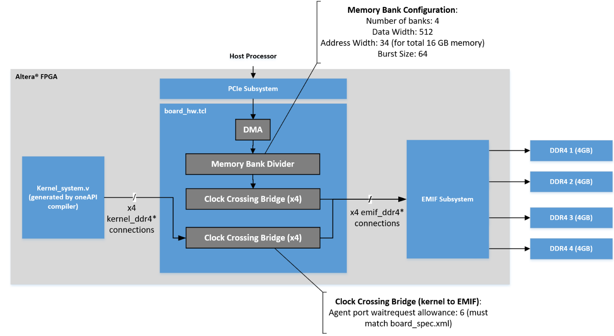

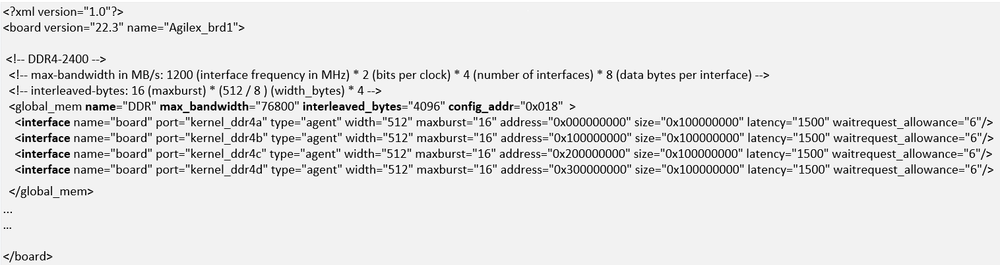

##### **2.1.5.1 Global Memory Configurations**

A board can have a single memory bank, multiple memory banks of the same type (e.g. 4 banks of DDR4) or different banks of different types.

The partitioning of memory for oneAPI kernel developers is explained in the [Intel® oneAPI DPC++/C++ Compiler Handbook for Intel® FPGAs](https://www.intel.com/content/www/us/en/docs/oneapi-fpga-add-on/developer-guide/current/global-memory-accesses-optimization.html). The global memory configuration required by an application kernel must match the configuration in board_spec.xml as the compiler uses this information to generate a suitable architecture for the application.
The different memory configurations are

* A single global memory region (possible with same type of memory banks)
* Different global memories (heterogeneous memory)

###### **2.1.5.1.1 Contiguous Global Memory**

For boards with multiple memory banks of the same type, designers can configure these as a single contiguous global memory region. This is done by specifying each memory interface within a single global_mem element.
Figure 2-6 showed 4 DDR4 memory banks configured as a single global memory region.

With this configuration, FPGA application developers have the option to use contiguous memory region in an interleaved or a non-interleaved fashion. Even with contiguous memory regions, kernel developers can partition data buffers across the banks/memory channels. Please refer to [Global Memory Access Optimization section in Intel® oneAPI DPC++/C++ Compiler Handbook for Intel® FPGAs](https://www.intel.com/content/www/us/en/docs/oneapi-fpga-add-on/developer-guide/current/global-memory-accesses-optimization.html) for more details on these partitioning techniques.

###### **2.1.5.1.2 Heterogeneous Memory**

For boards with different memory technologies, designers must specify each type of memory that the kernel needs to access as a separate global memory.

Figure 2-7 shows heterogeneous configurations and the `global_mem` element structure for two different types of memories (QDR, DDR4). The `global_mem` element in example below also demonstrates use of the `default` attribute. It is set to "1" for the DDR4 memory banks, indicating to the oneAPI compiler that the default global memory for the kernel is DDR4.

**Figure 2-7: Heterogeneous Memory Example Block Diagram and Corresponding `global_mem` Element in `board_spec.xml`**

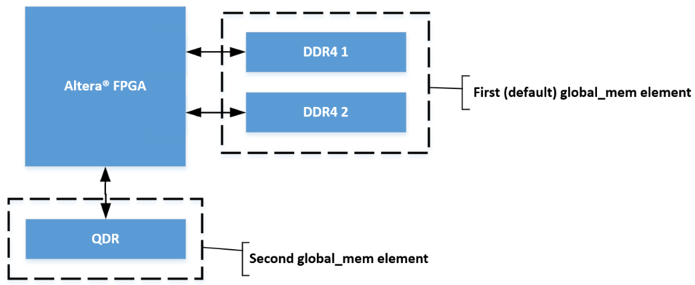

###### **2.1.5.1.3 Unified Shared Memory**

For applications that require [USM](https://link.springer.com/chapter/10.1007/978-1-4842-5574-2_6) support, the board_spec.xml must specify host and device memories in a heterogeneous manner.
The `allocation_type` must be `host` for global memory region on the host processor. The `allocation_type` must be set to `device` for global memory on the FPGA board.
Example below extends the board_spec.xml snippet in figure 2-6 to add a `global_mem` element for the kernel system to host processor memory interface.

**Figure 2-8: `global_mem` Element Example for Unified Shared Memory(USM)**

#### **2.1.6 host Element**

The host element of the board_spec.xml file provides information on the interface from the host to the kernel. Figure below shows an example of host element.

**Figure 2-9: `host` Element Example**

**Table 2-8: Attributes for the `host` Element**

| Attribute | Description |
|---------|---------|
| kernel_config | This attribute informs the oneAPI compiler at what offset the kernel resides, from the perspective of the `kernel_cra` host on the kernel_interface module. * start: the starting address of the kernel. Normally, this attribute has a value of 0 because the kernel_cra host should not host anything except kernels. * size: keep this parameter at the default value of 0x0100000. |

#### **2.1.7 interfaces Element**

The `interfaces` element of the board_spec.xml file describes the kernel interfaces that connect to application kernels and control kernel behavior. For this element, include one of each interface of types host, irq and streamsource. Refer to the `interface` section for the parameters you must specify for each interface.
In addition to the host, irq, and streamsource interfaces, if your design includes a separate Platform Designer subsystem containing the board logic, the kernel clock and reset interfaces exported from it are also part of the interfaces element. Specify these interfaces with the `kernel_clk_reset` attribute and its corresponding parameters.

Figure below shows example of `interfaces` element.

**Figure 2-10: `interfaces` Element Example**

**Table 2-9:  Parameters for the `kernel_clk_reset` Attribute**

| Attribute | Description |
|---------|---------|
| clk | The Platform Designer name for the kernel clock interface |
| clk2x | The Platform Designer name for the 2xkernel clock interface |
| reset | The Platform Designer connection for the kernel reset |

> **Note:** Name the kernel clock and reset interfaces in the Platform Designer connection format (that is, <instance_name>.<interface_name>). For example: board.kernel_clk

#### **2.1.8 channels Element**

The `channels` element provides channels for streaming data directly between kernel and I/O. Each channel (implemented using Avalon-ST specification) must be connected to the kernel via the `interface` attribute. The channel interface only supports data, and valid and ready Avalon-ST signals. The I/O channel defaults to 8-bit symbols and big-endian ordering at the interface level.

Figure below shows an example of `channels` element for a single channel with a width of 64 bits. The `chan_id` attribute identified helps identify the port in the generated `kernel_system`. Refer to [section 2.1.4](#214-interface-attribute) for more information about the `interface` attribute parameters. Additional interface attributes can be added for additional channels. 

**Figure 2-11: `channels` Element Example**

For more information about kernel development using channels, refer to *I/O Pipes* section in [Intel® oneAPI DPC++/C++ Compiler Handbook for Intel® FPGAs](https://www.intel.com/content/www/us/en/docs/oneapi-fpga-add-on/developer-guide/current/i-o-pipes.html).

### **2.2 `board_env.xml` File**

The `board_env.xml` file is used by the oneAPI toolkit to set up the board installation that enables the compiler to target a specific accelerator platform. The board_env.xml file must be located in the top most level of the oneAPI ASP for each platform. For example, the `board_env.xml` for oneAPI ASP for OFS reference platforms is located in the `oneapi-asp/Platform-Name` folder, where `Platform-Name` is `n6001`, `fseries-dk`, `iseries-dk` for OFS targeting Agilex™ 7 FPGA and `d5005` for OFS targeting Stratix® 10 FPGA.

A sample board_env.xml file is shown below. Table 2-10 explains the elements of this file.

**Figure 2-12: `board_env.xml` File Structure**

**Table 2-10:  Specifications of XML Elements and Attributes in the `board_env.xml` File**

| Element | Attribute Description |
|---------|---------|
| board_env | * version: The oneAPI compiler version used to create oneAPI ASP * name: The runtime uses this as the name of the FPGA Client Driver(FCD) file name |
| hardware | * dir: Name of the subdirectory, within the oneAPI ASP directory, that contains the board variant directories for a platform  * default: The default board variant that the compiler targets when a platform has multiple board variants and user does not specify an explicit argument using [-Xstarget option](https://www.intel.com/content/www/us/en/docs/oneapi-fpga-add-on/developer-guide/current/fpga-compilation-flags.html) |
| platform | name: Name of the operating system. A separate `platform` element must be specified for each supported OS for the oneAPI ASP platform |
| mmdlib | A string that specifies the path to the MMD library of your oneAPI ASP. To load multiple libraries, specify them in an ordered, comma-separated list. The host application will load the libraries in the order that they appear in the list > **Note:** You can use `%b` to reference your oneAPI ASP directory and provide path relative to oneAPI ASP directory, for example, if MMD library is located inside `linux64/lib` folder in oneAPI ASP, the path would be `%b/linux64/lib/libintel_opae_mmd.so`  |
| linkflags | A string that specifies the linker flags necessary for linking with the MMD layer available with the board > **Note:** You can use %b to reference your oneAPI ASP directory and provide path relative to oneAPI ASP directory, for example, if MMD library is located inside `linux64/lib` folder in oneAPI ASP, the path would be `%b/linux64/lib`. |
| linklibs | A string that specifies the libraries the oneAPI runtime must link against to use the MMD layer available with the board |
| utilbindir | Directory in which the runtime expects to locate board utility executables (i.e. install, uninstall, program, diagnose, flash)  > **Note:** You can use %b to reference your oneAPI ASP directory and provide path relative to oneAPI ASP directory, for example, if the utilities are located in `linux64/libexec` folder in oneAPI ASP, the path would be `%b/linux64/libexec` |

## **3.0 oneAPI ASP Hardware**

The oneAPI compiler generates the `kernel system` interfaces based on specifications provided by the oneAPI ASP developer in the `board_spec.xml` file. The `kernel system` interfaces with the rest of the oneAPI ASP RTL as shown in figure 1-3.

Figure 1-3 shows 5 different paths, summarized below:

* Host to EMIF: Consisting of RTL to handle data transfer between host and on-board memory (e.g. DDR4)
* Host to Kernel: Consisting of RTL to handle control signals & interrupts between host and kernel
* Kernel to EMIF: Consisting of RTL to handle data transfer between kernel and on-board memory
* Kernel to Host memory: Required to support Unified Shared Memory. This requires some additional RTL to handle data transfer between kernel and host memory
* Kernel to HSSI: Consisting of RTL to handle data streaming between kernel and I/O

Please note that the `kernel system` generated by oneAPI compiler has Avalon® interfaces. OFS FIM has AXI interfaces. Additional logic blocks from Platform Interface Manager are used to handle protocol conversions. Please refer to section 5.3.1 for more details on PIM.
The next few sections cover some of the important IP components  required to enable kernel communications with host and board peripherals. More design implementation details are covered in section 5.0.

### **3.1 Host to External Memory Interface(EMIF)**

The host to EMIF datapath consists of a PCIe Subsytem(SS), EMIF Subsystem located in the FIM and a Direct Memory Access(DMA) engine in the oneAPI ASP.

PCIe Subsystem(SS) has the PCIe IP and additional logic to handle PCIe packet format and routing. FIM handles routing signals received from host to the user design located in a region referred to as Accelerator Functional Unit(AFU) (the `Kernel system` resides in the AFU).

> **Note:** For more information about the PCIe SS, please refer to [Intel FPGA IP Subsystem for PCI Express IP User Guide]

The External Memory Interface Subsystem (EMIF SS) consists of EMIF IP and additional logic for handling transfers between AFU and on-board memories.

> **Note:** For more information about the EMIF SS, please refer to [Memory Subsystem Intel FPGA IP User Guide](https://www.intel.com/content/www/us/en/secure/content-details/686148/memory-subsystem-intel-fpga-ip-user-guide-for-intel-agilex-ofs.html?wapkw=686148&DocID=686148)

Large buffers of data are usually transferred between host and on-board memory in oneAPI applications. This necessitates a Direct Memory Access(DMA) Engine between host and on-board memory. In oneAPI ASP designs for OFS reference platform, this DMA engine is placed in the AFU region. 

As described in section 2.1.5.1, there are different configurations for memories on board. In addition to above, figure 1-3 also shows an additional IP in the host to memory datapath, called *Memory Bank Divider*. This IP is used for handling one of the most commonly used configurations, i.e. configuring multiple memory banks of same type as a contiguous memory region. In this case, the kernel has a contiguous view of the memory and data can be interleaved across the different memory channels. The host must also have the same view of the memory in order to ensure read and write transactions from correct addresses.

#### **3.1.1 Memory Bank Divider**

The Memory Bank Divider is a oneAPI ASP IP component that takes an incoming request from the host interface on the Avalon®-MM agent port and routes it to the appropriate bank host port. This component must reside on the path between the host and the global memory interfaces. In addition, it must reside outside of the path between the kernel and the global memory interfaces.

The following image shows the IP interfaces. Table 3-2 provides more information on the interface signals. 

**Figure 3-1: Memory Bank Divider IP**

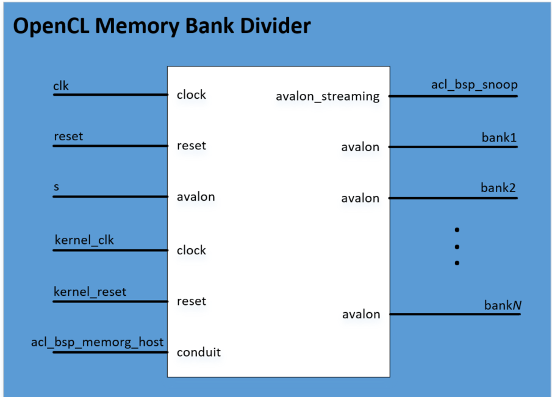

This IP is currently made available as part of the `oneapi-asp` located in `oneapi-asp/common/hardware/common/build/ip` folder (`memory_bank_divider_hw.tcl`). The IP can be instantiated in a top level system by passing values to the parameters as shown in snippet below. Table 3-1 provides more information on the parameters. The oneAPI ASP for OFS reference platforms instantiates this IP in a similar way. Refer to section 5.0 for more information on implementation details for oneAPI ASP for OFS reference platforms.

<pre>
    add_instance memory_bank_divider memory_bank_divider &ltversion&gt
    set_instance_parameter_value memory_bank_divider {NUM_BANKS} {number-of-memory-banks}
    set_instance_parameter_value memory_bank_divider {SEPARATE_RW_PORTS} {true/false-value}
    set_instance_parameter_value memory_bank_divider {PIPELINE_OUTPUTS} {true/false-value}
    set_instance_parameter_value memory_bank_divider {SPLIT_ON_BURSTBOUNDARY} {true/false-value}
    set_instance_parameter_value memory_bank_divider {DATA_WIDTH} {data-width}
    set_instance_parameter_value memory_bank_divider {ADDRESS_WIDTH} {total-addressable-width}
    set_instance_parameter_value memory_bank_divider {BURST_SIZE} {burst-size}
    set_instance_parameter_value memory_bank_divider {MAX_PENDING_READS} {max-pending-reads}
    set_instance_parameter_value memory_bank_divider {ASYNC_RESET} {value}
    set_instance_parameter_value memory_bank_divider {SYNCHRONIZE_RESET} {value}
</pre>

**Table 3-1: Parameter Settings for the Memory Bank Divider Component**

| Parameter Name in IP TCL | Parameter | Description |
|---------|---------|---------|
| NUM_BANKS | Number of banks | Number of memory banks for each of the global memory types included in your board system. A single memory bank divider has the following allowed values: 1,2,4,8 for this parameter. |
| SEPARATE_RW_PORTS | Separate read/write ports	| Enable this parameter so that each bank has one port for read operation and one for write operation. |
| PIPELINE_OUTPUTS | Add pipeline stage to output | Enable this parameter to allow for potential timing improvements. |
| DATA_WIDTH | Data Width | Width of the data bus to the memory in bits. |
| ADDRESS_WIDTH | Address Width (total addressable) | Total number of address bits necessary to address all global memory. |
| BURST_SIZE | Burst size (maximum) | Set to a value equal to interleaved_bytes/(width/8), where interleaved_bytes and width are defined in the interface attribute of the global_mem element in the `board_spec.xml` file. |
| MAX_PENDING_READS| Maximum Pending Reads	| Maximum number of pending read transfers the component can process without asserting a waitrequest signal. Recommended value is 64 if ASP has two global memory banks or fewer and 128 if ASP has four or more global memory banks.   CAUTION: A high Maximum Pending Reads value causes Platform Designer to insert a deep response FIFO buffer, between the component's host and agent, that consumes a lot of device resources. It also increases the achievable bandwidth between host and memory interfaces. |
| SPLIT_ON_BURSTBOUNDARY | Split read/write bursts on burst word boundary | Enable splitting of read and write bursts on burst word boundary.   Enable this parameter if the Number of banks parameter value is greater than 1, and the burst reads and writes that the host controller sends to the agent port crosses burst word boundary. |

**Table 3-2: Signals and Ports for the Memory Bank Divider Component**

| Signal or Port | Description |
|---------|---------|
| clk | The bank divider logic uses this clock input. If the IP of your host and memory interfaces have different clocks, ensure that clk clock rate is not slower than the slowest of the two IP clocks. |
| reset | The reset input that connects to the board power-on reset. |
| s	| The agent port that connects to the host interface controller. |
| kernel_clk | The kernel_clk drives this clock input  |
| kernel_reset | The kernel_reset output from the `Kernel Interface` IP drives this reset input. |
| acl_asp_snoop | Export this Avalon® Streaming (Avalon®-ST) source. In the board_spec.xml file, under interfaces, describe only the snoop interface for the default memory (acl_internal_snoop). If you have a heterogeneous memory design, perform these tasks only for the `Memory Bank Divider` component associated with the  default memory.  **Important:** The memory system you build in HW tcl (e.g. `ddr_board_hw.tcl` in oneapi-asp for OFS reference platforms. Refer to section 5 for more details on `ddr_board_hw.tcl`) alters the width of acl_asp_snoop. You must update the width of the streamsource interface within the channels element in the `board_spec.xml` file to match the width of acl_asp_snoop.  In the `board_spec.xml` file, update the width of the snoop interface (acl_internal_snoop) specified with the streamsource kernel interface within the interfaces element. Updating the width ensures that the global_mem interface entries in `board_spec.xml` match the characteristics of the bank`N` Avalon®-MM hosts from corresponding `Memory Bank Divider` component for the default memory. |
| acl_asp_memorg_host | This conduit connects to the acl_asp_memorg_host interface of the `Kernel Interface` IP. > **Note:** Signal present if Number of banks > 1. |
| bank1, bank2, ..., bank8 | The number of memory hosts available in the `Memory Bank Divider` depends on the number of memory banks that were included when the unit was instantiated. Connect each bank with each memory interface in the same order as the starting address for the corresponding kernel memory interface specified in the board_spec.xml file.   For example, global_mem interface that begins at address 0 must correspond to the memory host in bank1 from the `Memory Bank Divider`. |

### **3.2 Host to Kernel Interface**

The host exchanges control signals with kernel with the help of an additional oneAPI ASP IP . The control signals coming from the host are on a different clock domain (PCIe clock) while the kernel runs on different clock frequency . The *Kernel Interface* IP handles the clock domain crossing for these control signals as well as handles communication with kernel CSR, interrupts and generates the reset for oneAPI kernel.
All oneAPI ASP designs must instantiate *Kernel Interface* IPs to ensure the kernel functions correctly.

#### **3.2.1 Kernel Interface**

The Kernel Interface is an oneAPI ASP component that allows the host interface to access and control the oneAPI kernel. 

The following image shows the IP interfaces. Table 3-4 provides more information on the interface signals.

**Figure 3-2: Kernel Interface IP**

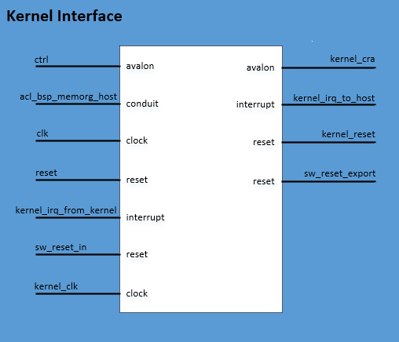

This IP is currently made available as part of the `oneapi-asp` located in `oneapi-asp/common/hardware/common/build/ip` folder (`kernel_interface_hw.tcl`). The IP can be instantiated in a top level system by passing values to the parameters as shown in snippet below. Table 3-3 provides more information on the parameter. The oneAPI ASP for OFS reference platforms instantiates this IP in a similar way. Refer to section 5.0 for more information on implementation details for oneAPI ASP for OFS reference platforms.

<pre>
    add_instance kernel_interface kernel_interface &ltversion&gt
    set_instance_parameter_value kernel_interface {NUM_GLOBAL_MEMS} {value}
</pre>

**Table 3-3: Parameter Settings for the Kernel Interface Component**

| Parameter Name in IP TCL | Parameter | Description |
|---------|---------|---------|
| NUM_GLOBAL_MEMS | Number of global memory systems | Number of global memory types in your board design. |

**Table 3-4: Signals and Ports for the Kernel Interface Component**

|Signal or Port | Description |
|---------|---------|
| clk | The clock input used for the host control interface. The clock rate of clk can be slow. |
| reset | This reset input resets the control interface. It also triggers the kernel_reset signal, which resets all kernel logic. |
| ctrl | Use this agent port to connect to the host interface. This interface is a low-speed interface with which you set kernel arguments and start the kernel's execution. |
| kernel_clk | kernel clock drives this clock input. |
| kernel_cra | This Avalon®-MM host interface communicates directly with the kernels generated by the oneAPI compiler. Export the Avalon®-MM interface to the Kernel Interface and name it in the board_spec.xml file. |
| sw_reset_in | When necessary, the host interface resets the kernel via the ctrl interface. If the board design requires a kernel reset, it can do so via this reset input. Otherwise, connect the interface to a global power-on reset. |
| kernel_reset | Use this reset output to reset the kernel and any other hardware that communicates with the kernel.   Warning: This reset occurs between the MMD open and close calls. Therefore, it must not reset anything necessary for the operation of your MMD. |
| sw_reset_export | This reset output is the same as kernel_reset, but it is synchronized to the clk interface. Use this output to reset logic that is not in the kernel_clk clock domain but should be reset whenever the kernel resets. |
| acl_asp_memorg_host | The memory interfaces use these signals.   Based on the number of global memory systems you specify in the `Kernel Interface` component parameter editor, the Quartus® Prime Pro Edition Software creates the corresponding number of copies of this signal, each with a different hexadecimal suffix. Connect each signal to the `Memory Bank Divider` component associated with each global memory system (for example, DDR). Then, list the hexadecimal suffix in the config_addr attribute of the global_mem element in the board_spec.xml file. |
| kernel_irq_from_kernel | An interrupt input from the kernel. This signal is exported and named in the board_spec.xml file. |
| kernel_irq_to_host | An interrupt output from the kernel. This signal connects to the host interface. |

### **3.3 Kernel to External Memory Interface**

The kernel system masters the interface from kernel to external memory. oneAPI compiler generates kernel system memory interface logic (e.g. Load-Store Unit) according to the global memory configuration and `interface` specifications in `board_spec.xml` file.
The kernel system operates at kernel clock, hence, oneAPI ASP developers must handle clock domain crossing from kernel to EMIF clock domain.

For implementation details for all datapaths discussed above, please refer to section 5.3.

## **4.0 oneAPI ASP Software**

The software components of oneAPI ASP consist of the Memory Mapped Device(MMD) layer and the board utility routine required by runtime.

Section 4.1 introduces MMD layer and section 4.2 explains board utilities.

### **4.1 Memory Mapped Device(MMD) Layer**

The oneAPI ASP Memory Mapped Device (MMD) layer sits in between the oneAPI runtime and OPAE SDK and provides a set of API for device communication and control. The runtime calls into the MMD API for various operations like opening a handle to the device, allocating memory etc.

> **Note:** For more information about the FPGA runtime, please refer to FPGA Runtime documentation [here](https://github.com/intel/fpga-runtime-for-opencl/tree/main/docs).

A header file, called `aocl_mmd.h`, has the list of MMD API calls that must be implemented by oneAPI ASPs. From the perspective of the caller, below is typical MMD API lifecycle:

1. Open device to provide handle for further operations
2. Set interrupt and status handlers
3. Program device with kernel bitstream
4. Allocate memory if required
5. Perform Read, Write operations (DMA or MMIO)
6. Free memory if allocation done in step 4
7. Close device. No further operations permitted until subsequent open device call

Table below summarizes all APIs listed in `aocl_mmd.h`.  

**Table 4-1: Summary of MMD API from `aocl_mmd.h`**

| API | Purpose |
|---------|---------|
| aocl_mmd_get_offline_info | Obtain offline information about the board. This function is offline because it is device-independent and does not require a handle from the `aocl_mmd_open()` call |
| aocl_mmd_get_info | Obtain information about the board specified in the `requested_info_id` argument (refer to section 4.1.2 for more information) |
| aocl_mmd_open | Open and initialize the specified device |
| aocl_mmd_close | Close an opened device via its handle |
| aocl_mmd_set_interrupt_handler | Set the interrupt handler for the opened device |
| aocl_mmd_set_device_interrupt_handler | Sets the device interrupt handler for opened device, interrupt handler is called to notify runtime of any exceptions |
| aocl_mmd_set_status_handler | Set the operation status handler for the opened device |
| aocl_mmd_yield | The `aocl_mmd_yield` function is called when the host interface is idle. The host interface might be idle because it is waiting for the device to process certain events |
| aocl_mmd_read | Read operation on a single interface |
| aocl_mmd_write | Write operation on a single interface |
| aocl_mmd_copy | Copy operation on a single interface |
| aocl_mmd_hostchannel_create | Creates a channel interface |
| aocl_mmd_hostchannel_destroy | Destroys channel interface |
| aocl_mmd_hostchannel_get_buffer | Provides host with pointer used to read/write from channel interface |
| aocl_mmd_hostchannel_ack_buffer | Acknowledges read/write from channel |
| aocl_mmd_program | Reprogram operation for the specified device |
| aocl_mmd_host_alloc | Provide memory that is allocated on the host. Host allocations are accessible by the host and one or more devices |
| aocl_mmd_free | Free memory that has been allocated by MMD |
| aocl_mmd_device_alloc | Allocate memory that is owned by the device |
| aocl_mmd_shared_alloc | Allocate shared memory between the host and the FPGA |
| aocl_mmd_shared_migrate | Handle migration of non-concurrent shared allocations any time the accessor of the allocation changes |

Sections below cover more details for each API (expected arguments, return values). Section 5.4 discusses more about the implementation of the MMD layer APIs in oneAPI ASPs for OFS reference platforms.

#### **4.1.1 `aocl_mmd_get_offline_info`**

The `aocl_mmd_get_offline_info` function obtains offline information about the board specified in the `requested_info_id` argument. This function is offline because it is device-independent and does not require a handle from the `aocl_mmd_open()` call.

**Syntax**

<pre>

    int aocl_mmd_get_offline_info (
        aocl_mmd_offline_info_t requested_info_id,
        size_t param_value_size,
        void* param_value,
        size_t* param_size_ret )

</pre>

**Function Arguments**

1. `requested_info_id`: An enum value of type `aocl_mmd_offline_info_t` that indicates the offline device information returning to the caller.

**Table 4-2: Possible Enum Values for the `requested_info_id` Argument**

| Name | Description | Type |
|---------|---------|---------|
| AOCL_MMD_VERSION | Version of MMD layer | char* |
| AOCL_MMD_NUM_BOARDS | Number of candidate boards | int |
| AOCL_MMD_BOARD_NAMES | Names of available boards  > **Note**: Separate each board name by a semicolon (;) delimiter. | char* |
| AOCL_MMD_VENDOR_NAME | Name of board vendor | char* |
| AOCL_MMD_VENDOR_ID | An integer board vendor ID | int |
| AOCL_MMD_USES_YIELD | A value of 0 instructs the runtime to suspend user's processes. The runtime resumes these processes after it receives an event update (for example, an interrupt) from the MMD layer. A value of 1 instructs the runtime to continuously call the `aocl_mmd_yield` function while it waits for events to complete. **CAUTION**: Setting `AOCL_MMD_USES_YIELD` to 1 might cause high CPU utilization if the `aocl_mmd_yield` function does not suspend the current thread. | int |

2. `param_value_size`: Size of the `param_value` field in bytes. This size_t value should match the size of the expected return type that the enum definition indicates.
For example, if `AOCL_MMD_NUM_BOARDS` returns a value of type int, set the `param_value_size` to sizeof (int). You should see the same number of bytes returned in the `param_size_ret` argument.

3. `param_value`: A void* pointer to the variable that receives the returned information.

4. `param_size_ret`: A pointer argument of type size_t* that receives the number of bytes of returned data.

**Return Value**

A negative return value indicates an error.

#### **4.1.2 `aocl_mmd_get_info`**

The `aocl_mmd_get_info` function obtains information about the board specified in the `requested_info_id` argument.

**Syntax**

<pre>

    int aocl_mmd_get_info (
        int handle,
        aocl_mmd_info_t requested_info_id,
        size_t param_value_size,
        void* param_value,
        size_t* param_size_ret )

</pre>

**Function Arguments**

1. `handle`: A positive int value representing the handle to the board obtained from the `aocl_mmd_open()` call.

2. `requested_info_id`: An enum value of type `aocl_mmd_info_t` that indicates the device information returning to the caller.

**Table 4-3: Possible Enum Values for the `requested_info_id` Argument**

| Name | Description | Type |
|---------|---------|---------|
| AOCL_MMD_NUM_KERNEL_INTERFACES | Number of kernel interfaces | int |
| AOCL_MMD_KERNEL_INTERFACES | Kernel interfaces | int* |
| AOCL_MMD_PLL_INTERFACES | Kernel clock handles | int* |
| AOCL_MMD_MEMORY_INTERFACE | Global memory handle | int |
| AOCL_MMD_TERMPERATURE | Temperature measurement | float |
| AOCL_MMD_PCIE_INFO | PCIe® information | char* |
| AOCL_MMD_BOARD_NAME | Board name | char* |
| AOCL_MMD_BOARD_UNIQUE_ID | Unique board ID | char* |
| AOCL_MMD_CONCURRENT_READS | Number of parallel reads A value of 1 indicates serial reads. | int |
| AOCL_MMD_CONCURRENT_WRITES | Number of parallel writes A value of 1 indicates serial writes. | int |
| AOCL_MMD_CONCURRENT_READS_OR_WRITES | Total number of concurrent read and write operations | int |
| AOCL_MMD_MIN_HOST_MEMORY_ALIGNMENT | Minimum alignment that the oneAPI ASP supports for host allocations | size_t |
| AOCL_MMD_HOST_MEM_CAPABILITIES | Capabilities of `aocl_mmd_host_alloc()` function | unsigned int |
| AOCL_MMD_SHARED_MEM_CAPABILITIES | Capabilities of `aocl_mmd_shared_alloc()` function | unsigned int |
| AOCL_MMD_DEVICE_MEM_CAPABILITIES | Capabilities of `aocl_mmd_device_alloc()` function | unsigned int |
| AOCL_MMD_HOST_MEM_CONCURRENT_GRANULARITY | Granularity of concurrent host accesses | size_t |
| AOCL_MMD_SHARED_MEM_CONCURRENT_GRANULARITY | Granularity of concurrent shared accesses | size_t |
| AOCL_MMD_DEVICE_MEM_CONCURRENT_GRANULARITY | Granularity of concurrent device accesses | size_t |

3. `param_value_size`: Size of the `param_value` field in bytes. This size_t value should match the size of the expected return type that the enum definition indicates.
For example, if AOCL_MMD_TEMPERATURE returns a value of type float, set the `param_value_size` to sizeof (float). You should see the same number of bytes returned in the `param_size_ret` argument.

4. `param_value`: A void* pointer to the variable that receives the returned information.

5. `param_size_ret`: A pointer argument of type size_t* that receives the number of bytes of returned data.

**Capability Values** 

**Table 4-4: Capability Values for `aocl_mmd_get_info` Function**

| Value | Description |
|---------|---------|
| AOCL_MMD_MEM_CAPABILITY_SUPPORTED | If you do not set this value, allocation function is not supported even if other capabilities are set. |
| AOCL_MMD_MEM_CAPABILITY_ATOMIC | Supports atomic access to the memory by either the host or the device. |
| AOCL_MMD_MEM_CAPABILITY_CONCURRENT | Supports concurrent access to the memory either by the host or the device if the accesses are not on the same block. Block granularity is defined by AOCL_MMD_*_MEM_CONCURRENT_GRANULARITY. Blocks are aligned to this granularity. |
| AOCL_MMD_MEM_CAPABILITY_P2P | Memory can be accessed by multiple devices at the same time. |

**Return Value**

A negative return value indicates an error.

#### **4.1.3 `aocl_mmd_open`**

The `aocl_mmd_open` function opens and initializes the specified device.

**Syntax**

<pre>

    int aocl_mmd_open (const char *name)

</pre>

**Function Arguments**

1. `name`: The function opens the board with a name that matches this const char* string. The name typically matches the one specified by the AOCL_MMD_BOARD_NAMES offline information.

The runtime first queries the AOCL_MMD_BOARD_NAMES offline information to identify the boards that it might be able to open. Then it attempts to open all possible devices by calling `aocl_mmd_open` and using each of the board names as argument.

> **Note**: The name must be a C-style NULL-terminated ASCII string.

**Return Value**

If `aocl_mmd_open()` executes successfully, the return value is a positive integer that acts as a handle to the board.

If `aocl_mmd_open()` fails to execute, a negative return value indicates an error. In the event of an error, the runtime proceeds to open other known devices. Therefore, it is imperative that the MMD layer does not exit the application if an open call fails.

#### **4.1.4 `aocl_mmd_close`**

The `aocl_mmd_close` function closes an opened device via its handle.

**Syntax**

<pre>

    int aocl_mmd_close (int handle)

</pre>

**Function Arguments**

1. `handle`: A positive int value representing the handle to the board obtained from the `aocl_mmd_open()` call.

**Return Value**

If the `aocl_mmd_close()` executes successfully, the return value is 0.

If `aocl_mmd_close()` fails to execute, a negative return value indicates an error.

#### **4.1.5 `aocl_mmd_set_interrupt_handler`**

The `aocl_mmd_set_interrupt_handler` function sets the interrupt handler for the opened device.
When the device internals identify an asynchronous kernel event (for example, a kernel completion), the interrupt handler is called to notify the runtime of the event.

> **Note:** Ignore the interrupts from the kernel until this handler is set.

**Syntax**

<pre>

    int aocl_mmd_set_interrupt_handler (
        int handle, 
        aocl_mmd_interrupt_handler_fn fn,
        void* user_data )

</pre>

**Function Arguments**

1. `handle`: A positive int value representing the handle to the board obtained from the `aocl_mmd_open()` call.

2. `fn`: The callback function to invoke when a kernel interrupt occurs. The `fn` argument is of type `aocl_mmd_interrupt_handler_fn`, which is defined as follows:

<pre>
    typedef void (*aocl_mmd_interrupt_handler_fn)( int handle, void* user_data );
</pre>

3. `user_data`: The void* type user-provided data that passes to `fn` when it is called.

**Return Value**

If the function executes successfully, the return value is 0.

If the function fails to execute, a negative return value indicates an error.

#### **4.1.6 `aocl_mmd_set_device_interrupt_handler`**

The `aocl_mmd_set_device_interrupt_handler` function sets the device interrupt handler for the opened device. When the device internals identify an asynchronous exception event (for example, a bit correction event), the device interrupt handler is called to notify the runtime of the event.

> **Note:** Ignore the interrupts from the device until this handler is set.

**Syntax**

<pre>

    int aocl_mmd_set_device_interrupt_handler (
        int handle, 
        aocl_mmd_device_interrupt_handler_fn fn,
        void* user_data )

</pre>

**Function Arguments**

1. `handle`: A positive int value representing the handle to the board obtained from the `aocl_mmd_open()` call.

2. `fn`: The callback function to invoke when a kernel interrupt occurs. The `fn` argument is of type `aocl_mmd_device_interrupt_handler_fn`, which is defined as follows:

<pre> 
    typedef void (*aocl_mmd_device_interrupt_handler_fn)( int handle, aocl_mmd_interrupt_info* data_in, void* user_data );
</pre>

`aocl_mmd_interrupt_info` is defined as:

<pre>

    typedef struct {
        unsigned long long int exception_type;
        void *user_private_info;
        size_t user_cb;
    } aocl_mmd_interrupt_info;

</pre>

Where:

* `exception_type` acts as a bitfield that contains exactly one bit, corresponding to an exception number.
* `user_private_info` and `user_cb` represent pointers to binary data that the OpenCL implementation return. These pointers log additional information that is helpful for debugging the error.

3. `user_data`: The void* type user-provided data that passes to `fn` when it is called.

**Return Value**

If the function executes successfully, the return value is 0.

If the function fails to execute, a negative return value indicates an error.

#### **4.1.7 `aocl_mmd_set_status_handler`**

The `aocl_mmd_set_status_handler` function sets the operation status handler for the opened device. The operation status handler is called under the following circumstances:

* When the operation completes successfully and status is 0.
* When the operation completes with errors and status is a negative value.

**Syntax**

<pre>

    int aocl_mmd_set_status_handler (
        int handle,
        aocl_mmd_status_handler_fn fn,
        void* user_data )

</pre>

**Function Arguments**

1. `handle`: A positive int value representing the handle to the board obtained from the `aocl_mmd_open()` call.

2. `fn`: The callback function to invoke when a status update occurs. The `fn` argument is of type `aocl_mmd_status_handler_fn`, which is defined as follows:

<pre>
    typedef void (*aocl_mmd_status_handler_fn)( int handle, void* user_data, aocl_mmd_op_t op, int status );
</pre> 

3. `user_data`: The void* type user-provided data that passes to `fn` when it is called.

**Return Value**

If the function executes successfully, the return value is 0.

If the function fails to execute, a negative return value indicates an error.

#### **4.1.8 `aocl_mmd_yield`**

The `aocl_mmd_yield` function is called when the host interface is idle. The host interface might be idle because it is waiting for the device to process certain events.

**Syntax**

<pre>

    int aocl_mmd_yield (int handle)

</pre>

**Function Arguments**

1. `handle`: A positive int value representing the handle to the board obtained from the `aocl_mmd_open()` call.

**Return Value**

A nonzero return value indicates that the yield function performed work necessary for proper device functioning such as processing direct memory access (DMA) transactions.

A return value of 0 indicates that the yield function did not perform work necessary for proper device functioning.

> **Note:** The yield function might be called continuously if it reports that it has necessary work to perform.

#### **4.1.9 `aocl_mmd_read`**

The `aocl_mmd_read` function is the read operation on a single interface.

**Syntax**

<pre>

    int aocl_mmd_read (
        int handle,
        aocl_mmd_op_t op,
        size_t len,
        void* dst,
        int mmd_interface, size_t offset )

</pre>

**Function Arguments**

1. `handle`: A positive int value representing the handle to the board obtained from the `aocl_mmd_open()` call.

2. `op`: The operation object of type `aocl_mmd_op_t` used to track the progress of the operation. If `op` is NULL, the call must block, and return only after the operation completes.

> **Note:** `aocl_mmd_op_t` is defined as follows:

<pre>
    typedef void* aocl_mmd_op_t;
</pre>

3. `len`: The size of the data, in bytes, that the function transfers. Declare `len` with type size_t.

4. `dst`: The host buffer, of type void*, to which data is written.

5. `mmd_interface`: the handle to the interface being accessed. For example, to access global memory this handle will be value obtained from `aocl_mmd_get_info` call with AOCL_MMD_MEMORY_INTERFACE as `requested_info_id` argument.

6. `offset`: The size_t byte offset within the interface at which the data transfer begins.

**Return Value**

If the read operation is successful, the return value is 0.

If the read operation fails, a negative return value indicates an error.

#### **4.1.10 `aocl_mmd_write`**

The aocl_mmd_write function is the write operation on a single interface.

**Syntax**

<pre>

    int aocl_mmd_write (
        int handle,
        aocl_mmd_op_t op,
        size_t len,
        const void* src,
        int mmd_interface, size_t offset )

</pre>

**Function Arguments**

1. `handle`: A positive int value representing the handle to the board obtained from the `aocl_mmd_open()` call.

2. `op`: The operation object of type `aocl_mmd_op_t` used to track the progress of the operation. If `op` is NULL, the call must block, and return only after the operation completes.

> **Note:** `aocl_mmd_op_t` is defined as follows:

<pre>
    typedef void* aocl_mmd_op_t;
</pre>

3. `len`: The size of the data, in bytes, that the function transfers. Declare `len` with type size_t.

4. `src`: The host buffer, of type const void*, from which data is read.

5. `mmd_interface`: the handle to the interface being accessed. For example, to access global memory this handle will be value obtained from `aocl_mmd_get_info` call with AOCL_MMD_MEMORY_INTERFACE as `requested_info_id` argument.

6. `offset`: The size_t byte offset within the interface at which the data transfer begins.

**Return Value**

If the write operation is successful, the return value is 0.

If the write operation fails, a negative return value indicates an error.

#### **4.1.11 `aocl_mmd_copy`**

The `aocl_mmd_copy` function is the copy operation on a single interface.

**Syntax**

<pre>

    int aocl_mmd_copy (
        int handle,
        aocl_mmd_op_t op,
        size_t len,
        int mmd_interface, size_t src_offset, size_t dst_offset )

</pre>

**Function Arguments**

1. `handle`: A positive int value representing the handle to the board obtained from the `aocl_mmd_open()` call.

2. `op`: The operation object of type `aocl_mmd_op_t` used to track the progress of the operation. If `op` is NULL, the call must block, and return only after the operation completes.

> **Note:** `aocl_mmd_op_t` is defined as follows:

<pre>
    typedef void* aocl_mmd_op_t;
</pre>

3. `len`: The size of the data, in bytes, that the function transfers. Declare `len` with type size_t.

4. `mmd_interface`: the handle to the interface being accessed. For example, to access global memory this handle will be value obtained from `aocl_mmd_get_info` call with AOCL_MMD_MEMORY_INTERFACE as `requested_info_id` argument.

5. `src_offset`: The size_t byte offset within the source interface at which the data transfer begins.

6. `dst_offset`: The size_t byte offset within the destination interface at which the data transfer begins

**Return Value**

If the copy operation is successful, the return value is 0.

If the copy operation fails, a negative return value indicates an error.

#### **4.1.12 `aocl_mmd_hostchannel_create`**

The `aocl_mmd_hostchannel_create` function creates a channel interface.

**Syntax**

<pre>

    int aocl_mmd_hostchannel_create (
        int handle,
        char *channel_name,
        size_t queue_depth,
        int direction )

</pre>

**Function Arguments**

1. `handle`: A positive int value representing the handle to the board obtained from the `aocl_mmd_open()` call.

2. `channel_name`: Name of the channel to be initialized. The channel name is same as that used in the `board_spec.xml` file.

3. `queue_depth`: The size of pinned internal buffer in bytes. Pointer to the internal buffer is provided when the user calls the `aocl_mmd_hostchannel_get_buffer()` function.

4. `direction`: The direction of the channel.

**Return Value**

If the function executes successfully, the return value is positive and is handle to the channel.

If the function fails to execute, a negative return value indicates an error.

#### **4.1.13 `aocl_mmd_hostchannel_destroy`**

The `aocl_mmd_hostchannel_destroy` function destroys the channel interface.

**Syntax**

<pre>

    int aocl_mmd_hostchannel_destroy (
        int handle,
        int channel )

</pre>

**Function Arguments**

1. `handle`: A positive int value representing the handle to the board obtained from the `aocl_mmd_open()` call.

2. `channel`: A positive int value representing handle to the channel to close obtained from the `aocl_mmd_hostchannel_create()` call.

**Return Value**

If the function executes successfully, the return value is 0.

If the function fails to execute, a negative return value indicates an error.

#### **4.1.14 `aocl_mmd_hostchannel_get_buffer`**

The `aocl_mmd_hostchannel_get_buffer` function provides a host with a pointer to the buffer they can access to write or read from the channel interface, along with the space or data available in the buffer, in bytes.

**Syntax**

<pre>

    void *aocl_mmd_hostchannel_get_buffer (
        int handle,
        int channel,
        size_t *buffer_size,
        int *status )

</pre>

**Function Arguments**

1. `handle`: A positive int value representing the handle to the board obtained from the `aocl_mmd_open()` call.

2. `channel`: A positive int value representing handle to the channel to close obtained from the `aocl_mmd_hostchannel_create()` call.

3. `buffer_size`: A pointer to size_t that the function writes available buffer space or size to.

4. `status`: A pointer to int that the function writes result of the call to.

**Return Value**

If the function executes successfully, int pointed to by the status pointer is 0. Returned void* may still be NULL, in which case size_t pointed by the buffer_size is 0.

If the function fails to execute, int pointed by the status pointer is a negative value.

#### **4.1.15 `aocl_mmd_hostchannel_ack_buffer`**

You can acknowledge write or read from the channel by calling `aocl_mmd_hostchannel_ack_buffer`.

**Syntax**

<pre>

    size_t aocl_mmd_hostchannel_ack_buffer (
        int handle,
        int channel,
        size_t send_size,
        int *status )

</pre>

**Function Arguments**

1. `handle`: A positive int value representing the handle to the board obtained from the `aocl_mmd_open()` call.

2. `channel`: A positive int value representing handle to the channel to close obtained from the `aocl_mmd_hostchannel_create()` call.

3. `send_size`: The size in bytes that the user is acknowledging.

4. `status`: A pointer to int that the function writes result of the call to.

**Return Value**

If the function executes successfully, int pointed to by status pointer is 0. Also, there is no guarantee that the user's `send_size` is the actual size that gets acknowledged. The returned size_t is the amount of bytes that was actually acknowledged.

If the function fails to execute, int pointed by status pointer is a negative value.

#### **4.1.16 `aocl_mmd_program`**

The `aocl_mmd_program` function is the program operation for the specified device. The host must guarantee that no other operations are executing on the device during the program operation. 

During `aocl_mmd_program` execution, the kernels are idle and no read, write, or copy operation can occur.

Disable interrupts and program the FPGA with the data from `user_data`, which has a size specified by the size argument. The host then calls `aocl_mmd_set_status_handler` and `aocl_mmd_set_interrupt_handler` again, which enable the interrupts. If events such as interrupts occur during `aocl_mmd_program` execution, race conditions or data corruption might occur.

**Syntax**

<pre>

 int aocl_mmd_program (
    int handle,
    void * user_data,
    size_t size,
    aocl_mmd_program_mode_t program_mode )

</pre>

**Function Arguments**

1. `handle`: A positive int value representing the handle to the board obtained from the `aocl_mmd_open()` call.

2. `user_data`: The void* type binary contents of the *fpga.bin* file that is created during kernel compilation.

3. `size`: The size of `user_data` in bytes. The size argument is of size_t.

4. `program_mode`: The bit-field that specifies the mode of device programming.

**Table 4-5: Possible Values for the `program_mode` Argument**

| `program_mode` Argument Value | Description |
|---------|---------|
| AOCL_MMD_PROGRAM_PRESERVE_GLOBAL_MEMORY | This flag specifies that during programming the global memory on the devices are preserved. |

**Return Value**

If `aocl_mmd_program` executes successfully, the return value is the pointer value that the host uses to access shared memory.

#### **4.1.17 `aocl_mmd_host_alloc`**

Host allocations provide memory that is allocated on the host. This memory must be deallocated with the `aocl_mmd_free` function. Host allocations are accessible by the host and one or more devices. The same pointer to a host allocation may be used on the host and all supported devices. They have address equivalence.

**Syntax**

Once the device has signaled completion through the `aocl_mmd_interrupt_handler_fn` function, the host can assume it has access to the latest contents of the memory, allocated by the `aocl_mmd_host_alloc` function call.

<pre>

    void* aocl_mmd_host_alloc (
        int* handles,
        size_t num_devices,
        size_t size,
        size_t alignment,
        aocl_mmd_mem_properties_t *properties,
        int* error )

</pre>

**Function Arguments**

1. `handles`: Handles for devices that needs access to this memory.

2. `num_devices`: Number of devices in the handles.

3. `size`: The size of the memory region.

4. `alignment`: The alignment (in bytes) of the allocation.

5. `properties`: Specifies additional information about the allocated memory, described by a property type name and its corresponding value. Each property type name is immediately followed by the corresponding desired value. The list is terminated with a zero.  For example, [<property1>, <value1>, <property2>, <value2>, 0]

6. `error`: The error code defined by AOCL_MMD_ERROR*:

* AOCL_MMD_ERROR_SUCCESS: No error occurred.
* AOCL_MMD_ERROR_INVALID_HANDLE: The device handle provided is invalid.
* AOCL_MMD_ERROR_OUT_OF_MEMORY: Ran out of memory.
* AOCL_MMD_ERROR_UNSUPPORTED_ALIGNMENT: The device does not support the provided alignment.
* AOCL_MMD_ERROR_UNSUPPORTED_PROPERTY: The device does not support the provided property.

**Return Value**

If the `aocl_mmd_host_alloc` function executes successfully, the return value is a valid pointer value. Otherwise, the return value is NULL.

#### **4.1.18 `aocl_mmd_free`**

Releases memory that was allocated by MMD.

**Syntax**

<pre>

    int aocl_mmd_free (void* mem)

</pre>

**Function Arguments**

1. `mem`: The pointer to the memory region. Must be a pointer that is allocated by the MMD.

**Return Value**

Returns one of the following error code:

* AOCL_MMD_ERROR_SUCCESS: No error occurred
* AOCL_MMD_ERROR_INVALID_POINTER: Invalid pointer provided

#### **4.1.19 `aocl_mmd_device_alloc`**

Allocate memory that is owned by the device. This pointer can only be accessed by the kernel. It cannot be accessed by the host. The host is able to manipulate the pointer (for example, increment it) and not just access the underlying data. This memory must be deallocated by the `aocl_mmd_free()` function.

**Syntax**

<pre>

    void * aocl_mmd_device_alloc (
        int handle, 
        size_t size, 
        size_t alignment, 
        aocl_mmd_mem_properties_t *properties, 
        int* error )

</pre>

**Function Arguments**

1. `handle`: Device that has access to this memory.

2. `size`: The size of the memory region.

3. `alignment`: The alignment (in bytes) of the memory region.

4. `properties`: Specifies additional information about the allocated memory, described by a property type name and its corresponding value. Each property type name is immediately followed by the corresponding desired value. The list is terminated with a zero.  For example, [<property1>, <value1>, <property2>, <value2>, 0]

**Return Value**

Returns one of the following error code:

* AOCL_MMD_ERROR_SUCCESS: No error occurred
* AOCL_MMD_ERROR_INVALID_HANDLE: The device handle provided is invalid.
* AOCL_MMD_ERROR_OUT_OF_MEMORY: Ran out of memory.
* AOCL_MMD_ERROR_UNSUPPORTED_ALIGNMENT: The device does not support the provided alignment.
* AOCL_MMD_ERROR_UNSUPPORTED_PROPERTY: The device does not support the provided property.

#### **4.1.20 `aocl_mmd_shared_alloc`**

Shared allocations can migrate between the host and one or more associated device. The same pointer to a shared allocation can be used on the host and the supported device. They have address equivalence.

**Syntax**

<pre>

    void * aocl_mmd_shared_alloc (
        int handle, 
        size_t size, 
        size_t alignment, 
        aocl_mmd_mem_properties_t* properties, 
        int* error )

</pre>

**Function Arguments**

1. `handle`: Device that needs access to this memory.

2. `size`: The size of the memory region.

3. `alignment`: The alignment (in bytes) of the allocation.

4. `properties`: Specifies additional information about the allocated memory described by a property type name and its corresponding value. Each property type name is immediately followed by the corresponding desired value. The list is terminated with a zero.  For example, [<property1>, <value1>, <property2>, <value2>, 0]

5. `error`: The error code defined by AOCL_MMD_ERROR*.

* AOCL_MMD_ERROR_SUCCESS: No error occurred.
* AOCL_MMD_ERROR_INVALID_HANDLE: The device handle provided is invalid.
* AOCL_MMD_ERROR_OUT_OF_MEMORY: Ran out of memory.
* AOCL_MMD_ERROR_UNSUPPORTED_ALIGNMENT: The device does not support the provided alignment.
* AOCL_MMD_ERROR_UNSUPPORTED_PROPERTY: The device does not support the provided property.

**Return Value**

If the `aocl_mmd_shared_alloc` function executes successfully, the return value is a valid pointer value. Otherwise, the return value is NULL.

#### **4.1.21 `aocl_mmd_shared_migrate`**

A call to the `aocl_mmd_shared_migrate()` function must be made for non-concurrent shared allocations any time the accessor of the allocation changes. For example, the `aocl_mmd_shared_migrate()` function should be called indicating that the allocation should be migrated to the device before a kernel accessing the allocation is launched on the device. Similarly, the `aocl_mmd_shared_migrate()` function should be called indicating that the allocation is migrated to the host before the host accesses the memory after kernel completion. For concurrent allocations, this call may be used as a performance hint, but it is not strictly required for functionality.

**Syntax**

<pre>

    int aocl_mmd_shared_migrate (
        int handle, 
        void* shared_ptr, 
        size_t size, 
        aocl_mmd_migrate_t destination )

</pre>

**Function Arguments**

1. `handle`: Device that has access to this memory.

2. `shared_ptr`: Pointer allocated by the `aocl_mmd_shared_alloc()` function.

3. `size`: Size (in bytes) of the migration. Must be a multiple of a page boundary that the oneAPI ASP supports.

4. `destination`: The destination of the migration.

**Return Value**

Returns one of the following error code:

* AOCL_MMD_ERROR_SUCCESS: No error occurred.
* AOCL_MMD_ERROR_INVALID_HANDLE: The device handle provided is invalid.
* AOCL_MMD_ERROR_INVALID_MIGRATION_SIZE: The migration size is not supported by the device.

### **4.2 Board Utilities**

oneAPI runtime provides a set of options for the `aocl` utility.

> **Note:** `aocl` is an utility available in the oneAPI runtime environment, please use `aocl help` command for more information on this.

Table 4-6 shows the subcommands that `aocl` utility provides for FPGA platforms.

**Table 4-6: `aocl` Board Utilities**

| Subcommand | Description | Executable Call |
|---------|---------|---------|
| install | Install board into the host system. This installs the FPGA Client Driver (FCD) for your FPGA platform. FCD allows runtime to find and load the FPGA platform libraries at runtime | aocl install `path-to-FPGA-platform-oneapi-asp` |
| uninstall | Uninstall board from the host system. Removes FCD. | aocl uninstall `path-to-FPGA-platform-oneapi-asp` |
| initialize | Configure a default FPGA image onto the board. For more information about initialization refer to [Intel® oneAPI DPC++/C++ Compiler Handbook for Intel® FPGAs](https://www.intel.com/content/www/us/en/docs/oneapi-fpga-add-on/developer-guide/current/managing-an-fpga-board.html) | Two methods are available to initalize the board:  1. aocl initialize `device-name` `board-variant`  2. aocl initialize `device-name` `oneAPI fat binary`  > **Note:** The second option requires oneAPI Base Toolkit (Base Kit) version 2024.0 & above as well as 2023.3 OFS Release for oneAPI Accelerator Support Package and above |
| program | Configure a new FPGA image onto the board | aocl program `device-name` `aocx file`|
| diagnose | Runs ICD and FCD diagnostics followed by querying devices in installed platforms. If a `device-name` is specified in the call, it run board vendor's test program for the FPGA platform | * aocl diagnose : This queries the devices in FPGA platform and supplies a list of valid strings assigned to the list of devices   * aocl diagnose `device-name` : This runs full diagnostic test on the FPGA platform |

The runtime expects the routine for each of this utilities to be defined in the oneAPI ASP. It looks for the routine executables in the location specified by the `utilbinder` element in the `board_env.xml` file.

**install**

oneAPI runtime uses the information in `board_env.xml` file to create a FCD file. The FCD file name matches `name` attribute of `board_env` element and the FCD contents are the platform libraries specified in `mmdlib` element. Refer to section 2.2 for more information about `board_env.xml` file. The runtime adds the installed platform to the list of installed packages(file used by runtime to track installed platforms) and then invokes the install routine from oneAPI ASP.

**uninstall**

oneAPI runtime removes the FCD file and removes the platform from list of installed packages. It then invokes the uninstall routine for oneAPI ASP.

**initialize**

oneAPI runtime invokes initialize routine provided by oneAPI ASPs for installed platforms.

**program**

oneAPI runtime loads the programming file on the FPGA by invoking program routine provided by the oneAPI ASPs for the installed platform.

**diagnose**

oneAPI runtime runs ICD and FCD diagnostics to check the ICD and FCD files installed on the system. It then queries for available boards in the installed platform and lists boards matching every installed platform. If a `device-name` is specified in the call, runtime invokes the diagnostic routine provided in oneAPI ASP.

For more information about the implementation of these routines in oneAPI ASPs for OFS reference platforms, please refer to section 5.5.

## **5.0 `oneapi-asp` Implementation Details**

`oneapi-asp` in the OFS has four reference platform releases, one is based on Stratix® 10 FPGA and the other three are based on Agilex™ 7 FPGA.
This chapter aims to explain the architecture and current implementation details of `oneapi-asp` for these platforms. The `oneapi-asp` repository is located [here](https://github.com/OFS/oneapi-asp/tree/master).

The next section explains the `oneapi-asp` directory structure, followed by sections on hardware and MMD layers.

In addition to the information covered in the sections 5.1 to 5.5, there is a new functionality added to the `oneapi-asp` repository called the `oneAPI ASP Editor`. The editor enables easy parameterization and generation of the oneAPI ASP using IP Parameter Editor GUI in Quartus Prime. 

If you want to customize oneAPI ASP implementation, you can use one of the two approaches:

1. Follow the design implementation in section 5.1 to 5.5 as a reference to manually make updates to your oneAPI ASP design or

2. Use the oneAPI ASP Editor to parameterize your ASP design and let the editor handle ASP directory & design files creation, information about the ASP editor is covered in Appendix B.

Using approach (1) allows fine grained control over design, allowing you to tweak all parameters, interfaces, code blocks in the ASP. The ASP editor (approach 2) abrstracts away some of this details, allowing easy parameter and interface settings, hence reducing design time. There are also limits on some parameters in the editor. Please refer to Appendix B for more information about the parameters in the editor.

### **5.1 `oneapi-asp` Directory Structure**

As described in section 2.0, oneAPI compiler & runtime use the `board_env.xml` and `board_spec.xml` files to get information about the FPGA platform. The compiler expects the `board_env.xml` file to be at the topmost level in the platform directory. The `board_env.xml` file describes the location of the hardware files & platform libraries.

<pre>

    &lt?xml version=&quot1.0&quot?&gt
    &ltboard_env version=&quotCompiler-version&quot name=&quotofs_Platform-name/FCD-name&quot&gt
      &lthardware dir=&quothardware&quot default=&quotBoard-Variant-1&quot&gt&lt/hardware&gt
      &ltplatform name=&quotlinux64&quot&gt
        &ltmmdlib&gtlibopae-c.so,%b/linux64/lib/libMPF.so,%b/linux64/lib/libintel_opae_mmd.so&lt/mmdlib&gt
        &ltlinkflags&gt-L%a/linux64/lib -L%b/linux64/lib&lt/linkflags&gt
        &ltlinklibs&gt-lintel_opae_mmd -lrt -lMP&lt/linklibs&gt
        &ltutilbindir&gt%b/linux64/libexec&lt/utilbindir&gt
      &lt/platform&gt
    
    &lt/board_env&gt

</pre>

Snippet above shows a sample `board_env.xml` file, the corresponding oneAPI ASP directory structure must match the following format. Table 5-1 provides details on each folder. 

In addition to below folders, [oneAPI ASP for OFS reference platforms](https://github.com/OFS/oneapi-asp) have another folder called `commmon` (`oneapi-asp/common`) containing the hardware files common across all reference platforms (`oneapi-asp/common/hardware`) and source code for the software layer, i.e. MMD & board utilities ( `oneapi-asp/common/source`). This is because the software layer is compatible with both Stratix® 10 FPGA and Agilex™ 7 FPGA PCIe attach reference platform ASPs. 

<pre>
    oneapi-asp/Platform-Name/
    |--hardware/
    |--|--Board-Variant-1/
    |--|--Board-Variant-2/
    |--linux64/
    |--board_env.xml
</pre>

> **Note:**  In addition to above folders, oneAPI ASPs for OFS reference platforms have additional directories called `scripts` (in `oneapi-asp/common` and `oneapi-asp/Platform-Name`) which contains helper scripts for platform generation and `oneapi-asp/common/bringup` folder which contains a sample for board bring up. Please refer to the README for each reference platform in the oneASP-asp repository for more information on these additional folders.   * README for `oneapi-asp` targeting Intel® FPGA PAC D5005 reference platform: [README](https://github.com/OFS/oneapi-asp/blob/master/d5005/README.md)   * README for `oneapi-asp` targeting Intel® FPGA SmartNIC N6001-PL reference platform: [README](https://github.com/OFS/oneapi-asp/blob/master/n6001/README.md)   * README for `oneapi-asp` targeting Agilex™ 7 FPGA F-Series Development Kit (2x F-Tile):[README](https://github.com/OFS/oneapi-asp/blob/master/fseries-dk/README.md)   * README for `oneapi-asp` targeting Agilex™ 7 FPGA I-Series Development Kit (2x R-Tile and 1xF-Tile): [README](https://github.com/OFS/oneapi-asp/blob/master/iseries-dk/README.md)

The `Platform-Name` is used for identifying the platform and can be alphanumeric value decided by the platform developer. For example, `Platform-Name` `d5005` is used for `oneapi-asp` for Stratix® 10 FPGA as the reference platform is Intel® FPGA PAC D5005.

**Table 5-1: Directory Contents**

| Files/Folder (path relative to `oneapi-asp/Platform-Name/`) | Description |
|---------|---------|
| `hardware` | Contains hardware files (RTL, platform designer files, SDCs, compilation scripts, floorplan settings) and the `board_spec.xml` files for each board variants. See table 5-2 for more details |
| `../common/source` | Source code for MMD layer as well as `oneapi-asp` board utilities |
| `linux64` | Location for FPGA platform libraries and executables for `oneapi-asp` board utilities   > **Note:** The `linux64` folder does not exist in the `Platform-Name` directory, it is added after the `oneapi-asp` [build flow](#52-oneapi-asp-hardware-implementation) is complete |
| `board_env.xml` | Contains platform installation information. Please refer to section 2.2 for more details on board_env.xml elements|

Tables 5-2 to 5-4 give more details on each of these folders for oneAPI ASPs for OFS reference platforms (before oneapi-asp build flow unless noted otherwise, for more information about oneapi-asp build flow refer to section 5.2).

#### **5.1.1 hardware Folder**

<pre>
oneapi-asp/
|--common
|--|--hardware/
|--Platform-Name
|--|--hardware/
|--|--|--common/
|--|--|--|--build
|--|--|--board-variant-1/
|--|--|--|--build
|--|--|--|--board_spec.xml
|--|--|--|--part-number_dm.xml (Please see note for this file in table 5-2)
</pre>

**Table 5-2: `hardware` Folder Contents**

| Files/Folder (path relative to `oneapi-asp/`) | Description  |
|---------|---------|
| `common/hardware` | Contains hardware design files common to all reference platforms including Quartus® software Settings Files (\*.qsf), IP files (\*.v, \*_hw.tcl), common RTL code (\*.v, \*.sv) as well as scripts to control compile flow |
| `Platform-Name/hardware/common/build` | Contains platform specific hardware design files (common to each board variant for a platform) including \*.sv, \*.sdc, Quartus® software ini settings file as well as scripts to control compile flow |
| `Platform-Name/hardware/board-variant-1/build` | Contains board variant specific hardware design files like variant specific Verilog header file (\*.vh), oneapi_afu.json, \*.tcl |
| `Platform-Name/hardware/board-variant-1/board_spec.xml` | Defines compile flow, global memory, kernel interfaces. Please see section 2.1 for more information about `board_spec.xml` file |
| `Platform-Name/hardware/board-variant-1/part-number_dm.xml` | Device Model file for Altera® FPGA part on the target platform. The name must be of the format `part-number`_dm.xml. This file has the total resources available on the device.  > **Note:** The device model files provided as part of the oneAPI Base Toolkit (Base Kit) installation are located in `$INTELFPGAOCLSDKROOT/share/models/dm`, where INTELFPGAOCLSDKROOT is set by the `setvars.sh` environment setup script provided by [oneAPI toolkit](https://www.intel.com/content/www/us/en/docs/oneapi/installation-guide-linux/current/online-offline-installer-004.html). If the device model file for your part number is not included in `$INTELFPGAOCLSDKROOT/share/models/dm`, it must be created and placed in the same folder as `board_spec.xml`. In oneapi-asp for reference platforms, this file only exists for platforms whose target device model files are not provided by oneAPI Base Toolkit (Base Kit) installation. |

#### **5.1.2 common/source Folder**

<pre>
oneapi-asp/common/source/
|--cmake/
|--|--modules
|--extra/
|--|--intel-fpga-bbb
|--host
|--include
|--util
|--CMakeLists.txt
</pre>

**Table 5-3: `oneapi-asp/common/source` Folder Contents**

| Files/Folder  | Description  |
|---------|---------|
| `cmake/modules` | Contains `Find***.cmake` files to find packages required for building MMD library |
| `extra/intel-fpga-bbb` | oneAPI ASP for OFS reference platforms uses a library provided as part of Intel® FPGA Basic Building Blocks (BBB) repository. The `oneapi-asp` build scripts clone this repository in `extra` directory by default |
| `host` | Source code for MMD API |
| `include` | Contains MMD header files |
| `util` | Contains source code for `oneapi-asp` reference platform routines for diagnose and program utilities |
| `CMakeLists.txt` | Top-level CMakeLists.txt file for building MMD and other libraries required by `oneapi-asp` as well as the executables for diagnose and program utilities |

#### **5.1.3 linux64 Folder**

<pre>
oneapi-asp/Platform-Name/linux64/
|--include (see note below)
|--lib
|--libexec
</pre>

> **Note:** The `linux64` folder does not exist in the `Platform-Name` directory, it is present in the `oneapi-asp/common` folder as the utilities are common for all reference platforms. The `include` and `lib` folders also do not exist in the [`oneapi-asp` repository](https://github.com/OFS/oneapi-asp). These along with the utilities are added to the `oneapi-asp/Platform-Name` folder after the `oneapi-asp` [build flow](#52-oneapi-asp-hardware-implementation) is complete.

**Table 5-4: `linux64` Folder Contents**

| Files/Folder | Description  |
|---------|---------|
| `include` | Contains header files from Intel® FPGA BBB required by MMD (see section 5.4 for more information on use of MPF from Intel® FPGA BBB in MMD) |
| `lib` | Contains MMD and Intel® FPGA BBB libraries |
| `libexec` | Contains executables/scripts for `oneapi-asp` board utilities |

### **5.2 `oneapi-asp` Build Flow**

Figure 1-3 shows a high level overview of the hardware design and Figure 1-4 shows oneAPI ASP as part of the Open FPGA Stack. As shown in these images, all `oneapi-asp` hardware components reside in the AFU region in the PR slot.

> **Note:** The architecture of the FIM with PR slot is explained in the FIM technical reference manuals, please refer to [section 1.3](#13-prerequisites) for links to the manuals.

The [`oneapi-asp` repository](https://github.com/OFS/oneapi-asp) contains source files for components that reside in the AFU region for each reference platform. `oneapi-asp` expects a compiled FIM netlist and a corresponding PR tree. The FIM database is copied to the `oneapi-asp` during ASP *build* flow (`oneapi-asp/Platform-Name/scripts/build-asp.sh`) and ASP *compile* scripts import the FIM database during oneAPI kernel compilation.

> **Notes:**   1. FIM developer guide outlines steps to compile a FIM and generate PR tree, please refer to section 1.3 for links to FIM developer guides  2. The steps to build `oneapi-asp` using PR tree and `build-asp.sh` script are covered in the [oneAPI Accelerator Support Package (ASP): Getting Started User Guide]

The following figure shows the `oneapi-asp` *build* process.

**Figure 5-1: `oneapi-asp` Build Flow**

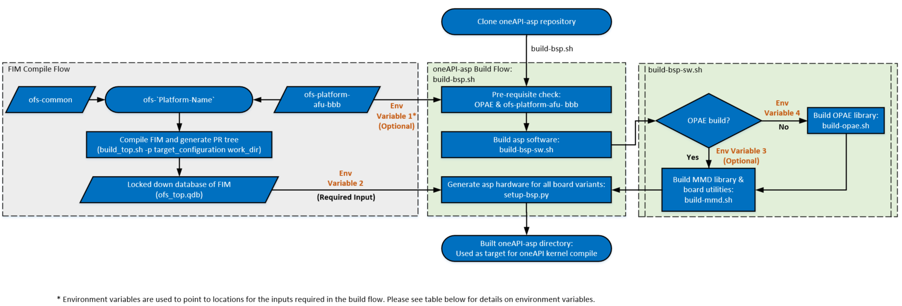

**Table 5-5 Environment Variables used in Build Flow**

| Variable Number | Environment Variable | Description |
|---------|---------|---------|
| 1 | OFS_PLATFORM_AFU_BBB | Should point to location where ofs-platform-afu-bbb repository is cloned, if this variable is not set, `build-asp.sh` script clones the repository |
| 2 | OPAE_PLATFORM_ROOT | Must point to the PR tree generated during FIM build, this is a required variable and build flow fails without this |
| 3 | LIBOPAE_C_ROOT | Should point to the installation location for OPAE libraries (please see [oneAPI Accelerator Support Package (ASP): Getting Started User Guide] for more information on this variable setting), `build-opae.sh` script is used to clone & build OPAE library if this variable is not set.  |
| 4 | OPAE_SDK_REPO_BRANCH | If `LIBOPAE_C_ROOT` is not set, it is recommended to set this variable to indicate the OPAE SDK branch to be used for building OPAE libraries.  > **Note:** `build-opae.sh` always clones the master branch if `OPAE_SDK_REPO_BRANCH` environment variable is not set. If you do not have the OPAE SDK installed, please ensure the `OPAE_SDK_REPO_BRANCH` is set to point to the OPAE release tag matching the [release notes](https://github.com/orgs/OFS/discussions) for the OFS release you are using. Please refer to [oneAPI Accelerator Support Package (ASP): Getting Started User Guide] for more information on environment variable and build steps |

The scripts required for `oneapi-asp` *build* that are common to all OFS reference platforms are located in `oneapi-asp/common/scripts` and build scripts specific to individual platforms are located in `oneapi-asp/Platform-Name/scripts` folders in the `oneapi-asp` repository, where `Platform-Name` is:

* `n6001` for Intel® FPGA SmartNIC N6001-PL reference platform
* `d5005` for Intel® FPGA PAC D5005 reference platform
* `fseries-dk` for Agilex™ 7 FPGA F-Series Development Kit (2x F-Tile)
* `iseries-dk `for Agilex™ 7 FPGA I-Series Development Kit (2x R-Tile and 1xF-Tile)

The build flow copies the scripts from `oneapi-asp/common/scripts` into the `oneapi-asp/Platform-Name/scripts` directory and generates the complete hardware directories for all board variants in `oneapi-asp`.

> **Note:** For more information about the build scripts, please refer to README in `oneapi-asp/common/scripts` directory.

### **5.3 `oneapi-asp` Hardware Implementation**

This section goes deeper into the current hardware architecture of the `oneapi-asp`.

Figure 1-3 shows a high level overview of the hardware design. OFS reference platforms have different `board variants` enabling the different paths shown in Figure 1-3. Table below summarizes the board variants and paths enabled in the oneAPI ASP reference design for each. The Path numbers in the table match the ones in Figure 1-3. Figure 5-2 to 5-5 show the detailed diagram for `oneapi-asp` components in each of these board variants.

> **Note:** The design files have the option to enable multiple global memories (oneapi-asp tag ofs-2024.2-1 supports upto 4 global memory systems), however, for the purpose of readability, the figures 5-2 to 5-5 show the design with one global memory. For more information about multiple global memories, refer to section 5.3.3.

**Table 5-6: OFS Reference Platform Board Variants**

| # | Device | Board Variant | Host to EMIF with DMA Engine (Path 1) | Host to Kernel Interface (Path 2) | Kernel to EMIF (Path 3) | Kernel to Unified Shared Memory (Path 4) | Kernel to HSSI (Path 5) | Figure # |
|---------|---------|---------|---------|---------|---------|---------|---------|---------|
| 1 | Agilex™ 7 FPGA   Stratix® 10 FPGA | `oneapi-asp` for Agilex™ 7 FPGA :   * ofs_n6001   * ofs_fseries-dk   * ofs_iseries-dk   `oneapi-asp` for Stratix® 10 FPGA :   * ofs_d5005 |  Yes | Yes | Yes | No | No | 5-2 |
| 2 | Agilex™ 7 FPGA   Stratix® 10 FPGA | `oneapi-asp` for Agilex™ 7 FPGA :   * ofs_n6001_usm   * ofs_fseries-dk_usm   * ofs_iseries-dk_usm   `oneapi-asp` for Stratix® 10 FPGA :   * ofs_d5005_usm | Yes | Yes | Yes | Yes | No | 5-3 |
| 3 | Agilex™ 7 FPGA | `oneapi-asp` for Agilex™ 7 FPGA :   * ofs_n6001_iopies | Yes | Yes | Yes | No | Yes | 5-4 |
| 4 | Agilex™ 7 FPGA| `oneapi-asp` for Agilex™ 7 FPGA :   * ofs_n6001_usm_iopipes | Yes | Yes | Yes | Yes | Yes | 5-5 |

> **Note:** Please see `oneapi-asp/Platform-Name/hardware` folder for the board variants for each OFS reference platform.

**Figure 5-2: `oneapi-asp` Reference Platform Hardware Design - Board Variant #1**

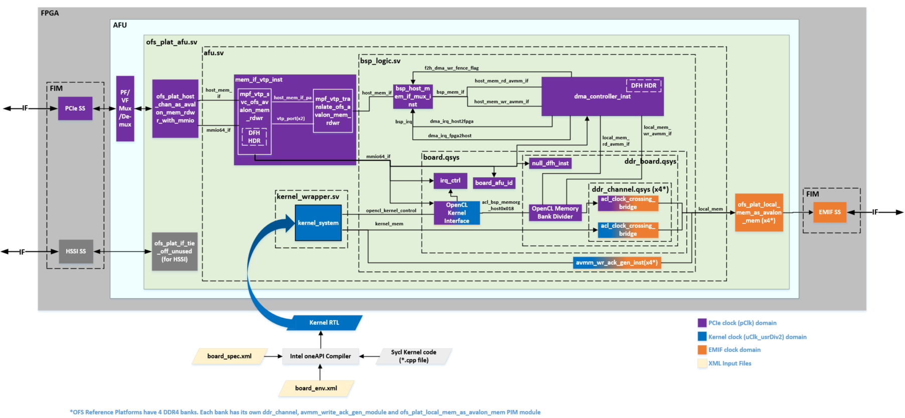

**Figure 5-3: `oneapi-asp` Reference Platform with USM Hardware Design - Board Variant #2**

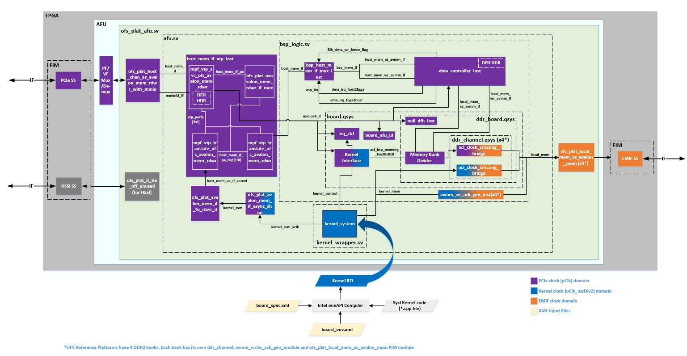

**Figure 5-4: `oneapi-asp` Reference Platform with IO Pipes Hardware Design - Board Variant #3**

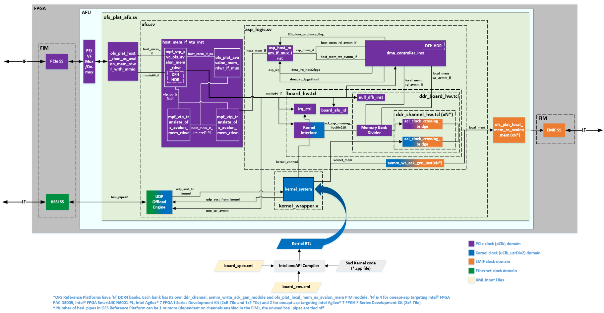

**Figure 5-5: `oneapi-asp` Reference Platform with IO Pipes and USM Hardware Design - Board Variant #4**

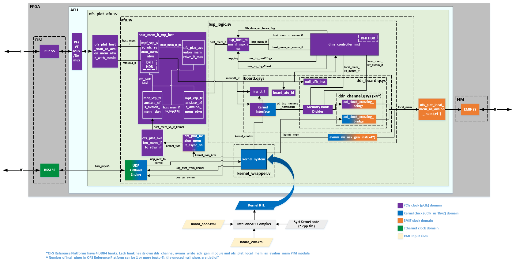

The `ofs_plat_afu.sv` is the top level entity for the `oneapi-asp`.

Hardware design files that are common for all OFS reference platforms (for the components inside `ofs_plat_afu` module) are located in `oneapi-asp/common/hardware/common/build` and hardware design file specific to the individual platforms are located in the `oneapi-asp/Platform-Name/hardware/Board-Variant/build` directory. The common files are copied to the `oneapi-asp/Platform-Name/hardware/Board-Variant` folder during `oneapi-asp` build flow. The FIM database files imported during `oneapi-asp` build (section 5.2) are located in `oneapi-asp/Platform-Name/hardware/Board-Variant/fim_platform` directory.

Tables 5-7 give a brief description of the important design files in all board variants, the location for these files shown in table 5-7 is post `oneapi-asp` build flow.

**Table 5-7: Hardware Design Files in `oneapi-asp/Platform-Name/hardware/Board-Variant/build`**

| Files/Folder | Description  |
|---------|---------|
| afu_ip.qsf |  Adds platform specific settings & design files, this file is sourced in the oneapi-asp revision being compiled (e.g.`afu_flat.qsf`) |
| mpf_vtp.qsf | Adds IP components from Intel® FPGA BBB (see section 5.3.2 below for information about use of MPF blocks from Intel® FPGA BBB) repository used in the design |
| asp_design_files.tcl | Adds design files to the project, this file is source in `afu_ip.qsf` |
| oneapi_afu.json | Accelerator Description File that describes the metadata associated with a oneAPI ASP. The Open Programmable Accelerator Engine (OPAE) uses this metadata during reconfiguration  > **Note:** For more information about use of a JSON file for storing meadata for an AFU, refer to *Accelerator Description File* section in [PIM Based AFU Developer Guide] |
| ip | Contains the HW TCL and Verilog source code files for IP components used in the hardware design |
| scripts | Contains scripts to control oneAPI kernel and asp Quartus® software compile flow (see section 5.3.5 for more information on compile flow) |
| rtl | Contains the SystemVerilog and Verilog design files shown in figures 5-2 to 5-5 above  |
| rtl/ofs_plat_afu.sv | Top level wrapper file for `oneapi-asp`. Contains the Platform Interface Manager (PIM) blocks for protocol translation & connecting FIM ports to `oneapi-asp` ports. For more information about PIM, see the PIM subtopic below. |
| rtl/afu.sv | Contains the PIM blocks for VTP address translation and instantiates the `kernel_wrapper` entity. For more information about PIM, see the PIM subtopic below. |
| rtl/kernel_wrapper.v | Contains the `kernel_system` instantiation |
| rtl/asp_logic.sv | Contains the DMA engine, `board` system instantiation, please see information about `board_hw.tcl`, `ddr_board_hw.tcl` and `ddr_channel_hw.tcl` below |
| rtl/ofs_asp.vh | Contains the macros to control instantiation of logic on host to memory path, logic required to enable Unified Shared Memory(USM) support and IO pipes support |
| rtl/ofs_asp_pkg.sv | Contains Verilog parameters used in controlling values of number of channels (memory/IO pipes), address widths, pipeline stages etc. for logic in the `oneapi-asp` |
| board_hw.tcl | Contains the `Kernel Interface` IP instantiation, register to store board AFU ID and `ddr_board` system instantiation. Please refer to `ddr_board_hw.tcl` and `ddr_channel_hw.tcl` below.   > **Note:** The board AFU ID is used by the MMD layer during board discovery |
| ddr_board_hw.tcl | Instantiated in the board_hw.tcl, contains IP components in the host to EMIF and kernel to EMIF datapath. `Memory Bank Divider` is instantiated in this file. Please refer to section 3.1.1 for more details on `Memory Bank Divider` |
| ddr_channel_hw.tcl | Instantiated in ddr_board_hw.tcl, contains bridges required for clock domain crossings between PCIe and EMIF clocks as well as kernel and EMIF clock |
| ofs_asp.sdc | Contains clock group constraints for all clocks in oneAPI ASP |
| ../fim_platform | Contains Platform Interface Manager(PIM) and FIM database used in the design. See PIM subtopic below |

The hardware implementation diagrams show a PF/VF Mux/De-mux module in the AFU region. The PF/VF mux routes packets to AFU component based on `pf_num` and `vf_num` information in PCIe TLP header. For more information about the PF/VF mux, please refer to the PF/VF Mapping details in *FPGA Interface Manager Technical Reference Manual* for your target device (links are available in section 1.3). 

The `oneapi-asp` resides inside the AFU region and, depending on the FIM configuration, connects to the lowest PF or lowest VF number that routes into the PR slot. Table below summazires the PF/VF mapping in `oneapi-asp` for some of the different FIM configurations.

**Table 5-8: PF/VF Mapping in `oneapi-asp`**

| Target Device for OFS | FIM Configuration* | PF/VF Mapping  in `oneapi-asp` |
|---------|---------|---------|
| Stratix® 10 FPGA | Default | PF0-VF1 |
| Agilex™ 7 FPGA | Default | PF0-VF0 |
| Agilex™ 7 FPGA | Compiled using `<n6001/iseries-dk>_1pf_1vf.ofss`, i.e. PCIe Subsystem configuration is set to PF0 with 1 VF | PF0-VF0 |
| Agilex™ 7 FPGA | Compiled using `n6001_2pf.ofss`, i.e. PCIe Subsystem configuration is set to two physical functions PF0 and PF1 | PF1 |

> \***Note:** For more information on different FIM configurations & how to compile these, please refer to *FPGA Interface Manager(FIM) Developer Guides for Open FPGA Stack* for your target device (links are available in section 1.3).

Sections below provide some more information on some blocks in the hardware design block diagram shown above. Refer to section 3.1 for more information about `Memory Bank Divider` and to section 3.2 for information about `Kernel Interface`. 

#### **5.3.1 Platform Interface Manager(PIM)**

In addition to above files/folders, an important part of the design are the `ofs_plat_*` modules provided by [Platform Interface Manager (PIM)](https://github.com/OFS/ofs-platform-afu-bbb). oneAPI kernel system and `oneapi-asp` have Avalon® interfaces. FIM components have AXI interfaces. The oneAPI compiler generated `kernel_system` with Avalon interfaces. The PIM modules are used for protocol translation. 

In addition to this, PIM blocks are also used for Virtual to Physical (VTP) address translation. The Memory Mapped Device(MMD) layer provides virtual addresses which are converted to physical addresses by the VTP blocks to allow Unified Shared Memory(USM) and DMA transfers to/from host memory.

> **Note:** For more information about PIM, please refer to PIM README [here](https://github.com/OFS/ofs-platform-afu-bbb/blob/master/README.md).

#### **5.3.2 Direct Memory Access(DMA) Module**

The Direct Memory Access(DMA) module is located in the host to EMIF datapath in the `oneapi-asp` and provides a controller to execute transfers from host to DDR on the board and vice versa. The source files for the DMA module used in `oneapi-asp` for OFS reference platforms are located in `oneapi-asp/Platform-Name/hardware/Board-Variant/build/rtl/dma` directory (location post oneapi-asp build flow). Figure below shows the DMA module interface.

**Figure 5-7: DMA Controller Block Diagram**

Figure 5-2 shows the instantiation of this dma_top module as `dma_controller_inst`. Table 5-9 shows the signal names and descriptions. Section 5-5 covers the complete compilation flow.

**Table 5-9: DMA Module Signal Descriptions**

| Signal or Port | Description  |
|---------|---------|
| mmio64_if | Control signal from host, connects to DMA Control Status Registers(CSR) |
| host_mem_rd_avmm_if | Avalon® memory-mapped interface to read from host memory |
| host_mem_wr_avmm_if | Avalon® memory-mapped interface to write to host memory |
| local_mem_rd_avmm_if | Avalon® memory-mapped interface to read from on-board DDR4 memory |
| local_mem_wr_avmm_if | Avalon® memory-mapped interface to write to on-board DDR4 memory|
| dma_irq_host2fpga | Interrupt to indicate completion of host to FPGA DMA transaction (read from host, write to DDR4) |
| dma_irq_fpga2host | Interrupt to indicate completion of FPGA DDR4 to host DMA transaction (read from DDR4, write to host) > **Note:** The `oneapi-asp` for OFS reference platforms uses a host memory write to indicate completion of FPGA to host transaction |

The data transfer module manages data movement from source to destination addresses.

To start a data transfer, the data transfer module requires following information, this is set by the `dma_dispatcher`:

* Source address
* Destination address
* Number of bytes to transfer

`oneapi-asp` for OFS reference platforms uses *virtual* addresses in the DMA controller for data transfer. The Memory Properties Factory(MPF) Virtual to Physical(VTP) blocks (i.e.`mpf_vtp_*` modules) shown in figure 5-2 translate virtual addresses to appropriate host addresses. 

> **Note:** Memory Properties Factory(MPF) is a part of Intel® FPGA Basic Building Blocks. Please refer to [Intel® FPGA BBB repository](https://github.com/OPAE/intel-fpga-bbb/wiki/BBB_cci_mpf) for more information.

#### **5.3.3 `board_hw.tcl` File**

As described in table 5-7, the `board_hw.tcl` contains the `Kernel Interface` IP instantiation, register to store board AFU ID and `ddr_board` system instantiation. The `board_hw.tcl` component has a few parameters that can be used to control the internal composition. Snippet below shows the portion of the TCL script adding these parameters. These are described in table below. 

`board_hw.tcl` sources another file called `parameters.tcl`, this file is located in `oneapi-asp/Platform-Name/hardware/Board-Variant/build` directory and contains different values for the parameters based on the board variant. All the parameters in the `board_hw.tcl` derive their value from respective values in `parameters.tcl`(all variables starting with `p_<parameter-name>`) for each board variant when the `oneapi-asp` is built. 

<pre>

 +-----------------------------------
 | parameters
 |
source parameters.tcl

add_parameter AFU_ID_H STD_LOGIC_VECTOR $p_AFU_ID_H
set_parameter_property AFU_ID_H DEFAULT_VALUE $p_AFU_ID_H
set_parameter_property AFU_ID_H DISPLAY_NAME &quotAFU ID H&quot
set_parameter_property AFU_ID_H AFFECTS_ELABORATION true
 
add_parameter AFU_ID_L STD_LOGIC_VECTOR $p_AFU_ID_L
set_parameter_property AFU_ID_L DEFAULT_VALUE $p_AFU_ID_L
set_parameter_property AFU_ID_L DISPLAY_NAME &quotAFU ID L&quot
set_parameter_property AFU_ID_L AFFECTS_ELABORATION true
 
add_parameter IOPIPE_SUPPORT BOOLEAN $p_IOPIPE_SUPPORT
set_parameter_property IOPIPE_SUPPORT DEFAULT_VALUE $p_IOPIPE_SUPPORT
set_parameter_property IOPIPE_SUPPORT DISPLAY_NAME &quotIO Pipe Support&quot
set_parameter_property IOPIPE_SUPPORT AFFECTS_ELABORATION true
 
add_parameter NUMBER_OF_DMA_CHANNELS INTEGER $p_NUMBER_OF_DMA_CHANNELS
set_parameter_property NUMBER_OF_DMA_CHANNELS DEFAULT_VALUE $p_NUMBER_OF_DMA_CHANNELS
set_parameter_property NUMBER_OF_DMA_CHANNELS DISPLAY_NAME &quotNumber of DMA Channels&quot
set_parameter_property NUMBER_OF_DMA_CHANNELS AFFECTS_ELABORATION true

add_parameter SNOOP_PORT_ENABLE BOOLEAN $p_SNOOP_PORT_ENABLE
set_parameter_property SNOOP_PORT_ENABLE DEFAULT_VALUE $p_SNOOP_PORT_ENABLE
set_parameter_property SNOOP_PORT_ENABLE DISPLAY_NAME &quotEnable Snoop Port&quot
set_parameter_property SNOOP_PORT_ENABLE AFFECTS_ELABORATION true

add_parameter NUMBER_OF_GLOBAL_MEMORY_SYSTEMS INTEGER $p_NUMBER_OF_GLOBAL_MEMORY_SYSTEMS
set_parameter_property NUMBER_OF_GLOBAL_MEMORY_SYSTEMS DEFAULT_VALUE $p_NUMBER_OF_GLOBAL_MEMORY_SYSTEMS
set_parameter_property NUMBER_OF_GLOBAL_MEMORY_SYSTEMS DISPLAY_NAME "Number of Global Memory Systems"
set_parameter_property NUMBER_OF_GLOBAL_MEMORY_SYSTEMS AFFECTS_ELABORATION true

if { $p_NUMBER_OF_GLOBAL_MEMORY_SYSTEMS > 0 } {
  add_parameter MEM_0_NUMBER_OF_MEMORY_BANKS INTEGER $p_MEM_0_NUMBER_OF_MEMORY_BANKS
  set_parameter_property MEM_0_NUMBER_OF_MEMORY_BANKS DEFAULT_VALUE $p_MEM_0_NUMBER_OF_MEMORY_BANKS
  set_parameter_property MEM_0_NUMBER_OF_MEMORY_BANKS DISPLAY_NAME "Number of Global Memory 0 Banks"
  set_parameter_property MEM_0_NUMBER_OF_MEMORY_BANKS AFFECTS_ELABORATION true

  add_parameter MEM_0_MEMORY_BANK_ADDRESS_WIDTH INTEGER $p_MEM_0_MEMORY_BANK_ADDRESS_WIDTH
  set_parameter_property MEM_0_MEMORY_BANK_ADDRESS_WIDTH DEFAULT_VALUE $p_MEM_0_MEMORY_BANK_ADDRESS_WIDTH
  set_parameter_property MEM_0_MEMORY_BANK_ADDRESS_WIDTH DISPLAY_NAME "Global Memory 0 Memory Bank Address Width"
  set_parameter_property MEM_0_MEMORY_BANK_ADDRESS_WIDTH AFFECTS_ELABORATION true

  add_parameter MEM_0_DATA_WIDTH INTEGER $p_MEM_0_DATA_WIDTH
  set_parameter_property MEM_0_DATA_WIDTH DEFAULT_VALUE $p_MEM_0_DATA_WIDTH
  set_parameter_property MEM_0_DATA_WIDTH DISPLAY_NAME "Global Memory 0 Data Width"
  set_parameter_property MEM_0_DATA_WIDTH AFFECTS_ELABORATION true

  add_parameter MEM_0_MAX_BURST_SIZE INTEGER $p_MEM_0_MAX_BURST_SIZE
  set_parameter_property MEM_0_MAX_BURST_SIZE DEFAULT_VALUE $p_MEM_0_MAX_BURST_SIZE
  set_parameter_property MEM_0_MAX_BURST_SIZE DISPLAY_NAME "Global Memory 0 Maximum Burst Size"
  set_parameter_property MEM_0_MAX_BURST_SIZE AFFECTS_ELABORATION true

  add_parameter MEM_0_KERNEL_GLOBALMEM_WAITREQUEST_ALLOWANCE INTEGER $p_MEM_0_KERNEL_GLOBALMEM_WAITREQUEST_ALLOWANCE
  set_parameter_property MEM_0_KERNEL_GLOBALMEM_WAITREQUEST_ALLOWANCE DEFAULT_VALUE $p_MEM_0_KERNEL_GLOBALMEM_WAITREQUEST_ALLOWANCE
  set_parameter_property MEM_0_KERNEL_GLOBALMEM_WAITREQUEST_ALLOWANCE DISPLAY_NAME "Global Memory 0 Kernel to global memory waitrequest allowance"
  set_parameter_property MEM_0_KERNEL_GLOBALMEM_WAITREQUEST_ALLOWANCE AFFECTS_ELABORATION true
  
  add_parameter MEM_0_MBD_TO_MEMORY_PIPE_STAGES INTEGER $p_MEM_0_MBD_TO_MEMORY_PIPE_STAGES
  set_parameter_property MEM_0_MBD_TO_MEMORY_PIPE_STAGES DEFAULT_VALUE $p_MEM_0_MBD_TO_MEMORY_PIPE_STAGES
  set_parameter_property MEM_0_MBD_TO_MEMORY_PIPE_STAGES DISPLAY_NAME "Global Memory 0 MBD to Memory Pipeline Stages"
  set_parameter_property MEM_0_MBD_TO_MEMORY_PIPE_STAGES AFFECTS_ELABORATION true
}

if { $p_NUMBER_OF_GLOBAL_MEMORY_SYSTEMS > 1 } {
  add_parameter MEM_1_NUMBER_OF_MEMORY_BANKS INTEGER $p_MEM_1_NUMBER_OF_MEMORY_BANKS
  set_parameter_property MEM_1_NUMBER_OF_MEMORY_BANKS DEFAULT_VALUE $p_MEM_1_NUMBER_OF_MEMORY_BANKS
  set_parameter_property MEM_1_NUMBER_OF_MEMORY_BANKS DISPLAY_NAME "Number of Global Memory 1 Banks"
  set_parameter_property MEM_1_NUMBER_OF_MEMORY_BANKS AFFECTS_ELABORATION true

  add_parameter MEM_1_MEMORY_BANK_ADDRESS_WIDTH INTEGER $p_MEM_1_MEMORY_BANK_ADDRESS_WIDTH
  set_parameter_property MEM_1_MEMORY_BANK_ADDRESS_WIDTH DEFAULT_VALUE $p_MEM_1_MEMORY_BANK_ADDRESS_WIDTH
  set_parameter_property MEM_1_MEMORY_BANK_ADDRESS_WIDTH DISPLAY_NAME "Global Memory 1 Memory Bank Address Width"
  set_parameter_property MEM_1_MEMORY_BANK_ADDRESS_WIDTH AFFECTS_ELABORATION true
  
  add_parameter MEM_1_DATA_WIDTH INTEGER $p_MEM_1_DATA_WIDTH
  set_parameter_property MEM_1_DATA_WIDTH DEFAULT_VALUE $p_MEM_1_DATA_WIDTH
  set_parameter_property MEM_1_DATA_WIDTH DISPLAY_NAME "Global Memory 1 Data Width"
  set_parameter_property MEM_1_DATA_WIDTH AFFECTS_ELABORATION true

  add_parameter MEM_1_MAX_BURST_SIZE INTEGER $p_MEM_1_MAX_BURST_SIZE
  set_parameter_property MEM_1_MAX_BURST_SIZE DEFAULT_VALUE $p_MEM_1_MAX_BURST_SIZE
  set_parameter_property MEM_1_MAX_BURST_SIZE DISPLAY_NAME "Global Memory 1 Maximum Burst Size"
  set_parameter_property MEM_1_MAX_BURST_SIZE AFFECTS_ELABORATION true

  add_parameter MEM_1_KERNEL_GLOBALMEM_WAITREQUEST_ALLOWANCE INTEGER $p_MEM_1_KERNEL_GLOBALMEM_WAITREQUEST_ALLOWANCE
  set_parameter_property MEM_1_KERNEL_GLOBALMEM_WAITREQUEST_ALLOWANCE DEFAULT_VALUE $p_MEM_1_KERNEL_GLOBALMEM_WAITREQUEST_ALLOWANCE
  set_parameter_property MEM_1_KERNEL_GLOBALMEM_WAITREQUEST_ALLOWANCE DISPLAY_NAME "Global Memory 1 Kernel to global memory waitrequest allowance"
  set_parameter_property MEM_1_KERNEL_GLOBALMEM_WAITREQUEST_ALLOWANCE AFFECTS_ELABORATION true

  add_parameter MEM_1_MBD_TO_MEMORY_PIPE_STAGES INTEGER $p_MEM_1_MBD_TO_MEMORY_PIPE_STAGES
  set_parameter_property MEM_1_MBD_TO_MEMORY_PIPE_STAGES DEFAULT_VALUE $p_MEM_1_MBD_TO_MEMORY_PIPE_STAGES
  set_parameter_property MEM_1_MBD_TO_MEMORY_PIPE_STAGES DISPLAY_NAME "Global Memory 1 MBD to Memory Pipeline Stages"
  set_parameter_property MEM_1_MBD_TO_MEMORY_PIPE_STAGES AFFECTS_ELABORATION true
}

if { $p_NUMBER_OF_GLOBAL_MEMORY_SYSTEMS > 2 } {
  add_parameter MEM_2_NUMBER_OF_MEMORY_BANKS INTEGER $p_MEM_2_NUMBER_OF_MEMORY_BANKS
  set_parameter_property MEM_2_NUMBER_OF_MEMORY_BANKS DEFAULT_VALUE $p_MEM_2_NUMBER_OF_MEMORY_BANKS
  set_parameter_property MEM_2_NUMBER_OF_MEMORY_BANKS DISPLAY_NAME "Number of Global Memory 2 Banks"
  set_parameter_property MEM_2_NUMBER_OF_MEMORY_BANKS AFFECTS_ELABORATION true
  
  add_parameter MEM_2_MEMORY_BANK_ADDRESS_WIDTH INTEGER $p_MEM_2_MEMORY_BANK_ADDRESS_WIDTH
  set_parameter_property MEM_2_MEMORY_BANK_ADDRESS_WIDTH DEFAULT_VALUE $p_MEM_2_MEMORY_BANK_ADDRESS_WIDTH
  set_parameter_property MEM_2_MEMORY_BANK_ADDRESS_WIDTH DISPLAY_NAME "Global Memory 2 Memory Bank Address Width"
  set_parameter_property MEM_2_MEMORY_BANK_ADDRESS_WIDTH AFFECTS_ELABORATION true
  
  add_parameter MEM_2_DATA_WIDTH INTEGER $p_MEM_2_DATA_WIDTH
  set_parameter_property MEM_2_DATA_WIDTH DEFAULT_VALUE $p_MEM_2_DATA_WIDTH
  set_parameter_property MEM_2_DATA_WIDTH DISPLAY_NAME "Global Memory 2 Data Width"
  set_parameter_property MEM_2_DATA_WIDTH AFFECTS_ELABORATION true

  add_parameter MEM_2_MAX_BURST_SIZE INTEGER $p_MEM_2_MAX_BURST_SIZE
  set_parameter_property MEM_2_MAX_BURST_SIZE DEFAULT_VALUE $p_MEM_2_MAX_BURST_SIZE
  set_parameter_property MEM_2_MAX_BURST_SIZE DISPLAY_NAME "Global Memory 2 Maximum Burst Size"
  set_parameter_property MEM_2_MAX_BURST_SIZE AFFECTS_ELABORATION true

  add_parameter MEM_2_KERNEL_GLOBALMEM_WAITREQUEST_ALLOWANCE INTEGER $p_MEM_2_KERNEL_GLOBALMEM_WAITREQUEST_ALLOWANCE
  set_parameter_property MEM_2_KERNEL_GLOBALMEM_WAITREQUEST_ALLOWANCE DEFAULT_VALUE $p_MEM_2_KERNEL_GLOBALMEM_WAITREQUEST_ALLOWANCE
  set_parameter_property MEM_2_KERNEL_GLOBALMEM_WAITREQUEST_ALLOWANCE DISPLAY_NAME "Global Memory 2 Kernel to global memory waitrequest allowance"
  set_parameter_property MEM_2_KERNEL_GLOBALMEM_WAITREQUEST_ALLOWANCE AFFECTS_ELABORATION true

  add_parameter MEM_2_MBD_TO_MEMORY_PIPE_STAGES INTEGER $p_MEM_2_MBD_TO_MEMORY_PIPE_STAGES
  set_parameter_property MEM_2_MBD_TO_MEMORY_PIPE_STAGES DEFAULT_VALUE $p_MEM_2_MBD_TO_MEMORY_PIPE_STAGES
  set_parameter_property MEM_2_MBD_TO_MEMORY_PIPE_STAGES DISPLAY_NAME "Global Memory 2 MBD to Memory Pipeline Stages"
  set_parameter_property MEM_2_MBD_TO_MEMORY_PIPE_STAGES AFFECTS_ELABORATION true
}

if { $p_NUMBER_OF_GLOBAL_MEMORY_SYSTEMS > 3 } {
  add_parameter MEM_3_NUMBER_OF_MEMORY_BANKS INTEGER $p_MEM_3_NUMBER_OF_MEMORY_BANKS
  set_parameter_property MEM_3_NUMBER_OF_MEMORY_BANKS DEFAULT_VALUE $p_MEM_3_NUMBER_OF_MEMORY_BANKS
  set_parameter_property MEM_3_NUMBER_OF_MEMORY_BANKS DISPLAY_NAME "Number of Global Memory 3 Banks"
  set_parameter_property MEM_3_NUMBER_OF_MEMORY_BANKS AFFECTS_ELABORATION true

  add_parameter MEM_3_MEMORY_BANK_ADDRESS_WIDTH INTEGER $p_MEM_3_MEMORY_BANK_ADDRESS_WIDTH
  set_parameter_property MEM_3_MEMORY_BANK_ADDRESS_WIDTH DEFAULT_VALUE $p_MEM_3_MEMORY_BANK_ADDRESS_WIDTH
  set_parameter_property MEM_3_MEMORY_BANK_ADDRESS_WIDTH DISPLAY_NAME "Global Memory 3 Memory Bank Address Width"
  set_parameter_property MEM_3_MEMORY_BANK_ADDRESS_WIDTH AFFECTS_ELABORATION true
  
  add_parameter MEM_3_DATA_WIDTH INTEGER $p_MEM_3_DATA_WIDTH
  set_parameter_property MEM_3_DATA_WIDTH DEFAULT_VALUE $p_MEM_3_DATA_WIDTH
  set_parameter_property MEM_3_DATA_WIDTH DISPLAY_NAME "Global Memory 3 Data Width"
  set_parameter_property MEM_3_DATA_WIDTH AFFECTS_ELABORATION true

  add_parameter MEM_3_MAX_BURST_SIZE INTEGER $p_MEM_3_MAX_BURST_SIZE
  set_parameter_property MEM_3_MAX_BURST_SIZE DEFAULT_VALUE $p_MEM_3_MAX_BURST_SIZE
  set_parameter_property MEM_3_MAX_BURST_SIZE DISPLAY_NAME "Global Memory 3 Maximum Burst Size"
  set_parameter_property MEM_3_MAX_BURST_SIZE AFFECTS_ELABORATION true

  add_parameter MEM_3_KERNEL_GLOBALMEM_WAITREQUEST_ALLOWANCE INTEGER $p_MEM_3_KERNEL_GLOBALMEM_WAITREQUEST_ALLOWANCE
  set_parameter_property MEM_3_KERNEL_GLOBALMEM_WAITREQUEST_ALLOWANCE DEFAULT_VALUE $p_MEM_3_KERNEL_GLOBALMEM_WAITREQUEST_ALLOWANCE
  set_parameter_property MEM_3_KERNEL_GLOBALMEM_WAITREQUEST_ALLOWANCE DISPLAY_NAME "Global Memory 3 Kernel to global memory waitrequest allowance"
  set_parameter_property MEM_3_KERNEL_GLOBALMEM_WAITREQUEST_ALLOWANCE AFFECTS_ELABORATION true

  add_parameter MEM_3_MBD_TO_MEMORY_PIPE_STAGES INTEGER $p_MEM_3_MBD_TO_MEMORY_PIPE_STAGES
  set_parameter_property MEM_3_MBD_TO_MEMORY_PIPE_STAGES DEFAULT_VALUE $p_MEM_3_MBD_TO_MEMORY_PIPE_STAGES
  set_parameter_property MEM_3_MBD_TO_MEMORY_PIPE_STAGES DISPLAY_NAME "Global Memory 3 MBD to Memory Pipeline Stages"
  set_parameter_property MEM_3_MBD_TO_MEMORY_PIPE_STAGES AFFECTS_ELABORATION true
}

</pre>

**Table 5-10 `board_hw.tcl` Parameters** 

| Parameter Name in IP TCL | Parameter | Description |
|---------|---------|---------|
| AFU_ID_H | AFU ID H | Upper 32 bits of the board AFU ID.   > **Note:** The board AFU ID is used by the MMD layer during board discovery |
| AFU_ID_L | AFU ID L | Lower 32 bits of the board AFU ID. |
| IOPIPE_SUPPORT | IO Pipe Support | Boolean value used to determine if the `oneapi-asp` has IO pipes support. This must be set to true for `oneapi-asp` board variant that has the `channels` element defined in the `board_spec.xml`. Table 5-6 shows the OFS reference platform board variants that have IO pipes enabled. To ensure correct functionality, the HSSI susbsystem in the FIM must support the settings in the `oneapi-asp`. For more information about `channels` element refer to section 2.1.8 |
| NUMBER_OF_DMA_CHANNELS | Number of DMA Channels | Reserved for future use   > Note: oneapi-asp tag ofs-2024.2-1 supports only 1 DMA channel |
| SNOOP_PORT_ENABLE | Enable Snoop Port | Used to enable the `acl_asp_snoop` port for `Memory Bank Divider`, for more information about `acl_asp_snoop` port, refer to Table 3-2 |
| NUMBER_OF_GLOBAL_MEMORY_SYSTEMS\*   *Please see notes below the table for additional design details*| Number of Global Memory Systems | Number of global memories connected to the oneAPI kernel   > **Note:** oneapi-asp tag ofs-2024.2-1 supports upto 4 global memory systems |
| MEM_`<id>`_NUMBER_OF_MEMORY_BANKS | Number of Global Memory `<id>` Banks | The number of homogenous memory banks in `<id>`th global memory system, where `id` can be 0, 1, 2 or 3 (oneapi-asp tag ofs-2024.2-1 supports upto 4 global memory systems). Used for parameterizing the `ddr_board` system. The `ddr_board` system in `oneapi-asp` for OFS reference platforms has a single `Memory Bank Divider` instantiated for each global memory. The number of memory banks in a single global memory can be 1, 2, 4 or 8 (`Memory Bank Divider` IP requirement). To expand number of banks in a global memory beyond this range, additional `Memory Bank Didvider` IP will need to be instantiated and connected in `ddr_board_hw.tcl`. For more information about `Memory Bank Divider`, please refer to section 3.1.1 |
| MEM_`<id>`_MEMORY_BANK_ADDRESS_WIDTH | Global Memory `<id>` Memory Bank Address Width | This is the total addressable width for a single memory bank/interface in `<id>`th global memory. For example, if global memory `0 (id)` consists of 32 GB on-board DDR4 memory with four 8 GB memory banks, then this memory bank address width parameter must be set to 33 (single 8 GB channel is considered) for `MEM_0_MEMORY_BANK_ADDRESS_WIDTH`. This value is used for parameterizing the `ddr_board` system. | 
| MEM_`<id>`_DATA_WIDTH | Global Memory `<id>` Data Width | This is the width of the data bus for a single single memory bank/interface in the `<id>`th global memory to the oneAPI kernel |
| MEM_`<id>`_MAX_BURST_SIZE | Global Memory `<id>` Maximum Burst Size | Maximum burst size for the pipeline bridges in the host to memory as well as kernel to memory data path for `<id>`th global memory |
| MEM_`<id>`_KERNEL_GLOBALMEM_WAITREQUEST_ALLOWANCE | Global Memory `<id>` Kernel to global memory waitrequest allowance | This is the waitrequest_allowance for the clock crossing bridge in the kernel to memory data path for `<id>`th global memory   > **Note:** For more information about `waitrequest_allowance` refer to section 2.1.4 on interface attribute |
| MEM_`<id>`_MBD_TO_MEMORY_PIPE_STAGES | Global Memory `<id>` MBD to Memory Pipeline Stages | Value is used to set the number of Avalon-MM pipeline bridges between Memory Bank Divider and the PCIe clock domain to EMIF clock domain clock crossing bridge for `<id>`th global memory |

\* > **Notes (about Number of Global Memory):**   1. If the number of global memory systems in more than 1, a pipeline bridge is added in the host to memory data path ensuring the host sees a continuous address space for the total addressable memory. The kernel gets added as a single memory space using pipeline bridge, the kernel connected to each global memory system.  2. If you are using the oneAPI ASP Editor (described in Appendix B), then the RTL design parameterization and `board_spec.xml` file generaration is handled by the editor. However if you are manually making changes to the ASP implementation, then the `ofs_asp_pkg.sv` file must be updated to ensure it has all the ASP_GLOBAL_MEM_`<id>`_* parameters for all global memories in your system. The default file (in `oneapi-asp/common/hardware/common/build/rtl` if `oneapi-asp` build flow is not run, else update the file in `oneapi-asp/Platform-Name/hardware/Board-Variant/build/rtl`) contains the parameters for Global memory 0 only. The `board_spec.xml` file must also be edited to add global memory interfaces. For more information about `board_spec.xml` and different global memory configurations, refer to secton 2.1.5.

The internal component instantiations and connections are done in the composition callback (`compose` procedure) in `board_hw.tcl`. 

For more information about the different component commands and callback used in `board_hw.tcl`, `ddr_board_hw.tcl` and `ddr_channel.tcl`, please refer to the [Quartus® Prime Pro Edition User Guide: Platform Designer](https://www.intel.com/content/www/us/en/docs/programmable/683609/current/component-interface-tcl-reference.html)(*Component Interface Tcl Reference* section)

#### **5.3.4 User Datagram Protocol(UDP) Engine**

I/O pipes allow kernel to stream data directly using HSSI. To demonstrate this functionality, reference design in `oneapi-asp` repository (refer to Figure 5-4 and 5-5) has a UDP protocol engine to allow transmitting UDP/IP packets over HSSI..

Figure below shows a simple block diagram of the UDP engine.

**Figure 5-8: UDP Offload Engine**

The UDP engine consists of a separate receive (`rx`) and trasmit (`tx`) path. The following functionalilty is performed by this reference design engine:

* Implements an Address Resolution Protocol (ARP) functionality to respond to be able to send & respond to ARP requests. This is needed for routing between different subnets using a gateway. 
* Packetizes data from kernel to add the required header information (for MAC, IP & UDP layers) 
* Extracts data from packets received by removing header information
* Handles clock crossing between kernel clock and Ethernet MAC clock domains

The source files for UDP engine used in `oneapi-asp` for OFS reference platform are located in `oneapi-asp/Platform-Name/hardware/Board-Variant/build/rtl/udp_offload_engine` directory.

> **Note:** The same engine is used in the board variant with USM shown in Figure 5-5. 

#### **5.3.5 Hardware Compile Flow**

Figure below shows the compile flow overview; the oneAPI compiler generated hardware circuit is compiled by Quartus® software along with design files for `oneapi-asp`.

**Figure 5-9: oneAPI Compile Flow Overview**

The oneAPI compiler uses the `board_spec.xml` to get more information about the `oneapi-asp` configuration. `board_spec.xml` file has a `compile` element to allow control of the Quartus® software compilation flow. The attributes of this element are discussed in section 2.1.2. The `oneapi-asp` uses tcl scripts to control the Quartus® software compilation flow. Figure 5-10 shows the flow and scripts used. All compilation scripts are located in `oneapi-asp/Platform-Name/hardware/Board-Variant/build/scripts` folder (location post oneapi-asp build flow).

**Figure 5-10: Compilation Scripts in `oneapi-asp`**

Table 5-11 summarizes notes for reference numbers 1-2 marked in figure above.

**Table 5-11: Notes for Reference Numbers in Figure 5-10**

| Reference Number | Note |
|---------|---------|
| 1 | revision_name is `afu_flat` for `oneapi-asps` for OFS reference platforms |
| 2 | `gen-asp-quartus-report.tcl` script generates a report (`acl_quartus_report.txt`) containing resource utilization and kernel clock frequency summary. See Note below about the `acl_quartus_report.txt` file |

> **Note:** The `acl_quartus_report.txt` is required by the oneAPI compiler to generate the [Quartus (Static) summary](https://www.intel.com/content/www/us/en/docs/oneapi-fpga-add-on/developer-guide/current/quartus-static-summary.html) in FPGA optimization reports successfully. The oneAPI compiler expects the format to be as follows (order of metrics can be different, but the names of these FPGA metrics should match the format given here): 
<pre> 
ALUTs: &ltvalue&gt
Registers: &ltvalue&gt
Logic utilization: &ltvalue&gt
I/O pins: &ltvalue&gt
DSP blocks: &ltvalue&gt
Memory bits: &ltvalue&gt
RAM blocks: &ltvalue&gt
Actual clock freq: &ltvalue&gt
Kernel fmax: &ltvalue&gt
1x clock fmax: &ltvalue&gt
2x clock fmax: &ltvalue&gt
Highest non-global fanout: &ltvalue&gt
</pre>  If `acl_quartus_report.txt` is missing, the oneAPI compiler will fail to generate the Quartus(Static) summary in FPGA optimization reports successfully. If you are creating a custom platform, please ensure the  `acl_quartus_report.txt` report is generated. The `gen-asp-quartus-report.tcl` can be used as a reference to implement the generation of this report in your custom platform

### **5.4 `oneapi-asp` Memory Mapped Device(MMD) Layer Implementation**

As discussed in section 4.1, the MMD provides a set of API that allow the runtime to control the device and communicate with it.

The source code for MMD layer is located in `oneapi-asp/common/source/host` folder. `aocl_mmd.h` is the header file for the implemented API and is located in `oneapi-asp/common/source/include` folder. Table below summarizes the APIs that have been implemented in `oneapi-asp` for OFS reference platforms.

> **Note:** For more details about the API, its arguments and enums please refer to the `aocl_mmd.h` file and to section 4.1.

**Table 5-12: MMD API Implemented in `oneapi-asp` for OFS Reference Platforms**

| API |
|---------|
| aocl_mmd_get_offline_info |
| aocl_mmd_get_info |
| aocl_mmd_open |
| aocl_mmd_close |
| aocl_mmd_set_interrupt_handler |
| aocl_mmd_set_status_handler |
| aocl_mmd_yield |
| aocl_mmd_read |
| aocl_mmd_write |
| aocl_mmd_copy |
| aocl_mmd_program |
| aocl_mmd_host_alloc |
| aocl_mmd_free |
| aocl_mmd_shared_alloc |
| aocl_mmd_shared_migrate |

The implementation of these APIs is in `oneapi-asp/common/source/host/mmd.cpp`. The functions used in the implementation are distributed across various source files. Table below provides details on source code files.

**Table 5-13: MMD Source Code Files**

| Files/Folder | Description |
|---------|---------|
| mmd.cpp | This file has the implementation for all MMD API calls listed in table 5-12 |
| fpgaconf.h fpgaconf.c | Contains bitstream reconfiguration function declaration(.h) & definition(.c) |
| kernel_interrupt.h | Contains `KernelInterrupt` class declaration; the class consists of functions to handle kernel interrupts |
| kernel_interrupt.cpp | Contains `KernelInterrupt` class constructor and function definitions |
| mmd_device.h | Contains `Device` class declaration, which stores device data and has functions to interact with the device |
| mmd_device.cpp | Contains `Device` class constructor and function definitions |
| mmd_dma.h mmd_dma.cpp | Contain DMA functions declaration(.h) & definition(.cpp) |
| mmd_iopipes.h | Contains the `iopipes` class declaration(.h) |
| mmd_iopipes.cpp | Contains function definitions, these functions include `iopipes` class constructor as well as fucntions to detect and setup CSR space for IO pipes feature in board variants that support IO pipes |
| zlib_inflate.h zlib_inflate.c | Function declaration(.h) and definition(.c) for decompressing bitstream data |
| CMakeLists.txt | CMakeLists.txt file for building MMD source code |

The build flow scripts build the MMD library, i.e. `libintel_opae_mmd`, and place them in `oneapi-asp/Platform-Name/linux64/lib` folder. The MMD library is specified as part of `mmdlib`, `linklibs` element in `board_env.xml` and used at runtime (refer to section 5-1 for sample `board_env.xml` file and section 2.2 for more information about `board_env.xml` elements).

**Use of OPAE library in MMD**

The MMD layer uses API from OPAE SDK for various device operations. Hence, the MMD layers requires OPAE library to be loaded to execute successfully. The `mmdlib` element specifies the `libopae-c` library to be loaded before the MMD library (demonstrated in sample `board_env.xml` in section 5-1).

> **Note:** Please refer to [Software Reference Manual: Open FPGA Stack] for more information about OPAE SDK API. The document also has information about linux-dfl driver.

**Use of Memory Properties Factory(MPF) library in MMD**

In addition to OPAE, the MMD also uses API from Memory Properties Factory(MPF) software for memory operations. The `libMPF` library is compiled as part of `oneapi-asp` build flow and placed in `oneapi-asp/Platform-Name/linux64/lib`. This library is also loaded before the MMD library by specifying before `libintel_opae_mmd` in `mmdlib` element in `board_env.xml`.

> **Note:** Memory Properties Factory(MPF) is a part of Intel® FPGA BBB. Please refer to [Intel® FPGA BBB wiki](https://github.com/OPAE/intel-fpga-bbb) for more information about MPF.

### **5.5 `oneapi-asp` Utilities Implementation**

This section covers the implementation of board utilities (refer to section 4.2 for more information on board utilities) in `oneapi-asp` for OFS reference platforms.

Table below shows the source code/script locations for the utilities.

**Table 5-14: `oneapi-asp` Utilities Source Code Locations**

| Utility | Source Location |
|---------|---------|
| diagnose | `oneapi-asp/common/source/util/diagnostic` |
| program | `oneapi-asp/common/source/util/reprogram` |
| install uninstall initialize > **Note: These are executable scripts** | `oneapi-asp/common/linux64/libexec/` (copied to `oneapi-asp/Platform-Name/linux64/libexec/` during oneapi-asp build flow, for more information about oneapi-asp build flow, refer to section 5.2) |

`diagnose` and `program` are compiled as part of the `oneapi-asp` build flow and executables are placed in `oneapi-asp/Platform-Name/linux64/libexec/`. A `CMakeLists.txt` file is provided for building the utilities, located in `oneapi-asp/common/source/util` directory.

The path to all of the above utility executables is used in `utilbinder` element in `board_env.xml` (demonstrated in sample `board_env.xml` in section 5-1). The runtime uses this when the corresponding `aocl` utility is invoked.

Brief descriptions for the source code files are given in table below.

**Table 5-15: Brief Descriptions of `oneapi-asp` Utility Routines for OFS Reference Platforms**

| File | Description |
|---------|---------|
| setup_permissions.sh | Helper script to configure correct device port permissions, make changes to allow users to lock pages in memory and set the hugepages required for the software stack to function correctly. The helper script is used by `install`, `initialize` routines |
| install | install routine invokes the `setup_permissions.sh` script after the FPGA Client Driver (FCD) is setup by the runtime  |
| uninstall | uninstall routine reverts the port permission, memory locking and hugepage setting changes performed by `install` routine and is invoked by runtime after the FCD is removed by runtime |
| initialize | initialize routine performs the following steps:  * looks for the initialization binary for the board variant to be initialized  * extracts the FPGA hardware configuration file from the oneAPI fat binary using `clang-offload-extract` command provided by oneAPI Base Toolkit (Base Kit) version 2024.0 and beyond   * invokes the `setup_permissions.sh` script to set correct device permissions  * performs partial reconfiguration of the FPGA device by invoking `program` routine with the initialization bitstream as an argument   >**Note:** For more information about how `initialize` utility extracts FPGA hardware configuration file from oneAPI fat binary, refer to [Intel® oneAPI DPC++/C++ Compiler Handbook for Intel® FPGAs](https://www.intel.com/content/www/us/en/docs/oneapi-fpga-add-on/developer-guide/current/extracting-the-fpga-device-image-aocx-file-from-a.html) |
| program | `program` routine allocates memory and loads the supplied initialization bitstream in memory followed by a call to reprogramming function provided by `oneapi-asp's` MMD library. The MMD library uses `fpgaReconfigureSlot` API provided by OPAE library to perform device reconfiguration > **Note:** Please refer to [Software Reference Manual: Open FPGA Stack] for more information about OPAE SDK API |
| diagnose | `diagnose` routine scans for the available devices for the installed platform and performs DMA transactions between host & device. It also reports the DMA transfer bandwidth. `diagnose` routine uses functions provided by the MMD library for scanning & opening connection to available devices |

## **Appendix**

### **Appendix A: Debug Variables and Commands**

#### **A.1 Memory Mapped Device(MMD) Layer Debug Variables**

The Memory Mapped Device(MMD) layer provides debug capability for custom ASP and oneAPI application developers. Snippet below shows how to set the variable and table below documents the environment variables that can be used to get debug information from the MMD layer at runtime.

<pre>

export MMD_&ltDMA/ENABLE/PROGRAM&gt_DEBUG = 1
.&ltoneapi-binary&gt # Execute sample with MMD debug environment variable set 

</pre>

**Table A-1: Environment Variable to Enable Debug Information in MMD**

| Environment Variable | Set to Value | Description |
|---------|---------|---------|
| MMD_DMA_DEBUG | 1 | Set this environment variable to see debug information for Direct Memory Access (DMA) transactions |
| MMD_PROGRAM_DEBUG | 1 |  Set this environment variable to see debug information when the MMD reprograms the PR region |
| MMD_ENABLE_DEBUG | 1 | Set this to see debug information for all steps in the MMD layer. Maximum debug information is printed when this environment variable is set<> |

#### **A.2 Runtime Debug Variables**

In addition to the debug variables provided by the MMD layer, there are debug variables provided by the Intel® FPGA Runtime for OpenCL™ Software Technology used in oneAPI base toolkit. For a full list of runtime debug variables, please refer to the Intel® FPGA Runtime for OpenCL™ Software Technology [README](https://github.com/intel/fpga-runtime-for-opencl?tab=readme-ov-file#debug-environment-variables).

#### **A.3 Extracting oneAPI Binary Informtion using `aocl binedit` Command**

The aocl binedit utility allows you to extract the following useful information about the compiled binary:

* Compilation environment details, such as: 

    * oneAPI compiler version 

    * Quartus® Prime software version

    * Compiler command used    

* `board_spec.xml` from the BSP used for compiling

* Kernel fMAX (Quartus-compiled fMAX)

* oneAPI ASP and board variant used for compiling

You can use the aocl binedit utility with the following command:

<pre>
aocl binedit &ltoneapi-binary&gt &ltoption:list/get/print/exists&gt &ltsection_name&gt &ltoutput_file&gt
</pre>

**Table A-2: Environment Variable to Enable Debug Information in MMD**

| `aocl binedit` Command Option | Description |
| list | Lists all available sections in the given binary |
| print | Writes contents of the existing named section to the standard output stream for each package file in the binary |
| get | Writes contents of the existing named section to the output file |
| exists | Verifies if the section exists in the package files in the binary. The non-zero exit code indicates the section does not exist |
  
**Example** 

You can first use the option `list` to see all the available sections of the oneAPI binary:
 
<pre>
aocl binedit &ltoneapi-binary&gt list
</pre>
 
Command below shows the sections available of a binary generated targeting a oneapi-asp board variant, in this case, the sample compiled is [`board_test`](https://github.com/oneapi-src/oneAPI-samples/tree/main/DirectProgramming/C%2B%2BSYCL_FPGA/ReferenceDesigns/board_test).

<pre>
 
    $ aocl binedit board_test.fpga list
    AOCX File: binedit/aocx.0
    Sections in package file:
    .acl.board, 9 bytes
    .acl.board_package, 38 bytes
    .acl.compilation_env, 2528 bytes
    .acl.rand_hash, 40 bytes
    .acl.quartus_input_hash, 163 bytes
    .acl.compileoptions, 0 bytes
    .acl.version, 49 bytes
    .acl.autodiscovery, 2048 bytes
    .acl.board_spec.xml, 2360 bytes
    .acl.kernel_arg_info.xml, 4681 bytes
    .acl.target, 4 bytes
    .acl.rtl_hash, 566 bytes
    .acl.fpga.bin, 11948560 bytes
    .acl.quartus_report, 329 bytes
    .acl.quartus_json, 347 bytes

</pre>
 
After knowing the sections available in the oneAPI binary, you can explore the value of each section with the `print `option or save the information into a file using the `get` option.
 
Command below shows an example of the use of `aocl binedit` to know the board variant from which the sample was created.

<pre>
aocl binedit oneapi-binary print .acl.board
</pre>
 
Sample output for a board_test.fpga binary that was created with an `ofs_n6001` board variant.
<pre>
$ aocl binedit board_test.fpga print .acl.board
AOCX File: binedit/aocx.0
ofs_n6001
</pre>

### **Appendix B: oneAPI Accelerator Support Package(ASP) Editor**

> **Note:** This section requires readers to be faimilar with the Prerequisites (section 1.3) and the main chapters in this reference manual.

The `oneapi-asp` tag ofs-2024.2-1  adds a preliminary version of an editor for enabling easy parametrization of oneAPI Accelerator Support Pacakges in OFS based platforms. The features provided by this editor are same  as the `oneapi-asp` for OFS reference platforms described in the main chapters in this manual including support for on-board global memory, Unified Shared Memory (USM), Direct Memory Access(DMA) engine, VTP (Virtual to Physical) Address Translation, I/O Pipes, User Datagram Protocol(UDP ) offload engine. In additon to this the editor handles generation of oneAPI directory structure for your board variant, generation of XML files (`board_spec.xml`, `board_env.xml`) and JSON file(`oneapi_afu.json`) as well as setting parameters for the oneAPI ASP hardware design. The editor is meant to abstract away some of the design steps and reduce design time, it can be used to parameterize oneAPI ASP using IP Parameter Editor GUI in Quartus Prime.

The following sections explain functionality, parameterization and user flow for the oneAPI ASP Editor. The oneAPI Accelerator Support Package (ASP): Getting Started User Guide covers the steps to demonstrate use of this editor for OFS reference platforms.

#### **B.1 oneAPI ASP Editor Overview**

The following diagram shows GUI view and summarizes the functionality provided by the editor.

**Figure B-1: oneAPI ASP Editor GUI**

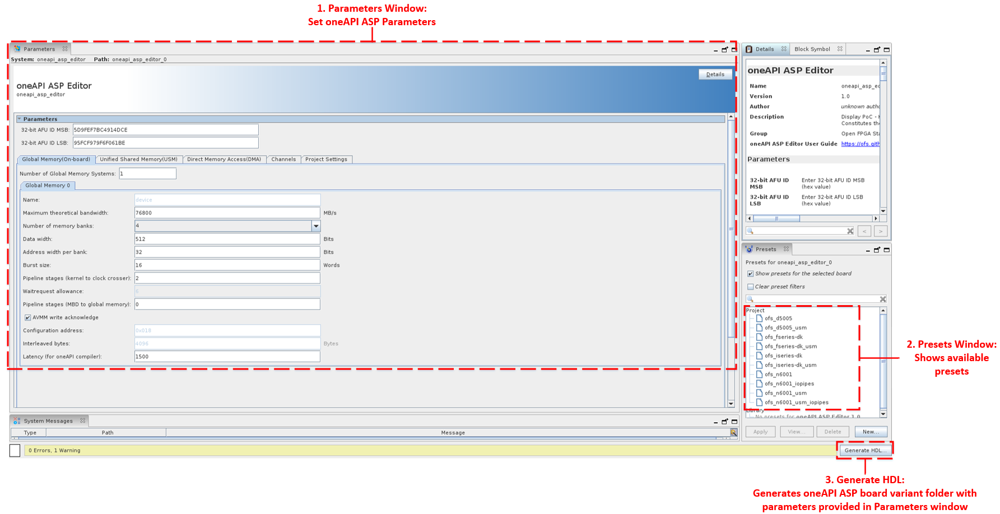

Table below explains the functionality marked in the figure.

**Table B-1 oneAPI ASP Editor GUI Functionality**

| # | Editor Function | Description |
|---------|---------|---------|
| 1 |  Parameters Window | The oneAPI ASP interface settings can be set using the parameters window. Users can also derive these settings from the FIM interfaces using presets created from the FIM settings (this requires `OPAE_PLATFORM_ROOT` environment variable to be set, for more information, refer to the user flow in section B.2). Details of each parameter is provided in section B.3 |
| 2 |  Presets Window | Quartus Prime provides an option to create, modify, and save parameter values as a preset file. You can then apply the parameter values in the preset file to the current component that you are parameterizing. The presets window shows the OFS reference platform presets provided in the oneapi-asp. Table B-3 summarizes the presets provided. You can also save your own preset file , e.g. to saving a custom board variant settings.  **Note:** For more information about applying presets, please refer to [Quartus® Prime Pro Edition User Guide: Getting Started](https://www.intel.com/content/www/us/en/docs/programmable/683463/current/viewing-applying-and-deleting-ip-presets.html) |
| 3 |  Generate HDL | The Generate HDL button creates the directory structure for building the oneAPI ASP for selected board variant with the parameters set in the parameter window. It performs the following tasks:  * Creates the directory structure and copies required platform files for the selected board variant & device  * Generates the Verilog header and package files (`ofs_asp.vh` and `ofs_asp_pkg.sv`) for a board variant based on parameters set in the oneAPI ASP Editor  * Generates the `board_env.xml`, `board_spec.xml`, `oneapi_afu.json`  > **Note:** For more information about this XML files, please refer to section 2.0. For more information about `oneapi_afu.json`, refer to table 5-7 in section 5.3   * Generates `parameters.tcl` file used by the `board_hw.tcl` file  > **Note:** For more information about the `board_hw.tcl` file refer to section 5.3.3 | 

The design files for the oneAPI ASP Editor are located in `oneapi-asp/oneapi_asp_editor/` directory. The directory structure of the `oneapi_asp_editor` folder is shown below.

<pre>
oneapi-asp/
|--common/
|--|--bringup/
|--|--hardware/
|--|--linux64/
|--|--scripts/
|--|--source/
|--Platform-Directories (example : n6001, d5005, fseries-dk, iseries-dk)
|--oneapi_asp_editor
|--|--oneapi_asp_editor_hw.tcl
|--|--oneapi_asp_editor.qpf
|--|--oneapi_asp_editor.qsf
|--|--scripts/
|--|--ip/
|--|--|--presets/
|--|--|--oneapi_asp_editor.ip
</pre>

Table below provides more information about the files in the `oneapi-asp/oneapi_asp_editor` directory. 

**Table B-2: `oneapi_asp_editor` Directory Contents**

| File/Folder | Description |
|---------|---------|
| oneapi_asp_editor_hw.tcl | The TCL file providing the oneAPI ASP editor functionality |
| scripts | Helper scripts used by the `oneapi_asp_editor_hw.tcl` to built the `oneapi-asp` |
| oneapi_asp_editor.qpf oneapi_asp_editor.qsf | Dummy Quartus project files to allow parameterization of the editor using IP Parameter Editor GUI |
| ip | Contains the `oneapi_asp_editor.ip` file and `presets` folder |
| ip/oneapi_asp_editor.ip | This is the default .ip file for the oneAPI ASP editor which is used to parameterize and generate `oneapi-asp` design files |  
| ip/presets | This contains the [preset](https://www.intel.com/content/www/us/en/docs/programmable/683463/24-1/applying-preset-parameters-for-specific.html) files for OFS reference platforms. Table B-3 summarizes the preset files |

**Table B-3: Presets**

| Device | OFS Reference Platform | Plaform Name in `oneapi-asp` |  Board Variant | Preset File |
|---------|---------|---------|---------|---------|
| Agilex™ 7 FPGA | Intel® FPGA SmartNIC N6001-PL | n6001 | ofs_n6001   ofs_n6001_usm   ofs_n6001_iopipes   ofs_n6001_usm_iopipes | ofs_n6001.qprs   ofs_n6001_usm.qprs   ofs_n6001_iopipes.qprs   ofs_n6001_usm_iopipes.qprs |
| Agilex™ 7 FPGA | Agilex™ 7 FPGA F-Series Development Kit (2x F-Tile) | fseries-dk | ofs_fseries-dk   ofs_fseries-dk_usm | ofs_fseries-dk.qprs   ofs_fseries-dk_usm.qprs |
| Agilex™ 7 FPGA | Agilex™ 7 FPGA I-Series Development Kit (2x R-Tile and 1xF-Tile) | iseries-dk | ofs_iseries-dk   ofs_Iseries-dk_usm | ofs_iseries-dk.qprs   ofs_iseries-dk_usm.qprs |
| Stratix® 10 FPGA | Intel® FPGA PAC D5005 | d5005 | ofs_d5005   ofs_d5005_usm | ofs_d5005.qprs   ofs_d5005_usm.qprs |

> **Note:** For more information about the board variants, please refer to Table 5-6 in section 5.3.

#### **B.2 oneAPI ASP Editor User Flow**

The expected user flow with the oneAPI ASP Editor is shown in figure below. 

**Figure B-2: oneAPI ASP Editor User Flow**

The oneAPI ASP Editor can be opened in IP Parameter Editor GUI in Quartus Prime. Building oneAPI ASPs requires FIM compilation to be complete successfully and a PR tree to be generated. The `OPAE_PLATFORM_ROOT` environment variable must be set to point to the PR tree generated during FIM build. 

You can use the oneAPI ASP Editor GUI to set parameters for your oneAPI ASP. Based on your FIM and target platform, you can use one of the options below:

1. If you are building `oneapi-asp` for one of the OFS reference platforms, presets are provided in the `oneapi-asp/oneapi_asp_editor/ip/presets` directory. These presets should show up in the Presets window as shown in figure B-1. Table B-3 summarizes the available presets. Select and apply the preset matching the reference platform you are targeting. Save the settings and click on "Generate HDL".

> **Notes:**   1. For more information about how to apply presets, refer to [Quartus® Prime Pro Edition User Guide: Getting Started](https://www.intel.com/content/www/us/en/docs/programmable/683463/24-1/viewing-applying-and-deleting-ip-presets.html)   2. The oneAPI ASP editor generates only the selected board variant, if you would like to generate all board variants for an OFS reference platform, you will have to apply each preset and click "Generate HDL" for each one sequentially.

2. If you have a custom FIM, you can either use the `ofs_fim.qprs` or set all parameters for the oneAPI ASP yourself. 

* The `ofs_fim.qprs` file is created from presets generated during FIM compilation flow. This file gets created when the oneAPI ASP editor is opened in the IP Parameter Editor GUI if the `OPAE_PLATFORM_ROOT` environment variable is set to point to the PR tree generated during FIM build. The `ofs_fim.qprs` covers some of the interface settings for the oneAPI ASP, there are other parameters required by the ASP that must be set by you when using the `ofs_fim.qprs`. For more information about which parameters are set by the `ofs_fim.qprs`, please refer to section B.3.

*  Another option is to set all the oneAPI ASP Editor parameters yourself, use this option with caution. Please ensure the interface settings in your ASP match your FIM design.

Once the parameters are set, you can save optionally save your own preset file (if cutomizing editor parameters); then save the .ip (File -> Save) and click `Generate HDL`. For more information on the steps automated by `Generate HDL`, refer to table B-1.

> **Note:** For more information about saving custom presets, refer to [Quartus® Prime Pro Edition User Guide: Getting Started](https://www.intel.com/content/www/us/en/docs/programmable/683463/24-1/customizing-ip-presets.html) 

For more information about each parameter, refer to section B.3. For a step-by-step example of using the oneAPI ASP editor, refer to the [oneAPI Accelerator Support Package (ASP): Getting Started User Guide]. 

#### **B.3 oneAPI ASP Editor Parameters**

Figure and table below summarizes the oneAPI ASP Editor parameter settings. Figures B-3 to B-8 along with Tables B-5 to B-9 provide details on the parameters under each tab of the editor *Parameter* window. 

The tables B-3 to B-8 have an additional column `Derived from FIM settings`, the parameters marked yes in this are derived from the preset file generated from the FIM as shown in figure B-2. If you have applied this preset (`ofs_fim.qprs`) then the parameters marked `Yes` under `Derived from FIM settings` column are correctly set to support the interface provided by FIM, you only need to provide settings marked `No` under this column.

**Figure B-3: oneAPI ASP Editor Parameters Summary**

**Table B-4: oneAPI ASP Editor Parameters Summary**

| Parameter/Tab | Description | 
|---------|---------|
| AFU ID | The AFU ID is stored in a register (`board_afu_id` register shown in Figures 5-2 to 5-5) in the oneAPI ASP hardware design. The board AFU ID is used by the MMD layer during board discovery.  * 32-bit AFU ID MSB: Upper 32 bits of the board AFU ID  * 32-bit AFU ID LSB: Lower 32 bits of the board AFU ID  > **Note:** The AFU ID is not derived from `ofs_fim.qprs`, if you are using the `ofs_fim.qprs` file, this value must be set manually. Ensure the value in MMD (`*_ASP_AFU_ID` in `oneapi-asp/common/source/CMakeLists.txt` matches the value set in this register before building the `oneapi-asp` using `build-asp.sh`)  |
| Global Memory(On-board) Tab | Contains the parameter settings for configuring the global memory for the oneAPI kernel. The settings from this tab are used to generate the global memory interface in the `board_spec.xml` as well as parameterize the global memory interface in the oneAPI ASP hardware design  > **Note:** For more information about `global_mem` element in `board_spec.xml`, please refer to section 2.1.5 in this manual |
| Unified Shared Memory(USM) Tab | Contains the parameter settings for configuring the Unified Shared Memory interface. The settings from this tab are used to generate the global memory interface with `allocation_type=host, shared` in `board_spec.xml` to support USM. These parameters are also used in the oneAPI ASP hardware design for the USM datapath.  > **Note:** For more information about the USM interface support in `board_spec.xml`, please refer to the section 2.1.5.1.3 in this manual |
| Direct Memory Access(DMA) Tab | This tab is reserved for future use. Please do not edit the DMA settings. Keep the `Number of DMA Channels` set to 1 |
| Channels Tab | Contains the parameter settings for configuring I/O Pipes to/from oneAPI kernel. The settings from this tab are used to generate the `channels` settings in `board_spec.xml` as well as parameterize the I/O pipes interface in oneAPI ASP hardware design  > **Note:** For more information about `channels`, please refer to section 2.1.8 in this manual |
| Project Settings Tab | In addition to interface settings, oneAPI ASP design (hardware as well as the `board_spec.xml` requires some more details (e.g. project names, resources) to create oneAPI ASP directory sucessfully. This tab contains some of the additional settings required |

**Figure B-4: oneAPI ASP Editor Global Memory(On-board) Parameters**

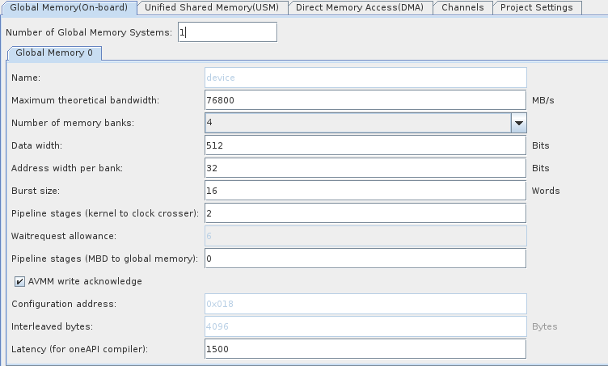

**Table B-5: oneAPI ASP Editor Global Memory(On-board) Parameters**

> **Note:** All parameters in the table below except `Number of Global Memory Systems` are for different for each global memory in the oneAPI ASP. If the `Number of Global Memory Systems` is increased, a new tab (titled `Global Memory <id>`, where `<id>` starts at 0 for the lowest global memory) gets added for each global memory and you must set the parameters for each additional global memory under its tab.

| Parameter/Tab | Editable | Derived from FIM Settings (only if `ofs_fim.qprs` is applied) | Description | 
|---------|---------|---------|---------|
| Number of Global Memory Systems | - (see Note in description) | No |Set the numbr of global memory systems (for on-board memories)   > **Note:** oneapi-asp tag ofs-2024.2-1 supports upto 4 global memory systems |
| Name | No | No | The name of global memory (not editable, set to `device`), this value is used as the value for `name` attribute for `global_mem` element in `board_spec.xml`  > **Note:** For more information about `global_mem` element attributes, please refer to table 2-7 in section 2.1.5 in this manual |
| Maximum theoretical bandwidth | Yes | Yes | The maximum theoretical bandwidth for the global memory, this is used as the value for `max_bandwidth` attribute for `global_mem` element in `board_spec.xml`  > **Note:** For more information about calculating `max_bandwidth`, please refer to table 2-7 in section 2.1.5 in this manual  |
| Number of memory banks | Yes | Yes | Number of memory banks in a single global memory (e.g. if your board has four DDR4 banks in a single global memory, this value must be set to 4). This value is used in the oneAPI kernel interface design in the oneAPI ASP hardware design files as well as to calculate number of `interface` for each global memory in the `board_spec.xml`   *Permitted Values:* 1, 2, 4, 8 |
| Data width | Yes | Yes | Width of the data bus from oneAPI kernel to on-board memory bank (interface width to individual memory bank in a global memory). This is used as the value for `width` of `interface` in `global_mem` element in `board_spec.xml` as well as in oneAPI ASP hardware design parameterization  > **Note:** For more information about `interface`, please refer to in section 2.1.4 in this manual |
| Address width per bank | Yes | Yes | The address width for each individual memory bank in the global memory. This is used to calculate the `size` and `address` attributes of each `interface` of `global_mem` element in `board_spec.xml` as well as in oneAPI ASP hardware design parameterization |
| Burst size | Yes | No | The burst size for each individual memory bank interface in the global memory. This is used to calculate the `maxburst` value of `interface` in `global_mem` element in `board_spec.xml` as well as in oneAPI ASP hardware design parameterization |
| Pipeline stages (kernel to clock crosser) | Yes | No | Number of pipeline stages in kernel to global memory data path (controls pipe depth of pipeline bridge on this data path in `kernel_wrapper.v`) |
| Waitrequest allowance | No | No | The value is not editable through the Editor and is calculated from number of `Pipeline stages (kernel to clock crosser)`. This is used to set the `waitrequest_allowance` for `interface` in `global_mem` element in `board_spec.xml` as well as in oneAPI ASP hardware design parameterization |
| Pipeline stages (MBD to global memory) | Yes | No | Number of pipeline stages in the data path from Memory Bank Divider (MBD) to the global memory interface. This value is used in oneAPI ASP hardware design parameterization |
| AVMM write acknowledge | Yes | No | This is used in controlling the value for `bsp_avmm_write_ack` for `interface` in `global_mem` element in `board_spec.xml` as well as in deciding the addition of `avmm_wr_ack_gen_inst` block in the oneAPI ASP hardware design (refer to Figure 5-2 to 5-6) |
| Configuration address | No | No | This value is not editable and is calculated automatically by the `oneapi_asp_editor_hw.tcl` for all global memories. The value is used for the `config_addr` attribute of `global_mem` element in `board_spec.xml`  > **Note:** For more information about `config_addr`, refer to table 2-7 in section 2.1.5 |
| Interleaved bytes | No | No | This value is not editable and is set to `4096` in oneapi-asp tag ofs-2024.2-1, this is a known issue, please refer to release notes for more information on the workaround. This value is used for the `interleaved_bytes` attribute of `global_mem` element in `board_spec.xml`  > **Note:** For more information about the calculation of `interleaved_bytes` refer to table 2-7 in section 2.1.5 |
| Latency (for oneAPI compiler) | Yes | No | This value is used for `latency` attribute of `global_mem` element in `board_spec.xml` |

**Figure B-5: oneAPI ASP Editor Unified Shared Memory Parameters**

**Table B-6: oneAPI ASP Editor Unified Shared Memory Parameters**

| Parameter/Tab | Editable | Derived from FIM Settings (only if `ofs_fim.qprs` is applied) | Description | 
|---------|---------|---------|---------|
| Unified Shared Memory Interface | Yes | No | Used to enable or disable Unified Shared Memory(USM) interface in the oneAPI ASP design. When this box is selected, a `global_mem` element with `allocation_type=host, shared` is added to the `board_spec.xml` and the data path for USM is added to the oneAPI ASP hardware design (Figures 5-3, 5-5 show the implementaion of the USM data path) |
| Name | No | No |  The name of global memory interface for USM (not editable, set to `host`), this value is used as the value for `name` attribute for `global_mem` element for USM interface in `board_spec.xml`  > **Notes:**   * For more information about `global_mem` element attributes, please refer to table 2-7 in section 2.1.5 in this manual   * For more information about Unified Shared Memory interface, refer to section 2.1.5.1.3 | 
| Maximum theoretical bandwidth | Yes | No | Maximum bandwidth for the USM interface. This is used as the value for `max_bandwidth` attribute for `global_mem` element in `board_spec.xml` |
| Number of interfaces | No | No | This is not editable, set to 1 for USM interface |
| Data width | Yes | No | The data width for the USM interface, this value is used for the `width` of `interface` in `global_mem` element for USM in `board_spec.xml |
| Address width | Yes | No | The address width for Unified Shared Memory. This is used to calculate the `size` attribute for `interface` of `global_mem` element for USM in `board_spec.xml` |
| Burst size | Yes | No | The burst size for USM interface. This is used to calculate the `maxburst` value for `interface` in `global_mem` element for USM in `board_spec.xml` as well as to calculate the burst count setting for this interface in oneAPI ASP hardware design  |
| Pipeline stages | Yes | No | Number of pipeline stages in USM data path (controls pipe depth of pipeline bridge on this data path in `kernel_wrapper.v`) |
| Waitrequest allowance | No | No | The value is not editable through the Editor and is calculated from number of `Pipeline stages` setting. This is used to set the `waitrequest_allowance` for `interface` in `global_mem` element for USM in `board_spec.xml` |
| Interleaved bytes | No | No | This value is not editable and is  set to `1024`, this value is used for the `interleaved_bytes` attribute of `global_mem` element for USM in `board_spec.xml` |
| Latency (for oneAPI compiler) | Yes | No | This value is used for `latency` attribute of `global_mem` element for USM in `board_spec.xml` |

**Figure B-6: oneAPI ASP Editor Direct Memory Access(DMA) Parameters**

**Table B-7: oneAPI ASP Editor Direct Memory Access(DMA) Parameters**

| Parameter/Tab | Editable | Derived from FIM Settings (only if `ofs_fim.qprs` is applied) | Description | 
|---------|---------|---------|---------|
| Number of DMA Channels | - (see Note in description) | No | Reserved for future use - This value is used in the oneAPI ASP hardware design in implementation of the data path from host to DMA engine (see Figure 5-2 to 5-5 for the data path diagram)  > **Note:** oneapi-asp tag ofs-2024.2-1 supports only 1 DMA channel |

**Figure B-7: oneAPI ASP Editor Channels Parameters**

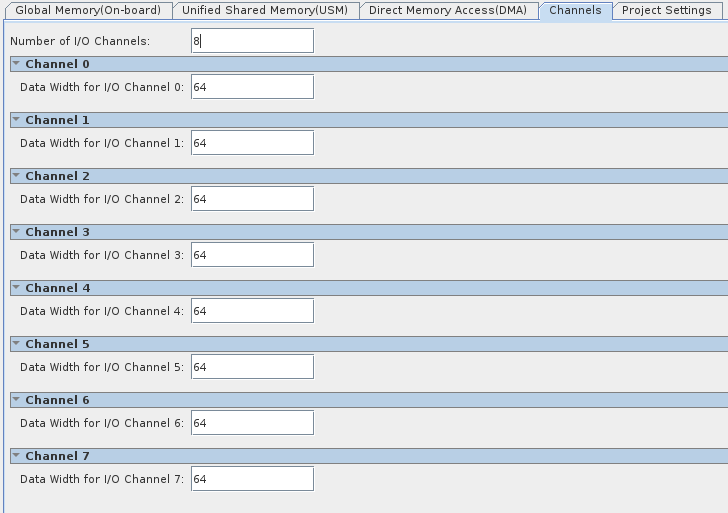

**Table B-8: oneAPI ASP Editor Channels Parameters**

| Parameter/Tab | Editable | Derived from FIM Settings (only if `ofs_fim.qprs` is applied) | Description | 
|---------|---------|---------|---------|
| Number of I/O Channels | Yes | Yes | Number of I/O pipes to/from oneAPI kernel. This value is used in generating the `channels` interface in `board_spec.xml` as well adding the I/O pipes interface in the oneAPI ASP hardware design (Figures 5-4 to 5-5 show the I/O pipes interface from oneAPI kernel to HSSI Subsystem) |
| Data Width for I/O Channel `<id>` | Yes | Yes | The width of each individual I/O pipe interface to/from oneAPI kernel. The `<id>` value starts at 0 for the first channel |

**Figure B-8: oneAPI ASP Editor Project Settings Parameters**

**Table B-9: oneAPI ASP Editor Project Settings Parameters**

| Parameter/Tab | Editable | Derived from FIM Settings (only if `ofs_fim.qprs` is applied) | Description | 
|---------|---------|---------|---------|
| Device Family | Yes | Yes | Set to target device family for your platform, options are:  * Stratix® 10 FPGA   *  Agilex™ 7 FPGA|
| Platform name | Yes | No | Sets the name of the top-level directory that stores oneAPI ASP design files for your target platform and board variant |
| Board variant name | Yes | No | Sets the name for the board variant directory |
| Quartus version | Yes | Yes | Sets the Quartus version for the oneAPI ASP |
| OneAPI compiler version | Yes | No | Sets the oneAPI compiler version, this is used as the value for `version` attribute in `board_env.xml`  > **Note:** For more information about `board_env.xml` attributes, refer to section 2.2 in this manual |
| Snoop port enable | Yes | No | When this is enabled, it enables the snoop port in the Memory Bank Divider (`acl_asp_snoop_port`)  > **Note:** For more information about Memory Bank Divider, refer to section 3.1.1 |
| Quartus project name | Yes | No | Sets the value of `project` attribute of `compile` element in `board_spec.xml`  > **Note:** For more information about the `compile` element attributes, refer to section 2.1.2 in this manual |
| Quartus revision name | Yes | No | Sets the value of `revision` attribute of `compile` element in `board_spec.xml`  > **Note:** For more information about the `compile` element attributes, refer to section 2.1.2 in this manual |
| Device model | Yes | No | Specify the name of the device model file. This value is used to set the file name for `device_model` attribute of `device` element  > **Note:** For more information about `device` element attributes, refer to section 2.1.3 |
| ALMs | Yes | Yes | Adaptive Logic Modules(ALMs) that the board design consumes in the absence of any kernel. This value is used for populating `used_resources` attribute of `device` element  > **Note:** For more information about `device` element attributes, refer to section 2.1.3 |
| FFs | Yes | Yes | Flip-flops(FFs) that the board design consumes in the absence of any kernel. This value is used for populating `used_resources` attribute of `device` element  > **Note:** For more information about `device` element attributes, refer to section 2.1.3 |
| DSPs | Yes | Yes | Digital Signal Processing(DSPs) blocks that the board design consumes in the absence of any kernel. This value is used for populating `used_resources` attribute of `device` element  > **Note:** For more information about `device` element attributes, refer to section 2.1.3 |
| M20Ks | Yes | Yes | RAM (M20Ks) blocks that the board design consumes in the absence of any kernel. This value is used for populating `used_resources` attribute of `device` element  > **Note:** For more information about `device` element attributes, refer to section 2.1.3  |
| Kernel CRA data width | No | No | This is not editable and is set to `64`. This parameter sets the width of Kenel CRA interface and is used as the `width` value of `kernel_cra` port in `interfaces` element in `board_spec.xml`  > **Notes:**   * For more information about `kernel_cra`, please refer to table 3-4 in section 3.2.1  * For more information about `interfaces` element, refer to section 2.1.7  * For more information about `interface` attribute, refer to section 2.1.4 |
| Kernel CRA pipeline stages | Yes | No | Number of pipeline stages in host to kernel CRA Avalon® interface (controls pipe depth of pipeline bridge on this control path in `kernel_wrapper.v`)  > **Note:** For more information about `kernel_cra`, please refer to table 3-4 in section 3.2.1 |
| Kernel CRA waitrequest allowance | No | No | The value is not editable through the Editor and is calculated from number of `Kernel CRA pipeline stages` setting. This is used to set the `waitrequest_allowance` of `kernel_cra` port in `interfaces` element in `board_spec.xml` |
| Range for low clock | No | No | Sets the lower threshold for the user clock frequency (kernel clock) range. This value is used in the creation of `oneapi_afu.json` file. This is not editable and is set to the following values based on target device:  * Stratix® 10 FPGA: auto-400  * Agilex™ 7 FPGA: auto-600  > **Note:** For more information about `oneapi_afu.json`, refer to table 5-7 in section 5.3 |
| Range for high clock | No | No | Sets the upper threshold for the user clock frequency (kernel clock) range. This value is used in the creation of `oneapi_afu.json` file. This is not editable and is set to the following values based on target device:  * Stratix® 10 FPGA: auto-800  * Agilex™ 7 FPGA: auto-1200  > **Note:** For more information about `oneapi_afu.json`, refer to table 5-7 in section 5.3 |

## **Document Revision History**

| Date | Release | Changes |
|---------|---------|---------|
| May 26, 2023 | 2023.1 | First release of *oneAPI Accelerator Support Package(ASP) Reference Manual: Open FPGA Stack* on https://ofs.github.io/ |
| September 15, 2023 | 2023.2 | 1. Section 1:  * Updated Figure 1-3 to add HSSI path  2. Section 2:  * Added `channels` element in figure 2-1 and table 2-1, added information about board variants below this table  * Added Section 2.1.8 on `channels` element  3. Section 4:  * Added information about MMD API (table 4-1) and new sections 4.1.1 to 4.1.21  4. Section 5:  * Moved `oneapi-asp` build flow information into new section 5.2  * Added new table 5-6 with oneAPI ASP board variants information  * Added hardware design diagrams and information about new board variants with I/O pipes support (Hardware Design with IO Pipes and Hardware Design with IO Pipes and USM)  * Updated hardware design diagrams to show PF/VF Mux/De-mux and added information about PF/VF mapping in section 5.3  * Added new section on UDP engine (section 5.3.4)  * Updated figure 5-10 to remove `import_opencl_kernel.tcl` and `add_bbb_to_pr_project.tcl`  * Updated table 5-13 to add `mmd_iopipes.h` and `mmd_iopipes.cpp` files |
| Dec 13, 2023 | 2023.3-1 | 1. Section 2:  * Update table 2-5 to add information about port parameter  * Added new section 2.1.4.1 on port parameter  * Update table & figure numbers  * Changed "master" and "slave" ports to "host" & "agent" ports in figures  2. Section 4:  * Added new executable call supported by initialize utility  3. Section 5:  * Updated `initialize` utility information to add `clang-offload-extract`command usage  * Updated table with hardware design files information, added information about ofs_asp.sdc  * Updated compile flow diagram, added information about new `gen-asp-quartus-report.tcl` script  * Updated hardware implementation diagrams for signal name and IP name changes, replaced `mem_if_vtp` block with `host_mem_if_vtp`  * Updated `OpenCL Memory Bank Divider` to `Memory Bank Divider`  * Updated `OpenCL Kernel Interface` to `Kernel Interface` |
| Feb 2, 2024 | 2023.3-2 | 1. Section 5:  * Updated Table 5-8 to add PF/VF mapping for different FIM configurations |
| Mar 19, 2024 | 2024.1 | 1. Section 1:  * Added links for FIM developer guides for Agilex™ 7 FPGA F-Series Development Kit (2x F-Tile) and Agilex™ 7 FPGA I-Series Development Kit (2x R-Tile and 1xF-Tile)  * Added link to Intel® oneAPI DPC++/C++ Compiler Handbook for Intel® FPGAs  * Updated figure 1-3 to rename `OpenCL Memory Bank Divider` to `Memory Bank Divider`  2. Section 2:  * Replaced links to FPGA Optimization Guide for Intel® oneAPI Toolkits with links to Intel® oneAPI DPC++/C++ Compiler Handbook for Intel® FPGAs  * Fixed format for table 2-6   * Updated figure 2-6 to rename `OpenCL Memory Bank Divider` to `Memory Bank Divider`  * Replaced broken link for USM (Unified Shared Memory)   3. Section 3:  * Updated `Memory Bank Divider`section to add information about `memory_bank_divider_hw.tcl`. Replaced figure showing GUI for the IP with parameters in `memory_bank_divider_hw.tcl` and added information about these parameters in table 3-1   * Updated port name `acl_bsp_snoop` to `acl_asp_snoop`and `acl_bsp_memorg_host` to `acl_asp_memorg_host` in table 3-2  * Updated `Kernel Interface` section to add information about `kernel_interface_hw.tcl`. Replaced figure showing GUI for the IP with parameters in `kernel_interface_hw.tcl` and added information about these parameters in table 3-3  4. Section 5:  * Replaced `board_env.xml` figure with code snippet  * Added links to README for `fseries-dk` & `iseries-dk` oneapi-asp folders in section 5.1  * Updated directory structure in section 5.1 and added information about design files common to oneapi-asp for OFS reference platforms  * Update file paths in table 5-2  * Update section for script file name changes from `build-bsp.sh` to `build-asp.sh`, `setup-bsp.py` to `setup-asp.py`, `build-bsp-sw.sh` to `build-asp-sw.sh`  * Updated figure 5-2 to add a step in `build-asp.sh` script to copy common files to platform directory  * Added Note on `OPAE_SDK_REPO_BRANCH` environment variable in table 5-5  * Added new OFS reference platforms (`fseries-dk` and `iseries-dk`) in table 5-6  * Update section for design file name changes from `board.qsys` to `board_hw.tcl`, `ddr_board.qsys` to `ddr_board_hw.tcl`, `ddr_channel.qsys` to `ddr_channel_hw.tcl`, `bsp_logic.sv` to `asp_logic.sv`, `bsp_design_files.tcl` to `asp_design_files.tcl`  * Updated signal names `bsp_mem_if` to `asp_mem_if`, `acl_bsp_memorg_host` to `acl_asp_memorg_host`, `host_mem_if_pa_bsp` to `host_mem_if_pa_asp`  * Updated hardware implementation diagrams (figure 5-2 to 5-5) for new file, signal names  * Added information about RTL files to table 5-7  * Added `iseries-dk_1pf_1vf.ofss` in table 5-8  * Fixed section 5.3.1 header and added more information about PIM blocks in section 5.3.1  * Added new section 5.3.3 on `board_hw.tcl`  * Updated figure 5-10 to add information about `ip-deploy` and `qsys-generate` for `board_hw.tcl`  5. Appendix:   * Added appendix section with MMD debug variable information |
| July 15, 2024 | 2024.2 | 1. Section 1:  * Added document overview table (Table 1-1)  2. Section 2:  * Added a section number 2.1.5.1.3 to `Unified Shared Memory Section`  3. Section 5:  * Added information about `oneapi_afu.json` to table 5-7  * Added information about new parameters in `board_hw.tcl` in table 5-10(NUMBER_OF_DMA_CHANNELS, DATA_WIDTH, MAX_BURST_SIZE, KERNEL_GLOBALMEM_WAITREQUEST_ALLOWANCE) and `parameters.tcl`  * Added Note about `acl_quartus_report.txt` in section 5.3.5   * Updated table 5-10 for parameters for multiple global memories (NUMBER_OF_GLOBAL_MEMORY_SYSTEMS)   4. Appendix A:  * Modified appendix to split into sections explaining debug variables for MMD and runtime  * Added new section for `Extracting oneAPI Binary Informtion using `aocl binedit` Command`   5. Appendix B:   * Added Appendix B to describe new GUI based flow using oneAPI ASP Editor |

## Notices & Disclaimers

Altera® Corporation technologies may require enabled hardware, software or service activation. No product or component can be absolutely secure. Performance varies by use, configuration and other factors. Your costs and results may vary. You may not use or facilitate the use of this document in connection with any infringement or other legal analysis concerning Altera or Intel products described herein. You agree to grant Altera Corporation a non-exclusive, royalty-free license to any patent claim thereafter drafted which includes subject matter disclosed herein. No license (express or implied, by estoppel or otherwise) to any intellectual property rights is granted by this document, with the sole exception that you may publish an unmodified copy. You may create software implementations based on this document and in compliance with the foregoing that are intended to execute on the Altera or Intel product(s) referenced in this document. No rights are granted to create modifications or derivatives of this document. The products described may contain design defects or errors known as errata which may cause the product to deviate from published specifications. Current characterized errata are available on request. Altera disclaims all express and implied warranties, including without limitation, the implied warranties of merchantability, fitness for a particular purpose, and non-infringement, as well as any warranty arising from course of performance, course of dealing, or usage in trade. You are responsible for safety of the overall system, including compliance with applicable safety-related requirements or standards. © Altera Corporation. Altera, the Altera logo, and other Altera marks are trademarks of Altera Corporation. Other names and brands may be claimed as the property of others.

OpenCL* and the OpenCL* logo are trademarks of Apple Inc. used by permission of the Khronos Group™.
[OFS-N6001 release]: https://github.com/OFS/ofs-n6001/releases

[FPGA Device Feature List (DFL) Framework Overview]: https://github.com/OFS/linux-dfl/blob/fpga-ofs-dev/Documentation/fpga/dfl.rst#fpga-device-feature-list-dfl-framework-overview
[ofs-platform-afu-bbb]: https://github.com/OFS/ofs-platform-afu-bbb
[intel-fpga-bbb]: https://github.com/OPAE/intel-fpga-bbb.git
[Connecting an AFU to a Platform using PIM]: https://github.com/OFS/ofs-platform-afu-bbb/blob/master/plat_if_develop/ofs_plat_if/docs/PIM_AFU_interface.md
[PIM Core Concepts]: https://github.com/OFS/ofs-platform-afu-bbb/blob/master/plat_if_develop/ofs_plat_if/docs/PIM_core_concepts.md
[AFU Tutorial]: https://github.com/OFS/examples-afu/tree/main/tutorial
[AFU types]: https://github.com/OFS/examples-afu/tree/main/tutorial/afu_types
[Host Channel]: https://github.com/OFS/ofs-platform-afu-bbb/blob/master/plat_if_develop/ofs_plat_if/docs/PIM_ifc_host_channel.md
[Local Memory]: https://github.com/OFS/ofs-platform-afu-bbb/blob/master/plat_if_develop/ofs_plat_if/docs/PIM_ifc_local_mem.md
[OPAE C API]: https://ofs.github.io/ofs-2024.2-1/sw/fpga_api/prog_guide/readme/#opae-c-api-programming-guide
[example AFUs]: https://github.com/OFS/examples-afu.git
[examples AFU]: https://github.com/OFS/examples-afu.git
[PIM Tutorial]: https://github.com/OFS/examples-afu/tree/main/tutorial
[Non-PIM AFU Development]: https://github.com/OFS/examples-afu/tree/main/tutorial
[Intel FPGA IP Subsystem for PCI Express IP User Guide]: https://github.com/OFS/ofs.github.io/blob/main/docs/hw/common/user_guides/ug_qs_pcie_ss.pdf
[Memory Subsystem Intel FPGA IP User Guide]: https://www.intel.com/content/www/us/en/secure/content-details/686148/memory-subsystem-intel-fpga-ip-user-guide-for-intel-agilex-ofs.html?wapkw=686148&DocID=686148
[OPAE.io]: https://opae.github.io/latest/docs/fpga_tools/opae.io/opae.io.html
[OPAE GitHub]: https://github.com/OFS/opae-sdk

[Intel FPGA Download Cable II]: https://www.intel.com/content/www/us/en/products/sku/215664/intel-fpga-download-cable-ii/specifications.html

[Intel FPGA Download Cable Driver for Linux]: https://www.intel.com/content/www/us/en/support/programmable/support-resources/download/dri-usb-b-lnx.html 

[README_ofs_n6001_eval.txt]: https://github.com/OFS/ofs-n6001/releases/tag/ofs-2024.1

[FIM MMIO Regions]: https://ofs.github.io/ofs-2024.2-1/hw/n6001/reference_manuals/ofs_fim/mnl_fim_ofs_n6001/#6-mmio-regions

[evaluation script]: https://github.com/OFS/ofs-n6001/releases/tag/ofs-2024.1
[OFS]: https://github.com/OFS
[OFS GitHub page]: https://ofs.github.io
[DFL Wiki]: https://github.com/OPAE/linux-dfl/wiki
[release notes]: https://github.com/OFS/ofs-agx7-pcie-attach/releases/tag/ofs-2025.1-1

[Setting Up Required Environment Variables]: https://ofs.github.io/ofs-2024.2-1/hw/n6001/dev_guides/fim_dev/ug_dev_fim_ofs_n6001/#431-setting-up-required-environment-variables

[4.0 OPAE Software Development Kit]: https://ofs.github.io/ofs-2024.2-1/hw/n6001/user_guides/ug_qs_ofs_n6001/ug_qs_ofs_n6001/#40-opae-software-development-kit

[Signal Tap Logic Analyzer: Introduction & Getting Started]: https://www.intel.com/content/www/us/en/programmable/support/training/course/odsw1164.html
[Quartus Pro Prime Download]: https://www.intel.com/content/www/us/en/software-kit/782411/intel-quartus-prime-pro-edition-design-software-version-23-2-for-linux.html

[PCIe Subsystem Intel FPGA IP User Guide for Agilex™ OFS]: https://www.intel.com/content/www/us/en/secure/content-details/690604/pcie-subsystem-intel-fpga-ip-user-guide-for-intel-agilex-ofs.html?wapkw=690604&DocID=690604

[Memory Subsystem Intel FPGA IP User Guide for Agilex™ OFS]: https://www.intel.com/content/www/us/en/secure/content-details/686148/memory-subsystem-intel-fpga-ip-user-guide-for-intel-agilex-ofs.html?wapkw=686148&DocID=686148

[Ethernet Subsystem Intel FPGA IP User Guide]: https://www.intel.com/content/www/us/en/docs/programmable/773413/24-1-25-0-0/introduction.html

[Analyzing and Optimizing the Design Floorplan]: https://www.intel.com/content/www/us/en/docs/programmable/683641/21-4/analyzing-and-optimizing-the-design-03170.html 

[Partial Reconfiguration Design Flow - Step 3 - Floorplan the Design]: https://www.intel.com/content/www/us/en/docs/programmable/683834/21-4/step-3-floorplan-the-design.html

[Security User Guide: Intel Open FPGA Stack]: https://github.com/otcshare/ofs-bmc/blob/main/docs/user_guides/security/

[Pin-Out Files for Altera FPGAs]: https://www.intel.com/content/www/us/en/support/programmable/support-resources/devices/lit-dp.html

[E-Tile Channel Placement Tool]: https://www.intel.com/content/www/us/en/content-details/652292/intel-e-tile-channel-placement-tool.html?wapkw=e-tile%20channel%20placement%20tool&DocID=652292
[License quartus-0.0-0.01iofs-linux.run]: https://github.com/OFS/ofs-d5005/blob/release/1.0.x/license/quartus-0.0-0.01iofs-linux.run
[OFS D5005 FIM Github Branch]: https://github.com/OFS/ofs-d5005
[OFS FIM_COMMON Github Branch]: https://github.com/OFS/ofs-fim-common
[OPAE SDK Branch]: https://github.com/OFS/opae-sdk/tree/2.12.0-5
[OPAE SDK Tag]: https://github.com/OFS/opae-sdk/releases/tag/2.12.0-5
[OPAE SDK SIM Branch]: https://github.com/OFS/opae-sim/tree/2.12.0-5
[OPAE SDK SIM Tag]: https://github.com/OFS/opae-sim/releases/tag/2.12.0-5
[Linux DFL]: https://github.com/OFS/linux-dfl
[Kernel Driver Branch]: https://github.com/OFS/linux-dfl/tree/ofs-2024.1-6.1-2
[Kernel Driver Tag]: https://github.com/OFS/linux-dfl/releases/tag/ofs-2024.1-6.1-2
[OFS Release]: https://github.com/OFS/ofs-d5005/releases/
[Quartus® Prime Pro Edition Linux]: https://www.intel.com/content/www/us/en/software-kit/782411/intel-quartus-prime-pro-edition-design-software-version-25-1-for-linux.html

[Qualified Servers]: https://www.intel.com/content/www/us/en/products/details/fpga/platforms/pac/d5005/view.html
[Open FPGA Stack Reference Manual - MMIO Regions section]: https://ofs.github.io/ofs-2024.1-1/hw/d5005/reference_manuals/ofs_fim/mnl_fim_ofs_d5005/#7-mmio-regions
[Device Feature Header (DFH) structure]: https://ofs.github.io/ofs-2024.1-1/hw/d5005/reference_manuals/ofs_fim/mnl_fim_ofs_d5005/#721-device-feature-header-dfh-structure
[FPGA Device Feature List (DFL) Framework Overview]: https://github.com/ofs/linux-dfl/blob/fpga-ofs-dev/Documentation/fpga/dfl.rst#fpga-device-feature-list-dfl-framework-overview
[ofs-platform-afu-bbb]: https://github.com/OFS/ofs-platform-afu-bbb
[PIM Core Concepts]: https://github.com/OFS/ofs-platform-afu-bbb/blob/master/plat_if_develop/ofs_plat_if/docs/PIM_core_concepts.md
[Connecting an AFU to a Platform using PIM]: https://github.com/OFS/ofs-platform-afu-bbb/blob/master/plat_if_develop/ofs_plat_if/docs/PIM_AFU_interface.md
[AFU Tutorial]: https://github.com/OFS/examples-afu/tree/main/tutorial
[AFU types]: https://github.com/OFS/examples-afu/tree/main/tutorial/afu_types
[Host Channel]: https://github.com/OFS/ofs-platform-afu-bbb/blob/master/plat_if_develop/ofs_plat_if/docs/PIM_ifc_host_channel.md
[Local Memory]: https://github.com/OFS/ofs-platform-afu-bbb/blob/master/plat_if_develop/ofs_plat_if/docs/PIM_ifc_local_mem.md
[OPAE C API]: https://ofs.github.io/ofs-2024.1-1/sw/fpga_api/prog_guide/readme/#opae-c-api-programming-guide
[example AFUs]: https://github.com/OFS/examples-afu.git
[PIM Tutorial]: https://github.com/OFS/examples-afu/tree/main/tutorial
[Non-PIM AFU Development]: https://github.com/OFS/examples-afu/tree/main/tutorial
[Unit Level Simulation]: https://ofs.github.io/ofs-2024.1-1/hw/d5005/dev_guides/fim_dev/ug_dev_fim_ofs_d5005/#412-unit-level-simulation

[Security User Guide: Intel® Open FPGA Stack for Intel® Stratix 10® PCIe Attach FPGAs]: https://github.com/otcshare/ofs-bmc/blob/main/docs/user_guides/security/ug-pac-security.md
[Board Management User Guide]: https://github.com/otcshare/ofs-bmc/tree/main/docs/user_guides/bmc/ug_dev_bmc_ofs_n600x.md
[OPAE.io]: https://ofs.github.io/ofs-2024.1-1/sw/fpga_api/quick_start/readme/
[OPAE GitHub]: https://github.com/OFS/opae-sdk

[5.0 OPAE Software Development Kit]: https://ofs.github.io/ofs-2024.1-1/hw/d5005/user_guides/ug_qs_ofs_d5005/ug_qs_ofs_d5005/#50-opae-software-development-kit
[README_ofs_d5005_eval.txt]: https://github.com/OFS/ofs-d5005/blob/release/1.0.x/eval_scripts/README_ofs_d5005_eval.txt
[FIM MMIO Regions]: https://ofs.github.io/ofs-2024.1-1/hw/d5005/reference_manuals/ofs_fim/mnl_fim_ofs_d5005/#mmio_regions

[evaluation script]: https://github.com/OFS/ofs-d5005/releases/tag/ofs-2024.1-1
[OFS]: https://github.com/OFS
[OFS GitHub page]: https://ofs.github.io
[DFL Wiki]: https://github.com/OPAE/linux-dfl/wiki
[release notes]: https://github.com/OFS/ofs-d5005/releases/tag/ofs-2024.1-1

[OFS repository - linux-dfl]: https://github.com/OFS/linux-dfl
[OFS repository - linux-dfl - wiki page]: https://github.com/OFS/linux-dfl/wiki
[OPAE SDK repository]: https://github.com/OFS/opae-sdk
[OFS Site]: https://ofs.github.io

[Intel® oneAPI Base Toolkit (Base Kit)]: https://www.intel.com/content/www/us/en/developer/tools/oneapi/toolkits.html
[Intel® oneAPI Toolkits Installation Guide for Linux* OS]: https://www.intel.com/content/www/us/en/develop/documentation/installation-guide-for-intel-oneapi-toolkits-linux/top.html
[Intel® oneAPI Programming Guide]: https://www.intel.com/content/www/us/en/develop/documentation/oneapi-programming-guide/top.html
[FPGA Optimization Guide for Intel® oneAPI Toolkits]: https://www.intel.com/content/www/us/en/develop/documentation/oneapi-fpga-optimization-guide/top.html
[oneAPI-samples]: https://github.com/oneapi-src/oneAPI-samples.git
[examples-afu]: https://github.com/OFS/examples-afu.git

[Intel oneAPI FPGA Handbook]: https://www.intel.com/content/www/us/en/docs/oneapi-fpga-add-on/developer-guide/current.html

[OPAE SDK]: sw/fpga_api/quick_start/readme/
[OFS DFL kernel driver]: sw/fpga_api/quick_start/readme/#build-the-opae-linux-device-drivers-from-the-source

#AFU Dev
[Connecting an AFU to a Platform using PIM]: https://github.com/OPAE/ofs-platform-afu-bbb/blob/master/plat_if_develop/ofs_plat_if/docs/PIM_AFU_interface.md
[PIM Tutorial]: https://github.com/OFS/examples-afu/tree/main/tutorial/afu_types/01_pim_ifc
[Non-PIM AFU Development]: https://github.com/OFS/examples-afu/tree/main/tutorial/afu_types/03_afu_main

[Token authentication requirements for Git operations]: https://github.blog/2020-12-15-token-authentication-requirements-for-git-operations
[4.0 OPAE Software Development Kit]: /hw/n6001/user_guides/ug_qs_ofs_n6001/ug_qs_ofs_n6001/#40-opae-software-development-kit
[6.2 Installing the OPAE SDK On the Host]: /hw/f2000x/user_guides/ug_qs_ofs_f2000x/ug_qs_ofs_f2000x/#62-installing-the-opae-sdk-on-the-host

[Signal Tap Logic Analyzer: Introduction & Getting Started]: https://www.intel.com/content/www/us/en/programmable/support/training/course/odsw1164.html
[Quartus Pro Prime Download]: https://www.intel.com/content/www/us/en/software-kit/776241/intel-quartus-prime-pro-edition-design-software-version-23-1-for-linux.html

[Red Hat Linux ]: https://access.redhat.com/downloads/content/479/ver=/rhel---8/8.2/x86_64/product-software
[OFS GitHub Docker]: https://github.com/OFS/ofs.github.io/tree/main/docs/hw/common/user_guides/ug_docker

[Open FPGA Stack (OFS) Collateral Site]: https://ofs.github.io/ofs-2024.2-1
[OFS Welcome Page]: https://ofs.github.io/ofs-2024.2-1
[OFS Collateral for Stratix® 10 FPGA PCIe Attach Reference FIM]: https://ofs.github.io/ofs-2024.2-1/hw/doc_modules/contents_s10_pcie_attach
[OFS Collateral for Agilex™ 7 FPGA PCIe Attach Reference FIM]: https://ofs.github.io/ofs-2024.2-1/hw/doc_modules/contents_agx7_pcie_attach
[OFS Collateral for Agilex™ SoC Attach Reference FIM]: https://ofs.github.io/ofs-2024.2-1/hw/doc_modules/contents_agx7_soc_attach

[Automated Evaluation User Guide: OFS for Stratix® 10 PCIe Attach FPGAs]: https://ofs.github.io/ofs-2024.2-1/hw/d5005/user_guides/ug_eval_ofs_d5005/ug_eval_script_ofs_d5005/
[Automated Evaluation User Guide: OFS for Agilex™ 7 PCIe Attach FPGAs]: https://ofs.github.io/ofs-2024.2-1/hw/common/user_guides/ug_eval_script_ofs_agx7_pcie_attach/ug_eval_script_ofs_agx7_pcie_attach/
[Automated Evaluation User Guide: OFS for Agilex™ 7 SoC Attach FPGAs]: https://ofs.github.io/ofs-2024.2-1/hw/f2000x/user_guides/ug_eval_ofs/ug_eval_script_ofs_f2000x/

[Board Installation Guide: OFS for Acceleration Development Platforms]: https://ofs.github.io/ofs-2024.2-1/hw/common/board_installation/adp_board_installation/adp_board_installation_guidelines
[Board Installation Guide: OFS for Agilex™ 7 PCIe Attach Development Kits]: https://ofs.github.io/ofs-2024.2-1/hw/common/board_installation/devkit_board_installation/devkit_board_installation_guidelines
[Board Installation Guide: OFS For Agilex™ 7 SoC Attach IPU F2000X-PL]: https://ofs.github.io/ofs-2024.2-1/hw/common/board_installation/f2000x_board_installation/f2000x_board_installation

[Software Installation Guide: OFS for PCIe Attach FPGAs]: https://ofs.github.io/ofs-2024.2-1/hw/common/sw_installation/pcie_attach/sw_install_pcie_attach
[Software Installation Guide: OFS for Agilex™ 7 SoC Attach FPGAs]: https://ofs.github.io/ofs-2024.2-1/hw/common/sw_installation/soc_attach/sw_install_soc_attach

[Getting Started Guide: OFS for Stratix 10® FPGA PCIe Attach FPGAs]: https://ofs.github.io/ofs-2024.2-1/hw/d5005/user_guides/ug_qs_ofs_d5005/ug_qs_ofs_d5005/
[Getting Started Guide: OFS for Agilex™ 7 PCIe Attach FPGAs (I-Series Development Kit (2xR-Tile, 1xF-Tile))]: https://ofs.github.io/ofs-2024.2-1/hw/iseries_devkit/user_guides/ug_qs_ofs_iseries/ug_qs_ofs_iseries/
[Getting Started Guide: OFS for Agilex™ 7 PCIe Attach FPGAs (F-Series Development Kit (2xF-Tile))]: https://ofs.github.io/ofs-2024.2-1/hw/ftile_devkit/user_guides/ug_qs_ofs_ftile/ug_qs_ofs_ftile/
[Getting Started Guide: OFS for Agilex™ 7 PCIe Attach FPGAs (Intel® FPGA SmartNIC N6001-PL/N6000-PL)]: https://ofs.github.io/ofs-2024.2-1/hw/n6001/user_guides/ug_qs_ofs_n6001/ug_qs_ofs_n6001/
[Getting Started Guide: OFS for Agilex™ 7 SoC Attach FPGAs]: https://ofs.github.io/ofs-2024.2-1/hw/f2000x/user_guides/ug_qs_ofs_f2000x/ug_qs_ofs_f2000x/

[Shell Technical Reference Manual: OFS for Stratix® 10 PCIe Attach FPGAs]: https://ofs.github.io/ofs-2024.2-1/hw/d5005/reference_manuals/ofs_fim/mnl_fim_ofs_d5005/
[Shell Technical Reference Manual: OFS for Agilex™ 7 PCIe Attach FPGAs]: https://ofs.github.io/ofs-2024.2-1/hw/n6001/reference_manuals/ofs_fim/mnl_fim_ofs_n6001/
[Shell Technical Reference Manual: OFS for Agilex™ 7 SoC Attach FPGAs]: https://ofs.github.io/ofs-2024.2-1/hw/f2000x/reference_manuals/ofs_fim/mnl_fim_ofs/

[Shell Developer Guide: OFS for Stratix® 10 PCIe Attach FPGAs]: https://ofs.github.io/ofs-2024.2-1/hw/d5005/dev_guides/fim_dev/ug_dev_fim_ofs_d5005/
[Shell Developer Guide: OFS for Agilex™ 7 PCIe Attach (2xR-tile, F-tile) FPGAs]: https://ofs.github.io/ofs-2024.2-1/hw/iseries_devkit/dev_guides/fim_dev/ug_ofs_iseries_dk_fim_dev/
[Shell Developer Guide: OFS for Agilex™ 7 PCIe Attach (2xF-tile) FPGAs]: https://ofs.github.io/ofs-2024.2-1/hw/ftile_devkit/dev_guides/fim_dev/ug_ofs_ftile_dk_fim_dev/
[Shell Developer Guide: OFS for Agilex™ 7 PCIe Attach (P-tile, E-tile) FPGAs]: https://ofs.github.io/ofs-2024.2-1/hw/n6001/dev_guides/fim_dev/ug_dev_fim_ofs_n6001/
[Shell Developer Guide: OFS for Agilex™ 7 SoC Attach FPGAs]: https://ofs.github.io/ofs-2024.2-1/hw/f2000x/dev_guides/fim_dev/ug_dev_fim_ofs/

[Workload Developer Guide: OFS for Stratix® 10 PCIe Attach FPGAs]: https://ofs.github.io/ofs-2024.2-1/hw/d5005/dev_guides/afu_dev/ug_dev_afu_d5005/
[Workload Developer Guide: OFS for Agilex™ 7 PCIe Attach FPGAs]: https://ofs.github.io/ofs-2024.2-1/hw/common/user_guides/afu_dev/ug_dev_afu_ofs_agx7_pcie_attach/ug_dev_afu_ofs_agx7_pcie_attach/
[Workload Developer Guide: OFS for Agilex™ 7 SoC Attach FPGAs]: https://ofs.github.io/ofs-2024.2-1/hw/f2000x/dev_guides/afu_dev/ug_dev_afu_ofs_f2000x/

[oneAPI Accelerator Support Package (ASP): Getting Started User Guide]: https://ofs.github.io/ofs-2024.2-1/hw/common/user_guides/oneapi_asp/ug_oneapi_asp/
[oneAPI Accelerator Support Package(ASP) Reference Manual: Open FPGA Stack]: https://ofs.github.io/ofs-2024.2-1/hw/common/reference_manual/oneapi_asp/oneapi_asp_ref_mnl/

[UVM Simulation User Guide: OFS for Stratix® 10 PCIe Attach]: https://ofs.github.io/ofs-2024.2-1/hw/d5005/user_guides/ug_sim_ofs_d5005/ug_sim_ofs_d5005/
[UVM Simulation User Guide: OFS for Agilex™ 7 PCIe Attach]: https://ofs.github.io/ofs-2024.2-1/hw/common/user_guides/ug_sim_ofs_agx7_pcie_attach/ug_sim_ofs_agx7_pcie_attach/
[UVM Simulation User Guide: OFS for Agilex™ 7 SoC Attach]: https://ofs.github.io/ofs-2024.2-1/hw/f2000x/user_guides/ug_sim_ofs/ug_sim_ofs/

[FPGA Developer Journey Guide: Open FPGA Stack]: https://ofs.github.io/ofs-2024.2-1/hw/common/user_guides/ug_fpga_developer/ug_fpga_developer/ 
[PIM Based AFU Developer Guide]: https://ofs.github.io/ofs-2024.2-1/hw/common/user_guides/afu_dev/ug_dev_pim_based_afu/ug_dev_pim_based_afu/
[AFU Simulation Environment User Guide]: https://ofs.github.io/ofs-2024.2-1/hw/common/user_guides/afu_dev/ug_dev_afu_sim_env/ug_dev_afu_sim_env/
[AFU Host Software Developer Guide]: https://ofs.github.io/ofs-2024.2-1/hw/common/user_guides/afu_dev/ug_dev_afu_host_software/ug_dev_afu_host_software/
[Docker User Guide: Open FPGA Stack]: https://ofs.github.io/ofs-2024.2-1/hw/common/user_guides/ug_docker/ug_docker/
[KVM User Guide: Open FPGA Stack]: https://ofs.github.io/ofs-2024.2-1/hw/common/user_guides/ug_kvm/ug_kvm/
[Hard Processor System Software Developer Guide: OFS for Agilex™ FPGAs]: https://ofs.github.io/ofs-2024.2-1/hw/n6001/dev_guides/hps_dev/hps_developer_ug/
[Software Reference Manual: Open FPGA Stack]: https://ofs.github.io/ofs-2024.2-1/hw/common/reference_manual/ofs_sw/mnl_sw_ofs/

[OFS repository - linux-dfl]: https://github.com/OFS/linux-dfl
[OFS repository - linux-dfl - wiki page]: https://github.com/OFS/linux-dfl/wiki
[OPAE SDK repository]: https://github.com/OFS/opae-sdk
[OFS Site]: https://ofs.github.io
[examples-afu]: https://github.com/OFS/examples-afu.git

[Intel® oneAPI Base Toolkit (Base Kit)]: https://www.intel.com/content/www/us/en/developer/tools/oneapi/toolkits.html
[Intel® oneAPI Toolkits Installation Guide for Linux* OS]: https://www.intel.com/content/www/us/en/develop/documentation/installation-guide-for-intel-oneapi-toolkits-linux/top.html
[Intel® oneAPI Programming Guide]: https://www.intel.com/content/www/us/en/develop/documentation/oneapi-programming-guide/top.html
[FPGA Optimization Guide for Intel® oneAPI Toolkits]: https://www.intel.com/content/www/us/en/develop/documentation/oneapi-fpga-optimization-guide/top.html
[oneAPI-samples]: https://github.com/oneapi-src/oneAPI-samples.git
[Intel® oneAPI DPC++/C++ Compiler Handbook for Intel® FPGAs]: https://www.intel.com/content/www/us/en/docs/oneapi-fpga-add-on/developer-guide/current.html

[OPAE SDK]: https://ofs.github.io/ofs-2024.2-1/sw/fpga_api/quick_start/readme/
[OFS DFL kernel driver]: https://ofs.github.io/ofs-2024.2-1/sw/fpga_api/quick_start/readme/#build-the-opae-linux-device-drivers-from-the-source

[Connecting an AFU to a Platform using PIM]: https://github.com/OPAE/ofs-platform-afu-bbb/blob/master/plat_if_develop/ofs_plat_if/docs/PIM_AFU_interface.md
[PIM Tutorial]: https://github.com/OFS/examples-afu/tree/main/tutorial/afu_types/01_pim_ifc
[Non-PIM AFU Development]: https://github.com/OFS/examples-afu/tree/main/tutorial/afu_types/03_afu_main
[Multi-PCIe Link AFUs]: https://github.com/OFS/examples-afu/tree/main/tutorial/afu_types/04_multi_link
[PIM AFU Interface]: https://github.com/OFS/ofs-platform-afu-bbb/blob/master/plat_if_develop/ofs_plat_if/docs/PIM_AFU_interface.md
[PIM Board Vendors]: https://github.com/OFS/ofs-platform-afu-bbb/blob/master/plat_if_develop/ofs_plat_if/docs/PIM_board_vendors.md
[PIM Core Concepts]: https://github.com/OFS/ofs-platform-afu-bbb/blob/master/plat_if_develop/ofs_plat_if/docs/PIM_core_concepts.md
[PIM IFC Host Channel]: https://github.com/OFS/ofs-platform-afu-bbb/blob/master/plat_if_develop/ofs_plat_if/docs/PIM_ifc_host_channel.md
[PIM IFC Local Memory]: https://github.com/OFS/ofs-platform-afu-bbb/blob/master/plat_if_develop/ofs_plat_if/docs/PIM_ifc_local_mem.md
[base_ifcs]: https://github.com/OFS/ofs-platform-afu-bbb/tree/master/plat_if_develop/ofs_plat_if/src/rtl/base_ifcs
[ifcs_classes]: https://github.com/OFS/ofs-platform-afu-bbb/tree/master/plat_if_develop/ofs_plat_if/src/rtl/ifc_classes
[utils]: https://github.com/OFS/ofs-platform-afu-bbb/tree/master/plat_if_develop/ofs_plat_if/src/rtl/utils
[Device Feature List Overview]: https://github.com/OFS/linux-dfl/blob/fpga-ofs-dev/Documentation/fpga/dfl.rst#device-feature-list-dfl-overview

[Token authentication requirements for Git operations]: https://github.blog/2020-12-15-token-authentication-requirements-for-git-operations
[4.0 OPAE Software Development Kit]: https://ofs.github.io/ofs-2024.2-1/hw/n6001/user_guides/ug_qs_ofs_n6001/ug_qs_ofs_n6001/#40-opae-software-development-kit
[6.2 Installing the OPAE SDK On the Host]: https://ofs.github.io/ofs-2024.2-1/hw/f2000x/user_guides/ug_qs_ofs_f2000x/ug_qs_ofs_f2000x/#62-installing-the-opae-sdk-on-the-host

[Signal Tap Logic Analyzer: Introduction & Getting Started]: https://www.intel.com/content/www/us/en/programmable/support/training/course/odsw1164.html
[Quartus Pro Prime Download]: https://www.intel.com/content/www/us/en/software-kit/776241/intel-quartus-prime-pro-edition-design-software-version-23-4-for-linux.html

[Red Hat Linux ]: https://access.redhat.com/downloads/content/479/ver=/rhel---8/8.2/x86_64/product-software
[OFS GitHub Docker]: https://github.com/OFS/ofs.github.io/tree/main/docs/hw/common/user_guides/ug_docker

[Security User Guide: Open FPGA Stack]: https://github.com/otcshare/ofs-bmc/blob/main/docs/user_guides/security/ug-pac-security.md

[Device Feature List Feature IDs]: https://github.com/OFS/dfl-feature-id/blob/main/dfl-feature-ids.rst

[OFS 2024.1 F2000X-PL Release Notes]: https://github.com/OFS/ofs-f2000x-pl/releases/tag/ofs-2024.2-1

[AXI Streaming IP for PCI Express User Guide]: https://www.intel.com/content/www/us/en/docs/programmable/790711/23-4-1-0-0/introduction.html

[PIM Core Concepts]: https://github.com/OFS/ofs-platform-afu-bbb/blob/master/plat_if_develop/ofs_plat_if/docs/PIM_core_concepts.md
