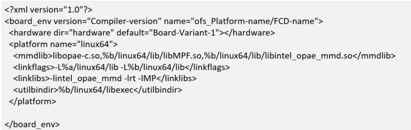

# oneAPI Accelerator Support Package(ASP) Reference Manual: Open FPGA Stack

## **1.0 Overview**

### **1.1 About this Document**

This document serves as a reference manual for platform designers wanting to enable [oneAPI](https://www.intel.com/content/www/us/en/developer/tools/oneapi/base-toolkit.html#gs.jxodgk) support on their Open FPGA Stack(OFS) platforms. The document describes essential hardware and software components required for enabling this design flow using OFS. Implementation details for [`oneapi-asp`](https://github.com/OFS/oneapi-asp) for Open FPGA Stack(OFS) reference platforms is covered towards the end of the document.

> **Note:** Table 1-1 in [oneAPI Accelerator Support Package (ASP): Getting Started User Guide](https://ofs.github.io/hw/common/user_guides/oneapi_asp/ug_oneapi_asp/)

For more information about developing application kernels for FPGA using Intel® oneAPI Base Toolkit (Base Kit) refer to [Intel® FPGA Add-on for oneAPI Base Toolkit](https://www.intel.com/content/www/us/en/developer/tools/oneapi/fpga.html#gs.jxoidi) webpage.

### **1.2 Terminology**

This table defines some of the common terms used when discussing OFS.

**Table 1-1: Terminology**

| Term  | Abbreviation | Description |
|---------|---------|---------|
| Open FPGA Stack | OFS | A modular collection of hardware platform components, open source software, and broad ecosystem support that provides a standard and scalable model for AFU and software developers to optimize and reuse their designs. |
| Accelerator Functional Unit | AFU |Hardware Accelerator implemented in FPGA logic which offloads a computational operation for an application from the CPU to improve performance. *Note: An AFU region is the part of the design where an AFU may reside.  This AFU may or may not be a partial reconfiguration region.* |
| FPGA Interface Manager | FIM | Provides platform management, functionality, clocks, resets and standard interfaces to host and AFUs.  The FIM resides in the static region of the FPGA and contains the FPGA Management Engine (FME) and I/O ring.|
| High Level Design | HLD | For the purpose of this guide, this term refers to designing with Intel High Level Design tools like Intel® oneAPI Base Toolkit (Base Kit). |
| oneAPI Accelerator Support Package | oneAPI ASP | A collection of hardware and software components that enable oneAPI kernel to communicate with oneAPI runtime and other OFS hardware, software components. oneAPI ASP hardware components and oneAPI kernel form the AFU region of a oneAPI system in OFS. |
| Intel® FPGA Basic Building Blocks | BBB | Basic Building Blocks (BBB) for Intel® FPGAs is a suite of application building blocks and shims like Memory Properties Factory (MPF). |
| BBB Memory Properties Factory | BBB MPF | Intel® FPGA BBB MPF block provides features like virtual to physical address (VTP), ordering read responses, read/write hazard detection, and masked (partial) writes. `oneapi-asp` uses MPF VTP feature. |
| Open Programmable Acceleration Engine Software Development Kit | OPAE SDK | A collection of libraries and tools to facilitate the development of software applications and accelerators using OPAE. |
| Platform Interface Manager | PIM | An interface manager that comprises two components: a configurable platform specific interface for board developers and a collection of shims that AFU developers can use to handle clock crossing, response sorting, buffering and different protocols. |
| Device Feature List | DFL | A concept inherited from OFS. The DFL drivers provide support for FPGA devices that are designed to support the Device Feature List. The DFL, which is implemented in RTL, consists of a self-describing data structure in PCI BAR space that allows the DFL driver to automatically load the drivers required for a given FPGA configuration. |
| Best Known Configuration | BKC | The exact hardware configuration Intel has optimized and validated the solution against. |
| SYCL | - | [SYCL](https://www.khronos.org/sycl/) (pronounced "sickle") is a royalty-free, cross-platform abstraction layer that enables code for heterogeneous and offload processors to be written using modern ISO C++ (at least C++ 17). It provides several features that make it well-suited for programming heterogeneous systems, allowing the same code to be used for CPUs, GPUs, FPGAs or any other hardware accelerator. SYCL was developed by the Khronos Group, a non-profit organization that develops open standards (including OpenCL™) for graphics, compute, vision, and multimedia. SYCL is being used by a growing number of developers in a variety of industries, including automotive, aerospace, and consumer electronics.|
| Data Parallel C++ | DPC++ | [DPC++](https://www.intel.com/content/www/us/en/developer/tools/oneapi/data-parallel-c-plus-plus.html#gs.5sqn4j) is Intel’s implementation of the SYCL standard. It supports additional attributes and language extensions which ensure DCP++ (SYCL) is efficiently implanted on Intel hardware. |
| Installable Client Driver | ICD | [Intel® FPGA Runtime for OpenCL™ Software Technology](https://github.com/intel/fpga-runtime-for-opencl) supports the OpenCL ICD extension from the Khronos Group™. The OpenCL ICD extension allows you to have multiple OpenCL implementations on your system. With the OpenCL ICD Loader Library, you may choose from a list of installed platforms and execute OpenCL API calls that are specific to your OpenCL implementation of choice. |
| FPGA Client Driver | FCD | [Intel® FPGA Runtime for OpenCL™ Software Technology](https://github.com/intel/fpga-runtime-for-opencl) supports FPGA Client Driver(FCD) extension. FCD allows the runtime to automatically find and load the oneAPI ASP libraries at host run time |

> **Note:** `oneapi-asp` was referred to as `ofs-hld-shim` in OFS (Agilex & Stratix 10 OFS) and OpenCL AFU Shim (`ofs-opencl-afu-shim`) in OFS early access(EA) release (for Intel® Stratix 10® FPGA with Intel® FPGA PAC D5005 as reference platform).

### **1.3 Prerequisites**

The content in this manual requires readers to be familiar with:

* [Hardware and software components of Open FPGA Stack](https://github.com/OFS), especially the following:
    * FPGA Interface Manager(FIM)
        * Intel® Stratix 10® FPGA:
            * [FPGA Interface Manager Technical Reference Manual: Open FPGA Stack for Intel® Stratix 10® FPGA](https://ofs.github.io/hw/d5005/reference_manuals/ofs_fim/mnl_fim_ofs_d5005/)
            * [Intel® FPGA Interface Manager Developer Guide: Open FPGA Stack for Intel® Stratix 10® FPGA](https://ofs.github.io/hw/d5005/dev_guides/fim_dev/ug_dev_fim_ofs_d5005/)
        * Intel® Agilex® FPGA:
            * [Open FPGA Stack Technical Reference Manual for Intel Agilex FPGA PCIe Attach](https://ofs.github.io/hw/n6001/reference_manuals/ofs_fim/mnl_fim_ofs_n6001/)
            * [Intel® FPGA Interface Manager Developer Guide: OFS for Intel® Agilex® PCIe Attach FPGAs](https://ofs.github.io/hw/n6001/dev_guides/fim_dev/ug_dev_fim_ofs_n6001/)
    * Accelerator Functional Unit(AFU)
        * Intel® Stratix 10® FPGA: [Accelerator Functional Unit Developer Guide: Open FPGA Stack for Intel® Stratix 10 FPGA](https://ofs.github.io/hw/d5005/dev_guides/afu_dev/ug_dev_afu_d5005/)
        * Intel® Agilex® FPGA: [AFU Development Guide: OFS for Intel® Agilex® PCIe Attach FPGAs](https://ofs.github.io/hw/N6001/dev_guides/afu_dev/ug_dev_afu_n6001/)
    * [OPAE SDK](https://ofs.github.io/hw/common/reference_manual/ofs_sw/mnl_sw_ofs/)
    * [Linux-DFL](https://ofs.github.io/hw/common/reference_manual/ofs_sw/mnl_sw_ofs/#110-dfl-linux-kernel-drivers)
    * [ofs-platform-afu-bbb](https://github.com/OFS/ofs-platform-afu-bbb)

In addition to above, developers must be familiar with the following tools & concepts: 

* [Intel® Quartus® Prime Design Software](https://www.intel.com/content/www/us/en/support/programmable/support-resources/design-software/user-guides.html) (Intel® Quartus® software revisions, Platform Designer, compilation Flows, timing analysis, compilation reports, understanding FPGA resource utilization, programming Intel® FPGAs) 
* [Partial Reconfiguration (PR)](https://www.intel.com/content/www/us/en/software/programmable/quartus-prime/partial-reconfiguration.html)
* FPGA Peripheral IPs (PCIe, External Memory IP, Ethernet IP) 
* [Avalon® Interface](https://www.intel.com/content/www/us/en/docs/programmable/683091/22-3/introduction-to-the-interface-specifications.html)
* Scripting (TCL, Python, Shell scripts) 
* Verilog, SystemVerilog 
* C++ 
* [Familiarity with SYCL](https://www.intel.com/content/www/us/en/docs/oneapi/programming-guide/2023-1/data-parallelism-in-c-using-sycl.html) 
* Familiarity with [oneAPI compilation process for FPGAs](https://www.intel.com/content/www/us/en/docs/oneapi/programming-guide/2023-1/fpga-flow.html) & [oneAPI code samples](https://github.com/oneapi-src/oneAPI-samples) 
* Familiarity with [oneAPI Accelerator Support Package (ASP): Getting Started User Guide](https://ofs.github.io/hw/common/user_guides/oneapi_asp/ug_oneapi_asp/)

### **1.4 Introduction to oneAPI on Open FPGA Stack(OFS)**

The [Intel® oneAPI Base Toolkit (Base Kit)](https://www.intel.com/content/www/us/en/developer/tools/oneapi/toolkits.html) is a core set of tools and libraries for developing high-performance, data-centric applications across diverse architectures (CPUs, GPUs and FPGAs). It features an industry-leading C++ compiler that implements SYCL, an evolution of C++ for heterogeneous computing.

Figure 1-1 shows the high-level representation of oneAPI application developers using FPGAs for acceleration of their applications. The runtime flow consists of a host code running on a processor and an application kernel code running on an FPGA. Open FPGA Stack enables vendors to enable support for this flow on their platforms.
 
**Figure 1-1: oneAPI Application on OFS Platforms**

Intel® oneAPI Base Toolkit (Base Kit) consists of a compiler and runtime environment. The compiler converts a SYCL kernel (FPGA application code) into a hardware circuit. This hardware circuit requires additional logic to communicate with the runtime and FPGA board peripherals. This additional logic is provided by *oneAPI Accelerator Support Package(oneAPI ASP)*. oneAPI ASP consists of hardware components that enable this generated hardware circuit to communicate with the host processor as well as software components that enable the runtime to identify and communicate with the kernel.

Figure 1-2 shows the workload design steps and steps in which the Intel® oneAPI Base Toolkit (Base Kit) requires oneAPI ASP as input. For more information about workload development and how workload developers target a specific platform during compilation, refer to [Intel oneAPI Programming Guide](https://www.intel.com/content/www/us/en/docs/oneapi/programming-guide/2023-1/fpga-flow.html). The next section introduces oneAPI ASP.
 
**Figure 1-2: High Level Design Flow for FPGAs with Intel® oneAPI Base Toolkit (Base Kit)**

### **1.5 Introduction to oneAPI Accelerator Support Package(ASP)**

As mentioned in previous section, oneAPI ASP is a collection of hardware and software components that interface with the hardware circuit generated by the oneAPI compiler. The hardware circuit generated by the oneAPI compiler from a oneAPI kernel is referred to as the `kernel system`. While the `kernel system` consists of logic controlled by the workload developer's specifications, the `kernel system` *interfaces* are generated by the oneAPI compiler based on specifications provided by the OFS platform designer. These specifications are input to the compiler using *XML files* (discussed in section 2.0).

> **Note:** All the interfaces generated by the oneAPI compiler are [Avalon® Interfaces](https://www.intel.com/content/www/us/en/docs/programmable/683091/22-3/introduction-to-the-interface-specifications.html).
 
**Figure 1-3: Kernel System Interfaces**

Figure 1-3 shows a high-level representation of an OFS hardware design and interfaces to/from `kernel_system`. The numbered arrows depict the following:

* Path 1 represents host-to-External Memory Interface (EMIF)
* Path 2 represents the host to kernel interface
* Path 3 represents kernel to EMIF
* Path 4 represents kernel to host memory Interface

oneAPI ASP hardware components can be divided into 3 categories:

1. RTL components: constituting various interface logic, for example, host to External Memory Interface (EMIF), kernel to EMIF interface, host to kernel interface, kernel to host memory interface as well as additional components to handle kernel control signals and perform Direct Memory Access (DMA)
2. XML files: for describing hardware interfaces and compilation environment to Intel® oneAPI Base Toolkit (Base Kit)
3. Scripts: to control compile flow
 
In addition to the hardware components, a software layer is required for handling I/O operations between oneAPI runtime and the board. The oneAPI ASP software layer can be divided into 2 categories:

1. Memory Mapped Device (MMD) Layer: required by the host & runtime to communicate with the oneAPI kernel & other oneAPI ASP hardware registers
2. oneAPI ASP utilities: required to setup and diagnose the board

The MMD uses API provided by [OPAE SDK](https://github.com/OFS/opae-sdk) to communicate with the device. The FPGA driver is provided by the [linux-DFL](https://github.com/OFS/linux-dfl) kernel driver.

Figure 1-4 shows how the above oneAPI ASP components tie into Open FPGA Stack.
  
**Figure 1-4: Open FPGA Stack (OFS) components**

## **2.0 XML Files in oneAPI ASP**

The `kernel system` *interfaces* generated by the oneAPI compiler are based on specifications provided by oneAPI ASP developer. An XML file, called `board_spec.xml` is used to pass the specifications to the oneAPI compiler. oneAPI ASP developers must create this XML file for their boards.

In addition to `board_spec.xml`, the Intel® oneAPI Base Toolkit (Base Kit) relies on another XML file called `board_env.xml` to get information about the board environment. The `board_env.xml` file helps the runtime setup board installation.

The next section explains the contents of board_spec.xml. Section 2.2 covers contents of `board_env.xml` file.

### **2.1 `board_spec.xml` File**

A typical board_spec.xml structure is shown in Fig 2-1. In addition to kernel system interfaces, the `board_spec.xml` file is also used to specify other compilation details like Intel® Quartus® Prime Pro Edition Software version used in platform design, compilation scripts to help control Intel® Quartus® software compile flows, FPGA resource utilization details.

Elements of board_spec.xml file are summarized in table 2-1. Each element has additional attributes and parameters. Details are covered in respective sections for each element.

**Figure 2-1: `board_spec.xml` File Structure**

**Table 2-1: Elements of board_spec.xml**

| Element | Use of Element | Attributes |
|---------|---------|---------|
| board | Used to specify a name for the board and the version of Intel® Quartus® Prime Pro Edition Software used to develop the platform design. This board name is used to identify the board design to be compiled and must match the name of the directory in which board_spec.xml resides. | version, name |
| compile | Used to describe different compile flows | project, revision, qsys_file, generic_kernel, generate_cmd, synthesize_cmd, auto_migrate |
| device | Used to specify the FPGA device model file for the FPGA part on the board. | device_model, used_resources |
| global_mem | Different attributes in this element are used to provide details about the external memory used as the global memory for the FPGA oneAPI kernel/application. | name, max_bandwidth, interleaved_bytes, config_addr, default, interface |
| host | Used to specify the offset at which the kernel resides. | kernel_config |
| interfaces | Used to specify control signals to oneAPI kernels | interface, kernel_clk_reset |

The compiler expects a separate `board_spec.xml` file for every board variant a platform supports. Board variants are different hardware design implementations for the same platform, a oneAPI ASP can have multiple board variants. A oneAPI kernel developer can select the variant suitable for their application at compile time. A `board_spec.xml` file must be located at the top most level of the board variants hardware directory (the hardware directory is specified by `board_env.xml`, please refer to section 2.2 for details on `hardware` element). For example, a separate `board_spec.xml` file for each board variant for OFS reference platforms is located in `oneapi-asp/Platform-Name/hardware/Board-Variant/` directory, where `Platform-Name` is `n6001` for Agilex OFS and `d5005` for Stratix 10 OFS.

#### **2.1.1 board Element**

The board element of the board_spec.xml file provides the Intel® Quartus® Prime Pro Edition Software version and the name of the board.

**Table 2-2: Attributes for the `board` Element**

| Attribute | Description |
|---------|---------|
| version | The version of the board. The board version should match the version of the Intel® Quartus® Prime Pro Edition Software you use to develop the platform design. The oneAPI compiler uses this value to perform environment checks for supported version during application compile |
| name | The name of the accelerator board, which must match the name of the directory in which the board_spec.xml file resides. The name must contain a combination of only letters, numbers, underscores (_), hyphens (-), or periods (.) (for example, ofs_n6000). |

Example below shows the `board` element populated for a board designed with Intel® Quartus® Prime Pro Edition Software version 22.3 and board variant named "Agilex_brd1".

> **Note:** A board variant name is different from a platform directory name. Please see Note in section 2.2 for more information on board variants.

**Figure 2-2: `board` Element**

#### **2.1.2 compile Element**

Depending on the application requirements, the design may have different compilation flows and different design settings for each flow (for example, there can be a flat flow without partial reconfiguration support or a flow with partitions in the design to enable partial reconfiguration). Designers can control the flow and its settings using scripts.
To allow selection of compile flow during application compile & to describe control of Intel® Quartus® software compilation as well as registration, automigration, the `compile` element of the board_spec.xml file and its associated attributes and parameters are used.

**Table 2-3: Attributes for `compile` Element**

| Attribute | Description |
|---------|---------|
| name | Name of the compilation flow. This name can be used to differentiate between flows at oneAPI kernel compilation time. oneAPI compiler allows selecting a compile flow using `-Xsbsp-flow` option. |
| project | Name of the Intel® Quartus® software project file (.qpf) that the Intel® Quartus® Prime Pro Edition Software intends to compile. |
| revision | Name of the revision within the Intel® Quartus® software project that the Intel® Quartus® Prime Pro Edition Software compiles to generate the final bitstream. |
| qsys_file | Name of the Platform Designer file into which the oneAPI kernel is embedded. You have the option to assign a value of "none" to qsys_file if you do not require the Intel® Quartus® Prime Pro Edition Software to create a top-level .qsys file for your design. In this scenario, oneAPI compiler adds a .qip file into the Intel® Quartus® software project. In this case, the custom oneAPI ASP must manually instantiate the generated HDL entity (generated entity is in the kernel_system.v file). |
| generic_kernel | Set this value to 1 if you want the offline compiler to generate a common Verilog interface for all compilations. This setting is necessary in situations where you must set up design partitions around the kernel, such as in the Configuration via Protocol (CvP) flow. |
| generate_cmd | Command required to prepare for full compilation, such as to generate the Verilog files for the Platform Designer system into which the oneAPI kernel is embedded. |
| synthesize_cmd | Command required to generate the fpga.bin file from the Custom Platform. Usually, this command instructs the Intel® Quartus® Prime Pro Edition Software to perform a full compilation. |
| auto_migrate | *platform_type—Choose this value based on the value referenced in the Intel® FPGA Reference Platform from which you derive your Custom Platform. Valid values are a10_ref, s10_ref, and none.   *include fixes—Comma-separated list of named fixes that you want to apply to the Custom Platform.   *exclude fixes—Comma-separated list of named fixes that you do not want to apply to the Custom Platform. |

Example below shows a populated `compile` element for a sample Intel® Quartus® software Project called ofs.qpf, the Intel® Quartus® software revision to be compiled is called asp (asp.qsf). In this example, the compiler generates the kernel system (entity is called kernel_system) and this entity is instantiated manually in the Intel® Quartus® software project (e.g. in a file called kernel_wrapper.v), hence `qsys_file` is set to "none". The `synthesize_cmd` points to a script "compile.tcl" located in the same directory as the board_spec.xml, compile script performs all necessary system generation and compile steps for generation of final bitstream. The project directory snippet below is for demonstration only. The compile flow is named "demo_flow".

There can be multiple `compile` elements for the different compilation flows that a platform designer wishes to enable in their platform (e.g. different revisions with different Intel® Quartus® software settings or a PR revision).

**Figure 2-3: `compile` Element**

#### **2.1.3 device Element**

A device model(DM) file is an XML file that has the total resources on the device (i.e. ALMs, FFs, DSPs, RAMs). This is required for any FPGA part used in a oneAPI design. Most device model files are provided as part of the Intel® oneAPI Base Toolkit (Base Kit) installation (`$INTELFPGAOCLSDKROOT/share/models/dm`, where INTELFPGAOCLSDKROOT is set by the `setvars.sh` environment setup script provided by [oneAPI toolkit](https://www.intel.com/content/www/us/en/docs/oneapi/installation-guide-linux/2023-1/prerequisites.html)). A new device model file can also be created using existing files as reference.

The device model file name must be specified in the `device_model` attribute of `device` element. The `used_resources` attribute is used to specify the resources being utilized by the oneAPI ASP and peripheral IPs. The utilization by non-kernel logic is calculated during platform design. The compiler utilizes the total resources from device model file and utilized resources in `used_resources` section to estimate the available resources for application kernel.

**Table 2-4: Attributes for `device` Element**

| Attribute | Description |
|---------|---------|
| device_model | The file name of the device model file that describes the available FPGA resources on the accelerator board. |
| used_resources | Reports the number of adaptive logic modules (ALMs), flip-flops, digital signal processor (DSP) blocks and RAM blocks that the board design consumes in the absence of any kernel. If you create a defined partition around all the board logic, you can obtain the used resources data from the Partition Statistics section of the Fitter report. Extract the information from the following parameters:  * alms num — The number of logic ALMs used, excluding the number of ALMs with only their registers used. The value should correspond to [a]+[b]+[d] from part [A] of the Fitter Partition Statistics.  * ffs num — The number of flip flops.  * dsps num — The number of DSP blocks.  * rams num — The number of RAM blocks. |

Example below shows the `device` element added for a Intel® Agilex® FPGA based platform with device model file named "agfb014r24a2e2vr0_dm.xml". The number of used_resources are for demonstration purposes and are not to be used by platform developers.

**Figure 2-4: `device` Element**

#### **2.1.4 interface Attribute**

> **Note:** This is different from the `interfaces` element discussed in upcoming sections.
In the board_spec.xml file, each global memory, channel or kernel connection is comprised of individual interfaces. For the `global_mem`, `channels`, and `interfaces` XML elements, an `interface` attribute must be included to specify the corresponding parameters for each connection.

**Table 2-5: Parameters for `interface` attribute**

| Parameter | Description | Applicable Interface |
|---------|---------|---------|
| name |* For global_mem: instance name of the Platform Designer component. * For channels: instance name of the Platform Designer component that has the channel interface. * For interfaces: name of the entity in which the kernel interface resides (for example, board). | All |
| port |* For global_mem: name of the Avalon®-MM interface in the Platform Designer component that corresponds to the interface attribute. * For channels: name of the streaming interface in the Platform Designer component. * For interfaces: name of the interface to the `OpenCL™ Kernel Interface` Platform Designer component. For example, kernel_cra is the Avalon®-MM interface, and kernel_irq is an interrupt. | All |
| type |* For global_mem: set to agent.  * For channels:  - Set to streamsource for a stream source that provides data to the kernel. - Set to streamsink for a stream sink interface that consumes data from the kernel. * For interfaces: set to either host, irq, or streamsource. | All |
| width |* For global_mem: width of the memory interface in bits. For channels: number of bits in the channel interface. For interfaces: width of the kernel interface in bits. | All |
| waitrequest_allowance	|* For global_mem: [Optional] Amount of Avalon®-MM waitrequest allowance supported on the agent interface (that is, kernel-facing interface) of the clock-crossing bridge that spans between the memory and the kernel clock domains. * For kernel_cra: [Optional] Amount of Avalon®-MM waitrequest allowance that the kernel_cra agent interface must support. This parameter defaults to 0 if you do not specify it in the board_spec.xml file. A value of 0 indicates that this waitrequest allowance feature is disabled. | All |
| maxburst | Maximum burst size for the agent interface. Attention: The value of width ÷ 8 x maxburst must be less than the value of interleaved_bytes. | global_mem |
| address | Starting address of the memory interface that corresponds to the host interface-side address. For example, address 0 should correspond to the bank1 memory host from the `OpenCL Memory Bank Divider`. In addition, any non-zero starting address must abut the end address of the previous memory. | global_mem |
| size | Size of the memory interface in bytes. The sizes of all memory interfaces should be equal. | global_mem |
| latency_type | If the memory interface has variable latency, set this parameter to average to signify that the specified latency is considered the average case. If the complete kernel-to-memory path has a guaranteed fixed latency, set this parameter to fixed. | global_mem |
| chan_id | A string used to identify the channel interface. The string may have up to 128 characters. | channels |
| clock	| For the streamsource kernel interface type, the parameter specifies the name of the clock that the snoop stream uses. Usually, this clock is the kernel clock. | interfaces |

Example for how the `interface` attribute is used in `global_mem` and `interfaces` elements is covered in section for these elements respectively.

#### **2.1.5 global_mem Element**

The `global_mem` element of the board_spec.xml file is used to provide information on the memory interfaces that connect to the kernel.

> **Note:** For each global memory that the kernel accesses, you must include one interface element that describes its characteristics.
The different attributes for global_mem element are discussed in table 2-6.

**Table 2-6: Attributes for `global_mem` Element**

| Attribute | Description |
|---------|---------|
| name | The name FPGA application/kernel developer should use to identify the memory type. Each name must be unique and must comprise of less than 32 characters. |
| max_bandwidth | The maximum bandwidth, in megabytes per second (MB/s), of all global memory interfaces combined in their current configuration. The oneAPI compiler uses max_bandwidth to choose an architecture suitable for the application and the board.   Compute this bandwidth value from datasheets of memories on your board.   Example max_bandwidth calculation for a 64-bit DDR4 interface running at 1200 MHz:   max_bandwidth = 1200 MHz x 2 x 64 bits ÷ 8-bits = 19200 MB/s   The max_bandwidth value will change based on global memory configuration, for example, if the memory configuration comprises of 4 banks of DDR4 configured as a single homogenous memory, the max_bandwidth will be 19200 x 4 (i.e. number of memory interfaces from kernel). Please see section 2.1.5.1 for more information on global memory configurations.   Designers have the option to use block RAM instead of or in conjunction with external memory as global memory. The formula for calculating max_bandwidth for block RAM is max_bandwidth = block RAM speed x (block RAM interface size ÷ 8 bits).   Example max_bandwidth calculation for a 512-bit block RAM running at 100 MHz:   max_bandwidth = 100 MHz x 512 bits ÷ 8 bits = 6400 MB/s |
| interleaved_bytes | Include the interleaved_bytes attribute in the board_spec.xml file when you instantiate multiple interfaces(i.e. memory banks) for a given global memory system. This attribute controls the size of data that the offline compiler distributes across the interfaces.   The offline compiler currently can interleave data across banks no finer than the size of one full burst. This attribute specifies this size in bytes and following are the recommended values:   For two or fewer global memory banks: maxburst x width_bytes   For four or more global memory banks: maxburst x width_bytes x 4   The interleaved_bytes value must be the same for the host interface and the kernels. Therefore, the configuration of the `OpenCL Memory Bank Divider` must match the exported kernel agent interfaces in this respect (refer to section 3.1.1 for information about OpenCL Memory Bank Divider)   For block RAM, interleaved_bytes equals the width of the interface in bytes. |
| config_addr | The address of the ACL Mem Organization Control Platform Designer component (mem_org_mode) that the host software uses to configure memory. You may omit this attribute if your board has homogeneous memory; the software uses the default address (0x18) for this component. If your board has heterogeneous memory, there is a mem_org_mode component in the board system for each memory type.   Enter the config_addr attribute and set it to the value of the base address of the mem_org_mode component(s). |
| default | Include this optional attribute and assign a value of 1 to set the global memory as the default memory interface. The default memory must start at address 0x0.   If you do not implement this attribute, the first memory type defined in the board_spec.xml file becomes the default memory interface. |
| interface | See the `interface` section above for the parameters you must specify for each interface. |
| allocation_type | A list that specifies which USM allocator is used to allocate from the global_mem element. Values allowed in this list are `host`, `shared`, and `device`. The following conditions apply:   If there are multiple global_mem elements with the same allocation_type attribute, the first allocation_type attribute in the board_spec.xml is assumed to be the one used by the specified allocator.   If there is a single global_mem element with multiple allocation_type attributes, this indicates that allocations of the specified types use this global_mem interface.   [Legacy support] If you have not specified the allocation_type attribute, it is assumed that all global memory interfaces have the `device` allocation_type. |

Example below shows a `global_mem` element configuration for a kernel system connected to four 4GB DDR4 memory banks. The DDR4 interface is 64 bit operating at 1200MHz. Note that the name of the platform designer system name is `board.qsys`. As mentioned in description for `interleaved_bytes` in table above, the `OpenCL Memory Bank Divider` configuration ensures that the host interface matches the interleaved_bytes setting (i.e. 512 bits x 64 burst size = 4096 bytes). For information on `waitrequest_allowance`, refer to section 2.1.4 on `interface` attribute.

> **Note:** More details on the `OpenCL Memory Bank Divider` and the Clock Crossing Bridges is covered in section 3.0

**Figure 2-5: Memory Connection Example Block Diagram and Corresponding `global_mem` Element in `board_spec.xml`**

##### **2.1.5.1 Global Memory Configurations**

A board can have a single memory bank, multiple memory banks of the same type (e.g. 4 banks of DDR4) or different banks of different types.

The partitioning of memory for oneAPI kernel developers is explained in the [FPGA optimization Guide for oneAPI](https://www.intel.com/content/www/us/en/develop/documentation/oneapi-fpga-optimization-guide/top/optimize-your-design/throughput-1/memory-accesses/global-memory-accesses-optimization.html). The global memory configuration required by an application kernel must match the configuration in board_spec.xml as the compiler uses this information to generate a suitable architecture for the application.
The different memory configurations are

* A single global memory region (possible with same type of memory banks)
* Different global memories (heterogeneous memory)

###### **2.1.5.1.1 Contiguous Global Memory**

For boards with multiple memory banks of the same type, designers can configure these as a single contiguous global memory region. This is done by specifying each memory interface within a single global_mem element.
Figure 2-5 showed 4 DDR4 memory banks configured as a single global memory region.

With this configuration, FPGA application developers have the option to use contiguous memory region in an interleaved or a non-interleaved fashion. Even with contiguous memory regions, kernel developers can partition data buffers across the banks/memory channels. Please refer to [Global Memory Access Optimization section in FPGA Optimization Guide for oneAPI](https://www.intel.com/content/www/us/en/develop/documentation/oneapi-fpga-optimization-guide/top/optimize-your-design/throughput-1/memory-accesses/global-memory-accesses-optimization.html) for more details on these partitioning techniques.

###### **2.1.5.1.2 Heterogeneous Memory**

For boards with different memory technologies, designers must specify each type of memory that the kernel needs to access as a separate global memory.

Figure 2-6 shows heterogeneous configurations and the `global_mem` element structure for two different types of memories (QDR, DDR4). The `global_mem` element in example below also demonstrates use of the `default` attribute. It is set to "1" for the DDR4 memory banks, indicating to the oneAPI compiler that the default global memory for the kernel is DDR4.

**Figure 2-6: Heterogeneous Memory Example Block Diagram and Corresponding `global_mem` Element in `board_spec.xml`**

**Unified Shared Memory**

For applications that require [USM](https://oneapi-src.github.io/DPCPP_Reference/usm.html) support, the board_spec.xml must specify host and device memories in a heterogeneous manner.
The `allocation_type` must be `host` for global memory region on the host processor. The `allocation_type` must be set to `device` for global memory on the FPGA board.
Example below extends the board_spec.xml snippet in figure 2-5 to add a `global_mem` element for the kernel system to host processor memory interface.

**Figure 2-7: `global_mem` Element Example for Unified Shared Memory(USM)**

#### **2.1.6 host Element**

The host element of the board_spec.xml file provides information on the interface from the host to the kernel. Figure 2-8 shows an example of host element.

**Figure 2-8: `host` Element Example**

**Table 2-7: Attributes for the `host` Element**

| Attribute | Description |
|---------|---------|
| kernel_config | This attribute informs the oneAPI compiler at what offset the kernel resides, from the perspective of the `kernel_cra` host on the kernel_interface module. * start: the starting address of the kernel. Normally, this attribute has a value of 0 because the kernel_cra host should not host anything except kernels. * size: keep this parameter at the default value of 0x0100000. |

#### **2.1.7 interfaces Element**

The `interfaces` element of the board_spec.xml file describes the kernel interfaces that connect to application kernels and control kernel behavior. For this element, include one of each interface of types host, irq and streamsource. Refer to the `interface` section for the parameters you must specify for each interface.
In addition to the host, irq, and streamsource interfaces, if your design includes a separate Platform Designer subsystem containing the board logic, the kernel clock and reset interfaces exported from it are also part of the interfaces element. Specify these interfaces with the `kernel_clk_reset` attribute and its corresponding parameters.

Figure 2-9 shows example of `interfaces` element.

**Figure 2-9: `interfaces` Element Example**

**Table 2-8:  Parameters for the `kernel_clk_reset` Attribute**

| Attribute | Description |
|---------|---------|
| clk | The Platform Designer name for the kernel clock interface |
| clk2x | The Platform Designer name for the 2xkernel clock interface |
| reset | The Platform Designer connection for the kernel reset |

> **Note:** Name the kernel clock and reset interfaces in the Platform Designer connection format (that is, <instance_name>.<interface_name>). For example: board.kernel_clk

### **2.2 `board_env.xml` File**

The `board_env.xml` file is used by the oneAPI toolkit to set up the board installation that enables the compiler to target a specific accelerator platform. The board_env.xml file must be located in the top most level of the oneAPI ASP for each platform. For example, the `board_env.xml` for oneAPI ASP for OFS reference platforms is located in the `oneapi-asp/Platform-Name` folder, where `Platform-Name` is `n6001` for Agilex OFS and `d5005` for Stratix 10 OFS.

A sample board_env.xml file is shown below. Table 2-9 explains the elements of this file.

**Figure 2-10: `board_env.xml` File Structure**

**Table 2-9:  Specifications of XML Elements and Attributes in the `board_env.xml` File**

| Element | Attribute Description |
|---------|---------|
| board_env | * version: The oneAPI compiler version used to create oneAPI ASP * name: The runtime uses this as the name of the FPGA Client Driver(FCD) file name |
| hardware | * dir: Name of the subdirectory, within the oneAPI ASP directory, that contains the board variant directories for a platform  * default: The default board variant that the compiler targets when a platform has multiple board variants and user does not specify an explicit argument using [-Xstarget option](https://www.intel.com/content/www/us/en/docs/oneapi/programming-guide/2023-1/fpga-compilation-flags.html) |
| platform | name: Name of the operating system. A separate `platform` element must be specified for each supported OS for the oneAPI ASP platform |
| mmdlib | A string that specifies the path to the MMD library of your oneAPI ASP. To load multiple libraries, specify them in an ordered, comma-separated list. The host application will load the libraries in the order that they appear in the list > **Note:** You can use `%b` to reference your oneAPI ASP directory |
| linkflags | A string that specifies the linker flags necessary for linking with the MMD layer available with the board > **Note:** %b to reference your oneAPI ASP directory |
| linklibs | A string that specifies the libraries the oneAPI runtime must link against to use the MMD layer available with the board |
| utilbindir | Directory in which the runtime expects to locate board utility executables (i.e. install, uninstall, program, diagnose, flash)  > **Note:** You can use %b to reference your board installation directory |

## **3.0 oneAPI ASP Hardware**

The oneAPI compiler generates the `kernel system` interfaces based on specifications provided by the platform/board developer in the `board_spec.xml` file. The `kernel system` interfaces with the rest of the oneAPI ASP RTL as shown in figure 1-3.

Figure 1-3 shows 4 different paths, summarized below:

* Host to EMIF: Consisting of RTL to handle data transfer between host and on-board memory (e.g. DDR4)
* Host to Kernel: Consisting of RTL to handle control signals & interrupts between host and kernel
* Kernel to EMIF: Consisting of RTL to handle data transfer between kernel and on-board memory
* Kernel to Host memory: Required to support Unified Shared Memory. This requires some additional RTL to handle data transfer between kernel and host memory.

Please note that the `kernel system` generated by oneAPI compiler has Avalon® interfaces. OFS FIM has AXI interfaces. Additional logic blocks from Platform Interface Manager are used to handle protocol conversions. Please refer to section 5.2.1 for more details on PIM.
The next few sections cover some of the important IP components provided by Intel® oneAPI Base Toolkit (Base Kit) installation that are required to enable kernel communications with host and board peripherals. More design implementation details are covered in section 5.0.

### **3.1 Host to External Memory Interface(EMIF)**

The host to EMIF datapath consists of a PCIe Subsytem(SS), EMIF Subsystem located in the FIM and a Direct Memory Access(DMA) engine in the oneAPI ASP.

PCIe Subsystem(SS) has the PCIe IP and additional logic to handle PCIe packet format and routing. FIM handles routing signals received from host to the user design located in a region referred to as Accelerator Functional Unit(AFU) (the `Kernel system` resides in the AFU).

> **Note:** For more information about the PCIe SS, please refer to [Intel FPGA IP Subsystem for PCI Express IP User Guide](https://github.com/OFS/ofs.github.io/docs/hw/common/user_guides/ug_qs_pcie_ss.pdf)

The External Memory Interface Subsystem (EMIF SS) consists of EMIF IP and additional logic for handling transfers between AFU and on-board memories.

> **Note:** For more information about the EMIF SS, please refer to [Memory Subsystem Intel FPGA IP User Guide](https://github.com/OFS/ofs.github.io/docs/hw/common/user_guides/ug_qs_mem_ss.pdf)

Large buffers of data are usually transferred between host and on-board memory in oneAPI applications. This necessitates a Direct Memory Access(DMA) Engine between host and on-board memory. In oneAPI ASP designs for OFS reference platform, this DMA engine is placed in the AFU region. 

As described in section 2.1.5.1, there are different configurations for memories on board. In addition to above, figure 1-3 also shows an additional IP in the host to memory datapath, called *OpenCL Memory Bank Divider*. This IP is a part of Intel® oneAPI Base Toolkit (Base Kit) installation and is used for handling one of the most commonly used configurations, i.e. configuring multiple memory banks of same type as a contiguous memory region. In this case, the kernel has a contiguous view of the memory and data can be interleaved across the different memory channels. The host must also have the same view of the memory in order to ensure read and write transactions from correct addresses.

#### **3.1.1 OpenCL Memory Bank Divider**

The OpenCL™ Memory Bank Divider is a Platform Designer component that takes an incoming request from the host interface on the Avalon®-MM agent port and routes it to the appropriate bank host port. This component must reside on the path between the host and the global memory interfaces. In addition, it must reside outside of the path between the kernel and the global memory interfaces.

**Figure 3-1: OpenCL Memory Bank Divider IP**

**Table 3-1: Parameter Settings for the OpenCL Memory Bank Divider Component**

| Parameter | Description |
|---------|---------|
| Number of banks | Number of memory banks for each of the global memory types included in your board system. |
| Separate read/write ports	| Enable this parameter so that each bank has one port for read operation and one for write operation. |
| Add pipeline stage to output | Enable this parameter to allow for potential timing improvements. |
| Data Width | Width of the data bus to the memory in bits. |
| Address Width (total addressable) | Total number of address bits necessary to address all global memory. |
| Burst size (maximum) | Set to a value equal to interleaved_bytes/(width/8), where interleaved_bytes and width are defined in the interface attribute of the global_mem element in the board_spec.xml file. |
| Maximum Pending Reads	| Maximum number of pending read transfers the component can process without asserting a waitrequest signal. Intel® recommended value is 64 if BSP has two global memory banks or fewer and 128 if BSP has four or more global memory banks.   CAUTION: A high Maximum Pending Reads value causes Platform Designer to insert a deep response FIFO buffer, between the component's host and agent, that consumes a lot of device resources. It also increases the achievable bandwidth between host and memory interfaces. |
| Split read/write bursts on burst word boundary | Enable splitting of read and write bursts on burst word boundary.   Enable this parameter if the Number of banks parameter value is greater than 1, and the burst reads and writes that the host controller sends to the agent port crosses burst word boundary. |

**Table 3-2: Signals and Ports for the OpenCL Memory Bank Divider Component**

| Signal or Port | Description |
|---------|---------|
| clk | The bank divider logic uses this clock input. If the IP of your host and memory interfaces have different clocks, ensure that clk clock rate is not slower than the slowest of the two IP clocks. |
| reset | The reset input that connects to the board power-on reset. |
| s	| The agent port that connects to the host interface controller. |
| kernel_clk | The kernel_clk drives this clock input  |
| kernel_reset | The kernel_reset output from the `OpenCL Kernel Interface` drives this reset input. |
| acl_bsp_snoop | Export this Avalon® Streaming (Avalon®-ST) source. In the board_spec.xml file, under interfaces, describe only the snoop interface for the default memory (acl_internal_snoop). If you have a heterogeneous memory design, perform these tasks only for the `OpenCL Memory Bank Divider` component associated with the  default memory.  **Important:** The memory system you build in Platform Designer alters the width of acl_bsp_snoop. You must update the width of the streamsource interface within the channels element in the board_spec.xml file to match the width of acl_bsp_snoop.  In the board_spec.xml file, update the width of the snoop interface (acl_internal_snoop) specified with the streamsource kernel interface within the interfaces element. Updating the width ensures that the global_mem interface entries in `board_spec.xml` match the characteristics of the bank`N` Avalon®-MM hosts from corresponding `OpenCL Memory Bank Divider` component for the default memory. |
| acl_bsp_memorg_host | This conduit connects to the acl_bsp_memorg_host interface of the `OpenCL` Kernel Interface`. > **Note:** Signal present if Number of banks > 1. |
| bank1, bank2, ..., bank8 | The number of memory hosts available in the `OpenCL Memory Bank Divider` depends on the number of memory banks that were included when the unit was instantiated. Connect each bank with each memory interface in the same order as the starting address for the corresponding kernel memory interface specified in the board_spec.xml file.   For example, global_mem interface that begins at address 0 must correspond to the memory host in bank1 from the `OpenCL Memory Bank Divider`. |

### **3.2 Host to Kernel Interface**

The host exchanges control signals with kernel with the help of an additional IP provided as part of Intel® oneAPI Base Toolkit (Base Kit) installation. The control signals coming from the host are on a different clock domain (PCIe clock) while the kernel runs on different clock frequency . The *OpenCL Kernel Interface* IP handles the clock domain crossing for these control signals as well as handles communication with kernel CSR, interrupts, generates the reset for kernel.
All oneAPI ASP designs must instantiate *OpenCL Kernel Interface* IPs to ensure the kernel functions correctly.

#### **3.2.1 OpenCL Kernel Interface**

The OpenCL Kernel Interface is a Platform Designer component that allows the host interface to access and control the oneAPI kernel.

**Figure 3-2: OpenCL Kernel Interface IP**

> \***Note:** OpenCL Kernel Interface IPs are device specific. There are different IPs for Intel® Stratix 10® FPGA and Intel® Agilex® FPGA device families. Please refer to hardware designs for oneAPI ASP for OFS reference platforms to view device specific instantiations for OpenCL Kernel Interface IPs. * [Stratix 10 OFS `oneapi-asp`](https://github.com/OFS/oneapi-asp/tree/master/d5005) * [Agilex OFS `oneapi-asp`](https://github.com/OFS/oneapi-asp/tree/master/n6001)

**Table 3-3: Parameter Settings for the OpenCL Kernel Interface Component**

| Parameter | Description |
|---------|---------|
| Number of global memory systems | Number of global memory types in your board design. |

**Table 3-4: Signals and Ports for the OpenCL Kernel Interface Component**

|Signal or Port | Description |
|---------|---------|
| clk | The clock input used for the host control interface. The clock rate of clk can be slow. |
| reset | This reset input resets the control interface. It also triggers the kernel_reset signal, which resets all kernel logic. |
| ctrl | Use this agent port to connect to the host interface. This interface is a low-speed interface with which you set kernel arguments and start the kernel's execution. |
| kernel_clk | kernel clock drives this clock input. |
| kernel_cra | This Avalon®-MM host interface communicates directly with the kernels generated by the oneAPI compiler. Export the Avalon®-MM interface to the OpenCL Kernel Interface and name it in the board_spec.xml file. |
| sw_reset_in | When necessary, the host interface resets the kernel via the ctrl interface. If the board design requires a kernel reset, it can do so via this reset input. Otherwise, connect the interface to a global power-on reset. |
| kernel_reset | Use this reset output to reset the kernel and any other hardware that communicates with the kernel.   Warning: This reset occurs between the MMD open and close calls. Therefore, it must not reset anything necessary for the operation of your MMD. |
| sw_reset_export | This reset output is the same as kernel_reset, but it is synchronized to the clk interface. Use this output to reset logic that is not in the kernel_clk clock domain but should be reset whenever the kernel resets. |
| acl_bsp_memorg_host | The memory interfaces use these signals.   Based on the number of global memory systems you specify in the `OpenCL Kernel Interface` component parameter editor, the Intel® Quartus® Prime Pro Edition Software creates the corresponding number of copies of this signal, each with a different hexadecimal suffix. Connect each signal to the `OpenCL Memory Bank Divider` component associated with each global memory system (for example, DDR). Then, list the hexadecimal suffix in the config_addr attribute of the global_mem element in the board_spec.xml file. |
| kernel_irq_from_kernel | An interrupt input from the kernel. This signal is exported and named in the board_spec.xml file. |
| kernel_irq_to_host | An interrupt output from the kernel. This signal connects to the host interface. |

### **3.3 Kernel to External Memory Interface**

The kernel system masters the interface from kernel to external memory. oneAPI compiler generates kernel system memory interface logic (e.g. Load-Store Unit) according to the global memory configuration and `interface` specifications in `board_spec.xml` file.
The kernel system operates at kernel clock(see next section for more information), hence, oneAPI ASP developers must handle clock domain crossing from kernel to EMIF clock domain.

For implementation details for all datapaths discussed above, please refer to section 5.2.

## **4.0 oneAPI ASP Software**

The software components of oneAPI ASP consist of the Memory Mapped Device(MMD) layer and the board utility routine required by runtime.

Section 4.1 introduces MMD layer and section 4.2 explains board utilities.

### **4.1 Memory Mapped Device(MMD) Layer**

The oneAPI ASP Memory Mapped Device (MMD) layer sits in between the oneAPI runtime and OPAE SDK and provides a set of API for device communication and control. The runtime calls into the MMD API for various operations like opening a handle to the device, allocating memory etc.

> **Note:** For more information about the FPGA runtime, please refer to FPGA Runtime documentation [here](https://github.com/intel/fpga-runtime-for-opencl/tree/main/docs).

A header file, called `aocl_mmd.h`, has the list of MMD API calls that must be implemented by oneAPI ASPs. From the perspective of the caller, below is typical MMD API lifecycle:
1. Open device to provide handle for further operations
2. Set interrupt and status handlers
3. Program device with kernel bitstream
4. Allocate memory if required
5. Perform Read, Write operations (DMA or MMIO)
6. Free memory if allocation done in step 4
7. Close device. No further operations permitted until subsequent open device call

Section 5.3 discusses more about the implementation of the MMD layer APIs in oneAPI ASPs for OFS reference platforms.

### **4.2 Board Utilities**

oneAPI runtime provides a set of options for the `aocl` utility.

> **Note:** `aocl` is an utility available in the oneAPI runtime environment, please use `aocl help` command for more information on this.

Table 4-1 shows the subcommands that `aocl` utility provides for FPGA platforms.

**Table 4-1: `aocl` board utilities**

| Subcommand | Description | Executable Call |
|---------|---------|---------|
| install | Install board into the host system. This installs the FPGA Client Driver (FCD) for your FPGA platform. FCD allows runtime to find and load the FPGA platform libraries at runtime | aocl install `path-to-FPGA-platform-oneapi-asp` |
| uninstall | Uninstall board from the host system. Removes FCD. | aocl uninstall `path-to-FPGA-platform-oneapi-asp` |
| initialize | Configure a default FPGA image onto the board | aocl initialize `device-name` |
| program | Configure a new FPGA image onto the board | aocl program `device-name` |
| diagnose | Runs ICD and FCD diagnostics followed by querying devices in installed platforms. If a `device-name` is specified in the call, it run board vendor's test program for the FPGA platform | * aocl diagnose : This queries the devices in FPGA platform and supplies a list of valid strings assigned to the list of devices   * aocl diagnose `device-name` : This runs full diagnostic test on the FPGA platform |

The runtime expects the routine for each of this utilities to be defined in the oneAPI ASP. It looks for the routine executables in the location specified by the `utilbinder` element in the `board_env.xml` file.

**install**

oneAPI runtime uses the information in `board_env.xml` file to create a FCD file. The FCD file name matches `name` attribute of `board_env` element and the FCD contents are the platform libraries specified in `mmdlib` element. Refer to section 2.2 for more information about `board_env.xml` file. The runtime adds the installed platform to the list of installed packages(file used by runtime to track installed platforms) and then invokes the install routine from oneAPI ASP.

**uninstall**

oneAPI runtime removes the FCD file and removes the platform from list of installed packages. It then invokes the uninstall routine for oneAPI ASP.

**initialize**

oneAPI runtime invokes initialize routine provided by oneAPI ASPs for installed platforms.

**program**

oneAPI runtime loads the programming file on the FPGA by invoking program routine provided by the oneAPI ASPs for the installed platform.

**diagnose**

oneAPI runtime runs ICD and FCD diagnostics to check the ICD and FCD files installed on the system. It then queries for available boards in the installed platform and lists boards matching every installed platform. If a `device-name` is specified in the call, runtime invokes the diagnostic routine provided in oneAPI ASP.

For more information about the implementation of these routines in oneAPI ASPs for OFS reference platforms, please refer to section 5.4.

## **5.0 `oneapi-asp` Implementation Details**

`oneapi-asp` in the OFS has two reference platform releases, one is based on Intel® Stratix 10® FPGA and the other is based on an Intel® Agilex® FPGA.
This chapter aims to explain the architecture and current implementation details of `oneapi-asp` for these platforms. The `oneapi-asp` repository is located [here](https://github.com/OFS/oneapi-asp/tree/master).

The next section explains the `oneapi-asp` directory structure, followed by sections on hardware and MMD layers.

### **5.1 `oneapi-asp` Directory Structure**

As described in section 2.0, oneAPI compiler & runtime use the `board_env.xml` and `board_spec.xml` files to get information about the FPGA platform. The compiler expects the `board_env.xml` file to be at the topmost level in the platform directory. The board_env.xml file describes the location of the hardware files & platform libraries.

**Figure 5-1: Sample board_env.xml File**

Figure 5-1 shows a sample board_env.xml file, the corresponding oneAPI ASP directory structure must match the following format. Table 5-1 provides details on each folder.

<pre>
    oneapi-asp_Platform-Name/
    |--hardware/
    |--|--Board-Variant-1/
    |--|--Board-Variant-2/
    |--source
    |--linux64/
    |--board_env.xml
</pre>

> **Note:** 1. The `source` folder is located in `common` directory in case of [oneAPI ASP for OFS reference platforms](https://github.com/OFS/oneapi-asp). This is because a common source code is utilized for both `d5005` and `n6001` reference platform ASPs. 2. In addition to above folders, oneAPI ASPs for OFS reference platforms have additional directories called `scripts` and `bringup` which contain helper scripts for platform generation & a sample for board bring up respectively. Please refer to the README for each reference platform in the oneASP-asp repository for more information on these additional folders.   * README for `oneapi-asp` targeting Intel® FPGA PAC D5005 reference platform: [README](https://github.com/OFS/oneapi-asp/blob/master/d5005/README.md)   * README for `oneapi-asp` targeting Intel® FPGA SmartNIC N6001-PL Platform: [README](https://github.com/OFS/oneapi-asp/blob/master/n6001/README.md)

The `Platform-Name` is used for identifying the platform and can be alphanumeric value decided by the platform developer. For example, Intel uses the `Platform-Name` `d5005` for `oneapi-asp` for Intel® Stratix 10® FPGA as the reference platform is Intel® FPGA PAC D5005.

**Table 5-1: Directory Contents**

| Files/Folder | Descriptions |
|---------|---------|
| `hardware` | Contains hardware files (RTL, platform designer files, SDCs, compilation scripts, floorplan settings) and the `board_spec.xml` files for all board variants. See table 5-2 for more details |
| `source` | Source code for MMD layer as well as `oneapi-asp` board utilities |
| `linux64` | Location for FPGA platform libraries and executables for `oneapi-asp` board utilities |
| `board_env.xml` | Contains platform installation information. Please refer to section 2.2 for more details on board_env.xml elements|

Tables 5-2 to 5-4 give more details on each of these folders for oneAPI ASPs for OFS reference platforms.

#### **5.1.1 hardware Folder**

<pre>
hardware/
|--board-variant-1/
|--|--build
|--|--part-number_dm.xml (Please see note for this file in table 5-2)
|--|--board_spec.xml
|--|--quartus.ini
</pre>

**Table 5-2: `hardware` Folder Contents**

| Files/Folder  | Description  |
|---------|---------|
| `build` | Contains all hardware design files including Intel® Quartus® software project file (\*.qpf), Intel® Quartus® software Settings Files (\*.qsf), IP files,  \*.sv, \*.qsys, \*.sdc as well as scripts to control compile flow |
| `board_spec.xml` | Defines compile flow, global memory, kernel interfaces. Please see section 2.1 for more information about `board_spec.xml` file |
| `part-number_dm.xml` | Device Model file for Intel® FPGA part on the target platform. The name must be of the format `part-number`_dm.xml. This file has the total resources available on the device.  > **Note:** The device model files provided as part of the Intel® oneAPI Base Toolkit (Base Kit) installation are located in `$INTELFPGAOCLSDKROOT/share/models/dm`, where INTELFPGAOCLSDKROOT is set by the `setvars.sh` environment setup script provided by [oneAPI toolkit](https://www.intel.com/content/www/us/en/docs/oneapi/installation-guide-linux/2023-1/prerequisites.html). If the device model file for your part number is not included in `$INTELFPGAOCLSDKROOT/share/models/dm`, it must be created and placed in the same folder as `board_spec.xml`. |
| `quartus.ini` | Intel® Quartus® software ini settings file |

#### **5.1.2 source Folder**

<pre>
source/
|--cmake/
|--|--modules
|--extra/
|--|--intel-fpga-bbb
|--host
|--include
|--util
|--CMakeLists.txt
</pre>

**Table 5-3: `source` Folder Contents**

| Files/Folder  | Description  |
|---------|---------|
| `cmake/modules` | Contains `Find***.cmake` files to find packages required for building MMD library |
| `extra/intel-fpga-bbb` | oneAPI ASP for OFS reference platforms uses a library provided as part of Intel® FPGA Basic Building Blocks (BBB) repository. The `oneapi-asp` build scripts clone this repository in `extra` directory by default |
| `host` | Source code for MMD API |
| `include` | Contains MMD header files |
| `util` | Contains source code for `oneapi-asp` reference platform routines for diagnose and program utilities |
| `CMakeLists.txt` | Top-level CMakeLists.txt file for building MMD and other libraries required by `oneapi-asp` as well as the executables for diagnose and program utilities |

#### **5.1.3 linux64 Folder**

<pre>
linux64/
|--include (see note below)
|--lib
|--libexec
</pre>

> **Note:** The `include` and `lib` folders do not exist in the [`oneapi-asp` repository](https://github.com/OFS/oneapi-asp). These are added after the `oneapi-asp` [build flow](#52-oneapi-asp-hardware-implementation) is complete.

**Table 5-4: `linux64` Folder Contents**

| Files/Folder | Description  |
|---------|---------|
| `include` | Contains header files from Intel® FPGA BBB required by MMD (see section 5.3 for more information on use of MPF from Intel® FPGA BBB in MMD) |
| `lib` | Contains MMD and Intel® FPGA BBB libraries |
| `libexec` | Contains executables/scripts for `oneapi-asp` board utilities |

### **5.2 `oneapi-asp` Hardware Implementation**

This section goes deeper into the current hardware architecture of the `oneapi-asp`.

Figure 1-3 shows a high level overview of the hardware design. Figure 5-2 shows a detailed diagram of the `oneapi-asp` components.

**Figure 5-2: `oneapi-asp` Reference Platform Hardware Design**

All `oneapi-asp` components reside in the AFU region in the PR slot. The `ofs_plat_afu.sv` is the top level entity for the `oneapi-asp`.

> **Note:** The architecture of the FIM with PR slot is explained in the FIM technical reference manuals, please refer to section 1.3 for link to the manuals.

The [`oneapi-asp` repository](https://github.com/OFS/oneapi-asp) contains source files for components that reside in the `ofs-plat-afu.sv` for each reference platform. The FIM database is copied to the `oneapi-asp` during ASP *build* flow (`oneapi-asp/Platform-Name/scripts/build-bsp.sh`). Hence, `oneapi-asp` expects a compiled FIM netlist and a corresponding PR tree. ASP *compile* scripts import the FIM database during oneAPI compilation.

> **Notes:**   1. FIM developer guide outlines steps to compile a FIM and generate PR tree, please refer to section 1.3 for links to FIM developer guides  2. The steps to build `oneapi-asp` using PR tree and `build-bsp.sh` script are covered in the [oneAPI Accelerator Support Package (ASP): Getting Started User Guide](https://ofs.github.io/hw/common/user_guides/oneapi_asp/ug_oneapi_asp/)

The following figure shows the `oneapi-asp` *build* process.

**Figure 5-3: `oneapi-asp` Build Flow**

**Table 5-5 Environment Variables used in Build Flow**

| Variable Number | Environment Variable | Description |
|---------|---------|---------|
| 1 | OFS_PLATFORM_AFU_BBB | Should point to location where ofs-platform-afu-bbb repository is cloned, if this variable is not set, `build-bsp.sh` script clones the repository |
| 2 | OPAE_PLATFORM_ROOT | Must point to the PR tree generated during FIM build, this is a required variable and build flow fails without this |
| 3 | LIBOPAE_C_ROOT | Should point to the installation location for OPAE libraries (please see [oneAPI Accelerator Support Package (ASP): Getting Started User Guide](https://ofs.github.io/hw/common/user_guides/oneapi_asp/ug_oneapi_asp/) for more information on this variable setting), `build-opae.sh` script is used to clone & build OPAE library if this variable is not set |
| 4 | OPAE_SDK_REPO_BRANCH | If `LIBOPAE_C_ROOT` is not set, it is recommended to set this variable to indicate the OPAE SDK branch to be used for building OPAE libraries (please see [oneAPI Accelerator Support Package (ASP): Getting Started User Guide](https://ofs.github.io/hw/common/user_guides/oneapi_asp/ug_oneapi_asp/)) |

All scripts required for `oneapi-asp` *build* are located in `oneapi-asp/Platform-Name/scripts` folder, where `Platform-Name` is:

* `n6001` for Agilex OFS
* `d5005` for Stratix 10 OFS

The build flow generates the complete hardware directories for all board variants in `oneapi-asp`.

Each OFS reference platform currently has two `Board-Variants`. Figure 5-2 shows the first variant that has a DMA engine on the Host to EMIF path. The second variant has support for USM (Unified Shared Memory) added. This requires few additional modules in the `oneapi-asp` to handle the kernel to host memory datapath. Figure 5-4 shows the detailed diagram for board variant with USM support.

> **Note:** Please see `oneapi-asp/Platform-Name/hardware` folder for the board variants for each OFS reference platform. Board variants with USM support have a `_usm` in the name.

**Figure 5-4: `oneapi-asp` Reference Platform with USM Hardware Design**

All hardware design files for the components inside `ofs_plat_afu` module are inside the `oneapi-asp/Platform-Name/hardware/Board-Variant/build` directory.

Table 5-6 gives a brief description of the important design files in all board variants. Please refer to figure 5-2 and figure 5-4 for visual representation of the design.

**Table 5-6: Hardware Design Files**

| Files/Folder | Description  |
|---------|---------|
| ip | Contains all the *.ip files for IP components used in the hardware design |
| rtl | Contains the system verilog and verilog design files shown in figure 5-2 & 5-4 above  |
| scripts | Contains scripts to control oneAPI kernel and asp Intel® Quartus® software compile flow (see section 5.2.3 for more information on compile flow) |
| platform | Contains Platform Interface Modules (PIM) modules used in the design. See PIM subtopic below |
| afu_flat.qsf | Intel® Quartus® software Settings File for revision that is compiled by default. The name (`afu_flat.qsf`) matches `revision` attibute in `compile` element in `board_spec.xml` file |
| afu_ip.qsf |  Adds platform specific settings & design files, this file is sourced in afu_flat.qsf |
| mpf_vtp.qsf | Adds IP components from Intel® FPGA BBB (see section 5.2.2 below for information about use of MPF blocks from Intel® FPGA BBB) repository used in the design |
| bsp_design_files.tcl | Adds design files to the project, this file is source in afu_ip.qsf |
| board.qsys | Please refer to figure 5-2 for components in board.qsys system |
| ddr_board.qsys | Instantiated in the board.qsys system, contains IP components in the host to EMIF and kernel to EMIF datapath. `OpenCL Memory Bank Divider` is instantiated in this platform designer system. Please refer to section 3.1.1 for more details on `OpenCL Memory Bank Divider` |
| ddr_channel.qsys | Instantiated in ddr_board.qsys, contains bridges required for clock domain crossings between PCIe and EMIF clocks as well as kernel and EMIF clock |

#### **5.2.1 Platform Interface Modules(PIM)**

In addition to above files/folders, an important part of the design are the `ofs_plat_*` modules provided by [Platform Interface Manager (PIM)](https://github.com/OFS/ofs-platform-afu-bbb). oneAPI kernel system and `oneapi-asp` have Avalon® interfaces. FIM components have AXI interfaces. PIM modules are used for protocol translation. 

> **Note:** For more information about PIM, please refer to PIM README [here](https://github.com/OFS/ofs-platform-afu-bbb/blob/master/README.md).

#### **5.2.2 Direct Memory Access(DMA) Module**

The Direct Memory Access module is located in the host to EMIF datapath in the `oneapi-asp` and provides a controller to execute transfers from host to DDR on the board and vice versa. The source files for the DMA module used in `oneapi-asp` for OFS reference platforms are located in `oneapi-asp/Platform-Name/hardware/Board-Variant/build/rtl/dma` directory. Figure 5-5 shows the DMA module interface.

**Figure 5-5: DMA Controller Block Diagram**

Figure 5-2 shows the instantiation of this dma_top module as `dma_controller_inst`. Table 5-7 shows the signal names and descriptions.

**Table 5-7: DMA Module Signal Descriptions**

| Signal or Port | Description  |
|---------|---------|
| mmio64_if | Control signal from host, connects to DMA Control Status Registers(CSR) |
| host_mem_rd_avmm_if | Avalon® memory-mapped interface to read from host memory |
| host_mem_wr_avmm_if | Avalon® memory-mapped interface to write to host memory |
| local_mem_rd_avmm_if | Avalon® memory-mapped interface to read from on-board DDR4 memory |
| local_mem_wr_avmm_if | Avalon® memory-mapped interface to write to on-board DDR4 memory|
| dma_irq_host2fpga | Interrupt to indicate completion of host to FPGA DMA transaction (read from host, write to DDR4) |
| dma_irq_fpga2host | Interrupt to indicate completion of FPGA DDR4 to host DMA transaction (read from DDR4, write to host) > **Note:** The `oneapi-asp` for OFS reference platforms uses a host memory write to indicate completion of FPGA to host transaction |

The data transfer module manages data movement from source to destination addresses.

To start a data transfer, the data transfer module requires following information, this is set by the `dma_dispatcher`:

* Source address
* Destination address
* Number of bytes to transfer

`oneapi-asp` for OFS reference platforms uses *virtual* addresses in the DMA controller for data transfer. The Memory Properties Factory(MPF) Virtual to Physical(VTP) blocks (i.e.`mpf_vtp_*` modules) shown in figure 5-2 translate virtual addresses to appropriate host addresses. 

.

> **Note:** Memory Properties Factory(MPF) is a part of Intel® FPGA Basic Building Blocks. Please refer to [Intel® FPGA BBB repository](https://github.com/OPAE/intel-fpga-bbb/wiki/BBB_cci_mpf) for more information.

#### **5.2.3 Hardware Compile Flow**

Figure 5-6 shows the compile flow overview; the oneAPI compiler generated hardware circuit is compiled by Intel® Quartus® software along with design files for `oneapi-asp`.

**Figure 5-6: oneAPI Compile Flow Overview**

The oneAPI compiler uses the `board_spec.xml` to get more information about the `oneapi-asp` configuration. `board_spec.xml` file has a `compile` element to allow control of the Intel® Quartus® software compilation flow. The attributes of this element are discussed in section 2.1.2. The `oneapi-asp` uses tcl scripts to control the Intel® Quartus® software compilation flow. Figure 5-7 shows the flow and scripts used. All compilation scripts are located in `oneapi-asp/Platform-Name/hardware/Board-Variant/build/scripts` folder.

**Figure 5-7: Compilation Scripts in `oneapi-asp`**

Table 5-8 summarizes notes for reference numbers 1-5 marked in figure above.

**Table 5-8 Notes for Reference Numbers in Figure 5-7**

| Reference Number | Note |
|---------|---------|
| 1 | revision_name is `afu_flat` for `oneapi-asps` for OFS reference platforms |
| 2 | `import_opencl_kernel.tcl` script imports compiler generated files into `build` folder for Intel® Quartus® software compilation step |
| 3 | `add_bbb_to_pr_project.tcl` script adds the Intel® FPGA BBB MPF files to the Intel® Quartus® software project |
| 4 | `compile_script.tcl` runs synthesis(quartus_syn), fitter(quartus_fit), assembler(quartus_asm) and static timing analysis(quartus_sta) for the design |
| 5 |`adjust_plls.tcl` script calculates the highest achievable kernel clock frequency (to ensure timing closure) and writes the data to a pll_metadata.txt file, which is used while generating the gbs (bitstream for AFU region) |

### **5.3 `oneapi-asp` Memory Mapped Device(MMD) Layer Implementation**

As discussed in section 4.1, the MMD provides a set of API that allow the runtime to control the device and communicate with it.

The source code for MMD layer is located in `oneapi-asp/common/source/host` folder. `aocl_mmd.h` is the header file for the implemented API and is located in `oneapi-asp/common/source/include` folder. Table 5-9 summarizes the APIs that have been implemented in `oneapi-asp` for OFS reference platforms.

> **Note:** For more details about the API, its arguments and enums please refer to the `aocl_mmd.h` file

**Table 5-9: MMD API Implemented in `oneapi-asp`**

| API | Purpose |
|---------|---------|
| aocl_mmd_get_offline_info | Obtain offline information about the board. This function is offline because it is device-independent and does not require a handle from the `aocl_mmd_open()` call |
| aocl_mmd_get_info | Obtain information about the board specified in the `requested_info_id` argument |
| aocl_mmd_open | Open and initialize the specified device |
| aocl_mmd_close | Close an opened device via its handle |
| aocl_mmd_set_interrupt_handler | Set the interrupt handler for the opened device |
| aocl_mmd_set_status_handler | Set the operation status handler for the opened device |
| aocl_mmd_yield | The aocl_mmd_yield function is called when the host interface is idle. The host interface might be idle because it is waiting for the device to process certain events |
| aocl_mmd_read | Read operation on a single interface |
| aocl_mmd_write | Write operation on a single interface |
| aocl_mmd_copy | Copy operation on a single interface |
| aocl_mmd_program | Reprogram operation for the specified device |
| aocl_mmd_host_alloc | Provide memory that is allocated on the host. Host allocations are accessible by the host and one or more devices |
| aocl_mmd_free | Free memory that has been allocated by MMD |
| aocl_mmd_shared_alloc | Allocate shared memory between the host and the FPGA |
| aocl_mmd_shared_migrate | Handle migration of non-concurrent shared allocations any time the accessor of the allocation changes |

The implementation of these APIs is in `oneapi-asp/common/source/host/mmd.cpp`. The functions used in the implementation are distributed across various source files. Table 5-10 provides details on source code files.

**Table 5-10: MMD Source Code Files**

| Files/Folder | Description |
|---------|---------|
| mmd.cpp | This file has the implementation for all MMD API calls listed in table 5-9 |
| fpgaconf.h fpgaconf.c | Contains bitstream reconfiguration function declaration(.h) & definition(.c) |
| kernel_interrupt.h | Contains `KernelInterrupt` class declaration; the class consists of functions to handle kernel interrupts |
| kernel_interrupt.cpp | Contains `KernelInterrupt` class constructor and function definitions |
| mmd_device.h | Contains `Device` class declaration, which stores device data and has functions to interact with the device |
| mmd_device.cpp | Contains `Device` class constructor and function definitions |
| mmd_dma.h mmd_dma.cpp | Contain DMA functions declaration(.h) & definition(.cpp) |
| zlib_inflate.h zlib_inflate.c | Function declaration(.h) and definition(.c) for decompressing bitstream data |
| CMakeLists.txt | CMakeLists.txt file for building MMD source code |

The build flow scripts build the MMD library, i.e. `libintel_opae_mmd`, and place them in `oneapi-asp/Platform-Name/linux64/lib` folder. The MMD library is specified as part of `mmdlib`, `linklibs` element in `board_env.xml` and used at runtime (refer to figure 5-1 for sample `board_env.xml` file and section 2.2 for more information about `board_env.xml` elements).

**Use of OPAE library in MMD**

The MMD layer uses API from OPAE SDK for various device operations. Hence, the MMD layers requires OPAE library to be loaded to execute successfully. The `mmdlib` element specifies the `libopae-c` library to be loaded before the MMD library (demonstrated in sample `board_env.xml` in figure 5-1).

> **Note:** Please refer to [Software Reference Manual: Open FPGA Stack](https://ofs.github.io/hw/common/reference_manual/ofs_sw/mnl_sw_ofs/) for more information about OPAE SDK API. The document also has information about linux-dfl driver.

**Use of Memory Properties Factory(MPF) library in MMD**

In addition to OPAE, the MMD also uses API from Memory Properties Factory(MPF) software for memory operations. This The `libMPF` library is compiled as part of `oneapi-asp` build flow and placed in `oneapi-asp/Platform-Name/linux64/lib`. This library is also loaded before the MMD library by specifying before `libintel_opae_mmd` in `mmdlib` element.

> **Note:** Memory Properties Factory(MPF) is a part of Intel® FPGA BBB. Please refer to [Intel® FPGA BBB wiki](https://github.com/OPAE/intel-fpga-bbb) for more information about MPF.

### **5.4 `oneapi-asp` Utilities Implementation**

This section covers the implementation of board utilities (refer to section 4.2 for more information on board utilities) in `oneapi-asp` for OFS reference platforms.

Table 5-11 shows the source code/script locations for the utilities.

**Table 5-11: `oneapi-asp` Utilities Source Code Locations**

| Utility | Source Location |
|---------|---------|
| diagnose | `oneapi-asp/common/source/util/diagnostic` |
| program | `oneapi-asp/common/source/util/reprogram` |
| install uninstall initialize > **Note: These are executable scripts** | `oneapi-asp/Platform-Name/linux64/libexec/` |

`diagnose` and `program` are compiled as part of the `oneapi-asp` build flow and executables are placed in `oneapi-asp/Platform-Name/linux64/libexec/`. A `CMakeLists.txt` file is provided for building the utilities, located in `oneapi-asp/common/source/util` directory.

The path to all of the above utility executables is used in `utilbinder` element in `board_env.xml` (demonstrated in sample `board_env.xml` in figure 5-1). The runtime uses this when the corresponding `aocl` utility is invoked.

Brief descriptions for the source code files are given in table 5-12.

**Table 5-12: Brief Descriptions of `oneapi-asp` Utility Routines for OFS Reference Platforms**

| File | Description |
|---------|---------|
| setup_permissions.sh | Helper script to configure correct device port permissions, make changes to allow users to lock pages in memory and set the hugepages required for the software stack to function correctly. The helper script is used by `install`, `initialize` routines |
| install | install routine invokes the `setup_permissions.sh` script after the FPGA Client Driver (FCD) is setup by the runtime  |
| uninstall | uninstall routine reverts the port permission, memory locking and hugepage setting changes performed by `install` routine and is invoked by runtime after the FCD is removed by runtime |
| initialize | initialize routine performs the following steps:  * looks for the initialization bitstreams for the board variant to be initialized  * invokes the `setup_permissions.sh` script to set correct device permissions  * performs partial reconfiguration of the FPGA device by invoking `program` routine with the initialization bitstream as an argument |
| program | `program` routine allocates memory and loads the supplied initialization bitstream in memory followed by a call to reprogramming function provided by `oneapi-asp's` MMD library. The MMD library uses `fpgaReconfigureSlot` API provided by OPAE library to perform device reconfiguration > **Note:** Please refer to [Software Reference Manual: Open FPGA Stack](https://ofs.github.io/hw/common/reference_manual/ofs_sw/mnl_sw_ofs/) for more information about OPAE SDK API |
| diagnose | `diagnose` routine scans for the available devices for the installed platform and performs DMA transactions between host & device. It also reports the PCIe bandwidth. `diagnose` routine uses functions provided by the MMD library for scanning & opening connection to available devices |

## Notices & Disclaimers

Intel&reg; technologies may require enabled hardware, software or service activation.
No product or component can be absolutely secure. 
Performance varies by use, configuration and other factors.
Your costs and results may vary. 
You may not use or facilitate the use of this document in connection with any infringement or other legal analysis concerning Intel products described herein. You agree to grant Intel a non-exclusive, royalty-free license to any patent claim thereafter drafted which includes subject matter disclosed herein.
No license (express or implied, by estoppel or otherwise) to any intellectual property rights is granted by this document, with the sole exception that you may publish an unmodified copy. You may create software implementations based on this document and in compliance with the foregoing that are intended to execute on the Intel product(s) referenced in this document. No rights are granted to create modifications or derivatives of this document.
The products described may contain design defects or errors known as errata which may cause the product to deviate from published specifications.  Current characterized errata are available on request.
Intel disclaims all express and implied warranties, including without limitation, the implied warranties of merchantability, fitness for a particular purpose, and non-infringement, as well as any warranty arising from course of performance, course of dealing, or usage in trade.
You are responsible for safety of the overall system, including compliance with applicable safety-related requirements or standards. 
&copy; Intel Corporation.  Intel, the Intel logo, and other Intel marks are trademarks of Intel Corporation or its subsidiaries.  Other names and brands may be claimed as the property of others. 

OpenCL and the OpenCL logo are trademarks of Apple Inc. used by permission of the Khronos Group™. 