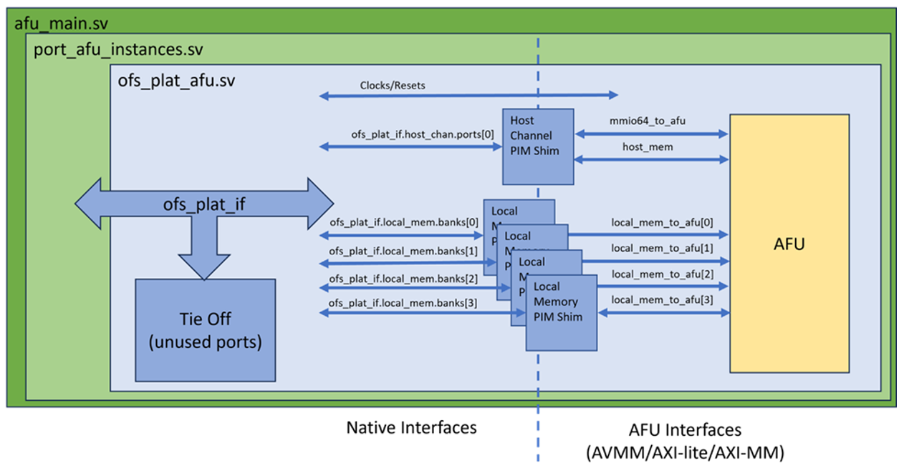

# **PIM Based AFU Developer User Guide**
Last updated: **March 20, 2024** 

## **1. Introduction**

When creating an AFU, a designer needs to decide what type of interfaces the platform (FIM) should provide to the AFU.  The FIM can provide the native interfaces (i.e. PCIe TLP commands) or standard memory mapped interfaces (i.e. AXI-MM or AVMM) by using the PIM.  The PIM is an abstraction layer consisting of a collection of SystemVerilog interfaces and shims to enable partial AFU portability across hardware despite variations in hardware topology and native interfaces. The PIM adds a level of logic between the AFU and the FIM converting the native interfaces from the FIM to match the interfaces provided by the AFU.



This guide will walk you through creating a PIM-Based AFU, including:

- AFU Build environment
- Using the PIM to interface with an AFU
- AFU Design
- Software Development
- Packaging the AFU

For more information on the PIM, refer to [PIM Core Concepts](https://github.com/OFS/ofs-platform-afu-bbb/blob/master/plat_if_develop/ofs_plat_if/docs/PIM_core_concepts.md).

For PIM based examples AFU's to provide templates in designing your own AFU, refer to [examples AFU](https://github.com/OFS/examples-afu.git).

For steps on compiling your AFU, please see the associated platform's AFU Developer Guide.

For steps on integrating your AFU into the FIM, please see the associated platform's FIM Developer Guide.


## **2. AFU Build Environment**
The Platform Interface Manager (PIM) acts as a gateway between the board-specific platform and the generic AFU. It manages resources, handles communication protocols, and translates platform-specific signals to a format the AFU can understand. The PIM wraps all FIM devices in a single container as an interface named `ofs_plat_if`, which is passed to the top-level AFU module `ofs_plat_afu`.

The below table shows the supported interfaces for each channel type by the PIM.  

| Channel        |  AXI-MM  | AXI-Lite | Avalon MM | Avalon MM Rd/Wr |  HSSI Channel  |
| -------------- |  ------  |  ------  | --------- | --------------- | -------------- |
| MMIO           |          |     X    |    X      |                 |                |
| Host Memory    |     X    |          |    X      |        X        |                |
| Local Memory   |     X    |          |    X      |                 |                |
| HSSI           |          |          |           |                 |         X      |

A Partial Reconfiguration (PR) build template is used for configuring a PR AFU build and is derived from a synthesized FIM. The template includes the PIM and the `afu_synth_setup` script, which generates a Quartus build environment for an AFU. The build environment is instantiated from a FIM release and then configured for the specified AFU. The AFU source files are specified in a text file parsed by the script when creating the Quartus project.

The PIM is instantiated in the build environment from an .ini file describing the platform, located at 
`<PR build template>/hw/lib/platform/platform_db/<ofs platform>.ini`

Example N6001 FIM .ini file, `<pr_build_template>/hw/lib/platform/platform_db/ofs_agilex.ini`
```sh
;; Platform Interface Manager configuration
;;
;; Intel® Agilex adp board
;; OFS FIM
;;
;; Local memory with AXI-MM interface
;;

[define]
PLATFORM_FPGA_FAMILY_AGILEX=1
PLATFORM_FPGA_FAMILY_AGILEX7=1
;; Indicates that ASE emulation of the afu_main interface is offered
ASE_AFU_MAIN_IF_OFFERED=1
native_class=none
;; Early versions of afu_main checked INCLUDE_HSSI_AND_NOT_CVL. When
;; this macro is set, the presence of HSSI ports in afu_main() is
;; controlled by INCLUDE_HSSI.
AFU_MAIN_API_USES_INCLUDE_HSSI=1

[clocks]
pclk_freq=int'(ofs_fim_cfg_pkg::MAIN_CLK_MHZ)
;; Newer parameter, more accurate when pclk is not an integer MHz
pclk_freq_mhz_real=ofs_fim_cfg_pkg::MAIN_CLK_MHZ
native_class=none

[host_chan]
num_ports=top_cfg_pkg::PG_AFU_NUM_PORTS
native_class=native_axis_pcie_tlp
gasket=pcie_ss
mmio_addr_width=ofs_fim_cfg_pkg::MMIO_ADDR_WIDTH_PG
num_intr_vecs=ofs_fim_cfg_pkg::NUM_AFU_INTERRUPTS

;; Minimum number of outstanding flits that must be in flight to
;; saturate bandwidth. Maximum bandwidth is typically a function
;; of the number flits in flight, indepent of burst sizes.
max_bw_active_flits_rd=1024
max_bw_active_flits_wr=128

;; Recommended number of times an AFU should register host channel
;; signals before use in order to make successful timing closure likely.
suggested_timing_reg_stages=0

[local_mem]
native_class=native_axi
gasket=fim_emif_axi_mm
num_banks=ofs_fim_mem_if_pkg::NUM_MEM_CHANNELS
;; Address width (line-based, ignoring the byte offset within a line)
addr_width=ofs_fim_mem_if_pkg::AXI_MEM_ADDR_WIDTH-$clog2(ofs_fim_mem_if_pkg::AXI_MEM_WDATA_WIDTH/8)
data_width=ofs_fim_mem_if_pkg::AXI_MEM_WDATA_WIDTH
ecc_width=0
;; For consistency, the PIM always encodes burst width as if the bus were
;; Avalon. Add 1 bit: Avalon burst length is 1-based, AXI is 0-based.
burst_cnt_width=8+1
user_width=ofs_fim_mem_if_pkg::AXI_MEM_USER_WIDTH
rid_width=ofs_fim_mem_if_pkg::AXI_MEM_ID_WIDTH
wid_width=ofs_fim_mem_if_pkg::AXI_MEM_ID_WIDTH
suggested_timing_reg_stages=2

[hssi]
native_class=native_axis_with_fc
num_channels=ofs_fim_eth_plat_if_pkg::MAX_NUM_ETH_CHANNELS

;; Sideband interface specific to this platform. It is used for passing
;; state through plat_ifc.other.ports[] that the PIM does not manage.
[other]
;; Use the PIM's "generic" extension class. The PIM provides the top-level
;; generic wrapper around ports and the implementation of the type is set below.
template_class=generic_templates
native_class=ports
;; All PIM wrappers are vectors. Depending on the data being passed through
;; the interface, FIMs may either use more ports or put vectors inside the
;; port's type.
num_ports=1
;; Data type of the sideband interface
type=ofs_plat_fim_other_if
;; Import the "other" SystemVerilog definitions into the PIM (relative path)
import=import/extend_pim
```

The OFS scripts choose the proper subset of PIM sources to map from standard PIM AFU interfaces to physical hardware. Given an input .ini configuration file, `gen_ofs_plat_if` constructs an `ofs_plat_if` interface that is tailored to the target platform. Templates make it possible for the source tree to support multiple devices of similar types, such as both DDR and HBM, on a single board.

Each major section in a platform .ini file corresponds to one or more devices of the same type. Same-sized banks of local memory share a single .ini section, with the number of banks as a parameter in the section. The same is true of HSSI ports and, on some multi-PCIe systems, of host channels. All devices in a section must share the same properties. If there are two types of local memory on a board with different address or data widths, they must have their own local memory sections. Separate sections of the same type must be named with monotonically increasing numeric suffixes, e.g. local_memory.0 and local_memory.1. The trailing .0 is optional. host_channel.0 and host_channel are equivalent.

The `gen_ofs_plat_if` script, which composes a platform-specific PIM given an .ini file, uses the ofs_plat_if/src/rtl/ tree as a template. The script copies sources into the target `ofs_plat_if` interface within a release, generates some top-level wrapper files and emits rules that import the generated tree for simulation or synthesis.

For more information, refer to [PIM Board Vendors]

### **2.1. PIM Resources**

The PIM provides a collection of RTL interfaces and modules.  These are copied over from ofs-platform-afu-bbb to `<afu build dir>/build/platform/ofs_plat_if/rtl/`.  The modules brought over are based on the FIM's native interfaces:

- ofs_plat_if.vh: PIM's top level wrapper interface for passing all top-level interfaces into an AFU and is copied over to `<afu build dir>/build/platform/ofs_plat_if/rtl/ofs_plat_if.vh`. The 'ofs_plat_if' file typically contains the definition of the interface signals and parameters that connect the AFU to the PIM. This includes details about the data and control signals that the AFU and PIM use to communicate, such as clocks, host channels or local memory.

- PIM interfaces are defined in [base_ifcs] and copied over to `<afu build dir>/build/platform/ofs_plat_if/rtl/base_ifcs`.  This base interface classes tree is a collection of generic interface definitions (e.g. Avalon and AXI) and helper modules (e.g. clock crossing and pipeline stage insertion).

- PIM modules are defined in [ifcs_classes] and copied over to `<afu build dir>/build/platform/ofs_plat_if/rtl/ifc_classes`. The PIM-provided modules (aka shims) transform FIM interfaces to PIM interfaces.  On the AFU side of its shims, all PIM modules share common base AXI and Avalon interfaces.  The PIM modules are classified by the channels they support:
  - host_chan
  - local_memory
  - hssi
  - Other

- PIM utilities are defined in [utils] and copied over to `<afu build dir>/build/platform/ofs_plat_if/rtl/utils`.  Utilities include primitive shims, such as FIFOs, memories, and reorder buffers.

## **3. Using PIM to interface with an AFU**

To interface the PIM with an AFU:

- Create top level module ofs_plat_afu.sv.
- For each Subsystem used by your AFU, create individual channel interfaces using your selected bus protocols and connect the channel PIM Shims based on selected bus protocols.
   - PCIe - Host Channel 
   - Local Memory
   - HSSI
- Tie off all unused channels/ports.
- Connect the channel interfaces to the AFU module.


### **3.1. Top Level Module - ofs_plaf_afu**

For a PIM based AFU, start with the required top level module, ofs_plat_afu, which has a single interface, ofs_plat_if, containing all the FIM connections.   It should include 'ofs_plat_if.vh' to ensure that the PIM resources are available.

```sh
`include "ofs_plat_if.vh"

//
// Top level PIM-based module.
//

module ofs_plat_afu
   (
    // All platform wires, wrapped in one interface.
    ofs_plat_if plat_ifc
    );
```
The SystemVerilog interface `ofs_plat_if` wraps all connections to the FIM's devices. The contents of `ofs_plat_if` may vary from device to device. Portability is maintained by conforming to standard naming conventions. `ofs_plat_if` is, itself, a collection of interface wrappers to groups of devices.  Each PCIe virtual or physical function is treated by the PIM as a separate channel.

For more information, refer to [PIM AFU Interface]

### **3.2. Host Channel**

The host channel serves as the communication pathway between the host and the FPGA. It facilitates the exchange of commands, data, and control signals, allowing the host to interact with the FPGA and manage accelerated functions. 

For more information, refer to [PIM IFC Host Channel]

#### **3.2.1. Create the host channel interfaces to the AFU**

The Host Memory interface is designed to facilitate the communication between the host and the FPGA as it allows the FPGA to access data stored in the host's main memory or to receive data from the host for processing.  

The Host Memory supported interface: 

- AVMM 
- AVMM-RDWR 
- AXI-MM

AXI-MM example:
```sh
ofs_plat_axi_mem_if
  #(
    `HOST_CHAN_AXI_MEM_PARAMS,
    .LOG_CLASS(ofs_plat_log_pkg::HOST_CHAN)
    )
host_mem();
```

The Memory-Mapped I/O (MMIO) allows the host to access and control specific registers or memory locations within the FPGA's address space. This interface is commonly used for configuring and interacting with hardware components through memory-mapped addresses.

The MMIO supported interface: 

- AVMM 
- AXI-Lite

AXI-Lite example:
```sh
ofs_plat_axi_mem_lite_if
  #(
    `HOST_CHAN_AXI_MMIO_PARAMS(64),
    .LOG_CLASS(ofs_plat_log_pkg::HOST_CHAN)
    )
    mmio64_to_afu();
```

#### **3.2.2. Connect the host channel to the PIM Shim**

Using the PIM Shim, host channel FIM interface is bridged over to the AFU's host memory interface and MMIO interface, making it usable for the AFU.

AXI example:
```sh
ofs_plat_host_chan_as_axi_mem_with_mmio primary_axi
       (
        .to_fiu(plat_ifc.host_chan.ports[0]),
        .host_mem_to_afu(host_mem),
        .mmio_to_afu(mmio64_to_afu),
 
        // These ports would be used if the PIM is told to cross to
        // a different clock. In this example, native pClk is used.
        .afu_clk(),
        .afu_reset_n()
        );
```

#### **3.2.3. Avalon Example**

The following examples show the steps for a Avalon MM interface:
```sh
    #Host memory	
    ofs_plat_avalon_mem_rdwr_if
      #(
        `HOST_CHAN_AVALON_MEM_RDWR_PARAMS,
        .LOG_CLASS(ofs_plat_log_pkg::HOST_CHAN)
        )
      host_mem();

    #MMIO
    ofs_plat_avalon_mem_if
      #(
        `HOST_CHAN_AVALON_MMIO_PARAMS(64),
        .LOG_CLASS(ofs_plat_log_pkg::HOST_CHAN)
        )
        mmio64_to_afu();
    
    #PIM Shim
    ofs_plat_host_chan_as_avalon_mem_rdwr_with_mmio primary_avalon
       (
        .to_fiu(plat_ifc.host_chan.ports[0]),
        .host_mem_to_afu(host_mem),
        .mmio_to_afu(mmio64_to_afu),

        .afu_clk(),
        .afu_reset_n()
        );

```

### **3.3. Local Memory**

Local memory is off-chip memory connected to an FPGA but not visible to the host as system memory.  Local memory is organized in groups and banks. Within a group, all banks have the same address and data widths.  

For more information, refer to [PIM IFC Local Memory]

#### **3.3.1. Create the local memory interfaces to the AFU**
  
The Local Memory supported interfaces: 

- AVMM 
- AXI-MM

AXI-MM example:
```sh
    ofs_plat_axi_mem_if
      #(
        `LOCAL_MEM_AXI_MEM_PARAMS_DEFAULT,
        .LOG_CLASS(ofs_plat_log_pkg::LOCAL_MEM),
        .BURST_CNT_WIDTH($clog2(MAX_BURST_SIZE/ofs_plat_host_chan_pkg::DATA_WIDTH_BYTES))
        )
      local_mem_to_afu[local_mem_cfg_pkg::LOCAL_MEM_NUM_BANKS]();
```


#### **3.3.2. Connect local memory to the PIM Shim**

Using the PIM Shim, the local memory FIM interface is bridged over to the AFU's local memory interface, making it usable for the AFU.

AXI example:
```sh
    genvar b;
    generate
        for (b = 0; b < local_mem_cfg_pkg::LOCAL_MEM_NUM_BANKS; b = b + 1)
        begin : mb
            ofs_plat_local_mem_as_axi_mem
              #(
                .ADD_CLOCK_CROSSING(1)
                )
              shim
               (
                .to_fiu(plat_ifc.local_mem.banks[b]),
                .to_afu(local_mem_to_afu[b]),

                .afu_clk(host_mem.clk),
                .afu_reset_n(host_mem.reset_n)
                );
        end
    endgenerate
```

#### **3.3.3. Avalon Example**

The following examples show the steps for a Avalon MM interface:
```sh
    ofs_plat_avalon_mem_if
      #(
        `LOCAL_MEM_AVALON_MEM_PARAMS_DEFAULT,
        .LOG_CLASS(ofs_plat_log_pkg::LOCAL_MEM)
        )
      local_mem_to_afu[local_mem_cfg_pkg::LOCAL_MEM_NUM_BANKS]();
 
    genvar b;
    generate
        for (b = 0; b < local_mem_cfg_pkg::LOCAL_MEM_NUM_BANKS; b = b + 1)
        begin : mb
            ofs_plat_local_mem_as_avalon_mem
              #(
                .ADD_CLOCK_CROSSING(1)
                )
              shim
               (
                .to_fiu(plat_ifc.local_mem.banks[b]),
                .to_afu(local_mem_to_afu[b]),
 
                .afu_clk(mmio64_to_afu.clk),
                .afu_reset_n(mmio64_to_afu.reset_n)
                );
        end
    endgenerate
```

### **3.4. High Speed Serial Interface (HSSI)**

The High-Speed Serial Interface enables high-speed serial communication between the FPGA and external devices. It's commonly used for tasks such as high-speed data streaming, interfacing with storage devices, or connecting to network components.

#### **3.4.1. Create the HSSI interfaces to the AFU**
  
The High-Speed Serial Interface enables high-speed serial communication between the FPGA and external devices. It's commonly used for tasks such as high-speed data streaming, interfacing with storage devices, or connecting to network components.

A vector of HSSI channels holds RX and TX AXI-S data interfaces. In addition to the data streams, each channel has a flow control interface on which pause requests are passed. Within a single channel, the RX, TX and pause interfaces share a clock. The clock is not guaranteed to be common across channels. The PIM provides only an AXI-S data option.

Note: Clock Crossing not supported, parameter and ports are there for standardization

```sh
     // HSSI Channels
     ofs_plat_hssi_channel_if
     #(
        // Log AXI transactions in simulation
        .LOG_CLASS(ofs_plat_log_pkg::HSSI)
      )
      hssi_to_afu[ofs_fim_eth_if_pkg::NUM_ETH_CHANNELS](); 

    genvar c;
    generate
        for (c = 0; c < ofs_fim_eth_if_pkg::NUM_ETH_CHANNELS; c = c + 1)
        begin : ch
                
            ofs_plat_hssi_as_axi_st  hssi_shim
               (
                .to_fiu(plat_ifc.hssi.channels[c]),
                .rx_st(hssi_to_afu[c].data_rx), // HSSI->AFU
                .tx_st(hssi_to_afu[c].data_tx), // AFU->HSSI
                .fc(hssi_to_afu[c].fc),         // Flow Control
                // These are present in all PIM interfaces, though not available with hssi.
                .afu_clk(),
                .afu_reset_n()
                );
        end
    endgenerate
```

### **3.5. Tie Off Unused ports**

In digital design, unused input ports can lead to unpredictable behavior. To prevent this, unused ports are "tied off" to a known state. Tie-offs are passed to the PIM as bit masks in parameters. The mask makes it possible to indicate, for example, that a single local memory bank is being driven.  

```sh
ofs_plat_if_tie_off_unused
  #(
    // Only using channel 0
    .HOST_CHAN_IN_USE_MASK(1)
    // Use two memory banks
    .LOCAL_MEM_IN_USE_MASK(3)
    // Use 4 HSSI channel
    .HSSI_IN_USE_MASK(15)
    )
    tie_off(plat_ifc);
```

### **3.6. AFU Instantiation**

Instantiate the AFU in ofs_plat_afu.sv and connect to the channel interfaces.  

```sh
    // =========================================================================
    //
    //   Instantiate the AFU.
    //
    // =========================================================================

    example_afu
       #(
        .NUM_LOCAL_MEM_BANKS(local_mem_cfg_pkg::LOCAL_MEM_NUM_BANKS),
	    .NUM_ETHERNET_CHANNELS(ofs_fim_eth_if_pkg::NUM_ETH_CHANNELS)
       )
       afu_inst
       (
        .mmio64_to_afu,
        .host_mem,
        .local_mem_to_afu,
        .hssi_to_afu
        );
```

## **4. AFU**

The AFU requires that each channel uses the interfaces supported by the PIM.   The below table shows the supported interfaces for each channel type.  The MMIO channel is the only channel required by the FIM, while all other channels are optional and can be tied off.  

| Channel        |  AXI-MM  | AXI-Lite | Avalon MM | Avalon MM Rd/Wr |  HSSI Channel  |
| -------------- |  ------  |  ------  | --------- | --------------- | -------------- |
| MMIO           |          |     X    |    X      |                 |                |
| Host Memory    |     X    |          |    X      |        X        |                |
| Local Memory   |     X    |          |    X      |                 |                |
| HSSI           |          |          |           |                 |         X      |

### **4.1. AFU top level module**

The AFU module should match the interfaces provided by the PIM. Including ofs_plat_if.vh in your module will bring in the base interface classes and channel interfaces:

```sh
`include "ofs_plat_if.vh"

module example_afu
  #(
    parameter NUM_LOCAL_MEM_BANKS = 2,
    parameter NUM_ETHERNET_CHANNELS = 2
    )
   (
    // CSR interface (MMIO on the host)
    ofs_plat_axi_mem_lite_if.to_source mmio64_to_afu,

    // Host memory (DMA)
    ofs_plat_axi_mem_if.to_sink host_mem_to_afu,

    // Local memory interface 
    ofs_plat_axi_mem_if.to_sink local_mem_to_afu[NUM_LOCAL_MEM_BANKS],
 
	// High Speed Serial Interface
   ofs_plat_hssi_channel_if hssi_to_afu [NUM_ETHERNET_CHANNELS]
    
    );
```

### **4.2. AFU Interfaces**

The AXI-MM and AXI-Lite interfaces are defined in the `<afu_build_dir>/build/platform/ofs_plat_if/rtl/base_ifcs/axi` directory.   

For AXI-MM and AXI-Lite, the handshaking signals (Ready and Valid) are separated from each of the interfaces (aw, w, b, ar, r). For example, the aw interface is defined as:
```sh
t_axi_mem_aw aw;
logic awvalid;
logic awready;
```

The Avalon MM interfaces are defined in the `<afu_build_dir>/build/platform/ofs_plat_if/rtl/base_ifcs/avalon` directory.  There are two Avalon MM interfaces, a traditional interface (ofs_plat_avalon_mem_if) with shared read and write operations and a split-bus interface (ofs_plat_avalon_mem_rdwr_if) which separates the read and write channels.

The HSSI Channel interface is defined in the `<afu_build_dir>/build/platform/ofs_plat_if/rtl/ifc_classes/hssi` directory.   The HSSI channel is comprised of three interfaces, RX AXIS, TX AXIS and flow control.  These interfaces are defined in `<afu_build dir>/build/ofs-common/src/fpga_family/<device family>/hssi_ss/inc/ofs_eth_fim_if.sv`.

Clock and Resets definition and header files are in the `<afu_build_dir>/build/platform/ofs_plat_if/rtl/base_ifcs/clocks` directory.  By default, each channel has its own associated clock and reset which is derived from it connected subsystem.  Using the ADD_CROSS_CLOCKING option with the PIM shims, allows the channels to all be on the same clock domain. 
```sh
    // Each interface names its associated clock and reset.
    logic afu_clk;
    assign afu_clk = mmio64_to_afu.clk;
    logic afu_reset_n;
    assign afu_reset_n = mmio64_to_afu.reset_n;
```

### **4.3. CSR Interface**
The MMIO is the only required channel for the AFU.   Besides providing a control and status interface for the AFU, the MMIO is required to have base registers as described in the [Device Feature List Overview], which is used by the OPAE SW.    

When using the host channel, the Host creates shared buffers created between the Host CPU and FPGA.  The base address of these buffers should be passed to the AFU using the MMIO interface.  

### **4.4. Addressing**
The interface addressing depends on the interface's bus protocol, the below table shows the addressing based of interface.

| Interface     |  Addressing |
| ------------- |  ---------- | 
| AXI           |     Byte    |
| Avalon        |     Word    |

### **4.5. Replicating Interface Parameters**
When creating interfaces in the AFU, using \`OFS_PLAT_AXI_MEM_IF_REPLICATE_PARAMS or \`OFS_PLAT_AVALON_MEM_IF_REPLICATE_PARAMS allows the interface to have the same parameters as the channel interface. 

```sh
// The read ports will be connected to the read engine and the write ports unused.
// This will split the read channels from the write channels but keep
// a single interface type.
ofs_plat_axi_mem_if
  #(
  // Copy the configuration from host_mem
     `OFS_PLAT_AXI_MEM_IF_REPLICATE_PARAMS(host_mem)
    )
    host_mem_rd();
```

### **4.6. SystemVerilog Packages**

The AFU project provides System Verilog packages, which provide configuration details for the different channels.

The Host Channel and Local Memory System Verilog packages are included by default in the Quartus Project:

- Host Channel Package: ofs_plat_host_chan_pkg
    `<afu_build_dir>/build/platform/ofs_plat_if/rtl/ifc_classes/host_chan/afu_ifcs/include/ofs_plat_host_chan_pkg.sv`
- Local Memory Package: local_mem_cfg_pkg  
    `<afu_build_dir>/build/platform/ofs_plat_if/rtl/ifc_classes/local_mem/local_mem_cfg_pkg.sv`

The HSSI Channel System Verilog package is not included by default, therefore it needs to be imported:

- HSSI Channel Package: ofs_fim_eth_if_pkg  
    `<afu_build_dir>/build/ofs-common/src/fpga_family/agilex/hssi_ss/inc/ofs_fim_eth_if_pkg.sv`
```sh
import ofs_fim_eth_if_pkg::*;
```
 
## **5. Host Software Development**

The host application is used to control the AFU and manage data transfer between the host and the AFU.   The host channel provides two interfaces between the host and AFU, MMIO and Host Memory.   MMIO is used to read/write the CSR interface of the AFU, and the Host Memory interface is used to share data between the AFU and Host user space. 


### **5.1. Host Application Flow**
The OPAE SDK provides a library with routines to setup and manage the AFU.  The basic host application flow is as follows:


When creating the host application, the following OPAE Header Files are required:
- opae/fpga.h  - For the OPAE C API library 
- afu_json_info.h - For AFU information including UUID 

```sh
// Headers needed for example code
#include <stdint.h>
#include <stdio.h>
#include <stdlib.h>
#include <assert.h>
// For uuid_parse() to convert UUID string into binary
#include <uuid/uuid.h>

// OPAE C API
#include <opae/fpga.h>

// State from the AFU's JSON file, extracted using OPAE's afu_json_mgr script
#include "afu_json_info.h"
```

#### **5.1.1. Find and connect to AFU**

Here is an example function which searches for the AFU based on its UUID.  If there is a match, it will connect to the AFU.   It will also check to see if the AFU is being run in hardware or simulation (ASE).

```sh
// Set as global, to allow MMIO routines to access in ASE mode
static fpga_handle s_accel_handle;

//
// Search for an accelerator matching the requested UUID and connect to it.
// Check to see if running in ASE-Simulation mode
//
static fpga_handle connect_to_accel(const char *accel_uuid, bool *is_ase_sim)
{
    fpga_properties filter = NULL;
    fpga_guid guid;
    fpga_token accel_token;
    uint32_t num_matches;
    fpga_handle accel_handle;
    fpga_result r;

    // Don't print verbose messages in ASE by default
    setenv("ASE_LOG", "0", 0);
    *is_ase_sim = NULL;

    // Set up a filter that will search for an accelerator
    fpgaGetProperties(NULL, &filter);
    fpgaPropertiesSetObjectType(filter, FPGA_ACCELERATOR);

    // Convert UUID string into binary
    uuid_parse(accel_uuid, guid);
    // Add the desired UUID to the filter
    fpgaPropertiesSetGUID(filter, guid);

    // Do the search across the available FPGA contexts
    num_matches = 1;
    fpgaEnumerate(&filter, 1, &accel_token, 1, &num_matches);

    // Not needed anymore
    fpgaDestroyProperties(&filter);

    if (num_matches < 1)
    {
        fprintf(stderr, "Accelerator %s not found!\n", accel_uuid);
        return 0;
    }

    // Acquire ownership of accelerator
    r = fpgaOpen(accel_token, &accel_handle, 0);
    assert(FPGA_OK == r);

    // While the token is available, check whether it is for HW or for ASE simulation.
    fpga_properties accel_props;
    uint16_t vendor_id, dev_id;
    fpgaGetProperties(accel_token, &accel_props);
    fpgaPropertiesGetVendorID(accel_props, &vendor_id);
    fpgaPropertiesGetDeviceID(accel_props, &dev_id);
    *is_ase_sim = (vendor_id == 0x8086) && (dev_id == 0xa5e);

    // Done with token
    fpgaDestroyToken(&accel_token);

    return accel_handle;
}
```

In main(), the function is called updating the accel_handle and ASE status.   AFU_ACCEL_UUID is provided by afu_json_info.h created for the Accelerator Descriptor File:
```sh
    bool is_ase_sim;
    
    // Find and connect to the accelerator(s)
    s_accel_handle = connect_to_accel(AFU_ACCEL_UUID, &is_ase_sim);
    if (NULL == s_accel_handle) return 0;
```

#### **5.1.2. Map MMIO (optional)**
Mapping the MMIO provides higher performance on the MMIO access versus the standard OPAE MMIO functions.  fpgaMapMMIO() is used to return a pointer to the specified MMIO space of the target AFU in process virtual memory.  When running in ASE mode, MMIO mapping isn't supported and the MMIO pointer is set to NULL.   

```sh
static volatile uint64_t *s_mmio_buf;

fpga_result r;
    if (is_ase_sim)
    {
        printf("Running in ASE Mode");
		s_mmio_buf = NULL;
    }
    else
    {
        uint64_t *tmp_ptr;
        r = fpgaMapMMIO(s_accel_handle, 0, &tmp_ptr);
        assert(FPGA_OK == r);
        s_mmio_buf = tmp_ptr;
    }

```

The below example functions provide MMIO Reads/Writes.   When running in hardware the functions will use s_mmio_buf for accessing.  When running in ASE mode, indicated by s_mmio_buf being set to NULL, fpgaReadMMIO64() fpgaWriteMMIO64() will be used.
```sh
//
// Read a 64 bit CSR. When a pointer to CSR buffer is available, read directly.
// Direct reads can be significantly faster.
// If s_mmio_buf is NULL, in ASE mode and need to use OPAE MMIO functions.
//
static inline uint64_t readMMIO64(uint32_t idx)
{
    if (s_mmio_buf)
    {
        return s_mmio_buf[idx];
    }
    else
    {
        fpga_result r;
        uint64_t v;
        r = fpgaReadMMIO64(s_accel_handle, 0, 8 * idx, &v);
        assert(FPGA_OK == r);
        return v;
    }
}

//
// Write a 64 bit CSR. When a pointer to CSR buffer is available, write directly.
//
static inline void writeMMIO64(uint32_t idx, uint64_t v)
{
    if (s_mmio_buf)
    {
        s_mmio_buf[idx] = v;
    }
    else
    {
        fpgaWriteMMIO64(s_accel_handle, 0, 8 * idx, v);
    }
}
```

#### **5.1.3. Allocate Shared Memory Buffers**
The below example function creates the shared buffers and provides the physical address for AFU access.
```sh
//
// Allocate a buffer in I/O memory, shared with the FPGA.
//
static volatile void* alloc_buffer(fpga_handle accel_handle,
                                   ssize_t size,
                                   uint64_t *wsid,
                                   uint64_t *io_addr)
{
    fpga_result r;
    volatile void* buf;

    r = fpgaPrepareBuffer(accel_handle, size, (void*)&buf, wsid, 0);
    if (FPGA_OK != r) return NULL;

    // Get the physical address of the buffer in the accelerator
    r = fpgaGetIOAddress(accel_handle, *wsid, io_addr);
    assert(FPGA_OK == r);

    return buf;
}
```

In main(), define the buffers and use the above function to allocate the shared buffers.   OPAE supports multiple buffers, and the number of buffers is design dependent.  Buffers over 4KB require hugepage support on the host.   The buffer address needs to be passed to the AFU over MMIO, for the AFU to correctly access the buffer.
```sh
    #define BUF_SIZE_IN_BYTES 16384

    volatile unsigned char *src_buf;
    uint64_t src_wsid;
    uint64_t src_pa;
    
    volatile unsigned char *dst_buf;
    uint64_t dst_wsid;
    uint64_t dst_pa;


    src_buf = alloc_buffer(s_accel_handle, BUF_SIZE_IN_BYTES, &src_wsid, &src_pa);
    assert(NULL != src_buf);

    dst_buf = alloc_buffer(s_accel_handle, BUF_SIZE_IN_BYTES, &dst_wsid, &dst_pa);
    assert(NULL != dst_buf);

```

#### **5.1.4. Perform Acceleration**
The host application interaction is AFU dependent.  Generally, the MMIO interface will be used to setup and control the AFU.   While the shared buffers are used to pass data between the host and AFU.   Below is an example of setting up the AFU, writing the buffer and retrieving the results from the AFU.
```sh
// Loading source buffer with walking ones
for(i=0; i < BUF_SIZE_IN_BYTES; i++)
{
   src_buf[i] = 1 << (i & 0x7); // walking ones
}
// Send AFU buffer addresses and size 
// register addresses are based on the AFU CSR interface
writeMMIO64(8, src_pa);
writeMMIO64(9, dst_pa);
writeMMIO64(10, buf_size);

// Start Acceleration
writeMMIO64(11, 1);

// Wait for AFU to complete acceleration
while(!readMMIO64(12))
   ;

// Read destination buffer and print output
printf("output: ");
for(i=0; i < BUF_SIZE_IN_BYTES; i++)
{
   printf("%d ", dst_buf[i]);
}
```

#### **5.1.5. Cleanup**
When the acceleration is complete, the host application should release the shared buffers and release ownership of the AFU.
```sh
    // Release shared buffers
    fpgaReleaseBuffer(s_accel_handle, src_wsid);
    fpgaReleaseBuffer(s_accel_handle, dst_wsid);   

    // Release ownership of accelerator
    fpgaClose(s_accel_handle);
```

### **5.2. Building the Host Application**
A Makefile is used to build the host application.   Below is an example Makefile from the [examples AFU](https://github.com/OFS/examples-afu.git) repo with the following updated:

- Path to common_include.mk (from examples-afu)
- TEST name
- Source files: SRCS
- Path to .json file (relative to Makefile directory)

Makefile:
```sh
# Path to examples-afu/tutorial/afu_types/01_pim_ifc/common/sw/common_include.mk
include ../../common/sw/common_include.mk

# Primary test name
TEST = example_afu

# Build directory
OBJDIR = obj
CFLAGS += -I./$(OBJDIR)
CPPFLAGS += -I./$(OBJDIR)

# Files and folders
SRCS = $(TEST).c
OBJS = $(addprefix $(OBJDIR)/,$(patsubst %.c,%.o,$(SRCS)))

all: $(TEST)

# AFU info from JSON file, including AFU UUID
AFU_JSON_INFO = $(OBJDIR)/afu_json_info.h
$(AFU_JSON_INFO): ../hw/rtl/$(TEST).json | objdir
	afu_json_mgr json-info --afu-json=$^ --c-hdr=$@
$(OBJS): $(AFU_JSON_INFO)

$(TEST): $(OBJS)
	$(CC) -o $@ $^ $(LDFLAGS) $(FPGA_LIBS) -lrt -pthread

$(OBJDIR)/%.o: %.c | objdir
	$(CC) $(CFLAGS) -c $< -o $@

clean:
	rm -rf $(TEST) $(OBJDIR)

objdir:
	@mkdir -p $(OBJDIR)

.PHONY: all clean
```

### **5.3. Running the Host Application**
To run the host application, you will need to:

- Load AFU onto the FIM
- Create VF's
- Bind VF's using the OPAE Drivers
- Run application

See the associated AFU Developer Guide for details.

## **6. Packaging the AFU**
Besides the RTL and software files, an AFU requires an Accelerator Description File and source list file.  These files are used during the build process.

### **6.1. Accelerator Description File**
The Accelerator Description File is a JSON file that describes the metadata associated with an AFU. The Open Programmable Accelerator Engine (OPAE) uses this metadata during reconfiguration. 

example_afu.json:
```sh
{
   "version": 1,
   "afu-image": {
      "power": 0,
      "clock-frequency-high": "auto",
      "clock-frequency-low": "auto",
      "afu-top-interface":
         {
            "class": "ofs_plat_afu"
	  },
      "accelerator-clusters":
         [
            {
               "name": "example_afu",
               "total-contexts": 1,
               "accelerator-type-uuid": "01234567-89ab-cdef-fedc-ba9876543210"
            }
         ]
   }
}
```

- power - Accelerator Function power consumption, in watts. Set to 0 for Intel ADP platforms.
- clock-frequency-high - Clock frequency for uclk_usr in MHz.  (optional)
- clock-frequency-low -  Clock frequency for uclk_usr_div2  in MHz. (optional)
- afu-top-interface:
  - class : Set to "ofs_plat_afu" for PIM based AFU, "afu_main" for native/hybrid AFU's.
- accelerator-clusters:
  - name : name of AFU
  - total-contexts : Set to '1'
 - accelerator-type-uuid : 128-bit Universally Unique Identifier (UUID) used to identify the AFU. 

The ASE and synthesis setup scripts call afu_json_mgr to create afu_json_info.vh:
```sh
//
// Generated by afu_json_mgr from …/hw/rtl/example_afu.json
//

`ifndef __AFU_JSON_INFO__
`define __AFU_JSON_INFO__

`define AFU_ACCEL_NAME "example_afu"
`define AFU_ACCEL_NAME0 "example_afu"
`define AFU_ACCEL_UUID 128'h01234567_89ab_cdef_fedc_ba9876543210
`define AFU_ACCEL_UUID0 128'h01234567_89ab_cdef_fedc_ba9876543210
`define AFU_IMAGE_POWER 0
`define AFU_TOP_IFC "ofs_plat_afu"

`endif // __AFU_JSON_INFO__
```

The Makefile calls the afu_json_mgr to create afu_json_info.h:
```sh
//
// Generated by afu_json_mgr from ../hw/rtl/example_afu.json
//
#ifndef __AFU_JSON_INFO__
#define __AFU_JSON_INFO__
#define AFU_ACCEL_NAME " example_afu "
#define AFU_ACCEL_NAME0 " example_afu "
#define AFU_ACCEL_UUID "01234567-89AB-CDEF-FEDC-BA9876543210"
#define AFU_ACCEL_UUID0 "01234567-89AB-CDEF-FEDC-BA9876543210"
#define AFU_IMAGE_POWER 0
#define AFU_TOP_IFC "ofs_plat_afu"
#endif // __AFU_JSON_INFO__
```

### **6.2. Source List File**
The source list file is used by the ASE and synthesis setup scripts to build the AFU project.  It should include the accelerator description file and RTL source files.   The file paths are relative to the source list file location.

example sources.txt:
```sh
# Paths are relative to sources.txt file

# Accelerator Descriptor File
example_afu.json

# Top level module
ofs_plat_afu.sv

# RTL
example_afu.sv
example_afu_csr.sv
accelerator.sv
dma_engine.sv

# Pointer to software - Information only
# ../../sw/example_afu.c
```

### **6.3. Directory Structure**
Below is an example directory structure:

```sh
example_afu
|-- hw
|   |-_ rtl
|       |-- example_afu.json 
|       |-- sources.txt
|       |-- ofs_plat_afu.sv
|       |-- example_afu.sv 
|       |-- example_afu_csr.sv 
|       |-- accelerator.sv 
|       |-- dma_engine.sv
|--  sw
    |-- example_afu.c
    |-- Makefile
```


## Notices & Disclaimers

Intel<sup>&reg;</sup> technologies may require enabled hardware, software or service activation.
No product or component can be absolutely secure. 
Performance varies by use, configuration and other factors.
Your costs and results may vary. 
You may not use or facilitate the use of this document in connection with any infringement or other legal analysis concerning Intel products described herein. You agree to grant Intel a non-exclusive, royalty-free license to any patent claim thereafter drafted which includes subject matter disclosed herein.
No license (express or implied, by estoppel or otherwise) to any intellectual property rights is granted by this document, with the sole exception that you may publish an unmodified copy. You may create software implementations based on this document and in compliance with the foregoing that are intended to execute on the Intel product(s) referenced in this document. No rights are granted to create modifications or derivatives of this document.
The products described may contain design defects or errors known as errata which may cause the product to deviate from published specifications.  Current characterized errata are available on request.
Intel disclaims all express and implied warranties, including without limitation, the implied warranties of merchantability, fitness for a particular purpose, and non-infringement, as well as any warranty arising from course of performance, course of dealing, or usage in trade.
You are responsible for safety of the overall system, including compliance with applicable safety-related requirements or standards. 
<sup>&copy;</sup> Intel Corporation.  Intel, the Intel logo, and other Intel marks are trademarks of Intel Corporation or its subsidiaries.  Other names and brands may be claimed as the property of others. 

OpenCL and the OpenCL logo are trademarks of Apple Inc. used by permission of the Khronos Group™. 
