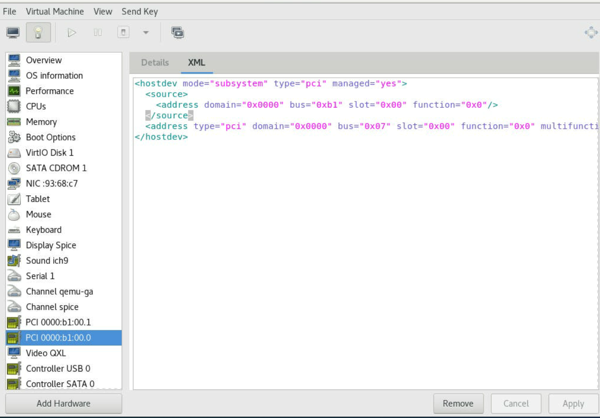
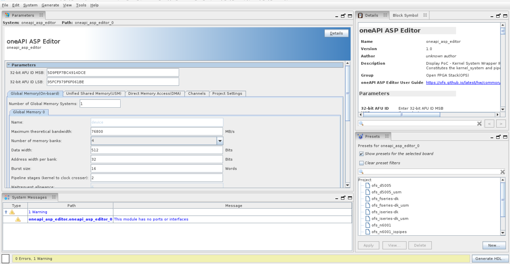
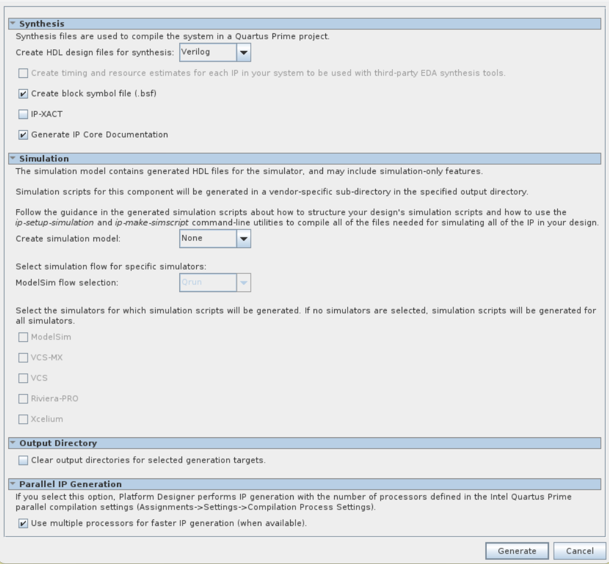

# oneAPI Accelerator Support Package (ASP): Getting Started User Guide

## **1.0 Introduction**
<a name="introduction"></a>

### **1.1 About This Document**
<a name="about_this_document"></a>

This document serves as a quick start guide for setting up [Intel® oneAPI Base Toolkit (Base Kit)] on Open FPGA Stack (OFS) using `oneapi-asp` repository. Please see Table 1-1 for OFS reference platforms targeted in this guide.

**Table 1-1 HLD Tools**

| Target Device for the oneAPI ASP | Target Platform for the oneAPI ASP  |
|---------|---------|
| Agilex™ 7 FPGA | [Intel® FPGA SmartNIC N6001-PL](https://www.intel.com/content/www/us/en/products/details/fpga/platforms/smartnic/n6000-pl-platform.html) |
| Agilex™ 7 FPGA | [Agilex™ 7 FPGA F-Series Development Kit (2x F-Tile)](https://www.intel.com/content/www/us/en/products/details/fpga/development-kits/agilex/agf027-and-agf023.html) |
| Agilex™ 7 FPGA | [Agilex™ 7 FPGA I-Series Development Kit (2x R-Tile and 1xF-Tile)](https://www.intel.com/content/www/us/en/products/details/fpga/development-kits/agilex/agi027.html) |
| Stratix® 10 FPGA | [Intel® FPGA PAC D5005](https://www.intel.com/content/www/us/en/products/sku/193921/intel-fpga-pac-d5005/specifications.html) |

>**Note :** Intel® FPGA SmartNIC N6001-PL is for ODMs only. End users may choose a developer kit, or a vendor-supported board and work with their board vendor.

> **Attention:** Intel is discontinuing the Intel FPGA SDK for OpenCL software product. Refer to the [Product Discontinuation Notice PDN2219](https://cdrdv2.intel.com/v1/dl/getContent/738067?explicitVersion=true). Alternatively, Intel recommends using the Intel® oneAPI Base Toolkit (Base Kit), which provides core tools and libraries for developing high-performance data-centric applications across diverse architectures. It features an industry-leading C++ compiler that implements SYCL*, an evolution of C++ for heterogeneous computing. For more information, refer to the [Intel® oneAPI Base Toolkit (Base Kit)] web page. To migrate your OpenCL FPGA designs to SYCL, review [*Migrating OpenCL™ FPGA Designs to SYCL*\*](https://www.intel.com/content/www/us/en/develop/documentation/migrate-opencl-fpga-designs-to-dpcpp/top.html) that demonstrates important differences between OpenCL and SYCL for FPGA and provides steps to migrate your OpenCL designs.

After reviewing the document you will be able to:

-   Setup your host machine to develop HLD AFUs 

-   Compile and run sample HLD applications on OFS

### **1.2 Terminology**
<a name="terminology"></a>

This table defines some of the common terms used when discussing OFS.

**Table 1-2: Terminology**

| Term  | Abbreviation | Description |
|---------|---------|---------|
| Open FPGA Stack | OFS | A modular collection of hardware platform components, open source software, and broad ecosystem support that provides a standard and scalable model for AFU and software developers to optimize and reuse their designs. |
| Accelerator Functional Unit | AFU |Hardware Accelerator implemented in FPGA logic which offloads a computational operation for an application from the CPU to improve performance. *Note: An AFU region is the part of the design where an AFU may reside.  This AFU may or may not be a partial reconfiguration region.* |
| FPGA Interface Manager | FIM | Provides platform management, functionality, clocks, resets and standard interfaces to host and AFUs.  The FIM resides in the static region of the FPGA and contains the FPGA Management Engine (FME) and I/O ring.|
| High Level Design | HLD | For the purpose of this guide, this term refers to designing with Intel® oneAPI Base Toolkit (Base Kit). |
|oneAPI Accelerator Support Package | oneAPI ASP OR oneapi-asp | A collection of hardware and software components that enable oneAPI kernels to communicate with oneAPI runtime as well as with OFS components. The hardware components of the oneAPI ASP along with the kernels lie in the AFU region. |
| Open Programmable Acceleration Engine Software Development Kit | OPAE SDK | A collection of libraries and tools to facilitate the development of software applications and accelerators using OPAE. |
| Platform Interface Manager | PIM | An interface manager that comprises two components: a configurable platform specific interface for board developers and a collection of shims that AFU developers can use to handle clock crossing, response sorting, buffering and different protocols. |
| Device Feature List | DFL | A concept inherited from OFS. The DFL drivers provide support for FPGA devices that are designed to support the Device Feature List. The DFL, which is implemented in RTL, consists of a self-describing data structure in PCI BAR space that allows the DFL driver to automatically load the drivers required for a given FPGA configuration. |
| Best Known Configuration | BKC | The exact hardware configuration Intel has optimized and validated the solution against. |
| SYCL | - | [SYCL](https://www.khronos.org/sycl/) (pronounced "sickle") is a royalty-free, cross-platform abstraction layer that enables code for heterogeneous and offload processors to be written using modern ISO C++ (at least C++ 17). It provides several features that make it well-suited for programming heterogeneous systems, allowing the same code to be used for CPUs, GPUs, FPGAs or any other hardware accelerator. SYCL was developed by the Khronos Group, a non-profit organization that develops open standards (including OpenCL™) for graphics, compute, vision, and multimedia. SYCL is being used by a growing number of developers in a variety of industries, including automotive, aerospace, and consumer electronics.|
| Data Parallel C++ | DPC++ | [DPC++](https://www.intel.com/content/www/us/en/developer/tools/oneapi/data-parallel-c-plus-plus.html#gs.5sqn4j) is Intel’s implementation of the SYCL standard. It supports additional attributes and language extensions which ensure DCP++ (SYCL) is efficiently implanted on Intel hardware. |
| Installable Client Driver | ICD | [Intel® FPGA Runtime for OpenCL™ Software Technology](https://github.com/intel/fpga-runtime-for-opencl) supports the OpenCL ICD extension from the Khronos Group™. The OpenCL ICD extension allows you to have multiple OpenCL implementations on your system. With the OpenCL ICD Loader Library, you may choose from a list of installed platforms and execute OpenCL API calls that are specific to your OpenCL implementation of choice. |
| FPGA Client Driver | FCD | [Intel® FPGA Runtime for OpenCL™ Software Technology](https://github.com/intel/fpga-runtime-for-opencl) supports FPGA Client Driver(FCD) extension. FCD allows the runtime to automatically find and load the oneAPI ASP libraries at host run time |

### **1.3 Introduction to High Level Design on OFS**
<a name="intrduction_hld_ofs"></a>

Intel currently provides Intel® oneAPI Base Toolkit (Base Kit) for FPGA application development using high level languages like Data Parallel C++(DPC++).

Figure 1-1 shows how OFS components can be used with Intel HLD tool.

**Figure 1-1 HLD Tool on OFS Platforms**


For high level description and setup details for OFS components shown in figure above, please refer to the Getting Started guide for your target device.

-   [Getting Started Guide: OFS for Agilex™ 7 PCIe Attach FPGAs (Intel® FPGA SmartNIC N6001-PL/N6000-PL)].
-   [Getting Started Guide: OFS for Agilex™ 7 PCIe Attach FPGAs (F-Series Development Kit (2xF-Tile))].
-   [Getting Started Guide: OFS for Agilex™ 7 PCIe Attach FPGAs (I-Series Development Kit (2xR-Tile, 1xF-Tile))].
-   [Getting Started Guide: OFS for Stratix 10® FPGA PCIe Attach FPGAs].

For a more detailed diagram and more information about the FPGA Interface Manager(FIM) shown in figure above, please refer to the FIM developer guides for your target device.

-   [Shell Developer Guide: OFS for Agilex™ 7 PCIe Attach (P-tile, E-tile) FPGAs].
-   [Shell Developer Guide: OFS for Agilex™ 7 PCIe Attach (2xF-tile) FPGAs].
-   [Shell Developer Guide: OFS for Agilex™ 7 PCIe Attach (2xR-tile, F-tile) FPGAs].
-   [Shell Developer Guide: OFS for Stratix® 10 PCIe Attach FPGAs].

The oneAPI ASP is required for compiling and running HLD application kernel on OFS platforms using Intel oneAPI. It is a collection of hardware and software components that enable oneAPI kernels to communicate with oneAPI runtime as well as with other OFS components. The hardware components of the oneAPI ASP along with the kernel lie in the AFU region shown in the figure above. For more details about the components of the oneAPI ASP, please refer to [oneAPI Accelerator Support Package(ASP) Reference Manual: Open FPGA Stack].

Figure 1-2 shows the setup steps to use oneAPI base toolkit on OFS platforms.

**Figure 1-2 Setup Steps for oneAPI base toolkit on OFS Platforms**


The next section covers the setup steps in detail.

> **Note:** Administrative privileges are needed for multiple setup steps, ensure you have administrative/sudo privileges before proceeding.

## **2.0 Setup Flow for Using HLD Tool on OFS**
<a name="setup_flow"></a>

### **2.1 Setup Server for OFS**
<a name="server_setup_ofs"></a>

As a first step, the server or host machine being used for developing HLD application needs to be setup for OFS. This involves setting up the FPGA card as well as installing OFS software stack including [OPAE SDK] and [OFS DFL kernel driver].

Please follow steps in [Software Installation Guide: OFS for PCIe Attach FPGAs] to setup Linux DFL kernel driver and install OPAE SDK.

### **2.2 Clone and Compile FIM**
<a name="clone_compile_fim"></a>

As shown in Figure 1-1, OFS components in the FPGA include the FIM and Accelerator Functional Unit(AFU). The oneAPI ASP is in the Partial Reconfiguration(PR) region of the AFU and relies on the compiled database of the static region(FIM) to interface with the host and board peripherals(e.g. on-board memory).

Once the server is setup with OPAE SDK and DFL kernel driver, the next step is to clone and compile the static region of the design, i.e. FIM. You can use the default configuration of the FIM for all target platforms. Additionaly  for Agilex™ 7 FPGA you have the option to create 2 different types of FIM with different PCIe configurations, 1PF/1VF and 2PF (built using an ofss file provided, see table below for more information). Furthermore, for Intel® FPGA SmartNIC N6001-PL and Agilex™ 7 FPGA I-Series Development Kit (2x R-Tile and 1xF-Tile) platforms you can create a minimal FIM which removes the HSSI subsystem and host exercisers in the design and expand the AFU PR region with the area previously used by the removed components, follow the corresponding Shell Developer Guide for more information. The difference between this two PCIe configurations, are the amount of VFs that must be created, in case of 1PF/1VF , only 1 VF is needed. In case of 2PF FIM no VF creation is required. 2PF FIM could be used in FPGA development in virtual machines, see *[Section 3.0 OneAPI on OFS Running in a Virtual Machine](#30-oneapi-on-ofs-running-in-a-virtual-machine)*. Please see Table 2-1 below for more information.

**Table 2-1 Agilex™ 7 FPGA FIM Configurations**

| Target Platform |  FIM 1PF/1VF configuration |  FIM 2PF configuration |
|---------|---------|---------|
| Intel® FPGA SmartNIC N6001-PL | pcie_host_1pf_1vf.ofss | pcie_host_2pf.ofss |
| Agilex™ 7 FPGA F-Series Development Kit (2x F-Tile) | pcie_host_1pf_1vf.ofss | pcie_host_2pf.ofss |
| Agilex™ 7 FPGA I-Series Development Kit (2x R-Tile and 1xF-Tile) | pcie_host_2link_1pf_1vf.ofss | no ofss provided <br> <br>**Note:** For steps to build the 2PF FIM refer to [Shell Developer Guide: OFS for Agilex™ 7 PCIe Attach (2xR-tile, F-tile) FPGAs] |
| |

Please follow steps in the *Shell Developer Guides* for your target device to compile FIM supporting PR release.

-   [Shell Developer Guide: OFS for Agilex™ 7 PCIe Attach (P-tile, E-tile) FPGAs].
-   [Shell Developer Guide: OFS for Agilex™ 7 PCIe Attach (2xF-tile) FPGAs].
-   [Shell Developer Guide: OFS for Agilex™ 7 PCIe Attach (2xR-tile, F-tile) FPGAs].
-   [Shell Developer Guide: OFS for Stratix® 10 PCIe Attach FPGAs].

A `pr_build_template` directory will be generated in the work directory specified as part of the FIM compile command (using `OFS/ofs-common/scripts/common/syn/build_top.sh` script with the '-p' option enable to create an out-of-tree PR release). The `pr_build_template` directory is required for successful setup of the oneAPI ASP.

Once the FIM compile is complete, please program FIM using `fpgasupdate` and Remote System Update(`rsu`) command for Intel® FPGA SmartNIC N6001-PL and Intel® FPGA PAC D5005. Use of these commands has been demonstrated in `4.6.3 Updating with fpgasupdate` and `4.6.5 Loading Images with rsu` sections in [Getting Started Guide: OFS for Agilex™ 7 PCIe Attach FPGAs (Intel® FPGA SmartNIC N6001-PL/N6000-PL)], refer to sections `5.2.1 fpgasupdate` and `5.2.3 rsu` in [Getting Started Guide: OFS for Stratix 10® FPGA PCIe Attach FPGAs] for Stratix® 10 FPGA. In case of Agilex™ 7 FPGA I-Series Development Kit (2x R-Tile and 1xF-Tile) and Agilex™ 7 FPGA F-Series Development Kit (2x F-Tile) platforms, program the FIM with a SOF image via JTAG, refer to `Chapter 5` in [Shell Developer Guide: OFS for Agilex™ 7 PCIe Attach (2xR-tile, F-tile) FPGAs] and [Shell Developer Guide: OFS for Agilex™ 7 PCIe Attach (2xF-tile) FPGAs] guides for more information. 

Clone the ofs-platform-afu-bbb repository that is requiered for the generation of the ASP.

>**Note:** Checkout to the tag that corresponds to the OFS version you are using.

</pre>

        git clone https://github.com/OFS/ofs-platform-afu-bbb.git
        cd ofs-platform-afu-bbb
        git checkout tags/ofs-2024.2-1
</pre>

Ensure the correct tag has ben checked out:
</pre>

        git describe --tags
</pre>

* Output:

</pre>

        ofs-2024.2-1
</pre>

### **2.3 Prerequisites**
<a name="prerequisites"></a>

In addition to server setup and FIM compilation, a few linux packages are needed to setup the oneAPI ASP and develop HLD applications.

1) Install the following packages:

</pre>

        sudo dnf install numactl-devel ncurses-compat-libs
</pre>

2) Ensure that IOMMU is turned on as explained in section `3.2 Building and Installing the OFS DFL Kernel Drivers from Source` in [Software Installation Guide: OFS for PCIe Attach FPGAs].

You can verify this setting using `cat /proc/cmdline` command. The output must have `intel_iommu=on pcie=realloc hugepagesz=2M hugepages=200`.

    $ cat /proc/cmdline
    BOOT_IMAGE=(hd1,gpt2)/vmlinuz-6.1.78-dfl root=/dev/mapper/rhel-root ro crashkernel=auto resume=/dev/mapper/rhel-swap rd.lvm.lv=rhel/root rd.lvm.lv=rhel/swap rhgb quiet intel_iommu=on pcie=realloc hugepagesz=2M hugepages=200


3) Install HLD development software. Please see Table 2-2 below for download link. Install the latest version. Use sudo privileges to do the installation. 


**Table 2-2 Intel HLD Tool and Download Information**

| HLD Tool | Target Platform for the oneAPI ASP | Tool Download Information |
|---------|---------|---------|
| Intel® oneAPI Base Toolkit (Base Kit) | <ul><li>Intel® FPGA SmartNIC N6001-PL</li><li>Agilex™ 7 FPGA F-Series Development Kit (2x F-Tile)</li><li>Agilex™ 7 FPGA I-Series Development Kit (2x R-Tile and 1xF-Tile)</li><li>Intel® FPGA PAC D5005</li></ul> | Download [here](https://www.intel.com/content/www/us/en/developer/tools/oneapi/base-toolkit-download.html)  |

> **Note:** Install the oneAPI compiler patches required, according to the version you are using, you can download them in the <i>patch history</i> section from the [FPGA Support Package for Intel® oneAPI DPC++/C++ Compiler](https://www.intel.com/content/www/us/en/developer/tools/oneapi/fpga.html#gs.c41ak4) page.

Tool installation guide for your reference:

-   [Intel® oneAPI Toolkits Installation Guide for Linux* OS]

4) Ensure you have all the Quartus patches installed, refer to Table 2-4 and 2-5 for required Quartus version.

> **Note:** For Agilex™ 7 FPGA ensure Quartus patches 0.18, 0.26 and 0.02iofs are installed. You can find patches 0.18 and 0.26 in a tar file under assets and Quartus Prime Pro License File 0.02iofs under the Summary section in the following link [patch-agx7-2024-2-1.tar.gz](https://github.com/OFS/ofs-agx7-pcie-attach/releases/tag/ofs-2024.2-1). For Stratix® 10 FPGA ensure Quartus patch 0.01iofs is installed. You can find it in the following link [0.01iofs](https://github.com/OFS/ofs-d5005/tree/release/ofs-2024.1/license). For quartus patches installation to work properly, you must have Git Large File Storage (LFS) installed when cloning the ofs-fim repository. 

Use following command to check Quartus version and installed patches.

</pre>

        quartus_sh -v
</pre>

5) After completing the tool installation, set the following environment variables required to execute build scripts successfully:

```bash
    # Adding Quartus to PATH
    export PATH=$PATH:path-to-quartus-installation-dir/bin
    export QUARTUS_ROOTDIR=path-to-quartus-installation-dir/quartus
    export QUARTUS_ROOTDIR_OVERRIDE=$QUARTUS_ROOTDIR
    # Other OFS environment variables
    export OFS_ROOTDIR=path-to-directory-containing-cloned-ofs-fim-repo/#ofs-agx7-pcie-attach for Agilex™ 7 FPGA or ofs-d5005 for Stratix® 10 FPGA
    export WORKDIR=$OFS_ROOTDIR
    export QUARTUS_HOME=$QUARTUS_ROOTDIR
    export QUARTUS_INSTALL_DIR=$QUARTUS_ROOTDIR
    export IMPORT_IP_ROOTDIR=$QUARTUS_ROOTDIR/../ip
    export OPAE_SDK_REPO_BRANCH=release/branch-tag # Refer to Table 2-4 and 2-5, for OPAE SDK branch tag
    export OFS_PLATFORM_AFU_BBB=path-to-cloned-ofs-platform-afu-bbb-repo
    export OPAE_PLATFORM_ROOT=path-to-ofs-fim-pr_build_template-directory # (see section 2.2 for more details)
    export  OFS_ASP_ROOT=path-to-directory-containing-oneapi-asp/oneapi-asp/platform-name #platform-name is n6001 for Intel® FPGA SmartNIC N6001-PL, fseries-dk for Agilex™ 7 FPGA F-Series Development Kit (2x F-Tile), iseries-dk for Agilex™ 7 FPGA I-Series Development Kit (2x R-Tile and 1xF-Tile) and d5005 for Intel® FPGA PAC D5005. 
    export LIBOPAE_C_ROOT=/usr # (OPAE libraries are installed in /usr/lib64 by default if you followed the OPAE SDK steps covered in section 2.1 as is and installed OPAE rpm packages. If you have a different OPAE installation path, please point LIBOPAE_C_ROOT to your OPAE installation location that you specified using -DCMAKE_INSTALL_PREFIX=installation-path in cmake command for building OPAE)
```

> **Note:** To re-use this environment setting, you can copy the above export statements to a shell script, update the paths to match your tool installations and source this script each time a new shell is started.

6) Source initialization script for oneAPI, path is shown in table below.

**Table 2-3 Initialization Script for HLD tool**

| Tool | Command to source initialization script |
| --------- | --------- |
| Intel® oneAPI Base Toolkit (Base Kit) | source path-to-intel-oneapi-toolkit-installation-directory/**setvars.sh** |

Once the environment variables are set, you can check the tool version using the following commands:

</pre>

    # Printing all (Quartus, Intel® oneAPI Base Toolkit, GCC) versions for user info
    quartus_sh -v
    icpx --version (for oneAPI Base Toolkit)
    gcc --version
</pre>

Table 2-4 and 2-5 summarize the tool version/Best Known Configurations(BKC).

**Table 2-4 Best Known Configuration(BKC) for Agilex™ 7 FPGA OFS**

<table>
    <thead>
        <th>Component/Tool</th>
        <th>Version</th> 
    </thead>
    <tbody>
        <tr>
            <td rowspan=3>FPGA Platform</td>
            <td>Intel® FPGA SmartNIC N6001-PL</td>
        </tr>
        <tr>
            <td>Agilex™ 7 FPGA F-Series Development Kit (2x F-Tile)</td>
        </tr>
        <tr>
            <td>Agilex™ 7 FPGA I-Series Development Kit (2x R-Tile and 1xF-Tile)</td>
        </tr>
        <tr>
            <td>Operating System</td>
            <td>RHEL 8.8 , Kernel : 4.18.0-dfl</td>
        </tr>
        <tr>
            <td>linux-dfl (DFL Kernel Driver)</td>
            <td>Tag: intel-1.11.0-2</td>
        </tr> 
        <tr>
            <td>opae-sdk</td>
            <td>Branch: release/2.13.0, Tag: 2.13.0-3</td>
        </tr>
        <tr>
            <td>ofs-fim</td>
            <td>Tag: ofs-2024.2-1</td>
        </tr>
        <tr>
            <td>oneapi-asp</td>
            <td>Tag: ofs-2024.2-2 <br> > <b>Note:</b> Cloning and build of this repo is discussed in the <a href="#24-build-and-install-oneapi-asp" >section 2.4</a></td>
        </tr>
        <tr>
            <td>Quartus Prime Pro Edition</td>
            <td>Version 24.1 Pro Edition with patches (0.18, 0.26 and 0.02iofs) under assets and summary sections in this link <a href="https://github.com/OFS/ofs-agx7-pcie-attach/releases/tag/ofs-2024.2-1">patch-agx7-2024-2-1.tar.gz</a></td>
        </tr>
        <tr>
            <td>Intel® oneAPI Base Toolkit (Base Kit)</td>
            <td>Latest version <br> > <b>Note:</b> Ensure to install the oneAPI compiler patches required, according to the version you are using, you can download them in the <i>patch history</i> section from the <a href="https://www.intel.com/content/www/us/en/developer/tools/oneapi/fpga.html#gs.c41ak4">FPGA Support Package for Intel® oneAPI DPC++/C++ Compiler</a> page</td>
        </tr>
        <tr>
            <td>GCC</td>
            <td>8.5.0</td>
        </tr>
        <tr>
            <td>cmake</td>
            <td>3.15</td>
        </tr>       
    </tbody>
</table>

**Table 2-5 Best Known Configuration(BKC) for Stratix® 10 FPGA OFS**

| Component/Tool | Version |
| --------- | --------- |
| FPGA Platform | Intel® FPGA PAC D5005 |
| Operating System | RHEL 8.6 , Kernel : 6.1.78-dfl |
| linux-dfl (DFL Kernel Driver) | Tag: ofs-2024.1-6.1-2 |
| opae-sdk | Branch: release/2.12.0, Tag: 2.12.0-5 |
| ofs-fim | Tag: ofs-2024.1-1 |
| oneapi-asp | Tag: ofs-2024.2-2 <br> > **Note:** Cloning and build of this repo is discussed in the *[section 2.4](#24-build-and-install-oneapi-asp)* |
| Quartus Prime Pro Edition | Version 23.4 Pro Edition with patch [0.01iofs](https://github.com/OFS/ofs-d5005/tree/release/ofs-2024.1/license)  |
| Intel® oneAPI Base Toolkit (Base Kit) | Latest version <br> > **Note:** Ensure to install the oneAPI compiler patches required, according to the version you are using, you can download them in the <i>patch history</i> section from the [FPGA Support Package for Intel® oneAPI DPC++/C++ Compiler](https://www.intel.com/content/www/us/en/developer/tools/oneapi/fpga.html#gs.c41ak4) page |
| GCC | 8.5.0 |
| cmake | 3.15 |

### **2.4 Build and Install `oneapi-asp`**
<a name="clone_build_oneapi-asp"></a>

Once all pre-requisites are installed and the environment variables are set, next step is to clone and build `oneapi-asp`.From ofs-2024.2-2 tag you have the option to use an editor tool for an easy parametrization of the oneAPI Accelerator Support Pacakges in OFS based platforms using the IP Parameter Editor GUI in Quartus Prime, you can generate the ASP and select only the board variants you want to include using the preset files provided, see [appendix A](#appendix) for more information about the oneAPI ASP editor. This section covers the build of the oneAPI ASP with the default values, including all the board variants for the corresponding OFS platform.

1) Clone `oneapi-asp` repository and checkout tag matching the BKC for your target platform (see Tables 2-4 and 2-5 for the BKCs).

> **Note:** You will need a [personal access token](https://docs.github.com/en/authentication/keeping-your-account-and-data-secure/creating-a-personal-access-token) (use the classic mode) to be used as the password to clone successfully. Please see more information about token authentication requirements for Git operations [here](https://github.blog/2020-12-15-token-authentication-requirements-for-git-operations/).

</pre>

        git clone https://github.com/OFS/oneapi-asp.git
        cd oneapi-asp
        git checkout tags/ofs-2024.2-2
</pre>

Ensure the correct tag has ben checked out:
</pre>

        git describe --tags
</pre>

* Output:

</pre>

        ofs-2024.2-2
</pre>


2) Ensure that `OPAE_PLATFORM_ROOT` and `LIBOPAE_C_ROOT` have been set as described in *[section 2.3](#23-prerequisites)*. Generate the oneAPI ASP hardware and software using provided `build-asp.sh` script. This script clones required repositories and builds the oneAPI ASP libraries required by HLD host application to run successfully.

</pre>

        cd path-to-directory-containing-cloned-oneapi-asp-repo/oneapi-asp/platform-name
        ./scripts/build-asp.sh
</pre>

The generated directory structure is shown below. For more details refer to the [oneAPI Accelerator Support Package(ASP) Reference Manual: Open FPGA Stack].

<pre>
oneapi-asp/platform-name
|--ase/
|  |--base/
|  |--hack_ip_files/
|  |--compile-kernel.sh
|  |--run-ase.sh
|  |--setup.sh
|  |--simulate-aocx.sh
|--bringup
|  |--binaries/
|  |--source/simple-add-buffers/
|  |  |--simple-add-buffers.cpp
|--build/
|  |--bringup/
|  |--release/
|--hardware/
|  |--common/build/
|  |--ofs_platform-name/
|  |--ofs_platform-name_iopipes/
|  |--ofs_platform-name_usm/
|  |--ofs_platform-name_usm_iopipes/
|--linux64/
|  |--doc/
|  |--include/
|  |--lib/
|  |  |--libintel_opae_mmd.so
|  |  |--libMPF-cxx.so
|  |  |--libMPF.so
|  |--libexec/
|  |  |--diagnose
|  |  |--flash
|  |  |--initialize
|  |  |--install
|  |  |--program
|  |  |--setup_permissions.sh
|  |  |--uninstall
|--scripts/
|  |--build-asp.sh
|  |--build-asp-sw.sh
|  |--build-default-binaries.sh
|  |--build-mmd.sh
|  |--build-opae.sh
|  |--create-tarball.sh 
|  |--dedup-hardware.sh
|  |--README.txt
|  |--setup-asp.py
|--board_env.xml
|--README.md
</pre>

3) Once the oneAPI ASP is generated, add the following to `LD_LIBRARY_PATH`. You can add it to your script for setting environment variables (if you created one as noted in step 5 in [section 2.3](#23-prerequisites))

</pre>

        export LD_LIBRARY_PATH=$LD_LIBRARY_PATH:path-to-oneapi-asp/platform-name/linux64/lib
</pre>

4) Check if FPGA Client Driver(FCD) exists for any other version of oneAPI ASP or for any other board. You can check with  `aocl list-devices` command. It is recommended to run aocl list-devices as root user (login with sudo su) to see all installed ASPs on the host.


A sample output when a oneAPI ASP FCD is installed is shown below:

</pre>

    --------------------------------------------------------------------
    Device Name:
    acl0
    
    BSP Install Location:
    /home/ofsuser/oneapi-asp/platform-name
    
    Vendor: Intel Corp
    
    Physical Dev Name   Status            Information
    
    ofs_ee00000         Uninitialized     PR slot function not configured 
                                          Need to follow instructions to bind vfio-pci driver to PR slot function
    
    ASP DIAGNOSTIC_PASSED
    --------------------------------------------------------------------

</pre>

If a oneAPI ASP/BSP is installed, uninstall using `aocl uninstall path-to-oneapi-asp-install-location`, where `path-to-oneapi-asp-install-location` is provided under `BSP Install Location:` in the output of `aocl list-devices`. If you are prompted with a question to unset the FCD, type `Y`. If you are prompted with a question to remove oneAPI-ASP configuration settings, type `Y`.

Sample output for `aocl uninstall` command:

</pre>

    $ aocl uninstall /home/ofsuser/oneapi-asp/platform-name
    aocl uninstall: Removing the FPGA Client Driver (FCD) from the system
    [sudo] password for ofsuser:
    aocl uninstall: Removing the board package /home/ofsuser/oneapi-asp/platform-name from the list of installed packages. This process may require admin privilege
    aocl uninstall: Running uninstall from /home/ofsuser/oneapi-asp/platform-name/linux64/libexec
    Do you want to remove oneAPI-ASP configuration settings [Y/n] Y
    Deleting OPAE config files
    Removing configuration files
    OFS oneAPI-ASP uninstall complete
</pre>

5) Install FPGA Client Driver(FCD) file for the oneAPI ASP using `aocl install path-to-oneapi-asp/platform-name` command as shown below. The host program uses FCD to find and link to the platform Memory Mapped Device (MMD) library. For more information about MMD library, refer to [oneAPI Accelerator Support Package(ASP) Reference Manual: Open FPGA Stack].

</pre>

        aocl install path-to-directory-containing-oneapi-asp/oneapi-asp/platform-name
</pre>

> **Notes:** <br> 1. Type `Y` when prompted to setup FCD at `/opt/Intel/OpenCLFPGA/oneAPI/Boards` (default location for Intel oneAPI). <br>

Sample output `aocl install` command in  Intel® oneAPI Base Toolkit (Base Kit) environment is shown below.

</pre>

    aocl install: Setting up the FPGA Client Driver (FCD) to the system. This process may require admin privilege
    Install the FCD file to /opt/Intel/OpenCLFPGA/oneAPI/Boards
    [sudo] password for ofsuser:
    aocl install: Adding the board package path-to-oneapi-asp/platform-name to the list of installed packages
    Installing the board package driver to the system.
    aocl install: Running install from path-to-oneapi-asp/platform-name/linux64/libexec
    Configuring locked memory setting
    Configuring udev rules for DFL FPGA device permission
    Configuring system with 1024 2M hugepages
    Setting access permisions of /dev/uio to 666
    Finished setup_permissions.sh script. All configuration settings are persistent.
    Intel OFS oneAPI ASP install complete.
    Run 'aocl diagnose' to list devices or 'aocl initialize <dev_name> <board_variant> to load default image
</pre>

### **2.5 Board Initialization**
<a name="init_board"></a>

OFS software stack expects boards to be initialized with a bitstream for the board variant intended to be used for development. An oneAPI sample application, named `simple-add-buffers`, has been provided in the oneapi-asp repository for generating initialization bitstreams for included board variants. The sample is located in `oneapi-asp/platform-name/bringup/source`.

`oneapi-asp` has four board variants for Intel® FPGA SmartNIC N6001-PL and two board variants for Agilex™ 7 FPGA F-Series Development Kit (2x F-Tile), Agilex™ 7 FPGA I-Series Development Kit (2x R-Tile and 1xF-Tile) and Intel® FPGA PAC D5005 (`oneapi-asp/platform-name/hardware` has the hardware design files for these). For more details on the architecture of the board variants, please refer to the [oneAPI Accelerator Support Package(ASP) Reference Manual: Open FPGA Stack].

**Table 2-6 oneAPI Sample Applications**

| Board Variants | Sample Application|
| --------- | --------- |
| <ul><li>ofs_platform-name</li></ul> <ul><li>ofs_platform-name_usm</li></ul><ul><li>ofs_n6001_iopipes</li></ul> <ul><li>ofs_n6001_usm_iopipes</li></ul> | simple-add-buffers | 

>**Note:**  `platform-name` is `n6001` for Intel® FPGA SmartNIC N6001-PL, `fseries-dk` for Agilex™ 7 FPGA F-Series Development Kit (2x F-Tile), `iseries-dk` for Agilex™ 7 FPGA I-Series Development Kit (2x R-Tile and 1xF-Tile) and `d5005` for Intel® FPGA PAC D5005.

All samples are located in `oneapi-asp/platform-name/bringup/source`.

#### **2.5.1 Compile Initialization Bitstreams**
<a name="compile_run_ocl_sample"></a>

A script is provided in repo to compile `simple-add-buffers` oneAPI sample application. The script is `oneapi-asp/platform-name/scripts/build-default-binaries.sh`.

Script usage is as follows:

</pre>

        ./build-default-binaries.sh -b name-of-board-variant
</pre>

> **Note:** `name-of-board-variant` can be ofs_`platform-name`, ofs_`platform-name`_usm, ofs_n6001_iopipes or ofs_n6001_usm_iopipes where `platform-name` is `n6001` for Intel® FPGA SmartNIC N6001-PL, `fseries-dk` for Agilex™ 7 FPGA F-Series Development Kit (2x F-Tile), `iseries-dk` for Agilex™ 7 FPGA I-Series Development Kit (2x R-Tile and 1xF-Tile) and `d5005` for Intel® FPGA PAC D5005. Refer to Table 2-6 for board variants available for each target platform. Compilation will take a few hours to complete.

The output directory of the sample application is written to `oneapi-asp/platform-name/build/bringup`. The generated bitstreams are also copied to `oneapi-asp/platform-name/bringup/binaries/`. These are used in the initialization of the platform.

Once the bitstreams are generated, create a VF and initialize the board as explained in following section. Ensure that the FIM has been programmed on the board as explained in *[section 2.2 Clone and Compile FIM](#22-clone-and-compile-fim)*

#### **2.5.2 PF/VF mapping**
The oneAPI ASP is located in the PR region of the FIM and is accessed through PF/VF Mux. Refer to the FIM Reference Manual for your target platforms for more details about PF/VF mapping.

* Reference FIM for Agilex™ 7 FPGA OFS: 

For Base_x16 FIM (default) and 1PF/1VF FIM (refer to table 2-1 for the ofss file needed to build this FIM configuration), VF0 is mapped to PR region and you can create 1 VF when using this FIM. Base_x16 FIM has 5 PF's. 

For 2PF FIM (built using pcie_host_2pf.ofss) PF1 is mapped to PR region and no VF creation is required.

See [Shell Technical Reference Manual: OFS for Agilex™ 7 PCIe Attach FPGAs] for diagram showing PF/VF mapping.

> **Note:** See [Table 2-1](#22-clone-and-compile-fim) for available FIM configurations for Intel® FPGA SmartNIC N6001-PL, Agilex™ 7 FPGA F-Series Development Kit (2x F-Tile) and Agilex™ 7 FPGA I-Series Development Kit (2x R-Tile and 1xF-Tile) platforms.

* Reference FIM for Stratix® 10 FPGA OFS: 

VF1 is mapped to PR region and you must create 2 VFs when using this FIM. This FIM has 1 PF. See [Shell Technical Reference Manual: OFS for Stratix® 10 PCIe Attach FPGAs] for diagram showing PF/VF mapping.

##### **2.5.2.1 Create VF**
<a name="create-vf"></a>

> **Note:** This section only applies for Base_x16 FIM and 1PF/1VF FIM for Agilex™ 7 FPGA and default FIM for Stratix® 10 FPGA. 

- Create a VF using PCIe ID obtained from the output of `fpgainfo fme` (PCIe s\:b\:d.f output)

</pre>

        sudo pci_device s:b:d.f vf num_vf  #num_vf is 1 for Agilex™ 7 FPGA and 2 for Stratix® 10 FPGA
</pre>

* Check that the VF is created using `sudo opae.io ls` command and note the PCIe ID for the VF(s) (the function number in s\:b\:d.**f** will be different for the VF). Sample output for Agilex™ 7 FPGA 1PF/1VF FIM is shown below. Output for base_x16 FIM should display 5 PF's and the PCIe ID for VF0 will be s:b:d.5.

</pre>

        $ sudo opae.io ls
        [0000:b1:00.0] (0x8086, 0xbcce) Intel Acceleration Development Platform N6001 (Driver: dfl-pci)
        [0000:b1:00.1] (0x8086, 0xbccf) Intel Acceleration Development Platform N6001 (Driver: None)
</pre>
Sample output for Stratix® 10 FPGA is shown below.

</pre>

        $ sudo opae.io ls
        [0000:d8:00.0] (0x8086, 0xbcce)  Intel FPGA Programmable Acceleration Card D5005 (Driver: dfl-pci)
        [0000:d8:00.1] (0x8086, 0xbccf)  Intel FPGA Programmable Acceleration Card D5005 (Driver: dfl-pci)
        [0000:d8:00.2] (0x8086, 0xbccf)  Intel FPGA Programmable Acceleration Card D5005 (Driver: dfl-pci)
</pre>

> **Note:**`sudo opae.io ls` will list the accelerators, respective PCIe ID as well as the driver it is currently bound to.

> **Note:** For more information about `pci_device` and `opae.io` utilities, refer to the OPAE FPGA tools page [here](https://github.com/OPAE/opae-sdk/tree/master/doc/src/fpga_tools).

##### **2.5.2.2 Bind PF and VF**

For Base_x16 FIM and 1PF/1VF FIM for Agilex™ 7 FPGA and default FIM for Stratix® 10 FPGA :

- Bind the created VF(s) to vfio-pci driver, use the PCIe ID for the VF(s) for this step. Verify you are using the PCIe ID of the VFs you have created. For example:
* From sample output for Agilex OFS target platform having 1PF/1VF  FIM programmed shown in *[Section 2.5.2.1 Create VF](#2521-create-vf)*, `s:b:d.vf` will be `0000:b1:00.1` in command below. For base_x16 FIM should be s:b:d.5.

</pre>

        sudo opae.io init -d s:b:d.vf $USER
</pre>

* Sample output for Agilex™ 7 FPGA OFS target platform 1PF/1VF FIM. Output for base_x16 FIM should be similar.

</pre>

        $ sudo opae.io init -d 0000:b1:00.1 $USER
        Unbinding (0x8086,0xbccf) at 0000:b1:00.1 from dfl-pci
        Binding (0x8086,0xbccf) at 0000:b1:00.1 to vfio-pci
        iommu group for (0x8086,0xbccf) at 0000:b1:00.1 is 319
        Assigning /dev/vfio/319 to ofsuser
        Changing permissions for /dev/vfio/319 to rw-rw----

        $ sudo opae.io ls
        [0000:b1:00.0] (0x8086, 0xbcce) Intel Acceleration Development Platform N6001 (Driver: dfl-pci)
        [0000:b1:00.1] (0x8086, 0xbccf) Intel Acceleration Development Platform N6001 (Driver: vfio-pci)

        $ ls -lt /dev/vfio
        total 0
        crw-rw----. 1 ofsuser root 509,   0 Dec 3 20:41 319
        crw-rw-rw-. 1 root    root  10, 196 Dec 3 20:41 vfio
</pre>

* Sample output for Stratix® 10 FPGA OFS target platform:

</pre>

        $sudo opae.io init -d 0000:12:00.1 $USER
        Unbinding (0x8086,0xbccf) at 0000:12:00.1 from dfl-pci
        Binding (0x8086,0xbccf) at 0000:12:00.1 to vfio-pci
        iommu group for (0x8086,0xbccf) at 0000:12:00.1 is 149
        Assigning /dev/vfio/149 to ofsuser
        Changing permissions for /dev/vfio/149 to rw-rw----

        $sudo opae.io init -d 0000:12:00.2 $USER
        Unbinding (0x8086,0xbccf) at 0000:12:00.2 from dfl-pci
        Binding (0x8086,0xbccf) at 0000:12:00.2 to vfio-pci
        iommu group for (0x8086,0xbccf) at 0000:12:00.2 is 152
        Assigning /dev/vfio/152 to ofsuser
        Changing permissions for /dev/vfio/152 to rw-rw----

        $ sudo opae.io ls
        [0000:12:00.0] (0x8086:0xbcce) Intel FPGA Programmable Acceleration Card D5005 (Driver: dfl-pci)
        [0000:12:00.1] (0x8086:0xbccf) Intel FPGA Programmable Acceleration Card D5005 (Driver: vfio-pci)
        [0000:12:00.2] (0x8086:0xbccf) Intel FPGA Programmable Acceleration Card D5005 (Driver: vfio-pci)

        $ls -lt /dev/vfio
        total 0
        crw-rw----. 1 ofsuser  root  235,   3 Dec 3 16:25 149
        crw-rw----. 1 ofsuser  root  235,   0 Dec 3 16:22 152
        crw-rw-rw-. 1 root     root   10, 196 Dec 1 07:28 vfio
</pre>

For 2PF FIM for Agilex™ 7 FPGA :

Bind the PF1 to vfio-pci driver, use `sudo opae.io ls` command and note the PCIe ID (s\:b\:d.f) for the PF(s). Verify you are using the PCIe ID of the PF1. 
</pre>

        $ sudo opae.io ls
        [0000:b1:00.0] (0x8086:0xbcce) Intel Acceleration Development Platform N6001 (Driver: dfl-pci)
        [0000:b1:00.1] (0x8086:0xbcce) Intel Acceleration Development Platform N6001 (Driver: dfl-pci)

</pre>

Output below shows the command to bind PF1, in this case `s:b:d.f` will be `0000:b1:00.1`.

</pre>

        sudo opae.io init -d s:b:d.f $USER
</pre>

* Sample output for Agilex™ 7 FPGA OFS target platform 2PF FIM.

</pre>

        $ sudo opae.io init -d 0000:b1:00.1 $USER
        Unbinding (0x8086,0xbcce) at 0000:b1:00.1 from dfl-pci
        Binding (0x8086,0xbcce) at 0000:b1:00.1 to vfio-pci
        iommu group for (0x8086,0xbcce) at 0000:b1:00.1 is 13
        Assigning /dev/vfio/13 to ofsuser
        Changing permissions for /dev/vfio/13 to rw-rw----

        $ sudo opae.io ls
        [0000:b1:00.0] (0x8086:0xbcce) Intel Acceleration Development Platform N6001 (Driver: dfl-pci)
        [0000:b1:00.1] (0x8086:0xbcce) Intel Acceleration Development Platform N6001 (Driver: vfio-pci)

        $ ls -lt /dev/vfio
        total 0
        crw-rw----. 1 ofsuser  root 511,   0 Feb  2 22:47 13
        crw-rw-rw-. 1 root     root  10, 196 Feb  2 16:56 vfio

</pre>

If the driver fails to bind due to an error related to `iommu_group` (e.g. `No such file or directory: '/sys/bus/pci/devices/0000:b1:00.5/iommu_group'), ensure IOMMU is turned on as explained in step 2 in *[Section 2.3 Prerequisites](#23-prerequisites)*.

> **Note:** For more information about `opae.io` utilities, refer to the OPAE FPGA tools page [here](https://github.com/OPAE/opae-sdk/tree/master/doc/src/fpga_tools).

#### **2.5.3 Initialize Board and Run Diagnostic Test**

Before initializing the board set the value of `2048` to OFS_ASP_ENV_NUM_HUGEPAGES env variable to configure 2048 2M
hugepages:

</pre>

        export OFS_ASP_ENV_NUM_HUGEPAGES=2048
</pre>

</pre>

- Initialize the board with default bitstream using `aocl initialize` command

</pre>

        aocl initialize device-name name-of-board-variant
</pre>

> **Note:** `device-name` in `aocl initialize` command is from the `ASP Diagnostics` section in the output of `aocl list-devices` (sample output is shown in *[Section 2.4](#24-build-and-install-oneapi-asp)*). `device-name` is `acl0` if there is only 1 board connected to the server. `name-of-the-board-variant` can be one of the supported board variants listed in [Table 2-6](#25-board-initialization) provided the sample application bitstream using steps in section above.

Sample output for `aocl initialize acl0 ofs_n6001` is shown below. Output for Agilex™ 7 FPGA F-Series Development Kit (2x F-Tile), Agilex™ 7 FPGA I-Series Development Kit (2x R-Tile and 1xF-Tile) and Intel® FPGA PAC D5005 platforms and other board variants should be similar.

</pre>

    $ aocl initialize acl0 ofs_n6001
    aocl initialize: Running initialize from path-to-oneapi-asp/n6001/linux64/libexec
    Initializing with default ASP binary ofs_n6001.fpga
    Saving target image to "ofs_n6001.aocx.0"
    Configuring locked memory setting
    [sudo] password for $USER:
    Configuring udev rules for DFL FPGA device permission
    Configuring system with 1024 2M hugepages
    Setting access permisions of /dev/uio to 666
    Finished setup_permissions.sh script. All configuration settings are persistent.
    Program succeed.

</pre>

>**Notes:** <br> 1. `aocl initialize` command needs to be executed only one time unless you reboot the server. <br>

Run aocl diagnose to check that the board `Status` under `BSP Diagnostics` is equal to `Passed`.

`platform-name` in command output below is `n6001` for Intel® FPGA SmartNIC N6001-PL, `fseries-dk` for Agilex™ 7 FPGA F-Series Development Kit (2x F-Tile), `iseries-dk` for Agilex™ 7 FPGA I-Series Development Kit (2x R-Tile and 1xF-Tile) and `d5005` for Intel® FPGA PAC D5005.

</pre>

    $ aocl diagnose
    --------------------------------------------------------------------
    ICD System Diagnostics
    --------------------------------------------------------------------

    Using the following location for ICD installation:
            /etc/OpenCL/vendors

    Found 3 icd entry at that location:
            /etc/OpenCL/vendors/intel64.icd
            /etc/OpenCL/vendors/Altera.icd
            /etc/OpenCL/vendors/Intel_FPGA_SSG_Emulator.icd


    The following OpenCL libraries are referenced in the icd files:
            /opt/intel/oneapi/compiler/latest/lib/libintelocl.so

    Checking LD_LIBRARY_PATH for registered libraries:
            /opt/intel/oneapi/compiler/latest/lib/libintelocl.so was registered on the system.
            /opt/intel/oneapi/compiler/latest/opt/oclfpga/host/linux64/lib/libalteracl.so
            

    Checking LD_LIBRARY_PATH for registered libraries:
            /opt/intel/oneapi/compiler/latest/linux/lib/oclfpga/host/linux64/lib/libalteracl.so was registered on the system.
            /opt/intel/oneapi/compiler/latest/linux/lib/x64/libintelocl_emu.so

    Checking LD_LIBRARY_PATH for registered libraries:
            /opt/intel/oneapi/compiler/latest/linux/lib/x64/libintelocl_emu.so was registered on the system.

    Using OCL_ICD_FILENAMES to search for ICD clients, it is set to libintelocl_emu.so:libalteracl.so:/opt/intel/oneapi/compiler/2024.0/lib/libintelocl.so

    Checking LD_LIBRARY_PATH for registered libraries specified by OCL_ICD_FILENAMES
        libintelocl_emu.so was registered on the system at 
        /opt/intel/oneapi/compiler/2024.0/lib
        libalteracl.so was registered on the system at 
        /opt/intel/oneapi/compiler/2024.0/opt/oclfpga/host/linux64/lib
        /opt/intel/oneapi/compiler/2024.0/lib/libintelocl.so was registered on the system.

    Using the following location for fcd installations:
            /opt/Intel/OpenCLFPGA/oneAPI/Boards

    Found 1 fcd entry at that location:
            /opt/Intel/OpenCLFPGA/oneAPI/Boards/platform-name.fcd

    The following OpenCL libraries are referenced in the fcd files:
            libopae-c.so
    /home/ofsuser/oneapi-asp/platform-name/linux64/lib/libMPF.so
    /home/ofsuser/oneapi-asp/platform-name/linux64/lib/libintel_opae_mmd.so

    Checking LD_LIBRARY_PATH for registered libraries:
            libopae-c.so was registered on the system at /usr/lib64
            /home/ofsuser/oneapi-asp/platform-name/linux64/lib/libMPF.so was registered on the system.
            /home/ofsuser/oneapi-asp/platform-name/linux64/lib/libintel_opae_mmd.so was registered on the system.

    Number of Platforms = 4
            1. Intel(R) FPGA Emulation Platform for OpenCL(TM)    | Intel(R) Corporation           | OpenCL 1.2 Intel(R) FPGA SDK for OpenCL(TM), Version 20.3
            2. Intel(R) FPGA SDK for OpenCL(TM)                   | Intel(R) Corporation           | OpenCL 1.0 Intel(R) FPGA SDK for OpenCL(TM), Version 2024.0
            3. Intel(R) OpenCL                                    | Intel(R) Corporation           | OpenCL 3.0 LINUX
            4. Intel(R) FPGA SDK for OpenCL(TM)                   | Intel(R) Corporation           | OpenCL 1.0 Intel(R) FPGA SDK for OpenCL(TM), Version 2024.0
    --------------------------------------------------------------------
    ICD diagnostics PASSED
    --------------------------------------------------------------------
    --------------------------------------------------------------------
    BSP Diagnostics
    --------------------------------------------------------------------
    --------------------------------------------------------------------
    Device Name:
    acl0

    BSP Install Location:
    /home/ofsuser/oneapi-asp/platform-name

    Vendor: Intel Corp

    Physical Dev Name   Status            Information

    ofs_ee00001         Passed            Intel OFS Platform (ofs_ee00001)
                                        PCIe b1:00.0
                                        FPGA temperature = 59 degrees C.

    ASP DIAGNOSTIC_PASSED
    --------------------------------------------------------------------

    Call "aocl diagnose <device-names>" to run diagnose for specified devices
    Call "aocl diagnose all" to run diagnose for all devices
</pre>


Run complete diagnostic using `aocl diagnose device-name` command. `device-name` is `acl0` if you have only 1 board in the server. The test reads and write data to the board to check the interfaces function correctly and report the measured bandwidth. The test must show `ASP DIAGNOSTIC_PASSED` message at the end.

</pre>

        aocl diagnose acl0
</pre>

Next section you will build and run oneAPI host applications.

Once you are done with your application testing, you can release the device from vfio-pci driver, the steps for this are provided in *[Section 2.7 Release VF](#28-release-vf)*.

### **2.6 Compile and Run oneAPI Sample Applications**
<a name="run_oneapi_hw"></a>

Different code samples are provided for testing different board interfaces. Please refer to table below for more information.

**Table 2-7 DPC++ Sample Application**

| Board Variants | Sample Application | Description | Link to Samples Repository | Location of the Sample | Samples Repository Tag |
| --------- | --------- | --------- | --------- | --------- | --------- |
| <ul><li>ofs_platform-name</li></ul> <ul><li>ofs_platform-name_usm</li></ul> | board_test | This sample measures kernel clock frequency, kernel launch latency and tests the different interfaces required by the oneAPI kernel to function correctly (e.g. host to kernel interface, kernel to EMIF as well as host to EMIF).| [oneAPI-samples]| path-to-oneAPI-samples/oneAPI-samples/DirectProgramming/C++SYCL_FPGA/ReferenceDesigns/board_test | oneAPI compiler version you are using, this sample supports usm board variant from 2024.0 oneAPI version. |
| <ul><li>ofs_n6001_iopipes</li></ul> <ul><li>ofs_n6001_usm_iopipes</li></ul>  | io_streaming_one_pipe | An FPGA code sample to perform a loopback test using SYCL* input/output (I/O) pipes to stream data through the FPGA I/O.| [examples-afu] | path-to-examples-afu/examples-afu/oneapi-samples/io_streaming_one_pipe | ofs-2024.2-1 |
|

First clone the repository and then checkout to the corresponding tag. 

</pre>

        git clone link-to-samples-repository
        cd oneAPI-samples # (oneapi-samples for examples-afu repository)
        git checkout tags/samples-repository-tag
</pre>

> **Note:** For `link-to-samples-repository` and `samples-repository-tag` refer to the table 2-7.
To check your oneAPI compiler version use the command:

<pre>
    icpx --version
</pre>

Follow steps below to compile and run oneAPI `board_test` and `io_streaming_one_pipe` binaries. Use `-DFPGA_DEVICE` in `cmake` command to provide path to the oneAPI ASP and name of board variant being compiled. For `board_test` when targeting USM board variant add `-DSUPPORTS_USM=1` flag in `cmake` command, for more information about this flag see the README file in the location of the sample, for this location refer to the table 2-7. 

Ensure you have sourced `setvars.sh` script located in the root of your oneAPI installation as explained in *[Table 2-3 Initialization Script for HLD tool](#23-prerequisites)*.

</pre>

        cd path-to-sample-location
        mkdir build
        cd build
</pre>

Cmake for compiling `board_test` when targeting USM board variant.

</pre>

        cmake -DFPGA_DEVICE=full-path-to-oneapi-asp/platform-name:board_variant -DSUPPORTS_USM=1 ..
</pre>

Cmake for compiling the rest of the board variants.  

</pre>

        cmake -DFPGA_DEVICE=full-path-to-oneapi-asp/platform-name:board_variant ..       
</pre>

Compile the design using the generated `Makefile`. The following build targets are provided:

* Generate the optimization report:

</pre>

        make report
</pre>

* Compile for FPGA hardware (takes longer to compile, targets FPGA device):

</pre>

        make fpga
</pre>

Hardware compilation takes several hours to complete. Once complete, you should see `sample-name.fpga` executable generated, where sample-name could be `board_test` or `io_streaming_one_pipe`.

For more information on additional environment settings required for running `io_streaming_one_pipe` sample see the README file in the location of the sample, for this location refer to the table 2-7 .

Run the generated hardware executable as follows:

</pre>

       ./sample-name.fpga
</pre>

> **Note:** If your FPGA compile fails to meet timing requirements, the Intel oneAPI compiler prints an error message, returns an error code and deletes the generated binary. In case of timing failure, `*.failing_clocks.rpt` and `*.failing_paths.rpt` files are generated in compiled output directory `sample-name.fpga.prj`, where sample-name could be `board_test` or `io_streaming_one_pipe`. You can recompile with a different seed using `-Xsseed` option. You can pass this option using `USER_HARDWARE_FLAGS=-Xsseed=seed_value` in the `cmake` command above and recompile hardware image.

To view test details and usage information using the binary, use the -help option.

</pre>

        ./sample-name.fpga -help # sample-name could be board_test or io_streaming_one_pipe.
</pre>

### **2.7 Release VF**

Once you are done with your application testing, you can release the device from vfio-pci driver using following command.

</pre>

        $ sudo opae.io release -d s:b:d.vf
</pre>
Sample output for Agilex™ 7 FPGA OFS target platform having programmed 1PF/1VF FIM is shown below. The output for 2PF FIM, base_x16 FIM for Agilex™ 7 FPGA and base_x16 FIM for Stratix® 10 FPGA should be similar. 

> **Note:** For Stratix® 10 FPGA you will need to release an extra VF as for this target 2 Vfs were created.

</pre>

    $ sudo opae.io release -d 0000:b1:00.1
    Releasing (0x8086,0xbccf) at 0000:b1:00.1 from vfio-pci
    Rebinding (0x8086,0xbccf) at 0000:b1:00.1 to dfl-pci   

    $ sudo opae.io ls
    [0000:b1:00.0] (0x8086, 0xbcce) Intel Acceleration Development Platform N6001 (Driver: dfl-pci)
    [0000:b1:00.1] (0x8086, 0xbccf) Intel Acceleration Development Platform N6001 (Driver: dfl-pci)
</pre>

## **3.0 OneAPI on OFS Running in a Virtual Machine**
<a name="oneapi-on-ofs-running-in-a-virtual-machine"></a>

Virtual machines (VM's) can be used for FPGA development, 2PF FIM (built using pcie_host_2pf.ofss) is provided to use oneAPI on OFS Agilex™ 7 FPGA device in a VM. For Agilex™ 7 FPGA I-Series Development Kit (2x R-Tile and 1xF-Tile) refer to [Shell Developer Guide: OFS for Agilex™ 7 PCIe Attach (2xR-tile, F-tile) FPGAs] to get the steps to build the 2PF FIM. For more information about 2PF FIM configuration refer to the FIM developer guides for your target device.
-   [Shell Developer Guide: OFS for Agilex™ 7 PCIe Attach (P-tile, E-tile) FPGAs].
-   [Shell Developer Guide: OFS for Agilex™ 7 PCIe Attach (2xF-tile) FPGAs].
-   [Shell Developer Guide: OFS for Agilex™ 7 PCIe Attach (2xR-tile, F-tile) FPGAs].

The setup flow for your virtual machine could be found in the [KVM User Guide: Open FPGA Stack], there are additional things for oneAPI flow listed below which you should ensure while configuring your VM:

- Assign the enough memory to the VM for running your oneAPI workloads.

- In section `5.1 Passing Devices to the VM` when adding the PCIe Host Devices to the VM, ensure to have PF0 and PF1 BDF adjacent (`s\:b\:d.f`, `s\:b\:d.f+1`). The following example shows the address element of the PCIe Host Device XML file of PF0 and PF1, keeping the same value for domain, bus and slot attributes and only changing the function attribute (increasing its value by one):


 


- Install libnsl.so.1 library with the following command: 
</pre>

        $sudo yum install libnsl.so.1
</pre>

Once this setup is done, follow *[Section 2.0 Setup Flow for Using HLD Tool on OFS](#20-setup-flow-for-using-hld-tool-on-ofs)* to finish the configuration of the VM for oneAPI .

## **Appendix**
<a name="appendix"></a>

### **Appendix A: oneAPI Accelerator Support Package(ASP) Editor**
<a name="appendix-a:-oneapi-accelerator-support-package(asp)-editor"></a>

The `oneapi-asp` tag ofs-2024.2-2 offers a new option for the users to generate and customize the ASP in OFS based platforms using an editor tool. The aim of this tool is to enable easy parametrization of the oneAPI Accelerator Support Packages in OFS based platforms using the IP Parameter Editor GUI in Quartus Prime. This section covers all the steps to use the editor tool to generate ASP for your board variant using the OFS reference platform presets files. 

Tables A-1 to A-4 show the reference configurations of the editor tool for all OFS reference platforms. For more information about the functionality, parametization of the oneAPI ASP editor tool refer to the Appendix B of the [oneAPI Accelerator Support Package(ASP) Reference Manual: Open FPGA Stack].

**Table A-1 Reference configurations of the oneAPI ASP editor for Intel® FPGA SmartNIC N6001-PL**

<table>
    <thead>
        <tr>
            <th>ASP Tab</th>
            <th>ASP Parameter</th>
            <th>Value</th>
            <th>FIM Configuration</th>
            <th>Board Variant</th>
            <th>ASP Preset File</th>
        </tr>
    </thead>
    <tbody>
        <tr>
            <td rowspan=4>Global Memory (On-board)</td>
            <td> Number of Global Memories (different memory types)</td>
            <td> 1 </td>
            <td rowspan=8>2 PF Minimal FIM (pcie_host_2pf.ofss)
            </td>
            <td rowspan=8>ofs_n6001</td>
            <td rowspan=8>ofs_n6001.qprs</td>
        </tr>
        <tr>
            <td> Number of Banks in each global memory</td>
            <td> 4 </td>
        </tr>
        <tr>
            <td> Data Width</td>
            <td> 512 </td>
        </tr>
        <tr>
            <td> Memory Size (1 bank)</td>
            <td> 2^32 bytes </td>
        </tr> 
        <tr>
            <td> Unified Shared Memory </td>            
            <td> Size</td>
            <td> Disabled </td>
        </tr>
        <tr>
            <td> Direct Memory Access (DMA) </td>            
            <td> Number of DMA Channels</td>
            <td> 1 </td>
        </tr>
        <tr>
            <td rowspan=2> Channels </td>            
            <td> Number of I/O Channels</td>
            <td> 0 </td>
        </tr>
        <tr>
            <td> Data Width</td>
            <td> N/A </td>
        </tr>
        <tr>
            <td rowspan=4>Global Memory (On-board)</td>
            <td> Number of Global Memories (different memory types)</td>
            <td> 1 </td>
            <td rowspan=8>2 PF Minimal FIM (pcie_host_2pf.ofss)
            </td>
            <td rowspan=8>ofs_n6001_usm</td>
            <td rowspan=8>ofs_n6001_usm.qprs
            </td>
        </tr>
        <tr>
            <td> Number of Banks in each global memory</td>
            <td> 4 </td>
        </tr>
        <tr>
            <td> Data Width</td>
            <td> 512 </td>
        </tr>
        <tr>
            <td> Memory Size (1 bank)</td>
            <td> 2^32 bytes </td>
        </tr> 
        <tr>
            <td> Unified Shared Memory </td>            
            <td> Size</td>
            <td> 2^48 </td>
        </tr>
        <tr>
            <td> Direct Memory Access (DMA) </td>            
            <td> Number of DMA Channels</td>
            <td> 1 </td>
        </tr>
        <tr>
            <td rowspan=2> Channels </td>            
            <td> Number of I/O Channels</td>
            <td> 0 </td>
        </tr>
        <tr>
            <td> Data Width</td>
            <td> N/A </td>
        </tr>
        <tr>
            <td rowspan=4>Global Memory (On-board)</td>
            <td> Number of Global Memories (different memory types)</td>
            <td> 1 </td>
            <td rowspan=8>Default FIM</td>
            <td rowspan=8>ofs_n6001_iopipes</td>
            <td rowspan=8>ofs_n6001_iopipes.qprs</td>
        </tr>
        <tr>
            <td> Number of Banks in each global memory</td>
            <td> 4 </td>
        </tr>
        <tr>
            <td> Data Width</td>
            <td> 512 </td>
        </tr>
        <tr>
            <td> Memory Size (1 bank)</td>
            <td> 2^32 bytes </td>
        </tr> 
        <tr>
            <td> Unified Shared Memory </td>            
            <td> Size</td>
            <td> Disabled </td>
        </tr>
        <tr>
            <td> Direct Memory Access (DMA) </td>            
            <td> Number of DMA Channels</td>
            <td> 1 </td>
        </tr>
        <tr>
            <td rowspan=2> Channels </td>            
            <td> Number of I/O Channels</td>
            <td> 8 </td>
        </tr>
        <tr>
            <td> Data Width</td>
            <td> 64 </td>
        </tr>
        <tr>
            <td rowspan=4>Global Memory (On-board)</td>
            <td> Number of Global Memories (different memory types)</td>
            <td> 1 </td>
            <td rowspan=8>Default FIM</td>
            <td rowspan=8>ofs_n6001_usm_iopipes</td>
            <td rowspan=8>ofs_n6001_usm_iopipes.qprs</td>
        </tr>
        <tr>
            <td> Number of Banks in each global memory</td>
            <td> 4 </td>
        </tr>
        <tr>
            <td> Data Width</td>
            <td> 512 </td>
        </tr>
        <tr>
            <td> Memory Size (1 bank)</td>
            <td> 2^32 bytes </td>
        </tr> 
        <tr>
            <td> Unified Shared Memory </td>            
            <td> Size</td>
            <td> 2^48 </td>
        </tr>
        <tr>
            <td> Direct Memory Access (DMA) </td>            
            <td> Number of DMA Channels</td>
            <td> 1 </td>
        </tr>
        <tr>
            <td rowspan=2> Channels </td>            
            <td> Number of I/O Channels</td>
            <td> 8 </td>
        </tr>
        <tr>
            <td> Data Width</td>
            <td> 64 </td>
        </tr>                       
    </tbody>
</table>

**Table A-2 Reference configurations of the oneAPI ASP editor for Agilex™ 7 FPGA F-Series Development Kit (2x F-Tile)**

<table>
    <thead>
        <tr>
            <th>ASP Tab</th>
            <th>ASP Parameter</th>
            <th>Value</th>
            <th>FIM Configuration</th>
            <th>Board Variant</th>
            <th>ASP Preset File</th>
        </tr>
    </thead>
    <tbody>
        <tr>
            <td rowspan=4>Global Memory (On-board)</td>
            <td> Number of Global Memories (different memory types)</td>
            <td> 1 </td>
            <td rowspan=8> Default FIM
            </td>
            <td rowspan=8>ofs_fseries-dk</td>
            <td rowspan=8>ofs_fseries-dk.qprs
            </td>
        </tr>
        <tr>
            <td> Number of Banks in each global memory</td>
            <td> 2 </td>
        </tr>
        <tr>
            <td> Data Width</td>
            <td> 512 </td>
        </tr>
        <tr>
            <td> Memory Size (1 bank)</td>
            <td> 2^33 bytes </td>
        </tr> 
        <tr>
            <td> Unified Shared Memory </td>            
            <td> Size</td>
            <td> Disabled </td>
        </tr>
        <tr>
            <td> Direct Memory Access (DMA) </td>            
            <td> Number of DMA Channels</td>
            <td> 1 </td>
        </tr>
        <tr>
            <td rowspan=2> Channels </td>            
            <td> Number of I/O Channels</td>
            <td> 0 </td>
        </tr>
        <tr>
            <td> Data Width</td>
            <td> N/A </td>
        </tr>
        <tr>
            <td rowspan=4>Global Memory (On-board)</td>
            <td> Number of Global Memories (different memory types)</td>
            <td> 1 </td>
            <td rowspan=8>Default FIM
            </td>
            <td rowspan=8>ofs_fseries-dk_usm</td>
            <td rowspan=8>ofs_fseries-dk_usm.qprs</td>
        </tr>
        <tr>
            <td> Number of Banks in each global memory</td>
            <td> 2 </td>
        </tr>
        <tr>
            <td> Data Width</td>
            <td> 512 </td>
        </tr>
        <tr>
            <td> Memory Size (1 bank)</td>
            <td> 2^33 bytes </td>
        </tr> 
        <tr>
            <td> Unified Shared Memory </td>            
            <td> Size</td>
            <td> 2^48 </td>
        </tr>
        <tr>
            <td> Direct Memory Access (DMA) </td>            
            <td> Number of DMA Channels</td>
            <td> 1 </td>
        </tr>
        <tr>
            <td rowspan=2> Channels </td>            
            <td> Number of I/O Channels</td>
            <td> 0 </td>
        </tr>
        <tr>
            <td> Data Width</td>
            <td> N/A </td>
        </tr>
    </tbody>
</table>

**Table A-3 Reference configurations of the oneAPI ASP editor for Agilex™ 7 FPGA I-Series Development Kit (2x R-Tile and 1xF-Tile)**

<table>
    <thead>
        <tr>
            <th>ASP Tab</th>
            <th>ASP Parameter</th>
            <th>Value</th>
            <th>FIM Configuration</th>
            <th>Board Variant</th>
            <th>ASP Preset File</th>
        </tr>
    </thead>
    <tbody>
        <tr>
            <td rowspan=4>Global Memory (On-board)</td>
            <td> Number of Global Memories (different memory types)</td>
            <td> 1 </td>
            <td rowspan=8> 1PF/1VF minimal FIM (pcie_host_2link_1pf_1vf.ofss)
            </td>
            <td rowspan=8>ofs_iseries-dk</td>
            <td rowspan=8>ofs_iseries-dk.qprs
            </td>
        </tr>
        <tr>
            <td> Number of Banks in each global memory</td>
            <td> 4 </td>
        </tr>
        <tr>
            <td> Data Width</td>
            <td> 512 </td>
        </tr>
        <tr>
            <td> Memory Size (1 bank)</td>
            <td> 2^33 bytes </td>
        </tr> 
        <tr>
            <td> Unified Shared Memory </td>            
            <td> Size</td>
            <td> Disabled </td>
        </tr>
        <tr>
            <td> Direct Memory Access (DMA) </td>            
            <td> Number of DMA Channels</td>
            <td> 1 </td>
        </tr>
        <tr>
            <td rowspan=2> Channels </td>            
            <td> Number of I/O Channels</td>
            <td> 0 </td>
        </tr>
        <tr>
            <td> Data Width</td>
            <td> N/A </td>
        </tr>
        <tr>
            <td rowspan=4>Global Memory (On-board)</td>
            <td> Number of Global Memories (different memory types)</td>
            <td> 1 </td>
            <td rowspan=8>1PF/1VF minimal FIM (pcie_host_2link_1pf_1vf.ofss)
            </td>
            <td rowspan=8>ofs_iseries-dk_usm</td>
            <td rowspan=8>ofs_iseries-dk_usm.qprs</td>
        </tr>
        <tr>
            <td> Number of Banks in each global memory</td>
            <td> 4 </td>
        </tr>
        <tr>
            <td> Data Width</td>
            <td> 512 </td>
        </tr>
        <tr>
            <td> Memory Size (1 bank)</td>
            <td> 2^33 bytes </td>
        </tr> 
        <tr>
            <td> Unified Shared Memory </td>            
            <td> Size</td>
            <td> 2^48 </td>
        </tr>
        <tr>
            <td> Direct Memory Access (DMA) </td>            
            <td> Number of DMA Channels</td>
            <td> 1 </td>
        </tr>
        <tr>
            <td rowspan=2> Channels </td>            
            <td> Number of I/O Channels</td>
            <td> 0 </td>
        </tr>
        <tr>
            <td> Data Width</td>
            <td> N/A </td>
        </tr>
    </tbody>
</table>

**Table A-4 Reference configurations of the oneAPI ASP editor for Intel® FPGA PAC D5005**

<table>
    <thead>
        <tr>
            <th>ASP Tab</th>
            <th>ASP Parameter</th>
            <th>Value</th>
            <th>FIM Configuration</th>
            <th>Board Variant</th>
            <th>ASP Preset File</th>
        </tr>
    </thead>
    <tbody>
        <tr>
            <td rowspan=4>Global Memory (On-board)</td>
            <td> Number of Global Memories (different memory types)</td>
            <td> 1 </td>
            <td rowspan=8> default FIM
            </td>
            <td rowspan=8>ofs_d5005</td>
            <td rowspan=8>ofs_d5005.qprs
            </td>
        </tr>
        <tr>
            <td> Number of Banks in each global memory</td>
            <td> 4 </td>
        </tr>
        <tr>
            <td> Data Width</td>
            <td> 512 </td>
        </tr>
        <tr>
            <td> Memory Size (1 bank)</td>
            <td> 2^33 bytes </td>
        </tr> 
        <tr>
            <td> Unified Shared Memory </td>            
            <td> Size</td>
            <td> Disabled </td>
        </tr>
        <tr>
            <td> Direct Memory Access (DMA) </td>            
            <td> Number of DMA Channels</td>
            <td> 1 </td>
        </tr>
        <tr>
            <td rowspan=2> Channels </td>            
            <td> Number of I/O Channels</td>
            <td> 0 </td>
        </tr>
        <tr>
            <td> Data Width</td>
            <td> N/A </td>
        </tr>
        <tr>
            <td rowspan=4>Global Memory (On-board)</td>
            <td> Number of Global Memories (different memory types)</td>
            <td> 1 </td>
            <td rowspan=8>default FIM
            </td>
            <td rowspan=8>ofs_d5005_usm</td>
            <td rowspan=8>ofs_d5005_usm.qprs</td>
        </tr>
        <tr>
            <td> Number of Banks in each global memory</td>
            <td> 4 </td>
        </tr>
        <tr>
            <td> Data Width</td>
            <td> 512 </td>
        </tr>
        <tr>
            <td> Memory Size (1 bank)</td>
            <td> 2^33 bytes </td>
        </tr> 
        <tr>
            <td> Unified Shared Memory </td>            
            <td> Size</td>
            <td> 2^48 </td>
        </tr>
        <tr>
            <td> Direct Memory Access (DMA) </td>            
            <td> Number of DMA Channels</td>
            <td> 1 </td>
        </tr>
        <tr>
            <td rowspan=2> Channels </td>            
            <td> Number of I/O Channels</td>
            <td> 0 </td>
        </tr>
        <tr>
            <td> Data Width</td>
            <td> N/A </td>
        </tr>
    </tbody>
</table>

#### **Generate the oneAPI Accelerator Support Package (ASP) Using the Presets Files with the Editor**

Sections [2.1](#21-setup-server-for-ofs) to [2.3](#23-prerequisites) (until step 4, the environment variables are quite different) must be covered before generating the ASP .

1) Clone `oneapi-asp` repository and checkout tag matching the BKC for your target platform (see Tables 2-4 and 2-5 for the BKCs).

> **Note:** <br> 1) You will need a [personal access token](https://docs.github.com/en/authentication/keeping-your-account-and-data-secure/creating-a-personal-access-token) (use the classic mode) to be used as the password to clone successfully. Please see more information about token authentication requirements for Git operations [here](https://github.blog/2020-12-15-token-authentication-requirements-for-git-operations/). <br>2) Editor tool is an option enabled from ofs-2024.2-2 tag onwards.

</pre>

        git clone https://github.com/OFS/oneapi-asp.git
        cd oneapi-asp
        git checkout tags/ofs-2024.2-2
</pre>

Ensure the correct tag has ben checked out:
</pre>

        git describe --tags
</pre>

* Output:

</pre>

        ofs-2024.2-2
</pre>

2) Set the following environment variables required to execute build scripts successfully:

```bash
    # Adding Quartus to PATH
    export PATH=$PATH:path-to-quartus-installation-dir/quartus/bin
    export PATH=$PATH:path-to-quartus-installation-dir/qsys/bin
    export QUARTUS_ROOTDIR=path-to-quartus-installation-dir/quartus
    export QUARTUS_ROOTDIR_OVERRIDE=$QUARTUS_ROOTDIR
    # Set Quartus license path
    export LM_LICENSE_FILE=<YOUR_LM_LICENSE_FILE>
    # Other OFS environment variables
    export OPAE_PLATFORM_ROOT=path-to-ofs-fim-pr_build_template-directory # (see section 2.2 for more details)
    export LIBOPAE_C_ROOT=/usr # (OPAE libraries are installed in /usr/lib64 by default if you followed the OPAE SDK steps covered in section 2.1 as is and installed OPAE rpm packages. If you have a different OPAE installation path, please point LIBOPAE_C_ROOT to your OPAE installation location that you specified using -DCMAKE_INSTALL_PREFIX=installation-path in cmake command for building OPAE)
```
> **Note:** To re-use this environment setting, you can copy the above export statements to a shell script, update the paths to match your tool installations and source this script each time a new shell is started.

3) Source initialization script for oneAPI as is demonstrated in [section 2.3 Prerequisites](#23-prerequisites).

</pre>

        source path-to-intel-oneapi-toolkit-installation-directory/setvars.sh
</pre>


4) Go to the oneapi_asp_editor folder

</pre>

        cd path-to-directory-containing-oneapi-asp/oneapi-asp/oneapi_asp_editor
</pre>

5) Run the Platform Designer editor from command-line and open the oneapi_asp_editor.ip file selecting the oneapi_asp_editor as project file. Figure A-1 shows the oneAPI ASP Editor GUI. 

</pre>

        qsys-edit ip/oneapi_asp_editor.ip --qpf=oneapi_asp_editor

</pre>

> **Note :**  There are known issues that requiere extra workaround steps please refer to the [oneAPI ASP release notes](https://github.com/OFS/oneapi-asp/releases/tag/ofs-2024.2-2) for more information.  

**Figure A-1 oneAPI ASP Editor GUI**


6) At the right bottom of the page are displayed all the OFS reference platform presets provided in the oneapi-asp. Select the board variant you want to include in your ASP, click the Apply botton, you will see how the parameters will update according to the board variant settings. Then click the generate HLD botton, select the options suitable for you, click generate and save the changes, repeat the process for the rest of the board variants you want to add in your ASP.
> **Note :** Ensure saving the settings after generating the HLD, so the .ip file updates correctly.

**Figure A-2 Editor GUI Presets**


**Figure A-3 Generate HLD window**


7) Once you have added all the board variants of the OFS reference platform you are using, exit platform designer. A folder with the name of the platform you are using will be created inside the oneapi_asp_editor folder, the presets files you have generated will be already included in the hardware subfolder.

8) Go to the folder of the reference platform you are using, export two environment variables and run the `build-asp.sh` script.

</pre>

        cd platform-name/

</pre>

```bash
    export AOCL_BOARD_PACKAGE_ROOT=$PWD
    export OFS_ASP_ROOT=$PWD
```
</pre>

        ./scripts/build-asp.sh

</pre>


> **Note:** Where `platform-name` is `n6001` for Intel® FPGA SmartNIC N6001-PL, `fseries-dk` for Agilex™ 7 FPGA F-Series Development Kit (2x F-Tile), `iseries-dk` for Agilex™ 7 FPGA I-Series Development Kit (2x R-Tile and 1xF-Tile) and `d5005` for Intel® FPGA PAC D5005

## **3.1 Further Development**
<a name="next_step_customer"></a>

Once you have completed running the oneAPI sample application, you can start developing your own applications.

For more information about developing FPGA applications with Intel oneAPI, refer to [Intel® oneAPI DPC++/C++ Compiler Handbook for Intel® FPGAs].

If you want to customize the oneAPI ASP, you can refer to [oneAPI Accelerator Support Package(ASP) Reference Manual: Open FPGA Stack].
## Notices & Disclaimers

Altera® Corporation technologies may require enabled hardware, software or service activation. No product or component can be absolutely secure. Performance varies by use, configuration and other factors. Your costs and results may vary. You may not use or facilitate the use of this document in connection with any infringement or other legal analysis concerning Altera or Intel products described herein. You agree to grant Altera Corporation a non-exclusive, royalty-free license to any patent claim thereafter drafted which includes subject matter disclosed herein. No license (express or implied, by estoppel or otherwise) to any intellectual property rights is granted by this document, with the sole exception that you may publish an unmodified copy. You may create software implementations based on this document and in compliance with the foregoing that are intended to execute on the Altera or Intel product(s) referenced in this document. No rights are granted to create modifications or derivatives of this document. The products described may contain design defects or errors known as errata which may cause the product to deviate from published specifications. Current characterized errata are available on request. Altera disclaims all express and implied warranties, including without limitation, the implied warranties of merchantability, fitness for a particular purpose, and non-infringement, as well as any warranty arising from course of performance, course of dealing, or usage in trade. You are responsible for safety of the overall system, including compliance with applicable safety-related requirements or standards. © Altera Corporation. Altera, the Altera logo, and other Altera marks are trademarks of Altera Corporation. Other names and brands may be claimed as the property of others.

OpenCL* and the OpenCL* logo are trademarks of Apple Inc. used by permission of the Khronos Group™.
[Open FPGA Stack (OFS) Collateral Site]: https://ofs.github.io/ofs-2024.2-1
[OFS Welcome Page]: https://ofs.github.io/ofs-2024.2-1
[OFS Collateral for Stratix® 10 FPGA PCIe Attach Reference FIM]: https://ofs.github.io/ofs-2024.2-1/hw/doc_modules/contents_s10_pcie_attach
[OFS Collateral for Agilex™ 7 FPGA PCIe Attach Reference FIM]: https://ofs.github.io/ofs-2024.2-1/hw/doc_modules/contents_agx7_pcie_attach
[OFS Collateral for Agilex™ SoC Attach Reference FIM]: https://ofs.github.io/ofs-2024.2-1/hw/doc_modules/contents_agx7_soc_attach

[Automated Evaluation User Guide: OFS for Stratix® 10 PCIe Attach FPGAs]: https://ofs.github.io/ofs-2024.2-1/hw/d5005/user_guides/ug_eval_ofs_d5005/ug_eval_script_ofs_d5005/
[Automated Evaluation User Guide: OFS for Agilex™ 7 PCIe Attach FPGAs]: https://ofs.github.io/ofs-2024.2-1/hw/common/user_guides/ug_eval_script_ofs_agx7_pcie_attach/ug_eval_script_ofs_agx7_pcie_attach/
[Automated Evaluation User Guide: OFS for Agilex™ 7 SoC Attach FPGAs]: https://ofs.github.io/ofs-2024.2-1/hw/f2000x/user_guides/ug_eval_ofs/ug_eval_script_ofs_f2000x/

[Board Installation Guide: OFS for Acceleration Development Platforms]: https://ofs.github.io/ofs-2024.2-1/hw/common/board_installation/adp_board_installation/adp_board_installation_guidelines
[Board Installation Guide: OFS for Agilex™ 7 PCIe Attach Development Kits]: https://ofs.github.io/ofs-2024.2-1/hw/common/board_installation/devkit_board_installation/devkit_board_installation_guidelines
[Board Installation Guide: OFS For Agilex™ 7 SoC Attach IPU F2000X-PL]: https://ofs.github.io/ofs-2024.2-1/hw/common/board_installation/f2000x_board_installation/f2000x_board_installation

[Software Installation Guide: OFS for PCIe Attach FPGAs]: https://ofs.github.io/ofs-2024.2-1/hw/common/sw_installation/pcie_attach/sw_install_pcie_attach
[Software Installation Guide: OFS for Agilex™ 7 SoC Attach FPGAs]: https://ofs.github.io/ofs-2024.2-1/hw/common/sw_installation/soc_attach/sw_install_soc_attach

[Getting Started Guide: OFS for Stratix 10® FPGA PCIe Attach FPGAs]: https://ofs.github.io/ofs-2024.2-1/hw/d5005/user_guides/ug_qs_ofs_d5005/ug_qs_ofs_d5005/
[Getting Started Guide: OFS for Agilex™ 7 PCIe Attach FPGAs (I-Series Development Kit (2xR-Tile, 1xF-Tile))]: https://ofs.github.io/ofs-2024.2-1/hw/iseries_devkit/user_guides/ug_qs_ofs_iseries/ug_qs_ofs_iseries/
[Getting Started Guide: OFS for Agilex™ 7 PCIe Attach FPGAs (F-Series Development Kit (2xF-Tile))]: https://ofs.github.io/ofs-2024.2-1/hw/ftile_devkit/user_guides/ug_qs_ofs_ftile/ug_qs_ofs_ftile/
[Getting Started Guide: OFS for Agilex™ 7 PCIe Attach FPGAs (Intel® FPGA SmartNIC N6001-PL/N6000-PL)]: https://ofs.github.io/ofs-2024.2-1/hw/n6001/user_guides/ug_qs_ofs_n6001/ug_qs_ofs_n6001/
[Getting Started Guide: OFS for Agilex™ 7 SoC Attach FPGAs]: https://ofs.github.io/ofs-2024.2-1/hw/f2000x/user_guides/ug_qs_ofs_f2000x/ug_qs_ofs_f2000x/

[Shell Technical Reference Manual: OFS for Stratix® 10 PCIe Attach FPGAs]: https://ofs.github.io/ofs-2024.2-1/hw/d5005/reference_manuals/ofs_fim/mnl_fim_ofs_d5005/
[Shell Technical Reference Manual: OFS for Agilex™ 7 PCIe Attach FPGAs]: https://ofs.github.io/ofs-2024.2-1/hw/n6001/reference_manuals/ofs_fim/mnl_fim_ofs_n6001/
[Shell Technical Reference Manual: OFS for Agilex™ 7 SoC Attach FPGAs]: https://ofs.github.io/ofs-2024.2-1/hw/f2000x/reference_manuals/ofs_fim/mnl_fim_ofs/

[Shell Developer Guide: OFS for Stratix® 10 PCIe Attach FPGAs]: https://ofs.github.io/ofs-2024.2-1/hw/d5005/dev_guides/fim_dev/ug_dev_fim_ofs_d5005/
[Shell Developer Guide: OFS for Agilex™ 7 PCIe Attach (2xR-tile, F-tile) FPGAs]: https://ofs.github.io/ofs-2024.2-1/hw/iseries_devkit/dev_guides/fim_dev/ug_ofs_iseries_dk_fim_dev/
[Shell Developer Guide: OFS for Agilex™ 7 PCIe Attach (2xF-tile) FPGAs]: https://ofs.github.io/ofs-2024.2-1/hw/ftile_devkit/dev_guides/fim_dev/ug_ofs_ftile_dk_fim_dev/
[Shell Developer Guide: OFS for Agilex™ 7 PCIe Attach (P-tile, E-tile) FPGAs]: https://ofs.github.io/ofs-2024.2-1/hw/n6001/dev_guides/fim_dev/ug_dev_fim_ofs_n6001/
[Shell Developer Guide: OFS for Agilex™ 7 SoC Attach FPGAs]: https://ofs.github.io/ofs-2024.2-1/hw/f2000x/dev_guides/fim_dev/ug_dev_fim_ofs/

[Workload Developer Guide: OFS for Stratix® 10 PCIe Attach FPGAs]: https://ofs.github.io/ofs-2024.2-1/hw/d5005/dev_guides/afu_dev/ug_dev_afu_d5005/
[Workload Developer Guide: OFS for Agilex™ 7 PCIe Attach FPGAs]: https://ofs.github.io/ofs-2024.2-1/hw/common/user_guides/afu_dev/ug_dev_afu_ofs_agx7_pcie_attach/ug_dev_afu_ofs_agx7_pcie_attach/
[Workload Developer Guide: OFS for Agilex™ 7 SoC Attach FPGAs]: https://ofs.github.io/ofs-2024.2-1/hw/f2000x/dev_guides/afu_dev/ug_dev_afu_ofs_f2000x/

[oneAPI Accelerator Support Package (ASP): Getting Started User Guide]: https://ofs.github.io/ofs-2024.2-1/hw/common/user_guides/oneapi_asp/ug_oneapi_asp/
[oneAPI Accelerator Support Package(ASP) Reference Manual: Open FPGA Stack]: https://ofs.github.io/ofs-2024.2-1/hw/common/reference_manual/oneapi_asp/oneapi_asp_ref_mnl/

[UVM Simulation User Guide: OFS for Stratix® 10 PCIe Attach]: https://ofs.github.io/ofs-2024.2-1/hw/d5005/user_guides/ug_sim_ofs_d5005/ug_sim_ofs_d5005/
[UVM Simulation User Guide: OFS for Agilex™ 7 PCIe Attach]: https://ofs.github.io/ofs-2024.2-1/hw/common/user_guides/ug_sim_ofs_agx7_pcie_attach/ug_sim_ofs_agx7_pcie_attach/
[UVM Simulation User Guide: OFS for Agilex™ 7 SoC Attach]: https://ofs.github.io/ofs-2024.2-1/hw/f2000x/user_guides/ug_sim_ofs/ug_sim_ofs/

[FPGA Developer Journey Guide: Open FPGA Stack]: https://ofs.github.io/ofs-2024.2-1/hw/common/user_guides/ug_fpga_developer/ug_fpga_developer/ 
[PIM Based AFU Developer Guide]: https://ofs.github.io/ofs-2024.2-1/hw/common/user_guides/afu_dev/ug_dev_pim_based_afu/ug_dev_pim_based_afu/
[AFU Simulation Environment User Guide]: https://ofs.github.io/ofs-2024.2-1/hw/common/user_guides/afu_dev/ug_dev_afu_sim_env/ug_dev_afu_sim_env/
[AFU Host Software Developer Guide]: https://ofs.github.io/ofs-2024.2-1/hw/common/user_guides/afu_dev/ug_dev_afu_host_software/ug_dev_afu_host_software/
[Docker User Guide: Open FPGA Stack]: https://ofs.github.io/ofs-2024.2-1/hw/common/user_guides/ug_docker/ug_docker/
[KVM User Guide: Open FPGA Stack]: https://ofs.github.io/ofs-2024.2-1/hw/common/user_guides/ug_kvm/ug_kvm/
[Hard Processor System Software Developer Guide: OFS for Agilex™ FPGAs]: https://ofs.github.io/ofs-2024.2-1/hw/n6001/dev_guides/hps_dev/hps_developer_ug/
[Software Reference Manual: Open FPGA Stack]: https://ofs.github.io/ofs-2024.2-1/hw/common/reference_manual/ofs_sw/mnl_sw_ofs/

[OFS repository - linux-dfl]: https://github.com/OFS/linux-dfl
[OFS repository - linux-dfl - wiki page]: https://github.com/OFS/linux-dfl/wiki
[OPAE SDK repository]: https://github.com/OFS/opae-sdk
[OFS Site]: https://ofs.github.io
[examples-afu]: https://github.com/OFS/examples-afu.git

[Intel® oneAPI Base Toolkit (Base Kit)]: https://www.intel.com/content/www/us/en/developer/tools/oneapi/toolkits.html
[Intel® oneAPI Toolkits Installation Guide for Linux* OS]: https://www.intel.com/content/www/us/en/develop/documentation/installation-guide-for-intel-oneapi-toolkits-linux/top.html
[Intel® oneAPI Programming Guide]: https://www.intel.com/content/www/us/en/develop/documentation/oneapi-programming-guide/top.html
[FPGA Optimization Guide for Intel® oneAPI Toolkits]: https://www.intel.com/content/www/us/en/develop/documentation/oneapi-fpga-optimization-guide/top.html
[oneAPI-samples]: https://github.com/oneapi-src/oneAPI-samples.git
[Intel® oneAPI DPC++/C++ Compiler Handbook for Intel® FPGAs]: https://www.intel.com/content/www/us/en/docs/oneapi-fpga-add-on/developer-guide/current.html

[OPAE SDK]: https://ofs.github.io/ofs-2024.2-1/sw/fpga_api/quick_start/readme/
[OFS DFL kernel driver]: https://ofs.github.io/ofs-2024.2-1/sw/fpga_api/quick_start/readme/#build-the-opae-linux-device-drivers-from-the-source

[Connecting an AFU to a Platform using PIM]: https://github.com/OPAE/ofs-platform-afu-bbb/blob/master/plat_if_develop/ofs_plat_if/docs/PIM_AFU_interface.md
[PIM Tutorial]: https://github.com/OFS/examples-afu/tree/main/tutorial/afu_types/01_pim_ifc
[Non-PIM AFU Development]: https://github.com/OFS/examples-afu/tree/main/tutorial/afu_types/03_afu_main
[Multi-PCIe Link AFUs]: https://github.com/OFS/examples-afu/tree/main/tutorial/afu_types/04_multi_link
[PIM AFU Interface]: https://github.com/OFS/ofs-platform-afu-bbb/blob/master/plat_if_develop/ofs_plat_if/docs/PIM_AFU_interface.md
[PIM Board Vendors]: https://github.com/OFS/ofs-platform-afu-bbb/blob/master/plat_if_develop/ofs_plat_if/docs/PIM_board_vendors.md
[PIM Core Concepts]: https://github.com/OFS/ofs-platform-afu-bbb/blob/master/plat_if_develop/ofs_plat_if/docs/PIM_core_concepts.md
[PIM IFC Host Channel]: https://github.com/OFS/ofs-platform-afu-bbb/blob/master/plat_if_develop/ofs_plat_if/docs/PIM_ifc_host_channel.md
[PIM IFC Local Memory]: https://github.com/OFS/ofs-platform-afu-bbb/blob/master/plat_if_develop/ofs_plat_if/docs/PIM_ifc_local_mem.md
[base_ifcs]: https://github.com/OFS/ofs-platform-afu-bbb/tree/master/plat_if_develop/ofs_plat_if/src/rtl/base_ifcs
[ifcs_classes]: https://github.com/OFS/ofs-platform-afu-bbb/tree/master/plat_if_develop/ofs_plat_if/src/rtl/ifc_classes
[utils]: https://github.com/OFS/ofs-platform-afu-bbb/tree/master/plat_if_develop/ofs_plat_if/src/rtl/utils
[Device Feature List Overview]: https://github.com/OFS/linux-dfl/blob/fpga-ofs-dev/Documentation/fpga/dfl.rst#device-feature-list-dfl-overview


[Token authentication requirements for Git operations]: https://github.blog/2020-12-15-token-authentication-requirements-for-git-operations
[4.0 OPAE Software Development Kit]: https://ofs.github.io/ofs-2024.2-1/hw/n6001/user_guides/ug_qs_ofs_n6001/ug_qs_ofs_n6001/#40-opae-software-development-kit
[6.2 Installing the OPAE SDK On the Host]: https://ofs.github.io/ofs-2024.2-1/hw/f2000x/user_guides/ug_qs_ofs_f2000x/ug_qs_ofs_f2000x/#62-installing-the-opae-sdk-on-the-host

[Signal Tap Logic Analyzer: Introduction & Getting Started]: https://www.intel.com/content/www/us/en/programmable/support/training/course/odsw1164.html
[Quartus Pro Prime Download]: https://www.intel.com/content/www/us/en/software-kit/776241/intel-quartus-prime-pro-edition-design-software-version-23-4-for-linux.html

[Red Hat Linux ]: https://access.redhat.com/downloads/content/479/ver=/rhel---8/8.2/x86_64/product-software
[OFS GitHub Docker]: https://github.com/OFS/ofs.github.io/tree/main/docs/hw/common/user_guides/ug_docker

[Security User Guide: Open FPGA Stack]: https://github.com/otcshare/ofs-bmc/blob/main/docs/user_guides/security/ug-pac-security.md

[Device Feature List Feature IDs]: https://github.com/OFS/dfl-feature-id/blob/main/dfl-feature-ids.rst

[OFS 2024.1 F2000X-PL Release Notes]: https://github.com/OFS/ofs-f2000x-pl/releases/tag/ofs-2024.2-1

[AXI Streaming IP for PCI Express User Guide]: https://www.intel.com/content/www/us/en/docs/programmable/790711/23-4-1-0-0/introduction.html

[PIM Core Concepts]: https://github.com/OFS/ofs-platform-afu-bbb/blob/master/plat_if_develop/ofs_plat_if/docs/PIM_core_concepts.md


[OFS-N6001 release]: https://github.com/OFS/ofs-n6001/releases

[FPGA Device Feature List (DFL) Framework Overview]: https://github.com/OFS/linux-dfl/blob/fpga-ofs-dev/Documentation/fpga/dfl.rst#fpga-device-feature-list-dfl-framework-overview
[ofs-platform-afu-bbb]: https://github.com/OFS/ofs-platform-afu-bbb
[intel-fpga-bbb]: https://github.com/OPAE/intel-fpga-bbb.git
[Connecting an AFU to a Platform using PIM]: https://github.com/OFS/ofs-platform-afu-bbb/blob/master/plat_if_develop/ofs_plat_if/docs/PIM_AFU_interface.md
[PIM Core Concepts]: https://github.com/OFS/ofs-platform-afu-bbb/blob/master/plat_if_develop/ofs_plat_if/docs/PIM_core_concepts.md
[AFU Tutorial]: https://github.com/OFS/examples-afu/tree/main/tutorial
[AFU types]: https://github.com/OFS/examples-afu/tree/main/tutorial/afu_types
[Host Channel]: https://github.com/OFS/ofs-platform-afu-bbb/blob/master/plat_if_develop/ofs_plat_if/docs/PIM_ifc_host_channel.md
[Local Memory]: https://github.com/OFS/ofs-platform-afu-bbb/blob/master/plat_if_develop/ofs_plat_if/docs/PIM_ifc_local_mem.md
[OPAE C API]: https://ofs.github.io/ofs-2024.2-1/sw/fpga_api/prog_guide/readme/#opae-c-api-programming-guide
[example AFUs]: https://github.com/OFS/examples-afu.git
[examples AFU]: https://github.com/OFS/examples-afu.git
[PIM Tutorial]: https://github.com/OFS/examples-afu/tree/main/tutorial
[Non-PIM AFU Development]: https://github.com/OFS/examples-afu/tree/main/tutorial
[Intel FPGA IP Subsystem for PCI Express IP User Guide]: https://github.com/OFS/ofs.github.io/blob/main/docs/hw/common/user_guides/ug_qs_pcie_ss.pdf
[Memory Subsystem Intel FPGA IP User Guide]: https://www.intel.com/content/www/us/en/secure/content-details/686148/memory-subsystem-intel-fpga-ip-user-guide-for-intel-agilex-ofs.html?wapkw=686148&DocID=686148
[OPAE.io]: https://opae.github.io/latest/docs/fpga_tools/opae.io/opae.io.html
[OPAE GitHub]: https://github.com/OFS/opae-sdk

[Intel FPGA Download Cable II]: https://www.intel.com/content/www/us/en/products/sku/215664/intel-fpga-download-cable-ii/specifications.html

[Intel FPGA Download Cable Driver for Linux]: https://www.intel.com/content/www/us/en/support/programmable/support-resources/download/dri-usb-b-lnx.html 

[README_ofs_n6001_eval.txt]: https://github.com/OFS/ofs-n6001/releases/tag/ofs-2024.1

[FIM MMIO Regions]: https://ofs.github.io/ofs-2024.2-1/hw/n6001/reference_manuals/ofs_fim/mnl_fim_ofs_n6001/#6-mmio-regions


[evaluation script]: https://github.com/OFS/ofs-n6001/releases/tag/ofs-2024.1
[OFS]: https://github.com/OFS
[OFS GitHub page]: https://ofs.github.io
[DFL Wiki]: https://github.com/OPAE/linux-dfl/wiki
[release notes]: https://github.com/OFS/ofs-agx7-pcie-attach/releases/tag/ofs-2024.3-1

[Setting Up Required Environment Variables]: https://ofs.github.io/ofs-2024.2-1/hw/n6001/dev_guides/fim_dev/ug_dev_fim_ofs_n6001/#431-setting-up-required-environment-variables

[4.0 OPAE Software Development Kit]: https://ofs.github.io/ofs-2024.2-1/hw/n6001/user_guides/ug_qs_ofs_n6001/ug_qs_ofs_n6001/#40-opae-software-development-kit

[Signal Tap Logic Analyzer: Introduction & Getting Started]: https://www.intel.com/content/www/us/en/programmable/support/training/course/odsw1164.html
[Quartus Pro Prime Download]: https://www.intel.com/content/www/us/en/software-kit/782411/intel-quartus-prime-pro-edition-design-software-version-23-2-for-linux.html

[PCIe Subsystem Intel FPGA IP User Guide for Agilex™ OFS]: https://www.intel.com/content/www/us/en/secure/content-details/690604/pcie-subsystem-intel-fpga-ip-user-guide-for-intel-agilex-ofs.html?wapkw=690604&DocID=690604

[Memory Subsystem Intel FPGA IP User Guide for Agilex™ OFS]: https://www.intel.com/content/www/us/en/secure/content-details/686148/memory-subsystem-intel-fpga-ip-user-guide-for-intel-agilex-ofs.html?wapkw=686148&DocID=686148

[Ethernet Subsystem Intel FPGA IP User Guide]: https://www.intel.com/content/www/us/en/docs/programmable/773413/24-1-25-0-0/introduction.html

[Analyzing and Optimizing the Design Floorplan]: https://www.intel.com/content/www/us/en/docs/programmable/683641/21-4/analyzing-and-optimizing-the-design-03170.html 

[Partial Reconfiguration Design Flow - Step 3 - Floorplan the Design]: https://www.intel.com/content/www/us/en/docs/programmable/683834/21-4/step-3-floorplan-the-design.html

[Security User Guide: Intel Open FPGA Stack]: https://github.com/otcshare/ofs-bmc/blob/main/docs/user_guides/security/

[Pin-Out Files for Altera FPGAs]: https://www.intel.com/content/www/us/en/support/programmable/support-resources/devices/lit-dp.html

[E-Tile Channel Placement Tool]: https://www.intel.com/content/www/us/en/content-details/652292/intel-e-tile-channel-placement-tool.html?wapkw=e-tile%20channel%20placement%20tool&DocID=652292

