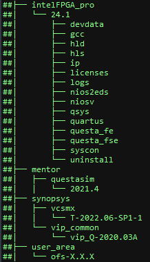
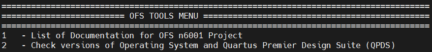

# Evaluation User Guide: OFS for Agilex™ 7 PCIe Attach


## **1 Overview**


### **1.1 About this Document**


This document serves as a set-up and user guide for the checkout and evaluation of an Intel® FPGA SmartNIC N6001-PL, Agilex™ 7 FPGA F-Series Development Kit (2x F-Tile) and Agilex™ 7 FPGA I-Series Development Kit (2x R-Tile and 1xF-Tile) development platform using Open FPGA Stack (OFS). After reviewing the document, you will be able to:

* Use the script to run through the most common build and simulation flows when using OFS

* Run hardware and software tests to evaluate the complete OFS flow

* Modify and leverage the script to your environment and design


#### **Table 1-2: Software Version Summary**

| Component | Version |  Description |
| --------- | ------- | -------|
| FPGA Platform | [Intel® FPGA SmartNIC N6001-PL](https://www.intel.com/content/www/us/en/products/details/fpga/platforms/smartnic/n6000-pl-platform.html), [Agilex™ 7 FPGA F-Series Development Kit (2x F-Tile)](https://www.intel.com/content/www/us/en/products/details/fpga/development-kits/agilex/agf027-and-agf023.html), [Agilex™ 7 FPGA I-Series Development Kit (2x R-Tile and 1xF-Tile)](https://www.intel.com/content/www/us/en/products/details/fpga/development-kits/agilex/agi027.html), | Agilex platform you can use for your custom board development |
| OFS FIM Source Code| [Branch: https://github.com/OFS/ofs-agx7-pcie-attach](https://github.com/OFS/ofs-agx7-pcie-attach), [Tag: ofs-2025.1-1](https://github.com/OFS/ofs-agx7-pcie-attach/releases/tag/ofs-2025.1-1) | OFS Shell RTL for Agilex FPGA (targeting Intel® FPGA SmartNIC N6001-PL) |
| AFU Examples| [Branch: examples-afu](https://github.com/OFS/examples-afu) , [Tag:ofs-2024.3-1](https://github.com/OFS/examples-afu/releases/tag/ofs-2024.3-1) | Tutorials and simple examples for the Accelerator Functional Unit region (workload region)|
| OPAE SDK | [Branch: 2.14.0-3](https://github.com/OFS/opae-sdk/tree/2.14.0-3), [Tag: 2.14.0-3](https://github.com/OFS/opae-sdk/releases/tag/2.14.0-3) | Open Programmable Acceleration Engine Software Development Kit |
| Kernel Drivers | [Branch: intel-1.12.0-2](https://github.com/OFS/linux-dfl-backport/tree/intel-1.12.0-2), [Tag: intel-1.12.0-2](https://github.com/OFS/linux-dfl-backport/releases/tag/intel-1.12.0-2) | OFS specific kernel drivers|
| OPAE Simulation| [Branch: opae-sim](https://github.com/OFS/opae-sim), [Tag: 2.14.0-1](https://github.com/OFS/opae-sim/releases/tag/2.14.0-1) | Accelerator Simulation Environment for hardware/software co-simulation of your AFU (workload)|
| Quartus Prime Pro Edition Design Software | 25.1 [Quartus® Prime Pro Edition Linux] | Software tool for Altera FPGA Development|
| Operating System | [Red Hat Linux](https://access.redhat.com/downloads/content/479/ver=/rhel---9/9.4/x86_64/product-software) RHEL 9.4 |  Operating system on which this script has been tested |

<br>

A download page containing the release and already-compiled FIM binary artifacts that you can use for immediate evaluation on the Intel® FPGA SmartNIC N6001-PL can be found on the [OFS ofs-2025.1-1](https://github.com/OFS/ofs-agx7-pcie-attach/releases/tag/ofs-2025.1-1) official release drop on GitHub.

<br>

## **2 Introduction to OFS Evaluation Script**

Two scripts have been developed to allow the user to clone, build, compile and test the OFS platform hardware.

1) ofs-clone_repositories.sh. This script clones the repositories from GitHub needed to build and test any OFS platform.
2) ofs-agx7-pcie-attach_eval.sh. This script evaluates compiles, builds and tests hardware features that the OFS framework provides. This script can also be leveraged for your own development.  

> **_NOTE:_**  
>
>**This guide uses the Intel® FPGA SmartNIC N6001-PL as the platform for all example steps. Additionally, this guide and the example steps can be used with other platforms, such as the Agilex™ 7 FPGA F-Series Development Kit (2x F-Tile) and Agilex™ 7 FPGA I-Series Development Kit (2x R-Tile and 1xF-Tile).**
>

### **2.1 Pre-Requisites**

This script uses the following set of software tools which should be installed using the directory structure below. Tool versions can vary.

* Quartus<sup>&reg;</sup> Prime Pro Software : The software can be downloaded here: [Quartus Pro Prime Download](https://www.intel.com/content/www/us/en/software-kit/839515/intel-quartus-prime-pro-edition-design-software-version-24-3-for-linux.html). For details on installation of required patches and quartus installation, refer to section 1.3.4 of the [Shell Developer Guide: OFS for Agilex™ 7 PCIe Attach (P-tile, E-tile) FPGAs](https://ofs.github.io/ofs-2025.1-1/hw/n6001/dev_guides/fim_dev/ug_dev_fim_ofs_n6001/). 
* Synopsys<sup>&reg;</sup> VCS Simulator : This simulator can be downloaded from the Synopsys web page [here](https://www.synopsys.com/verification/simulation/vcs.html)
* Siemens<sup>&reg;</sup> Questa<sup>&reg;</sup> Simulator : This simulator can be downloaded from the Siemens web page [here](https://eda.sw.siemens.com/en-US/ic/questa/simulation/advanced-simulator/)

**Figure 2-1 Folder Hierarchy for Software Tools**



### **2.2 Agilex™ 7 PCIe Attach Clone and Evaluation Script download and modification**

1. Download the tar file `scripts_ofs-2025.1-1_external.tar.gz` from the assets tab of the [OFS 2025.1-1 Release Page](https://github.com/OFS/ofs-agx7-pcie-attach/releases/tag/ofs-2025.1-1)

2. Untar to a user folder using the following command

    ```bash
    tar -xvf scripts_ofs-2024.1-1_external.tar.gz
    ```
 
3. The folder structure containing the clone script (ofs-clone_repositories.sh) and evaluation script (ofs-agx7-pcie-attach_eval.sh) is as shown below in Figure 2-2

    **Figure 2-2 Directory Structure for the clone script**
    
    ```bash
    ## ofs_scripts
    ##      -> host_chan_mmio.stp
    ##      -> ofs-agx7-pcie-attach_eval.sh
    ##      -> README_ofs-agx7-pcie-attach_eval.txt
    ## ofs-clone_repositories.sh
    ```
    
4. Open the clone script ofs-clone_repositories.sh in any text editor
5. Please enter the location of your proxy server to allow access to external internet to build software packages. (lines 6-8)
   
    Note: Failing to add proxy server will prevent cloning of repositories and the user will be unable to build the OFS framework.
        
    ```
        export http_proxy=<user_proxy>
        export https_proxy=<user_proxy>
        export no_proxy=<user_proxy> 
    ```   

6. Please enter the license file locations (lines 11-13) for the following tool variables

    ```
        export LM_LICENSE_FILE=<user_license>
        export SNPSLMD_LICENSE_FILE=<user_license>
    ```

7. Add the name of the directory where you want the platform repositories to be cloned (line 19)

    ```
    export OFS_RELEASE=ofs-2025.1-1
    ```

8. After setting the required variables, source the clone script with the following command

    ```
    source ofs-clone_repositories.sh
    ```

9. The ofs-clone_repositories.sh script has different platforms to choose from the menu as shown below in Figure 2-3. For the Intel® FPGA SmartNIC N6001-PL the user will choose option 3
        
    **Figure 2-3 Directory Structure for OFS Project**
    
    
    
    1.  Once the repositories are cloned, the user can navigate to the following directory
    ```
    cd ofs-2025.1-1
    ```
    
10. After cloning, the OFS repositories will be shown below in Figure 2-4.

    
    **Figure 2-4 Directory Structure for OFS Project**
    
    ```sh
    ## ofs-2025.1-1
    ##  N6001(OFS platform)
    ##   -> examples-afu
    ##   -> ofs-agx7-pcie-attach
    ##   -> oneapi-asp
    ##   -> oneAPI-samples
    ##   -> opae-sim
    ##   -> opae-sdk
    ##   -> linux-dfl-backport
    ##   -> ofs-agx7-pcie-attach_eval.sh
    ##   -> README_ofs-agx7-pcie-attach_eval.txt
    ##   -> host_chan_mmio.stp
    ``` 

12. Once the repositories are cloned, open the platform specific evaluation script, e.g., in ofs-agx7-pcie-attach_eval.sh and follow the instructions below which explains which line numbers to change to adapt this script to the user environment. 
    
    a) Tools Location (line 87, 88, 89, 90)
    
    Set Location of Quartus, Synopsys, Questasim and oneAPI Tools
    
    ```bash
        export QUARTUS_TOOLS_LOCATION=/home
        export SYNOPSYS_TOOLS_LOCATION=/home
        export QUESTASIM_TOOLS_LOCATION=/home
        export ONEAPI_TOOLS_LOCATION=/opt
    ```
    
    In the example above /home is used as the base location of Quartus, Synopsys and Questasim tools, /opt is used for the oneAPI tools 
    
    b) PCIe (Bus Number)
    
    The Bus number must be entered by the user after installing the hardware in the chosen server, in the example below "b1" is the Bus Number for a single card as defined in the evaluation script.
    
    ```bash
        export OFS_CARD0_BUS_NUMBER=b1
    ```
    
     The evaluation script uses the bus number as an identifier to interrogate the card. The command below will identify the accelerator card plugged into a server.
    
    ```bash
        lspci | grep acc
        
        b1:00.0 Processing accelerators: Intel Corporation Device bcce (rev 01)
        b1:00.1 Processing accelerators: Intel Corporation Device bcce
        b1:00.2 Processing accelerators: Intel Corporation Device bcce
        b1:00.3 Processing accelerators: Red Hat, Inc. Virtio network device
        b1:00.4 Processing accelerators: Intel Corporation Device bcce
    ```
    
    The result identifies the card as being assigned "b1" as the bus number so the entry in the script changes to
    
    ```bash
        export OFS_CARD0_BUS_NUMBER=b1
    ```
    
    The user can also run the following command on the ofs-agx7-pcie-attach_eval.sh script to automatically change the bus number to b1 in the ofs-agx7-pcie-attach_eval.sh script.
    
    ```bash
    grep -rli 'b1' * | xargs -i@ sed -i 'b1' @
    ```
    
    if the bus number is 85 for example 
    
    ```bash
        85:00.0 Processing accelerators: Intel Corporation Device bcce (rev 01)
        85:00.1 Processing accelerators: Intel Corporation Device bcce
        85:00.2 Processing accelerators: Intel Corporation Device bcce
        85:00.3 Processing accelerators: Red Hat, Inc. Virtio network device
        85:00.4 Processing accelerators: Intel Corporation Device bcce
    ```

    the command to change to 85 in the evaluation script would be
    
    ```bash
    grep -rli 'b1' * | xargs -i@ sed -i '85' @
    ```

### **OFS Platform (Example:= n6000, n6001, fseries-dk, iseries-dk, custom_board) choice (line 173)**

The ofs-agx7-pcie-attach_eval.sh script has now been modified to the server set-up and the user can proceed to build, compile and simulate the OFS stack
<br>

## **3 ofs-agx7-pcie-attach Evaluation Script**


### **3.1 Overview**


The figure below shows a snapshot of the full evaluation script menu showing all 62 options and each one of 11 sub-menus which focus on different areas of evaluation. Each of these menu options are described in the next section.

**Figure 3-1 ofs-agx7-pcie-attach_eval.sh Evaluation Menu**


### **3.1.1 OFS TOOLS MENU**


By selecting "List of Documentation for OFS Project," a list of links to the latest OFS documentation appears. Note that these links will take you to documentation for the most recent release which may not correspond to the release version you are evaluating. To find the documentation specific to your release, ensure you clone the OFS tag that corresponds to your OFS version.

By selecting "Check Versions of Operating System and Quartus Premier Design Suite", the tool verifies correct Operating System, Quartus version, kernel parameters, license files and paths to installed software tools.



<table>
    <thead>
        <tr>
            <th>Menu Option</th>
            <th>Example Output</th>
        </tr>
    </thead>
    <tbody>
        <tr>
             <td>1 - List of Documentation for OFS PCI Attach Project Project</td>
            <td> Open FPGA Stack Overview<br>
                 Guides you through the setup and build steps to evaluate the OFS solution<br>
                https://ofs.github.io<br>
</td>        
        </tr>
        <tr>
            <td>2 - Check versions of Operating System and Quartus Premier Design Suite (QPDS)</td>
            <td>Checking Linux release<br>
                Linux version 5.15.52-dfl (guest@hw-rae-svr4-l) (gcc (GCC) 8.5.0 20210514 (Red Hat 8.5.0-4), GNU ld version 2.30-79.el8) #1 SMP Fri Sep 23 17:19:37 BST 2022<br>
                <br>
                Checking RedHat release<br>
                CentOS Linux release 8.3.2011<br>
                <br>
                Checking Ubuntu release<br>
                cat: /etc/lsb-release: No such file or directory<br>
                <br>
                Checking Kernel parameters<br>
                BOOT_IMAGE=(hd0,gpt2)/vmlinuz-5.15.52-dfl root=/dev/mapper/cl-root ro crashkernel=auto resume=/dev/mapper/cl-swap rd.lvm.lv=cl/root rd.lvm.lv=cl/swap rhgb quiet intel_iommu=on pcie=realloc hugepagesz=2M hugepages=200<br>
                <br>
                Checking Licenses<br>
                LM_LICENSE_FILE is set to port@socket number:port@socket number<br>
                SNPSLMD_LICENSE_FILE is set to port@socket number:port@socket number<br>
                <br>
                Checking Tool versions<br>
                QUARTUS_HOME is set to /home/intelFPGA_pro/25.1/quartus<br>
                QUARTUS_ROOTDIR is set to /home/intelFPGA_pro/25.1/quartus<br>
                IMPORT_IP_ROOTDIR is set to /home/intelFPGA_pro/25.1/quartus/../ip<br>
                QSYS_ROOTDIR is set to /home/intelFPGA_pro/25.1/quartus/../qsys/bin<br>
                <br>
                Checking QPDS Patches<br>
                Quartus Prime Shell<br>
                Version 25.1 Build XXX XX/XX/XXXX Patches X.XX SC Pro Edition<br>
                Copyright (C) XXXX  Intel Corporation. All rights reserved.<br>
                <br>
               </td>
        </tr>
</tr>
     </tbody>
</table>

### **3.1.2 OFS HARDWARE MENU**


Identifies card by PCIe number, checks power, temperature and current firmware configuration. 


<table>
    <thead>
        <tr>
            <th>Menu Option</th>
            <th>Example Output</th>
        </tr>
    </thead>
    <tbody>
        <tr>
            <td>3 - Identify Platform Hardware via PCIe</td>
            <td>PCIe card detected as<br>
                b1:00.0 Processing accelerators: Intel Corporation Device bcce (rev 01)<br>
                b1:00.1 Processing accelerators: Intel Corporation Device bcce<br>
                b1:00.2 Processing accelerators: Intel Corporation Device bcce<br>
                b1:00.4 Processing accelerators: Intel Corporation Device bcce<br>
                Host Server is connected to SINGLE card configuration<br>
                <br>
</td>        
        </tr>
        <tr>
            <td>4 - Identify the Board Management Controller (BMC) Version and check BMC sensors</td>
            <td>Intel Acceleration Development Platform N6001<br>
                Board Management Controller NIOS FW version: 3.2.0<br>
                Board Management Controller Build version: 3.2.0<br>
                //****** BMC SENSORS ******//<br>
                Object Id                        : 0xEE00000<br>
                PCIe s:b:d.f                     : 0000:B1:00.0<br>
                Vendor Id                        : 0x8086<br>
                Device Id                        : 0xBCCE<br>
                SubVendor Id                     : 0x8086<br>
                SubDevice Id                     : 0x1771<br>
                Socket Id                        : 0x00<br>
                Ports Num                        : 01<br>
                Bitstream Id                     : 0x50102027135A894<br>
                Bitstream Version                : 5.0.1<br>
                Pr Interface Id                  : 7dbb989d-5eb9-54f4-8a74-40ddff52e0e2<br>
                <br>
                Note: This feature is not supported on the Agilex™ 7 FPGA F-Series Development Kit (2x F-Tile)
<br>
            <br>
        </tr>
</td>        
        </tr>
        <tr>
            <td>5 - Identify the FPGA Management Engine (FME) Version</td>
            <td>Intel Acceleration Development Platform N6001<br>
                Board Management Controller NIOS FW version: 3.2.0<br>
                Management Controller Build version: 3.2.0<br>
                //****** FME ******//<br>
                Object Id                        : 0xEE00000<br>
                PCIe s:b:d.f                     : 0000:B1:00.0<br>
                Vendor Id                        : 0x8086<br>
                Device Id                        : 0xBCCE<br>
                SubVendor Id                     : 0x8086<br>
                SubDevice Id                     : 0x1771<br>
                Socket Id                        : 0x00<br>
                Ports Num                        : 01<br>
                Bitstream Id                     : 0x50102027135A894<br>
                Bitstream Version                : 5.0.1<br>
                Pr Interface Id                  : 7dbb989d-5eb9-54f4-8a74-40ddff52e0e2<br>
                Boot Page                        : user1<br>
                Factory Image Info               : a7c6879683182ce61084c420e51f50b6<br>
                User1 Image Info                 : 8a7440ddff52e0e27dbb989d5eb954f4<br>
                User2 Image Info                 : a7c6879683182ce61084c420e51f50b6<br>
            <br>
        </tr>
</td>        
        </tr>
        <tr>
            <td>6 - Check Board Power and Temperature</td>
            <td>Intel Acceleration Development Platform N6001<br>
                Board Management Controller NIOS FW version: 3.2.0<br>
                Board Management Controller Build version: 3.2.0<br>
                //****** POWER ******//<br>
                Object Id                        : 0xEE00000<br>
                PCIe s:b:d.f                     : 0000:B1:00.0<br>
                Vendor Id                        : 0x8086<br>
                Device Id                        : 0xBCCE<br>
                SubVendor Id                     : 0x8086<br>
                SubDevice Id                     : 0x1771<br>
                Socket Id                        : 0x00<br>
                Ports Num                        : 01<br>
                Bitstream Id                     : 0x50102027135A894<br>
                Bitstream Version                : 5.0.1<br>
                Pr Interface Id                  : 7dbb989d-5eb9-54f4-8a74-40ddff52e0e2<br>
                ( 1) VCCRT_GXER_0V9 Voltage      : 0.91 Volts<br>
                etc ......................<br>
            <br>
                Intel Acceleration Development Platform N6001<br>
                Board Management Controller NIOS FW version: 3.2.0<br>
                Board Management Controller Build version: 3.2.0<br>
                //****** TEMP ******//<br>
                Object Id                        : 0xEE00000<br>
                PCIe s:b:d.f                     : 0000:B1:00.0<br>
                Vendor Id                        : 0x8086<br>
                Device Id                        : 0xBCCE<br>
                SubVendor Id                     : 0x8086<br>
                SubDevice Id                     : 0x1771<br>
                Socket Id                        : 0x00<br>
                Ports Num                        : 01<br>
                Bitstream Id                     : 0x50102027135A894<br>
                Bitstream Version                : 5.0.1<br>
                Pr Interface Id                  : 7dbb989d-5eb9-54f4-8a74-40ddff52e0e2<br>
                ( 1) FPGA E-Tile Temperature [Remote] : 33.50 Celsius<br>
                etc ......................<br>
                <br>
                Note: This feature is not supported on the Agilex™ 7 FPGA F-Series Development Kit (2x F-Tile)
        </tr>
</td>        
        </tr>
        <tr>
            <td>7 - Check Accelerator Port status</td>
            <td>//****** PORT ******//
                Object Id                        : 0xED00000<br>
                PCIe s:b:d.f                     : 0000:B1:00.0<br>
                Vendor Id                        : 0x8086<br>
                Device Id                        : 0xBCCE<br>
                SubVendor Id                     : 0x8086<br>
                SubDevice Id                     : 0x1771<br>
                Socket Id                        : 0x00<br>
<br>
            <br>
        </tr>
</td>        
        </tr>
        <tr>
            <td>8 - Check MAC and PHY status</td>
            <td>Intel Acceleration Development Platform N6001<br>
                Board Management Controller NIOS FW version: 3.2.0<br>
                Board Management Controller Build version: 3.2.0<br>
                //****** MAC ******//<br>
                Object Id                        : 0xEE00000<br>
                PCIe s:b:d.f                     : 0000:B1:00.0<br>
                Vendor Id                        : 0x8086<br>
                Device Id                        : 0xBCCE<br>
                SubVendor Id                     : 0x8086<br>
                SubDevice Id                     : 0x1771<br>
                Socket Id                        : 0x00<br>
                Ports Num                        : 01<br>
                Bitstream Id                     : 0x50102027135A894<br>
                Bitstream Version                : 5.0.1<br>
                Pr Interface Id                  : 7dbb989d-5eb9-54f4-8a74-40ddff52e0e2<br>
                Number of MACs                   : 255<br>
                mac info is not supported<br>
            <br>
                Intel Acceleration Development Platform N6001<br>
                Board Management Controller NIOS FW version: 3.2.0<br>
                Board Management Controller Build version: 3.2.0<br>
                //****** PHY ******//<br>
                Object Id                        : 0xEE00000<br>
                PCIe s:b:d.f                     : 0000:B1:00.0<br>
                Vendor Id                        : 0x8086<br>
                Device Id                        : 0xBCCE<br>
                SubVendor Id                     : 0x8086<br>
                SubDevice Id                     : 0x1771<br>
                Socket Id                        : 0x00<br>
                Ports Num                        : 01<br>
                Bitstream Id                     : 0x50102027135A894<br>
                Bitstream Version                : 5.0.1<br>
                Pr Interface Id                  : 7dbb989d-5eb9-54f4-8a74-40ddff52e0e2<br>
            <br>
                //****** HSSI information ******//<br>
                HSSI version                     : 1.0<br>
                Number of ports                  : 8<br>
                Port0                            :25GbE        DOWN<br>
                Port1                            :25GbE        DOWN<br>
                Port2                            :25GbE        DOWN<br>
                Port3                            :25GbE        DOWN<br>
                Port4                            :25GbE        DOWN<br>
                Port5                            :25GbE        DOWN<br>
                Port6                            :25GbE        DOWN<br>
                Port7                            :25GbE        DOWN<br>
            <br>
                Note: This feature is not supported on the Agilex™ 7 FPGA F-Series Development Kit (2x F-Tile)
        </tr>
</tr>
     </tbody>
</table>

### **3.1.3 OFS PF/VF MUX MENU**


This menu reports the number of PF/VF functions in the reference example and also allows you to reduce the number to 1PF and 1VF to reduce resource utilization and create a larger area for your workload development. This selection is optional and if the user wants to implement the default number of PF's and VF's then option 9, 10 and 11 should not be used.  Additionally the code used to make the PF/VF modification can be leveraged to increase or modify the number of PF/VFs in the existing design within the limits that the PCIe Subsystem supports (8PF/2K VFs)


<table>
    <thead>
        <tr>
            <th>Menu Option</th>
            <th>Description</th>
        </tr>
    </thead>
    <tbody>
        <tr>
            <td>9 - Check PF/VF Mux Configuration</td>
            <td> This menu selection displays the current configuration of all n6001 ofss files located in the following directory $OFS_ROOTDIR/tools/ofss_config<br>
            <br>
         
            Check n6001 base config OFSS set up 
            [ip]
            type = ofs
            
            [settings]
            platform = n6001
            family = agilex
            fim = base_x16
            part = AGFB014R24A2E2V
            device_id = 6001


            Check n6001 hssi_2x100 OFSS set up
            [ip]
            type = hssi

            [settings]
            output_name = hssi_ss
            num_channels = 2
            data_rate = 100GCAUI-4


            Check n6001 hssi_2x100_caui2 OFSS set up
            [ip]
            type = hssi

            [settings]
            output_name = hssi_ss
            num_channels = 2
            data_rate = 100GAUI-2


            Check n6001 hssi_8x10 OFSS set up
            [ip]
            type = hssi

            [settings]
            output_name = hssi_ss
            num_channels = 8
            data_rate = 10GbE

            Check n6001 hssi_8x25 OFSS set up
            [ip]
            type = hssi

            [settings]
            output_name = hssi_ss
            num_channels = 8
            data_rate = 25GbE


            Check n6001 IOPLL OFSS set up
            [ip]
            type = iopll

            [settings]
            output_name = sys_pll
            instance_name = iopll_0

            [p_clk]
            freq = 470

            Check n6001 Memory OFSS set up
            [ip]
            type = memory

            [settings]
            output_name = mem_ss_fm
            preset = n6001

            Check n6001 PCIe Host OFSS set up
            [ip]
            type = pcie

            [settings]
            output_name = pcie_ss

            [pf0]
            num_vfs = 3
            bar0_address_width = 20
            vf_bar0_address_width = 20

            [pf1]

            [pf2]
            bar0_address_width = 18

            [pf3]

            [pf4]

            Check n6001 PCIe 1pf_1vf OFSS set up
            [ip]
            type = pcie

            [settings]
            output_name = pcie_ss

            [pf0]
            num_vfs = 1
            bar0_address_width = 20
            vf_bar0_address_width = 20
            
</td>        
        </tr>
        <tr>
            <td>10 - Modify PF/VF Mux Configuration</td>
            <td>As an example this menu selection modifies the pcie_host.ofss file to 1 PF located in the following directory $OFS_ROOTDIR/tools/ofss_config<br>
            This option also displays the modified pcie_host.ofss file<br>
        </tr>
</td>        
        </tr>
        <tr>
            <td>11 - Build PF/VF Mux Configuration</td>
            <td>If option 10 is not used then then the default number of PF's and VF's is used to build the FIM, if option 10 is selected then only 1 VF is built to reduce logic utilisation<br>
            <br>
        </tr>
</tr>
     </tbody>
</table>


### **3.1.4 OFS FIM/PR BUILD MENU**


Builds FIM, Partial Reconfiguration Region and Remote Signal Tap


<table>
    <thead>
        <tr>
            <th>Menu Option</th>
            <th>Description</th>
        </tr>
    </thead>
    <tbody>
        <tr>
            <td>12 - Check OFS software version for OFS Project</td>
            <td>OFS_ROOTDIR is set to /home/user_area/ofs-X.X.X/ofs-agx7-pcie-attach<br>
                OPAE_SDK_REPO_BRANCH is set to release/X.X.X<br>
                OPAE_SDK_ROOT is set to /home/user_area/ofs-X.X.X/ofs-agx7-pcie-attach/../opae-sdk<br>
                LD_LIBRARY_PATH is set to /home/user_area/ofs-X.X.X/ofs-agx7-pcie-attach/../opae-sdk/lib64:<br>
<br>
            <br>
</td>        
        </tr>
        <tr>
            <td>13 - Build FIM for Hardware</td>
            <td>This option builds the FIM based on the setting for the $OFS_PLATFORM, $FIM_SHELL environment variable. Check this variable in the following file ofs-agx7-pcie-attach_eval.sh<br>
            <br>
        </tr>
</td>        
        </tr>
        <tr>
            <td>14 - Check FIM Identification of FIM for Hardware</td>
            <td>The FIM is identified by the following file fme-ifc-id.txt located at $OFS_ROOTDIR/$FIM_WORKDIR/syn/board/$OFS_PLATFORM/syn_top/<br>
            <br>
        </tr>
</td>        
        </tr>
        <tr>
            <td>15 - Build Partial Reconfiguration Tree for Hardware</td>
            <td>This option builds the Partial Reconfiguration Tree which is needed for AFU testing/development and also for the oneAPI build flow <br>
            <br>
        </tr>
</td>        
        </tr>
        <tr>
            <td>16 - Build Base FIM Identification(ID) into PR Build Tree template</td>
            <td>This option copies the contents of the fme-ifc-id.txt into the Partial Reconfiguration Tree to allow the FIM amd Partial Reconfiguration Tree to match and hence allow subsequent insertion of AFU and oneAPI workloads<br>
            <br>
        </tr>
</td>        
        </tr>
        <tr>
            <td>17 - Build Partial Reconfiguration Tree for Hardware with Remote Signal Tap</td>
            <td>This option builds the Partial Reconfiguration Tree which is needed for AFU testing/development and also for the oneAPI build flow for the Remote Signal Tap flow<br>
            <br>
        </tr>
</td>        
        </tr>
        <tr>
            <td>18 - Build Base FIM Identification(ID) into PR Build Tree template with Remote Signal Tap</td>
            <td>This option copies the contents of the fme-ifc-id.txt into the Partial Reconfiguration Tree for Remote Signal Tap to allow the FIM amd Partial Reconfiguration Tree to match and hence allow subsequent insertion of AFU and oneAPI workloads<br>
            <br>
        </tr>
</tr>
     </tbody>
</table>

### **3.1.5 OFS HARDWARE PROGRAMMING/DIAGNOSTIC MENU**


The following submenu allows you to:
* Program and check flash 
* Perform a remote system update (RSU) of the FPGA image into the FPGA
* Bind virtual functions to VFIO PCIe driver 
* Run host exerciser (HE) commands such as loopback to test interfaces VFIO PCI driver binding
* Read the control and status registers (CSRs) for bound modules that are part of the OFS reference design.


<table>
    <thead>
        <tr>
            <th>Menu Option</th>
            <th>Description</th>
        </tr>
    </thead>
    <tbody>
        <tr>
            <td>19 - Program BMC Image into Hardware</td>
            <td>The user must place a new BMC flash file in the following directory $OFS_ROOTDIR/bmc_flash_files. Once the user executes this option a new BMC image will be programmed. A remote system upgrade command is initiated to store the new BMC image<br>
            <br>
</td>        
        </tr>
        <tr>
            <td>20 - Check Boot Area Flash Image from Hardware</td>
            <td>This option checks which location area in FLASH the image will boot from, the default is user1<br>
            <br>
            Boot Page : user1<br>
            <br>
            Note: This feature is not supported on the Agilex™ 7 FPGA F-Series Development Kit (2x F-Tile)
        </tr>
</td>        
        </tr>
        <tr>
            <td>21 - Program FIM Image into user1 area for Hardware</td>
            <td>This option programs the FIM image "ofs_top_page1_unsigned_user1.bin" into user1 area in flash<br>
            <br>
            Note: Please refer to the Getting Started Guide for details on flashing images for the Agilex™ 7 FPGA F-Series Development Kit (2x F-Tile)
        </tr>
</td>        
        </tr>
        <tr>
            <td>22 - Initiate Remote System Upgrade (RSU) from user1 Flash Image into Hardware</td>
            <td>This option initiates a Remote System Upgrade and soft reboots the server and re-scans the PCIe bus for the new image to be loaded<br>
            <br>
            2022-11-10 11:26:24,307 - [[pci_address(0000:b1:00.0), pci_id(0x8086, 0xbcce)]] performing RSU operation<br>
            2022-11-10 11:26:24,310 - [[pci_address(0000:b0:02.0), pci_id(0x8086, 0x347a)]] removing device from PCIe bus<br>
            2022-11-10 11:26:24,357 - waiting 10 seconds for boot<br>
            2022-11-10 11:26:34,368 - rescanning PCIe bus: /sys/devices/pci0000:b0/pci_bus/0000:b0<br>
            2022-11-10 11:26:35,965 - RSU operation complete<br>
            <br>
            Note: Please refer to the Getting Started Guide for details on flashing images for the Agilex™ 7 FPGA F-Series Development Kit (2x F-Tile)
        </tr>
</td>        
        </tr>
        <tr>
            <td>23 - Check PF/VF Mapping Table, vfio-pci driver binding and accelerator port status</td>
            <td>This option checks the current vfio-pci driver binding for the PF's and VF's<br>
            <br>
        </tr>
</td>        
        </tr>
        <tr>
            <td>24 - Unbind vfio-pci driver</td>
            <td>This option unbinds the vfio-pci driver for the PF's and VF's<br>
            <br>
        </tr>
</td>        
        </tr>
        <tr>
            <td>25 - Create Virtual Functions (VF) and bind driver to vfio-pci Hardware</td>
            <td>This option creates vfio-pci driver binding for the PF's and VF's<br>
            Once the VF's have been bound to the driver the user can select menu option 23 to check that the new drivers are bound<br>
            <br>
        </tr>
</td>        
        </tr>
        <tr>
            <td>26 - Verify FME Interrupts with hello_events</td>
            <td>The hello_events utility is used to verify FME interrupts. This tool injects FME errors and waits for error interrupts, then clears the errors<br>
            <br>
        </tr>
</td>        
        </tr>
        <tr>
            <td>27 - Run HE-LB Test</td>
            <td>This option runs 5 tests<br>
            <br>
            1) checks and generates traffic with the intention of exercising the path from the AFU to the Host at full bandwidth<br>
            2) run a loopback throughput test using one cacheline per request<br>
            3) run a loopback read test using four cachelines per request<br>
            4) run a loopback write test using four cachelines per request<br>
            5) run a loopback throughput test using four cachelines per request<br>
            <br>
        </tr>
</td>        
        </tr>
        <tr>
            <td>28 - Run HE-MEM Test</td>
            <td>This option runs 2 tests<br>
            <br>
            1) Checking and generating traffic with the intention of exercising the path from FPGA connected DDR; data read from the host is written to DDR, and the same data is read from DDR before sending it back to the host<br>
            2) run a loopback throughput test using one cacheline per request<br>
            <br>
        </tr>
</td>        
        </tr>
        <tr>
            <td>29 - Run HE-HSSI Test</td>
            <td>This option runs 1 test<br> 
            <br>
            HE-HSSI is responsible for handling client-side ethernet traffic. It wraps the 10G and 100G HSSI AFUs, and includes a traffic generator and checker. The user-space tool hssi exports a control interface to the HE-HSSI's AFU's packet generator logic<br>
            <br>
            1) Send traffic through the 10G AFU
            <br>
        </tr>
</td>        
        </tr>
        <tr>
            <td>30 - Run Traffic Generator AFU Test</td>
            <td>This option runs 3 tests<br> 
            <br>
            TG AFU has an OPAE application to access & exercise traffic, targeting a specific bank<br>
            <br>
            1) Run the preconfigured write/read traffic test on channel 0<br>
            2) Target channel 1 with a 1MB single-word write only test for 1000 iterations<br>
            3) Target channel 2 with 4MB write/read test of max burst length for 10 iterations<br>
        </tr>
</td>        
        </tr>
        <tr>
            <td>31 - Read from CSR (Command and Status Registers) for Hardware</td>
            <td>This option reads from the following CSR's<br>
            HE-LB Command and Status Register Default Definitions<br>
            HE-MEM Command and Status Register Default Definitions<br>
            HE-HSSI Command and Status Register Default Definitions<br>
            <br>
        </tr>
</tr>
     </tbody>
</table>

### **3.1.6  OFS HARDWARE AFU TESTING MENU**


This submenu tests partial reconfiguration by building and loading an memory-mapped I/O example AFU/workload, executes software from host, and tests remote signal tap.


<table>
    <thead>
        <tr>
            <th>Menu Option</th>
            <th>Description</th>
        </tr>
    </thead>
    <tbody>
        <tr>
            <td>32 - Build and Compile host_chan_mmio example</td>
            <td>This option builds the host_chan_mmio example from the following repo $OFS_PLATFORM_AFU_BBB/plat_if_tests/$AFU_TEST_NAME, where AFU_TEST_NAME=host_chan_mmio. This produces a GBS (Green Bit Stream) ready for hardware programming<br>
            <br>
</td>        
        </tr>
        <tr>
            <td>33 - Execute host_chan_mmio example</td>
            <td>This option builds the host code for host_chan_mmio example and programs the GBS file and then executes the test<br>
            <br>
        </tr>
</td>        
        </tr>
        <tr>
            <td>34 - Modify host_chan_mmio example to insert Remote Signal Tap</td>
            <td>This option inserts a pre-defined host_chan_mmio.stp Signal Tap file into the OFS code to allow a user to debug the host_chan_mmio AFU example<br>
            <br>
        </tr>
</td>        
        </tr>
        <tr>
            <td>35 - Build and Compile host_chan_mmio example with Remote Signal Tap</td>
            <td>This option builds the host_chan_mmio example from the following repo $OFS_PLATFORM_AFU_BBB/plat_if_tests/$AFU_TEST_NAME, where AFU_TEST_NAME=host_chan_mmio. This produces a GBS(Green Bit Stream) ready for hardware programming with Remote Signal tap enabled<br>
            <br>
        </tr>
</td>        
        </tr>
        <tr>
            <td>36 - Execute host_chan_mmio example with Remote Signal Tap</td>
            <td>This option builds the host code for host_chan_mmio example and programs the GBS file and then executes the test. The user must open the Signal Tap window when running the host code to see the transactions in the Signal Tap window<br>
            <td><br>
            <br>
        </tr>
</tr>
     </tbody>
</table>

### **3.1.7 OFS HARDWARE AFU BBB TESTING MENU**


This submenu tests partial reconfiguration using a hello_world example AFU/workload, executes sw from host


<table>
    <thead>
        <tr>
            <th>Menu Option</th>
            <th>Description</th>
        </tr>
    </thead>
    <tbody>
        <tr>
            <td>37 - Build and Compile hello_world example</td>
            <td>This option builds the hello_ world example from the following repo $FPGA_BBB_CCI_SRC/samples/tutorial/afu_types/01_pim_ifc/$AFU_BBB_TEST_NAME, where AFU_BBB_NAME=hello_world. This produces a GBS(Green Bit Stream) ready for hardware programming<br>
            <br>
</td>        
        </tr>
        <tr>
            <td>38 - Execute hello_world example</td>
            <td>This option builds the host code for hello_world example and programs the GBS file and then executes the test<br>
            <br>
        </tr>
</tr>
     </tbody>
</table>

### **3.1.8 OFS ONEAPI PROJECT MENU**


Builds oneAPI kernel, executes sw from host and runs diagnostic tests


<table>
    <thead>
        <tr>
            <th>Menu Option</th>
            <th>Result</th>
        </tr>
    </thead>
    <tbody>
        <tr>
            <td>39 - Check oneAPI software versions for Project</td>
            <td>This option checks the setup of the oneAPI software and adds the relevant oneAPI environment variables to the terminal. This option also informs the user to match the oneAPI software version to the oneAPI-samples version<br>
            <br>
        <tr>
</td>        
        <tr>
            <td>40 - Build and clone shim libraries required by oneAPI host</td>
            <td>This option builds the oneAPI directory structure<br>
            <br>
        </tr>
</td>        
        <tr>
            <td>41 - Install oneAPI Host Driver</td>
            <td>This option Installs the oneAPI Host driver at the following location /opt/Intel/OpenCLFPGA/oneAPI/Boards/, and requires sudo permission<br>
            <br>
        </tr>
</td>        
        <tr>
            <td>42 - Uninstall oneAPI Host Driver</td>
            <td>This option Uninstall's the oneAPI Host driver, and requires sudo permissions<br>
            <br>
        </tr>
</td>        
        <tr>
            <td>43 - Diagnose oneAPI Hardware</td>
            <td>This option Checks ICD (Intel Client Driver) and FCD (FPGA Client Driver), oneAPI library locations and detects whether oneAPI BSP is loaded into the FPGA<br>
            <br>
        </tr>
</td>        
        <tr>
            <td>44 - Build oneAPI BSP Default Kernel (hello_world)</td>
            <td>This option Builds the oneAPI BSP using simple-add_buffers kernel<br>
            <br>
        </tr>
</td>        
        <tr>
            <td>45 - Build oneAPI MakeFile Environment</td>
            <td>This option Builds the oneAPI environment using a Makefile for kernel insertion <br>
            <br>
        </tr>
</td>        
        <tr>
            <td>46 - Compile oneAPI Sample Application (board_test) for Emulation</td>
            <td>This option compiles the board_test kernel for Emulation<br>
            <br>
        </tr>
</td>        
        <tr>
            <td>47 - Run oneAPI Sample Application (board_test) for Emulation</td>
            <td>This option executes the board_test kernel for Emulation<br>
            <br>
        </tr>
</td>        
        <tr>
            <td>48 - Generate oneAPI Optimization report for (board_test)</td>
            <td>This option generates an optimization report for the board_test kernel<br>
            <br>
        </tr>
</td>        
        <tr>
            <td>49 - Check PF/VF Mapping Table, vfio-pci driver binding and accelerator port status</td>
            <td>This option checks the current vfio-pci driver binding for the PF's and VF's<br>
            <br>
        </tr>
</td>        
        <tr>
            <td>50 - Unbind vfio-pci driver</td>
            <td>This option unbinds the vfio-pci driver for the PF's and VF's<br>
            <br>
        </tr>
</td>        
        <tr>
            <td>51 - Create Virtual Function (VF) and bind driver to vfio-pci Hardware</td>
            <td>This option creates vfio-pci driver binding for the PF's and VF's<br>
            Once the VF's have been bound to the driver the user can select menu option 45 to check that the new drivers are bound<br><br>
            <br>
        </tr>
</td>        
        <tr>
            <td>52 - Program OpenCL BSP Default Kernel (hello_world)</td>
            <td>This option programs the FPGA with a aocf file based on the hello_world kernel<br>
            <br>
        </tr>
</td>        
        <tr>
            <td>53 - Compile oneAPI Sample Application (board_test) for Hardware</td>
            <td>This option compiles the board_test kernel for Hardware<br>
            <br>
        </tr>
</td>        
        <tr>
            <td>54 - Run oneAPI Sample Application (board_test) for Hardware</td>
            <td>This option builds the host code for board_test kernel and executes the program running through kernel and host bandwidth tests<br>
            <br>
        </tr>
</tr>
     </tbody>
</table>

### **3.1.9 OFS UNIT TEST PROJECT MENU**


Builds, compiles and runs standalone simulation block tests.  More unit test examples are found at the following location ofs_n6001/sim/unit_test 


<table>
    <thead>
        <tr>
            <th>Menu Option</th>
            <th>Result</th>
        </tr>
    </thead>
    <tbody>
        <tr>
            <td>55 - Generate Simulation files for Unit Test</td>
            <td>This option builds the simulation file set for running a unit test simulation<br>
            <br>
        </tr>
</td>        
        <tr>
            <td>56 - Simulate Unit Test dfh_walker and log waveform</td>
            <td>This option runs the dfh_walker based on the environment variable "UNIT_TEST_NAME=dfh_walker" in the evaluation script. A user can change the test being run by modifying this variable<br>
            <br>
        </tr>
</tr>
     </tbody>
</table>


### **3.1.10 OFS UVM PROJECT MENU**


Builds, compiles and runs full chip simulation tests.  The user should execute the options sequentially ie 68,69, 70 and 71


<table>
    <thead>
        <tr>
            <th>Menu Option</th>
            <th>Description</th>
        </tr>
    </thead>
    <tbody>
        <tr>
            <td>57 - Check UVM software versions for Project</td>
            <td>DESIGNWARE_HOME is set to /home/synopsys/vip_common/vip_V-2024.03D<br>
                UVM_HOME  is set to /home/synopsys/vcsmx/U-2023.03-SP2-1/linux64/rhel/etc/uvm<br>
                VCS_HOME is set to /home/synopsys/vcsmx/U-2023.03-SP2-1/linux64/rhel<br>
                VERDIR is set to /home/user_area/ofs-2025.1-1/ofs-agx7-pcie-attach/verification<br>
                VIPDIR is set to /home/user_area/ofs-2025.1-1/ofs-agx7-pcie-attach/verification<br>
            <br>
</td>        
        <tr>
            <td>58 - Compile UVM IP</td>
            <td>This option compiles the UVM IP <br>
            <br>
        <tr>
</td>        
        <tr>
            <td>59 - Compile UVM RTL and Testbench</td>
            <td>This option compiles the UVM RTL and Testbench<br>
            <br>
        <tr>
</td>        
        <tr>
            <td>60 - Simulate UVM dfh_walking_test and log waveform</td>
            <td>This option runs the dfh_walking test based on the environment variable "UVM_TEST_NAME=dfh_walking_test" in the evaluation script. A user can change the test being run by modifying this variable<br>
            <br>
        <tr>
            <td>61 - Simulate all UVM test cases (Regression Mode)</td>
            <td>This option runs the n6001 regression mode, cycling through all UVM tests defined in verification/tests/test_pkg.svh file<br>
            <br>
        <tr>
</tr>
     </tbody>
</table>

### **3.1.11 OFS BUILD ALL PROJECT MENU**


Builds the complete OFS flow, good for regression testing and overnight builds

For this menu a user can run a sequence of tests (compilation, build and simulation) and executes them sequentially. After the script is successfully executed, a set of binary files is produced which a you can use to evaluate your hardware. Log files are also produced which checks whether the tests passed.

A user can run a sequence of tests and execute them sequentially. In the example below when the user selects option 62 from the main menu the script will execute 24 tests ie (main menu options 2, 9, 12, 13, 14, 15, 16, 17, 18, 32, 34, 35, 37, 39, 40, 44, 45, 53, 55, 56, 57, 58, 59 and 60. These 24 menu options are chosen to build the complete OFS flow covering build, compile and simulation.


<table>
    <thead>
        <tr>
            <th>Menu Option</th>
            <th>Result</th>
        </tr>
    </thead>
    <tbody>
        <tr>
            <td>62 - Build and Simulate Complete Project</td>
            <td>Generating Log File with date and timestamp<br>
                Log file written to /home/guest/ofs-2025.1-1/log_files/ofs-agx7-pcie-attach_log_2022_11_10-093649/ofs-agx7-pcie-attach_eval.log<br>
            <br>
</tr>
     </tbody>
</table>

## **Definition of Multi-Test Set-up**

Menu Option 62 above in the evaluation script can be refined to tailor it to the users need and is principally defined by the variable below

MULTI_TEST[A,B]=C

where

A= Total Number of menu options in script<br>
B= Can be changed to a number to select the test order<br>
C= Menu Option in Script<br>

Example 1<br>
MULTI_TEST[62,0]=2

A= 62 is the total number of options in the script
B= 0 indicates that this is the first test to be run in the script
C= Menu option in Script ie 2- List of Documentation for OFS n6001 Project

Example 2<br>
MULTI_TEST[62,0]=2<br>
MULTI_TEST[62,1]=9<br>

In the example above two tests are run in order ie 0, and 1 and the following menu options are executed ie 2- List of Documentation for OFS n6001 Project and 9 - Check OFS software versions for OFS n6001 Project

The user can also modify the build time by de-selecting options they do not wish to use, see below for a couple of use-case scenarios.

## **Default User Case**

A user can run a sequence of tests and execute them sequentially. In the example below when the user selects option 62 from the main menu the script will execute 24 tests ie (main menu options 2, 9, 12, 13, 14, 15, 16, 17, 18, 32, 34, 35, 37, 39, 40, 44, 45, 53, 55, 56, 57, 58, 59 and 60. All other tests with an "X" indicates do not run that test.


## **User Case for OFS FIM/PR BUILD MENU**

In the example below when the user selects option 62 from the main menu the script will only run options from the OFS FIM/PR BUILD MENU (7 options, main menu options 12, 13, 14, 15, 16, 17 and 18). All other tests with an "X" indicates do not run that test.


<br>

## **4 n6001 Common Test Scenarios**


This section will describe the most common compile build scenarios if a user wanted to evaluate an acceleration card on their server. The Pre-requisite column indcates the menu comamnds that must be run befere executing the test eg To run Test 5 then a user needs to have run option 13, 15 and 16 before running options 23, 24, 25, 32 and 33.

<table>
    <thead>
        <tr>
            <th>Test</th>
            <th>Test Scenario</th>
            <th>Pre-Requisite Menu Option</th>
            <th>Menu Option</th>
        </tr>
    </thead>
    <tbody>
        <tr>
            <tr>
            <td>Test 1</td>
            <td>FIM Build</td>
            <td>-<br>
            <td>13<br>
            <br>
        <tr>
            <tr>
            <td>Test 2</td>
            <td>Partial Reconfiguration Build</td>
            <td>13<br>
            <td>15, 16<br>
            <br>
        <tr>
            <tr>
            <td>Test 3</td>
            <td>Program FIM and perform Remote System Upgrade</td>
            <td>13<br>
            <td>21, 22<br>
            <br>
        <tr>
            <tr>
            <td>Test 4</td>
            <td>Bind PF and VF to vfio-pci drivers</td>
            <td>-<br>
            <td>23, 24, 25<br>
            <br>
        <tr>
            <tr>
            <td>Test 5</td>
            <td>Build, compile and test AFU on hardware</td>
            <td>13, 15, 16<br>
            <td>23, 24, 25, 32, 33<br>
            <br>
        <tr>
            <tr>
            <td>Test 6</td>
            <td>Build, compile and test AFU Basic Building Blocks on hardware</td>
            <td>13, 15, 16<br>
            <td>23, 24, 25, 37, 38<br>
            <br>
        <tr>
            <tr>
            <td>Test 7</td>
            <td>Build, compile and test oneAPI on hardware</td>
            <td>13, 15, 16<br>
            <td>39, 40, 41, 44, 45, 49, 50, 51, 52, 53, 54<br>
            <br>
        <tr>
            <tr>
            <td>Test 8</td>
            <td>Build and Simulate Unit Tests</td>
            <td>-<br>
            <td>55, 56<br>
            <br>
        <tr>
            <tr>
            <td>Test 9</td>
            <td>Build and Simulate UVM Tests</td>
            <td>-<br>
            <td>57, 58, 59, 60<br>
            <br>
        <tr>
</tr>
     </tbody>
</table>

| Term                      | Abbreviation | Description                                                  |
| :------------------------------------------------------------:| :------------:| ------------------------------------------------------------ |
|Advanced Error Reporting	|AER	|The PCIe AER driver is the extended PCI Express error reporting capability providing more robust error reporting. [(link)](https://docs.kernel.org/PCI/pcieaer-howto.html?highlight=aer)|
|Accelerator Functional Unit	|AFU	|Hardware Accelerator implemented in FPGA logic which offloads a computational operation for an application from the CPU to improve performance. Note: An AFU region is the part of the design where an AFU may reside. This AFU may or may not be a partial reconfiguration region.|
|Basic Building Block	|BBB|	Features within an AFU or part of an FPGA interface that can be reused across designs. These building blocks do not have stringent interface requirements like the FIM's AFU and host interface requires. All BBBs must have a (globally unique identifier) GUID.|
|Best Known Configuration	|BKC	|The software and hardware configuration Intel uses to verify the solution.|
|Board Management Controller|	BMC	|Supports features such as board power managment, flash management, configuration management, and board telemetry monitoring and protection. The majority of the BMC logic is in a separate component, such as an Intel® Max® 10 or Intel Cyclone® 10 device; a small portion of the BMC known as the PMCI resides in the main Agilex FPGA.
|Configuration and Status Register	|CSR	|The generic name for a register space which is accessed in order to interface with the module it resides in (e.g. AFU, BMC, various sub-systems and modules).|
|Data Parallel C++	|DPC++|	DPC++ is Intel’s implementation of the SYCL standard. It supports additional attributes and language extensions which ensure DCP++ (SYCL) is efficiently implanted on Intel hardware.
|Device Feature List	|DFL	| The DFL, which is implemented in RTL, consists of a self-describing data structure in PCI BAR space that allows the DFL driver to automatically load the drivers required for a given FPGA configuration. This concept is the foundation for the OFS software framework. [(link)](https://docs.kernel.org/fpga/dfl.html)|
|FPGA Interface Manager	|FIM|	Provides platform management, functionality, clocks, resets and standard interfaces to host and AFUs. The FIM resides in the static region of the FPGA and contains the FPGA Management Engine (FME) and I/O ring.|
|FPGA Management Engine	|FME	|Performs reconfiguration and other FPGA management functions. Each FPGA device only has one FME which is accessed through PF0.|
|Host Exerciser Module	|HEM	|Host exercisers are used to exercise and characterize the various host-FPGA interactions, including Memory Mapped Input/Output (MMIO), data transfer from host to FPGA, PR, host to FPGA memory, etc.|
|Input/Output Control|	IOCTL	|System calls used to manipulate underlying device parameters of special files.|
|Intel Virtualization Technology for Directed I/O	|Intel VT-d	|Extension of the VT-x and VT-I processor virtualization technologies which adds new support for I/O device virtualization.|
|Joint Test Action Group	|JTAG	| Refers to the IEEE 1149.1 JTAG standard; Another FPGA configuration methodology.|
|Memory Mapped Input/Output	|MMIO|	The memory space users may map and access both control registers and system memory buffers with accelerators.|
|oneAPI Accelerator Support Package	|oneAPI-asp	|A collection of hardware and software components that enable oneAPI kernel to communicate with oneAPI runtime and OFS shell components. oneAPI ASP hardware components and oneAPI kernel form the AFU region of a oneAPI system in OFS.|
|Open FPGA Stack	|OFS|	OFS is a software and hardware infrastructure providing an efficient approach to develop a custom FPGA-based platform or workload using an Intel, 3rd party, or custom board. |
|Open Programmable Acceleration Engine Software Development Kit|	OPAE SDK|	The OPAE SDK is a software framework for managing and accessing programmable accelerators (FPGAs). It consists of a collection of libraries and tools to facilitate the development of software applications and accelerators. The OPAE SDK resides exclusively in user-space.|
|Platform Interface Manager	|PIM|	An interface manager that comprises two components: a configurable platform specific interface for board developers and a collection of shims that AFU developers can use to handle clock crossing, response sorting, buffering and different protocols.|
|Platform Management Controller Interface|	PMCI|	The portion of the BMC that resides in the Agilex FPGA and allows the FPGA to communicate with the primary BMC component on the board.|
|Partial Reconfiguration	|PR	|The ability to dynamically reconfigure a portion of an FPGA while the remaining FPGA design continues to function. For OFS designs, the PR region is referred to as the pr_slot.|
|Port|	N/A	|When used in the context of the fpgainfo port command it represents the interfaces between the static FPGA fabric and the PR region containing the AFU.|
|Remote System Update|	RSU	|The process by which the host can remotely update images stored in flash through PCIe. This is done with the OPAE software command "fpgasupdate".|
|Secure Device Manager	|SDM|	The SDM is the point of entry to the FPGA for JTAG commands and interfaces, as well as for device configuration data (from flash, SD card, or through PCI Express* hard IP).|
|Static Region|	SR	|The portion of the FPGA design that cannot be dynamically reconfigured during run-time.|
|Single-Root Input-Output Virtualization|	SR-IOV	|Allows the isolation of PCI Express resources for manageability and performance.|
|SYCL	|SYCL|	SYCL (pronounced "sickle") is a royalty-free, cross-platform abstraction layer that enables code for heterogeneous and offload processors to be written using modern ISO C++ (at least C++ 17). It provides several features that make it well-suited for programming heterogeneous systems, allowing the same code to be used for CPUs, GPUs, FPGAs or any other hardware accelerator. SYCL was developed by the Khronos Group, a non-profit organization that develops open standards (including OpenCL) for graphics, compute, vision, and multimedia. SYCL is being used by a growing number of developers in a variety of industries, including automotive, aerospace, and consumer electronics.|
|Test Bench	|TB	|Testbench or Verification Environment is used to check the functional correctness of the Design Under Test (DUT) by generating and driving a predefined input sequence to a design, capturing the design output and comparing with-respect-to expected output.|
|Universal Verification Methodology	|UVM	|A modular, reusable, and scalable testbench structure via an API framework.  In the context of OFS, the UVM enviroment provides a system level simulation environment for your design.|
|Virtual Function Input/Output	|VFIO	|An Input-Output Memory Management Unit (IOMMU)/device agnostic framework for exposing direct device access to userspace. (link)|
 
## Notices & Disclaimers

Altera® Corporation technologies may require enabled hardware, software or service activation. No product or component can be absolutely secure. Performance varies by use, configuration and other factors. Your costs and results may vary. You may not use or facilitate the use of this document in connection with any infringement or other legal analysis concerning Altera or Intel products described herein. You agree to grant Altera Corporation a non-exclusive, royalty-free license to any patent claim thereafter drafted which includes subject matter disclosed herein. No license (express or implied, by estoppel or otherwise) to any intellectual property rights is granted by this document, with the sole exception that you may publish an unmodified copy. You may create software implementations based on this document and in compliance with the foregoing that are intended to execute on the Altera or Intel product(s) referenced in this document. No rights are granted to create modifications or derivatives of this document. The products described may contain design defects or errors known as errata which may cause the product to deviate from published specifications. Current characterized errata are available on request. Altera disclaims all express and implied warranties, including without limitation, the implied warranties of merchantability, fitness for a particular purpose, and non-infringement, as well as any warranty arising from course of performance, course of dealing, or usage in trade. You are responsible for safety of the overall system, including compliance with applicable safety-related requirements or standards. © Altera Corporation. Altera, the Altera logo, and other Altera marks are trademarks of Altera Corporation. Other names and brands may be claimed as the property of others.

OpenCL* and the OpenCL* logo are trademarks of Apple Inc. used by permission of the Khronos Group™.


[Open FPGA Stack (OFS) Collateral Site]: https://ofs.github.io/ofs-2025.1-1
[OFS Welcome Page]: https://ofs.github.io/ofs-2025.1-1
[OFS Collateral for Stratix® 10 FPGA PCIe Attach Reference FIM]: https://ofs.github.io/ofs-2025.1-1/hw/doc_modules/contents_s10_pcie_attach
[OFS Collateral for Agilex™ 7 FPGA PCIe Attach Reference FIM]: https://ofs.github.io/ofs-2025.1-1/hw/doc_modules/contents_agx7_pcie_attach
[OFS Collateral for Agilex™ SoC Attach Reference FIM]: https://ofs.github.io/ofs-2025.1-1/hw/doc_modules/contents_agx7_soc_attach


[Automated Evaluation User Guide: OFS for Stratix® 10 PCIe Attach FPGAs]: https://ofs.github.io/ofs-2025.1-1/hw/d5005/user_guides/ug_eval_ofs_d5005/ug_eval_script_ofs_d5005/
[Automated Evaluation User Guide: OFS for Agilex™ 7 PCIe Attach FPGAs]: https://ofs.github.io/ofs-2025.1-1/hw/common/user_guides/ug_eval_script_ofs_agx7_pcie_attach/ug_eval_script_ofs_agx7_pcie_attach/
[Automated Evaluation User Guide: OFS for Agilex™ 7 SoC Attach FPGAs]: https://ofs.github.io/ofs-2025.1-1/hw/f2000x/user_guides/ug_eval_ofs/ug_eval_script_ofs_f2000x/


[Board Installation Guide: OFS for Acceleration Development Platforms]: https://ofs.github.io/ofs-2025.1-1/hw/common/board_installation/adp_board_installation/adp_board_installation_guidelines
[Board Installation Guide: OFS for Agilex™ 7 PCIe Attach Development Kits]: https://ofs.github.io/ofs-2025.1-1/hw/common/board_installation/devkit_board_installation/devkit_board_installation_guidelines
[Board Installation Guide: OFS For Agilex™ 7 SoC Attach IPU F2000X-PL]: https://ofs.github.io/ofs-2025.1-1/hw/common/board_installation/f2000x_board_installation/f2000x_board_installation
[Board Installation Guide: OFS for Agilex™ 5 PCIe Attach Development Kits]: https://ofs.github.io/ofs-2025.1-1/hw/common/board_installation/devkit_board_installation/devkit_board_installation_guidelines


[Software Installation Guide: OFS for PCIe Attach FPGAs]: https://ofs.github.io/ofs-2025.1-1/hw/common/sw_installation/pcie_attach/sw_install_pcie_attach
[Software Installation Guide: OFS for Agilex™ 7 SoC Attach FPGAs]: https://ofs.github.io/ofs-2025.1-1/hw/common/sw_installation/soc_attach/sw_install_soc_attach


[Getting Started Guide: OFS for Stratix 10® FPGA PCIe Attach FPGAs]: https://ofs.github.io/ofs-2025.1-1/hw/d5005/user_guides/ug_qs_ofs_d5005/ug_qs_ofs_d5005/
[Getting Started Guide: OFS for Agilex™ 7 PCIe Attach FPGAs (I-Series Development Kit (2xR-Tile, 1xF-Tile))]: https://ofs.github.io/ofs-2025.1-1/hw/iseries_devkit/user_guides/ug_qs_ofs_iseries/ug_qs_ofs_iseries/
[Getting Started Guide: OFS for Agilex™ 7 PCIe Attach FPGAs (F-Series Development Kit (2xF-Tile))]: https://ofs.github.io/ofs-2025.1-1/hw/ftile_devkit/user_guides/ug_qs_ofs_ftile/ug_qs_ofs_ftile/
[Getting Started Guide: OFS for Agilex™ 7 PCIe Attach FPGAs (Intel® FPGA SmartNIC N6001-PL/N6000-PL)]: https://ofs.github.io/ofs-2025.1-1/hw/n6001/user_guides/ug_qs_ofs_n6001/ug_qs_ofs_n6001/
[Getting Started Guide: OFS for Agilex™ 7 SoC Attach FPGAs]: https://ofs.github.io/ofs-2025.1-1/hw/f2000x/user_guides/ug_qs_ofs_f2000x/ug_qs_ofs_f2000x/


[Shell Technical Reference Manual: OFS for Stratix® 10 PCIe Attach FPGAs]: https://ofs.github.io/ofs-2025.1-1/hw/d5005/reference_manuals/ofs_fim/mnl_fim_ofs_d5005/
[Shell Technical Reference Manual: OFS for Agilex™ 7 PCIe Attach FPGAs]: https://ofs.github.io/ofs-2025.1-1/hw/n6001/reference_manuals/ofs_fim/mnl_fim_ofs_n6001/
[Shell Technical Reference Manual: OFS for Agilex™ 7 SoC Attach FPGAs]: https://ofs.github.io/ofs-2025.1-1/hw/f2000x/reference_manuals/ofs_fim/mnl_fim_ofs/


[Shell Developer Guide: OFS for Stratix® 10 PCIe Attach FPGAs]: https://ofs.github.io/ofs-2025.1-1/hw/d5005/dev_guides/fim_dev/ug_dev_fim_ofs_d5005/
[Shell Developer Guide: OFS for Agilex™ 7 PCIe Attach (2xR-tile, F-tile) FPGAs]: https://ofs.github.io/ofs-2025.1-1/hw/iseries_devkit/dev_guides/fim_dev/ug_ofs_iseries_dk_fim_dev/
[Shell Developer Guide: OFS for Agilex™ 7 PCIe Attach (2xF-tile) FPGAs]: https://ofs.github.io/ofs-2025.1-1/hw/ftile_devkit/dev_guides/fim_dev/ug_ofs_ftile_dk_fim_dev/
[Shell Developer Guide: OFS for Agilex™ 7 PCIe Attach (P-tile, E-tile) FPGAs]: https://ofs.github.io/ofs-2025.1-1/hw/n6001/dev_guides/fim_dev/ug_dev_fim_ofs_n6001/
[Shell Developer Guide: OFS for Agilex™ 7 SoC Attach FPGAs]: https://ofs.github.io/ofs-2025.1-1/hw/f2000x/dev_guides/fim_dev/ug_dev_fim_ofs/
[Shell Developer Guide: OFS for Agilex™ 5 PCIe Attach FPGAs]: https://ofs.github.io/ofs-2025.1-1/hw/n6001/dev_guides/fim_dev/ug_dev_fim_ofs_n6001/


[Workload Developer Guide: OFS for Stratix® 10 PCIe Attach FPGAs]: https://ofs.github.io/ofs-2025.1-1/hw/d5005/dev_guides/afu_dev/ug_dev_afu_d5005/
[Workload Developer Guide: OFS for Agilex™ 7 PCIe Attach FPGAs]: https://ofs.github.io/ofs-2025.1-1/hw/common/user_guides/afu_dev/ug_dev_afu_ofs_agx7_pcie_attach/ug_dev_afu_ofs_agx7_pcie_attach/
[Workload Developer Guide: OFS for Agilex™ 7 SoC Attach FPGAs]: https://ofs.github.io/ofs-2025.1-1/hw/f2000x/dev_guides/afu_dev/ug_dev_afu_ofs_f2000x/
[Workload Developer Guide: OFS for Agilex™ 5 PCIe Attach FPGAs]: https://ofs.github.io/ofs-2025.1-1/hw/agx5/user_guides/afu_dev/ug_dev_afu_ofs_agx5/


[oneAPI Accelerator Support Package (ASP): Getting Started User Guide]: https://ofs.github.io/ofs-2025.1-1/hw/common/user_guides/oneapi_asp/ug_oneapi_asp/
[oneAPI Accelerator Support Package(ASP) Reference Manual: Open FPGA Stack]: https://ofs.github.io/ofs-2025.1-1/hw/common/reference_manual/oneapi_asp/oneapi_asp_ref_mnl/


[UVM Simulation User Guide: OFS for Stratix® 10 PCIe Attach]: https://ofs.github.io/ofs-2025.1-1/hw/d5005/user_guides/ug_sim_ofs_d5005/ug_sim_ofs_d5005/
[UVM Simulation User Guide: OFS for Agilex™ 7 PCIe Attach]: https://ofs.github.io/ofs-2025.1-1/hw/common/user_guides/ug_sim_ofs_agx7_pcie_attach/ug_sim_ofs_agx7_pcie_attach/
[UVM Simulation User Guide: OFS for Agilex™ 7 SoC Attach]: https://ofs.github.io/ofs-2025.1-1/hw/f2000x/user_guides/ug_sim_ofs/ug_sim_ofs/


[FPGA Developer Journey Guide: Open FPGA Stack]: https://ofs.github.io/ofs-2025.1-1/hw/common/user_guides/ug_fpga_developer/ug_fpga_developer/ 
[PIM Based AFU Developer Guide]: https://ofs.github.io/ofs-2025.1-1/hw/common/user_guides/afu_dev/ug_dev_pim_based_afu/ug_dev_pim_based_afu/
[AFU Simulation Environment User Guide]: https://ofs.github.io/ofs-2025.1-1/hw/common/user_guides/afu_dev/ug_dev_afu_sim_env/ug_dev_afu_sim_env/
[AFU Host Software Developer Guide]: https://ofs.github.io/ofs-2025.1-1/hw/common/user_guides/afu_dev/ug_dev_afu_host_software/ug_dev_afu_host_software/
[Docker User Guide: Open FPGA Stack]: https://ofs.github.io/ofs-2025.1-1/hw/common/user_guides/ug_docker/ug_docker/
[KVM User Guide: Open FPGA Stack]: https://ofs.github.io/ofs-2025.1-1/hw/common/user_guides/ug_kvm/ug_kvm/
[Hard Processor System Software Developer Guide: OFS for Agilex™ FPGAs]: https://ofs.github.io/ofs-2025.1-1/hw/n6001/dev_guides/hps_dev/hps_developer_ug/
[Software Reference Manual: Open FPGA Stack]: https://ofs.github.io/ofs-2025.1-1/hw/common/reference_manual/ofs_sw/mnl_sw_ofs/
[Troubleshooting Guide for OFS Agilex™ 7 PCIe Attach FPGAs]: https://ofs.github.io/ofs-2025.1-1/hw/common/user_guides/ug_troubleshoot/ug_agx7_troubleshoot/


[OFS repository - linux-dfl]: https://github.com/OFS/linux-dfl
[OFS repository - linux-dfl - wiki page]: https://github.com/OFS/linux-dfl/wiki
[OPAE SDK repository]: https://github.com/OFS/opae-sdk
[OFS Site]: https://ofs.github.io
[examples-afu]: https://github.com/OFS/examples-afu.git


[Intel® oneAPI Base Toolkit (Base Kit)]: https://www.intel.com/content/www/us/en/developer/tools/oneapi/toolkits.html
[Intel® oneAPI Toolkits Installation Guide for Linux* OS]: https://www.intel.com/content/www/us/en/develop/documentation/installation-guide-for-intel-oneapi-toolkits-linux/top.html
[Intel® oneAPI Programming Guide]: https://www.intel.com/content/www/us/en/develop/documentation/oneapi-programming-guide/top.html
[FPGA Optimization Guide for Intel® oneAPI Toolkits]: https://www.intel.com/content/www/us/en/develop/documentation/oneapi-fpga-optimization-guide/top.html
[oneAPI-samples]: https://github.com/oneapi-src/oneAPI-samples.git
[Intel® oneAPI DPC++/C++ Compiler Handbook for Intel® FPGAs]: https://www.intel.com/content/www/us/en/docs/oneapi-fpga-add-on/developer-guide/current.html


[OPAE SDK]: https://ofs.github.io/ofs-2025.1-1/sw/fpga_api/quick_start/readme/
[OFS DFL kernel driver]: https://ofs.github.io/ofs-2025.1-1/sw/fpga_api/quick_start/readme/#build-the-opae-linux-device-drivers-from-the-source


[Connecting an AFU to a Platform using PIM]: https://github.com/OPAE/ofs-platform-afu-bbb/blob/master/plat_if_develop/ofs_plat_if/docs/PIM_AFU_interface.md
[PIM Tutorial]: https://github.com/OFS/examples-afu/tree/main/tutorial/afu_types/01_pim_ifc
[Non-PIM AFU Development]: https://github.com/OFS/examples-afu/tree/main/tutorial/afu_types/03_afu_main
[Multi-PCIe Link AFUs]: https://github.com/OFS/examples-afu/tree/main/tutorial/afu_types/04_multi_link
[VChan Muxed AFUs]:  https://github.com/OFS/examples-afu/tree/main/tutorial/afu_types/05_pim_vchan
[PIM AFU Interface]: https://github.com/OFS/ofs-platform-afu-bbb/blob/master/plat_if_develop/ofs_plat_if/docs/PIM_AFU_interface.md
[PIM Board Vendors]: https://github.com/OFS/ofs-platform-afu-bbb/blob/master/plat_if_develop/ofs_plat_if/docs/PIM_board_vendors.md
[PIM Core Concepts]: https://github.com/OFS/ofs-platform-afu-bbb/blob/master/plat_if_develop/ofs_plat_if/docs/PIM_core_concepts.md
[PIM IFC Host Channel]: https://github.com/OFS/ofs-platform-afu-bbb/blob/master/plat_if_develop/ofs_plat_if/docs/PIM_ifc_host_channel.md
[PIM IFC Local Memory]: https://github.com/OFS/ofs-platform-afu-bbb/blob/master/plat_if_develop/ofs_plat_if/docs/PIM_ifc_local_mem.md
[base_ifcs]: https://github.com/OFS/ofs-platform-afu-bbb/tree/master/plat_if_develop/ofs_plat_if/src/rtl/base_ifcs
[ifcs_classes]: https://github.com/OFS/ofs-platform-afu-bbb/tree/master/plat_if_develop/ofs_plat_if/src/rtl/ifc_classes
[utils]: https://github.com/OFS/ofs-platform-afu-bbb/tree/master/plat_if_develop/ofs_plat_if/src/rtl/utils
[Device Feature List Overview]: https://github.com/OFS/linux-dfl/blob/fpga-ofs-dev/Documentation/fpga/dfl.rst#device-feature-list-dfl-overview


[Token authentication requirements for Git operations]: https://github.blog/2020-12-15-token-authentication-requirements-for-git-operations
[4.0 OPAE Software Development Kit]: https://ofs.github.io/ofs-2025.1-1/hw/n6001/user_guides/ug_qs_ofs_n6001/ug_qs_ofs_n6001/#40-opae-software-development-kit
[6.2 Installing the OPAE SDK On the Host]: https://ofs.github.io/ofs-2025.1-1/hw/f2000x/user_guides/ug_qs_ofs_f2000x/ug_qs_ofs_f2000x/#62-installing-the-opae-sdk-on-the-host

[Signal Tap Logic Analyzer: Introduction & Getting Started]: https://www.intel.com/content/www/us/en/programmable/support/training/course/odsw1164.html
[Quartus Pro Prime Download]: https://www.intel.com/content/www/us/en/software-kit/839515/intel-quartus-prime-pro-edition-design-software-version-24-3-for-linux.html

[Red Hat Linux]: https://access.redhat.com/downloads/content/479/ver=/rhel---9/9.4/x86_64/product-software
[OFS GitHub Docker]: https://github.com/OFS/ofs.github.io/tree/main/docs/hw/common/user_guides/ug_docker

[Security User Guide: Open FPGA Stack]: https://github.com/otcshare/ofs-bmc/blob/main/docs/user_guides/security/ug-pac-security.md

[Device Feature List Feature IDs]: https://github.com/OFS/dfl-feature-id/blob/main/dfl-feature-ids.rst

[OFS 2024.1 F2000X-PL Release Notes]: https://github.com/OFS/ofs-f2000x-pl/releases/tag/ofs-2025.1-1

[AXI Streaming IP for PCI Express User Guide]: https://www.intel.com/content/www/us/en/docs/programmable/790711/24-3-1/introduction.html

[PIM Core Concepts]: https://github.com/OFS/ofs-platform-afu-bbb/blob/master/plat_if_develop/ofs_plat_if/docs/PIM_core_concepts.md

[OFS-N6001 release]: https://github.com/OFS/ofs-n6001/releases

[FPGA Device Feature List (DFL) Framework Overview]: https://github.com/OFS/linux-dfl/blob/fpga-ofs-dev/Documentation/fpga/dfl.rst#fpga-device-feature-list-dfl-framework-overview
[ofs-platform-afu-bbb]: https://github.com/OFS/ofs-platform-afu-bbb
[intel-fpga-bbb]: https://github.com/OPAE/intel-fpga-bbb.git
[Connecting an AFU to a Platform using PIM]: https://github.com/OFS/ofs-platform-afu-bbb/blob/master/plat_if_develop/ofs_plat_if/docs/PIM_AFU_interface.md
[PIM Core Concepts]: https://github.com/OFS/ofs-platform-afu-bbb/blob/master/plat_if_develop/ofs_plat_if/docs/PIM_core_concepts.md
[AFU Tutorial]: https://github.com/OFS/examples-afu/tree/main/tutorial
[AFU types]: https://github.com/OFS/examples-afu/tree/main/tutorial/afu_types
[Host Channel]: https://github.com/OFS/ofs-platform-afu-bbb/blob/master/plat_if_develop/ofs_plat_if/docs/PIM_ifc_host_channel.md
[Local Memory]: https://github.com/OFS/ofs-platform-afu-bbb/blob/master/plat_if_develop/ofs_plat_if/docs/PIM_ifc_local_mem.md
[OPAE C API]: https://ofs.github.io/ofs-2025.1-1/sw/fpga_api/prog_guide/readme/#opae-c-api-programming-guide
[example AFUs]: https://github.com/OFS/examples-afu.git
[examples AFU]: https://github.com/OFS/examples-afu.git
[PIM Tutorial]: https://github.com/OFS/examples-afu/tree/main/tutorial
[Non-PIM AFU Development]: https://github.com/OFS/examples-afu/tree/main/tutorial
[Intel FPGA IP Subsystem for PCI Express IP User Guide]: https://github.com/OFS/ofs.github.io/blob/main/docs/hw/common/user_guides/ug_qs_pcie_ss.pdf
[Memory Subsystem Intel FPGA IP User Guide]: https://www.intel.com/content/www/us/en/secure/content-details/686148/memory-subsystem-intel-fpga-ip-user-guide-for-intel-agilex-ofs.html?wapkw=686148&DocID=686148
[OPAE.io]: https://opae.github.io/latest/docs/fpga_tools/opae.io/opae.io.html
[OPAE GitHub]: https://github.com/OFS/opae-sdk

[Intel FPGA Download Cable II]: https://www.intel.com/content/www/us/en/products/sku/215664/intel-fpga-download-cable-ii/specifications.html

[Intel FPGA Download Cable Driver for Linux]: https://www.intel.com/content/www/us/en/support/programmable/support-resources/download/dri-usb-b-lnx.html 

[README_ofs_n6001_eval.txt]: https://github.com/OFS/ofs-agx7-pcie-attach/releases/tag/ofs-2024.3-1

[FIM MMIO Regions]: https://ofs.github.io/ofs-2025.1-1/hw/n6001/reference_manuals/ofs_fim/mnl_fim_ofs_n6001/#6-mmio-regions


[evaluation script]: https://github.com/OFS/ofs-agx7-pcie-attach/releases/tag/ofs-2024.3-1
[OFS]: https://github.com/OFS
[OFS GitHub page]: https://ofs.github.io
[DFL Wiki]: https://github.com/OPAE/linux-dfl/wiki
[release notes]: https://github.com/OFS/ofs-agx7-pcie-attach/releases/tag/ofs-2025.1-1

[Setting Up Required Environment Variables]: https://ofs.github.io/ofs-2025.1-1/hw/n6001/dev_guides/fim_dev/ug_dev_fim_ofs_n6001/#431-setting-up-required-environment-variables

[4.0 OPAE Software Development Kit]: https://ofs.github.io/ofs-2025.1-1/hw/n6001/user_guides/ug_qs_ofs_n6001/ug_qs_ofs_n6001/#40-opae-software-development-kit

[Signal Tap Logic Analyzer: Introduction & Getting Started]: https://www.intel.com/content/www/us/en/programmable/support/training/course/odsw1164.html
[Quartus Pro Prime Download]: https://www.intel.com/content/www/us/en/software-kit/839515/intel-quartus-prime-pro-edition-design-software-version-24-3-for-linux.html

[PCIe Subsystem Intel FPGA IP User Guide for Agilex™ OFS]: https://www.intel.com/content/www/us/en/secure/content-details/690604/pcie-subsystem-intel-fpga-ip-user-guide-for-intel-agilex-ofs.html?wapkw=690604&DocID=690604

[Memory Subsystem Intel FPGA IP User Guide for Agilex™ OFS]: https://www.intel.com/content/www/us/en/secure/content-details/686148/memory-subsystem-intel-fpga-ip-user-guide-for-intel-agilex-ofs.html?wapkw=686148&DocID=686148

[Ethernet Subsystem Intel FPGA IP User Guide]: https://www.intel.com/content/www/us/en/docs/programmable/773413/24-1-25-0-0/introduction.html

[Analyzing and Optimizing the Design Floorplan]: https://www.intel.com/content/www/us/en/docs/programmable/683641/21-4/analyzing-and-optimizing-the-design-03170.html 

[Partial Reconfiguration Design Flow - Step 3 - Floorplan the Design]: https://www.intel.com/content/www/us/en/docs/programmable/683834/21-4/step-3-floorplan-the-design.html

[Security User Guide: Intel Open FPGA Stack]: https://github.com/otcshare/ofs-bmc/blob/main/docs/user_guides/security/

[Pin-Out Files for Altera FPGAs]: https://www.intel.com/content/www/us/en/support/programmable/support-resources/devices/lit-dp.html

[E-Tile Channel Placement Tool]: https://www.intel.com/content/www/us/en/content-details/652292/intel-e-tile-channel-placement-tool.html?wapkw=e-tile%20channel%20placement%20tool&DocID=652292

[Introduction]: https://ofs.github.io/ofs-2025.1-1/hw/n6001/dev_guides/fim_dev/ug_dev_fim_ofs_n6001/#1-introduction
[About This Document]: https://ofs.github.io/ofs-2025.1-1/hw/n6001/dev_guides/fim_dev/ug_dev_fim_ofs_n6001/#11-about-this-document
[Knowledge Pre-Requisites]: https://ofs.github.io/ofs-2025.1-1/hw/n6001/dev_guides/fim_dev/ug_dev_fim_ofs_n6001/#111-knowledge-pre-requisites
[FIM Development Theory]: https://ofs.github.io/ofs-2025.1-1/hw/n6001/dev_guides/fim_dev/ug_dev_fim_ofs_n6001/#12-fim-development-theory
[Default FIM Features]: https://ofs.github.io/ofs-2025.1-1/hw/n6001/dev_guides/fim_dev/ug_dev_fim_ofs_n6001/#121-default-fim-features
[Top Level]: https://ofs.github.io/ofs-2025.1-1/hw/n6001/dev_guides/fim_dev/ug_dev_fim_ofs_n6001/#1211-top-level
[Interfaces]: https://ofs.github.io/ofs-2025.1-1/hw/n6001/dev_guides/fim_dev/ug_dev_fim_ofs_n6001/#1212-interfaces
[Subsystems]: https://ofs.github.io/ofs-2025.1-1/hw/n6001/dev_guides/fim_dev/ug_dev_fim_ofs_n6001/#1213-subsystems
[Host Exercisers]: https://ofs.github.io/ofs-2025.1-1/hw/n6001/dev_guides/fim_dev/ug_dev_fim_ofs_n6001/#1214-host-exercisers
[Module Access via APF/BPF]: https://ofs.github.io/ofs-2025.1-1/hw/n6001/dev_guides/fim_dev/ug_dev_fim_ofs_n6001/#1215-module-access-via-apf-bpf
[Customization Options]: https://ofs.github.io/ofs-2025.1-1/hw/n6001/dev_guides/fim_dev/ug_dev_fim_ofs_n6001/#122-customization-options
[Development Environment]: https://ofs.github.io/ofs-2025.1-1/hw/n6001/dev_guides/fim_dev/ug_dev_fim_ofs_n6001/#13-development-environment
[Development Tools]: https://ofs.github.io/ofs-2025.1-1/hw/n6001/dev_guides/fim_dev/ug_dev_fim_ofs_n6001/#131-development-tools
[Install Quartus Prime Pro Software]: https://ofs.github.io/ofs-2025.1-1/hw/n6001/dev_guides/fim_dev/ug_dev_fim_ofs_n6001/#1311-walkthrough-install-quartus-prime-pro-software
[Install Git Large File Storage Extension]: https://ofs.github.io/ofs-2025.1-1/hw/n6001/dev_guides/fim_dev/ug_dev_fim_ofs_n6001/#1312-walkthrough-install-git-large-file-storage-extension
[FIM Source Files]: https://ofs.github.io/ofs-2025.1-1/hw/n6001/dev_guides/fim_dev/ug_dev_fim_ofs_n6001/#132-fim-source-files
[Clone FIM Repository]: https://ofs.github.io/ofs-2025.1-1/hw/n6001/dev_guides/fim_dev/ug_dev_fim_ofs_n6001/#1321-walkthrough-clone-fim-repository
[Environment Variables]: https://ofs.github.io/ofs-2025.1-1/hw/n6001/dev_guides/fim_dev/ug_dev_fim_ofs_n6001/#133-environment-variables
[Set Development Environment Variables]: https://ofs.github.io/ofs-2025.1-1/hw/n6001/dev_guides/fim_dev/ug_dev_fim_ofs_n6001/#1331-walkthrough-set-development-environment-variables
[Set Up Development Environment]: https://ofs.github.io/ofs-2025.1-1/hw/n6001/dev_guides/fim_dev/ug_dev_fim_ofs_n6001/#134-walkthrough-set-up-development-environment
[FIM Compilation]: https://ofs.github.io/ofs-2025.1-1/hw/n6001/dev_guides/fim_dev/ug_dev_fim_ofs_n6001/#2-fim-compilation
[Compilation Theory]: https://ofs.github.io/ofs-2025.1-1/hw/n6001/dev_guides/fim_dev/ug_dev_fim_ofs_n6001/#21-compilation-theory
[FIM Build Script]: https://ofs.github.io/ofs-2025.1-1/hw/n6001/dev_guides/fim_dev/ug_dev_fim_ofs_n6001/#211-fim-build-script
[OFSS File Usage]: https://ofs.github.io/ofs-2025.1-1/hw/n6001/dev_guides/fim_dev/ug_dev_fim_ofs_n6001/#212-ofss-file-usage
[Platform OFSS File]: https://ofs.github.io/ofs-2025.1-1/hw/n6001/dev_guides/fim_dev/ug_dev_fim_ofs_n6001/#2121-platform-ofss-file
[OFS IP OFSS File]: https://ofs.github.io/ofs-2025.1-1/hw/n6001/dev_guides/fim_dev/ug_dev_fim_ofs_n6001/#2122-ofs-ip-ofss-file
[PCIe IP OFSS File]: https://ofs.github.io/ofs-2025.1-1/hw/n6001/dev_guides/fim_dev/ug_dev_fim_ofs_n6001/#2123-pcie-ip-ofss-file
[IP OPLL IOFSS File]: https://ofs.github.io/ofs-2025.1-1/hw/n6001/dev_guides/fim_dev/ug_dev_fim_ofs_n6001/#2124-ip-opll-iofss-file
[Memory IP OFSS File]: https://ofs.github.io/ofs-2025.1-1/hw/n6001/dev_guides/fim_dev/ug_dev_fim_ofs_n6001/#2125-memory-ip-ofss-file
[HSSI IP OFSS File]: https://ofs.github.io/ofs-2025.1-1/hw/n6001/dev_guides/fim_dev/ug_dev_fim_ofs_n6001/#2126-hssi-ip-ofss-file
[OFS Build Script Outputs]: https://ofs.github.io/ofs-2025.1-1/hw/n6001/dev_guides/fim_dev/ug_dev_fim_ofs_n6001/#213-ofs-build-script-outputs
[Compilation Flows]: https://ofs.github.io/ofs-2025.1-1/hw/n6001/dev_guides/fim_dev/ug_dev_fim_ofs_n6001/#22-compilation-flows
[Flat FIM]: https://ofs.github.io/ofs-2025.1-1/hw/n6001/dev_guides/fim_dev/ug_dev_fim_ofs_n6001/#221-flat-fim
[In-Tree PR FIM]: https://ofs.github.io/ofs-2025.1-1/hw/n6001/dev_guides/fim_dev/ug_dev_fim_ofs_n6001/#222-in-tree-pr-fim
[Out-of-Tree PR FIM]: https://ofs.github.io/ofs-2025.1-1/hw/n6001/dev_guides/fim_dev/ug_dev_fim_ofs_n6001/#223-out-of-tree-pr-fim
[HE_NULL FIM]: https://ofs.github.io/ofs-2025.1-1/hw/n6001/dev_guides/fim_dev/ug_dev_fim_ofs_n6001/#223-he_null-fim
[Compile OFS FIM]: https://ofs.github.io/ofs-2025.1-1/hw/n6001/dev_guides/fim_dev/ug_dev_fim_ofs_n6001/#225-walkthrough-compile-ofs-fim
[Manually Generate OFS Out-Of-Tree PR FIM]: https://ofs.github.io/ofs-2025.1-1/hw/n6001/dev_guides/fim_dev/ug_dev_fim_ofs_n6001/#226-walkthrough-manually-generate-ofs-out-of-tree-pr-fim
[Compilation Seed]: https://ofs.github.io/ofs-2025.1-1/hw/n6001/dev_guides/fim_dev/ug_dev_fim_ofs_n6001/#227-compilation-seed
[Change the Compilation Seed]: https://ofs.github.io/ofs-2025.1-1/hw/n6001/dev_guides/fim_dev/ug_dev_fim_ofs_n6001/#2271-walkthrough-change-the-compilation-seed
[FIM Simulation]: https://ofs.github.io/ofs-2025.1-1/hw/n6001/dev_guides/fim_dev/ug_dev_fim_ofs_n6001/#3-fim-simulation
[Simulation File Generation]: https://ofs.github.io/ofs-2025.1-1/hw/n6001/dev_guides/fim_dev/ug_dev_fim_ofs_n6001/#31-simulation-file-generation
[Individual Unit Tests]: https://ofs.github.io/ofs-2025.1-1/hw/n6001/dev_guides/fim_dev/ug_dev_fim_ofs_n6001/#32-individual-unit-tests
[Run Individual Unit Level Simulation]: https://ofs.github.io/ofs-2025.1-1/hw/n6001/dev_guides/fim_dev/ug_dev_fim_ofs_n6001/#321-walkthrough-run-individual-unit-level-simulation
[Regression Unit Tests]: https://ofs.github.io/ofs-2025.1-1/hw/n6001/dev_guides/fim_dev/ug_dev_fim_ofs_n6001/#33-regression-unit-tests
[Run Regression Unit Level Simulation]: https://ofs.github.io/ofs-2025.1-1/hw/n6001/dev_guides/fim_dev/ug_dev_fim_ofs_n6001/#331-walkthrough-run-regression-unit-level-simulation
[FIM Customization]: https://ofs.github.io/ofs-2025.1-1/hw/n6001/dev_guides/fim_dev/ug_dev_fim_ofs_n6001/#4-fim-customization
[Adding a new module to the FIM]: https://ofs.github.io/ofs-2025.1-1/hw/n6001/dev_guides/fim_dev/ug_dev_fim_ofs_n6001/#41-adding-a-new-module-to-the-fim
[Hello FIM Theory of Operation]: https://ofs.github.io/ofs-2025.1-1/hw/n6001/dev_guides/fim_dev/ug_dev_fim_ofs_n6001/#411-hello-fim-theory-of-operation
[Hello FIM Board Peripheral Fabric (BPF)]: https://ofs.github.io/ofs-2025.1-1/hw/n6001/dev_guides/fim_dev/ug_dev_fim_ofs_n6001/#4111-hello-fim-board-peripheral-fabric-bpf
[Hello FIM CSR]: https://ofs.github.io/ofs-2025.1-1/hw/n6001/dev_guides/fim_dev/ug_dev_fim_ofs_n6001/#4112-hello-fim-csr
[Add a new module to the OFS FIM]: https://ofs.github.io/ofs-2025.1-1/hw/n6001/dev_guides/fim_dev/ug_dev_fim_ofs_n6001/#412-walkthrough-add-a-new-module-to-the-ofs-fim
[Modify and run unit tests for a FIM that has a new module]: https://ofs.github.io/ofs-2025.1-1/hw/n6001/dev_guides/fim_dev/ug_dev_fim_ofs_n6001/#413-walkthrough-modify-and-run-unit-tests-for-a-fim-that-has-a-new-module
[Modify and run UVM tests for a FIM that has a new module]: https://ofs.github.io/ofs-2025.1-1/hw/n6001/dev_guides/fim_dev/ug_dev_fim_ofs_n6001/#414-walkthrough-modify-and-run-uvm-tests-for-a-fim-that-has-a-new-module
[Hardware test a FIM that has a new module]: https://ofs.github.io/ofs-2025.1-1/hw/n6001/dev_guides/fim_dev/ug_dev_fim_ofs_n6001/#415-walkthrough-hardware-test-a-fim-that-has-a-new-module
[Debug the FIM with Signal Tap]: https://ofs.github.io/ofs-2025.1-1/hw/n6001/dev_guides/fim_dev/ug_dev_fim_ofs_n6001/#416-walkthrough-debug-the-fim-with-signal-tap
[Preparing FIM for AFU Development]: https://ofs.github.io/ofs-2025.1-1/hw/n6001/dev_guides/fim_dev/ug_dev_fim_ofs_n6001/#42-preparing-fim-for-afu-development
[Compile the FIM in preparation for designing your AFU]: https://ofs.github.io/ofs-2025.1-1/hw/n6001/dev_guides/fim_dev/ug_dev_fim_ofs_n6001/#421-walkthrough-compile-the-fim-in-preparation-for-designing-your-afu
[Partial Reconfiguration Region]: https://ofs.github.io/ofs-2025.1-1/hw/n6001/dev_guides/fim_dev/ug_dev_fim_ofs_n6001/#43-partial-reconfiguration-region
[Resize the Partial Reconfiguration Region]: https://ofs.github.io/ofs-2025.1-1/hw/n6001/dev_guides/fim_dev/ug_dev_fim_ofs_n6001/#431-walkthrough-resize-the-partial-reconfiguration-region
[PCIe Configuration]: https://ofs.github.io/ofs-2025.1-1/hw/n6001/dev_guides/fim_dev/ug_dev_fim_ofs_n6001/#44-pcie-configuration
[PF/VF MUX Configuration]: https://ofs.github.io/ofs-2025.1-1/hw/n6001/dev_guides/fim_dev/ug_dev_fim_ofs_n6001/#441-pfvf-mux-configuration
[PCIe-SS Configuration Registers]: https://ofs.github.io/ofs-2025.1-1/hw/n6001/dev_guides/fim_dev/ug_dev_fim_ofs_n6001/#442-pcie-ss-configuration-registers
[PCIe Configuration Using OFSS]: https://ofs.github.io/ofs-2025.1-1/hw/n6001/dev_guides/fim_dev/ug_dev_fim_ofs_n6001/#443-pcie-configuration-using-ofss
[Modify the PCIe Sub-System and PF/VF MUX Configuration Using OFSS]: https://ofs.github.io/ofs-2025.1-1/hw/n6001/dev_guides/fim_dev/ug_dev_fim_ofs_n6001/#4431-walkthrough-modify-the-pcie-sub-system-and-pfvf-mux-configuration-using-ofss
[PCIe Sub-System configuration Using IP Presets]: https://ofs.github.io/ofs-2025.1-1/hw/n6001/dev_guides/fim_dev/ug_dev_fim_ofs_n6001/#444-pcie-sub-system-configuration-using-ip-presets
[Modify PCIe Sub-System and PF/VF MUX Configuration Using IP Presets]: https://ofs.github.io/ofs-2025.1-1/hw/n6001/dev_guides/fim_dev/ug_dev_fim_ofs_n6001/#4441-walkthrough-modify-pcie-sub-system-and-pfvf-mux-configuration-using-ip-presets
[Minimal FIM]: https://ofs.github.io/ofs-2025.1-1/hw/n6001/dev_guides/fim_dev/ug_dev_fim_ofs_n6001/#45-minimal-fim
[Create a Minimal FIM]: https://ofs.github.io/ofs-2025.1-1/hw/n6001/dev_guides/fim_dev/ug_dev_fim_ofs_n6001/#451-walkthrough-create-a-minimal-fim
[Migrate to a Different Agilex Device Number]: https://ofs.github.io/ofs-2025.1-1/hw/n6001/dev_guides/fim_dev/ug_dev_fim_ofs_n6001/#46-migrate-to-a-different-agilex-device-number
[Migrate to a Different Agilex Device Number]: https://ofs.github.io/ofs-2025.1-1/hw/n6001/dev_guides/fim_dev/ug_dev_fim_ofs_n6001/#461-walkthrough-migrate-to-a-different-agilex-device-number
[Modify the Memory Sub-System]: https://ofs.github.io/ofs-2025.1-1/hw/n6001/dev_guides/fim_dev/ug_dev_fim_ofs_n6001/#47-modify-the-memory-sub-system
[Modify the Memory Sub-System Using IP Presets With OFSS]: https://ofs.github.io/ofs-2025.1-1/hw/n6001/dev_guides/fim_dev/ug_dev_fim_ofs_n6001/#471-walkthrough-modify-the-memory-sub-system-using-ip-presets-with-ofss
[Add or remove the Memory Sub-System]: https://ofs.github.io/ofs-2025.1-1/hw/n6001/dev_guides/fim_dev/ug_dev_fim_ofs_n6001/#472-walkthrough-add-or-remove-the-memory-sub-system
[Modify the Ethernet Sub-System]: https://ofs.github.io/ofs-2025.1-1/hw/n6001/dev_guides/fim_dev/ug_dev_fim_ofs_n6001/#48-modify-the-ethernet-sub-system
[Modify the Ethernet Sub-System Channels With Pre-Made HSSI OFSS]: https://ofs.github.io/ofs-2025.1-1/hw/n6001/dev_guides/fim_dev/ug_dev_fim_ofs_n6001/#481-walkthrough-modify-the-ethernet-sub-system-channels-with-pre-made-hssi-ofss
[Add Channels to the Ethernet Sub-System Channels With Custom HSSI OFSS]: https://ofs.github.io/ofs-2025.1-1/hw/n6001/dev_guides/fim_dev/ug_dev_fim_ofs_n6001/#482-walkthrough-add-channels-to-the-ethernet-sub-system-channels-with-custom-hssi-ofss
[Modify the Ethernet Sub-System With Pre-Made HSSI OFSS Plus Additional Modifications]: https://ofs.github.io/ofs-2025.1-1/hw/n6001/dev_guides/fim_dev/ug_dev_fim_ofs_n6001/#483-walkthrough-modify-the-ethernet-sub-system-with-pre-made-hssi-ofss-plus-additional-modifications
[Modify the Ethernet Sub-System Without HSSI OFSS]: https://ofs.github.io/ofs-2025.1-1/hw/n6001/dev_guides/fim_dev/ug_dev_fim_ofs_n6001/#484-walkthrough-modify-the-ethernet-sub-system-without-hssi-ofss
[Modifying the HPS]: https://ofs.github.io/ofs-2025.1-1/hw/n6001/dev_guides/fim_dev/ug_dev_fim_ofs_n6001/#49-modifying-the-hps
[Remove the HPS]: https://ofs.github.io/ofs-2025.1-1/hw/n6001/dev_guides/fim_dev/ug_dev_fim_ofs_n6001/#491-walkthrough-remove-the-hps
[FPGA Configuration]: https://ofs.github.io/ofs-2025.1-1/hw/n6001/dev_guides/fim_dev/ug_dev_fim_ofs_n6001/#5-fpga-configuration
[Set up JTAG]: https://ofs.github.io/ofs-2025.1-1/hw/n6001/dev_guides/fim_dev/ug_dev_fim_ofs_n6001/#51-walkthrough-set-up-jtag
[Program the FPGA via JTAG]: https://ofs.github.io/ofs-2025.1-1/hw/n6001/dev_guides/fim_dev/ug_dev_fim_ofs_n6001/#52-walkthrough-program-the-fpga-via-jtag
[Remote System Update]: https://ofs.github.io/ofs-2025.1-1/hw/n6001/dev_guides/fim_dev/ug_dev_fim_ofs_n6001/#53-remote-system-update
[Program the FPGA via RSU]: https://ofs.github.io/ofs-2025.1-1/hw/n6001/dev_guides/fim_dev/ug_dev_fim_ofs_n6001/#531-walkthrough-program-the-fpga-via-rsu
[Appendix]: https://ofs.github.io/ofs-2025.1-1/hw/n6001/dev_guides/fim_dev/ug_dev_fim_ofs_n6001/#appendix
[Appendix A: Resource Utilization Tables]: https://ofs.github.io/ofs-2025.1-1/hw/n6001/dev_guides/fim_dev/ug_dev_fim_ofs_n6001/#appendix-a-resource-utilization-tables
[Appendix B: Glossary]: https://ofs.github.io/ofs-2025.1-1/hw/n6001/dev_guides/fim_dev/ug_dev_fim_ofs_n6001/#appendix-b-glossary
 

