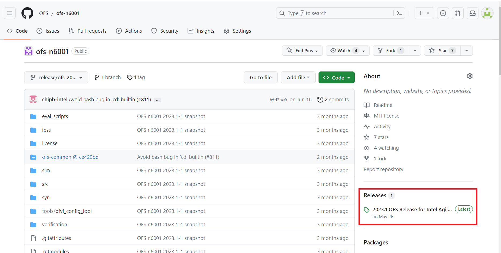
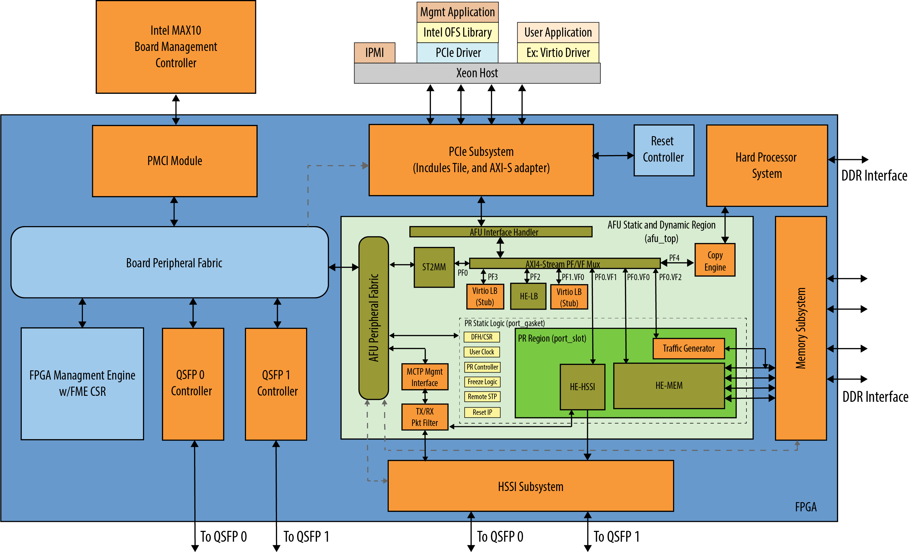

# **FPGA Developer Journey Guide: Open FPGA Stack**

Last updated: **December 14, 2023** 
## **1 Introduction**

This document is intended to help you understand the FPGA developer flow using OFS as well as considerations you should take when creating your custom platform.  

After reviewing the document, you shall be able to:

* Understand how to evaluate the OFS framework for your platform needs.
* Select a starting shell or FIM to begin your work.
* Understand what resources are available for guiding you through making modifications for custom design as well as simulation and debug.

The general development flow is depicted in the diagram below and discussed in more detail in each section of this document.

**Figure 1-1: FPGA Developer Flow**


## **2 Evaluate OFS** 

The repositories in the OFS site are tagged based on year and release number.  For example, a tag of 2023.3-1 indicates the first release package of the quarter.  If there an updates to this release package, the last number will be incremented by 1, such as 2023.3-2.

By clicking on the release link to the right of the RTL repositories, you will find the latest release, the tag number and release notes.  

**Figure 2-1: OFS Repository Release Page Link**



By scrolling to the end of the release page, you will find assets attached to the release that you can leverage for quick evaluation of OFS, such as FPGA binary files, POF and SOF as well as a sample AFU and a partial reconfiguration directory for building your own custom workload.

There are two ways to evaluate OFS depending on your needs:

Option 1: Setup your card and software in a server using the steps provided in one of the corresponding **Getting Started Guides** and leverage the appended binaries in the FIM RTL repository release page "Assets" tab to preview the software and design functionality the OFS framework provides you out of the box.  This step will give you a good high-level overview of OFS. **Getting Started Guides** are available for the following FIM(shell) designs:

* [Getting Started Guide: Open FPGA Stack for Intel® Agilex® 7 PCIe Attach FPGAs (Intel FPGA SmartNIC N6001-PL)](https://ofs.github.io/ofs-2023.3/hw/n6001/user_guides/ug_qs_ofs_n6001/ug_qs_ofs_n6001/)
* [Getting Started Guide: Open FPGA Stack for Intel® Agilex® 7 PCIe Attach FPGAs (Intel Agilex 7 FPGA F-Series Development Kit (2xF-Tile))](https://ofs.github.io/ofs-2023.3/hw/ftile_devkit/user_guides/ug_qs_ofs_ftile/ug_qs_ofs_ftile/)
* [Getting Started Guide: Open FPGA Stack for Intel® Agilex® 7 SoC Attach FPGAs](/hw/f2000x/user_guides/ug_qs_ofs_f2000x/ug_qs_ofs_f2000x/)
* [Getting Started Guide: Open FPGA Stack for Intel® Stratix® 10 PCIe Attach FPGAs](/hw/d5005/user_guides/ug_qs_ofs_d5005/ug_qs_ofs_d5005/)

Option 2: After your card and software are installed using the steps provided in one of the corresponding **Getting Started Guides** listed above, use a corresponding **Evaluation Guide** and provided evaluation script to run through all the capabilities of the OFS framework by selecting one of the choices in the evaluation menu.  The evaluation script gives you familiarity of the entire design, build, simulation, programming and test flow for OFS, including a OneAPI flow.

* [Evaluation User Guide: OFS for Intel® Agilex® 7 PCIe Attach](https://ofs.github.io/ofs-2023.3/hw/common/user_guides/ug_eval_script_ofs_agx7_pcie_attach/ug_eval_script_ofs_agx7_pcie_attach)
* [Evaluation User Guide: OFS for Intel® Agilex® 7 SoC Attach](https://ofs.github.io/ofs-2023.3/hw/f2000x/user_guides/ug_eval_ofs/ug_eval_script_ofs_f2000x/)
* [Evaluation User Guide: OFS for Intel® Stratix® 10 FPGA PCIe Attach](https://ofs.github.io/ofs-2023.3/hw/d5005/user_guides/ug_eval_ofs_d5005/ug_eval_script_ofs_d5005/)

The scripts that go with each user guide are found in the assets tab of the corresponding FIM RTL repository's latest tag release page.

To use the full functionality of the script you will want to ensure you clone all of the appropriate repositories below at the same level just under an OFS directory you create, such as ofs-2023.3, similar to the figure below. 


**Figure 2-2: Directory Structure of Cloned Repositories**

```bash
##|-- ofs-2023.3
##|    |--examples-afu
##|    |--linux-dfl
##|    |--ofs-agx7-pcie-attach
##|    |--ofs-oneapi-asp
##|    |--opae-sdk
##|    |--opae-sim
##|    |--ofs-agx7-pcie-attach_eval.sh
```


You can access the repositories from ofs.github.io by clicking on the GitHub icon in the right corner of the site.

**Figure 2-3: OFS Site Link from ofs.github.io**


After making your top level directory, initializing the repository and installing git lfs, clone one of the FIM RTL repositories you intend to use:

```bash

#Make top level directory
mkdir OFS
cd OFS

#Initialize repository and install git lfs
git init

curl -s https://packagecloud.io/install/repositories/github/git-lfs/script.rpm.sh | sudo bash
sudo dnf install git-lfs
git lfs install

#Select a FIM RTL repository to clone
#To clone Intel Agilex 7 PCIe Attach FIM RTL repository

git clone --recurse-submodules https://github.com/OFS/ofs-agx7-pcie-attach.git
cd ofs-agx7-pcie-attach
git checkout --recurse-submodules tags/ofs-2023.3-1


#To clone Intel Agilex 7 SoC Attach FIM RTL Repository
git clone --recurse-submodules https://github.com/OFS/ofs-f2000x-pl.git
cd ofs-f2000x-pl
git checkout --recurse-submodules tags/ofs-2023.3-2

#To clone Intel Stratix 10 PCIe Attach FIM RTL Repository
git clone --recurse-submodules https://github.com/OFS/ofs-d5005.git
cd ofs-d5005
git checkout --recurse-submodules tags/ofs-2023.3-1
```

After cloning your FIM RTL repository, clone the other necessary repositories:

```bash
#All other repositories below should be cloned to use the evaluation script:

git clone https://github.com/OFS/linux-dfl
cd /home/OFS/linux-dfl
git checkout tags/ofs-2023.3-6.1-2

#Use this OPAE clone command for all PCIe Attach Cards
git clone https://github.com/OFS/opae-sdk
cd /home/OFS/opae-sdk
git checkout tags/2.10.0-1

#Use this OPAE clone command for the SoC Attach Card
git clone https://github.com/OFS/opae-sdk
cd /home/OFS/opae-sdk
git checkout tags/2.10.0-1

git clone https://github.com/OFS/oneapi-asp.git 
cd /home/OFS/oneapi-asp
git checkout tags/ofs-2023.3-1

git clone https://github.com/OFS/ofs-platform-afu-bbb.git
cd /home/OFS/ofs-platform-afu-bbb
git checkout tags/ofs-2023.2-1

git clone https://github.com/OFS/opae-sim.git
cd /home/OFS/opae-sim
git checkout tags/2.10.0-1

git clone https://github.com/OFS/examples-afu.git
cd /home/OFS/examples-afu
git checkout tags/ofs-2023.2-1
```

You will also want to ensure you install the correct version of Intel Quartus Prime Pro as directed in the release notes in addition to any Quartus patches.  Note that Quartus Prime Pro software can be downloaded from the [downloads tab](https://www.intel.com/content/www/us/en/products/details/fpga/development-tools/quartus-prime/resource.html) on intel.com.  Quartus Prime Pro patches required are attached to the assets tab at the bottom of the tagged RTL repository release page. Simulator tools as listed corresponding Simulation User Guides:

* [Simulation User Guide: OFS for Intel® Agilex® 7 PCIe Attach](https://ofs.github.io/ofs-2023.3/hw/common/user_guides/ug_sim_ofs_agx7_pcie_attach/ug_sim_ofs_agx7_pcie_attach/)
* [Simulation User Guide: OFS for Intel® Agilex® 7 SoC Attach](https://ofs.github.io/ofs-2023.3/hw/f2000x/user_guides/ug_sim_ofs/ug_sim_ofs/)
* [Simulation User Guide: OFS for Intel® Stratix® 10 FPGA PCIe Attach](https://ofs.github.io/ofs-2023.3/hw/d5005/user_guides/ug_sim_ofs_d5005/ug_sim_ofs_d5005/)

## **3 Select a Starting Shell/FIM**

To begin your development, start with an existing shell that most closely matches your device and end solution.  The OFS site has both Intel Intel Agilex 7 and Stratix 10 FPGA reference designs you can use as a starting point for your own design. These designs can be ported to different device OPNs if a different resource utilization is required.   

To begin you may want to learn more about Intel Stratix 10 and Intel Agilex 7 family offerings.  Please refer to the following links:

* [Intel Agilex 7 Product Page](https://www.intel.com/content/www/us/en/products/details/fpga/agilex/7.html) 
* [Intel Stratix 10 Product Page](https://www.intel.com/content/www/us/en/products/details/fpga/stratix/10.html)


Note that each reference design provides an integrated shell, called the FPGA Interface Manager (FIM), which is encompasses in blue in the diagrams below.  This shell provides standard AXI interfaces to the Accelerator Functional Unit (AFU) region, shown in green, which depicts a region where a workload or partial reconfiguration slot resides.  The regions are not drawn to scale.  The figures and tables below give an overview of the available starting points for your design.

**Figure 3-1: OFS FIM Targeting Intel<sup>&reg;</sup> Agilex<sup>&reg;</sup>7 PCIe Attach (P-tile, E-tile)**



| Key Feature                           | Description                                                  |
| ------------------------------------- | ------------------------------------------------------------ |
| Target OPN                            | AGFB014R24A2E2V                                              |
| PCIe                                  | P-tile PCIe* Gen4x16                                         |
| Virtualization                        | 5 physical functions/3 virtual functions with ability to expand |
| Memory                                | 5 DDR Channels:* One HPS DDR4 bank, x40 (x32 Data and x8 ECC), 1200 MHz, 1GB each* Four Fabric DDR4 banks, x32 (no ECC), 1200 MHz, 4GB |
| Ethernet                              | 2x4x25GbE, 2x4x10GbE or 2x100GbE |
| Hard Processor System                 | 64-bit quad core Arm® Cortex®-A53 MPCore with integrated peripherals. |
| Configuration and Board Manageability | * FPGA Management Engine that provides general control of common FPGA tasks (ex. error reporting, partial reconfiguration)<br>* Platform Controller Management Interface (PMCI) Module for Board Management Controller |
| Partial Reconfiguration               | Supported |
| OneAPI                                | OneAPI Acceleration Support Package (ASP) provided with compiled FIM to support OneAPI Runtime |
| Software Support                      | * Linux DFL drivers targeting OFS FIMs<br>* OPAE Software Development Kit* OPAE Tools |
| Target Board                          | [Intel® FPGA SmartNIC N6001-PL](https://www.intel.com/content/www/us/en/content-details/779620/a-smartnic-for-accelerating-communications-and-networking-workloads.html) |

Click here for the [OFS Collateral for Intel<sup>&reg;</sup> Agilex<sup>&reg;</sup> PCIe Attach Reference FIM](/hw/common/user_guides/ug_eval_script_ofs_agx7_pcie_attach/ug_eval_script_ofs_agx7_pcie_attach/) documentation collection.

<br>


**Figure 3-2: OFS FIM Targeting Intel<sup>&reg;</sup> Agilex<sup>&reg;</sup>7 PCIe Attach (2xF-tile)**


| Key Feature                           | Description                                                  |
| ------------------------------------- | ------------------------------------------------------------ |
| Target OPN                            | AGFB027R24C2E2VR2                                           |
| PCIe                                  | P-tile PCIe* Gen4x16 (currently downtrains to Gen4x8 in the ES version of the development kit)                                        |
| Virtualization                        | 5 physical functions/3 virtual functions with ability to expand |
| Memory                                | 3 DDR Channels:* One HPS DDR4 bank, x40 (x32 Data and x8 ECC), 2400 MHz, 1GB each* Two Fabric DDR4 banks, x64 (no ECC), 2400 MHz, 8GB |
| Ethernet                              | 2x4x25GbE |
| Hard Processor System                 | 64-bit quad core Arm® Cortex®-A53 MPCore with integrated peripherals. |
| Configuration and Board Manageability | * FPGA Management Engine that provides general control of common FPGA tasks (ex. error reporting, partial reconfiguration)<br>* Platform Controller Management Interface (PMCI) Module for Board Management Controller |
| Partial Reconfiguration               | Supported |
| OneAPI                                | OneAPI Acceleration Support Package (ASP) provided with compiled FIM to support OneAPI Runtime |
| Software Support                      | * Linux DFL drivers targeting OFS FIMs<br>* OPAE Software Development Kit* OPAE Tools |
| Target Board                          | [Intel Agilex® 7 FPGA F-Series Development Kit (2x F-Tile)](https://www.intel.com/content/www/us/en/docs/programmable/739942/current/overview.html) |

Click here for the [OFS Collateral for Intel<sup>&reg;</sup> Agilex<sup>&reg;</sup> PCIe Attach Reference FIM](/hw/common/user_guides/ug_eval_script_ofs_agx7_pcie_attach/ug_eval_script_ofs_agx7_pcie_attach/) documentation collection.

<br>


**Figure 3-3: OFS FIM Features Targeting Intel<sup>&reg;</sup> Agilex<sup>&reg;</sup> 7 SoC Attach**


| Key Feature                           | Description                                                  |
| ------------------------------------- | ------------------------------------------------------------ |
| Device OPN                            | AGFC023R25A2E2VR0                                            |
| PCIe                                  | P-tile PCIe* Gen4x16 to the Host<br />P-tile PCIe* Gen4x16 to the SoC (IceLake-D) |
| Virtualization                        | Host: 2 physical functions <br />SoC:   1 physical function and 3 Virtual functions |
| Memory                                | Four Fabric DDR4 banks, x40 (optional ECC, be configured as x32 and ECC x8 ), 1200 MHz, 4GB |
| Ethernet                              | 2x4x25GbE |
| Configuration and Board Manageability | * FPGA Management Engine that provides general control of common FPGA tasks (ex. error reporting, partial reconfiguration)<br> * Platform Controller Management Interface (PMCI) Module for Board Management Controller |
| Partial Reconfiguration               | Supported |
| Software Support                      | * Linux DFL drivers targeting OFS FIMs<br> * OPAE Software Development Kit * OPAE Tools |
| Target Board                         | [Intel® Infrastructure Processing Unit (Intel® IPU) Platform F2000X-PL](https://www.intel.com/content/www/us/en/products/details/network-io/ipu/f2000x-pl-platform.html)

Note: Source code for BMC RTL/Firmware that works with this reference FIM can be obtained by contacting your Intel Sales Representative.

Click here for the [OFS Collateral for Intel<sup>&reg;</sup> Agilex<sup>&reg;</sup> SoC Attach Reference FIM](https://ofs.github.io/hw/f2000x/user_guides/ug_eval_ofs/ug_eval_script_ofs_f2000x/) documentation collection.


<br>


**Figure 3-4: OFS FIM Targeting Intel<sup>&reg;</sup> Stratix<sup>&reg;</sup> 10 FPGA PCIe Attach**


| Key Feature | Intel Stratix 10 Reference FIM | 
|:-----------:|:-------------------------------|
| Device OPN  | 1SX280HN2F43E2VG |
|Ethernet Configuration | 1x10GbE example with 2x100GbE capability |
| PCIe | Gen3x16 |
|EMIF | Up to four DDR channels |
| PF/VF | 1 PF/3 VFs |
|Management | FPGA Management Engine (FME) with FIM management registers|
|Interface | Arm<sup>&reg;</sup> AMBA<sup>&reg;</sup>4 AXI Interface |
| HLD support | oneAPI |
| Software | Kernel code upstreamed to Linux.org |
|Target Board  | [Intel® FPGA Programmable Acceleration Card D5005](https://www.intel.com/content/www/us/en/docs/programmable/683568/current/introduction.html)|


Click here for the [OFS Collateral for Intel<sup>&reg;</sup> Stratix<sup>&reg;</sup> 10 FPGA PCIe Attach Reference FIM](https://ofs.github.io/hw/d5005/user_guides/ug_eval_ofs_d5005/ug_eval_script_ofs_d5005/) documentation.


## **4 Review Release Notes**   

Before beginning your design, read the release notes for each repository you are using by selecting the appropriate release tag found by clicking on the "Release" link to the right of the corresponding repository.  The release page may also have assets appended such as useful binaries, patches or scripts.


<br>
<br>

## **5 Setup Your Environment For Development**

When you are ready to begin development you will want to ensure you have any other setup requirements satisfied by reviewing instructions in the corresponding FIM Developer Guide and if you are implementing a OneAPI Board Support Package, the oneAPI ASP Getting Started User Guide as well.

* [FPGA Interface Manager (FIM) Developer Guide: OFS for Intel® Agilex® 7 PCIe Attach (2xF-tile)](https://ofs.github.io/ofs-2023.3/hw/ftile_devkit/dev_guides/fim_dev/ug_ofs_ftile_dk_fim_dev/)
    * Can be used with Intel Agilex® 7 FPGA F-Series Development Kit (2x F-Tile)
* [FPGA Interface Manager (FIM)  Developer Guide: OFS for Intel® Agilex® 7 PCIe Attach (P-tile, E-tile)](https://ofs.github.io/ofs-2023.3/hw/n6001/dev_guides/fim_dev/ug_dev_fim_ofs_n6001/)
    * Can be used with Intel FPGA SmartNIC N6001-PL
* [FPGA Interface Manager (FIM) Developer Guide: OFS for Intel® Agilex® 7 SoC Attach](https://ofs.github.io/ofs-2023.3/hw/f2000x/dev_guides/fim_dev/ug_dev_fim_ofs/)
    * Can be used with Intel Infrastructure Processing Unit (Intel® IPU) Platform F2000X-PL 
* [FPGA Interface Manager (FIM) Developer Guide: OFS for Intel® Stratix® 10 FPGA PCIe Attach](https://ofs.github.io/ofs-2023.3/hw/d5005/dev_guides/fim_dev/ug_dev_fim_ofs_d5005/)
    * Can be used with Intel FPGA PAC D5005


For oneAPI setup: 

* [oneAPI Accelerator Support Package (ASP): Getting Started User Guide](https://ofs.github.io/ofs-2023.3/hw/common/user_guides/oneapi_asp/ug_oneapi_asp/)
    * Can be used with:<br>
            - Intel Agilex® 7 FPGA F-Series Development Kit (2x F-Tile)
            - Intel FPGA SmartNIC N6001-PL

## **6 Customize Your Shell, Build and Debug**

For your own custom design, you may need to:

* Target the OFS reference design to a different device
* Modify the pin assignments
* Modify or remove existing peripheral IP
* Add new interface IP
* Repartition the partial reconfiguration region 

The FIM Developer Guides for each reference FIM show you how to make these changes and provide steps on how to run unit simulation or add SignalTap to your design for debugging.

If you are also interested in testing different examples for the Acceleration Functional Unit (AFU) or workload region of your design or creating your own AFU design, you can refer to the corresponding **AFU Developer Guides**:

* [Accelerator Functional Unit (AFU) Developer Guide: OFS for Intel® Agilex® 7 PCIe Attach](https://ofs.github.io/ofs-2023.3/hw/common/user_guides/afu_dev/ug_dev_afu_ofs_agx7_pcie_attach/ug_dev_afu_ofs_agx7_pcie_attach)
* [Accelerator Functional Unit (AFU) Developer Guide: OFS for Intel® Agilex® 7 SoC Attach](https://ofs.github.io/ofs-2023.3/hw/f2000x/dev_guides/afu_dev/ug_dev_afu_ofs_f2000x/)
* [Accelerator Functional Unit (AFU) Developer Guide: OFS for Intel® Stratix® 10 FPGA PCIe Attach]

## **7 Simulate and Debug**

Setup and test files to perform system-level Universal Verification Methodology (UVM) testing are provided in each FIM RTL repository.  Please refer to the corresponding **Simulation User Guide** for details on test bench architecture, setup and testing.

* [Simulation User Guide: OFS for Intel® Agilex® 7 PCIe Attach](https://ofs.github.io/ofs-2023.3/hw/common/user_guides/ug_sim_ofs_agx7_pcie_attach/ug_sim_ofs_agx7_pcie_attach/)
* [Simulation User Guide: OFS for Intel® Agilex® 7 SoC Attach](https://ofs.github.io/ofs-2023.3/hw/f2000x/user_guides/ug_sim_ofs/ug_sim_ofs/)
* [Simulation User Guide: OFS for Intel® Stratix® 10 FPGA PCIe Attach](https://ofs.github.io/ofs-2023.3/hw/d5005/user_guides/ug_sim_ofs_d5005/ug_sim_ofs_d5005/)

## **8 Optional: Build OneAPI Accelerator Support Package (ASP)**

If you are considering providing oneAPI support for your custom board design, you must integrate the oneAPI ASP hardware and software components into your design.  Reference the following documents to learn about the architecture and implementation flow for the oneAPI ASP with an OFS design.

* [oneAPI Accelerator Support Package (ASP): Getting Started User Guide](https://ofs.github.io/ofs-2023.3/hw/common/user_guides/oneapi_asp/ug_oneapi_asp/)
* [oneAPI Accelerator Support Package(ASP) Reference Manual: Open FPGA Stack](https://ofs.github.io/ofs-2023.3/hw/common/reference_manual/oneapi_asp/oneapi_asp_ref_mnl/)

## **9 Optional: Driver or OFS Software Tool Modifications**

As you add or remove interfaces to your custom design, you may need to modify or enhance existing drivers that accompany the OFS reference design.  Additionally, you may decide you want to create additional utilities or plugins leveraging the OFS software infrastructure.  In this case, refer to the [OFS Software tab](/sw/fpga_api/quick_start/readme/) to learn more about the underlying driver and software architecture and how to make modifications.

Additionally, for guidance on using a Kernel-based Virtual Machine with OFS, refer to our KVM User Guide. 

[KVM User Guide: Open FPGA Stack](https://ofs.github.io/ofs-2023.3/hw/common/user_guides/ug_kvm/ug_kvm/)

## **10 Test and Deploy**

When testing and deploying your platform you are encouraged to modify and tailor the evaluation scripts you used in **Section 2** to assist in automating your continuous integration flow.  You may also want to refer to our Docker User Guide to understand how to use Docker for Development and Deployment.

* [Docker User Guide: Intel Open FPGA Stack](https://ofs.github.io/ofs-2023.3/hw/common/user_guides/ug_docker/ug_docker/)


## Notices & Disclaimers

Intel<sup>&reg;</sup> technologies may require enabled hardware, software or service activation.
No product or component can be absolutely secure. 
Performance varies by use, configuration and other factors.
Your costs and results may vary. 
You may not use or facilitate the use of this document in connection with any infringement or other legal analysis concerning Intel products described herein. You agree to grant Intel a non-exclusive, royalty-free license to any patent claim thereafter drafted which includes subject matter disclosed herein.
No license (express or implied, by estoppel or otherwise) to any intellectual property rights is granted by this document, with the sole exception that you may publish an unmodified copy. You may create software implementations based on this document and in compliance with the foregoing that are intended to execute on the Intel product(s) referenced in this document. No rights are granted to create modifications or derivatives of this document.
The products described may contain design defects or errors known as errata which may cause the product to deviate from published specifications.  Current characterized errata are available on request.
Intel disclaims all express and implied warranties, including without limitation, the implied warranties of merchantability, fitness for a particular purpose, and non-infringement, as well as any warranty arising from course of performance, course of dealing, or usage in trade.
You are responsible for safety of the overall system, including compliance with applicable safety-related requirements or standards. 
<sup>&copy;</sup> Intel Corporation.  Intel, the Intel logo, and other Intel marks are trademarks of Intel Corporation or its subsidiaries.  Other names and brands may be claimed as the property of others. 

OpenCL and the OpenCL logo are trademarks of Apple Inc. used by permission of the Khronos Group™. 
 
