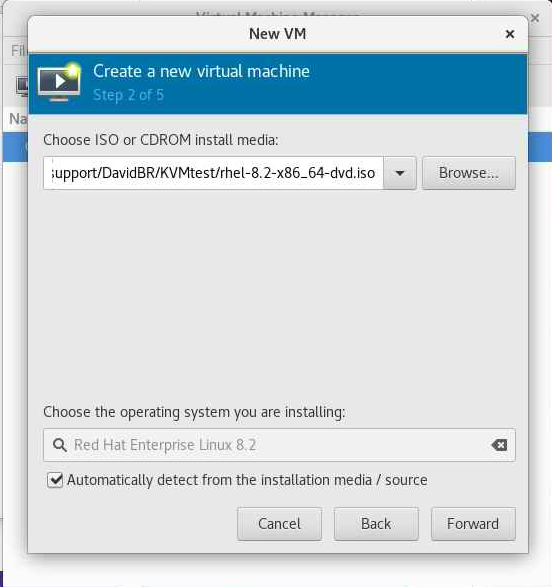
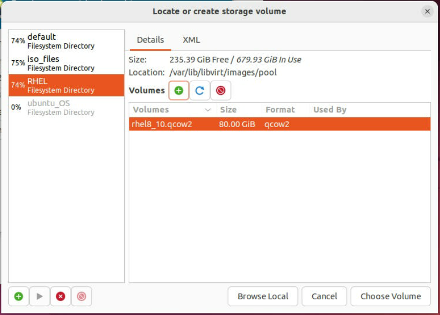

Virtual machine User Guide: Open FPGA Stack + KVM 
===

Last updated: **December 14, 2023** 

## Document scope 

The document describes setting up and configuring a virtual machine to use PCIe devices. Here are the steps that the document may include:

1. Install the necessary tools, such as virt-manager, on the host machine. This may involve downloading and installing the software from the internet.
2. Enable the virtualization feature on the host machine. This may involve going into the BIOS settings and enabling hardware-assisted virtualization or using a command-line tool to enable it in the operating system.
3. Use virt-manager to create a new virtual machine and configure its settings. This may involve choosing a name and operating system for the virtual machine and setting the amount of memory and storage it will use.
4. Install the OPAE (Open Programmable Acceleration Engine) tool on the virtual machine. This may involve downloading and installing the OPAE software.
5. Install the DFL (Data Field Level) drivers on the virtual machine. These drivers allow the virtual machine to access and use the PCIe devices on the host machine. This may involve downloading and installing the drivers from the internet.
6. Once all of the steps have been completed, you should be able to use the virtual machine to access and use the PCIe devices on the host machine. You may need to configure the virtual machine's settings to enable it to use the PCIe devices, such as by assigning a specific device to the virtual machine.

## Operation Modes

Our current operational framework stipulates two distinct modes of operation:

1. **Management Mode**: This mode necessitates the passthrough of only the FME device (use fpgainfo fme to discover your port number, normally .0). The reason for this is that the Open FPGA Stack (OFS) depends on this address for management. Under this mode, the use of the exerciser and virtual functions is not feasible.

2. **Virtual Function Mode**: This mode comes into effect when a user needs to utilize the Virtual Functions (VF). The user will convert (example) Physical Function 0 (PF0) to three Virtual Functions (VF). This means the PF will cease to function for management purposes. Once the VFs are set up, they essentially take over the role of the PF in communicating with the Virtual Machines (VMs).

    However, this mode is subject to a limitation. If the user needs to execute 'fpgainfo fme' or 'fpgaupdate', they will need to transition from Virtual Function Mode to Management Mode. Conversely, if the user intends to utilize the Virtual Functions, they would need to switch from Management Mode to Virtual Function Mode. It is imperative to bear this limitation in mind when operating within these modes.

## 1. Verify if the virtualization is enabled.

To check if virtualization is enabled on a Red Hat system using `lscpu` and `grep`, you can use the following command:

```sh
lscpu -e | grep Virtualization
```

This command will run `lscpu` with the `-e` or `--extended` option, which displays information about the CPU and its available virtualization capabilities. Then, it pipes the output to `grep` with the search pattern "Virtualization". If the system has support for virtualization, the output will show the "Virtualization" field and its value, for example:

```sh
Virtualization: VT-x
```

In this example, the output shows that the system supports Intel VT-x virtualization technology. If the "Virtualization" field is empty, the system does not have support for virtualization. Keep in mind that even if the system has support for virtualization, it may not be enabled in the BIOS or the operating system itself. 

Check the following for the bios configuration, [**Enabling Intel VT-d Technology**](https://github.com/intel-innersource/applications.fpga.ofs.documentation/blob/ritesh_n600x_gs_ww49/n600x/user_guides/ofs_getting_started/ug_qs_ofs_n600x.md#enabling-intel-vt-d-technology)

## 2. Verify if the virtualization modules are loaded

1. Open a terminal window and log in as a user with sudo privileges.
2. Check if the virtualization kernel modules are loaded by running the following command:

```
lsmod | grep kvm
```

3. If the command outputs a list of modules, the virtualization kernel modules are loaded, and virtualization is enabled on your system.

4. The virtualization kernel modules are not loaded if the command does not output anything. You can try loading them manually by running the following command:

```
sudo modprobe kvm
```

5. If the kernel modules are not loaded, and you cannot load them manually, it may be because virtualization is not supported or enabled in your system's BIOS or UEFI settings. You must reboot your system and enter the BIOS or UEFI settings menu to enable virtualization. The exact steps for doing this may vary depending on your system's hardware and BIOS/UEFI version, so consult your motherboard or system documentation for specific instructions.

## 3. Install Virtual Machine Manager

Virtual Machine Manager (also known as libvirt) on follow these steps:

1. Open a terminal window and log in as a user with sudo privileges.
2. Update your system package index by running the following command:
   * Redhat 

   ```sh
   sudo dnf update
   ```
   * Ubuntu
   ```SH
   sudo apt update
   ```

3. Install the libvirt package and any required dependencies by running the following command:

   * Redhat 

   ```sh
   sudo dnf install @virtualization
   ```

   * Ubuntu

   ```SH
   sudo apt install qemu-kvm libvirt-bin bridge-utils virt-manager
   ```

4. Start the libvirtd service and enable it to start automatically at boot time by running the following commands:

```sh
sudo systemctl start libvirtd
sudo systemctl enable libvirtd
```

5. Optional: Install the virt-manager package, which provides a GUI application for managing virtual machines, by running the following command:

```sh
sudo dnf install virt-manager
```

6. Optional: If you want to be able to run virtual machines as a non-root user, add your user to the libvirt group by running the following command, replacing "USERNAME" with your username:

```sh
sudo usermod -a -G libvirt USERNAME
```

7. You can now launch virt-manager by running the command `virt-manager` as the non-root user.

Note: By default, virt-manager will only allow non-root users to create and manage virtual machines with limited resources, such as a limited amount of memory and CPU cores. To allow non-root users to create and manage virtual machines with more resources, you need to edit the `/etc/libvirt/qemu.conf` configuration file and set the `user` and `group` values for the `dynamic_ownership` option to `1`. For example:

```
# Set user and group ownership of dynamic /dev/kvm device nodes
dynamic_ownership = 1
user = "root"
group = "root"
```

You will also need to restart the libvirtd service for the changes to take effect. You can do this by running the command. 

```sh
sudo systemctl restart libvirtd
```

8. Reboot your server to apply the changes 

```sh
reboot
```

After completing these steps, you should be able to use the virt-manager GUI application to manage virtual machines on your system. 

## 4. How to create a Virtual Machine?

Before creating the virtual machine, ensure the DFL drivers are installed in your host machine; the instructions are located here, [OFS Site](https://ofs.github.io) select your desired platform and select Getting stated guide.

To create a Red Hat 8.2 or Ubuntu 22.04  virtual machine (VM) using `virt-manager` and share PCI devices with the VM, you will need to perform the following steps:

1. Start the `virt-manager` GUI by running the following command:

```sh
sudo virt-manager&
```


2. Create a new connection from the menu File-> "Add Connection," Use the default options and click "Connect."

   

   

3. In the `virt-manager` window, click the "New virtual machine" button.

   

4. In the "New VM" wizard, select "Local install media (ISO image or CDROM)" as the installation source, and then click "Forward."

   

   * Get the Red Hat image from the following link.

     https://developers.redhat.com/content-gateway/file/rhel-8.2-x86_64-dvd.iso

   * Get the Ubuntu image from the following link.

     https://releases.ubuntu.com/22.04/ubuntu-22.04.1-desktop-amd64.iso

5. In the next step, Click Browse -> Browse local, select the Red Hat 8.2 ISO image as the installation source and click "Forward".

   

   

   Note: if the system is not detected, disable "Automatic detected from the installation media/source" and type ubuntu and select 19.10 (this should be fine for the 22.04); this step is necessary to copy the default values for the specific OS

   

6. In the next step, specify a name and location for the VM, and select the desired memory and CPU configuration. in our case, 16 cores and 64 GB of RAM; Click "Forward" to continue.

   

7. Select "enable storage for this virtual machine," Select "Create a new disk for the virtual machine," and enter a size for the virtual disk (at least 200~300GB in case you need to compile the design) or create a custom storage.

   

   1. If you need to create custom storage, select "Select or Create custom storage" and click "Manage."

      

   2. Click on the "+" icon (Bottom left) to create the storage pool.

      

   3. In the "Create a new storage pool" dialog, enter a name for the storage pool and select the type of storage pool you want to create; select the Target Path and Click "Finish."

      

   4. Select the pool and later click on the "+" icon (The Icon is on the right side of the Volume label) to create the New Storage Volume.

      

   5. In the "Create Storage Volume" dialog, Define the name and format (keep with the default qcow2) and select the Max Capacity (at least 200~300GB  in case you need to compile the design); click "Finish" to create the disk.

      

   6. Once the disk is created, it will appear in your virtual machine's list of storage devices. You can now use this disk just like any other disk. Select from the list and Click "Choose Volume."

      

   

8. In the next step, select the "Customize configuration before install" option and click "Finish."

   

9. In the "Overview" tab, select "Add Hardware," choose "PCI Host Device" from the drop-down menu and choose the PCI device you want to share with the VM. Click "Apply" to apply the changes, and then click "Finish" to create the VM.

   1. Option A - Management mode - This will only allow you to load the binaries to the FPGA, you only need to add the PF listed at the fpgainfo fme command

      ```sh
      fpgainfo fme
      
      fpgainfo fme
      Intel Acceleration Development Platform N6001
      Board Management Controller NIOS FW version: xxxx 
      Board Management Controller Build version: xxxx 
      //****** FME ******//
      Object Id                        : 0xEE00000
      PCIe s:b:d.f                     : 0000:b1:00.0
      ```

      Do you only need to add the 0000:b1:00.0 to the list

       

   

   

   

   

   2. Option B - Deployment mode - The main idea of this mode is enable the Virtual function used by the Agilex PCIe Attach OFS under the Physical Function 0, This option will allow us to use the Host Exercises.

       Note: assigning multiple devices to the same VM on a guest IOMMU, you may need to increase the hard_limit option in order to avoid hitting a limit of pinned memory. The hard limit should be more than (VM memory size x Number of PCIe devices)

       1. **Create** 3 VFs in the PR region.

           ```sh
           sudo pci_device b1:00.0 vf 3 
           ```

           **1.1** Verify all 3 VFs were created.

           ```sh
           lspci -s b1:00 
           b1:00.0 Processing accelerators: Intel Corporation Device bcce (rev 01) 
           b1:00.1 Processing accelerators: Intel Corporation Device bcce 
           b1:00.2 Processing accelerators: Intel Corporation Device bcce 
           b1:00.3 Processing accelerators: Red Hat, Inc. Virtio network device 
           b1:00.4 Processing accelerators: Intel Corporation Device bcce 
           b1:00.5 Processing accelerators: Intel Corporation Device bccf 
           b1:00.6 Processing accelerators: Intel Corporation Device bccf 
           b1:00.7 Processing accelerators: Intel Corporation Device bccf 
           ```

           **2.** **Bind** all of the PF/VF endpoints to the `vfio-pci` driver.

           ```
           sudo opae.io init -d 0000:b1:00.1 user:user
           Unbinding (0x8086,0xbcce) at 0000:b1:00.1 from dfl-pci
           Binding (0x8086,0xbcce) at 0000:b1:00.1 to vfio-pci
           iommu group for (0x8086,0xbcce) at 0000:b1:00.1 is 187
           Assigning /dev/vfio/187 to DCPsupport
           Changing permissions for /dev/vfio/187 to rw-rw----
           
           sudo opae.io init -d 0000:b1:00.2 user:user
           Unbinding (0x8086,0xbcce) at 0000:b1:00.2 from dfl-pci
           Binding (0x8086,0xbcce) at 0000:b1:00.2 to vfio-pci
           iommu group for (0x8086,0xbcce) at 0000:b1:00.2 is 188
           Assigning /dev/vfio/188 to DCPsupport
           Changing permissions for /dev/vfio/188 to rw-rw----
           
           ...
           
           sudo opae.io init -d 0000:b1:00.7 user:user
           Binding (0x8086,0xbccf) at 0000:b1:00.7 to vfio-pci
           iommu group for (0x8086,0xbccf) at 0000:b1:00.7 is 319
           Assigning /dev/vfio/319 to DCPsupport
           Changing permissions for /dev/vfio/319 to rw-rw----
           ```

           **3.** Check that the accelerators are present using `fpgainfo`. *Note your port configuration may differ from the below.*

           ```
           sudo fpgainfo port 
           //****** PORT ******//
           Object Id                        : 0xEC00000
           PCIe s:b:d.f                     : 0000:B1:00.0
           Vendor Id                        : 0x8086
           Device Id                        : 0xBCCE
           SubVendor Id                     : 0x8086
           SubDevice Id                     : 0x1771
           Socket Id                        : 0x00
           //****** PORT ******//
           Object Id                        : 0xE0B1000000000000
           PCIe s:b:d.f                     : 0000:B1:00.7
           Vendor Id                        : 0x8086
           Device Id                        : 0xBCCF
           SubVendor Id                     : 0x8086
           SubDevice Id                     : 0x1771
           Socket Id                        : 0x01
           Accelerator GUID                 : 4dadea34-2c78-48cb-a3dc-5b831f5cecbb
           //****** PORT ******//
           Object Id                        : 0xC0B1000000000000
           PCIe s:b:d.f                     : 0000:B1:00.6
           Vendor Id                        : 0x8086
           Device Id                        : 0xBCCF
           SubVendor Id                     : 0x8086
           SubDevice Id                     : 0x1771
           Socket Id                        : 0x01
           Accelerator GUID                 : 823c334c-98bf-11ea-bb37-0242ac130002
           //****** PORT ******//
           Object Id                        : 0xA0B1000000000000
           PCIe s:b:d.f                     : 0000:B1:00.5
           Vendor Id                        : 0x8086
           Device Id                        : 0xBCCF
           SubVendor Id                     : 0x8086
           SubDevice Id                     : 0x1771
           Socket Id                        : 0x01
           Accelerator GUID                 : 8568ab4e-6ba5-4616-bb65-2a578330a8eb
           //****** PORT ******//
           Object Id                        : 0x80B1000000000000
           PCIe s:b:d.f                     : 0000:B1:00.4
           Vendor Id                        : 0x8086
           Device Id                        : 0xBCCE
           SubVendor Id                     : 0x8086
           SubDevice Id                     : 0x1771
           Socket Id                        : 0x01
           Accelerator GUID                 : 44bfc10d-b42a-44e5-bd42-57dc93ea7f91
           //****** PORT ******//
           Object Id                        : 0x40B1000000000000
           PCIe s:b:d.f                     : 0000:B1:00.2
           Vendor Id                        : 0x8086
           Device Id                        : 0xBCCE
           SubVendor Id                     : 0x8086
           SubDevice Id                     : 0x1771
           Socket Id                        : 0x01
           Accelerator GUID                 : 56e203e9-864f-49a7-b94b-12284c31e02b
           //****** PORT ******//
           Object Id                        : 0x20B1000000000000
           PCIe s:b:d.f                     : 0000:B1:00.1
           Vendor Id                        : 0x8086
           Device Id                        : 0xBCCE
           SubVendor Id                     : 0x8086
           SubDevice Id                     : 0x1771
           Socket Id                        : 0x01
           Accelerator GUID                 : 3e7b60a0-df2d-4850-aa31-f54a3e403501
           ```

   The following table contains a mapping between each VF, Accelerator GUID, and component.

   ###### Table 16: Accelerator PF/VF and GUID Mappings

   | Component                                     | VF           | Accelerator GUID                     |
   | :-------------------------------------------- | :----------- | :----------------------------------- |
   | Intel N6001-PL FPGA SmartNIC Platform base PF | XXXX:XX:XX.0 | N/A                                  |
   | VirtIO Stub                                   | XXXX:XX:XX.1 | 3e7b60a0-df2d-4850-aa31-f54a3e403501 |
   | HE-MEM Stub                                   | XXXX:XX:XX.2 | 56e203e9-864f-49a7-b94b-12284c31e02b |
   | Copy Engine                                   | XXXX:XX:XX.4 | 44bfc10d-b42a-44e5-bd42-57dc93ea7f91 |
   | HE-MEM                                        | XXXX:XX:XX.5 | 8568ab4e-6ba5-4616-bb65-2a578330a8eb |
   | HE-HSSI                                       | XXXX:XX:XX.6 | 823c334c-98bf-11ea-bb37-0242ac130002 |
   | MEM-TG                                        | XXXX:XX:XX.7 | 4dadea34-2c78-48cb-a3dc-5b831f5cecbb |

   3. Now you need to ensure you add the desire VF in you PCIE devices list 

       

       

       Ensure to select your desire VF, in our case .5 HE-MEM

10. Edit the XML file for your machine and include the following

   1. < ioapic driver='qemu'/> inside of features:

      ```xml
      <features>
      	<acpi/>
      	<apic/>
      	<ioapic driver='qemu'/>
      </features>
      ```

   2. Inside of devices

      ```xml
      <devices>
          ........
          ......
          <iommu model='intel'>
          	<driver intremap='on' caching_mode='on'/>
          </iommu>
      </devices>
      ```

   3. Ensure the hard limit is setup correctly otherwise you can only pass one device:

      ```xml
      <memtune>
      	<hard_limit unit='G'>64</hard_limit>
      </memtune>
      ```

      Note: assigning multiple devices to the same VM on a guest IOMMU, you may need to increase the hard_limit option in order to avoid hitting a limit of pinned memory. The hard limit should be more than (VM memory size x Number of PCIe devices)

   4. Save the changes "Apply"

11. On the host machine append intel_iommu=on to the end of the GRUB_CMDLINE_LINUX line in the grub configuration file.
    ```sh
    nano /etc/default/grub
    ......
    GRUB_CMDLINE_LINUX="....... ... intel_iommu=on"
    ...
    #Refresh the grub.cfg file for these changes to take effect
    
    grub2-mkconfig -o /boot/grub2/grub.cfg
    shutdown -r now
    ```

    

12. Ensure your devices are enumerated properly.

    1. Example in you host system should look like this:

      1. Management Mode

        B1:00.0

      2. Deployment Mode 

          B1:00.5

          

    2. Under the virtual machine (The PCIe Address is an example you could get a different
      number):

      1. Management Mode

        177:00.0

      2. Deployment Mode 

          177:00.0

      

13. Click on "Begin Installation." and follow the wizard installation of the OS. 

    

14. Once the VM is created, you can start it by selecting it in the `virt-manager` window and clicking the "Run" button. This will boot the VM and start the Red Hat 8.2/Ubuntu installation process. Follow the on-screen instructions to complete the installation.

    

    

15. Under your virtual machine, configure your VM proxy:

    * Redhat [How to apply a system-wide proxy?](https://access.redhat.com/solutions/1351253)
    * Ubuntu [Define proxy settings](https://help.ubuntu.com/stable/ubuntu-help/net-proxy.html.en)
    * [Configure Git to use a proxy](https://gist.github.com/evantoli/f8c23a37eb3558ab8765)

16. To include OPAE in your virtual machine, follow the instructions from the following link  [OFS Site](https://ofs.github.io) select your desired platform and select Getting stated guide. To install the DFL drivers, please follow the instructions from the following link  [OFS Site](https://ofs.github.io) select your desired platform and select Getting stated guide.

17. Use the OPAE SDK tool opae.io (under your virtual machine) to check default driver binding using your card under test PCIe B:D.F (Management mode). 

    ```sh
    sudo fpgainfo fme
    
    Intel Acceleration Development Platform N6001
    Board Management Controller NIOS FW version: xxx 
    Board Management Controller Build version: xxx
    //****** FME ******//
    Object Id                        : 0xED00001
    PCIe s:b:d.f                     : 0000:177:00.0
    
    
    ```

18. Use the Virtual function (Not supported at management mode)

    1. Ensure the [DFL kernel drivers is install in your VM system](https://ofs.github.io/sw/install_guide/installation_guide/#build-the-kernel-and-dfl-drivers)
    2. Bind VFs to VFIO driver

    ```bash
    $ sudo opae.io init -d 0000:177:00.0
    [sudo] password for dcpsupport: 
    opae.io 0.2.3
    Binding (0x8086,0xbccf) at 0000:177:00.0 to vfio-pci
    iommu group for (0x8086,0xbccf) at 0000:177:00.0 is 13
    ```

    3. Verify the binding is correct 

    ```sh
    $ opae.io ls
    opae.io 0.2.3
    [0000:177:00.0] (0x8086, 0xbccf) Intel N6001 ADP VF (Driver: vfio-pci)
    
    ```

    4. Test the  HE mem

        ```bash
        host_exerciser mem
            starting test run, count of 1
        API version: 1
        Frequency of AFU clock unknown. Assuming 350 MHz.
        Allocate SRC Buffer
        Allocate DST Buffer
        Allocate DSM Buffer
            Host Exerciser Performance Counter:
            Host Exerciser numReads: 1024
            Host Exerciser numWrites: 1025
            Host Exerciser numPendReads: 0
            Host Exerciser numPendWrites: 0
            Host Exerciser numPendEmifReads: 0
            Host Exerciser numPendEmifWrites: 0
            Number of clocks: 6737
            Total number of Reads sent: 1024
            Total number of Writes sent: 1022
            Bandwidth: 3.405 GB/s
            Test mem(1): PASS
        ```

        

After the installation, you can use `virt-manager` to manage and configure the VM to move from Management mode to Deployment or vice versa, including setting up networking, attaching additional storage, and installing additional software. The shared PCI device will be available to the VM, allowing it to use it as if it were connected directly to the physical system.

## Notices & Disclaimers

Intel<sup>&reg;</sup> technologies may require enabled hardware, software or service activation.
No product or component can be absolutely secure. 
Performance varies by use, configuration and other factors.
Your costs and results may vary. 
You may not use or facilitate the use of this document in connection with any infringement or other legal analysis concerning Intel products described herein. You agree to grant Intel a non-exclusive, royalty-free license to any patent claim thereafter drafted which includes subject matter disclosed herein.
No license (express or implied, by estoppel or otherwise) to any intellectual property rights is granted by this document, with the sole exception that you may publish an unmodified copy. You may create software implementations based on this document and in compliance with the foregoing that are intended to execute on the Intel product(s) referenced in this document. No rights are granted to create modifications or derivatives of this document.
The products described may contain design defects or errors known as errata which may cause the product to deviate from published specifications.  Current characterized errata are available on request.
Intel disclaims all express and implied warranties, including without limitation, the implied warranties of merchantability, fitness for a particular purpose, and non-infringement, as well as any warranty arising from course of performance, course of dealing, or usage in trade.
You are responsible for safety of the overall system, including compliance with applicable safety-related requirements or standards. 
<sup>&copy;</sup> Intel Corporation.  Intel, the Intel logo, and other Intel marks are trademarks of Intel Corporation or its subsidiaries.  Other names and brands may be claimed as the property of others. 

OpenCL and the OpenCL logo are trademarks of Apple Inc. used by permission of the Khronos Group™. 
 