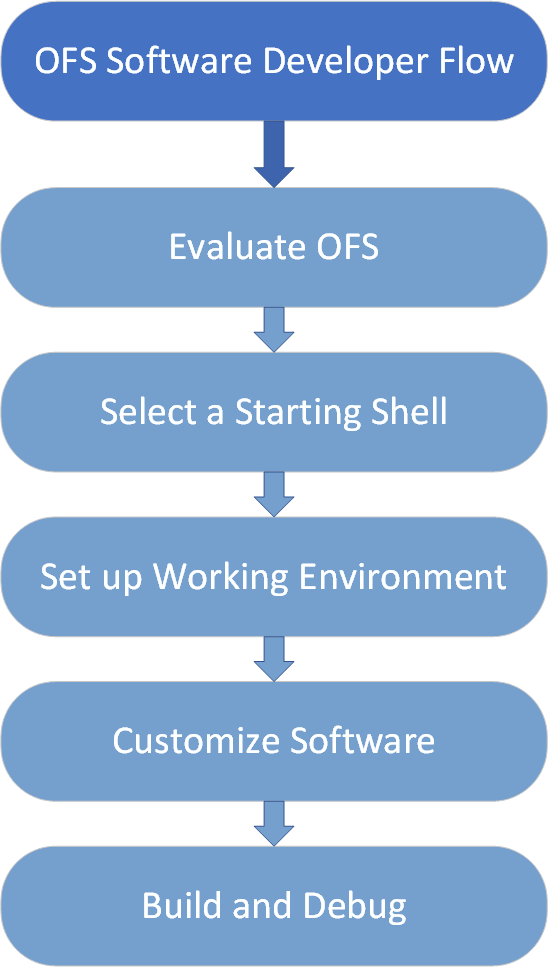
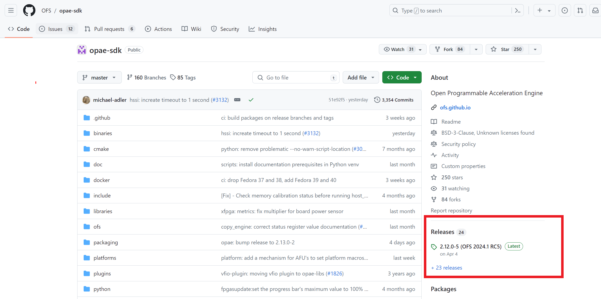

# **Software Developer Journey Guide: Open FPGA Stack**

Last updated: **February 26, 2025** 

## **1 Introduction**

This document is intended to help you understand the FPGA Software developer flow using OFS as well as considerations you should take when creating custom software.

After reviewing the document, you shall be able to:

* Understand how to evaluate the OFS framework for your platform needs.
* Know where to find installation and build instructions for the OFS software stack.
* Understand what resources are available for guiding you through making modifications and for debug.

The general development flow is depicted in the diagram below and discussed in more detail in each section of this document.

**Figure 1-1: SW Developer Flow**



## **2 Evaluate OFS**

The repositories in the OFS site are tagged based on year and release number.  For example, a tag of 2024.3-1 indicates the first release package of the quarter.  If there are updates to this release package, the last number will be incremented by 1, such as 2024.3-2. Not all repositories follow the exact same naming scheme; both the OPAE SDK user space software and Linux DFL Backport kernel driver repository tags differ from their hardware counterparts. See the below table for a summary of the most recent release versions for each software component:

**Table 1: Combined OPAE and Platform Version Summary**

The OPAE SDK repository is located at [https://github.com/OFS/opae-sdk](https://github.com/OFS/opae-sdk).

|Component|Platform|Most Recent Release|
|-----|-----|-----|
|OPAE SDK| Intel® FPGA SmartNIC N6000-PL| 2.14.0-2|
|OPAE SDK| Intel® FPGA SmartNIC N6001-PL| 2.14.0-2|
|OPAE SDK| Agilex™ 7 FPGA F-Series Development Kit (2x F-Tile)| 2.14.0-2|
|OPAE SDK| Agilex™ 7 FPGA I-Series Development Kit (2x R-Tile and 1xF-Tile)| 2.14.0-2|
|OPAE SDK| Intel® FPGA PAC D5005|2.12.0-5 |
|OPAE SDK| IPU Platform F2000X-PL| 2.12.0-5|

**Table 2: Combined DFL and Platform Version Summary**

The Linux DFL repository is located at [https://github.com/OFS/linux-dfl](https://github.com/OFS/linux-dfl), the backport repository is located at [https://github.com/OFS/linux-dfl-backport](https://github.com/OFS/linux-dfl-backport).

|Component|Platform|Most Recent Release|
|-----|-----|-----|
|Linux DFL| Intel® FPGA SmartNIC N6000-PL| intel-1.12.0-1|
|Linux DFL| Intel® FPGA SmartNIC N6001-PL| intel-1.12.0-1|
|Linux DFL| Agilex™ 7 FPGA F-Series Development Kit (2x F-Tile)| intel-1.12.0-1|
|Linux DFL| Agilex™ 7 FPGA I-Series Development Kit (2x R-Tile and 1xF-Tile)|intel-1.12.0-1 |
|Linux DFL| Intel® FPGA PAC D5005| ofs-2024.1-6.1-2|
|Linux DFL| IPU Platform F2000X-PL|ofs-2024.1-6.1-2 |

Not all OFS releases will support all OFS enabled hardware platforms. Review the official OFS release pages at [https://github.com/OFS/ofs-agx7-pcie-attach/releases](https://github.com/OFS/ofs-agx7-pcie-attach/releases) for PCIe Attach and [https://github.com/OFS/ofs-f2000x-pl/releases](https://github.com/OFS/ofs-f2000x-pl/releases) for SoC Attach.

By clicking on the release link to the right side of the GitHub web page in either of the software repositories, you will find the latest release, the tag number and release notes.

**Figure 2-1: OFS Repository Release Page Link**



By scrolling to the end of the release page, you will find assets attached to the release that you can leverage for quick evaluation of OFS, such as FPGA binary files, POFs and SOFs, sample AFUs, and pre-compiled binaries for the OFS software stack.

Before evaluating an OFS product, you will need to choose a platform and associated software release that supports it. Each OFS enabled platform has an associated **Getting Started Guide**, alongside the **Software Installation Guidelines** and **Board Installation Guidelines**. The Getting Started Guide will provide a high level overview of the entire setup process, and guide you to the other documents as needed.

Set up your card and software in a server using the steps provided in one of the corresponding **Getting Started Guides** and leverage the appended binaries in the official OFS release repository release page under the "Assets" tab to preview the software and design functionality the OFS framework out of the box. **Getting Started Guides** are available for the following FIM(shell) designs:

* [Getting Started Guide: OFS for Agilex™ 7 PCIe Attach FPGAs (Intel® FPGA SmartNIC N6001-PL/N6000-PL)](https://ofs.github.io/latest/hw/n6001/user_guides/ug_qs_ofs_n6001/ug_qs_ofs_n6001/)
* [Getting Started Guide: OFS for Agilex™ 7 PCIe Attach FPGAs (F-Series Development Kit (2xF-Tile))](https://ofs.github.io/latest/hw/ftile_devkit/user_guides/ug_qs_ofs_ftile/ug_qs_ofs_ftile/)
* [Getting Started Guide: OFS for Agilex™ 7 PCIe Attach FPGAs (I-Series Development Kit (2xR-Tile, 1xF-Tile))](https://ofs.github.io/latest/hw/iseries_devkit/user_guides/ug_qs_ofs_iseries/ug_qs_ofs_iseries/)
* [Getting Started Guide: OFS for Agilex™ 7 SoC Attach FPGAs](https://ofs.github.io/latest/hw/f2000x/user_guides/ug_qs_ofs_f2000x/ug_qs_ofs_f2000x/)
* [Getting Started Guide: OFS for Stratix 10® FPGA PCIe Attach FPGAs](https://ofs.github.io/latest/hw/d5005/user_guides/ug_qs_ofs_d5005/ug_qs_ofs_d5005/)

Every OFS release has been validated against a specific OS release. This information, alongside any recommended BIOS settings changes, can be found in the **Getting Started Guides**.

## **3 Select a Starting Shell/FIM**

To begin your development, start with an existing shell that most closely matches your device and end solution. The OFS site has both Agilex™ 7 and Stratix 10 FPGA reference designs you can use as a starting point for your own design. These designs can be ported to different device OPNs if a different resource utilization is required, although that will not be covered here.

To begin you may want to learn more about Intel Stratix 10 and Agilex™ 7 family offerings.  Please refer to the following links:

* [Agilex™ 7 Product Page](https://www.intel.com/content/www/us/en/products/details/fpga/agilex/7.html)
* [Intel Stratix 10 Product Page](https://www.intel.com/content/www/us/en/products/details/fpga/stratix/10.html)

In this document, we assume you have downloaded and configured your device with the appropriate pre-compiled binary image for your chosen OFS release and platform without any further customization. For more information on your OFS Shell design and its available key features go to [https://ofs.github.io/latest](https://ofs.github.io/latest), choose your shell design on the top navigation bar, and select the **Shell Technical Reference Manual** and **Shell Developer Guide**. You can also review the [FPGA Developer Journey Guide: Open FPGA Stack](./../ug_fpga_developer/ug_fpga_developer.md) document.

## **4 Software Documentation**

The [**Software Reference Manual: Open FPGA Stack**](https://ofs.github.io/latest/hw/common/reference_manual/ofs_sw/mnl_sw_ofs/) provides a complete picture of the OPAE SDK code API alongside concepts you will need to know when developing user space application and driver code. OPAE provides API bindings in C, C++, and Python, although not all functions are supported across languages. Section **13.0 Building a Sample Application** provides example application code and build steps that can be used as a quick reference.

You also have the OPAE FPGA Tools available to use for deployment and debug, provided you have set up your environment to work with OFS platforms. These tools can monitor device status, program new PR or statically compiled images, probe CSR space and run basic peripheral exercisers to validate functionality. They can also be used to quickly bind / unbind your device from specific drivers. A full description of the capabilities of these commands can be found on the [OFS Site](https://ofs.github.io/latest/hw/common/reference_manual/ofs_sw/mnl_sw_ofs/), with shorter descriptions provided in the **Getting Started User Guides**.

The [OPAE SDK repository](https://github.com/OFS/opae-sdk) contains all of the source code for plugins needed for each supported OFS platform. Review section **2.3 Plugin Manager** of the Software Reference Manual for further reading on the topic of plugins and where they fit into the OFS stack architecture.

An older documentation repository that stopped being the primary API resource after OPAE 2.3.0 can be found at [https://opae.github.io/latest/index.html](https://opae.github.io/latest/index.html). The information in this repo should be considered out of date unless using a legacy version of the OPAE SDK software.

The [Linux DFL Wiki](https://github.com/OFS/linux-dfl/wiki) page provides and introduction to the topics and design philosophy that goes into DFL enabled driver creation. DFL driver documentation has also been upstreamed into the Linux kernel and can be found under [Documentation/fpga/dfl.rst](https://git.kernel.org/pub/scm/linux/kernel/git/torvalds/linux.git/tree/Documentation/fpga/dfl.rst?h=master).

The below picture demonstrates the structure of the OFS stack stack at a high level:


## **5 Setup Your Environment For Development**

Before beginning development you will need to ensure you have OFS setup requirements satisfied by reviewing instructions in the corresponding **Software Installation Guidelines**.

For any additional software you plan on using in conjunction with OPAE and DFL - for example, DPDK and IPDK - refer to that software solution's installation guidelines, and make sure your environment has been properly initialized.

All OFS repositories are open source and do not require permissions to clone.

The primary component of the OFS software stack that must be installed before developing any application is the **OPAE SDK**. Additionally, if you plan on testing your applications on hardware then the **DFL driver** set must also be installed. All **Getting Started User Guides** will point you to the correct location for install steps relevant to a given platform.

## **6 Pick a Reference**

Before beginning development of a new driver or user space software application, it can help to find an already existing piece of code that can help guide your development.

If looking to write user space application code that uses the OPAE SDK API, we provide a series of sample applications under the [/opae/samples](https://github.com/OFS/opae-sdk/tree/master/samples) directory. These cover a wide range of topics, including taking advantage of CXL, built-in host exercisers, HSSI, and AFU and FIM event checking. If you have never written an application before you should review [hello_afu](https://github.com/OFS/opae-sdk/tree/master/samples/hello_afu) and its included README.

Driver code samples vary widely depending on their implementation and the needs of the associated IP, sometimes being split into multiple source files. The [8250 DFL UART IP Driver](https://github.com/OFS/linux-dfl/blob/fpga-ofs-dev-6.6-lts/drivers/tty/serial/8250/8250_dfl.c) represents a minimal driver implementation, and clearly demonstrates where IP specific implementation ends and DFL framework integration begins. This driver calls into the existing UART driver framework, while providing the bus "glue" logic for core DFL functionality (specifically, the line `dfluart->line = serial8250_register_8250_port(&uart);` is where the driver calls into the existing Linux kernel 8250 driver framework).

A second driver example you can review is the [DFL specific implementation](https://github.com/OFS/linux-dfl/blob/fpga-ofs-dev-6.6-lts/drivers/spi/spi-altera-dfl.c) of a generic SPI driver. Where again the line `err = devm_spi_register_controller(dev, host);` is used to register this device with the SPI framework provided by the kernel, while also calling upon DFL framework specific constructs such as the FEATURE_ID and FME_ID to properly identify the device based on its DFH.

## **7 OPAE SDK Application Build and Debug**

Building an OPAE application involves linking your source code with the OPAE libraries. A minimal build command using *gcc* is provided below as a reference for an application using the C API. The API uses some features from the C99 language standard. The `-std=c99` switch is required if the compiler does not support C99 by default.

This library internally uses `libuuid` and `libjson-c`. But they are not distributed by it. Make sure you have these libraries properly installed. The `-c` flag may not be necessary depending on the platform being used.

```bash
gcc -std=c99 hello_fpga.c -I/usr/local/include -L/usr/local/lib -lopae-c -luuid -ljson-c -lpthread -o hello_fpga
```

The OPAE SDK has a built-in debug logging facility.  To enable it, set the cmake flag `-DCMAKE_BUILD_TYPE=Debug` and then use the following environment variables:

| Variable| Description|
| ----- | ----- |
|LIBOPAE_LOG=1|	Enable debug logging output.  When not set, only critical error messages are displayed.|
|LIBOPAE_LOGFILE=file.log|	Capture debug log output to file.log.  When not set, the logging appears on stdout and stderr.  The file must appear in a relative path or it can be rooted at /tmp.|

To enable *gdb*-based debugging, the cmake configuration step must specify a value for *-DCMAKE_BUILD_TYPE* of either Debug or RelWithDebInfo so that debug symbols are included in the output binaries. The OPAE SDK makes use of dynamically-loaded library modules.  When debugging with *gdb*, the best practice is to remove all OPAE SDK libraries from the system installation paths to ensure that library modules are only loaded from the local build tree:

```bash
$ cd opae-sdk/build
$ LD_LIBRARY_PATH=$PWD/lib gdb --args <some_opae_executable> <args>
```

## **8 Test and Deploy**

Deployment of an AFU or statically compiled FIM+AFU image is detailed in the associated **Getting Started User Guide** for a given platform. If you wish to deploy your application into a VM or docker image you can review the [Virtual machine User Guide: Open FPGA Stack + KVM](../ug_kvm/ug_kvm.md) and the Docker user guide, located under the [Virtualization](https://ofs.github.io/latest/hw/doc_modules/contents_agx7_pcie_attach/) header of your chosen platform.

When testing a custom written user space application, you can use the following procedure:

1. Build and compile application with debug/GDB flags
2. Configure FPGA with AFU or static image using `fpgasupdate`, or JTAG flow
3. Verify the hardware has been properly configured with `fpgainfo`
4. Double check that your FPGA is attached to the correct driver with `opae.io ls`
    4.a. If not, you can swap between *dfl-pci* and *vfio-pci* with `opae.io bind/unbind`
5. Run your application
6. Customize, rebuild and redeploy as needed

## Notices & Disclaimers

Altera® Corporation technologies may require enabled hardware, software or service activation. No product or component can be absolutely secure. Performance varies by use, configuration and other factors. Your costs and results may vary. You may not use or facilitate the use of this document in connection with any infringement or other legal analysis concerning Altera or Intel products described herein. You agree to grant Altera Corporation a non-exclusive, royalty-free license to any patent claim thereafter drafted which includes subject matter disclosed herein. No license (express or implied, by estoppel or otherwise) to any intellectual property rights is granted by this document, with the sole exception that you may publish an unmodified copy. You may create software implementations based on this document and in compliance with the foregoing that are intended to execute on the Altera or Intel product(s) referenced in this document. No rights are granted to create modifications or derivatives of this document. The products described may contain design defects or errors known as errata which may cause the product to deviate from published specifications. Current characterized errata are available on request. Altera disclaims all express and implied warranties, including without limitation, the implied warranties of merchantability, fitness for a particular purpose, and non-infringement, as well as any warranty arising from course of performance, course of dealing, or usage in trade. You are responsible for safety of the overall system, including compliance with applicable safety-related requirements or standards. © Altera Corporation. Altera, the Altera logo, and other Altera marks are trademarks of Altera Corporation. Other names and brands may be claimed as the property of others.

OpenCL* and the OpenCL* logo are trademarks of Apple Inc. used by permission of the Khronos Group™.


