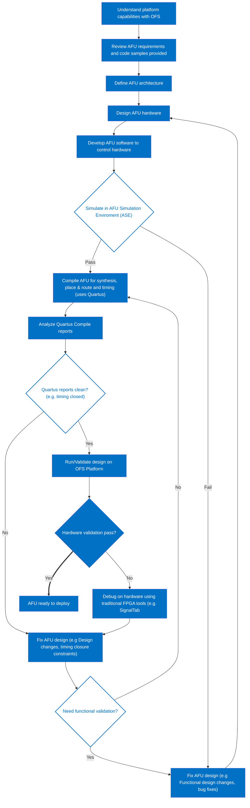
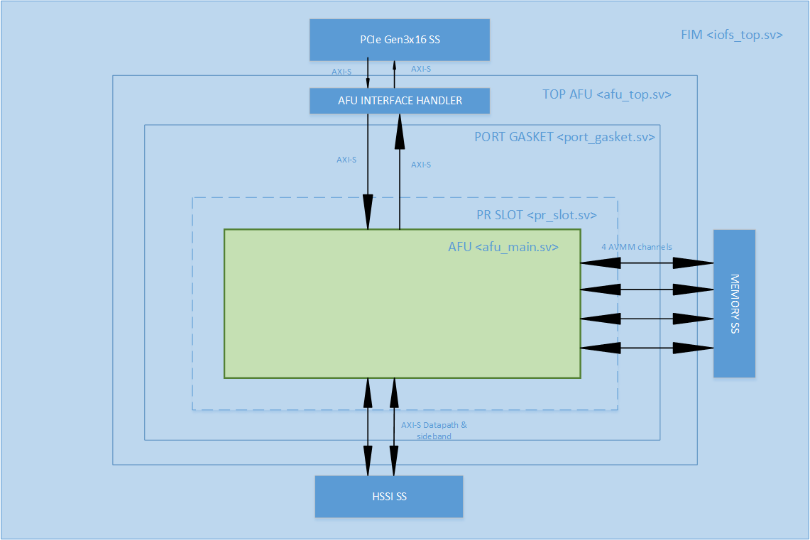
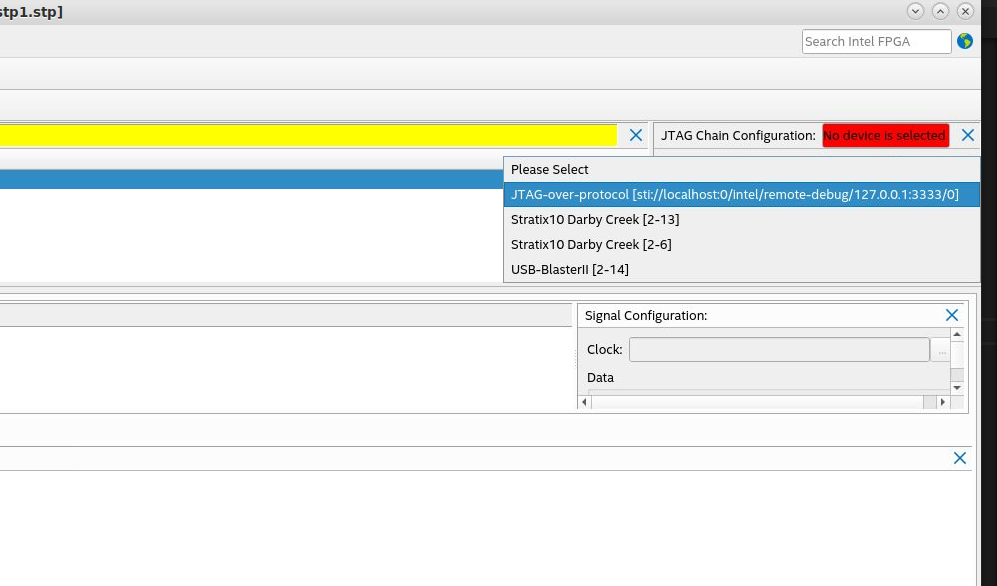

Accelerator Functional Unit Developer Guide: Open FPGA Stack for Intel® Stratix 10®
====


# 1. Introduction

<a name="introduction"></a>

This document is a design guide for creating an Accelerator Functional Unit (AFU) using Open FPGA Stack (OFS) for Intel® Stratix 10® FPGA. The AFU concept consists of separating the FPGA design development process into two parts, the FIM and AFU, as shown in the diagram below:


</br></br>

This diagram shows the FPGA board interface development separation from the internal FPGA workload creation. This separation starts with the FPGA Interface Manager (FIM), which consists of the external interfaces and board management functions. The FIM is the base system layer typically provided by board vendors. The FIM interface is specific to a particular physical platform. The AFU uses the external interfaces with user-defined logic to perform a specific application. Separating the lengthy and complicated process of developing and integrating external interfaces for an FPGA into a board allows the AFU developer to focus on their workload needs.  Intel® OFS for Intel® Stratix 10® FPGA provides the following tools for rapid AFU development:

- Scripts for both compilation setup
- Integration with Open Programmable Acceleration Engine (OPAE) SDK for rapid software development for your AFU application

Please notice that the AFU region consists of both static and PR logic in the above block diagram. Creating AFU logic for the static region is described in [Intel® FPGA Interface Manager Developer Guide: Open Stack for Intel® Stratix 10®] . This guide covers logic in the AFU Main (PR) region.


## 1.1 Document Organization
<a name="Document_Organization"></a>
This document is organized as follows:

- Description of design flow
- Interfaces and functionality provided in the Intel® FPGA PAC D5005 FIM
- Downloading and installing Intel® OFSand OPAE SDK
- Hardware/Software co-simulation using ASE
- Testing the AFU example in Intel® FPGA PAC D5005
- Debugging an AFU with Remote Signal Tap

This guide provides theory followed by tutorial steps to solidify your AFU development knowledge.

This guide uses the Intel® FPGA PAC D5005 as the platform for all tutorial steps. Additionally, this guide and the tutorial steps can be used with other platforms; However, please consult the **board** and FIM supplier of other platforms for specific instructions on the use of custom FIM to develop  AFU design.

If you have worked with previous Intel® Programmable Acceleration products, you will find OFS for Intel® Stratix 10® FPGA is similar; however, there are differences, and you are advised to carefully read and follow the tutorial steps to understand the design tools and flow fully.


Glossary 
== 
| Term     | Description                                                  |
| -------- | ------------------------------------------------------------ |
| AER | Advanced Error Reporting, The PCIe AER driver is the extended PCI Express error reporting capability providing more robust error reporting. |
| AFU      | Accelerator Functional Unit, Hardware Accelerator implemented in FPGA logic which offloads a computational operation for an application from the CPU to improve performance. Note: An AFU region is the part of the design where an AFU may reside. This AFU may or may not be a partial reconfiguration region |
| BBB | Basic Building Block, Features within an AFU or part of an FPGA interface that can be reused across designs. These building blocks do not have stringent interface requirements like the FIM's AFU and host interface requires. All BBBs must have a (globally unique identifier) GUID. |
| BKC      | Best Known Configuration, The exact hardware configuration Intel has optimized and validated the solution against. |
| BMC      | Board Management Controller, Acts as the Root of Trust (RoT) on the Intel FPGA PAC platform. Supports features such as power sequence management and board monitoring through on-board sensors. |
| CSR | Command/status registers (CSR) and software interface, OFS uses a defined set of CSR's to expose the functionality of the FPGA to the host software. |
| DFL      | Device Feature List, A concept inherited from OFS. The DFL drivers provide support for FPGA devices that are designed to support the Device Feature List. The DFL, which is implemented in RTL, consists of a self-describing data structure in PCI BAR space that allows the DFL driver to automatically load the drivers required for a given FPGA configuration. |
| FIM      | FPGA Interface Manager, Provides platform management, functionality, clocks, resets and standard interfaces to host and AFUs. The FIM resides in the static region of the FPGA and contains the FPGA Management Engine (FME) and I/O ring. |
| FME      | FPGA Management Engine, Provides a way to manage the platform and enable acceleration functions on the platform. |
| HEM      | Host Exerciser Module, Host exercisers are used to exercise and characterize the various host-FPGA interactions, including Memory Mapped Input/Output (MMIO), data transfer from host to FPGA, PR, host to FPGA memory, etc. |
| Intel FPGA PAC D5005 | Intel FPGA Programmable Acceleration Card D5005, A high performance PCI Express (PCIe)-based FPGA acceleration card for data centers. This card is the target platform for the initial OFS release. |
| Intel VT-d | Intel Virtualization Technology for Directed I/O, Extension of the VT-x and VT-I processor virtualization technologies which adds new support for I/O device virtualization. |
| IOCTL | Input/Output Control, System calls used to manipulate underlying device parameters of special files. |
| JTAG     | Joint Test Action Group, Refers to the IEEE 1149.1 JTAG standard; Another FPGA configuration methodology. |
| MMIO | Memory Mapped Input/Output, Users may map and access both control registers and system memory buffers with accelerators. |
| OFS      | Open FPGA Stack, A modular collection of hardware platform components, open source software, and broad ecosystem support that provides a standard and scalable model for AFU and software developers to optimize and reuse their designs. |
| OPAE SDK | Open Programmable Acceleration Engine Software Development Kit, A collection of libraries and tools to facilitate the development of software applications and accelerators using OPAE. |
| PAC | Programmable Acceleration Card: FPGA based Accelerator card |
| PIM      | Platform Interface Manager, An interface manager that comprises two components: a configurable platform specific interface for board developers and a collection of shims that AFU developers can use to handle clock crossing, response sorting, buffering and different protocols. |
| PR       | Partial Reconfiguration, The ability to dynamically reconfigure a portion of an FPGA while the remaining FPGA design continues to function. In the context of Intel FPGA PAC, a PR bitstream refers to an Intel FPGA PAC AFU. Refer to [Partial Reconfiguration](https://www.intel.com/content/www/us/en/programmable/products/design-software/fpga-design/quartus-prime/features/partial-reconfiguration.html) support page. |
| RSU      | Remote System Update, A Remote System Update operation sends an instruction to the Intel FPGA PAC D5005 device that triggers a power cycle of the card only, forcing reconfiguration. |
| SR-IOV | Single-Root Input-Output Virtualization, Allows the isolation of PCI Express resources for manageability and performance. |
| TB | Testbench, Testbench or Verification Environment is used to check the functional correctness of the Design Under Test (DUT) by generating and driving a predefined input sequence to a design, capturing the design output and comparing with-respect-to expected output. |
| UVM | Universal Verification Methodology, A modular, reusable, and scalable testbench structure via an API framework. |
| VFIO | Virtual Function Input/Output, An IOMMU/device agnostic framework for exposing direct device access to userspace. |


## 1.2 Prerequisite
<a name="PrerequisiteH"></a>
This guide assumes you understand the following FPGA logic design-related knowledge and skills:

- FPGA compilation flows, including the  Intel® Quartus® Prime Pro Edition design flow.
- Static Timing closure, including familiarity with the Timing Analyzer tool in  Intel® Quartus® Prime Pro Edition software, applying timing constraints, Synopsys* Design Constraints (.sdc) language and Tcl scripting, and design methods to close on critical timing paths.
- RTL and coding practices to create synthesized logic.
- High-level synthesis (HLS) and Platform Designer design entry tools are supported.
- RTL simulation tools.
- Signal Tap Logic Analyzer tool in the  Intel® Quartus® Prime Pro Edition software.

### 1.2.1 Development Environment
<a name="DevelopmentEnvironment"></a>
To run the tutorial steps in this guide requires this **development** environment:

| Item                          | Version         |
| ------------------------- | ---------- |
|  Operating System   | RHEL 8.2 |
| Python    | 3.7.7 |
| cmake     | 3.11.4 |
| GCC       | 7.2.0 |
| git       | 1.8.3.1 |
| perl      | 5.8.8 |

Verify your development has the above tools installed.


The following server and Intel® PAC card are required to run the examples in this guide:

1. Intel® FPGA PAC D5005 with root entry hash erased (Please contact Intel® for root entry hash erase instructions). The standard Intel® FPGA PAC D5005 card is programmed only to allow the FIM binary files signed by Intel® to be loaded. The root entry hash erases process will allow unsigned FIM binary files to be loaded.
2. Qualified Server Models see [Qualified Servers].
3. Intel® FPGA PAC D5005 installed in the qualified server following instructions in [OFS Getting Started User Guide]

## 1.3 Acceleration Functional Unit (AFU) Development Flow
<a name="afu_development_flow"></a>

OFS Stack provides a rapid design methodology for creating complex FPGA applications. In addition, you are provided with the following:

- Hardware shell layer, known as FIM 
- Software stack including tools for debug/diagnostics
- FPGA design flow  with full-stack simulation support
- AFU code samples demonstrating all interfaces

For any non-Intel® platform, contact your board vendor for the above components specific to the platform.
To start with AFU development, the first step should be to understand your platform capabilities. For example, what interface is the FPGA connected to the Host machine over PCI-E, if it is AXI like the Intel® Stratix 10® FPGA Platform, or CCIP or CXL. Does the platform provide an External Memory Interface or the HSSI interface? Once you know what the platform offers, you can develop your AFU requirements and architecture as the next step. 
This document will cover example AFU architecture and things that will help build AFU for Intel® Stratix 10® FPGA reference platform and others coming in the future. In addition, this knowledge can be relatively applied for AFU development on other vendor-provided platforms.

The figure below shows a typical AFU development process independent of the platform used. 

<br>



### 1.3.1. High Level Data Flow
<a name="HighLevelDataFlow"></a>

The OFShigh-level data flow is shown below:

The control and data are composed of the following:

* Host Interface Adapter (PCIe)
* Low-Performance Peripherals
  * Slow speed peripherals (I2C, Smbus, etc)
  * Management peripherals (FME)

* High-Performance Peripherals
  * Memory peripherals
  * Acceleration Function peripherals
  * HPS Peripheral

* Fabrics
   * Peripheral Fabric (multi-drop)
   * AFU Streaming fabric (point to point)

Peripherals are connected using AXI or Avalon:

* Via the peripheral fabric (AXI4-Lite, multi-drop)
* Via the AFU streaming fabric (AXI-S, point to point)

Peripherals are presented to software as:

* OFS managed peripherals that implement DFH CSR structure.  
* Native driver managed peripherals (i.e., Exposed via an independent PF, VF)

The peripherals connected to the peripheral fabric are primarily OPAE managed resources, whereas the peripherals connected to the AFU are "primarily" driven by native OS drivers. The word "primarily" is used since the AFU is not mandated to expose all its peripherals to Intel® OPAE. Instead, it can be connected to the peripheral fabric but can choose to expose only a subset of its capability to OPAE.

OFS uses a defined set of CSRs to expose the functionality of the FPGA to the host software. These registers are described in [Open FPGA Stack Reference Manual - MMIO Regions section].

If you make changes to the FIM that affect the software operation, Intel® OFS provides a mechanism to communicate that information to the proper software driver. The [Device Feature Header (DFH) structure] provides a mechanism to maintain compatibility with OPAE software. Please see [FPGA Device Feature List (DFL) Framework Overview] for an excellent description of DFL operation from the driver perspective.

When planning your address space for your FIM updates, please be aware OFS FIM targeting Intel® FPGA PAC D5005, 256KB of MMIO region is allocated for external FME features, and 128kB of MMIO region is given for external port features. Each external feature must implement a feature DFH, and the DFH needs to be placed at the 4KB boundary. The last feature in the external feature list must have the EOL bit in its DFH set to 1 to mark the end of the external feature list. Since the FPGA address space is limited, consider using an indirect addressing scheme to conserve address space.


### 1.3.2. Considerations for PIM Usage
<a name="PIMUsage"></a>

An early decision for your AFU development is determining if the PIM will be included in your design flow. The PIM is an abstraction layer, enabling partial AFU portability across hardware despite variations in hardware topology and native interfaces. Use of the PIM is optional for AFU development. The use of the PIM adds a level of logic between an accelerator (an AFU) and the platform (the FIM). It is a collection of System Verilog interfaces and shims. Please see [Connecting an AFU to a Platform using PIM] for details on using the PIM and its capabilities. Please see [PIM Tutorial] for a detailed tutorial on using PIM. The learning steps [PIM Tutorial] can be run with Intel® OFS for Intel® Stratix 10® FPGA FIM package after you have installed this package as described later in this guide.  

If you choose not to use the PIM, please see [Non-PIM AFU Development] for instructions on using a traditional RTL design flow. Note, the example AFU provided in Intel® OFS does not include PIM.

### 1.3.3 AFU Interfaces Included with Intel® FPGA PAC D5005
<a name="AFUInterfacesIncluded"></a>

The figure below shows the interfaces available to the AFU in this architecture. It also shows the design hierarchy with module names from the FIM (top.sv) to the PR  region AFU (afu_main.sv). One of the main differences from the previous Intel® Stratix 10® FPGA OFS architecture is a static port gasket region (port_gasket.sv) that has components to facilitate the AFU and also consists of the GBS region (afu_main.sv) via the PR  slot. The Port Gasket contains all the PR -specific modules and logic, e.g., PR  slot reset/freeze control, user clock, remote STP etc. Architecturally, a Port Gasket can have multiple PR  slots to which user workload can be programmed. However, only one PR  slot is supported for Intel® OFS Release for Intel® Stratix 10® FPGA. Therefore, everything in the Port Gasket until the PR  slot should be provided by the FIM developer. The task of the AFU developer is to add their desired application in the afu_main.sv module by stripping out unwanted logic and instantiating the target accelerator. As shown in the figure below, here are the interfaces connected to the AFU (highlighted in green) via Intel® FPGA PAC D5005 FIM:

* AXI Streaming (AXI-S) interface to the Host via PCIe Gen3x16
* Avalon Memory-Mapped Channels (4) to the DDR4 EMIF interface
* AXI Streaming (AXI-S) interface to the HSSI 10G Ethernet



### 1.3.4. Platform Capabilities
<a name="PlatformCapabilities"></a>
The FIM targets operation in the Intel® FPGA PAC D5005 card.  The block diagram of the Intel® FPGA PAC D5005 is shown below:


The key Intel® FPGA PAC D5005 FPGA interfaces are:

- Host interface 
    - PCIe Gen3 x 16
- Network interface
  - 2 - QSFP28 cages
  - Current FIM supports 1 x 10 GbE, other interfaces can be created  
- External Memory
  - 2 or 4 channels of DDR4-2400 to RDIMM modules
  - RDIMM modules =  8GB organized as 1 Gb X 72
- Board Management
  - SPI interface
  - FPGA configuration
  
### 1.3.5. Top Level FPGA
<a name="TopLevelFPGA"></a>
The internal FPGA architecture is shown below:


# 2. Set Up AFU Development Environment
<a name="SetUpAFUDevelopment"></a>
This section covers:

* Development environment set up
* Retrieving and installing OFS, OPAE SDK
*  Building theIntel® FPGA PAC D5005 FIM
* Building a relocatable AFU tree
* Compiling the host_chan_mmio example AFU

Additionally, this section includes steps to demonstrate loading and running the host_chan_mmio example AFU in an Intel® FPGA PAC D5005 equipped Linux server.


## 2.1. Prepare AFU development environment

<a name="compile_fim"></a>

Typical development and hardware test environments consist of a development server or workstation with installed FPGA development tools and a separate server installed with the target OFS-compatible FPGA PCIe card. The typical usage and flow of data between these two servers are shown below:


Please refer to Unit Level Simulation if you would like to make any simulation [Unit Level Simulation].

Note that both development and hardware testing can be performed on the same server if desired.

This guide uses Intel® FPGA PAC D5005 as the target OFS-compatible FPGA PCIe card platform for demonstration steps. The Intel® FPGA PAC D5005 must be fully installed following [OFS Getting Started User Guide] If using a different OFS FPGA PCIe card, contact your supplier for instructions on how to install and operate a user-developed AFU.


> **_NOTE:_**  
>
>The following chapters assume you use the same server for development and Deployment (Run the FIM/AFU/SW over the Intel® FPGA PAC D5005):
>
>Development: Modify the FIM/AFU/SW run simulation and compile the design (Generate the binaries). 
>Deployment: Program the binaries under the Intel® FPGA PAC D5005 and exercise the Hardware and Sw with real hardware
>
>

### 2.1.1. Installation of Quartus and OFS
<a name="InstallationQuartus"></a>
Building AFU with OFS forIntel® Stratix 10® FPGA requires the build machine to have at least 64 GB of RAM.  

The following is a summary of the steps to set up for AFU development:

1. Install  Intel® Quartus® Prime Pro Edition  22.3 Linux with Intel® Stratix 10® FPGA device support.
2. Make sure support tools are installed and meet version requirements.
3. Clone the repository.
4. Review the files provided in the repository.
5. Build a relocatable PR  tree - this will be the base FIM for your AFU.

 Intel® Quartus® Prime Pro Edition version  22.3 is the currently verified version of  Intel® Quartus® Prime Pro Edition 22.3 used for building the AFU images. The recommended Best Known Configuration (BKC) OFS Version 2022.3:

| Item                          | Version         |
| ------------------------- | ---------- |
|  Intel® Quartus® Prime Pro Edition   |  22.3  |
| Operating System   | RHEL 8.2 |
| OPAE SDK   |  [2.3.0-1](https://github.com/OFS/opae-sdk/tree/2.3.0-1 )  |
| OFS Release | [ofs-d5005-1.0.1](https://github.com/OFS/ofs-d5005/releases/tag/ofs-d5005-1.0.1) |
| Python    | 3.7.7 |
| cmake     | 3.11.4 |
| GCC       | 7.2.0 |
| git       | 1.8.3.1 |
| perl      | 5.8.8 |


#### 2.1.1.1 Installation of Quartus
<a name="InstallationQuartusIntro"></a>

1. Download [Intel® Quartus® Prime Pro Edition Linux].

2. After running the  Intel® Quartus® Prime Pro Edition version  22.3 installer, set the PATH environment variable to make utility `quartus`, `jtagconfig`, and `quartus_pgm` discoverable. Edit your bashrc file `~/.bashrc` to add the following line:


```Bash
export QUARTUS_MAINPATH=<Quartus install directory>
export QUARTUS_ROOTDIR=$QUARTUS_MAINPATH/quartus
export QUARTUS_HOME=$QUARTUS_ROOTDIR
export QUARTUS_INSTALL_DIR=$QUARTUS_ROOTDIR
export IMPORT_IP_ROOTDIR=$QUARTUS_ROOTDIR/../ipexport
export IP_ROOTDIR=$QUARTUS_ROOTDIR/../ip
export INTELFPGAOCLSDKROOT=$QUARTUS_MAINPATH/hld
export QSYS_ROOTDIR=$QUARTUS_MAINPATH/qsys/bin
export PATH=$PATH:$QUARTUS_ROOTDIR/bin
```

For example:

```Bash
export QUARTUS_MAINPATH=/home/<mylocaluser>/intelFPGA_pro/22.3
export QUARTUS_ROOTDIR=$QUARTUS_MAINPATH/quartus
export QUARTUS_HOME=$QUARTUS_ROOTDIR
export QUARTUS_INSTALL_DIR=$QUARTUS_ROOTDIR
export IMPORT_IP_ROOTDIR=$QUARTUS_ROOTDIR/../ipexport
export IP_ROOTDIR=$QUARTUS_ROOTDIR/../ip
export INTELFPGAOCLSDKROOT=$QUARTUS_MAINPATH/hld
export QSYS_ROOTDIR=$QUARTUS_MAINPATH/qsys/bin
export PATH=$PATH:/home/intelFPGA_pro/22.3/quartus/bin
```


3. Verify that  Intel® Quartus® Prime Pro Edition is discoverable by opening a new shell:

```Bash
$ which quartus
/home/<mylocaluser>/intelFPGA_pro/22.3/quartus/bin/quartus
```


> **_NOTE:_**  
>
>Ensure your proxy is set up if you use an intranet network.
>
>```Bash
>export no_proxy=<yourproxy>
>export http_proxy=<yourproxy>
>export https_proxy=<yourproxy>
>```
>

---
**Useful resources**

[Intel® FPGA Software Licenses](https://www.intel.com/content/www/us/en/support/programmable/licensing/quartus-licenses.html) \
[Intel® FPGA Software Installation and Licensing manual](https://www.intel.com/content/www/us/en/docs/programmable/683472/22-3/introduction-to-fpga-software-installation.html) 

Cloning the repo using the HTTPS method requires a personal access token. Please see this blog post for information about obtaining a personal access token, [Github Creating a personal access token](https://docs.github.com/en/authentication/keeping-your-account-and-data-secure/creating-a-personal-access-token).

---


> **_Console Output:_**  
>```sh
>quartus_syn --version
>Quartus Prime Synthesis
>Version 22.3.0 Build 104 09/14/2022 SC Pro Edition
>Copyright (C) 2022  Intel Corporation. All rights reserved.
>```
>   

#### 2.1.1.2. Install OFS
<a name="InstallationOFSIntro"></a>
1. Retrieve OFS repositories:

    The Intel® OFS FIM source code is included in the OFS GitHub repository. First, create a new directory to store the retrieved files as a clean starting point. The following is a short description of each repository, followed by the git commands for cloning. The instructions section uses the HTTPS git method for cloning repositories.  

2. Navigate to the location for storage of OFS source, create the top-level source directory, and clone OFS repositories.

```sh
mkdir ofs_fim_build_root
cd ofs_fim_build_root
```
```sh
export OFS_BUILD_ROOT=$PWD
```
```sh
git clone --recurse-submodules  https://github.com/OFS/ofs-d5005.git
```

> **_Console Output:_**  
>```sh
>Cloning into 'ofs-d5005' ...
>Username for 'https://github.com': <<Enter your git hub username>>
>Password for 'https://<<Your username>>': <<Enter your personal access token>>
>remote: Enumerating objects:  ....
>...
>...
>Resolving deltas  ..., done.
>```
> 

Edit your bashrc file ~/.bashrc to add the following lines:
```sh
export OFS_ROOTDIR=$OFS_BUILD_ROOT/ofs-d5005
export WORKDIR=$OFS_ROOTDIR
export VERDIR=$OFS_ROOTDIR/verification
```
```sh
cd ofs-d5005
```

Select the latest [OFS Release]
```sh
git checkout tags/ofs-d5005-1.0.1
```

> **_Console Output:_**  
>```sh
> You are in 'detached HEAD' state. You can look around, make experimental changes and commit them, and you can discard any commits you make in this state without impacting any branches by performing another checkout.
>
>If you want to create a new branch to retain commits you create, you may do so (now or later) by using -b with the checkout command again. Example:
>
> git checkout -b <new-branch-name>
>HEAD is now at 7e4dc70 ofs-d5005-1.0.1

#### 2.1.1.3. Directory Structure of OFS
<a name="DirectoryStructureOFS"></a>
Verify the following directories in the $OFS_BUILD_ROOT directory with the following command.  

```sh   
cd  $OFS_ROOTDIR
ls
```
> **_Console Output:_**  
>```sh
> eval_scripts ipss ofs-common license  LICENSE.md  README.md  sim  src  syn  verification
>```
> 


The directories are arranged as shown below:

```sh
├── eval_scripts
│   ├── ofs_d5005_eval.sh
│   ├── README_ofs_d5005_eval.txt
|
├── ofs-common
│   ├── scripts
│   ├── src
│   ├── verification
|   ├── LICENSE.txt   
│   └── README.md
├── ipss        **Directory ipss consists of Platform Designer subsystems used in FIM**
│   ├── hssi
│   ├── mem
│   ├── pcie
|   ├── pmic 
|   ├── spi  
│   └── README.md
├── license
│   └── quartus-0.0-0.01iofs-linux.run    ** Quartus Patch with IP licenses.  
│                                         ** Note, these licenses are not used for Intel® FPGA PAC D5005** 
├── sim             **Unit level simulation files**
│   ├── unit_test
│   ├── scripts
│   ├── bfm
│   ├── rp_bfm   
│   └── readme.txt     
│    
├── LICENSE.txt
├── README.md
|
├── src             **Source RTL files**
│   ├── afu_top
│   ├── includes
│   ├── pd_qsys
│   ├── top
|   └── README.md
├── external
│   └── ofs-platform-afu-bbb
|
├── syn              **Quartus compilation settings**
│   ├── scripts
│   ├── setup
│   ├── syn_top
│   ├── readme.txt
│   └── README
```


```sh
├── eval_scripts
│   ├── ofs_d5005_eval.sh
│   ├── README_ofs_d5005_eval.txt
|
├── ofs-common
│   ├── scripts
│   ├── src
│   ├── verification
|   ├── LICENSE.txt   
│   └── README.md
├── ipss        **Directory ipss consists of Platform Designer subsystems used in FIM**
│   ├── hssi
│   ├── mem
│   ├── pcie
|   ├── pmic 
|   ├── spi  
│   └── README.md
├── license
│   └── quartus-0.0-0.01iofs-linux.run    ** Quartus Patch with IP licenses.  
│                                         ** Note, these licenses are not used for Intel® FPGA PAC D5005** 
├── sim             **Unit level simulation files**
│   ├── unit_test
│   ├── scripts
│   ├── bfm
│   ├── rp_bfm   
│   └── readme.txt     
│    
├── LICENSE.txt
├── README.md
|
├── src             **Source RTL files**
│   ├── afu_top
│   ├── includes
│   ├── pd_qsys
│   ├── top
|   └── README.md
├── external
│   └── ofs-platform-afu-bbb
|
├── verification     **Top level UVM simulation files**
│   ├── scripts
│   ├── README.d5005
│   └── regress_d5005.pl
├── syn              **Quartus compilation settings**
│   ├── scripts
│   ├── setup
│   ├── syn_top
│   ├── readme.txt
│   └── README
-->
```

#### 2.1.1.4 License Installation for OFS
<a name="LicenseInstallationOFS"></a>
The required setup Intel® OFS [License quartus-0.0-0.01iofs-linux.run], follow the following steps :

```sh
cd $OFS_ROOTDIR/license
chmod +x quartus-0.0-0.01iofs-linux.run
sudo ./quartus-0.0-0.01iofs-linux.run
# Confirm the license instaltion using below command.
quartus_syn --version
```

#### 2.1.1.5. Retrieve PIM Files
<a name="RetrievePIMFilesOFS"></a>
The ofs-platform-afu-bbb repository contains the PIM files and example AFU that can be used for testing and demonstration purposes. This guide will use the host_chan_mmio example in the remaining sections to demonstrate OFS capabilities.

```sh
cd $OFS_BUILD_ROOT
```
```sh
git clone https://github.com/OFS/ofs-platform-afu-bbb.git
```
Edit your bashrc file ~/.bashrc to add the following lines:
```sh
export OFS_PLATFORM_AFU_BBB=$OFS_BUILD_ROOT/ofs-platform-afu-bbb
```

Verify the following directories are present in $OFS_BUILD_ROOT directory.
```sh
cd $OFS_PLATFORM_AFU_BBB
```
```sh
ls
```

> **_Console Output:_**  
>```sh
> COPYING  plat_if_develop  plat_if_release  plat_if_tests  README.md
>```
> 

### 2.1.2. Compiling the OFS FIM 
<a name="CompilingOFSFIM"></a>

Intel® OFS provides a build script with the following FPGA image creation options:

- Flat compile, which combines the FIM and AFU into one FPGA image loaded into the entire FPGA device as a static image.
- A PR  compile that creates an FPGA image consisting of the FIM that is loaded into the static region of the FPGA and a default AFU that is loaded into dynamic region. Additional AFU may be loaded into the dynamic region using partial reconfiguration.  

The build scripts included with OFS are verified to run in a bash shell. Other shells have not been tested. Each build script step will take several hours to complete. Building in Quartus GUI is not supported - you must build with the provided scripts.

The following sections describe how to set up the environment and build the provided FIM with a relocatable tree supporting PR . You will use this relocatable PR  tree for all example AFU simulation and compilation steps in this guide.

#### 2.1.2.1. Setting Up Required Environment Variables
<a name="SettingUpRequiredEnvironment"></a>
Set required environment variables as shown below. These environment variables must be set before simulation or compilation tasks, so creating a simple script to set these variables saves time.

Edit your bashrc file ~/.bashrc to add the following lines:
```sh
export OPAE_SDK_REPO_BRANCH=release/2.3.0
```
> **_Check point :_**  
>Ensure you file ~/.bashrc have all the following lines:
>
>```Bash
>export QUARTUS_MAINPATH=<Quartus install directory>
>export QUARTUS_ROOTDIR=$QUARTUS_MAINPATH/quartus
>export QUARTUS_HOME=$QUARTUS_ROOTDIR
>export QUARTUS_INSTALL_DIR=$QUARTUS_ROOTDIR
>export IMPORT_IP_ROOTDIR=$QUARTUS_ROOTDIR/../ipexport
>export IP_ROOTDIR=$QUARTUS_ROOTDIR/../ip
>export INTELFPGAOCLSDKROOT=$QUARTUS_MAINPATH/hld
>export QSYS_ROOTDIR=$QUARTUS_MAINPATH/qsys/bin
>export PATH=$PATH:$QUARTUS_ROOTDIR/bin
>export OFS_BUILD_ROOT=<root location> ** Here should be located your ofs-d5005 and ofs-platform-afu-bbb
>export OFS_ROOTDIR=$OFS_BUILD_ROOT/ofs-d5005
>export WORKDIR=$OFS_ROOTDIR
>export VERDIR=$OFS_ROOTDIR/verification
>export OFS_PLATFORM_AFU_BBB=$OFS_BUILD_ROOT/ofs-platform-afu-bbb
>export OPAE_SDK_REPO_BRANCH=release/2.3.0
>```
> 

#### 2.1.2.2. Compiling Your Base FIM
<a name="CompilingYourBaseFIM"></a>
The usage of the compile build script is shown below:

```
ofs-common/scripts/common/syn/build_top.sh [-p] target_configuration work_dir 

      * target_configuration - Specifies the project  
         For example: d5005
  
      * work_dir - Work Directory for this build in the form a directory name. It is created in the <local repo directory>/ofs-d5005/<work_dir> 
          - NOTE: The directory name must start with "work". If the working directory exists, the script stops and asks if you want to overwrite the directory.
            - e.g.
                - ofs-common/scripts/common/syn/build_top.sh d5005 work_d5005
                
                work directory as a name will be created in <local repo directory>/ofs-d5005/work_d5005

                
                The obmission of <work_dir> results in a default work directory (<local repo  directory>/ofs-d5005/work)

        - compile reports and artifacts (.rpt, .sof, etc) are stored in <work_dir>/syn/<OFS_PROJECT>/<OFS_FIM>/<OFS_BOARD>/syn_top/output_files
  
        - There is a log file created in ofs-d5005 directory.  
        - [-p]  Optional switch for creating a relocatable PR  build tree supporting the creation of a PR -able AFU workload.   
        The "-p" switch invokes generate_pr_release.sh at the end of the FIM build and writes the PR  build tree to the top of the working directory. More information on this option is provided below. 
```
In the following example, you will build the provided example design using a flat, non-PR  build flow. If you use the -p, you could avoid the section.

#### 2.1.2.2.1. Relocatable PR Directory Tree.

Build the provided base example design:

```Bash
cd $OFS_ROOTDIR
```
```Bash
ofs-common/scripts/common/syn/build_top.sh d5005 work_d5005
```
> **_Console Output:_**  
>```sh
>    ... build takes ~5 hours to complete
>
>Compile work directory:     <$OFS_BUILD_ROOT>/work_d5005/syn/syn_top
>Compile artifact directory: <$OFS_BUILD_ROOT>/work_d5005/syn/syn_top/output_files
>
>
>***********************************
>***
>***        OFS_PROJECT: d5005
>***        Q_PROJECT:  d5005
>***        Q_REVISION: d5005
>***        SEED: 03
>***        Build Complete
>***        Timing Passed!
>***
>```
> 

> **_Pro Tip:_**  
> if the timing report fails, try to go into the iofs_pr_afu.qsf and modify the seed number from 3 to 4, it will create multiple seed/starting points of your design to find the best timing/fit.
> ```
> /home/<myuser>/<mainfolderforOFS>/ofs-d5005/work_d5005/syn/syn_top/iofs_pr_afu.qsf
>```
>```sh
>set_global_assignment -name SEED 0 #0-4
>```
> 


The build script copies the ipss, sim, src, and syn directories to the specified work directory, and then these copied files are used in the Quartus compilation process. Therefore, do not edit the files in the work directory; these files are copies of source files.

Some of the critical output files are described below:

$OFS_ROOTDIR/<work_dir "work_d5005">/syn/syn_top

```
├── syn_top                    //Intel® FPGA PAC D5005 Quartus build area with Quartus files used this build
│  ├── d5005.ipregen.rpt       // IP regeneration report states the output of IP upgrade
│  ├── d5005.qpf               // Quartus Project File (qpf) mentions about Quartus version and project revision
│  ├── d5005.qsf               // Quartus Settings File (qsf) lists current project settings and entity level assignments
│  ├── d5005.stp               // Signal Tap file included in the d5005.qsf. This file can be modified as required
│  ├── fme_id.mif              // the fme id hex value is stored in a mif file format
│  ├── iofs_pr_afu.json        // PR JSON file
│  ├── iofs_pr_afu.qsf                // PR AFU qsf file
│  ├── iofs_pr_afu_sources.tcl        // AFU source file list

```

$OFS_ROOTDIR/<work_dir>/syn/syn_top/output_files == Directory with build reports and FPGA programming files.

The programming files consist of the Quartus generated d5005.sof and d5005.pof. The Intel® FPGA PAC D5005 board hardware provides a 2 Gb flash device to store the FPGA programming files and a BMC CARD that reads this flash and programs the Intel® FPGA PAC D5005 Intel® Stratix 10® FPGA. The ./ofs-common/scripts/common/syn/build_top.sh script runs script file ./ofs-common/scripts/common/syn/build_top.sh which takes the Quartus generated d5005.sof and creates binary files in the proper format to be loaded into the 2 Gb flash device.  You can also run build_flash.sh by itself if needed. 

The build script will run PACSign and create an unsigned FPGA programming file for both user1 and user2 locations of the Intel® FPGA PAC D5005 flash. Please note, if the Intel® FPGA PAC D5005 has the root entry hash key loaded, then PACsign must be run to add the proper key to the FPGA binary file. Please see [Security User Guide: Intel® Open FPGA Stack for Intel® Stratix 10® FPGA] for details on the security aspects of Intel® Open FPGA Stack and refer to [BMC User Guide] for Flash partition.

The following table provides further detail on the generated bin files.

| File            | Description                        |
|-----------------|------------------------------------|
| d5005.sof | This is the Quartus generated programming file created by Quartus synthesis and place and route. This file can be used to program the FPGA using a <span title='Joint Test Action Group, Refers to the IEEE 1149.1 JTAG standard; Another FPGA configuration methodology.'>**JTAG** </span> programmer. This file is the source file for the binary files used to program the FPGA flash. |
| d5005.bin |  This is an intermediate raw binary image of the FPGA  |
| d5005_page1.bin | This is the binary file created from the input file, d5005.sof. This file is used as the input file to the PACSign utility to generate **d5005_page1_unsigned.bin** binary image file. |
| d5005_page1_unsigned.bin | This is the unsigned PACSign output which can be programmed into the FPGA flash of an unsigned Intel® FPGA PAC D5005 using the OPAE SDK utility **fpgasupdate** |
| mfg_d5005_reversed.bin | A particular programming file for a third-party device used in board manufacturing. This file is typically not used.|


build/output_files/timing_report == Directory containing clocks report, failing paths and passing margin reports


### 2.1.3. Relocatable PR Directory Tree
<a name="RelocatablePRDirectoryTree"></a>
If you are developing FIM to be used by another team developing the AFU workload, scripts are provided that create a relocatable PR  directory tree. ODM and board developers will use this capability to enable a broad set of AFU to be loaded on a board using PR . The relocatable PR  directory contains the Quartus *.qdb file that goes the FIM.

Creating the relocatable PR  directory tree requires a clone of the Intel® Basic Building Blocks (BBB) repository. The OFS_PLATFORM_AFU_BBB environment variable must point to the repository, for example.

```sh
cd $OFS_BUILD_ROOT
```
```sh
git clone https://github.com/OFS/ofs-platform-afu-bbb.git
```
```sh
cd $OFS_ROOTDIR
```

You can create this relocatable PR  directory tree by either:

* Build FIM and AFU using ofs-common/scripts/common/syn/build_top.sh followed by running /syn/common/scripts/generate_pr_release.sh (section 2.1.3. Relocatable PR Directory Tree)
* Build FIM and AFU using ofs-common/scripts/common/syn/build_top.sh with optional -p switch included

The generate_pr_release.sh has the following command structure:

```
ofs-common/scripts/common/syn/generate_pr_release.sh -t <path to generated release tree> *Board Build Target* <work dir from build_top.sh>
Where:
-t <path to generated release tree> = location for your relocatable PR  directory tree
*Board Build Target* is the name of the board target/FIM e.g. d5005
<work dir from build_top.sh> 
```
Here is an example of running the generate_pr_release.sh script in _user mode_:

```sh
ofs-common/scripts/common/syn/generate_pr_release.sh -t work_d5005/build_tree d5005  work_d5005
```

> **_Console Output:_**  
>```sh
>**********************************
>********* ENV SETUP **************
>FIM Project:
>  OFS_PROJECT = d5005
>  OFS_FIM     = .
>  OFS_BOARD   = .
>  Q_PROJECT   = d5005
>  Q_REVISION  = d5005
>  Fitter SEED = 03
>FME id
>  BITSTREAM_ID = 040100022c164db1
>  BITSTREAM_MD = 0000000002212053
>
>...
>...
>```
>

The resulting relocatable build tree has the following structure:

```sh
.
├── bin
│   ├── afu_synth
│   ├── build_env_config
│   ├── run.sh -> afu_synth
│   └── update_pim
├── hw
│   ├── blue_bits
│   │   ├── d5005_page1_unsigned.bin
│   │   └── d5005.sof -> ../lib/build/syn/syn_top/   output_files/d5005.sof
│   └── lib
│       ├── build
│       ├── fme-ifc-id.txt
│       ├── fme-platform-class.txt
│       └── platform
├── README
```

Edit your bashrc file ~/.bashrc to add the following line:
```sh
export OPAE_PLATFORM_ROOT=$OFS_ROOTDIR/work_d5005/build_tree
```
### 2.1.4. Programing the FIM
<a name="ProgramingtheFIM"></a>
1.  Run the following command to find the PCIe address for your card.

```sh
sudo fpgainfo fme
```

> **_Console Output:_**  
>```sh
>
>Board Management Controller, MAX10 NIOS FW version: 2.0.13
>Board Management Controller, MAX10 Build version: 2.0.13
>//****** FME ******//
>Object Id                        : 0xF000000
>PCIe s:b:d.f                     : 0000:3B:00.0
>Device Id                        : 0xBCCE
>Socket Id                        : 0x00
>Ports Num                        : 01
>Bitstream Id                     : 288511861987640872
>Bitstream Version                : 4.0.1
>Pr Interface Id                  : d51533ad-aee6-5dab-80fb-a44bbf579b68
>Boot Page                        : user
>```
> 


#### 2.1.4.1. Load FIM into the Flash of the Intel® FPGA PAC D5005
<a name="LoadtheFIM"></a>
The base FIM used in AFU compilation must be loaded on the board. In this step, you will load the generated FIM binary into the Intel® FPGA PAC D5005 FPGA flash. By performing this step, subsequent AFU developed in this guide will use this base FIM and allow your newly created AFU to match the base FIM loaded on the board.

More information related to fpgaupdate is located [OFS Getting Started User Guide].

Run fpgasupdate to load the image into the user location of the Intel® FPGA PAC D5005 FPGA flash and the <span title='Remote System Update, A Remote System Update operation sends an instruction to the Intel® FPGA PAC D5005 that triggers a power cycle of the card only, forcing reconfiguration.'>**RSU** </span> command to reboot the PCIE Card:

```sh
sudo fpgasupdate $OFS_ROOTDIR/work_d5005/syn/syn_top/output_files/d5005_page1_unsigned.bin 3b:00.0
```
Run rsu command to re-configure FPGA on Intel® FPGA PAC D5005.
```sh
sudo rsu bmcimg 3b:00.0
```

```sh
sudo fpgainfo fme
```

> **_Console Output:_**  
>```sh
>
>Board Management Controller, MAX10 NIOS FW version: 2.0.13
>Board Management Controller, MAX10 Build version: 2.0.13
>//****** FME ******//
>Object Id                        : 0xF000000
>PCIe s:b:d.f                     : 0000:3b:00.0
>Device Id                        : 0xBCCE
>Socket Id                        : 0x00
>Ports Num                        : 01
>Bitstream Id                     : 288511861987640872
>Bitstream Version                : 4.0.1
>Pr Interface Id                  : d51533ad-aee6-5dab-80fb-a44bbf579b68
>Boot Page                        : user
>


# 3.0 OPAE Software Development Kit
<a name="OPAESWDevKit"></a>
The OPAE SDK software stack sits in user space on top of the Intel® OFS kernel drivers. It is a common software infrastructure layer that simplifies and streamlines the integration of programmable accelerators such as FPGAs into software applications and environments. OPAE consists of a set of drivers, user-space libraries, and tools to discover, enumerate, share, query, access, manipulate, and re-configure programmable accelerators. OPAE is designed to support a layered, common programming model across different platforms and devices. To learn more about OPAE, its documentation, code samples, an explanation of the available tools, and an overview of the software architecture, please visit the [OPAE.io] page.

The OPAE SDK source code is contained within a single GitHub repository
hosted at the [OPAE GitHub]. This repository is open source and should not require any permissions to access.


### 3.1 OPAE SDK Build Environment Setup
<a name="OPAESWDevKitSetup"></a>

This installation process assumes the user has access to an internet connection to pull specific GitHub repositories and satisfy package dependencies. If an offline install process is required, please reach out to your Intel® representative.

**1.** Before OPAE SDK installation, the user must remove any prior OPAE frameworks. To remove these packages:

```sh
sudo dnf remove opae*
```

**2.** The user must enable the following repository changes in order to install all dependencies on CentOS 8.3:

```sh
sudo dnf config-manager --set-enabled powertools
sudo dnf install epel-release
```

**3.** The following package dependencies must be satisfied by the user. Double check that all packages have been found and installed:

```sh
sudo dnf install autoconf automake bison boost boost-devel cmake doxygen dwarves elfutils-libelf-devel \
flex gcc gcc-c++ git hwloc-devel json-c-devel libarchive libedit libedit-devel libpcap libpng12 libuuid libuuid-devel libxml2 libxml2-devel make ncurses  \
ncurses-devel ncurses-libs openssl-devel python2-pip python3-devel python3-jsonschema rsync tbb-devel libudev-devel

```

All steps in this installation will use a generic top-level directory at `$OFS_BUILD_ROOT`. If the user has created a different top-level directory, replace this path with the user's custom path.

**4.** Initialize an empty git repository and clone the tagged OPAE SDK source code:


### 3.2 Install OPAE SDK
<a name="OPAESWDevKitInstall"></a>
Perform the following steps to install OPAE SDK:

```sh
cd $OFS_BUILD_ROOT
git clone https://github.com/OPAE/opae-sdk.git
cd opae-sdk
git checkout tags/2.3.0-1 -b release/2.3.0
```
Verify proper branch is selected

```sh
git describe
  2.3.0-1
    
git branch
  master
  * release/2.3.0
```


### 3.3 Building and Installing the OPAE SDK
<a name="OPAESWDevKitBuilding"></a>
**1.** Build the OPAE SDK source code, and pack it into several local RPM packages. Building the code into packages allows for easier installation and removal. This build script can use multiple processors to parallelize the build process. Display how many processors are available with the `nproc` command, and then specify how many make threads to utilize with the -j option. Note that the number of threads can exceed the number of processors. In this case, the number of threads is set to the number of processors in the system.

```sh
cd $OFS_BUILD_ROOT/opae-sdk
mkdir install-opae-sdk
cd install-opae-sdk
cmake .. -DCPACK_GENERATOR=RPM -DOPAE_BUILD_FPGABIST=ON -DOPAE_BUILD_PYTHON_DIST=ON -DCMAKE_BUILD_PREFIX=/install-opae-sdk 
make -j `nproc`
make -j `nproc` package_rpm
```

The `install-opae-sdk` directory location was selected for ease of use. If the user wishes to build the OPAE SDK in a different location, they will need to replace the '..' in the above command with the direct or relative path to the opae-sdk repository.

**2.** After a successful compile, there should be eight packages present:

```sh
cd $OFS_BUILD_ROOT/opae-sdk/install-opae-sdk
ls | grep rpm
opae-2.3.0-1.x86_64.rpm                                                                                                    
opae-PACSign-2.3.0-1.x86_64.rpm                                                                                            
opae-devel-2.3.0-1.x86_64.rpm                                                                                              
opae-libs-2.3.0-1.x86_64.rpm                                                                                               
opae-opae.admin-2.3.0-1.x86_64.rpm                                                                                         
opae-packager-2.3.0-1.x86_64.rpm                                                                                           
opae-tests-2.3.0-1.x86_64.rpm                                                                                              
opae-tools-2.3.0-1.x86_64.rpm                                                                                              
opae-tools-extra-2.3.0-1.x86_64.rpm
```

**3.** Install the OPAE SDK packages:

```sh
cd $OFS_BUILD_ROOT/opae-sdk/install-opae-sdk
sudo dnf localinstall -y opae*.rpm
```

**4.** check that all packages have been installed:

```sh
rpm -qa | grep opae
opae-devel-2.3.0-1.x86_64                                                                                                  
opae-packager-2.3.0-1.x86_64                                                                                               
opae-2.3.0-1.x86_64                                                                                                        
opae-tools-2.3.0-1.x86_64                                                                                                  
opae-PACSign-2.3.0-1.x86_64                                                                                                
opae-tools-extra-2.3.0-1.x86_64                                                                                            
opae-opae.admin-2.3.0-1.x86_64                                                                                             
opae-tests-2.3.0-1.x86_64                                                                                                  
opae-libs-2.3.0-1.x86_64
```

**5.** Setup required environment variables


```sh
export PATH=$PATH:$OFS_BUILD_ROOT/opae-sdk/install-opae-sdk/bin
export LIBRARY_PATH=$OFS_BUILD_ROOT/opae-sdk/install-opae-sdk/lib
export LD_LIBRARY_PATH=$OFS_BUILD_ROOT/opae-sdk/install-opae-sdk/lib64
```
```sh
cd ../lib/python*/site-packages
export PYTHONPATH=$PWD
```
# 4. Compiling An AFU
<a name="CompilingAnAFU"></a>

This section will use the FIM build tree created in the previous steps to compile an example AFU. This section will continue the work with the `host_chan_mmio` AFU.. You can perform the build steps listed below to demonstrate the ease in building and running a real example on the Intel® FPGA PAC D5005.

To run the steps in this section, you must complete all steps in section [2. Set Up AFU Development Environment](#2-set-up-afu-development-environment), and ensure the `OPAE_PLATFORM_ROOT` "environment variable that points to the directory of the PR  build tree generated previously. 

Ensure your bashrc file ~/.bashrc have the following line:
```sh
export OPAE_PLATFORM_ROOT=$OFS_ROOTDIR/work_d5005/build_tree
```

## 4.1. Set AFU Synthesis Environment
<a name="SetAFUSynthesisEnvironment"></a>

Here, you will create the synthesis environment to build the `host_chan_mmio` example. The PIM flow includes the synthesis environment creation script `afu_synth_setup` for this task. The usage of afu_synth_setup is shown below:

```
usage: afu_synth_setup [-h] -s SOURCES [-p PLATFORM] [-l LIB] [-f] dst
Generate a Quartus build environment for an AFU. A build environment is
instantiated from a release and configured for the specified AFU. AFU
source files are specified in a text file parsed by rtl_src_config,
which is part of the OPAE base environment.
positional arguments:
  dst                   Target directory path (directory must not exist).
optional arguments:
  -h, --help            show this help message and exit
  -s SOURCES, --sources SOURCES
                        AFU source specification file that will be passed to
                        rtl_src_config. See "rtl_src_config --help" for the
                        file's syntax. rtl_src_config translates the source
                        list into either Quartus or RTL simulator syntax.
  -p PLATFORM, --platform PLATFORM
                        FPGA platform name.
  -l LIB, --lib LIB     FPGA platform release hw/lib directory. If not
                        specified, the environment variables OPAE_FPGA_HW_LIB
                        and then BBS_LIB_PATH are checked.
  -f, --force           Overwrite target directory if it exists.
```

Execute `afu_synth_setup` "as follows to create the synthesis environment for a `host_chan_mmio` "AFU that fits the Intel® FPGA PAC D5005 FIM previously constructed.

```sh
cd $OFS_ROOTDIR/work_d5005/
afu_synth_setup -s $OFS_PLATFORM_AFU_BBB/plat_if_tests/host_chan_mmio/hw/rtl/test_mmio_axi1.txt build_d5005_x16
```


Now, execute the `afu_synth` command that resides inside the `$OFS_ROOTDIR/work_d5005/build_tree/bin` directory, to actually build the `host_chan_mmio` AFU.

```sh
cd $OFS_ROOTDIR/work_d5005/build_d5005_x16
$OPAE_PLATFORM_ROOT/bin/afu_synth
...
...
Wrote host_chan_mmio.gbs
===========================================================================
 PR AFU compilation complete
 AFU gbs file is 'host_chan_mmio.gbs'
 Design meets timing
===========================================================================
```

### 4.1.1. Loading and Running the **host_chan_mmio** example AFU
<a name="LoadingandRunningthehost_chan_mmioexampleAFU"></a>
Once the compilation completes successfully, load the new bitstream file, `host_chan_mmio.gbs`, into the partial reconfiguration region of the target Intel® FPGA PAC D5005. Keep in mind, that the loaded image is dynamic - this image is not stored in flash, and if the card is power cycled, then the PR  region is re-loaded with the default AFU.

To load the image, perform the following steps:

```sh
cd $OFS_ROOTDIR/work_d5005/build_d5005_x16
sudo fpgasupdate host_chan_mmio.gbs 3b:00.0
[sudo] password for <<Your username>>: 
[WARNING ] Update starting. Please do not interrupt.
[INFO    ] 
Partial Reconfiguration OK
[INFO    ] Total time: 0:00:01.88
```

Determine the BDF of the Intel® FPGA PAC D5005.

The PCIe BDF address is initially determined when the server powers on. The user can determine the addresses of all Intel® FPGA PAC D5005 using lspci:

```sh
lspci -d :bcce
3b:00.0 Processing accelerators: Intel Corporation Device bcce (rev 01)
```

Set up your board to work with the newly loaded host_chan_mmio.gbs


1. Create the Virtual Functions (VFs):
```sh 
sudo pci_device 3b:00.0 vf 3
```

2. Verify that all three VFs have been created.

```sh
$ lspci -s 3b:00
3b:00.0 Processing accelerators: Intel Corporation Device bcce (rev 01)
3b:00.1 Processing accelerators: Intel Corporation Device bcce (rev 01)
3b:00.2 Processing accelerators: Intel Corporation Device bcce (rev 01)
3b:00.3 Processing accelerators: Intel Corporation Device bcce (rev 01)
```

3. Bind the 3 VFs to the vfio-pci driver.

sudo opae.io init -d <pcie dev id> <your username>, e.g.

```sh
$ sudo opae.io init -d 0000:3b:00.1 user:user
Binding (0x8086,0xbccf) at 0000:3b:00.1 to vfio-pci
iommu group for (0x8086,0xbccf) at 0000:3b:00.1 is 142
Assigning /dev/vfio/142 to <local user>
Changing permissions for /dev/vfio/142 to rw-rw----

$ sudo opae.io init -d 0000:3b:00.2 user:user
Binding (0x8086,0xbccf) at 0000:3b:00.2 to vfio-pci
iommu group for (0x8086,0xbccf) at 0000:3b:00.2 is 143
Assigning /dev/vfio/143 to <local user>
Changing permissions for /dev/vfio/143 to rw-rw-----

$ sudo opae.io init -d 0000:3b:00.3 user:user
Binding (0x8086,0xbccf) at 0000:3b:00.3 to vfio-pci
iommu group for (0x8086,0xbccf) at 0000:3b:00.3 is 144
Assigning /dev/vfio/144 to <local user>
Changing permissions for /dev/vfio/144 to rw-rw----
```

4. Verify the new AFU is loaded.  The host_chan_mmio AFU GUID is 76d7ae9c-f66b-461f-816a-5428bcebdbc5.

```sh
$ fpgainfo port
//****** PORT ******//
Object Id                        : 0xEF00000
PCIe s:b:d.f                     : 0000:3B:00.0
Vendor Id                        : 0x8086
Device Id                        : 0xBCCE
SubVendor Id                     : 0x8086
SubDevice Id                     : 0x138D
Socket Id                        : 0x00
//****** PORT ******//
Object Id                        : 0x603B000000000000
PCIe s:b:d.f                     : 0000:3B:00.3
Vendor Id                        : 0x8086
Device Id                        : 0xBCCF
SubVendor Id                     : 0x8086
SubDevice Id                     : 0x138D
Socket Id                        : 0x00
Accelerator GUID                 : d15ab1ed-0000-0000-0210-000000000000
//****** PORT ******//
Object Id                        : 0x403B000000000000
PCIe s:b:d.f                     : 0000:3B:00.2
Vendor Id                        : 0x8086
Device Id                        : 0xBCCF
SubVendor Id                     : 0x8086
SubDevice Id                     : 0x138D
Socket Id                        : 0x00
Accelerator GUID                 : 76d7ae9c-f66b-461f-816a-5428bcebdbc5
//****** PORT ******//
Object Id                        : 0x203B000000000000
PCIe s:b:d.f                     : 0000:3B:00.1
Vendor Id                        : 0x8086
Device Id                        : 0xBCCF
SubVendor Id                     : 0x8086
SubDevice Id                     : 0x138D
Socket Id                        : 0x00
Accelerator GUID                 : 56e203e9-864f-49a7-b94b-12284c31e02b

```

Run the host_chan_mmio software application to demonstrate the newly loaded AFU image. You navigate to $OFS_PLATFORM_AFU_BBB/plat_if_tests/host_chan_mmio/sw and compile the software application and then run.

If OPAE SDK libraries were not installed in the default systems directory `/usr/lib64/` ", define the OPAE_LOC environment variable to point to the directory where the OPAE SDK libraries were installed.

```sh
$ export OPAE_LOC=/usr
$ export LIBRARY_PATH=$OPAE_LOC/lib64:$LIBRARY_PATH
$ export LD_LIBRARY_PATH=$OPAE_LOC/lib64:$LD_LIBRARY_PATH
```
```sh
cd $OFS_PLATFORM_AFU_BBB/plat_if_tests/host_chan_mmio/sw
make 
./host_chan_mmio
```

> **_Console Output:_**  
>```sh
>
>AFU ID:  76d7ae9cf66b461f 816a5428bcebdbc5
>AFU MMIO interface: AXI Lite
>AFU MMIO read bus width: 64 bits
>512 bit MMIO write supported: yes
>AFU pClk frequency: 250 MHz
>
>Testing 32 bit MMIO reads:
>  PASS - 4 tests
>
>Testing 32 bit MMIO writes:
>  PASS - 5 tests
>
>Testing 64 bit MMIO writes:
>  PASS - 5 tests
>
>Testing 512 bit MMIO writes:
>  PASS
>
>```

### 4.1.2. Loading and running the **hello_world** example AFU
<a name="loadingandrunningthehello_worldexampleAFU"></a>

The platform-independent BBB repository, [ofs-platform-afu-bbb], also provides some interesting [example AFUs]. In this section, you will compile and execute the PIM-based ```hello_world``` AFU. The RTL of the ```hello_world``` AFU receives from the host application an address via memory-mapped I/O (MMIO) write and generates a DMA write to the memory line at that address. The content written to memory is the string "Hello world!". The host application spins, waiting for the memory line to be updated. Once available, the software prints out the string.

The ```hello_world``` example AFU consists of the following files. 

```bash
hello_world
├── hw
│   └── rtl
│       ├── avalon
│       │   ├── hello_world_avalon.sv
│       │   ├── ofs_plat_afu.sv
│       │   └── sources.txt
│       ├── axi
│       │   ├── hello_world_axi.sv
│       │   ├── ofs_plat_afu.sv
│       │   └── sources.txt
│       ├── ccip
│       │   ├── hello_world_ccip.sv
│       │   ├── ofs_plat_afu.sv
│       │   └── sources.txt
│       └── hello_world.json
├── README.md
└── sw
    ├── hello_world.c
    └──  Makefile
```
The **hw** directory contains the RTL to implement the hardware functionality using CCIP, Avalon, and AXI interfaces. However, this guide will use the AXI version of the AFU to go through the compilation steps. The **sw** directory of the AFU contains the source code of the host application that communicates with the AFU hardware.

The following instructions can be used to compile other AFU samples accompanying this repository.

1. If not done already, download and clone the below repository.

```bash
   cd $OFS_BUILD_ROOT 
   git clone https://github.com/OPAE/intel-fpga-bbb.git
   git clone https://github.com/OFS/examples-afu.git
```

2. Install the Basic Building Blocks include files and libraries. 

```bash
   cd intel-fpga-bbb
   mkdir build
   cd build
   cmake -DCMAKE_INSTALL_PREFIX=/usr ..
   make
   make install
```

By default, the Basic Building Blocks include and library files will be installed in ```/usr/local```. You can change this installation prefix to another path by adding ```-DCMAKE_INSTALL_PREFIX=<<custom_path>>``` to the cmake command, as above. In most cases, you should choose the same prefix for both the OPAE SDK and the Basic Building Blocks.

If OPAE and the Basic Building Blocks are installed to standard system directories, such as ```/usr/``` and ```/usr/local```, they may already be found on C and C++ header and library search paths. Otherwise, their installation directories must be added explicitly.

&nbsp;&nbsp;&nbsp;&nbsp; * Header files from OPAE and BBB must either be on the default compiler search paths or on both C_INCLUDE_PATH and CPLUS_INCLUDE_PATH.

&nbsp;&nbsp;&nbsp;&nbsp; * OPAE and BBB libraries must either be on the default linker search paths or on both LIBRARY_PATH and LD_LIBRARY_PATH.

3. Make sure to set the next environment variables.

```bash 
  # Set the FPGA_BBB_CCI_SRC variable to the full path of the intel-fpga-bbb directory created in the git clone step above.
  $ export FPGA_BBB_CCI_SRC=$OFS_BUILD_ROOT/examples-afu  

  # Header files from OPAE and MPF must either be on the default compiler search paths or on both C_INCLUDE_PATH and CPLUS_INCLUDE_PATH.
  $ export C_INCLUDE_PATH=/usr/src/debug/opae-2.3.0-1.el8.x86_64/tests/framework

  # OPAE and MPF libraries must either be on the default linker search paths or on both LIBRARY_PATH and LD_LIBRARY_PATH.  
  $ export OPAE_LOC=/usr
  $ export LIBRARY_PATH=$OPAE_LOC/lib:$LIBRARY_PATH
  $ export LD_LIBRARY_PATH=$OPAE_LOC/lib64:$LD_LIBRARY_PATH

  # OPAE_PLATFORM_ROOT points to a release tree that has been configured with the Platform Interface Manager (PIM).  
  $ export OPAE_PLATFORM_ROOT=$OFS_ROOTDIR/work_d5005/build_tree
```

4. Compile the ```hello_word``` sample AFU. 
```bash
  $ cd $OFS_ROOTDIR/work_d5005
  $ afu_synth_setup -s $FPGA_BBB_CCI_SRC/tutorial/afu_types/01_pim_ifc/hello_world/hw/rtl/axi/sources.txt hello_world_synth
  $ cd hello_world_synth
  $ ${OPAE_PLATFORM_ROOT}/bin/afu_synth


.
.
.
Info (19538): Reading SDC files took 00:00:06 cumulatively in this process.
Wrote hello_world.gbs

===========================================================================
 PR AFU compilation complete
 AFU gbs file is 'hello_world.gbs'
 Design meets timing
===========================================================================

```

5. To test the AFU in actual hardware, load the ```hello_world.gbs``` to the Intel® FPGA PAC D5005 card. For this step to be successful, the Intel® FPGA PAC D5005 FIM must have already been loaded to the Intel® FPGA PAC D5005 card following the steps described in Section 2 of this document.

```bash
  $ cd $OFS_ROOTDIR/work_d5005/hello_world_synth
  $ sudo fpgasupdate hello_world.gbs 3b:00.0
  [sudo] password for <<Your username>>: 
[2022-12-06 13:25:10.22] [WARNING ] Update starting. Please do not interrupt.
[2022-12-06 13:25:12.06] [INFO    ] 
Partial Reconfiguration OK
[2022-12-06 13:25:12.06] [INFO    ] Total time: 0:00:01.83
```

Set up your Intel® FPGA PAC D5005 board to work with the newly loaded ```hello_world.gbs``` file.

```bash
#  Create the Virtual Functions (VFs):
 
 $ sudo pci_device 3b:00.0 vf 3
 
 # Verify:
 $ lspci -s 3b:00
3b:00.0 Processing accelerators: Intel Corporation Device bcce (rev 01)
3b:00.1 Processing accelerators: Intel Corporation Device bccf (rev 01)
3b:00.2 Processing accelerators: Intel Corporation Device bccf (rev 01)
3b:00.3 Processing accelerators: Intel Corporation Device bccf (rev 01)

 # Bond VFs to VFIO driver.  Enter <<Your username>>
 
sudo opae.io init -d 0000:3b:00.1 <Your username>
 Unbinding (0x8086,0xbcce) at 0000:3b:00.1 from dfl-pci
 Binding (0x8086,0xbccf) at 0000:3b:00.1 to vfio-pci
 iommu group for (0x8086,0xbccf) at 0000:3b:00.1 is 142
 Assigning /dev/vfio/142 to <Your username>
 Changing permissions for /dev/vfio/142 to rw-rw----

sudo opae.io init -d 0000:3b:00.2 <Your username>
 Unbinding (0x8086,0xbccf) at 0000:3b:00.2 from dfl-pci
 Binding (0x8086,0xbccf) at 0000:3b:00.2 to vfio-pci
 iommu group for (0x8086,0xbccf) at 0000:3b:00.2 is 143
 Assigning /dev/vfio/143 to <Your username>
 Changing permissions for /dev/vfio/143 to rw-rw----

sudo opae.io init -d 0000:3b:00.3 <Your username>
 Unbinding (0x8086,0xbccf) at 0000:3b:00.3 from dfl-pci
 Binding (0x8086,0xbccf) at 0000:3b:00.3 to vfio-pci
 iommu group for (0x8086,0xbccf) at 0000:3b:00.3 is 144
 Assigning /dev/vfio/144 to <Your username>
 Changing permissions for /dev/vfio/144 to rw-rw----

# < Verify the new AFU is loaded.  The hello_world AFU GUID is "c6aa954a-9b91-4a37-abc1-1d9f0709dcc3".

$ fpgainfo port
//****** PORT ******//
Object Id                        : 0xEF00000
PCIe s:b:d.f                     : 0000:3B:00.0
Vendor Id                        : 0x8086
Device Id                        : 0xBCCE
SubVendor Id                     : 0x8086
SubDevice Id                     : 0x138D
Socket Id                        : 0x00
//****** PORT ******//
Object Id                        : 0x603B000000000000
PCIe s:b:d.f                     : 0000:3B:00.3
Vendor Id                        : 0x8086
Device Id                        : 0xBCCF
SubVendor Id                     : 0x8086
SubDevice Id                     : 0x138D
Socket Id                        : 0x00
Accelerator GUID                 : c6aa954a-9b91-4a37-abc1-1d9f0709dcc3
//****** PORT ******//
Object Id                        : 0x403B000000000000
PCIe s:b:d.f                     : 0000:3B:00.2
Vendor Id                        : 0x8086
Device Id                        : 0xBCCF
SubVendor Id                     : 0x8086
SubDevice Id                     : 0x138D
Socket Id                        : 0x00
Accelerator GUID                 : c6aa954a-9b91-4a37-abc1-1d9f0709dcc3
//****** PORT ******//
Object Id                        : 0x203B000000000000
PCIe s:b:d.f                     : 0000:3B:00.1
Vendor Id                        : 0x8086
Device Id                        : 0xBCCF
SubVendor Id                     : 0x8086
SubDevice Id                     : 0x138D
Socket Id                        : 0x00
Accelerator GUID                 : 56e203e9-864f-49a7-b94b-12284c31e02b

```

8. Compile and execute the host application of the ```hello_world``` AFU. You should see the application outputs the "Hello world!" message in the terminal.

```bash
  # Move to the sw directory of the hello_world AFU and run the following commands in user mode
   cd $FPGA_BBB_CCI_SRC/tutorial/afu_types/01_pim_ifc/hello_world/sw/
   
   make

  # Launch the host application
   ./hello_world
   Hello world TLP!
```
### 4.1.3. Modify the AFU user clocks frequency
<a name="modify-the-afu-user-clocks-frequency"></a>

An OPAE compliant AFU specifies the frequency of the ```uclk_usr``` and ``` uclk_usr_div2 ``` clocks through the JSON file for AFU configuration located under the ```<afu_example>/hw/rtl``` directory of an AFU design. For instance, the AFU configuration file of the ```host_chan_mmio``` example is ```$OFS_PLATFORM_AFU_BBB/plat_if_tests/host_chan_mmio/hw/rtl/host_chan_mmio.json```.

The AFU specifies the frequency for uClk_usr in its platform configuration file using the following key:value pairs:

      "clock-frequency-high": [<float-value>|”auto”|”auto-<float-value>”]
      "clock-frequency-low": [<float-value>|”auto”|”auto-<float-value>”]

These ```key:value``` tuples are used to configure the PLL of the target platform that provides the user clocks through the AFU clocks interface. In addition, the specified frequency affects the timing closure process on the user clocks during AFU compilation. 

Setting the value field to a float number (e.g., 315.0 to specify 315 MHz) drives the AFU generation process to close timing within the bounds set by the low and high values and sets the AFU's JSON metadata to specify the user clock PLL  frequency values.

The following example shows the JSON file of the ```host_chan_mmio``` to set the AFU uClk to 300 MHz and uClk_div2 to 150 MHz.

```
{
   "version": 1,
   "afu-image": {
      "power": 0,
      "clock-frequency-high": 300,
      "clock-frequency-low": 150,
      "afu-top-interface":
         {
            "class": "ofs_plat_afu"
         },
      "accelerator-clusters":
         [
            {
               "name": "host_chan_mmio",
               "total-contexts": 1,
               "accelerator-type-uuid": "76d7ae9c-f66b-461f-816a-5428bcebdbc5"
            }
         ]
   }
}

```

Save the changes to ```host_chan_mmio.json``` file, then execute the ```afu_synth_setup``` script to create a new copy of the AFU files with the modified user clock settigns.

```bash
  $ cd $OFS_ROOTDIR/work_d5005
  $ afu_synth_setup -s $OFS_PLATFORM_AFU_BBB/plat_if_tests/host_chan_mmio/hw/rtl/test_mmio_axi1.txt build_d5005_afu_clks

Loading platform database: /home/<Your username>/<Your localpath>/ofs-d5005/work_d5005/build_tree/hw/lib/platform/platform_db/ofs_d5005.json
Loading platform-params database: /usr/share/opae/platform/platform_db/platform_defaults.json
Loading AFU database: /usr/share/opae/platform/afu_top_ifc_db/ofs_plat_afu.json
Writing platform/platform_afu_top_config.vh
Writing platform/platform_if_addenda.qsf
Writing ../hw/afu_json_info.vh

```
Compile the ```host_chan_mmio``` AFU with the new frequency values.

```bash
   cd $OFS_ROOTDIR/work_d5005/build_d5005_afu_clks
   $OFS_ROOTDIR/work_d5005/build_tree/bin/afu_synth
```

During the compilation phase, you will observe the Timing Analyzer uses the specified user clock frequency values as the target to close timing.


AFU developers must ensure the AFU hardware design meets timing. The compilation of an AFU that fails timing shows a message similar to the following.

```bash
.
.
.

Wrote host_chan_mmio.gbs

===========================================================================
 PR AFU compilation complete
 AFU gbs file is 'host_chan_mmio.gbs'

  *** Design does not meet timing
  *** See build/syn/syn_top/output_files/timing_report

===========================================================================

```

The previous output indicates the location of the timing reports for the AFU designer to identify the failing paths and perform the necessary design changes. Next, is a listing of the timing report files from a ```host_chan_mmio``` AFU that fails to meet timing after modifying the user clock frequency values.

```bash
  $ cd $OFS_ROOTDIR/work_d5005/build_d5005_afu_clks
  $ ls build/syn/syn_top/output_files/timing_report

clocks.rpt  clocks.sta.fail.summary  clocks.sta.pass.summary iofs_pr_afu_2_slow_900mv_0c_recovery.rpt
iofs_pr_afu_2_slow_900mv_0c_setup.rpt
iofs_pr_afu_2_slow_900mv_100c_recovery.rpt
iofs_pr_afu_2_slow_900mv_100c_setup.rpt
iofs_pr_afu_2_slow_vid2_0c_recovery.rpt
iofs_pr_afu_2_slow_vid2_0c_setup.rpt
iofs_pr_afu_2_slow_vid2_100c_recovery.rpt
iofs_pr_afu_2_slow_vid2_100c_setup.rpt
iofs_pr_afu_MIN_fast_900mv_0c_recovery.rpt
iofs_pr_afu_MIN_fast_900mv_0c_setup.rpt
iofs_pr_afu_MIN_fast_900mv_100c_recovery.rpt
iofs_pr_afu_MIN_fast_900mv_100c_setup.rpt

```

> **Warning:** AFU developers must inform software developers of the maximum operating frequency (Fmax) of the user clocks to avoid any unexpected behavior of the accelerator and potentially of the overall system.

# 5. Simulating an AFU using ASE
<a name="5-simulating-an-afu-using-ase"></a>

The AFU Simulation Environment (ASE) is a hardware/software co-simulation environment for your AFU. See diagram below illustrating ASE operation:


ASE uses the simulator Direct Programming Interface (DPI) to provide HW/SW connectivity.  The PCIe connection to the AFU under testing is emulated with a transactional model.

The following list describes ASE operation:

- Attempts to replicate the transactions that will be seen in real system.
- Provides a memory model to AFU, so illegal memory accesses can be identified early.
- Not a cache simulator.
- Does not guarantee synthesizability or timing closure.
- Does not model system latency.
- No administrator privileges are needed to run ASE.  All code is user level.

The remainder of this section is a tutorial providing the steps on how to run ASE with either VCS or QuestaSim using an example AFU and the AFU build tree previously created in this guide.

## 5.1. Set Up Steps to Run ASE
<a name="51-set-up-step-to-run-ase"></a>

In this section you will set up your server to support ASE by independently downloading and installing OPAE SDK and ASE. Then, set up the required environment variables.

### 5.1.1. Install OPAE SDK
<a name="511-install-opae-sdk"></a>

Follow the instructions documented in the Getting Started Guide: Intel® Open FPGA Stack for Intel® FPGA PAC D5005, section [5.0 OPAE Software Development Kit] to build and install the required OPAE SDK for the Intel® FPGA PAC D5005 PAC card.

The Intel® FPGA PAC D5005 PAC card requires **opae-2.3.0-1**. Follow the instructions provided in the Getting Started Guide: Intel® Open FPGA Stack for Intel® FPGA PAC D5005 section [5.0 OPAE Software Development Kit]. However, just make sure to check out the cloned repository to tag **2.3.0-1** and branch **release/2.3.0**.

```bash
git checkout tags/2.3.0-1 -b release/2.3.0
```


### 5.1.2 Install ASE Tools
<a name="512-install-ase-tools"></a>

ASE is an RTL simulator for OPAE-based AFUs. The simulator emulates both the OPAE SDK software user space API and the AFU RTL interface. The majority of the FIM as well as devices such as PCIe and local memory are emulated with simple functional models.

ASE must be installed separatedly from the OPAE-SDK. However, the recommendation is to install it in the same target directory as OPAE-SDK.

1. If not done already, set the environment variables as described in section, [Set Up AFU Development Environment](#2-set-up-afu-development-environment).

1. Clone the ```ase-sim``` repository.

```bash

  $ cd $OFS_BUILD_ROOT
  $ git clone ${{ env.D5005_url_opae-sim }
  $ cd opae-sim  
```
2. Building ASE requires the include file ```mock/opae_std.h```. If the OPAE-SDK was installed under the default system directories, the **C_INCLUDE_PATH** variable must be set as follows. 

```bash
export C_INCLUDE_PATH="/usr/src/debug/opae-${{ env.D5005_OPAE_VER }.el8.x86_64/tests/framework"
```

3. Create a build directory and build ASE to be installed under the default system directories along with OPAE SDK.

```bash 
   mkdir build
   cd build
   cmake  -DCMAKE_INSTALL_PREFIX=/usr ..
   make
```

Optionally, if the desire is to install ASE binaries in a different location to the system's default, provide the path to CMAKE through the CMAKE_INSTALL_PREFIX switch, as follows.

```bash
   cmake -DCMAKE_INSTALL_PREFIX=<</some/arbitrary/path>> ..  
```

4. Install ASE binaries and libraries under the system directory ```/usr```.

```bash
   sudo make install  
```


### 5.1.3. Setup Required ASE Environment Variables
<a name="513-setup-required-ase-environment-variables"></a>


The values set to the following environment variables assume the OPAE SDK and ASE were installed in the default system directories below ```/usr```. Setup these variables in the shell where ASE will be executed. You may wish to add these variables to the script you created to facilitate configuring your environment.

```bash
   cd /usr/bin
   export PATH=$PWD:$PATH
   cd ../lib/python*/site-packages
   export PYTHONPATH=$PWD
   cd /usr/lib
   export LIBRARY_PATH=$PWD
   cd /usr/lib64
   export LD_LIBRARY_PATH=$PWD
   cd $OFS_BUILD_ROOT/ofs-platform-afu-bbb
   export OFS_PLATFORM_AFU_BBB=$PWD
   cd $OFS_ROOTDIR/work_d5005/build_tree
   export OPAE_PLATFORM_ROOT=$PWD

  ## For VCS, set the following:

   export VCS_HOME=<Set the path to VCS installation directory>
   export PATH=$VCS_HOME/bin:$PATH

  ## For QuestaSIM, set the following:
   export MTI_HOME=<path to Modelsim installation directory>
   export PATH=$MTI_HOME/linux_x86_64/:$MTI_HOME/bin/:$PATH
```

## 5.2. Simulating the **host_chan_mmio** AFU
<a name = "52-simulatingthehost_chan_mmioAFU"></a>

The ```$OFS_PLATFORM_AFU_BBB/plat_if_tests/host_chan_mmio``` is a simple example demonstrating both hardware and software access to an AFU. The ```host_chan_mmio``` example AFU consists of the following files:

```
host_chan_mmio
├── hw
│   └── rtl
│       ├── avalon
│       │   ├── afu_avalon512.sv
│       │   ├── afu_avalon.sv
│       │   ├── ofs_plat_afu_avalon512.sv
│       │   ├── ofs_plat_afu_avalon_from_ccip.sv
│       │   ├── ofs_plat_afu_avalon_from_axi.sv
│       │   └── ofs_plat_afu_avalon.sv
│       ├── axi
│       │   ├── afu_axi512.sv
│       │   ├── afu_axi.sv
│       │   ├── ofs_plat_afu_axi512.sv
│       │   ├── ofs_plat_afu_axi_from_ccip.sv
│       │   └── ofs_plat_afu_axi.sv
│       ├── host_chan_mmio.json
│       ├── test_mmio_avalon0_from_ccip.txt
│       ├── test_mmio_avalon1.txt
│       ├── test_mmio_avalon2_512rw.txt
│       ├── test_mmio_axi0_from_ccip.txt
│       ├── test_mmio_axi1.txt
│       └── test_mmio_axi2_512rw.txt
└── sw
    ├── main.c
    ├── Makefile
```

This example AFU contains examples using both Avalon and AXI interface buses. This guide will use the AXI version of the ```host_chan_mmio``` AFU.

ASE uses client-server application architecture to deliver hardware/software co-simulation.  You require one shell for the hardware based simulation and another shell where the software application is running. The hardware is started first with a simulation compilation and simulator startup script, once the simulator has loaded the design, it will wait until the software process starts. Once the software process starts, the simulator proceeds.  Transaction logging and waveform capture is performed.

### 5.2.1 Set Up and Run the HW Simulation Process
<a name="521-set-up-and-run-the-hw-simulation-process"></a>

You will run the ```afu_sim_setup``` script to create the scripts for running the ASE environment.  The ```afu_sim_setup``` script has the following usage:

```
usage: afu_sim_setup [-h] -s SOURCES [-p PLATFORM] [-t {VCS,QUESTA,MODELSIM}]
                     [-f] [--ase-mode ASE_MODE] [--ase-verbose]
                     dst

Generate an ASE simulation environment for an AFU. An ASE environment is
instantiated from the OPAE installation and then configured for the specified
AFU. AFU source files are specified in a text file that is parsed by
rtl_src_config, which is also part of the OPAE base environment.

positional arguments:
  dst                   Target directory path (directory must not exist).

optional arguments:
  -h, --help            show this help message and exit
  -s SOURCES, --sources SOURCES
                        AFU source specification file that will be passed to
                        rtl_src_config. See "rtl_src_config --help" for the
                        file's syntax. rtl_src_config translates the source
                        list into either Quartus or RTL simulator syntax.
  -p PLATFORM, --platform PLATFORM
                        FPGA Platform to simulate.
  -t {VCS,QUESTA,MODELSIM}, --tool {VCS,QUESTA,MODELSIM}
                        Default simulator.
  -f, --force           Overwrite target directory if it exists.
  --ase-mode ASE_MODE   ASE execution mode (default, mode 3, exits on
                        completion). See ase.cfg in the target directory.
  --ase-verbose         When set, ASE prints each CCI-P transaction to the
                        command line. Transactions are always logged to
                        work/ccip_transactions.tsv, even when not set. This
                        switch sets ENABLE_CL_VIEW in ase.cfg.
```

Run ```afu_sim_setup``` to create the ASE simulation environment for the ```host_chan_mmio``` example AFU. The ```'-t VCS'``` option indicates to prepare the ASE simulation environment for VCS.

```
cd $OFS_ROOTDIR/work_d5005/

afu_sim_setup -s $OFS_PLATFORM_AFU_BBB/plat_if_tests/host_chan_mmio/hw/rtl/test_mmio_axi1.txt -t VCS host_chan_mmio_sim

Copying ASE from /opae-sdk/install-opae-sdk/share/opae/ase...
Copying ASE from /usr/share/opae/ase...
#################################################################
#                                                               #
#             OPAE Intel(R) Xeon(R) + FPGA Library              #
#               AFU Simulation Environment (ASE)                #
#                                                               #
#################################################################

Tool Brand: VCS
Loading platform database: /home/<Your username>/<Your localpath>/ofs-d5005/work_d5005/build_tree/hw/lib/platform/platform_db/ofs_d5005.json
Loading platform-params database: /usr/share/opae/platform/platform_db/platform_defaults.json
Loading AFU database: /usr/share/opae/platform/afu_top_ifc_db/ofs_plat_afu.json
Writing rtl/platform_afu_top_config.vh
Writing rtl/platform_if_addenda.txt
Writing rtl/platform_if_includes.txt
Writing rtl/ase_platform_name.txt
Writing rtl/ase_platform_config.mk and rtl/ase_platform_config.cmake
ASE Platform: discrete (FPGA_PLATFORM_DISCRETE)

```

The ```afu_sim_setup``` creates the ASE scripts in the directory ```host_chan_mmio_sim``` where the ```afu_sim_setup``` script was run.  Start the simulator as shown below in _user mode_:

```bash
   cd host_chan_mmio_sim
   make
   make sim
```

This process launches the AFU hardware simulator. Before moving to the next section, pay attention to the simulator output highlighted in the image below.


The simulation artifacts are stored in host_chan_mmio/work and consist of:

```
log_ase_events.tsv
log_ofs_plat_host_chan.tsv 
log_ofs_plat_local_mem.tsv 
log_pf_vf_mux_A.tsv 
log_pf_vf_mux_B.tsv 
```

### 5.2.2 Set Up and Run the SW Process
<a name = "522-set-up-and-run-the-sw-process"></a>

Open an additional shell to build and run the host application that communicates with the actual AFU hardware. Set up the same environment variable you have set up in the shell you have been working on until this point. 

Additionally, as indicated by the hardware simulator output that is currently executing in the "simulator shell", copy and paste the line ```"export ASE_WORKDIR=..."```, into the new "software shell". See the last image of the previous section.

```bash
   export ASE_WORKDIR= <<as directed in HW simulation shell>>
```
Then, go to the sw directory of the ```host_chan_mmio``` AFU example to compile the host application.

```bash   
cd $OFS_PLATFORM_AFU_BBB/plat_if_tests/host_chan_mmio/sw  
make

afu_json_mgr json-info --afu-json=../hw/rtl/host_chan_mmio.json --c-hdr=obj/afu_json_info.h
Writing obj/afu_json_info.h
cc -g -O2 -std=gnu99 -fstack-protector -fPIE -fPIC -D_FORTIFY_SOURCE=2 -Wformat -Wformat-security -I../../common/sw -I./obj -c main.c -o obj/main.o
cc -g -O2 -std=gnu99 -fstack-protector -fPIE -fPIC -D_FORTIFY_SOURCE=2 -Wformat -Wformat-security -I../../common/sw -I./obj -c test_host_chan_mmio.c -o obj/test_host_chan_mmio.o
cc -g -O2 -std=gnu99 -fstack-protector -fPIE -fPIC -D_FORTIFY_SOURCE=2 -Wformat -Wformat-security -I../../common/sw -I./obj -c ../../common/sw/connect.c -o obj/connect.o
cc -g -O2 -std=gnu99 -fstack-protector -fPIE -fPIC -D_FORTIFY_SOURCE=2 -Wformat -Wformat-security -I../../common/sw -I./obj -c ../../common/sw/csr_mgr.c -o obj/csr_mgr.o
cc -g -O2 -std=gnu99 -fstack-protector -fPIE -fPIC -D_FORTIFY_SOURCE=2 -Wformat -Wformat-security -I../../common/sw -I./obj -c ../../common/sw/hash32.c -o obj/hash32.o
cc -g -O2 -std=gnu99 -fstack-protector -fPIE -fPIC -D_FORTIFY_SOURCE=2 -Wformat -Wformat-security -I../../common/sw -I./obj -c ../../common/sw/test_data.c -o obj/test_data.o
cc -o host_chan_mmio obj/main.o obj/test_host_chan_mmio.o obj/connect.o obj/csr_mgr.o obj/hash32.o obj/test_data.o  -z noexecstack -z relro -z now -pie -luuid -lopae-c
```

Now, launch the host application to exercise the AFU hardware running on the simulator shell. The next image shows the AFU hardware simulation process on the left side shell. The right hand shell shows the host application's output of a successful simulation.


Finally, on the hardware simulation shell, you can view the wave forms by invoking the following command.

```bash
   make wave
```

This brings up the VCS simulator GUI and loads the simulation waveform files. Use the Hierarchy window to navigate to the **afu** instance located under, ```ase_top | ase_top_plat | ofs_plat_afu | afu``` , as shown below.


Right click on the ```afu (afu)``` entry to display the drop-down menu. Then, click on ```Add to Waves | New Wave View``` to display the following waveforms window.


</br></br>

### 5.3 Simulating the **hello_world** AFU
<a name = "53-simulating-the-helloworld-afu"></a> 

In this section, you will quickly simulate the PIM-based ```hello_world``` sample AFU accompanying the example_afu repository.

1. Set the environment variables as described in section [5.1. Set Up Steps to Run ASE](#51-set-up-steps-to-run-ase).

2. Prepare an RTL simulation environment for the AXI version of the ```hello_world``` AFU.
  
    Simulation with ASE requires two software processes, one to simulate the AFU RTL and the other to run the host software that exercises the AFU. To construct an RTL simulation environment under the directory ```$OFS_ROOTDIR/work_d5005```, execute the following.

    ```bash
      $ cd $OFS_ROOTDIR/work_d5005
      $ afu_sim_setup -s $FPGA_BBB_CCI_SRC/tutorial/afu_types/01_pim_ifc/hello_world/hw/rtl/axi/sources.txt -t VCS hello_world_sim
      
    Copying ASE from /usr/local/share/opae/ase...
    #################################################################
    #                                                               #
    #             OPAE Intel(R) Xeon(R) + FPGA Library              #
    #               AFU Simulation Environment (ASE)                #
    #                                                               #
    #################################################################
    
    Tool Brand: VCS
    Loading platform database: /home/<Your username>/<Your localpath>/ofs-d5005/work_d5005/build_tree/hw/lib/platform/platform_db/ofs_d5005.json
    Loading platform-params database: /usr/share/opae/platform/platform_db/platform_defaults.json
    Loading AFU database: /usr/share/opae/platform/afu_top_ifc_db/ofs_plat_afu.json
    Writing rtl/platform_afu_top_config.vh
    Writing rtl/platform_if_addenda.txt
    Writing rtl/platform_if_includes.txt
    Writing rtl/ase_platform_name.txt
    Writing rtl/ase_platform_config.mk and rtl/ase_platform_config.cmake
    ASE Platform: discrete (FPGA_PLATFORM_DISCRETE)
    
    ```

    The ```afu_sim_setup``` script constructs an ASE environment in the ```hello_world_sim``` subdirectory. If the command fails, confirm that the path to the afu_sim_setup is on your PATH environment variable (in the OPAE SDK bin directory) and that your Python version is at least 3.7.

3. Build and execute the AFU RTL simulator in _user mode_.

    ```bash 
       cd $OFS_ROOTDIR/work_d5005/hello_world_sim
       make
       make sim  
    ```

    The previous commands will build and run the VCS RTL simulator, which prints a message saying it is ready for simulation. The simulation process also prints a message instructing you to set the ASE_WORKDIR environment variable in a second shell.
    
  4. Open a second shell where you will build and execute the host software. In this new "software shell", set up the environment variables you have set up so far in the "hardware simulation" shell.
  
  5. Also, set the ASE_WORKDIR environment variable following the instructions given in the "hardware simulation" shell.

  ```bash
  export ASE_WORKDIR=$OFS_ROOTDIR/work_d5005/hello_world_sim/work
  ```
  6. Then, move to the **sw** directory of the ```hello_world``` AFU sample to build the host software.

  ```bash      
  cd $FPGA_BBB_CCI_SRC/examples-afu/tutorial/afu_types/01_pim_ifc/hello_world/sw
     make      
  ```

  7. Run the ```hello_world``` host application to resume the work of the RTL simulation. The host software process and the RTL simulation execute in lockstep. If successful, you should see the **Hello world!** output.

  ```bash      
    $ with_ase ./hello_world

    [APP]  Initializing simulation session ...
  Hello world!
    [APP]  Deinitializing simulation session
    [APP]         Took 43,978,424 nsec
    [APP]  Session ended
  ```

   The image below shows the simulation of the AFU hardware and the execution of the host application side-by-side.

  </br>

   

  </br>

  8. Finally, on the hardware simulation shell, you can view the wave forms by invoking the following command.

  ```bash
     make wave
  ```

  This brings up the DVE GUI and loads the simulation waveform files. Use the Hierarchy window to navigate to the AFU instance located under, ```ase_top | ase_top_plat | ofs_plat_afu```, as shown below.

  

  Right click on the ```ofs_plat_afu``` entry to display the drop-down menu. Then, click on ```Add to Waves | New Wave View``` to display the following waveforms window.

  
  </br></br>


# 6. Adding Remote Signal Tap Logic Analyzer to debug the AFU

<a name="afu_signaltap"></a>

The OPAE SDK provides a remote Signal Tap facility. It also supports the following in system debug tools included with the Intel®  Intel® Quartus® Prime Pro Edition:

- In-system Sources and Probes
- In-system Memory Content Editor
- Signal Probe
- System Console

This section is a short guide on adding remote Signal Tap instances to an AFU for in-system debugging. In order of execution, you can follow the steps in the following sections to create an instrumented AFU. The host_chan_mmio AFU is used in this guide as the target AFU to be instrumented.

You need a basic understanding of Signal Tap. Please see the [Signal Tap Logic Analyzer: Introduction & Getting Started](https://www.intel.com/content/www/us/en/programmable/support/training/course/odsw1164.html) Web-Based Training for more information.

You will run with a Signal Tap GUI running locally on the server with the Intel® FPGA PAC D5005 as shown below:


 

## 6.1. Adding RSTP to the host_chan_mmio AFU
<a name="afu_signaltaphost_chan_mmio"></a>
RSTP is added to an AFU by:

1. Defining signals to be instrumented in Signal Tap. Create a new *.stp file.
2. Modify ofs_top.qpf to include the new *.stp file
3. Modify ofs_top.qsf
4. Modify ofs_pr_afu.qsf 
5. Re-run afu_synth_setup to update project settings
6. Re-run $OPAE_PLATFORM_ROOT/bin/afu_synth to build the PR -able image containing the RSTP instance

The following steps use the previously built host_chan_mmio AFU example. You can use these detailed steps to instrument your AFU.

1. Navigate to host_chan_mmio AFU Quartus project and open the project using Quartus GUI.

   ```
    cd $OFS_ROOTDIR/work_d5005/build_d5005_x16/build/syn/syn_top
    $ quartus d5005.qpf &
   ```

2. Once the project is loaded in Quartus, review the project hierarchy as shown in the Project Navigator. This example will add Signal Tap probe points to the AFU region. Reviewing the code will give insight into the function of this block. You can up the code in the Project Navigator by expanding afu_top - port_gasket - pr_slot - afu_main - ofs_plat_afu, then select instance afu, right-click, select Locate Node - Locate in Design File as shown below.

   

3. Bring up Signal Tap to create the *.stp file. In the Quartus GUI, go to Tools - Signal Tap Logic Analyzer. Click `Create` to accept the default template in the New File from Template pop-up. The Signal Tap Logic Analyzer window comes up.

4. Set up the clock for the Signal Tap logic instance by clicking `...` button as shown below:

   
5. The Node Finder comes up, and you will click `...` as shown below to bring up the hierarchy navigator or copy-paste the following location at `Look in`:

```sh
iofs_top|afu_top|port_gasket|pr_slot|afu_main|ofs_plat_afu|afu
```

   

6. In the Select Hierarchy Level, navigate to top - afu_top - port_gasket - pr_slot - afu_main - ofs_plat_afu, then select instance afu and click ```Ok```.

7. Enter `*clk*` in the `Named:` box and click `Search`.  This brings up matching terms.  Click `mmio64_if.clk` and `>`.  Verify your Node Finder is as shown below and then click `Ok`:
   

8. Double click the `Double-click to add nodes` and once again, click `...` and navigate to top - afu_top - port_gasket - pr_slot - afu_main - ofs_plat_afu, then select instance afu and click `Ok`.  Enter `mmio64` then click `>>` to add these signals to the STP instance as shown below:
    

    Then click `Insert` and `Close`.

10. Save the newly created STP by clicking `File - Save As` in the save as navigate to $OFS_ROOTDIR/work_d5005/build_d5005_x16/build/syn/syn_top and save the STP file as `host_chan_mmio.stp` as shown below:
      
11. Edit `ofs_top.qsf` to add host_chan_mmio.stp file and enable STP.  Open $OFS_ROOTDIR/work_d5005/build_d5005_x16/build/syn/syn_top/d5005.qpf in an editor and modify lines as shown below:

```sh
set_global_assignment -name ENABLE_SIGNALTAP ON
set_global_assignment -name USE_SIGNALTAP_FILE host_chan_mmio.stp
set_global_assignment -name SIGNALTAP_FILE host_chan_mmio.stp
```

Save the d5005.qpf and close Quartus.

12. Edit `iofs_pr_afu.qsf` to add host_chan_mmio.stp file and enable STP.  Open
$OPAE_PLATFORM_ROOT/hw/lib/build/syn/syn_top/iofs_pr_afu.qsf in an editor and ensure the lines are included as  below (note: the verilog macro `INCLUDE_REMOTE_STP` will already be present), also copy and paste the file `host_chan_mmio.stp` in this location:

The updated lines are:
```sh
set_global_assignment -name VERILOG_MACRO "INCLUDE_REMOTE_STP"
set_global_assignment -name ENABLE_SIGNALTAP ON
set_global_assignment -name USE_SIGNALTAP_FILE host_chan_mmio.stp
set_global_assignment -name SIGNALTAP_FILE host_chan_mmio.stp
```
Save the iofs_pr_afu.qsf and ensure Quartus is closed.

13. The afu_synth script is run to create a new copy of AFU files. In your original build shell, enter the following commands:

```
    $ cd $OFS_ROOTDIR/build_d5005_x16
    $ afu_synth_setup -s $OFS_PLATFORM_AFU_BBB/plat_if_tests/host_chan_mmio/hw/rtl/test_mmio_axi1.txt build_d5005_x16_stp

    Notice that your previous build_d5005_x16_stp directory is preserved, and a new build_d5005_x16_stp directory is created. You will use build_d5005_x16_stp to build the STP-enabled image.

    $ cd build_d5005_x16_stp
    $ $OPAE_PLATFORM_ROOT/bin/afu_synth

...
...
Wrote host_chan_mmio.gbs

===========================================================================
 PR AFU compilation complete
 AFU gbs file is 'host_chan_mmio.gbs'
  Design meets timing
===========================================================================
```

14. Once compilation completes, the new host_chan_mmio.gbs file that contains the Signal Tap instance can be loaded.

```
$ sudo fpgasupdate host_chan_mmio.gbs 3b:00.0
[sudo] password for <myuser>: 
[WARNING ] Update starting. Please do not interrupt.
 [INFO    ] 
Partial Reconfiguration OK
[INFO    ] Total time: 0:00:01.87
```

15. Use the OPAE SDK mmlink tool to create a TCP/IP connection to your Intel® Stratix 10® FPGA card under test. The mmlink command has the following format:

```

Usage:
mmlink
<Segment>             --segment=<SEGMENT NUMBER>
<Bus>                 --bus=<BUS NUMBER>           OR  -B <BUS NUMBER>
<Device>              --device=<DEVICE NUMBER>     OR  -D <DEVICE NUMBER>
<Function>            --function=<FUNCTION NUMBER> OR  -F <FUNCTION NUMBER>
<Socket-id>           --socket-id=<SOCKET NUMBER>  OR  -S <SOCKET NUMBER>
<TCP PORT>            --port=<PORT>                OR  -P <PORT>
<IP ADDRESS>          --ip=<IP ADDRESS>            OR  -I <IP ADDRESS>
<Version>             -v,--version Print version and exit

```
> **_ProTip:_**  
> 
> Open a new shell session for mmlink; this console needs to remain open to allow mmlink connection.
>
>

Enter the command below to create a connection using port 3333:

```sh
$ sudo mmlink -P 3333 -B 0x3b
 
 ------- Command line Input START ----

 Socket-id             : -1
 Port                  : 3333
 IP address            : 0.0.0.0
 ------- Command line Input END   ----

PORT Resource found.
Server socket is listening on port: 3333

```

Leave this shell open with the mmlink connection.

16. In this step, you will open a new shell and enable JTAG over protocol. You must have Quartus Prime Pro ®  22.3 Programmer loaded on the Intel® FPGA PAC D5005 server for local debugging.

```sh
$ jtagconfig --add JTAG-over-protocol sti://localhost:0/intel/remote-debug/127.0.0.1:3333/0

Verify connectivity with jtagconfig --debug

$ jtagconfig --debug
1) JTAG-over-protocol [sti://localhost:0/intel/remote-debug/127.0.0.1:3333/0]
   (JTAG Server Version 22.3.0 Build 104 09/14/2022 SC Pro Edition)
  020D10DD   VTAP10 (IR=10)
    Design hash    D41D8CD98F00B204E980
    + Node 00406E00  Virtual JTAG #0

  Captured DR after reset = (020D10DD) [32]
  Captured IR after reset = (155) [10]
  Captured Bypass after reset = (0) [1]
  Captured Bypass chain = (0) [1]
```

17. Start Quartus Signal Tap GUI, connect to target, load stp file by navigating to 
$OPAE_PLATFORM_ROOT/hw/lib/build/syn/syn_top/ . The Quartus Signal Tap must be the same version of Quartus used to compile the host_chan_mmio.gbs. Quartus Prime Pro ®  22.3 Pro is used in the steps below:

```sh
cd $OPAE_PLATFORM_ROOT/hw/lib/build/syn/syn_top/
quartus_stpw host_chan_mmio.stp
```

This command brings up Signal Tap GUI. Connect to the Signal Tap over protocol by selecting the `Hardware` button on the right side of the GUI and clicking the "Please Select" pull-down as shown below:

  

<span title='Joint Test Action Group, Refers to the IEEE 1149.1 JTAG standard; Another FPGA configuration methodology.'>**JTAG** </span> over protocol selected:

  

This connection process will take approximately 2-3 minutes for the Signal Tap instance to indicate "Ready to acquire".

8) Set the trigger condition for a rising edge on signal `valid` signal.
9) In the Signal Tap window, enable acquisition by pressing key `F5`. The Signal Tap GUI will indicate "Acquisition in progress". Run the hello_world application and observe that the Signal Tap instance has triggered. You should see signals being captured in the Signaltap GUI.

See captured image below:

  

To end your Signal Tap session, close the Signal Tap GUI, then in the mmlink shell, enter `ctrl c` to kill the mmlink process.

## Notices & Disclaimers

Intel<sup>&reg;</sup> technologies may require enabled hardware, software or service activation.
No product or component can be absolutely secure. 
Performance varies by use, configuration and other factors.
Your costs and results may vary. 
You may not use or facilitate the use of this document in connection with any infringement or other legal analysis concerning Intel products described herein. You agree to grant Intel a non-exclusive, royalty-free license to any patent claim thereafter drafted which includes subject matter disclosed herein.
No license (express or implied, by estoppel or otherwise) to any intellectual property rights is granted by this document, with the sole exception that you may publish an unmodified copy. You may create software implementations based on this document and in compliance with the foregoing that are intended to execute on the Intel product(s) referenced in this document. No rights are granted to create modifications or derivatives of this document.
The products described may contain design defects or errors known as errata which may cause the product to deviate from published specifications.  Current characterized errata are available on request.
Intel disclaims all express and implied warranties, including without limitation, the implied warranties of merchantability, fitness for a particular purpose, and non-infringement, as well as any warranty arising from course of performance, course of dealing, or usage in trade.
You are responsible for safety of the overall system, including compliance with applicable safety-related requirements or standards. 
<sup>&copy;</sup> Intel Corporation.  Intel, the Intel logo, and other Intel marks are trademarks of Intel Corporation or its subsidiaries.  Other names and brands may be claimed as the property of others.   
[License quartus-0.0-0.01iofs-linux.run]: https://github.com/OFS/ofs-d5005/blob/release/1.0.x/license/quartus-0.0-0.01iofs-linux.run
[OFS D5005 FIM Github Branch]: https://github.com/OFS/ofs-d5005
[OFS FIM_COMMON Github Branch]: https://github.com/OFS/ofs-fim-common
[OPAE SDK Branch]: https://github.com/OFS/opae-sdk/tree/2.3.0-1
[OPAE SDK Tag]: https://github.com/OFS/opae-sdk/releases/tag/2.3.0-1
[OPAE SDK SIM Branch]: https://github.com/OFS/opae-sim/tree/2.3.0-1
[OPAE SDK SIM Tag]: https://github.com/OFS/opae-sim/releases/tag/2.3.0-1
[Linux DFL]: https://github.com/OFS/linux-dfl
[Kernel Driver Branch]: https://github.com/OFS/linux-dfl/tree/ofs-2022.3-2
[Kernel Driver Tag]: https://github.com/OFS/linux-dfl/releases/tag/ofs-2022.3-2
[OFS Release]: https://github.com/OFS/ofs-d5005/releases/
[Intel® Quartus® Prime Pro Edition Linux]: https://www.intel.com/content/www/us/en/software-kit/746666/intel-quartus-prime-pro-edition-design-software-version-22-3-for-linux.html

[Intel® FPGA Interface Manager Developer Guide: Open Stack for Intel® Stratix 10®]: https://ofs.github.io/hw/d5005/dev_guides/fim_dev/ug_dev_fim_ofs_d5005/
[Qualified Servers]: https://www.intel.com/content/www/us/en/products/details/fpga/platforms/pac/d5005/view.html
[OFS Getting Started User Guide]: https://ofs.github.io/hw/d5005/user_guides/ug_qs_ofs_d5005/ug_qs_ofs_d5005/
[Open FPGA Stack Reference Manual - MMIO Regions section]: https://ofs.github.io/hw/d5005/reference_manuals/ofs_fim/mnl_fim_ofs_d5005/#7-mmio-regions
[Device Feature Header (DFH) structure]: https://ofs.github.io/hw/d5005/reference_manuals/ofs_fim/mnl_fim_ofs_d5005/#721-device-feature-header-dfh-structure
[FPGA Device Feature List (DFL) Framework Overview]: https://github.com/ofs/linux-dfl/blob/fpga-ofs-dev/Documentation/fpga/dfl.rst#fpga-device-feature-list-dfl-framework-overview
[ofs-platform-afu-bbb]: https://github.com/OPAE/ofs-platform-afu-bbb
[Connecting an AFU to a Platform using PIM]: https://github.com/OFS/ofs-platform-afu-bbb/blob/master/plat_if_develop/ofs_plat_if/docs/PIM_AFU_interface.md
[OFS AFU Development Guide]: https://ofs.github.io/hw/d5005/dev_guides/afu_dev/ug_dev_afu_d5005/
[example AFUs](https://github.com/OFS/examples-afu.git)
[PIM Tutorial]: https://github.com/OFS/examples-afu/tree/main/tutorial
[Non-PIM AFU Development]: https://github.com/OFS/examples-afu/tree/main/tutorial
[Unit Level Simulation]: https://ofs.github.io/hw/d5005/dev_guides/fim_dev/ug_dev_fim_ofs_d5005/#412-unit-level-simulation
[Security User Guide: Intel® Open FPGA Stack for Intel® Stratix 10® FPGA]: https://github.com/otcshare/intel-ofs-docs/blob/main/d5005/user_guides/%20ug_security_ofs_d5005/ug-pac-security-d5005.md
[BMC User Guide]: https://github.com/otcshare/intel-ofs-docs/blob/main/d5005/user_guides/%20ug_security_ofs_d5005/ug-pac-security-d5005.md
[OPAE.io]: https://opae.github.io/latest/docs/fpga_tools/opae.io/opae.io.html
[OPAE GitHub]: https://github.com/OFS/opae-sdk
[5.0 OPAE Software Development Kit]: https://ofs.github.io/hw/d5005/user_guides/ug_qs_ofs_d5005/ug_qs_ofs_d5005/#50-opae-software-development-kit
[Simulation User Guide: Open FPGA Stack for Intel Intel® Stratix 10® FPGA]: https://github.com/OFS/otcshare/blob/main/hw/docs/d5005/user_guides/ug_sim_ofs_d5005/ug_sim_ofs_d5005.md
[README_ofs_d5005_eval.txt]: https://github.com/OFS/ofs-d5005/blob/release/1.0.x/eval_scripts/README_ofs_d5005_eval.txt)
[FIM MMIO Regions]: https://ofs.github.io/hw/d5005/reference_manuals/ofs_fim/mnl_fim_ofs_d5005/#mmio_regions

[Open FPGA Stack Technical Reference Manual]: https://ofs.github.io/hw/d5005/reference_manuals/ofs_fim/mnl_fim_ofs_d5005/

[evaluation script]: https://github.com/OFS/ofs-d5005/tree/release/1.0.x/eval_scripts
[OFS]: https://github.com/OFS
[OFS GitHub page]: https://ofs.github.io
[DFL Wiki]: https://github.com/OPAE/linux-dfl/wiki 

