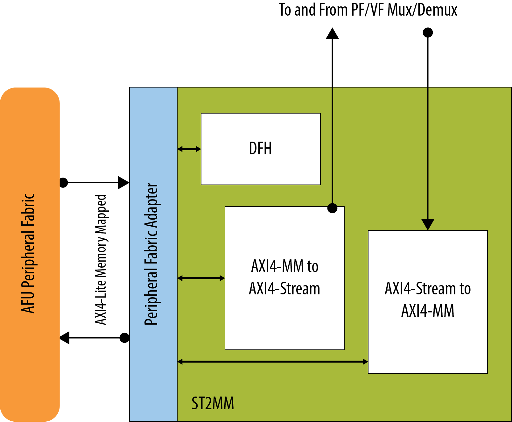
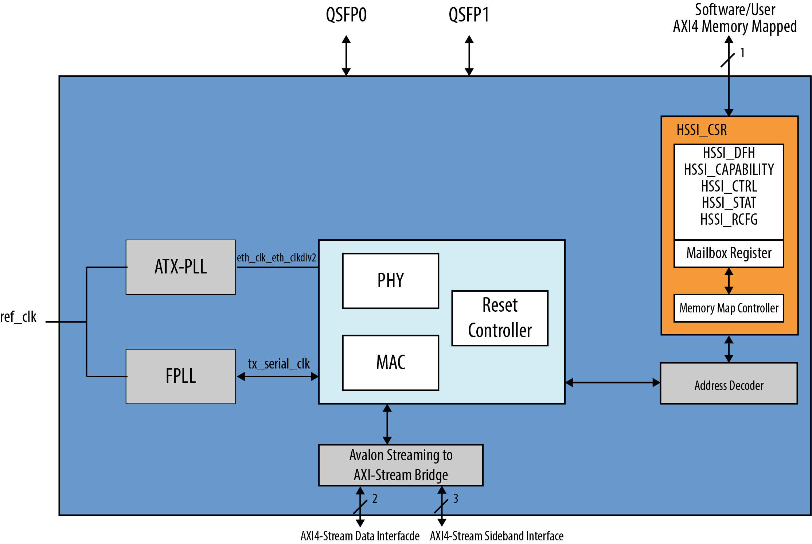

# **FPGA Interface Manager Technical Reference Manual: Open FPGA Stack for Stratix 10® FPGA**

## **1 Overview**

### **1.1 About this Document**

This document describes the hardware architecture of the​ Open FPGA Stack (OFS)
targeting the Stratix 10 FPGA.  After reviewing this document you should understand the features and functions of the components that comprise the FPGA Interface Manager (FIM), also known as the "shell."

| Term     | Description                                                  |
| -------- | ------------------------------------------------------------ |
| AER | Advanced Error Reporting, The PCIe AER driver is the extended PCI Express error reporting capability providing more robust error reporting. |
| AFU      | Accelerator Functional Unit, Hardware Accelerator implemented in FPGA logic which offloads a computational operation for an application from the CPU to improve performance. Note: An AFU region is the part of the design where an AFU may reside. This AFU may or may not be a partial reconfiguration region |
| BBB | Basic Building Block, Features within an AFU or part of an FPGA interface that can be reused across designs. These building blocks do not have stringent interface requirements like the FIM's AFU and host interface requires. All BBBs must have a (globally unique identifier) GUID. |
| BKC      | Best Known Configuration, The exact hardware configuration Intel has optimized and validated the solution against. |
| BMC      | Board Management Controller, Acts as the Root of Trust (RoT) on the Intel FPGA PAC platform. Supports features such as power sequence management and board monitoring through on-board sensors. |
| CSR | Command/status registers (CSR) and software interface, OFS uses a defined set of CSR's to expose the functionality of the FPGA to the host software. |
| DFL      | Device Feature List, A concept inherited from OFS. The DFL drivers provide support for FPGA devices that are designed to support the Device Feature List. The DFL, which is implemented in RTL, consists of a self-describing data structure in PCI BAR space that allows the DFL driver to automatically load the drivers required for a given FPGA configuration. |
| FIM      | FPGA Interface Manager, Provides platform management, functionality, clocks, resets and standard interfaces to host and AFUs. The FIM resides in the static region of the FPGA and contains the FPGA Management Engine (FME) and I/O ring. |
| FME      | FPGA Management Engine, Provides a way to manage the platform and enable acceleration functions on the platform. |
| HEM      | Host Exerciser Module, Host exercisers are used to exercise and characterize the various host-FPGA interactions, including Memory Mapped Input/Output (MMIO), data transfer from host to FPGA, PR, host to FPGA memory, etc. |
| Intel FPGA PAC D5005 | Intel FPGA Programmable Acceleration Card D5005, A high performance PCI Express (PCIe)-based FPGA acceleration card for data centers. This card is the target platform for the initial OFS release. |
| Intel VT-d | Intel Virtualization Technology for Directed I/O, Extension of the VT-x and VT-I processor virtualization technologies which adds new support for I/O device virtualization. |
| IOCTL | Input/Output Control, System calls used to manipulate underlying device parameters of special files. |
| JTAG     | Joint Test Action Group, Refers to the IEEE 1149.1 JTAG standard; Another FPGA configuration methodology. |
| MMIO | Memory Mapped Input/Output, Users may map and access both control registers and system memory buffers with accelerators. |
| OFS      | Open FPGA Stack, A modular collection of hardware platform components, open source software, and broad ecosystem support that provides a standard and scalable model for AFU and software developers to optimize and reuse their designs. |
| OPAE SDK | Open Programmable Acceleration Engine Software Development Kit, A collection of libraries and tools to facilitate the development of software applications and accelerators using OPAE. |
| PAC | Programmable Acceleration Card: FPGA based Accelerator card |
| PIM      | Platform Interface Manager, An interface manager that comprises two components: a configurable platform specific interface for board developers and a collection of shims that AFU developers can use to handle clock crossing, response sorting, buffering and different protocols. |
| PR       | Partial Reconfiguration, The ability to dynamically reconfigure a portion of an FPGA while the remaining FPGA design continues to function. In the context of Intel FPGA PAC, a PR bitstream refers to an Intel FPGA PAC AFU. Refer to [Partial Reconfiguration](https://www.intel.com/content/www/us/en/programmable/products/design-software/fpga-design/quartus-prime/features/partial-reconfiguration.html) support page. |
| RSU      | Remote System Update, A Remote System Update operation sends an instruction to the Intel FPGA PAC D5005 device that triggers a power cycle of the card only, forcing reconfiguration. |
| SR-IOV | Single-Root Input-Output Virtualization, Allows the isolation of PCI Express resources for manageability and performance. |
| TB | Testbench, Testbench or Verification Environment is used to check the functional correctness of the Design Under Test (DUT) by generating and driving a predefined input sequence to a design, capturing the design output and comparing with-respect-to expected output. |
| UVM | Universal Verification Methodology, A modular, reusable, and scalable testbench structure via an API framework. |
| VFIO | Virtual Function Input/Output, An IOMMU/device agnostic framework for exposing direct device access to userspace. |

### **1.2 Introduction to the Open FPGA Stack**

The Open FPGA Stack (OFS) is a modular collection of hardware
platform components, open source upstreamed software, and broad
ecosystem support that enables an efficient path to develop a custom FPGA platform.  OFS Provides a framework of FPGA synthesizable code, simulation environment and synthesis/simulation scripts. 
The key components of OFS include:
-   Target development platforms such as Intel-branded Programmable Acceleration Cards (PACs), Acceleration Development Platforms (ADPs) and third-party platforms.

- Board Management Controller RTL and firmware that supports telemetry monitoring, remote configuration updates and most importantly a root of trust for the platform.

- Source accessible, modular FPGA Interface  manager (FIM) RTL with unit tests that can be leveraged for your own custom FIM design

- Basic building blocks for interconnect and PF/VF translation and arbitration; Platform Interface Manager (PIM) which provides Avalon&reg; bus compliant interfaces.

- AFU examples both in the git repository and workload examples provided by 3rd party vendors

- The OneAPI shim provides a layer that is used by the OneAPI runtime to communicate with the kernel.

-   OPAE software development kit (APIs, upstreamed Linux drivers and software tools)

- Support for other frameworks to be built on top of the OPAE such as DPDK 

The OFS hardware repository supports hardware development and simulation.  Repositories for OFS high level design support and board management controller RTL and firmware source code are also provided.  These repositories can be found in the Altera Opensource Technology GitHub location, which requires entitlement access.  To request access, please contact your local Altera sales representative.

**Table 1-2 OFS GitHub Repositories**

OFS GitHub repositories can be found in the [OFS](https://github.com/OFS).

| Repository| Contains                                                               |
|:--------------------------:|------------------------------------------------------------------------|
| ofs-fim-common             | Contains common modules shared by all OFS designs.  This repository is a submodule of each platform repository.  | 
| ofs-d5005             | Contains FIM or shell RTL design, automated compilation scripts, unit tests.  |                                       |                       |                    |

 The OPAE software GitHub site is fully opensource and contains resources for both software and workload developers.

**Table 1-3 OPAE Public Git Repositories**

OPAE GitHub repositories can be found in the [OFS](https://github.com/OFS).

  | OPAE Git Repository Folder |  Contains|
  |:-:|-------------------------------------|
  | linux-dfl | Contains OFS Linux drivers that are being upstreamed to the Linux kernel. |
   | linux-dfl-backport | Backport versions of the linux-dfl to older kernel versions. |
  |opae-sdk   |  Contains the files for building and installing OPAE SDK from source.|
 | opae-sim | Contains an AFU/Workload simulator for software/hardware co-simulation. |
 | examples-afu  |  Contains simple AFU tutorials.||

Providing the hardware and software source code and supporting test
frameworks in a GitHub repository allows you to easily customize your own
designs with the latest versions.

Most hardware and software ingredients are available in our OFS GitHub location.  For access to the board management controller firmware and RTL or our security guide for OFS, please contact a local Altera sales representative. 

### **1.3 OFS Features**

The OFS architecture within the FPGA comprises two partitions:

-   FPGA Interface Manager (FIM)

-   Accelerator Functional Unit (AFU)

The FIM or shell provides platform management functionality, clocks, resets and interface access to the host and peripheral features of the acceleration
platform. The FIM architecture along with the supporting OPAE software supports features such as partial reconfiguration and virtualization.
The FIM provides a standard Arm* AMBA* 4 AXI4 datapath interface. The FIM resides in the static region of the FPGA.

The AFU partition is provided for custom acceleration workloads and may contain both static and partial reconfiguration regions.

#### **1.3.1 FPGA Interface Manager (FIM)**

The updated OFS architecture for Stratix® 10 FPGA devices improves upon the modularity, configurability and scalability of the first release of the OFS architecture while maintaining compatibility with the original design.  The primary components of the FPGA Interface Manager or shell of the reference design are: 

* PCIe Subsystem
* HSSI Subsystem
* Memory Subsystem
* Reset Controller
* FPGA Management Engine
* AFU Peripheral Fabric for AFU accesses to other interface peripherals
* Board Peripheral Fabric for master to slave CSR accesses from Host or AFU
* SPI Interface to BMC controller

The AFU Region provides design space for custom workloads and contains both static and partial reconfiguration regions.  Partial reconfiguration allows you to update your specific logic blocks or entire workload while the rest of your static design is still in operation.

Note that as discussed previously, the BMC RTL and firmware, the OFS OPAE software stack and support for building your own customer board support package are also provided in separate OFS repositories.

**Figure 1-2 OFS for Stratix 10 Block Diagram**

The table below details the features of the OFS release targeting the Stratix® 10 FPGA .

**Table 1-4 Features**
<table>
    <thead>
        <tr>
            <th>Key Feature</th>
            <th>OFS Update</th>
            <th>Comments</th>      
        </tr>
    </thead>
    <tbody>
        <tr>
            <td>PCIe</td>
            <td>H-tile PCIe Gen3x16 Interface</td>
            <td>Integrates PCIe TLP adapter for new data mover packet format. MSI-X vector and PBA tables are located in the PCIe subsystem. Interrupts from  FME as well as four user interrupts coming from PF0.VF1 are supported.</td>
        </tr>
        <tr>
            <td>Memory</td>
            <td>Two Avalon Memory Mapped channels provided as default with capability to compile design with four channels support.</td>
            <td>-</td>
        </tr>
 <tr>
            <td>HSSI</td>
            <td>1 Arm* AMBA* 4 AXI4-Stream channel of 10G Ethernet, using the low latency Ethernet 10G MAC FPGA IP interfacing to an E-tile PHY.
</td>
            <td>-</td>
        </tr>
 <tr>
            <td>Manageability</td>
            <td>SPI interface to Board Management Controller targeting Intel FPGA PAC D5005</td>
            <td>-</td>
        </tr>
<tr>
            <td>CoreFIM</td>
            <td>Flexible configuration support using Arm* AMBA* 4 AXI4-Stream Physical Function/Virtual Function (PF/VF) Demux/Mux and AFU Peripheral Fabric (APF) and Board Peripheral (BPF) Fabric Interconnects. 
</td>
            <td>APF and BPF fabrics are Platform Designer generated IPs. The Arm* AMBA* 4 AXI4-Stream PF/VF Demux/Mux is a new component.
</td>
        </tr>
       <tr>
            <td>Physical Function/Virtual</td>
            <td>1 PF/3VF configuration is provided as an example but the architecture now supports full virtualization with the ability to expand to whatever the PCIe tile supports.</td>
            <td>-</td>
        </tr>
<tr>
            <td>Partial Reconfiguration</td>
            <td>1 Partial Reconfiguration region supported in hardware and software</td>
            <td>-</td>
        </tr>
<tr>
            <td>Sample test PR AFUs</td>
            <td>Host exerciser modules provided to exercise interfaces.  These modules are provided in both the flat and PR AFU examples.</td>
            <td>-</td>
        </tr>
<tr>
            <td>OneAPI</td>
            <td>Yes</td>
            <td>Available Q1 2023</td>
        </tr>
       <tr>
            <td>Software Support</td>
            <td>OFS software stack with support for full virtualization.</td>
            <td>-</td>
        </tr>
     </tbody>
</table>

##### **FPGA Management Engine (FME)**

The FIM contains only one FME, regardless of the number of host interfaces
to the FIM. The FME provides management features for the platform and
controls reset and loading of the AFU into the partial reconfiguration
region of the FPGA.

Each FME feature exposes its capability to host software drivers through
a device feature header (DFH) register found at the beginning of its control
status register (CSR) space. The FME CSR maps to physical function 0
(PF0) Base address register 0 (BAR0) so that software can access it
through a single PCIe link.  For more information about DFHs, refer to the [Device Feature Header (DFH) structure](https://ofs.github.io/ofs-2024.1-1/hw/d5005/reference_manuals/ofs_fim/mnl_fim_ofs_d5005/#721-device-feature-header-dfh-structure).

##### **Streaming Datapath**

The FIM implements an AXI4-Stream bus protocol for data transfer in the FIM.
AXI4-Stream channels send data packets to and from the host channel IP
without data abstraction. Memory-mapped I/O (MMIO) CSR accesses are routed to the ST2MM module which converts the AXI4-Stream to an AXI4 memory mapped protocol.

##### **Virtualization**

This design supports virtualization by making use of the virtualization functionality in the PCIe Hard IP and mapping packets to the appropriate physical or virtual function through a PF/VF multiplexer.  This reference FIM supports 1 PF and 3 VFs as an example; however, you may extend your configuration to whatever the PCIe Hard IP can support or what your application requires.

#### **1.3.2 AFU**

An AFU is an acceleration workload that interfaces to the FIM. The AFU boundary in this design comprises both static and partial reconfiguration (PR) regions.  You can decide how you want to partition these two areas or if you want your AFU region to only be a partial reconfiguration region.  A port gasket within the design provides all the PR specific modules and logic required partial reconfiguration. Only one partial reconfiguration region is supported in this design.

Similar to the FME, the port gasket exposes its capability to the host software
driver through a DFH register placed at the beginning of the port gasket CSR
space. In addition, only one PCIe link can access the port register
space.  The port is part of the FPGA Interface Unit (FIU) that resides in the FIM.

You can compile your design in one of the following ways:
* Your entire AFU resides in a partial reconfiguration region of the FPGA 
* The AFU is part of the static region and is compiled a flat design

In this design, PF0.VF1 and PF0.VF2 map to host exerciser modules (HEM) that map to HE-LB and HE-HSSI respectively.  

#### **1.3.3 Platform Interface Manager**

The PIM provides a way to abstract the AXI4-Stream interface to the AFU
by providing a library of shims that convert the host channel native
packet into other protocols such as CCI-P, AXI4 memory-mapped, Avalon&reg; streaming (Avalon-ST) or Avalon&reg;
memory-mapped (Avalon-MM). The FPGA or AFU developer implement these
interface abstractions in the AFU region of the design.

#### **1.3.4 OPAE SDK FPGA Platform Feature Discovery** 

The OPAE C library in the OPAE software development kit is built on top
of the OPAE FPGA driver stack that abstracts the hardware and
operating system specific details of the platform to the host. The FIM
implements a DFH linked list to allow an FPGA platform driver running on
the host to discover FME, port and AFU features. This model is similar
to how PCIe enumeration occurs. You must implement a 64-bit DFH Device
Feature Header register at the beginning (first 8B aligned address) of
the feature CSR space for a new feature to be discovered or enumerated by a
driver.

A driver starts the traversing by reading the DFH of the first feature
from the first address on PF0 BAR0. Based on the information in the DFH,
a driver can determine the CSR address range of the feature and other
associated details of the feature. The end of the DFH contains a "next
DFH offset" field that points the driver to the DFH of the next feature.
The software must continue traversing the linked list until it sees the
EOL (End-Of-List) bit set to 1 in the "next DFH offset" field it is
inspecting. A 1 indicates this is the last feature in the feature set.
Figure below gives a simple illustration of the feature discovery by
traversing the DFH registers.

**Figure 1-3 Device Feature Header Linked List Traversal**

#### **1.3.5 OFS Reference Design**

OFS provides FIM designs you can use as a starting point for your
own custom design. These designs target a specific programmable
acceleration card or development kit and exercise key FPGA device
interfaces. The Stratix&reg; 10 code line for OFS targets the Intel FPGA PAC D5005.  FIM designs are released to [OFS D5005 FIM Github Branch](https://github.com/OFS/ofs-d5005) for evaluation and use.  

#### **1.3.6 FIM Simulation**

OFS provides a UVM environment for
the FIM and a framework for new feature verification. UVM provides a
modular, reusable, and scalable testbench structure by providing an API
framework that can be deployed across multiple projects. The FIM
testbench is UVM compliant and integrates third-party verification IPs
from Synopsys that require license to use. Verification components
include:

-   FIM monitor to detect correct design behavior

-   FIM assertions for signal level integrity testing

-   Arm AMBA AXI4 scoreboards to check data integrity

-   FIM coverage to collect functional data

The verification infrastructure can be in the verification folder here [OFS D5005 FIM Github Branch](https://github.com/OFS/ofs-d5005)  for evaluation and use. 

## **2 OFS High Level Architecture**

OFS provides distinct datapaths that simplifies the design and integration process for add or for removing interface modules:

* **High Bandwidth datapath** for AFU-attached high performance peripherals (HSSI, Memory, HPS, workload).
* **Low Bandwidth datapath** for OFS management and slow peripheral components (JTAG, I2C, SMBus).
* **AFU Peripheral Fabric (APF) to Board Peripheral Fabric (BPF) path** to communicate with interface control and status registers (CSRs) and board components.
* **Peer-to-peer datapath** between AFU components.
* **Peer-to-peer datapath** between BPF components.

Depending on your design goals, you can present peripherals to software as:

* OFS managed peripherals with a device feature header that is part of a device feature list.
* Native driver managed peripherals that are exposed through an independent physical function or virtual function.

**Figure 2-1 OFS Datapath Structure**

## **3 PCIe Interface**

The FIM's H-tile PCIe* hard IP is a Gen3x16 design.  The IP supports SR-IOV and is configured to provide one PF and three VFs.  Native PCIe TLP packets are sent through the PCIe using Arm AMBA 4 AXI-4 Stream Protocol.  Before they reach the AFU, however, the packets go through an adapter that converts any headers to a data mover format that is forward compatible with Agilex FPGA devices and beyond.   

**Figure 3-1 OFS FIM RX-TX Datapath**

Some key features of the PCIe interface are:

<table> 
<thead>
<tr>
<th align="center">Feature</th>
<th align="center">OFS for Stratix 10 Configuration</th>	
</tr>
</thead>
<tbody><tr><td>Mode</td>	
<td align="center">PCIe Gen3x16</td>	
</tr>
<tr><td>Port Mode</td> 	
<td align="center">Native Endpoint</td> 	
</tr>
<tr><td>SR-IOV</td>	<td align="center">1 PF, 3 VFs</td></tr>
<tr><td>MSI-X Support</td> 	<td align="center">Yes</td> </tr>
<tr><td>Functional Mode</td> 	<td align="center">Data Mover</td> 
<tr><td>Profile</td> 	<td align="center">Virtual+</td> 
<tr><td>TLP Bypass</td> 	<td align="center">No</td> 
<tr><td>Header Packing Scheme</td> 	<td align="center">Simple</td> 
<tr><td>Data Width</td> 	<td align="center">512-bit (64-byte)</td> 
<tr><td>PLD Clock Frequency</td> 	<td align="center">250 MHz</td> 
<tr><td>Tags Supported</td> 	<td align="center">128</td> 
<tr><td>Reordering</td> 	<td align="center">No reordering of requests, no completion reordering</td> 
<tr><td>Maximum Payload Size</td> 	<td align="center">256 Bytes</td> 
<tr><td>Memory Requests Supported</td> 	<td align="center">1CL, 2CL, 4CL</td> 
<tr><td>MMIO transaction Size</td> 	<td align="center">4B, 8B</td> 
</tr>
</tbody>
</table>

### **3.1 Receiver Datapath**

The path of data received by the FIM is as follows:

1.  The PCIe Hard IP receives TLP packets from the host.  Host response types can be:

    * MMIO read or response
    * Memory write request
    * Interrupt response
    * Memory read request or response

2.  The PCIe IP routes the TLP packets to the PCIe bridge interface in
    the FIM, where they get buffered into the RX FIFO.

3.  The TLP checker in the bridge examines the packets and filters
    erroneous packets including packets with unsupported requests or fields.
    Errors are sent to the error logger and are logged as advance error
    reporting (AER). Error status is sent to the PCIe hard IP and to the
    FIM error status registers. Appropriate action is taken for the
    errors as described in the <a href="#ras-error-handling">Reliability, Accessibility, Serviceability (RAS) and Error Handling</a> section. The TLP checker also
    maintains RX buffer credits for TLP completions with data (CplD)
    that are received from the host in response to a memory read request
    (MRd request sent by the AFU). The TLP checker notifies the PCIe TX bridge when there are not enough RX buffer credits available in the PCIe RX bridge. If there are not enough credits, the PCIe TX bridge pauses MRd requests from the AFU to Host until there
    is availability.

4.  The TLP checker forwards packets that pass TLP checking to an AXI4
    adapter which moves the packets into an Arm AMBA 4 AXI4-Stream bus.

5.  AXI4-Stream packets are sent downstream to datamover AXI4-Stream adapter to be modified into the new datamover packet format.

6. Datamover packets are sent to the PF/VF Mux in the AFU.

7.  The AXI4-Stream to Memory Mapped (ST2MM) module in the AFU region routes MMIO requests targeting FIM CSRs (FME, peripherals and AFU).

   

### **3.2 Transmit Datapath**

The Transmit (TX) datapath refers to all TLP packet types that originate in the FPGA.  A single Arm AMBA 4 AXI4-Stream channel at the port interface boundary of the FIM carries PCIe TLP packets and interrupt requests upstream from the AFU.

### **3.3 Data Handshaking**

The Arm AMBA 4 AXI4 interfaces to the AFU use the `VALID` and `READY` signal for handshaking and backpressure management.  The FIM holds the `DATA` and `VALID` asserted until the receiver asserts the `READY` signal.  The AFU accepts the data when both the `VALID` and `READY` signals are asserted. 

### **3.4 Arm AMBA 4 AXI4-Stream Interface**

   The table below shows the high-level signal mapping of the channels for the OFS for Stratix 10 FPGA.  If you have previously used the OFS EA architecture, that mapping is provided as a comparison as well in this table.  

**Table 3-1 AXI4-Stream RX Channel**

|AXI4-Stream Signal  |Source  |OFS Stratix 10 Mapping  |OFS Early Access Mapping |
|:--:|--------------|--------------------|------------------|
|ACLK     | Clock Source | PCLK = 250 MHz |  PCLK = 250 MHz|
|AResetn  | Reset Source | System Reset  | System Reset |
|TVALID   | Master       | Data Valid    | Data Valid   |
|TREADY   | Slave        | Ready        | Ready        |
|TDATA    | Master| Width=512 bits  <b>When packet includes a header (32 bytes) and data the packing scheme is:</b>  <b>16B data mover header:</b>  4B prefix  PF Number VM Number  VF Active  Slot Number  Memory Mapped Number 8B Address/Metadata  <b>Data:</b> 32B  <b>If the packet is only data then all 64 bytes comprise data      | [TLP_CH] [8n]   n=49 (392 bits) TLP_CH=2 (2TLP data streams) Mapping of each TLP data stream  [391:136] payload (32-byte data payload)  [135:8]: hdr (16 byte header)  [7:3]: rsvd0 (reserved bits) [2]: end of packet (eop)   [1]: start of packet (sop)   [0]: valid (TLP packet on data stream is valid)   
|TLAST    | Master     | Set to 1'b1 when end of packet is sent; otherwise TLAST is 1'b0   |  Set to 1'b1 when end of packet is sent; otherwise TLAST is 1'b0 |
|TKEEP    |Byte Qualifier | Signal indicates whether content of the associated byte is valid.  Invalid bytes are allowed only during TLAST cycle.  Valid bytes always start from Byte 0. |  Signal indicates whether content of the associated byte is valid.  Invalid bytes are allowed only during TLAST cycle.  Valid bytes always start from Byte 0.|
|TUSER |Master |WIDTH = 10   Bit 0 is always equal to 1'b1 to indicate data mover header format  [4:1] - Indicates header position on the TDATA bus and is always equal to 4'b0001 indicating that the header starts from Byte0. All other bits of TUSER are unused.      | [TLP_CH][u-1:0]  u=21  Sideband of each TLP data stream [20]: ummio_rd (Unsupported MMIO request) [19:0]: destination routing ID, where: [19:17]= BAR offset[2:0] [16:4]=VF number[12:0] [3:1]=PF number[2:0] [0]=vf_active, indicating if the virtual function feature is enabled |

**Figure 3-3 AXI4-Stream RX Request Cycle Header Format**

All Host requests sent to the AFU are memory-mapped I/O requests.  Of the fields below, the following are not supported in the design:
* Prefix
* Slot number (set to 0)
* Local Address

**Figure 3-4 AXI4-Stream RX Completion Header Format**

All completions in the RX direction are data completions.  Of the fields below, the following are not supported in the design:
* Prefix
* MM mode
* Slot number (set to 0)
* Meta Data

Note that:
* VF Active, VF Num and PF Num are obtained from TUSER.
* Data packet responses (for memory read requests from the AFU) from the PCIe may come out of order when the size is greater than 64 bytes.

**Table 3-2 AXI4-Stream TX Channel**

|AXI4-Stream Signal  |Source  |OFS Stratix 10 Mapping  |OFS Early Access Mapping |
|:--:|--------------|--------------------|-------------|
|ACLK     | Clock Source | PCLK = 250 MHz | PCLK = 250 MHz |
|AResetn  | Reset Source | System Reset  | System Reset  |
|TVALID   | Master       | Data Valid    | Data Valid   |
|TREADY   | Slave        | Ready        | Ready Only 1 ready signal for the two channels     |
|TDATA    | Master| Width=512 bits  <b>When packet includes a header (32 bytes) and data the packing scheme is:</b>  <b>16B data mover header:</b>  4B prefix  PF Number VM Number  VF Active  Slot Number  Memory Mapped Number 8B Address/Metadata  <b>Data:</b> 32B  <b>If the packet is only data then all 64 bytes comprise data      | [TLP_CH] [8n]   n=49 (392 bits) TLP_CH=2 (2TLP data streams) Mapping of each TLP data stream  [391:136] payload (32 byte data payload)  [135:8]: hdr (16 byte header)  [7:3]: rsvd0 (reserved bits) [2]: end of packet (eop)   [1]: start of packet (sop)   [0]: valid (TLP packet on data stream is valid) |
|TLAST    | Master     | Per protocol     | Set to 1'b1      |
|TKEEP    |Byte Qualifier | Signal indicates whether content of the associated byte is valid.  Invalid bytes are allowed only during TLAST cycle.  Valid bytes always start from Byte 0.   |Signal indicates whether content of the associated byte is valid.  Invalid bytes are allowed only during TLAST cycle.  Valid bytes always start from Byte 0. |
|TUSER |Master |WIDTH = 10   Bit 0 – Indicates Header Format:  0 – Power user mode header format  1 – Data mover header format Bit  [4:1] - Indicates header position on the TDATA bus and is always equal to 4'b0001 indicating that the header starts from Byte0. All other bits of TUSER are unused.    | [TLP_CH][u-1:0]  u=2 Sideband of each TLP data stream [0]=vf_active, indicating if the virtual function feature is enabled [0]: afu_irq (AFU interrupt) |

**Table 3-3 Interrupt Response Channel**

|AXI4-Stream Signal  |Source  |Mapping  |
|:--:|--------------|--------------------|
|ACLK     | Clock Source | PCLK |
|AResetn  | Reset Source | System Reset  |
|TVALID   | Master       | Valid       |
|TREADY   | Slave        | Ready   |
|TDATA [8n-1:0]   n=3 (24 bits)  | Master| [23:16]: 8-bit interrupt ID   [15:0]: Requester ID       |

**Figure 3-5:  AXI4-Stream TX Request Cycle Header Format**

All requests in the TX direction are Memory Read/Write. The requester ID does not come from the AFU; the AXI-Stream adapter supplies it.  The tag must come from the AFU.  Of the fields below, the following are not used in the H-Tile PCIe subsystem design:
* Prefix
* MM Mode
* Slot number (set to 0)
* Local Address

Note that VF Active, VF Num and PF Num are obtained from the header packet.

**Figure 3-4 AXI4-Stream TX Completion Header Format**

All completions in the TX direction are for MMIO.  Of the fields below, the following are not supported in the design:
* Prefix
* MM mode
* Slot number (set to 0)
* Meta Data

Note that:
* VF Active, VF Num and PF Num are obtained from TUSER.

## **4 Platform Interface Manager**

The FIM interfaces to an AFU through AXI4-Stream channels.  This format allows the AFU to access the host channel's raw interface without any translation.  
As a FIM developer, you have the option to provide the raw data format associated with the host interface channel to the workload or AFU developer or you can provide an intermediate protocol using Platform Interface Manager Components or your own custom interface.
If you expose the raw AXI4-Stream interface of the FIM, workload developers also have the option to convert to a desired protocol using the PIM resources as well.  

Refer to https://github.com/OPAE/ofs-platform-afu-bbb for more information on options for implementing the PIM.

## **5 AFU Interface Handler**

The AFU Interface Handler resides inline between the PCIe AXI4-Stream Adapter and the AXI4-Stream PF/VF Demux/Mux logic. Its main function is to provide:
 * Unique PCIe tags – Each PCIe transaction shares the 128 tags across all VFs in the AFU region
* AFU error logging for all VFs in the AFU region

### **5.1 AFU Error Handling**

In this OFS design, the AFU Interface Handler handles error logging for all VFs in the AFU. Errors handled are as follows

<table>
    <thead> 
        <tr>
        <th>Checker</th>	
        <th>Field</th>
        <th>Description</th>
        </tr>
    </thead>
    <tbody>
<tr>
<td rowspan="17">AFU protocol checker (PCIe TLP)</td>
        <td>TxReqCounterOverflow</td>
        <td>Pending memory write or memory read requests exceed the predefined limit</td></tr>
        <tr>
<tr>
        <td>TxFifoOverflow</td>
        <td>Tx FIFO in the port that buffers TLP packets from AFU is overflow</td></tr>
        <td>Malformed TLP</td>
        <td>AFU PCIe TLP contains unsupported format type</td></tr>
        <tr>
        <td>MaxPayloadError</td>
        <td>AFU memory write payload size exceeds max_payload_length limit</td></tr>
        <tr>
        <td>MaxReadReqSizeError</td>
        <td>AFU memory read payload size exceeds max_read_request_size limit</td></tr>
        <tr>
        <td>MaxTagError</td>
        <td>AFU memory read request tag value exceeds the maximum supported tag count</td></tr>
        <tr>
 <tr>
        <td>TagOccupiedErr</td>
        <td>AFU sends out memory read request using a tag that is already used for a pending memory read request</td></tr>
        <tr>
        <tr>
        <td>UnalignedAddrErr</td>
        <td>The address field in AFU memory write/read request TLP is not DW-aligned.</td></tr>
        <tr><td>UnexpMMIOResp</td>
        <td>AFU is sending a MMIO read response with no matching MMIO read request.</td></tr>
        <tr><td>MMIOTimedOut</td><td>AFU is not responding to a MMIO read request within the pre-defined response timeout period. </td></tr>
        <tr><td>MMIODataPayloadOverrun</td><td>The number of data payload sent by AFU for a MMIO response (cplD) is more than the data length specified in the response.</td></tr>
	<tr><td>MMIOInsufficientData</td><td>The number of data payload sent by AFU for a MMIO response (cplD) is less than the data length specified in the response.</td></tr>
	<tr><td>TxMWrDataPayloadOverrun</td><td>	The number of data payload sent by AFU for a memory write request is more than the data length specified in the request.</td></tr>
	<tr><td>TxMWrInsufficientData</td><td>	The number of data payload sent by AFU for a memory write request is less than the data length specified in the request.</td></tr>
    <tr><td>AFU Protocol Checker (AXI4-Stream)</td><td>TxValidViolation</td><td>Three checkers are implemented in the FIM to catch errors and protocol violations.</td>
    </tbody>
</table>

To view the CSR space for the AFU interface handle, go to the src/afu_top/AFU_INTF_CSR.xls file [OFS D5005 FIM Github Branch](https://github.com/OFS/ofs-d5005).

## **6 Interconnect Fabric**

There are three types of interconnect fabric in the OFS FIM design:
 * AXI4-Stream mux/demux fabric
 * AFU Periheral Fabric (APF)
 * Board Peripheral Fabric (BPF)

**Figure 6-1 Interonnect Fabric Diagram**

TLP packets sent from upstream PCIe Subsystem on AXI4-Stream channel are demultiplexed in the AXI4-Stream PF/VF mux/demux fabric and routed to the respective PF/VF function based on the PF/VF information in the TLP header, such as vf_active or the PF/VF number. On the opposite direction, TLP packets from downstream PF/VF function are muxed in the fabric and sent to PCIe subsystem over AXI4-Stream channel.

All host MMIO requests targeting PF0 BAR0 are routed to the ST2MM module. The ST2MM converts MMIO TLP packets into AXI-Lite memory requests and places the requests onto AFU Peripheral Fabric (APF). AFU peripherals, such as OFS managed AFU features and ST2MM) and Board Peripheral Fabric (BPF) are interconnected by APF. The BPF is the interconnect fabric one hiearchy below APF which connects all the board peripherals. Both APF and BPF allow multiple AXI4-Lite master and slave interconnect topology.

The following table summarizes the mechanism for configuring PF/VF functions:

**Table 6-1 Interconnect Configuration Methods** 
<table>
    <thead>
        <tr>
        <th>Interconnect</th><th>Configuration Mechanism</th></tr>
    </thead>
    <tbody>
        <tr><td>APF or BPF</td><td>Either: Use Platform Designer (PD) to generate the fabrics directly, or 
 Specify desired cfg in iofs_dfl.txt and run dfh2tcl.pl script to generate the necessary HW TCL scripts as needed by PD. This PERL script also takes care of invoking PD in script mode to generate the end result of RTL design Verilog files. This is the preferred method for generation.</td></tr>
<tr><td>AXI-S PF/VF Demux/Mux</td><td>Update parameters in these RTL files:  * src/includes/top_cfg_pkg.sv  * src/common/pf_vf_mux.sv 
Then make the corresponding update to AFU top level instantiation and connections: 
* src/FIMs/.../afu_top.sv</td></tr>
</tbody>
</table>

------
Note:

 In all cases, you must configure and regenerate the PCIe IP to match the new PF/VF configuration if it deviates from the reference FIM provided.

---------------

###	**6.1 Fabric Generation Flow** 

You have two options to generate APF/BPF IPs.

* Use Quartus Platform Designer.  This method requires familiarity with Quartus Platform Designer.  With this option, you manually enter each address space and define the associated master and slave interface in a table provided by the Platform Designer.  The parameters and attributes such as data width, address width, number of outstanding cycles, … etc. are also set to the desired values.  After this is completed, you then connect each master and slave interface in the table.  Platform Designer then generates the RTL files according to the table.  For more details, please refer to the [Intel Quartus Prime Pro Edition User Guide](https://www.intel.com/content/dam/www/programmable/us/en/pdfs/literature/ug/ug-qpp-platform-designer.pdf).

* Use the APF/BPF script that reads in `iofs_dfl.txt` and automatically generates APF/BPF IPs.  Both APF and BPF are generated from Platform Designer using hardware TCL scripts. To provide a more user friendly experience to OFS Rel 1 and AC ADP customers, a perl script `dfh2tcl.pl` has been developed to provide a higher level of abstraction.
The below figure illustrates the high level flow:

 **Figure 6-2 APF/BPF Generation**

Note that the only input required is the `iofs_dfl.txt` text file which allows you to specify how many ports, which fabric, type of AXI4-Lite port (master, slave, or both), port addresses and sizes. 
Using `iofs_dfl.txt` and `dfh2tcl.pl` to generate the APF and BPF is the preferred method.

###	**6.2	iofs_dfl.txt Format**

The following table describes the format of the `iofs_dfl.txt` input file:

**Table 6-2 iofs_dfl.txt Format Types**
<table>
<thead>
<tr><th>Column</th><th>Description</th></tr>
<tbody>
<tr><td>REGISTER</td><td>Name of the port on the APF/BPF fabrics. Note that each entry must be unique.</td></tr>
<tr><td>FABRIC</td><td>Allows the user to specify which fabric this port is connected to, and also the type of AXI4-Lite port (master, slave, or both). The format is FABRIC-PORT_TYPE, where: 
* FABRIC = APF or PBF 
* PORT_TYPE = MST, SLV, or BID (Master, Slave, or Bi-Directional)</td></tr>
<tr><td>BASE_ADDR</td><td>Specifies the address offset of the AXI4-Lite port.</td></tr>
<tr><td>BAR_SIZE=2^N</td><td>	Specifies the size of the port. For simplicity reasons, all AXI4-Lite ports are configured as 64KB. i.e. 2^16</td></tr>
</tbody>
</table>

Additional AXI4-Lite ports can be easily created by adding more rows in the `iofs_dfl.txt file`. 

Note that there are several reserved ports in both APF and BPF so it might not be necessary for you to regenerate the fabrics if the design does not exceed the number of ports as implemented in the APF/BPF in the reference FIMs.

### **6.3	AFU Peripheral Fabric (APF)**

The AFU Peripheral Fabric (APF) is a 64-bit AXI4-lite compliant interconnect fabric that connects AFU peripheral modules to board peripheral modules through the Board Peripheral Fabric (BPF). 
The fabric is clocked by `clk_csr` and has a read allowance and write allowance of 1, i.e. only 1 active write/read is allowed in the fabric at any single time. 

The address mapping for components interconnected by the APF is listed below. All components are mapped to PF0 BAR0 and implement AXI-lite slave interface. The Master column indicates if a component also implements AXI4-lite master interface which can send request to APF.

**Table 6-3 APF Address Mapping**
<table>
<thead>
<tr><th>Address</th><th>Size (Byte)</th><th>Feature</th><th>Master</th></tr></thead>
<tbody>
<tr><td>0x00000 – 0x7FFFF</td><td>512K</td><td>Board Peripherals
(See BPF address mapping)	</td><td>No</td></tr>
<tr><td colspan="4"><b>AFU Peripherals</b></tr>
<tr><td>0x80000 – 0x8FFFF</td><td>64K</td><td>ST2MM</td><td>Yes (Send MMIO request to all the peripherals)</td>
</tr>
<tr><td rowspan="4">0x90000 – 0x9FFFF</td><td>64K</td><td>Port Gasket</td><td>Yes</td></tr>
	<tr><td>4K</td><td>PR Control & Status</td>	</tr>
<tr><td>4K</td><td>User clock</td></tr>
<tr><td>16K</td><td>Remote STP</td></tr>
<tr><td>0xA0000 – 0xAFFFF</td><td>64K</td><td>AFU Interface Handler</td><td>No</td></tr>
</tr>
<tr><td>0xB0000 – 0xBFFFF</td><td>64K</td><td>RSV_b_DFH Available for customer use</td><td>May be programmed as master if used.  By default this is a reserved base address.</td></tr>
<tr><td>0xC0000 – 0xCFFFF</td><td>64K</td><td>RSV_c_DFH Available for customer use</td><td>May be programmed as master if used.  By default this is a reserved base address.</td></tr>
<tr><td>0xD0000 – 0xDFFFF</td><td>64K</td><td>RSV_d_DFH Available for customer use</td><td>May be programmed as master if used.  By default this is a reserved base address.</td></tr>
<tr><td>0xE0000 – 0xEFFFF</td><td>64K</td><td>RSV_e_DFH Available for customer use</td><td>May be programmed as master if used.  By default this is a reserved base address.</td></tr>
<tr><td>0xF0000 – 0xFFFFF</td><td>64K</td><td>RSV_f_DFH Available for customer use</td><td>May be programmed as master if used.  By default this is a reserved base address.</td></tr>
</tbody>	
</table>
The five reserved regions have associated ports available in the APF for customer use.

### **6.4	Board Peripheral Fabric (BPF)**

The Board Peripheral Fabric is the 64-bit AXI4-Lite compliant interconnect fabric that connects board peripheral modules to APF. The fabric is clocked by `clk_csr` and has a read allowance and write allowance of 1, i.e. only 1 active write/read is allowed in the fabric at any single time.

The address mapping for components interconnected by BPF is listed below. All components are mapped to PF0 BAR0 and implement AXI4-lite slave interface. The Master column indicates if a component also implements AXI4-lite master interface which can send request to BPF.

**Table 6-4 BPF Address Mapping**
<table>
<thead>
<tr><th>Address</th><th>Size (Byte)</th><th>Feature</th><th>Master</th></tr>
<tbody>
<tr><td>0x00000 – 0x0FFFF</td><td>64K</td><td>FME (FME, Error, etc)</td><td>Yes</td></tr>
<tr><td>0x10000 – 0x1FFFF</td><td>64K</td><td>SPI Controller</td><td>Yes</td></tr>
<tr><td>0x20000 – 0x2FFFF</td><td>64K</td><td>PCIe CSR</td><td>-</td></tr>
<tr><td>0x30000 – 0x3FFFF</td><td>64K</td><td>HSSI CSR</td><td>-</td></tr>
<tr><td>0x40000 – 0x4FFFF</td><td>64K</td><td>EMIF CSR</td><td>-</td></tr>
<tr><td>0x50000 – 0x5FFFF</td><td>64K</td><td>Reserved Available for customer use.</td><td>Dependent on user programming</td></tr>
<tr><td>0x60000 – 0x6FFFF</td><td>64K</td><td>Reserved Available for customer use.</td><td>Dependent on user programming<td></tr>
<tr><td>0x70000 – 0x7FFFF</td><td>64K</td><td>Reserved Available for customer use.</td><td>Dependent on user programming</td></tr>
</tbody>	
</table>

The three reserved regions have associated ports available in the BPF for customer use.

### **6.5	AXI4-Stream PF/VF Mux/Demux**

The AXI4-Stream PF/VF Mux/Demux routes the PCIe TLP packets from the PCIe subsytem AXI4-Stream RX channel to downstream PF/VF based on the pf_num and vf_num information in the PCIe TLP header.

The AXI4-Stream PF/VF mux arbitrates PCIe TLP packets from downstream PF/VF to the PCIe SS AXI-S TX channel.
The PF/VF Mux/Demux is an M x N switch that allows any M port to target any N port, and any N port to target any M port, where M is the number of host/upstream ports, and N is the numbers functions/downstream ports.  M and N values are parameterized in the RTL for adding, removing, or remapping of FPGA functional units/modules to PF/VF.  

The fpga top package file, found in the src/includes/ofs_fim_cfg_pkg.sv file [OFS D5005 FIM Github Branch](https://github.com/OFS/ofs-d5005)  contains these parameters as well as the mapping of N port’s PF/VF.

Structurally, M x N switch is composed of M number of N:1 mux, and N number of M:1 mux.  Each mux output has an arbiter that perform round robin priority arbitration of its inputs.  At the mux output is a FIFO with depth greater than the handshake round trip delay.  The FIFO allows the switch to arbitrarily insert pipeline/register stages for timing.

Note that M x N switch is design for AXI streaming, but it can be easily converted to AVST.  The protocol signals pass through switch intact – only ready, valid, and last (common between AVST and AXI) effect switch operation.  The data width of the switch is also parameterized in the src/includes/ofs_fim_cfg_pkg.sv file [OFS D5005 FIM Github Branch](https://github.com/OFS/ofs-d5005).  

The default mapping is shown below:

**Table 6-5 PF/VF Mapping**

<table>
<thead>
<tr><th>Device</th><th>Physical Function #</th><th>Virtual Function #</th><th>Switch Port ID</th><tr>
</thead>
<tbody>
<tr><td>APF/BPF</td><td>0</td><td>x</td><td>3</td></tr>
<tr><td>HE Loopback</td><td>0</td><td>0</td><td>0</td></tr>
<tr><td>Port Gasket</td><td>0</td><td>1</td><td>1</td></tr>
<tr><td>HSSI</td><td>0</td><td>2</td><td>2</td></tr>
</tbody>
</table>

For information on how to modify the PF/VF mapping for your own design, refer to the [Shell Developer Guide: OFS for Stratix® 10 PCIe Attach FPGAs](https://ofs.github.io/ofs-2024.3-1/hw/d5005/dev_guides/fim_dev/ug_dev_fim_ofs_d5005/).

### **6.6 Unified Tag Remapping**

When a FPGA function sends out a read cycle, it allocates a unique tag which is subsequently used to identify the read completion.  The tag is considered busy; it cannot be assigned to another read cycle until read completion.  While a tag may be unique within a unit, two different units could unknowingly send out two read cycles of the same tag.  The PCIe subsystem requires unique tags for all read cycles irrespective of their origins.  Therefore, a mechanism is needed to uniquify tag globally across different units.

OFS contains a tag remapper (tag_remap) that intercepts the read cycle, finds a globally unique tag, and replaces the original tag value.  It also restores the original tag value when returning completion to the read requester.  tag_remap is placed between the AXI4-Stream interface of the PCIE subsystem and the PF/VF Mux/Demux.

The logic is described as follows:

1.	A sub-module (ofs_fim_tag_pool) maintains a pool of available tags.
2.	TX read requests are held until a tag is available from the pool by setting tvalid=0 to the host, and tready=0 to the PF/VF Mux/Demux.
3.	When a TX read is dispatched, the tag is marked busy in the pool.
4.	The original tag is stored in tag_reg, so it can be recovered when returning a completion to the unit/function.
5.	Since completion to a read request can split into multiple smaller transfer sizes, responses are monitored and the final completion is detected using PCIe TLP rules.
6.	Tags are released in the pool only when all requested data are transferred.
7.	When the completion returns, the original tag is restored from tag_reg.

### **6.7 TLP to AXI4-Lite Memory Mapped Bridge (ST2MM)**

ST2MM implements the following key features:
* Host MMIO bridge
    * Maps MMIO TLP packets received from the PCIe Subsystem over streaming interface to AXI4-Lite memory-mapped request. The memory-mapped request is sent to AFU or Board peripherals over APF and BPF.
    * Maps AXI4-lite MM response received from AFU or Board peripherals to TLP packets and send the packets over ST streaming channel to host HIA subsystem.
* Sends MMIO response of all 0’s for MMIO read to unused BAR region.
* Interrupt
    * Sends interrupt packets to the PCIe subsystem when interrupt requests are received from the peripherals. Interrupts can be requested by a peripheral through a memory write to interrupt CSR registers in the ST2MM.

**Figure 6-2 APF/BPF Generation**

ST2MM implements both AXI4-lite master and slave interfaces that are connected to the designated slave and master port on APF. Host memory requests are sent on the ST2MM master interface to AFP where the requests are routed to the targeted peripherals. 

## **7 MMIO Regions**

The FIM and AFU expose their functionalities to the host software through a set of CSR registers that are mapped to an MMIO region (Memory Mapped IO). An MMIO region is an address space within a base address register (BAR) region to which features are memory mapped.  For example, when a feature is mapped to an MMIO region, the CSR registers of that feature are located within the address range of that region. There can be multiple MMIO regions within a BAR region. 

### **7.1 Base Address Register (BAR) Layout**

The function, BAR and external feature region starting address are put into a platform specific parameter SystemVerilog package file src/includes/ofs_fim_cfg_pkg.sv file [OFS D5005 FIM Github Branch](https://github.com/OFS/ofs-d5005).  

You can modify the parameterization according to your platform requirements, however you must ensure the corresponding software driver is also updated to align with the new assignment. 

**Table 7-1 BAR Layouts**
<table>
    <thead>
        <tr>
            <th>PF</th>
            <th>VF</th>
            <th>Feature</th>
            <th>BAR</th>
            <th>BAR Size</th>       
        </tr>
    </thead>
    <tbody>
        <tr>
            <td rowspan=5>PF0</td>
            <td rowspan=2>-</td>
            <td>OFS Managed Peripherals</td>
            <td rowspan="2">BAR 0</td>
            <td>512K</td>
        </tr>
        <tr>
            <td>AFU Peripherals Board Peripherals</td>
            <td>256K 256K</td>
        </tr>
 <tr>
            <td>VF0</td>
            <td>HE-LB</td>
            <td>BAR0</td>
            <td>4K</td>
        </tr>
 <tr>
            <td>VF1</td>
            <td>HE-MEM in PR slot</td>
            <td>BAR0</td>
            <td>4K</td>
        </tr>
<tr>
            <td>VF2</td>
            <td>HE-HSSI</td>
            <td>BAR0</td>
            <td>4K</td>
        </tr>
     </tbody>
</table>

### **7.2 Feature Region**

A group of related CSRs can be categorized as a feature region. For example, a DMA engine has queue management function and quality of service (QoS) function; these are two different features of the DMA engine. A feature region is contained within a single PCIe BAR and cannot span across two BAR region boundaries. 
 You can view the PF0 BAR0 MMIO mapping by referencing thesrc/common/fme/fme_csr_pkg.sv file [OFS D5005 FIM Github Branch](https://github.com/OFS/ofs-d5005) file.

A Device Feature Header (DFH) register marks the start of the feature region and sub-feature region, and you must place it at the first address of the region. Each DFH starts at 4KB boundary. A DFH register contains information that OPAE software requires to enumerate the feature. It also has an offset field that points to the next DFH in a feature list. OPAE software traverses the linked list of DFHs in each BAR region to discover all the features implemented on the platform. The `EOL` field in a DFH marks the end of a DFH list and is only set in the DFH of the last feature in the feature list. The feature type field in the DFH is used to differentiate between the different types of feature region. Basic building blocks (BBB) and private features are always a child of an AFU or FPGA Interface Unit (FIU) and must be contained within an AFU or FIU, respectively.  

#### **7.2.1 Device Feature Header (DFH) Structure**

All DFHs must follow the following structure to be compatible with OPAE software.

**Table 7-2: DFH Structure**

|Bitfield Name|Range|Access| Description|
|:-------:|:------:|:-------:|-------------|
|FeatureType|63:60|RO|4’b0000 – Reserved  4’b0001 – AFU 4’b0010 – BBB 4’b0011 – Private Feature 4'b0100 – FIU/FIM |
|Reserved|59:41|Rsvd|Reserved|
|EOL| 40|RO| End of DFH List 1'b0=No other feature header beyond this one 1'b1=This is the last feature header|
|NextDFHByteOffset| 39:16| RO| Next DFH byte offset Next DFH Address= Current DFH address + Next DFH byte offset.  You can also use this value as an indication of the maximum size of the MMIO region occupied by this feature. 
|FeatureRev| 15:12 | RO|For AFU Feature type= AFU major version number that is user defined. All other feature types= Feature revision number|
|FeatureID|11:0 | RO| For AFU feature type= CoreFIM version number For BBB feature type= Intel defined ID for BBB For private feature type= User-defined ID to identify within an AFU  For FIU type=ID for FIU unit (ex. 0 for FME, 1 for Port)

You must increment a feature revision number if a feature changes.  This change requires a corresponding change in the software to detect the new version and report mismatches between the hardware and software revision number. 

### **7.3 Control and Status Registers**

All the Control and Status Registers (CSRs) in the FIM are 64-bit registers with the following MMIO write and MMIO read support.

**Table 7-3: CSR MMIO Read and Write Support**

|Request |	Memory Attribute |	Payload size |	Memory Ordering |
|:-------:|:------:|:------------:|:----------------:|
|MMIO Write |	UC|	4B or 8B|	Strongly ordered|
|MMIO Read |	UC|	4B or 8B|	Strongly ordered|

The FIM does not reorder the MMIO requests or responses. For MMIO writes, there is no reordering of requests in FIM, and UC ordering rules are followed. Similarly, for MMIO reads, there is no re-ordering of requests or responses in the FIM. An AFU may opt to re-order the MMIO read responses but the FIM does not enforce read response ordering. 

#### **7.3.1	Software Access to Registers**

* Software accesses 64-bit registers as aligned quadwords. For example, to modify a field (bit or byte) in a 64-bit register, the entire quadword is read, the appropriate field(s) are modified, and the entire quadword is written back.
* When updating registers through multiple accesses (whether in software or due to hardware disassembly), certain registers may have specific requirements on how the accesses must be ordered for proper behavior. These are documented as part of the respective register descriptions.
* For compatibility with future extensions or enhancements, software must assign the last read value to all “Reserved and Preserved” (RsvdP) fields when written. In other words, any updates to a register must be read so that the appropriate merge between the RsvdP and updated fields occurs. Also, software must assign a value of zero for “Reserved and Zero” (RsvdZ) fields when written.
* PCIe locked operations to FPGA hardware registers are not supported. Software must not issue locked operations to access FPGA hardware registers.

In the following two cases, the FIM terminates MMIO Read requests by sending a completion with the data (CplD) specified below:
* MMIO Timeout:  This occurs when the AFU does not respond within a set timeout. The timeout value is currently configured to 512 pclks (clk_2x). In this case, the FIM returns all 1s.

* Illegal MMIO Accesses: This occurs when the read is accessing undefined registers in the FIM or if an AFU access violation.  An example of an access violation is when a PF attempts to access the AFU when it is set to VF mode, or when a VF attempts to access the AFU when it is set to PF mode. In this case, the FME will return all 0s.

#### **7.3.2	Register Attribute Definition**

**Table 7-4: OFS Register Attribute Definitions**

|Attribute|	Expansion| Description|
|:-----------:|:-----------:|-----------------------------|
|RW |	Read/Write |	This bit can be read or written by software.|
|RO |	Read Only |	The bit is set by hardware only. Software can only read this bit. Writes do not have any effect.|
|RW1C| 	Read/ Write 1 to Clear|	Software can read or clear this bit. The software must write 1 to clear this bit. Writing zero to RW1C bit has no effect. Note that a multi-bit RW1C field may exist. In this case, all bits in the field are cleared if a 1 is written to any of the bits.|
|RW1S |	Read/ Write 1 to Set|	Software can read this bit. Writing a 1 to the bit sets it to 1. Writing a 0 has no effect. It is not possible for software to set this bit to 0. The 1 to 0 transition can only be performed by HW.|
|RW1CS |	Read/Write 1 to Clear Sticky|	Software can read and clear this bit. Writing a 1 to a bit clears it, while writing a 0 to a bit has no effect. This bit is only reinitialized to its default value by a power-on reset.|
|RWD |	Read/Write Sticky across Hard Reset|	The bit can be read or written by SW. This bit is sticky or unchanged by any reset type, including Hard Reset. The bit gets cleared only with power on.|
|*S |	Sticky across Soft Reset|	The bit will be sticky or unchanged by soft reset. These bits are only re-initialized to their default value by a power-on reset.|
|*D |	Sticky across Hard Reset|	The bit is sticky or unchanged by or unchanged by any reset type, including hard reset. The bit gets cleared only with power on.|
|Rsvd |	Reserved |	Reserved for future definitions. Currently don’t care bits.|
|RsvdP |	Reserved and Protected|	Reserved for future RW implementations. The software must preserve the value of this bit by read modify write.|
|RsvdZ |	Reserved and Zero|	Reserved for future RW1C implementations. The software must write zero to this bit.|

#### **7.3.3 CSR Offset in BARs**

The table below captures the FIM and AFU features in the supported BAR regions. The offset highlighted in red indicates the first DFH in the DFH list of a BAR region where device driver starts the DFH traversal.

**Table 3-6: PF0 BAR0 Features**

| Offset| Feature CSR set |
|:------------:|---------------|
| `0x00000` | `FME` |
|0x03000	|Global Performance|
|0x04000	|Global Error|
|0x10000	|SPI Controller|
|0x20000    |PCIe CSR Interface|
|0x30000    |HSSI CSR Interface|
|0x40000	|EMIF CSR Interface|
|0x80000	|Reserved for ST2MM Bridge|
|0x90000	|PR Control & Status (Port Gasket)|
|0x91000	|Port CSRs (Port Gasket)|
|0x92000    |User Clock (Port Gasket)|
|0x93000    |Remote SignalTap (Port Gasket)|
|0xA000    |AFU Errors (AFU Interface Handler)|

**Table 3-7: PF0 BAR4 Features**

| Offset| Feature CSR set |
|:------------:|---------------|
|0x02000	|MSI-X|
|0x03000|MSI-X PBA Tables|

**Table 3-8: PF0-VF0 BAR0 Features**

| Offset| Feature CSR set |
|:------------:|---------------|
|0x00000	|HE-LBK|

**Table 3-9: PF0-VF1 BAR0 Features**

| Offset| Feature CSR set |
|:------------:|---------------|
|0x00000|	HE-MEM|

**Table 3-10: PF0-VF2 BAR0 Features**

| Offset| Feature CSR set |
|:------------:|---------------|
|0x00000|	HE-HSSI |

## **8 FIM Clocks**

The following table provides the clocks available in the OFS reference design that targets the Intel FPGA PAC D5005.  Clocks that the high speed serial interface (HSSI) or external memory interface provide to the FIM may be different depending on if you modify your external features with different components.

**Table 8-1: External Clock Source**

|Clock |Frequency |	Description |
|:----------------:|:---------:|--------------------|
|SYS_RefClk | 100 MHz |Reference clock to system IOPLL (sys_pll) which provides FIM system clocks.|
|qsfp*_644_53125_clk |	644.5312 5MHz |	HSSI reference clocks |
|ddr4_mem*.ref_clk |	150 MHz |	Reference clocks to DDR4 interfaces|
|PCIE_REFCLK |	100MHz |	PCIe reference clock |

**Table 8-2: Internal Clocks**

|Clock |Frequency| Description |
|:-----------:|:-----:|--------------------|
|clk_1x	|250 MHz | Generated by the system IOPLL (sys_pll). This clock drives CoreFIM datapath and the AFU interface. |
|clk_div2	| 125 MHz	|Generated by the system IOPLL, synchronous to clk_1x. This clock drives IM datapath and AFU interface. |
|clk_100 |	100 MHz |	Generated by the system IOPLL, synchronous to clk_1x.  This clock also supplies the HSSI reconfiguration clock. |
|avl_clk |	250 MHz	| PCIe H-tile Hard IP clock output. This clock is not synchronous to Clk_* |
|DDR4x_USERCLK |299.76 MHz | Each of the four DDR interfaces generates one of these clocks, which provides the the clock to the  DDR4* Avalon Memory Mapped interfaces.  Your memory clock output may be different depending on the memory interface you are implementing in your design.|
|uclk_usr |	User defined |	Provides an AFU user clock running at a user specified frequency. Generated by user IOPLL. Not synchronous to clk_*. |
|uclk_usr_div2| uclk_usr/2| Second user clock to AFU running at half the frequency of uclk_usr. Synchronous to uclk_usr. Generated by user IOPLL. |
|hssi[*].f2a_tx_parallel_clk_x1 |	156.2 MHz |	1x TX clock generated from fPLL in the HSSI module in FIM, used to clock the HSSI TX datapath in AFU.|
|hssi[*].f2a_tx_parallel_clk_x2	| 312.5 MHz |	2x TX clock generated from fPLL in the HSSI module in FIM, used to clock the HSSI TX datapath in AFU.|
|hssi[*].f2a_rx_clkout |	322.265625MHz |	RX parallel clock from the HSSI PHY channels, used to clock the HSSI RX data datapath in AFU.|

## **9 Reset**

### **9.1	Reset Signals**

The system reset of OFS reference platform is driven by `nPERST` pin, `pcie_reset_status` signal from the PCIe hard IP, the `INIT_DONE` and `nCONFIG` pins of the FPGA, and the locked signal of the SYS IOPLL that provides system clocks to FIM.  

Upon power-on, the reset module in the FIM holds the FIM in reset until all the reset conditions are de-activated:

 * `nPERST` signal is asserted.
* The `INIT_DONE` pin is driven high to indicate core configuration is complete.
* The SYS IOPLL is locked.
* The reset status from PCIe hard IP is de-asserted indicating the IP is ready for transfer. 

The reset module places the FIM back into reset if any of these conditions becomes active again.
The only way to invoke a system reset to the FIM after power-up is to deassert the `nPERST` pin either by performing a warm reboot or through PCIe driver intervention. There are soft reset signals set aside to allow software to reset the Port, AFU and partial reconfiguration IP. 

**Table 9-1: FIM System Resets**

| Reset             | Description |                                                                                                       
|:-----------------:|-------------------------------------------------------------------------------------------------------------------------------------------------------------------------------------------------------|
| `nPERST` pin        | Active low PCIe reset pin that serves as the system reset pin on the platform.                                                                                                                        |
| `nCONFIG` pin       | Active low input to the FPGA that causes the FPGA to lose its configuration data, enter a reset state, and tri-state all I/O pins. Host software must reload the FPGA FIM after nCONFIG is activated. |
| `ninit_done`        | Active low signal derived from the INIT_DONE pin which indicates the FPGA core configuration is complete and has entered usermode.                                                                    |
| `pcie_reset_status` | Active high reset status from PCIe hard IP. When driven high, this signal indicates that the PCIe IP core is not ready for usermode.                                                                  |
| `pll_locked`        | Active high SYS IOPLL locked signal|                                                                                                     

**Table 9-2: Soft Resets**

|Soft Reset Bitfield	| Register	| Description |
|:----------:|:-----------:|-------------------|
|`PortSoftReset` |	PORT_CONTROL[0]	|Resets Port and AFU.|
|`FlrPortReset`  |	PORT_CONTROL[3]	| PCIe function level reset that resets Port and AFU when SR-IOV is enabled.|
| `PRReset` |	FME_PR_CTRL[0] |	Resets the partial reconfiguration (PR) controller. |

### **9.2	Platform Power up Sequence**

Upon power up, the HSSI interfaces of the FIM go through an internal reset and calibration sequence. After the `nPERST` is de-activated, the PCIe interface and EMIF interfaces are first released from reset, followed by SYS IOPLL when the `ninit_done` is de-asserted. The rest of the FIM logic is still being hold in reset. The `nPOR` signal to the PCIe hard IP de-activates following `nPERST` assertion, which releases PCIe hard IP from reset. The PCIe hard IP asserts `pld_clk_inuse` to indicate to the application layer that the HIP transaction layer is using the `pld_clk` as its clock and is ready for operation with the Application layer (`pld_clk` is stable). Finally, `reset_status` from PCIe IP is de-asserted.
When SYS IOPLL is locked and the `reset_status` from the PCIe interface is de-asserted, the FIM is released from reset while the Port and AFU is still held in reset by the `PortSoftReset` register bit (PORT_CONTROL[0]) that is held high until software writes a 0 to this bit to de-activate port reset. At this point, the platform is fully released from reset and PCIe link is going through link training and PCIe enumeration.
Once the platform is successfully enumerated, driver can then be loaded to start the device feature discovery process and provision the platform for AFU application usage.

## **10 Interrupts**

The OFS platform supports interrupt through MSI-X feature. The OFS reference platform supports at least 4 FME interrupts (PF only) and 4 AFU interrupts (PF and VF). 

### **10.1 MSI-X**

In the default implementation the MSI-X feature that handles FME and AFU interrupts is inside the PCIe Subsystem.  The MSI-X vector table and Pending Bit Array (PBA) table for PF0 and PF0/VF1 are provided as an example. 
FME interrupts are primarily used to notify the host of error events occurring in the FIM. 

 All interrupt requests arrive inband through the AXI4-Stream interface to the TX AXI4-stream adapter inside the PCIe Subsystem.  

An AFU sends an interrupt to the MSI-X module on the AXI interrupt request channel. After the interrupt request is serviced, the MSI-X module sends an interrupt response back to the AFU on the AXI interrupt response channel.
The AFU has the flexibility to define the use of each AFU interrupt.

The following interrupts are supported:
PF supports 7 interrupt vectors:
- 0-3:	User AFU triggered 
- 4:	Port error triggered
- 6:	FME error triggered

VF supports 5 interrupt vectors:
- 0-3:	User AFU triggered 
- 4:	Port error triggered

## **11 External Memory Interface (EMIF)**

There are four DDR4 external memory interfaces on the OFS EA FIM that targets the Intel FPGA PAC D5005 FIM for each of the four DDR4 banks (DDR4a, DDR4b, DDR4c, and DDR4d).
Two of the DDR4 external memory interfaces and the associated clocks are directly exposed to AFU except for two Avalon Memory Mapped pipeline bridges to facilitate timing closure across PR boundary. The Avalon Memory Mapped interfaces of each external memory interface are connected to an Avalon-MM pipeline bridge (avmm_bridge) in the FIM, which is then connected to another Avalon-MM pipeline bridge in the PR or AFU region. 
An AFU should use the USER_CLK associated with a memory interface when interfacing with the memory interface for better timing performance.

### **11.1 EMIF CSR**

The CSR for the EMIF feature is memory mapped to the FME BAR region. Following table captures the EMIF CSR registers.

**Table 9-1: EMIF CSR Registers**

<table>
<thead><tr>
<th>EMIF_DFH</th>	
<th>0x40000</th> 	
<th></th>
<th>0x3000000050000009</th>	
<th>EMIF Management DFH</th>
</tr>
<tr><th>FIELD NAME</th><th>RANGE</th><th>ACCESS</th><th>DEFAULT</tj>	<th>DESCRIPTION</th></tr></thead>
<tbody><tr><td>FeatureType</td>	
<td>[63:60]</td>	
<td>RO</td>	
<td>0x3</td>
<td>Feature Type = Private Feature</td>
</tr>	
<tr>
<td>Reserved40</td>	
<td>[59:40]</td>	
<td>RsvdZ</td>	
<td>0x0</td>	
<td>Reserved</td>
</tr>
<tr>
<td>NextDfhByteOffset</td>	
<td>[39:16]</td>	
<td>RO</td>	
<td>0x050000</td>	
<td>Next DFH Byte offset</td>
</tr>
<tr>
<td>FeatureRev</td>	
<td>[15:12]</td>	
<td>RO</td>	
<td>0x0</td>	
<td>Feature Revision</td>
</tr>
<tr>
<td>FeatureID</td>	
<td>[11:0]</td>	
<td>RO</td>	
<td>0x9</td>	
<td>Feature Id</td>
</tr>
</tbody>
</table>	

<table>
<thead><tr>
<th>EMIF_STAT</th>	
<th>0x40008</th> 	
<th></th>
<th>0x0000000000000000</th>	
<th>EMIF Status</th>
</tr>
<tr><th>FIELD NAME</th><th>RANGE</th><th>ACCESS</th><th>DEFAULT</tj>	<th>DESCRIPTION</th></tr></thead>
<tbody><tr><td>Reserved</td>	
<td>[63:16]</td>	
<td>RsvdZ</td>	
<td>0x0</td>
<td>Reserved</td>
</tr>	
<tr>
<td>Reserved</td>	
<td>[15:12]</td>	
<td>RsvdZ</td>	
<td>0x0</td>	
<td>Reserved</td>
</tr>
<tr>
<td>EmifCalFail</td>	
<td>[11:8]</td>	
<td>RO</td>	
<td>0x0</td>	
<td>EMIF PHY Calibration Failure (1 bit per interface)</td>
</tr>
<tr>
<td>Reserved</td>	
<td>[7:4]</td>	
<td>RsvdZ</td>	
<td>0x0</td>	
<td>Reserved</td>
</tr>
<tr>
<td>EmifCalSuccess</td>	
<td>[3:0]</td>	
<td>RO</td>	
<td>0x0</td>	
<td>EMIF PHY Calibration Successful (1 bit per interface)</td>
</tr>
</tbody>
</table>				

​	 		
​				
<table>
<thead><tr>
<th>EMIF_CTRL</th>	
<th>0x40010</th> 	
<th></th>
<th>0x0000000000000000</th>	
<th>EMIF Control</th>
</tr>
<tr><th>FIELD NAME</th><th>RANGE</th><th>ACCESS</th><th>DEFAULT</tj>	<th>DESCRIPTION</th></tr></thead>
<tbody><tr><td>Reserved</td>	
<td>[63:0]</td>	
<td>RsvdZ</td>	
<td>0x0</td>
<td>Reserved</td>
</tr>	
</tbody>
</table>				

### **9.2 AFU EMIF Interface**

The FIM exposes 576-bits of Avalon Memory-Mapped data to the AFU, with 512-bit data and additional 64 bits that can either be used for additional metadata, parity or ECC. The AFU has the flexibility to decide the use of the extra 64 bits of data.  The ECC soft IP is not enabled in the EMIF IP to allow for the afore-mentioned flexibility. AFU developers can implement the ECC logic in the AFU by making use of the extra 64-bit of data. 
Avalon Memory-Mapped is the native interface protocol used by EMIF IP. AFU developers who desire other interface protocol in their designs over Avalon Memory-Mapped, such as AXI4 Memory-Mapped, can leverage the bridge in the PIM library. 

## **12 HSSI Subsystem**

### **12.1 HSSI Subsystem Overview**

The high speed serial interface (HSSI) subsystem architecture provides portability to different Ethernet configurations across platforms and generations and reusability of the hardware framework and software stack. This reference FIM contains the Low Latency Ethernet 10G MAC IP and provides a Linux driver that can be leveraged for customization. 

The HSSI design is leveraged from our OFS EA release so prior customers can easily maintain compatibility with past designs.

A host exerciser, named he-hssi, is provided in the pr_slot of the AFU partition. The Ethernet interface to the AFU has an AXI4-Stream data and sideband interface. The HSSI control and status registers in the FIM are accessible by the AXI4-Stream memory mapped interface. 

### **12.2 OFS HSSI Subsystem Interfaces**

#### **12.2.1 HSSI Subsystem FIM Interfaces**

There are three interfaces to the HSSI Subsystem that is part of the FIM:

1. AXI4 Memory Mapped to access HSSI-CSR (to FIM)
2. AXI4-Stream Ethernet Data Interface (from FIM)
3. AXI4-Stream Ethernet Sideband Interface (from FIM)

The PCIe subystem uses AXI Memory Mapped accesses to read and write HSSI Control and Status Registers in the FIM.
The Ethernet MAC interface typically has a data streaming interface which is mapped to standard AXI4-Stream.

**Figure 12-1: HSSI Subsystem**

Additionally, the Ethernet MAC interface has an interface for status and flow control. Status and flow control signals vary across IPs and operating modes so for this design we group the signals into a AXI4-Stream sideband interface which provides a standard interface to the AFU along with platform customizations if needed.
The Avalon to Arm AMBA 4 AXI4 bridge (av_axi_st_bridge) converts native Avalon interfaces to an AXI4 Stream interface.

The following flow control are implemented in the Ethernet MAC:
* IEEE 802.3 flow control: this flow control implements the IEEE 802.3 Annex 31B standard to manage congestion. When the Low Latency Ethernet 10G MAC IP experiences congestion, the core sends a pause frame to request its link partner to suspend transmission for a given period of time. This flow control is a mechanism to manage congestion at the local or remote partner. When the receiving device experiences congestion, it sends an XOFF pause frame to the emitting device to instruct the emitting device to stop sending data for a duration specified by the congested receiver. Data transmission resumes when the emitting device receives an XON pause frame (pause quanta = zero) or when the timer expires. 

• Priority-based flow control (PFC): this flow control implements the IEEE 802.1Qbb standard. PFC manages congestion based on priority levels. It supports up to 8 priority queues. When the receiving device experiences congestion on a priority queue, it sends a PFC frame requesting the emitting device to stop transmission on the priority queue for a duration specified by the congested receiver. When the receiving device is ready to receive transmission on the priority queue again, it sends a PFC frame instructing the emitting device to resume transmission on the priority queue

To use flow control, set the following registers:

On the TX datapath: 
1. Set tx_pfc_priority_enable[7:0] (Address :0x0046 -> 11A0) to 0 to disable the PFC. The rest of the bits are unused.
2. Set tx_pauseframe_enable[0] (Address :0x0044 -> 1142) to 1 to enable the flow control. 

On the RX datapath:

•	Set rx_pfc_control[7:0] (Address :0x00C0 -> 818) to 1 to disable the PFC. The rest of the bits are mostly unused.
•	Set the IGNORE_PAUSE (Address :0x00AC -> 800) bit in the rx_frame_control register to 0 to enable the flow control.

To use Priority-Based Flow Control
Follow these steps to use the priority-based flow control (PFC):
 1. Enable the Priority-based flow control (PFC) parameter and specify the number of priority levels using the Number of PFC priorities parameter. You can specify between 2 to 8 PFC priority levels. 
2. Set the following registers. 

On the TX datapath:
* Set tx_pauseframe_enable (Address :0x0044 -> 1142) to 0 to disable the flow control.
* Set tx_pfc_priority_enable[n] (Address :0x0046 -> 11A0) to 1 to enable the PFC for priority queue n. 

On the RX datapath: 
* Set the IGNORE_PAUSE bit in the rx_frame_control (Address :0x00AC -> 800) register to 1 to disable the flow control.
* Set the rx_pfc_control[7:0] (Address :0x00C0 -> 818) register bits to 0 to enable the PFC. Most of the rest of the bits are unused. 
* Set PFC Quanta bit for the appropriate queue. Eg: pfc_pause_quanta_0 (0x048 -> 1180) for queue0 and so on.
*  Connect the avalon_st_tx_pfc_gen_data signal to the corresponding RX client logic and the avalon_st_rx_pfc_pause_data signal to the corresponding TX client logic. 
* You have the option to configure the MAC RX to forward the PFC frame to the client by setting the rx_pfc_control[16] register to 1. By default, the MAC RX drops the PFC frame after processing it

#### **12.2.2 HSSI Subsystem AFU Interfaces**

The HSSI subsystem provides the following interfaces to the AFU region:

1.	AXI4-Memory Mapped access to the HSSI CSR (to FIM)
2.	AXI4-Stream Ethernet Data Interface (from FIM)
3.	AXI4-Stream Ethernet Sideband Interface (from FIM)
4.	Ethernet Clock Interface (eth_clock) (from FIM)

The he-hssi uses the APF interface for HSSI CSR (MMIO) accesses. The AXI4-Stream Ethernet data and side band interface along with Ethernet clocks communicate directly to the he-hssi module in the AFU region through platform independent data structures provided by the PIM.  Even if you implement a different MAC you typically can leverage these data structures defined in the hssi/inc/ofs_fim_eth_avst_if.sv file [here](https://github.com/OFS/ofs-d5005) without modification.

While the platform-independent interfaces in ofs_fim_eth_if.sv are convenient containers for passing data streams through the design hierarchy, both the MAC and AFU traffic generator require platform-specific data types. The payloads of the streams in ofs_fim_eth_if.sv are defined in platform-specific structures, with fields that are MAC-specific. In this 10GbE reference design, the payload datatypes are defined in the ipss/hssi/s10/includes/ofs_fim_eth_plat_if_pkg.sv file in the [OFS D5005 FIM Github Branch](https://github.com/OFS/ofs-d5005). Implementers connecting a new MAC should generally edit only ofs_fim_eth_plat_if_pkg.sv when defining payloads.

####  **12.2.3 HSSI Sideband Interface**

The AXI4-Stream sideband interface has been been defined to allow for time sensitive status and flow control information. It does not have the optional `tready` signal and assumes the slave always accepts  information. 
The Ethernet sideband interface varies widely across IPs and operating modes and device generations. In OFS Stratix 10 FIM, the Ethernet sideband signals are mapped to the AXI4-Stream interface and interface variations can be accommodated by customizing the `tdata` signals of the sideband interface in platform specific interface packages using the PIM. 

As an example, please refer to ofs_fim_eth_sideband_tx_axis_if interface in the ipss/hssi/inc/ofs_fim_eth_if.sv found [OFS D5005 FIM Github Branch](https://github.com/OFS/ofs-d5005).

The t_axis_eth_sideband_tx and t_axis_eth_sideband_rx structures are found in the ipss/hssi/s10/includes/ofs_fim_eth_plat_if_pkg.sv file [OFS D5005 FIM Github Branch](https://github.com/OFS/ofs-d5005).

Platform specific details for the 10GbE example are from the ipss/hssi/s10/includes/ofs_fim_eth_plat_if_pkg.sv file [OFS D5005 FIM Github Branch](https://github.com/OFS/ofs-d5005).

#### **12.2.4 Reconfiguration Interfaces**

The reconfiguration interface in the OFS EA design consists of abstracted and consolidated memory-mapped transceiver reconfiguration interfaces that are exposed to the HSSI CSRs. The reconfiguration interface directly exposes the address space of the MAC and PHY IPs in order to allow a software driver to perform dynamic reconfiguration of those IPs (i.e. read/write access to the Native PHY CSRs). Therefore, to use this interface you must be familiar with the CSR memory maps of the corresponding IP cores. 

The table below summarizes all the ports associated with Reconfiguration Interfaces. 

<table> 
<thead>
<tr>
<th align="center">Name</th>
<th align="center">Width</th>	
<th align="center">Domain</th>	
<th align="center">Description<th>
</tr>
</thead>
<tbody><tr><td>i_xcvr_reconfig_cmd</td>	
<td align="center">2</td>	
<td>i_reconfig_clk</td>	
<td>Command port used to specify a read or write access operation to a MAC/PHY CSRs on a selected CSR_interface</td></tr>
<tr><td>i_xcvr_reconfig_addr</td> 	
<td align="center">20</td> 	
<td>i_reconfig_clk</td><td>CSR access address of  MAC/PHY IP. Note that only the lower 16 bits are used, i_xcvr_reconfig_addr[15:0]. The remaining upper bits, i_xcvr_reconfig_addr[20:16], should be set to zero. </td> </tr>
<tr><td>i_xcvr_reconfig_writedata </td>	<td align="center">32</td> <td>i_reconfig_clk</td> 	<td>CSR data to be written on a write command. </td></tr>
<tr><td>o_xcvr_reconfig_readdata</td> 	<td align="center">32</td> 	<td>i_reconfig_clk</td> 	<td>CSR data that was read on a read command.</td></tr>
<tr><td>o_xcvr_reconfig_ack</td> 	<td align="center">1</td> 	<td>i_reconfig_clk</td>	<td>Reconfiguration acknowledgement bit. Asserted when Reconfiguration Controller is finished performing an Avalon-MM read or write request (i.e. waitrequest is low). Deasserted when i_xcvr_reconfig_cmd is all-zero (i.e. command is invalidated). Note that the controller assumes a valid command when i_xcvr_reconfig_cmd is non-zero.</td>
</tr>
</tbody>
</table>

##### **12.2.4.1 Reconfiguration Sequence**

The diagram below explains the sequence of operation and handshaking between software and a memory-mapped dynamic reconfiguration interface.

**Figure 12-2: Sequence of Operation and Handshaking between Software and a Memory-Mapped Dynamic Reconfiguration Interface.**

(0)  Idle state – command and address buses are cleared (all-zero).  
1.	Software sets a desired non-zero command and address to initiate reconfiguration.

    a.	Memory-Mapped Reconfiguration Controller (MM CTRL) converts the command and address to a single Avalon Memory Mapped read or write request and handles Avalon Memory Mapped protocol details. 

    b. MM CTRL completes the Avalon Memory Mapped transaction when the `waitrequest` signal of a given Avalon Memory Mapped interface is deasserted. 
    
    c. MM CTRL sets the reconfiguration acknowledgment bit and `readdata` (in case of a read command) back to the FME and waits for command and address ports to be cleared by software. 
    1.
2.	Meanwhile, software continuously polls the reconfiguration acknowledgment bit and waits for it to get asserted. Assertion of the acknowledgment bit confirms that the MM CTRL has completed the current Avalon Memory Mapped read/write request. 

3.	Software reads `readdata` from the  HSSI_RCFG_DATA CSR that was returned by the MM CTRL (in case of a read command). 

4.	Software clears the command and address buses to communicate back to the MM CTRL that the operation is finished from the CPU’s perspective. 

    a.	MM CTRL gets cleared (all-zero) command and address signals from the HSSI_CSR. 
    b.	MM CTRL clears (deasserts) the reconfiguration acknowledgment bit back to the HSSI_CSR and is finished / back to idle state. 
5.	Meanwhile, software continuously polls the reconfiguration acknowledgment bit and waits for it to get deasserted. Deassertion of the acknowledgment bit confirms that the MM CTRL has completed its handshake and is now back to idle state. 

___
**NOTE**

Reads and writes cannot be performed at the same time. Remember that when multiple CSRs are at the same address, a Read-Modify-Write operation may be required to change the desired CSR without changing the CSRs in the same address.

---

#### **12.2.5	HSSI Control and Status Register (CSR) Map**

The HSSI CSR Map structure is designed to scale according to IP capabilities.

* **HSSI_DFH** allows for identifying HSSI as an external FME feature.
* **HSSI_CAPABILITY** register exposes design capabilities and provides direction to SW/Driver. The fields num_channels, Num_channels_CSR interface, Num_CSR_interface indicate to the software how many CSR interfaces are exposed by the design and how to use mailbox registers (HSSI_RCFG_CMD and HSSI_RCFG_DATA). The number of mailbox registers(HSSI_RCFG_CMD and HSSI_RCFG_DATA) must scale to the number of CSR interfaces exposed by the design. This implementation facilitates flexibility in the design and reuse of the software stack. If you are modifying the HSSI interface, you must update these CSR fields according to HW configuration .  

Example: If Num_CSR_interface=2 & Num_channels_CSR_interface=2 then channel(0,1) are behind CSR interface 0 handled by HSSI_RCFG_CMD0/DATA0 , channel (2,3) are behind CSR interface 1 handled by HSSI_RCFG_CMD1/DATA1  
HSSI_CTRL, HSSI_STATUS0, HSSI_STATUS1 provide control and status information and can scale upto 8 channels. 
HSSI_RCFG_CMD0, HSSI_RCFG_DATA0 registers are for the reconfiguration interface,  and additional mailbox registers could be added depending on the number of CSR interfaces the design exposes. 

The HSSI CSR Map can be found in the ipss/hssi/s10/hssi_ss_csr.xls file [OFS D5005 FIM Github Branch](https://github.com/OFS/ofs-d5005).

#### **12.2.6 HSSI Host Exercisier (HE-HSSI)**

 HE-HSSI is an Ethernet AFU that handles client side ethernet traffic. The reference HE-HSSI has following features:

* HE-HSSI wraps the 10G Ethernet AFU that was provided in the OFS EA FIM with a wrapper that provides an E-tile compatible interface with OFS for Stratix 10 and Agilex FPGAs.
* Includes 10GbE traffic generator and checker (monitor)
* Provides pause signals to the HSSI subsystem for XON and XOFF generation
* It can generate traffic or incoming traffic that can be looped back into transmit path by enabling loopback mode, which will bypass traffic generator
* At the HE-HSSI interface boundary the Ethernet data interface is AXI4-Stream with 64-bit data at eth_clk clock
* An AXI4-Stream to Avalon-ST bridge converts Avalon-ST Ethernet traffic from the HE-HSSI traffic generator to AXI4-Stream traffic and AXI4-Stream RX data from the FIM to Avalon-ST for the HE-HSSI traffic checker. The data width for all the interfaces in this bridge is 64 bits at eth_clk clock.
* The Traffic generator and checker modules have a 64-bit data interface at eth_clk clock.
* The traffic generator supports the following modes:
    * Fixed length or Random Length
    * Incremental pattern or Random pattern
* The traffic checker does a 32-bit CRC check
* The CSR of this AFU is accessible through AXI4-Stream PCIe TLP interfac
* The PCIe TLP to CSR Interface Conversion module converts PCIe TLPs into simple CSR interface
* The CSR space of the traffic generator and checker modules are accessed in an indirect way using mailbox registers
* Though the default configuration for this reference HE-HSSI is 1x10GbE, it can be scaled up to eight 10G ethernet traffic generators and checkers in one HE-HSSI
* If used for more than one channel, each channel has a separate traffic generator and traffic checker with separate CSR space.
* Reads and Writes to individual traffic controller CSR spaces can be done by selecting that particular channel using channel select register.

The HE-HSSI Ethernet block diagram is below. 

**Figure 12-6: HE-HSSI Block Diagram Block Diagram**

**Figure 12-7: 10G Ethernet AFU Clock Domains**

##### **12.2.6.1 HE-HSSI CSR Map**

The reference HSSI AFU contains the following registers and a similar arrangement of register space can be implemented for other usecase specific HSSI AFUs.
* AFU DFH Register: Device feature header for the AFU (AFU_DFH)
* AFU ID Registers: 128-bit UUID for the AFU which occupies two 64-bit registers (AFU_ID_L, AFU_ID_H)
* Mailbox Registers: Command and Data register for traffic controller register access. It follows the standard access method defined for OFS. Access method and implementation is same as Reconfiguration Interface defined for the HSSI FIM. (TRAFFIC_CTRL_CMD, TRAFFIC_CTRL_DATA)
* Channel Select Register: Channel select register for traffic controller mailbox access. It is used in cases where more than one channel is in the AFU, else it defaults to zero, meaning channel-0 is selected. (TRAFFIC_CTRL_PORT_SEL)
* Scratchpad Register: Scratchpad register for CSR access checking. (AFU_SCRATCHPAD) 

The CSR excel for the 10G HSSI reference AFU can be found ipss/hssi/s10/hssi_ss_csr.xls [OFS D5005 FIM Github Branch](https://github.com/OFS/ofs-d5005).

### **12.3 HSSI Software**

There are two pieces of software related to running the HSSI Subsystem and the HE-HSSI host exerciser: The Linux* dfl network driver and a user space application.

#### **12.3.1 HSSI Linux Driver**

The HSSI subystem is exposed as a feature in the PCIe PF BAR0 region.  It has a Device Feature Header (DFH) indicating the HSSI interface. The feature ID in the DFH causes the following driver to be instantiated for the HSSI interface: drivers/net/ethernet/intel/s10hssi.c [Kernel Driver Branch](https://github.com/OFS/linux-dfl/tree/ofs-2024.1-6.1-2)

The primary functionality of the driver is to interact with the ethernet MAC and PHY through an indirect register access mailbox implemented by the HSSI_RCFG_CMD0, HSSI_RCFG_DATA0 registers described above. To aid in RTL bringup, the driver provides a debugfs interface directly to the indirect register access mailbox. For each HSSI interface in the system there would be a directory with the following form containing two files, regaddr and regval:
/sys/kernel/debug/dfl-fme.X.Y

To read a register offset in the MAC/PHY write the offset to the regaddr file as a C hex string (e.g. 0x04) and then read the value as string out of regval file. To write a register offset in the MAC/PHY write the offset to the regaddr file as a C hex string (e.g. 0x04) and then write the value as a C hex string to regval file.

#### **12.3.2	HSSI User Space Tool**

The HSSI user space application exports a control interface to the HSSI AFU's packet generator logic. Context-sensitive help is given by the --help option, doc/src/fpga_tools/hssi/hssi.md,  [OPAE SDK Branch](https://github.com/OFS/opae-sdk/tree/2.12.0-5).
<pre><code>$ hssi --help
</pre></code>

### **12.4 User Guidelines**

You can either leverage Ethernet example designs from platform designer or use your own custom IP’s. However below recommendations would help leverage the infrastructure of the OFS stack:
* Follow the Ethernet-GBS interface standard, customize platform specific sideband and clock intefaces.
* Follow the reconfiguration interface example and reuse the hssi_csr block by modifying the memory map (change address decoder map accordingly as well.)

## **13 Partial Reconfiguration**

Partial Reconfiguration (PR) is an Altera FPGA technology that allows user to reconfigure parts of the FPGA device dynamically, while the remainder of the device continues to operate. In a non-partial reconfiguration flow, any change to the design requires full reprogramming of the entire configuration RAM (CRAM) arrays in the device. With partial reconfiguration, you can dynamically reprogram one or more CRAM frames. A partial reconfiguration design has a static region, and one or more PR regions, which can be modified to implement new logic. The portion of the CRAM on the chip to be reconfigured is contained within a PR region.
For the PR flow, the design should be partitioned into static region and reconfigurable region. The static region is the area of your FPGA that is not reconfigured without reprogramming the entire FPGA. An area of the chip that you plan to partially reconfigure is a PR region. 

The Port Gasket contains all the PR specific modules and logic, such as PR slot reset/freeze control, user clock, remote STP etc. For this reference example only one PR slot is supported.
The following figure depicts the high level view of the Port Gasket:

**Figure 13-1 Partial Reconfiguration Gasket**

The isolation logic is provided on the output signals of the PR region to ensure they don’t glitch and affect the interfacing logic in the Static Region (SR). The isolation logic is controlled by the PR Freeze logic during PR operation.

## **14 Reliability, Accessibility, Serviceability (RAS) and Error Handling**

1. Downstream AFU checker: Identifies AFU violations.  For example, this checker flags violations of the interface specification. 
2. Upstream software or PCIe link checker: Identifies invalid traffic from PCIe that violates either FIM specifications or PCIe specifications. For example, this checker flags an application sending traffic if it violates the FIM specification or creates a PCIe link issue by causing completion timeout or malformed TLP. 
3. FIM - Checks for bugs in the FIM fabric.

Errors reported by the checker are logged in either the FME error registers or Port error registers, or both, as shown in the table below.  For more details on each of the registers, please refer to src/common/protocol_checker/protocol_checker_csr.xml file [OFS FIM_COMMON Github Branch](https://github.com/OFS/ofs-fim-common) or the SystemVerilog file src/common/fme/xls/d5005/FME_CSR.xls found [OFS FIM_COMMON Github Branch](https://github.com/OFS/ofs-fim-common) .

**Table 14-1: Error Registers**

|MMIO Region  |Area  |Register  |Description  |
|:---------:|:---------:|---------|---------|
|FME     |  CoreFIM      |FME_ERROR|FME Error Status Register 0.  Registers parity errors, underflow or overflow errors and access mismatches.         |
|FME     | CoreFIM |  FME_ERROR0_MASK |  FME Error Mask Register 0.  Write a 0 to mask errors in the FME Error Status Register 0. |
|FME     |  External   |  PCIE0_ERROR     |PCIe0 Error Status Register.         |
|FME      |  External  | PCIE0_ERROR_MASK  |  PCIe0 Error Mask Register 0.  Write a 0 to mask errors in the PCIe0 Error Status Register 0.       |
|FME | CoreFIM    |  FME_FIRST_ERROR       |  First FME Error Register.       |
|FME     | CoreFIM |  FME_NEXT_ERROR   | FME Next Error Register.        |
|FME     |  CoreFIM | RAS_NOFAT_ERR_STAT  | Reliability/Accessibility/Serviceability (RAS) Non-Fatal Error Status Register. |
|FME    |CoreFIM |RAS_NOFAT_ERR_MASK| RAS Non-Fatal Error Mask Register. Write 0 to mask error fields in RAS_NOFAT_ERR_STAT Register.|
|FME|CoreFIM |	RAS_CATFAT_ERR_STAT |	RAS Catastrophic and Fatal Errors Status Register.| 
|FME| CoreFIM| RAS_CATFAT_ERR_MASK |	RAS Catastrophic and Fatal Errors Mask Register. Write 0 to mask error fields in the RAS_CATFAT_ERR_STAT Register.|
|FME| CoreFIM |	RAS_ERROR_INJ |	RAS error Injection Register. |
|PORT|CoreFIM |	PORT_ERROR |	Port Error Status Register. |
|PORT| CoreFIM| PORT_FIRST_ERROR| Port First Error Register . |
|PORT| CoreFIM| PORT_MALFORMED_REQ0 |	Port Malformed Request Register 0.  Provides malformed request header LSBs. |
|PORT| CoreFIM  | PORT_MALFORMED_REQ1 |	Port Malformed Request Register 1.  Provides malformed request header MSBs. |

### **14.1 FME Errors**

#### **14.1.1	FME_ERROR0**

The FME_ERROR0 register flags CoreFIM FME errors in the Global Error (GLBL_ERROR) private feature. The error bits in this register are sticky bits. You can only clear these bits through software or through a system reset. Writing a 1 to the error field in the register clears the corresponding error bit. Writing a 1 to the corresponding bit in FME_ERROR0_MASK register masks the error.

**Table 14-2: FME Error Types**

|Error Type	| Description |
|:----:|------------------|
|Fabric errors |	FIFO underflow/overflow condition in CoreFIM. These errors only occur if you have introduced bugs into the FIM or during very rare single event upset (SEU) or SEU-like events.| 
|Invalid port access |	A port can either be mapped to a PF or a VF, and not both. The checker reads the `AfuAccessCtrl` field in the FME CSR PORT0_OFFSET register to determine the access type of the Port. If it finds a PF is trying to access a port that is mapped to a VF or vice-versa, an error will be reported.|
|Invalid AFU access |	An AFU can either be mapped to a PF or a VF, and not both. The checker reads the `AfuAccessCtrl` field in the FME CSR PORT0_OFFSET register to determine the access type of the AFU associated with the Port. If it finds a PF is trying to access an AFU that is mapped to a VF or vice-versa, an error is reported and a fake response is sent back to the requester to avoid a completion timeout on the host.|

#### **14.1.2 PCIE0_ERROR**

The PCIe Avalon-ST to AXI4-Stream bridge monitors the PCIe link for errors and logs any such errors in the PCIE0_ERROR register (in PCIE0 feature region) and PCIE0_ERROR register in the GLBL_ERR private feature.    The error bits in the PCIE0_ERROR register are sticky bits that you can only clear through software or through a system reset. Writing a 1 to the error field in the register clears the corresponding error bit. Writing a 1 to the corresponding bit in PCIE0_ERROR0_MASK masks the error.  

If you have other external FME features, you can add similar <external_module>_ERROR registers to this space. Please refer to the following spreadsheet, bbs/csr/stratix10/pac_d5005/fme_csr_pcie.xls,  [OFS D5005 FIM Github Branch](https://github.com/OFS/ofs-d5005) or the SystemVerilog file the SystemVerilog file src/common/fme/xls/d5005/FME_CSR.xls found [OFS FIM_COMMON Github Branch](https://github.com/OFS/ofs-fim-common) for more details on this register. 

---
**NOTE**

The PCIE0_ERROR register is located in both the Global Error external feature memory space and a separate PCIe external feature memory space.  OPAE software supports the PCIe external feature memory space beginning at offset 0x40000 for OFS EA and going forward.  PCIe registers beginning at 0x4000 in the Global Error external feature memory space is there for backward compatibility to the Intel FPGA PAC D5005 v2.0.1 Acceleration Stack.

---

#### **14.1.3	FME_FIRST_ERROR, FME_NEXT_ERROR**

The FME_FIRST_ERROR register flags which of the FME error reporting registers, such as FME_ERROR0, PCIE0_ERROR0, has reported the first error occurrence. The error fields of the first error register are then continuously logged into the FME_FIRST_ERROR register until a system reset or software clears all the errors in that first error register.
Likewise, the FME_NEXT_ERROR indicates which of the FME error reporting registers (except the first error register) has reported the next occurrence of error after the first error register. The error fields of the next error register are continuously logged into the FME_NEXT_ERROR register until a system reset or software clears all the errors in the second error register.

Please refer tobbs/csr/stratix10/pac_d5005/s10_iofs_csr_map_update_fme_ral_.xls, [OFS D5005 FIM Github Branch](https://github.com/OFS/ofs-d5005) for individual register field descriptions or the SystemVerilog file: src/fme/fme_csr.sv, [OFS D5005 FIM Github Branch](https://github.com/OFS/ofs-d5005)

#### **14.1.4	Reliability, Accessibility, Serviceability (RAS) Error Status** 

The RAS feature in CoreFIM labels errors as non-fatal, fatal or catastrophic based on their impact to the system. 
* A non-fatal error usually originates from software or an AFU.  With a non-fatal error, the user application may still be able to recover from the error by performing a soft reset on the AFU, fixing the user application software if necessary, and clearing the error. On the other hand, a fatal or catastrophic error is non-recoverable and requires the platform to be reset.
* Non-fatal errors are logged in the RAS_NOFAT_ERR_STAT register and fatal or catastrophic errors are logged in the RAS_CATFAT_ERR_STAT register.

##### **14.1.4.1	Non-Fatal Errors**

The RAS_NOFAT_ERR_STAT is a read-only status register that is specifically added for the RAS feature. It logs the high-level status of non-fatal errors in the hardware.  Unlike the error bits in the PCIE0_ERROR and FME_ERROR0 registers which are RW1C (software can write a 1 to clear the error), the error bits in this register are read-only and can only be cleared by system reset. Software has an option to mask the error using RAS_NOFAT_ERR_MASK.
Please refer to bbs/csr/stratix10/pac_d5005/s10_iofs_csr_map_update_fme_ral_.xls, [OFS D5005 FIM Github Branch](https://github.com/OFS/ofs-d5005) for individual register field descriptions or the SystemVerilog file: src/fme/fme_csr.sv, [OFS D5005 FIM Github Branch](https://github.com/OFS/ofs-d5005).

##### **14.1.4.2	Catastrophic & Fatal Errors**

The RAS_CATFAT_ERR_STAT is a read-only status register that is specifically added for the RAS feature. It captures the high-level status of errors that can only be recovered with a system reset. Therefore, the error bits in the RAS_CATFAT_ERR_STAT register are read-only and can only be cleared by system reset or masked through RAS_CATFAT_ERR_MASK.
Please refer to bbs/csr/stratix10/pac_d5005/s10_iofs_csr_map_update_fme_ral_.xls, [OFS D5005 FIM Github Branch](https://github.com/OFS/ofs-d5005) for individual register field descriptions or the SystemVerilog file: src/fme/fme_csr.sv [OFS D5005 FIM Github Branch](https://github.com/OFS/ofs-d5005).

#### **14.1.5	RAS Error Injection**

For software testing purposes, you can inject non-fatal, fatal and catastrophic errors into the platform through the RAS_ERROR_INJ register.  These errors are reported in the RAS_CATFAT_ERR_STAT and RAS_NOFAT_ERR_STAT registers.
Please refer to bbs/csr/stratix10/pac_d5005/s10_iofs_csr_map_update_fme_ral_.xls [OFS D5005 FIM Github Branch](https://github.com/OFS/ofs-d5005) for individual register field descriptions or the SystemVerilog file: src/fme/fme_csr.sv [OFS D5005 FIM Github Branch](https://github.com/OFS/ofs-d5005).

#### **14.1.6	FME Error Interrupts**

In an event of an FME error, the MSI-X module in the FIM generates an interrupt so the host can decide on the next course of action. The FIM does not stall upstream and downstream traffic after the FME error. However, a port error triggered by invalid request from a user AFU stalls all the traffic going from AFU to PCIe.
The interrupt capability is discoverable by querying the `NumbSuppInterrupt` field of the PORT_CAPABILITY register in the Port private feature.  The MSI-X vector number is recorded in the `InterruptVectorNumber` field of the GLBL_ERROR_CAPABILITY register of the Global Error external feature.

An FME error interrupt is generated in response to the FME_ERROR0, PCIE0_ERROR0, RAS_NOFAT_ERR_STAT or RAS_CATFAT_ERR_STAT registers recording a new, unmasked, error per the rules defined by CoreFIM interrupt feature.

##### **14.1.6.1	MSI-X Masking & Pending Bit Array (PBA) Clearing**

If the MSI-X vector corresponding to the FME error interrupt is masked, events are recorded in the PBA array.  Clearing the FME error status registers clears the corresponding MSI-X PBA entries.  If only some events are cleared, the normal interrupt triggering rules apply and a new pending interrupt is registered.

#### **14.1.7	FME Error Handling**

When the host receives an FME error interrupt, it must take the recommended actions described below to bring the system back to its normal operation.

##### **14.1.7.1	Catastrophic/Fatal Error**

A system reset is mandatory for any catastrophic or fatal error.

##### **14.1.7.2	Non-Fatal Error**

When software receives a non-fatal error interrupt which does not require a system reset, it can take the following steps to clear the error after software handles the error:
1.  Set the *_ERROR_MASK register to all 1’s to mask all errors
2. Clear the *_FIRST_ERROR register
3. Clear the *_ERROR register
4. Set *_ERROR_MASK register to all 0’s to enable all errors

* Result: The *_ERROR & *_FIRST_ERROR registers begin capturing new errors.

---
**NOTE**

A system reset can only clear RAS Error status registers.

---
### **14.2	 MMIO Requests**

The FIM is designed to gracefully handle MMIO request scenarios.  

#### **14.2.1 Unsupported Functions and BARs**

The OFS FIM EA has only one PCIe link and all MMIO requests from the host are sent through this link. The PCIe hard IP in the FIM guarantees that only TLP packets for the functions and BARs supported by the FIM (as configured in PCIe HIP IP instantiation) are sent to the FIM on the PCIe Avalon Streaming interface.

#### **14.2.2	MMIO Request Decoding**

The packet router and memory decoder in the FIM ensure that only legal MMIO requests are forwarded to the targeted MMIO region. Full address and BAR decoding is done both in the packet router and the memory decoder to ensure the requests are forwarded to the designated CSR region as defined in the [MMIO Regions](#mmio_regions) chapter.  Any unsolicited/illegal MMIO request is dropped, and an error is reported back to host through the FME error register.

#### **14.2.3	Unused FME/Port CSR Regions**

All the CSR slaves in FIM which are mapped to the FME or Port CSR regions must always respond to MMIO read requests targeting its associated CSR region. A CSR slave must return all 0s for MMIO reads to its unused CSR region such as a reserved space or a region where no CSR register is implemented for the address.
The FIM ensures MMIO reads to FME or Port CSR regions that are not mapped to any CSR slave always gets a response of all 0s. The memory decoder module and fake responder module in the FIM provide this guaranteed response.

#### **14.2.4	Unsupported MMIO Request**

Any MMIO request targeting FME or Port CSR regions with a length or address alignment that are not  supported by the FIM is dropped, and an error is logged in PCIE0_ERROR register. The MMIO checker module in the FIM guarantees this response. When an unsupported MMIO read request to the FIM CSR region is detected, the FIM sends back a CPL (completion without data) with error status (UR) back to host.

#### **14.2.5	AFU Access Violation**

AFU access violations refer to the scenarios where a PF is attempting to access the MMIO region of an AFU bound to a VF (virtualization enabled), or when a VF is trying to access the MMIO region of an AFU bound to a PF (virtualization disabled). When such a violation is detected, the FIM drops the request and logs the error in the FME_ERROR0 register. If the request is an MMIO read request, the FIM returns a fake response to the host.

#### **14.2.6	AFU MMIO Response Timeout**

An AFU MMIO Response timeout functions in the same manner described in the [MMIO Response Timeout](#mmio-resp-timeout) section.

## **15 Design Guidance**

The OFS FIM is designed with configurability and scalability in mind.  At a high level, these are the necessary steps for a user to customize the design.  Please refer to the FPGA Interface Manager Developer Guide: Open FPGA Stack for Stratix 10

**Table 15-1 Features**

<table>
    <thead>
        <tr>
            <th>Step</th>
            <th>Description</th>
            <th>Comments</th>  
        </tr>
    </thead>
    <tbody>
        <tr>
            <td>1</td>
            <td>Re-configure PCIe HIP for additional VFs (if necessary)</td>
            <td>* PF0 is mandatory for running OPAE software * Only modification of the VFs (added or subtracted) by the user is recommended. 
•	Default configuration supports 1 PF and 3 VFs.
</td>        
        </tr>
        <tr>
            <td>2</td>
            <td>Update AXI4-Stram PF/VF MUX-DEMUX configuration (if necessary)
</td>
            <td>* The PF/VF MUX-DEMUX is parameterized for flexibility.  You can change, add or delete PF or VF functions by updating the top_cfg_pkg.sv file. 
* You also have the option of keeping the default configuration and tying off the unused VFs if needed.
</td>
        </tr>
 <tr>
            <td>3</td>
            <td>Update top level and AFU level as necessary
</td>
     <td>* If you integrating additional external interfaces, make the edits at the top level (iofs_top.sv) and propagate the interface down to the AFU level (afu_top.sv)</td>
 <tr>
            <td>4</td>
            <td>Add user implemented function(s) in AFU</td>
            <td>* All of your implemented functions must have the required AXI4-Stream interface for both the data path and the MMIO control path to CSRs.  * All CSRs in the user implemented function must have the required DFH layout.  * See host exerciser CSRs for reference.
</td>   
        </tr>

For more information on modifying the FIM, refer to the [Shell Developer Guide: OFS for Stratix® 10 PCIe Attach FPGAs](https://ofs.github.io/ofs-2024.3-1/hw/d5005/dev_guides/fim_dev/ug_dev_fim_ofs_d5005/).

## Notices & Disclaimers

Altera® Corporation technologies may require enabled hardware, software or service activation. No product or component can be absolutely secure. Performance varies by use, configuration and other factors. Your costs and results may vary. You may not use or facilitate the use of this document in connection with any infringement or other legal analysis concerning Altera or Intel products described herein. You agree to grant Altera Corporation a non-exclusive, royalty-free license to any patent claim thereafter drafted which includes subject matter disclosed herein. No license (express or implied, by estoppel or otherwise) to any intellectual property rights is granted by this document, with the sole exception that you may publish an unmodified copy. You may create software implementations based on this document and in compliance with the foregoing that are intended to execute on the Altera or Intel product(s) referenced in this document. No rights are granted to create modifications or derivatives of this document. The products described may contain design defects or errors known as errata which may cause the product to deviate from published specifications. Current characterized errata are available on request. Altera disclaims all express and implied warranties, including without limitation, the implied warranties of merchantability, fitness for a particular purpose, and non-infringement, as well as any warranty arising from course of performance, course of dealing, or usage in trade. You are responsible for safety of the overall system, including compliance with applicable safety-related requirements or standards. © Altera Corporation. Altera, the Altera logo, and other Altera marks are trademarks of Altera Corporation. Other names and brands may be claimed as the property of others.

OpenCL* and the OpenCL* logo are trademarks of Apple Inc. used by permission of the Khronos Group™.
 

