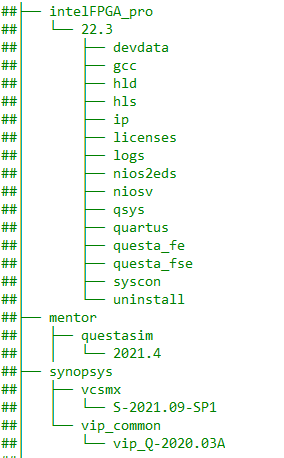
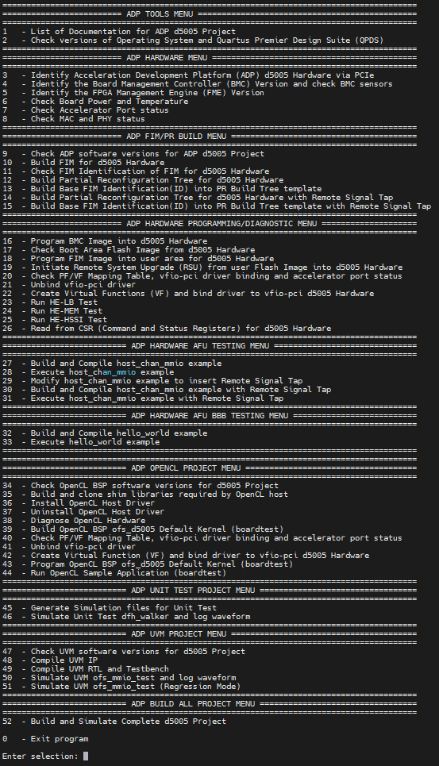
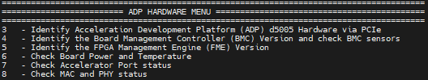
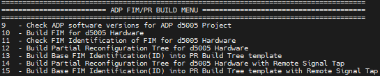
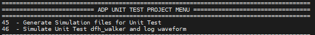
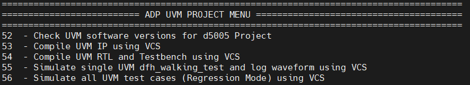
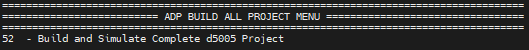
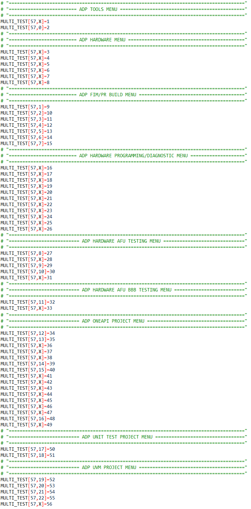
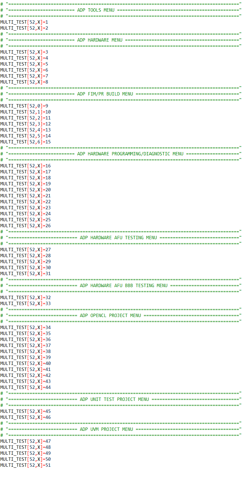

# Platform Evaluation Script: Open FPGA Stack for Intel Stratix 10 FPGA

| Term     | Description                                                  |
| -------- | ------------------------------------------------------------ |
| AER | Advanced Error Reporting, The PCIe AER driver is the extended PCI Express error reporting capability providing more robust error reporting. |
| AFU      | Accelerator Functional Unit, Hardware Accelerator implemented in FPGA logic which offloads a computational operation for an application from the CPU to improve performance. Note: An AFU region is the part of the design where an AFU may reside. This AFU may or may not be a partial reconfiguration region |
| BBB | Basic Building Block, Features within an AFU or part of an FPGA interface that can be reused across designs. These building blocks do not have stringent interface requirements like the FIM's AFU and host interface requires. All BBBs must have a (globally unique identifier) GUID. |
| BKC      | Best Known Configuration, The exact hardware configuration Intel has optimized and validated the solution against. |
| BMC      | Board Management Controller, Acts as the Root of Trust (RoT) on the Intel FPGA PAC platform. Supports features such as power sequence management and board monitoring through on-board sensors. |
| CSR | Command/status registers (CSR) and software interface, OFS uses a defined set of CSR's to expose the functionality of the FPGA to the host software. |
| DFL      | Device Feature List, A concept inherited from OFS. The DFL drivers provide support for FPGA devices that are designed to support the Device Feature List. The DFL, which is implemented in RTL, consists of a self-describing data structure in PCI BAR space that allows the DFL driver to automatically load the drivers required for a given FPGA configuration. |
| FIM      | FPGA Interface Manager, Provides platform management, functionality, clocks, resets and standard interfaces to host and AFUs. The FIM resides in the static region of the FPGA and contains the FPGA Management Engine (FME) and I/O ring. |
| FME      | FPGA Management Engine, Provides a way to manage the platform and enable acceleration functions on the platform. |
| HEM      | Host Exerciser Module, Host exercisers are used to exercise and characterize the various host-FPGA interactions, including Memory Mapped Input/Output (MMIO), data transfer from host to FPGA, PR, host to FPGA memory, etc. |
| Intel FPGA PAC D5005 | Intel FPGA Programmable Acceleration Card D5005, A high performance PCI Express (PCIe)-based FPGA acceleration card for data centers. This card is the target platform for the initial OFS release. |
| Intel VT-d | Intel Virtualization Technology for Directed I/O, Extension of the VT-x and VT-I processor virtualization technologies which adds new support for I/O device virtualization. |
| IOCTL | Input/Output Control, System calls used to manipulate underlying device parameters of special files. |
| JTAG     | Joint Test Action Group, Refers to the IEEE 1149.1 JTAG standard; Another FPGA configuration methodology. |
| MMIO | Memory Mapped Input/Output, Users may map and access both control registers and system memory buffers with accelerators. |
| OFS      | Open FPGA Stack, A modular collection of hardware platform components, open source software, and broad ecosystem support that provides a standard and scalable model for AFU and software developers to optimize and reuse their designs. |
| OPAE SDK | Open Programmable Acceleration Engine Software Development Kit, A collection of libraries and tools to facilitate the development of software applications and accelerators using OPAE. |
| PAC | Programmable Acceleration Card: FPGA based Accelerator card |
| PIM      | Platform Interface Manager, An interface manager that comprises two components: a configurable platform specific interface for board developers and a collection of shims that AFU developers can use to handle clock crossing, response sorting, buffering and different protocols. |
| PR       | Partial Reconfiguration, The ability to dynamically reconfigure a portion of an FPGA while the remaining FPGA design continues to function. In the context of Intel FPGA PAC, a PR bitstream refers to an Intel FPGA PAC AFU. Refer to [Partial Reconfiguration](https://www.intel.com/content/www/us/en/programmable/products/design-software/fpga-design/quartus-prime/features/partial-reconfiguration.html) support page. |
| RSU      | Remote System Update, A Remote System Update operation sends an instruction to the Intel FPGA PAC D5005 device that triggers a power cycle of the card only, forcing reconfiguration. |
| SR-IOV | Single-Root Input-Output Virtualization, Allows the isolation of PCI Express resources for manageability and performance. |
| TB | Testbench, Testbench or Verification Environment is used to check the functional correctness of the Design Under Test (DUT) by generating and driving a predefined input sequence to a design, capturing the design output and comparing with-respect-to expected output. |
| UVM | Universal Verification Methodology, A modular, reusable, and scalable testbench structure via an API framework. |
| VFIO | Virtual Function Input/Output, An IOMMU/device agnostic framework for exposing direct device access to userspace. |

## **1 Overview**


### **1.1 About this Document**


This document serves as a set-up and user guide for the checkout and evaluation of an Intel® FPGA PAC D5005 development platform using Open FPGA Stack (OFS). After reviewing the document, you will be able to:

-   Set-up and modify the script to your environment

-   Compile and simulate an OFS reference design

-   Run hardware and software tests to evaluate the complete OFS flow

#### 1.2 Table : Software Version Summary

| Component | Version |  Description |
| --------- | ------- | -------|
| FPGA Platform | [Intel® FPGA PAC D5005](https://www.intel.com/content/www/us/en/products/details/fpga/platforms/pac/d5005.html) | Intel platform you can use for your custom board development |
| OFS FIM Source Code| [Branch: ofs-d5005](https://github.com/OFS/ofs-d5005), [Tag: release/ofs-2023.3](https://github.com/OFS/ofs-d5005/releases/tag/ofs-2023.3-2) | OFS Shell RTL for Intel Stratix 10 FPGA (targeting Intel® FPGA PAC D5005) |
| OFS FIM Common| [Branch: ofs-2023.3-1](https://github.com/OFS/ofs-fim-common), [Tag: ofs-2023.3-1](https://github.com/OFS/ofs-fim-common/releases/tag/ofs-2023.3-1) | Common RTL across all OFS-based platforms |
| AFU Examples| [Branch: examples-afu](https://github.com/OFS/examples-afu) , [Tag: ofs-examples-ofs-2023.3-1](https://github.com/OFS/examples-afu/releases/tag/ofs-2023.3-1) | Tutorials and simple examples for the Accelerator Functional Unit region (workload region)|
| OPAE SDK | [Branch: 2.10.0-1](https://github.com/OFS/opae-sdk/tree/2.10.0-1), [Tag: 2.10.0-1](https://github.com/OFS/opae-sdk/releases/tag/2.10.0-1) | Open Programmable Acceleration Engine Software Development Kit |
| Kernel Drivers | [Branch: ofs-2023.3-6.1-2](https://github.com/OFS/linux-dfl/tree/ofs-2023.3-6.1-2), [Tag: ofs-2023.3-6.1-2](https://github.com/OFS/linux-dfl/releases/tag/ofs-2023.3-6.1-2) | OFS specific kernel drivers|
| OPAE Simulation| [Branch: opae-sim](https://github.com/OFS/opae-sim), [Tag: 2.10.0-1](https://github.com/OFS/opae-sim/releases/tag/2.10.0-1) | Accelerator Simulation Environment for hardware/software co-simulation of your AFU (workload)|
| Intel Quartus Prime Pro Edition Design Software | 23.3 [Intel® Quartus® Prime Pro Edition Linux](https://www.intel.com/content/www/us/en/software-kit/782411/intel-quartus-prime-pro-edition-design-software-version-23-3-for-linux.html) | Software tool for Intel FPGA Development|
| Operating System | [RHEL 8.6](https://access.redhat.com/downloads/content/479/ver=/rhel---8/8.2/x86_64/product-software) |  Operating system on which this script has been tested |

A download page containing the release and already-compiled FIM binary artifacts that you can use for immediate evaluation on the Intel® FPGA PAC D5005 can be found on the [OFS 2023.3](https://github.com/OFS/ofs-d5005/releases/tag/ofs-2023.3-1) official release drop on GitHub.

<br>

| Term     | Description                                                  |
| -------- | ------------------------------------------------------------ |
| AER | Advanced Error Reporting, The PCIe AER driver is the extended PCI Express error reporting capability providing more robust error reporting. |
| AFU      | Accelerator Functional Unit, Hardware Accelerator implemented in FPGA logic which offloads a computational operation for an application from the CPU to improve performance. Note: An AFU region is the part of the design where an AFU may reside. This AFU may or may not be a partial reconfiguration region |
| BBB | Basic Building Block, Features within an AFU or part of an FPGA interface that can be reused across designs. These building blocks do not have stringent interface requirements like the FIM's AFU and host interface requires. All BBBs must have a (globally unique identifier) GUID. |
| BKC      | Best Known Configuration, The exact hardware configuration Intel has optimized and validated the solution against. |
| BMC      | Board Management Controller, Acts as the Root of Trust (RoT) on the Intel FPGA PAC platform. Supports features such as power sequence management and board monitoring through on-board sensors. |
| CSR | Command/status registers (CSR) and software interface, OFS uses a defined set of CSR's to expose the functionality of the FPGA to the host software. |
| DFL      | Device Feature List, A concept inherited from OFS. The DFL drivers provide support for FPGA devices that are designed to support the Device Feature List. The DFL, which is implemented in RTL, consists of a self-describing data structure in PCI BAR space that allows the DFL driver to automatically load the drivers required for a given FPGA configuration. |
| FIM      | FPGA Interface Manager, Provides platform management, functionality, clocks, resets and standard interfaces to host and AFUs. The FIM resides in the static region of the FPGA and contains the FPGA Management Engine (FME) and I/O ring. |
| FME      | FPGA Management Engine, Provides a way to manage the platform and enable acceleration functions on the platform. |
| HEM      | Host Exerciser Module, Host exercisers are used to exercise and characterize the various host-FPGA interactions, including Memory Mapped Input/Output (MMIO), data transfer from host to FPGA, PR, host to FPGA memory, etc. |
| Intel FPGA PAC D5005 | Intel FPGA Programmable Acceleration Card D5005, A high performance PCI Express (PCIe)-based FPGA acceleration card for data centers. This card is the target platform for the initial OFS release. |
| Intel VT-d | Intel Virtualization Technology for Directed I/O, Extension of the VT-x and VT-I processor virtualization technologies which adds new support for I/O device virtualization. |
| IOCTL | Input/Output Control, System calls used to manipulate underlying device parameters of special files. |
| JTAG     | Joint Test Action Group, Refers to the IEEE 1149.1 JTAG standard; Another FPGA configuration methodology. |
| MMIO | Memory Mapped Input/Output, Users may map and access both control registers and system memory buffers with accelerators. |
| OFS      | Open FPGA Stack, A modular collection of hardware platform components, open source software, and broad ecosystem support that provides a standard and scalable model for AFU and software developers to optimize and reuse their designs. |
| OPAE SDK | Open Programmable Acceleration Engine Software Development Kit, A collection of libraries and tools to facilitate the development of software applications and accelerators using OPAE. |
| PAC | Programmable Acceleration Card: FPGA based Accelerator card |
| PIM      | Platform Interface Manager, An interface manager that comprises two components: a configurable platform specific interface for board developers and a collection of shims that AFU developers can use to handle clock crossing, response sorting, buffering and different protocols. |
| PR       | Partial Reconfiguration, The ability to dynamically reconfigure a portion of an FPGA while the remaining FPGA design continues to function. In the context of Intel FPGA PAC, a PR bitstream refers to an Intel FPGA PAC AFU. Refer to [Partial Reconfiguration](https://www.intel.com/content/www/us/en/programmable/products/design-software/fpga-design/quartus-prime/features/partial-reconfiguration.html) support page. |
| RSU      | Remote System Update, A Remote System Update operation sends an instruction to the Intel FPGA PAC D5005 device that triggers a power cycle of the card only, forcing reconfiguration. |
| SR-IOV | Single-Root Input-Output Virtualization, Allows the isolation of PCI Express resources for manageability and performance. |
| TB | Testbench, Testbench or Verification Environment is used to check the functional correctness of the Design Under Test (DUT) by generating and driving a predefined input sequence to a design, capturing the design output and comparing with-respect-to expected output. |
| UVM | Universal Verification Methodology, A modular, reusable, and scalable testbench structure via an API framework. |
| VFIO | Virtual Function Input/Output, An IOMMU/device agnostic framework for exposing direct device access to userspace. |

## **2 Introduction to OFS Evaluation Script**


By following the setup steps and using the OFS evaluation script you can quickly evaluate many features that the OFS framework provides and also leverage this script for your own development.  

### **2.1 Pre-Requisites**


This script uses the following set of software tools which should be installed using the directory structure below. Tool versions can vary.

* Intel Quartus<sup>&reg;</sup> Prime Pro Software
* Synopsys<sup>&reg;</sup> VCS Simulator
* Siemens<sup>&reg;</sup> Questa<sup>&reg;</sup> Simulator

**Figure 2-1 Folder Hierarchy for Software Tools**




1. You must create a directory named "ofs-X.X.X" where the X represents the current release number, for example ofs-2023.3-2. 

2. You must clone the required OFS repositories as per Figure 2-2 . Please refer to the BKC table for locations., Please go to [OFS Getting Started User Guide] for the instructions for the BKC installation.

3. Once the repositories are cloned, copy the evaluation script (ofs_d5005_eval.sh) which is located at [eval_scripts] beneath the ofs-2023.3-2 directory location as shown in the example below:

**Figure 2-2 Directory Structure for OFS Project**

```sh
## ofs-2023.3-2
##  -> examples-afu
##  -> linux-dfl
##  -> ofs-d5005
##  -> oneapi-asp
##  -> oneAPI-samples
##  -> opae-sdk
##  -> opae-sim
##  -> ofs_d5005_eval.sh
```


4. Open the README file named (README_ofs_D5005_eval.txt) which is located at [eval_scripts] which informs the user which sections to modify in the script prior to building the FIM and running hardware, software and simulation tests. 

### **2.2 Intel® FPGA PAC D5005 Evaluation Script modification**


To adapt this script to the user environment please follow the instructions below which explains which line numbers to change in the ofs_d5005_eval.sh script.

### **User Directory Creation**

The user must create the top-level source directory and then clone the OFS repositories
    

```sh
mkdir ofs-2023.3-2
```

In the example above we have used ofs-2023.3-2 as the directory name


### **Set-Up Proxy Server (lines 65-67)**

Please enter the location of your proxy server to allow access to external internet to build software packages.

Note: Failing to add proxy server will prevent cloning of repositories and the user will be unable to build the OFS framework.
    
```sh
export http_proxy=<user_proxy>
export https_proxy=<user_proxy>
export no_proxy=<user_proxy>
```

### **License Files (lines 70-72)**

Please enter the the license file locations for the following tool variables


```sh
export LM_LICENSE_FILE=<user_license>
export DW_LICENSE_FILE=<user_license>
export SNPSLMD_LICENSE_FILE=<user_license>
```

### **Tools Location (line 85, 86, 87, 88)**

Set Location of Quartus, Synopsys, Questasim and oneAPI Tools


```sh
export QUARTUS_TOOLS_LOCATION=/home
export SYNOPSYS_TOOLS_LOCATION=/home
export QUESTASIM_TOOLS_LOCATION=/home
export ONEAPI_TOOLS_LOCATION=/opt
```


### **Quartus Tools Version (line 93)**

Set version of Quartus


```sh
export QUARTUS_VERSION=23.3
```

In the example above "23.3" is used as the Quartus tools version


### **OPAE Tools (line 106)**

change OPAE SDK VERSION<br>


```sh
export OPAE_SDK_VERSION=2.10.0-1
```

In the example above "2.10.0-1" is used as the OPAE SDK tools version


### **PCIe (Bus Number) (lines 231 and 238)**

The Bus number must be entered by the user after installing the hardware in the chosen server, in the example below "b1" is the Bus Number for a single card as defined in the evaluation script.

```sh
export ADP_CARD0_BUS_NUMBER=b1
```

 The evaluation script uses the bus number as an identifier to interrogate the card. The command below will identify the accelerator card plugged into a server. 

```sh
lspci | grep acc

86:00.0 Processing accelerators: Intel Corporation Device bcce (rev 01)
```

The result identifies the card as being assigned "86" as the bus number so the entry in the script changes to

```sh
export ADP_CARD0_BUS_NUMBER=86
```

The user can also run the following command on the ofs_d5005_eval.sh script to automatically change the bus number to 86 in the ofs_d5005_eval.sh script.

grep -rli '86' * | xargs -i@ sed -i '86' @

if the bus number is 85 for example 

85:00.0 Processing accelerators: Intel Corporation Device bcce (rev 01)

the command to change to 85 in the evaluation script would be

grep -rli '86' * | xargs -i@ sed -i '85' @

The ofs_d5005_eval.sh script has now been modified to the server set-up and the user can proceed to build, compile and simulate the OFS stack

<br>

## **3 Using the Evaluation Script**


### **3.1 Overview**


The evaluation script focuses on different evaluation areas. Each of these menu options is described in the next section.  

The figure below shows a snapshot of the full evaluation script menu showing all 57 options and each one of 10 sub-menus which focus on different areas of evaluation. Each of these menu options is described in the next section.


**Figure 3-1 ofs_d5005_eval.sh Evaluation Menu**



### **3.1.1 TOOLS MENU**


By selecting "List of Documentation for ADP Intel® FPGA PAC D5005 Project," a list of links to the latest OFS documentation appears. Note that these links will take you to documentation for the most recent release which may not correspond to the release version you are evaluating. To find the documentation specific to your release, ensure you clone the intel-ofs-docs tag that corresponds to your OFS version.

By selecting "Check Versions of Operating System and Quartus Premier Design Suite", the tool verifies correct Operating System, Quartus version, kernel parameters, license files and paths to installed software tools.


| Menu Option                                                  | Example Output                                               |
| ------------------------------------------------------------ | ------------------------------------------------------------ |
| 1 - List of Documentation for ADP D5005 Project | Open FPGA Stack Overview Guides you through the setup and build steps to evaluate the OFS solution [https://ofs.github.io](https://ofs.github.io/) |
| 2 - Check versions of Operating System and Quartus Premier Design Suite (QPDS) | Checking Linux release <br />Linux version 6.1.41-dfl <br /><br />Checking RedHat release <br />Red Hat Enterprise Linux release RHEL 8.6  <br /><br />Checking Ubuntu release cat: /etc/lsb-release: No such file or directory  <br /><br />Checking Kernel parameters <br />BOOT_IMAGE=(hd0,msdos1)/vmlinuz-6.1.41-dfl-2023.3-1 root=/dev/mapper/rhel-root ro crashkernel=auto resume=/dev/mapper/rhel-swap rd.lvm.lv=rhel/root rd.lvm.lv=rhel/swap rhgb quiet intel_iommu=on pcie=realloc hugepagesz=2M hugepages=200  <br /><br />Checking Licenses LM_LICENSE_FILE is set to port@socket number:port@socket number DW_LICENSE_FILE is set to port@socket number:port@socket number SNPSLMD_LICENSE_FILE is set to port@socket number:port@socket number  <br /><br />Checking Tool versions QUARTUS_HOME is set to /home/intelFPGA_pro/23.3/quartus QUARTUS_ROOTDIR is set to /home/intelFPGA_pro/23.3/quartus IMPORT_IP_ROOTDIR is set to /home/intelFPGA_pro/23.3/quartus/../ip QSYS_ROOTDIR is set to /home/intelFPGA_pro/23.3/quartus/../qsys/bin  <br />Checking QPDS Patches Quartus Prime Shell Version 23.3 |


### **3.1.2 HARDWARE MENU**


Identifies card by PCIe number, checks power, temperature and current firmware configuration.



| Menu Option                                                  | Example Output                                               |
| ------------------------------------------------------------ | ------------------------------------------------------------ |
| 3 - Identify Acceleration Development Platform (ADP) D5005 Hardware via PCIe | PCIe card detected as 86:00.0 Processing accelerators: Intel Corporation Device bcce (rev 01) Host Server is connected to SINGLE card configuration |
| 4 - Identify the Board Management Controller (BMC) Version and check BMC sensors | Intel FPGA Programmable Acceleration Card D5005<br/>Board Management Controller, MAX10 NIOS FW version: 2.0.14<br/>Board Management Controller, MAX10 Build version: 2.0.8<br/>//****** BMC SENSORS ******//<br/>Object Id : 0xF000000<br/>PCIe s:b:d.f : 0000:86:00.0<br/>Vendor Id : 0x8086<br/>Device Id : 0xBCCE<br/>SubVendor Id : 0x8086<br/>SubDevice Id : 0x138D<br/>Socket Id : 0x00<br/>Ports Num : 01<br/>Bitstream Id : 288511863935352239<br/>Bitstream Version : 4.0.1<br/>Pr Interface Id : b2d7971b-dd7e-53c4-a4d0-34e6c9391a98 |
| 5 - Identify the FPGA Management Engine (FME) Version        | Intel FPGA Programmable Acceleration Card D5005<br/>Board Management Controller, MAX10 NIOS FW version: 2.0.14<br/>Board Management Controller, MAX10 Build version: 2.0.8<br/>//****** FME ******//<br/>Object Id : 0xF000000<br/>PCIe s:b:d.f : 0000:86:00.0<br/>Vendor Id : 0x8086<br/>Device Id : 0xBCCE<br/>SubVendor Id : 0x8086<br/>SubDevice Id : 0x138D<br/>Socket Id : 0x00<br/>Ports Num : 01<br/>Bitstream Id : 288511863935352239<br/>Bitstream Version : 4.0.1<br/>Pr Interface Id : b2d7971b-dd7e-53c4-a4d0-34e6c9391a98<br/>Boot Page : user |
| 6 - Check Board Power and Temperature                        | Intel FPGA Programmable Acceleration Card D5005<br/>Board Management Controller, MAX10 NIOS FW version: 2.0.14<br/>Board Management Controller, MAX10 Build version: 2.0.8<br/>//****** POWER ******//<br/>Object Id : 0xF000000<br/>PCIe s:b:d.f : 0000:86:00.0<br/>Vendor Id : 0x8086<br/>Device Id : 0xBCCE<br/>SubVendor Id : 0x8086<br/>SubDevice Id : 0x138D<br/>Socket Id : 0x00<br/>Ports Num : 01<br/>Bitstream Id : 288511863935352239<br/>Bitstream Version : 4.0.1<br/>Pr Interface Id : b2d7971b-dd7e-53c4-a4d0-34e6c9391a98<br/>( 1) VCCERAM Voltage : 0.90 Volts<br/>etc ......................<br/><br/>Intel FPGA Programmable Acceleration Card D5005<br/>Board Management Controller, MAX10 NIOS FW version: 2.0.14<br/>Board Management Controller, MAX10 Build version: 2.0.8<br/>//****** TEMP ******//<br/>Object Id : 0xF000000<br/>PCIe s:b:d.f : 0000:86:00.0<br/>Vendor Id : 0x8086<br/>Device Id : 0xBCCE<br/>SubVendor Id : 0x8086<br/>SubDevice Id : 0x138D<br/>Socket Id : 0x00<br/>Ports Num : 01<br/>Bitstream Id : 288511863935352239<br/>Bitstream Version : 4.0.1<br/>Pr Interface Id : b2d7971b-dd7e-53c4-a4d0-34e6c9391a98<br/>( 1) VCCT Temperature : 57.00 Celsius<br/>etc ...................... |
| 7 - Check Accelerator Port status                            | //****** PORT ******// Object Id : 0xEF00000<br/>PCIe s:b:d.f : 0000:86:00.0<br/>Vendor Id : 0x8086<br/>Device Id : 0xBCCE<br/>SubVendor Id : 0x8086<br/>SubDevice Id : 0x138D<br/>Socket Id : 0x00 |
| 8 - Check MAC and PHY status                                 | Intel FPGA Programmable Acceleration Card D5005<br/>Board Management Controller, MAX10 NIOS FW version: 2.0.14<br/>Board Management Controller, MAX10 Build version: 2.0.8<br/>//****** MAC ******//<br/>Object Id : 0xF000000<br/>PCIe s:b:d.f : 0000:86:00.0<br/>Vendor Id : 0x8086<br/>Device Id : 0xBCCE<br/>SubVendor Id : 0x8086<br/>SubDevice Id : 0x138D<br/>Socket Id : 0x00<br/>Ports Num : 01<br/>Bitstream Id : 288511863935352239<br/>Bitstream Version : 4.0.1<br/>Pr Interface Id : b2d7971b-dd7e-53c4-a4d0-34e6c9391a98<br/>MAC address : 64:4c:36:f:44:1f<br/><br/>Intel FPGA Programmable Acceleration Card D5005<br/>Board Management Controller, MAX10 NIOS FW version: 2.0.14<br/>Board Management Controller, MAX10 Build version: 2.0.8<br/>//****** PHY ******//<br/>Object Id : 0xF000000<br/>PCIe s:b:d.f : 0000:86:00.0<br/>Vendor Id : 0x8086<br/>Device Id : 0xBCCE<br/>SubVendor Id : 0x8086<br/>SubDevice Id : 0x138D<br/>Socket Id : 0x00<br/>Ports Num : 01<br/>Bitstream Id : 288511863935352239<br/>Bitstream Version : 4.0.1<br/>Pr Interface Id : b2d7971b-dd7e-53c4-a4d0-34e6c9391a98 |

### **3.1.3 FIM/PR BUILD MENU**


Builds FIM, Partial Reconfiguration Region and Remote Signal Tap




| Menu Option                                                  | Description                                                  |
| ------------------------------------------------------------ | ------------------------------------------------------------ |
| 9 - Check ADP software versions for ADP Intel® FPGA PAC D5005 Project | OFS_ROOTDIR is set to /home/user_area/ofs-2023.3-2/ofs-d5005<br />OPAE_SDK_REPO_BRANCH is set to release/2.10.0-1 <br />OPAE_SDK_ROOT is set to /home/user_area/ofs-2023.3-2/ofs-d5005/../opae-sdk <br />LD_LIBRARY_PATH is set to /home/user_area/ofs-2023.3-2/ofs-d5005/../opae-sdk/lib64: |
| 10 - Build FIM for Intel® FPGA PAC D5005 Hardware           | This option builds the FIM based on the setting for the $ADP_PLATFORM, $FIM_SHELL environment variable. <br />Check these variables in the following file ofs_d5005_eval.sh |
| 11 - Check FIM Identification of FIM for Intel® FPGA PAC D5005 Hardware | The FIM is identified by the following file fme-ifc-id.txt located at $OFS_ROOTDIR/$FIM_WORKDIR/syn/syn_top/ |
| 12 - Build Partial Reconfiguration Tree for Intel® FPGA PAC D5005 Hardware | This option builds the Partial Reconfiguration Tree which is needed for AFU testing/development and also for the OneAPI build flow |
| 13 - Build Base FIM Identification(ID) into PR Build Tree template | This option copies the contents of the fme-ifc-id.txt into the Partial Reconfiguration Tree to allow the FIM amd Partial Reconfiguration Tree to match and hence allow subsequent insertion of AFU and OneAPI workloads |
| 14 - Build Partial Reconfiguration Tree for Intel® FPGA PAC D5005 Hardware with Remote Signal Tap | This option builds the Partial Reconfiguration Tree which is needed for AFU testing/development and also for the OneAPI build flow and for the Remote Signal Tap flow |
| 15 - Build Base FIM Identification(ID) into PR Build Tree template with Remote Signal Tap | This option copies the contents of the fme-ifc-id.txt into the Partial Reconfiguration Tree for Remote Signal Tap to allow the FIM amd Partial Reconfiguration Tree to match and hence allow subsequent insertion of AFU and OneAPI workloads |


### **3.1.4 HARDWARE PROGRAMMING/DIAGNOSTIC MENU**


The following submenu allows you to:
* Program and check flash 
* Perform a remote system update (RSU) of the FPGA image into the FPGA
* Bind virtual functions to VFIO PCIe driver 
* Run host exerciser (HE) commands such as loopback to test interfaces VFIO PCI driver binding
* Read the control and status registers (CSRs) for bound modules that are part of the OFS reference design.


| Menu Option                                                  | Description                                                  |
| ------------------------------------------------------------ | ------------------------------------------------------------ |
| 16 - Program BMC Image into Intel® FPGA PAC D5005 Hardware  | The user must place a new BMC flash file in the following directory $OFS_ROOTDIR/bmc_flash_files. Once the user executes this option a new BMC image will be programmed. A remote system upgrade command is initiated to store the new BMC image |
| 17 - Check Boot Area Flash Image from Intel® FPGA PAC D5005 Hardware | This option checks which location area in FLASH the image will boot from, the default is user1  Boot Page : user1 |
| 18 - Program FIM Image into user1 area for Intel® FPGA PAC D5005 Hardware | This option programs the FIM image "D5005_page1_unsigned.bin" into user1 area in flash |
| 19 - Initiate Remote System Upgrade (RSU) from user1 Flash Image into Intel® FPGA PAC D5005 Hardware | This option initiates a Remote System Upgrade and soft reboots the server and re-scans the PCIe bus for the new image to be loaded  <br /><br />2022-12-13 07:31:33,244 - [[pci_address(0000:86:00.0), pci_id(0x8086, 0xbcce, 0x8086, 0x138d)]] performing RSU operation <br />2022-12-13 07:31:33,249 - [[pci_address(0000:85:00.0), pci_id(0x8086, 0x2030, 0x1590, 0x00ea)]] removing device from PCIe bus <br />2022-12-13 07:31:34,333 - waiting 10.0 seconds for boot <br />2022-12-13 07:31:44,344 - rescanning PCIe bus: /sys/devices/pci0000:85/pci_bus/0000:85 2022-12-13 07:31:44,377 - RSU operation complete |
| 20 - Check PF/VF Mapping Table, vfio-pci driver binding and accelerator port status | This option checks the current vfio-pci driver binding for the PF's and VF's |
| 21 - Unbind vfio-pci driver                                  | This option unbinds the vfio-pci driver for the PF's and VF's |
| 22 - Create Virtual Functions (VF) and bind driver to vfio-pci Intel® FPGA PAC D5005 Hardware | This option creates vfio-pci driver binding for the PF's and VF's Once the VF's have been bound to the driver the user can select menu option 20 to check that the new drivers are bound |
| 23 - Run HE-LB Test                                          | This option runs 5 tests  1) checks and generates traffic with the intention of exercising the path from the AFU to the Host at full bandwidth 2) run a loopback throughput test using one cacheline per request 3) run a loopback read test using four cachelines per request 4) run a loopback write test using four cachelines per request 5) run a loopback throughput test using four cachelines per request |
| 24 - Run HE-MEM Test                                         | This option runs 2 tests  1) Checking and generating traffic with the intention of exercising the path from FPGA connected DDR; data read from the host is written to DDR, and the same data is read from DDR before sending it back to the host 2) run a loopback throughput test using one cacheline per request |
| 25 - Run HE-HSSI Test                                        | This option runs 1 test  HE-HSSI is responsible for handling client-side ethernet traffic. It wraps the 10G and 100G HSSI AFUs, and includes a traffic generator and checker. The user-space tool hssi exports a control interface to the HE-HSSI's AFU's packet generator logic  1) Send traffic through the 10G AFU |
| 26 - Read from CSR (Command and Status Registers) for Intel® FPGA PAC D5005 Hardware | This option reads from the following CSR's HE-LB Command and Status Register Default Definitions HE-MEM Command and Status Register Default Definitions HE-HSSI Command and Status Register Default Definitions |


### **3.1.5  HARDWARE AFU TESTING MENU**


This submenu tests partial reconfiguration by building and loading an memory-mapped I/O example AFU/workload, executes software from host, and tests remote signal tap.


| Menu Option                                                  | Description                                                  |
| ------------------------------------------------------------ | ------------------------------------------------------------ |
| 27 - Build and Compile host_chan_mmio example                | This option builds the host_chan_mmio example from the following repo $OFS_PLATFORM_AFU_BBB_EXTERNAL/plat_if_tests/$AFU_TEST_NAME, where AFU_TEST_NAME=host_chan_mmio. This produces a GBS (Green Bit Stream) binary file ready for hardware programming |
| 28 - Execute host_chan_mmio example                          | This option builds the host code for host_chan_mmio example and programs the GBS file and then executes the test |
| 29 - Modify host_chan_mmio example to insert Remote Signal Tap | This option inserts a pre-defined host_chan_mmio.stp Signal Tap file into the OFS code to allow a user to debug the host_chan_mmio AFU example |
| 30 - Build and Compile host_chan_mmio example with Remote Signal Tap | This option builds the host_chan_mmio example from the following repo $OFS_PLATFORM_AFU_BBB_EXTERNAL/plat_if_tests/$AFU_TEST_NAME, where AFU_TEST_NAME=host_chan_mmio. This produces a GBS (Green Bit Stream) binary file ready for hardware programming with Remote Signal tap enabled |
| 31 - Execute host_chan_mmio example with Remote Signal Tap   | This option builds the host code for host_chan_mmio example and programs the GBS file and then executes the test. The user must open the Signal Tap window when running the host code to see the transactions in the Signal Tap window |


### **3.1.6 HARDWARE AFU BBB TESTING MENU**


This submenu tests partial reconfiguration using a hello_world example AFU/workload, executes sw from the host


| Menu Option                                | Description                                                  |
| ------------------------------------------ | ------------------------------------------------------------ |
| 32 - Build and Compile hello_world example | This option builds the hello_ world example from the following repo $FPGA_BBB_CCI_SRC/tutorial/afu_types/01_pim_ifc/$AFU_BBB_TEST_NAME, where AFU_BBB_NAME=hello_world. This produces a GBS (Green Bit Stream) file ready for hardware programming |
| 33 - Execute hello_world example           | This option builds the host code for hello_world example and programs the GBS file and then executes the test |


### **3.1.7 ADP ONEAPI PROJECT MENU**


Builds OneAPI kernel, executes the software from host and runs diagnostic tests


| Menu Option                                                  | Result                                                       |
| ------------------------------------------------------------ | ------------------------------------------------------------ |
| 34 - Check oneAPI software versions for Intel® FPGA PAC D5005 Project | This option checks the setup of the oneAPI software and adds the relevant oneAPI environment variables to the terminal. This option also informs the user to match the oneAPI software version to the oneAPI-samples version |
|                                                              |                                                              |
| 35 - Build and clone shim libraries required by oneAPI host  | This option builds the oneAPI directory structure            |
| 36 - Install OneAPI Host Driver                              | This option Installs the oneAPI Host driver at the following location /opt/Intel/OpenCLFPGA/oneAPI/Boards/, and requires sudo permission |
| 37 - Uninstall One API Host Driver                           | This option Uninstall's the oneAPI Host driver, and requires sudo permissions |
| 38 - Diagnose oneAPI Hardware                                | This option Checks ICD (Intel Client Driver) and FCD (FPGA Client Driver), oneAPI library locations and detects whether oneAPI BSP is loaded into the FPGA |
| 39 - Build oneAPI BSP ofs-d5005 Default Kernel (hello_world) | This option Builds the oneAPI BSP using hello_world kernel   |
| 40 - Build oneAPI MakeFile Environment                       | This option Builds the oneAPI environment using a Makefile for kernel insertion |
| 41 - Compile oneAPI Sample Application (board_test) for Emulation | This option compiles the board_test kernel for Emulation     |
| 42 - Run oneAPI Sample Application (board_test) for Emulation | This option executes the board_test kernel for Emulation     |
| 43 - Generate oneAPI Optimization report for (board_test)    | This option generates an optimization report for the board_test kernel |
| 44 - Check PF/VF Mapping Table, vfio-pci driver binding and accelerator port status | This option checks the current vfio-pci driver binding for the PF's and VF's |
| 45 - Unbind vfio-pci driver                                  | This option unbinds the vfio-pci driver for the PF's and VF's |
| 46 - Create Virtual Function (VF) and bind driver to vfio-pci Intel® FPGA PAC D5005 Hardware | This option creates vfio-pci driver binding for the PF's and VF's Once the VF's have been bound to the driver the user can select menu option 45 to check that the new drivers are bound |
| 47 - Program oneAPI BSP ofs-d5005 Default Kernel (hello_world) | This option programs the FPGA with a aocx file based on the hello_world kernel |
| 48 - Compile oneAPI Sample Application (board_test) for Hardware | This option compiles the board_test kernel for Hardware      |
| 49 - Run oneAPI Sample Application (board_test) for Hardware | This option builds the host code for board_test kernel and executes the program running through kernel and host bandwidth tests |


### **3.1.8 UNIT TEST PROJECT MENU**


Builds, compiles and runs standalone simulation block tests. More unit test examples are found at the following location ofs-d5005/sim/unit_test 



| Menu Option                                         | Result                                                       |
| --------------------------------------------------- | ------------------------------------------------------------ |
| 50 - Generate Simulation files for Unit Test        | This option builds the simulation file set for running a unit test simulation |
| 51 - Simulate Unit Test dfh_walker and log waveform | This option runs the dfh_walker based on the environment variable "UNIT_TEST_NAME=dfh_walker" in the evaluation script. A user can change the test being run by modifying this variable |


### **3.1.9 ADP UVM PROJECT MENU**


Builds, compiles and runs full chip simulation tests. The user should execute the options sequentially ie 52, 53, 54 and 55





| Menu Option                                                  | Description                                                  |
| ------------------------------------------------------------ | ------------------------------------------------------------ |
| 52 - Check UVM software versions for Intel® FPGA PAC D5005 Project | DESIGNWARE_HOME is set to /home/synopsys/vip_common/vip_Q-2020.03A UVM_HOME is set to /home/synopsys/vcsmx/S-2021.09-SP1/linux64/rhel/etc/uvm VCS_HOME is set to /home/synopsys/vcsmx/S-2021.09-SP1/linux64/rhel VERDIR is set to /home/user_area/ofs-2023.3-2/ofs-d5005/verification VIPDIR is set to /home/user_area/ofs-2023.3-2/ofs-d5005/verification |
| 53 - Compile UVM IP                                          | This option compiles the UVM IP                              |
| 54 - Compile UVM RTL and Testbench                           | This option compiles the UVM RTL and Testbench               |
| 55 - Simulate UVM ofs_mmio_test and log waveform             | This option runs the dfh_walking test based on the environment variable "UVM_TEST_NAME=dfh_walking_test" in the evaluation script. A user can change the test being run by modifying this variable |
| 56 - Simulate all UVM test cases (Regression Mode)           | This option runs the Intel® FPGA PAC D5005 regression mode, cycling through all UVM tests defined in /ofs-d5005/verification/tests/test_pkg.svh file |


### **3.1.10 ADP BUILD ALL PROJECT MENU**


Builds the complete OFS flow, good for regression testing and overnight builds

For this menu, a user can run a sequence of tests (compilation, build and simulation) and executes them sequentially. After the script is successfully executed, a set of binary files is produced which a you can use to evaluate your hardware. Log files are also produced which checks whether the tests passed.

 A user can run a sequence of tests and execute them sequentially. In the example below when the user selects option 57 from the main menu the script will execute 23 tests ie (main menu options 2, 9, 10, 11, 12, 13, 14, 15, 27, 29, 30, 32, 34, 35, 39, 40, 48, 50, 51, 52, 53, 54 and 55. These 23 menu options are chosen to build the complete OFS flow covering build, compile and simulation.





| Menu Option                                                  | Result                                                       |
| ------------------------------------------------------------ | ------------------------------------------------------------ |
| 57 - Build and Simulate Complete Intel® FPGA PAC D5005  Project | Generating Log File with date and timestamp Log file written to /home/user_area/ofs-2023.3-2/log_files/D5005_log_2022_11_10-093649/ofs-d5005_eval.log |

**Definition of Multi-Test Set-up**


Menu Option 57 above in the evaluation script can be refined to tailor the number of tests the users runs. The set-up is principally defined by the variable below

MULTI_TEST[A,B]=C

where

A= Total Number of menu options in script<br>
B= Can be changed to a number to select the test order<br>
C= Menu Option in Script<br>

Example 1<br>
MULTI_TEST[57,0]=2

A= 57 is the total number of options in the script<br>
B= 0 indicates that this is the first test to be run in the script<br>
C= Menu option in Script ie 2- List of Documentation for ADP Intel® FPGA PAC D5005 Project<br>

Example 2<br>
MULTI_TEST[57,0]=2<br>
MULTI_TEST[57,1]=9<br>

In the example above two tests are run in order ie 0, and 1 and the following menu options are executed ie 2- List of Documentation for ADP Intel® FPGA PAC D5005 Project and 9 - Check ADP software versions for ADP Intel® FPGA PAC D5005 Project

The user can also modify the build time by de-selecting options they do not wish to use, see below for a couple of use-case scenarios.

**Default User Case**

A user can run a sequence of tests and execute them sequentially. In the example below when the user selects option 57 from the main menu the script will execute 23 tests ie (main menu options 2, 9, 10, 11, 12, 13, 14, 15, 27, 29, 30, 32, 34, 35, 39, 40, 48, 50, 51, 52, 53, 54 and 55. All other tests with an "X" indicates do not run that test



**User Case for ADP FIM/PR BUILD MENU**

In the example below when the user selects option 57 from the main menu the script will only run options from the ADP FIM/PR BUILD MENU (7 options, main menu options 9, 10, 11, 12, 13, 14 and 15). All other tests with an "X" indicates do not run that test.



<br>

## **4 Common Test Scenarios**

This section will describe the most common compile build scenarios if a user wanted to evaluate an acceleration card on their server. The Pre-requisite column indicates the menu commands that must be run before executing the test eg To run Test 5 then a user needs to have run option 10, 12 and 13 before running options 20, 21, 22, 27 and 28.

| Test   | Test Scenario                                                | Pre-Requisite Menu Option | Menu Option                                |
| ------ | ------------------------------------------------------------ | ------------------------- | ------------------------------------------ |
| Test 1 | FIM Build                                                    | -                         | 10                                         |
|        |                                                              |                           |                                            |
| Test 2 | Partial Reconfiguration Build                                | 10                        | 12                                         |
|        |                                                              |                           |                                            |
| Test 3 | Program FIM and perform Remote System Upgrade                | 10                        | 18, 19                                     |
|        |                                                              |                           |                                            |
| Test 4 | Bind PF and VF to vfio-pci drivers                           | -                         | 20, 21, 22                                 |
|        |                                                              |                           |                                            |
| Test 5 | Build, compile and test AFU on hardware                      | 10, 12, 13                | 20, 21, 22, 27, 28                         |
|        |                                                              |                           |                                            |
| Test 6 | Build, compile and test AFU Basic Building Blocks on hardware | 10, 12, 13                | 20, 21, 22, 32, 33                         |
|        |                                                              |                           |                                            |
| Test 7 | Build, compile and test oneAPI on hardware                   | 10, 12, 13                | 34, 35, 36, 39, 40, 44, 45, 46, 47, 48, 49 |
|        |                                                              |                           |                                            |
| Test 8 | Build and Simulate Unit Tests                                | -                         | 50, 51                                     |
|        |                                                              |                           |                                            |
| Test 9 | Build and Simulate UVM Tests                                 | -                         | 52, 53, 54, 55                             |

## Notices & Disclaimers

Intel<sup>&reg;</sup> technologies may require enabled hardware, software or service activation.
No product or component can be absolutely secure. 
Performance varies by use, configuration and other factors.
Your costs and results may vary. 
You may not use or facilitate the use of this document in connection with any infringement or other legal analysis concerning Intel products described herein. You agree to grant Intel a non-exclusive, royalty-free license to any patent claim thereafter drafted which includes subject matter disclosed herein.
No license (express or implied, by estoppel or otherwise) to any intellectual property rights is granted by this document, with the sole exception that you may publish an unmodified copy. You may create software implementations based on this document and in compliance with the foregoing that are intended to execute on the Intel product(s) referenced in this document. No rights are granted to create modifications or derivatives of this document.
The products described may contain design defects or errors known as errata which may cause the product to deviate from published specifications.  Current characterized errata are available on request.
Intel disclaims all express and implied warranties, including without limitation, the implied warranties of merchantability, fitness for a particular purpose, and non-infringement, as well as any warranty arising from course of performance, course of dealing, or usage in trade.
You are responsible for safety of the overall system, including compliance with applicable safety-related requirements or standards. 
<sup>&copy;</sup> Intel Corporation.  Intel, the Intel logo, and other Intel marks are trademarks of Intel Corporation or its subsidiaries.  Other names and brands may be claimed as the property of others. 

OpenCL and the OpenCL logo are trademarks of Apple Inc. used by permission of the Khronos Group™. 
 
