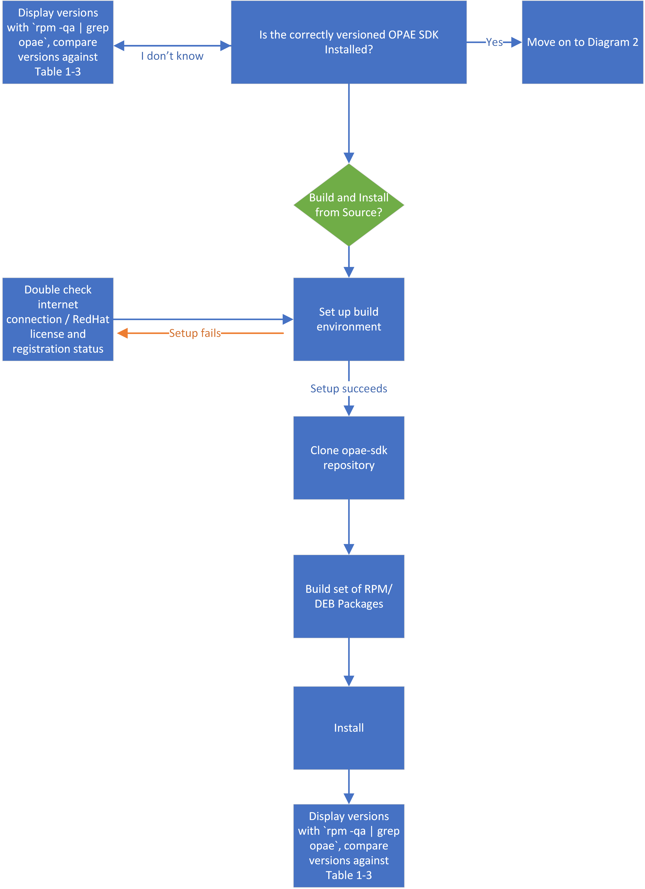
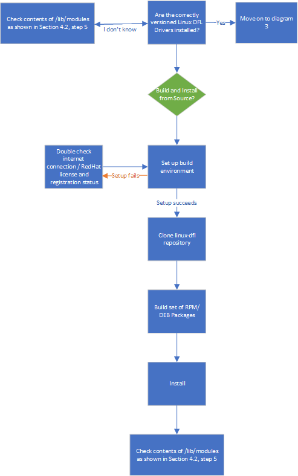
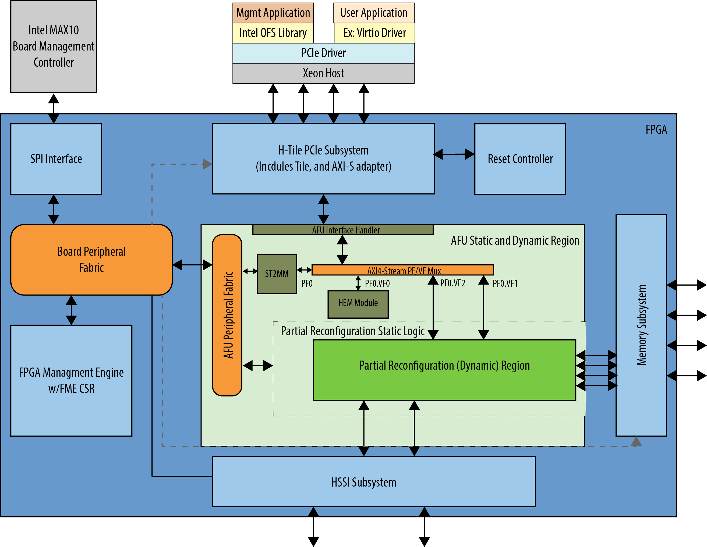

# Getting Started Guide: Open FPGA Stack for Intel Stratix 10


## **1.0 Introduction**


### **1.1 About This Document**

This document helps users get started in evaluating Open FPGA Stack (OFS) for Intel® Stratix 10® FPGA targeting the Intel® FPGA PAC D5005. After reviewing the document a user shall be able to:

- Set up a development environment with all OFS ingredients
- Build and install the OFS Linux Kernel drivers
- Build and install the Open Programmable Acceleration Engine Software Development Kit (OPAE SDK) software on top of the OFS Linux kernel drivers
- Flash an OFS FIM binary onto the Intel® FPGA PAC D5005
- Verify the functionality of OFS on an Intel® FPGA PAC D5005 board
- Know where to find additional information on all OFS ingredients

The following flow charts show a high level overview of the initial bringup process, split into three sequential diagrams.

#### Diagram 1: Installing the OPAE SDK



#### Diagram 2: Installing the Linux DFL Drivers



#### Diagram 3: Bringing up the Intel D5005


### 1.2 Terminology


<br>

| Term     | Description                                                  |
| -------- | ------------------------------------------------------------ |
| AER | Advanced Error Reporting, The PCIe AER driver is the extended PCI Express error reporting capability providing more robust error reporting. |
| AFU      | Accelerator Functional Unit, Hardware Accelerator implemented in FPGA logic which offloads a computational operation for an application from the CPU to improve performance. Note: An AFU region is the part of the design where an AFU may reside. This AFU may or may not be a partial reconfiguration region |
| BBB | Basic Building Block, Features within an AFU or part of an FPGA interface that can be reused across designs. These building blocks do not have stringent interface requirements like the FIM's AFU and host interface requires. All BBBs must have a (globally unique identifier) GUID. |
| BKC      | Best Known Configuration, The exact hardware configuration Intel has optimized and validated the solution against. |
| BMC      | Board Management Controller, Acts as the Root of Trust (RoT) on the Intel FPGA PAC platform. Supports features such as power sequence management and board monitoring through on-board sensors. |
| CSR | Command/status registers (CSR) and software interface, OFS uses a defined set of CSR's to expose the functionality of the FPGA to the host software. |
| DFL      | Device Feature List, A concept inherited from OFS. The DFL drivers provide support for FPGA devices that are designed to support the Device Feature List. The DFL, which is implemented in RTL, consists of a self-describing data structure in PCI BAR space that allows the DFL driver to automatically load the drivers required for a given FPGA configuration. |
| FIM      | FPGA Interface Manager, Provides platform management, functionality, clocks, resets and standard interfaces to host and AFUs. The FIM resides in the static region of the FPGA and contains the FPGA Management Engine (FME) and I/O ring. |
| FME      | FPGA Management Engine, Provides a way to manage the platform and enable acceleration functions on the platform. |
| HEM      | Host Exerciser Module, Host exercisers are used to exercise and characterize the various host-FPGA interactions, including Memory Mapped Input/Output (MMIO), data transfer from host to FPGA, PR, host to FPGA memory, etc. |
| Intel FPGA PAC D5005 | Intel FPGA Programmable Acceleration Card D5005, A high performance PCI Express (PCIe)-based FPGA acceleration card for data centers. This card is the target platform for the initial OFS release. |
| Intel VT-d | Intel Virtualization Technology for Directed I/O, Extension of the VT-x and VT-I processor virtualization technologies which adds new support for I/O device virtualization. |
| IOCTL | Input/Output Control, System calls used to manipulate underlying device parameters of special files. |
| JTAG     | Joint Test Action Group, Refers to the IEEE 1149.1 JTAG standard; Another FPGA configuration methodology. |
| MMIO | Memory Mapped Input/Output, Users may map and access both control registers and system memory buffers with accelerators. |
| OFS      | Open FPGA Stack, A modular collection of hardware platform components, open source software, and broad ecosystem support that provides a standard and scalable model for AFU and software developers to optimize and reuse their designs. |
| OPAE SDK | Open Programmable Acceleration Engine Software Development Kit, A collection of libraries and tools to facilitate the development of software applications and accelerators using OPAE. |
| PAC | Programmable Acceleration Card: FPGA based Accelerator card |
| PIM      | Platform Interface Manager, An interface manager that comprises two components: a configurable platform specific interface for board developers and a collection of shims that AFU developers can use to handle clock crossing, response sorting, buffering and different protocols. |
| PR       | Partial Reconfiguration, The ability to dynamically reconfigure a portion of an FPGA while the remaining FPGA design continues to function. In the context of Intel FPGA PAC, a PR bitstream refers to an Intel FPGA PAC AFU. Refer to [Partial Reconfiguration](https://www.intel.com/content/www/us/en/programmable/products/design-software/fpga-design/quartus-prime/features/partial-reconfiguration.html) support page. |
| RSU      | Remote System Update, A Remote System Update operation sends an instruction to the Intel FPGA PAC D5005 device that triggers a power cycle of the card only, forcing reconfiguration. |
| SR-IOV | Single-Root Input-Output Virtualization, Allows the isolation of PCI Express resources for manageability and performance. |
| TB | Testbench, Testbench or Verification Environment is used to check the functional correctness of the Design Under Test (DUT) by generating and driving a predefined input sequence to a design, capturing the design output and comparing with-respect-to expected output. |
| UVM | Universal Verification Methodology, A modular, reusable, and scalable testbench structure via an API framework. |
| VFIO | Virtual Function Input/Output, An IOMMU/device agnostic framework for exposing direct device access to userspace. |


### **1.3 Introduction to OFS**

Each OFS reference FIM targets a specific platform, but the modular hardware, software, simulation and test infrastructure allows you to modify each part of the design and test environment for your own custom acceleration platform card. The current OFS reference FIM for Stratix 10 FPGA targets the Intel® FPGA PAC D5005 board. This document focuses exclusively on the OFS release targeting the Intel® FPGA PAC D5005 board.

The OFS repositories (in [OFS](https://github.com/OFS) ) on GitHub provide the following components targeting an Intel® FPGA PAC D5005:

- **opae-sdk**: Contains the Open Programmable Acceleration Software Development Kit source code and build scripts.
The following submodule repositories are contained within `opae-sdk`
- **linux-dfl**: Contains Linux kernel-level driver source code and build scripts.
- **intel-ofs-fim**: Contains the source code, build scripts and verification suite for FPGA RTL source code
- **ofs-hld-shim**: Contains the necessary files to generate Shim/BSP for OFS Cards, using OPAE SDK Interfaces.


### **1.4 Intended Audience**

The information in this document is intended for customers evaluating the Open FPGA Stack for Intel® Stratix 10® FPGA on the Intel PAC D5005. This document will cover key topics related to initial setup and development, with links for deeper dives on the topics discussed therein.


### **1.5 Reference Documents**

Please refer to the README on the OFS GitHub for an updated list of collateral on the [OFS GitHub page](https://ofs.github.io).


### **1.6 Component Version Summary**

The OFS 2023.2 Release targeting the Intel® Stratix 10® FPGA is built upon tightly coupled software and firmware versions. Use this section as a general reference for the versions which comprise this release.

The following table highlights the hardware which makes up the Best Known Configuration (BKC) for the OFS 2023.2 release.


#### Table 1-2: Hardware BKC

| Component |
| --------- |
| 1 x Intel® FPGA PAC D5005 |
| 1 x [Supported Server Model](https://www.intel.com/content/www/us/en/products/details/fpga/platforms/pac/d5005/view.html) |
| 1 x [Intel FPGA Download Cable II](https://www.intel.com/content/www/us/en/products/details/fpga/development-kits/cables-adapters.html)   **(Optional, only required if loading images via JTAG)*|

The following table highlights the versions of the software which comprise the OFS stack. The installation of the user-space OPAE SDK on top of the kernel-space linux-dfl drivers is discussed in subsequent sections of this document.


#### Table 1-3: Software Version Summary

| Component | Version |
| --------- | ------- |
| FPGA Platform | [Intel® FPGA PAC D5005](https://www.intel.com/content/www/us/en/products/details/fpga/platforms/pac/d5005.html) |
| OPAE SDK | [Tag: 2.8.0-1](https://github.com/OFS/opae-sdk/releases/tag/2.8.0-1) |
| Kernel Drivers | [Tag: ofs-2023.2-6.1-1](https://github.com/OPAE/linux-dfl/releases/tag/ofs-2023.2-6.1-1) |
| OFS FIM Source Code| [Branch: release/ofs-2023.1](https://github.com/OFS/ofs-fim-common/tree/release/ofs-2023.1) |
| Intel Quartus Prime Pro Edition Design Software | 23.2 [Intel® Quartus® Prime Pro Edition Linux](https://www.intel.com/content/www/us/en/software-kit/782411/intel-quartus-prime-pro-edition-design-software-version-23-2-for-linux.html?) |
| Operating System | [RHEL 8.6](https://access.redhat.com/downloads/content/479/ver=/rhel---8/8.2/x86_64/product-software) |

A download page containing the release and already-compiled FIM binary artifacts that you can use for immediate evaluation on the Intel® FPGA PAC D5005 can be found on the [OFS 2023.2](https://github.com/OFS/ofs-d5005/releases/tag/ofs-2023.2-1) official release drop on GitHub.

**Note:** If you wish to freeze your Red Hat operating system version on the RHEL 8.6, refer to the following [solution](https://access.redhat.com/solutions/238533) provided in the Red Hat customer portal.


## **2.0 OFS Stack Architecture Overview for Reference Platform**


### **2.1 Hardware Components**

The OFS hardware architecture decomposes all designs into a standard set of modules, interfaces, and capabilities. Although the OFS infrastructure provides a standard set of functionality and capability, the user is responsible for making the customizations to their specific design in compliance with the specifications outlined in the [Open FPGA Stack Technical Reference Manual].

OFS is a blanket term which can be used to collectively refer to all ingredients of the OFS reference design, which includes the core hardware components discussed below and software.


#### **2.1.1 FPGA Interface Manager**

The FPGA Interface Manager (FIM) or 'shell' provides platform management functionality, clocks, resets, and interface access to the host and peripheral features on the acceleration platform. The FIM is implemented in a static region of the FPGA device.

The primary components of the FIM reference design are:

- PCIe Subsystem
- Transceiver Subsystem
- Memory Subsystem
- FPGA Management Engine
- AFU Peripheral Fabric for AFU accesses to other interface peripherals
- Board Peripheral Fabric for master to slave CSR accesses from host or AFU
- Interface to Board Management Controller (BMC)

The FPGA Management Engine (FME) provides management features for the platform and the loading/unloading of accelerators through partial reconfiguration.

For more information on the FIM and its external connections, please refer to the [Open FPGA Stack Technical Reference Manual], and the [Intel FPGA Programmable Acceleration Card D5005 Data Sheet](https://www.intel.com/content/www/us/en/programmable/documentation/cvl1520030638800.html). Below is a high-level block diagram of the FIM.


**Figure 2-1 FIM Overview**


{ align=left }


#### **2.1.2 AFU**

An AFU is an acceleration workload that interfaces to the FIM. The AFU boundary in this reference design comprises both static and partial reconfiguration (PR) regions. You can decide how you want to partition these two areas or if you want your AFU region to only be a partial reconfiguration region. A port gasket within the design provides all the PR specific modules and logic required for partial reconfiguration. Only one partial reconfiguration region is supported in this design.

Similar to the FME, the port gasket exposes its capabilities to the host software driver through a DFH register placed at the beginning of the port gasket CSR space. In addition, only one PCIe link can access the port register space.

You can compile your design in one of the following ways:

- Your AFU resides in a partial reconfiguration (PR) region of the FPGA.
- Your AFU is a part of the static region (SR) and is a compiled flat design.
- Your AFU contains both static and PR regions.

The AFU provided in this release is comprised of the following functions:

- AFU interface handler to verify transactions coming from the AFU region.
- PV/VF Mux to route transactions to and from corresponding AFU components, including the ST2MM module, PCIe loopback host exerciser (HE-LB), HSSI host exerciser (HE-HSSI), and Memory Host Exerciser (HE-MEM).
- AXI4 Streaming to Memory Map (ST2MM) Module that routes MMIO CSR accesses to FME and board peripherals.
- Host exercisers to test PCIe, memory and HSSI interfaces (these can be removed from the AFU region after your FIM design is complete to provide more resource area for workloads).
- Port gasket and partial reconfiguration support.

For more information on the Platform Interface Manager (PIM) and AFU development and testing, please refer to the [OFS AFU Development Guide].


### **2.2 OFS Software Overview**


#### **2.2.1 Kernel Drivers for OFS**

OFS DFL driver software provides the bottom-most API to FPGA platforms. Libraries such as OPAE and frameworks like DPDK are consumers of the APIs provided by OFS. Applications may be built on top of these frameworks and libraries. The OFS software does not cover any out-of-band management interfaces. OFS driver software is designed to be extendable, flexible, and provide for bare-metal and virtualized functionality. An in depth look at the various aspects of the driver architecture such as the API, an explanation of the DFL framework, and instructions on how to port DFL driver patches to other kernel distributions can be found on the [DFL Wiki](https://github.com/OPAE/linux-dfl/wiki) page.


## **3.0 Intel FPGA PAC D5005 Card and Server Requirements**


Currently OFS for Intel® Stratix 10® FPGA targets the Intel® FPGA PAC D5005. Because the Intel® FPGA PAC D5005 is a production card, you must prepare the card in order to receive a new non-production bitstream. For these instructions, please contact an Intel representative.


In addition, refer to sections 2.1-2.3 of the [Intel Acceleration Stack Quick Start Guide: Intel FPGA Programmable Acceleration Card D5005](https://www.intel.com/content/www/us/en/programmable/documentation/edj1542148561811.html) for a complete overview of the physical installation process and ESD precautions for the D5005 platform.

---

**Note:** Ensure that the system meets all the following requirements   before proceeding to install the Intel® FPGA PAC D5005 into a server.

---


**Table 3-1 Server Requirements for Intel D5005**

|Component  |Description  |
|---------|---------|
|Server     |[Qualified Servers](https://www.intel.com/content/www/us/en/products/details/fpga/platforms/pac/d5005/view.html)         |
|Main Board     |PCI Express 3.0 compliant motherboard with at least one dual-width x16 PCIe slot available for card installation         |
|Board Power Supply*     |Auxiliary Power (12V)         |

\* For more information on the required auxiliary power supply, refer to section 2.2.2 of the [Intel FPGA Programmable Acceleration Card D5005 Data Sheet](https://www.intel.com/content/www/us/en/programmable/documentation/cvl1520030638800.html).


### **3.1 Supported Processors for Intel D5005**

OFS requires that the deployment machine's Xeon processor must support the following technologies. These options must also be enabled in the BIOS and as kernel parameters. The process to enable these parameters will be discussed in the section on driver installation:

- Intel VT-d (Intel Virtualization Technology for IA-32 and Intel 64 Processors)
- Intel VT-x (Intel Virtualization Technology for Directed I/O)
- Intel IOMMU


### **3.2 Cooling Requirements for the Intel FPGA PAC D5005**

Please refer to sections 8.1 and 8.2 of the [Intel FPGA Programmable Acceleration Card D5005 Data Sheet](https://www.intel.com/content/www/us/en/docs/programmable/683568/current/thermal-and-airflow-requirements.html) for guidance on cooling specifications that must be met when using the D5005 card. Failure to adhere to these guidelines may result in thermal runaway and/or performance degradation.


## **4.0 OFS DFL Kernel Drivers**


### **4.1 OFS DFL Kernel Driver Environment Setup**

All OFS DFL kernel driver code resides in the [Linux DFL](https://github.com/OFS/linux-dfl) GitHub repository. This repository is open source and does not require any permissions to access. It includes a snapshot of the latest best-known configuration (BKC) Linux kernel with the OFS driver included in the drivers/fpga/* directory. Downloading, configuration, and compilation will be discussed in this section. Please refer to [Table 1-3](#table-1-3) for the latest supported OS.

It is recommended you boot into your operating system's native 4.18.x kernel  before attempting to upgrade to the dfl enabled 6.1.41 You may experience issues when moving between two dfl enabled 6.1.41  kernels.

This installation process assumes the user has access to an internet connection in order to pull specific GitHub repositories, and to satisfy package dependencies.

**1.** You must make the following changes in order to install all dependencies on the latest BKC Operating System. These are required to both build and install the drivers from source, and to install them from pre-built packages:

<br>

```sh
subscription-manager repos --enable codeready-builder-for-rhel-8-x86_64-rpms
sudo dnf install -y https://dl.fedoraproject.org/pub/epel/epel-release-latest-8.noarch.rpm
```


**2.** You must satisfy the following package dependencies if building and installing the drivers from source. Double check that all packages have been found and installed:

<br>

```sh
sudo dnf install -y python3 python3-pip python3-devel \
gdb vim git gcc gcc-c++ make cmake libuuid-devel rpm-build systemd-devel sudo nmap \
python3-jsonschema json-c-devel tbb-devel rpmdevtools libcap-devel \
spdlog-devel cli11-devel python3-pyyaml hwloc-devel libedit-devel openssl-devel

python3 -m pip install --user jsonschema virtualenv pudb pyyaml

sudo pip3 uninstall setuptools

sudo pip3 install --upgrade setuptools --prefix=/usr

# To Install pybind11 following are the steps

curl 'ftp://ftp.pbone.net/mirror/archive.fedoraproject.org/epel/8.2.2020-11-04/Everything/x86_64/Packages/p/python3-pybind11-2.4.3-2.el8.x86_64.rpm' --output ./python3-pybind11-2.4.3-2.el8.x86_64.rpm

curl 'ftp://ftp.pbone.net/mirror/archive.fedoraproject.org/epel/8.2.2020-11-04/Everything/x86_64/Packages/p/pybind11-devel-2.4.3-2.el8.x86_64.rpm' --output ./pybind11-devel-2.4.3-2.el8.x86_64.rpm

sudo dnf localinstall ./python3-pybind11-2.4.3-2.el8.x86_64.rpm ./pybind11-devel-2.4.3-2.el8.x86_64.rpm
```

It is recommended you create an empty top-level directory for their OFS related repositories to keep the working environment clean. All steps in this installation will use a generic top-level directory at `/home/user/OFS/`. If you have created a different top-level directory, replace this path with your custom path.

**3.** Initialize an empty git repository and clone the LTS tagged DFL driver source code:
<br>

```bash
cd /home/user/OFS/
git init
git clone https://github.com/OPAE/linux-dfl
cd /home/user/OFS/linux-dfl
git checkout tags/ofs-2023.2-6.1-1 -b fpga-ofs-dev-6.1.41
 
```

**4.** Verify that the correct tag has been checkout out.

```bash
git describe 
ofs-2023.2-6.1-1
```


### **4.2 Building and Installing the OFS DFL Kernel Drivers from Source**

**1.** The following set of instructions walk you through copying an existing kernel configuration file on your machine and changing the minimal required configuration settings:

```bash
cd /home/user/OFS/linux-dfl
cp /boot/config-`uname -r` .config
cat configs/dfl-config >> .config
echo 'CONFIG_LOCALVERSION="-dfl"' >> .config
echo 'CONFIG_LOCALVERSION_AUTO=y' >> .config
sed -i -r 's/CONFIG_SYSTEM_TRUSTED_KEYS=.*/CONFIG_SYSTEM_TRUSTED_KEYS=""/' .config
sed -i '/^CONFIG_DEBUG_INFO_BTF/ s/./#&/' .config
echo 'CONFIG_DEBUG_ATOMIC_SLEEP=y' >> .config
export LOCALVERSION=
make olddefconfig
```

(Optional) To use the built-in GUI menu for editing kernel configuration parameters, you can opt to run `make menuconfig`.

**2.** Linux kernel builds take advantage of multiple processors to parallelize the build process. Display how many processors are available with the `nproc` command, and then specify how many make threads to utilize with the -j option. Note that number of threads can exceed the number of processors. In this case, the number of threads are set to the number of processors in the system.

<br>

```bash
cd /home/user/OFS/linux-dfl
make -j `nproc`
make -j `nproc` modules
```

**3.** The user has two options for installation from source:

- Using the built-in install option from the kernel Makefile.
- Locally building a set of RPM/DEB packages.

**3.a** This first flow will directly install the kernel and kernel module files without the need to create a package first:

```bash
cd /home/user/OFS/linux-dfl
sudo make -j `nproc` modules_install
sudo make -j `nproc` install
```

**3.b** This second flow will locally build a set of packages. The package options for this flow as as follows:

- rpm-pkg: Build both source and binary RPM kernel packages
- binrpm-pkg: Build only the binary kernel RPM package
- deb-pkg: Build both source and binary deb kernel packages
- bindeb-pkg: Build only the binary kernel deb package

If you are concerned about the size of the resulting package and binaries, you can significantly reduce the size of the package and object files by using the make variable INSTALL_MOD_STRIP. If this is not a concern, feel free to skip this step. The below instructions will build a set of binary RPM packages:

```bash
cd /home/user/OFS/linux-dfl
make INSTALL_MOD_STRIP=1 binrpm-pkg
```

**3.b.1** By default a directory is created in your `home` directory called `rpmbuild`. This directory will house all of the kernel packages which have been built. You need to navigate to the newly built kernel packages and install them. The following files were generated using the build command executed in the previous step:

```bash
cd ~/rpmbuild/RPMS/x86_64
ls
kernel-6.1.41_dfl-1.x86_64.rpm  kernel-headers-6.1.41_dfl-1.x86_64.rpm
sudo dnf localinstall kernel*.rpm
```

**4.** The system will need to be rebooted for changes to take effect. After a reboot, select the newly built kernel as the boot target. This can be done pre-boot using the command `grub2-reboot`, which removes the requirement for user intervention. After boot, verify that the currently running kernel matches expectation.

```bash
uname -r
6.1.41-dfl
```

**5.** Verify the DFL drivers have been successfully installed. If an Intel® FPGA PAC D5005 card with the appropriate FIM is on the local system, the kernel driver modules will have been loaded. In the `lsmod` output the second column corresponds to the size of the kernel module in bytes, the third column displays the number of devices registered to that driver, and the fourth column displays the names of the devices using it. Verify their versions against the below.

```bash
lsmod | grep -e fpga -e dfl
#output
uio_dfl                20480  0
spi_altera_dfl         20480  0
uio                    20480  1 uio_dfl
dfl_emif               16384  0
spi_altera_core        16384  1 spi_altera_dfl
dfl_fme_region         20480  0
dfl_fme_br             16384  0
dfl_fme_mgr            20480  0
dfl_afu                36864  0
dfl_fme                49152  0
dfl_pci                20480  0
dfl                    40960  8 dfl_pci,s10hssi,uio_dfl,dfl_fme,dfl_fme_br,dfl_afu,spi_altera_dfl,dfl_emif
fpga_region            20480  3 dfl_fme_region,dfl_fme,dfl
fpga_bridge            20480  4 dfl_fme_region,fpga_region,dfl_fme,dfl_fme_br
fpga_mgr               24576  4 dfl_fme_region,fpga_region,dfl_fme_mgr,dfl_fme

```

If an Intel® FPGA PAC D5005 card is not installed in the system and/or does not have the appropriate FIM configured, the user may read version information of the DFL drivers directly from `/lib/modules`:

```bash
cd /usr/lib/modules/`uname -r`/kernel/drivers/fpga
modinfo dfl* fpga* | grep ^name
#output
name:           dfl_afu
name:           dfl_fme_br
name:           dfl_fme
name:           dfl_fme_mgr
name:           dfl_fme_region
name:           dfl_hssi
name:           dfl
name:           dfl_n3000_nios
name:           dfl_pci
name:           fpga_bridge
name:           fpga_mgr
name:           fpga_regions
```

**6.** Four kernel parameters must be added to the boot command-line for the newly installed kernel. First, open the file `grub`:

```bash
sudo vim /etc/default/grub
```


**7.** In the variable GRUB_CMDLINE_LINUX add the parameters shown after `quiet`:

```bash
GRUB_CMDLINE_LINUX="crashkernel=auto resume=/dev/mapper/cl-swap rd.lvm.lv=cl/root rd.lvm.lv=cl/swap rhgb quiet intel_iommu=on pcie=realloc hugepagesz=2M hugepages=200"
```


*Note: If you wish to instead set hugepages on a per session basis, you can perform the following step. These settings will be lost on reboot.*


```bash
mkdir -p /mnt/huge 
mount -t hugetlbfs nodev /mnt/huge 
echo 2048 > /sys/devices/system/node/node0/hugepages/hugepages-2048kB/nr_hugepages 
echo 2048 > /sys/devices/system/node/node1/hugepages/hugepages-2048kB/nr_hugepages 
```

**8.** Save your edits, then apply them to the GRUB2 configuration file.

```bash
sudo grub2-mkconfig  -o /boot/efi/EFI/redhat/grub.cfg
```

**9.** Warm reboot. Your kernel parameter changes should have taken affect.

```bash
cat /proc/cmdline
BOOT_IMAGE=(hd0,gpt2)/vmlinuz-6.1.41-dfl root=/dev/mapper/rhel_bapvedell028-root ro crashkernel=auto resume=/dev/mapper/rhel_bapvedell028-swap rd.lvm.lv=rhel_bapvedell028/root rd.lvm.lv=rhel_bapvedell028/swap rhgb quiet intel_iommu=on pcie=realloc hugepagesz=2M hugepages=200
```


## **5.0 OPAE Software Development Kit**

The OPAE SDK software stack sits in user space on top of the OFS kernel drivers. It is a common software infrastructure layer that simplifies and streamlines integration of programmable accelerators such as FPGAs into software applications and environments. OPAE consists of a set of drivers, user-space libraries, and tools to discover, enumerate, share, query, access, manipulate, and reconfigure programmable accelerators. OPAE is designed to support a layered, common programming model across different platforms and devices. To learn more about OPAE, its documentation, code samples, an explanation of the available tools, and an overview of the software architecture, please visit the [OPAE GitHub](https://github.com/OFS/opae-sdk) page.

The OPAE SDK source code is contained within a single GitHub repository hosted at the [OPAE GitHub](https://github.com/OFS/opae-sdk). This repository is open source.

### **5.1 OPAE SDK Build Environment Setup**

Ensure the local environment matches the supported Operating System discussed in section [Table 1-3: Software Version Summary](#table-1-3). This installation process assumes you have access to an internet connection in order to pull specific GitHub repositories, and to satisfy package dependencies.


#### 5.1.1 Installing the OPAE SDK with Pre-Built Packages

You can skip the entire build process and use a set of pre-built binaries supplied by Intel. Visit the [OFS 2023.2](https://github.com/OFS/ofs-d5005/releases/tag/ofs-2023.2-1) and navigate to the bottom of the page, under the Assets tab you will see a file named opae-2.8.0-1.x86_64-<<date>>_<<build>>.tar.gz. Download this package and extract its contents:

```bash
$ dnf install --enablerepo=codeready-builder-for-rhel-8-x86_64-rpms -y python3 python3-pip python3-devel python3-jsonschema python3-pyyaml git gcc gcc-c++ make cmake libuuid-devel json-c-devel hwloc-devel tbb-devel cli11-devel spdlog-devel libedit-devel systemd-devel doxygen python3-sphinx pandoc rpm-build rpmdevtools python3-virtualenv yaml-cpp-devel libudev-devel libcap-devel

$ pip3 install --upgrade --prefix=/usr pip setuptools pybind11

$ tar xf opae-2.8.0-1.x86_64-<<date>>_<<build>>.tar.gz
```

For a fast installation you can delete the source RPM as it isn't necessary, and install all remaining OPAE RPMs:

```bash
$ rm opae-*.src.rpm
$ sudo dnf localinstall opae*.rpm
```

#### **5.1.2 Building and Installing the OPAE SDK from Source**

**1.** Before OPAE SDK installation the user must remove any prior OPAE frameworks.  To remove these packages:

<br>

```bash
sudo dnf remove opae*
```

**2.** It is recommended you create an empty top-level directory for their OFS related repositories to keep the working environment clean. All steps in this installation will use a generic top-level directory at `/home/user/OFS/`. If you have created a different top-level directory, replace this path with your custom path.

**3.** Initialize an empty git repository and clone the tagged OPAE SDK source code:

<br>

```bash
cd /home/user/OFS/
git init
git clone https://github.com/OPAE/opae-sdk.git
cd opae-sdk
git checkout tags/2.8.0-1 -b release/2.8.0
```

**4.** Verify that the correct tag has been checkout out:

<br>

```bash
git describe --tags
2.8.0-1
```

**5.** Build the OPAE SDK source code, and pack it into several local RPM packages. Building the code into packages allows for easier installation and removal.

```bash
cd /home/user/OFS

podman pull registry.access.redhat.com/ubi8:8.6
podman run -ti -v "$PWD":/src:Z -w /src registry.access.redhat.com/ubi8:8.6

# Everything after runs within container:

# Enable EPEL
dnf install -y https://dl.fedoraproject.org/pub/epel/epel-release-latest-8.noarch.rpm
# dnf install -y http://linux-ftp.ostc.intel.com/pub/mirrors/fedora/epel/epel-release-latest-8.noarch.rpm

dnf install --enablerepo=codeready-builder-for-rhel-8-x86_64-rpms -y python3 python3-pip python3-devel python3-jsonschema python3-pyyaml git gcc gcc-c++ make cmake libuuid-devel json-c-devel hwloc-devel tbb-devel cli11-devel spdlog-devel libedit-devel systemd-devel doxygen python3-sphinx pandoc rpm-build rpmdevtools python3-virtualenv yaml-cpp-devel libudev-devel libcap-devel

pip3 install --upgrade --prefix=/usr pip setuptools pybind11

./opae-sdk/packaging/opae/rpm/create unrestricted

exit
```

**6.** After a successful compile there should be 8 packages present:
<br>
```bash

ls | grep rpm
#output
opae-2.8.0-1.el8.src.rpm
opae-2.8.0-1.el8.x86_64.rpm
opae-debuginfo-2.8.0-1.el8.x86_64.rpm
opae-debugsource-2.8.0-1.el8.x86_64.rpm
opae-devel-2.8.0-1.el8.x86_64.rpm
opae-devel-debuginfo-2.8.0-1.el8.x86_64.rpm
opae-extra-tools-2.8.0-1.el8.x86_64.rpm
opae-extra-tools-debuginfo-2.8.0-1.el8.x86_64.rpm
```
Remove the opae-2.8.0-1.el8.src.rpm file as it is not used.
```bash
rm opae-2.8.0-1.el8.src.rpm
```

**7.a** Install the user-built OPAE SDK packages:

```bash
sudo dnf clean all

sudo dnf localinstall -y opae*.rpm
```

**8.** Check that all packages have been installed:

```bash
rpm -qa | grep opae
#output
opae-extra-tools-2.8.0-1.el8.x86_64
opae-debugsource-2.8.0-1.el8.x86_64
opae-2.8.0-1.el8.x86_64
opae-extra-tools-debuginfo-2.8.0-1.el8.x86_64
opae-debuginfo-2.8.0-1.el8.x86_64
opae-devel-2.8.0-1.el8.x86_64
opae-devel-debuginfo-2.8.0-1.el8.x86_64
```

You can query information about each installed package using `rpm -qi <package__name>`.


### **5.2 OPAE Tools Overview**

The OPAE SDK user-space tools sit upon the kernel-space DFL drivers. In order to use OPAE SDK functionality the user needs to complete the steps outlined in the previous section [4.1 OFS DFL Kernel Driver Environment Setup](#heading-4.1) before attempting to run any OPAE commands or flows. You must have at least one D5005 card with the appropriate FIM present in your system. The steps to read and load a new FIM version are discussed in section [6.1 Programming the OFS FIM](#heading-6.1). After both the DFL kernel-space drivers have been installed and the FIM has been upgraded, you may proceed to test the OPAE commands discussed below.

This section covers basic functionality of the commonly used OPAE tools and their expected results. These steps may also be used to verify that all OFS software installation has been completed successfully. A complete overview of the OPAE tools can be found on the [OPAE GitHub](https://github.com/OFS/opae-sdk) and in your cloned GitHub repo at `<your path>/opae-sdk/doc/src/fpga_tools`. More commands are listed than are defined in the list below - most of these are called by other tools and do not need to be called directly themselves.


#### **5.2.1 `fpgasupdate`**

The fpgasupdate tool updates the Intel Max10 BMC image and firmware, root entry hash, and FPGA Static Region (SR) and user image (PR). The fpgasupdate will only accept images that have been formatted using PACsign. If a root entry hash has been programmed onto the board, then the image will also need to be signed using the correct keys. Please refer to the [Security User Guide: Intel Open FPGA Stack] for information on created signed images and on programming and managing the root entry hash.

The Intel FPGA PAC ships with a factory and user programmed image for both the FIM and BMC FW and RTL on all cards.


#### Table 5-1: `fpgasupdate` Overview

**Synopsis:**

```bash
fpgasupdate [--log-level=<level>] file [bdf]
```

**Description:** The fpgasupdate command implements a secure firmware update.

|Command |args (optional)| Description|
| ----- | ----- | ----- |
| | --log-level <level> | Specifies the `log-level` which is the level of information output to your command tool. The following seven levels  are available: `state`, `ioctl`, `debug`, `info`, `warning`, `error`, `critical`. Setting `--log-level=state` provides the most verbose output. Setting `--log-level=ioctl` provides the second most information, and so on. The default level is `info`.  |
| | file |  Specifies the secure update firmware file to be programmed. This file may be to program a static region (SR), programmable region (PR), root entry hash, key cancellation, or other device-specific firmware. |
| | bdf | The PCIe address of the PAC to program. `bdf` is of the form `[ssss:]bb:dd:f`, corresponding to PCIe segment, bus, device, function. The segment is optional. If you do not specify a segment, the segment defaults to `0000`. If the system has only one PAC you can omit the `bdf` and let `fpgasupdate`  determine the address automatically. |


#### **5.2.2 `fpgainfo`**

**Synopsis:**

```bash
   fpgainfo [-h] [-S <segment>] [-B <bus>] [-D <device>] [-F <function>] [PCI_ADDR]
            {errors,power,temp,fme,port,bmc,mac,phy,security}
```

**Description:**
 Displays FPGA information derived from sysfs files. The command argument is one of the following: errors, power, temp, port, fme, bmc, phy or mac, security. Some commands may also have other arguments or options that control their behavior.

For systems with multiple FPGA devices, you can specify the BDF to limit the output to the FPGA resource with the corresponding PCIe configuration. If not specified, information displays for all resources for the given command.

|Command|args (optional)|Description|
|-------|----------------|-------------|
| | --help, -h | Prints help information and exits. |
| | --version, -v | Prints version information and exits. |
| | -S, --segment | PCIe segment number of resource. |
| | -B, --bus | PCIe bus number of resource. |
| | -D, --device | PCIe device number of resource. |
| | -F, --function | PCIe function number of resource. |
| errors | {fme, port, all} --clear, -c | First agument to the errors command specifies the resource type to display in human readable format. The second optional argument clears errors for the given FPGA resource. |
|power|   |Provides total power in watts that the FPGA hardware consumes|
|temp|   |Provides FPGA temperature values in degrees Celsius|
|port|   |Provides information about the port|
|fme|   |Provides information about the FME|
|bmc|   |Provides BMC sensors information|
|mac|   |Provides information about MAC ROM connected to FPGA|
|security|  |Provides information about the security keys, hashes, and flash count, if available.|

*Note: Your Bitstream ID and PR Interface Id may not match the below examples.*

The following examples walk through sample outputs generated by `fpgainfo`.

```bash
sudo fpgainfo fme
#output
Open FPGA Stack Platform
Board Management Controller, MAX10 NIOS FW version: 2.0.14
Board Management Controller, MAX10 Build version: 2.0.8
//****** FME ******//
Object Id                        : 0xF000000
PCIe s:b:d.f                     : 0000:3B:00.0
Vendor Id                        : 0x8086
Device Id                        : 0xBCCE
SubVendor Id                     : 0x8086
SubDevice Id                     : 0x138D
Socket Id                        : 0x00
Ports Num                        : 01
Bitstream Id                     : 288511861617784948
Bitstream Version                : 4.0.1
Pr Interface Id                  : edad864c-99d6-5831-ab67-62bfd81ec654
Boot Page                        : user
```

```bash
sudo fpgainfo bmc
#output
Open FPGA Stack Platform
Board Management Controller, MAX10 NIOS FW version: 2.0.14
Board Management Controller, MAX10 Build version: 2.0.8
//****** BMC SENSORS ******//
Object Id                        : 0xF000000
PCIe s:b:d.f                     : 0000:3B:00.0
Vendor Id                        : 0x8086
Device Id                        : 0xBCCE
SubVendor Id                     : 0x8086
SubDevice Id                     : 0x138D
Socket Id                        : 0x00
Ports Num                        : 01
Bitstream Id                     : 288511861617784948
Bitstream Version                : 4.0.1
Pr Interface Id                  : edad864c-99d6-5831-ab67-62bfd81ec654
( 1) VCCERAM Voltage                                    : 0.90 Volts
( 2) VCCT Temperature                                   : 29.00 Celsius
( 3) 12v Backplane Voltage                              : 12.17 Volts
( 4) VCCERAM Current                                    : 0.18 Amps
( 5) FPGA Transceiver Temperature                       : 36.50 Celsius
( 6) QSFP1 Supply Voltage                               : 0.00 Volts
( 7) 3.3v Temperature                                   : 29.00 Celsius
( 8) 12v Backplane Current                              : 2.28 Amps
( 9) RDIMM3 Temperature                                 : 25.50 Celsius
(10) VCCR Voltage                                       : 1.12 Volts
(11) Board Inlet Air Temperature                        : 24.50 Celsius
(12) 1.8v Temperature                                   : 27.50 Celsius
(13) 12v AUX Voltage                                    : 12.14 Volts
(14) VCCR Current                                       : 0.55 Amps
(15) RDIMM0 Temperature                                 : 24.50 Celsius
(16) FPGA Core Voltage                                  : 0.88 Volts
(17) VCCERAM Temperature                                : 27.50 Celsius
(18) 12v AUX Current                                    : 1.19 Amps
(19) QSFP0 Temperature                                  : N/A
(20) VCCT Voltage                                       : 1.12 Volts
(21) FPGA Core Current                                  : 11.60 Amps
(22) FPGA Core Temperature                              : 42.50 Celsius
(23) 12v Backplane Temperature                          : 24.00 Celsius
(24) VCCT Current                                       : 0.14 Amps
(25) RDIMM1 Temperature                                 : 24.00 Celsius
(26) 3.3v Voltage                                       : 3.30 Volts
(27) VCCR Temperature                                   : 33.50 Celsius
(28) 1.8v Voltage                                       : 1.80 Volts
(29) 3.3v Current                                       : 0.32 Amps
(30) Board Exhaust Air Temperature                      : 26.00 Celsius
(31) 12v AUX Temperature                                : 25.00 Celsius
(32) QSFP0 Supply Voltage                               : 0.00 Volts
(33) QSFP1 Temperature                                  : N/A
(34) 1.8v Current                                       : 0.54 Amps
(35) RDIMM2 Temperature                                 : 26.00 Celsius
```


#### **5.2.3 `rsu`**

The **rsu** performs a Remote System Update operation on a device, given its PCIe address. A **rsu** operation sends an instruction to the device to trigger a power cycle of the card only. This will force reconfiguration from flash for either the BMC or FPGA.

The Intel FPGA PAC contains a region of flash the user may store their FIM image. After an image has been programmed with fpgasupdate the user may choose to perform rsu to update the image on the device.

**Note:** The D5005 platform only supports storing and configuring a single user image from flash for the FPGA. It does not include support for the user1/user2 partitions as shown in other OFS related acceleration boards.

**`rsu` Overview**

**Synopsis**

```bash
rsu [-h] [-d] {bmc,bmcimg,retimer,sdm,fpgadefault} [PCIE_ADDR]
```

```bash
rsu bmc --page=(user) [PCIE_ADDR]
rsu retimer [PCIE_ADDR]
rsu sdm [PCIE_ADDR]
```

Perform RSU (remote system update) operation on PAC device given its PCIe address. An RSU operation sends an instruction to the device to trigger a power cycle of the card only. This will force reconfiguration from flash for either BMC, Retimer, SDM, (on devices that support these) or the FPGA.

*Note: As a result of using the **rsu** command, the host rescans the PCI bus and may assign a different Bus/Device/Function (B/D/F) value than the originally assigned value.*


#### **5.2.5 `bitstreaminfo`**

Displays authentication information contained with each provided `file` on the command line. This includes any JSON header strings, authentication header block information, and a small portion  of the payload. The binary is installed by default at `/usr/bin/bitstreaminfo`.<br>


#### **5.2.6 `hssi`**

The hssi application provides a means of interacting with the 10G and with the 100G HSSI AFUs. In both 10G and 100G operating modes, the application initializes the AFU, completes the desired transfer as described by the mode-specific options. Only the `hssi_10g` MODE is currently supported. An example of this command's output can be found in section [5.2.9 Running the Host Exerciser Modules](#heading-5.2.9). The binary is installed by default at `/usr/bin/hssi`.<br>


#### **5.2.7 `opae.io`**

Opae.io is a interactive Python environment packaged on top of libopaevfio.so, which provides user space access to PCIe devices via the vfio-pci driver. The main feature of opae.io is its built-in Python command interpreter, along with some Python bindings that provide a means to access Configuration and Status Registers (CSRs) that reside on the PCIe device. opae.io has two operating modes: command line mode and interactive mode. An example of this command's output can be found in section [5.2.9 Running the Host Exerciser Modules](#heading-5.2.9). The binary is installed by default at `/usr/bin/opae.io`.<br>


#### **5.2.8 `host_exerciser`**

The host exerciser is used to exercise and characterize the various host-FPGA interactions eg. MMIO, Data transfer from host to FPGA , PR, host to FPGA memory etc. An example of this command's output can be found in section [5.2.9 Running the Host Exerciser Modules](#heading-5.2.9). The binary is installed by default at `/usr/bin/host_exerciser`. For more information refer to - [Host Exerciser](https://opae.github.io/latest/docs/fpga_tools/host_exerciser/host_exerciser.html)<br>


#### **5.2.9 Running the Host Exerciser Modules**

The reference FIM and unchanged compilations contain Host Exerciser Modules (HEMs). These are used to exercise and characterize the various host-FPGA interactions, including Memory Mapped Input/Output (MMIO), data transfer from host to FPGA, PR, host to FPGA memory, etc. 

---

**Note:** Before continuing, if huge pages are not set refer to [section 4.2](#step-7)

---


There are three HEMs present in the OFS FIM - HE-LPBK, HE-HSSI, and HE-MEM. These exercisers are tied to three different VFs that must be enabled before they can be used. The user should enable the VF for each HEM using the below steps:

**1.** Determine the BDF of the Intel® FPGA PAC D5005 card.

The PCIe BDF address is initially determined when the server powers on. The user can determine the addresses of all Intel® FPGA PAC D5005 boards using `lspci`:

```bash
lspci -d :bcce
#output
3b:00.0 Processing accelerators: Intel Corporation Device bcce (rev 01)
```

---

**Note:** Before continuing, if you updated your OFS installation, please also [update your PAC FIM](#heading-6.1.1) to run HEM

---

**2.** Enable three VFs.

In this example, the BDF address is 0000:3b:00.0. With this information the user can now enable three VFs with the following:

```bash
sudo pci_device 0000:3b:00.0 vf 3
```

**3.** Verify that all three VFs have been created.

```bash
lspci -s 3b:00
#output
3b:00.0 Processing accelerators: Intel Corporation Device bcce (rev 01)
3b:00.1 Processing accelerators: Intel Corporation Device bccf (rev 01)
3b:00.2 Processing accelerators: Intel Corporation Device bccf (rev 01)
3b:00.3 Processing accelerators: Intel Corporation Device bccf (rev 01)
```

**4.** Bind the 3 VFs to the vfio-pci driver.

sudo opae.io init -d PCI_ADDR USER[:GROUP]]

```bash
sudo opae.io init -d 0000:3b:00.1 $USER
#output
opae.io 0.2.5
Unbinding (0x8086,0xbccf) at 0000:3b:00.1 from dfl-pci
Binding (0x8086,0xbccf) at 0000:3b:00.1 to vfio-pci
iommu group for (0x8086,0xbccf) at 0000:3b:00.1 is 142
Assigning /dev/vfio/142 to $USER:$USER
Changing permissions for /dev/vfio/142 to rw-rw----


sudo opae.io init -d 0000:3b:00.2 $USER
#output 
opae.io 0.2.5
Unbinding (0x8086,0xbccf) at 0000:3b:00.2 from dfl-pci
Binding (0x8086,0xbccf) at 0000:3b:00.2 to vfio-pci
iommu group for (0x8086,0xbccf) at 0000:3b:00.2 is 143
Assigning /dev/vfio/143 to $USER:$USER
Changing permissions for /dev/vfio/143 to rw-rw----


sudo opae.io init -d 0000:3b:00.3 $USER
#output
opae.io 0.2.5
Unbinding (0x8086,0xbccf) at 0000:3b:00.3 from dfl-pci
Binding (0x8086,0xbccf) at 0000:3b:00.3 to vfio-pci
iommu group for (0x8086,0xbccf) at 0000:3b:00.3 is 144
Assigning /dev/vfio/144 to $USER:$USER
Changing permissions for /dev/vfio/144 to rw-rw----
```

**5.** Check that the accelerators are present using fpgainfo. *Note your port configuration may differ from the below.*

```bash
sudo fpgainfo port
#output
//****** PORT ******//
Object Id                        : 0xF000000
PCIe s:b:d.f                     : 0000:3B:00.0
Vendor Id                        : 0x8086
Device Id                        : 0xBCCE
SubVendor Id                     : 0x8086
SubDevice Id                     : 0x138D
Socket Id                        : 0x00
//****** PORT ******//
Object Id                        : 0x603B000000000000
PCIe s:b:d.f                     : 0000:3B:00.3
Vendor Id                        : 0x8086
Device Id                        : 0xBCCF
SubVendor Id                     : 0x8086
SubDevice Id                     : 0x138D
Socket Id                        : 0x00
Accelerator GUID                 : 823c334c-98bf-11ea-bb37-0242ac130002
//****** PORT ******//
Object Id                        : 0x403B000000000000
PCIe s:b:d.f                     : 0000:3B:00.2
Vendor Id                        : 0x8086
Device Id                        : 0xBCCF
SubVendor Id                     : 0x8086
SubDevice Id                     : 0x138D
Socket Id                        : 0x00
Accelerator GUID                 : 8568ab4e-6ba5-4616-bb65-2a578330a8eb
//****** PORT ******//
Object Id                        : 0x203B000000000000
PCIe s:b:d.f                     : 0000:3B:00.1
Vendor Id                        : 0x8086
Device Id                        : 0xBCCF
SubVendor Id                     : 0x8086
SubDevice Id                     : 0x138D
Socket Id                        : 0x00
Accelerator GUID                 : 56e203e9-864f-49a7-b94b-12284c31e02b
```


#### Table 5-5 VF to HEM Mappings

|VF BDF |HEM |
|---------|---------|
|BBBB:DD.1| HE-LB   |
|BBBB:DD.2| HE-MEM  |
|BBBB:DD.3| He-HSSI |

**HE-MEM / HE-LB**

HE-LB is responsible for generating traffic with the intention of exercising the path from the AFU to the Host at full bandwidth. HE-MEM is used to exercise the DDR interface; data read from the host is written to DDR, and the same data is read from DDR before sending it back to the host. HE-MEM uses external DDR memory (i.e. EMIF) to store data. It has a customized version of the AVMM interface to communicate with the EMIF memory controller. Both exercisers rely on the user-space tool `host_exerciser`. The following commands are supported by the HE-LB/HE-MEM OPAE driver program. They may need to be run using `sudo` privileges, depending on your server configuration.

Basic operations:

```bash
sudo host_exerciser lpbk
#output
    starting test run, count of 1
API version: 1
AFU clock: 250 MHz
Allocate SRC Buffer
Allocate DST Buffer
Allocate DSM Buffer
	Host Exerciser Performance Counter:
	Host Exerciser numReads: 1024
	Host Exerciser numWrites: 1025
	Host Exerciser numPendReads: 0
	Host Exerciser numPendWrites: 0
	Host Exerciser numPendEmifReads: 0
	Host Exerciser numPendEmifWrites: 0
	Number of clocks: 5342
	Total number of Reads sent: 1024
	Total number of Writes sent: 1024
	Bandwidth: 3.067 GB/s
	Test lpbk(1): PASS

sudo host_exerciser --mode lpbk lpbk
#output
    starting test run, count of 1
API version: 1
AFU clock: 250 MHz
Allocate SRC Buffer
Allocate DST Buffer
Allocate DSM Buffer
    Host Exerciser Performance Counter:
	Host Exerciser numReads: 1024
	Host Exerciser numWrites: 1025
	Host Exerciser numPendReads: 0
	Host Exerciser numPendWrites: 0
	Host Exerciser numPendEmifReads: 0
	Host Exerciser numPendEmifWrites: 0
	Number of clocks: 5358
	Total number of Reads sent: 1024
	Total number of Writes sent: 1024
	Bandwidth: 3.058 GB/s
    Test lpbk(1): PASS

sudo host_exerciser --mode write lpbk
#output
    starting test run, count of 1
API version: 1
AFU clock: 250 MHz
Allocate SRC Buffer
Allocate DST Buffer
Allocate DSM Buffer
    Host Exerciser Performance Counter:
    Host Exerciser numReads: 0
    Host Exerciser numWrites: 1025
    Host Exerciser numPendReads: 0
    Host Exerciser numPendWrites: 0
    Host Exerciser numPendEmifReads: 0
    Host Exerciser numPendEmifWrites: 0
    Number of clocks: 2592
    Total number of Reads sent: 0
    Total number of Writes sent: 1024
    Bandwidth: 6.321 GB/s
    Test lpbk(1): PASS

sudo host_exerciser --mode trput lpbk
#output
    starting test run, count of 1
API version: 1
AFU clock: 250 MHz
Allocate SRC Buffer
Allocate DST Buffer
Allocate DSM Buffer
    Host Exerciser Performance Counter:
    Host Exerciser numReads: 512
    Host Exerciser numWrites: 513
    Host Exerciser numPendReads: 0
    Host Exerciser numPendWrites: 0
    Host Exerciser numPendEmifReads: 0
    Host Exerciser numPendEmifWrites: 0
    Number of clocks: 3384
    Total number of Reads sent: 512
    Total number of Writes sent: 512
    Bandwidth: 4.842 GB/s
    Test lpbk(1): PASS


```

Number of cachelines per request 1, 2, and 4. The user may replace `--mode lpbk` with `read, write, trput`. The target `lpbk` can be replaced with `mem`:

```bash
sudo host_exerciser --mode lpbk --cls cl_1 lpbk
#output
    starting test run, count of 1
API version: 1
AFU clock: 250 MHz
Allocate SRC Buffer
Allocate DST Buffer
Allocate DSM Buffer
    Host Exerciser Performance Counter:
    Host Exerciser numReads: 1024
    Host Exerciser numWrites: 1025
    Host Exerciser numPendReads: 0
    Host Exerciser numPendWrites: 0
    Host Exerciser numPendEmifReads: 0
    Host Exerciser numPendEmifWrites: 0
    Number of clocks: 5475
    Total number of Reads sent: 1024
    Total number of Writes sent: 1024
    Bandwidth: 2.993 GB/s
    Test lpbk(1): PASS


sudo host_exerciser --mode lpbk --cls cl_2 lpbk
#output
    starting test run, count of 1
API version: 1
AFU clock: 250 MHz
Allocate SRC Buffer
Allocate DST Buffer
Allocate DSM Buffer
    Host Exerciser Performance Counter:
    Host Exerciser numReads: 1024
    Host Exerciser numWrites: 1025
    Host Exerciser numPendReads: 0
    Host Exerciser numPendWrites: 0
    Host Exerciser numPendEmifReads: 0
    Host Exerciser numPendEmifWrites: 0
    Number of clocks: 5356
    Total number of Reads sent: 1024
    Total number of Writes sent: 1024
    Bandwidth: 3.059 GB/s
    Test lpbk(1): PASS


sudo host_exerciser --mode lpbk --cls cl_4 lpbk
#output
    starting test run, count of 1
API version: 1
AFU clock: 250 MHz
Allocate SRC Buffer
Allocate DST Buffer
Allocate DSM Buffer
    Host Exerciser Performance Counter:
    Host Exerciser numReads: 1024
    Host Exerciser numWrites: 1025
    Host Exerciser numPendReads: 0
    Host Exerciser numPendWrites: 0
    Host Exerciser numPendEmifReads: 0
    Host Exerciser numPendEmifWrites: 0
    Number of clocks: 4481
    Total number of Reads sent: 1024
    Total number of Writes sent: 1024
    Bandwidth: 3.656 GB/s
    Test lpbk(1): PASS


```

Interrupt tests (only valid for mode `mem`):

```bash
sudo host_exerciser --interrupt 0 mem
#output
    starting test run, count of 1
API version: 1
AFU clock: 250 MHz
Allocate SRC Buffer
Allocate DST Buffer
Allocate DSM Buffer
Using Interrupts
    Host Exerciser Performance Counter:
    Host Exerciser numReads: 1024
    Host Exerciser numWrites: 1026
    Host Exerciser numPendReads: 0
    Host Exerciser numPendWrites: 0
    Host Exerciser numPendEmifReads: 0
    Host Exerciser numPendEmifWrites: 0
    Number of clocks: 5140
    Total number of Reads sent: 1024
    Total number of Writes sent: 1024
    Bandwidth: 3.188 GB/s
    Test mem(1): PASS

sudo host_exerciser --interrupt 1 mem
#output
    starting test run, count of 1
API version: 1
AFU clock: 250 MHz
Allocate SRC Buffer
Allocate DST Buffer
Allocate DSM Buffer
Using Interrupts
    Host Exerciser Performance Counter:
    Host Exerciser numReads: 1024
    Host Exerciser numWrites: 1026
    Host Exerciser numPendReads: 0
    Host Exerciser numPendWrites: 0
    Host Exerciser numPendEmifReads: 0
    Host Exerciser numPendEmifWrites: 0
    Number of clocks: 5079
    Total number of Reads sent: 1024
    Total number of Writes sent: 1024
    Bandwidth: 3.226 GB/s
    Test mem(1): PASS


sudo host_exerciser --interrupt 2 mem
#output
    starting test run, count of 1
API version: 1
AFU clock: 250 MHz
Allocate SRC Buffer
Allocate DST Buffer
Allocate DSM Buffer
Using Interrupts
    Host Exerciser Performance Counter:
    Host Exerciser numReads: 1024
    Host Exerciser numWrites: 1026
    Host Exerciser numPendReads: 0
    Host Exerciser numPendWrites: 0
    Host Exerciser numPendEmifReads: 0
    Host Exerciser numPendEmifWrites: 0
    Number of clocks: 5525
    Total number of Reads sent: 1024
    Total number of Writes sent: 1024
    Bandwidth: 3.439 GB/s
    Test mem(1): PASS


sudo host_exerciser --interrupt 3 mem
#output
    starting test run, count of 1
API version: 1
AFU clock: 250 MHz
Allocate SRC Buffer
Allocate DST Buffer
Allocate DSM Buffer
Using Interrupts
    Host Exerciser Performance Counter:
    Host Exerciser numReads: 1024
    Host Exerciser numWrites: 1026
    Host Exerciser numPendReads: 0
    Host Exerciser numPendWrites: 0
    Host Exerciser numPendEmifReads: 0
    Host Exerciser numPendEmifWrites: 0
    Number of clocks: 4735
    Total number of Reads sent: 1024
    Total number of Writes sent: 1024
    Bandwidth: 3.460 GB/s
    Test mem(1): PASS


```

**HE-HSSI**

HE-HSSI is responsible for handling client-side ethernet traffic. It wraps the 10G ethernet AFU and includes a 10G traffic generator and checker. The user-space tool `hssi` exports a control interface to the HE-HSSI's AFU's packet generator logic. Context sensitive information is given by the `hssi --help` command. Help for the 10G specific test is given by `hssi hssi_10g --help` Example useage:

```bash
sudo hssi --pci-address 3b:00.3 hssi_10g --eth-ifc s10hssi0 --eth-loopback on --he-loopback=off  --num-packets 100
#output
10G loopback test
  port: 0
  eth_loopback: on
  he_loopback: off
  num_packets: 100
  packet_length: 64
  src_address: 11:22:33:44:55:66
    (bits):  0x665544332211
  dest_address: 77:88:99:aa:bb:cc
    (bits): 0xccbbaa998877
  random_length: fixed
  random_payload: incremental
  rnd_seed0: 5eed0000
  rnd_seed1: 5eed0001
  rnd_seed2: 25eed
  eth: s10hssi0
```


## **6.0 Compiling OFS FIM**

Pre-Compiled FIM binaries are at [OFS 2023.2 release page](https://github.com/OFS/ofs-d5005/releases/tag/ofs-2023.2-1) and to compile the OFS FIM for Intel® FPGA PAC D5005 follow the below steps :

1) Compile OFS FIM manually - Steps are provided in the developer guide to compile FIM and generate binaries. Refer to [Intel® FPGA Interface Manager Developer Guide: Open Stack for Intel® Stratix 10®].

2) Compile OFS FIM using evaluation script - The script guides you to the steps required for compilation via selecting options from the menu. Refer to [evaluation script](https://github.com/OFS/ofs-d5005/releases/tag/ofs-2023.2-1)


## Notices & Disclaimers

Intel<sup>&reg;</sup> technologies may require enabled hardware, software or service activation.
No product or component can be absolutely secure. 
Performance varies by use, configuration and other factors.
Your costs and results may vary. 
You may not use or facilitate the use of this document in connection with any infringement or other legal analysis concerning Intel products described herein. You agree to grant Intel a non-exclusive, royalty-free license to any patent claim thereafter drafted which includes subject matter disclosed herein.
No license (express or implied, by estoppel or otherwise) to any intellectual property rights is granted by this document, with the sole exception that you may publish an unmodified copy. You may create software implementations based on this document and in compliance with the foregoing that are intended to execute on the Intel product(s) referenced in this document. No rights are granted to create modifications or derivatives of this document.
The products described may contain design defects or errors known as errata which may cause the product to deviate from published specifications.  Current characterized errata are available on request.
Intel disclaims all express and implied warranties, including without limitation, the implied warranties of merchantability, fitness for a particular purpose, and non-infringement, as well as any warranty arising from course of performance, course of dealing, or usage in trade.
You are responsible for safety of the overall system, including compliance with applicable safety-related requirements or standards. 
<sup>&copy;</sup> Intel Corporation.  Intel, the Intel logo, and other Intel marks are trademarks of Intel Corporation or its subsidiaries.  Other names and brands may be claimed as the property of others. 

OpenCL and the OpenCL logo are trademarks of Apple Inc. used by permission of the Khronos Group™. 
 
