# **Shell Developer Guide: Agilex<sup>&reg;</sup> 7 SoC Attach: Open FPGA Stack**

Last updated: **July 16, 2024** 

## **1 Introduction**

### **1.1 About This Document**

This document serves as a guide for OFS Agilex® 7 SoC Attach developers targeting the Intel® Infrastructure Processing Unit (Intel® IPU) Platform F2000X-PL. The following topics are covered in this guide:

* Compiling the OFS Agilex® 7 SoC Attach FIM design
* Simulating the OFS Agilex® 7 SoC Attach FIM design
* Customizing the OFS Agilex® 7 SoC Attach FIM design
* Configuring the FPGA with an OFS Agilex® 7 SoC Attach FIM design

This document uses the  Intel® Infrastructure Processing Unit (Intel® IPU) Platform F2000X-PL as the platform to illustrate key points and demonstrate how to extend the capabilities provided in OFS.  The demonstration steps serve as a tutorial for the development of your OFS knowledge.  

This document covers OFS architecture lightly. For more details on the OFS architecture, please see [Shell Technical Reference Manual: OFS for Agilex® 7 SoC Attach FPGAs](https://ofs.github.io/ofs-2024.2-1/hw/f2000x/reference_manuals/ofs_fim/mnl_fim_ofs/).

### **1.1.1 Knowledge Prerequisites**

It is recommended that you have the following knowledge and skills before using this developer guide.

* Basic understanding of OFS and the difference between OFS designs. Refer to the [OFS Welcome Page](https://ofs.github.io/ofs-2024.2-1).
* Review the [release notes](https://github.com/OFS/ofs-f2000x-pl/releases/tag/ofs-2024.1-1) for the Agilex® 7 SoC Attach Reference Shells, with careful consideration of the **Known Issues**.
* Review of [Getting Started Guide: OFS for Agilex® 7 SoC Attach FPGAs](https://ofs.github.io/ofs-2024.2-1/hw/f2000x/user_guides/ug_qs_ofs_f2000x/ug_qs_ofs_f2000x/).
* FPGA compilation flows using Quartus® Prime Pro Edition.
* Static Timing closure, including familiarity with the Timing Analyzer tool in Quartus Prime Pro Version 23.4, applying timing constraints, Synopsys* Design Constraints (.sdc) language and Tcl scripting, and design methods to close on timing critical paths.
* RTL (System Verilog) and coding practices to create synthesized logic.
* RTL simulation tools.
* Quartus® Prime Pro Edition Signal Tap Logic Analyzer tool software.

### **1.2. FIM Development Theory**

This section will help you understand how the OFS Agilex® 7 SoC Attach FIM can be developed to fit your design goals.

The [Default FIM Features](https://ofs.github.io/ofs-2024.2-1/hw/f2000x/dev_guides/fim_dev/ug_dev_fim_ofs/#121-default-fim-features) section provides general information about the default features of the OFS Agilex® 7 SoC Attach FIM so you can become familiar with the default design. For more detailed information about the FIM architecture, refer to the [Shell Technical Reference Manual: OFS for Agilex® 7 SoC Attach FPGAs](https://ofs.github.io/ofs-2024.2-1/hw/f2000x/reference_manuals/ofs_fim/mnl_fim_ofs/).

The [Customization Options](https://ofs.github.io/ofs-2024.2-1/hw/f2000x/dev_guides/fim_dev/ug_dev_fim_ofs/#122-customization-options) section then gives suggestions of how this default design can be customized. Step-by-step walkthroughs for many of the suggested customizations are later described in the [FIM Customization](https://ofs.github.io/ofs-2024.2-1/hw/f2000x/dev_guides/fim_dev/ug_dev_fim_ofs/#4-fim-customization) section.

FIM development for a new card generally consists of the following steps:

1. Install OFS and familiarize yourself with provided scripts and source code
2. Develop high level design with your specific functionality
  1. Determine requirements and key performance metrics
  2. Select IP cores
  3. Select FPGA device
  4. Develop software memory map
3. Select and implement FIM Physical interfaces including:
  1. External clock sources and creation of internal PLL clocks
  2. General I/O
  3. Ethernet modules
  4. External memories
  5. FPGA programming methodology
4. Develop device physical implementation
  1. FPGA device pin assignment
  2. Create logic lock regions
  3. Create of timing constraints
  4. Create Quartus Prime Pro FIM test project and validate:
    1. Placement
    2. Timing constraints
    3. Build script process
    4. Review test FIM FPGA resource usage
5. Select FIM to AFU interfaces and development of PIM
6. Implement FIM design
  1. Develop RTL
  2. Instantiate IPs
  3. Develop test AFU to validate FIM
  4. Develop unit and device level simulation
  5. Develop timing constraints and build scripts
  6. Perform timing closure and build validation
7. Create FIM documentation to support AFU development and synthesis
8. Software Device Feature discovery
9. Integrate, validate, and debug hardware/software
10. Prepare for high volume production

### **1.2.1 Default FIM Features**

Agilex® 7 SoC Attach OFS supports the following features.

|                                     | FIM BASE                                    |
| ----------------------------------- | ------------------------------------------- |
| IPU Platform F2000X-PL                 | f2000x                     |
| PCIe Configuration                  | Host: PCIe Gen4x16<br />SoC: PCIe Gen4x16   |
| SR-IOV support                      | Host: 2 PFs, No VFs<br />SoC:  1 PFs, 3 VFs |
| AXI ST datapath                     | 512b @ 470MHz                               |
| Transceiver Subsystem Configuration | 2x4x25G                                     |

The FIM also integrates:

* SoC AFU and Host AFU
* Exercisers demonstrating PCIe, external memory, and Ethernet interfaces
* FME CSR
* Remote Signal Tap
* Partial Reconfiguration of the SoC AFU

The Host exercisers are provided for the quick evaluation of the FIM and can be leveraged for the verification of the platform's functionality and capabilities.  The host exercisers can be removed by the designer to release FPGA real estate to accommodate new workload functions. To compile the FIM without host exercisers go to [How to compile the FIM in preparation for designing your AFU](https://ofs.github.io/ofs-2024.2-1/hw/f2000x/dev_guides/fim_dev/ug_dev_fim_ofs/#53-how-to-compile-the-fim-in-preparation-for-designing-your-afu).

OFS is extensible to meet the needs of a broad set of customer applications.  The general use cases listed below are examples where the OFS base design is easily extended to build a custom FIM:

1. Use OFS design example as-is
  * Porting the code to another platform that is identical to OFS reference platform changing targeted FPGA device and pinout
  * Change I/O assignments without changing design
2. Update the configuration of peripheral IP in OFS design example, not affecting FIM architecture
  * External memory settings
  * Ethernet Subsystem analog settings
3. Remove/update peripheral feature in OFS design example, not affecting FIM architecture
  * External memory speed/width change
  * Change number of VFs supported
4. Add new features as an extension to OFS design example, not affecting the FIM architecture
  * Add/remove external memory interface to the design
  * Add/remove user clocks for the AFU
  * Add/remove IP to the design with connection to the AFU

#### **1.2.1.1 Top Level FPGA**

OFS separates the FPGA design into two areas: FPGA Interface Manager (FIM) and workload (or Acceleration Function Unit) as shown in the figure below:


As can be seen in this diagram, the OFS FPGA structure has a natural separation into two distinct areas: 

* FPGA Interface Manager (FIM or sometimes called the "the shell") containing:
  * FPGA external interfaces and IP cores (e.g. Ethernet, DDR-4, PCIe, etc)
  * PLLs/resets
  * FPGA - Board management infrastructure
  * Interface to Acceleration Function Unit (AFU)
* Acceleration Function Unit ("the workload")
  * Uses the FIM interfaces to perform useful work inside the FPGA
  * Contains logic supporting partial reconfiguration
  * Remote Signal Tap core for remote debugging of SoC AFU PR region

#### **1.2.1.2 Interfaces**

The key interfaces in the OFS Agilex® 7 SoC Attach design are listed below.

* Host interface 
  * PCIe Gen4 x 16
* SoC Interface
  * PCIe Gen4 x 16
* Network interface
  * 2 - QSFP28/56 cages
  * Eight Arm® AMBA® 4 AXI4-Stream channels of 25G Ethernet interfacing to an E-tile Ethernet Subsystem.
* External Memory - DDR4
  * Four Fabric DDR4-2400 banks - 4 GB organized as 1Gb x 32 with 1 Gb x 8 ECC (ECC login not implemented in default FIM) 
* Board Management
  * SPI interface
  * FPGA configuration

#### **1.2.1.3 Subsystems**

The *FIM Subsystems* Table  describes the Platform Designer IP subsystems used in the OFS Agilex Agilex® 7 SoC Attach f2000x FIM.

*Table: FIM Subsystems*

| Subsystem | User Guide | Document ID |
| --- | --- | --- |
| PCIe Subsystem | [Intel FPGA PCI Express Subsystem IP User Guide](https://github.com/OFS/ofs.github.io/blob/main/docs/hw/common/user_guides/ug_qs_pcie_ss.pdf) | N/A |
| Memory Subsystem | [Intel FPGA Memory Subsystem IP User Guide](https://github.com/OFS/ofs.github.io/blob/main/docs/hw/common/user_guides/ug_qs_pcie_ss.pdf) | 686148<sup>**[1]**</sup> |
| Ethernet Subsystem | [Ethernet Subsystem Intel FPGA IP User Guide](https://cdrdv2-public.intel.com/773414/intelofs-773413-773414.pdf) | 773413<sup>**[1]**</sup> |

<sup>**[1]**</sup> You must request entitled access to these documents.

The host control and data flow is shown in the diagram below:


The control and data paths are composed of the following:

* Host Interface Adapter (PCIe)
* SoC Interface Adapter (PCIe)
* Low Performance Peripherals
  * Slow speed peripherals (JTAG, I2C, Smbus, etc)
  * Management peripherals (FME)
* High Performance Peripherals
  * Memory peripherals
  * Acceleration Function peripherals (eg. AFUs)
  * HPS Peripheral
* Fabrics
  * Peripheral Fabric (multi drop)
  * AFU Streaming fabric (point to point)

Peripherals are connected to one another using AXI, either:

* Via the peripheral fabric (AXI4-Lite, multi drop)
* Via the AFU streaming fabric (AXI-S, point to point)

Peripherals are presented to software as:

* OFS managed peripherals that implement DFH CSR structure.  
* Native driver managed peripherals (i.e. Exposed via an independent PF, VF)

The peripherals connected to the peripheral fabric are primarily OPAE managed resources, whereas the peripherals connected to the AFU are “primarily” managed by native OS drivers. The word “primarily” is used since the AFU is not mandated to expose all its peripherals to OPAE. 

OFS uses a defined set of CSRs to expose the functionality of the FPGA to the host software.  These registers are described in [Open FPGA Stack Reference Manual - MMIO Regions section](../../reference_manuals/ofs_fim/mnl_fim_ofs.md#6-mmio-regions).

If you make changes to the FIM that affect the software operation, then OFS provides a mechanism to communicate that information to the proper software driver that works with your new hardware.  The [Device Feature Header (DFH) structure](../../reference_manuals/ofs_fim/mnl_fim_ofs.md#611-device-feature-header-dfh-structure) is followed to provide compatibility with OPAE software.  Please see [FPGA Device Feature List (DFL) Framework Overview](https://github.com/OPAE/linux-dfl/blob/fpga-ofs-dev/Documentation/fpga/dfl.rst#fpga-device-feature-list-dfl-framework-overview) for a description of DFL operation from the driver perspective.

In the default design, the SoC and Host AFUs are isolated from each other. You must develop mechanisms for Host - SoC communication if desired.

>**Note:** The default configuration of the Board Peripheral Fabric, there is a connection from the Host Interface to the PMCI-SS, however the PMCI-SS is not in the Host DFL, and is not discovered by Host SW by default. If you want to guarantee that the Host can not access the PMCI-SS, and by extension the Board BMC, you must implement a filtering mechanism, for example, in the Host ST2MM module to prevent access to the PMCI-SS address space.

#### **1.2.1.4 Host Exercisers**

The default AFU workloads in the OFS Agilex® 7 SoC Attach f2000x FIM contains several modules called Host Exercisers which are used to exercise the interfaces on the board. The *Host Exerciser Descriptions* Table describes these modules.

*Table: Host Exerciser Descriptions*

|Name | Acronym | Description | OPAE Command |
| --- | --- | --- | --- |
| Host Exerciser Loopback | HE-LB | Used to exercise and characterize host to FPGA data transfer. | `host_exerciser` |
| Host Exerciser Memory | HE_MEM | Used to exercise and characterize host to Memory data transfer. | `host_exerciser` |
| Host Exerciser Memory Traffic Generator| HE_MEM_TG | Used to exercise and test available memory channels with a configurable traffic pattern. | `mem_tg`
| Host Exerciser High Speed Serial Interface | HE-HSSI | f2000x: Used to exercise and characterize HSSI interfaces. | `hssi` |

The host exercisers can be removed from the design at compile-time using command line arguments for the build script.

#### **1.2.1.5 Module Access via APF/BPF**

The OFS Agilex Agilex® 7 SoC Attach f2000x FIM uses AXI4-Lite interconnect logic named the AFU Peripheral Fabric (APF) and Board Peripheral Fabric (BPF) to access the registers of the various modules in the design. The APF/BPF modules define master/slave interactions, namely between the SoC/Host software and AFU and board peripherals. The following tables describe the address mapping of the APF and BPF for both the SoC and the Host.

*Table: SoC APF Address Map*

| Address | Size (Bytes) | Feature |
| --- | --- | --- |
| 0x00_0000 - 0x0F_FFFF | 1024K | Board Peripherals (See *SoC BPF Address Map* table) |
| 0x10_0000 - 0x10_FFFF | 64K | ST2MM |
| 0x11_0000 - 0x12_FFFF | 128K | Reserved |
| 0x13_0000 - 0x13_FFFF | 64K | PR Gasket:</br> 4K= PR Gasket DFH, control and status</br>4K= Port DFH</br>4K=User Clock</br>52K=Remote STP |
| 0x14_0000 - 0x14_FFFF | 64K | AFU Error Reporting |

*Table: Host APF Address Map*

| Address | Size (Bytes) | Feature |
| --- | --- | --- |
| 0x00_0000 - 0x0F_FFFF | 1024K | Board Peripherals (See *Host BPF Address Map* table) |
| 0x10_0000 - 0x10_FFFF | 64K | ST2MM |
| 0x11_0000 - 0x13_FFFF | 192K | Reserved |
| 0x14_0000 - 0x14_FFFF | 64K | AFU Error Reporting |

*Table: SoC BPF Address Map*

| Address | Size (Bytes) | Feature |
| --- | --- | --- |
| 0x0_0000 - 0x0_FFFF | 64K | FME |
| 0x1_0000 - 0x1_0FFF | 4K | SoC PCIe IF |
| 0x1_1000 - 0x1_1FFF | 4K | Reserved |
| 0x1_2000 - 0x1_2FFF | 4K | QSFP0 |
| 0x1_3000 - 0x1_3FFF | 4K | QSFP1 |
| 0x1_4000 - 0x1_4FFF | 4K | Ethernet Sub-System |
| 0x1_5000 - 0x1_5FFF | 4K | Memory Sub-System |
| 0x8_0000 - 0xF_FFFF | 512K | PMCI Controller |

*Table: Host BPF Address Map*

| Address | Size (Bytes) | Feature |
| --- | --- | --- |
| 0x0_0000 - 0x0_0FFF | 4K | Host PCIe IF |
| 0x8_0000 - 0xF_FFFF | 512K | PMCI Controller |

### **1.2.2 Customization Options**

OFS is designed to be easily customizable to meet your design needs. The *OFS FIM Customization Examples Table* lists the general user flows for OFS Agilex® 7 SoC Attach f2000x FIM development, along with example customizations for each user flow, plus links to step-by-step walkthroughs where available.

*Table: OFS FIM Customization Examples*

| Walkthrough Name |
| --- |
| [Add a new module to the OFS FIM](https://ofs.github.io/ofs-2024.2-1/hw/f2000x/dev_guides/fim_dev/ug_dev_fim_ofs/#412-walkthrough-add-a-new-module-to-the-ofs-fim) |
| [Modify and run unit tests for a FIM that has a new module](https://ofs.github.io/ofs-2024.2-1/hw/f2000x/dev_guides/fim_dev/ug_dev_fim_ofs/#413-walkthrough-modify-and-run-unit-tests-for-a-fim-that-has-a-new-module) |
| [Modify and run UVM tests for a FIM that has a new module](https://ofs.github.io/ofs-2024.2-1/hw/f2000x/dev_guides/fim_dev/ug_dev_fim_ofs/#414-walkthrough-modify-and-run-uvm-tests-for-a-fim-that-has-a-new-module) |
| [Hardware test a FIM that has a new module](https://ofs.github.io/ofs-2024.2-1/hw/f2000x/dev_guides/fim_dev/ug_dev_fim_ofs/#415-walkthrough-hardware-test-a-fim-that-has-a-new-module) |
| [Debug the FIM with Signal Tap](https://ofs.github.io/ofs-2024.2-1/hw/f2000x/dev_guides/fim_dev/ug_dev_fim_ofs/#416-walkthrough-debug-the-fim-with-signal-tap) |
| [Compile the FIM in preparation for designing your AFU](https://ofs.github.io/ofs-2024.2-1/hw/f2000x/dev_guides/fim_dev/ug_dev_fim_ofs/#421-walkthrough-compile-the-fim-in-preparation-for-designing-your-afu) |
| [Resize the Partial Reconfiguration Region](https://ofs.github.io/ofs-2024.2-1/hw/f2000x/dev_guides/fim_dev/ug_dev_fim_ofs/#431-walkthrough-resize-the-partial-reconfiguration-region) |
| [Modify the PCIe Sub-System and PF/VF MUX Configuration Using OFSS](https://ofs.github.io/ofs-2024.2-1/hw/f2000x/dev_guides/fim_dev/ug_dev_fim_ofs/#4431-walkthrough-modify-the-pcie-sub-system-and-pf-vf-mux-configuration-using-ofss) |
| [Modify PCIe Sub-System and PF/VF MUX Configuration Using IP Presets](https://ofs.github.io/ofs-2024.2-1/hw/f2000x/dev_guides/fim_dev/ug_dev_fim_ofs/#4441-walkthrough-modify-pcie-sub-system-and-pf-vf-mux-configuration-using-ip-presets) |
| [Create a Minimal FIM](https://ofs.github.io/ofs-2024.2-1/hw/f2000x/dev_guides/fim_dev/ug_dev_fim_ofs/#451-walkthrough-create-a-minimal-fim) |
| [Migrate to a Different Agilex Device Number](https://ofs.github.io/ofs-2024.2-1/hw/f2000x/dev_guides/fim_dev/ug_dev_fim_ofs/#461-walkthrough-migrate-to-a-different-agilex-device-number) |
| [Modify the Memory Sub-System Using IP Presets With OFSS](https://ofs.github.io/ofs-2024.2-1/hw/f2000x/dev_guides/fim_dev/ug_dev_fim_ofs/#471-walkthrough-modify-the-memory-sub-system-using-ip-presets-with-ofss) |
| [Modify the Ethernet Sub-System Channels With Pre-Made HSSI OFSS](https://ofs.github.io/ofs-2024.2-1/hw/f2000x/dev_guides/fim_dev/ug_dev_fim_ofs/#481-walkthrough-modify-the-ethernet-sub-system-channels-with-pre-made-hssi-ofss) |
| [Add Channels to the Ethernet Sub-System Channels With Custom HSSI OFSS](https://ofs.github.io/ofs-2024.2-1/hw/f2000x/dev_guides/fim_dev/ug_dev_fim_ofs/#482-walkthrough-add-channels-to-the-ethernet-sub-system-channels-with-custom-hssi-ofss) |
| [Modify the Ethernet Sub-System With Pre-Made HSSI OFSS Plus Additional Modifications](https://ofs.github.io/ofs-2024.2-1/hw/f2000x/dev_guides/fim_dev/ug_dev_fim_ofs/#483-walkthrough-modify-the-ethernet-sub-system-with-pre-made-hssi-ofss-plus-additional-modifications) |
| [Modify the Ethernet Sub-System Without HSSI OFSS](https://ofs.github.io/ofs-2024.2-1/hw/f2000x/dev_guides/fim_dev/ug_dev_fim_ofs/#484-walkthrough-modify-the-ethernet-sub-system-without-hssi-ofss) |
| [Set up JTAG](https://ofs.github.io/ofs-2024.2-1/hw/f2000x/dev_guides/fim_dev/ug_dev_fim_ofs/#51-walkthrough-set-up-jtag) |
| [Program the FPGA via JTAG](https://ofs.github.io/ofs-2024.2-1/hw/f2000x/dev_guides/fim_dev/ug_dev_fim_ofs/#52-walkthrough-program-the-fpga-via-jtag) |
| [Program the FPGA via RSU](https://ofs.github.io/ofs-2024.2-1/hw/f2000x/dev_guides/fim_dev/ug_dev_fim_ofs/#531-walkthrough-program-the-fpga-via-rsu) |

### **1.3 Development Environment**

This section describes the components required for OFS FIM development, and provides a walkthrough for setting up the environment on your development machine.

Note that your development machine may be different than your deployment machine where the FPGA card is installed. FPGA development work and deployment work can be performed either on the same machine, or on different machines as desired. Refer to the following guides for instructions on setting up an OFS deployment environment.

* [Board Installation Guide: OFS For Agilex® 7 SoC Attach IPU F2000X-PL](https://ofs.github.io/ofs-2024.2-1/hw/common/board_installation/f2000x_board_installation/f2000x_board_installation)
* [Software Installation Guide: OFS for Agilex® 7 SoC Attach FPGAs](https://ofs.github.io/ofs-2024.2-1/hw/common/sw_installation/soc_attach/sw_install_soc_attach)

The recommended Best Known Configuration (BKC) operating system for development of the OFS FIM is RedHatEnterprise Linux® (RHEL) 8.6, which is the assumed operating system for this developer guide. 

The recommended development environment requires the following:

1. Workstation or server with a Quartus Prime Pro Version 23.4 installed on a Quartus Prime Pro-supported Linux distribution.  See [Operating System Support](https://www.intel.com/content/www/us/en/support/programmable/support-resources/design-software/os-support.html).  The Linux distribution known to work with this version of RedHatEnterprise Linux® (RHEL) 8.6 . Note, Windows is not supported.
2. Compilation targeting Agilex® 7 FPGA devices requires a minimum of 64 GB of RAM.
3. Simulation of lower level functionality (not chip level) is supported by Synopsys<sup>&reg;</sup> VCS and Mentor Graphics<sup>&reg;</sup> QuestaSim SystemVerilog simulators.
4. Simulation of chip level requires Synopsys VCS and VIP

You may modify the build scripts and pin files to target different boards with Agilex® 7 FPGA devices.

Testing the Agilex® 7 SoC Attach on the IPU Platform F2000X-PL hardware requires a deployment environment. Refer to the [Board Installation Guide: OFS For Agilex® 7 SoC Attach IPU F2000X-PL](https://ofs.github.io/ofs-2024.2-1/hw/common/board_installation/f2000x_board_installation/f2000x_board_installation) and [Software Installation Guide: OFS for Agilex® 7 SoC Attach FPGAs](https://ofs.github.io/ofs-2024.2-1/hw/common/sw_installation/soc_attach/sw_install_soc_attach) for instructions on setting up a deployment environment.

#### **1.3.1 Development Tools**

The *Development Environment Table* describes the Best Known Configuration (BKC) for the tools that are required for OFS FIM development.

*Table: Development Environment BKC*

| Component | Version | Installation Walkthrough |
| --- | --- | --- |
| Development Operating System | RedHatEnterprise Linux® (RHEL) 8.6 | N/A |
| Quartus Prime Software | Quartus Prime Pro Version 23.4 for Linux + Patches 0.17 | Section 1.3.1.1 |
| Python | 3.6.8 or later | N/A |
| GCC | 8.5.0 or later | N/A |
| cmake | 3.15 or later | N/A |
| git  | 1.8.3.1 |
| PERL | 5.8.8 |
| FIM Source Files | ofs-2024.1-1 | Section 1.3.2.1 |

##### **1.3.1.1 Walkthrough: Install Quartus Prime Pro Software**

**Intel Quartus Prime Pro Version 23.4** is verified to work with the latest OFS release ofs-2024.1-1.  However, you have the option to port and verify the release on newer versions of Intel Quartus Prime Pro software.

Use Ubuntu 22.04 LTS for compatibility with your development flow and also testing your FIM design in your platform. 

Prior to installing Quartus:

1. Ensure you have at least 64 GB of free space for Quartus Prime Pro installation and your development work.
  * Intel® recommends that your system be configured to provide virtual memory equal in size or larger than the recommended physical RAM size that is required to process your design.
  * The disk space may be significantly more based on the device families included in the install. Prior to installation, the disk space should be enough to hold both zipped tar files and uncompressed installation files. After successful installation, delete the downloaded zipped files and uncompressed zip files to release the disk space.

2. Perform the following steps to satisfy the required dependencies.

  ```bash
  $ sudo dnf install -y gcc gcc-c++ make cmake libuuid-devel rpm-build autoconf automake bison boost boost-devel libxml2 libxml2-devel make ncurses grub2 bc csh flex glibc-locale-source libnsl ncurses-compat-libs 
  ```

  Apply the following configurations.

  ```bash
  $ sudo localedef -f UTF-8 -i en_US en_US.UTF-8 
  $ sudo ln -s /usr/lib64/libncurses.so.6 /usr/lib64/libncurses.so.5 
  $ sudo ln -s /usr/bin/python3 /usr/bin/python
  ```

3. Create the default installation path: <home directory>/intelFPGA_pro/<version number>, where <home directory> is the default path of the Linux workstation, or as set by the system administrator and <version> is your Quartus version number.

  The installation path must satisfy the following requirements:

  * Contain only alphanumeric characters
  * No special characters or symbols, such as !$%@^&*<>,
  * Only English characters
  * No spaces

4. Download your required Quartus Prime Pro Linux version [here](https://www.intel.com/content/www/us/en/products/details/fpga/development-tools/quartus-prime/resource.html).

5. Install required Quartus patches. The Quartus patch `.run` files can be found in the **Assets** tab on the [OFS Release GitHub page](https://github.com/OFS/ofs-f2000x-pl/releases/tag/ofs-2024.1-1). The patches for this release are 0.17.

6. After running the Quartus Prime Pro installer, set the PATH environment variable to make utilities `quartus`, `jtagconfig`, and `quartus_pgm` discoverable. Edit your bashrc file `~/.bashrc` to add the following line:

  ```bash
  export PATH=<Quartus install directory>/quartus/bin:$PATH
  export PATH=<Quartus install directory>/qsys/bin:$PATH
  ```

  For example, if the Quartus install directory is /home/intelFPGA_pro/23.4 then the new line is:

  ```bash
  export PATH=/home/intelFPGA_pro/23.4/quartus/bin:$PATH
  export PATH=/home/intelFPGA_pro/23.4/qsys/bin:$PATH
  ```

7. Verify, Quartus is discoverable by opening a new shell:

  ```
  $ which quartus
  /home/intelFPGA_pro/23.4/quartus/bin/quartus
  ```


#### **1.3.2 FIM Source Files**

OFS provides a framework of FPGA synthesizable code, simulation environment, and synthesis/simulation scripts.  FIM designers can use the provided code as-is, modify the provided code, or add new code to meet your specific product requirements. Instructions for compiling the existing design is given in the [FIM Compilation](https://ofs.github.io/ofs-2024.2-1/hw/f2000x/dev_guides/fim_dev/ug_dev_fim_ofs/#2-fim-compilation) section, while instructions for customizing the default design can be found in the [FIM Customization](https://ofs.github.io/ofs-2024.2-1/hw/f2000x/dev_guides/fim_dev/ug_dev_fim_ofs/#4-fim-customization) section.

The source files for the OFS Agilex® 7 SoC Attach FIM are provided in the following repository: [https://github.com/OFS/ofs-f2000x-pl/releases/tag/ofs-2024.1-1](https://github.com/OFS/ofs-f2000x-pl/releases/tag/ofs-2024.1-1).

Some essential directories in the repository are described as follows:

```bash
|  ipss            // Contains files for IP Sub-Systems
|  |  hssi         // Contains source files for HSSI Sub-System
|  |  mem          // Contains source files for HSSI Sub-System
|  |  pcie         // Contains source files for PCIe Sub-System
|  |  pmci         // Contains source files for PMCI Sub-System
|  |  qsfp         // Contains source files for QSFP Sub-System
|  ofs-common      // Contains files which are common across OFS platforms
|  |  scripts      // Contains common scripts
|  |  src          // Contains common source files, including host exercisers
|  |  tools        // Contains common tools files
|  |  verification // Contains common UVM files
|  sim             // Contains simulation files
|  |  bfm
|  |  common
|  |  scripts
|  |  unit_test    // Contains files for all unit tests
|  src             // Contains source files for Agilex Agilex® 7 SoC Attach FIM
|  |  afu_top      // Contains top-level source files for AFU
|  |  includes     // Contains source file header files
|  |  pd_qsys      // Contains source files related to APF/BPF fabric
|  |  top          // Contains top-level source files, including design top module
|  syn             // Contains files related to design synthesis
|  |  scripts
|  |  setup        // Contains setup files, including pin constraints and location constraints
|  |  syn_top      // Contains Quartus project files
|  tools
|  |  ofss_config  // Contains top level OFSS files for each pre-made board configuration
|  verification    // Contains files for UVM testing
|  |  scripts
|  |  testbench
|  |  tests
|  |  unit_tb
|  |  verifplan
```

##### **1.3.2.1 Walkthrough: Clone FIM Repository**

Perform the following steps to clone the OFS Agilex® 7 SoC Attach FIM Repository:

1. Create a new directory to use as a clean starting point to store the retrieved files.
    ```bash
    mkdir OFS_BUILD_ROOT
    cd OFS_BUILD_ROOT
    export OFS_BUILD_ROOT=$PWD
    ```

2. Clone GitHub repository using the HTTPS git method
    ```bash
    git clone --recurse-submodules https://github.com/OFS/ofs-f2000x-pl.git
    ```

3. Check out the correct tag of the repository
    ```bash
    cd ofs-f2000x-pl
    git checkout --recurse-submodules tags/ofs-2024.1-1
    ```

4. Ensure that `ofs-common` has been cloned as well

    ```bash
    git submodule status
    ```

    Example output:

    ```bash
    ofs-common (ofs-2024.1-1)
    ```

#### **1.3.3 Environment Variables**

The OFS FIM compilation and simulation scripts require certain environment variables be set prior to execution.

##### **1.3.3.1 Walkthrough: Set Development Environment Variables**

Perform the following steps to set the required environment variables. These environment variables must be set prior to simulation or compilation tasks so it is recommended that you create a script to set these variables.

1. Navigate to the top level directory of the cloned OFS FIM repository.

  ```bash
  cd ofs-f2000x-pl
  ```

2. Set project variables
  ```bash
  # Set OFS Root Directory - e.g. this is the top level directory of the cloned OFS FIM repository
  export OFS_ROOTDIR=$PWD
  ```

2. Set variables based on your development environment
  ```bash
  # Set proxies if required for your server
  export http_proxy=<YOUR_HTTP_PROXY>
  export https_proxy=<YOUR_HTTPS_PROXY>
  export ftp_proxy=<YOUR_FTP_PROXY>
  export socks_proxy=<YOUR_SOCKS_PROXY>
  export no_proxy=<YOUR_NO_PROXY>

  # Set Quartus license path
  export LM_LICENSE_FILE=<YOUR_LM_LICENSE_FILE>

  # Set Synopsys License path (if using Synopsys for simulation)
  export DW_LICENSE_FILE=<YOUR_DW_LICENSE_FILE>
  export SNPSLMD_LICENSE_FILE=<YOUR_SNPSLMD_LICENSE_FILE>

  # Set Quartus Installation Directory - e.g. $QUARTUS_ROOTDIR/bin contains Quartus executables
  export QUARTUS_ROOTDIR=<YOUR_QUARTUS_INSTALLATION_DIRECTORY>

  # Set the Tools Directory - e.g. $TOOLS_LOCATION contains the 'synopsys' directory if you are using Synopsys. Refer to the $VCS_HOME variable for an example.
  export TOOLS_LOCATION=<YOUR_TOOLS_LOCATION>
  ```

3. Set generic environment variables

  ```bash
  # Set Work directory 
  export WORKDIR=$OFS_ROOTDIR

  # Set Quartus Tools variables
  export QUARTUS_HOME=$QUARTUS_ROOTDIR
  export QUARTUS_INSTALL_DIR=$QUARTUS_ROOTDIR
  export QUARTUS_ROOTDIR_OVERRIDE=$QUARTUS_ROOTDIR
  export QUARTUS_VER_AC=$QUARTUS_ROOTDIR
  export IP_ROOTDIR=$QUARTUS_ROOTDIR/../ip
  export IMPORT_IP_ROOTDIR=$IP_ROOTDIR
  export QSYS_ROOTDIR=$QUARTUS_ROOTDIR/../qsys/bin

  # Set Verification Tools variables (if running simulations)
  export DESIGNWARE_HOME=$TOOLS_LOCATION/synopsys/vip_common/vip_Q-2020.03A
  export UVM_HOME=$TOOLS_LOCATION/synopsys/vcsmx/${{ env.F2000X_SIM_VCS_VER_SH }}/linux64/rhel/etc/uvm
  export VCS_HOME=$TOOLS_LOCATION/synopsys/vcsmx/${{ env.F2000X_SIM_VCS_VER_SH }}/linux64/rhel
  export MTI_HOME=$QUARTUS_ROOTDIR/../questa_fse
  export VERDIR=$OFS_ROOTDIR/verification
  export VIPDIR=$VERDIR

  # Set OPAE variables
  export OPAE_SDK_REPO_BRANCH=release/2.12.0

  # Set PATH to include compilation and simulation tools
  export PATH=$QUARTUS_HOME/bin:$QUARTUS_HOME/../qsys/bin:$QUARTUS_HOME/sopc_builder/bin/:$OFS_ROOTDIR/opae-sdk/install-opae-sdk/bin:$MTI_HOME/linux_x86_64/:$MTI_HOME/bin/:$DESIGNWARE_HOME/bin:$VCS_HOME/bin:$PATH
  ```

#### **1.3.4 Walkthrough: Set Up Development Environment**

This walkthrough guides you through the process of setting up your development environment in preparation for FIM development. This flow only needs to be done once on your development machine.

1. Ensure that Quartus Prime Pro Version 23.4 for Linux with Agilex® 7 FPGA device support is installed on your development machine. Refer to the [Install Quartus Prime Pro Software](https://ofs.github.io/ofs-2024.2-1/hw/f2000x/dev_guides/fim_dev/ug_dev_fim_ofs/#1311-walkthrough-install-quartus-prime-pro-software) section for step-by-step installation instructions. Quartus Prime Pro Version 23.4 is the currently verified version of Quartus Prime Pro used for building the FIM and AFU images.  Porting to newer versions of Quartus Prime Pro may be performed by developers, however, you will need to verify operation.

  1. Verify version number

      ```bash
      quartus_sh --version
      ```

      Example Output:

      ```bash
      Quartus Prime Shell
      Version 23.4 SC Pro Edition
      ```

2. Ensure that all support tools are installed on your development machine, and that they meet the version requirements.

  1. Python 3.6.8 or later

    1. Verify version number

      ```bash
      python --version
      ```

      Example Output:

      ```bash
      Python 3.6.8
      ```

  2. GCC 8.5.0 or later

    1. Verify version number

      ```bash
      gcc --version
      ```

      Example output:

      ```bash
      gcc (GCC) 8.5.0
      ```

  3. cmake 3.15 or later

    1. Verify version number

      ```bash
      cmake --version
      ```

      Example output:

      ```bash
      cmake version 3.15
      ```

3. Clone the ofs-f2000x-pl repository if not already cloned. Refer to the [Clone FIM Repository](https://ofs.github.io/ofs-2024.2-1/hw/f2000x/dev_guides/fim_dev/ug_dev_fim_ofs/#1321-walkthrough-clone-fim-repository) section for step-by-step instructions.

4. Install UART IP license patch `.02`.

  1. Navigate to the `license` directory

    ```bash
    cd $OFS_BUILD_ROOT/license
    ```

  2. Install Patch 0.02

    ```bash
    sudo ./quartus-0.0-0.02iofs-linux.run
    ```

5. Install Quartus Patches 0.17. All required patches are provided in the **Assets** of the OFS FIM Release: https://github.com/OFS/ofs-f2000x-pl/releases/tag/ofs-2024.1-1

  1. Extract and unzip the `patch-agx7-2024-1.tar.gz` file.

    ```bash
    tar -xvzf patch-agx7-2024-1.tar.gz
    ```

  2. Run each patch `.run` file. As an example:

    ```bash
    sudo ./quartus-23.4-0.17-linux.run
    ```

6. Verify that patches have been installed correctly. They should be listed in the output of the following command.

  ```bash
  quartus_sh --version
  ```

5. Set required environment variables. Refer to the [Set Development Environment Variables](https://ofs.github.io/ofs-2024.2-1/hw/f2000x/dev_guides/fim_dev/ug_dev_fim_ofs/#1331-walkthrough-set-development-environment-variables) section for step-by-step instructions.

This concludes the walkthrough for setting up your development environment. At this point you are ready to begin FIM development.

## **2. FIM Compilation**

This section describes the process of compiling OFS FIM designs using the provided build scripts. It contains two main sections:

* [Compilation Theory](https://ofs.github.io/ofs-2024.2-1/hw/f2000x/dev_guides/fim_dev/ug_dev_fim_ofs/#21-compilation-theory) - Describes the theory behind FIM compilation
* [Compilation Flows](https://ofs.github.io/ofs-2024.2-1/hw/f2000x/dev_guides/fim_dev/ug_dev_fim_ofs/#22-compilation-flows) - Describes the process of compiling a FIM

The walkthroughs provided in this section are:

* [Compile OFS FIM](https://ofs.github.io/ofs-2024.2-1/hw/f2000x/dev_guides/fim_dev/ug_dev_fim_ofs/#225-walkthrough-compile-ofs-fim)
* [Manually Generate OFS Out-Of-Tree PR FIM](https://ofs.github.io/ofs-2024.2-1/hw/f2000x/dev_guides/fim_dev/ug_dev_fim_ofs/#2261-walkthrough-manually-generate-ofs-out-of-tree-pr-fim)

### **2.1 Compilation Theory**

This section describes the theory behind FIM compilation.

#### **2.1.1 FIM Build Script**

The OFS Common Repository contains a script named `build_top.sh` which is used to build OFS FIM designs and generate output files that can be programmed to the board. After cloning the OFS FIM repository (with the ofs-common repository included), the build script can be found in the following location:

```bash
$OFS_ROOTDIR/ofs-common/scripts/common/syn/build_top.sh
```

The usage of the `build_top.sh` script is as follows:

```bash
build_top.sh [-k] [-p] [-e] [--stage=<action>] [--ofss=<ip_config>] <build_target>[:<fim_options>] [<work_dir_name>]
```

| Field | Options | Description | Requirement |
| --- | --- | --- | --- |
| `-k` | None | Keep. Preserves and rebuilds within an existing work tree instead of overwriting it. | Optional |
| `-p` | None | When set, and if the FIM supports partial reconfiguration, a PR template tree is generated at the end of the FIM build. The PR template tree is located in the top of the work directory but is relocatable and uses only relative paths. See $OFS_ROOTDIR/syn/common/scripts generate_pr_release.sh for details. | Optional |
| `-e` | None | Run only Quartus analysis and elaboration. It completes the `setup` stage, passes `-end synthesis` to the Quartus compilation flow and exits without running the `finish` stage. | Optional |
| `--stage` | `all` \| `setup` \| `compile` \| `finish` | Controls which portion of the OFS build is run.</br>&nbsp;&nbsp;- `all`: Run all build stages (default)</br>&nbsp;&nbsp;- `setup`: Initialize a project in the work directory</br>&nbsp;&nbsp;- `compile`: Run the Quartus compilation flow on a project that was already initialized with `setup`</br>&nbsp;&nbsp;- `finish`: Complete OFS post-compilation tasks, such as generating flash images and, if `-p` is set, generating a release. | Optional |
| `--ofss` | `<ip_config>` | Used to modify IP, such as the PCIe SS, using .ofss configuration files. This parameter is consumed during the setup stage and IP is updated only inside the work tree. More than one .ofss file may be passed to the `--ofss` switch by concatenating them separated by commas. For example: `--ofss config_a.ofss,config_b.ofss`. | Optional |
| `<build_target>` | `n6000` \| `n6001` \| `fseries-dk` \| `iseries-dk` \| **`f2000x`** | Specifies which board is being targeted. | Required |
| `<fim_options>` | `flat` \| `null_he_lb` \| `null_he_hssi` \| `null_he_mem` \| `null_he_mem_tg` \| `no_hssi` | Used to change how the FIM is built.</br>&nbsp;&nbsp;&bull; `flat` - Compiles a flat design (no PR assignments). This is useful for bringing up the design on a new board without dealing with PR complexity.</br>&nbsp;&nbsp;&bull; `null_he_lb` - Replaces the Host Exerciser Loopback (HE_LBK) with `he_null`.</br>&nbsp;&nbsp;&bull; `null_he_hssi` - Replaces the Host Exerciser HSSI (HE_HSSI) with `he_null`.</br>&nbsp;&nbsp;&bull; `null_he_mem` - Replaces the Host Exerciser Memory (HE_MEM) with `he_null`.</br>&nbsp;&nbsp;&bull; `null_he_mem_tg` - Replaces the Host Exerciser Memory Traffic Generator with `he_null`. </br>&nbsp;&nbsp;&bull; `no_hssi` - Removes the HSSI-SS from the FIM. </br>More than one FIM option may be passed included in the `<fim_options>` list by concatenating them separated by commas. For example: `<build_target>:flat,null_he_lb,null_he_hssi` | Optional | 
| `<work_dir_name>` | String | Specifies the name of the work directory in which the FIM will be built. If not specified, the default target is `$OFS_ROOTDIR/work` | Optional |

Refer to [Compile OFS FIM](https://ofs.github.io/ofs-2024.2-1/hw/f2000x/dev_guides/fim_dev/ug_dev_fim_ofs/#225-walkthrough-compile-ofs-fim) which provides step-by-step instructions for running the `build_top.sh` script with some of the different available options.

If you wish to compile the f2000x FIM using the Quartus Prime Pro GUI, you must at least run the setup portion of the `build_top.sh` script before compiling with the GUI. For instructions on compiling the FIM using the Quartus GUI, refer to the [Compiling the OFS FIM Using Quartus GUI](https://ofs.github.io/ofs-2024.2-1/hw/f2000x/dev_guides/fim_dev/ug_dev_fim_ofs/#444-compiling-the-ofs-fim-using-quartus-gui) section.

The build scripts included with OFS are verified to run in a bash shell. Other shells have not been tested. The full build script typically takes around 3 hours to complete.

The build script copies the ```ipss```, ```ofs-common```, ```sim```, ```src```,```syn``` and ```tools``` directories to the specified work directory and then these copied files are used in the Quartus Prime Pro compilation process.

Some key output directories are described in the following table:

| Directory | Description |
| --- | --- |
| `$OFS_ROOTDIR/<WORK_DIR>/syn/syn_top` | Quartus Prime Pro project (ofs_top.qpf) and other Quartus Prime Pro specific files|
| `$OFS_ROOTDIR/<WORK_DIR>/syn/syn_top/output_files` | Directory with build reports and FPGA programming files |

The build script will run PACSign (if installed) and create an unsigned FPGA programming files for both user1 and user2 locations of the f2000x  FPGA flash.  Please note, if the f2000x  has the root entry hash key loaded, then PACsign must be run to add the proper key to the FPGA binary file.

#### **2.1.1.1 Build Work Directory**

The build script copies source files from the existing cloned repository into the specified work directory, which are then used for compilation. As such, any changes made in the base source files will be included in all subsequent builds, unless the `-k` option is used, in which case an existing work directories files are used as-is. Likewise, any changes made in a work directory is only applied to that work directory, and will not be updated in the base repository by default. When using OFSS files to modify the design, the build script will create a work directory and make the modifications in the work directory.

#### **2.1.1.2 Null Host Exercisers**

An HE_NULL FIM refers to a design with one, some, or all of the Host Exercisers replaced by `he_null` blocks. The `he_null` is a minimal block with CSRs that responds to PCIe MMIO requests in order to keep PCIe alive. You may use any of the build flows (flat, in-tree, out-of-tree) with the HE_NULL compile options. The HE_NULL compile options are as follows:

* `null_he_lb` - Replaces the Host Exerciser Loopback (HE_LBK) with `he_null`
* `null_he_hssi` - Replaces the Host Exerciser HSSI (HE_HSSI) with `he_null`
* `null_he_mem` - Replaces the Host Exerciser Memory (HE_MEM) with `he_null`
* `null_he_mem_tg` - Replaces the Host Exerciser Memory Traffic Generator with `he_null`

The [Compile OFS FIM](https://ofs.github.io/ofs-2024.2-1/hw/f2000x/dev_guides/fim_dev/ug_dev_fim_ofs/#225-walkthrough-compile-ofs-fim) section gives step-by-step instructions for this flow.

#### **2.1.2 OFSS File Usage**

The OFS FIM build script can use OFSS files to easily customize design IP prior to compilation using preset configurations. The OFSS files specify certain parameters for different IPs. Using OFSS is provided as a convenience feature for building FIMs; it is not required if the source files are already configured as desired. The *Provided OFSS Files* table below describes the pre-made OFSS files for the f2000x that can be found in the `$OFS_ROOTDIR/tools/ofss_config` directory. 

*Table: Provided OFSS Files*

| OFSS File Name | Location | Type | Description |
| --- | --- | --- | --- |
| `f2000x.ofss` | `$OFS_ROOTDIR/tools/ofss_config` | Top | Top level OFSS file which includes OFS, PCIe Host, PCIe SoC, IOPLL, and Memory OFSS files. |
| `f2000x_base.ofss` | `$OFS_ROOTDIR/tools/ofss_config` | ofs | Defines certain attributes of the design, including the platform name, device family, fim type, part number, and device ID. |
| `pcie_host.ofss` | `$OFS_ROOTDIR/tools/ofss_config/pcie` | pcie | Defines the PCIe Subsystem for the f2000x Host|
| `pcie_soc.ofss` | `$OFS_ROOTDIR/tools/ofss_config/pcie` | pcie | Defines the PCIe Subsystem for the f2000x SoC|
| `iopll.ofss` | `$OFS_ROOTDIR/tools/ofss_config/iopll` | iopll | Sets the IOPLL frequency to `470 MHz` |
| `memory.ofss` | `$OFS_ROOTDIR/tools/ofss_config/memory` | memory | Defines the memory IP preset file to be used during the build as `f2000x` |
| `hssi_8x25.ofss` | `$OFSS_ROOTDIR/tools/ofss_config/hssi` | hssi | Defines the Ethernet-SS IP configuration to be 8x25 GbE |
| `hssi_8x10.ofss` | `$OFSS_ROOTDIR/tools/ofss_config/hssi` | hssi | Defines the Ethernet-SS IP configuration to be 8x10 GbE |
| `hssi_2x100.ofss` | `$OFSS_ROOTDIR/tools/ofss_config/hssi` | hssi | Defines the Ethernet-SS IP configuration to be 2x100 GbE CAUI-4 |
| `hssi_4x100_caui2.ofss` | `$OFSS_ROOTDIR/tools/ofss_config/hssi` | hssi | Defines the Ethernet-SS IP configuration to be 2x100 GbE CAUI-2 |

There can typically be three sections contained within an OFSS file.

* **`[include]`**

  * This section of an OFSS file contains elements separated by a newline, where each element is the path to an OFSS file that is to be included for configuration by the OFSS Configuration Tool. Ensure that any environment variables (e.g. `$OFS_ROOTDIR`) is set correctly. The OFSS Config tool uses breadth first search to include all of the specified OFSS files; the ordering of OFSS files does not matter

* **`[ip]`**

  * This section of an OFSS file contains a key value pair that allows the OFSS Config tool to determine which IP configuration is being passed in. The currently supported values of IP are `ofs`, `iopll`, `pcie`, `memory`, and `hssi`.

* **`[settings]`**

  * This section of an OFSS file contains IP specific settings. Refer to an existing IP OFSS file to see what IP settings are set. For the IP type `ofss`, the settings will be information of the OFS device (platform, family, fim, part #, device_id)

##### **2.1.2.1 Platform OFSS File**

The `<platform>.ofss` file (e.g. `$OFS_ROOTDIR/tools/ofss_config/f2000x.ofss`) is the platform level OFSS wrapper file. This is typically the OFSS file that is provided to the build script. It only contains an `include` section which lists all other OFSS files that are to be used when the `<platform>.ofss` file is passed to the build script.

The generic structure of a `<platform>.ofss` file is as follows:

```bash
[include]
<PATH_TO_PLATFORM_BASE_OFSS_FILE>
<PATH_TO_PCIE_OFSS_FILE>
<PATH_TO_IOPLL_OFSS_FILE>
<PATH_TO_MEMORY_OFSS_FILE>
<PATH_TO_HSSI_OFSS_FILE>
```

##### **2.1.2.2 OFS IP OFSS File**

An OFSS file with IP type `ofs` (e.g. `$OFS_ROOTDIR/tools/ofss_config/f2000x_base.ofss`) contains board specific information for the target board.

The default configuration options for an OFSS file with IP type `ofs` are described in the *OFS IP OFSS File Options* table.

*Table: OFS IP OFSS File Defaults*

| Section | Parameter | f2000x Default Value |
| --- | --- | --- |
| `[ip]` | `type` | `ofs` |
| `[settings]` | `platform` | `f2000x` |
| | `family` | `agilex` |
| | `fim` | `base_x16` |
| | `part` | `AGFC023R25A2E2VR0` |
| | `device_id` | `6100` |

##### **2.1.2.3 PCIe IP OFSS File**

An OFSS file with IP type `pcie` (e.g. `$OFS_ROOTDIR/tools/ofss_config/pcie/pcie_host.ofss`) is used to configure the PCIe-SS in the FIM.

The PCIe OFSS file has a special section type (`[pf*]`) which is used to define physical functions (PFs) in the FIM. Each PF has a dedicated section, where the `*` character is replaced with the PF number. For example, `[pf0]`, `[pf1]`, etc. For reference FIM configurations, the Host must have at least 1 PF. The SoC must have at least 1 PF with 1 VF. This is because the PR region cannot be left unconnected. PFs must be consecutive. The *PFVF Limitations* tables below describe the supported number of PFs and VFs for the Host and SoC.

*Table: Host PF/VF Limitations*

| Parameter | Value |
| --- | --- |
| Min # of PFs | 1 |
| Max # of PFs | 8 |
| Min # of VFs | 0 |
| Max # of VFs | 2000 distributed across all PFs |

*Table: SoC PF/VF Limitations*

| Parameter | Value |
| --- | --- |
| Min # of PFs | 1 |
| Max # of PFs | 8 |
| Min # of VFs | 1 (on PF0) |
| Max # of VFs | 2000 distributed across all PFs |

Currently supported configuration options for an OFSS file with IP type `pcie` are described in the *PCIe IP OFSS File Options* table.

*Table: PCIe IP OFSS File Options*

| Section | Parameter | Options | Description |
| --- | --- | --- | --- |
| `[ip]` | `type` | `pcie` | Specifies that this OFSS file configures the PCIe-SS |
| `[settings]` | `output_name` | `pcie_ss` \| `soc_pcie_ss` | Specifies the output name of the PCIe-SS IP |
| | `preset` | *String* | OPTIONAL - Specifies the name of a PCIe-SS IP presets file to use when building the FIM. When used, a presets file will take priority over any other parameters set in this OFSS file. |
| `[pf*]` | `num_vfs` | Integer | Specifies the number of Virtual Functions in the current PF |
| | `bar0_address_width` | Integer | |
| | `bar4_address_width` | Integer | |
| | `vf_bar0_address_width` | Integer | |
| | `ats_cap_enable` | `0` \| `1` | |
| | `vf_ats_cap_enable` | `0` \| `1` | |
| | `prs_ext_cap_enable` | `0` \| `1` | |
| | `pasid_cap_enable` | `0` \| `1` | |
| | `pci_type0_vendor_id` | 32'h Value | |
| | `pci_type0_device_id` | 32'h Value | |
| | `revision_id` | 32'h Value | |
| | `class_code` | 32'h Value | |
| | `subsys_vendor_id` | 32'h Value | |
| | `subsys_dev_id` | 32'h Value | |
| | `sriov_vf_device_id` | 32'h Value | |
| | `exvf_subsysid` | 32'h Value | |

The default values for all PCIe-SS parameters (that are not defined in the PCIe IP OFSS file) are defined in `$OFS_ROOTDIR/ofs-common/tools/ofss_config/ip_params/pcie_ss_component_parameters.py`. When using a PCIe IP OFSS file during compilation, the PCIe-SS IP that is used will be defined based on the values in the PCIe IP OFSS file plus the parameters defined in `pcie_ss_component_parameters.py`.

##### **2.1.2.4 IOPLL IP OFSS File**

An OFSS file with IP type `iopll` (e.g. `$OFS_ROOTDIR/tools/ofss_config/iopll/iopll.ofss`) is used to configure the IOPLL in the FIM.

The IOPLL OFSS file has a special section type (`[p_clk]`) which is used to define the IOPLL clock frequency.

Currently supported configuration options for an OFSS file with IP type `iopll` are described in the *IOPLL OFSS File Options* table.

*Table: IOPLL OFSS File Options*

| Section | Parameter | Options | Description |
| --- | --- | --- | --- |
| `[ip]` | `type` | `iopll` | Specifies that this OFSS file configures the IOPLL |
| `[settings]` | `output_name` | `sys_pll` | Specifies the output name of the IOPLL. |
| | `instance_name` | `iopll_0` | Specifies the instance name of the IOPLL. |
| `[p_clk]` | `freq` | Integer: 250 - 470 | Specifies the IOPLL clock frequency in MHz. |

>**Note:** The following frequencies have been tested on reference boards: 350MHz, 400MHz, 470MHz.

##### **2.1.2.5 Memory IP OFSS File**

An OFSS file with IP type `memory` (e.g. `$OFS_ROOTDIR/tools/ofss_config/memory/memory.ofss`) is used to configure the Memory-SS in the FIM.

The Memory OFSS file specifies a `preset` value, which selects a presets file (`.qprs`) to configure the Memory-SS.

Currently supported configuration options for an OFSS file with IP type `memory` are described in the *Memory OFSS File Options* table.

*Table: Memory OFSS File Options*

| Section | Parameter | Options | Description |
| --- | --- | --- | --- |
| `[ip]` | `type` | `memory` | Specifies that this OFSS file configures the Memory-SS |
| `[settings]` | `output_name` | `mem_ss_fm` | Specifies the output name of the Memory-SS. |
| | `preset` | `f2000x` \| *String*<sup>**[1]**</sup> | Specifies the name of the `.qprs` presets file that will be used to build the Memory-SS. |

<sup>**[1]**</sup> You may generate your own `.qprs` presets file with a unique name using Quartus. 

Memory-SS presets files are stored in the `$OFS_ROOTDIR/ipss/mem/qip/presets` directory.

##### **2.1.2.6 HSSI IP OFSS File**

An OFSS file with IP type `hssi` (e.g. `$OFS_ROOTDIR/tools/ofss_config/hssi/hssi_8x25.ofss`) is used to configure the Ethernet-SS in the FIM.

Currently supported configuration options for an OFSS file with IP type `hssi` are described in the *HSSI OFSS File Options* table.

*Table: HSSI OFSS File Options*

| Section | Parameter | Options | Description |
| --- | --- | --- | --- |
| `[ip]` | `type` | `hssi` | Specifies that this OFSS file configures the Ethernet-SS |
| `[settings]` | `output_name` | `hssi_ss` | Specifies the output name of the Ethernet-SS |
| | `num_channels` | Integer | Specifies the number of channels. |
| | `data_rate` | `10GbE` \| `25GbE` \| `100GCAUI-4` \| `100GAUI-2` | Specifies the data rate |
| | `preset` | None \| *String*<sup>**[1]**</sup> | OPTIONAL - Selects the platform whose preset `.qprs` file will be used to build the Ethernet-SS. When used, this will overwrite the other settings in this OFSS file. |

<sup>**[1]**</sup> You may generate your own `.qprs` presets file with a unique name using Quartus. 

Ethernet-SS presets should be stored in a `$OFS_ROOTDIR/ipss/hssi/qip/hssi_ss/presets` directory.

#### **2.1.3 OFS Build Script Outputs**

The output files resulting from running the the OFS FIM `build_top.sh` build script are copied to a single directory during the `finish` stage of the build script. The path for this directory is: `$OFS_ROOTDIR/<WORK_DIRECTORY>/syn/syn_top/output_files`

The output files include programmable images and compilation reports. The *OFS Build Script Output Descriptions* table describes some of the essential images that are generated by the build script.

*Table: OFS Build Script Output Descriptions*

| File            | Description                        |
|-----------------|------------------------------------|
| ofs_top.bin | This is an intermediate, raw binary file. This intermediate raw binary file is produced by taking the Quartus Prime Pro generated \*.sof file, and converting it to \*.pof using quartus_pfg, then converting the \*.pof to \*.hexout using quartus_cpf, and finally converting the \*.hexout to \*.bin using objcopy. <br /><br />`ofs_top.bin` - Raw binary image of the FPGA. |
| ofs_top_page0_unsigned_factory.bin | This is the unsigned PACSign output generated for the Factory Image. **Unsigned** means that the image has been signed with an empty header. |
| ofs_top_page1_user1.bin | This is an input file to PACSign to generate `ofs_top_page1_unsigned_user1.bin`. This file is created by taking the ofs_top.bin file and assigning the User1 or appending factory block information. **Unsigned** means that the image has been signed with an empty header. |
| ofs_top_page1_unsigned_user1.bin | This is the unsigned FPGA binary image generated by the PACSign utility for the User1 Image. This file is used to load the FPGA flash User1 Image using the fpgasupdate tool. **Unsigned** means that the image has been signed with an empty header. |
| ofs_top_page2_user2.bin |  This is an input file to PACSign to generate `ofs_top_page2_unsigned_user2.bin`. This file is created by taking the `ofs_top.bin` file and assigning the User2 or appending factory block information. |
| ofs_top_page2_unsigned_user2.bin | This is the unsigned FPGA binary image generated by the PACSign utility for the User2 Image. This file is used to load the FPGA flash User2 Image using the fpgasupdate tool. **Unsigned** means that the image has been signed with an empty header. |
| ofs_top.sof | This image is used to generate `ofs_top.bin`, and can also be used to program the Agilex® 7 FPGA device directly through JTAG |

>**Note:** The `build/output_files/timing_report` directory contains clocks report, failing paths and passing margin reports. 

### **2.2 Compilation Flows**

This section provides information for using the build script to generate different FIM types. Walkthroughs are provided for each compilation flow. These walkthroughs require that the development environment has been set up as described in the [Set Up Development Environment](https://ofs.github.io/ofs-2024.2-1/hw/f2000x/dev_guides/fim_dev/ug_dev_fim_ofs/#134-walkthrough-set-up-development-environment) section.

#### **2.2.1 Flat FIM**

A flat FIM is compiled such that there is no partial reconfiguration region, and the entire design is built as a flat design. This is useful for compiling new designs without worrying about the complexity introduced by partial reconfiguration. The flat compile removes the PR region and PR IP; thus, you cannot use the `-p` build flag when using the `flat` compile setting. Refer to the [Compile OFS FIM](https://ofs.github.io/ofs-2024.2-1/hw/f2000x/dev_guides/fim_dev/ug_dev_fim_ofs/#225-walkthrough-compile-ofs-fim) Section for step-by-step instructions for this flow.

#### **2.2.2 In-Tree PR FIM**

An In-Tree PR FIM is the default compilation if no compile flags or compile settings are used. This flow will compile the design with the partial reconfiguration region, but it will not create a relocatable PR directory tree to aid in AFU development. Refer to the [Compile OFS FIM](https://ofs.github.io/ofs-2024.2-1/hw/f2000x/dev_guides/fim_dev/ug_dev_fim_ofs/#225-walkthrough-compile-ofs-fim) Section for step-by-step instructions for this flow.

#### **2.2.3 Out-of-Tree PR FIM**

An Out-of-Tree PR FIM will compile the design with the partial reconfiguration region, and will create a relocatable PR directory tree to aid in AFU workload development. This is especially useful if you are developing a FIM to be used by another team developing AFU workloads. This is the recommended build flow in most cases. There are two ways to create the relocatable PR directory tree:

* Run the FIM build script with the `-p` option. Refer to the [Compile OFS FIM](https://ofs.github.io/ofs-2024.2-1/hw/f2000x/dev_guides/fim_dev/ug_dev_fim_ofs/#225-walkthrough-compile-ofs-fim) Section for step-by-step instructions for this flow.
* Run the `generate_pr_release.sh` script after running the FIM build script. Refer to the **Walkthrough: Manually Generate OFS Out-Of-Tree PR FIM** Section step-by-step instructions for this flow.

In both cases, the `generate_pr_release.sh` is run to create the relocatable build tree. This script is located at `$OFS_ROOTDIR/ofs-common/scripts/common/syn/generate_pr_release.sh`. Usage for this script is as follows:

```bash
generate_pr_release.sh -t <PATH_OF_RELOCATABLE_PR_TREE> <BOARD_TARGET> <WORK_DIRECTORY>
```

The *Generate PR Release Script Options* table describes the options for the `generate_pr_release.sh` script.

*Table: Generate PR Release Script Options*

| Parameter | Options | Description |
| --- | --- | --- |
| `<PATH_OF_RELOCATABLE_PR_TREE>` | String | Specifies the location of the relocatable PR directory tree to be created. |
| `<BOARD_TARGET>` | `n6001` \| `n6000` \| `fseries-dk` \| `iseries-dk` | Specifies the name of the board target. |
| `<WORK_DIRECTORY>` | String | Specifies the existing work directory from which the relocatable PR directory tree will be created from. |

After generating the relocatable build tree, it is located in the `$OFS_ROOTDIR/<WORK_DIRECTORY>/pr_build_template` directory (or the directory you specified if generated separately). The contents of this directory have the following structure:

```bash
├── bin
├── ├── afu_synth
├── ├── qar_gen
├── ├── update_pim
├── ├── run.sh
├── ├── build_env_config
├── README
├── hw
├── ├── lib
├── ├── ├── build
├── ├── ├── fme-ifc-id.txt
├── ├── ├── platform
├── ├── ├── fme-platform-class.txt
├── ├── blue_bits
├── ├── ├── ofs_top.sof
├── ├── ├── ofs_top_page0_unsigned_factory.bin
├── ├── ├── ofs_top_page1_unsigned_user1.bin
└── └── └── ofs_top_page2_unsigned_user2.bin
```

### **2.2.5 Walkthrough: Compile OFS FIM**

Perform the following steps to compile the OFS Agilex® 7 SoC Attach FIM for the f2000x:

Pre-requisites:

* This walkthrough requires a development environment. Refer to the [Set Up Development Environment](https://ofs.github.io/ofs-2024.2-1/hw/f2000x/dev_guides/fim_dev/ug_dev_fim_ofs/#134-walkthrough-set-up-development-environment) Section for instructions on setting up a development environment.

Steps:

1. Clone the OFS Agilex® 7 SoC Attach FIM repository (or use an existing cloned repository). Refer to the [Clone FIM Repository](https://ofs.github.io/ofs-2024.2-1/hw/f2000x/dev_guides/fim_dev/ug_dev_fim_ofs/#1321-walkthrough-clone-fim-repository) section for step-by-step instructions.

2. Set development environment variables. Refer to the [Set Development Environment Variables](https://ofs.github.io/ofs-2024.2-1/hw/f2000x/dev_guides/fim_dev/ug_dev_fim_ofs/#1331-walkthrough-set-development-environment-variables) section for step-by-step instructions.

3. Navigate to the root directory.

    ```bash
    cd $OFS_ROOTDIR
    ```

4. Run the `build_top.sh` script with the desired compile options. Some examples are provided:

  * Out-of-Tree PR FIM using OFSS (Standard Flow)

    ```bash
    ./ofs-common/scripts/common/syn/build_top.sh -p --ofss tools/ofss_config/f2000x.ofss f2000x work_f2000x_oot_pr
    ```
    
    Refer to the [Create a Relocatable PR Directory Tree](https://ofs.github.io/ofs-2024.2-1/hw/f2000x/dev_guides/fim_dev/ug_dev_fim_ofs/#443-create-a-relocatable-pr-directory-tree-from-the-base_x16-fim) section for more information on out-of-tree PR builds.

  * Flat FIM using OFSS

    ```bash
    ./ofs-common/scripts/common/syn/build_top.sh --ofss tools/ofss_config/f2000x.ofss f2000x:flat work_f2000x_flat
    ```

  * In-Tree PR FIM using OFSS

    ```bash
    ./ofs-common/scripts/common/syn/build_top.sh --ofss tools/ofss_config/f2000x.ofss f2000x work_f2000x_in_tree_pr
    ```

  * Flat FIM using OFSS with Host Exercisers Removed

    ```bash
    ./ofs-common/scripts/common/syn/build_top.sh --ofss tools/ofss_config/f2000x.ofss f2000x:flat,null_he_lb,null_he_hssi,null_he_mem,null_he_mem_tg work_f2000x_flat_null_he
     ```

  * In-Tree PR FIM using Source

    ```bash
    ./ofs-common/scripts/common/syn/build_top.sh f2000x work_f2000x
    ```


The build takes ~3 hours to complete. A successful build will report the following:

```tcl
Compile work directory:     <OFS_ROOTDIR>/agx7-soc-attach/rel/default/ofs-f2000x-pl/work_f2000x/syn/syn_top
Compile artifact directory: <OFS_ROOTDIR>/agx7-soc-attach/rel/default/ofs-f2000x-pl/work_f2000x/syn/syn_top/output_files

***********************************
***
***        OFS_PROJECT: f2000x
***        OFS_FIM: base
***        OFS_BOARD: adp
***        Q_PROJECT:  ofs_top
***        Q_REVISION: ofs_top
***        SEED: 1
***        Build Complete
***        Timing Passed!
***
***********************************
```

#### **2.2.6 Creating a Relocatable PR Directory Tree**

If you are developing a FIM to be used by another team developing AFU workload(s), scripts are provided that create a relocatable PR directory tree. ODM and board developers will make use of this capability to enable a broad set of AFUs to be loaded on a board using PR.

You can create this relocatable PR directory tree by either:

* Build FIM and AFU using ofs-common/scripts/common/syn/build_top.sh followed by running /ofs-common/scripts/common/syn/generate_pr_release.sh
* Build FIM and AFU using ofs-common/scripts/common/syn/build_top.sh with optional -p switch included

The generate_pr_release.sh has the following command structure:

```bash
ofs-common/scripts/common/syn/generate_pr_release.sh -t <work_directory>/build_tree <target_board> <work_directory>
```
Where:

* `<work_directory>/build_tree` is the location for your relocatable PR directory tree in the work directory
* `<target_board>` is the name of the board target/FIM e.g. f2000x 
* `<work_directory>` is the work directory

Here is an example of running the generate_pr_release.sh script:

```bash
cd $OFS_ROOTDIR
ofs-common/scripts/common/syn/generate_pr_release.sh -t work_f2000x/build_tree f2000x   work_f2000x 
```

The resulting relocatable build tree has the following structure:

```bash
.
├── bin
│   ├── afu_synth
│   ├── build_env_config
│   ├── run.sh -> afu_synth
│   └── update_pim
├── hw
│   ├── blue_bits
│   │   ├── ofs_top_page0_unsigned_factory.bin
│   │   ├── ofs_top_page1_unsigned_user1.bin
│   │   ├── ofs_top_page2_unsigned_user2.bin
│   │   └── ofs_top.sof -> ../lib/build/syn/syn_top/output_files/ofs_top.sof
│   └── lib
│       ├── build
│       ├── fme-ifc-id.txt
│       ├── fme-platform-class.txt
│       └── platform
└── README

```
This build tree can be moved to a different location and used for AFU development of PR-able AFU to be used with this board.

#### **2.2.6.1 Walkthrough: Manually Generate OFS Out-Of-Tree PR FIM**

This walkthrough describes how to manually generate an Out-Of-Tree PR FIM. 

> **Note:** This can be automatically done for you if you run the build script with the `-p` option.

> **Note:** This process is not applicable if you run the build script with the `flat` option.

Pre-requisites:

* This walkthrough requires a development environment. Refer to the [Set Up Development Environment](https://ofs.github.io/ofs-2024.2-1/hw/f2000x/dev_guides/fim_dev/ug_dev_fim_ofs/#134-walkthrough-set-up-development-environment) Section for instructions on setting up a development environment.

Steps:

1. Clone the OFS Agilex® 7 SoC Attach FIM repository (or use an existing cloned repository). Refer to the [Clone FIM Repository](https://ofs.github.io/ofs-2024.2-1/hw/f2000x/dev_guides/fim_dev/ug_dev_fim_ofs/#1321-walkthrough-clone-fim-repository) section for step-by-step instructions.

2. Set development environment variables. Refer to the [Set Development Environment Variables](https://ofs.github.io/ofs-2024.2-1/hw/f2000x/dev_guides/fim_dev/ug_dev_fim_ofs/#1331-walkthrough-set-development-environment-variables) section for step-by-step instructions.

3. Navigate to the root directory.

  ```bash
  cd $OFS_ROOTDIR
  ```

4. Run the `build_top.sh` script with the desired compile options using the f2000x OFSS presets. In order to create the relocatable PR tree, you may not compile with the `flat` option. For example:

  ```bash
  ./ofs-common/scripts/common/syn/build_top.sh --ofss tools/ofss_config/f2000x.ofss f2000x work_f2000x
  ```

5. Run the `generate_pr_release.sh` script to create the relocatable PR tree.

  ```bash
  ./ofs-common/scripts/common/syn/generate_pr_release.sh -t work_f2000x/pr_build_template f2000x work_f2000x
  ```

#### **2.2.7 Compilation Seed**

You may change the seed which is used by the build script during Quartus compilation to change the starting point of the fitter. Trying different seeds is useful when your design is failing timing by a small amount.

##### **2.2.7.1 Walkthrough: Change the Compilation Seed**

Perform the following steps to change the compilation seed for the FIM build.

Pre-requisites:

* This walkthrough requires a development environment. Refer to the [Set Up Development Environment](https://ofs.github.io/ofs-2024.2-1/hw/f2000x/dev_guides/fim_dev/ug_dev_fim_ofs/#134-walkthrough-set-up-development-environment) Section for instructions on setting up a development environment.

Steps:

1. Clone the OFS Agilex® 7 SoC Attach FIM repository (or use an existing cloned repository). Refer to the [Clone FIM Repository](https://ofs.github.io/ofs-2024.2-1/hw/f2000x/dev_guides/fim_dev/ug_dev_fim_ofs/#1321-walkthrough-clone-fim-repository) section for step-by-step instructions.

2. Set development environment variables. Refer to the [Set Development Environment Variables](https://ofs.github.io/ofs-2024.2-1/hw/f2000x/dev_guides/fim_dev/ug_dev_fim_ofs/#1331-walkthrough-set-development-environment-variables) section for step-by-step instructions.

3. Edit the `SEED` assignment in the `$OFS_ROOTDIR/syn/syn_top/ofs_top.qsf` file to your desired seed value. The value can be any non-negative integer value.

  ```
  vim $OFS_ROOTDIR/syn/syn_top/ofs_top.qsf
  ```

  ```
  set_global_assignment -name SEED 2
  ```

4. Build the FIM. Refer to the [Compile OFS FIM](https://ofs.github.io/ofs-2024.2-1/hw/f2000x/dev_guides/fim_dev/ug_dev_fim_ofs/#225-walkthrough-compile-ofs-fim) section for instructions.

#### **2.2.8 Compiling the OFS FIM Using Quartus GUI**

Perform the following steps to compile the OFS FIM using the Quartus GUI:

Pre-requisites:

* This walkthrough requires a development environment. Refer to the [Set Up Development Environment](https://ofs.github.io/ofs-2024.2-1/hw/f2000x/dev_guides/fim_dev/ug_dev_fim_ofs/#134-walkthrough-set-up-development-environment) Section for instructions on setting up a development environment.

Steps:

1. Set the environment variables as described in the [Setting Up Required Environment Variables](https://ofs.github.io/ofs-2024.2-1/hw/f2000x/dev_guides/fim_dev/ug_dev_fim_ofs/#441-setting-up-required-environment-variables) section.

2. Run the setup portion of the build script. This takes a few seconds to complete.

  ```bash
  ./ofs-common/scripts/common/syn/build_top.sh --stage setup f2000x work_dir
  ```

3. Open the OFS FIM project using the Quartus Prime Pro GUI. The project is located at `$OFS_ROOTDIR/work_dir/syn/syn_top/ofs_top.qpf`.

4. Ensure the checkbox next to **Assembler (Generate programming files)** is marked.

5. Click the arrow next to **Compile Design** in the **Compilation Flow** window to start full compilation.

6. After compilation is complete, check the `$OFS_ROOTDIR/work_dir/syn/syn_top/output_files` directory. This directory will contain the output SOF image generated by Quartus, named `ofs_top.sof`.

7. Run the finish portion of the build script. This will generate the images that can be programmed to f2000x FPGA flash. Use the optional `-p` argument to create an out-of-tree PR build.

    ```bash
    ./ofs-common/scripts/common/syn/build_top.sh --stage finish f2000x work_dir
    ```

8. Check the `$OFS_ROOTDIR/work_dir/syn/syn_top/output_files` directory again to see that all output files have been generated.

### **3 Unit Level Simulation**

Unit level simulation of key components in the FIM is provided. These simulations provide verification of the following areas:

* Ethernet
* PCIe
* External Memory
* Core FIM

The Unit Level simulations work with Synopsys VCS-MX or Mentor Graphics Questasim simulators. Readme files are provided explaining how to run the simulation of each component. 

The scripts to run the unit level simulations are located in `$OFS_ROOTDIR/sim/unit_test`, which contains subdirectories `soc_tests` and `host_tests`. The table below lists the tests that are provided.

| Test Type | Test Name |
| --- | --- |
| SoC Tests | csr_test |
| | dfh_walker |
| | flr |
| | he_lb_test |
| | he_mem_test |
| | hssi_kpi_test |
| | hssi_test |
| | mem_ss_csr_test |
| | mem_ss_rst_test |
| | mem_tg_test |
| | pf_vf_access_test |
| | qsfp_test |
| | regress_run.py |
| Host Tests | csr_test |
| | he_lb_test |
| | pcie_csr_test |
| | pf_vf_access_test |
| | pmci_csr_test |
| | pmci_mailbox_test |
| | pmci_rd_default_value_test |
| | pmci_ro_mailbox_test |
| | pmci_vdm_b2b_drop_err_scenario_test |
| | pmci_vdm_len_err_scenario_test |
| | pmci_vdm_mctp_mmio_b2b_test |
| | pmci_vdm_multipkt_error_scenario_test |
| | pmci_vdm_multipkt_tlp_err_test |
| | pmci_vdm_tlp_error_scenario_test |
| | pmci_vdm_tx_rx_all_random_lpbk_test |
| | pmci_vdm_tx_rx_all_toggle_test |
| | pmci_vdm_tx_rx_lpbk_test |
| | regress_run.py |

### **3.1 Simulation File Generation**

The simulation files must be generated prior to running unit level simulations. The script to generate simulation files is in the following location:

```bash
$OFS_ROOTDIR/ofs-common/scripts/common/sim/gen_sim_files.sh
```

The usage of the `gen_sim_files.sh` script is as follows:

```bash
gen_sim_files.sh [--ofss=<ip_config>] <build_target>[:<fim_options>] [<device>] [<family>]
```

The *Gen Sim Files Script Options* table describes the options for the `gen_sim_files.sh` script.

*Table: Gen Sim Files Script Options*

| Field | Options | Description | Requirement |
| --- | --- | --- | --- |
| `--ofss` | `<ip_config>` | Used to modify IP, such as the PCIe SS, using .ofss configuration files. More than one .ofss file may be passed to the `--ofss` switch by concatenating them separated by commas. For example: `--ofss config_a.ofss,config_b.ofss`. | Platform Dependent<sup>**[1]**</sup> |
| `<build_target>` | `n6001` \| `n6000` \| `fseries-dk` \| `iseries-dk` \| **`f2000x`** | Specifies which board is being targeted. | Required |
| `<fim_options>` | `null_he_lb` \| `null_he_hssi` \| `null_he_mem` \| `null_he_mem_tg` | Used to change how the FIM is built.</br>&nbsp;&nbsp;- `null_he_lb` - Replaces the Host Exerciser Loopback (HE_LBK) with `he_null`.</br>&nbsp;&nbsp;- `null_he_hssi` - Replaces the Host Exerciser HSSI (HE_HSSI) with `he_null`.</br>&nbsp;&nbsp;- `null_he_mem` - Replaces the Host Exerciser Memory (HE_MEM) with `he_null`.</br>&nbsp;&nbsp;- `null_he_mem_tg` - Replaces the Host Exerciser Memory Traffic Generator with `he_null`. </br>More than one FIM option may be passed included in the `<fim_options>` list by concatenating them separated by commas. For example: `<build_target>:null_he_lb,null_he_hssi` | Optional | 
| `<device>` | string | Specifies the device ID for the target FPGA. If not specified, the default device is parsed from the `QSF` file for the project. | Optional |
| `<family>` | string | Specifies the family for the target FPGA. If not specified, the default family is parsed from the `QSF` file for the project. | Optional |

<sup>**[1]**</sup> Using OFSS is required for the N6000, F-Series Development Kit (2xF-Tile), and the I-Series Development Kit (2xR-Tile, 1xF-Tile).

Refer to the [Run Individual Unit Level Simulation](https://ofs.github.io/ofs-2024.2-1/hw/f2000x/dev_guides/fim_dev/ug_dev_fim_ofs/#321-walkthrough-run-individual-unit-level-simulation) section for an example of the simulation files generation flow.

When running regression tests, you may use the `-g` command line argument to generate simulation files; refer to the [Run Regression Unit Level Simulation](https://ofs.github.io/ofs-2024.2-1/hw/f2000x/dev_guides/fim_dev/ug_dev_fim_ofs/#331-walkthrough-run-regression-unit-level-simulation) section for step-by-step instructions.

### **3.2 Individual Unit Tests**

Each unit test may be run individually using the `run_sim.sh` script located in the following directory:

```bash
$OFS_ROOTDIR/ofs-common/scripts/common/sim/run_sim.sh
```

The usage for the `run_sim.sh` script is as follows:

```bash
sh run_sim.sh TEST=<test> [VCSMX=<0|1> | MSIM=<0|1>]
```

The *Run Sim Script Options* table describes the options for the `run_sim.sh` script.

*Table: Run Sim Script Options*

| Field | Options | Description | 
| --- | --- | --- |
| `TEST` | String | Specify the name of the test to run, e.g. `dfh_walker` |
| `VCSMX` | `0` \| `1` | When set, the VCSMX simulator will be used |
| `MSIM` | `0` \| `1` | When set, the QuestaSim simulator will be used |

>**Note:** The default simulator is VCS if neither `VCSMX` nor `MSIM` are set.

The log for a unit test is stored in a transcript file in the simulation directory of the test that was run.

```bash
$OFS_ROOTDIR/sim/unit_test/<TEST_NAME>/<SIMULATOR>/transcript
```

For example, the log for the DFH walker test using VCSMX would be found at:

```bash
$OFS_ROOTDIR/sim/unit_test/dfh_walker/sim_vcsmx/transcript
```

The simulation waveform database is saved as vcdplus.vpd for post simulation review.

#### **3.2.1 Walkthrough: Run Individual Unit Level Simulation**

Perform the following steps to run an individual unit test on either the SoC or Host.

Pre-requisites:

* This walkthrough requires a development environment. Refer to the [Set Up Development Environment](https://ofs.github.io/ofs-2024.2-1/hw/f2000x/dev_guides/fim_dev/ug_dev_fim_ofs/#134-walkthrough-set-up-development-environment) Section for instructions on setting up a development environment.

Steps:

1. Clone the FIM repository (or use an existing cloned repository). Refer to the [Clone FIM Repository](https://ofs.github.io/ofs-2024.2-1/hw/f2000x/dev_guides/fim_dev/ug_dev_fim_ofs/#1321-walkthrough-clone-fim-repository) section for step-by-step instructions.

2. Set development environment variables. Refer to the [Set Development Environment Variables](https://ofs.github.io/ofs-2024.2-1/hw/f2000x/dev_guides/fim_dev/ug_dev_fim_ofs/#1331-walkthrough-set-development-environment-variables) section for step-by-step instructions.

3. Navigate to the simulation directory.

    ```bash
    cd $OFS_ROOTDIR/ofs-common/scripts/common/sim
    ```

4. Generate the simulation files for the target design.

  ```bash
  ./gen_sim_files.sh --ofss=$OFS_ROOTDIR/tools/ofss_config/f2000x.ofss f2000x
  ```

5. Navigate to the common simulation directory
  ```bash
  cd $OFS_ROOTDIR/ofs-common/scripts/common/sim
  ```

6. Run the desired unit test using your desired simulator
  * Using VCS

    ```bash
    sh run_sim.sh TEST=<test_name>
    ```

  * Using VCSMX

    ```bash
    sh run_sim.sh TEST=<test_name> VCSMX=1
    ```

  * Using QuestaSim

    ```bash
    sh run_sim.sh TEST=<test_name> MSIM=1
    ```
  
  * For example, to run the DFH walker test using VCSMX:

    ```bash
    sh run_sim.sh TEST=dfh_walker VCSMX=1

7. Once the test has completed, the test summary will be shown. The following is an example test summary after running the SoC DFH Walker Test:

  ```bash
  Test status: OK
  
  ********************
  Test summary
  ********************
     test_dfh_walking (id=0) - pass
  Test passed!
  Assertion count: 0
  $finish called from file "/home/applications.fpga.ofs.fim-f2000x-pl/sim/unit
  _test/scripts/../../bfm/rp_bfm_simple/tester.sv", line 210.
  $finish at simulation time            355393750
          V C S   S i m u l a t i o n   R e p o r t
  Time: 355393750 ps
  CPU Time:     59.870 seconds;       Data structure size:  91.2Mb
  Sun May 14 16:54:20 2023
  ```

8. The log for the test is stored in a transcript file in the simulation directory of the test that was run.

    ```bash
    $OFS_ROOTDIR/sim/unit_test/<TEST_TYPE>/<TEST_NAME>/<SIMULATOR>/transcript
    ```

    For example, the log for the SoC DFH Walker test using VCS can be found in:

    ```bash
    $OFS_ROOTDIR/sim/unit_test/soc_tests/dfh_walker/sim_vcs/transcript
    ```

    The simulation waveform database is saved as vcdplus.vpd for post simulation review. You are encouraged to run the additional simulation examples to learn about each key area of the OFS shell.

#### **3.3 Regression Unit Tests**

The `regress_run.py` script is provided to automatically run all unit tests for either the SoC or the Host. Note that running all tests will take around three hours for the SoC tests and around 2.5 hours for the Host tests to complete.

#### **3.3.1 Walkthrough: Run Regression Unit Level Simulation**

Perform the following steps to run comprehensive regression unit tests.

Pre-requisites:

* This walkthrough requires a development environment. Refer to the [Set Up Development Environment](https://ofs.github.io/ofs-2024.2-1/hw/f2000x/dev_guides/fim_dev/ug_dev_fim_ofs/#134-walkthrough-set-up-development-environment) Section for instructions on setting up a development environment.

Steps:

1. Clone the OFS Agilex® 7 SoC Attach FIM repository (or use an existing cloned repository). Refer to the [Clone FIM Repository](https://ofs.github.io/ofs-2024.2-1/hw/f2000x/dev_guides/fim_dev/ug_dev_fim_ofs/#1321-walkthrough-clone-fim-repository) section for step-by-step instructions.

2. Set development environment variables. Refer to the [Set Development Environment Variables](https://ofs.github.io/ofs-2024.2-1/hw/f2000x/dev_guides/fim_dev/ug_dev_fim_ofs/#1331-walkthrough-set-development-environment-variables) section for step-by-step instructions.

3. Navigate to the test directory you wish to run from.

  * SoC Tests

    ```bash
    cd $OFS_ROOTDIR/sim/unit_test/soc_tests
    ```

  * Host Tests

    ```bash
    cd $OFS_ROOTDIR/sim/unit_test/host_tests
    ```

4. Run the tests with the `regress_run.py`. Use the `-h` argument to display the help menu. For example, to run all tests locally, generate the simulation files, using VCS, with 8 processors:

  ```bash
  python regress_run.py -g -l -n 8 -k all -s vcs
  ```

5. Once all tests have completed, the comprehensive test summary will be shown. The following is an example test summary after running the SoC tests:

  ```
  2023-05-14 19:10:55,404: Passing Unit Tests:12/12 >>>>>>>>>>>>>>>>>>>>>>>>>>>>>>>>>
  2023-05-14 19:10:55,404:    csr_test:......... PASS -- Time Elapsed:0:03:57.713154
  2023-05-14 19:10:55,404:    dfh_walker:....... PASS -- Time Elapsed:0:02:46.025067
  2023-05-14 19:10:55,404:    flr:.............. PASS -- Time Elapsed:0:03:26.289900
  2023-05-14 19:10:55,404:    he_lb_test:....... PASS -- Time Elapsed:0:06:41.142643
  2023-05-14 19:10:55,404:    he_mem_test:...... PASS -- Time Elapsed:1:39:01.824096
  2023-05-14 19:10:55,404:    hssi_kpi_test:.... PASS -- Time Elapsed:2:21:33.007328
  2023-05-14 19:10:55,404:    hssi_test:........ PASS -- Time Elapsed:2:16:36.821034
  2023-05-14 19:10:55,404:    mem_ss_csr_test:.. PASS -- Time Elapsed:0:38:45.836540
  2023-05-14 19:10:55,404:    mem_ss_rst_test:.. PASS -- Time Elapsed:0:40:51.065354
  2023-05-14 19:10:55,404:    mem_tg_test:...... PASS -- Time Elapsed:0:54:00.210146
  2023-05-14 19:10:55,404:    pf_vf_access_test: PASS -- Time Elapsed:0:03:25.561919
  2023-05-14 19:10:55,404:    qsfp_test:........ PASS -- Time Elapsed:0:39:29.192304
  2023-05-14 19:10:55,404: Failing Unit Tests: 0/12 >>>>>>>>>>>>>>>>>>>>>>>>>>>>>>>>>
  2023-05-14 19:10:55,404: >>>>>>>>>>>>>>>>>>>>>>>>>>>>>>>>>>>>>>>>>>>>>>>>>>>>>>>>>>
  2023-05-14 19:10:55,404:       Number of Unit test results captured: 12
  2023-05-14 19:10:55,404:       Number of Unit test results passing.: 12
  2023-05-14 19:10:55,404:       Number of Unit test results failing.:  0
  2023-05-14 19:10:55,404:     End Unit regression running at date/time................: 2023-05-14 19:10:55.404641
  2023-05-14 19:10:55,404:     Elapsed time for Unit regression run....................: 2:22:39.310455
  ```

6. Output logs for each individual test are saved in the respective test's directory

  ```bash
  $OFS_ROOTDIR/sim/unit_test/<TEST_TYPE>/<TEST_NAME>/<SIMULATOR>/transcript
  ```

  For example, the log for the SoC DFH Walker test using VCS can be found in:

  ```bash
  $OFS_ROOTDIR/sim/unit_test/soc_tests/dfh_walker/sim_vcs/transcript
  ```

## **4 FIM Customization**

This section describes how to perform specific customizations of the FIM, and provides step-by-step walkthroughs for these customizations. Each walkthrough can be done independently. These walkthroughs require a development environment. Refer to the [Set Up Development Environment](https://ofs.github.io/ofs-2024.2-1/hw/f2000x/dev_guides/fim_dev/ug_dev_fim_ofs/#134-walkthrough-set-up-development-environment) Section for instructions on setting up a development environment. The *FIM Customization Walkthroughs* table lists the walkthroughs that are provided in this section. Some walkthroughs include steps for testing on hardware. Testing on hardware requires that you have a deployment environment set up. Refer to the [Board Installation Guide: OFS For Agilex® 7 SoC Attach IPU F2000X-PL](https://ofs.github.io/ofs-2024.2-1/hw/common/board_installation/f2000x_board_installation/f2000x_board_installation) and [Software Installation Guide: OFS for Agilex® 7 SoC Attach FPGAs](https://ofs.github.io/ofs-2024.2-1/hw/common/sw_installation/soc_attach/sw_install_soc_attach) for instructions on setting up a deployment environment.

*Table: FIM Customization Walkthroughs*

| Walkthrough Name |
| --- |
| How to add a new module to the FIM |
| How to debug the FIM with Signal Tap |
| How to compile the FIM in preparation for designing your AFU |
| How to resize the Partial Reconfiguration Region |
| How to modify the Memory Subsystem |
| How to compile the FIM with no HSSI |
| How to change the PCIe Device ID and Vendor ID |
| How to migrate to a different Agilex 7 device number |
| How to change the Ethernet interface from 8x25 GbE to 8x10 GbE |
| How to change the Ethernet interface from 8x25 GbE to 2x100 GbE |
| How to add more transceiver channels to the FIM |
| How to modify the PF/VF MUX configuration |
| How to create a minimal FIM |

### **4.1 Adding a new module to the FIM**

This section provides a walkthrough for adding a custom module to the FIM, simulating the new design, compiling the new design, implementing and testing the new design on hardware, and debugging the new design on hardware.

#### **4.1.1 Hello FIM Theory of Operation**

If you intend to add a new module to the FIM area, then you will need to inform the host software of the new module. The FIM exposes its functionalities to host software through a set of CSR registers that are mapped to an MMIO region (Memory Mapped IO). This set of CSR registers and their operation is described in FIM MMIO Regions.

See [FPGA Device Feature List (DFL) Framework Overview](https://github.com/OPAE/linux-dfl/blob/fpga-ofs-dev/Documentation/fpga/dfl.rst#fpga-device-feature-list-dfl-framework-overview) for a description of the software process to read and process the linked list of Device Feature Header (DFH) CSRs within a FPGA.

The Hello FIM example adds a simple DFH register and 64bit scratchpad register connected to the Board Peripheral Fabric (BPF) that can be accessed by the SoC. You can use this example as the basis for adding a new feature to your FIM.

For the purposes of this example, the `hello_fim` module instantiation sets the DFH feature ID (`FEAT_ID`) to 0x100 which is not currently defined. Using an undefined feature ID will result in no driver being used. Normally, a defined feature ID will be used to associate a specific driver with the FPGA module. Refer to the [Device Feature List Feature IDs](https://github.com/OFS/dfl-feature-id/blob/main/dfl-feature-ids.rst) for a list of DFL feature types and IDs. If you are adding a new module to your design, make sure the Type/ID pair does not conflict with existing Type/ID pairs. You may reserve Type/ID pairs by submitting a pull request at the link above.

The Hello FIM design can be verified by Unit Level simulation, Universal Verification Methodology (UVM) simulation, and running in hardware on the f2000x  card. The process for these are described in this section. 

##### **4.1.1.1 Hello FIM Board Peripheral Fabric (BPF)**

The Hello FIM module will be connected to the Board Peripheral Fabric (BPF), and will be connected such that it can only be mastered by the SoC. The BPF is an interconnect generated by Platform Designer. The figure below shows the APF/BPF Master/Slave interactions, as well as the added Hello FIM module.


You can create, modify, and/or generate the BPF manually in Platform Designer or more conveniently by executing a provided script.

We will add the Hello FIM module to an un-used address space in the SoC MMIO region. The table below shows the MMIO region for the SoC with the Hello FIM module added at base address `0x16000`.

|Offset|Feature CSR set|
|:---|:---|
|0x00000|FME AFU|
|0x01000|Thermal Management|
|0x03000|Global Performance|
|0x04000|Global Error|
|0x10000|PCIe Interface|
|0x12000|QSFP Controller 0|
|0x13000|QSFP Controller 1|
|0x14000|HSSI Interface|
|0x15000|EMIF Interface|
|**0x16000**|**Hello FIM**|
|0x80000|PMCI Controller|
|0x100000|ST2MM (Streaming to Memory-Mapped)|
|0x130000|PR Control & Status (Port Gasket)|
|0x131000|Port CSRs (Port Gasket)|
|0x132000|User Clock (Port Gasket)|
|0x133000|Remote SignalTap (Port Gasket)|
|0x140000|AFU Errors (AFU Interface Handler)|

Refer to the [FIM Technical Reference Manual: Interconnect Fabric](https://ofs.github.io/ofs-2024.2-1/hw/f2000x/reference_manuals/ofs_fim/mnl_fim_ofs/#5-interconnect-fabric) for more information on the default MMIO region.

##### **4.1.1.2 Hello FIM CSR**

The Hello FIM CSR will consist of the three registers shown in the table below. The DFH and Hello FIM ID registers are read-only. The Scratchpad register supports read and write accesses.

|Offset|Attribute|Description|Default Value|
|:---|:---|:---|:---|
|0x016000|RO|DFH(Device Feature Headers) register|0x30000006a0000100|
|0x016030|RW|Scrachpad register|0x0|
|0x016038|RO|Hello FIM ID register|0x6626070150000034|

##### **4.1.1.3 Files to Edit to Support Hello FIM**

The table below shows all files in $OFS_ROOTDIR that will be modified or created in order to implement the Hello FIM module. The build_top.sh script copies files from $OFS_ROOTDIR into the target work directory and then the copied files are used in the Quartus build process. Details on editing these files is given in subsequent sections.

|Category|Status|Path|File|Description|
|:---|:---|:---|:---|:---|
|Source|Modify|src/top|top.sv|Top RTL|
||Modify|src/pd_qsys|bpf_top.sv|BPF top RTL|
||New|src/hello_fim|hello_fim_top.sv|Hello FIM top RTL|
||New|src/hello_fim|hello_fim_com.sv|Hello FIM common RTL|
|Design Files|Modify|syn/syn_top|ofs_top.qsf|Quartus setting file|
||Modify|syn/syn_top|ofs_top_sources.tcl|Define sources for top level design|
||New|syn/setup|hello_fim_design_files.tcl|Define RTLs of Hello FIM|
||Modify|syn/setup|fabric_design_files.tcl|Define IPs for fabric|
|Platform Designer|Modify|src/pd_qsys/fabric|bpf.txt|Text definition of BPF interconnect|
||Modify|src/pd_qsys/fabric|bpf.qsys|BPF Qsys file|
|Simulation|Modify|sim/unit_test/soc_tests/dfh_walker|test_csr_defs.sv|	Define CSRs for simulation|
|Verification|Modify|/ofs-common/verification/fpga_family/agilex/tests/sequences|mmio_seq.svh|MMIO testbench|
||Modify|/ofs-common/verification/fpga_family/agilex/tests/sequences|dfh_walking_seq.svh|DFH Walking testbench|
||Modify|ofs-common/verification/fpga_family/agilex/scripts|Makefile_VCS.mk|Makefile for VCS|

#### **4.1.2 Walkthrough: Add a new module to the OFS FIM**

Perform the following steps to add a new module to the OFS FIM that can be accessed by the SoC.

Pre-requisites:

* This walkthrough requires a development environment. Refer to the [Set Up Development Environment](https://ofs.github.io/ofs-2024.2-1/hw/f2000x/dev_guides/fim_dev/ug_dev_fim_ofs/#134-walkthrough-set-up-development-environment) Section for instructions on setting up a development environment.

Steps:

1. Clone the FIM repository (or use an existing cloned repository). Refer to the [Clone FIM Repository](https://ofs.github.io/ofs-2024.2-1/hw/f2000x/dev_guides/fim_dev/ug_dev_fim_ofs/#1321-walkthrough-clone-fim-repository) section for step-by-step instructions.

2. Set development environment variables. Refer to the [Set Development Environment Variables](https://ofs.github.io/ofs-2024.2-1/hw/f2000x/dev_guides/fim_dev/ug_dev_fim_ofs/#1331-walkthrough-set-development-environment-variables) section for step-by-step instructions.

3. Modify `syn/syn_top/ofs_top.qsf`

  1. Define the `INCLUDE_HELLO_FIM` Verilog macro to the `Verilog Macros` section. This will enable instantiation of the Hello FIM module. If this is not set, a dummy register will be instantiated instead.

    ```bash
    ######################################################
    # Verilog Macros
    ######################################################
    .....
    set_global_assignment -name VERILOG_MACRO "INCLUDE_HELLO_FIM"     # Includes Hello FIM
    ```

4. Modify `syn/syn_top/ofs_top_sources.tcl`

  1. Add `hello_fim_design_files.tcl` to the list of subsystems in the Design Files section.

    ```tcl
    ############################################
    # Design Files
    ############################################
    ...
    # Subsystems
    ...
    set_global_assignment -name SOURCE_TCL_SCRIPT_FILE ../setup/hello_fim_design_files.tcl
    ```

5. Create `syn/setup/hello_fim_design_files.tcl`

  1. Create `hello_fim_design_files.tcl` with the following contents:

    ```tcl
    # Copyright 2023 Intel Corporation.
    #
    # THIS SOFTWARE MAY CONTAIN PREPRODUCTION CODE AND IS PROVIDED BY THE
    # COPYRIGHT HOLDERS AND CONTRIBUTORS "AS IS" AND ANY EXPRESS OR IMPLIED
    # WARRANTIES, INCLUDING, BUT NOT LIMITED TO, THE IMPLIED WARRANTIES OF
    # MERCHANTABILITY AND FITNESS FOR A PARTICULAR PURPOSE ARE
    # DISCLAIMED. IN NO EVENT SHALL THE COPYRIGHT HOLDER OR CONTRIBUTORS BE # LIABLE FOR ANY DIRECT, INDIRECT, INCIDENTAL, SPECIAL, EXEMPLARY, OR # CONSEQUENTIAL DAMAGES (INCLUDING, BUT NOT LIMITED TO, PROCUREMENT OF
    # SUBSTITUTE GOODS OR SERVICES; LOSS OF USE, DATA, OR PROFITS; OR
    # BUSINESS INTERRUPTION) HOWEVER CAUSED AND ON ANY THEORY OF LIABILITY,
    # WHETHER IN CONTRACT, STRICT LIABILITY, OR TORT (INCLUDING NEGLIGENCE
    # OR OTHERWISE) ARISING IN ANY WAY OUT OF THE USE OF THIS SOFTWARE,
    # EVEN IF ADVISED OF THE POSSIBILITY OF SUCH DAMAGE.
    #
    # Hello FIM Files
    #--------------------
    set_global_assignment -name SYSTEMVERILOG_FILE $::env(BUILD_ROOT_REL)/src/hello_fim/hello_fim_com.sv
    set_global_assignment -name SYSTEMVERILOG_FILE $::env(BUILD_ROOT_REL)/src/hello_fim/hello_fim_top.sv
    ```

6. Modify `/src/pd_qsys/fabric/fabric_design_files.tcl`

  1. Add `bpf_hello_fim_slv.ip` to the list of files in the BPF section.

    ```tcl
    #--------------------
    # BPF
    #--------------------
    ...
    set_global_assignment -name IP_FILE ../ip_lib/src/pd_qsys/fabric/ip/bpf/bpf_hello_fim_slv.ip
    ```

7. Modify `src/top/top.sv`

  1. Add `bpf_hello_fim_slv_if` to AXI4-Lite Interfaces:

    ```bash
    // AXI4-lite interfaces
    ofs_fim_axi_lite_if #(.AWADDR_WIDTH(12), .ARADDR_WIDTH(12)) bpf_hello_fim_slv_if();
    ```

  2. Modify the value of `NEXT_DFH_OFFSET` of `mem_ss_top` from `24'h6B000` to `24'h1000`

    ```verilog
    //*******************************
    // Memory Subsystem
    //*******************************
    `ifdef INCLUDE_DDR4
       mem_ss_top #(
          .FEAT_ID          (12'h009),
          .FEAT_VER         (4'h1),
          .NEXT_DFH_OFFSET  (24'h1000),
          .END_OF_LIST      (1'b0)
       ) mem_ss_top (
    ```

  3. Modify the value of `NEXT_DFH_OFFSET` of the Memory Subsystem `dummy_csr` from `24'h6B000` to `24'h1000`

    ```verilog
    // Placeholder logic if no mem_ss
    dummy_csr #(
       .FEAT_ID          (12'h009),
       .FEAT_VER         (4'h1),
       .NEXT_DFH_OFFSET  (24'h1000),
       .END_OF_LIST      (1'b0)
    ) emif_dummy_csr (
    ```

  4. Add Hello FIM instance and dummy CSR after the Memory Subsystem. Set the `NEXT_DFH_OFFSET` to `24'h6A000` for both.

    ```verilog
    //*******************************
    // Hello FIM Subsystem
    //*******************************
   
    `ifdef INCLUDE_HELLO_FIM
    hello_fim_top #(
       .ADDR_WIDTH       (12),
       .DATA_WIDTH       (64),
       .FEAT_ID          (12'h100),
       .FEAT_VER         (4'h0),
       .NEXT_DFH_OFFSET  (24'h6A000),
       .END_OF_LIST      (1'b0)
    ) hello_fim_top_inst (
        .clk (clk_csr),
        .reset(~rst_n_csr),
    	.csr_lite_if	(bpf_hello_fim_slv_if)		   
    );
    `else
    dummy_csr #(   
       .FEAT_ID          (12'h100),
       .FEAT_VER         (4'h0),
       .NEXT_DFH_OFFSET  (24'h6A000),
       .END_OF_LIST      (1'b0)
    ) hello_fim_dummy (
       .clk         (clk_csr),
       .rst_n       (rst_n_csr),
       .csr_lite_if (bpf_hello_fim_slv_if)
    );
   
    `endif 
    ```

8. Modify `/src/pd_qsys/bpf_top.sv`

  1. Add `bpf_hello_fim_slv_if` to the interface descriptions

    ```verilog
    ...
    module bpf_top (
    ...
    //BPF funtions
    ...
    ofs_fim_axi_lite_if.master bpf_hello_fim_slv_if
    ```

  2. Add `bpf_hello_fim_slv_if` to the module

    ```verilog
    module bpf_top (
    ...
    );
    ...
    .bpf_hello_fim_slv_awaddr    (bpf_hello_fim_slv_if.awaddr     ),
    .bpf_hello_fim_slv_awprot    (bpf_hello_fim_slv_if.awprot     ),
    .bpf_hello_fim_slv_awvalid   (bpf_hello_fim_slv_if.awvalid    ),
    .bpf_hello_fim_slv_awready   (bpf_hello_fim_slv_if.awready    ),
    .bpf_hello_fim_slv_wdata     (bpf_hello_fim_slv_if.wdata      ),
    .bpf_hello_fim_slv_wstrb     (bpf_hello_fim_slv_if.wstrb      ),
    .bpf_hello_fim_slv_wvalid    (bpf_hello_fim_slv_if.wvalid     ),
    .bpf_hello_fim_slv_wready    (bpf_hello_fim_slv_if.wready     ),
    .bpf_hello_fim_slv_bresp     (bpf_hello_fim_slv_if.bresp      ),
    .bpf_hello_fim_slv_bvalid    (bpf_hello_fim_slv_if.bvalid     ),
    .bpf_hello_fim_slv_bready    (bpf_hello_fim_slv_if.bready     ),
    .bpf_hello_fim_slv_araddr    (bpf_hello_fim_slv_if.araddr     ),
    .bpf_hello_fim_slv_arprot    (bpf_hello_fim_slv_if.arprot     ),
    .bpf_hello_fim_slv_arvalid   (bpf_hello_fim_slv_if.arvalid    ),
    .bpf_hello_fim_slv_arready   (bpf_hello_fim_slv_if.arready    ),
    .bpf_hello_fim_slv_rdata     (bpf_hello_fim_slv_if.rdata      ),
    .bpf_hello_fim_slv_rresp     (bpf_hello_fim_slv_if.rresp      ),
    .bpf_hello_fim_slv_rvalid    (bpf_hello_fim_slv_if.rvalid     ),
    .bpf_hello_fim_slv_rready    (bpf_hello_fim_slv_if.rready     ),
    ...
    endmodule
    ```

9. Create `src/hello_fim`

  1. Create `src/hello_fim` directory

    ```bash
    mkdir $OFS_ROOTDIR/src/hello_fim
    ```

10. Create `src/hello_fim/hello_fim_top.sv`

  1. Create `hello_fim_top.sv` with the following contents:

    ```verilog
    // ***************************************************************************
    //                               INTEL CONFIDENTIAL
    //
    //        Copyright (C) 2023 Intel Corporation All Rights Reserved.
    //
    // The source code contained or described herein and all  documents related to
    // the  source  code  ("Material")  are  owned  by  Intel  Corporation  or its
    // suppliers  or  licensors.    Title  to  the  Material  remains  with  Intel
    // Corporation or  its suppliers  and licensors.  The Material  contains trade
    // secrets  and  proprietary  and  confidential  information  of  Intel or its
    // suppliers and licensors.  The Material is protected  by worldwide copyright
    // and trade secret laws and treaty provisions. No part of the Material may be
    // used,   copied,   reproduced,   modified,   published,   uploaded,  posted,
    // transmitted,  distributed,  or  disclosed  in any way without Intel's prior
    // express written permission.
    //
    // No license under any patent,  copyright, trade secret or other intellectual
    // property  right  is  granted  to  or  conferred  upon  you by disclosure or
    // delivery  of  the  Materials, either expressly, by implication, inducement,
    // estoppel or otherwise.  Any license under such intellectual property rights
    // must be express and approved by Intel in writing.
    //
    // You will not, and will not allow any third party to modify, adapt, enhance, 
    // disassemble, decompile, reverse engineer, change or create derivative works 
    // from the Software except and only to the extent as specifically required by 
    // mandatory applicable laws or any applicable third party license terms 
    // accompanying the Software.
    //
    // -----------------------------------------------------------------------------
    // Engineer     : 
    // Create Date  : Nov 2021
    // Module Name  : hello_fim_top.sv
    // Project      : IOFS
    // -----------------------------------------------------------------------------
    //
    // Description: 
    // This is a simple module that implements DFH registers and 
    // AVMM address decoding logic.
      
    module hello_fim_top  #(
       parameter ADDR_WIDTH  = 12, 
       parameter DATA_WIDTH = 64, 
       parameter bit [11:0] FEAT_ID = 12'h100,
       parameter bit [3:0]  FEAT_VER = 4'h0,
       parameter bit [23:0] NEXT_DFH_OFFSET = 24'h1000,
       parameter bit END_OF_LIST = 1'b0
    )(
       input  logic    clk,
       input  logic    reset,
    // -----------------------------------------------------------
    //  AXI4LITE Interface
    // -----------------------------------------------------------
       ofs_fim_axi_lite_if.slave   csr_lite_if
    );
   
    import ofs_fim_cfg_pkg::*;
    import ofs_csr_pkg::*;
   
    //-------------------------------------
    // Signals
    //-------------------------------------
       logic [ADDR_WIDTH-1:0]              csr_waddr;
       logic [DATA_WIDTH-1:0]              csr_wdata;
       logic [DATA_WIDTH/8-1:0]            csr_wstrb;
       logic                               csr_write;
       logic                               csr_slv_wready;
       csr_access_type_t                   csr_write_type;
   
       logic [ADDR_WIDTH-1:0]              csr_raddr;
       logic                               csr_read;
       logic                               csr_read_32b;
       logic [DATA_WIDTH-1:0]              csr_readdata;
       logic                               csr_readdata_valid;
       logic [ADDR_WIDTH-1:0]              csr_addr;
   
       logic [63:0]                        com_csr_writedata;
       logic                               com_csr_read;
       logic                               com_csr_write;
       logic [63:0]                        com_csr_readdata;
       logic                               com_csr_readdatavalid;
       logic [5:0]                         com_csr_address;
   
    // AXI-M CSR interfaces
    ofs_fim_axi_mmio_if #(
       .AWID_WIDTH   (ofs_fim_cfg_pkg::MMIO_TID_WIDTH),
       .AWADDR_WIDTH (ADDR_WIDTH),
       .WDATA_WIDTH  (ofs_fim_cfg_pkg::MMIO_DATA_WIDTH),
       .ARID_WIDTH   (ofs_fim_cfg_pkg::MMIO_TID_WIDTH),
       .ARADDR_WIDTH (ADDR_WIDTH),
       .RDATA_WIDTH  (ofs_fim_cfg_pkg::MMIO_DATA_WIDTH)
    ) csr_if();
   
    // AXI4-lite to AXI-M adapter
    axi_lite2mmio axi_lite2mmio (
       .clk       (clk),
       .rst_n     (~reset),
       .lite_if   (csr_lite_if),
       .mmio_if   (csr_if)
    );
   
    //---------------------------------
    // Map AXI write/read request to CSR write/read,
    // and send the write/read response back
    //---------------------------------
    ofs_fim_axi_csr_slave #(
       .ADDR_WIDTH (ADDR_WIDTH),
       .USE_SLV_READY (1'b1)
       
       ) csr_slave (
       .csr_if             (csr_if),
   
       .csr_write          (csr_write),
       .csr_waddr          (csr_waddr),
       .csr_write_type     (csr_write_type),
       .csr_wdata          (csr_wdata),
       .csr_wstrb          (csr_wstrb),
       .csr_slv_wready     (csr_slv_wready),
       .csr_read           (csr_read),
       .csr_raddr          (csr_raddr),
       .csr_read_32b       (csr_read_32b),
       .csr_readdata       (csr_readdata),
       .csr_readdata_valid (csr_readdata_valid)
    );
   
    // Address mapping
    assign csr_addr          	= csr_write ? csr_waddr : csr_raddr;
    assign com_csr_address     	= csr_addr[5:0];  // byte address
    assign csr_slv_wready 		= 1'b1 ;
    // Write data mapping
    assign com_csr_writedata   	= csr_wdata;
   
    // Read-Write mapping
    always_comb
    begin
       com_csr_read            	= 1'b0;
       com_csr_write        	= 1'b0;
       casez (csr_addr[11:6])
          6'h00 : begin // Common CSR
             com_csr_read       = csr_read;
             com_csr_write 		= csr_write;
          end   
          default: begin
             com_csr_read     	= 1'b0;
             com_csr_write    	= 1'b0;
          end
       endcase
    end
   
    // Read data mapping
    always_comb begin
       if (com_csr_readdatavalid) begin
          csr_readdata       = com_csr_readdata;
          csr_readdata_valid = 1'b1;
       end
       else begin
          csr_readdata       = '0;
          csr_readdata_valid = 1'b0;
       end
    end
   
    hello_fim_com  #(
       .FEAT_ID          (FEAT_ID),
       .FEAT_VER         (FEAT_VER),
       .NEXT_DFH_OFFSET  (NEXT_DFH_OFFSET),
       .END_OF_LIST      (END_OF_LIST)
    ) hello_fim_com_inst (
       .clk                   (clk                     ),
       .reset                 (reset                   ),
       .writedata             (com_csr_writedata       ),
       .read                  (com_csr_read            ),
       .write                 (com_csr_write           ),
       .byteenable            (4'hF                    ),
       .readdata              (com_csr_readdata        ),
       .readdatavalid         (com_csr_readdatavalid   ),
       .address               (com_csr_address         )
       );
    endmodule
    ```

11. Create `src/hello_fim/hello_fim_com.sv`

  1. Create `hello_fim_com.sv` with the following contents:

    ```verilog
    module hello_fim_com #(
       parameter bit [11:0] FEAT_ID = 12'h100,
       parameter bit [3:0]  FEAT_VER = 4'h0,
       parameter bit [23:0] NEXT_DFH_OFFSET = 24'h1000,
       parameter bit END_OF_LIST = 1'b0
    )(
    input clk,
    input reset,
    input [63:0] writedata,
    input read,
    input write,
    input [3:0] byteenable,
    output reg [63:0] readdata,
    output reg readdatavalid,
    input [5:0] address
    );
   
    wire reset_n = !reset;	
    reg [63:0] rdata_comb;
    reg [63:0] scratch_reg;
   
    always @(negedge reset_n ,posedge clk)  
       if (!reset_n) readdata[63:0] <= 64'h0; else readdata[63:0] <= rdata_comb[63:0];
   
    always @(negedge reset_n , posedge clk)
       if (!reset_n) readdatavalid <= 1'b0; else readdatavalid <= read;
   
    wire wr = write;
    wire re = read;
    wire [5:0] addr = address[5:0];
    wire [63:0] din  = writedata [63:0];
    wire wr_scratch_reg = wr & (addr[5:0]  == 6'h30)? byteenable[0]:1'b0;
   
    // 64 bit scratch register
    always @( negedge  reset_n,  posedge clk)
       if (!reset_n)  begin
          scratch_reg <= 64'h0;
       end
       else begin
       if (wr_scratch_reg) begin 
          scratch_reg <=  din;  
       end
    end
   
    always @ (*)
    begin
    rdata_comb = 64'h0000000000000000;
       if(re) begin
          case (addr)  
            6'h00 : begin
                    rdata_comb [11:0]	= FEAT_ID ;  // dfh_feature_id 	is reserved or a constant value, a read access gives the reset value
                    rdata_comb [15:12]	= FEAT_VER ;  // dfh_feature_rev 	is reserved or a constant value, a read access gives the reset value
                    rdata_comb [39:16]	= NEXT_DFH_OFFSET ;  // dfh_dfh_ofst is reserved or a constant value, a read access gives the reset value
                    rdata_comb [40]	    = END_OF_LIST ;        //dfh_end_of_list
                    rdata_comb [59:40]	= 20'h00000 ;  // dfh_rsvd1 	is reserved or a constant value, a read access gives the reset value
                    rdata_comb [63:60]	= 4'h3 ;  // dfh_feat_type 	is reserved or a constant value, a read access gives the reset value
            end
            6'h30 : begin
                    rdata_comb [63:0]	= scratch_reg; 
            end
            6'h38 : begin
                    rdata_comb [63:0]       = 64'h6626_0701_5000_0034;
            end
            default : begin
                    rdata_comb = 64'h0000000000000000;
            end
          endcase
       end
    end
      
    endmodule

    ```

12. Modify `src/pd_qsys/fabric/bpf.txt`

  1. Add `hello_fim` as a slave in the BPF, and enable the SoC as a master for it.

    ```
    #### - '#' means comment
    # NAME   TYPE      BASEADDRESS    ADDRESS_WIDTH    SLAVES
    apf         mst     n/a             21             fme,soc_pcie,hssi,qsfp0,qsfp1,emif,pmci,hello_fim
    ...
    hello_fim   slv     0x16000         12             n/a
    ```

13. Execute the helper script to re-generate the BPF design files

  ```bash
  cd $OFS_ROOTDIR/src/pd_qsys/fabric/
  sh gen_fabrics.sh
  ```

14. After the shell script finishes, you can find the generated `bpf_hello_fim_slv.ip` file in `$OFS_ROOTDIR/src/pd_qsys/fabric/ip/bpf/`. This is the ip variant of the axi4lite shim that bridges the Hello FIM module with the BPF. The updated `bpf.qsys` file is located in `$OFS_ROOTDIR/src/pd_qsys/fabric`. You can view the updated bpf file in Platform designer as follows.

  ```bash
  cd $OFS_ROOTDIR/src/pd_qsys/fabric
  qsys-edit bpf.qsys --quartus-project=$OFS_ROOTDIR/syn/syn_top/ofs_top.qpf
  ```

  The image below shows the BPF that integrates the `bpf_hello_fim_slv` axi4lite shim at address 0x16000, generated through the helper script gen_fabrics.sh.

  

15. Compile the Hello FIM design:

  1. Return to the OFS root directory.

    ```bash
    cd $OFS_ROOTDIR
    ```

  2. Run the `build_top.sh` script.

      ```bash
      ./ofs-common/scripts/common/syn/build_top.sh -p --ofss tools/ofss_config/f2000x.ofss f2000x work_f2000x_hello_fim
      ```

#### **4.1.3 Walkthrough: Modify and run unit tests for a FIM that has a new module**

Perform the following steps to modify the unit test files to support a FIM that has had a new module added to it.

Pre-requisites:

* This walkthrough requires a development environment. Refer to the [Set Up Development Environment](https://ofs.github.io/ofs-2024.2-1/hw/f2000x/dev_guides/fim_dev/ug_dev_fim_ofs/#134-walkthrough-set-up-development-environment) Section for instructions on setting up a development environment.

Steps:

1. This walkthrough uses a FIM design that has had a Hello FIM module added to it. Refer to the [Add a new module to the OFS FIM](https://ofs.github.io/ofs-2024.2-1/hw/f2000x/dev_guides/fim_dev/ug_dev_fim_ofs/#412-walkthrough-add-a-new-module-to-the-ofs-fim) section for step-by-step instructions for creating a Hello FIM design. You do not need to compile the design in order to simulate.

2. Set development environment variables. Refer to the [Set Development Environment Variables](https://ofs.github.io/ofs-2024.2-1/hw/f2000x/dev_guides/fim_dev/ug_dev_fim_ofs/#1331-walkthrough-set-development-environment-variables) section for step-by-step instructions.

3. Modify `$OFS_ROOTDIR/sim/unit_test/soc_tests/dfh_walker/test_csr_defs.sv`

  1. Add a `HELLO_FIM_IDX` entry to the `t_dfh_idx` enumeration:

    ```verilog
    typedef enum {
       FME_DFH_IDX,
       THERM_MNGM_DFH_IDX,
       GLBL_PERF_DFH_IDX,
       GLBL_ERROR_DFH_IDX,
       QSFP0_DFH_IDX,
       QSFP1_DFH_IDX,
       HSSI_DFH_IDX,
       EMIF_DFH_IDX,
       HELLO_FIM_DFH_IDX,
       PMCI_DFH_IDX,
       ST2MM_DFH_IDX,
       PG_PR_DFH_IDX,
       PG_PORT_DFH_IDX,
       PG_USER_CLK_DFH_IDX,
       PG_REMOTE_STP_DFH_IDX,
       AFU_ERR_DFH_IDX,
       MAX_DFH_IDX
    } t_dfh_idx;
    ```

  2. Add an entry for `HELLO_FIM_IDX` into the `get_dfh_names()` function:

    ```verilog
    function automatic dfh_name[MAX_DFH_IDX-1:0] get_dfh_names();
       dfh_name[MAX_DFH_IDX-1:0] dfh_names;

       dfh_names[FME_DFH_IDX]         = "FME_DFH";
       dfh_names[THERM_MNGM_DFH_IDX]  = "THERM_MNGM_DFH";
       dfh_names[GLBL_PERF_DFH_IDX]   = "GLBL_PERF_DFH";
       dfh_names[GLBL_ERROR_DFH_IDX]  = "GLBL_ERROR_DFH";
       dfh_names[QSFP0_DFH_IDX]       = "QSFP0_DFH";
       dfh_names[QSFP1_DFH_IDX]       = "QSFP1_DFH";
       dfh_names[HSSI_DFH_IDX]        = "HSSI_DFH";
       dfh_names[EMIF_DFH_IDX]        = "EMIF_DFH";
       dfh_names[HELLO_FIM_DFH_IDX]   = "HELLO_FIM_DFH";
       dfh_names[PMCI_DFH_IDX]        = "PMCI_DFH";
       dfh_names[ST2MM_DFH_IDX]       = "ST2MM_DFH";
       dfh_names[PG_PR_DFH_IDX]       = "PG_PR_DFH";
       dfh_names[PG_PORT_DFH_IDX]     = "PG_PORT_DFH";
       dfh_names[PG_USER_CLK_DFH_IDX] = "PG_USER_CLK_DFH";
       dfh_names[PG_REMOTE_STP_DFH_IDX] = "PG_REMOTE_STP_DFH";
       dfh_names[AFU_ERR_DFH_IDX] = "AFU_ERR_DFH";

       return dfh_names;
    endfunction
    ```

  3. Modify the expected DFH value of the EMIF from `64'h3_00000_06B000_1009` to `64'h3_00000_001000_1009` and add the expected value for `HELLO_FIM` as `64'h3_00000_06A000_0100`:

    ```verilog
    function automatic [MAX_DFH_IDX-1:0][63:0] get_dfh_values();
       logic[MAX_DFH_IDX-1:0][63:0] dfh_values;

       dfh_values[FME_DFH_IDX]        = 64'h4000_0000_1000_0000;
       dfh_values[THERM_MNGM_DFH_IDX] = 64'h3_00000_002000_0001;
       dfh_values[GLBL_PERF_DFH_IDX]  = 64'h3_00000_001000_0007;
       dfh_values[GLBL_ERROR_DFH_IDX] = 64'h3_00000_00e000_1004;
       dfh_values[QSFP0_DFH_IDX]      = 64'h3_00000_001000_0013;
       dfh_values[QSFP1_DFH_IDX]      = 64'h3_00000_001000_0013;
       dfh_values[HSSI_DFH_IDX]       = 64'h3_00000_001000_100f;
       dfh_values[EMIF_DFH_IDX]       = 64'h3_00000_001000_1009;
       dfh_values[HELLO_FIM_DFH_IDX]  = 64'h3_00000_06A000_0100;
       dfh_values[PMCI_DFH_IDX]       = 64'h3_00000_080000_1012;
       dfh_values[ST2MM_DFH_IDX]      = 64'h3_00000_030000_0014;
       dfh_values[PG_PR_DFH_IDX]      = 64'h3_00000_001000_1005;
       dfh_values[PG_PORT_DFH_IDX]     = 64'h4_00000_001000_1001;
       dfh_values[PG_USER_CLK_DFH_IDX] = 64'h3_00000_001000_1014;
       dfh_values[PG_REMOTE_STP_DFH_IDX] = 64'h3_00000_00d000_2013;
       dfh_values[AFU_ERR_DFH_IDX] = 64'h3_00001_000000_2010;

       return dfh_values;
    endfunction
    ```

4. Regenerate the simulation files

  ```bash
  cd $OFS_ROOTDIR/ofs-common/scripts/common/sim
  sh gen_sim_files.sh f2000x 
  ```
   
5. Run the DFH Walker test

  ```bash
  cd $OFS_ROOTDIR/sim/unit_test/soc_tests/dfh_walker
  sh run_sim.sh
  ```

6. Check the output for the presence of the `HELLO_FiM` module at address `0x16000`:

  ```bash
  ********************************************
  Running TEST(0) : test_dfh_walking
  ********************************************
    
  ...
    
  READ64: address=0x00015000 bar=0 vf_active=0 pfn=0 vfn=0
    
     ** Sending TLP packets **
     ** Waiting for ack **
     READDATA: 0x3000000010001009
    
  EMIF_DFH
     Address   (0x15000)
     DFH value (0x3000000010001009)
    
  READ64: address=0x00016000 bar=0 vf_active=0 pfn=0 vfn=0
    
     ** Sending TLP packets **
     ** Waiting for ack **
     READDATA: 0x30000006a0000100
    
  HELLO_FIM_DFH
     Address   (0x16000)
     DFH value (0x30000006a0000100)
    
  READ64: address=0x00080000 bar=0 vf_active=0 pfn=0 vfn=0
    
     ** Sending TLP packets **
     ** Waiting for ack **
     READDATA: 0x3000000800001012
    
  PMCI_DFH
     Address   (0x80000)
     DFH value (0x3000000800001012)
    
  ...
    
  Test status: OK
    
  ********************
  Test summary
  ********************
     test_dfh_walking (id=0) - pass
  Test passed!
  Assertion count: 0
  ```

#### **4.1.4 Walkthrough: Modify and run UVM tests for a FIM that has a new module**

Perform the following steps to modify the UVM simulation files to support a design that has a new module added to it.

Pre-requisites:

* This walkthrough requires a development environment. Refer to the [Set Up Development Environment](https://ofs.github.io/ofs-2024.2-1/hw/f2000x/dev_guides/fim_dev/ug_dev_fim_ofs/#134-walkthrough-set-up-development-environment) Section for instructions on setting up a development environment.

* This walkthrough uses a FIM design that has had a Hello FIM module added to it. Refer to the [Add a new module to the OFS FIM](https://ofs.github.io/ofs-2024.2-1/hw/f2000x/dev_guides/fim_dev/ug_dev_fim_ofs/#412-walkthrough-add-a-new-module-to-the-ofs-fim) section for step-by-step instructions for creating a Hello FIM design. You do not need to compile the design in order to simulate.

Steps:

1. Modify `$OFS_ROOTDIR/verification/tests/sequences/dfh_walking_seq.svh`

  1. Modify the `dfh_offset_array` to insert the Hello FIM.

    ```verilog
    dfh_offset_array = new[16];
    dfh_offset_array[ 0] = tb_cfg0.PF0_BAR0;                    // FME_DFH                0x8000_0000
    dfh_offset_array[ 1] = dfh_offset_array[ 0] + 64'h0_1000;   // THERM_MNGM_DFH         0x8000_1000
    dfh_offset_array[ 2] = dfh_offset_array[ 1] + 64'h0_2000;   // GLBL_PERF_DFH          0x8000_3000
    dfh_offset_array[ 3] = dfh_offset_array[ 2] + 64'h0_1000;   // GLBL_ERROR_DFH         0x8000_4000
    dfh_offset_array[ 4] = dfh_offset_array[ 3] + 64'h0_E000;   // QSFP0_DFH              0x8001_2000
    dfh_offset_array[ 5] = dfh_offset_array[ 4] + 64'h0_1000;   // QSFP1_DFH              0x8001_3000
    dfh_offset_array[ 6] = dfh_offset_array[ 5] + 64'h0_1000;   // HSSI_DFH               0x8001_4000
    dfh_offset_array[ 7] = dfh_offset_array[ 6] + 64'h0_1000;   // EMIF_DFH               0x8001_5000
    dfh_offset_array[ 8] = dfh_offset_array[ 7] + 64'h0_1000;   // HELLO_FIM_DFH          0x8001_6000
    dfh_offset_array[ 9] = dfh_offset_array[ 8] + 64'h6_a000;   // PMCI_DFH               0x8008_0000
    dfh_offset_array[ 10] = dfh_offset_array[ 9] + 64'h8_0000;  // ST2MM_DFH              0x8010_0000
    dfh_offset_array[ 11] = dfh_offset_array[10] + 64'h3_0000;  // PG_PR_DFH_IDX          0x8013_0000
    dfh_offset_array[ 12] = dfh_offset_array[11] + 64'h0_1000;  // PG_PORT_DFH_IDX        0x8013_1000
    dfh_offset_array[ 13] = dfh_offset_array[12] + 64'h0_1000;  // PG_USER_CLK_DFH_IDX    0x8013_2000
    dfh_offset_array[ 14] = dfh_offset_array[13] + 64'h0_1000;  // PG_REMOTE_STP_DFH_IDX  0x8013_3000
    dfh_offset_array[ 15] = dfh_offset_array[14] + 64'h0_D000;  // PG_AFU_ERR_DFH_IDX     0x8014_0000
    ```

2. Modify `$OFS_ROOTDIR/verification/tests/sequences/mmio_seq.svh`

  1. Add test code related to the Hello FIM. This code will verify the scratchpad register at 0x16030 and read only the register at 0x16038.

    ```verilog
    // HELLO_FIM_Scratchpad 64 bit access
    `uvm_info(get_name(), $psprintf("////Accessing PF0 HELLO_FIM_Scratchpad Register %0h+'h16030////", tb_cfg0.PF0_BAR0), UVM_LOW)

    assert(std::randomize(wdata));
    addr = tb_cfg0.PF0_BAR0+'h1_6000+'h30;

    mmio_write64(.addr_(addr), .data_(wdata));
    mmio_read64 (.addr_(addr), .data_(rdata));

    if(wdata !== rdata)
        `uvm_error(get_name(), $psprintf("Data mismatch 64! Addr = %0h, Exp = %0h, Act = %0h", addr, wdata, rdata))
    else
        `uvm_info(get_name(), $psprintf("Data match 64! addr = %0h, data = %0h", addr, rdata), UVM_LOW)

    addr = tb_cfg0.PF0_BAR0+'h1_6000+'h38;
    wdata = 64'h6626_0701_5000_0034;
    mmio_read64 (.addr_(addr), .data_(rdata));
    if(wdata !== rdata)
        `uvm_error(get_name(), $psprintf("Data mismatch 64! Addr = %0h, Exp = %0h, Act = %0h", addr, wdata, rdata))
    else
        `uvm_info(get_name(), $psprintf("Data match 64! addr = %0h, data = %0h", addr, rdata), UVM_LOW)
    ```

    >**Note:** uvm_info and uvm_error statements will put a message into log file.

3. Modify `$OFS_ROOTDIR/verification/scripts/Makefile_VCS.mk`

  1. Add `INCLUDE_HELLO_FIM` define option to enable Hello FIM on UVM

    ```bash
    VLOG_OPT += +define+INCLUDE_HELLO_FIM
    ```

4. Re-generate the UVM files

  1. Navigate to the verification scripts directory

    ```bash
    cd $VERDIR/scripts
    ```
       
  2. Clean the output of previous builds

    ```bash
    gmake -f Makefile_VCS.mk clean
    ```

  3. Compile the IP files

    ```bash
    gmake -f Makefile_VCS.mk cmplib_adp
    ```

  4. Build the RTL and Test Benches

    ```bash
    gmake -f Makefile_VCS.mk build_adp DUMP=1 DEBUG=1 
    ```

    >**Note:** Using the `DEBUG` option will provide more detail in the log file for the simulation.

5. Run the UVM DFH Walker simulation

  ```bash
  cd $VERDIR/scripts
  gmake -f Makefile_VCS.mk run TESTNAME=dfh_walking_test DUMP=1 DEBUG=1
  ```

  >**Note:** Using the `DEBUG` option will provide more detail in the log file for the simulation.

6. Verify the DFH Walker test results

  1. The output logs are stored in the $VERDIR/sim/dfh_walking_test directory. The main files to note are described in the table below:
  
    |File Name|Description|
    |:---|:---|
    |runsim.log|A log file of UVM|
    |trans.log|A log file of transactions on PCIe bus|
    |inter.vpd|A waveform for VCS|
  
  2. Run the following command to quickly verify- that the Hello FIM module was successfully accessed. In the example below, the message `DFH offset Match! Exp = 80016000 Act = 80016000` shows that the Hello FIM module was successfully accessed.
  
    ```bash
    cd $VERDIR/sim/dfh_walking_test
    cat runsim.log | grep "DFH offset"
    ```
  
    Expected output:
  
    ```bash
    UVM_INFO /home/applications.fpga.ofs.fim-f2000x-pl/verification/tests/sequences/dfh_walking_seq.svh(73) @ 111950000000: uvm_test_top.tb_env0.v_sequencer@@m_seq [m_seq] DFH offset Match! Exp = 80000000 Act = 80000000
    UVM_INFO /home/applications.fpga.ofs.fim-f2000x-pl/verification/tests/sequences/dfh_walking_seq.svh(73) @ 112586000000: uvm_test_top.tb_env0.v_sequencer@@m_seq [m_seq] DFH offset Match! Exp= 80001000 Act = 80001000
    UVM_INFO /home/applications.fpga.ofs.fim-f2000x-pl/verification/tests/sequences/dfh_walking_seq.svh(73) @ 113222000000: uvm_test_top.tb_env0.v_sequencer@@m_seq [m_seq] DFH offset Match! Exp= 80003000 Act = 80003000
    UVM_INFO /home/applications.fpga.ofs.fim-f2000x-pl/verification/tests/sequences/dfh_walking_seq.svh(73) @ 113858000000: uvm_test_top.tb_env0.v_sequencer@@m_seq [m_seq] DFH offset Match! Exp= 80004000 Act = 80004000
    UVM_INFO /home/applications.fpga.ofs.fim-f2000x-pl/verification/tests/sequences/dfh_walking_seq.svh(73) @ 114494000000: uvm_test_top.tb_env0.v_sequencer@@m_seq [m_seq] DFH offset Match! Exp= 80012000 Act = 80012000
    UVM_INFO /home/applications.fpga.ofs.fim-f2000x-pl/verification/tests/sequences/dfh_walking_seq.svh(73) @ 115147000000: uvm_test_top.tb_env0.v_sequencer@@m_seq [m_seq] DFH offset Match! Exp= 80013000 Act = 80013000
    UVM_INFO /home/applications.fpga.ofs.fim-f2000x-pl/verification/tests/sequences/dfh_walking_seq.svh(73) @ 115801000000: uvm_test_top.tb_env0.v_sequencer@@m_seq [m_seq] DFH offset Match! Exp= 80014000 Act = 80014000
    UVM_INFO /home/applications.fpga.ofs.fim-f2000x-pl/verification/tests/sequences/dfh_walking_seq.svh(73) @ 116628000000: uvm_test_top.tb_env0.v_sequencer@@m_seq [m_seq] DFH offset Match! Exp= 80015000 Act = 80015000
    UVM_INFO /home/applications.fpga.ofs.fim-f2000x-pl/verification/tests/sequences/dfh_walking_seq.svh(73) @ 117283000000: uvm_test_top.tb_env0.v_sequencer@@m_seq [m_seq] DFH offset Match! Exp= 80016000 Act = 80016000
    UVM_INFO /home/applications.fpga.ofs.fim-f2000x-pl/verification/tests/sequences/dfh_walking_seq.svh(73) @ 117928000000: uvm_test_top.tb_env0.v_sequencer@@m_seq [m_seq] DFH offset Match! Exp= 80080000 Act = 80080000
    UVM_INFO /home/applications.fpga.ofs.fim-f2000x-pl/verification/tests/sequences/dfh_walking_seq.svh(73) @ 118594000000: uvm_test_top.tb_env0.v_sequencer@@m_seq [m_seq] DFH offset Match! Exp= 80100000 Act = 80100000
    UVM_INFO /home/applications.fpga.ofs.fim-f2000x-pl/verification/tests/sequences/dfh_walking_seq.svh(73) @ 119248000000: uvm_test_top.tb_env0.v_sequencer@@m_seq [m_seq] DFH offset Match! Exp= 80130000 Act = 80130000
    UVM_INFO /home/applications.fpga.ofs.fim-f2000x-pl/verification/tests/sequences/dfh_walking_seq.svh(73) @ 119854000000: uvm_test_top.tb_env0.v_sequencer@@m_seq [m_seq] DFH offset Match! Exp= 80131000 Act = 80131000
    UVM_INFO /home/applications.fpga.ofs.fim-f2000x-pl/verification/tests/sequences/dfh_walking_seq.svh(73) @ 120460000000: uvm_test_top.tb_env0.v_sequencer@@m_seq [m_seq] DFH offset Match! Exp= 80132000 Act = 80132000
    UVM_INFO /home/applications.fpga.ofs.fim-f2000x-pl/verification/tests/sequences/dfh_walking_seq.svh(73) @ 121065000000: uvm_test_top.tb_env0.v_sequencer@@m_seq [m_seq] DFH offset Match! Exp= 80133000 Act = 80133000
    UVM_INFO /home/applications.fpga.ofs.fim-f2000x-pl/verification/tests/sequences/dfh_walking_seq.svh(73) @ 121672000000: uvm_test_top.tb_env0.v_sequencer@@m_seq [m_seq] DFH offset Match! Exp= 80140000 Act = 80140000
    ```

7. Run UVM MMIO Simulation

  ```bash
  cd $VERDIR/scripts
  gmake -f Makefile_VCS.mk run TESTNAME=mmio_test DUMP=1
  ```

8. Verify the MMIO test results. Run the following commands to show the result of the scratchpad register and Hello FIM ID register. You can see the "Data match" message indicating that the registers are successfuly verified.

  ```bash
  cd $VERDIR/sim/mmio_test
  cat runsim.log | grep "Data" | grep 1603
  ```

  Expected output:

  ```bash
  UVM_INFO /home/applications.fpga.ofs.fim-f2000x-pl/verification/tests/sequences/mmio_seq.svh(68) @ 115466000000: uvm_test_top.tb_env0.v_sequencer@@m_seq [m_seq] Data match 64! addr = 80016030, data = 880312f9558c00e1
  UVM_INFO /home/applications.fpga.ofs.fim-f2000x-pl/verification/tests/sequences/mmio_seq.svh(76) @ 116112000000: uvm_test_top.tb_env0.v_sequencer@@m_seq [m_seq] Data match 64! addr = 80016038, data = 6626070150000034
  ```

#### **4.1.5 Walkthrough: Hardware test a FIM that has a new module**

Perform the following steps to program and hardware test a FIM that has had a new module added to it.

Pre-requisites:

* This walkthrough requires an OFS Agilex® 7 SoC Attach deployment environment. Refer to the [Board Installation Guide: OFS For Agilex® 7 SoC Attach IPU F2000X-PL](https://ofs.github.io/ofs-2024.2-1/hw/common/board_installation/f2000x_board_installation/f2000x_board_installation) and [Software Installation Guide: OFS for Agilex® 7 SoC Attach FPGAs](https://ofs.github.io/ofs-2024.2-1/hw/common/sw_installation/soc_attach/sw_install_soc_attach) for instructions on setting up a deployment environment.

* This walkthrough uses a FIM design that has been generated with a Hello FIM module added to it. Refer to the [Add a new module to the OFS FIM](https://ofs.github.io/ofs-2024.2-1/hw/f2000x/dev_guides/fim_dev/ug_dev_fim_ofs/#412-walkthrough-add-a-new-module-to-the-ofs-fim) section for step-by-step instructions for generating a Hello FIM design.

Steps:

1. Start in your deployment environment.

2. Program the FPGA with the Hello FIM image. Refer to the [Program the FPGA via RSU](https://ofs.github.io/ofs-2024.2-1/hw/f2000x/dev_guides/fim_dev/ug_dev_fim_ofs/#531-walkthrough-program-the-fpga-via-rsu) Section for step-by-step programming instructions.

3. Run the `fpgainfo fme` command to determine the PCIe B:D.F of your board. In this example, the PCIe B:D.F is `15:00.0`.
   
  Example Output:

  ```bash
  Intel IPU Platform f2000x
  Board Management Controller NIOS FW version: 1.2.4 
  Board Management Controller Build version: 1.2.4 
  //****** FME ******//
  Object Id                        : 0xF000000
  PCIe s:b:d.f                     : 0000:15:00.0
  Vendor Id                        : 0x8086
  Device Id                        : 0xBCCE
  SubVendor Id                     : 0x8086
  SubDevice Id                     : 0x17D4
  Socket Id                        : 0x00
  Ports Num                        : 01
  Bitstream Id                     : 0x5010302A97C08A3
  Bitstream Version                : 5.0.1
  Pr Interface Id                  : fb25ff1d-c31a-55d8-81d8-cbcedcfcea17
  Boot Page                        : user1
  User1 Image Info                 : 81d8cbcedcfcea17fb25ff1dc31a55d8
  User2 Image Info                 : a566ceacaed810d43c60b0b8a7145591
  Factory Image Info               : None
  ```

4. Check that the driver software on 0000:15:00.0 is `dfl-pci`.

  ```bash
  opae.io ls
  ```

  Example output:

  ```bash
  [0000:15:00.0] (0x8086:0xbcce 0x8086:0x17d4) Intel IPU Platform f2000x (Driver: dfl-pci)
  ```

5. Initialize the opae.io tool

  ```bash
  opae.io init -d 15:00.0
  ```

6. Confirm the driver software on 0000:15:00.0 has been updated to `vfio-pci`.

  ```bash
  opae.io ls
  ```

  Example Output:

  ```bash
  [0000:15:00.0] (0x8086:0xbcce 0x8086:0x17d4) Intel IPU Platform f2000x (Driver: vfio-pci)
  ```

7. Run the DFH Walker test to verify there is a module at offset `0x16000`

  ```bash
  opae.io walk -d 15:00.0
  ```

  Example output:

  ```bash
  offset: 0x0000, value: 0x4000000010000000
     dfh: id = 0x0, rev = 0x0, next = 0x1000, eol = 0x0, reserved = 0x0, feature_type = 0x4
  offset: 0x1000, value: 0x3000000020000001
      dfh: id = 0x1, rev = 0x0, next = 0x2000, eol = 0x0, reserved = 0x0, feature_type = 0x3
  offset: 0x3000, value: 0x3000000010000007
      dfh: id = 0x7, rev = 0x0, next = 0x1000, eol = 0x0, reserved = 0x0, feature_type = 0x3
  offset: 0x4000, value: 0x30000000e0001004
      dfh: id = 0x4, rev = 0x1, next = 0xe000, eol = 0x0, reserved = 0x0, feature_type = 0x3
  offset: 0x12000, value: 0x3000000010000013
      dfh: id = 0x13, rev = 0x0, next = 0x1000, eol = 0x0, reserved = 0x0, feature_type = 0x3
  offset: 0x13000, value: 0x3000000010000013
      dfh: id = 0x13, rev = 0x0, next = 0x1000, eol = 0x0, reserved = 0x0, feature_type = 0x3
  offset: 0x14000, value: 0x3000000010002015
      dfh: id = 0x15, rev = 0x2, next = 0x1000, eol = 0x0, reserved = 0x0, feature_type = 0x3
  offset: 0x15000, value: 0x3000000010001009
      dfh: id = 0x9, rev = 0x1, next = 0x1000, eol = 0x0, reserved = 0x0, feature_type = 0x3
  offset: 0x16000, value: 0x30000006a0000100
      dfh: id = 0x100, rev = 0x0, next = 0x6a000, eol = 0x0, reserved = 0x0, feature_type = 0x3
  offset: 0x80000, value: 0x3000000800002012
      dfh: id = 0x12, rev = 0x2, next = 0x80000, eol = 0x0, reserved = 0x0, feature_type = 0x3
  offset: 0x100000, value: 0x3000000300000014
      dfh: id = 0x14, rev = 0x0, next = 0x30000, eol = 0x0, reserved = 0x0, feature_type = 0x3
  offset: 0x130000, value: 0x3000000010001005
      dfh: id = 0x5, rev = 0x1, next = 0x1000, eol = 0x0, reserved = 0x0, feature_type = 0x3
  offset: 0x131000, value: 0x4000000010001001
      dfh: id = 0x1, rev = 0x1, next = 0x1000, eol = 0x0, reserved = 0x0, feature_type = 0x4
  offset: 0x132000, value: 0x3000000010001014
      dfh: id = 0x14, rev = 0x1, next = 0x1000, eol = 0x0, reserved = 0x0, feature_type = 0x3
  offset: 0x133000, value: 0x30000000d0002013
      dfh: id = 0x13, rev = 0x2, next = 0xd000, eol = 0x0, reserved = 0x0, feature_type = 0x3
  offset: 0x140000, value: 0x3000010000002010
      dfh: id = 0x10, rev = 0x2, next = 0x0, eol = 0x1, reserved = 0x0, feature_type = 0x3
  ```

8. Read all of the registers in the Hello FIM module

  1. Read the DFH Register

    ```bash
    opae.io -d 15:00.0 -r 0 peek 0x16000
    ```

    Example Output:

    ```bash
    0x30000006a0000100
    ```

  2. Read the Scratchpad Register

    ```bash
    opae.io -d 15:00.0 -r 0 peek 0x16030
    ```

    Example Output:

    ```bash
    0x0
    ```

  3. Read the ID Register

    ```bash
    opae.io -d 15:00.0 -r 0 peek 0x16038
    ```

    Example Output:

    ```bash
    0x6626070150000034
    ```

9. Verify the scratchpad register at 0x16030 by writing and reading back from it.

  1. Write to Scratchpad register

    ```bash
    opae.io -d 0000:15:00.0 -r 0 poke 0x16030 0x123456789abcdef
    ```

  2. Read from Scratchpad register

    ```bash
    opae.io -d 15:00.0 -r 0 peek 0x16030
    ```

    Expected output:

    ```bash
    0x123456789abcdef
    ```

  3. Write to Scratchpad register

    ```bash
    opae.io -d 15:00.0 -r 0 poke 0x16030 0xfedcba9876543210
    ```

  4. Read from Scratchpad register

    ```bash
    opae.io -d 15:00.0 -r 0 peek 0x16030
    ```

    Expected output:

    ```bash
    0xfedcba9876543210
    ```

10. Release the opae.io tool

  ```bash
  opae.io release -d 15:00.0
  ```

11. Confirm the driver has been set back to `dfl-pci`

  ```bash
  opae.io ls
  ```

  Example output:

  ```bash
  [0000:15:00.0] (0x8086:0xbcce 0x8086:0x17d4) Intel IPU Platform f2000x (Driver: dfl-pci)
  ```

#### **4.1.6 Walkthrough: Debug the FIM with Signal Tap**

The following steps guide you through the process of adding a Signal Tap instance to your design. The added Signal Tap instance provides hardware to capture the desired internal signals and connect the stored trace information via JTAG. Please be aware that the added Signal Tap hardware will consume FPGA resources and may require additional floorplanning steps to accommodate these resources. Some areas of the FIM use logic lock regions and these regions may need to be re-sized.

For more detailed information on Signal Tap please see refer to [Quartus Prime Pro Edition User Guide: Debug Tools](https://www.intel.com/content/www/us/en/docs/programmable/683819/22-4/faq.html) (RDC Document ID 683819).

Signal Tap uses the FPGA Download Cable II USB device to provide access.  Please see [Intel FPGA Download Cable II](https://www.intel.com/content/www/us/en/products/sku/215664/intel-fpga-download-cable-ii/specifications.html) for more information. This device is widely available via distributors for purchase.

Pre-requisites:

* This walkthrough requires a development environment. Refer to the [Set Up Development Environment](https://ofs.github.io/ofs-2024.2-1/hw/f2000x/dev_guides/fim_dev/ug_dev_fim_ofs/#134-walkthrough-set-up-development-environment) Section for instructions on setting up a development environment.

* This walkthrough requires an OFS Agilex® 7 SoC Attach deployment environment. Refer to the [Board Installation Guide: OFS For Agilex® 7 SoC Attach IPU F2000X-PL](https://ofs.github.io/ofs-2024.2-1/hw/common/board_installation/f2000x_board_installation/f2000x_board_installation) and [Software Installation Guide: OFS for Agilex® 7 SoC Attach FPGAs](https://ofs.github.io/ofs-2024.2-1/hw/common/sw_installation/soc_attach/sw_install_soc_attach) for instructions on setting up a deployment environment.

* This walkthrough uses a FIM design that has had a Hello FIM module added to it. Refer to the [Add a new module to the OFS FIM](https://ofs.github.io/ofs-2024.2-1/hw/f2000x/dev_guides/fim_dev/ug_dev_fim_ofs/#412-walkthrough-add-a-new-module-to-the-ofs-fim) section for step-by-step instructions for creating a Hello FIM design. You do not need to compile the design.

Steps:

1. The design must be synthesized before adding Signal Tap.

  * If you are using the previously built Hello FIM design, copy the work directory and rename it so that we have a work directory dedicated to the Hello FIM Signal Tap design.

    ```bash
    cp -r $OFS_ROOTDIR/work_hello_fim $OFS_ROOTDIR/work_hello_fim_with_stp
    ```
   
  * If you are adding signal tap to a new design that has not yet been synthesized, perform the following steps to synthesize the design.

    1. Set the environment variables as described in the [Setting Up Required Environment Variables](https://ofs.github.io/ofs-2024.2-1/hw/f2000x/dev_guides/fim_dev/ug_dev_fim_ofs/#441-setting-up-required-environment-variables) section.

    2. Run the build script with the `-e` option to synthesize the design.

      ```bash
      ./ofs-common/scripts/common/syn/build_top.sh -e --ofss tools/ofss_config/f2000x.ofss f2000x work_hello_fim_with_stp
      ```

2. Open the Hello FIM Signal Tap project in the Quartus Prime Pro GUI. The Quartus Prime Pro project is named ofs_top.qpf and is located in the work directory `$OFS_ROOTDIR/work_hello_fim_with_stp/syn/syn_top/ofs_top.qpf`.

3. Select **Tools** > **Signal Tap Logic Analyzer** to open the Signal Tap GUI.

  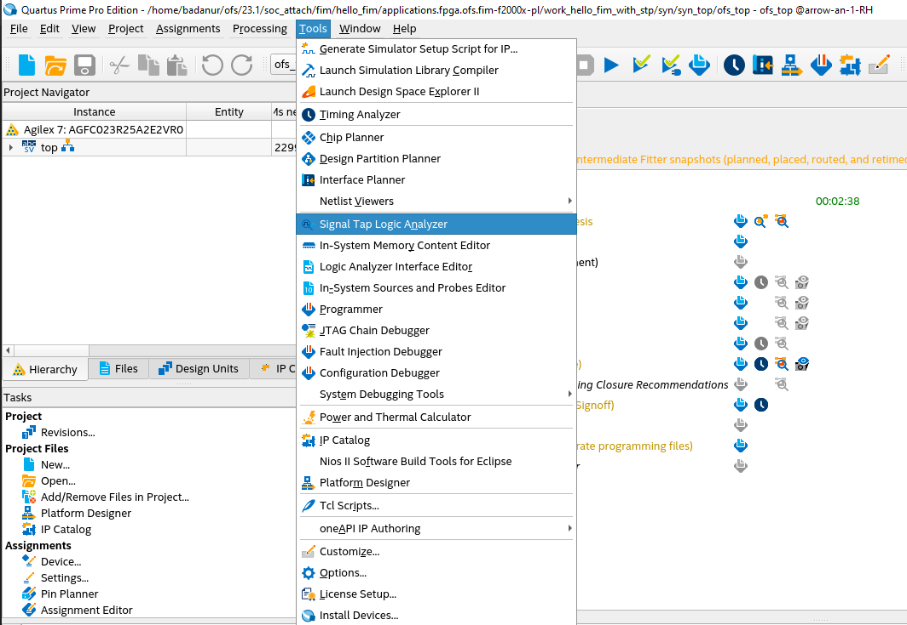


4. Accept the "Default" selection and click "Create".

  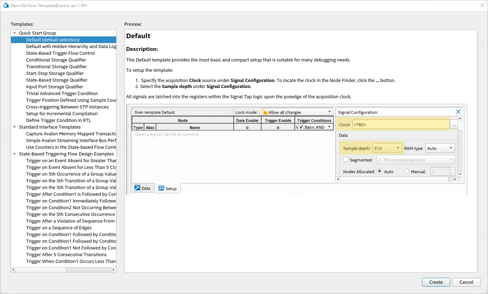


5. This opens the Signal Tap Logic Analyzer window.

  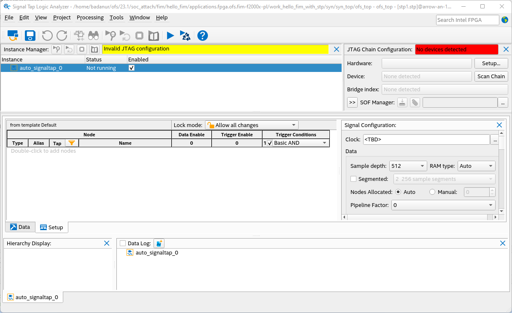

6. Set up the clock for the STP instance. This example instruments the **hello_fim_top** module previously intetegrated into the FIM. If unfamiliar with code, it is helpful to use the Quartus Prime Pro Project Navigator to find the block of interest and open the design instance for review. For example, see the image below using Project Navigator to open the **top** module where **hello_fim_top_inst** is instantiated.

  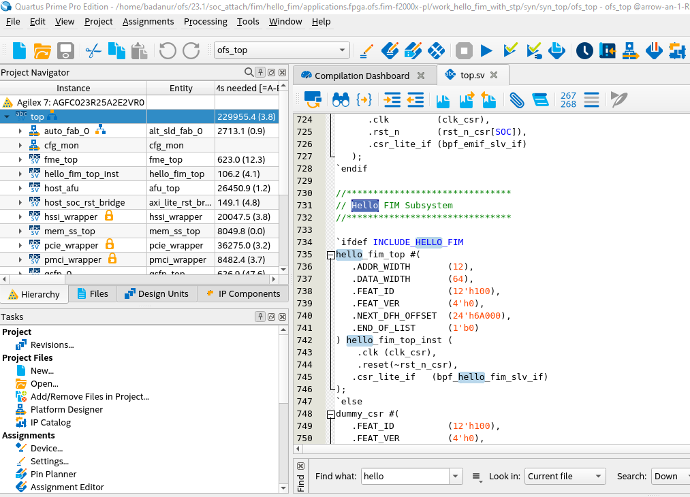


7. Assign the clock for sampling the Signal Tap instrumented signals of interest. Note, that the clock selected should be associated with the signals you want to view for best trace fidelity. Different clocks can be used, however, there maybe issues with trace inaccuracy due to sampling time differences. Ensure that all signals that are to be sampled are on the same clock domain as the clock you select here. In the middle right of the Signal Tap window, under **Signal Configuration, Clock:**, select **"…"** as shown below:

  


8. In the Node Finder tool that popped up, input **"hello_fim_top_inst|clk"** into the "Named:" textbox and click "Search". Select "clk" in the Matching Nodes list and click the ">" button to select this clock as shown below. Click "OK" to close the Node Finder dialog.

  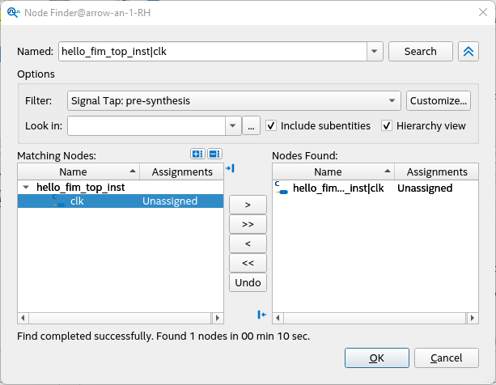


9. Update the sample depth and other Signal Tap settings as needed for your debugging criteria.
  
  


10. In the Signal Tap GUI add the nodes to be instrumented by double-clicking on the "Double-click to add nodes" legend.
  
  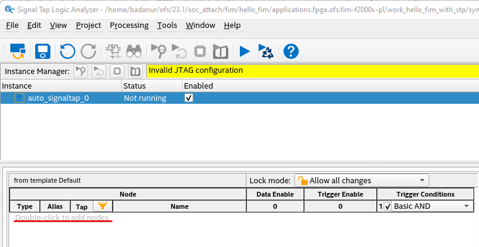


11. This brings up the Node Finder to add the signals to be traced. In this example we will monitor the memory mapped interface to the Hello FIM. Select the signals that appear from the  search patterns **hello_fim_top_inst|reset** and **hello_fim_top_inst|csr_lite_if\***. Click Insert and close the Node Finder dialog.
  
  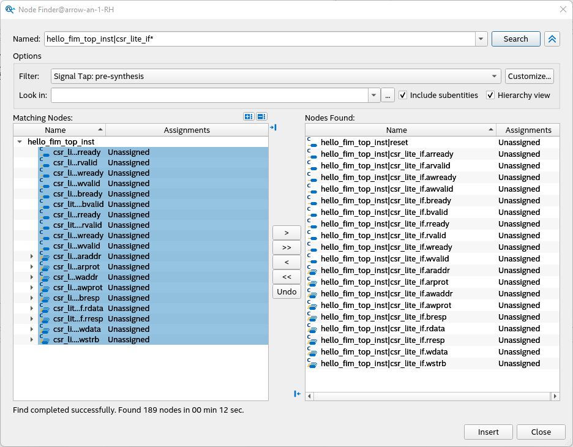


12. To provide a unique name for your Signal Tap instance, select "auto signaltap_0", right-click, and select **Rename Instance (F2)**. Provide a descriptive name for your instance, for example, "STP_For_Hello_FIM".
  
  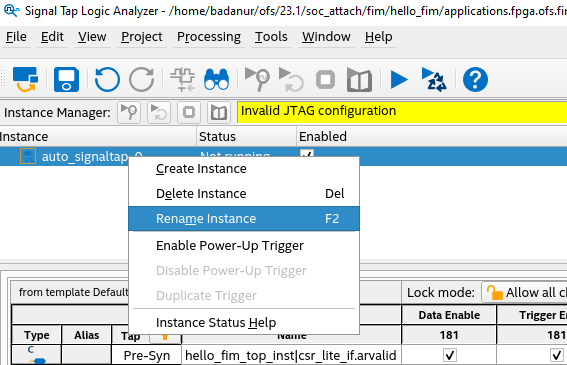

13. Save the newly created Signal Tap file, and give it the same name as the instance. Ensure that the **Add file to current project** checkbox is ticked.

  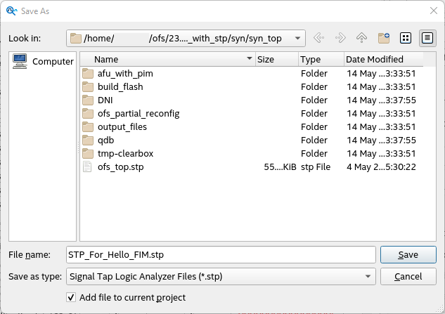


14. In the dialog that pops up, click "Yes" to add the newly created Signal Tap file to the project settings files.

  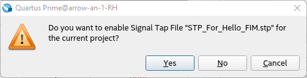
  
    This will aurtomatically add the following lines to `$OFS_ROOTDIR/work_hello_fim_with_stp/syn/syn_top/ofs_top.qsf`:

    ```tcl
    set_global_assignment -name ENABLE_SIGNALTAP ON
    set_global_assignment -name USE_SIGNALTAP_FILE STP_For_Hello_FIM.stp
    set_global_assignment -name SIGNALTAP_FILE STP_For_Hello_FIM.stp
    ```

15. Close all Quartus GUIs.

16. Compile the project with the Signal Tap file added to the project. Use the **-k** switch to perform the compilation using the files in a specified working directory and not the original ones from the cloned repository. 

  ```bash
  ofs-common/scripts/common/syn/build_top.sh -p -k f2000x work_hello_fim_with_stp
  ```

  Alternatively, you can copy the **ofs_top.qsf** and **STP_For_Hello_FIM.stp** files from the Hello FIM with STP work directory to replace the original files in the cloned OFS repository. In this scenario, all further FIM compilation projects will include the Signal Tap instance integrated into the design. Execute the following commands for this alternative flow:

   Copy the modified file "work_hello_fim_with_stp/syn/syn_top/ofs_top.qsf" over to the source OFS repository, into "syn/syn_top/".

  ```bash
  cd $OFS_ROOTDIR/work_hello_fim_with_stp/syn/syn_top
  cp ofs_top.qsf $OFS_ROOTDIR/syn/syn_top
  cp STP_For_Hello_FIM.stp $OFS_ROOTDIR/syn/syn_top
  ```

  Compile the FIM using the files from the OFS repository to create a new work directory.

  ```bash
  cd $OFS_ROOTDIR
  ofs-common/scripts/common/syn/build_top.sh -p f2000x work_hello_fim_with_stp_from_src_repo
  ```

17. Ensure that the compile completes successfully and meets timing:

  ```bash
  ***********************************
  ***
  ***        OFS_PROJECT: f2000x
  ***        OFS_FIM: base
  ***        OFS_BOARD: adp
  ***        Q_PROJECT:  ofs_top
  ***        Q_REVISION: ofs_top
  ***        SEED: 0
  ***        Build Complete
  ***        Timing Passed!
  ***
  ***********************************
  ```

18. Set up a JTAG connection to the f2000x. Refer to [Set up JTAG](https://ofs.github.io/ofs-2024.2-1/hw/f2000x/dev_guides/fim_dev/ug_dev_fim_ofs/#51-walkthrough-set-up-jtag) section for step-by-step instructions.

19. Copy the `ofs_top.sof` and `stp_for_hello_fim.stp` files to the machine which is connected to the f2000x via JTAG.

20. From the JTAG connected machine, program the `$OFS_ROOTDIR/work_hello_fim_with_stp/syn/syn_top/output_files/ofs_top.sof` image to the f2000x FPGA. Refer to the [Program the FPGA via JTAG](https://ofs.github.io/ofs-2024.2-1/hw/f2000x/dev_guides/fim_dev/ug_dev_fim_ofs/#52-walkthrough-program-the-fpga-via-jtag) section for step-by-step programming instructions.

21. Open Quartus Signal Tap GUI.

  ```bash
  $QUARTUS_ROOTDIR/bin/quartus_stpw
  ```

22. In the Signal Tap GUI, open your STP file. Your STP file settings will load. In this example we used `STP_For_Hello_FIM.stp`.
   
  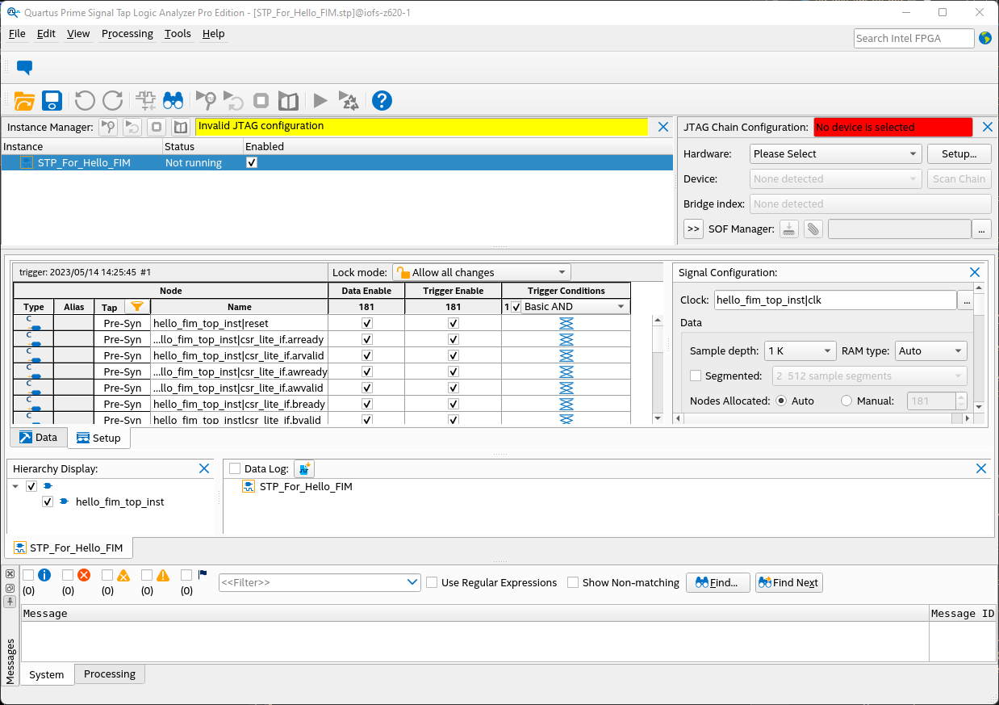
   
23. In the right pane of the Signal Tap GUI, in the **Hardware:** selection box select the cable `USB-BlasterII`. In the **Device:** selection box select the Agilex® 7 FPGA device.

  
   
24.   If the Agilex® 7 FPGA is not displayed in the **Device:** list, click the **'Scan Chain'** button to re-scan the JTAG device chain.

25. If not already set, you can create the trigger conditions. In this example, we will capture data on a rising edge of the Read Address Valid signal.
   
  
   
26. Start analysis by selecting the **'STP_For_Hello_FIM'** instance and pressing **'F5'** or clicking the **Run Analysis** icon in the toolbar. You should see a green message indicating the Acquisition is in progress. Then, move to the **Data** Tab to observe the signals captured.

  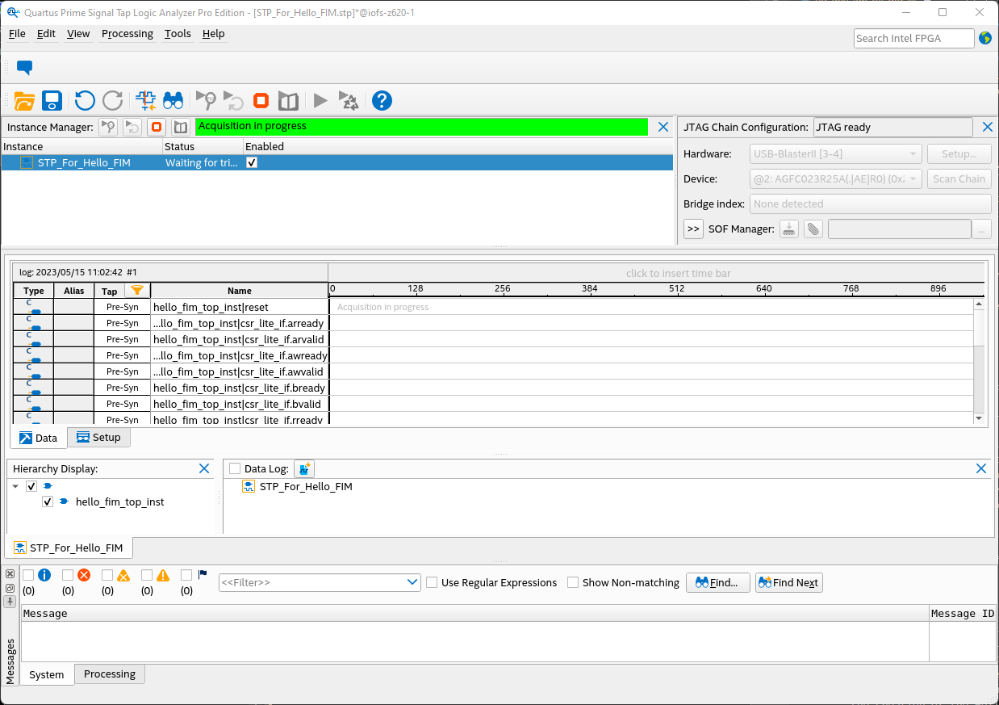

27. To generate traffic in the **csr_lite_if** signals of the Hello FIM module, go back to the terminal and walk the DFH list or peek/poke the Hello FIM registers as was done during the creation of the Hello FIM design example.

  ```
  opae.io init -d 0000:15:00.0
  opae.io walk -d 0000:15:00.0
  opae.io release -d 0000:15:00.0
  ```

  The signals should be captured on the rising edge of `arvalid` in this example. Zoom in to get a better view of the signals.

  
   
28. The PCIe AER feature is automatically re-enabled by rebooting the server. 

This concludes the example on how to instrument an OFS FIM with the Quartus Prime Signal Tap Logic Analyzer.

### **4.2 Preparing FIM for AFU Development**

To save area, the default Host Excercisers in the FIM can be replaced by a "he_null" block during compile-time. There are a few things to note:

* "he_null" is a minimal block with registers that responds to PCIe MMIO request. MMIO responses are required to keep PCIe alive (end points enabled in PCIe-SS needs service downstream requests).
* If an exerciser with other I/O connections such as "he_mem" or "he_hssi" is replaced, then then those I/O ports are simply tied off.
* The options supported are ```null_he_lb```, ```null_he_hssi```, ```null_he_mem``` and ```null_he_mem_tg```. Any combination, order or all can be enabled at the same time. 
* Finer grain control is provided for you to, for example, turn off only the exercisers in the Static Region in order to save area.

#### **4.2.1 Walkthrough: Compile the FIM in preparation for designing your AFU**

Perform the following steps to compile a FIM for where the exercisers are removed and replaced with an he_null module while keeping the PF/VF multiplexor connections.

Pre-requisites:

* This walkthrough requires a development environment. Refer to the [Set Up Development Environment](https://ofs.github.io/ofs-2024.2-1/hw/f2000x/dev_guides/fim_dev/ug_dev_fim_ofs/#134-walkthrough-set-up-development-environment) Section for instructions on setting up a development environment.

Steps:

1. Clone the FIM repository (or use an existing cloned repository). Refer to the [Clone FIM Repository](https://ofs.github.io/ofs-2024.2-1/hw/f2000x/dev_guides/fim_dev/ug_dev_fim_ofs/#1321-walkthrough-clone-fim-repository) section for step-by-step instructions.

2. Set development environment variables. Refer to the [Set Development Environment Variables](https://ofs.github.io/ofs-2024.2-1/hw/f2000x/dev_guides/fim_dev/ug_dev_fim_ofs/#1331-walkthrough-set-development-environment-variables) section for step-by-step instructions.

3. Compile the FIM with the HE_NULL compile options

  1. Navigate to the OFS root directory

    ```bash
    cd $OFS_ROOTDIR
    ```

  2. Run the `build_top.sh` script with the null host exerciser options.

    ```bash
    ./ofs-common/scripts/common/syn/build_top.sh -p --ofss tools/ofss_config/f2000x.ofss f2000x:null_he_lb,null_he_hssi,null_he_mem,null_he_mem_tg work_f2000x
    ```

### **4.3 Partial Reconfiguration Region**

To take advantage of the available resources in the Agilex® 7 FPGA for an AFU design, you can adjust the size of the AFU PR partition. An example reason for the changing the size of PR region is if you add more logic to the FIM region, then you may need to reduce the size of the PR region to fit the additional logic into the static region.  Similiarly, if you reduce logic in the FIM region, then you can increase the size of the PR region to provide more logic resources for the AFU.

After the compilation of the FIM, the resources usage broken down by partitions is reported in the `Logic Lock Region Usage Summary` sections of following two files:

* `$OFS_ROOTDIR/<YOUR_WORK_DIRECTORY>/syn/syn_top/output_files/ofs_top.fit.place.rpt`
* `$OFS_ROOTDIR/<YOUR_WORK_DIRECTORY>/syn/syn_top/output_files/ofs_top.fit.rpt`

  

In this case, the default size for the `afu_top|port_gasket|pr_slot|afu_main` PR partition is large enough to comfortably hold the logic of the default AFU, which is mainly occupied by the Host Exercisers. However, larger designs might require additional resources.

#### **4.3.1 Walkthrough: Resize the Partial Reconfiguration Region**

Perform the following steps to customize the resources allocated to the AFU in the PR regions:

1. The `$OFS_ROOTDIR/syn/setup/pr_assignments.tcl` TCL file defines the Logic Lock Regions in the design, including the PR partition where the AFU is allocated.

  The default design uses the the following Logic Lock Regions:
   
  ```tcl
  set TOP_MEM_REGION    "X115 Y310 X219 Y344"
  set BOTTOM_MEM_REGION "X0 Y0 X294 Y20"
  set SUBSYSTEM_REGION  "X0 Y0 X60 Y279; X0 Y0 X300 Y39; X261 Y0 X300 Y129;"

  set AFU_PLACE_REGION  "X61 Y40 X260 Y309; X220 Y130 X294 Y329; X12 Y280 X114 Y329;"
  set AFU_ROUTE_REGION  "X0 Y0 X294 Y329"
  ```

  Each region is made up of rectangles defined by the origin (X0,Y0) and the top right corner (X1,Y1).

2. Use Quartus Chip Planner to identify the locations of the resources available within the Agilex® 7 FPGA for placement and routing your AFU. The image below shows the default floorplan for the f2000x Agilex® 7 FPGA.

  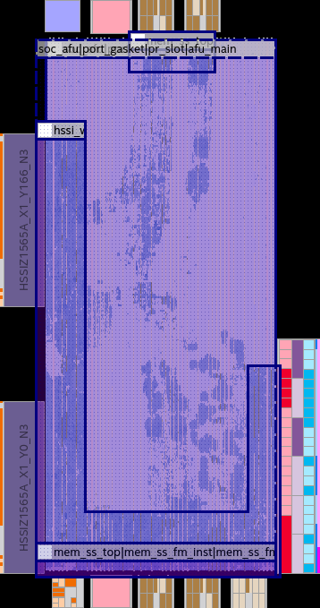

3. Make changes to the `$OFS_ROOTDIR/syn/setup/pr_assignments.tcl` file based on your findings in Quartus Chip Planner. You can modify the size and location of existing Logic Lock Regions or add new ones and assign them to the AFU PR partition. You will need to modify the coordinates of other regions assigned to the FIM accordingly to prevent overlap.

4. Recompile your FIM and create the PR relocatable build tree using the following commands:

  ```bash
  cd $OFS_ROOTDIR    
  ofs-common/scripts/common/syn/build_top.sh -p --ofss tools/ofss_config/f2000x.ofss f2000x  <YOUR_WORK_DIRECTORY>
  ```

5. Analyze the resource utilization report per partition produced after recompiling the design.

6. Make further modifications to the PR regions until the results are satisfactory. Make sure timing constraints are met.

Refer to the following documentation for more information on how to optimize the floor plan of your Partial Reconfiguration design:

* [Analyzing and Optimizing the Design Floorplan](https://www.intel.com/content/www/us/en/docs/programmable/683641/23-1/analyzing-and-optimizing-the-design-03170.html)
* [Partial Reconfiguration Design Flow - Step 3: Floorplan the Design](https://www.intel.com/content/www/us/en/docs/programmable/683834/23-1/step-3-floorplan-the-design.html)

### **4.4 PCIe Configuration**

The PCIe sub-system IP and PF/VF MUX can be modified either using the OFSS flow or the IP Presets flow. The OFSS flow supports a subset of all available PCIe Sub-system settings, while the IP Preset flow can make any available PCIe Sub-system settings change. With PCIe-SS modifcations related to the PFs and VFs, the PF/VF MUX logic is automatically configured based on the PCIe-SS configuration when using OFSS. The sections below describe each flow.

* [PCIe Configuration Using OFSS](https://ofs.github.io/ofs-2024.2-1/hw/f2000x/dev_guides/fim_dev/ug_dev_fim_ofs/#443-pcie-configuration-using-ofss)
* [PCIe Sub-System configuration Using IP Presets](https://ofs.github.io/ofs-2024.2-1/hw/f2000x/dev_guides/fim_dev/ug_dev_fim_ofs/#444-pcie-sub-system-configuration-using-ip-presets)

#### **4.4.1 PF/VF MUX Configuration**

The default PF/VF MUX configuration for OFS Agilex® 7 SoC Attach FIM for the f2000x can support up to 8 PFs and 2000 VFs distributed accross all PFs on both the Host and the SoC.

For reference FIM configurations, you must have at least 1 PF on the Host, and at least 1 PF with 1 VF on the SoC. This is because the PR region cannot be left unconnected. PFs must be consecutive. The *PFVF Limitations* table describes the supported number of PFs and VFs.

*Table: Host PF/VF Limitations*

| Parameter | Value |
| --- | --- |
| Min # of PFs | 1 |
| Max # of PFs | 8 |
| Min # of VFs | 0 |
| Max # of VFs | 2000 distributed across all PFs |

*Table: SoC PF/VF Limitations*

| Parameter | Value |
| --- | --- |
| Min # of PFs | 1 |
| Max # of PFs | 8 |
| Min # of VFs | 1 (on PF0) |
| Max # of VFs | 2000 distributed across all PFs |

New PF or VF instances will automatically have a null_afu module instantiated and connected to the new PF or VF.

#### **4.4.2 PCIe-SS Configuration Registers**

The PCIe configuration registers contains the Vendor, Device and Subsystem Vendor ID registers which are used in PCIe add-in cards to uniquely identify the card for assignment to software drivers.  OFS has these registers set with Intel values for out of the box usage.  If you are using OFS for a PCIe add in card that your company manufactures, then update the PCIe Subsytem Subsystem ID and Vendor ID registers as described below and change OPAE provided software code to properly operate with your company's register values.

The Vendor ID is assigned to your company by the PCI-SIG (Special Interest Group). The PCI-SIG is the only body officially licensed to give out IDs. You must be a member of PCI-SIG to request your own ID. Information about joining PCI-SIG is available here: [PCI-SIG](http://www.pcisig.com). You select the Subsystem Device ID for your PCIe add in card.

#### **4.4.3 PCIe Configuration Using OFSS**

The general flow for using OFSS to modify the PCIe Sub-system and PF/VF MUX is as follows:

1. Create or modify a PCIe OFSS file with the desired PCIe configuration. 
2. Call this PCIe OFSS file when running the FIM build script.

The *PCIe IP OFSS File Options* table lists all of the configuration options supported by the OFSS flow. Any other customizations to the PCIe sub-system must be done with the IP Presets Flow.

*Table: PCIe IP OFSS File Options*

| Section | Parameter | Options | Default | Description |
| --- | --- | --- | --- | --- |
| `[ip]` | `type` | `pcie` | N/A | Specifies that this OFSS file configures the PCIe-SS |
| `[settings]` | `output_name` | `pcie_ss` | N/A | Specifies the output name of the PCIe-SS IP |
| | `preset` | *String* | N/A | OPTIONAL - Specifies the name of a PCIe-SS IP presets file to use when building the FIM. When used, a presets file will take priority over any other parameters set in this OFSS file. |
| `[pf*]` | `num_vfs` | Integer | `0` | Specifies the number of Virtual Functions in the current PF |
| | `bar0_address_width` | Integer | `12` | |
| | `bar4_address_width` | Integer | `14` | |
| | `vf_bar0_address_width` | Integer | `12` | |
| | `ats_cap_enable` | `0` \| `1` | `0` | |
| | `vf_ats_cap_enable` | `0` \| `1` | `0` | |
| | `prs_ext_cap_enable` | `0` \| `1` | `0` | |
| | `pasid_cap_enable` | `0` \| `1` | `0` | |
| | `pci_type0_vendor_id` | 32'h Value | `0x00008086` | |
| | `pci_type0_device_id` | 32'h Value | `0x0000bcce` | |
| | `revision_id` | 32'h Value | `0x00000001` | |
| | `class_code` | 32'h Value | `0x00120000` | |
| | `subsys_vendor_id` | 32'h Value | `0x00008086` | |
| | `subsys_dev_id` | 32'h Value | `0x00001771` | |
| | `sriov_vf_device_id` | 32'h Value | `0x0000bccf` | |
| | `exvf_subsysid` | 32'h Value | `0x00001771` | |

##### **4.4.3.1 Walkthrough: Modify the PCIe Sub-System and PF/VF MUX Configuration Using OFSS**

Perform the following steps to modify the PF/VF MUX configuration.

Pre-requisites:

* This walkthrough requires a development environment. Refer to the [Set Up Development Environment](https://ofs.github.io/ofs-2024.2-1/hw/f2000x/dev_guides/fim_dev/ug_dev_fim_ofs/#134-walkthrough-set-up-development-environment) Section for instructions on setting up a development environment.

* This walkthrough requires an OFS Agilex® 7 SoC Attach deployment environment. Refer to the [Board Installation Guide: OFS For Agilex® 7 SoC Attach IPU F2000X-PL](https://ofs.github.io/ofs-2024.2-1/hw/common/board_installation/f2000x_board_installation/f2000x_board_installation) and [Software Installation Guide: OFS for Agilex® 7 SoC Attach FPGAs](https://ofs.github.io/ofs-2024.2-1/hw/common/sw_installation/soc_attach/sw_install_soc_attach) for instructions on setting up a deployment environment.

Steps:

1. Clone the OFS Agilex® 7 SoC Attach FIM repository (or use an existing cloned repository). Refer to the [Clone FIM Repository](https://ofs.github.io/ofs-2024.2-1/hw/f2000x/dev_guides/fim_dev/ug_dev_fim_ofs/#1321-walkthrough-clone-fim-repository) section for step-by-step instructions.

2. Set development environment variables. Refer to the [Set Development Environment Variables](https://ofs.github.io/ofs-2024.2-1/hw/f2000x/dev_guides/fim_dev/ug_dev_fim_ofs/#1331-walkthrough-set-development-environment-variables) section for step-by-step instructions.

3. Decide which PCIe PF/VFs require modification.  If you are modifying host side PF/VF configuration, you must edit file `pcie_host.ofss` file found in `$OFS_ROOTDIR/tools/pfvf_config_tool`.  If you want to modify SoC-side PF/VF configuration, edit the `pcie_soc.ofss` file found in the same location. The the following code shows the default Host OFSS file:

  ```bash
  [ip]
  type = pcie
  
  [settings]
  output_name = pcie_ss
  
  [pf0]
  bar0_address_width = 21
  
  [pf1]
  ```

  This default configuration is made up of two physical functions (PF), and neither of them has any virtual functions (VF). 


4. In this example, we will modify the Host PCIe configuration. Create a new Host PCIe OFSS file from the existing `pcie_host.ofss` file.

  ```bash
  cp $OFS_ROOTDIR/tools/ofss_config/pcie/pcie_host.ofss $OFS_ROOTDIR/tools/ofss_config/pcie/pcie_host_pfvf_mod.ofss
  ```

5. Modify the new `pcie_pfvf_mod.ofss` OFSS file with the new PF/VF configuration. An example modification to the OFSS file is shown below.  In this example we have changed the configuration to: 6 PFs in total, 4 VFs in PF0, 1 VF in PF2, and 2 VFs on PF3.  You can add up to 8 PFs and could conceivably add up to the number of VFs supported by the PCIe IP. Note that more PFs/VFs will use more FPGA resources, which may cause fitter challenges.

  ```bash
  [ip]
  type = pcie
  
  [settings]
  output_name = pcie_ss
  
  [pf0]
  bar0_address_width = 21
  num_vfs = 4

  [pf1]

  [pf2]
  num_vfs = 1

  [pf3]
  num_vfs = 2

  [pf4]

  [pf5]
  ```

6. Edit the top level OFSS file to use the new PCIe OFSS file `pcie_host_pfvf_mod.ofss`. In this example, we will edit the f2000x top level OFSS file `$OFS_ROOTDIR/tools/ofss_config/f2000x.ofss`.

  ```
  [include]
  "$OFS_ROOTDIR"/tools/ofss_config/f2000x_base.ofss
  "$OFS_ROOTDIR"/tools/ofss_config/pcie/pcie_host_pfvf_mod.ofss
  "$OFS_ROOTDIR"/tools/ofss_config/pcie/pcie_soc.ofss
  "$OFS_ROOTDIR"/tools/ofss_config/iopll/iopll.ofss
  "$OFS_ROOTDIR"/tools/ofss_config/memory/memory.ofss
  ```

7. Compile the FIM.

  ```bash
  cd $OFS_ROOTDIR

  ./ofs-common/scripts/common/syn/build_top.sh -p --ofss tools/ofss_config/f2000x.ofss f2000x work_f2000x_pfvf_mod
  ```

8. Copy the resulting `.bin` user 1 image to your deployment environmenment.

9. Switch to your deployment environment.

10. Program the `.bin` image to the f2000x FPGA. Refer to the [Program the FPGA via RSU](https://ofs.github.io/ofs-2024.2-1/hw/f2000x/dev_guides/fim_dev/ug_dev_fim_ofs/#531-walkthrough-program-the-fpga-via-rsu) Section for step-by-step programming instructions.

11. From the Host, verify the number of VFs on the PFs. In this example, we defined 4 VFs on PF0 in Step 5.

  ```bash 
  sudo lspci -vvv -s b1:00.0 | grep VF
  ```

  Example output:

  ```bash               
  Initial VFs: 4, Total VFs: 4, Number of VFs: 0, Function Dependency Link: 00
  VF offset: 6, stride: 1, Device ID: bccf               
  ```

12. Verify communication with the newly added PFs. New PF/VF are seamlessly connected to their own CSR stub, which can be read at DFH Offset 0x0. You can bind to the function and perform `opae.io peek` commands to read from the stub CSR. Similarly, perform `opae.io poke` commands to write into the stub CSRs. Use this mechanism to verify that the new PF/VF Mux configuration allows to write and read back values from the stub CSRs. 

  The GUID for every new PF/VF CSR stub is the same.
  
  ```
  * NULL_GUID_L           = 64'haa31f54a3e403501
  * NULL_GUID_H           = 64'h3e7b60a0df2d4850
  ```
  
  In the following steps, we will verify the newly added PF5.

  1. Initialize the driver on PF5

    ```bash
    sudo opae.io init -d b1:00.5
    ```

  2. Read the GUID for the PF5 CSR stub.

    ```bash
    sudo opae.io -d b1:00.5 -r 0 peek 0x8
    sudo opae.io -d b1:00.5 -r 0 peek 0x10
    ```

    Example output:

    ```bash
    0xaa31f54a3e403501
    0x3e7b60a0df2d4850
    ```

  >**Note:** The PCIe B:D.F associated with your board may be different. Use the `fpgainfo fme` command to see the PCIe B:D:F for your board.

#### **4.4.4 PCIe Sub-System configuration Using IP Presets**

The general flow for using IP Presets to modify he PCIe Sub-system is as follows:

1. [OPTIONAL] Create a work directory using OFSS files if you wish to use OFSS configuration settings as a starting point.
2. Open the PCIe-SS IP and make desired modifications.
3. Create an IP Presets file.
4. Create an PCIe OFSS file that uses the IP Presets file.
5. Build the FIM with the PCIe OFSS file from Step 4.

##### **4.4.4.1 Walkthrough: Modify PCIe Sub-System and PF/VF MUX Configuration Using IP Presets**

Perform the following steps to use an IP preset file to configure the PCIe Sub-system and PF/VF MUX. In this example, we will change the Revision ID on PF0. While this modification can be done with the OFSS flow, this walkthrough is intended to show the procedure for making any PCIe configuration change using IP presets.

Pre-requisites:

* This walkthrough requires a development environment to build the FIM. Refer to the [Set Up Development Environment](https://ofs.github.io/ofs-2024.2-1/hw/f2000x/dev_guides/fim_dev/ug_dev_fim_ofs/#134-walkthrough-set-up-development-environment) Section for instructions on setting up a development environment.

* This walkthrough requires an OFS Agilex® 7 SoC Attach deployment environment. Refer to the [Board Installation Guide: OFS For Agilex® 7 SoC Attach IPU F2000X-PL](https://ofs.github.io/ofs-2024.2-1/hw/common/board_installation/f2000x_board_installation/f2000x_board_installation) and [Software Installation Guide: OFS for Agilex® 7 SoC Attach FPGAs](https://ofs.github.io/ofs-2024.2-1/hw/common/sw_installation/soc_attach/sw_install_soc_attach) for instructions on setting up a deployment environment.

Steps:

1. Clone the OFS Agilex® 7 SoC Attach FIM repository (or use an existing cloned repository). Refer to the [Clone FIM Repository](https://ofs.github.io/ofs-2024.2-1/hw/f2000x/dev_guides/fim_dev/ug_dev_fim_ofs/#1321-walkthrough-clone-fim-repository) section for step-by-step instructions.

2. Set development environment variables. Refer to the [Set Development Environment Variables](https://ofs.github.io/ofs-2024.2-1/hw/f2000x/dev_guides/fim_dev/ug_dev_fim_ofs/#1331-walkthrough-set-development-environment-variables) section for step-by-step instructions.

3. [OPTIONAL] Run the `setup` stage of the build script using your desired OFSS configration to create a working directory for the target board. In this example we will target the f2000x.

  ```bash
  ./ofs-common/scripts/common/syn/build_top.sh --stage setup --ofss tools/ofss_config/f2000x.ofss f2000x work_f2000x
  ```

4. Open the host PCIe-SS using Quartus Parameter Editor. If you performed Step 3, open the PCIe-SS IP from the work directory; otherwise, open the PCIe-SS IP from the source files.

  ```bash
  qsys-edit $OFS_ROOTDIR/work_f2000x/ipss/pcie/qip/pcie_ss.ip

5. Modify the settings as desired. In this example we will change the **Revision ID** to `0x2`. In the **IP Parameter Editor**, scroll down and expand the **PCIe Interfaces Ports Settings -> Port 0 -> PCIe0 Device Identification Registers -> PCIe0 PF0 IDs** tab and make this change.

6. Once you are satisfied with your modifcations, create a new IP Preset file.

  1. click **New...** in the **Presets** window.

  2. In the **New Preset** window, set a unique **Name** for the preset; for example, `f2000x-rev2`.

  3. Click the **...** button to set the save location for the IP Preset file to `$OFS_ROOTDIR/ipss/pcie/presets`. Set the **File Name** to match the name selected in Step 9. Click **OK**.

  4. In the **New Preset** window, click **Save**. Click **No** when prompted to add the file to the IP search path.

9. Close **IP Parameter Editor** without saving or generating HDL.

10. Create a new PCIe OFSS file in the `$OFS_ROOTDIR/tools/ofss_config/pcie` directory. For example:

  ```bash
  touch $OFS_ROOTDIR/tools/ofss_config/pcie/pcie_host_mod_preset.ofss
  ```

  Insert the following into the OFSS file to specify the IP Preset file created in Step 6. 

  ```
  [ip]
  type = pcie
  
  [settings]
  output_name = pcie_ss
  preset = f2000x-rev2
  ```

11. Edit the `$OFS_ROOTDIR/tools/ofss_config/f2000x.ofss` file to call new OFSS file created in Step 10.
  ```
  [include]
  "$OFS_ROOTDIR"/tools/ofss_config/f2000x_base.ofss
  "$OFS_ROOTDIR"/tools/ofss_config/pcie/pcie_host_mod_preset.ofss
  "$OFS_ROOTDIR"/tools/ofss_config/pcie/pcie_soc.ofss
  "$OFS_ROOTDIR"/tools/ofss_config/iopll/iopll.ofss
  "$OFS_ROOTDIR"/tools/ofss_config/memory/memory.ofss
  ```

12. Compile the FIM.

  ```bash
  cd $OFS_ROOTDIR

  ./ofs-common/scripts/common/syn/build_top.sh -p --ofss tools/ofss_config/f2000x.ofss f2000x work_f2000x_pcie_mod
  ```

13. Copy the resulting `$OFS_ROOTDIR/work_f2000x_pcie_mod/syn/syn_top/output_files/ofs_top.sof` image to your deployment environmenment for JTAG programming, or copy a `bin` file (e.g. `ofs_top_page1_unsigned_user1.bin`) for RSU programming.

  >**Note:** OPAE FPGA management commands require recognition of the FPGA PCIe Device ID for control.  If there is a problem between OPAE management recognition of FPGA PCIe values, then control of the card will be lost.  For this reason, you are strongly encouraged to program the FPGA via JTAG to load the test FPGA image.  If there is a problem with the SOF image working with your host software that is updated for the new PCIe settings, then you can load a known good SOF file to recover.  Once you sure that both the software and FPGA work properly, you can load the FPGA into FPGA flash using the OPAE command `fpgasupdate`.

14. Program the image to the f2000x FPGA. Refer to the [Program the FPGA via JTAG](https://ofs.github.io/ofs-2024.2-1/hw/f2000x/dev_guides/fim_dev/ug_dev_fim_ofs/#52-walkthrough-program-the-fpga-via-jtag) Section for step-by-step JTAG programming instructions, or the [Program the FPGA via RSU](https://ofs.github.io/ofs-2024.2-1/hw/f2000x/dev_guides/fim_dev/ug_dev_fim_ofs/#531-walkthrough-program-the-fpga-via-rsu) Section for step-by-step RSU programming instructions.

15. Use `lspci` to verify that the PCIe changes have been implemented.

  ```bash
  lspci -nvmms b1:00.0
  ```

  Example output:

  ```bash
  Slot:   b1:00.0
  Class:  1200
  Vendor: 8086
  Device: bcce
  SVendor:        8086
  SDevice:        1771
  PhySlot:        1
  Rev:    02
  NUMANode:       1
  ```

>**Note:** Some changes to software may be required to work with certain new PCIe settings. These changes are described in [Software Reference Manual: Open FPGA Stack](https://ofs.github.io/ofs-2024.2-1/hw/common/reference_manual/ofs_sw/mnl_sw_ofs/) 

#### **4.5.1 Walkthrough: Create a Minimal FIM**

Perform the following steps to create a Minimal FIM. A minimal FIM is one that has the host exercisers and ethernet subsystem removed. This frees up resources that can be used as desired.

Pre-requisites:

* This walkthrough requires a development environment. Refer to the [Set Up Development Environment](https://ofs.github.io/ofs-2024.2-1/hw/f2000x/dev_guides/fim_dev/ug_dev_fim_ofs/#134-walkthrough-set-up-development-environment) Section for instructions on setting up a development environment.

* This walkthrough requires an OFS Agilex® 7 SoC Attach deployment environment. Refer to the [Board Installation Guide: OFS For Agilex® 7 SoC Attach IPU F2000X-PL](https://ofs.github.io/ofs-2024.2-1/hw/common/board_installation/f2000x_board_installation/f2000x_board_installation) and [Software Installation Guide: OFS for Agilex® 7 SoC Attach FPGAs](https://ofs.github.io/ofs-2024.2-1/hw/common/sw_installation/soc_attach/sw_install_soc_attach) for instructions on setting up a deployment environment.

Steps:

1. Clone the OFS Agilex® 7 SoC Attach FIM repository (or use an existing cloned repository). Refer to the [Clone FIM Repository](https://ofs.github.io/ofs-2024.2-1/hw/f2000x/dev_guides/fim_dev/ug_dev_fim_ofs/#1321-walkthrough-clone-fim-repository) section for step-by-step instructions.

2. Set development environment variables. Refer to the [Set Development Environment Variables](https://ofs.github.io/ofs-2024.2-1/hw/f2000x/dev_guides/fim_dev/ug_dev_fim_ofs/#1331-walkthrough-set-development-environment-variables) section for step-by-step instructions.
To create this minimal FIM, perform the following steps:

3. Edit the Host PCIe OFSS file to use the minimal number of  PFs (1).

  1. `$OFS_ROOTDIR/tools/ofss_config/pcie/pcie_host.ofss`

    ```bash
    [ip]
    type = pcie
    
    [settings]
    output_name = pcie_ss
    
    [pf0]
    bar0_address_width = 21
    ```

4. Edit the SoC PCIe OFSS file to use the minimal number of  PFs (1) and VFs (1).
    
  1. `$OFS_ROOTDIR/tools/ofss_config/pcie/soc_host.ofss`

    ```bash
    [ip]
    type = pcie
    
    [settings]
    output_name = soc_pcie_ss
    
    [pf0]
    num_vfs = 1
    bar0_address_width = 21
    vf_bar0_address_width = 21 
    ```

5. Run the build script with exercisers and ethernet subsystem (HSSI) removed.

  ```bash
  cd $OFS_ROOTDIR
  ./ofs-common/scripts/common/syn/build_top.sh -p --ofss tools/ofss_config/f2000x.ofss f2000x:null_he_lb,null_he_hssi,null_he_mem,null_he_mem_tg,no_hssi work_f2000x_minimal_fim
  ```

6. The build will complete with reduced resources as compared to the base version. You may review the floorplan in Quartus Chip Planner and modify the Logic Lock regions to allocate more resources to the PR region if desired. Refer to the [How to Resize the Partial Reconfiguration Region](https://ofs.github.io/ofs-2024.2-1/hw/f2000x/dev_guides/fim_dev/ug_dev_fim_ofs/#54-how-to-resize-the-partial-reconfiguration-region) section for information regarding modifications to the floorplan. 

### **4.6 Migrate to a Different Agilex Device Number**

The following instructions enable you to change the Agilex 7 FPGA device part number of the f2000x, for example, to migrate to a device with a larger density. Be aware that this release works with Agilex® 7 FPGAs that have P-tile for PCIe and E-tile for Ethernet.

The default device for the Intel® Infrastructure Processing Unit (Intel® IPU) Platform F2000X-PL is AGFC023R25A2E2VR0

#### **4.6.1 Walkthrough: Migrate to a Different Agilex Device Number**

This walkthrough describes how to change the device to a larger density with the same package. In this example, we will change the device from part AGFC023R25A2E2VR0 to part AGFA027R25A2E2VR0.

Pre-requisites:

* This walkthrough requires a development environment. Refer to the [Set Up Development Environment](https://ofs.github.io/ofs-2024.2-1/hw/f2000x/dev_guides/fim_dev/ug_dev_fim_ofs/#134-walkthrough-set-up-development-environment) Section for instructions on setting up a development environment.

Steps:

1. Clone the design repository. See the [Clone the OFS Git Repo](https://ofs.github.io/ofs-2024.2-1/hw/f2000x/dev_guides/fim_dev/ug_dev_fim_ofs/#421-clone-the-ofs-git-repo) section.

2. Set the environment variables as described in the [Setting Up Required Environment Variables](https://ofs.github.io/ofs-2024.2-1/hw/f2000x/dev_guides/fim_dev/ug_dev_fim_ofs/#441-setting-up-required-environment-variables) section.

3. Navigate to the OFS Root Directory

  ```bash
  cd $OFS_ROOTDIR
  ```

4. Use the following command to change the device part number throughout the OFS Root directory heirarchy, replacing `<DEFAULT_OPN>` and `<NEW_OPN>` with the part numbers specific to your update:

  ```bash
  grep -rli '<DEFAULT_OPN>' * | xargs -i@ sed -i 's/<DEFAULT_OPN>/<NEW_OPN>/g' @
  ```

  For example, use the following command to change from part AGFC023R25A2E2VR0 to part AGFA027R25A2E2VR0:

  ```bash
  grep -rli 'AGFC023R25A2E2VR0'* | xargs -i@ sed -i 's/AGFC023R25A2E2VR0/AGFA027R25A2E2VR0/g' @
  ```

  This changes all occurrences of the default device (AGFC023R25A2E2VR0) in the $OFS_ROOTDIR directory to the new device number (AGFA027R25A2E2VR0).

3. Modify the `part` field in the `$OFS_ROOTDIR/tools/ofss_config/f2000x_base.ofss` file to use the new part number; in this example `AGFA027R25A2E2VR0`. This is only necessary if you are using the OFSS flow.

  ```bash
  [ip]
  type = ofs
  
  [settings]
  platform = f2000x
  fim = base_x16
  family = agilex
  part = AGFA027R25A2E2VR0
  device_id = 6100
  ```

4. Modify the `DEVICE` field in the `$OFS_ROOTDIR/syn/syn_top/ofs_top.qsf` file.

  ```bash
  ############################################################################################
  # FPGA Device
  ############################################################################################
	
  set_global_assignment -name FAMILY Agilex
  set_global_assignment -name DEVICE AGFA027R25A2E2VR0
  ```

5. Modify the `DEVICE` field in the `$OFS_ROOTDIR/syn/syn_top/ofs_pr_afu.qsf` file.

  ```bash
  ############################################################################################
  # FPGA Device
  ############################################################################################
	
  set_global_assignment -name FAMILY Agilex
  set_global_assignment -name DEVICE AGFA027R25A2E2VR0
  ```

6. Modify the `DEVICE` field in te `$OFS_ROOTDIR/ipss/pmci/pmci_ss.qsf` file.

  ```bash
  set_global_assignment -name DEVICE AGFA027R25A2E2VR0
  ```

5. Compile the flat (non-PR) design to verify the compilation is successful with the new part. The flat design is compiled without any Logic Lock constraints.

  ```bash
  cd $OFS_ROOTDIR
  ofs-common/scripts/common/syn/build_top.sh --ofss tools/ofss_config/f2000x.ofss f2000x:flat  <YOUR_WORK_DIRECTORY>
  ```

6. To enable the PR region, use Quartus Chip Planner to analyze the compiled flat design and adjust the Logic Lock constraints defined in `$OFS_ROOTDIR/syn/setup/pr_assignments.tcl` for the new device layout. Refer to the [How to Resize the Partial Reconfiguration Region](https://ofs.github.io/ofs-2024.2-1/hw/f2000x/dev_guides/fim_dev/ug_dev_fim_ofs/#54-how-to-resize-the-partial-reconfiguration-region) section for instructions. Re-compile the design with the out-of-tree PR region enabled.

  ```bash
  cd $OFS_ROOTDIR
  ofs-common/scripts/common/syn/build_top.sh -p --ofss tools/ofss_config/f2000x.ofss f2000x  <YOUR_WORK_DIRECTORY>
  ```

### **4.7 Modify the Memory Sub-System**

OFS allows modifications on the Memory Sub-System in the FIM. This section provides an example walkthrough for modifiying the Memory-SS.

#### **4.7.1 Walkthrough: Modify the Memory Sub-System Using IP Presets With OFSS**

In this example we will modify the Memory Subsystem to enable ECC on all of the existing memory interfaces. You may make different modifications to meet your own design requirements. Perform the following steps to make this change.

Pre-requisites:

* This walkthrough requires a development environment. Refer to the [Set Up Development Environment](https://ofs.github.io/ofs-2024.2-1/hw/f2000x/dev_guides/fim_dev/ug_dev_fim_ofs/#134-walkthrough-set-up-development-environment) Section for instructions on setting up a development environment.

Steps:

1. Clone the OFS Agilex® 7 SoC Attach FIM repository (or use an existing cloned repository). Refer to the [Clone FIM Repository](https://ofs.github.io/ofs-2024.2-1/hw/f2000x/dev_guides/fim_dev/ug_dev_fim_ofs/#1321-walkthrough-clone-fim-repository) section for step-by-step instructions.

2. Set development environment variables. Refer to the [Set Development Environment Variables](https://ofs.github.io/ofs-2024.2-1/hw/f2000x/dev_guides/fim_dev/ug_dev_fim_ofs/#1331-walkthrough-set-development-environment-variables) section for step-by-step instructions.

3. Open the Memory Subsystem IP file in Platform Designer to perform the required edits. 

  ```bash
  qsys-edit $OFS_ROOTDIR/ipss/mem/qip/mem_ss/mem_ss.ip
  ```

4. The Memory Subsystem IP will open in IP Parameter Editor. Click **Dive Into Packaged Subsystem**.

  

5. The Platform Designer mem_ss view opens. All of the EMIFs are shown in the **Filter** window.

  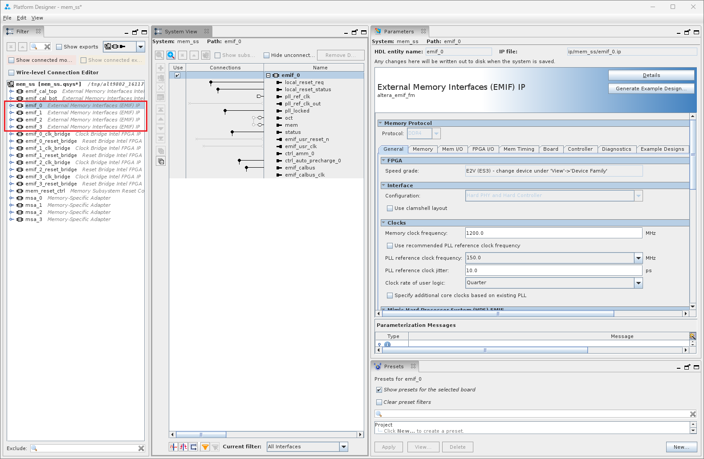

6. Click each EMIF 0 through 3 and perform the following actions.

  1. In the **Parameters** window, click the **Memory** tab and change the **DQ width** to `40`.

    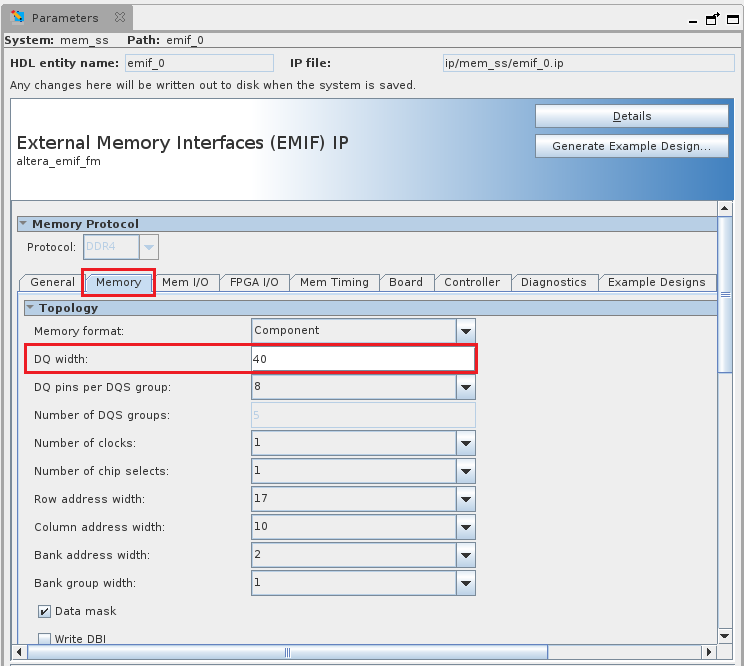

  2. In the **Parameters** window, click the **Controller** tab. Scroll down and check the box for `Enable Error Detection and Correction Logic with ECC`. 
  
    

7. Once Step 6 has been done for each EMIF 0-3, click **File -> Save**. Close the Platform Designer window.

8. In the IP Parameter Editor **Presets** window, click **New** to create an IP Presets file.

  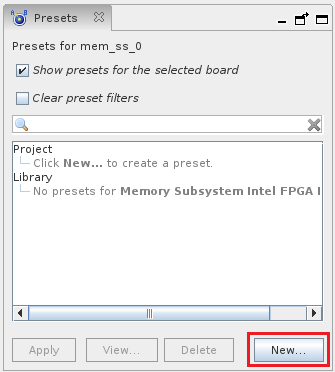

9. In the **New Preset** window, set the **Name** for the preset. In this case we will name it `f2000x-ecc`.

  

10. Click the **...** button to select the location for the **Preset file**.

11. In the **Save As** window, change the save location to `$OFS_ROOTDIR/ipss/mem/qip/presets` and change the **File Name** to `f2000x-ecc.qprs`. Click **OK**.

  

12. Click **Save** in the **New Preset** window. Click **No** when prompted to add the file to the IP search path.

  

13. Close the **IP Parameter Editor**. You do not need to generate or save the IP.

14. Edit the `$OFS_ROOTDIR/syn/setup/emif_loc.tcl` file to assign the pins required for ECC enabled interfaces.

  1. Uncomment the `DQS4 (ECC)` pin assignments for all memory interfaces

    ```tcl
    #---------------------------------------------------------
    # EMIF CH0
    #---------------------------------------------------------
    ...
    # # CH0 DQS4 (ECC)
    set_location_assignment PIN_A39 -to ddr4_mem[0].dq[32]
    set_location_assignment PIN_J35 -to ddr4_mem[0].dq[33]
    set_location_assignment PIN_C38 -to ddr4_mem[0].dq[34]
    set_location_assignment PIN_G34 -to ddr4_mem[0].dq[35]
    set_location_assignment PIN_G38 -to ddr4_mem[0].dq[36]
    set_location_assignment PIN_C34 -to ddr4_mem[0].dq[37]
    set_location_assignment PIN_J39 -to ddr4_mem[0].dq[38]
    set_location_assignment PIN_A35 -to ddr4_mem[0].dq[39]
    set_location_assignment PIN_C36 -to ddr4_mem[0].dqs[4]
    set_location_assignment PIN_A37 -to ddr4_mem[0].dqs_n[4]
    set_location_assignment PIN_G36 -to ddr4_mem[0].dbi_n[4]

    #---------------------------------------------------------
    # EMIF CH1
    #---------------------------------------------------------
    ...
    # # CH1 DQS4 (ECC)
    set_location_assignment PIN_N7  -to ddr4_mem[1].dq[32]
    set_location_assignment PIN_L12 -to ddr4_mem[1].dq[33]
    set_location_assignment PIN_L6  -to ddr4_mem[1].dq[34]
    set_location_assignment PIN_U14 -to ddr4_mem[1].dq[35]
    set_location_assignment PIN_U7  -to ddr4_mem[1].dq[36]
    set_location_assignment PIN_W12 -to ddr4_mem[1].dq[37]
    set_location_assignment PIN_W6  -to ddr4_mem[1].dq[38]
    set_location_assignment PIN_N14 -to ddr4_mem[1].dq[39]
    set_location_assignment PIN_L9  -to ddr4_mem[1].dqs[4]
    set_location_assignment PIN_N10 -to ddr4_mem[1].dqs_n[4]
    set_location_assignment PIN_W9  -to ddr4_mem[1].dbi_n[4]

    #---------------------------------------------------------
    # EMIF CH2
    #---------------------------------------------------------
    ...
    # CH2 DQS4 (ECC)
    set_location_assignment PIN_GC37 -to ddr4_mem[2].dq[32]
    set_location_assignment PIN_GC41 -to ddr4_mem[2].dq[33]
    set_location_assignment PIN_FY37 -to ddr4_mem[2].dq[34]
    set_location_assignment PIN_GE40 -to ddr4_mem[2].dq[35]
    set_location_assignment PIN_FV36 -to ddr4_mem[2].dq[36]
    set_location_assignment PIN_FY41 -to ddr4_mem[2].dq[37]
    set_location_assignment PIN_GE36 -to ddr4_mem[2].dq[38]
    set_location_assignment PIN_FV40 -to ddr4_mem[2].dq[39]
    set_location_assignment PIN_GE38 -to ddr4_mem[2].dqs[4]
    set_location_assignment PIN_GC39 -to ddr4_mem[2].dqs_n[4]
    set_location_assignment PIN_FV38 -to ddr4_mem[2].dbi_n[4]

    #---------------------------------------------------------
    # EMIF CH3
    #---------------------------------------------------------
    ...
    # # CH3 DQS4 (ECC)
    set_location_assignment PIN_FP46 -to ddr4_mem[3].dq[32]
    set_location_assignment PIN_FT43 -to ddr4_mem[3].dq[33]
    set_location_assignment PIN_FH47 -to ddr4_mem[3].dq[34]
    set_location_assignment PIN_FP42 -to ddr4_mem[3].dq[35]
    set_location_assignment PIN_FT47 -to ddr4_mem[3].dq[36]
    set_location_assignment PIN_FH43 -to ddr4_mem[3].dq[37]
    set_location_assignment PIN_FK46 -to ddr4_mem[3].dq[38]
    set_location_assignment PIN_FK42 -to ddr4_mem[3].dq[39]
    set_location_assignment PIN_FP44 -to ddr4_mem[3].dqs[4]
    set_location_assignment PIN_FT45 -to ddr4_mem[3].dqs_n[4]
    set_location_assignment PIN_FK44 -to ddr4_mem[3].dbi_n[4]
    ```

  2. Change the pin assignment for `ddr4_mem[1].dbi_n[4]` from `PIN_G12` to `PIN_W9`

    ```tcl
    set_location_assignment PIN_W9  -to ddr4_mem[1].dbi_n[4]
    ```

15. Edit the `$OFS_ROOTDIR/tools/ofss_config/memory/memory.ofss` file to use the new presets file generated previously.

  ```
  [ip]
  type = memory
  
  [settings]
  output_name = mem_ss_fm
  preset = f2000x-mem-ecc
  ```

10. Compile the design with the f2000x OFSS file which calls the Memory OFSS file edited in the previous step. 

  ```bash
  cd $OFS_ROOTDIR
  ofs-common/scripts/common/syn/build_top.sh -p --ofss tools/ofss_config/f2000x.ofss f2000x <YOUR_WORK_DIRECTORY>
  ```

11. You may need to adjust the floorplan of the design in order to meet timing after a design change such as this. Refer to the [How to Resize the Partial Reconfiguration Region](https://ofs.github.io/ofs-2024.2-1/hw/f2000x/dev_guides/fim_dev/ug_dev_fim_ofs/#54-how-to-resize-the-partial-reconfiguration-region) section for information regarding modifications to the floorplan.

### **4.8 Modify the Ethernet Sub-System**

This section describes the flows for modifying the Ethernet Sub-System. There are three flows you may use to make modifications.

* Modify the Ethernet Sub-System with OFSS supported changes only. These modifications are supported natively by the build script, and are made at run-time of the build script. This flow is useful for users who only need to leverage natively supported HSSI OFSS settings.
* Modify the Ethernet Sub-System with OFSS supported changes, then make additional custom modifications not covered by OFSS. These modifications will be captured in a presets file which can be used in future compiles. This flow is useful for users who whish to leverage pre-made HSSI OFSS settings, but make additional modifications not natively supported by HSSI OFSS.
* Modify the Ethernet Sub-System without HSSI OFSS. These modification will be made directly in the source files.

#### **4.8.1 Walkthrough: Modify the Ethernet Sub-System Channels With Pre-Made HSSI OFSS**

This walkthrough describes how to use OFSS to configure the Ethernet-SS. Refer to section [HSSI IP OFSS File](https://ofs.github.io/ofs-2024.2-1/hw/f2000x/dev_guides/fim_dev/ug_dev_fim_ofs/#2126-hssi-ip-ofss-file) for detailed information about modifications supported by Ethernet-SS OFSS files. This walkthrough is useful for users who only need to leverage the pre-made, natively supported HSSI OFSS settings.

Pre-Requisites:

* This walkthrough requires a development environment. Refer to the [Set Up Development Environment](https://ofs.github.io/ofs-2024.2-1/hw/f2000x/dev_guides/fim_dev/ug_dev_fim_ofs/#134-walkthrough-set-up-development-environment) Section for instructions on setting up a development environment.

Steps:

1. Clone the OFS Agilex® 7 SoC Attach FIM repository (or use an existing cloned repository). Refer to the [Clone FIM Repository](https://ofs.github.io/ofs-2024.2-1/hw/f2000x/dev_guides/fim_dev/ug_dev_fim_ofs/#1321-walkthrough-clone-fim-repository) section for step-by-step instructions.

2. Set development environment variables. Refer to the [Set Development Environment Variables](https://ofs.github.io/ofs-2024.2-1/hw/f2000x/dev_guides/fim_dev/ug_dev_fim_ofs/#1331-walkthrough-set-development-environment-variables) section for step-by-step instructions.

3. Edit the `$OFS_ROTDIR/tools/ofss_config/f2000x.ofss` file to use the desired Ethernet-SS OFSS configuration. The pre-provided OFSS configurations are as follows:

  * To select the 2x4x25GbE configuration, include the following line

    ```bash
    "$OFS_ROOTDIR"/tools/ofss_config/hssi/hssi_8x25.ofss
    ```

  * To select the 2x4x10GbE configuration, include the following line

    ```bash
    "$OFS_ROOTDIR"/tools/ofss_config/hssi/hssi_8x10.ofss
    ```

  * To select the 2x1x100GbE configuration, include the following line

    ```bash
    "$OFS_ROOTDIR"/tools/ofss_config/hssi/hssi_2x100.ofss
    ```

4. Compile the FIM using the f2000x OFSS file.

  ```bash
  cd $OFS_ROOTDIR

  ./ofs-common/scripts/common/syn/build_top.sh -p --ofss tools/ofss_config/f2000x.ofss f2000x work_f2000x
  ```

5. The resulting FIM will contain the Ethernet-SS configuration specified in Step 3. The Ethernet-SS IP in the resulting work directory shows the parameter settings that are used.

#### **4.8.2 Walkthrough: Add Channels to the Ethernet Sub-System Channels With Custom HSSI OFSS**

This walkthrough describes how to create an use a custom OFSS file to add channels to the Ethernet-SS and compile a design with a 3x4x25GbE Ethernet-SS configuration. This walkthrough is useful for users who wish to leverage the natively supported HSSI OFSS settings.

Pre-Requisites:

* This walkthrough requires a development environment. Refer to the [Set Up Development Environment](https://ofs.github.io/ofs-2024.2-1/hw/f2000x/dev_guides/fim_dev/ug_dev_fim_ofs/#134-walkthrough-set-up-development-environment) Section for instructions on setting up a development environment.

Steps:

1. Clone the OFS Agilex® 7 SoC Attach FIM repository (or use an existing cloned repository). Refer to the [Clone FIM Repository](https://ofs.github.io/ofs-2024.2-1/hw/f2000x/dev_guides/fim_dev/ug_dev_fim_ofs/#1321-walkthrough-clone-fim-repository) section for step-by-step instructions.

2. Set development environment variables. Refer to the [Set Development Environment Variables](https://ofs.github.io/ofs-2024.2-1/hw/f2000x/dev_guides/fim_dev/ug_dev_fim_ofs/#1331-walkthrough-set-development-environment-variables) section for step-by-step instructions.

3. Create a new HSSI OFSS file `$OFS_ROOTDIR/tools/ofss_config/hssi/hssi_12x25.ofss` with the following contents. In this example we are using 12 channels.

  ```bash
  [ip]
  type = hssi
	
  [settings]
  output_name = hssi_ss
  num_channels = 12
  data_rate = 25GbE
  ```

4. Edit the `$OFS_ROOTDIR/tools/ofss_config/f2000x.ofss` file to use the new HSSI OFSS file generated in Step 3.

  ```bash
  [include]
  "$OFS_ROOTDIR"/tools/ofss_config/f2000x_base.ofss
  "$OFS_ROOTDIR"/tools/ofss_config/pcie/pcie_host.ofss
  "$OFS_ROOTDIR"/tools/ofss_config/pcie/pcie_soc.ofss
  "$OFS_ROOTDIR"/tools/ofss_config/iopll/iopll.ofss
  "$OFS_ROOTDIR"/tools/ofss_config/memory/memory.ofss
  "$OFS_ROOTDIR"/tools/ofss_config/hssi/hssi_12x25.ofss
  ```

5. Identify the which channels will be added. You may use the [E-Tile Channel Placement Tool](https://www.intel.com/content/www/us/en/content-details/652292/intel-e-tile-channel-placement-tool.html?wapkw=e-tile%20channel%20placement%20tool&DocID=652292) to aid in your design. In this example we will add the 4 new 25GbE channels to Channels 8-11.

  

6. Based on your channel selection, identify which pins will be used. Refer to the [Pin-Out Files for Altera FPGAs] determine the required pins for your device. In this example we are targeting the AGFC023R25A2E2VR0 device. Set the pin assignments in the `$OFS_ROOTDIR/syn/setup/eth_loc.tcl` file.
        
  ```tcl
  set_location_assignment PIN_DL8  -to hssi_if[8].rx_p
  set_location_assignment PIN_DN13 -to hssi_if[9].rx_p
  set_location_assignment PIN_DY8  -to hssi_if[10].rx_p
  set_location_assignment PIN_EB13 -to hssi_if[11].rx_p

  set_location_assignment PIN_DL1  -to hssi_if[8].tx_p
  set_location_assignment PIN_DN4  -to hssi_if[9].tx_p
  set_location_assignment PIN_DY1  -to hssi_if[10].tx_p
  set_location_assignment PIN_EB4  -to hssi_if[11].tx_p
  ```

7. Change the number of QSFP ports from `2` to `3` in the `$OFS_ROOTDIR/ofs-common/src/fpga_family/agilex/hssi_ss/inc/ofs_fim_eth_plat_if_pkg.sv` file.

  ```verilog
  localparam NUM_QSFP_PORTS_USED  = 3; // Number of QSFP cages on board used by target hssi configuration
  ```

8. Edit `$OFS_ROOTDIR/ofs-common/src/fpga_family/agilex/hssi_ss/hssi_wrapper.sv` so that the QSFP LED signals use `NUM_QSFP_PORTS_USED` defined in the previous step.

  ```verilog
  // Speed and activity LEDS
  output logic [NUM_QSFP_PORTS_USED-1:0]     o_qsfp_speed_green,       // Link up in Nx25G or 2x56G or 1x100G speed
  output logic [NUM_QSFP_PORTS_USED-1:0]     o_qsfp_speed_yellow,      // Link up in Nx10G speed
  output logic [NUM_QSFP_PORTS_USED-1:0]     o_qsfp_activity_green,    // Link up and activity seen
  output logic [NUM_QSFP_PORTS_USED-1:0]     o_qsfp_activity_red       // LOS, TX Fault etc
  ```

9. Compile the design. It is recommended to compile a flat design first before incorporating a PR region in the design. This reduces design complexity while you determine the correct pinout for your design.

  ```bash
  cd $OFS_ROOTDIR

  ./ofs-common/scripts/common/syn/build_top.sh --ofss tools/ofss_config/f2000x.ofss f2000x:flat work_f2000x_12x25g
  ```

10. You may need to adjust the floorplan in order to compile with a PR region that meets timing. Refer to the [How to Resize the Partial Reconfiguration Region](https://ofs.github.io/ofs-2024.2-1/hw/f2000x/dev_guides/fim_dev/ug_dev_fim_ofs/#54-how-to-resize-the-partial-reconfiguration-region) section for information regarding modifications to the floorplan.

#### **4.8.3 Walkthrough: Modify the Ethernet Sub-System With Pre-Made HSSI OFSS Plus Additional Modifications**

This walkthrough describes how to use OFSS to first modify the Ethernet-SS, then make additional modifications on top. Refer to section [HSSI IP OFSS File](https://ofs.github.io/ofs-2024.2-1/hw/f2000x/dev_guides/fim_dev/ug_dev_fim_ofs/#2126-hssi-ip-ofss-file) for detailed information about modifications supported by Ethernet-SS OFSS files. This flow is useful for users who whish to leverage pre-made OFSS settings, but make additional modifications not natively supported by OFSS.

Pre-Requisites:

* This walkthrough requires a development environment. Refer to the [Set Up Development Environment](https://ofs.github.io/ofs-2024.2-1/hw/f2000x/dev_guides/fim_dev/ug_dev_fim_ofs/#134-walkthrough-set-up-development-environment) Section for instructions on setting up a development environment.

Steps:

1. Clone the OFS Agilex® 7 SoC Attach FIM repository (or use an existing cloned repository). Refer to the [Clone FIM Repository](https://ofs.github.io/ofs-2024.2-1/hw/f2000x/dev_guides/fim_dev/ug_dev_fim_ofs/#1321-walkthrough-clone-fim-repository) section for step-by-step instructions.

2. Set development environment variables. Refer to the [Set Development Environment Variables](https://ofs.github.io/ofs-2024.2-1/hw/f2000x/dev_guides/fim_dev/ug_dev_fim_ofs/#1331-walkthrough-set-development-environment-variables) section for step-by-step instructions.

3. Edit the `$OFS_ROTDIR/tools/ofss_config/f2000x.ofss` file to use the desired Ethernet-SS OFSS configuration starting point. Examples for using pre-provided HSSI OFSS files are given below.

  * To select 2x4x25GbE configuration, add the following line

    ```bash
    "$OFS_ROOTDIR"/tools/ofss_config/hssi/hssi_8x25.ofss
    ```

  * To select 2x4x10GbE configuration, add the following line

    ```bash
    "$OFS_ROOTDIR"/tools/ofss_config/hssi/hssi_8x10.ofss
    ```

  * To select 2x1x100GbE configuration, add the following line

    ```bash
    "$OFS_ROOTDIR"/tools/ofss_config/hssi/hssi_2x100.ofss
    ```

4. Run the `setup` stage of the build script with the OFSS file to create a work directory which contains the Ethernet-SS IP configuration specified in Step 3.

  ```bash
  cd $OFS_ROOTDIR

  ./ofs-common/scripts/common/syn/build_top.sh --stage setup --ofss tools/ofss_config/f2000x.ofss f2000x work_f2000x
  ```

5. Open the Ethernet-SS IP in Quartus Parameter Editor. The IP settings will match te configuration of the OFSS file defined in Step 3. Make any additional modifications in the Parameter Editor as desired.

  ```bash
  qsys-edit $OFS_ROOTDIR/work_f2000x/ipss/hssi/qip/hssi_ss/hssi_ss.ip
  ```

6. Once you are satisfied with your changes, click the **New...** button in the **Presets** pane of IP Parameter Editor.

  

7. In the **New Preset** window, create a unique **Name**. In this example the name is `f2000x-hssi-presets`.

  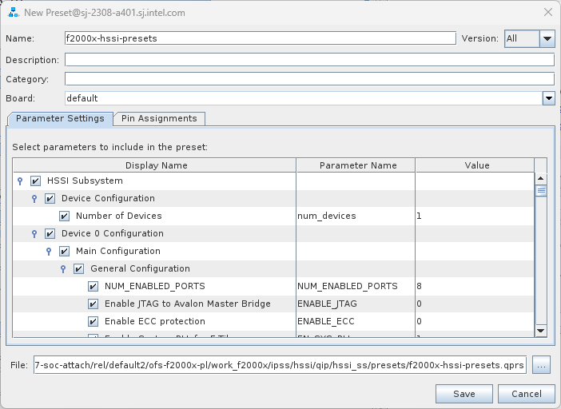

8. Click the **...** button to select where to save the preset file. Give it a name, and save it to `$OFS_ROOTDIR/ipss/hssi/qip/hssi_ss/presets`. Create the `presets` directory if necessary.

  

9. Click **Save** in the **New Preset** window. Click **No** when prompted to add the file to the IP search path.

10. Close out of all Quartus GUIs. You do not need to save or compile the IP.

11. Create a new HSSI OFSS file in the `$OFS_ROOTDIR/tools/ofss_config/hssi` directory named `hssi_preset_f2000x.ofss` with the following contents. Note that the `num_channels` and `data_rate` settings will be overwritten by the contents of the preset file. The `preset` setting must match the name you selected in Step 7.

  ```bash
  [ip]
  type = hssi
	
  [settings]
  output_name = hssi_ss
  num_channels = 8
  data_rate = 25GbE
  preset = f2000x-hssi-presets
  ```

12. Edit the `$OFS_ROOTDIR/tools/ofss_config/f2000x.ofss` file to use the new HSSI OFSS file created in Step 10.

  ```bash
  [include]
  "$OFS_ROOTDIR"/tools/ofss_config/f2000x_base.ofss
  "$OFS_ROOTDIR"/tools/ofss_config/pcie/pcie_host.ofss
  "$OFS_ROOTDIR"/tools/ofss_config/pcie/pcie_soc.ofss
  "$OFS_ROOTDIR"/tools/ofss_config/iopll/iopll.ofss
  "$OFS_ROOTDIR"/tools/ofss_config/memory/memory.ofss
  "$OFS_ROOTDIR"/tools/ofss_config/hssi/hssi_preset_f2000x.ofss
  ```

13. Compile the design using the f2000x OFSS file. It is recommended to compile a flat design first before incorporating a PR region in the design. This reduces design complexity while you modify the FIM.

  ```bash
  ./ofs-common/scripts/common/syn/build_top.sh --ofss tools/ofss_config/f2000x.ofss f2000x:flat work_f2000x_hssi_preset
  ```

14. The resulting FIM will contain the Ethernet-SS configuration specified by the presets file. The Ethernet-SS IP in the resulting work directory shows the parameter settings that are used.

#### **4.8.4 Walkthrough: Modify the Ethernet Sub-System Without HSSI OFSS**

This walkthrough describes how to modify the Ethernet-SS wihout using OFSS. This flow will edit the Ethernet-SS IP source directly. This walkthrough is useful for users who wish to make all Ethernet-SS modifications manually, without leveraging HSSI OFSS.

Pre-Requisites:

* This walkthrough requires a development environment. Refer to the [Set Up Development Environment](https://ofs.github.io/ofs-2024.2-1/hw/f2000x/dev_guides/fim_dev/ug_dev_fim_ofs/#134-walkthrough-set-up-development-environment) Section for instructions on setting up a development environment.

Steps:

1. Clone the OFS Agilex® 7 SoC Attach FIM repository (or use an existing cloned repository). Refer to the [Clone FIM Repository](https://ofs.github.io/ofs-2024.2-1/hw/f2000x/dev_guides/fim_dev/ug_dev_fim_ofs/#1321-walkthrough-clone-fim-repository) section for step-by-step instructions.

2. Set development environment variables. Refer to the [Set Development Environment Variables](https://ofs.github.io/ofs-2024.2-1/hw/f2000x/dev_guides/fim_dev/ug_dev_fim_ofs/#1331-walkthrough-set-development-environment-variables) section for step-by-step instructions.

3. Open the Ethernet-SS IP in Quartus Parameter Editor. Make your modifications in the Parameter Editor.

  ```bash
  qsys-edit $OFS_ROOTDIR/ipss/hssi/qip/hssi_ss/hssi_ss.ip
  ```

4. Once you are satisfied with your changes, click the **Generate HDL**. Save the design if prompted.

5. Compile the design.

  * If you are not using any other OFSS files in your compilation flow, use the following command to compile. It is recommended to compile a flat design before incorporating a PR region in the design. This reduces design complexity while you modify the FIM.

    ```bash
    ./ofs-common/scripts/common/syn/build_top.sh f2000x:flat work_f2000x
    ```

  * If you are using OFSS files for other IP in the design, ensure that the top level OFSS file (e.g. `$OFS_ROOTDIR/tools/ofss_config/f2000x.ofss`) does not specify an HSSI OFSS file. Then use the following command to compile. It is recommended to compile a flat design first before incorporating a PR region in the design. This reduces design complexity while you modify the FIM.

  ```bash
  ./ofs-common/scripts/common/syn/build_top.sh --ofss tools/ofss_config/f2000x.ofss f2000x:flat work_f2000x
  ```

6. The resulting FIM will contain the Ethernet-SS configuration contained in the `hssi_ss.ip` source file.


## **5. FPGA Configuration**

Configuring the Agilex FPGA on the f2000x can be done by Remote System Update (RSU) using OPAE commands, or by programming a `SOF` image to the FPGA via JTAG using Quartus Programer.

Programming via RSU will program the flash device on the board for non-volatile image updates. Programming via JTAG will configure the FPGA for volatile image updates.

#### **5.1 Walkthrough: Set up JTAG**

The f2000x  has a 10 pin JTAG header on the top side of the board.  This JTAG header provides access to either the Agilex 7 FPGA or Cyclone<sup>&reg;</sup> 10 BMC device. A JTAG connection with the FPGA Download Cable II can be used to configure the FPGA and to access the Signal Tap Instance. This walkthrough describes how to connect the FPGA Download Cable II and target the Agilex 7 device.

Pre-requisites:

* This walkthrough requires an OFS Agilex® 7 SoC Attach deployment environment. Refer to the [Board Installation Guide: OFS For Agilex® 7 SoC Attach IPU F2000X-PL](https://ofs.github.io/ofs-2024.2-1/hw/common/board_installation/f2000x_board_installation/f2000x_board_installation) and [Software Installation Guide: OFS for Agilex® 7 SoC Attach FPGAs](https://ofs.github.io/ofs-2024.2-1/hw/common/sw_installation/soc_attach/sw_install_soc_attach) for instructions on setting up a deployment environment.

* This walkthrough requires a workstation with Quartus Prime Pro Version 23.4 tools installed, specifically the `jtagconfig` tool.

* This walkthrough requires an [Intel FPGA Download Cable II](https://www.intel.com/content/www/us/en/products/sku/215664/intel-fpga-download-cable-ii/specifications.html).

Steps:

1. Locate SW2 and SW3 on the f2000x board as shown in the following figure.

    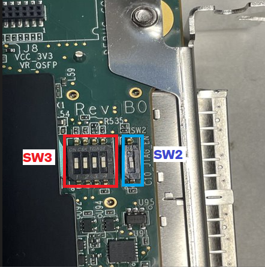

2. Set the switches described in the following table:

    | Switch | Position |
    | --- | --- |
    | SW2 | ON |
    | SW3.3 | ON |

3. Connect the FPGA Download Cable to the JTAG header of the f2000x as shown in the figure below.

    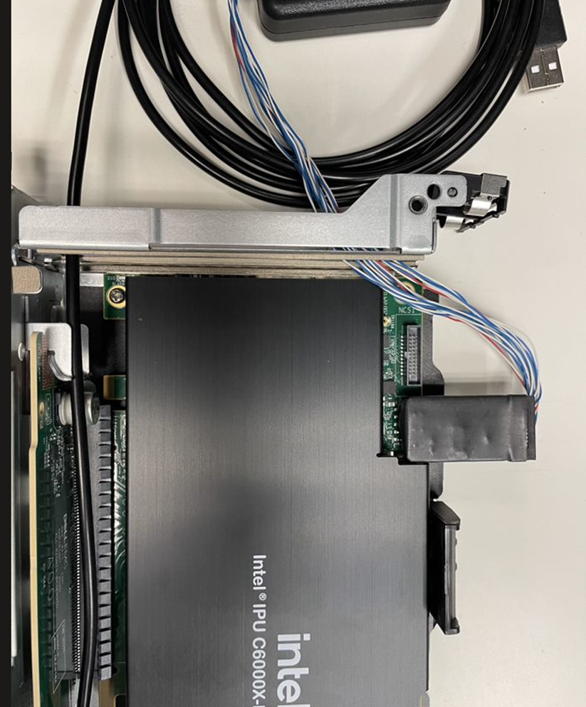

4. Depending on your server, install the card in a slot that allows room for the JTAG cable. The figure below shows the f2000x installed in a Supermicro server slot.

    


5. There are two JTAG modes that exist. Short-chain mode is when only the Cyclone 10 device is on the JTAG chain. Long-chain mode is when both the Cyclone 10 and the Agilex® 7 FPGA are on the JTAG chain. Check which JTAG mode the f2000x board is in by running the following command.

  ```bash
  $QUARTUS_ROOTDIR/bin/jtagconfig
  ```

  * Example output when in short-chain mode (only Cyclone 10 detected):

    ```bash
    1) USB-BlasterII [3-4]
    020F60DD    10CL080(Y|Z)/EP3C80/EP4CE75
    ```

  * Example output when in long-chain mode (both Cyclone 10 and Agilex® 7 FPGA):

    ```bash
    1) USB-BlasterII [3-4]
    020F60DD   10CL080(Y|Z)/EP3C80/EP4CE75
    234150DD   AGFC023R25A(.|AE|R0)
    ```

  If the Agilex® 7 FPGA does not appear on the chain, ensure that the switches described in Step 1 have been set correctly and power cycle the board. Also ensure that the JTAG Longchain bit is set to `0` in BMC Register 0x378. The BMC registers are accessed through SPI control registers at addresses 0x8040C and 0x80400 in the PMCI. Use the following commands to clear the JTAG Longchain bit in BMC register 0x378. 

  >**Note**: These commands must be executed as root user from the SoC.

  >**Note**: You may find the PCIe BDF of your card by running `fpgainfo fme`.

  ```bash
  opae.io init -d <BDF>
  opae.io -d <BDF> -r 0 poke 0x8040c 0x000000000
  opae.io -d <BDF> -r 0 poke 0x80400 0x37800000002
  opae.io release -d <BDF>
  ```
  For example, for a board with PCIe BDF `15:00.0`:
  ```bash
  opae.io init -d 15:00.0
  opae.io -d 15:00.0 -r 0 poke 0x8040c 0x000000000
  opae.io -d 15:00.0 -r 0 poke 0x80400 0x37800000002
  opae.io release -d 15:00.0
  ```

#### **5.2 Walkthrough: Program the FPGA via JTAG**

Every successful run of `build_top.sh` script creates the file `$OFS_ROOTDIR/<WORK_DIRECTORY>/syn/syn_top/output_files/ofs_top.sof` which can be used with the FPGA Download Cable II to load the image into the FPGA using the f2000x  JTAG access connector. 

This walkthrough describes the steps to program the Agilex FPGA on the Intel® Infrastructure Processing Unit (Intel® IPU) Platform F2000X-PL with a `SOF` image via JTAG.

Pre-Requisites:

* This walkthrough requires an OFS Agilex® 7 SoC Attach deployment environment. Refer to the [Board Installation Guide: OFS For Agilex® 7 SoC Attach IPU F2000X-PL](https://ofs.github.io/ofs-2024.2-1/hw/common/board_installation/f2000x_board_installation/f2000x_board_installation) and [Software Installation Guide: OFS for Agilex® 7 SoC Attach FPGAs](https://ofs.github.io/ofs-2024.2-1/hw/common/sw_installation/soc_attach/sw_install_soc_attach) for instructions on setting up a deployment environment.

* This walkthrough requires a `SOF` image which will be programmed to the Agilex FPGA. Refer to the [Compile OFS FIM](https://ofs.github.io/ofs-2024.2-1/hw/f2000x/dev_guides/fim_dev/ug_dev_fim_ofs/#225-walkthrough-compile-ofs-fim) Section for step-by-step instructions for generating a `SOF` image.

* This walkthrough requires a JTAG connection to the f2000x. Refer to the [Set up JTAG](https://ofs.github.io/ofs-2024.2-1/hw/f2000x/dev_guides/fim_dev/ug_dev_fim_ofs/#51-walkthrough-set-up-jtag) section for step-by-step instructions.

* This walkthrough requires a Full Quartus Installation or Standalone Quartus Prime Programmer & Tools running on the machine where the Intel® Infrastructure Processing Unit (Intel® IPU) Platform F2000X-PL is connected via JTAG.

Steps:

1. Start in your deployment environment.

2. Temporarily disable the PCIe AER feature and remove the PCIe port for the board you are going to update. This is required because when you program the FPGA using JTAG, the f2000x PCIe link goes down for a moment causing a server surprise link down event. To prevent this server event, temporarily disable PCIe AER and remove the PCIe port using the following commands:

  >**Note:** enter the following commands as root.

  1. Find the PCIe BDF and Device ID of your board from the SoC. You may use the OPAE command `fpaginfo fme` on the SoC to display this information. Run this command on the SoC.

    ```bash
    fpgainfo fme
    ```

    Example output:

    ```bash
    Intel IPU Platform F2000X-PL
    Board Management Controller NIOS FW version: 1.2.3
    Board Management Controller Build version: 1.2.3
    //****** FME ******//
    Object Id                        : 0xEF00000
    PCIe s:b:d.f                     : 0000:15:00.0
    Vendor Id                        : 0x8086
    Device Id                        : 0xBCCE
    SubVendor Id                     : 0x8086
    SubDevice Id                     : 0x17D4
    Socket Id                        : 0x00
    Ports Num                        : 01
    Bitstream Id                     : 0x50103024BF5B5B1
    Bitstream Version                : 5.0.1
    Pr Interface Id                  : e7926956-9b1b-5ea1-b02c-307f1cb33446
    Boot Page                        : user1
    User1 Image Info                 : b02c307f1cb33446e79269569b1b5ea1
    User2 Image Info                 : b02c307f1cb33446e79269569b1b5ea1
    Factory Image Info               : b02c307f1cb33446e79269569b1b5ea1
    ```

    In this case, the PCIe BDF for the board on the SoC is `15:00.0`, and the Device ID is `0xBCCE`.

  2. From the SoC, use the `pci_device` OPAE command to "unplug" the PCIe port for your board using the PCIe BDF found in Step 3.a. Run this command on the SoC.

    ```bash
    pci_device <B:D.F> unplug
    ```

    For example:

    ```bash
    pci_device 15:00.0 unplug
    ```

  3. Find the PCIe BDF of your board from the Host. Use `lspci` and `grep` for the device ID found in Step 3.a to get the PCIe BDF. Run this command on the Host.

    For example:

    ```bash
    lspci | grep bcce
    ```

    Example output:

    ```bash
    31:00.0 Processing accelerators: Intel Corporation Device bcce (rev 01)
    31:00.1 Processing accelerators: Intel Corporation Device bcce (rev 01)
    ```

    In this case, the board has PCIe BDF 31:00.0 from the Host.

  3. From the Host, use the `pci_device` OPAE command to "unplug" the PCIe port for your board using the PCIe BDF found in Step 3.c. Run this command on the Host.

    ```bash
    pci_device <B:D.F> unplug
    ```

    For example:

    ```bash
    pci_device 31:00.0 unplug
    ```

3. Launch "Quartus Prime Programmer" software from the device which the FPGA Programmer is connected.

  ```bash
  $QUARTUS_ROOTDIR/bin/quartus_pgmw
  ```

  Click on **Hardware Setup**, select **USB-BlasterII** in the **Current Selected Hardware** list, and ensure the JTAG **Hardware Frequency** is set to 16Mhz (The default is 24MHz).

  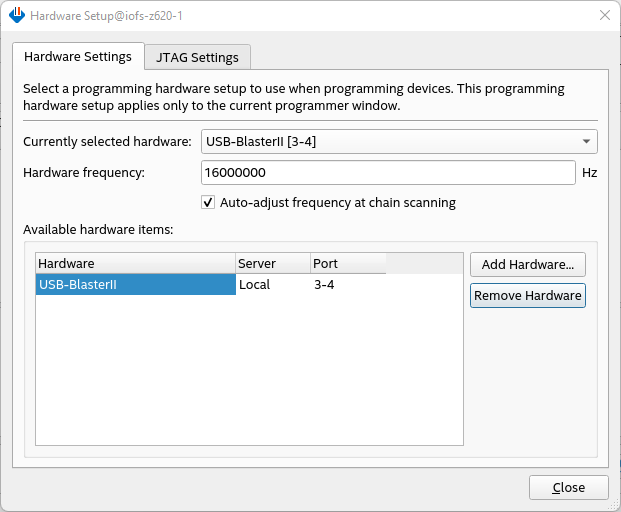

  Alternatively, use the following command from the command line to change the clock frequency:

  ```bash
  jtagconfig –setparam “USB-BlasterII” JtagClock 16M
  ```


4. Click **Auto Detect** and make sure the Agilex® 7 FPGA is shown in the JTAG chain. Select the Cyclone 10 and Agilex® 7 FPGA if prompted.
   
  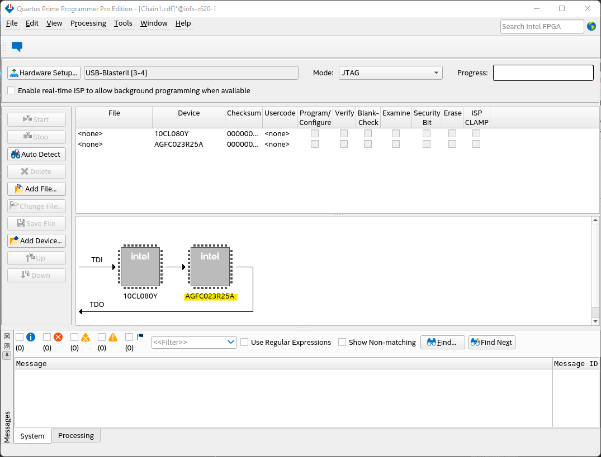
   
5. Right-click on the cell in the **File** column for the Agilex® 7 FPGA and click on **Change file**

  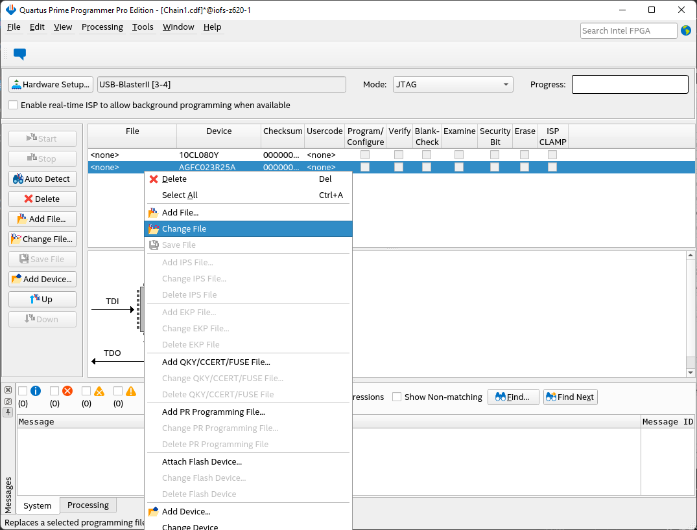
      
6. Select the **.sof** file that you wish to configure the Agilex® 7 FPGA with.
  
7. Tick the checkbox below "Program/Configure" column and click on **Start** to program this .sof file.

  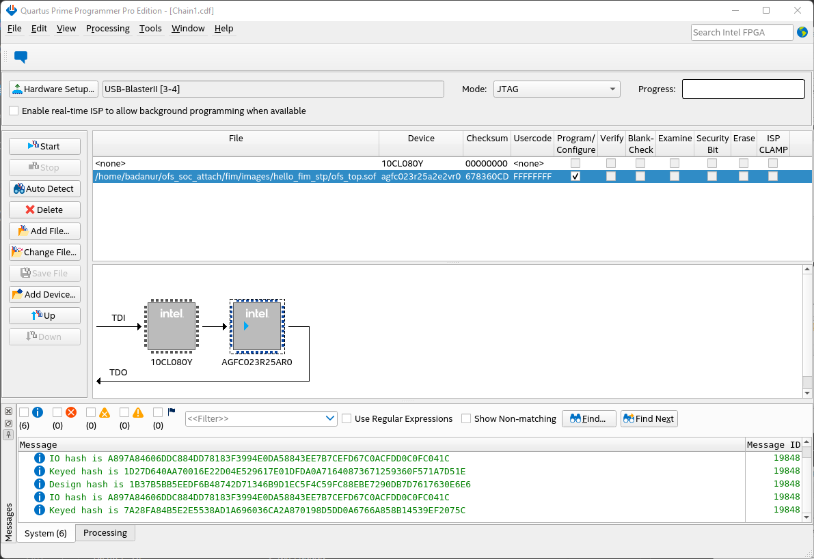

8. After successful programming, you can close the "Quartus Prime Programmer" software. You can answer 'No' if a dialog pops up asking to save the **'Chain.cdf'** file. This completes the Agilex® 7 FPGA .sof programming.

9. Re-plug the PCIe ports on both the SoC and Host.

  >**Note:** enter the following commands as root.

  1. From the SoC, use the `pci_device` OPAE command to "plug" the PCIe port for your board using the PCIe BDF found in Step 3.a. Run this command on the SoC.

    ```bash
    pci_device <B:D.F> plug
    ```

    For example:

    ```bash
    pci_device 15:00.0 plug
    ```

  2. From the Host, use the `pci_device` OPAE command to "plug" the PCIe port for your board using the PCIe BDF found in Step 3.c. Run this command on the Host.

    ```bash
    pci_device <B:D.F> plug
    ```

    For example:

    ```bash
    pci_device 31:00.0 plug
    ```

10. Verify the f2000x is present by checking expected bitstream ID using `fpaginfo fme` on the SoC:

  ```bash
  fpgainfo fme
  ```

  Example output:
  ```bash
  Intel IPU Platform f2000x-PL
  Board Management Controller NIOS FW version: 1.2.4
  Board Management Controller Build version: 1.2.4
  //****** FME ******//
  Object Id                        : 0xF000000
  PCIe s:b:d.f                     : 0000:15:00.0
  Vendor Id                        : 0x8086
  Device Id                        : 0xBCCE
  SubVendor Id                     : 0x8086
  SubDevice Id                     : 0x17D4
  Socket Id                        : 0x00
  Ports Num                        : 01
  Bitstream Id                     : 0x5010302A97C08A3
  Bitstream Version                : 5.0.1
  Pr Interface Id                  : cf00eed4-a82b-5f07-be25-0528baec3711
  Boot Page                        : user1
  User1 Image Info                 : 9e3db8b6a4d25a4e3e46f2088b495899
  User2 Image Info                 : 9e3db8b6a4d25a4e3e46f2088b495899
  Factory Image Info               : None
  ```

  >**Note:** The **Image Info** fields will not change, because these represent the images stored in flash. In this example, we are programming the Agilex® 7 FPGA directly, thus only the Bitstream ID should change.

#### **5.3 Remote System Update**

The OPAE `fpgasupdate` tool can be used to update the Cyclone 10 Board Management Controller (BMC) image and firmware (FW), root entry hash, and FPGA Static Region (SR) and user image (PR). The `fpgasupdate` tool only accepts images that have been formatted using PACsign. If a root entry hash has been programmed onto the board, then you must also sign the image using the correct keys.

The RSU flow requires that an OPAE enabled design is already loaded on the FPGA. All OPAE commands are run from the SoC, and the new image will be updated from the SoC.

##### **5.3.1 Walkthrough: Program the FPGA via RSU**

This walkthrough describes the steps to program the Agilex FPGA on the Intel® Infrastructure Processing Unit (Intel® IPU) Platform F2000X-PL with a `BIN` image via RSU.

Pre-Requisites:

* This walkthrough requires an OFS Agilex® 7 SoC Attach deployment environment. Refer to the [Board Installation Guide: OFS For Agilex® 7 SoC Attach IPU F2000X-PL](https://ofs.github.io/ofs-2024.2-1/hw/common/board_installation/f2000x_board_installation/f2000x_board_installation) and [Software Installation Guide: OFS for Agilex® 7 SoC Attach FPGAs](https://ofs.github.io/ofs-2024.2-1/hw/common/sw_installation/soc_attach/sw_install_soc_attach) for instructions on setting up a deployment environment.

* This walkthrough requires a `BIN` image which will be programmed to the Agilex FPGA. Refer to the [Compile OFS FIM](https://ofs.github.io/ofs-2024.2-1/hw/f2000x/dev_guides/fim_dev/ug_dev_fim_ofs/#225-walkthrough-compile-ofs-fim) Section for step-by-step instructions for generating a `BIN` image. The image used for programming must be formatted with PACsign before programming. This is done automatically by the build script.

Steps:

1. Start in your deployment environment.

2. Use the `fpgainfo fme` command to obtain the PCIe `s:b:d.f` associated with your board. In this example, the PCIe `s:b:d.f` is `0000:15:00.0`.

  ```bash
  fpgainfo fme
  ```

  Example output:

  ```bash
  Intel IPU Platform f2000x
  Board Management Controller NIOS FW version: 1.2.4 
  Board Management Controller Build version: 1.2.4 
  //****** FME ******//
  Object Id                        : 0xF000000
  PCIe s:b:d.f                     : 0000:15:00.0
  Vendor Id                        : 0x8086
  Device Id                        : 0xBCCE
  SubVendor Id                     : 0x8086
  SubDevice Id                     : 0x17D4
  Socket Id                        : 0x00
  Ports Num                        : 01
  Bitstream Id                     : 0x5010302A97C08A3
  Bitstream Version                : 5.0.1
  Pr Interface Id                  : fb25ff1d-c31a-55d8-81d8-cbcedcfcea17
  Boot Page                        : user1
  User1 Image Info                 : a566ceacaed810d43c60b0b8a7145591
  User2 Image Info                 : a566ceacaed810d43c60b0b8a7145591
  Factory Image Info               : a566ceacaed810d43c60b0b8a7145591
  ```

3. Use the OPAE `fpgasupdate` command to program a signed image to flash. The flash slot which will be programmed is determined by the signed header of the image.

  ```bash
  sudo fpgasupdate <IMAGE> <PCIe B:D.F>
  ```

  * Example: update User Image 1 in flash

    ```bash
    sudo fpgasupdate ofs_top_page1_unsigned_user1.bin 15:00.0
    ```

  * Example: update User Image 2 in flash

    ```bash
    sudo fpgasupdate ofs_top_page2_unsigned_user2.bin 15:00.0
    ```

  * Example: update Factory Image in flash

    ```bash
    sudo fpgasupdate ofs_top_page0_unsigned_factory.bin 15:00.0
    ```

>**Note:** The label "unsigned" in the images produced by the build script mean that the image has been signed with a null header. These images can only be programmed to devices which have not had any keys provisioned.

4. Use the OPAE `rsu` command to reconfigure the FPGA with the new image. You may select which image to configure from (User 1, User 2, Factory).

  ```bash
  sudo rsu fpga --page <PAGE> <PCIe B:D.F>
  ```

  * Example: configure FPGA with User 1 Image

    ```bash
    sudo rsu fpga --page user1 15:00.0
    ```

  * Example: configure FPGA with User 2 Image

    ```bash
    sudo rsu fpga --page user2 15:00.0
    ```

  * Example: configure FPGA with Factory Image

    ```bash
    sudo rsu fpga --page factory 15:00.0
    ```

5. Run the `fpgainfo fme` command again to verify the User1 Image Info has been updated.
   
  Example Output:

  ```bash
  Intel IPU Platform f2000x
  Board Management Controller NIOS FW version: 1.2.4 
  Board Management Controller Build version: 1.2.4 
  //****** FME ******//
  Object Id                        : 0xF000000
  PCIe s:b:d.f                     : 0000:15:00.0
  Vendor Id                        : 0x8086
  Device Id                        : 0xBCCE
  SubVendor Id                     : 0x8086
  SubDevice Id                     : 0x17D4
  Socket Id                        : 0x00
  Ports Num                        : 01
  Bitstream Id                     : 0x5010302A97C08A3
  Bitstream Version                : 5.0.1
  Pr Interface Id                  : fb25ff1d-c31a-55d8-81d8-cbcedcfcea17
  Boot Page                        : user1
  User1 Image Info                 : 81d8cbcedcfcea17fb25ff1dc31a55d8
  User2 Image Info                 : a566ceacaed810d43c60b0b8a7145591
  Factory Image Info               : None
  ```

## **6 Single Event Upset Reporting**

A Single Event Upset (SEU) is the change in state of a storage element inside a device or system. They are caused by ionizing radiation strikes that discharge the charge in storage elements, such as configuration memory cells, user memory and registers.

Error Detection CRC (EDCRC) circuitry in the Card BMC is used to detect SEU errors. The CRC function is enabled in Quartus Prime Pro to enable CRC status to be reported to the FM61 via the dedicated CRC_ERROR pin.

With the EDCRC there is no method to determine the severity of an SEU error i.e. there is not way to distinguish between non-critical and catastrophic errors. Hence once the SEU error is detected, the Host system must initiate the Card BMC reset procedure.

SEU errors can be read from either the Card BMC SEU Status Register or the PMCI Subsystem SEU Error Indication Register. The processes to read these registers are described in greater detail in the BMC User Guide. Contact your Altera representative for access to the BMC User Guide.

Additionally, refer to the [Agilex 7 SEU Mitigation User Guide](https://www.intel.com/content/www/us/en/docs/programmable/683128/23-1/seu-mitigation-overview.html) for more information on SEU detection and mitigation.

## **Appendix**

### **Appendix A: FIM FPGA Resource Usage**

The provided design includes both required board management and control functions as well as optional interface exerciser logic that both creates transactions and validates operations.  These exerciser modules include:

* HE_MEM - this module creates external memory transactions to the DDR4 memory and then verifies the responses.
* HE_MEM-TG -The memory traffic generator (TG) AFU provides a way for users to characterize local memory channel bandwidth with a variety of traffic configuration features including request burst size, read/write interleave count, address offset, address strobe, and data pattern.
* HE_HSSI - this module creates ethernet transactions to the HSSI Subsystem and then verifies the responses.

The FIM uses a small portion of the available FPGA resources.  The table below shows resource usage for a base FIM built with 2 channels of external memory, a small AFU instantiated that has host CSR read/write, external memory test and Ethernet test functionality.

>**Note:** The host exerciser modules allow you to evaluate the FIM in hardware and are removed when you begin development. 

The AGFC023R25A2E2VR0  FPGA has the following resources available for base FIM design :

| Resource                 | needed / total on device (%) |
| ------------------------ | ---------------------------- |
| Logic utilization (ALMs) | 229,622 / 782,400 ( 29 % )   |
| M20K blocks              | 1,241 / 10,464 (12 %)        |
| Pins                     | 518 / 742 ( 70 % )           |
| IOPLLs                   | 10 / 15 ( 67 % )             |

The resource usage for the FIM base:

| Entity Name         | ALMs needed | ALM Utilization % | M20Ks | M20K Utilization % |
| ------------------- | ----------- | ----------------- | ----- | ------------------ |
| top                 | 229,646.10  | 29.35             | 1241  | 11.86              |
| soc_afu             | 87,364.80   | 11.17             | 273   | 2.61               |
| soc_pcie_wrapper    | 37,160.80   | 4.75              | 195   | 1.86               |
| pcie_wrapper        | 36,233.40   | 4.63              | 187   | 1.79               |
| host_afu            | 26,462.20   | 3.38              | 140   | 1.34               |
| hssi_wrapper        | 20,066.30   | 2.56              | 173   | 1.65               |
| pmci_wrapper        | 8,449.90    | 1.08              | 186   | 1.78               |
| mem_ss_top          | 7,907.10    | 1.01              | 60    | 0.57               |
| auto_fab_0          | 2,708.90    | 0.35              | 13    | 0.12               |
| soc_bpf             | 1,210.20    | 0.15              | 0     | 0.00               |
| qsfp_1              | 635.50      | 0.08              | 4     | 0.04               |
| qsfp_0              | 628.70      | 0.08              | 4     | 0.04               |
| fme_top             | 628.60      | 0.08              | 6     | 0.06               |
| host_soc_rst_bridge | 151.40      | 0.02              | 0     | 0.00               |
| rst_ctrl            | 16.80       | 0.00              | 0     | 0.00               |
| soc_rst_ctrl        | 16.50       | 0.00              | 0     | 0.00               |
| sys_pll             | 0.50        | 0.00              | 0     | 0.00               |

The following example without the he_lb,he_hssi,he_mem,he_mem_tg:

| Entity Name         | ALMs needed | ALM Utilization % | M20Ks | M20K Utilization % |
| ------------------- | ----------- | ----------------- | ----- | ------------------ |
| top                 | 162,010.20  | 20.71             | 992   | 9.48               |
| pcie_wrapper        | 36,771.70   | 4.70              | 195   | 1.86               |
| soc_afu_top         | 34,851.30   | 4.45              | 85    | 0.81               |
| pcie_wrapper        | 33,358.90   | 4.26              | 175   | 1.67               |
| hssi_wrapper        | 20,109.90   | 2.57              | 173   | 1.65               |
| afu_top             | 14,084.20   | 1.80              | 91    | 0.87               |
| pmci_wrapper        | 8,447.90    | 1.08              | 186   | 1.78               |
| mem_ss_top          | 8,379.70    | 1.07              | 60    | 0.57               |
| alt_sld_fab_0       | 2,725.10    | 0.35              | 13    | 0.12               |
| bpf_top             | 1,213.00    | 0.16              | 0     | 0.00               |
| fme_top             | 638.30      | 0.08              | 6     | 0.06               |
| qsfp_top            | 626.70      | 0.08              | 4     | 0.04               |
| qsfp_top            | 619.20      | 0.08              | 4     | 0.04               |
| axi_lite_rst_bridge | 147.40      | 0.02              | 0     | 0.00               |
| rst_ctrl            | 17.40       | 0.00              | 0     | 0.00               |
| rst_ctrl            | 15.90       | 0.00              | 0     | 0.00               |
| sys_pll             | 0.50        | 0.00              | 0     | 0.00               |

The following example without the Ethernet Subsystem (no_hssi):

| Entity Name         | ALMs needed | ALM Utilization % | M20Ks | M20K Utilization % |
| ------------------- | ----------- | ----------------- | ----- | ------------------ |
| top                 | 189,827.00  | 24.26             | 980   | 9.37               |
| soc_afu_top         | 67,751.40   | 8.66              | 197   | 1.88               |
| pcie_wrapper        | 36,909.30   | 4.72              | 195   | 1.86               |
| pcie_wrapper        | 36,077.70   | 4.61              | 187   | 1.79               |
| afu_top             | 26,549.40   | 3.39              | 140   | 1.34               |
| pmci_wrapper        | 8,688.10    | 1.11              | 186   | 1.78               |
| mem_ss_top          | 8,079.00    | 1.03              | 60    | 0.57               |
| alt_sld_fab_0       | 1,751.90    | 0.22              | 9     | 0.09               |
| bpf_top             | 1,186.00    | 0.15              | 0     | 0.00               |
| dummy_csr           | 664.70      | 0.08              | 0     | 0.00               |
| dummy_csr           | 662.80      | 0.08              | 0     | 0.00               |
| dummy_csr           | 661.20      | 0.08              | 0     | 0.00               |
| fme_top             | 649.40      | 0.08              | 6     | 0.06               |
| axi_lite_rst_bridge | 161.70      | 0.02              | 0     | 0.00               |
| rst_ctrl            | 16.30       | 0.00              | 0     | 0.00               |
| rst_ctrl            | 16.00       | 0.00              | 0     | 0.00               |
| sys_pll             | 0.50        | 0.00              | 0     | 0.00               |

The following example without the Ethernet Subsystem (no_hssi) + no host exercisers (he_lb, he_hssi, he_mem, he_mem_tg):

| Entity Name         | ALMs needed | ALM Utilization % | M20Ks | M20K Utilization % |
| ------------------- | ----------- | ----------------- | ----- | ------------------ |
| top                 | 139,105.70  | 17.78             | 807   | 7.71               |
| pcie_wrapper        | 36,518.80   | 4.67              | 195   | 1.86               |
| pcie_wrapper        | 33,234.50   | 4.25              | 175   | 1.67               |
| soc_afu_top         | 32,700.00   | 4.18              | 85    | 0.81               |
| afu_top             | 14,178.20   | 1.81              | 91    | 0.87               |
| pmci_wrapper        | 8,693.20    | 1.11              | 186   | 1.78               |
| mem_ss_top          | 7,999.00    | 1.02              | 60    | 0.57               |
| alt_sld_fab_0       | 1,758.40    | 0.22              | 9     | 0.09               |
| bpf_top             | 1,183.50    | 0.15              | 0     | 0.00               |
| dummy_csr           | 667.20      | 0.09              | 0     | 0.00               |
| dummy_csr           | 666.30      | 0.09              | 0     | 0.00               |
| dummy_csr           | 663.10      | 0.08              | 0     | 0.00               |
| fme_top             | 652.80      | 0.08              | 6     | 0.06               |
| axi_lite_rst_bridge | 153.80      | 0.02              | 0     | 0.00               |
| rst_ctrl            | 18.20       | 0.00              | 0     | 0.00               |
| rst_ctrl            | 16.50       | 0.00              | 0     | 0.00               |
| sys_pll             | 0.50        | 0.00              | 0     | 0.00               |

### **Appendix B: Glossary**

| Term                      | Abbreviation | Description                                                  |
| :------------------------------------------------------------:| :------------:| ------------------------------------------------------------ |
|Advanced Error Reporting	|AER	|The PCIe AER driver is the extended PCI Express error reporting capability providing more robust error reporting. [(link)](https://docs.kernel.org/PCI/pcieaer-howto.html?highlight=aer)|
|Accelerator Functional Unit	|AFU	|Hardware Accelerator implemented in FPGA logic which offloads a computational operation for an application from the CPU to improve performance. Note: An AFU region is the part of the design where an AFU may reside. This AFU may or may not be a partial reconfiguration region.|
|Basic Building Block	|BBB|	Features within an AFU or part of an FPGA interface that can be reused across designs. These building blocks do not have stringent interface requirements like the FIM's AFU and host interface requires. All BBBs must have a (globally unique identifier) GUID.|
|Best Known Configuration	|BKC	|The software and hardware configuration Intel uses to verify the solution.|
|Board Management Controller|	BMC	|Supports features such as board power managment, flash management, configuration management, and board telemetry monitoring and protection. The majority of the BMC logic is in a separate component, such as an Intel® Max® 10 or Intel Cyclone® 10 device; a small portion of the BMC known as the PMCI resides in the main Agilex FPGA.
|Configuration and Status Register	|CSR	|The generic name for a register space which is accessed in order to interface with the module it resides in (e.g. AFU, BMC, various sub-systems and modules).|
|Data Parallel C++	|DPC++|	DPC++ is Intel’s implementation of the SYCL standard. It supports additional attributes and language extensions which ensure DCP++ (SYCL) is efficiently implanted on Intel hardware.
|Device Feature List	|DFL	| The DFL, which is implemented in RTL, consists of a self-describing data structure in PCI BAR space that allows the DFL driver to automatically load the drivers required for a given FPGA configuration. This concept is the foundation for the OFS software framework. [(link)](https://docs.kernel.org/fpga/dfl.html)|
|FPGA Interface Manager	|FIM|	Provides platform management, functionality, clocks, resets and standard interfaces to host and AFUs. The FIM resides in the static region of the FPGA and contains the FPGA Management Engine (FME) and I/O ring.|
|FPGA Management Engine	|FME	|Performs reconfiguration and other FPGA management functions. Each FPGA device only has one FME which is accessed through PF0.|
|Host Exerciser Module	|HEM	|Host exercisers are used to exercise and characterize the various host-FPGA interactions, including Memory Mapped Input/Output (MMIO), data transfer from host to FPGA, PR, host to FPGA memory, etc.|
|Input/Output Control|	IOCTL	|System calls used to manipulate underlying device parameters of special files.|
|Intel Virtualization Technology for Directed I/O	|Intel VT-d	|Extension of the VT-x and VT-I processor virtualization technologies which adds new support for I/O device virtualization.|
|Joint Test Action Group	|JTAG	| Refers to the IEEE 1149.1 JTAG standard; Another FPGA configuration methodology.|
|Memory Mapped Input/Output	|MMIO|	The memory space users may map and access both control registers and system memory buffers with accelerators.|
|oneAPI Accelerator Support Package	|oneAPI-asp	|A collection of hardware and software components that enable oneAPI kernel to communicate with oneAPI runtime and OFS shell components. oneAPI ASP hardware components and oneAPI kernel form the AFU region of a oneAPI system in OFS.|
|Open FPGA Stack	|OFS|	OFS is a software and hardware infrastructure providing an efficient approach to develop a custom FPGA-based platform or workload using an Intel, 3rd party, or custom board. |
|Open Programmable Acceleration Engine Software Development Kit|	OPAE SDK|	The OPAE SDK is a software framework for managing and accessing programmable accelerators (FPGAs). It consists of a collection of libraries and tools to facilitate the development of software applications and accelerators. The OPAE SDK resides exclusively in user-space.|
|Platform Interface Manager	|PIM|	An interface manager that comprises two components: a configurable platform specific interface for board developers and a collection of shims that AFU developers can use to handle clock crossing, response sorting, buffering and different protocols.|
|Platform Management Controller Interface|	PMCI|	The portion of the BMC that resides in the Agilex FPGA and allows the FPGA to communicate with the primary BMC component on the board.|
|Partial Reconfiguration	|PR	|The ability to dynamically reconfigure a portion of an FPGA while the remaining FPGA design continues to function. For OFS designs, the PR region is referred to as the pr_slot.|
|Port|	N/A	|When used in the context of the fpgainfo port command it represents the interfaces between the static FPGA fabric and the PR region containing the AFU.|
|Remote System Update|	RSU	|The process by which the host can remotely update images stored in flash through PCIe. This is done with the OPAE software command "fpgasupdate".|
|Secure Device Manager	|SDM|	The SDM is the point of entry to the FPGA for JTAG commands and interfaces, as well as for device configuration data (from flash, SD card, or through PCI Express* hard IP).|
|Static Region|	SR	|The portion of the FPGA design that cannot be dynamically reconfigured during run-time.|
|Single-Root Input-Output Virtualization|	SR-IOV	|Allows the isolation of PCI Express resources for manageability and performance.|
|SYCL	|SYCL|	SYCL (pronounced "sickle") is a royalty-free, cross-platform abstraction layer that enables code for heterogeneous and offload processors to be written using modern ISO C++ (at least C++ 17). It provides several features that make it well-suited for programming heterogeneous systems, allowing the same code to be used for CPUs, GPUs, FPGAs or any other hardware accelerator. SYCL was developed by the Khronos Group, a non-profit organization that develops open standards (including OpenCL) for graphics, compute, vision, and multimedia. SYCL is being used by a growing number of developers in a variety of industries, including automotive, aerospace, and consumer electronics.|
|Test Bench	|TB	|Testbench or Verification Environment is used to check the functional correctness of the Design Under Test (DUT) by generating and driving a predefined input sequence to a design, capturing the design output and comparing with-respect-to expected output.|
|Universal Verification Methodology	|UVM	|A modular, reusable, and scalable testbench structure via an API framework.  In the context of OFS, the UVM enviroment provides a system level simulation environment for your design.|
|Virtual Function Input/Output	|VFIO	|An Input-Output Memory Management Unit (IOMMU)/device agnostic framework for exposing direct device access to userspace. (link)|


## Notices & Disclaimers

Intel<sup>&reg;</sup> technologies may require enabled hardware, software or service activation.
No product or component can be absolutely secure. 
Performance varies by use, configuration and other factors.
Your costs and results may vary. 
You may not use or facilitate the use of this document in connection with any infringement or other legal analysis concerning Intel products described herein. You agree to grant Intel a non-exclusive, royalty-free license to any patent claim thereafter drafted which includes subject matter disclosed herein.
No license (express or implied, by estoppel or otherwise) to any intellectual property rights is granted by this document, with the sole exception that you may publish an unmodified copy. You may create software implementations based on this document and in compliance with the foregoing that are intended to execute on the Intel product(s) referenced in this document. No rights are granted to create modifications or derivatives of this document.
The products described may contain design defects or errors known as errata which may cause the product to deviate from published specifications.  Current characterized errata are available on request.
Intel disclaims all express and implied warranties, including without limitation, the implied warranties of merchantability, fitness for a particular purpose, and non-infringement, as well as any warranty arising from course of performance, course of dealing, or usage in trade.
You are responsible for safety of the overall system, including compliance with applicable safety-related requirements or standards. 
<sup>&copy;</sup> Intel Corporation.  Intel, the Intel logo, and other Intel marks are trademarks of Intel Corporation or its subsidiaries.  Other names and brands may be claimed as the property of others. 

OpenCL and the OpenCL logo are trademarks of Apple Inc. used by permission of the Khronos Group™. 
<!-- include ./docs/hw/doc_modules/links.md -->
<!-- include ./docs/hw/f2000x/doc_modules/links.md --> 
<!-- include ./docs/hw/f2000x/dev_guides/fim_dev/links.md --> 

