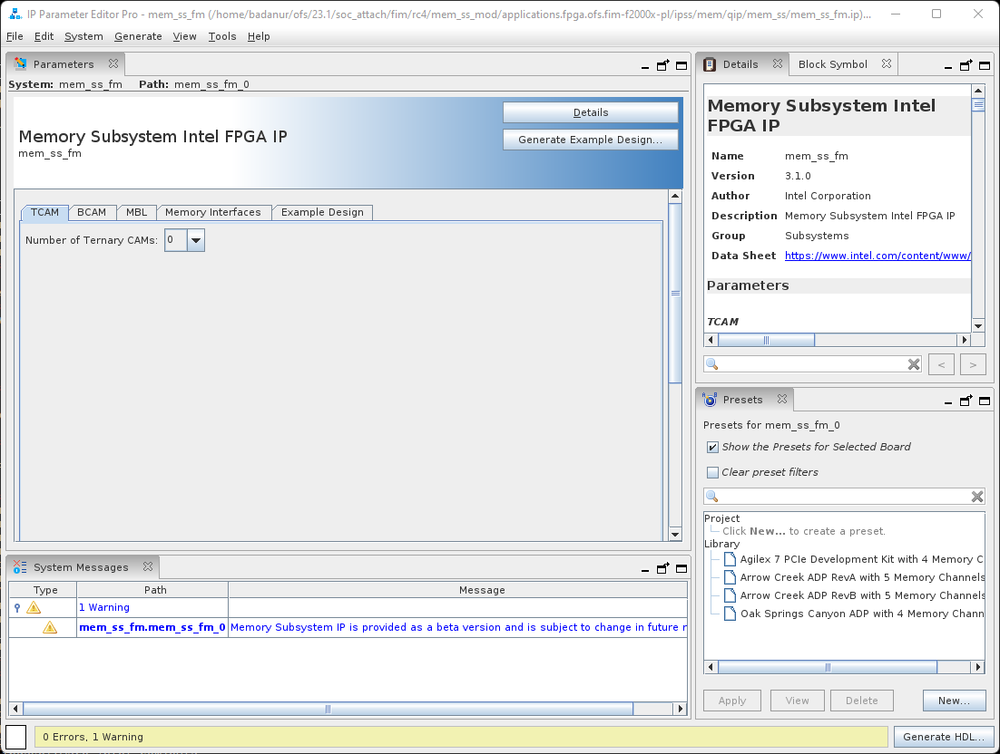
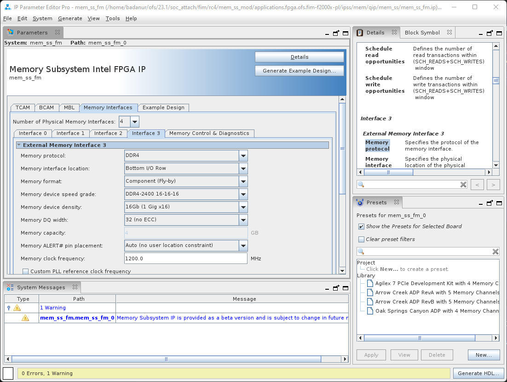
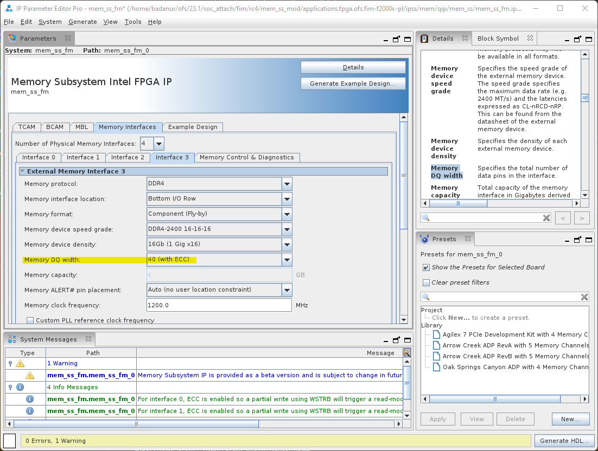
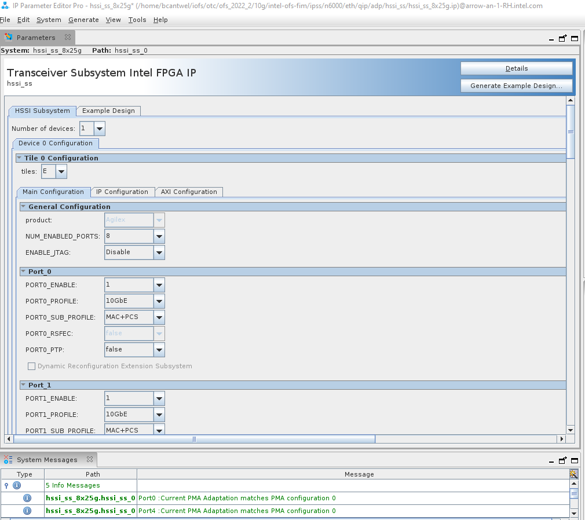
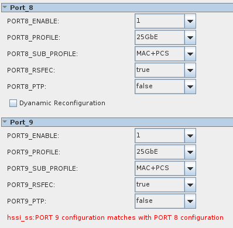

# **Intel<sup>&reg;</sup> FPGA Interface Manager Developer Guide: Intel Agilex SoC Attach: Open FPGA Stack**

Last updated: **August 03, 2023** 

## **1 Introduction**

### **1.1 About This Document**

This document serves as a design guide for FPGA developers, system architects, and hardware developers using Open FPGA Stack (OFS) as a starting point for the creation of an FPGA Interface Manager (FIM) for a custom FPGA acceleration board.   

OFS addresses the demand for FPGA acceleration boards and workloads by providing a powerful methodology for the rapid development of FPGA Acceleration systems.  This methodology addresses the challenges and responsibilities of the board, platform, and workload developers by providing a complete FPGA project consisting of RTL and simulation code, build scripts, and software.  This provided FPGA project can be rapidly customized to meet new market requirements.

OFS separates the FPGA design into two areas: FPGA Interface Manager (FIM) and workload (or Acceleration Function Unit) as shown in the figure below:


As can be seen in this diagram, the OFS FPGA structure has a natural separation into two distinct areas: 

* FPGA Interface Manager (FIM or sometimes called the "the shell") containing:
  * FPGA external interfaces and IP cores (e.g. Ethernet, DDR-4, PCIe, etc)
  * PLLs/resets
  * FPGA - Board management infrastructure
  * Interface to Acceleration Function Unit (AFU)
* Acceleration Function Unit ("the workload")
  * Uses the FIM interfaces to perform useful work inside the FPGA
  * Contains logic supporting partial reconfiguration
  * Remote Signal Tap core for remote debugging of workload
  
This guide is organized as follows: 

* Introduction
* Top Level Block Diagram description
  * Control and data flow
* Description of Sub-systems
  * Command/status registers (CSR) and software interface
  * Clocking, resets, and interfaces
  * High-Speed Serial Interface Sub-System (HSSI-SS) - also known as the Ethernet Sub-System
  * External Memory Interface Sub-System (MEM-SS)
* High-level development flow description
  * Installation of OFS RTL and development packages
  * Compiling FIM
  * Simulation  
* Design customization walkthroughs

This document uses the  Intel® Infrastructure Processing Unit (Intel® IPU) Platform F2000X-PL as the main example platform to illustrate key points and demonstrate how to extend the capabilities provided in OFS.  The demonstration steps serve as a tutorial for the development of your OFS knowledge.  

This document covers OFS architecture lightly. For more details on the OFS architecture, please see [Open FPGA Stack Technical Reference Manual](../../reference_manuals/ofs_fim/mnl_fim_ofs.md).

#### **1.1.1 Glossary**

The following table describes several terms that are used in this document.

| Term                      | Abbreviation | Description                                                  |
| :------------------------------------------------------------:| :------------:| ------------------------------------------------------------ |
|Advanced Error Reporting	|AER	|The PCIe AER driver is the extended PCI Express error reporting capability providing more robust error reporting. [(link)](https://docs.kernel.org/PCI/pcieaer-howto.html?highlight=aer)|
|Accelerator Functional Unit	|AFU	|Hardware Accelerator implemented in FPGA logic which offloads a computational operation for an application from the CPU to improve performance. Note: An AFU region is the part of the design where an AFU may reside. This AFU may or may not be a partial reconfiguration region.|
|Basic Building Block	|BBB|	Features within an AFU or part of an FPGA interface that can be reused across designs. These building blocks do not have stringent interface requirements like the FIM's AFU and host interface requires. All BBBs must have a (globally unique identifier) GUID.|
|Best Known Configuration	|BKC	|The software and hardware configuration Intel uses to verify the solution.|
|Board Management Controller|	BMC	|Supports features such as board power managment, flash management, configuration management, and board telemetry monitoring and protection. The majority of the BMC logic is in a separate component, such as an Intel® Max® 10 or Intel Cyclone® 10 device; a small portion of the BMC known as the PMCI resides in the main Agilex FPGA.
|Configuration and Status Register	|CSR	|The generic name for a register space which is accessed in order to interface with the module it resides in (e.g. AFU, BMC, various sub-systems and modules).|
|Data Parallel C++	|DPC++|	DPC++ is Intel’s implementation of the SYCL standard. It supports additional attributes and language extensions which ensure DCP++ (SYCL) is efficiently implanted on Intel hardware.
|Device Feature List	|DFL	| The DFL, which is implemented in RTL, consists of a self-describing data structure in PCI BAR space that allows the DFL driver to automatically load the drivers required for a given FPGA configuration. This concept is the foundation for the OFS software framework. [(link)](https://docs.kernel.org/fpga/dfl.html)|
|FPGA Interface Manager	|FIM|	Provides platform management, functionality, clocks, resets and standard interfaces to host and AFUs. The FIM resides in the static region of the FPGA and contains the FPGA Management Engine (FME) and I/O ring.|
|FPGA Management Engine	|FME	|Performs reconfiguration and other FPGA management functions. Each FPGA device only has one FME which is accessed through PF0.|
|Host Exerciser Module	|HEM	|Host exercisers are used to exercise and characterize the various host-FPGA interactions, including Memory Mapped Input/Output (MMIO), data transfer from host to FPGA, PR, host to FPGA memory, etc.|
|Input/Output Control|	IOCTL	|System calls used to manipulate underlying device parameters of special files.|
|Intel Virtualization Technology for Directed I/O	|Intel VT-d	|Extension of the VT-x and VT-I processor virtualization technologies which adds new support for I/O device virtualization.|
|Joint Test Action Group	|JTAG	| Refers to the IEEE 1149.1 JTAG standard; Another FPGA configuration methodology.|
|Memory Mapped Input/Output	|MMIO|	The memory space users may map and access both control registers and system memory buffers with accelerators.|
|oneAPI Accelerator Support Package	|oneAPI-asp	|A collection of hardware and software components that enable oneAPI kernel to communicate with oneAPI runtime and OFS shell components. oneAPI ASP hardware components and oneAPI kernel form the AFU region of a oneAPI system in OFS.|
|Open FPGA Stack	|OFS|	OFS is a software and hardware infrastructure providing an efficient approach to develop a custom FPGA-based platform or workload using an Intel, 3rd party, or custom board. |
|Open Programmable Acceleration Engine Software Development Kit|	OPAE SDK|	The OPAE SDK is a software framework for managing and accessing programmable accelerators (FPGAs). It consists of a collection of libraries and tools to facilitate the development of software applications and accelerators. The OPAE SDK resides exclusively in user-space.|
|Platform Interface Manager	|PIM|	An interface manager that comprises two components: a configurable platform specific interface for board developers and a collection of shims that AFU developers can use to handle clock crossing, response sorting, buffering and different protocols.|
|Platform Management Controller Interface|	PMCI|	The portion of the BMC that resides in the Agilex FPGA and allows the FPGA to communicate with the primary BMC component on the board.|
|Partial Reconfiguration	|PR	|The ability to dynamically reconfigure a portion of an FPGA while the remaining FPGA design continues to function. For OFS designs, the PR region is referred to as the pr_slot.|
|Port|	N/A	|When used in the context of the fpgainfo port command it represents the interfaces between the static FPGA fabric and the PR region containing the AFU.|
|Remote System Update|	RSU	|The process by which the host can remotely update images stored in flash through PCIe. This is done with the OPAE software command "fpgasupdate".|
|Secure Device Manager	|SDM|	The SDM is the point of entry to the FPGA for JTAG commands and interfaces, as well as for device configuration data (from flash, SD card, or through PCI Express* hard IP).|
|Static Region|	SR	|The portion of the FPGA design that cannot be dynamically reconfigured during run-time.|
|Single-Root Input-Output Virtualization|	SR-IOV	|Allows the isolation of PCI Express resources for manageability and performance.|
|SYCL	|SYCL|	SYCL (pronounced "sickle") is a royalty-free, cross-platform abstraction layer that enables code for heterogeneous and offload processors to be written using modern ISO C++ (at least C++ 17). It provides several features that make it well-suited for programming heterogeneous systems, allowing the same code to be used for CPUs, GPUs, FPGAs or any other hardware accelerator. SYCL was developed by the Khronos Group, a non-profit organization that develops open standards (including OpenCL) for graphics, compute, vision, and multimedia. SYCL is being used by a growing number of developers in a variety of industries, including automotive, aerospace, and consumer electronics.|
|Test Bench	|TB	|Testbench or Verification Environment is used to check the functional correctness of the Design Under Test (DUT) by generating and driving a predefined input sequence to a design, capturing the design output and comparing with-respect-to expected output.|
|Universal Verification Methodology	|UVM	|A modular, reusable, and scalable testbench structure via an API framework.  In the context of OFS, the UVM enviroment provides a system level simulation environment for your design.|
|Virtual Function Input/Output	|VFIO	|An Input-Output Memory Management Unit (IOMMU)/device agnostic framework for exposing direct device access to userspace. (link)|


### **1.2 Release Capabilities**

Agilex SoC Attach OFS supports the following features.

|                                     | FIM BASE                                    |
| ----------------------------------- | ------------------------------------------- |
| Intel IPU Platform F2000X-PL                 | f2000x                     |
| PCIe Configuration                  | Host: PCIe Gen4x16<br />SoC: PCIe Gen4x16   |
| SR-IOV support                      | Host: 2 PFs, No VFs<br />SoC:  1 PFs, 3 VFs |
| AXI ST datapath                     | 512b @ 470MHz                               |
| Transceiver Subsystem Configuration | 2x4x25G                                     |


The FIM also integrates:

* SoC AFU and Host AFU
* Exercisers demonstrating PCIe, external memory, and Ethernet interfaces
* FME CSR
* Remote Signal Tap
* Partial Reconfiguration

The Host exercisers are provided for the quick evaluation of the FIM and can be leveraged for the verification of the platform's functionality and capabilities.  The host exercisers can be removed by the designer to release FPGA real estate to accommodate new workload functions. To compile the FIM without host exercisers go to [How to compile the FIM in preparation for designing your AFU](/hw/f2000x/dev_guides/fim_dev/ug_dev_fim_ofs/#53-how-to-compile-the-fim-in-preparation-for-designing-your-afu).

OFS is extensible to meet the needs of a broad set of customer applications.  The general use cases listed below are examples where the OFS base design is easily extended to build a custom FIM:

1. Use OFS design example as-is
  * Porting the code to another platform that is identical to OFS reference platform changing targeted FPGA device and pinout
  * Change I/O assignments without changing design
2. Update the configuration of peripheral IP in OFS design example, not affecting FIM architecture
  * External memory settings
  * Ethernet Subsystem analog settings
3. Remove/update peripheral feature in OFS design example, not affecting FIM architecture
  * External memory speed/width change
  * Change number of VFs supported
4. Add new features as an extension to OFS design example, not affecting the FIM architecture
  * Add/remove external memory interface to the design
  * Add/remove user clocks for the AFU
  * Add/remove IP to the design with connection to the AFU

### **1.3 Knowledge Prerequisites**

OFS is an advanced application of FPGA technology. This guide assumes you have the following FPGA logic design-related knowledge and skills:

* FPGA compilation flows using Intel<sup>&reg;</sup> Quartus<sup>&reg;</sup> Prime Pro Edition Version 23.1.
* Static Timing closure, including familiarity with the Timing Analyzer tool in Intel<sup>&reg;</sup> Quartus<sup>&reg;</sup> Prime Pro Edition Version 23.1, applying timing constraints, Synopsys* Design Constraints (.sdc) language and Tcl scripting, and design methods to close on timing critical paths.
* RTL (System Verilog) and coding practices to create synthesized logic.
* RTL simulation tools.
* Intel<sup>&reg;</sup> Quartus<sup>&reg;</sup> Prime Pro Edition Signal Tap Logic Analyzer tool software.

## **2 Top Level Description**

The FIM targets operation in the  Intel® Infrastructure Processing Unit (Intel® IPU) Platform F2000X-PL the block diagram is shown below.  


* Host interface 
  * PCIe Gen4 x 16
* SoC Interface
  * PCIe Gen4 x 16
* Network interface
  * 2 - QSFP28/56 cages
  * Eight Arm® AMBA® 4 AXI4-Stream channels of 25G Ethernet interfacing to an E-tile Ethernet Subsystem.
* External Memory - DDR4
  * Four Fabric DDR4 banks, 1200 MHz, 4GB, x32 no ECC (optionally can be configured x40 with ECC or x8 no ECC)
* Board Management
  * SPI interface
  * FPGA configuration

### **2.1 Top Level FPGA**

The internal FPGA architecture is shown below:


The following Platform Designer IP subsystems are used to implement the following:

* P-tile PCIe Subsystem
* E-Tile Ethernet Subsystem
* Memory Subsystem

Documentation on the above Platform Designer IP subsystems is available by request to your Intel support team.

### **2.2 FIM FPGA Resource Usage**

The provided design includes both required board management and control functions as well as optional interface exerciser logic that both creates transactions and validates operations.  These exerciser modules include:

* HE_MEM - this module creates external memory transactions to the DDR4 memory and then verifies the responses.
* HE_MEM-TG -The memory traffic generator (TG) AFU provides a way for users to characterize local memory channel bandwidth with a variety of traffic configuration features including request burst size, read/write interleave count, address offset, address strobe, and data pattern.
* HE_HSSI - this module creates ethernet transactions to the HSSI Subsystem and then verifies the responses.

The FIM uses a small portion of the available FPGA resources.  The table below shows resource usage for a base FIM built with 2 channels of external memory, a small AFU instantiated that has host CSR read/write, external memory test and Ethernet test functionality.

>**Note:** The host exerciser modules allow you to evaluate the FIM in hardware and are removed when you begin development. 

The AGFC023R25A2E2VR0  FPGA has the following resources available for base FIM design :

| Resource                 | needed / total on device (%) |
| ------------------------ | ---------------------------- |
| Logic utilization (ALMs) | 229,622 / 782,400 ( 29 % )   |
| M20K blocks              | 1,241 / 10,464 (12 %)        |
| Pins                     | 518 / 742 ( 70 % )           |
| IOPLLs                   | 10 / 15 ( 67 % )             |

The resource usage for the FIM base:

| Entity Name         | ALMs needed | ALM Utilization % | M20Ks | M20K Utilization % |
| ------------------- | ----------- | ----------------- | ----- | ------------------ |
| top                 | 229,646.10  | 29.35             | 1241  | 11.86              |
| soc_afu             | 87,364.80   | 11.17             | 273   | 2.61               |
| soc_pcie_wrapper    | 37,160.80   | 4.75              | 195   | 1.86               |
| pcie_wrapper        | 36,233.40   | 4.63              | 187   | 1.79               |
| host_afu            | 26,462.20   | 3.38              | 140   | 1.34               |
| hssi_wrapper        | 20,066.30   | 2.56              | 173   | 1.65               |
| pmci_wrapper        | 8,449.90    | 1.08              | 186   | 1.78               |
| mem_ss_top          | 7,907.10    | 1.01              | 60    | 0.57               |
| auto_fab_0          | 2,708.90    | 0.35              | 13    | 0.12               |
| soc_bpf             | 1,210.20    | 0.15              | 0     | 0.00               |
| qsfp_1              | 635.50      | 0.08              | 4     | 0.04               |
| qsfp_0              | 628.70      | 0.08              | 4     | 0.04               |
| fme_top             | 628.60      | 0.08              | 6     | 0.06               |
| host_soc_rst_bridge | 151.40      | 0.02              | 0     | 0.00               |
| rst_ctrl            | 16.80       | 0.00              | 0     | 0.00               |
| soc_rst_ctrl        | 16.50       | 0.00              | 0     | 0.00               |
| sys_pll             | 0.50        | 0.00              | 0     | 0.00               |

The following example without the he_lb,he_hssi,he_mem,he_mem_tg:

| Entity Name         | ALMs needed | ALM Utilization % | M20Ks | M20K Utilization % |
| ------------------- | ----------- | ----------------- | ----- | ------------------ |
| top                 | 162,010.20  | 20.71             | 992   | 9.48               |
| pcie_wrapper        | 36,771.70   | 4.70              | 195   | 1.86               |
| soc_afu_top         | 34,851.30   | 4.45              | 85    | 0.81               |
| pcie_wrapper        | 33,358.90   | 4.26              | 175   | 1.67               |
| hssi_wrapper        | 20,109.90   | 2.57              | 173   | 1.65               |
| afu_top             | 14,084.20   | 1.80              | 91    | 0.87               |
| pmci_wrapper        | 8,447.90    | 1.08              | 186   | 1.78               |
| mem_ss_top          | 8,379.70    | 1.07              | 60    | 0.57               |
| alt_sld_fab_0       | 2,725.10    | 0.35              | 13    | 0.12               |
| bpf_top             | 1,213.00    | 0.16              | 0     | 0.00               |
| fme_top             | 638.30      | 0.08              | 6     | 0.06               |
| qsfp_top            | 626.70      | 0.08              | 4     | 0.04               |
| qsfp_top            | 619.20      | 0.08              | 4     | 0.04               |
| axi_lite_rst_bridge | 147.40      | 0.02              | 0     | 0.00               |
| rst_ctrl            | 17.40       | 0.00              | 0     | 0.00               |
| rst_ctrl            | 15.90       | 0.00              | 0     | 0.00               |
| sys_pll             | 0.50        | 0.00              | 0     | 0.00               |

The following example without the Ethernet Subsystem (no_hssi):

| Entity Name         | ALMs needed | ALM Utilization % | M20Ks | M20K Utilization % |
| ------------------- | ----------- | ----------------- | ----- | ------------------ |
| top                 | 189,827.00  | 24.26             | 980   | 9.37               |
| soc_afu_top         | 67,751.40   | 8.66              | 197   | 1.88               |
| pcie_wrapper        | 36,909.30   | 4.72              | 195   | 1.86               |
| pcie_wrapper        | 36,077.70   | 4.61              | 187   | 1.79               |
| afu_top             | 26,549.40   | 3.39              | 140   | 1.34               |
| pmci_wrapper        | 8,688.10    | 1.11              | 186   | 1.78               |
| mem_ss_top          | 8,079.00    | 1.03              | 60    | 0.57               |
| alt_sld_fab_0       | 1,751.90    | 0.22              | 9     | 0.09               |
| bpf_top             | 1,186.00    | 0.15              | 0     | 0.00               |
| dummy_csr           | 664.70      | 0.08              | 0     | 0.00               |
| dummy_csr           | 662.80      | 0.08              | 0     | 0.00               |
| dummy_csr           | 661.20      | 0.08              | 0     | 0.00               |
| fme_top             | 649.40      | 0.08              | 6     | 0.06               |
| axi_lite_rst_bridge | 161.70      | 0.02              | 0     | 0.00               |
| rst_ctrl            | 16.30       | 0.00              | 0     | 0.00               |
| rst_ctrl            | 16.00       | 0.00              | 0     | 0.00               |
| sys_pll             | 0.50        | 0.00              | 0     | 0.00               |

The following example without the Ethernet Subsystem (no_hssi) + no host exercisers (he_lb, he_hssi, he_mem, he_mem_tg):

| Entity Name         | ALMs needed | ALM Utilization % | M20Ks | M20K Utilization % |
| ------------------- | ----------- | ----------------- | ----- | ------------------ |
| top                 | 139,105.70  | 17.78             | 807   | 7.71               |
| pcie_wrapper        | 36,518.80   | 4.67              | 195   | 1.86               |
| pcie_wrapper        | 33,234.50   | 4.25              | 175   | 1.67               |
| soc_afu_top         | 32,700.00   | 4.18              | 85    | 0.81               |
| afu_top             | 14,178.20   | 1.81              | 91    | 0.87               |
| pmci_wrapper        | 8,693.20    | 1.11              | 186   | 1.78               |
| mem_ss_top          | 7,999.00    | 1.02              | 60    | 0.57               |
| alt_sld_fab_0       | 1,758.40    | 0.22              | 9     | 0.09               |
| bpf_top             | 1,183.50    | 0.15              | 0     | 0.00               |
| dummy_csr           | 667.20      | 0.09              | 0     | 0.00               |
| dummy_csr           | 666.30      | 0.09              | 0     | 0.00               |
| dummy_csr           | 663.10      | 0.08              | 0     | 0.00               |
| fme_top             | 652.80      | 0.08              | 6     | 0.06               |
| axi_lite_rst_bridge | 153.80      | 0.02              | 0     | 0.00               |
| rst_ctrl            | 18.20       | 0.00              | 0     | 0.00               |
| rst_ctrl            | 16.50       | 0.00              | 0     | 0.00               |
| sys_pll             | 0.50        | 0.00              | 0     | 0.00               |

## **3 Description of Sub-Systems**

### **3.1 Host Control and Data Flow**

The host control and data flow is shown in the diagram below:


The control and data paths are composed of the following:

* Host Interface Adapter (PCIe)
* SoC Interface Adapter (PCIe)
* Low Performance Peripherals
  * Slow speed peripherals (JTAG, I2C, Smbus, etc)
  * Management peripherals (FME)
* High Performance Peripherals
  * Memory peripherals
  * Acceleration Function peripherals (eg. AFUs)
  * HPS Peripheral
* Fabrics
  * Peripheral Fabric (multi drop)
  * AFU Streaming fabric (point to point)

Peripherals are connected to one another using AXI, either:

* Via the peripheral fabric (AXI4-Lite, multi drop)
* Via the AFU streaming fabric (AXI-S, point to point)

Peripherals are presented to software as:

* OFS managed peripherals that implement DFH CSR structure.  
* Native driver managed peripherals (i.e. Exposed via an independent PF, VF)

The peripherals connected to the peripheral fabric are primarily Intel OPAE managed resources, whereas the peripherals connected to the AFU are “primarily” managed by native OS drivers. The word “primarily” is used since the AFU is not mandated to expose all its peripherals to Intel OPAE. 

OFS uses a defined set of CSRs to expose the functionality of the FPGA to the host software.  These registers are described in [Open FPGA Stack Reference Manual - MMIO Regions section](../../reference_manuals/ofs_fim/mnl_fim_ofs.md#6-mmio-regions).

If you make changes to the FIM that affect the software operation, then OFS provides a mechanism to communicate that information to the proper software driver that works with your new hardware.  The [Device Feature Header (DFH) structure](../../reference_manuals/ofs_fim/mnl_fim_ofs.md#611-device-feature-header-dfh-structure) is followed to provide compatibility with OPAE software.  Please see [FPGA Device Feature List (DFL) Framework Overview](https://github.com/OPAE/linux-dfl/blob/fpga-ofs-dev/Documentation/fpga/dfl.rst#fpga-device-feature-list-dfl-framework-overview) for a description of DFL operation from the driver perspective.

In the default design, the SoC and Host AFUs are isolated from each other. You must develop mechanisms for Host - SoC communication if desired.

>**Note:** The default configuration of the Board Peripheral Fabric, there is a connection from the Host Interface to the PMCI-SS, however the PMCI-SS is not in the Host DFL, and is not discovered by Host SW by default. If you want to guarantee that the Host can not access the PMCI-SS, and by extension the Board BMC, you must implement a filtering mechanism, for example, in the Host ST2MM module to prevent access to the PMCI-SS address space.

Refer to the following documents for more information on sub-systems:

* [Intel FPGA PCI Express Subsystem IP User Guide](https://github.com/OFS/ofs.github.io/blob/main/docs/hw/common/user_guides/ug_qs_pcie_ss.pdf)
* [Intel FPGA Memory Subsystem IP User Guide](https://github.com/OFS/ofs.github.io/docs/hw/common/user_guides/ug_qs_mem_ss.pdf)
* [Intel FPGA Ethernet Subsystem IP User Guide](https://www.intel.com/content/www/us/en/docs/programmable/773413/23-1-22-5-0/introduction.html)

## **4 High Level Development Flow**

OFS provides a framework of FPGA synthesizable code, simulation environment, and synthesis/simulation scripts.  FIM designers can use the provided code as-is, modify the provided code, or add new code to meet your specific product requirements. The instructions provided after this point are for you to either evaluate the existing design (the current section) or to modify and generate your own design (described in the [Custom FIM Development Flow](/hw/f2000x/dev_guides/fim_dev/ug_dev_fim_ofs/#5-custom-fim-development-flow) section). 

### **4.1 Development Pre-requisites**

The following pre-requisites must be satisfied to go through the development flow.

#### **4.1.1 Tutorial Pre-requisites**

To run the FPGA compilation steps covered in this guide, requires the following:

1. Workstation or server with a Intel<sup>&reg;</sup> Quartus<sup>&reg;</sup> Prime Pro Edition Version 23.1 installed on a Intel Quartus Prime Pro-supported Linux distribution.  See [Operating System Support](https://www.intel.com/content/www/us/en/support/programmable/support-resources/design-software/os-support.html).  The Linux distribution known to work with this version of Ubuntu 22.04 . Note, Windows is not supported.
2. Compilation targeting Agilex devices requires a minimum of 64 GB of RAM.
3. Simulation of lower level functionality (not chip level) is supported by Synopsys<sup>&reg;</sup> VCS and Mentor Graphics<sup>&reg;</sup> QuestaSim SystemVerilog simulators.
4. Simulation of chip level requires Synopsys VCS and VIP
   
#### **4.1.2 Development Environment**

To run the tutorial steps in this guide requires this development environment:

| Item                          | Version         |
| ------------------------- | ---------- |
| Intel Quartus Prime Pro | 23.1 |
| OPAE SDK   | **Branch Tag:** release/2.5.0 |
| Simulator  | Synopsys VCS P-2019.06-SP2-5 or newer for UVM simulation of top level FIM |
| Python            | 3.7.7 |
| GCC               | 7.2.0 |
| cmake             | 3.11.4 |
| git with git-lfs  | 1.8.3.1 |
| PERL | 5.8.8 |

>**Note:** Steps to install Intel Quartus Prime Pro are provided in the [Installation of OFS](/hw/f2000x/dev_guides/fim_dev/ug_dev_fim_ofs/#42-installation-of-ofs) section.

To install the ```Git Large File Storage (LFS)``` extension run the following commands:

```bash
curl -s https://packagecloud.io/install/repositories/github/git-lfs/script.rpm.sh | sudo bash
sudo dnf install git-lfs
git lfs install
```

To test FPGA image files on hardware, this version of OFS only targets  Intel IPU Platform F2000X-PL. You may modify the build scripts and pin files to target different boards with Agilex FPGA devices.
### **4.2 Installation of OFS**

In this section you set up a development machine for compiling the OFS FIM. These steps are separate from the setup for a deployment machine where the FPGA acceleration card is installed.  Typically, FPGA development and deployment work is performed on separate machines, however, both development and deployment can be performed on the same server if desired.  Please see the [Getting Started Guide: Intel® Open FPGA Stack for Intel FPGA](/hw/f2000x/user_guides/ug_qs_ofs_f2000x/ug_qs_ofs_f2000x/) for instructions on installing software for deployment of your FPGA FIM, AFU and software application on a server.  

Building the OFS FIM requires the build machine to have at least 64 GB of RAM.  

The following is a summary of the steps to set up for FIM development:

1. Install Intel<sup>&reg;</sup> Quartus<sup>&reg;</sup> Prime Pro Edition Version 23.1 Linux with Agilex device support
2. Make sure support tools are installed and meet version requirements
3. Clone the  repository
4. Install required Intel Quartus Prime Pro patches which are included in the cloned `ofs-f2000x` repository
5. Review the files provided in the repo
6. Test installation by building the FIM

**Intel<sup>&reg;</sup> Quartus<sup>&reg;</sup> Prime Pro Edition Version 23.1** is the currently verified version of Intel Quartus Prime Pro used for building the FIM and AFU images.  Porting to newer versions of Intel Quartus Prime Pro may be performed by developers, however, you will need to verify operation.

The recommended Best Known Configuration (BKC) for development of the OFS FIM is Ubuntu 22.04, which is the assumed operating system for this developer guide. 

1. Prior to installing Intel Quartus Prime Pro, perform the following steps to satisfy the required dependencies.

    ```bash
    sudo dnf install -y gcc gcc-c++ make cmake libuuid-devel rpm-build autoconf automake bison boost boost-devel libxml2 libxml2-devel make ncurses grub2 bc csh flex glibc-locale-source libnsl ncurses-compat-libs 
    ```

2. Apply the following configurations.

    ```bash
    sudo localedef -f UTF-8 -i en_US en_US.UTF-8 
    sudo ln -s /usr/lib64/libncurses.so.6 /usr/lib64/libncurses.so.5 
    sudo ln -s /usr/bin/python3 /usr/bin/python
    ```

3. Download [Intel® Quartus® Prime Pro Edition Linux](https://www.intel.com/content/www/us/en/software-kit/746666/intel-quartus-prime-pro-edition-design-software-version-23-1-for-linux.html).

4. After running the Quartus Prime Pro installer, set the PATH environment variable to make utilities `quartus`, `jtagconfig`, and `quartus_pgm` discoverable. Edit your bashrc file `~/.bashrc` to add the following line:

    ```bash
    export PATH=<Quartus install directory>/quartus/bin:$PATH
    export PATH=<Quartus install directory>/qsys/bin:$PATH
    ```

    For example, if the Intel Quartus Prime Pro install directory is /home/intelFPGA_pro/23.1 then the new line is:

    ```bash
    export PATH=/home/intelFPGA_pro/23.1/quartus/bin:$PATH
    export PATH=/home/intelFPGA_pro/23.1/qsys/bin:$PATH
    ```

5. Verify, Intel Quartus Prime Pro is discoverable by opening a new shell:

    ```bash
    which quartus
    ```

    Example output:
    ```bash
    /home/intelFPGA_pro/23.1/quartus/bin/quartus
    ```


#### **4.2.1 Clone the OFS Git Repo**

Retrieve the OFS FIM source code from the [OFS f2000x FIM Github Branch](https://github.com/OFS/ofs-f2000x-pl) repository. Create a new directory to use as a clean starting point to store the retrieved files.  The following is a short description of each repository, followed by the git commands for cloning.  The instructions section uses the HTTPS git method for cloning repositories.

1. Navigate to the location you want to clone the OFS source files, and create the top-level source directory.

    ```bash
    mkdir IOFS_BUILD_ROOT
    ```

2. Clone OFS repositories.

    ```bash
    cd IOFS_BUILD_ROOT
    git clone --recurse-submodules https://github.com/OFS/ofs-f2000x-pl
    ```

3. Checkout the proper tag

    ```bash
    cd ofs-f2000x-pl
    git checkout --recurse-submodules tags/ofs-2023.1-1
    ```

4. Ensure that `ofs-common` has been cloned as well

    ```bash
    git submodule status
    ```

    Example output:

    ```bash
    ea585a4f48d50faf3ae7ecfbec82525a8d22c730 ofs-common (ofs-2023.1-1)
    ```

### **4.3 Directory Structure of OFS**

List the directory contents of the cloned repo to verify that the following directories and files are present in `$IOFS_BUILD_ROOT/ofs-f2000x` directory.  

```bash
ls -1
```
Expected output:
```bash
external
ipss
LICENSE.txt
ofs-common
sim
src
syn
tools
verification
```

Use the following command to show how the directories are arranged:

```bash
find . -mindepth 1 -maxdepth 2 -type d -not -path '*/\.*' -print | sed -e 's/[^-][^\/]*\//--/g' -e 's/--/|  /g' -e 's/|-/|   /g'
```
Expected output:

```bash
|  eval_scripts
|  | 
|  ipss
|  |  hssi
|  |  mem
|  |  pcie
|  |  pmci
|  |  qsfp
|  ofs-common
|  |  scripts
|  |  src
|  |  tools
|  |  verification
|  sim
|  |  bfm
|  |  common
|  |  scripts
|  |  unit_test
|  src
|  |  afu_top
|  |  includes
|  |  pd_qsys
|  |  top
|  syn
|  |  scripts
|  |  setup
|  |  syn_top
|  tools
|  |  pfvf_config_tool
|  verification
|  |  scripts
|  |  testbench
|  |  tests
|  |  unit_tb
|  |  verifplan
```


### **4.4 Compiling the OFS FIM**

OFS provides a build script with the following FPGA image creation options:

* Flat compile which combines the FIM and AFU into one FPGA image that is loaded into the entire FPGA device
* A PR compile which creates a FPGA image consisting of the FIM that is loaded into the static region of the FPGA and a default AFU that is loaded into dynamic region. The AFU image may be loaded into the dynamic region using partial reconfiguration.  

The build scripts included with OFS are verified to run in a bash shell. Other shells have not been tested. The full build script typically takes around 3 hours to complete.

The build script flow is the primary flow described in this user guide. For instructions on compiling using the Intel Quartus Prime Pro GUI, refer to the [Compiling the OFS FIM Using Quartus GUI](/hw/f2000x/dev_guides/fim_dev/ug_dev_fim_ofs/#444-compiling-the-ofs-fim-using-quartus-gui) section.

The following sections describe how to set up the environment and build the provided FIM and AFU. Follow these steps as a tutorial to learn the build flow.  You will use this environment and build scripts for the creation of your specialized FIM.

#### **4.4.1. Setting Up Required Environment Variables**

Set required environment variables as shown below.  These environment variables must be set prior to simulation or compilation tasks so creating a simple script to set these variables saves time. 

Set the following environment variables based on your environment:
```bash

export QUARTUS_MAINPATH=/<YOUR_QUARTUS_DIRECTORY>/23.1 
export TOOLS_LOCATION=<YOUR_TOOLS_DIRECTORY> 
export LM_LICENSE_FILE=<YOUR_LM_LICENSE_PATH>
export DW_LICENSE_FILE=<YOUR_DW_LICENSE_PATH>
export SNPSLMD_LICENSE_FILE=<YOUR_SNPSLMD_LICENSE_PATH>
```

>**Note:** The TOOLS_LOCATION directory is where the Synopsis tools reside. Refer to the `UVM_HOME` variable below for an example.

Then set the remaining environment variables:
```bash
export QUARTUS_ROOTDIR=$QUARTUS_MAINPATH/quartus 
export QUARTUS_HOME=$QUARTUS_ROOTDIR 
export QUARTUS_INSTALL_DIR=$QUARTUS_ROOTDIR 
export QUARTUS_ROOTDIR_OVERRIDE=$QUARTUS_ROOTDIR 
export IMPORT_IP_ROOTDIR=$QUARTUS_ROOTDIR/../ip 
export IP_ROOTDIR=$QUARTUS_ROOTDIR/../ip 
export INTELFPGAOCLSDKROOT=$QUARTUS_MAINPATH/hld 
export QSYS_ROOTDIR=$QUARTUS_ROOTDIR/../qsys/bin 
export IOFS_BUILD_ROOT=$PWD
export OFS_ROOTDIR=$IOFS_BUILD_ROOT/ofs-f2000x
export WORKDIR=$OFS_ROOTDIR 
export VERDIR=$OFS_ROOTDIR/verification/ofs-f2000x/common:$OFS_ROOTDIR/verification 
export OFS_PLATFORM_AFU_BBB=$IOFS_BUILD_ROOT/ofs-platform-afu-bbb 
export OPAE_SDK_REPO_BRANCH=release/$OPAE_SDK_VERSION
export OPAE_PLATFORM_ROOT=$OFS_ROOTDIR/work_dir/build_tree    
export LIBRARY_PATH=$IOFS_BUILD_ROOT/opae-sdk/install-opae-sdk/lib 
export LD_LIBRARY_PATH=$IOFS_BUILD_ROOT/opae-sdk/install-opae-sdk/lib64 
export OPAE_LOC=/install-opae-sdk 
export PYTHONPATH=/root/.local/lib/python3.7.7/site-packages/ 
export QUARTUS_NUM_PARALLEL_PROCESSORS=8 
export DESIGNWARE_HOME=$TOOLS_LOCATION/synopsys/vip_common/vip_Q-2020.03A
export UVM_HOME=$TOOLS_LOCATION/synopsys/vcsmx/S-2021.09-SP1/linux64/rhel/etc/uvm 
export VCS_HOME=$TOOLS_LOCATION/synopsys/vcsmx/S-2021.09-SP1/linux64/rhel 
export MTI_HOME=$TOOLS_LOCATION/intelFPGA_pro/questa_fse 
export PATH=$PATH:$QUARTUS_HOME/bin:$QUARTUS_HOME/qsys/bin:$QUARTUS_HOME/sopc_builder/bin/:$IOFS_BUILD_ROOT/opae-sdk/install-opae-sdk/bin:$MTI_HOME/linux_x86_64/:$MTI_HOME/bin/:$DESIGNWARE_HOME/bin:$VCS_HOME/bin

```

### **4.4.2 Compiling the FIM**

The f2000x  FIM build flow uses the bash script `$OFS_ROOTDIR/ofs-common/scripts/common/syn/build_top.sh`.  There are several setup files that must be put in place before compilation, which is handled by the build script. If you wish to compile the f2000x FIM using the Intel Quartus Prime Pro GUI, you must at least run the setup portion of the `build_top.sh` script before compiling with the GUI. For instructions on compiling the FIM using the Quartus GUI, refer to the [Compiling the OFS FIM Using Quartus GUI](/hw/f2000x/dev_guides/fim_dev/ug_dev_fim_ofs/#444-compiling-the-ofs-fim-using-quartus-gui) section.

The usage of the compile build script is shown below:
```bash
ofs-common/scripts/common/syn/build_top.sh/build_top.sh [-p] f2000x[:OPTIONS]  work_dir 
```
>**Note:** Refer to the $OFS_ROOTDIR/ofs-common/scripts/common/syn/README for detailed information on using this script

* To build the provided design using a flat, non-PR build flow use the following commands:

    ```bash
    cd $OFS_ROOTDIR
    ./ofs-common/scripts/common/syn/build_top.sh f2000x:flat  work_dir
    ```

* To build the provided design with in-tree PR enabled use the following commands:

    ```bash
    cd $OFS_ROOTDIR
    ./ofs-common/scripts/common/syn/build_top.sh f2000x work_dir
    ```

* To build the provided design with a relocatable (out-of-tree) PR directory use the following commands:

    ```bash
    cd $OFS_ROOTDIR
    ./ofs-common/scripts/common/syn/build_top.sh -p f2000x work_dir
    ```
    
    Refer to the [Create a Relocatable PR Directory Tree](/hw/f2000x/dev_guides/fim_dev/ug_dev_fim_ofs/#443-create-a-relocatable-pr-directory-tree-from-the-base_x16-fim) section for more information on out-of-tree PR builds.

The build takes ~3 hours to complete. A successful build will report the following:

```tcl
Compile work directory:     <$IOFS_BUILD_ROOT>/ofs-f2000x/work_f2000x /syn/syn_top
Compile artifact directory: <$IOFS_BUILD_ROOT>/ofs-f2000x/work_f2000x /syn/syn_top/output_files

***********************************
***
***        OFS_PROJECT: f2000x 
***        OFS_FIM: base
***        OFS_BOARD: adp
***        Q_PROJECT:  ofs_top
***        Q_REVISION: ofs_top
***        SEED: 0
***        Build Complete
***        Timing Passed!
***
***********************************
```


The build script copies the ```ipss```, ```ofs-common```, ```sim```, ```src```,```syn``` and ```tools``` directories to the specified work directory and then these copied files are used in the Intel Quartus Prime Pro compilation process.

Some key output directories are described in the following table:

| Directory | Description |
| --- | --- |
| `$OFS_ROOTDIR/<WORK_DIR>/syn/syn_top` | Intel Quartus Prime Pro project (ofs_top.qpf) and other Intel Quartus Prime Pro specific files|
| `$OFS_ROOTDIR/<WORK_DIR>/syn/syn_top/output_files` | Directory with build reports and FPGA programming files |

The build script will run PACSign (if installed) and create an unsigned FPGA programming files for both user1 and user2 locations of the f2000x  FPGA flash.  Please note, if the f2000x  has the root entry hash key loaded, then PACsign must be run to add the proper key to the FPGA binary file.

The following table provides a detailed description of the generated *.bin files.

| File            | Description                        |
|-----------------|------------------------------------|
| ofs_top.bin | This is an intermediate, raw binary file. This intermediate raw binary file is produced by taking the Intel Quartus Prime Pro generated \*.sof file, and converting it to \*.pof using quartus_pfg, then converting the \*.pof to \*.hexout using quartus_cpf, and finally converting the \*.hexout to \*.bin using objcopy. <br /><br />`ofs_top.bin` - Raw binary image of the FPGA. |
| ofs_top_page0_unsigned_factory.bin | This is the unsigned PACSign output generated for the Factory Image. **Unsigned** means that the image has been signed with an empty header. |
| ofs_top_page1_user1.bin | This is an input file to PACSign to generate `ofs_top_page1_unsigned_user1.bin`. This file is created by taking the ofs_top.bin file and assigning the User1 or appending factory block information. **Unsigned** means that the image has been signed with an empty header. |
| ofs_top_page1_unsigned_user1.bin | This is the unsigned FPGA binary image generated by the PACSign utility for the User1 Image. This file is used to load the FPGA flash User1 Image using the fpgasupdate tool. **Unsigned** means that the image has been signed with an empty header. |
| ofs_top_page2_user2.bin |  This is an input file to PACSign to generate `ofs_top_page2_unsigned_user2.bin`. This file is created by taking the `ofs_top.bin` file and assigning the User2 or appending factory block information. |
| ofs_top_page2_unsigned_user2.bin | This is the unsigned FPGA binary image generated by the PACSign utility for the User2 Image. This file is used to load the FPGA flash User2 Image using the fpgasupdate tool. **Unsigned** means that the image has been signed with an empty header. |
| ofs_top.sof | This image is used to generate `ofs_top.bin`, and can also be used to program the Agilex device directly through JTAG |

>**Note:** The `build/output_files/timing_report` directory contains clocks report, failing paths and passing margin reports. 

#### **4.4.3 Create a Relocatable PR Directory Tree from the base_x16 FIM**

If you are developing a FIM to be used by another team developing AFU workload(s), scripts are provided that create a relocatable PR directory tree. ODM and board developers will make use of this capability to enable a broad set of AFUs to be loaded on a board using PR.


You can create this relocatable PR directory tree by either:

* Build FIM and AFU using ofs-common/scripts/common/syn/build_top.sh followed by running /ofs-common/scripts/common/syn/generate_pr_release.sh
* Build FIM and AFU using ofs-common/scripts/common/syn/build_top.sh with optional -p switch included

The generate_pr_release.sh has the following command structure:

```bash
ofs-common/scripts/common/syn/generate_pr_release.sh -t <work_directory>/build_tree <target_board> <work_directory>
```
Where:

* `<work_directory>/build_tree` is the location for your relocatable PR directory tree in the work directory
* `<target_board>` is the name of the board target/FIM e.g. f2000x 
* `<work_directory>` is the work directory

Here is an example of running the generate_pr_release.sh script:

```bash
cd $OFS_ROOTDIR
ofs-common/scripts/common/syn/generate_pr_release.sh -t work_f2000x/build_tree f2000x   work_f2000x 
```

The resulting relocatable build tree has the following structure:

```bash
.
├── bin
│   ├── afu_synth
│   ├── build_env_config
│   ├── run.sh -> afu_synth
│   └── update_pim
├── hw
│   ├── blue_bits
│   │   ├── ofs_top_page0_unsigned_factory.bin
│   │   ├── ofs_top_page1_unsigned_user1.bin
│   │   ├── ofs_top_page2_unsigned_user2.bin
│   │   └── ofs_top.sof -> ../lib/build/syn/syn_top/output_files/ofs_top.sof
│   └── lib
│       ├── build
│       ├── fme-ifc-id.txt
│       ├── fme-platform-class.txt
│       └── platform
└── README

```
This build tree can be moved to a different location and used for AFU development of PR-able AFU to be used with this board.

#### **4.4.4 Compiling the OFS FIM Using Quartus GUI**

Perform the following steps to compile the OFS FIM using the Quartus GUI:

1. Set the environment variables as described in the [Setting Up Required Environment Variables](/hw/f2000x/dev_guides/fim_dev/ug_dev_fim_ofs/#441-setting-up-required-environment-variables) section.

2. Run the setup portion of the build script. This takes a few seconds to complete.

    ```bash
    ./ofs-common/scripts/common/syn/build_top.sh --stage setup f2000x work_dir
    ```

3. Open the OFS FIM project using the Intel Quartus Prime Pro GUI. The project is located at `$OFS_ROOTDIR/work_dir/syn/syn_top/ofs_top.qpf`.

4. Ensure the checkbox next to **Assembler (Generate programming files)** is marked.

5. Click the arrow next to **Compile Design** in the **Compilation Flow** window to start full compilation.

6. After compilation is complete, check the `$OFS_ROOTDIR/work_dir/syn/syn_top/output_files` directory. This directory will contain the output SOF image generated by Quartus, named `ofs_top.sof`.

7. Run the finish portion of the build script. This will generate the images that can be programmed to f2000x FPGA flash. Use the optional `-p` argument to create an out-of-tree PR build.

    ```bash
    ./ofs-common/scripts/common/syn/build_top.sh --stage finish f2000x work_dir
    ```

8. Check the `$OFS_ROOTDIR/work_dir/syn/syn_top/output_files` directory again to see that all output files have been generated.

### **4.5 Unit Level Simulation**

Unit level simulation of key components in the FIM is provided. These simulations provide verification of the following areas:

* Ethernet
* PCIe
* External Memory
* Core FIM

The Unit Level simulations work with Synopsys VCS-MX or Mentor Graphics Questasim simulators. Readme files are provided explaining how to run the simulation of each component. 

The scripts to run the unit level simulations are located in `$OFS_ROOTDIR/sim/unit_test`, which contains subdirectories `soc_tests` and `host_tests`. The table below lists the tests that are provided.

| Test Type | Test Name |
| --- | --- |
| SoC Tests | csr_test |
| | dfh_walker |
| | flr |
| | he_lb_test |
| | he_mem_test |
| | hssi_kpi_test |
| | hssi_test |
| | mem_ss_csr_test |
| | mem_ss_rst_test |
| | mem_tg_test |
| | pf_vf_access_test |
| | qsfp_test |
| | regress_run.py |
| Host Tests | csr_test |
| | he_lb_test |
| | pcie_csr_test |
| | pf_vf_access_test |
| | pmci_csr_test |
| | pmci_mailbox_test |
| | pmci_rd_default_value_test |
| | pmci_ro_mailbox_test |
| | pmci_vdm_b2b_drop_err_scenario_test |
| | pmci_vdm_len_err_scenario_test |
| | pmci_vdm_mctp_mmio_b2b_test |
| | pmci_vdm_multipkt_error_scenario_test |
| | pmci_vdm_multipkt_tlp_err_test |
| | pmci_vdm_tlp_error_scenario_test |
| | pmci_vdm_tx_rx_all_random_lpbk_test |
| | pmci_vdm_tx_rx_all_toggle_test |
| | pmci_vdm_tx_rx_lpbk_test |
| | regress_run.py |

#### **4.5.1 Run Comprehensive Unit Tests**

The `regress_run.py` script is provided to automatically run all unit tests for either the SoC or the Host. Note that running all tests will take around three hours for the SoC tests and around 2.5 hours for the Host tests to complete.

Perform the following steps to run comprehensive tests:

1. Set the environment variables as described in the [Setting Up Required Environment Variables](/hw/f2000x/dev_guides/fim_dev/ug_dev_fim_ofs/#441-setting-up-required-environment-variables) section.
2. Navigate to the test directory you wish to run from.
  * SoC Tests

       ```bash
       cd $OFS_ROOTDIR/sim/unit_test/soc_tests
       ```

  * Host Tests

       ```bash
       cd $OFS_ROOTDIR/sim/unit_test/host_tests
       ```

3. Run the tests with the `regress_run.py`. Use the `-h` argument to display the help menu.

    For example, to run all tests locally, using VCS, with 8 processors:

    ```bash
    python regress_run.py -l -n 8 -k all -s vcs
    ```

4. Once all tests have completed, the comprehensive test summary will be shown. The following is an example test summary after running the SoC tests:

    ```
    2023-05-14 19:10:55,404: Passing Unit Tests:12/12 >>>>>>>>>>>>>>>>>>>>>>>>>>>>>>>>>
    2023-05-14 19:10:55,404:    csr_test:......... PASS -- Time Elapsed:0:03:57.713154
    2023-05-14 19:10:55,404:    dfh_walker:....... PASS -- Time Elapsed:0:02:46.025067
    2023-05-14 19:10:55,404:    flr:.............. PASS -- Time Elapsed:0:03:26.289900
    2023-05-14 19:10:55,404:    he_lb_test:....... PASS -- Time Elapsed:0:06:41.142643
    2023-05-14 19:10:55,404:    he_mem_test:...... PASS -- Time Elapsed:1:39:01.824096
    2023-05-14 19:10:55,404:    hssi_kpi_test:.... PASS -- Time Elapsed:2:21:33.007328
    2023-05-14 19:10:55,404:    hssi_test:........ PASS -- Time Elapsed:2:16:36.821034
    2023-05-14 19:10:55,404:    mem_ss_csr_test:.. PASS -- Time Elapsed:0:38:45.836540
    2023-05-14 19:10:55,404:    mem_ss_rst_test:.. PASS -- Time Elapsed:0:40:51.065354
    2023-05-14 19:10:55,404:    mem_tg_test:...... PASS -- Time Elapsed:0:54:00.210146
    2023-05-14 19:10:55,404:    pf_vf_access_test: PASS -- Time Elapsed:0:03:25.561919
    2023-05-14 19:10:55,404:    qsfp_test:........ PASS -- Time Elapsed:0:39:29.192304
    2023-05-14 19:10:55,404: Failing Unit Tests: 0/12 >>>>>>>>>>>>>>>>>>>>>>>>>>>>>>>>>
    2023-05-14 19:10:55,404: >>>>>>>>>>>>>>>>>>>>>>>>>>>>>>>>>>>>>>>>>>>>>>>>>>>>>>>>>>
    2023-05-14 19:10:55,404:       Number of Unit test results captured: 12
    2023-05-14 19:10:55,404:       Number of Unit test results passing.: 12
    2023-05-14 19:10:55,404:       Number of Unit test results failing.:  0
    2023-05-14 19:10:55,404:     End Unit regression running at date/time................: 2023-05-14 19:10:55.404641
    2023-05-14 19:10:55,404:     Elapsed time for Unit regression run....................: 2:22:39.310455
    ```

5. Output logs for each individual test are saved in the respective test's directory

    ```bash
    $OFS_ROOTDIR/sim/unit_test/<TEST_TYPE>/<TEST_NAME>/<SIMULATOR>/transcript
    ```

    For example, the log for the SoC DFH Walker test using VCS can be found in:

    ```bash
    $OFS_ROOTDIR/sim/unit_test/soc_tests/dfh_walker/sim_vcs/transcript
    ```


#### **4.5.2 Run Individual Unit Tests**

The `run_sim.sh` scripts are provided to run individual unit tests for either the SoC or the Host. Before you can run any unit tests, you must generate the IP simulation files. Note that the `regress_run.py` script used for comprehensive testing does this step automatically. Perform the following steps to generate the IP simulation files:

1. Set the environment variables as described in the [Setting Up Required Environment Variables](/hw/f2000x/dev_guides/fim_dev/ug_dev_fim_ofs/#441-setting-up-required-environment-variables) section.
2. Generate the IP simulation files for all unit tests:

    ```bash
    cd `$OFS_ROOTDIR/ofs-common/scripts/common/sim`
    sh gen_sim_files.sh f2000x 
    ```

Next, perform the following steps to run individual tests:

1. Navigate to the directory of the test you wish to run

    ```bash
    cd $OFS_ROOTDIR/sim/unit_test/<TEST_TYPE>/<TEST_NAME>
    ```

    For example, to run the DFH walker test for the SoC:

    ```bash
    cd $OFS_ROOTDIR/sim/unit_test/soc_tests/dfh_walker
    ```

2. Run the test with your desired simulator:

  * Using VCS

    ```bash
    sh run_sim.sh
    ```

  * Using Questasim

    ```bash
    sh run_sim.sh MSIM=1
    ```

  * Using VCS-MX

    ```bash
    sh run_sim.sh VCSMX=1
    ```

3. Once the test has completed, the test summary will be shown. The following is an example test summary after running the SoC DFH Walker Test:

    ```bash
    Test status: OK
   
    ********************
    Test summary
    ********************
       test_dfh_walking (id=0) - pass
    Test passed!
    Assertion count: 0
    $finish called from file "/home/applications.fpga.ofs.fim-f2000x-pl/sim/unit
    _test/scripts/../../bfm/rp_bfm_simple/tester.sv", line 210.
    $finish at simulation time            355393750
            V C S   S i m u l a t i o n   R e p o r t
    Time: 355393750 ps
    CPU Time:     59.870 seconds;       Data structure size:  91.2Mb
    Sun May 14 16:54:20 2023
    ```

4. The log for the test is stored in a transcript file in the simulation directory of the test that was run.

    ```bash
    $OFS_ROOTDIR/sim/unit_test/<TEST_TYPE>/<TEST_NAME>/<SIMULATOR>/transcript
    ```

    For example, the log for the SoC DFH Walker test using VCS can be found in:

    ```bash
    $OFS_ROOTDIR/sim/unit_test/soc_tests/dfh_walker/sim_vcs/transcript
    ```

    The simulation waveform database is saved as vcdplus.vpd for post simulation review. You are encouraged to run the additional simulation examples to learn about each key area of the OFS shell.


## **5 Custom FIM Development Flow**

FIM development for a new acceleration card consists of the following steps:

1. Installation of OFS and familiarization with scripts and source code
2. Development of high level block diagram with your specific functionality
  1. Determination of requirements and key performance metrics
  2. Selection of IP cores
  3. Selection of FPGA device
  4. Software memory map
3. Selection and implementation of FIM Physical interfaces including:
  1. External clock sources and creation of internal PLL clocks
  2. General I/O
  3. Ethernet modules
  4. External memories
  5. FPGA programming methodology
4. Device physical implementation
  1. FPGA device pin assignment
  2. Inclusion of logic lock regions
  3. Creation of timing constraints
  4. Create Intel Quartus Prime Pro FIM test project and validate:
    1. Placement
    2. Timing constraints
    3. Build script process
    4. Review test FIM FPGA resource usage
5. Select FIM to AFU interfaces and development of PIM
6. FIM design implementation
  1. RTL coding
  2. IP instantiation
  3. Development of test AFU to validate FIM
  4. Unit and device level simulation
  5. Timing constraints and build scripts
  6. Timing closure and build validation
7. Creation of FIM documentation to support AFU development and synthesis
8. Software Device Feature discovery
9. Hardware/software integration, validation and debugging
10.  High volume production preparation

The FIM developer works closely with the hardware design of the target board, software development and system validation.

This section describes how to perform specific customizations of areas of the FIM. Each section can be done independently. The following walkthroughs are provided:

| Section | Walkthrough |
| --- | --- |
| 5.1 | How to add a new module to the FIM |
| 5.2 | How to debug the FIM with Signal Tap |
| 5.3 | How to compile the FIM in preparation for designing your AFU |
| 5.4 | How to resize the Partial Reconfiguration Region |
| 5.5 | How to modify the Memory Subsystem |
| 5.6 | How to compile the FIM with no HSSI |
| 5.7 | How to change the PCIe Device ID and Vendor ID |
| 5.8 | How to migrate to a different Agilex device number |
| 5.9 | How to change the Ethernet interface from 8x25 GbE to 8x10 GbE |
| 5.10 | How to change the Ethernet interface from 8x25 GbE to 2x100 GbE |
| 5.11 | How to add more transceiver channels to the FIM|
| 5.12 | How to modify the PF/VF MUX configuration |
| 5.13 | How to create a minimal FIM|

In each section, it is assumed that:

1. You have a clean, unmodified clone of the OFS repo.  See the [Clone the OFS Git Repo](/hw/f2000x/dev_guides/fim_dev/ug_dev_fim_ofs/#421-clone-the-ofs-git-repo) section.
2. After cloning, you must set various environment variables. See the [Setting Up Required Environment Variables](/hw/f2000x/dev_guides/fim_dev/ug_dev_fim_ofs/#441-setting-up-required-environment-variables) section.

### **5.1 How to add a new module to the FIM**

This section provides a walkthrough for adding a custom module to the FIM, simulating the new design, compiling the new design, implementing and testing the new design on hardware, and debugging the new design on hardware.

If you intend to add a new module to the FIM area, then you will need to inform the host software of the new module. The FIM exposes its functionalities to host software through a set of CSR registers that are mapped to an MMIO region (Memory Mapped IO). This set of CSR registers and their operation is described in FIM MMIO Regions.

See [FPGA Device Feature List (DFL) Framework Overview](https://github.com/OPAE/linux-dfl/blob/fpga-ofs-dev/Documentation/fpga/dfl.rst#fpga-device-feature-list-dfl-framework-overview) for a description of the software process to read and process the linked list of Device Feature Header (DFH) CSRs within a FPGA.

The Hello FIM example adds a simple DFH register and 64bit scratchpad register connected to the Board Peripheral Fabric (BPF) that can be accessed by the SoC. You can use this example as the basis for adding a new feature to your FIM. 

The Hello FIM design can be verified by Unit Level simulation, Universal Verification Methodology (UVM) simulation, and running in hardware on the f2000x  card. The process for these are described in this section. 

#### **5.1.1 Board Peripheral Fabric (BPF)**

The Hello FIM module will be connected to the Board Peripheral Fabric (BPF), and will be connected such that it can only be mastered by the SoC. The BPF is an interconnect generated by Platform Designer. The figure below shows the APF/BPF Master/Slave interactions, as well as the added Hello FIM module.


You can create, modify, and/or generate the BPF manually in Platform Designer or more conveniently by executing a provided script.

#### **5.1.2 SoC MMIO Region**

We will add the Hello FIM module to an un-used address space in the SoC MMIO region. The table below shows the MMIO region for the SoC with the Hello FIM module added at base address `0x16000`.

|Offset|Feature CSR set|
|:---|:---|
|0x00000|FME AFU|
|0x01000|Thermal Management|
|0x03000|Global Performance|
|0x04000|Global Error|
|0x10000|PCIe Interface|
|0x12000|QSFP Controller 0|
|0x13000|QSFP Controller 1|
|0x14000|HSSI Interface|
|0x15000|EMIF Interface|
|**0x16000**|**Hello FIM**|
|0x80000|PMCI Controller|
|0x100000|ST2MM (Streaming to Memory-Mapped)|
|0x130000|PR Control & Status (Port Gasket)|
|0x131000|Port CSRs (Port Gasket)|
|0x132000|User Clock (Port Gasket)|
|0x133000|Remote SignalTap (Port Gasket)|
|0x140000|AFU Errors (AFU Interface Handler)|

Refer to the [FIM Technical Reference Manual: Interconnect Fabric](/hw/f2000x/reference_manuals/ofs_fim/mnl_fim_ofs/#5-interconnect-fabric) for more information on the default MMIO region.
#### **5.1.3 Hello FIM CSR**

The Hello FIM CSR will consist of the three registers shown in the table below. The DFH and Hello FIM ID registers are read-only. The Scratchpad register supports read and write accesses.

|Offset|Attribute|Description|Default Value|
|:---|:---|:---|:---|
|0x016000|RO|DFH(Device Feature Headers) register|0x30000006a0000100|
|0x016030|RW|Scrachpad register|0x0|
|0x016038|RO|Hello FIM ID register|0x6626070150000034|

#### **5.1.4 Files to Edit to Support Hello FIM**

The table below shows all files in $OFS_ROOTDIR that will be modified or created in order to implement the Hello FIM module. The build_top.sh script copies files from $OFS_ROOTDIR into the target work directory and then the copied files are used in the Quartus build process. Details on editing these files is given in subsequent sections.

|Category|Status|Path|File|Description|
|:---|:---|:---|:---|:---|
|Source|Modify|src/top|top.sv|Top RTL|
||Modify|src/pd_qsys|bpf_top.sv|BPF top RTL|
||New|src/hello_fim|hello_fim_top.sv|Hello FIM top RTL|
||New|src/hello_fim|hello_fim_com.sv|Hello FIM common RTL|
|Design Files|Modify|syn/syn_top|ofs_top.qsf|Quartus setting file|
||Modify|syn/syn_top|ofs_top_sources.tcl|Define sources for top level design|
||New|syn/setup|hello_fim_design_files.tcl|Define RTLs of Hello FIM|
||Modify|syn/setup|fabric_design_files.tcl|Define IPs for fabric|
|Platform Designer|Modify|src/pd_qsys/fabric|bpf.txt|Text definition of BPF interconnect|
||Modify|src/pd_qsys/fabric|bpf.qsys|BPF Qsys file|
|Simulation|Modify|sim/unit_test/soc_tests/dfh_walker|test_csr_defs.sv|	Define CSRs for simulation|
|Verification|Modify|/ofs-common/verification/fpga_family/agilex/tests/sequences|mmio_seq.svh|MMIO testbench|
||Modify|/ofs-common/verification/fpga_family/agilex/tests/sequences|dfh_walking_seq.svh|DFH Walking testbench|
||Modify|ofs-common/verification/fpga_family/agilex/scripts|Makefile_VCS.mk|Makefile for VCS|

#### **5.1.5 Pre-Requisites for Adding Hello FIM**

The following pre-requisites must be satisfied before adding the Hello FIM module.

1. Clone the design repositories. See the [Clone the OFS Git Repo](/hw/f2000x/dev_guides/fim_dev/ug_dev_fim_ofs/#421-clone-the-ofs-git-repo) section.
2. Set the environment variables. See the [Setting Up Required Environment Variables](/hw/f2000x/dev_guides/fim_dev/ug_dev_fim_ofs/#441-setting-up-required-environment-variables) section.

#### **5.1.6 File Modification**

This section describes the steps to add the Hello FIM module to the FIM.  The steps in this simple example are the basis for modifying the FIM for more complex functions.

1. Modify `syn/syn_top/ofs_top.qsf`
  1. Define the `INCLUDE_HELLO_FIM` Verilog macro to the `Verilog Macros` section. This will enable instantiation of the Hello FIM module. If this is not set, a dummy register will be instantiated instead.

    ```bash
    ######################################################
    # Verilog Macros
    ######################################################
    .....
    set_global_assignment -name VERILOG_MACRO "INCLUDE_HELLO_FIM"     # Includes Hello FIM
    ```

2. Modify `syn/syn_top/ofs_top_sources.tcl`
  1. Add `hello_fim_design_files.tcl` to the list of subsystems in the Design Files section.

    ```tcl
    ############################################
    # Design Files
    ############################################
    ...
    # Subsystems
    ...
    set_global_assignment -name SOURCE_TCL_SCRIPT_FILE ../setup/hello_fim_design_files.tcl
    ```

3. Create `syn/setup/hello_fim_design_files.tcl`
  1. Create `hello_fim_design_files.tcl` with the following contents:

    ```tcl
    # Copyright 2023 Intel Corporation.
    #
    # THIS SOFTWARE MAY CONTAIN PREPRODUCTION CODE AND IS PROVIDED BY THE
    # COPYRIGHT HOLDERS AND CONTRIBUTORS "AS IS" AND ANY EXPRESS OR IMPLIED
    # WARRANTIES, INCLUDING, BUT NOT LIMITED TO, THE IMPLIED WARRANTIES OF
    # MERCHANTABILITY AND FITNESS FOR A PARTICULAR PURPOSE ARE
    # DISCLAIMED. IN NO EVENT SHALL THE COPYRIGHT HOLDER OR CONTRIBUTORS BE # LIABLE FOR ANY DIRECT, INDIRECT, INCIDENTAL, SPECIAL, EXEMPLARY, OR # CONSEQUENTIAL DAMAGES (INCLUDING, BUT NOT LIMITED TO, PROCUREMENT OF
    # SUBSTITUTE GOODS OR SERVICES; LOSS OF USE, DATA, OR PROFITS; OR
    # BUSINESS INTERRUPTION) HOWEVER CAUSED AND ON ANY THEORY OF LIABILITY,
    # WHETHER IN CONTRACT, STRICT LIABILITY, OR TORT (INCLUDING NEGLIGENCE
    # OR OTHERWISE) ARISING IN ANY WAY OUT OF THE USE OF THIS SOFTWARE,
    # EVEN IF ADVISED OF THE POSSIBILITY OF SUCH DAMAGE.
    #
    # Hello FIM Files
    #--------------------
    set_global_assignment -name SYSTEMVERILOG_FILE $::env(BUILD_ROOT_REL)/src/hello_fim/hello_fim_com.sv
    set_global_assignment -name SYSTEMVERILOG_FILE $::env(BUILD_ROOT_REL)/src/hello_fim/hello_fim_top.sv
    ```

4. Modify `/src/pd_qsys/fabric/fabric_design_files.tcl`
  1. Add `bpf_hello_fim_slv.ip` to the list of files in the BPF section.

    ```tcl
    #--------------------
    # BPF
    #--------------------
    ...
    set_global_assignment -name IP_FILE ../ip_lib/src/pd_qsys/fabric/ip/bpf/bpf_hello_fim_slv.ip
    ```

5. Modify `src/top/top.sv`
  1. Add `bpf_hello_fim_slv_if` to AXI4-Lite Interfaces:

    ```bash
    // AXI4-lite interfaces
    ofs_fim_axi_lite_if #(.AWADDR_WIDTH(12), .ARADDR_WIDTH(12)) bpf_hello_fim_slv_if();
    ```

  2. Modify the value of `NEXT_DFH_OFFSET` of `mem_ss_top` from `24'h6B000` to `24'h1000`

    ```verilog
    //*******************************
    // Memory Subsystem
    //*******************************
    `ifdef INCLUDE_DDR4
       mem_ss_top #(
          .FEAT_ID          (12'h009),
          .FEAT_VER         (4'h1),
          .NEXT_DFH_OFFSET  (24'h1000),
          .END_OF_LIST      (1'b0)
       ) mem_ss_top (
    ```

  3. Modify the value of `NEXT_DFH_OFFSET` of the Memory Subsystem `dummy_csr` from `24'h6B000` to `24'h1000`

    ```verilog
    // Placeholder logic if no mem_ss
    dummy_csr #(
       .FEAT_ID          (12'h009),
       .FEAT_VER         (4'h1),
       .NEXT_DFH_OFFSET  (24'h1000),
       .END_OF_LIST      (1'b0)
    ) emif_dummy_csr (
    ```

  4. Add Hello FIM instance and dummy CSR after the Memory Subsystem. Set the `NEXT_DFH_OFFSET` to `24'h6A000` for both

    ```verilog
    //*******************************
    // Hello FIM Subsystem
    //*******************************
   
    `ifdef INCLUDE_HELLO_FIM
    hello_fim_top #(
       .ADDR_WIDTH       (12),
       .DATA_WIDTH       (64),
       .FEAT_ID          (12'h100),
       .FEAT_VER         (4'h0),
       .NEXT_DFH_OFFSET  (24'h6A000),
       .END_OF_LIST      (1'b0)
    ) hello_fim_top_inst (
        .clk (clk_csr),
        .reset(~rst_n_csr),
    	.csr_lite_if	(bpf_hello_fim_slv_if)		   
    );
    `else
    dummy_csr #(   
       .FEAT_ID          (12'h100),
       .FEAT_VER         (4'h0),
       .NEXT_DFH_OFFSET  (24'h6A000),
       .END_OF_LIST      (1'b0)
    ) hello_fim_dummy (
       .clk         (clk_csr),
       .rst_n       (rst_n_csr),
       .csr_lite_if (bpf_hello_fim_slv_if)
    );
   
    `endif 
    ```

6. Modify `/src/pd_qsys/bpf_top.sv`
  1. Add `bpf_hello_fim_slv_if` to the interface descriptions

    ```verilog
    ...
    module bpf_top (
    ...
    //BPF funtions
    ...
    ofs_fim_axi_lite_if.master bpf_hello_fim_slv_if
    ```

  2. Add `bpf_hello_fim_slv_if` to the module

    ```verilog
    module bpf_top (
    ...
    );
    ...
    .bpf_hello_fim_slv_awaddr    (bpf_hello_fim_slv_if.awaddr     ),
    .bpf_hello_fim_slv_awprot    (bpf_hello_fim_slv_if.awprot     ),
    .bpf_hello_fim_slv_awvalid   (bpf_hello_fim_slv_if.awvalid    ),
    .bpf_hello_fim_slv_awready   (bpf_hello_fim_slv_if.awready    ),
    .bpf_hello_fim_slv_wdata     (bpf_hello_fim_slv_if.wdata      ),
    .bpf_hello_fim_slv_wstrb     (bpf_hello_fim_slv_if.wstrb      ),
    .bpf_hello_fim_slv_wvalid    (bpf_hello_fim_slv_if.wvalid     ),
    .bpf_hello_fim_slv_wready    (bpf_hello_fim_slv_if.wready     ),
    .bpf_hello_fim_slv_bresp     (bpf_hello_fim_slv_if.bresp      ),
    .bpf_hello_fim_slv_bvalid    (bpf_hello_fim_slv_if.bvalid     ),
    .bpf_hello_fim_slv_bready    (bpf_hello_fim_slv_if.bready     ),
    .bpf_hello_fim_slv_araddr    (bpf_hello_fim_slv_if.araddr     ),
    .bpf_hello_fim_slv_arprot    (bpf_hello_fim_slv_if.arprot     ),
    .bpf_hello_fim_slv_arvalid   (bpf_hello_fim_slv_if.arvalid    ),
    .bpf_hello_fim_slv_arready   (bpf_hello_fim_slv_if.arready    ),
    .bpf_hello_fim_slv_rdata     (bpf_hello_fim_slv_if.rdata      ),
    .bpf_hello_fim_slv_rresp     (bpf_hello_fim_slv_if.rresp      ),
    .bpf_hello_fim_slv_rvalid    (bpf_hello_fim_slv_if.rvalid     ),
    .bpf_hello_fim_slv_rready    (bpf_hello_fim_slv_if.rready     ),
    ...
    endmodule
    ```

7. Create `src/hello_fim`
  1. Create `src/hello_fim` directory

    ```bash
    mkdir $OFS_ROOTDIR/src/hello_fim
    ```

8. Create `src/hello_fim/hello_fim_top.sv`
  1. Create `hello_fim_top.sv` with the following contents:

    ```verilog
    // ***************************************************************************
    //                               INTEL CONFIDENTIAL
    //
    //        Copyright (C) 2023 Intel Corporation All Rights Reserved.
    //
    // The source code contained or described herein and all  documents related to
    // the  source  code  ("Material")  are  owned  by  Intel  Corporation  or its
    // suppliers  or  licensors.    Title  to  the  Material  remains  with  Intel
    // Corporation or  its suppliers  and licensors.  The Material  contains trade
    // secrets  and  proprietary  and  confidential  information  of  Intel or its
    // suppliers and licensors.  The Material is protected  by worldwide copyright
    // and trade secret laws and treaty provisions. No part of the Material may be
    // used,   copied,   reproduced,   modified,   published,   uploaded,  posted,
    // transmitted,  distributed,  or  disclosed  in any way without Intel's prior
    // express written permission.
    //
    // No license under any patent,  copyright, trade secret or other intellectual
    // property  right  is  granted  to  or  conferred  upon  you by disclosure or
    // delivery  of  the  Materials, either expressly, by implication, inducement,
    // estoppel or otherwise.  Any license under such intellectual property rights
    // must be express and approved by Intel in writing.
    //
    // You will not, and will not allow any third party to modify, adapt, enhance, 
    // disassemble, decompile, reverse engineer, change or create derivative works 
    // from the Software except and only to the extent as specifically required by 
    // mandatory applicable laws or any applicable third party license terms 
    // accompanying the Software.
    //
    // -----------------------------------------------------------------------------
    // Engineer     : 
    // Create Date  : Nov 2021
    // Module Name  : hello_fim_top.sv
    // Project      : IOFS
    // -----------------------------------------------------------------------------
    //
    // Description: 
    // This is a simple module that implements DFH registers and 
    // AVMM address decoding logic.
      
    module hello_fim_top  #(
       parameter ADDR_WIDTH  = 12, 
       parameter DATA_WIDTH = 64, 
       parameter bit [11:0] FEAT_ID = 12'h001,
       parameter bit [3:0]  FEAT_VER = 4'h1,
       parameter bit [23:0] NEXT_DFH_OFFSET = 24'h1000,
       parameter bit END_OF_LIST = 1'b0
    )(
       input  logic    clk,
       input  logic    reset,
    // -----------------------------------------------------------
    //  AXI4LITE Interface
    // -----------------------------------------------------------
       ofs_fim_axi_lite_if.slave   csr_lite_if
    );
   
    import ofs_fim_cfg_pkg::*;
    import ofs_csr_pkg::*;
   
    //-------------------------------------
    // Signals
    //-------------------------------------
       logic [ADDR_WIDTH-1:0]              csr_waddr;
       logic [DATA_WIDTH-1:0]              csr_wdata;
       logic [DATA_WIDTH/8-1:0]            csr_wstrb;
       logic                               csr_write;
       logic                               csr_slv_wready;
       csr_access_type_t                   csr_write_type;
   
       logic [ADDR_WIDTH-1:0]              csr_raddr;
       logic                               csr_read;
       logic                               csr_read_32b;
       logic [DATA_WIDTH-1:0]              csr_readdata;
       logic                               csr_readdata_valid;
       logic [ADDR_WIDTH-1:0]              csr_addr;
   
       logic [63:0]                        com_csr_writedata;
       logic                               com_csr_read;
       logic                               com_csr_write;
       logic [63:0]                        com_csr_readdata;
       logic                               com_csr_readdatavalid;
       logic [5:0]                         com_csr_address;
   
    // AXI-M CSR interfaces
    ofs_fim_axi_mmio_if #(
       .AWID_WIDTH   (ofs_fim_cfg_pkg::MMIO_TID_WIDTH),
       .AWADDR_WIDTH (ADDR_WIDTH),
       .WDATA_WIDTH  (ofs_fim_cfg_pkg::MMIO_DATA_WIDTH),
       .ARID_WIDTH   (ofs_fim_cfg_pkg::MMIO_TID_WIDTH),
       .ARADDR_WIDTH (ADDR_WIDTH),
       .RDATA_WIDTH  (ofs_fim_cfg_pkg::MMIO_DATA_WIDTH)
    ) csr_if();
   
    // AXI4-lite to AXI-M adapter
    axi_lite2mmio axi_lite2mmio (
       .clk       (clk),
       .rst_n     (~reset),
       .lite_if   (csr_lite_if),
       .mmio_if   (csr_if)
    );
   
    //---------------------------------
    // Map AXI write/read request to CSR write/read,
    // and send the write/read response back
    //---------------------------------
    ofs_fim_axi_csr_slave #(
       .ADDR_WIDTH (ADDR_WIDTH),
       .USE_SLV_READY (1'b1)
       
       ) csr_slave (
       .csr_if             (csr_if),
   
       .csr_write          (csr_write),
       .csr_waddr          (csr_waddr),
       .csr_write_type     (csr_write_type),
       .csr_wdata          (csr_wdata),
       .csr_wstrb          (csr_wstrb),
       .csr_slv_wready     (csr_slv_wready),
       .csr_read           (csr_read),
       .csr_raddr          (csr_raddr),
       .csr_read_32b       (csr_read_32b),
       .csr_readdata       (csr_readdata),
       .csr_readdata_valid (csr_readdata_valid)
    );
   
    // Address mapping
    assign csr_addr          	= csr_write ? csr_waddr : csr_raddr;
    assign com_csr_address     	= csr_addr[5:0];  // byte address
    assign csr_slv_wready 		= 1'b1 ;
    // Write data mapping
    assign com_csr_writedata   	= csr_wdata;
   
    // Read-Write mapping
    always_comb
    begin
       com_csr_read            	= 1'b0;
       com_csr_write        	= 1'b0;
       casez (csr_addr[11:6])
          6'h00 : begin // Common CSR
             com_csr_read       = csr_read;
             com_csr_write 		= csr_write;
          end   
          default: begin
             com_csr_read     	= 1'b0;
             com_csr_write    	= 1'b0;
          end
       endcase
    end
   
    // Read data mapping
    always_comb begin
       if (com_csr_readdatavalid) begin
          csr_readdata       = com_csr_readdata;
          csr_readdata_valid = 1'b1;
       end
       else begin
          csr_readdata       = '0;
          csr_readdata_valid = 1'b0;
       end
    end
   
    hello_fim_com  #(
       .FEAT_ID          (FEAT_ID),
       .FEAT_VER         (FEAT_VER),
       .NEXT_DFH_OFFSET  (NEXT_DFH_OFFSET),
       .END_OF_LIST      (END_OF_LIST)
    ) hello_fim_com_inst (
       .clk                   (clk                     ),
       .reset                 (reset                   ),
       .writedata             (com_csr_writedata       ),
       .read                  (com_csr_read            ),
       .write                 (com_csr_write           ),
       .byteenable            (4'hF                    ),
       .readdata              (com_csr_readdata        ),
       .readdatavalid         (com_csr_readdatavalid   ),
       .address               (com_csr_address         )
       );
    endmodule
    ```

9. Create `src/hello_fim/hello_fim_com.sv`
  1. Create `hello_fim_com.sv` with the following contents:

    ```verilog
    module hello_fim_com #(
       parameter bit [11:0] FEAT_ID = 12'h001,
       parameter bit [3:0]  FEAT_VER = 4'h1,
       parameter bit [23:0] NEXT_DFH_OFFSET = 24'h1000,
       parameter bit END_OF_LIST = 1'b0
    )(
    input clk,
    input reset,
    input [63:0] writedata,
    input read,
    input write,
    input [3:0] byteenable,
    output reg [63:0] readdata,
    output reg readdatavalid,
    input [5:0] address
    );
   
    wire reset_n = !reset;	
    reg [63:0] rdata_comb;
    reg [63:0] scratch_reg;
   
    always @(negedge reset_n ,posedge clk)  
       if (!reset_n) readdata[63:0] <= 64'h0; else readdata[63:0] <= rdata_comb[63:0];
   
    always @(negedge reset_n , posedge clk)
       if (!reset_n) readdatavalid <= 1'b0; else readdatavalid <= read;
   
    wire wr = write;
    wire re = read;
    wire [5:0] addr = address[5:0];
    wire [63:0] din  = writedata [63:0];
    wire wr_scratch_reg = wr & (addr[5:0]  == 6'h30)? byteenable[0]:1'b0;
   
    // 64 bit scratch register
    always @( negedge  reset_n,  posedge clk)
       if (!reset_n)  begin
          scratch_reg <= 64'h0;
       end
       else begin
       if (wr_scratch_reg) begin 
          scratch_reg <=  din;  
       end
    end
   
    always @ (*)
    begin
    rdata_comb = 64'h0000000000000000;
       if(re) begin
          case (addr)  
            6'h00 : begin
                    rdata_comb [11:0]	= FEAT_ID ;  // dfh_feature_id 	is reserved or a constant value, a read access gives the reset value
                    rdata_comb [15:12]	= FEAT_VER ;  // dfh_feature_rev 	is reserved or a constant value, a read access gives the reset value
                    rdata_comb [39:16]	= NEXT_DFH_OFFSET ;  // dfh_dfh_ofst is reserved or a constant value, a read access gives the reset value
                    rdata_comb [40]	    = END_OF_LIST ;        //dfh_end_of_list
                    rdata_comb [59:40]	= 20'h00000 ;  // dfh_rsvd1 	is reserved or a constant value, a read access gives the reset value
                    rdata_comb [63:60]	= 4'h3 ;  // dfh_feat_type 	is reserved or a constant value, a read access gives the reset value
            end
            6'h30 : begin
                    rdata_comb [63:0]	= scratch_reg; 
            end
            6'h38 : begin
                    rdata_comb [63:0]       = 64'h6626_0701_5000_0034;
            end
            default : begin
                    rdata_comb = 64'h0000000000000000;
            end
          endcase
       end
    end
      
    endmodule

    ```

10. Modify `src/pd_qsys/fabric/bpf.txt`
  1. Add `hello_fim` as a slave in the BPF, and enable the SoC as a master for it.

    ```
    #### - '#' means comment
    # NAME   TYPE      BASEADDRESS    ADDRESS_WIDTH    SLAVES
    apf         mst     n/a             21             fme,soc_pcie,hssi,qsfp0,qsfp1,emif,pmci,hello_fim
    ...
    hello_fim   slv     0x16000         12             n/a
    ```

11. Execute the helper script to re-generate the BPF design files

  ```bash
  cd $OFS_ROOTDIR/src/pd_qsys/fabric/
  sh gen_fabrics.sh
  ```

12. After the shell script finishes, you can find the generated `bpf_hello_fim_slv.ip` file in `$OFS_ROOTDIR/src/pd_qsys/fabric/ip/bpf/`. This is the ip variant of the axi4lite shim that bridges the Hello FIM module with the BPF. The updated `bpf.qsys` file is located in `$OFS_ROOTDIR/src/pd_qsys/fabric`. You can view the updated bpf file in Platform designer as follows.

  ```bash
  cd $OFS_ROOTDIR/src/pd_qsys/fabric
  qsys-edit bpf.qsys --quartus-project=$OFS_ROOTDIR/syn/syn_top/ofs_top.qpf
  ```

  The image below shows the BPF that integrates the `bpf_hello_fim_slv` axi4lite shim at address 0x16000, generated through the helper script gen_fabrics.sh.

  

#### **5.1.7 Unit Level Simulation of Hello FIM Design**

The following section describes the file modifications that need to be made to perform unit level simulations of the Hello FIM design, followed by instructions for running the unit level simulations.

##### **5.1.7.1 Unit Level Simulation File Modification**

Perform the following steps to modify the Unit Level simulation files to support the Hello FIM design.

1. Modify `$OFS_ROOTDIR/sim/unit_test/soc_tests/dfh_walker/test_csr_defs.sv`
  1. Add a `HELLO_FIM_IDX` entry to the `t_dfh_idx` enumeration:

    ```verilog
    typedef enum {
       FME_DFH_IDX,
       THERM_MNGM_DFH_IDX,
       GLBL_PERF_DFH_IDX,
       GLBL_ERROR_DFH_IDX,
       QSFP0_DFH_IDX,
       QSFP1_DFH_IDX,
       HSSI_DFH_IDX,
       EMIF_DFH_IDX,
       HELLO_FIM_DFH_IDX,
       PMCI_DFH_IDX,
       ST2MM_DFH_IDX,
       PG_PR_DFH_IDX,
       PG_PORT_DFH_IDX,
       PG_USER_CLK_DFH_IDX,
       PG_REMOTE_STP_DFH_IDX,
       AFU_ERR_DFH_IDX,
       MAX_DFH_IDX
    } t_dfh_idx;
    ```

  2. Add an entry for `HELLO_FIM_IDX` into the `get_dfh_names()` function:

    ```verilog
    function automatic dfh_name[MAX_DFH_IDX-1:0] get_dfh_names();
       dfh_name[MAX_DFH_IDX-1:0] dfh_names;

       dfh_names[FME_DFH_IDX]         = "FME_DFH";
       dfh_names[THERM_MNGM_DFH_IDX]  = "THERM_MNGM_DFH";
       dfh_names[GLBL_PERF_DFH_IDX]   = "GLBL_PERF_DFH";
       dfh_names[GLBL_ERROR_DFH_IDX]  = "GLBL_ERROR_DFH";
       dfh_names[QSFP0_DFH_IDX]       = "QSFP0_DFH";
       dfh_names[QSFP1_DFH_IDX]       = "QSFP1_DFH";
       dfh_names[HSSI_DFH_IDX]        = "HSSI_DFH";
       dfh_names[EMIF_DFH_IDX]        = "EMIF_DFH";
       dfh_names[HELLO_FIM_DFH_IDX]   = "HELLO_FIM_DFH";
       dfh_names[PMCI_DFH_IDX]        = "PMCI_DFH";
       dfh_names[ST2MM_DFH_IDX]       = "ST2MM_DFH";
       dfh_names[PG_PR_DFH_IDX]       = "PG_PR_DFH";
       dfh_names[PG_PORT_DFH_IDX]     = "PG_PORT_DFH";
       dfh_names[PG_USER_CLK_DFH_IDX] = "PG_USER_CLK_DFH";
       dfh_names[PG_REMOTE_STP_DFH_IDX] = "PG_REMOTE_STP_DFH";
       dfh_names[AFU_ERR_DFH_IDX] = "AFU_ERR_DFH";

       return dfh_names;
    endfunction
    ```

  3. Modify the expected DFH value of the EMIF from `64'h3_00000_06B000_1009` to `64'h3_00000_001000_1009` and add the expected value for `HELLO_FIM` as `64'h3_00000_06A000_0100`:

    ```verilog
    function automatic [MAX_DFH_IDX-1:0][63:0] get_dfh_values();
       logic[MAX_DFH_IDX-1:0][63:0] dfh_values;

       dfh_values[FME_DFH_IDX]        = 64'h4000_0000_1000_0000;
       dfh_values[THERM_MNGM_DFH_IDX] = 64'h3_00000_002000_0001;
       dfh_values[GLBL_PERF_DFH_IDX]  = 64'h3_00000_001000_0007;
       dfh_values[GLBL_ERROR_DFH_IDX] = 64'h3_00000_00e000_1004;
       dfh_values[QSFP0_DFH_IDX]      = 64'h3_00000_001000_0013;
       dfh_values[QSFP1_DFH_IDX]      = 64'h3_00000_001000_0013;
       dfh_values[HSSI_DFH_IDX]       = 64'h3_00000_001000_100f;
       dfh_values[EMIF_DFH_IDX]       = 64'h3_00000_001000_1009;
       dfh_values[HELLO_FIM_DFH_IDX]  = 64'h3_00000_06A000_0100;
       dfh_values[PMCI_DFH_IDX]       = 64'h3_00000_080000_1012;
       dfh_values[ST2MM_DFH_IDX]      = 64'h3_00000_030000_0014;
       dfh_values[PG_PR_DFH_IDX]      = 64'h3_00000_001000_1005;
       dfh_values[PG_PORT_DFH_IDX]     = 64'h4_00000_001000_1001;
       dfh_values[PG_USER_CLK_DFH_IDX] = 64'h3_00000_001000_1014;
       dfh_values[PG_REMOTE_STP_DFH_IDX] = 64'h3_00000_00d000_2013;
       dfh_values[AFU_ERR_DFH_IDX] = 64'h3_00001_000000_2010;

       return dfh_values;
    endfunction
    ```

2. Regenerate the simulation files

  ```bash
  cd $OFS_ROOTDIR/ofs-common/scripts/common/sim
  sh gen_sim_files.sh f2000x 
  ```
   
##### **5.1.7.2 Run DFH Walker Simulation**

After the simulation files have been re-generated, run the DFH Walker test to ensure the Hello FIM module can be accessed by the SoC through the BPF.

1. Run the DFH Walker test

  ```bash
  cd $OFS_ROOTDIR/sim/unit_test/soc_tests/dfh_walker
  sh run_sim.sh
  ```

2. Check the output for the presence of the `HELLO_FiM` module at address `0x16000`:

  ```bash
  ********************************************
  Running TEST(0) : test_dfh_walking
  ********************************************
    
  ...
    
  READ64: address=0x00015000 bar=0 vf_active=0 pfn=0 vfn=0
    
     ** Sending TLP packets **
     ** Waiting for ack **
     READDATA: 0x3000000010001009
    
  EMIF_DFH
     Address   (0x15000)
     DFH value (0x3000000010001009)
    
  READ64: address=0x00016000 bar=0 vf_active=0 pfn=0 vfn=0
    
     ** Sending TLP packets **
     ** Waiting for ack **
     READDATA: 0x30000006a0000100
    
  HELLO_FIM_DFH
     Address   (0x16000)
     DFH value (0x30000006a0000100)
    
  READ64: address=0x00080000 bar=0 vf_active=0 pfn=0 vfn=0
    
     ** Sending TLP packets **
     ** Waiting for ack **
     READDATA: 0x3000000800001012
    
  PMCI_DFH
     Address   (0x80000)
     DFH value (0x3000000800001012)
    
  ...
    
  Test status: OK
    
  ********************
  Test summary
  ********************
     test_dfh_walking (id=0) - pass
  Test passed!
  Assertion count: 0
  ```

#### **5.1.8 UVM Verfication of the HelloFIM**

The following section describes the file modifications that need to be made to perform UVM verifaction of the Hello FIM design, followed by instructions for running the UVM simulations.

##### **5.1.8.1 UVM Simulation File Modification**

Perform the following steps to modify the UVM simulation files to support the Hello FIM design.

1. Modify `$OFS_ROOTDIR/verification/tests/sequences/dfh_walking_seq.svh`
  1. Modify the `dfh_offset_array` to insert the Hello FIM.

    ```verilog
    dfh_offset_array = new[16];
    dfh_offset_array[ 0] = tb_cfg0.PF0_BAR0;                    // FME_DFH                0x8000_0000
    dfh_offset_array[ 1] = dfh_offset_array[ 0] + 64'h0_1000;   // THERM_MNGM_DFH         0x8000_1000
    dfh_offset_array[ 2] = dfh_offset_array[ 1] + 64'h0_2000;   // GLBL_PERF_DFH          0x8000_3000
    dfh_offset_array[ 3] = dfh_offset_array[ 2] + 64'h0_1000;   // GLBL_ERROR_DFH         0x8000_4000
    dfh_offset_array[ 4] = dfh_offset_array[ 3] + 64'h0_E000;   // QSFP0_DFH              0x8001_2000
    dfh_offset_array[ 5] = dfh_offset_array[ 4] + 64'h0_1000;   // QSFP1_DFH              0x8001_3000
    dfh_offset_array[ 6] = dfh_offset_array[ 5] + 64'h0_1000;   // HSSI_DFH               0x8001_4000
    dfh_offset_array[ 7] = dfh_offset_array[ 6] + 64'h0_1000;   // EMIF_DFH               0x8001_5000
    dfh_offset_array[ 8] = dfh_offset_array[ 7] + 64'h0_1000;   // HELLO_FIM_DFH          0x8001_6000
    dfh_offset_array[ 9] = dfh_offset_array[ 8] + 64'h6_a000;   // PMCI_DFH               0x8008_0000
    dfh_offset_array[ 10] = dfh_offset_array[ 9] + 64'h8_0000;  // ST2MM_DFH              0x8010_0000
    dfh_offset_array[ 11] = dfh_offset_array[10] + 64'h3_0000;  // PG_PR_DFH_IDX          0x8013_0000
    dfh_offset_array[ 12] = dfh_offset_array[11] + 64'h0_1000;  // PG_PORT_DFH_IDX        0x8013_1000
    dfh_offset_array[ 13] = dfh_offset_array[12] + 64'h0_1000;  // PG_USER_CLK_DFH_IDX    0x8013_2000
    dfh_offset_array[ 14] = dfh_offset_array[13] + 64'h0_1000;  // PG_REMOTE_STP_DFH_IDX  0x8013_3000
    dfh_offset_array[ 15] = dfh_offset_array[14] + 64'h0_D000;  // PG_AFU_ERR_DFH_IDX     0x8014_0000
    ```

2. Modify `$OFS_ROOTDIR/verification/tests/sequences/mmio_seq.svh`
  1. Add test code related to the Hello FIM. This code will verify the scratchpad register at 0x16030 and read only the register at 0x16038.

    ```verilog
    // HELLO_FIM_Scratchpad 64 bit access
    `uvm_info(get_name(), $psprintf("////Accessing PF0 HELLO_FIM_Scratchpad Register %0h+'h16030////", tb_cfg0.PF0_BAR0), UVM_LOW)

    assert(std::randomize(wdata));
    addr = tb_cfg0.PF0_BAR0+'h1_6000+'h30;

    mmio_write64(.addr_(addr), .data_(wdata));
    mmio_read64 (.addr_(addr), .data_(rdata));

    if(wdata !== rdata)
        `uvm_error(get_name(), $psprintf("Data mismatch 64! Addr = %0h, Exp = %0h, Act = %0h", addr, wdata, rdata))
    else
        `uvm_info(get_name(), $psprintf("Data match 64! addr = %0h, data = %0h", addr, rdata), UVM_LOW)

    addr = tb_cfg0.PF0_BAR0+'h1_6000+'h38;
    wdata = 64'h6626_0701_5000_0034;
    mmio_read64 (.addr_(addr), .data_(rdata));
    if(wdata !== rdata)
        `uvm_error(get_name(), $psprintf("Data mismatch 64! Addr = %0h, Exp = %0h, Act = %0h", addr, wdata, rdata))
    else
        `uvm_info(get_name(), $psprintf("Data match 64! addr = %0h, data = %0h", addr, rdata), UVM_LOW)
    ```

    >**Note:** uvm_info and uvm_error statements will put a message into log file.

3. Modify `$OFS_ROOTDIR/verification/scripts/Makefile_VCS.mk`
  1. Add `INCLUDE_HELLO_FIM` define option to enable Hello FIM on UVM

    ```bash
    VLOG_OPT += +define+INCLUDE_HELLO_FIM
    ```

4. Re-generate the UVM files
  1. Navigate to the verification scripts directory

    ```bash
    cd $VERDIR/scripts
    ```
       
  2. Clean the output of previous builds

    ```bash
    gmake -f Makefile_VCS.mk clean
    ```

  3. Compile the IP files

    ```bash
    gmake -f Makefile_VCS.mk cmplib_adp
    ```

  4. Build the RTL and Test Benches

    ```bash
    gmake -f Makefile_VCS.mk build_adp DUMP=1 DEBUG=1 
    ```

    >**Note:** Using the `DEBUG` option will provide more detail in the log file for the simulation.

##### **5.1.8.2 Run UVM DFH Walker Simulation**

Perform the following steps to run the UVM DFH Walker Simulation.

1. Run the DFH Walker simulation

  ```bash
  cd $VERDIR/scripts
  gmake -f Makefile_VCS.mk run TESTNAME=dfh_walking_test DUMP=1 DEBUG=1
  ```

  >**Note:** Using the `DEBUG` option will provide more detail in the log file for the simulation.

2. The output logs are stored in the $VERDIR/sim/dfh_walking_test directory. The main files to note are described in the table below:

  |File Name|Description|
  |:---|:---|
  |runsim.log|A log file of UVM|
  |trans.log|A log file of transactions on PCIe bus|
  |inter.vpd|A waveform for VCS|

3. Run the following command to quickly verify- that the Hello FIM module was successfully accessed. In the example below, the message `DFH offset Match! Exp = 80016000 Act = 80016000` shows that the Hello FIM module was successfully accessed.

  ```bash
  cd $VERDIR/sim/dfh_walking_test
  cat runsim.log | grep "DFH offset"
  ```

  Expected output:

  ```bash
  UVM_INFO /home/applications.fpga.ofs.fim-f2000x-pl/verification/tests/sequences/dfh_walking_seq.svh(73) @ 111950000000: uvm_test_top.tb_env0.v_sequencer@@m_seq [m_seq] DFH offset Match! Exp = 80000000 Act = 80000000
  UVM_INFO /home/applications.fpga.ofs.fim-f2000x-pl/verification/tests/sequences/dfh_walking_seq.svh(73) @ 112586000000: uvm_test_top.tb_env0.v_sequencer@@m_seq [m_seq] DFH offset Match! Exp= 80001000 Act = 80001000
  UVM_INFO /home/applications.fpga.ofs.fim-f2000x-pl/verification/tests/sequences/dfh_walking_seq.svh(73) @ 113222000000: uvm_test_top.tb_env0.v_sequencer@@m_seq [m_seq] DFH offset Match! Exp= 80003000 Act = 80003000
  UVM_INFO /home/applications.fpga.ofs.fim-f2000x-pl/verification/tests/sequences/dfh_walking_seq.svh(73) @ 113858000000: uvm_test_top.tb_env0.v_sequencer@@m_seq [m_seq] DFH offset Match! Exp= 80004000 Act = 80004000
  UVM_INFO /home/applications.fpga.ofs.fim-f2000x-pl/verification/tests/sequences/dfh_walking_seq.svh(73) @ 114494000000: uvm_test_top.tb_env0.v_sequencer@@m_seq [m_seq] DFH offset Match! Exp= 80012000 Act = 80012000
  UVM_INFO /home/applications.fpga.ofs.fim-f2000x-pl/verification/tests/sequences/dfh_walking_seq.svh(73) @ 115147000000: uvm_test_top.tb_env0.v_sequencer@@m_seq [m_seq] DFH offset Match! Exp= 80013000 Act = 80013000
  UVM_INFO /home/applications.fpga.ofs.fim-f2000x-pl/verification/tests/sequences/dfh_walking_seq.svh(73) @ 115801000000: uvm_test_top.tb_env0.v_sequencer@@m_seq [m_seq] DFH offset Match! Exp= 80014000 Act = 80014000
  UVM_INFO /home/applications.fpga.ofs.fim-f2000x-pl/verification/tests/sequences/dfh_walking_seq.svh(73) @ 116628000000: uvm_test_top.tb_env0.v_sequencer@@m_seq [m_seq] DFH offset Match! Exp= 80015000 Act = 80015000
  UVM_INFO /home/applications.fpga.ofs.fim-f2000x-pl/verification/tests/sequences/dfh_walking_seq.svh(73) @ 117283000000: uvm_test_top.tb_env0.v_sequencer@@m_seq [m_seq] DFH offset Match! Exp= 80016000 Act = 80016000
  UVM_INFO /home/applications.fpga.ofs.fim-f2000x-pl/verification/tests/sequences/dfh_walking_seq.svh(73) @ 117928000000: uvm_test_top.tb_env0.v_sequencer@@m_seq [m_seq] DFH offset Match! Exp= 80080000 Act = 80080000
  UVM_INFO /home/applications.fpga.ofs.fim-f2000x-pl/verification/tests/sequences/dfh_walking_seq.svh(73) @ 118594000000: uvm_test_top.tb_env0.v_sequencer@@m_seq [m_seq] DFH offset Match! Exp= 80100000 Act = 80100000
  UVM_INFO /home/applications.fpga.ofs.fim-f2000x-pl/verification/tests/sequences/dfh_walking_seq.svh(73) @ 119248000000: uvm_test_top.tb_env0.v_sequencer@@m_seq [m_seq] DFH offset Match! Exp= 80130000 Act = 80130000
  UVM_INFO /home/applications.fpga.ofs.fim-f2000x-pl/verification/tests/sequences/dfh_walking_seq.svh(73) @ 119854000000: uvm_test_top.tb_env0.v_sequencer@@m_seq [m_seq] DFH offset Match! Exp= 80131000 Act = 80131000
  UVM_INFO /home/applications.fpga.ofs.fim-f2000x-pl/verification/tests/sequences/dfh_walking_seq.svh(73) @ 120460000000: uvm_test_top.tb_env0.v_sequencer@@m_seq [m_seq] DFH offset Match! Exp= 80132000 Act = 80132000
  UVM_INFO /home/applications.fpga.ofs.fim-f2000x-pl/verification/tests/sequences/dfh_walking_seq.svh(73) @ 121065000000: uvm_test_top.tb_env0.v_sequencer@@m_seq [m_seq] DFH offset Match! Exp= 80133000 Act = 80133000
  UVM_INFO /home/applications.fpga.ofs.fim-f2000x-pl/verification/tests/sequences/dfh_walking_seq.svh(73) @ 121672000000: uvm_test_top.tb_env0.v_sequencer@@m_seq [m_seq] DFH offset Match! Exp= 80140000 Act = 80140000
  ```

##### **5.1.8.3 Run UVM MMIO Simulation**

Perform the following steps to run the UVM MMIO Simulation.

1. Run the MMIO test

  ```bash
  cd $VERDIR/scripts
  gmake -f Makefile_VCS.mk run TESTNAME=mmio_test DUMP=1
  ```

2. Run the following commands to show the result of the scratchpad register and Hello FIM ID register. You can see the "Data match" message indicating that the registers are successfuly verified.

  ```bash
  cd $VERDIR/sim/mmio_test
  cat runsim.log | grep "Data" | grep 1603
  ```

  Expected output:

  ```bash
  UVM_INFO /home/applications.fpga.ofs.fim-f2000x-pl/verification/tests/sequences/mmio_seq.svh(68) @ 115466000000: uvm_test_top.tb_env0.v_sequencer@@m_seq [m_seq] Data match 64! addr = 80016030, data = 880312f9558c00e1
  UVM_INFO /home/applications.fpga.ofs.fim-f2000x-pl/verification/tests/sequences/mmio_seq.svh(76) @ 116112000000: uvm_test_top.tb_env0.v_sequencer@@m_seq [m_seq] Data match 64! addr = 80016038, data = 6626070150000034
  ```

#### **5.1.9 Compile the f2000x Design with Hello FIM**

Perform the following to compile the Hello FIM design.

1. Ensure the pre-requesites described in the [Pre-Requisites for Adding Hello FIM](/hw/f2000x/dev_guides/fim_dev/ug_dev_fim_ofs/#515-pre-requisites-for-adding-hello-fim) section are satisfied.
2. Ensure that Intel Quartus Prime Pro is in your $PATH
3. Compile the design

  ```bash
  $OFS_ROOTDIR/ofs-common/scripts/common/syn/build_top.sh -p f2000x work_hello_fim
  ```

4. Once compilation is complete, the output files can be found in the `$OFS_ROOTDIR/work_hello_fim/syn/syn_top/output_files` directory.

#### **5.1.10 Program the f2000x with the HelloFIM Design**

Perform the following steps to program the f2000x with the HelloFIM design generated in the previous section. This flow uses the RSU feature, which requires that an OPAE enabled design is already loaded on the FPGA. All OPAE commands are run from the SoC, and the new image will be updated from the SoC.

1. Use the `fpgainfo fme` command to obtain the PCIe `s:b:d.f` associated with your board. In this example, the PCIe `s:b:d.f` is `0000:15:00.0`.

  ```bash
  fpgainfo fme
  ```

  Example output:

  ```bash
  Intel IPU Platform f2000x
  Board Management Controller NIOS FW version: 1.1.9 
  Board Management Controller Build version: 1.1.9 
  //****** FME ******//
  Object Id                        : 0xF000000
  PCIe s:b:d.f                     : 0000:15:00.0
  Vendor Id                        : 0x8086
  Device Id                        : 0xBCCE
  SubVendor Id                     : 0x8086
  SubDevice Id                     : 0x17D4
  Socket Id                        : 0x00
  Ports Num                        : 01
  Bitstream Id                     : 0x5010302A97C08A3
  Bitstream Version                : 5.0.1
  Pr Interface Id                  : fb25ff1d-c31a-55d8-81d8-cbcedcfcea17
  Boot Page                        : user1
  User1 Image Info                 : a566ceacaed810d43c60b0b8a7145591
  User2 Image Info                 : a566ceacaed810d43c60b0b8a7145591
  Factory Image Info               : None
  ```

2. Navigate to the output directory in the Hello FIM work directory that contains the output files from compilation. 

  ```bash
  cd $OFS_ROOTDIR/work_hello_fim/syn/syn_top/output_files
  ```

3. Initiate the User Image 1 update by running `fpgasupdate` from a shell in the SoC. This will update User Image 1 stored in FPGA Flash. Remember to use the PCIe BDF associated with your board.

  ```bash
  sudo fpgasupdate ofs_top_page1_unsigned_user1.bin 0000:15:00.0
  ```

4. Run the `rsu` command to re-configure the FPGA with User Image 1 from FPGA Flash.

  ```bash
  sudo rsu fpga --page=user1 0000:15:00.0
  ```
    
5. Run the `fpgainfo fme` command again to verify the User1 Image Info has been updated.
   
  Example Output:

  ```bash
  Intel IPU Platform f2000x
  Board Management Controller NIOS FW version: 1.1.9 
  Board Management Controller Build version: 1.1.9 
  //****** FME ******//
  Object Id                        : 0xF000000
  PCIe s:b:d.f                     : 0000:15:00.0
  Vendor Id                        : 0x8086
  Device Id                        : 0xBCCE
  SubVendor Id                     : 0x8086
  SubDevice Id                     : 0x17D4
  Socket Id                        : 0x00
  Ports Num                        : 01
  Bitstream Id                     : 0x5010302A97C08A3
  Bitstream Version                : 5.0.1
  Pr Interface Id                  : fb25ff1d-c31a-55d8-81d8-cbcedcfcea17
  Boot Page                        : user1
  User1 Image Info                 : 81d8cbcedcfcea17fb25ff1dc31a55d8
  User2 Image Info                 : a566ceacaed810d43c60b0b8a7145591
  Factory Image Info               : None
  ```

#### **5.1.11 Verify the Hello FIM Design on the f2000x Using OPAE**

This section will describe how to access the Hello FIM registers using the opae.io tool.

1. Confirm the driver software on 0000:15:00.0

  ```bash
  opae.io ls
  ```

  Example output:

  ```bash
  [0000:15:00.0] (0x8086:0xbcce 0x8086:0x17d4) Intel IPU Platform f2000x (Driver: dfl-pci)
  ```

2. Initialize the opae.io tool

  ```bash
  opae.io init -d 15:00.0
  ```

3. Confirm the driver software on 0000:15:00.0 has been updated

  ```bash
  opae.io ls
  ```

  Example Output:

  ```bash
  [0000:15:00.0] (0x8086:0xbcce 0x8086:0x17d4) Intel IPU Platform f2000x (Driver: vfio-pci)
  ```

4. Run the DFH Walker test to verify there is a module at offset `0x16000`

  ```bash
  opae.io walk -d 15:00.0
  ```

  Example output:

  ```bash
  offset: 0x0000, value: 0x4000000010000000
     dfh: id = 0x0, rev = 0x0, next = 0x1000, eol = 0x0, reserved = 0x0, feature_type = 0x4
  offset: 0x1000, value: 0x3000000020000001
      dfh: id = 0x1, rev = 0x0, next = 0x2000, eol = 0x0, reserved = 0x0, feature_type = 0x3
  offset: 0x3000, value: 0x3000000010000007
      dfh: id = 0x7, rev = 0x0, next = 0x1000, eol = 0x0, reserved = 0x0, feature_type = 0x3
  offset: 0x4000, value: 0x30000000e0001004
      dfh: id = 0x4, rev = 0x1, next = 0xe000, eol = 0x0, reserved = 0x0, feature_type = 0x3
  offset: 0x12000, value: 0x3000000010000013
      dfh: id = 0x13, rev = 0x0, next = 0x1000, eol = 0x0, reserved = 0x0, feature_type = 0x3
  offset: 0x13000, value: 0x3000000010000013
      dfh: id = 0x13, rev = 0x0, next = 0x1000, eol = 0x0, reserved = 0x0, feature_type = 0x3
  offset: 0x14000, value: 0x3000000010002015
      dfh: id = 0x15, rev = 0x2, next = 0x1000, eol = 0x0, reserved = 0x0, feature_type = 0x3
  offset: 0x15000, value: 0x3000000010001009
      dfh: id = 0x9, rev = 0x1, next = 0x1000, eol = 0x0, reserved = 0x0, feature_type = 0x3
  offset: 0x16000, value: 0x30000006a0000100
      dfh: id = 0x100, rev = 0x0, next = 0x6a000, eol = 0x0, reserved = 0x0, feature_type = 0x3
  offset: 0x80000, value: 0x3000000800002012
      dfh: id = 0x12, rev = 0x2, next = 0x80000, eol = 0x0, reserved = 0x0, feature_type = 0x3
  offset: 0x100000, value: 0x3000000300000014
      dfh: id = 0x14, rev = 0x0, next = 0x30000, eol = 0x0, reserved = 0x0, feature_type = 0x3
  offset: 0x130000, value: 0x3000000010001005
      dfh: id = 0x5, rev = 0x1, next = 0x1000, eol = 0x0, reserved = 0x0, feature_type = 0x3
  offset: 0x131000, value: 0x4000000010001001
      dfh: id = 0x1, rev = 0x1, next = 0x1000, eol = 0x0, reserved = 0x0, feature_type = 0x4
  offset: 0x132000, value: 0x3000000010001014
      dfh: id = 0x14, rev = 0x1, next = 0x1000, eol = 0x0, reserved = 0x0, feature_type = 0x3
  offset: 0x133000, value: 0x30000000d0002013
      dfh: id = 0x13, rev = 0x2, next = 0xd000, eol = 0x0, reserved = 0x0, feature_type = 0x3
  offset: 0x140000, value: 0x3000010000002010
      dfh: id = 0x10, rev = 0x2, next = 0x0, eol = 0x1, reserved = 0x0, feature_type = 0x3
  ```

5. Read all of the registers in the Hello FIM module
  1. Read the DFH Register

    ```bash
    opae.io -d 15:00.0 -r 0 peek 0x16000
    ```

    Example Output:

    ```bash
    0x30000006a0000100
    ```

  2. Read the Scratchpad Register

    ```bash
    opae.io -d 15:00.0 -r 0 peek 0x16030
    ```

    Example Output:

    ```bash
    0x0
    ```

  3. Read the ID Register

    ```bash
    opae.io -d 15:00.0 -r 0 peek 0x16038
    ```

    Example Output:

    ```bash
    0x6626070150000034
    ```

6. Verify the scratchpad register at 0x16030 by writing and reading back from it.
  1. Write to Scratchpad register

    ```bash
    opae.io -d 0000:15:00.0 -r 0 poke 0x16030 0x123456789abcdef
    ```

  2. Read from Scratchpad register

    ```bash
    opae.io -d 15:00.0 -r 0 peek 0x16030
    ```

    Expected output:

    ```bash
    0x123456789abcdef
    ```

  3. Write to Scratchpad register

    ```bash
    opae.io -d 15:00.0 -r 0 poke 0x16030 0xfedcba9876543210
    ```

  4. Read from Scratchpad register

    ```bash
    opae.io -d 15:00.0 -r 0 peek 0x16030
    ```

    Expected output:

    ```bash
    0xfedcba9876543210
    ```

7. Release the opae.io tool

  ```bash
  opae.io release -d 15:00.0
  ```

8. Confirm the driver has been set back to `dfl-pci`

  ```bash
  opae.io ls
  ```

  Example output:

  ```bash
  [0000:15:00.0] (0x8086:0xbcce 0x8086:0x17d4) Intel IPU Platform f2000x (Driver: dfl-pci)
  ```

### **5.2 How to Debug the FIM with Signal Tap**

For debugging issues within the FIM, Signal Tap can be used to gain internal visibility into your design. This section describes the process of adding a Signal Tap instance to the Hello FIM design example described in the [How to add a new module to the FIM](/hw/f2000x/dev_guides/fim_dev/ug_dev_fim_ofs/#51-how-to-add-a-new-module-to-the-fim) section, however the process can be used for any design.

For more detailed information on Signal Tap please see refer to [Quartus Prime Pro Edition User Guide: Debug Tools](https://www.intel.com/content/www/us/en/docs/programmable/683819/22-4/faq.html) (RDC Document ID 683819).

Signal Tap uses the Intel FPGA Download Cable II USB device to provide access.  Please see [Intel FPGA Download Cable II](https://www.intel.com/content/www/us/en/products/sku/215664/intel-fpga-download-cable-ii/specifications.html) for more information. This device is widely available via distributors for purchase.

#### **5.2.1 Adding Signal Tap to the Hello FIM example**

The following steps guide you through the process of adding a Signal Tap instance to your design. The added Signal Tap instance provides hardware to capture the desired internal signals and connect the stored trace information via JTAG. Please be aware that the added Signal Tap hardware will consume FPGA resources and may require additional floorplanning steps to accommodate these resources. Some areas of the FIM use logic lock regions and these regions may need to be re-sized. These steps assume the use of the  Intel IPU Platform F2000X-PL.  

The steps below use the hello_fim example to add Signal Tap, however the general process can be used for any design.

1. The design must be synthesized before adding Signal Tap.
  * If you are using the previously built Hello FIM design, copy the work directory and rename it so that we have a work directory dedicated to the Hello FIM Signal Tap design.

    ```bash
    cp -r $OFS_ROOTDIR/work_hello_fim $OFS_ROOTDIR/work_hello_fim_with_stp
    ```
   
  * If you are adding signal tap to a new design that has not yet been synthesized, perform the following steps to synthesize the design.
    1. Set the environment variables as described in the [Setting Up Required Environment Variables](/hw/f2000x/dev_guides/fim_dev/ug_dev_fim_ofs/#441-setting-up-required-environment-variables) section.
    2. Run the setup portion of the build script to create a working directory based on the original source files.

      ```bash
      ./ofs-common/scripts/common/syn/build_top.sh --stage setup f2000x <YOUR_STP_WORK_DIR>
      ```

    3. Open the project in the Intel Quartus Prime Pro GUI. The Intel Quartus Prime Pro project is named ofs_top.qpf and is located in the work directory `$OFS_ROOTDIR/<YOUR_STP_WORK_DIR>/syn/syn_top/ofs_top.qpf`.
    4. In the **Compilation Flow** window, run **Analysis & Synthesis**.
    5. Once Synthesis has completed, you may skip to Step 3.

2. Open the Hello FIM Signal Tap project in the Intel Quartus Prime Pro GUI. The Intel Quartus Prime Pro project is named ofs_top.qpf and is located in the work directory `$OFS_ROOTDIR/work_hello_fim_with_stp/syn/syn_top/ofs_top.qpf`.

3. Select **Tools** > **Signal Tap Logic Analyzer** to open the Signal Tap GUI.

  


4. Accept the "Default" selection and click "Create".

  


5. This opens the Signal Tap Logic Analyzer window.

  

6. Set up the clock for the STP instance. This example instruments the **hello_fim_top** module previously intetegrated into the FIM. If unfamiliar with code, it is helpful to use the Intel Quartus Prime Pro Project Navigator to find the block of interest and open the design instance for review. For example, see the image below using Project Navigator to open the **top** module where **hello_fim_top_inst** is instantiated.

  


7. Assign the clock for sampling the Signal Tap instrumented signals of interest. Note, that the clock selected should be associated with the signals you want to view for best trace fidelity. Different clocks can be used, however, there maybe issues with trace inaccuracy due to sampling time differences. Ensure that all signals that are to be sampled are on the same clock domain as the clock you select here. In the middle right of the Signal Tap window, under **Signal Configuration, Clock:**, select **"…"** as shown below:

  


8. In the Node Finder tool that popped up, input **"hello_fim_top_inst|clk"** into the "Named:" textbox and click "Search". Select "clk" in the Matching Nodes list and click the ">" button to select this clock as shown below. Click "OK" to close the Node Finder dialog.

  


9. Update the sample depth and other Signal Tap settings as needed for your debugging criteria.
  
  


10. In the Signal Tap GUI add the nodes to be instrumented by double-clicking on the "Double-click to add nodes" legend.
  
  


11. This brings up the Node Finder to add the signals to be traced. In this example we will monitor the memory mapped interface to the Hello FIM. Select the signals that appear from the  search patterns **hello_fim_top_inst|reset** and **hello_fim_top_inst|csr_lite_if\***. Click Insert and close the Node Finder dialog.
  
  


12. To provide a unique name for your Signal Tap instance, select "auto signaltap_0", right-click, and select **Rename Instance (F2)**. Provide a descriptive name for your instance, for example, "STP_For_Hello_FIM".
  
  

13. Save the newly created Signal Tap file, and give it the same name as the instance. Ensure that the **Add file to current project** checkbox is ticked.

  


14. In the dialog that pops up, click "Yes" to add the newly created Signal Tap file to the project settings files.

  
  
    This will aurtomatically add the following lines to `$OFS_ROOTDIR/work_hello_fim_with_stp/syn/syn_top/ofs_top.qsf`:

    ```tcl
    set_global_assignment -name ENABLE_SIGNALTAP ON
    set_global_assignment -name USE_SIGNALTAP_FILE STP_For_Hello_FIM.stp
    set_global_assignment -name SIGNALTAP_FILE STP_For_Hello_FIM.stp
    ```

15. Close all Quartus GUIs.

16. Compile the project with the Signal Tap file added to the project. Use the **-k** switch to perform the compilation using the files in a specified working directory and not the original ones from the cloned repository. 

  ```bash
  ofs-common/scripts/common/syn/build_top.sh -p -k f2000x work_hello_fim_with_stp
  ```

  Alternatively, you can copy the **ofs_top.qsf** and **STP_For_Hello_FIM.stp** files from the Hello FIM with STP work directory to replace the original files in the cloned OFS repository. In this scenario, all further FIM compilation projects will include the Signal Tap instance integrated into the design. Execute the following commands for this alternative flow:

   Copy the modified file "work_hello_fim_with_stp/syn/syn_top/ofs_top.qsf" over to the source OFS repository, into "syn/syn_top/".

  ```bash
  cd $OFS_ROOTDIR/work_hello_fim_with_stp/syn/syn_top
  cp ofs_top.qsf $OFS_ROOTDIR/syn/syn_top
  cp STP_For_Hello_FIM.stp $OFS_ROOTDIR/syn/syn_top
  ```

  Compile the FIM using the files from the OFS repository to create a new work directory.

  ```bash
  cd $OFS_ROOTDIR
  ofs-common/scripts/common/syn/build_top.sh -p f2000x work_hello_fim_with_stp_from_src_repo
  ```

17. Ensure that the compile completes successfully and meets timing:

  ```bash
  ***********************************
  ***
  ***        OFS_PROJECT: f2000x
  ***        OFS_FIM: base
  ***        OFS_BOARD: adp
  ***        Q_PROJECT:  ofs_top
  ***        Q_REVISION: ofs_top
  ***        SEED: 0
  ***        Build Complete
  ***        Timing Passed!
  ***
  ***********************************
  ```

#### **5.2.2 Configuring the FPGA with a SOF Image via JTAG**

Every successful run of `build_top.sh` script creates the file `$OFS_ROOTDIR/<WORK_DIRECTORY>/syn/syn_top/output_files/ofs_top_hps.sof` which can be used with the Intel FPGA Download Cable II to load the image into the FPGA using the f2000x  JTAG access connector. 

Perform the steps described in the following sections to load the `ofs_fim.sof` image created in the previous section into the Agilex FPGA using the Intel FPGA Download Cable II. You will also use the Intel FPGA Download Cable II to access the Signal Tap instance via JTAG.

##### **5.2.2.1 Connecting to Intel FPGA Download Cable**

The f2000x  has a 10 pin JTAG header on the top side of the board.  This JTAG header provides access to either the Agilex FPGA or Cyclone<sup>&reg;</sup> 10 BMC device.  Perform the followign steps to connect the Itel FPGA Download Cable II and target the Agilex device:

1. Locate SW2 and SW3 on the f2000x board as shown in the following figure.

    

2. Set the switches described in the following table:

    | Switch | Position |
    | --- | --- |
    | SW2 | ON |
    | SW3.3 | ON |

3. Connect the Intel FPGA Download Cable to the JTAG header of the f2000x as shown in the figure below.

    

4. Depending on your server, install the card in a slot that allows room for the JTAG cable. The figure below shows the f2000x installed in a Supermicro server slot.

    


5. There are two JTAG modes that exist. Short-chain mode is when only the Cyclone 10 device is on the JTAG chain. Long-chain mode is when both the Cyclone 10 and the Agilex FPGA are on the JTAG chain. Check which JTAG mode the f2000x board is in by running the following command.

  ```bash
  $QUARTUS_ROOTDIR/bin/jtagconfig
  ```

  * Example output when in short-chain mode (only Cyclone 10 detected):

    ```bash
    1) USB-BlasterII [3-4]
    020F60DD    10CL080(Y|Z)/EP3C80/EP4CE75
    ```

  * Example output when in long-chain mode (both Cyclone 10 and Agilex detected):

    ```bash
    1) USB-BlasterII [3-4]
    020F60DD   10CL080(Y|Z)/EP3C80/EP4CE75
    234150DD   AGFC023R25A(.|AE|R0)
    ```
  If the Agilex device does not appear on the chain, ensure that the switches described in Step 1 have been set correctly and power cycle the board.

##### **5.2.2.2 Programming the Agilex FPGA via JTAG**

Perform the following steps to program the Agilex FPGA via JTAG.

1. Set the JTAG Enable bit in BMC register 0x378. The BMC registers are accessed through SPI control registers at addresses 0x8040C and 0x80400. in the PMCI.
  >**Note**: These commands must be executed as root user from the SoC.

  >**Note**: You may find the PCIe BDF of your card by running `fpgainfo fme`.

  These commands must be executed every time a new FPGA SOF image is to be loaded prior to running the Intel Quartus Prime Pro programmer.

  ```bash
  opae.io init -d <BDF>
  opae.io -d <BDF> -r 0 poke 0x8040c 0x100000000
  opae.io -d <BDF> -r 0 poke 0x80400 0x37800000002
  opae.io release -d <BDF>
  ```
  For example, for a board with PCIe BDF `15:00.0`:
  ```bash
  opae.io init -d 15:00.0
  opae.io -d 15:00.0 -r 0 poke 0x8040c 0x100000000
  opae.io -d 15:00.0 -r 0 poke 0x80400 0x37800000002
  opae.io release -d 15:00.0
  ```

2. The SOF file is located in the work directory **$OFS_ROOTDIR/work_hello_fim_with_stp/syn/syn_top/output_files/ofs_top_hps.sof**. If the target FPGA is on a different server, then transfer **ofs_top_hps.sof** and **STP_For_Hello_FIM.stp** files to the server with the target FPGA.

3. You can use a Full Intel Quartus Prime Pro Installation or Standalone Quartus Prime Programmer & Tools running on the machine where the f2000x  is installed or on a separte machine such as a laptop.

  >**Note**: You can download the Quartus Prime Programmer and Tools by clicking on the "Additional Software" tab on the FPGA download page. The Quartus Prime Programmer and Tools come with Quartus programmer as well as System Console which are needed to program the flash devices.

  >**Note**: If using the Intel FGPA download Cable on Linux, add the udev rule as described in [Intel FPGA Download Cable (formerly USB-Blaster) Driver for Linux]((https://www.intel.com/content/www/us/en/support/programmable/support-resources/download/dri-usb-b-lnx.html)).


4. Temporarily disable the PCIe AER feature. This is required because when you program the FPGA using JTAG, the f2000x PCIe link goes down for a moment causing a server surprise link down event. To prevent this server event, temporarily disable PCIe AER and remove the root port connected to the f2000x  PCIe slot using the following steps:

  1. Find the root port connected to the f2000x .  In this example, the f2000x  is assigned PCIe BDF 15:00, so you will use Linux lspci tree command to determine the root port.  

    ```bash
    lspci -t
    ```
    Sample Output;
    ``` 
    ...
        +-[0000:14]-+-00.0
       |           +-00.1
       |           +-00.2
       |           +-00.3
       |           +-00.4
       |           \-02.0-[15]----00.0   # The root port for 15:00.0 is 14:02.0
    ...
    ```
    In this example, we see that the root port PCIe BDF of 15:00.0 is 14:02.0.

  2. Disable AER on the f2000x  PCIe root port and remove the root port using the commands entered as root.

    ```bash
    sudo su   
    ```
    ```bash
    setpci -s 0000:14:02.0 ECAP_AER+0x08.L=0xFFFFFFFF
    setpci -s 0000:14:02.0 ECAP_AER+0x14.L=0xFFFFFFFF
    ```

5. Launch "Quartus Prime Programmer" software from the device which the Intel FPGA Programmer is connected.

  ```bash
  $QUARTUS_ROOTDIR/bin/quartus_pgmw
  ```

  Click on **Hardware Setup**, select **USB-BlasterII** in the **Current Selected Hardware** list, and ensure the JTAG **Hardware Frequency** is set to 16Mhz (The default is 24MHz).

  

  Alternatively, use the following command from the command line to change the clock frequency:

  ```bash
  jtagconfig –setparam “USB-BlasterII” JtagClock 16M
  ```


6. Click **Auto Detect** and make sure the Agilex Device is shown in the JTAG chain. Select the Cyclone 10 and Agilex devices if prompted.
   
  
   
7. Right-click on the cell in the **File** column for the Agilex device and click on **Change file**

  
      
8. Select the generated **ofs_top.sof** file for the Agilex FPGA with the Signal Tap instrumented Hello FIM example. Remember that the output files are located under **work_hello_fim_with_stp/syn/syn_top/output_files/**.
  
9. Tick the checkbox below "Program/Configure" column and click on **Start** to program this .sof file.

  

10. After successful programming, you can close the "Quartus Prime Programmer" software. You can answer 'No' if a dialog pops up asking to save the **'Chain.cdf'** file. This completes the Agilex .sof programming.

11. Remove the PCIe root port found earlier and re-scan the PCIe Bus.

  >**Note:** enter the command as root.

  ```bash
  sudo su
  echo 1 > /sys/bus/pci/devices/0000\:14\:02.0/remove
  echo 1 > /sys/bus/pci/rescan
  exit
  ```

12. Verify the f2000x is present by checking expected bitstream ID using `fpaginfo fme`:

  ```bash
  fpgainfo fme
  ```

  Example output:
  ```bash
  Intel IPU Platform f2000x-PL
  Board Management Controller NIOS FW version: 1.1.9
  Board Management Controller Build version: 1.1.9
  //****** FME ******//
  Object Id                        : 0xF000000
  PCIe s:b:d.f                     : 0000:15:00.0
  Vendor Id                        : 0x8086
  Device Id                        : 0xBCCE
  SubVendor Id                     : 0x8086
  SubDevice Id                     : 0x17D4
  Socket Id                        : 0x00
  Ports Num                        : 01
  Bitstream Id                     : 0x5010302A97C08A3
  Bitstream Version                : 5.0.1
  Pr Interface Id                  : cf00eed4-a82b-5f07-be25-0528baec3711
  Boot Page                        : user1
  User1 Image Info                 : 9e3db8b6a4d25a4e3e46f2088b495899
  User2 Image Info                 : 9e3db8b6a4d25a4e3e46f2088b495899
  Factory Image Info               : None
  ```

  >**Note:** The **Image Info** fields will not change, because these represent the images stored in flash. In this example, we are programming the Agilex FPGA directly, thus only the Bitstream ID should change.

#### **5.2.3 Signal Tap trace acquisition of Hello FIM signals**

1. Once the instrumented HelloFIM SOF file is downloaded into the Agilex FPGA, start the Quartus Signal Tap GUI.

  ```bash
  $QUARTUS_ROOTDIR/bin/quartus_stpw
  ```

2. In the Signal Tap GUI, open your STP file. Your STP file settings will load. In this example we used `STP_For_Hello_FIM.stp`.
   
  
   
3. In the right pane of the Signal Tap GUI, in the **Hardware:** selection box select the cable `USB-BlasterII`. In the **Device:** selection box select the Agilex device.

  
   
4.   If the Agilex Device is not displayed in the **Device:** list, click the **'Scan Chain'** button to re-scan the JTAG device chain.

5. If not already set, you can create the trigger conditions. In this example, we will capture data on a rising edge of the Read Address Valid signal.
   
  
   
6. Start analysis by selecting the **'STP_For_Hello_FIM'** instance and pressing **'F5'** or clicking the **Run Analysis** icon in the toolbar. You should see a green message indicating the Acquisition is in progress. Then, move to the **Data** Tab to observe the signals captured.

  

7. To generate traffic in the **csr_lite_if** signals of the Hello FIM module, go back to the terminal and walk the DFH list or peek/poke the Hello FIM registers as was done during the creation of the Hello FIM design example.

  ```
  opae.io init -d 0000:15:00.0
  opae.io walk -d 0000:15:00.0
  opae.io release -d 0000:15:00.0
  ```

  The signals should be captured on the rising edge of `arvalid` in this example. Zoom in to get a better view of the signals.

  
   
8. The PCIe AER feature is automatically re-enabled by rebooting the server. 

This concludes the example on how to instrument an OFS FIM with the Quartus Prime Signal Tap Logic Analyzer.

### **5.3 How to compile the FIM in preparation for designing your AFU**

To save area, the default Host Excercisers in the FIM can be replaced by a "he_null" block during compile-time. There are a few things to note:

* "he_null" is a minimal block with registers that responds to PCIe MMIO request. MMIO responses are required to keep PCIe alive (end points enabled in PCIe-SS needs service downstream requests).
* If an exerciser with other I/O connections such as "he_mem" or "he_hssi" is replaced, then then those I/O ports are simply tied off.
* The options supported are ```null_he_lb```, ```null_he_hssi```, ```null_he_mem``` and ```null_he_mem_tg```. Any combination, order or all can be enabled at the same time. 
* Finer grain control is provided for you to, for example, turn off only the exercisers in the Static Region in order to save area.

To compile a FIM for where the exercisers are removed and replaced with a he_null module and keeping the PF/VF multiplexor connections, execute the following command.

```bash
cd $OFS_ROOTDIR
ofs-common/scripts/common/syn/build_top.sh -p f2000x:null_he,null_he_hssi,null_he_mem,null_he_mem_tg work_null_he
```

### **5.4 How to Resize the Partial Reconfiguration Region**

To take advantage of the available resources in the Agilex FPGA for an AFU design, you can adjust the size of the AFU PR partition. An example reason for the changing the size of PR region is if you add more logic to the FIM region, then you may need to reduce the size of the PR region to fit the additional logic into the static region.  Similiarly, if you reduce logic in the FIM region, then you can increase the size of the PR region to provide more logic resources for the AFU.

After the compilation of the FIM, the resources usage broken down by partitions is reported in the `Logic Lock Region Usage Summary` sections of following two files:

* `$OFS_ROOTDIR/<YOUR_WORK_DIRECTORY>/syn/syn_top/output_files/ofs_top.fit.place.rpt`
* `$OFS_ROOTDIR/<YOUR_WORK_DIRECTORY>/syn/syn_top/output_files/ofs_top.fit.rpt`

  

In this case, the default size for the `afu_top|port_gasket|pr_slot|afu_main` PR partition is large enough to comfortably hold the logic of the default AFU, which is mainly occupied by the Host Exercisers. However, larger designs might require additional resources.

Perform the following steps to customize the resources allocated to the AFU in the PR regions:

1. The `$OFS_ROOTDIR/syn/setup/pr_assignments.tcl` TCL file defines the Logic Lock Regions in the design, including the PR partition where the AFU is allocated.

  The default design uses the the following Logic Lock Regions:
   
  ```tcl
  set TOP_MEM_REGION    "X115 Y310 X219 Y344"
  set BOTTOM_MEM_REGION "X0 Y0 X294 Y20"
  set SUBSYSTEM_REGION  "X0 Y0 X60 Y279; X0 Y0 X300 Y39; X261 Y0 X300 Y129;"

  set AFU_PLACE_REGION  "X61 Y40 X260 Y309; X220 Y130 X294 Y329; X12 Y280 X114 Y329;"
  set AFU_ROUTE_REGION  "X0 Y0 X294 Y329"
  ```

  Each region is made up of rectangles defined by the origin (X0,Y0) and the top right corner (X1,Y1).

2. Use Quartus Chip Planner to identify the locations of the resources available within the Agilex device for placement and routing your AFU. The image below shows the default floorplan for the f2000x Agilex device.

  

3. Make changes to the `$OFS_ROOTDIR/syn/setup/pr_assignments.tcl` file based on your findings in Quartus Chip Planner. You can modify the size and location of existing Logic Lock Regions or add new ones and assign them to the AFU PR partition. You will need to modify the coordinates of other regions assigned to the FIM accordingly to prevent overlap.

4. Recompile your FIM and create the PR relocatable build tree using the following commands:

  ```bash
  cd $OFS_ROOTDIR    
  ofs-common/scripts/common/syn/build_top.sh -p f2000x  <YOUR_WORK_DIRECTORY>
  ```

5. Analyze the resource utilization report per partition produced after recompiling the design.

6. Make further modifications to the PR regions until the results are satisfactory. Make sure timing constraints are met.

Refer to the following documentation for more information on how to optimize the floor plan of your Partial Reconfiguration design:

* [Analyzing and Optimizing the Design Floorplan](https://www.intel.com/content/www/us/en/docs/programmable/683641/23-1/analyzing-and-optimizing-the-design-03170.html)
* [Partial Reconfiguration Design Flow - Step 3: Floorplan the Design](https://www.intel.com/content/www/us/en/docs/programmable/683834/23-1/step-3-floorplan-the-design.html)

### **5.5 How to modify the Memory Subsystem**

In this example we will modify the Memory Subsystem to enable ECC on all of the existing memory interfaces. You may make different modifications to meet your own design requirements. Perform the following steps to make this change.

1. Clone the design repositories or use an existing design. See the [Clone the OFS Git Repo](/hw/f2000x/dev_guides/fim_dev/ug_dev_fim_ofs/#421-clone-the-ofs-git-repo) section.

2. Set the environment variables as described in the [Setting Up Required Environment Variables](/hw/f2000x/dev_guides/fim_dev/ug_dev_fim_ofs/#441-setting-up-required-environment-variables) section.

3. Navigate to the directory containing the Memory Subsystem IP file `mem_ss_fm.ip`.

  ```bash
  cd $OFS_ROOTDIR/ipss/mem/qip/mem_ss/ 
  ```

4. Open the Memory Subsystem IP file in Platform Designer to perform the required edits. 

  ```bash
  qsys-edit mem_ss_fm.ip
  ```

  The IP Parameter Editor GUI opens as shown below.

  

5. Select the "Memory Interfaces" tab to view the current configuration of the Memory Interfaces. You may make edits to the configuration of any of the interfaces as needed. The figure below shows the default configuration of Interface 3.

  

6. In this example we will enable ECC for all four interfaces. In Interface tabs 0 through 3, change the drop-down selection for **Memory DQ width** from `32 (no ECC)` to `40 (with ECC)`. The figure below shows this change for **Interface 3**.

  

7. Generate the HDL code by clicking the **Generate HDL...** button at the bottom right corner of the Platform Designer window. In the dialog box that appears next, review the HDL generation options and click the **Generate** button at the bottom right corner of the dialog box. Save the system if prompted to do so. Once the generation process is finished, close the Platform designer windows. 

8. Edit the `$OFS_ROOTDIR/ipss/mem/rtl/mem_ss_pkg.sv` file to change the `DDR4_DQ_WIDTH` from `32` to `40`.

  ```verilog
  // DDR PARAMS
  ...
  localparam DDR4_DQ_WIDTH      = 40;
  ```

9. Edit the `$OFS_ROOTDIR/syn/setup/emif_loc.tcl` file to assign the pins required for ECC enabled interfaces.</br>
  1. Uncomment the `DQS4` pin assignments for all memory interfaces

    ```tcl
    #---------------------------------------------------------
    # EMIF CH0
    #---------------------------------------------------------
    ...
    # # CH0 DQS4 (ECC)
    set_location_assignment PIN_A39 -to ddr4_mem[0].dq[32]
    set_location_assignment PIN_J35 -to ddr4_mem[0].dq[33]
    set_location_assignment PIN_C38 -to ddr4_mem[0].dq[34]
    set_location_assignment PIN_G34 -to ddr4_mem[0].dq[35]
    set_location_assignment PIN_G38 -to ddr4_mem[0].dq[36]
    set_location_assignment PIN_C34 -to ddr4_mem[0].dq[37]
    set_location_assignment PIN_J39 -to ddr4_mem[0].dq[38]
    set_location_assignment PIN_A35 -to ddr4_mem[0].dq[39]
    set_location_assignment PIN_C36 -to ddr4_mem[0].dqs[4]
    set_location_assignment PIN_A37 -to ddr4_mem[0].dqs_n[4]
    set_location_assignment PIN_G36 -to ddr4_mem[0].dbi_n[4]

    #---------------------------------------------------------
    # EMIF CH1
    #---------------------------------------------------------
    ...
    # # CH1 DQS4 (ECC)
    set_location_assignment PIN_N7  -to ddr4_mem[1].dq[32]
    set_location_assignment PIN_L12 -to ddr4_mem[1].dq[33]
    set_location_assignment PIN_L6  -to ddr4_mem[1].dq[34]
    set_location_assignment PIN_U14 -to ddr4_mem[1].dq[35]
    set_location_assignment PIN_U7  -to ddr4_mem[1].dq[36]
    set_location_assignment PIN_W12 -to ddr4_mem[1].dq[37]
    set_location_assignment PIN_W6  -to ddr4_mem[1].dq[38]
    set_location_assignment PIN_N14 -to ddr4_mem[1].dq[39]
    set_location_assignment PIN_L9  -to ddr4_mem[1].dqs[4]
    set_location_assignment PIN_N10 -to ddr4_mem[1].dqs_n[4]
    set_location_assignment PIN_W9  -to ddr4_mem[1].dbi_n[4]

    #---------------------------------------------------------
    # EMIF CH2
    #---------------------------------------------------------
    ...
    # CH2 DQS4 (ECC)
    set_location_assignment PIN_GC37 -to ddr4_mem[2].dq[32]
    set_location_assignment PIN_GC41 -to ddr4_mem[2].dq[33]
    set_location_assignment PIN_FY37 -to ddr4_mem[2].dq[34]
    set_location_assignment PIN_GE40 -to ddr4_mem[2].dq[35]
    set_location_assignment PIN_FV36 -to ddr4_mem[2].dq[36]
    set_location_assignment PIN_FY41 -to ddr4_mem[2].dq[37]
    set_location_assignment PIN_GE36 -to ddr4_mem[2].dq[38]
    set_location_assignment PIN_FV40 -to ddr4_mem[2].dq[39]
    set_location_assignment PIN_GE38 -to ddr4_mem[2].dqs[4]
    set_location_assignment PIN_GC39 -to ddr4_mem[2].dqs_n[4]
    set_location_assignment PIN_FV38 -to ddr4_mem[2].dbi_n[4]

    #---------------------------------------------------------
    # EMIF CH3
    #---------------------------------------------------------
    ...
    # # CH3 DQS4 (ECC)
    set_location_assignment PIN_FP46 -to ddr4_mem[3].dq[32]
    set_location_assignment PIN_FT43 -to ddr4_mem[3].dq[33]
    set_location_assignment PIN_FH47 -to ddr4_mem[3].dq[34]
    set_location_assignment PIN_FP42 -to ddr4_mem[3].dq[35]
    set_location_assignment PIN_FT47 -to ddr4_mem[3].dq[36]
    set_location_assignment PIN_FH43 -to ddr4_mem[3].dq[37]
    set_location_assignment PIN_FK46 -to ddr4_mem[3].dq[38]
    set_location_assignment PIN_FK42 -to ddr4_mem[3].dq[39]
    set_location_assignment PIN_FP44 -to ddr4_mem[3].dqs[4]
    set_location_assignment PIN_FT45 -to ddr4_mem[3].dqs_n[4]
    set_location_assignment PIN_FK44 -to ddr4_mem[3].dbi_n[4]
    ```

  2. Change the pin assignment for `ddr4_mem[1].dbi_n[4]` from `PIN_G12` to `PIN_W9`

    ```tcl
    set_location_assignment PIN_W9  -to ddr4_mem[1].dbi_n[4]
    ```

10. Compile the design.

  ```bash
  cd $OFS_ROOTDIR
  ofs-common/scripts/common/syn/build_top.sh -p f2000x <YOUR_WORK_DIRECTORY>
  ```

11. You may need to adjust the floorplan of the design in order to meet timing after a design change such as this. Refer to the [How to Resize the Partial Reconfiguration Region](/hw/f2000x/dev_guides/fim_dev/ug_dev_fim_ofs/#54-how-to-resize-the-partial-reconfiguration-region) section for information regarding modifications to the floorplan.

The configuration edits described here were made to the original source files of the cloned OFS repository. Therefore, these modifications will present in subsequent FIM compilations. This is because the FIM compilation process links and copies source files from the cloned OFS repository to the FIM compilation work directory.

### **5.6 How to compile the FIM with No HSSI**

In this example we will compile f2000x with the Ethernet subsystem removed. To perform the flat compile of the FIM with no Ethernet subsystem, pass the ```no_hssi``` and ```flat``` options to the build_top.sh script:

```bash
cd $OFS_ROOTDIR
ofs-common/scripts/common/syn/build_top.sh f2000x :flat,no_hssi <YOUR_WORK_DIRECTORY>
```

If you wish to build a PR enabled design, you may adjust the Logic Lock regions to allocate more resources to the PR region since the Ethernet subsystem has been removed from the FIM. Refer to the [How to Resize the Partial Reconfiguration Region](/hw/f2000x/dev_guides/fim_dev/ug_dev_fim_ofs/#54-how-to-resize-the-partial-reconfiguration-region) section for information regarding modifications to the floorplan.

### **5.7 How to change the PCIe device ID and Vendor ID**

The PCIe configuration registers contains the Vendor, Device and Subsystem Vendor ID registers which are used in PCIe add-in cards to uniquely identify the card for assignment to software drivers.  OFS has these registers set with Intel values for out of the box usage.  If you are using OFS for a PCIe add in card that your company manufactures, then update the PCIe Subsytem Subsystem ID and Vendor ID registers as described below and change OPAE provided software code to properly operate with your company's register values.

The Vendor ID is assigned to your company by the PCI-SIG (Special Interest Group). The PCI-SIG is the only body officially licensed to give out IDs. You must be a member of PCI-SIG to request your own ID. Information about joining PCI-SIG is available here: [PCI-SIG](http://www.pcisig.com). You select the Subsystem Device ID for your PCIe add in card.

Follow the instructions below to customize the PCIe device ID and Vendor ID of the f2000x  PLPlatform.

You can display the current settings using the command ```lspci -nvmms <PCIe B.D.f>``` as shown below:

```bash
lspci -nvmms 98:00
```
Example Output:

```bash
Slot:   98:00.0
Class:  1200
Vendor: 8086
Device: bcce
SVendor:        8086
SDevice:        1771
PhySlot:        1
Rev:    01
NUMANode:       1

Slot:   98:00.1
Class:  1200
Vendor: 8086
Device: bcce
SVendor:        8086
SDevice:        1771
PhySlot:        1
NUMANode:       1

Slot:   98:00.2
Class:  1200
Vendor: 8086
Device: bcce
SVendor:        8086
SDevice:        1771
PhySlot:        1
NUMANode:       1

Slot:   98:00.3
Class:  1200
Vendor: 1af4
Device: 1000
SVendor:        1af4
SDevice:        1771
PhySlot:        1
NUMANode:       1

Slot:   98:00.4
Class:  1200
Vendor: 8086
Device: bcce
SVendor:        8086
SDevice:        1771
PhySlot:        1
NUMANode:       1
```

### **5.7.1 Changing the PCIe Subsystem Device ID and Vendor ID**

You will use IP Parameter Editor to modify the PCIe configuration registers.

1. Navigate to the PCIe Subsystem IP file and bring up IP Parameter Editor to change values.

  >**Note:** Both the Host and SoC PCIe subsystems use the same IP module, so the following changes to Device ID and Vendor ID will be reflected in both the Host and SoC PCIe Subsystems.

  ```bash
  cd $OFS_ROOTDIR/ipss/pcie/qip/ss
  qsys-edit pcie_ss.ip
  ```
  The IP Parameter Editor GUI will open.  Close any tool pop-ups.
    
  

2. Scroll down through the PCIe subsystem settings tabs to the PCIe Interfaces 0 Ports Settings tab as shown below:

  
    
  Select the PCIe0 Device Identification Registers tab. You can edit the values of Vendor ID, Device ID, Subsystem Vendor ID and Subsystem Device ID for each PF/VF in use.

3. Once you have made changes, click Generate HDL and save. 
4. Make sure the environment variables are set as described in the [Setting Up Required Environment Variables](/hw/f2000x/dev_guides/fim_dev/ug_dev_fim_ofs/#441-setting-up-required-environment-variables) section.
5. Build your new FPGA image with build_top.sh script
   
  ```bash
  cd $OFS_ROOTDIR
  ofs-common/scripts/common/syn/build_top.sh -p f2000x work_pcie_vid
  ```

Be aware that OPAE FPGA management commands require recognition of the FPGA PCIe Device ID for control.  If there is a problem between OPAE management recognition of FPGA PCIe values, then control of the card will be lost.  For this reason, you are strongly encouraged to initially confiugre the FPGA via JTAG to load the test FPGA image. Instructions for thes process are given in the [Configuring the FPGA with a SOF Image via JTAG](/hw/f2000x/dev_guides/fim_dev/ug_dev_fim_ofs/#522-configuring-the-fpga-with-a-sof-image-via-jtag) section. If there is a problem with the SOF image working with your host software that is updated for the new PCIe settings, then you can load a known good SOF file to recover.  Once you sure that both the software and FPGA work properly, you can load the FPGA into FPGA flash using the OPAE command ```fpgasupdate```.

The changes to software required to work with new PCIe settings are described in [Software Reference Manual: Intel Open FPGA Stack](../../../common/reference_manual/ofs_sw/mnl_sw_ofs.md) 

### **5.8 How to migrate to a different Agilex device number**

The following instructions enable you to change the Agilex FPGA device part number of the f2000x, for example, to migrate to a device with a larger density. Be aware that this release works with Agilex devices that have P-tile for PCIe and E-tile for Ethernet.

The default device for the Intel® Infrastructure Processing Unit (Intel® IPU) Platform F2000X-PL is AGFC023R25A2E2VR0

#### **5.8.1 Migrating To a Larger Device With the Same Package**

Perform the following steps to change the device to a larger density with the same package.

1. Clone the design repository. See the [Clone the OFS Git Repo](/hw/f2000x/dev_guides/fim_dev/ug_dev_fim_ofs/#421-clone-the-ofs-git-repo) section.

2. Set the environment variables as described in the [Setting Up Required Environment Variables](/hw/f2000x/dev_guides/fim_dev/ug_dev_fim_ofs/#441-setting-up-required-environment-variables) section.

3. Navigate to the OFS Root Directory

  ```bash
  cd $OFS_ROOTDIR
  ```

4. Use the following command to change the device part number throughout the OFS Root directory heirarchy, replacing `<DEFAULT_OPN>` and `<NEW_OPN>` with the part numbers specific to your update:

  ```bash
  grep -rli '<DEFAULT_OPN>' * | xargs -i@ sed -i 's/<DEFAULT_OPN>/<NEW_OPN>/g' @
  ```

  For example, use the following command to change from part AGFC023R25A2E2VR0 to part AGFA027R25A2E2VR0:

  ```bash
  grep -rli 'AGFC023R25A2E2VR0'* | xargs -i@ sed -i 's/AGFC023R25A2E2VR0/AGFA027R25A2E2VR0/g' @
  ```

  This changes all occurrences of the default device (AGFC023R25A2E2VR0) in the $OFS_ROOTDIR directory to the new device number (AGFA027R25A2E2VR0).

5. Compile the flat (non-PR) design to verify the compilation is successful with the new part. The flat design is compiled without any Logic Lock constraints.

  ```bash
  cd $OFS_ROOTDIR
  ofs-common/scripts/common/syn/build_top.sh f2000x:flat  <YOUR_WORK_DIRECTORY>
  ```

6. To enable the PR region, use Quartus Chip Planner to analyze the compiled flat design and adjust the Logic Lock constraints defined in `$OFS_ROOTDIR/syn/setup/pr_assignments.tcl` for the new device layout. Refer to the [How to Resize the Partial Reconfiguration Region](/hw/f2000x/dev_guides/fim_dev/ug_dev_fim_ofs/#54-how-to-resize-the-partial-reconfiguration-region) section for instructions. Re-compile the design with the out-of-tree PR region enabled.

  ```bash
  cd $OFS_ROOTDIR
  ofs-common/scripts/common/syn/build_top.sh -p f2000x  <YOUR_WORK_DIRECTORY>
  ```

### **5.9 How to change Ethernet interface from 8x25 GbE to 8x10 GbE**

This section describes steps to change the Ethernet interface from 8x25 GbE to 8x10 GbE. 

1. Edit the HSSI IP Subsystem **$OFS_ROOTDIR/ipss/hssi/qip/hssi_ss_8x25g.ip** to be 8x10 GbE using IP Platform Editor.
   
  ```bash
  cd $OFS_ROOTDIR/ipss/hssi/qip/hssi_ss
  qsys-edit hssi_ss_8x25g.ip
  ```

2. The IP Prameter Editer comes up - expect 2-5 minutes for this process to complete.  When the pop-up indicates Open System Completed, click **Close**.  When the General Configuration window comes up, scroll down and switch ports 0 through 7 from 25GbE to 10GbE as shown below:

  

3. Click the IP Configuration tab and note the default settings of **OFF** for AN/LT and SYNCE.  You may optionally change these settings based on your application needs. The settings for P0 IP cover ports 0 to 3.  The settings for P4 cover ports 4 to 7.
   
  

4.  Click "P0 Configuration" tab and note the default settings for maximum frame size.  You may optionally change these settings based on your application needs.  Set "P4 Configuration" as needed. 

  

5. Leave other settings at default values.
6. Click `File` and `Save As` hssi_ss_8x10g.ip  Click `Generate HDL` in the bottom right hand corner of IP Editor and enable simulation support.
7. Edit $OFS_ROOTDIR/ipss/hssi/eth_design_files.tcl to comment out 8x25g and add in 8x10g.ip

  ```tcl
  #-----------------
  # HSSI SS IP
  #-----------------
  #set_global_assignment -name IP_FILE               ../ip_lib/ipss/hssi/qip/hssi_ss/hssi_ss_8x25g.ip
  set_global_assignment -name IP_FILE               ../ip_lib/ipss/hssi/qip/hssi_ss/hssi_ss_8x10g.ip
  set_global_assignment -name IP_FILE               ../ip_lib/ipss/hssi/qip/ptp_iopll/ptp_sample_clk_pll.ip
  ```

8. Edit $OFS_ROOTDIR/syn/syn_top/ofs_top.qsf and $OFS_ROOTDIR/syn/syn_top/ofs_pr_afu.qsf to add new macro definition:

  ```tcl
  set_global_assignment -name VERILOG_MACRO "ETH_10G"    # Change Ethernet from 8x25 to 8x10 GbE
  ```

10. Build new 8x10G FIM

  ```bash
  cd $OFS_ROOTDIR
  ofs-common/scripts/common/syn/build_top.sh -p f2000x work_8x10gbe
  ```

11. You may need to adjust the floorplan of the design in order to meet timing after a design change such as this. Refer to the [How to Resize the Partial Reconfiguration Region](/hw/f2000x/dev_guides/fim_dev/ug_dev_fim_ofs/#54-how-to-resize-the-partial-reconfiguration-region) section for information regarding modifications to the floorplan.

### **5.10 How to change Ethernet interface from 8 X 25 GbE to 2 X 100 GbE**

This section describes steps to change the Ethernet interface from 8 X 25 GbE to 2 x 100 GbE. 

1. Edit HSSI IP Subsystem **$OFS_ROOTDIR/ipss/hssi/qip/hssi_ss/hssi_ss_8x25g.ip** to be 2 X 100 GbE using IP Platform Editor.
   
  ```bash
  cd $OFS_ROOTDIR/ipss/hssi/qip/hssi_ss
  qsys-edit hssi_ss_8x25g.ip
  ```

2. The IP Prameter Editer comes up - expect 2-5 minutes for this process to complete.  When pop-up indicates Open System Completed, click 'Close'.  The General Configuration window comes up, change ports to 2 and set "PORT0_PROFILE" and "PORT4_PROFILE" to "100GCAUI-4" as shown below:
	
  

3. Click the IP Configuration tab and note the default settings of OFF for AN/LT and SYNCE.  You may optionally change these settings based on your application needs.
   
  

4.  Click "P0 Configuration" tab and note the default settings for maximum frame size.  You may optionally change these settings based on your application needs.  Set "P4 Configuration" as needed. 

  

5. Leave other settings at default values.
6. Click `File` and `Save As` hssi_ss_2x100g.  Click `Generate HDL` in the bottom right hand corner of IP Editor and enable simulation support.

7. Edit $OFS_ROOTDIR/ipss/hssi/eth_design_files.tcl to comment out 8x25g and add in 2x100g.ip
   
  ```
  #-----------------
  # HSSI SS IP
  #-----------------
  #set_global_assignment -name IP_FILE               ../ip_lib/ipss/hssi/qip/hssi_ss/hssi_ss_8x25g.ip
  set_global_assignment -name IP_FILE               ../ip_lib/ipss/hssi/qip/hssi_ss/hssi_ss_2x100g.ip
  set_global_assignment -name IP_FILE               ../ip_lib/ipss/hssi/qip/ptp_iopll/ptp_sample_clk_pll.ip
  ```

8. Edit $OFS_ROOTDIR/syn/syn_top/ofs_top.qsf and $OFS_ROOTDIR/syn/syn_top/ofs_pr_afu.qsf to add new macro definition:
    
  ```
  set_global_assignment -name VERILOG_MACRO "ETH_100G"      # Change Ethernet from 8x25 to 2x100 GbE
  ```

9. Update $OFS_ROOTDIR/syn/setup/eth_top.sdc:
   
  ```
  #Timing for 100G
  set_false_path -from [get_clocks {sys_pll|iopll_0_clk_100m}] -to [get_clocks {hssi_wrapper|hssi_ss|hssi_ss_0|U_hssi_ss_ip_wrapper|U_hssi_ss_ip_top_p*|alt_ehipc3_fm_0|alt_ehipc3_fm_top_p*|alt_ehipc3_fm_hard_inst|E100GX4_FEC.altera_xcvr_native_inst|xcvr_native_s10_etile_0_example_design_4ln_ptp|tx_clkout|ch0}]; 

  set_false_path -from [get_clocks {hssi_wrapper|hssi_ss|hssi_ss_0|U_hssi_ss_ip_wrapper|U_hssi_ss_ip_top_p*|alt_ehipc3_fm_0|alt_ehipc3_fm_top_p*|alt_ehipc3_fm_hard_inst|E100GX4_FEC.altera_xcvr_native_inst|xcvr_native_s10_etile_0_example_design_4ln_ptp|tx_clkout|ch0}] -to [get_clocks {sys_pll|iopll_0_clk_100m}];   
  ```
    
10. Build new 2x100G FIM.
    
  ```
  cd $OFS_ROOTDIR
  ofs-common/scripts/common/syn/build_top.sh -p f2000x work_2x100gbe
  ```

11. You may need to adjust the floorplan of the design in order to meet timing after a design change such as this. Refer to  for information regarding modifications to the floorplan.

### **5.11 How to add more Transceiver channels the Ethernet Subsystem**

This section describes how to add 4 extra Ethernet channels to the existing f2000x FIM design which uses the 8x25G (2x4x25G) as the default ethernet configuration.

In this exercise we will add 4 extra channels to make a total of 12 channels. This configuration will be called 12x25G.

1. Clone the design repository or use an existing design. See the [Clone the OFS Git Repo](/hw/f2000x/dev_guides/fim_dev/ug_dev_fim_ofs/#421-clone-the-ofs-git-repo) section.
2. Set the environment variables. See the [Setting Up Required Environment Variables](/hw/f2000x/dev_guides/fim_dev/ug_dev_fim_ofs/#441-setting-up-required-environment-variables) section.
3. Navigate to the directory containing the existing Ethernet Subsystem IP `hssi_ss_8x25g.ip`.

  ```bash
  cd $OFS_ROOTDIR/ipss/hssi/qip/hssi_ss
  ```

4. Create a copy of the existing 8x25G IP and name it `hssi_ss_12x25g.ip`.

  ```bash
  cp hssi_ss_8x25g.ip hssi_ss_12x25g.ip
  ```

5. Open the newly created `hssi_ss_12x25g.ip` file in Platform Designer.

  ```bash
  qsys-edit hssi_ss_12x25g.ip
  ```

6. In the **HSSI Subsystem > Device 0 Configuration > Main Configuration** tab, change the **NUM_ENABLED_PORTS** value from `8` to `12`. 

  

7. In the **HSSI Subsystem > Device 0 Configuration > Main Configuration** tab, enable Ports 8 through 11, using the same configuration as the original 8 transceiver ports.

  

  

8. Click **Generate HDL**. Close Platform Designer once generation is complete with no errors.

9. Edit `$OFS_ROOTDIR/ipss/hssi/eth_design_files.tcl`
  1. Comment out the old 8x25G IP and and the new 12x25G IP in the **HSSI SS IP** section

    ```tcl
    #set_global_assignment -name IP_FILE ../ip_lib/ipss/hssi/qip/hssi_ss/hssi_ss_8x25g.ip
    set_global_assignment -name IP_FILE ../ip_lib/ipss/hssi/qip/hssi_ss/hssi_ss_12x25g.ip
    ```

10. Edit `$OFS_ROOTDIR/ipss/hssi/rtl/hssi_wrapper.sv`
  1. In the **HSSI SS Instantiation** section, replace the existing 8x25G IP instantiation with the new 12x25G IP instantiation.

    ```verilog
    //hssi_ss_8x25g
    hssi_ss_12x25g
    ```

  2. In the **Serial signal mapping to QSFP** section, after the `else` statement, add the 4 new Ethernet ports:
    
    ```verilog
    `ifdef INCLUDE_HSSI_PORT_8
    assign serial_rx_p[PORT_8] = qsfp_serial[2].rx_p[0];
    assign serial_rx_n[PORT_8] = 1'b0;
    assign qsfp_serial[2].tx_p[0] = serial_tx_p[PORT_8];
    `endif
    `ifdef INCLUDE_HSSI_PORT_9
    assign serial_rx_p[PORT_9] = qsfp_serial[2].rx_p[1];
    assign serial_rx_n[PORT_9] = 1'b0;
    assign qsfp_serial[2].tx_p[1] = serial_tx_p[PORT_9];
    `endif
    `ifdef INCLUDE_HSSI_PORT_10
    assign serial_rx_p[PORT_10] = qsfp_serial[2].rx_p[2];
    assign serial_rx_n[PORT_10] = 1'b0;
    assign qsfp_serial[2].tx_p[2] = serial_tx_p[PORT_10];
    `endif
    `ifdef INCLUDE_HSSI_PORT_11
    assign serial_rx_p[PORT_11] = qsfp_serial[2].rx_p[3];
    assign serial_rx_n[PORT_11] = 1'b0;
    assign qsfp_serial[2].tx_p[3] = serial_tx_p[PORT_11];
    `endif
    ```

11. Edit `$OFS_ROOTDIR/ipss/hssi/rtl/inc/ofs_fim_eth_plat_defines.svh`
  1. Define the new port macros in the section configuring 25G with no CVL
    
    ```verilog
    `define INCLUDE_HSSI_PORT_8
    `define INCLUDE_HSSI_PORT_9
    `define INCLUDE_HSSI_PORT_10
    `define INCLUDE_HSSI_PORT_11
    ```

12. Edit `$OFS_ROOTDIR/ipss/hssi/rtl/inc/ofs_fim_eth_plat_if_pkg.sv`
  1. Change the parameter defining the number of QSFP ports from `2` to `3`

    ```verilog
    localparam NUM_QSFP_PORTS = 3; // QSFP cage on board
    ```
        
  2. Change the number of ethernet channels parameter for the 25G with no CVL configuration from `8` to `12`
    
    ```verilog
    localparam NUM_ETH_CHANNELS = 12; // Ethernet Ports
    ````

13. Edit `$OFS_ROOTDIR/syn/setup/eth_loc.tcl`
  1. Edit the pinout file to assign pins for the new QSFP. In this example we are using Channels 8-11 in the E-tile.
        
    ```tcl
    set_location_assignment PIN_DL1  -to qsfp_serial[2].tx_p[0]
    set_location_assignment PIN_DN4  -to qsfp_serial[2].tx_p[1]
    set_location_assignment PIN_DY1  -to qsfp_serial[2].tx_p[2]
    set_location_assignment PIN_EB4  -to qsfp_serial[2].tx_p[3]

    set_location_assignment PIN_DL8  -to qsfp_serial[2].rx_p[0]
    set_location_assignment PIN_DN13 -to qsfp_serial[2].rx_p[1]
    set_location_assignment PIN_DY8  -to qsfp_serial[2].rx_p[2]
    set_location_assignment PIN_EB13 -to qsfp_serial[2].rx_p[3]
    ```

14. Compile the design
   
  ```bash
  cd $OFS_ROOTDIR
  ofs-common/scripts/common/syn/build_top.sh -p f2000x <YOUR_WORK_DIRECTORY>
  ```

15. You may need to adjust the floorplan of the design in order to meet timing after a design change such as this. Refer to the [How to Resize the Partial Reconfiguration Region](/hw/f2000x/dev_guides/fim_dev/ug_dev_fim_ofs/#54-how-to-resize-the-partial-reconfiguration-region) section for information regarding modifications to the floorplan.

### **5.12 How to modify the PF/VF MUX configuration**

The **PF/VF Configuration Tool** allows you to easily reconfigure the default number of PFs and VFs on both the SoC and Host side of your design. To modify the PF/VF configuration, you must:

1. Decide which PCIe PF/VFs require modification.  If you are modifying host side PF/VF configuration, you must edit file `pcie_host.ofss` file found in ```$OFS_ROOTDIR/tools/pfvf_config_tool```.  If you want to modify SoC-side PF/VF configuration, edit the `pcie_soc.ofss` file found in the same location.  

  The code given below show the default Host *.ofss file:

  ```bash
  [ProjectSettings]
  platform = f2000x 
  family = Agilex
  fim = base_x16
  Part = AGFC023R25A2E2VR0
  IpDeployFile = pcie_ss.sh
  IpFile = pcie_ss.ip
  OutputName = pcie_ss
  ComponentName = pcie_ss
  is_host = True

  [pf0]

  [pf1]
  ```

  This default configuration is made up of two physical functions (PF), and neither of them has any virtual functions (VF). 

2. Modify the OFSS file with the new PF/VF configuration.

  An example modification to the OFSS file is shown below.  In this example we have changed the configuration to: 6 PFs in total, 4 VFs in PF0, 1 VF in PF2, and 2 VFs on PF3.  You can add up to 8 PFs and could conceivably add up to the number of VFs supported by the PCIe IP. Note that more PFs/VFs will use more FPGA resources, which may cause fitter challenges.

  ```bash   
  [ProjectSettings]
  platform = f2000x 
  family = Agilex
  fim = base_x16
  Part = AGFC023R25A2E2VR0
  IpDeployFile = pcie_ss.sh
  IpFile = pcie_ss.ip
  OutputName = pcie_ss
  ComponentName = pcie_ss
  is_host = True

  [pf0]
  num_vfs = 4

  [pf1]

  [pf2]
  num_vfs = 1

  [pf3]
  num_vfs = 2

  [pf4]

  [pf5]
  ```

3. Run the `gen_ofs_settings.py` script found in `$OFS_ROOTDIR/ofs-fim-common/tools/pfvf_config_tool`.

  ```bash
  ./gen_ofs_settings.py  --ini $OFS_ROOTDIR/tools/pfvf_config_tool/<PCIE_SOURCE>.ofss --platform <PLATFORM>
  ```

  For example, execute the following command to generate Host settings in an f2000x design:

  ```bash
  ./gen_ofs_settings.py  --ini $OFS_ROOTDIR/tools/pfvf_config_tool/pcie_host.ofss --platform f2000x
  ```

  This script reconfigures the FIM by:

  1. Updating the PF/VF Mux Package APIs:
    * $OFS_ROOTDIR/src/afu_top/mux/top_cfg_pkg.sv
  2. Adding/removing AFU endpoints
    * PF0 VFs - afu_main.port_afu_instances
    * All other functions: afu_top.fim_afu_instances
    * New AFUs will be instantiated as HE-NULL (he_null.sv) AFUs
  3. Updating the pcie_ss.sh "ip-deploy" file
    * Generating the new pcie_ss.ip file ($OFS_ROOTDOR/ipss/pcie/ss/pcie_ss.ip)
    * Adding scratch register reads/writes to sim/csr_test for added functions
    * Updating the simulation filelists ($OFS_ROOTDIR/sim/common/pfvf_sim_pkg.sv)

  If the port gasket is enabled in the OFSS file, all functions in the PR region must be a virtual function (VF) on physical function 0 (PF0) and are routed to Port AFU Instances (port_afu_instances.sv) in the port gasket.  You can enable the port gasket in the ini (*.ofss file) by adding `pg_enable = True` under the `num_vfs` in PF0. In the 2023.1 OFS SoC Attach Release for Intel IPU Platform F2000X-PL the PR region is in the SoC AFU, so the SoC OFSS file has the port gasket enabled by default:

  ```bash
  [ProjectSettings]
  platform = f2000x 
  family = Agilex
  fim = base_x16
  Part = AGFC023R25A2E2VR0
  IpDeployFile = pcie_ss.sh
  IpFile = pcie_ss.ip
  OutputName = pcie_ss
  ComponentName = pcie_ss
  is_host = False
   
  [pf0]
  pg_enable = True
  num_vfs = 3
  ```

  If the port gasket is disabled, the virtual functions on PF0 are routed to FIM AFU Instances (fim_afu_instances.sv) in the static region.  All physical functions and virtual functions not on PF0 are routed to the FIM AFU Instances module (fim_afu_instances.sv) in afu_top.

  After you run the `gen_ofs_settings.py` script you should see a final success report:

  ```bash
  2022.07.28.21:46:38 Info: Regenerate these scripts whenever you make any change to any Quartus-generated IP in your project.
  2022.07.28.21:46:38 Info: Finished: Create simulation script
  sh: /home/applications.fpga.ofs.rtl/env_not_shipped/f2000x/update_sim.sh: No such file or directory
  Success!  Thank you for using the IP-Deploy Tool
  ```

4. Recompile the FIM using the ```build_top.sh``` script described in the [Compiling the FIM](/hw/f2000x/dev_guides/fim_dev/ug_dev_fim_ofs/#442-compiling-the-fim) section of this guide. 

5. Verify the correct functionality of new the PF/VF Mux configuration.

  New PF/VF are seamlessly connected to their own CSR stub, which can be read at DFH Offset 0x0. You can bind to the function and perform ```opae.io peek``` commands to read from the stub CSR. Similarly, perform ```opae.io poke``` commands to write into the stub CSRs. Use this mechanism to verify that the new PF/VF Mux configuration allows to write and read back values from the stub CSRs. 
   
  The GUID for every new PF/VF CSR stub is the same.   
   
  * NULL_GUID_L           = 64'haa31f54a3e403501
  * NULL_GUID_H           = 64'h3e7b60a0df2d4850

  > **Limitations:** Setting 0 virtual functions on SoC PF0 is not supported. This is because the **PR** region cannot be left unconnected. A loopback may need to be instantiated in this special case. 
   
  Load the newly compiled FIM to the card to test the functionality of the new PF/VF functions. Use the following commands to verify the number of PFs/VFs created:
   
  ```bash 
  sudo lspci -vvv -s b1:00.0 | grep VF
  ```
  Example output:
  ```bash               
  Initial VFs: 4, Total VFs: 4, Number of VFs: 0, Function Dependency Link: 00
  VF offset: 6, stride: 1, Device ID: bccf               
  ```

  >**Note:** The PCIe B:D.F associated with your board may be different. Use the `fpgainfo fme` command to see the PCIe B:D:F for your board.

### **5.13 How to Create a Minimal FIM**

In this example, the exercisers and Ethernet subsystem are removed and a new AFU PR area is used to make use of the added area from the removed components.  This minimal FIM is useful for HDL applications.

To create this minimal FIM, perform the following steps:

1. Change the PF/VF configuration to support only 1 PF with 1 VF. Edit the following files in the `$OFS_ROOTDIR/tools/pfvf_config_tool/` directory as shown below:
  1. `$OFS_ROOTDIR/tools/pfvf_config_tool/pcie_host.ofss`

    ```bash
    [ProjectSettings]
    platform = f2000x 
    family = Agilex
    fim = base_x16
    Part = AGFC023R25A2E2VR0
    IpDeployFile = pcie_ss.sh
    IpFile = pcie_ss.ip
    OutputName = pcie_ss
    ComponentName = pcie_ss
    is_host = True

    [pf0]
    ```

  2. `$OFS_ROOTDIR/tools/pfvf_config_tool/pcie_soc.ofss` 

    ```bash
    [ProjectSettings]
    platform = f2000x 
    family = Agilex
    fim = base_x16
    Part = AGFC023R25A2E2VR0
    IpDeployFile = pcie_ss.sh
    IpFile = pcie_ss.ip
    OutputName = soc_pcie_ss
    ComponentName = pcie_ss
    is_host = False

    [pf0]
    num_vfs = 1
    pg_enable = True
    ```

2. Save the modified ofs_dev.ofss file and build a new configuration.

  ```bash
  python3 gen_ofs_settings.py --ini $OFS_ROOTDIR/tools/pfvf_config_tool/pcie_host.ofss --platform f2000x

  python3 gen_ofs_settings.py --ini $OFS_ROOTDIR/tools/pfvf_config_tool/pcie_soc.ofss --platform f2000x
  ```

3. Compile the new FIM with exercisers removed.

  ```bash
  cd $OFS_ROOTDIR
  ./ofs-common/scripts/common/syn/build_top.sh -p f2000x:null_he,null_he_lp,null_he_hssi,null_he_mem,null_he_mem_tg,no_hssi work_null_he_no_hssi
  ```

4. The build will complete with reduced resources as compared to the base version. You may review the floorplan in Quartus Chip Planner and modify the Logic Lock regions to allocate more resources to the PR region if desired. Refer to the [How to Resize the Partial Reconfiguration Region](/hw/f2000x/dev_guides/fim_dev/ug_dev_fim_ofs/#54-how-to-resize-the-partial-reconfiguration-region) section for information regarding modifications to the floorplan. 

## **6 Single Event Upset Reporting**

A Single Event Upset (SEU) is the change in state of a storage element inside a device or system. They are caused by ionizing radiation strikes that discharge the charge in storage elements, such as configuration memory cells, user memory and registers.

Error Detection CRC (EDCRC) circuitry in the Card BMC is used to detect SEU errors. The CRC function is enabled in Intel Quartus Prime Pro to enable CRC status to be reported to the FM61 via the dedicated CRC_ERROR pin.

With the EDCRC there is no method to determine the severity of an SEU error i.e. there is not way to distinguish between non-critical and catastrophic errors. Hence once the SEU error is detected, the Host system must initiate the Card BMC reset procedure.

SEU errors can be read from either the Card BMC SEU Status Register or the PMCI Subsystem SEU Error Indication Register. The processes to read these registers are described in greater detail in the BMC User Guide. Contact your Intel representative for access to the BMC User Guide.

Additionally, refer to the [Intel Agilex SEU Mitigation User Guide](https://www.intel.com/content/www/us/en/docs/programmable/683128/23-1/seu-mitigation-overview.html) for more information on SEU detection and mitigation.


## Notices & Disclaimers

Intel<sup>&reg;</sup> technologies may require enabled hardware, software or service activation.
No product or component can be absolutely secure. 
Performance varies by use, configuration and other factors.
Your costs and results may vary. 
You may not use or facilitate the use of this document in connection with any infringement or other legal analysis concerning Intel products described herein. You agree to grant Intel a non-exclusive, royalty-free license to any patent claim thereafter drafted which includes subject matter disclosed herein.
No license (express or implied, by estoppel or otherwise) to any intellectual property rights is granted by this document, with the sole exception that you may publish an unmodified copy. You may create software implementations based on this document and in compliance with the foregoing that are intended to execute on the Intel product(s) referenced in this document. No rights are granted to create modifications or derivatives of this document.
The products described may contain design defects or errors known as errata which may cause the product to deviate from published specifications.  Current characterized errata are available on request.
Intel disclaims all express and implied warranties, including without limitation, the implied warranties of merchantability, fitness for a particular purpose, and non-infringement, as well as any warranty arising from course of performance, course of dealing, or usage in trade.
You are responsible for safety of the overall system, including compliance with applicable safety-related requirements or standards. 
<sup>&copy;</sup> Intel Corporation.  Intel, the Intel logo, and other Intel marks are trademarks of Intel Corporation or its subsidiaries.  Other names and brands may be claimed as the property of others. 

OpenCL and the OpenCL logo are trademarks of Apple Inc. used by permission of the Khronos Group™.   
 

