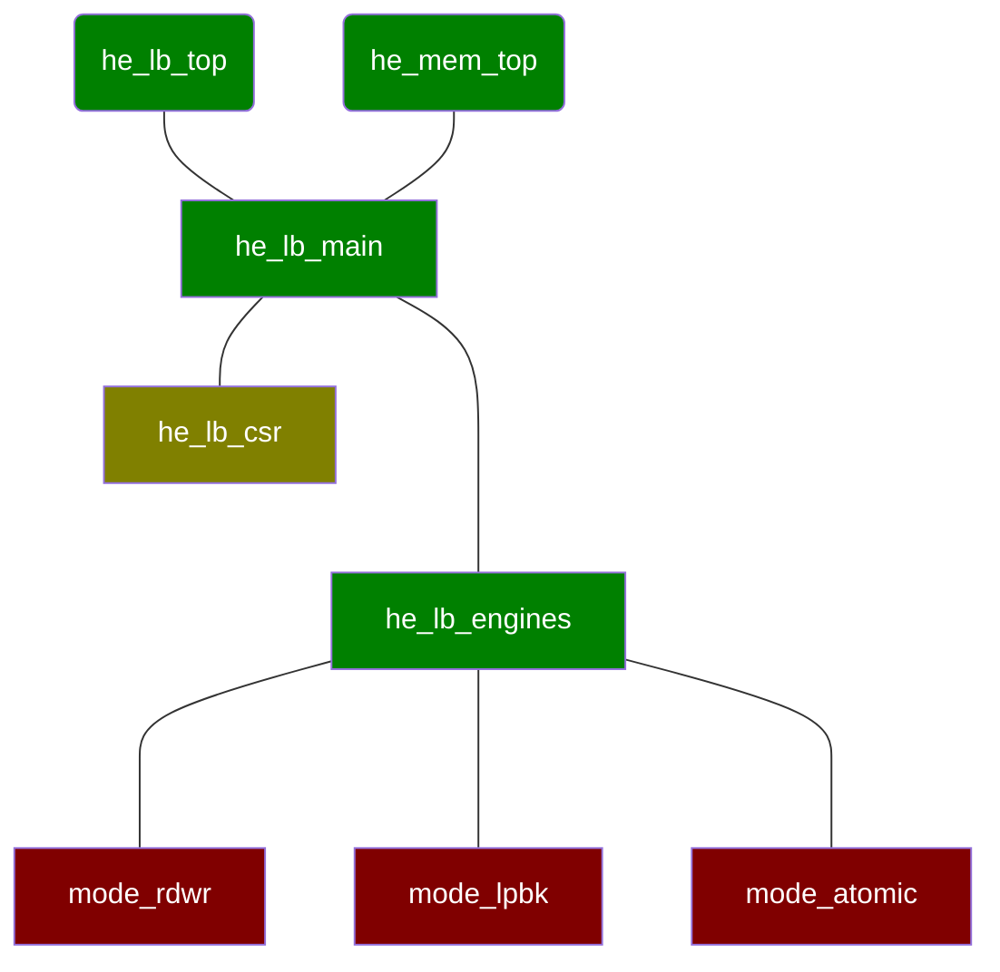

# **FPGA Interface Manager Technical Reference Manual for Intel Agilex SoC Attach: Open FPGA Stack**

Last updated: **May 31, 2023** 

# 1 Overview

## 1.1 About this Document

This document describes the hardware architecture for the SoC Attach reference FIM of the Open FPGA Stack (OFS) targeting the Intel&reg; Agilex FPGA.  After reviewing this document you should understand the features and functions of the components that comprise the FPGA Interface Manager (FIM), also known as the "shell."

## 1.2 Glossary

| Term                      | Abbreviation | Description                                                  |
| :------------------------------------------------------------:| :------------:| ------------------------------------------------------------ |
|Advanced Error Reporting	|AER	|The PCIe AER driver is the extended PCI Express error reporting capability providing more robust error reporting. [(link)](https://docs.kernel.org/PCI/pcieaer-howto.html?highlight=aer)|
|Accelerator Functional Unit	|AFU	|Hardware Accelerator implemented in FPGA logic which offloads a computational operation for an application from the CPU to improve performance. Note: An AFU region is the part of the design where an AFU may reside. This AFU may or may not be a partial reconfiguration region.|
|Basic Building Block	|BBB|	Features within an AFU or part of an FPGA interface that can be reused across designs. These building blocks do not have stringent interface requirements like the FIM's AFU and host interface requires. All BBBs must have a (globally unique identifier) GUID.|
|Best Known Configuration	|BKC	|The software and hardware configuration Intel uses to verify the solution.|
|Board Management Controller|	BMC	|Supports features such as board power managment, flash management, configuration management, and board telemetry monitoring and protection. The majority of the BMC logic is in a separate component, such as an Intel® Max® 10 or Intel Cyclone® 10 device; a small portion of the BMC known as the PMCI resides in the main Agilex FPGA.
|Configuration and Status Register	|CSR	|The generic name for a register space which is accessed in order to interface with the module it resides in (e.g. AFU, BMC, various sub-systems and modules).|
|Data Parallel C++	|DPC++|	DPC++ is Intel’s implementation of the SYCL standard. It supports additional attributes and language extensions which ensure DCP++ (SYCL) is efficiently implanted on Intel hardware.
|Device Feature List	|DFL	| The DFL, which is implemented in RTL, consists of a self-describing data structure in PCI BAR space that allows the DFL driver to automatically load the drivers required for a given FPGA configuration. This concept is the foundation for the OFS software framework. [(link)](https://docs.kernel.org/fpga/dfl.html)|
|FPGA Interface Manager	|FIM|	Provides platform management, functionality, clocks, resets and standard interfaces to host and AFUs. The FIM resides in the static region of the FPGA and contains the FPGA Management Engine (FME) and I/O ring.|
|FPGA Management Engine	|FME	|Performs reconfiguration and other FPGA management functions. Each FPGA device only has one FME which is accessed through PF0.|
|Host Exerciser Module	|HEM	|Host exercisers are used to exercise and characterize the various host-FPGA interactions, including Memory Mapped Input/Output (MMIO), data transfer from host to FPGA, PR, host to FPGA memory, etc.|
|Input/Output Control|	IOCTL	|System calls used to manipulate underlying device parameters of special files.|
|Intel Virtualization Technology for Directed I/O	|Intel VT-d	|Extension of the VT-x and VT-I processor virtualization technologies which adds new support for I/O device virtualization.|
|Joint Test Action Group	|JTAG	| Refers to the IEEE 1149.1 JTAG standard; Another FPGA configuration methodology.|
|Memory Mapped Input/Output	|MMIO|	The memory space users may map and access both control registers and system memory buffers with accelerators.|
|oneAPI Accelerator Support Package	|oneAPI-asp	|A collection of hardware and software components that enable oneAPI kernel to communicate with oneAPI runtime and OFS shell components. oneAPI ASP hardware components and oneAPI kernel form the AFU region of a oneAPI system in OFS.|
|Open FPGA Stack	|OFS|	OFS is a software and hardware infrastructure providing an efficient approach to develop a custom FPGA-based platform or workload using an Intel, 3rd party, or custom board. |
|Open Programmable Acceleration Engine Software Development Kit|	OPAE SDK|	The OPAE SDK is a software framework for managing and accessing programmable accelerators (FPGAs). It consists of a collection of libraries and tools to facilitate the development of software applications and accelerators. The OPAE SDK resides exclusively in user-space.|
|Platform Interface Manager	|PIM|	An interface manager that comprises two components: a configurable platform specific interface for board developers and a collection of shims that AFU developers can use to handle clock crossing, response sorting, buffering and different protocols.|
|Platform Management Controller Interface|	PMCI|	The portion of the BMC that resides in the Agilex FPGA and allows the FPGA to communicate with the primary BMC component on the board.|
|Partial Reconfiguration	|PR	|The ability to dynamically reconfigure a portion of an FPGA while the remaining FPGA design continues to function. For OFS designs, the PR region is referred to as the pr_slot.|
|Port|	N/A	|When used in the context of the fpgainfo port command it represents the interfaces between the static FPGA fabric and the PR region containing the AFU.|
|Remote System Update|	RSU	|The process by which the host can remotely update images stored in flash through PCIe. This is done with the OPAE software command "fpgasupdate".|
|Secure Device Manager	|SDM|	The SDM is the point of entry to the FPGA for JTAG commands and interfaces, as well as for device configuration data (from flash, SD card, or through PCI Express* hard IP).|
|Static Region|	SR	|The portion of the FPGA design that cannot be dynamically reconfigured during run-time.|
|Single-Root Input-Output Virtualization|	SR-IOV	|Allows the isolation of PCI Express resources for manageability and performance.|
|SYCL	|SYCL|	SYCL (pronounced "sickle") is a royalty-free, cross-platform abstraction layer that enables code for heterogeneous and offload processors to be written using modern ISO C++ (at least C++ 17). It provides several features that make it well-suited for programming heterogeneous systems, allowing the same code to be used for CPUs, GPUs, FPGAs or any other hardware accelerator. SYCL was developed by the Khronos Group, a non-profit organization that develops open standards (including OpenCL) for graphics, compute, vision, and multimedia. SYCL is being used by a growing number of developers in a variety of industries, including automotive, aerospace, and consumer electronics.|
|Test Bench	|TB	|Testbench or Verification Environment is used to check the functional correctness of the Design Under Test (DUT) by generating and driving a predefined input sequence to a design, capturing the design output and comparing with-respect-to expected output.|
|Universal Verification Methodology	|UVM	|A modular, reusable, and scalable testbench structure via an API framework.  In the context of OFS, the UVM enviroment provides a system level simulation environment for your design.|
|Virtual Function Input/Output	|VFIO	|An Input-Output Memory Management Unit (IOMMU)/device agnostic framework for exposing direct device access to userspace. (link)|

## 1.3 Introduction to Open FPGA Stack

The Open FPGA Stack (OFS) is a modular infrastructure of hardware platform components, open source unstreamed software, and broad ecosystem support that enables an efficient path to develop a custom FPGA platform.  OFS Provides a framework of FPGA synthesizable code, simulation environment and synthesis/simulation scripts. 

The key components of OFS include:

-   Target development platforms such as Intel-branded  Acceleration Development Platforms (ADPs) and third-party platforms.

- Board Management Controller RTL and firmware that supports telemetry monitoring and capability for remote configuration updates.

- Source accessible, modular FPGA Interface  manager (FIM) RTL with a UVM infrastructure unit tests that can be leveraged for your own custom FIM design. The FIM can be thought of as the FPGA shell that provides the I/O ring and timing closed management components for the FPGA.

- Basic building blocks for interconnect and PF/VF translation and arbitration; Platform Interface Manager (PIM) which provides Avalon&reg; and Arm® AMBA® 4 AXI4 bus compliant interfaces.

- AFU examples both in the git repository and workload examples provided by 3rd party vendors.

- Unit level simulation test suite

- System level simulation through a unified verification methodology (UVM)

-   OPAE software development kit (APIs, up-streamed Linux drivers and software tools)

- Support for other frameworks to be built on top of the OPAE such as DPDK 

**Figure 1-1 OFS Ingredients**

These components are available in a two GitHub locations:

* [OFS hardware GitHub site](https://github.com/OFS/ofs-f2000x-pl)
* [OPAE software GitHub site]( https://github.com/OFS/opae-sdk)

The OFS hardware repository supports hardware development and simulation.  Repositories for OFS high-level design support and board management controller RTL and firmware source code are also provided.  These repositories can be found in the Intel Opensource Technology GitHub location, which requires entitlement access.  To request access, please contact your local Intel sales representative.

**Table 1-2 OFS Hardware Repositories**

| Repository                                | Contains                                                     |
| ----------------------------------------- | ------------------------------------------------------------ |
| [OFS f2000x FIM Github Branch](https://github.com/OFS/ofs-f2000x-pl)            | Contains FIM or shell RTL, automated compilation scripts, and unit tests and UVM framework. |
| [ofs-bmc](${{ env.F2000X_BMC_RTL_REPO }}) | Provides the OFS Board Management Controller RTL, firmware, scripts and collateral targeting the Intel IPU Platform F2000X-PL which can be leveraged for your own OFS design. |

The OPAE software GitHub site is fully opensource and contains resources for both software and workload developers.

**Table 1-3  OFS Software Repositories**

| OPAE Git Repository Folder | Contains                                                     |
| -------------------------- | ------------------------------------------------------------ |
| [OPAE SDK Repo](https://github.com/OFS/opae-sdk/)            | Contains the files for building and installing OPAE SDK from source. |
| [Linux DFL](https://github.com/OFS/linux-dfl)                | Contains OFS Linux drivers that are being upstreamed to the Linux kernel. |
| [ofs-platform-afu-bbb](https://github.com/OFS/ofs-platform-afu-bbb)     | Contains the files and scripts to build the platform interface manager. |
| [opae-sim](https://github.com/OFS/opae-sim)                 | Contains the files for an AFU developer to build the Accelerator Functional Unit Simulation Environment (ASE) for workload development. |

Providing the hardware and software source code and supporting test frameworks in a GitHub repository allows you to customize your designs with the latest versions easily.

## 1.4 OFS Features

The OFS architecture within the FPGA comprises two partitions:

-   FPGA Interface Manager (FIM)

-   Accelerator Functional Unit (AFU)
    -   AFU SoC Dynamic Region and Static Region 
    -   AFU Host Static Region 

The FIM or shell provides platform management functionality, clocks, resets, and interface access to the host and peripheral features of the acceleration platform. 

The FIM architecture along with the supporting OPAE software supports features such as partial reconfiguration and virtualization.

The FIM provides a standard Arm® AMBA® 4 AXI4 datapath interface. The FIM resides in the static region of the FPGA.

The AFU partition is provided for custom acceleration workloads and may contain both static and partial reconfiguration regions.

### 1.4.1 FPGA Interface Manager (FIM)

The updated OFS architecture for Intel® Agilex® FPGA devices improves upon the modularity, configurability and scalability of the first release of the OFS architecture while maintaining compatibility with the original design.  The primary components of the FPGA Interface Manager or shell of this reference design are: 

* P-tile PCIe Subsystem
* E-Tile Ethernet Subsystem
* Memory Subsystem
* Reset Controller
* FPGA Management Engine (FME)
* AFU Peripheral Fabric for AFU accesses to other interface peripherals
* Board Peripheral Fabric for master to slave CSR accesses from Host or AFU
* Platform Management Controller Interface (PMCI) to the board management controller

The AFU Region provides design space for custom workloads and contains both static and partial reconfiguration regions.  Partial reconfiguration allows you to update your specific logic blocks or entire workload while the rest of your static design is still in operation.

Note that as discussed previously, the BMC RTL and firmware, the OFS OPAE software stack and support for building your own customer board support package are also provided in separate OFS repositories.

**Figure 1-2 OFS for OFS FIM Platform Block Diagram**

The table provides an overview of the OFS features targeting the Intel® Agilex® FPGA.  This reference FIM (shell) is a starting point for your custom FPGA design.  With this initial starting point, you can add or subtract interfaces or ports to different Agilex devices.

**Table 1-4 OFS FIM for Intel® Agilex® FPGA Features**

| Key Feature                           | Description                                                  |
| ------------------------------------- | ------------------------------------------------------------ |
| PCIe                                  | P-tile PCIe* Gen4x16 to the Host P-tile PCIe* Gen4x16 to the SoC (IceLake-D) |
| Virtualization                        | Host: 2 physical functions  SoC:   1 physical function and 3 Virtual functions |
| Memory                                | Four Fabric DDR4 banks, x40 (optional ECC, be configured as x32 and ECC x8 ), 1200 MHz, 4GB |
| Ethernet                              | Eight Arm® AMBA® 4 AXI4-Stream channels of 25G Ethernet interfacing to an E-tile Ethernet Subsystem. |
| Configuration and Board Manageability | * FPGA Management Engine that provides general control of common FPGA tasks (ex. error reporting, partial reconfiguration) * Platform Controller Management Interface (PMCI) Module contained within the Agilex FPGA that interfaces through Avalon-Streaming x8 QuadSPI and SPI to a Board Management Controller |
| Partial Reconfiguration               | Partial Reconfiguration region supported in hardware and software |
| Software Support                      | * Linux DFL drivers targeting OFS FIMs * OPAE Software Development Kit * OPAE Tools |

##### Subsystem Interfaces

The PCIe, Memory and Ethernet interfaces in this design use a new flexible subsystem design that provides a standard Arm® AMBA® 4 AXI4 interface.  To access these Intel FPGA IP Subsystem documents. Please go [here](https://rdc.intel.com) and search for the following ID numbers:
* 690604: PCIe Subsystem IP User Guide (Note: you must login to myIntel and request entitled access)
* 686148: Memory Subsystem IP User Guide (Note: you must login to myIntel and request entitled access)
* 773413: [Ethernet Subsystem Intel FPGA IP] (public document)

##### FPGA Management Engine (FME)

The FIM contains only one FME, regardless of the number of host interfaces to the FIM. The FME provides management features for the platform and controls reset and loading of the AFU into the partial reconfiguration region of the FPGA.

Any feature, such as a memory interface or global error control that you want to control through FME, must expose its capability to host software drivers.  New features are exposed to the FME by adding a device feature header (DFH) register at the beginning of the feature's control status register (CSR) space. The FME CSR maps to physical function 0 (PF0) Base address register 0 (BAR0) so that software can access it through a single PCIe link.  For more information about DFHs, refer to the [FPGA Device Feature List Framework Overview](https://github.com/OFS/linux-dfl/blob/fpga-ofs-dev/Documentation/fpga/dfl.rst)

##### Streaming Datapath

The FIM implements an Arm® AMBA® 4 AXI4-Stream bus protocol for data transfer in the FIM. Arm® AMBA® 4 AXI4-Stream channels send data packets to and from the host channel IP without data abstraction. Memory-mapped I/O (MMIO) CSR accesses are routed to the ST2MM module, which converts the Arm® AMBA® 4 AXI4-Stream to an Arm® AMBA® 4 AXI4 memory-mapped protocol.

##### Virtualization

This design supports virtualization by making use of the virtualization functionality in the PCIe Hard IP and mapping packets to the appropriate physical or virtual function through a PF/VF multiplexer.  

This reference FIM example supports 2 PFs for the host and 1PF, 3VFs for the SoC; however, you may extend your configuration to whatever the PCIe Hard IP can support or your application requires.

### 1.4.2 AFU

An AFU is an acceleration workload that interfaces with the FIM. The AFU boundary in this design comprises both static and partial reconfiguration (PR) regions.  You can decide how you want to partition these two areas or if you want your AFU region to only be a partial reconfiguration region.  A port gasket within the design provides all the PR-specific modules and logic required for partial reconfiguration. Only one partial reconfiguration region is supported in this design for SoC AFU.

Similar to the FME, the port gasket exposes its capability to the host software driver through a DFH register placed at the beginning of the port gasket CSR space. In addition, only one PCIe link can access the port register space.  

You can compile your design in one of the following ways: 
* Your AFU (workload) for Host (Static Area) and SoC resides in the partial reconfiguration area. 
* Your AFU is part of the static region and is compiled from a flat design. 

In this design, the AFU region is comprised of:
* AFU Interface handler to verify transactions coming from AFU region.
* PF/VF Mux to route transactions to and from corresponding AFU components: 
  * Host:
    * ST2MM module.
    * PCIe loopback host exerciser (HE-LPBK) .

  * SoC:
    * ST2MM module.
    * Ethernet Subsystem (previous HSSSI) host exerciser (HE-HSSI).
    * Memory Host Exerciser (HE-MEM).
    * Traffic Generator to memory (HE-MEM-TG).
    * Port Gasket (PRG).

* Arm® AMBA® 4 AXI4 Streaming to Memory Map (ST2MM) Module that routes MMIO CSR accesses to FME and board peripherals.
* Host exercisers to test PCIe, memory and Ethernet Interfaces (these can be removed from the AFU region after your FIM design is complete to provide more resource area for workloads)
* Port gasket and partial reconfiguration support.
* Component for handling PLDM over MCTP over PCIe Vendor Defined Messages (VDM)

For this design the PF/VF Mux provides the following mappings (found in /src/afu_top/mux/top_cfg_pkg.sv and /src/afu_top/mux/soc_top_cfg_pkg.sv):

**Table 1-5 PF/VF Mapping**

**SoC (IceLake-D)**

| PF      | VF   | Feature                                  | BAR   | Bar Size           |
| ------- | ---- | ---------------------------------------- | ----- | ------------------ |
| **PF0** |      | OFS managed peripherals                  | BAR 0 | 2MB                |
|         |      | AFU peripherals   Board peripherals | BAR 0 | 256KB   768KB |
| **PF0** | VF0  | HE-MEM                                   | BAR 0 | 2MB                |
|         | VF1  | HE-HSSI                                  | BAR 0 | 2MB                |
|         | VF2  | HE-MEM TG                                | BAR 0 | 2MB                |

**Xeon Host**

| PF      | VF   | Feature                                  | BAR   | Bar Size           |
| ------- | ---- | ---------------------------------------- | ----- | ------------------ |
| **PF0** |      | OFS managed peripherals                  | BAR 0 | 1MB                |
|         |      | AFU peripherals   Board peripherals |       | 256KB   768KB |
| **PF1** |      | HE-LPBK                                  | BAR 0 | 16KB               |

**Figure 1-3 AFU Diagram** 

### 1.4.3 Platform Interface Manager

The PIM provides a way to abstract the Arm® AMBA® 4 AXI4-Stream interface to the AFU by providing a library of shims that convert the host channel native packet into other protocols such as Arm® AMBA® 4 AXI4 memory-mapped, Avalon&reg; streaming (Avalon-ST) or Avalon&reg; memory-mapped (Avalon-MM). 

The FPGA or AFU developer implements these interface abstractions in the AFU regions (afu_top and soc_afu_top) of the design.  

For more information, refer to the AFU Developer's Guide.

### 1.4.4 Platform Feature Discovery

This reference design comes with specific Intel FPGA drivers that are upstreamed to linux-dfl.  These drivers abstract the hardware and operating system specific details of the platform to the host. 

The FIM implements a device feature header (DFH) at the beginning of each host-discoverable feature in a linked list format that allows an FPGA platform driver running on the host to discover FME, port, and AFU features. 

You must implement a 64-bit DFH Device Feature Header register at the beginning (first 8B aligned address) of the feature CSR space for a new feature to be discovered or enumerated by a driver.  

During host discovery, the driver traverses the DFH of the first feature from the first address on PF0 BAR0. Based on the information in the DFH, a driver can determine the CSR address range of the feature and other associated details. The end of the DFH contains a "next DFH offset" field that points the driver to the DFH of the next feature. 

The software must continue traversing the linked list until it sees the EOL (End-Of-List) bit set to 1 in the "next DFH offset" field it inspects.  A 1 indicates this is the last feature in the feature set. The figure below gives a simple illustration of the feature discovery by traversing the DFH registers. This model is similar to how PCIe enumeration occurs.

**Figure 1-4 Device Feature Header Linked List Traversal**

### 1.4.5 OFS Reference Design

OFS provides FIM designs you can use as a starting point for your own custom design. These designs target a specific programmable acceleration card or development kit and exercise key FPGA device interfaces. 

The Intel Agilex&reg; code line for OFS targets the Intel IPU Platform F2000X-PL.  [FIM designs](https://github.com/OFS/ofs-f2000x-pl) are released to for evaluation and use. 

### 1.4.6 FIM Simulation

OFS provides unit tests and a UVM environment for the FIM and a framework for new feature verification. UVM provides a modular, reusable, and scalable testbench structure by providing an API framework that can be deployed across multiple projects. 

The FIM testbench is UVM compliant and integrates third-party verification IPs from Synopsys that require a license. 

Verification components include:

-   FIM monitor to detect correct design behavior

-   FIM assertions for signal level integrity testing

-   Arm® AMBA® 4 AXI4 scoreboards to check data integrity

-   FIM coverage to collect functional data

The verification infrastructure can be found [here](https://github.com/OFS/ofs-f2000x-pl/verification) for evaluation and use. Please refer to the [Simulation User Guide]( https://ofs.github.io/hw//f2000x/user_guides/ug_sim_ofs/ug_sim_ofs.md) for more information.

# 2 OFS High Level Architecture

OFS provides distinct data paths that simplify the design and integration process for adding or removing interface modules:

* **High Bandwidth data path** for AFU-attached high-performance peripherals (Ethernet Subsystem, Memory,  workload).
* **Low Bandwidth data path** for OFS management and slow peripheral components (JTAG, I2C, SMBus).
* **AFU Peripheral Fabric (APF) to Board Peripheral Fabric (BPF) path** to communicate with interface control and status registers (CSRs) and board components.
* **Peer-to-peer datapath** between AFU components.
* **Peer-to-peer datapath** between BPF components.

Depending on your design goals, you can present peripherals to software as:

* OFS managed peripherals with a device feature header that is part of a device feature list.
* Native driver managed peripherals that are exposed through an independent physical function or virtual function.

**Figure 2-1 OFS Datapath Structure**  

# 3 PCIe Subsystem

The FIM's PCIe Subsystem is a hierarchical design that targets the P-tile PCIe* hard IP and is configured to support Gen4 speeds and Arm® AMBA® 4 AXI4-Stream Data Mover functional mode.  The IP supports SR-IOV and is configured to provide  2 PFs for the host and 1PF, 3VFs for the SoC.  Native PCIe TLP packets are sent through the PCIe usingArm® AMBA® 4 AXI4 Stream Protocol.  Before they reach the AFU, the packets go through an adapter in the subsystem that converts any headers to a data mover format.  Tag allocation and management for packets sent from the application to the host are done by the PF/VF Mux which is part of the AFU region.

**Figure 3-1 OFS FIM RX-TX Datapath**

Some key features of the PCIe interface are:

| Feature                               | OFS for Intel Agilex FPGA SoC Attach Subsystem Configuration |
| ------------------------------------- | :----------------------------------------------------------: |
| Mode                                  |          Host: PCIe Gen4x16 SoC: PCIe Gen4x16           |
| Tile                                  |                            P-Tile                            |
| Port Mode                             |                       Native Endpoint                        |
| SR-IOV                                |         Host: 2 PFs, No VFs SoC:  1 PFs, 3 VFs          |
| MSI-X Support                         |                             Yes                              |
| Functional Mode                       |                          Data Mover                          |
| Profile                               |                            Basic                             |
| TLP Bypass                            |                              No                              |
| Header Packing Scheme                 |                            Simple                            |
| Data Width                            |                      512-bit (64-byte)                       |
| Arm® AMBA® 4 AXI4-ST Clock Frequency |                           500 MHz                            |
| Tags Supported                        |                             128                              |
| Reordering                            |                  Enabled with buffer 64 KB                   |
| Maximum Payload Size                  |                          512 Bytes                           |
| Memory Requests Supported             |                        1CL, 2CL, 4CL                         |
| MMIO transaction Size                 |                            4B, 8B                            |
| Control Shadow Interface              |                           Enabled                            |
| Completion Timeout Interface          |                           Enabled                            |

The PCIe PF, VF and Base Address Register (BAR) configuration can be modified in the PCIe Subsystem Platform Designer GUI interface.  The current implementation for the OFS FIM for Intel IPU Platform F2000X-PL is as follows:

**Table 3-1 Function and BAR Table for OFS for Intel IPU Platform F2000X-PL**

**SoC (IceLake-D)**

| PF      | VF   | Feature                                  | BAR   | Bar Size           |
| ------- | ---- | ---------------------------------------- | ----- | ------------------ |
| **PF0** |      | OFS managed peripherals                  | BAR 0 | 2MB                |
|         |      | AFU peripherals   Board peripherals | BAR 0 | 256KB   768KB |
| **PF0** | VF0  | HE-MEM                                   | BAR 0 | 2MB                |
|         | VF1  | HE-HSSI                                  | BAR 0 | 2MB                |
|         | VF2  | HE-MEM TG                                | BAR 0 | 2MB                |

**Xeon Host**

| PF      | VF   | Feature                                  | BAR   | Bar Size           |
| ------- | ---- | ---------------------------------------- | ----- | ------------------ |
| **PF0** |      | OFS managed peripherals                  | BAR 0 | 1MB                |
|         |      | AFU peripherals   Board peripherals |       | 256KB   768KB |
| **PF1** |      | HE-LPBK                                  | BAR 0 | 16KB               |

## 3.1 PCIe Subsystem Header Format

The first 32 bytes of the TLP from the PCIe subsystem denotes the PCIe header. There are two types of header format supported – Power User Mode header and Data Mover mode header. The tuser_vendor[0] bit on the Arm® AMBA® 4 AXI4-Stream channel indicates the header format of the TLP; tuser_vendor[0] =0 indicates Power User Mode header and tuser_vendor[0] =1 indicates Data Mover Mode header.

The OFS FIM for Intel Agilex FPGA implements the Data Mover Functional Mode.  With this implementation, the application has the flexibility to use either mode for PCIe transaction, as shown in the following table. For more detailed information about the PCIe Subsystem, see the PCIe Subsystem Intel FPGA User Guide. 

**Table 3-2 PCIe Subsystem Header Format Support for OFS for Agilex FPGA**

<table> 
<thead>
<tr>
<th align="center">Direction</th>
<th align="center">Type</th>
<th align="center">Power User</th>
<th align="center">Data Mover</th>
</tr>
</thead>
<tbody><tr><td rowspan="3">Host to Endpoint </td>	
<td align="center">MWr, MRd</td>
<td align="center">Yes</td>	
<td align="center">No</td>		
</tr>
<tr><td align="center">CPL/CPLd</td>
<td align="center">Yes</td>	
<td align="center">Yes</td>	
</tr>
<tr><td align="center">Msg</td>
<td align="center">Yes</td>	
<td align="center">No</td>	
</tr>
<tr><td rowspan="4">Endpoint to Host</td>	
<td align="center">MWr, MRd</td>
<td align="center">Yes</td>	
<td align="center">Yes</td>		
</tr>
<tr><td align="center">Intr</td>
<td align="center">Yes (MWr) </td>	
<td align="center">Yes</td>	
</tr>
<tr><td align="center">CPL/CPLd</td>
<td align="center">Yes</td>	
<td align="center">Yes</td>	
</tr>
<tr><td align="center">Msg</td>
<td align="center">Yes</td>	
<td align="center">Yes</td>	
</tr>
</tbody>
</table>

### 3.1.1 Power User Header Format

The Power User Format provides user complete control over PCIe Hard IP. The user can implement functionality of interest with finer control over PCIe Transaction Layer Packet (TLP), credit handling and various mode provided by HIP. 

The lower 16 bytes of the Power User Format are standard PCIe header as defined by PCIe specification, and the upper 16 bytes are specific to the PCIe Subsystem Intel FPGA IP. 

**Table 3-3 Power User Header Format**

The mapping of the PCIe defined header to the lower 16 bytes of the Arm® AMBA® 4 AXI4-Stream data channel is shown in the figure below. Each double word (DW) or 4 bytes in the PCIe header is mapped from big-endian to little-endian on Arm® AMBA® 4 AXI4-S data channel.  

**Figure 3-2 Power User Header Mapping to Arm® AMBA® 4 AXI4 Channel**

### 3.1.2 Data Mover Header Format

The data mover mode allows high bandwidth data transfers to and from Host memory. It hides the complexity of handling PCIe TLPs. This format provides a simple interface for reading and writing to Host Memory. The data mover checks link partner credits before transmitting packets. It also provides MSI-X interrupt generation capability. 

In Data Mover Mode, the lower 16 bytes are data mover specific and do not follow a PCIe standard header.  

**Table 3-4 Data Mover Header Format**

The mapping of the data mover header to the lower 16 bytes of the Arm® AMBA® 4 AXI4-S data channel is shown below. Each byte in the data mover header is mapped directly to the Arm® AMBA® 4 AXI4-S data channel.  

**Figure 3-3 Data Mover Header Mapping to Arm® AMBA® 4 AXI4 Channel**

## 3.2 PCIe Subsystem Interface Module

The PCIe Subsystem Interface module (/ipss/pcie/rtl/pcie_ss_if.sv), provides the supporting interface between software and the PCIe subsystem.  

The interface module provides the following:

* Device Feature Header Registers
* Control and Status Registers
* Indirect access to PCIe subsystem CSR registers through a CSR mailbox in the PCIe Subsystem Interface.

## 3.3 Data Mover Request Cycles

For Host read request cycles using the OFS FIM for Intel Agilex FPGA:
* All requests in the RX direction will be MMIO. 
* Requester ID from the request does get sent to the AFU. It is the AFU's responsibility to send back a completion to the host with the correct completer ID. 
* Prefix is not supported. 
* Memory Mapped (MM) Mode is not supported.
* Slot Number is 0.
* Base address is not sent to the AFU.
* Local Address field is not used.

For AFU/application request cycles using the OFS FIM for Intel Agilex FPGA:
* All requests in the TX direction will be Memory Read/Write. 
* The tag must be generated by the AFU/application.
* Prefix is not supported. 
* MM Mode is not supported.
* Slot Number is 0 (non-0 only for switch)
* VF Active, VF number and PF number are obtained from Data Mover Header Packet.

**Figure 3-4 Data Mover Request Cycles**

## 3.4 Data Mover Completion Cycles

For Host completion cycles using the OFS FIM for Intel Agilex FPGA:
* All completions in the RX direction will be Data Completions. 
* Prefix is not supported.
* MM Mode is not supported.
* Slot Number is 0.
* Data packet responses (for Memory Read requests from AFU) from the PCIe SS may come out of order when the size is >64B.

For AFU/application completion cycles using the OFS FIM for Intel Agilex FPGA:
* All requests in the TX direction will be Memory Read/Write. 
* Requester ID is generated within the FIM.
* That tag must be generated by the AFU/application.
* Prefix is not supported. 
* MM Mode is not supported.
* Slot Number is 0.
* VF Active, VF Number and PF number are obtained from the Data Mover Header Packet. 

**Figure 3-5 Data Mover Completion Cycles**

# 4 Platform Interface Manager

The FIM interfaces to an application in the AFU region through Arm® AMBA® 4 AXI4-Stream channels.  This format allows the AFU to access the host channel's raw interface without any translation. 

As a FIM developer, you have the option to provide the raw data format associated with the host interface channel to the workload or AFU developer or you can provide an intermediate protocol using Platform Interface Manager Components or your own custom interface.

If you expose the raw Arm® AMBA® 4 AXI4-Stream interface of the FIM, workload developers also have the option to convert to a desired protocol using the PIM resources as well.  

Refer to the AFU Developer Guide and the FPGA Interface Manager Developer Guide for more information on using the PIM in your design.

# 5 Interconnect Fabric

There are three types of interconnect fabric in the OFS FIM design:
 * Arm® AMBA® 4 AXI4-Stream PF/VF mux/demux fabric
 * AFU Peripheral Fabric (APF)
 * Board Peripheral Fabric (BPF)

**Figure 5-1 Interconnect Fabric Diagram**

TLP packets sent from upstream PCIe Subsystem on Arm® AMBA® 4 AXI4-Stream channel are demultiplexed in the Arm® AMBA® 4 AXI4-Stream PF/VF mux/demux fabric and routed to the respective PF/VF function based on the PF/VF information in the TLP header, such as vf_active or the PF/VF number. In the opposite direction, TLP packets from downstream PF/VF function are muxed in the fabric and sent to PCIe subsystem over Arm® AMBA® 4 AXI4-Stream channel.

All host MMIO requests targeting PF0 BAR0 are routed to the ST2MM module. The ST2MM converts MMIO TLP packets into Arm® AMBA® 4 AXI4-Lite memory requests and places the requests onto AFU Peripheral Fabric (APF). AFU peripherals, such as OFS managed AFU features and ST2MM, and Board Peripheral Fabric (BPF) are interconnected by APF. The BPF is the interconnect fabric one hierarchy below APF which connects all the board peripherals. Both APF and BPF allow multiple Arm® AMBA® 4 AXI4-Lite master and slave interconnect topology.

If you are modifying the APF or BPF connections, you must use Platform Designer to generate the fabrics directly.  Please refer to the FPGA Interface Manager Developer Guide for directions on what files must be modified and how to generate the interconnect.

For modifying the PF/VF mux you must update parameters in these files:
* src/includes/top_cfg_pkg.sv
* src/common/pf_vf_mux.sv
Then make the corresponding update to AFU top level instantiation and connections:
* src/afu_top/soc_afu_top.sv(SoC_AFU) and src/afu_top/afu_top.sv (HOST_AFU)

For details on these modifications, please refer to the FIM Interface Manager Developer Guide.  

## 5.1 AFU Peripheral Fabric (APF)

The AFU Peripheral Fabric (APF) is a 64-bit Arm® AMBA® 4 AXI4-lite compliant interconnect fabric that connects AFU peripheral modules to board peripheral modules through the Board Peripheral Fabric (BPF). 

The fabric is clocked by `clk_csr` and has a read allowance and write allowance of 1, i.e. only 1 active write/read is allowed in the fabric at any single time. 

The address mapping for components interconnected by the APF is listed below. All components are mapped to PF0 BAR0 and implement Arm® AMBA® 4 AXI4-lite slave interface. Note that none of the features in the APF mapping are designed to act as a master.

**Table 5-1 APF Address Mapping**

**SoC PF0 BAR 0**

| Address             | Size (Byte) | Feature                                                      |
| ------------------- | ----------- | ------------------------------------------------------------ |
| 0x00000–0xFFFFF     | 1024K       | Board Peripherals (See BPF address mapping)                  |
| **AFU Peripherals** |             |                                                              |
| 0x100000 – 0x10FFFF | 64K         | ST2MM                                                        |
| 0x130000 – 0x13FFFF | 64K         | PR Gasket:  4K= PR Gasket DFH, control and status  4K= Port DFH  4K=User Clock  52K=Remote STP |
| 0x140000 – 0x14FFFF | 64K         | AFU Error Reporting (Protocol checker)                       |

**Host PF0 BAR 0**

| Address             | Size (Byte) | Feature                                     |
| ------------------- | ----------- | ------------------------------------------- |
| 0x00000–0xFFFFF     | 1024K       | Board Peripherals (See BPF address mapping) |
| **AFU Peripherals** |             |                                             |
| 0x100000 – 0x10FFFF | 64K         | ST2MM                                       |
| 0x140000 – 0x14FFFF | 64K         | AFU Error Reporting (Protocol checker)      |

## 5.2 Board Peripheral Fabric (BPF)

The Board Peripheral Fabric is the 64-bit Arm® AMBA® 4 AXI4-Lite compliant interconnect fabric that connects board peripheral modules to APF. The fabric is clocked by `clk_csr` and has a read allowance and write allowance of 1, i.e. only 1 active write/read is allowed in the fabric at any single time.

The address mapping for components interconnected by BPF is listed below. All components are mapped to PF0 BAR0 and implement Arm® AMBA® 4 AXI4-lite slave interface. The Master column indicates if a component also implements Arm® AMBA® 4 AXI4-lite master interface which can send requests to the BPF.

**Table 5-2 BPF Address Mapping**

**SoC PF0 BAR 0**

| Address           | Size (Byte) | Feature               | Master |
| ----------------- | ----------- | --------------------- | ------ |
| 0x00000 – 0x0FFFF | 64K         | FME (FME, Error, etc) | No     |
| 0x10000 – 0x10FFF | 4K          | SoC PCIe Interface    | No     |
| 0x11000 – 0x11FFF | 4K          | Reserved              | -      |
| 0x12000 – 0x12FFF | 4K          | QSFP Controller 0     | No     |
| 0x13000 – 0x13FFF | 4K          | QSFP Controller 1     | No     |
| 0x14000 – 0x14FFF | 4K          | Ethernet Subsystem    | -      |
| 0x15000 – 0x15FFF | 4K          | Memory Subsystem      |        |
| 0x80000 – 0xFFFFF | 512K        | PMCI Controller       | Yes    |

**Host PF0 BAR 0**

| Address           | Size (Byte) | Feature             | Master |
| ----------------- | ----------- | ------------------- | ------ |
| 0x00000 – 0x00FFF | 4K          | Host PCIe Interface | No     |
| 0x80000 – 0xFFFFF | 512K        | PMCI Controller     | Yes    |

### 5.3 Arm® AMBA® 4 AXI4-Stream PF/VF Mux/Demux

The Arm® AMBA® 4 AXI4-Stream PF/VF Mux/Demux routes the PCIe TLP packets from the PCIe subsystem Arm® AMBA® 4 AXI4-Stream RX channel to downstream PF/VF based on the pf_num and vf_num information in the PCIe TLP header.

The Arm® AMBA® 4 AXI4-Stream PF/VF mux arbitrates PCIe TLP packets from downstream PF/VF to the PCIe SS Arm® AMBA® 4 AXI4-S TX channel.
The PF/VF Mux/Demux is an M X N switch that allows any M port to target any N port, and any N port to target any M port, where M is the number of host/upstream ports, and N is the numbers functions/downstream ports.   

The fpga top package file, `/src/afu_top/mux/top_cfg_pkg.sv and soc_top_cfg_pkg.sv` and, contains the PF/VF parameters and mappings.

**Figure 5-2 PF/VF Mux**

The PF/VF mux integration is part of afu_top (`src/afu_top/afu_top.sv and /soc_afu_top`).  There are two independent TX PF/VF MUX trees, labeled "A" and "B".

Both an A and a B port are passed to each AFU component with a unique PF/VF. You can design your AFU components to send all requests to the primary A port or partition requests across both A and B ports. A typical high-performance AFU sends read requests to the B port and everything else to the A port, giving the arbiter freedom to keep both the host TX and RX channels busy.

In the reference FIM provided for Intel Agilex OFS, the A and B TX trees have been multiplexed down to a single channel for A and another for B. The A/B multiplexer merges them into a single TX stream that will be passed to the tag remapper.

The tag remapper provides unique tags as required by the PCIe specification.  Tags are not provided by the PCIe Subsystem FPGA IP.  When creating your own AFU you can leverage this module to generate unique tags.

Note that the primary PF/VF Mux A supports RX and TX ports.  For the secondary PF/VF Mux B only TX ports are supported and the RX input to the Mux is tied off.  

The default mapping is shown below:

**Table 5-3 PF/VF Mapping**

**SoC (IceLake-D)**

| PF      | VF   | Feature                                  | BAR   | Bar Size           |
| ------- | ---- | ---------------------------------------- | ----- | ------------------ |
| **PF0** |      | OFS managed peripherals                  | BAR 0 | 2MB                |
|         |      | AFU peripherals   Board peripherals | BAR 0 | 256KB   768KB |
| **PF0** | VF0  | HE-MEM                                   | BAR 0 | 2MB                |
|         | VF1  | HE-HSSI                                  | BAR 0 | 2MB                |
|         | VF2  | HE-MEM TG                                | BAR 0 | 2MB                |

**Xeon Host**

| PF      | VF   | Feature                                  | BAR   | Bar Size           |
| ------- | ---- | ---------------------------------------- | ----- | ------------------ |
| **PF0** |      | OFS managed peripherals                  | BAR 0 | 1MB                |
|         |      | AFU peripherals   Board peripherals |       | 256KB   768KB |
| **PF1** |      | HE-LPBK                                  | BAR 0 | 16KB               |

For information on how to modify the PF/VF mapping for your own design, refer to the OFS FIM Developer User Guide.

## 5.4 AFU Interface Handler

The AFU Interface Handler resides inline between the PCIe Arm® AMBA® 4 AXI4-Stream Adapter and the Arm® AMBA® 4 AXI4-Stream PF/VF Demux/Mux logic. Its main function is to provide:
* Unique PCIe tags – Each PCIe transaction shares the 512 tags across all VFs in the AFU region
* AFU error logging for all VFs in the AFU region

### 5.4.1 Unified Tag Remapping

When a FPGA function sends out a read cycle, it allocates a unique tag which is subsequently used to identify the read completion.  The tag is considered busy; it cannot be assigned to another read cycle until read completion.  While a tag may be unique within a unit, two different units could unknowingly send out two read cycles of the same tag.  The PCIe subsystem requires unique tags for all read cycles irrespective of their origins.  Therefore, a mechanism is needed to uniquify tag globally across different units.

OFS contains a tag remapper (`tag_remap.sv`) that intercepts the read cycle, finds a globally unique tag, and replaces the original tag value.  It also restores the original tag value when returning completion to the read requester.  tag_remap is placed between the Arm® AMBA® 4 AXI4-Stream interface of the PCIE subsystem and the PF/VF Mux/Demux.

The logic is described as follows:

1.	A sub-module (`ofs_fim_tag_pool`) maintains a pool of available tags.
2.	TX read requests are held until a tag is available from the pool by setting tvalid=0 to the host, and tready=0 to the PF/VF Mux/Demux.
3.	When a TX read is dispatched, the tag is marked busy in the pool.
4.	The original tag is stored in tag_reg, so it can be recovered when returning a completion to the unit/function.
5.	Because completion to a read request can split into multiple smaller transfer sizes, responses are monitored and the final completion is detected using PCIe TLP rules.
6.	Tags are released in the pool only when all requested data are transferred.
7.	When the completion returns, the original tag is restored from `tag_reg`.

### 5.4.2 AFU Error Handling

In this OFS design, the AFU Interface Handler handles error logging for all VFs in the AFU. Errors handled are as follows

**Table 5-4 AFU Error Descriptions**
<table>
    <thead> 
        <tr>
        <th>Checker</th>	
        <th>Field</th>
        <th>Description</th>
        </tr>
    </thead>
    <tbody>
        <tr><td rowspan="12">AFU protocol checker (PCIe TLP)</td>
        <td>Malformed TLP</td>
        <td>AFU PCIe TLP contains unsupported format type</td></tr>
        <tr>
        <td>MaxPayloadError</td>
        <td>AFU memory write payload size exceeds max_payload_length limit</td></tr>
        <tr>
        <td>MaxReadReqSizeError</td>
        <td>AFU memory read payload size exceeds max_read_request_size limit</td></tr>
        <tr>
        <td>MaxTagError</td>
        <td>AFU memory read request tag value exceeds the maximum supported tag count</td></tr>
        <tr>
        <tr>
        <td>UnalignedAddrErr</td>
        <td>The address field in AFU memory write/read request TLP is not DW-aligned.</td></tr>
        <tr><td>UnexpMMIOResp</td>
        <td>AFU is sending a MMIO read response with no matching MMIO read request.</td></tr>
        <tr><td>MMIOTimedOut</td><td>AFU is not responding to a MMIO read request within the pre-defined response timeout period. </td></tr>
        <tr><td>MMIODataPayloadOverrun</td><td>The number of data payload sent by AFU for a MMIO response (cplD) is more than the data length specified in the response.</td></tr>
	<tr><td>MMIOInsufficientData</td><td>The number of data payload sent by AFU for a MMIO response (cplD) is less than the data length specified in the response.</td></tr>
	<tr><td>TxMWrDataPayloadOverrun</td><td>	The number of data payload sent by AFU for a memory write request is more than the data length specified in the request.</td></tr>
	<tr><td>TxMWrInsufficientData</td><td>	The number of data payload sent by AFU for a memory write request is less than the data length specified in the request.</td></tr>
    <tr><td>AFU Protocol Checker (Arm® AMBA® 4 AXI4-Stream)</td><td>TxValidViolation</td><td>Three checkers are implemented in the FIM to catch errors and protocol violations.</td>
    </tbody>
</table>

## 5.5 TLP to Arm® AMBA® 4 AXI4-Lite Memory Mapped Bridge (ST2MM)

ST2MM implements the following key features:
* Host MMIO bridge
    * Maps MMIO TLP packets received from the PCIe Subsystem over streaming interface to Arm® AMBA® 4 AXI4-Lite memory-mapped request. The memory-mapped request is sent to AFU or Board peripherals over APF and BPF.
    * Maps Arm® AMBA® 4 AXI4-lite MM response received from AFU or Board peripherals to TLP packets and send the packets over ST streaming channel to host HIA subsystem.
* Sends MMIO response of all 0’s for MMIO read to unused BAR region.
* Interrupt
    * Sends interrupt packets to the PCIe subsystem when interrupt requests are received from the peripherals. Interrupts can be requested by a peripheral through a memory write to interrupt CSR registers in the ST2MM.

**Figure 5-3 ST2MM Module**

ST2MM implements both Arm® AMBA® 4 AXI4-lite master and slave interfaces that are connected to the designated slave and master port on APF. Host memory requests are sent on the ST2MM master interface to AFP where the requests are routed to the targeted peripherals. 

# 6 MMIO Regions

The FIM and AFU expose their functionalities to the host software through a set of CSR registers that are mapped to an MMIO region (Memory Mapped IO). An MMIO region is an address space within a base address register (BAR) region to which features are memory mapped.  

For example, when a feature is mapped to an MMIO region, the CSR registers of that feature are located within the address range of that region. There can be multiple MMIO regions within a BAR region. 

## 6.1 Feature Region

A group of related CSRs can be categorized as a feature region. For example, a DMA engine has queue management function and quality of service (QoS) function; these are two different features of the DMA engine. A feature region is contained within a single PCIe BAR and cannot span across two BAR region boundaries. 

A Device Feature Header (DFH) register marks the start of the feature region and sub-feature region, and you must place it at the first address of the region. Each DFH starts at 4KB boundary. A DFH register contains information that OPAE software requires to enumerate the feature. It also has an offset field that points to the next DFH in a feature list. OPAE software traverses the linked list of DFHs in each BAR region to discover all the features implemented on the platform. 

The `EOL` field in a DFH marks the end of a DFH list and is only set in the DFH of the last feature in the feature list. The feature type field in the DFH is used to differentiate between the different types of feature region. Basic building blocks (BBB) and private features are always a child of an AFU or FPGA Interface Unit (FIU) and must be contained within an AFU or FIU, respectively.  

### 6.1.1 Device Feature Header (DFH) Structure

All DFHs must follow the following structure to be compatible with OPAE software.  Note that only features you want to be exposed to the OPAE software must have a DFH.

**Table 6-1: DFH Register Structure**

|Bitfield Name|Range|Access| Description|
|:-------:|:------:|:-------:|-------------|
|FeatureType|63:60|RO|4’b0000 – Reserved  4’b0001 – AFU 4’b0010 – BBB 4’b0011 – Private Feature 4'b0100 – FIM |
|Reserved|59:41|Rsvd|Reserved|
|EOL| 40|RO| End of DFH List 1'b0=No other feature header beyond this one 1'b1=This is the last feature header|
|NextDFHByteOffset| 39:16| RO| Next DFH byte offset Next DFH Address= Current DFH address + Next DFH byte offset.  You can also use this value as an indication of the maximum size of the MMIO region occupied by this feature. 
|FeatureRev| 15:12 | RO|For AFU Feature type= AFU major version number that is user defined. All other feature types= Feature revision number|
|FeatureID|11:0 | RO| For AFU feature type= CoreFIM version number For BBB feature type= Intel defined ID for BBB For private feature type= User-defined ID to identify within an AFU  For FIU type=ID for FIU unit (ex. 0 for FME, 1 for Port)

You must increment a feature revision number if a feature changes.  This change requires a corresponding change in the software to detect the new version and report mismatches between the hardware and software revision number. 

When indicating "FeatureType" in your DFH Structure, use the following guidance:
* FIM= Any static region feature you want discovered through software.  FIM features must implement mandatory FIM registers, including a FIM feature ID.
* AFU= User Application region; may be PR region.  AFU feature must implement mandatory AFU register including an AFU ID.
* Private Feature = Linked list of features within the FIM or AFU which are enumerated and managed by separate software and do not require an ID.
* Basic Building Blocks (BBB) = Special features within the AFU or FIM that are meant to be reusable basic building blocks.  They are enumerated and called by separate software services.  

**Table 6-2: Mandatory FIM and AFU Registers**

The following table details the registers required for a FIM feature or AFU to be discovered by OPAE software.  The ID_H and ID_L fields allow you to create a unique feature or AFU identifier that remains unchanged while the FeatureRev in the DFH register increments.

| Byte Address offset with respect to DFH |                    Register Name                     |
| --------------------------------------- | :--------------------------------------------------: |
| 0x0000                                  | DFH with corresponding FeatureType field implemented |
| 0x0008                                  |    ID_L: Lower 64 bits of unique ID number (GUID)    |
| 0x0010                                  |    ID_H: Upper 64 bits of unique ID number (GUID)    |
| 0x0018                                  |                       Next AFU                       |

**Table 6-3: Next AFU Register Definition**

The following table details the "Next AFU Register Definition."  This register is used if you have multiple AFUs that can be used with your FIM.  

|  Bit  | Attribute | Description                                                  |
| :---: | :-------: | ------------------------------------------------------------ |
| 63:24 | Reserved  | Reserved                                                     |
| 23:0  |    RO     | Next AFU DFH Byte Offset  Next AFU DFH address =current address + offset; where a value of 0 implies this is the last AFU in the list.  Example:  AFU0 at address 0x0: Next AFU offset= 0x100   AFU1@ address 0x100: Next AFU offset = 0x100  AFU2 at address 0x200: Next AFU offset = 0x0 (End of AFU List) |

**6.2 Control and Status Registers**

All the Control and Status Registers (CSRs) in the FIM are 64-bit registers with the following MMIO write, and MMIO read support.

**Table 6-4: CSR MMIO Read and Write Support**

|  Request   | Memory Attribute | Payload size | Memory Ordering  |
| :--------: | :--------------: | :----------: | :--------------: |
| MMIO Write |        UC        |   4B or 8B   | Strongly ordered |
| MMIO Read  |        UC        |   4B or 8B   | Strongly ordered |

The FIM does not reorder the MMIO requests or responses. For MMIO writes, there is no reordering of requests in FIM, and UC ordering rules are followed. Similarly, for MMIO reads, there is no re-ordering of requests or responses in the FIM. An AFU may opt to re-order the MMIO read responses but the FIM does not enforce read response ordering. 

### 6.2.1 Software Access to Registers

* Software accesses 64-bit registers as aligned quadwords. For example, to modify a field (bit or byte) in a 64-bit register, the entire quadword is read, the appropriate field(s) are modified, and the entire quadword is written back.
* When updating registers through multiple accesses (whether in software or due to hardware disassembly), certain registers may have specific requirements on how the accesses must be ordered for proper behavior. These are documented as part of the respective register descriptions.
* For compatibility with future extensions or enhancements, software must assign the last read value to all “Reserved and Preserved” (RsvdP) fields when written. In other words, any updates to a register must be read so that the appropriate merge between the RsvdP and updated fields occurs. Also, software must assign a value of zero for “Reserved and Zero” (RsvdZ) fields when written.
* PCIe locked operations to FPGA hardware registers are not supported. Software must not issue locked operations to access FPGA hardware registers.

In the following two cases, the FIM terminates MMIO Read requests by sending a completion with the data (CplD) specified below:
* MMIO Timeout:  This occurs when the AFU does not respond within a set timeout. The timeout value is currently configured to 512 pclks (clk_2x). In this case, the FIM returns all 1s.

* Illegal MMIO Accesses: This occurs when the read is accessing undefined registers in the FIM or if an AFU access violation.  An example of an access violation is when a PF attempts to access the AFU when it is set to VF mode, or when a VF attempts to access the AFU when it is set to PF mode. In this case, the FME will returns all 0s.

## 6.2 Register Attribute Definition

**Table 6-5: OFS Register Attribute Definitions**

| Attribute |              Expansion              | Description                                                  |
| :-------: | :---------------------------------: | ------------------------------------------------------------ |
|    RW     |             Read/Write              | This bit can be read or written by software.                 |
|    RO     |              Read Only              | The bit is set by hardware only. Software can only read this bit. Writes do not have any effect. |
|   RW1C    |       Read/ Write 1 to Clear        | Software can read or clear this bit. The software must write 1 to clear this bit. Writing zero to RW1C bit has no effect. Note that a multi-bit RW1C field may exist. In this case, all bits in the field are cleared if a 1 is written to any of the bits. |
|   RW1S    |        Read/ Write 1 to Set         | Software can read this bit. Writing a 1 to the bit sets it to 1. Writing a 0 has no effect. It is not possible for software to set this bit to 0. The 1 to 0 transition can only be performed by HW. |
|   RW1CS   |    Read/Write 1 to Clear Sticky     | Software can read and clear this bit. Writing a 1 to a bit clears it, while writing a 0 to a bit has no effect. This bit is only reinitialized to its default value by a power-on reset. |
|    RWD    | Read/Write Sticky across Hard Reset | The bit can be read or written by SW. This bit is sticky or unchanged by any reset type, including Hard Reset. The bit gets cleared only with power on. |
|    *S     |      Sticky across Soft Reset       | The bit will be sticky or unchanged by soft reset. These bits are only re-initialized to their default value by a power-on reset. |
|    *D     |      Sticky across Hard Reset       | The bit is sticky or unchanged by or unchanged by any reset type, including hard reset. The bit gets cleared only with power on. |
|   Rsvd    |              Reserved               | Reserved for future definitions. Currently don’t care bits.  |
|   RsvdP   |       Reserved and Protected        | Reserved for future RW implementations. The software must preserve the value of this bit by read modify write. |
|   RsvdZ   |          Reserved and Zero          | Reserved for future RW1C implementations. The software must write zero to this bit. |

### 6.2.3 CSR Offset in BARs

The table below captures the FIM and AFU features in the supported BAR regions. The highlighted offset indicates the first DFH in the DFH list of a BAR region where device driver starts the DFH traversal.

**Table 6-6: PF0 BAR0 Features SoC AFU**

| **Offset**   | **Feature CSR set**                |
| ------------ | ---------------------------------- |
| **0x0000**   | FME AFU                            |
| **0x10000**  | PCIe Interface                     |
| **0x12000**  | QSFP Controller 0                  |
| **0x13000**  | QSFP Controller 1                  |
| **0x14000**  | Ethernet Interface                 |
| **0x15000**  | Memory Interface                   |
| **0x80000**  | PMCI                               |
| **0x100000** | St2MM                              |
| **0x130000** | PR Control &  Status (Port Gasket) |
| **0x131000** | Port CSRs (Port Gasket)            |
| **0x132000** | User Clock (Port  Gasket)          |
| **0x133000** | Remote SignalTap (Port Gasket)     |
| **0x140000** | AFU Errors (Protocol Checker)      |

Table 6-7: PF0 BAR0 Features Host AFU

| **Offset** | **Feature CSR  set** |
| ---------- | -------------------- |
| **0x0000** | PCIe Interface       |

# 7 Clocks

The following table provides external clock sources which correspond to pins on the FPGA that drive blocks of internal logic or are used as a reference clock for internal PLLs.  The names in the table are used in the top.sv or are the logical clock names used by their respective functional blocks.  

**Table 7-1: External Clock Source** 

| Clock               | Frequency | Description                                                  |
| ------------------- | --------- | ------------------------------------------------------------ |
| SYS_REFCLK          | 100MHz    | Reference clock to system IOPLL (sys_pll) which provides FIM system clocks. |
| PCIE_REFCLK0        | 100MHz    | PCIe  Refclk 0                                               |
| PCIE_REFCLK1        | 100MHz    | PCIe Refclk 1                                                |
| SOC_PCIE_REFCLK0    | 100MHz    | PCIe Refclk 0 on the SOC side                                |
| SOC_PCIE_REFCLK1    | 100MHz    | PCIe Refclk 1 on the SOC side                                |
| qsfp_ref_clk        | 156.25MHz | Ethernet  Refclk                                             |
| ddr4[0].ref_clk     | 150MHz    | Refclk  for EMIF channel 0                                   |
| ddr4[1].ref_clk     | 150MHz    | Refclk for EMIF channel 1                                    |
| ddr4[2].ref_clk     | 150MHz    | Refclk  for EMIF channel 2                                   |
| ddr4[3].ref_clk     | 150MHz    | Refclk for EMIF channel 3                                    |
| sdm_config_clk      | 125MHz    | SDM  Config Clock                                            |
| altera_reserved_tck | 10MHz     | Default  JTAG Clock                                          |

**Table 7-2: Internal Clocks**

| Clock         | Frequency   | Description                                                  |
| ------------- | ----------- | ------------------------------------------------------------ |
| clk_sys       | 400MHz      | System clock. Primary clock for PCIe datapath.               |
| clk_100m      | 100MHz      | 100MHz clock. For RemoteSTP and user  clock, or any logic that requires a 100MHz clock. |
| clk_csr       | 100MHz      | Arm® AMBA® 4 AXI4-lite  interconnect fabric and CSR clock. Driven by clk_100m. |
| clk_2x        | 400MHz      | 2x clock to AFU in PR slot. Driven by clk_sys.               |
| clk_1x        | 171.43MHz   | 1x clock to AFU in PR slot.                                  |
| uclk_usr      | 312.50  MHz | Configurable  “H” clk for AFU. Default 312.50 MHz            |
| uclk_usr_div2 | 156.25 MHz  | Configurable  “L” clk for AFU. Default 156.25 MHz            |

# 8 Reset

## 8.1 Reset Signals

The FIM system reset signals are driven according to a their respective requirements derived from their use cases.  The behavioral code defining the reset operation is located in the file `rst_ctrl.sv`. The FIM System Reset Drivers table below provides a list of the input and feedback signals that compose the various resets.

**Table 8-1: FIM System Reset Drivers**

| Reset             | Description |
|:-----------------:|-------------------------------------------------------------------------------------------------------------------------------------------------------------------------------------------------------|
| `nPERST` pin        | Active low PCIe reset pin from the PCIe card edge that may be set by the host machine for cold or warm resets.  |
| `nCONFIG` pin       | Active low input to the FPGA that causes the FPGA to lose its configuration data, enter a reset state, and tri-state all I/O pins. Host software must reload the FPGA FIM after nCONFIG is activated. |
| `ninit_done`        | Active low signal indicating FPGA core configuration is complete and FPGA has entered usermode.  This signal is provided by the configuration monitor block in rst_ctrl.sv.                                                                   |
| `pcie_reset_status` | Active high reset status from PCIe hard IP. When driven high, this signal indicates that the PCIe IP core is not ready for usermode.                                                                  |
| `locked`        | Active high SYS IOPLL locked signal|
| `pcie_cold_rst_ack_n`        | Reset Acknowledge signal from the PCIe subsystem that lets the Reset Controller know that the Cold Reset sequence has been completed.|
| `pcie_warm_rst_ack_n`        | Reset Acknowledge signal from the PCIe subsystem that lets the Reset Controller know that the Warm Reset sequence has been completed.|

Upon power-on, the reset module in the FIM holds the FIM in reset until all the reset conditions are de-activated:

 * `nPERST` signal is asserted.
* The `INIT_DONE` pin is driven high to indicate core configuration is complete.
* The SYS IOPLL is locked.
* The reset status from PCIe hard IP is de-asserted indicating the IP is ready for transfer. 

The reset module places the FIM back into reset if any of these conditions becomes active again.
The only way to invoke a system reset to the FIM after power-up is to deassert the `nPERST` pin either by performing a warm reboot or through PCIe driver intervention. There are soft reset signals set aside to allow software to reset the Port, AFU and partial reconfiguration IP. 

The following table lists the reset outputs from the `rst_ctrl.sv` block.

​                                                       
**Table 8-2: FIM System Reset Outputs**

| Reset             | Description |                                                                                                       
|:-----------------:|-------------------------------------------------------------------------------------------------------------------------------------------------------------------------------------------------------|
| `rst_n_sys` pin        | System general reset synchronous to `clk_sys`.  This is a warm reset of the FPGA logic.  Sticky bits in the FME and other CSR registers will not be reset by this signal.  |
| `rst_n_100m` pin       | System general reset synchronous to clk_100m. |
| `ninit_done`        | Active low signal indicating FPGA core configuration is complete and FPGA has entered usermode.  This signal is provided by the configuration monitor block in rst_ctrl.sv.                                                                   |
| `pwr_good_n` | Hardware reset conditioned by `ninit_done` and the `pll_locked` signal.  The signal is generally set when power has been cycled or a physical hardware fault has occurred, requiring a reset of the FPGA logic.   This signal is synchronous to `clk_sys`.                                                                  |
| `pcie_cold_rst_ack_n`        | Hardware reset conditioned by the `pcie_reset_status` which is a summary reset driven by the PCIe Hard IP logic tile on the FPGA die.  This signal is synchronous to `clk_sy`s.|
| `pcie_warm_rst_ack_n`        | Soft reset conditioned by `nPERST` when the pcie_reset_status is not asserted, meaning a warm reset is desired.  Cold reset sticky bits in the PCIe subsystem will not be reset by this signal.|

# 9 Interrupts

The OFS platform supports interrupts through MSI-X feature implemented in the PCIe SS. The MSI-X Interrupt feature handles FME and AFU interrupts. 

## 9.1 MSI-X

FME interrupts are primarily used to notify the host of error events happened in the FIM. When any of the bits in the FME error status registers is set, an interrupt request is sent to the MSI-X module. There are FME error status registers for various FPGA features such as RAS Error, Temperature monitoring etc. If any of those error registers log an error, we trigger an FME interrupt.

An AFU sends an interrupt to the MSI-X module in the PCIE SS on the AXI interrupt request channel. 

The MSI-X table entries and PBA vectors are implemented in the PCIE SS. The PCIE SS supports upto 4096 vectors in Static MSI-X mode

## 9.2 MSI-X Entry Table

Each entry in the MSI-X table stores the message address, message data, and vector control for one interrupt vector. The address, data, and vector control information are populated by software (usually done by the PCIe SRIOV driver) after reading the PCIe endpoint configuration space.

## 9.3 MSI-X PBA Table

The PBA table contains a corresponding bit for each MSI-X interrupt vector. This PBA bit is set if that interrupt is triggered but is masked. When the interrupt is unmasked, the PBA bit is unset, and an interrupt is sent to the Host. When the Application generates an interrupt from an IRQ source, it sets the corresponding PBA bit. 

When the interrupt is triggered by an IRQ Source, the IRQ Processor checks the masking of that interrupt to determine if the PBA bit should be set. If unmasked, the IRQ Processor looks up MSI-X address and data for the interrupt vector and generates the interrupt request over the PCIe EP.

The FIM implements the pending bit array as per the MSI-X specification.  When interrupts are enabled the FIM immediately generates an interrupt in response to a suitable event.  When interrupt vectors are masked, the pending bit array entry for the corresponding interrupt vector is set without issuing an interrupt.  When interrupt vectors are re-enabled, any pending interrupt entries are issued to the PCIe EP

## 9.4 Interrupts Supported

**Table 9-1: OFS for Agilex FPGA Interrupts Supported**
<table> 
<thead>
<tr>
<th align="center">PF/VF</th>
<th align="center">Vector</th>
<th align="center">Assignment</th>
</tr>
</thead>
<tbody><tr><td rowspan="2">PF0</td>	
<td align="center">0-5</td>
<td align="center">Reserved</td>		
</tr>
<tr><td align="center">6</td>
<td align="center">FME Error Interrupt</td></tr>
<tr><td>PF0.VF0</td><td align="center">0-3</td><td>User AFU Interrupt</td></tr>
</tbody>
</table>

## 9.5 MSI-X Table Locations

The MSI-X vector tables are at BAR4, address 0x2000. The MSI-X PBA tables are at BAR4, address 0x3000.

**Table 9-2: PF0 BAR4 Features**

| Offset| Feature CSR set |
|:------------:|---------------|
|0x02000	|MSI-X Vector Tables|
|0x03000	|MSI-X PBA Tables||

# 10 External Memory Interface (EMIF)

There are 4 EMIF channels (4 DDR4 banks) on the f2000x platform which is targeted OFS FIM  for Intel Agilex FPGA. The HE-MEM exerciser module in AFU. ECC is not implemented in this design. Both memory subsystem and HE-MEM implement Arm® AMBA® 4 AXI4-MM interface.

**Table 10-1 Memory Subsystem Configuration on the Intel IPU Platform F2000X-PL platform **

| **EMIF  Channel #** | **Width** | **ECC** | **Size (GB)** | **Speed  (MT/s)** | **DDR4 Device** | **FPGA Bank** |
| ------------------- | --------- | ------- | ------------- | ----------------- | --------------- | ------------- |
| 0                   | x32       | x8      | 4             | 2400              | Three 1Gx16     | 3D            |
| 1                   | x32       | x8      | 4             | 2400              | Three 1Gx16     | 3A            |
| 2                   | x32       | x8      | 4             | 2400              | Three 1Gx16     | 2F            |
| 3                   | x32       | x8      | 4             | 2400              | Three 1Gx16     | 2E            |

**Figure 10-1: EMIF Interfaces**

## 10.1 EMIF CSR

TheMIF is implemented as an external FME feature in OFS EA and the CSR for the EMIF feature is memory mapped to the FME BAR region. The following table captures the EMIF CSR registers.

**Table 10-2: EMIF CSR Registers**

| **EMIF_DFH**      | **0x000** |            | **0x300000001000100F** | **EMIF Management DFH**        |
| ----------------- | --------- | ---------- | ---------------------- | ------------------------------ |
| **FIELD NAME**    | **RANGE** | **ACCESS** | **DEFAULT**            | **DESCRIPTION**                |
| FeatureType       | [63:60]   | RO         | 0x3                    | Feature Type = Private Feature |
| Reserved40        | [59:40]   | RsvdZ      | 0x0                    | Reserved                       |
| NextDfhByteOffset | [39:16]   | RO         | 0x1000                 | Next DFH Byte  offset          |
| FeatureRev        | [15:12]   | RO         | 0x1                    | Feature Revision               |
| FeatureID         | [11:0]    | RO         | 0x00F                  | Feature Id                     |

​				

| **EMIF_STAT**  | **0x008** |            | **0x0000000000000000** | **EMIF Calibration Status** **Register**                |
| -------------- | --------- | ---------- | ---------------------- | ------------------------------------------------------- |
| **FIELD NAME** | **RANGE** | **ACCESS** | **DEFAULT**            | **DESCRIPTION**                                         |
| Reserved       | [63:8]    | RsvdZ      | 0x0                    | Reserved                                                |
| CalFaliure     | [7:4]     | RO         | 0x0                    | EMIF PHY Calibration Failure (1 bit per interface)      |
| CalSuccess     | [3:0]     | RO         | 0x0                    | EMIF PHY  Calibration Successful (1 bit per  interface) |

| **EMIF_CAPABILI TY** | **0x010** |            | **0x000000000000000F** | **EMIF Capabliity Register**                       |
| -------------------- | --------- | ---------- | ---------------------- | -------------------------------------------------- |
| **FIELD NAME**       | **RANGE** | **ACCESS** | **DEFAULT**            | **DESCRIPTION**                                    |
| Reserved             | [63:4]    | RsvdZ      | 0x0                    | Reserved                                           |
| EMIFCap              | [3:0]     | RO         | 0xF                    | Attached Memory  Capability (1 bit per  interface) |

# 11 Ethernet Interface Subsystem

## 11.1 Ethernet Interface Overview

The Ethernet Subsystem provides portability to different Ethernet configurations across platforms and generations and reusability of the hardware framework and software stack. This reference FIM implements an E-tile Ethernet Subsystem IP in a 2x4x25GbE configuration and provides a Linux driver that can be leveraged for customization. Each group of 4x25GbE routes to a QSFP.

For more information about how to reconfigure the Ethernet Subsystem please refer to the [Ethernet Subsystem Intel FPGA IP].

**Table 11-1: Ethernet Configurations for example OFS FIMs for Agilex FPGAs**

| Configuration/Mode                            | Base Fim                          |
| --------------------------------------------- | --------------------------------- |
| IP file name                                  | hssi_ss_8x25g                     |
| Number of ports enabled                       | 8                                 |
| Enabled ports                                 | Port 0-7                          |
| Port{x} profile                               | 25GbE                             |
| Port{x} subprofile                            | MAC+PCS                           |
| Port{x} RSFEC                                 | True                              |
| Port{x} PTP                                   | False                             |
| Enable AN/LT                                  | False (for simulation efficiency) |
| Enable NPDME                                  | True                              |
| Enable JTAG to Avalon master bridge           | False                             |
| Enable Tx packet classifier                   | NA                                |
| PTP accuracy mode                             | NA                                |
| Enable iCAL and pCAL recipe at power          | True                              |
| TX/RX maximum frame size                      | 1518                              |
| Enforce maximum frame size                    | False                             |
| Link fault generation mode                    | Bidirectional                     |
| Stop TX traffic when link partner sends PAUSE | Yes                               |
| Bytes to remove from RX frames                | Remove CRC bytes                  |
| Forward RX PAUSE requests                     | False                             |
| Use source address insertion                  | False                             |
| Enable TX/RX VLAN detection                   | True                              |
| Enable asynchronous adapter clocks            | False                             |
| Enable preamble Passthrough                   | False                             |
| Enable asynchronous adapter clocks            | False                             |
| Enable strict preamble check                  | False                             |
| Enable strict SFD check                       | False                             |
| Average IPG                                   | 12                                |
| Enable adaptation load soft IP                | True                              |
| Additional IPG removed as per AM period       | 0                                 |
| PMA adaptation select                         | NRZ_28Gbps_VSR                    |

To determine which Transceiver Subsystem port maps to the QSFP A and B lanes, please refer to the following table:

**Table 11-2: Transceiver Subsystem Port Mapping**

| Port Number | base 2x4x25G  |
| ----------- | ------------- |
| 0           | QSFP-A Lane-0 |
| 1           | QSFP-A Lane-1 |
| 2           | QSFP-A Lane-2 |
| 3           | QSFP-A Lane-3 |
| 4           | QSFP-B Lane-0 |
| 5           | QSFP-B Lane-1 |
| 6           | QSFP-B Lane-2 |
| 7           | QSFP-B Lane-3 |
| 8           | NA            |
| 9           | NA            |
| 10          | NA            |
| 11          | NA            |
| 12          | NA            |
| 13          | NA            |
| 14          | NA            |
| 15          | NA            |

**Figure 11-1: Transceiver Subsystem Block Diagram**

A host exerciser, named he-hssi, is provided in the pr_slot of the AFU partition. The Transceiver susbystem interface to the AFU has an Arm® AMBA® 4 AXI4-Stream data and sideband interface.  

## 11.2 OFS  Ethernet Subsystem Interface Module

A wrapper around the  Ethernet Subsystem integrates the following features:

* DFH registers 
* Control & status registers 
* Indirect access to Transceiver SS CSR registers via CSR mailbox in the Ethernet Subsystem interface 

### 11.2.1 Ethernet Subsystem Control and Status Register (CSR) Map

The Ethernet Subsystem connects to the APF which is memory mapped to PF0 BAR0. The Ethernet Subsystem CSR space in the FIM consists of two parts:

- Ethernet Subsystem CSRs assigned from offset 0x000 to 0x7FF
- Additional CSRs are added to FIM at offset 0x800 to 0xFFF

The PCIe subsystem uses Arm® AMBA® 4 AXI4 Memory Mapped accesses to read and write Ethernet Subsystem Control and Status Registers in the FIM. The Ethernet Subsystem CSR Map structure is designed to scale according to IP capabilities.

The Ethernet Subsystem CSR Map can be found `ipss/hssi/HSSI_SS_CSR.xls`.

## 11.4 Ethernet Subsytem Software

There are two pieces of software related to running the Ethernet Subsystem: The Linux* dfl network driver and the user space OPAE Tools.

### 11.4.1 Ethernet Subsystem Linux Driver

The Ethernet subystem is exposed as a feature in the PCIe PF BAR0 region. It has a Device Feature Header (DFH) specifying the interface.

The primary functionality of the driver is to interact with the ethernet MAC and PHY through an indirect register access mailbox implemented by the HSSI_RCFG_CMD0, HSSI_RCFG_DATA0 registers described above. To aid in RTL bringup, the driver provides a debugfs interface directly to the indirect register access mailbox. For each HSSI interface in the system there would be a directory with the following form containing two files, regaddr and regval: /sys/kernel/debug/dfl-fme.X.Y

To read a register offset in the MAC/PHY write the offset to the regaddr file as a C hex string (e.g. 0x04) and then read the value as string out of regval file. To write a register offset in the MAC/PHY write the offset to the regaddr file as a C hex string (e.g. 0x04) and then write the value as a C hex string to regval file.

### 11.4.2 Ethernet Subsystem OPAE User Space Tool

User space OPAE Tools that are part of OPAE SDK provide support for the Ethernet Subsystem. You can use the --help option to print more information about each of these commands:

- hssi: Provides a means of interacting with the 10G and 100G HSSI AFUs through the host exerciser.
- hssiloopback: Enables and disables Ethernet loopback.
- hssistats: Provides MAC statistics.

# 12 Partial Reconfiguration

Partial Reconfiguration (PR) is an Intel FPGA technology that allows users to reconfigure parts of the FPGA device dynamically, while the remainder of the device continues to operate. In a non-partial reconfiguration flow, any change to the design requires full reprogramming of the entire configuration RAM (CRAM) arrays in the device. With partial reconfiguration, you can dynamically reprogram one or more CRAM frames. A partial reconfiguration design has a static region, and a PR regions, which can be modified to implement new logic. The portion of the CRAM on the chip to be reconfigured is contained within a PR region. For the PR flow, your design must be partitioned into static region and reconfigurable region. The static region is the area of your FPGA that is not reconfigured without reprogramming the entire FPGA. An area of the chip that you plan to partially reconfigure is a PR region.

The Port Gasket contains all the PR specific modules and logic, such as PR slot reset/freeze control, user clock, remote STP etc. For this reference example only one PR slot is supported.

The Figure below shows the fundamental concepts required to support PR in OFS platform. There are 4 OFS management DFH – PR, Port, User Clock and Remote STP in Port Gasket that is exposed to OFS software. These platform capabilities are generally used in conjunction to Partial Reconfiguration. The Figure below also demonstrates the concepts of adding a new interface to the PR region.

**Figure 12-1 Partial Reconfiguration Gasket**

The isolation logic is provided on the output signals of the PR region to ensure they don’t glitch and affect the interfacing logic in the Static Region (SR). The isolation logic is controlled by the PR Freeze logic during PR operation.

## 12.1 User Clock Support

The reference platform provides two user configurable clock (uclk_usr, uclk_usr_div2) for use by the AFU. These clocks are generated by a reconfigurable IOPLL. The control and status of these clocks is expose through two pairs of command and status registers (USR_CLK_FREQ_CMD0 / USR_CLK_FREQ_STS0 & USR_CLK_FREQ_CMD1 / USR_CLK_FREQ_STS1). The first pair controls the fPLL reconfiguration functionality. The second pair controls a clock frequency measurement block.

The following are the default values of the userclk.

uclk_usr: 312.5 MHz

uclk_usr_div2: 156.2 MHz

**Table 12-1 usr_clk_* Acceptable Programming Range**

| Fabric Frequency Range | uclk_usr (H) | uclk_usr_div2 (L) | Details                                     |
| ---------------------- | ------------ | ----------------- | ------------------------------------------- |
| 0-400 MHz              | 0-800 MHz    | 0-400 MHz         | Clocks set on 2x relationship for L<400 MHz |
| 400-800 MHz            | 400-800 MHz  | 400-800 MHz       | Clks are equal for L>400 MHz                |

**PLL Reconfiguration**

The blue bit stream hardware exposes the low level IOPLL reconfiguration interfaces directly to software control. Through the USR_CLK_FREQ_CMD0 register software can select the reference clock, assert the PLL power down pin and issue reads and writes on the IOPLL Avalon-mm reconfiguration bus. Through the USR_CLK_FREQ_STS0 register software can query the IOPLL active reference clock, locked status and readdata returned from the IOPLL AVMM interface for read requests.

**Clock Frequency Counter**

The user clocks, generated by the reconfigurable IOPLL, are connected to a frequency measurement circuit. Software selects which of the two clocks to measure by setting the clock select bit in the USER_CLK_FREQ_CMD1 register. After 10ms software can read the frequency, in 10 KHz units, from the USER_CLK_FREQ_STS1 register. Reading this register before 10ms has passed will return undefined data but otherwise has no effect.

**Configuring User Clocks**

To program the user clock to the desired frequency, user will set the clock-frequency-low and clock-frequency-high fields in the PR AFU GBS .json file to the desired frequency value. During PR, SW will try to provide the closest possible frequency to the value specified in the .json file.

## 13 Host Exercisers

The Host Exerciser (HE) modules are responsible for generating traffic with the intent of exercising the specific interface they are designed to connect to. They are intended to test the interface in simulation and hardware, enable measurement of bandwidth and other performance KPIs and, in some cases, provide an example of data movement between interfaces (PCIe to DDR for e.g.) for adoption into a customer application.

## 13.1 HE-LB and HE-MEM Host Exerciser

The Host Exerciser Loopback module is a traffic generator that can be attached both to host memory, over PCIe (HE-LB), and to local memory, such as board-attached DDR (HE-MEM). The Host Exerciser (HE) is responsible for generating traffic with the intention of exercising the path from the AFU to the Host at full bandwidth as well as demonstrating data path correctness. The FIM picks up the HE-LB module behind the PIM (Platform Interface Manager). The PIM converts the Arm® AMBA® 4 AXI4 with TLP out of the PCIe SS to standard Arm® AMBA® 4 AXI4 (MM for completions and Lite for CSR) interfaces. The figure below shows how the HE-LB is instantiated in the FIM.

**Figure 13-1 HE-LB Dataflow Diagram** 

The exerciser has two primary modes: loopback, in which read data is fed back as writes, and read/write mode, in which reads and writes are generated independently. Furthermore, the host_exerciser software provided with OPAE that drives the RTL has two major modes: "lpbk" and "mem". These modes only select the UUID of the HE AFU, with lpbk selecting a version configured with no local memory (56e203e9-864f-49a7-b94b-12284c31e02b) and mem seeking a version with local memory (8568ab4e-6ba5-4616-bb65-2a578330a8eb). The behavior of each engine with and without local memory is described below.

**Figure 13-2 HE Engine Heirarchy** 

For more details of HE-LB and HE-MEM IP, please refer to ofs-fim-common/src/common/he_lb/README.md

## 13.2 Memory Traffic Generator  (HE-MEM-TG)

The memory traffic generator (TG) AFU provides a way for users to characterize local memory channel bandwidth with a variety of traffic configuration features including request burst size, read/write interleave count, address offset, address strobe, and data pattern.

 The AFU consists of a series of configurable Arm® AMBA® 4 AXI4-MM traffic generators connected to the available local memory channels not attached to HE-MEM. It has a separate CSR block for AFU feature information and high-level status, including a TG_CAPABILITY register that describes the available traffic generators with a 1 bit active high mask and a TG_STAT register that provides the 4-bit, one-hot status of each TG in adjacent fields. The status is decoded left to right as follows: pass, fail, timeout, active. For additional detail, refer to the MEM_TG CSR table ofs-fim-common/src/common/mem_tg/MEM_TG_CSR.xls

Each traffic generator is configured through a separate Avalon-MM interface at incremental offsets of 0x1000 from the AFU DFH. For details on the TG2 configuration space, refer to the MEM_TG_CSR.xls. The default configuration for each TG performs a single-word write followed by a read at address 0. Triggering the start of the test on a TG will initiate a counter to measure the duration of the test which is recorded in the AFU CSR block and used to report memory channel bandwidth.

## 13.2 HSSI Host Exerciser (HE-HSSI)

HE-HSSI is an Ethernet AFU that handles client side ethernet traffic. The reference HE-HSSI has following features:

- HE-HSSI provides an E-tile compatible interface with the Transceiver Subsystem.
- Includes a traffic generator and checker or monitor
- Provides pause signals to the Transceiver Subsystem for XON and XOFF generation
- Generates traffic or incoming traffic that can be looped back into transmit path by enabling loopback mode, which will bypass traffic generator
- At the HE-HSSI interface boundary the Ethernet data interface is Arm® AMBA® 4 AXI4-Stream with 64-bit data at eth_clk clock
- The Traffic generator and checker modules have a 64-bit data interface at eth_clk clock.
- The traffic generator supports the following modes:
  - Fixed length or Random Length
  - Incremental pattern or Random pattern
- Traffic checker does a 32-bit crc check in 10/25G. In the 100G configuration, there is no data integrity check, only a packet counter.
- The CSR of this AFU is accessible through Arm® AMBA® 4 AXI4-Stream PCIe TLP interface
- The PCIe TLP to CSR Interface Conversion module converts PCIe TLPs into simple CSR interface
- The CSR space of the traffic generator and checker modules are accessed in an indirect way using mailbox registers
- If used for more than one channel, each channel has a separate traffic generator and traffic checker with separate CSR space.
- Reads and Writes to individual traffic controller CSR spaces can be done by selecting that particular channel using channel select register.

The HE-HSSI Ethernet block diagram is below.

**Figure 13-3: HE-HSSI Block Diagram Block Diagram**

The diagram below shows the path followed depending on if you enable loopback mode in HE-HSSI or not. In loopback mode, traffic is looped back into the transmit path which will bypass traffic. Alternatively, the traffic generates traffic.

**Figure 13-4: HE-HSSI Operation Mode Traffic Patterns** 

### 13.2.2 HE-HSSI CSR Map

The reference HSSI AFU contains the following registers and a similar arrangement of register space can be implemented for other use case-specific HSSI AFUs.

- AFU DFH Register: Device feature header for the AFU (AFU_DFH)
- AFU ID Registers: 128-bit UUID for the AFU which occupies two 64-bit registers (AFU_ID_L, AFU_ID_H)
- Mailbox Registers: Command and Data register for traffic controller register access. It follows the standard access method defined for OFS. Access method and implementation is same as Reconfiguration Interface defined for the HSSI FIM. (TRAFFIC_CTRL_CMD, TRAFFIC_CTRL_DATA)
- Channel Select Register: Channel select register for traffic controller mailbox access. It is used in cases where more than one channel is in the AFU, else it defaults to zero, meaning channel-0 is selected. (TRAFFIC_CTRL_PORT_SEL)
- Scratchpad Register: Scratchpad register for CSR access checking. (AFU_SCRATCHPAD)

The CSR excel for HE-HSSI module can be found at ofs-fim-common/src/common/he_hssi/HE_HSSI_CSR.xls.

### 13.3 HE-Null Overview

This module is a simple stub that is used to replace various HE and other blocks in the FIM whenever they are bypassed using the qsf compiler directive such as null_he_lb, null_he_hssi, null_he_mem and null_he_mem_tg. To find out more about these compiler directives, refer to the [Intel® FPGA Interface Manager Developer Guide: OFS for Intel® Agilex® PCIe Attach FPGAs].

**Table 13-1 HE-Null DFH**

| REGISTER NAME | ADDRESS | ACCESS | DEFAULT               | DESCRIPTION       |
| ------------- | ------- | ------ | --------------------- | ----------------- |
| DFH           | 0x0000  | RO     | 0x0000_0000_1000_0000 | DFH register      |
| GUID_L        | 0x0008  | RO     | 0xaa31f54a3e403501    | Lower 64b of GUID |
| GUID_H        | 0x0010  | RO     | 0x3e7b60a0df2d4850    | Upper 64b of GUID |
| SCRATCHPAD    | 0x0018  | RW     | 0x0                   | Scratchpad        |

**Figure 13-5: HE-Null Block Diagram**

# 14 Reliability, Accessibility, Serviceability (RAS) and Error Handling

1. Downstream AFU checker: Identifies AFU violations.  For example, these checker flags violations of the interface specification. 
2. Upstream software or PCIe link checker: Identifies invalid traffic from PCIe that violates FIM or PCIe specifications. For example, this checker flags an application sending traffic if it violates the FIM specification or creates a PCIe link issue by causing completion timeout or malformed TLP. 
3. FIM - Checks for bugs in the FIM fabric.

Errors reported by the checker are logged in either the FME error registers port error registers, or both, as shown in the table below.  For more details on each of the registers, please refer to [FME_CSR.xls](https://github.com/OFS/ofs-fim-common/blob/release/ofs-2023.1/src/common/fme/xls/osc/FME_CSR.xls)

**Table 14-1: Error Registers**

|MMIO Region  |Area  |Register  |Description  |
|:---------:|:---------:|---------|---------|
|FME     |  CoreFIM      |FME_ERROR|FME Error Status Register 0.  Registers parity errors, underflow or overflow errors and access mismatches.         |
|FME     | CoreFIM |  FME_ERROR0_MASK |  FME Error Mask Register 0.  Write a 0 to mask errors in the FME Error Status Register 0. |
|FME     |  External   |  PCIE0_ERROR     |PCIe0 Error Status Register.         |
|FME      |  External  | PCIE0_ERROR_MASK  |  PCIe0 Error Mask Register 0.  Write a 0 to mask errors in the PCIe0 Error Status Register 0.       |
|FME | CoreFIM    |  FME_FIRST_ERROR       |  First FME Error Register.       |
|FME     | CoreFIM |  FME_NEXT_ERROR   | FME Next Error Register.        |
|FME     |  CoreFIM | RAS_NOFAT_ERR_STAT  | Reliability/Accessibility/Serviceability (RAS) Non-Fatal Error Status Register. |
|FME    |CoreFIM |RAS_NOFAT_ERR_MASK| RAS Non-Fatal Error Mask Register. Write 0 to mask error fields in RAS_NOFAT_ERR_STAT Register.|
|FME|CoreFIM |	RAS_CATFAT_ERR_STAT |	RAS Catastrophic and Fatal Errors Status Register.| 
|FME| CoreFIM| RAS_CATFAT_ERR_MASK |	RAS Catastrophic and Fatal Errors Mask Register. Write 0 to mask error fields in the RAS_CATFAT_ERR_STAT Register.|
|FME| CoreFIM |	RAS_ERROR_INJ |	RAS error Injection Register. |
|PORT|CoreFIM |	PORT_ERROR |	Port Error Status Register. |
|PORT| CoreFIM| PORT_FIRST_ERROR| Port First Error Register . |
|PORT| CoreFIM| PORT_MALFORMED_REQ0 |	Port Malformed Request Register 0.  Provides malformed request header LSBs. |
|PORT| CoreFIM  | PORT_MALFORMED_REQ1 |	Port Malformed Request Register 1.  Provides malformed request header MSBs. |

## 14.1 FME Errors

### 14.1.1 FME_ERROR0

The FME_ERROR0 register flags CoreFIM FME errors in the Global Error (GLBL_ERROR) private feature. The error bits in this register are sticky bits. You can only clear these bits through software or through a system reset. Writing a 1 to the error field in the register clears the corresponding error bit. Writing a 1 to the corresponding bit in FME_ERROR0_MASK register masks the error.

**Table 14-2: FME Error Types**

|Error Type	| Description |
|:----:|------------------|
|Fabric errors |	FIFO underflow/overflow condition in CoreFIM. These errors only occur if you have introduced bugs into the FIM or during very rare single event upset (SEU) or SEU-like events.| 
|Invalid port access |	A port can either be mapped to a PF or a VF, and not both. The checker reads the `AfuAccessCtrl` field in the FME CSR PORT0_OFFSET register to determine the access type of the Port. If it finds a PF is trying to access a port that is mapped to a VF or vice-versa, an error will be reported.|
|Invalid AFU access |	An AFU can either be mapped to a PF or a VF, and not both. The checker reads the `AfuAccessCtrl` field in the FME CSR PORT0_OFFSET register to determine the access type of the AFU associated with the Port. If it finds a PF is trying to access an AFU that is mapped to a VF or vice-versa, an error is reported and a fake response is sent back to the requester to avoid a completion timeout on the host.|

### 14.1.2 PCIE0_ERROR

The PCIe Avalon-ST to Arm® AMBA® 4 AXI4-Stream bridge monitors the PCIe link for errors and logs any such errors in the PCIE0_ERROR register (in PCIE0 feature region) and PCIE0_ERROR register in the GLBL_ERR private feature.    The error bits in the PCIE0_ERROR register are sticky bits that you can only clear through software or through a system reset. Writing a 1 to the error field in the register clears the corresponding error bit. Writing a 1 to the corresponding bit in PCIE0_ERROR0_MASK masks the error.  

If you have other external FME features, you can add similar <external_module>_ERROR registers to this space. Please refer to the following spreadsheet: https://github.com/OFS/ofs-f2000x-pl/ipss/pcie/rtl/PCIE_CSR.xls or the SystemVerilog file: https://github.com/OFS/ofs-f2000x-pl/ipss/pcie/rtl/pcie_csr.sv for more details on this register. 

---
**NOTE**

The PCIE0_ERROR register is located in both the Global Error external feature memory space and a separate PCIe external feature memory space.  OPAE software supports the PCIe external feature memory space beginning at offset 0x40000 for OFS EA and going forward.  PCIe registers beginning at 0x4000 in the Global Error external feature memory space are there for backward compatibility to the Intel® Infrastructure Processing Unit (Intel® IPU) Platform F2000X-PL

---

### 14.1.3 FME_FIRST_ERROR, FME_NEXT_ERROR

The FME_FIRST_ERROR register flags which of the FME error reporting registers, such as FME_ERROR0, PCIE0_ERROR0, has reported the first error occurrence. The error fields of the first error register are then continuously logged into the FME_FIRST_ERROR register until a system reset or software clears all the errors in that first error register.
Likewise, the FME_NEXT_ERROR indicates which of the FME error reporting registers (except the first error register) has reported the next occurrence of error after the first error register. The error fields of the next error register are continuously logged into the FME_NEXT_ERROR register until a system reset or software clears all the errors in the second error register.

Please refer to [fme_csr.sv](https://github.com/OFS/ofs-fim-common/blob/release/ofs-2023.1/src/common/fme/fme_csr.sv) for individual register field descriptions or the SystemVerilog file: [fme_csr.sv](https://github.com/OFS/ofs-fim-common/blob/release/ofs-2023.1/src/common/fme/fme_csr.sv)

### 14.1.4 Reliability, Accessibility, Serviceability (RAS) Error Status

The RAS feature in CoreFIM labels errors as non-fatal, fatal or catastrophic based on their impact to the system. 
* A non-fatal error usually originates from software or an AFU.  With a non-fatal error, the user application may still be able to recover from the error by performing a soft reset on the AFU, fixing the user application software if necessary, and clearing the error. On the other hand, a fatal or catastrophic error is non-recoverable and requires the platform to be reset.
* Non-fatal errors are logged in the RAS_NOFAT_ERR_STAT register and fatal or catastrophic errors are logged in the RAS_CATFAT_ERR_STAT register.

#### 14.1.4.1 Non-Fatal Errors

The RAS_NOFAT_ERR_STAT is a read-only status register that is specifically added for the RAS feature. It logs the high-level status of non-fatal errors in the hardware.  Unlike the error bits in the PCIE0_ERROR and FME_ERROR0 registers which are RW1C (software can write a 1 to clear the error), the error bits in this register are read-only and can only be cleared by system reset. Software has an option to mask the error using RAS_NOFAT_ERR_MASK.

Please refer to [FME_CSR.xls](https://github.com/OFS/ofs-fim-common/blob/release/ofs-2023.1/src/common/fme/xls/osc/FME_CSR.xls) for individual register field descriptions or the SystemVerilog file: [fme_csr.sv](https://github.com/OFS/ofs-fim-common/blob/release/ofs-2023.1/src/common/fme/fme_csr.sv)

#### 14.1.4.2 Catastrophic & Fatal Errors

The RAS_CATFAT_ERR_STAT is a read-only status register that is specifically added for the RAS feature. It captures the high-level status of errors that can only be recovered with a system reset. Therefore, the error bits in the RAS_CATFAT_ERR_STAT register are read-only and can only be cleared by system reset or masked through RAS_CATFAT_ERR_MASK.
Please refer to [FME_CSR.xls](https://github.com/OFS/ofs-fim-common/blob/release/ofs-2023.1/src/common/fme/xls/osc/FME_CSR.xls) for individual register field descriptions or the SystemVerilog file: [fme_csr.sv](https://github.com/OFS/ofs-fim-common/blob/release/ofs-2023.1/src/common/fme/fme_csr.sv)

### 14.1.5 RAS Error Injection

For software testing purposes, you can inject non-fatal, fatal, and catastrophic errors into the platform through the RAS_ERROR_INJ register.  These errors are reported in the RAS_CATFAT_ERR_STAT and RAS_NOFAT_ERR_STAT registers.
Please refer to [FME_CSR.xls](https://github.com/OFS/ofs-fim-common/blob/release/ofs-2023.1/src/common/fme/xls/osc/FME_CSR.xls) for individual register field descriptions or the SystemVerilog file: [fme_csr.sv](https://github.com/OFS/ofs-fim-common/blob/release/ofs-2023.1/src/common/fme/fme_csr.sv)

### 14.1.6 FME Error Interrupts

In an event of an FME error, the MSI-X module in the FIM generates an interrupt so the host can decide on the next course of action. The FIM does not stall upstream and downstream traffic after the FME error. However, a port error triggered by invalid request from a user AFU stalls all the traffic going from AFU to PCIe.
The interrupt capability is discoverable by querying the `NumbSuppInterrupt` field of the PORT_CAPABILITY register in the Port private feature.  The MSI-X vector number is recorded in the `InterruptVectorNumber` field of the GLBL_ERROR_CAPABILITY register of the Global Error external feature.

An FME error interrupt is generated in response to the FME_ERROR0, PCIE0_ERROR0, RAS_NOFAT_ERR_STAT, or RAS_CATFAT_ERR_STAT registers recording a new, unmasked, error per the rules defined by CoreFIM interrupt feature.

#### 14.1.6.1 MSI-X Masking & Pending Bit Array (PBA) Clearing

If the MSI-X vector corresponding to the FME error interrupt is masked, events are recorded in the PBA array.  Clearing the FME error status registers clears the corresponding MSI-X PBA entries.  If only some events are cleared, the normal interrupt triggering rules apply and a new pending interrupt is registered.

### 14.1.7 FME Error Handling

When the host receives an FME error interrupt, it must take the recommended actions described below to bring the system back to its normal operation.

#### 14.1.7.1 Catastrophic/Fatal Error 

A system reset is mandatory for any catastrophic or fatal error.

#### 14.1.7.2 Non-Fatal Error

When software receives a non-fatal error interrupt which does not require a system reset, it can take the following steps to clear the error after software handles the error:
1.  Set the *_ERROR_MASK register to all 1’s to mask all errors
2. Clear the *_FIRST_ERROR register
3. Clear the *_ERROR register
4. Set *_ERROR_MASK register to all 0’s to enable all errors

* Result: The *_ERROR & *_FIRST_ERROR registers begin capturing new errors.

---
**NOTE**

A system reset can only clear RAS Error status registers.

---

## 14.3 MMIO Requests

The FIM is designed to gracefully handle MMIO request scenarios.  

###  14.3.1 Unsupported Functions and BAR

The PCIe hard IP in the FIM guarantees that only TLP packets for the functions and BARs supported by the FIM (as configured in PCIe HIP IP instantiation) are sent to the FIM.

### 14.3.2 MMIO Request Decoding

The packet router and memory decoder in the FIM ensure that only legal MMIO requests are forwarded to the targeted MMIO region. Full address and BAR decoding is done both in the packet router and the memory decoder to ensure the requests are forwarded to the designated CSR region as defined in the [MMIO Regions](#mmio_regions) chapter.  Any unsolicited/illegal MMIO request is dropped, and an error is reported back to host through the FME error register.

### 14.3.3 Unused FME/Port CSR Regions

All the CSR slaves in FIM which are mapped to the FME or Port CSR regions must always respond to MMIO read requests targeting its associated CSR region. A CSR slave must return all 0s for MMIO reads to its unused CSR region such as a reserved space or a region where no CSR register is implemented for the address.

The FIM ensures MMIO reads to FME or Port CSR regions that are not mapped to any CSR slave always gets a response of all 0s. The memory decoder module and fake responder module in the FIM provide this guaranteed response.

### 14.3.4 Unsupported MMIO Request

Any MMIO request targeting FME or Port CSR regions with a length or address alignment that are not  supported by the FIM is dropped, and an error is logged in PCIE0_ERROR register. The MMIO checker module in the FIM guarantees this response. When an unsupported MMIO read request to the FIM CSR region is detected, the FIM sends back a CPL (completion without data) with error status (UR) back to host.

### 14.3.5 AFU Access Violation

AFU access violations refer to the scenarios where a PF is attempting to access the MMIO region of an AFU bound to a VF (virtualization enabled), or when a VF is trying to access the MMIO region of an AFU bound to a PF (virtualization disabled). When such a violation is detected, the FIM drops the request and logs the error in the FME_ERROR0 register. If the request is an MMIO read request, the FIM returns a fake response to the host.

### 14.3.6 AFU MMIO Response Timeout

An AFU MMIO Response timeout functions in the same manner described in the [MMIO Response Timeout](#mmio-resp-timeout) section.

# 15 OFS Design Hierarchy

Files for design, build and unit test simulation are found at https://github.com/OFS/ofs-f2000x-pl, release branch release/ofs-2023.1.  

## 15.1 Design Guidance
 

The OFS FIM is designed with configurability and scalability in mind.  At a high level, these are the necessary steps for a user to customize the design.  Please refer to the [FPGA Interface Manager Developer's Guide](https://ofs.github.io/hw//f2000x/dev_guides/fim_dev/ug_dev_fim_ofs.md)

**Table 15-2 Features**

| Step | Description                                                  | Comments                                                     |
| ---- | ------------------------------------------------------------ | ------------------------------------------------------------ |
| 1    | Re-configure PCIe HIP for additional VFs (if necessary)      | * PF0 is mandatory for running OPAE software * Only modification of the VFs (added or subtracted) by the user is recommended.  * Default configuration supports 1 PF and 3 VFs. |
| 2    | Update Arm® AMBA® 4 AXI4-Stream PF/VF MUX-DEMUX configuration (if necessary) | * The PF/VF MUX-DEMUX is parameterized for flexibility. You can change, add or delete PF or VF functions by updating the top_cfg_pkg.sv file. * You also have the option of keeping the default configuration and tying off the unused VFs if needed. |
| 3    | Update top level and AFU level as necessary                  | * If you integrating additional external interfaces, make the edits at the top level (ofs_top.sv) and propagate the interface down to the AFU level (afu_top.sv and soc_afu_top.sv) |
| 4    | Add user implemented function(s) in AFU                      | * All of your implemented functions must have the required Arm® AMBA® 4 AXI4-Stream interface for both the data path and the MMIO control path to CSRs.  * All CSRs in the user-implemented function must have the required DFH layout.  * See host exerciser CSRs for reference. |
| 5    | Update UVM testbench                                         | * The OFS full chip UVM environment is coded specifically for verifying the default configuration containing the host exercisers for the PCIe, memory, and Ethernet.  * User must update the UVM testbench to reflect new RTL behavior for any customization changes.  See The [Simulation User Guide]( https://ofs.github.io/hw//f2000x/user_guides/ug_sim_ofs/ug_sim_ofs.md) |

For more information on modifying the FIM, refer to the [FPGA Interface Manager Developer's Guide](https://ofs.github.io/hw//f2000x/dev_guides/fim_dev/ug_dev_fim_ofs.md)

## Notices & Disclaimers

Intel&reg; technologies may require enabled hardware, software or service activation.
No product or component can be absolutely secure. 
Performance varies by use, configuration and other factors.
Your costs and results may vary. 
You may not use or facilitate the use of this document in connection with any infringement or other legal analysis concerning Intel products described herein. You agree to grant Intel a non-exclusive, royalty-free license to any patent claim thereafter drafted which includes subject matter disclosed herein.
No license (express or implied, by estoppel or otherwise) to any intellectual property rights is granted by this document, with the sole exception that you may publish an unmodified copy. You may create software implementations based on this document and in compliance with the foregoing that are intended to execute on the Intel product(s) referenced in this document. No rights are granted to create modifications or derivatives of this document.
The products described may contain design defects or errors known as errata which may cause the product to deviate from published specifications.  Current characterized errata are available on request.
Intel disclaims all express and implied warranties, including without limitation, the implied warranties of merchantability, fitness for a particular purpose, and non-infringement, as well as any warranty arising from course of performance, course of dealing, or usage in trade.
You are responsible for safety of the overall system, including compliance with applicable safety-related requirements or standards. 
&copy; Intel Corporation.  Intel, the Intel logo, and other Intel marks are trademarks of Intel Corporation or its subsidiaries.  Other names and brands may be claimed as the property of others. 

OpenCL and the OpenCL logo are trademarks of Apple Inc. used by permission of the Khronos Group™.   
 

