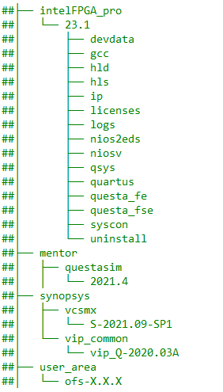
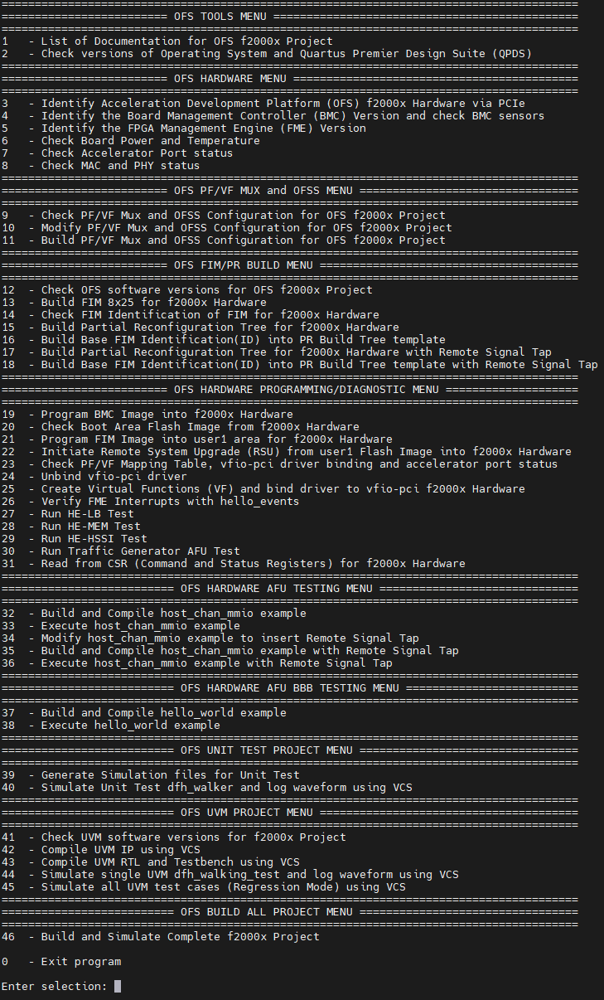
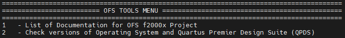
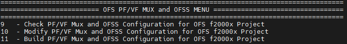
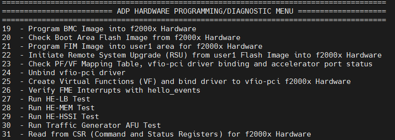
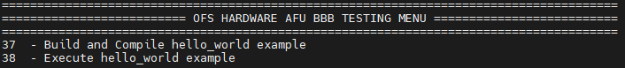
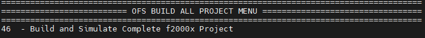
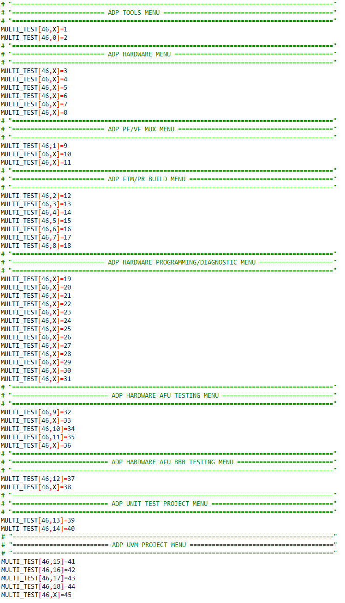
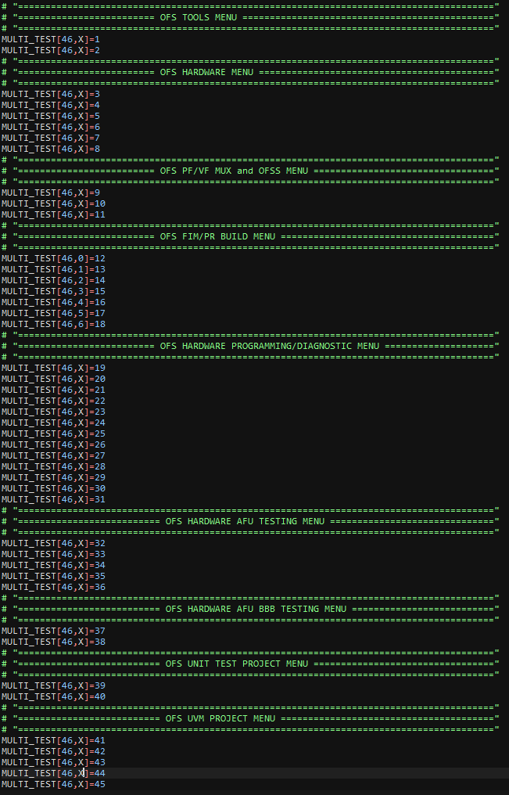

# Platform Evaluation Script: Open FPGA Stack for Intel Agilex 7 SoC Attach FPGAs

| Term       | Description                                                  |
| ---------- | ------------------------------------------------------------ |
| AER        | Advanced Error Reporting, The PCIe AER driver is the extended PCI Express error reporting capability providing more robust error reporting. |
| AFU        | Accelerator Functional Unit, Hardware Accelerator implemented in FPGA logic which offloads a computational operation for an application from the CPU to improve performance. Note: An AFU region is the part of the design where an AFU may reside. This AFU may or may not be a partial reconfiguration region |
| BBB        | Basic Building Block, Features within an AFU or part of an FPGA interface that can be reused across designs. These building blocks do not have stringent interface requirements like the FIM's AFU and host interface requires. All BBBs must have a (globally unique identifier) GUID. |
| BKC        | Best Known Configuration, The exact hardware configuration Intel has optimized and validated the solution against. |
| BMC        | Board Management Controller, Acts as the Root of Trust (RoT) on the Intel FPGA PAC platform. Supports features such as power sequence management and board monitoring through on-board sensors. |
| CSR        | Command/status registers (CSR) and software interface, OFS uses a defined set of CSR's to expose the functionality of the FPGA to the host software. |
| DFL        | Device Feature List, A concept inherited from OFS. The DFL drivers provide support for FPGA devices that are designed to support the Device Feature List. The DFL, which is implemented in RTL, consists of a self-describing data structure in PCI BAR space that allows the DFL driver to automatically load the drivers required for a given FPGA configuration. |
| FIM        | FPGA Interface Manager, Provides platform management, functionality, clocks, resets and standard interfaces to host and AFUs. The FIM resides in the static region of the FPGA and contains the FPGA Management Engine (FME) and I/O ring. |
| FME        | FPGA Management Engine, Provides a way to manage the platform and enable acceleration functions on the platform. |
| HEM        | Host Exerciser Module, Host exercisers are used to exercise and characterize the various host-FPGA interactions, including Memory Mapped Input/Output (MMIO), data transfer from host to FPGA, PR, host to FPGA memory, etc. |
| Intel VT-d | Intel Virtualization Technology for Directed I/O, Extension of the VT-x and VT-I processor virtualization technologies which adds new support for I/O device virtualization. |
| IOCTL      | Input/Output Control, System calls used to manipulate underlying device parameters of special files. |
| JTAG       | Joint Test Action Group, Refers to the IEEE 1149.1 JTAG standard; Another FPGA configuration methodology. |
| MMIO       | Memory Mapped Input/Output, Users may map and access both control registers and system memory buffers with accelerators. |
| OFS        | Open FPGA Stack, A modular collection of hardware platform components, open source software, and broad ecosystem support that provides a standard and scalable model for AFU and software developers to optimize and reuse their designs. |
| OPAE SDK   | Open Programmable Acceleration Engine Software Development Kit, A collection of libraries and tools to facilitate the development of software applications and accelerators using OPAE. |
| PAC        | Programmable Acceleration Card: FPGA based Accelerator card  |
| PIM        | Platform Interface Manager, An interface manager that comprises two components: a configurable platform specific interface for board developers and a collection of shims that AFU developers can use to handle clock crossing, response sorting, buffering and different protocols. |
| PR         | Partial Reconfiguration, The ability to dynamically reconfigure a portion of an FPGA while the remaining FPGA design continues to function. In the context of Intel FPGA PAC, a PR bitstream refers to an Intel FPGA PAC AFU. Refer to [Partial Reconfiguration](https://www.intel.com/content/www/us/en/programmable/products/design-software/fpga-design/quartus-prime/features/partial-reconfiguration.html) support page. |
| RSU        | Remote System Update, A Remote System Update operation sends an instruction to the Intel FPGA PAC D5005 device that triggers a power cycle of the card only, forcing reconfiguration. |
| SR-IOV     | Single-Root Input-Output Virtualization, Allows the isolation of PCI Express resources for manageability and performance. |
| TB         | Testbench, Testbench or Verification Environment is used to check the functional correctness of the Design Under Test (DUT) by generating and driving a predefined input sequence to a design, capturing the design output and comparing with-respect-to expected output. |
| UVM        | Universal Verification Methodology, A modular, reusable, and scalable testbench structure via an API framework. |
| VFIO       | Virtual Function Input/Output, An IOMMU/device agnostic framework for exposing direct device access to user space. |

## **1 Overview**


### **1.1 About this Document**


This document serves as a set-up and user guide for the checkout and evaluation of an Intel IPU Platform F2000X-PL development platform using Open FPGA Stack (OFS). After reviewing the document, you will be able to:

-   Set-up and modify the script to the your environment

-   Compile and simulate an OFS reference design

-   Run hardware and software tests to evaluate the complete OFS flow


#### **Table 1-2: Software Version Summary**

| Component | Version |  Description |
| --------- | ------- | -------|
| FPGA Platform | [Intel® Infrastructure Processing Unit (Intel® IPU) Platform F2000X-PL]()| Intel platform you can use for your custom board development |
| OFS FIM Source Code| [Branch: https://github.com/OFS/ofs-f2000x-pl](https://github.com/OFS/ofs-f2000x-pl), [Tag: ofs-2023.3-1](https://github.com/OFS/ofs-f2000x-pl/releases/tag/ofs-2023.3-1) | OFS Shell RTL for Intel Agilex 7 FPGA (targeting https://github.com/OFS/ofs-f2000x-pl) |
| OFS FIM Common| [Branch: https://github.com/OFS/ofs-fim-common/releases/tag/ofs-2023.3-2](https://github.com/OFS/ofs-fim-common), [Tag: https://github.com/OFS/ofs-fim-common/releases/tag/ofs-2023.3-2](https://github.com/OFS/ofs-fim-common/releases/tag/https://github.com/OFS/ofs-fim-common/releases/tag/ofs-2023.3-2) | Common RTL across all OFS-based platforms |
| AFU Examples| [Branch: examples-afu](https://github.com/OFS/examples-afu) , [Tag:ofs-examples-https://github.com/OFS/examples-afu/releases/tag/ofs-2023.3-2](https://github.com/OFS/examples-afu/releases/tag/https://github.com/OFS/examples-afu/releases/tag/ofs-2023.3-2) | Tutorials and simple examples for the Accelerator Functional Unit region (workload region)|
| OPAE SDK | [Branch: 2.10.0-1](https://github.com/OFS/opae-sdk/tree/2.10.0-1), [Tag: 2.10.0-1](https://github.com/OFS/opae-sdk/releases/tag/2.10.0-1) | Open Programmable Acceleration Engine Software Development Kit |
| Kernel Drivers | [Branch: ofs-2023.3-6.1-3](https://github.com/OFS/linux-dfl/tree/ofs-2023.3-6.1-3), [Tag: ofs-2023.3-6.1-3](https://github.com/OFS/linux-dfl/releases/tag/ofs-2023.3-6.1-3) | OFS specific kernel drivers|
| OPAE Simulation| [Branch: opae-sim](https://github.com/OFS/opae-sim), [Tag: 2.10.0-1](https://github.com/OFS/opae-sim/releases/tag/2.10.0-1) | Accelerator Simulation Environment for hardware/software co-simulation of your AFU (workload)|
| Intel Quartus Prime Pro Edition Design Software | 23.3 [Intel® Quartus® Prime Pro Edition Linux](https://www.intel.com/content/www/us/en/software-kit/782411/intel-quartus-prime-pro-edition-design-software-version-23-2-for-linux.html) | Software tool for Intel FPGA Development|
| Operating System | [Ubuntu 22.04](https://access.redhat.com/downloads/content/479/ver=/rhel---8/8.2/x86_64/product-software) |  Operating system on which this script has been tested |

A download page containing the release and already-compiled FIM binary artifacts that you can use for immediate evaluation on the Intel® Infrastructure Processing Unit (Intel® IPU) Platform F2000X-PL can be found on the [OFS ofs-2023.3-1](https://github.com/OFS/ofs-f2000x/releases/tag/ofs-2023.3-1) official release drop on GitHub.

<br>


| Term                      | Abbreviation | Description                                                  |
| :------------------------------------------------------------:| :------------:| ------------------------------------------------------------ |
|Advanced Error Reporting	|AER	|The PCIe AER driver is the extended PCI Express error reporting capability providing more robust error reporting. [(link)](https://docs.kernel.org/PCI/pcieaer-howto.html?highlight=aer)|
|Accelerator Functional Unit	|AFU	|Hardware Accelerator implemented in FPGA logic which offloads a computational operation for an application from the CPU to improve performance. Note: An AFU region is the part of the design where an AFU may reside. This AFU may or may not be a partial reconfiguration region.|
|Basic Building Block	|BBB|	Features within an AFU or part of an FPGA interface that can be reused across designs. These building blocks do not have stringent interface requirements like the FIM's AFU and host interface requires. All BBBs must have a (globally unique identifier) GUID.|
|Best Known Configuration	|BKC	|The software and hardware configuration Intel uses to verify the solution.|
|Board Management Controller|	BMC	|Supports features such as board power managment, flash management, configuration management, and board telemetry monitoring and protection. The majority of the BMC logic is in a separate component, such as an Intel® Max® 10 or Intel Cyclone® 10 device; a small portion of the BMC known as the PMCI resides in the main Agilex FPGA.
|Configuration and Status Register	|CSR	|The generic name for a register space which is accessed in order to interface with the module it resides in (e.g. AFU, BMC, various sub-systems and modules).|
|Data Parallel C++	|DPC++|	DPC++ is Intel’s implementation of the SYCL standard. It supports additional attributes and language extensions which ensure DCP++ (SYCL) is efficiently implanted on Intel hardware.
|Device Feature List	|DFL	| The DFL, which is implemented in RTL, consists of a self-describing data structure in PCI BAR space that allows the DFL driver to automatically load the drivers required for a given FPGA configuration. This concept is the foundation for the OFS software framework. [(link)](https://docs.kernel.org/fpga/dfl.html)|
|FPGA Interface Manager	|FIM|	Provides platform management, functionality, clocks, resets and standard interfaces to host and AFUs. The FIM resides in the static region of the FPGA and contains the FPGA Management Engine (FME) and I/O ring.|
|FPGA Management Engine	|FME	|Performs reconfiguration and other FPGA management functions. Each FPGA device only has one FME which is accessed through PF0.|
|Host Exerciser Module	|HEM	|Host exercisers are used to exercise and characterize the various host-FPGA interactions, including Memory Mapped Input/Output (MMIO), data transfer from host to FPGA, PR, host to FPGA memory, etc.|
|Input/Output Control|	IOCTL	|System calls used to manipulate underlying device parameters of special files.|
|Intel Virtualization Technology for Directed I/O	|Intel VT-d	|Extension of the VT-x and VT-I processor virtualization technologies which adds new support for I/O device virtualization.|
|Joint Test Action Group	|JTAG	| Refers to the IEEE 1149.1 JTAG standard; Another FPGA configuration methodology.|
|Memory Mapped Input/Output	|MMIO|	The memory space users may map and access both control registers and system memory buffers with accelerators.|
|oneAPI Accelerator Support Package	|oneAPI-asp	|A collection of hardware and software components that enable oneAPI kernel to communicate with oneAPI runtime and OFS shell components. oneAPI ASP hardware components and oneAPI kernel form the AFU region of a oneAPI system in OFS.|
|Open FPGA Stack	|OFS|	OFS is a software and hardware infrastructure providing an efficient approach to develop a custom FPGA-based platform or workload using an Intel, 3rd party, or custom board. |
|Open Programmable Acceleration Engine Software Development Kit|	OPAE SDK|	The OPAE SDK is a software framework for managing and accessing programmable accelerators (FPGAs). It consists of a collection of libraries and tools to facilitate the development of software applications and accelerators. The OPAE SDK resides exclusively in user-space.|
|Platform Interface Manager	|PIM|	An interface manager that comprises two components: a configurable platform specific interface for board developers and a collection of shims that AFU developers can use to handle clock crossing, response sorting, buffering and different protocols.|
|Platform Management Controller Interface|	PMCI|	The portion of the BMC that resides in the Agilex FPGA and allows the FPGA to communicate with the primary BMC component on the board.|
|Partial Reconfiguration	|PR	|The ability to dynamically reconfigure a portion of an FPGA while the remaining FPGA design continues to function. For OFS designs, the PR region is referred to as the pr_slot.|
|Port|	N/A	|When used in the context of the fpgainfo port command it represents the interfaces between the static FPGA fabric and the PR region containing the AFU.|
|Remote System Update|	RSU	|The process by which the host can remotely update images stored in flash through PCIe. This is done with the OPAE software command "fpgasupdate".|
|Secure Device Manager	|SDM|	The SDM is the point of entry to the FPGA for JTAG commands and interfaces, as well as for device configuration data (from flash, SD card, or through PCI Express* hard IP).|
|Static Region|	SR	|The portion of the FPGA design that cannot be dynamically reconfigured during run-time.|
|Single-Root Input-Output Virtualization|	SR-IOV	|Allows the isolation of PCI Express resources for manageability and performance.|
|SYCL	|SYCL|	SYCL (pronounced "sickle") is a royalty-free, cross-platform abstraction layer that enables code for heterogeneous and offload processors to be written using modern ISO C++ (at least C++ 17). It provides several features that make it well-suited for programming heterogeneous systems, allowing the same code to be used for CPUs, GPUs, FPGAs or any other hardware accelerator. SYCL was developed by the Khronos Group, a non-profit organization that develops open standards (including OpenCL) for graphics, compute, vision, and multimedia. SYCL is being used by a growing number of developers in a variety of industries, including automotive, aerospace, and consumer electronics.|
|Test Bench	|TB	|Testbench or Verification Environment is used to check the functional correctness of the Design Under Test (DUT) by generating and driving a predefined input sequence to a design, capturing the design output and comparing with-respect-to expected output.|
|Universal Verification Methodology	|UVM	|A modular, reusable, and scalable testbench structure via an API framework.  In the context of OFS, the UVM enviroment provides a system level simulation environment for your design.|
|Virtual Function Input/Output	|VFIO	|An Input-Output Memory Management Unit (IOMMU)/device agnostic framework for exposing direct device access to userspace. (link)|


## **2 Introduction to OFS Evaluation Script**


By following the setup steps and using the OFS evaluation script you can quickly evaluate many features that the OFS framework provides and also leverage this script for your own development.  

### **2.1 Pre-Requisites**

This script uses the following set of software tools which should be installed using the directory structure below. Tool versions can vary.

* Intel Quartus<sup>&reg;</sup> Prime Pro Software
* Synopsys<sup>&reg;</sup> VCS Simulator
* Siemens<sup>&reg;</sup> Questa<sup>&reg;</sup> Simulator

**Figure 2-1 Folder Hierarchy for Software Tools**



1. You must create a directory named "ofs-X.X.X" where the X represents the current release number, for example ofs-2023.3-1. 

2. You must clone the required OFS repositories as per Figure 2-2.  Please refer to the BKC table for locations. Please go [OFS Getting Started User Guide] for the instructions for the BKC installation.

3. Once the repositories are cloned, contact your intel representative to receive the eval script evaluation script (ofs_f2000x_eval.sh) and copy it to the ofs-2023.3-1 directory location as shown in the example below:

**Figure 2-2 Directory Structure for OFS Project**

```sh
## ofs-2023.3-1
##  -> examples-afu
##  -> linux-dfl
##  -> ofs-f2000x-pl
##  -> opae-sdk
##  -> opae-sim
##  -> ofs_f2000x_eval.sh
```

4. Contact your intel representative to receive the README file named (README_ofs-agx7-pcie-attach_eval.txt) and copy it to the ofs-2023.3-1 directory location. The README informs the user which sections to modify in the script prior to building the FIM and running hardware, software and simulation tests.

### **2.2 f2000x Evaluation Script modification**


To adapt this script to the user environment please follow the instructions below which explains which line numbers to change in the ofs_f2000x_eval.sh script 

### **User Directory Creation**

The user must create the top-level source directory and then clone the OFS repositories
    
    mkdir ofs-2023.3-1

In the example above we have used ofs-2023.3-1 as the directory name

### **Set-Up Proxy Server (lines 67-69)**

Please enter the location of your proxy server to allow access to external internet to build software packages.

Note: Failing to add proxy server will prevent cloning of repositories and the user will be unable to build the OFS framework.
    
    export http_proxy=<user_proxy>
    export https_proxy=<user_proxy>
    export no_proxy=<user_proxy>

### **License Files (lines 72-74)**

Please enter the the license file locations for the following tool variables

    export LM_LICENSE_FILE=<user_license>
    export DW_LICENSE_FILE=<user_license>
    export SNPSLMD_LICENSE_FILE=<user_license>

### **Tools Location (line 87, 88, 89, 90)**

Set Location of Quartus, Synopsys and Questasim

    export QUARTUS_TOOLS_LOCATION=/home
    export SYNOPSYS_TOOLS_LOCATION=/home
    export QUESTASIM_TOOLS_LOCATION=/home
    export ONEAPI_TOOLS_LOCATION=/opt

In the example above /home is used as the base location of Quartus, Synopsys and Questasim tools, /opt is used for the oneAPI tools

### **Quartus Tools Version (line 93)**

Set version of Quartus

    export QUARTUS_VERSION=23.3

In the example above "23.3" is used as the Quartus tools version

### **OPAE Tools (line 108)**

change OPAE SDK VERSION<br>

    export OPAE_SDK_VERSION=2.10.0-1

In the example above "2.10.0-1" is used as the OPAE SDK tools version

### **PCIe (Bus Number)**

The Bus number must be entered by the user after installing the hardware in the chosen server, in the example below "b1" is the Bus Number for a single card as defined in the evaluation script.

    export OFS_CARD0_BUS_NUMBER=b1

 The evaluation script uses the bus number as an identifier to interrogate the card. The command below will identify the accelerater card plugged into a server. 

    lspci | grep acc
    
    b1:00.0 Processing accelerators: Intel Corporation Device bcce (rev 01)


The result identifies the card as being assigned "b1" as the bus number so the entry in the script changes to

    export OFS_CARD0_BUS_NUMBER=b1

The user can also run the following command on the ofs_f2000x_eval.sh script to automatically change the bus number to b1 in the ofs_f2000x_eval.sh script.

grep -rli 'b1' * | xargs -i@ sed -i 'b1' @

if the bus number is 85 for example 

    85:00.0 Processing accelerators: Intel Corporation Device bcce (rev 01)

the command to change to 85 in the evaluation script would be

grep -rli 'b1' * | xargs -i@ sed -i '85' @

The ofs_f2000x_eval.sh script has now been modified to the server set-up and the user can proceed to build, compile and simulate the OFS stack

<br>

## **3 f2000x Evaluation Script**


### **3.1 Overview**


The figure below shows a snapshot of the full evaluation script menu showing all 62 options and each one one of 11 sub-menus which focus on different areas of evaluation. Each of these menu options are described in the next section.

**Figure 3-1 ofs_f2000x_eval.sh Evaluation Menu**



### **3.1.1 OFS TOOLS MENU**


By selecting "List of Documentation for OFS f2000x Project," a list of links to the latest OFS documentation appears. Note that these links will take you to documentation for the most recent release which may not correspond to the release version you are evaluating. To find the documentation specific to your release, ensure you clone the intel-ofs-docs tag that corresponds to your OFS version.

By selecting "Check Versions of Operating System and Quartus Premier Design Suite", the tool verifies correct Operating System, Quartus version, kernel parameters, license files and paths to installed software tools.



<table>
    <thead>
        <tr>
            <th>Menu Option</th>
            <th>Example Output</th>
        </tr>
    </thead>
    <tbody>
        <tr>
             <td>1 - List of Documentation for OFS f2000x Project</td>
            <td> Open FPGA Stack Overview<br>
                 Guides you through the setup and build steps to evaluate the OFS solution<br>
                https://ofs.github.io<br>
</td>        
        </tr>
        <tr>
            <td>2 - Check versions of Operating System and Quartus Premier Design Suite (QPDS)</td>
            <td>Checking Linux release<br>
                Linux version 5.15.92-dfl-66b0076c2c-lts (oe-user@oe-host) (x86_64-ese-linux-gcc (GCC) 11.3.0, GNU ld (GNU Binutils) 2.38.20220708) #1 SMP PREEMPT Wed Feb 8 21:21:27 UTC 2023<br>
                <br>
                Checking RedHat release<br>
                cat: /etc/redhat-release: No such file or directory<br>
                <br>
                Checking Ubuntu release<br>
                cat: /etc/lsb-release: No such file or directory<br>
                <br>
                Checking Kernel parameters<br>
                initrd=\microcode.cpio LABEL=Boot root=PARTUUID=2beb0add-07bf-4736-bc31-9b60e7b78375  rootfstype=ext4  console=ttyS5,115200 iomem=relaxed intel_iommu=on pci=realloc default_hugepagesz=1G hugepagesz=1G hugepages=4 rootwait console=ttyS0,115200 console=tty0<br>
                <br>
                Checking Licenses<br>
                LM_LICENSE_FILE is set to port@socket number:port@socket number<br>
                DW_LICENSE_FILE is set to port@socket number:port@socket number<br>
                SNPSLMD_LICENSE_FILE is set to port@socket number:port@socket number<br>
                <br>
                Checking Tool versions<br>
                QUARTUS_HOME is set to /home/intelFPGA_pro/23.3/quartus<br>
                QUARTUS_ROOTDIR is set to /home/intelFPGA_pro/23.3/quartus<br>
                IMPORT_IP_ROOTDIR is set to /home/intelFPGA_pro/23.3/quartus/../ip<br>
                QSYS_ROOTDIR is set to /home/intelFPGA_pro/23.3/quartus/../qsys/bin<br>
                <br>
                Checking QPDS Patches<br>
                Quartus Prime Shell<br>
                Version 23.3 Build XXX XX/XX/XXXX Patches X.XX SC Pro Edition<br>
                Copyright (C) XXXX  Intel Corporation. All rights reserved.<br>
                <br>
               </td>
        </tr>
</tr>
     </tbody>
</table>

### **3.1.2 OFS HARDWARE MENU**


Identifies card by PCIe number, checks power, temperature and current firmware configuration. 


<table>
    <thead>
        <tr>
            <th>Menu Option</th>
            <th>Example Output</th>
        </tr>
    </thead>
    <tbody>
        <tr>
            <td>3 - Identify Acceleration Development Platform (OFS) f2000x Hardware via PCIe</td>
            <td>PCIe card detected as<br>
                15:00.0 Processing accelerators: Intel Corporation Device bcce (rev 01)
                Host Server is connected to SINGLE card configuration<br>
                <br>
</td>        
        </tr>
        <tr>
            <td>4 - Identify the Board Management Controller (BMC) Version and check BMC sensors</td>
            <td>Intel IPU Platform F2000X-PL<br>
                Board Management Controller NIOS FW version: 1.1.9<br>
                Board Management Controller Build version: 1.1.9<br>
                //****** BMC SENSORS ******//<br>
                Object Id                        : 0xF000000<br>
                PCIe s:b:d.f                     : 0000:15:00.0<br>
                Vendor Id                        : 0x8086<br>
                Device Id                        : 0xBCCE<br>
                SubVendor Id                     : 0x8086<br>
                SubDevice Id                     : 0x17D4<br>
                Socket Id                        : 0x00<br>
                Ports Num                        : 01<br>
                Bitstream Id                     : 0x5010302EB5E4B14<br>
                Bitstream Version                : 5.0.1<br>
                Pr Interface Id                  : 3e46f208-8b49-5899-9e3d-b8b6a4d25a4e<br>
<br>
            <br>
        </tr>
</td>        
        </tr>
        <tr>
            <td>5 - Identify the FPGA Management Engine (FME) Version</td>
            <td>Intel IPU Platform F2000X-PL<br>
                Board Management Controller NIOS FW version: 1.1.9<br>
                Board Management Controller Build version: 1.1.9<br>
                //****** FME ******//<br>
                Object Id                        : 0xF000000<br>
                PCIe s:b:d.f                     : 0000:15:00.0<br>
                Vendor Id                        : 0x8086<br>
                Device Id                        : 0xBCCE<br>
                SubVendor Id                     : 0x8086<br>
                SubDevice Id                     : 0x17D4<br>
                Socket Id                        : 0x00<br>
                Ports Num                        : 01<br>
                Bitstream Id                     : 0x5010302EB5E4B14<br>
                Bitstream Version                : 5.0.1<br>
                Pr Interface Id                  : 3e46f208-8b49-5899-9e3d-b8b6a4d25a4e<br>
                Boot Page                        : user1<br>
                User1 Image Info                 : 9e3db8b6a4d25a4e3e46f2088b495899<br>
                User2 Image Info                 : 9e3db8b6a4d25a4e3e46f2088b495899<br>
                Factory Image Info               : None<br>
            <br>
        </tr>
</td>        
        </tr>
        <tr>       
            <td>6 - Check Board Power and Temperature</td>
            <td>Intel IPU Platform F2000X-PL<br>
                Board Management Controller NIOS FW version: 1.1.9<br>
                Board Management Controller Build version: 1.1.9<br>
                //****** POWER ******//<br>
                Object Id                        : 0xF000000<br>
                PCIe s:b:d.f                     : 0000:15:00.0<br>
                Vendor Id                        : 0x8086<br>
                Device Id                        : 0xBCCE<br>
                SubVendor Id                     : 0x8086<br>
                SubDevice Id                     : 0x17D4<br>
                Socket Id                        : 0x00<br>
                Ports Num                        : 01<br>
                Bitstream Id                     : 0x5010302EB5E4B14<br>
                Bitstream Version                : 5.0.1<br>
                Pr Interface Id                  : 3e46f208-8b49-5899-9e3d-b8b6a4d25a4e<br>
                ( 1) QSFP (Primary) Supply Rail Voltage                 : N/A<br>
                etc ......................<br>
            <br>
                Intel IPU Platform F2000X-PL<br>
                Board Management Controller NIOS FW version: 1.1.9<br>
                Board Management Controller Build version: 1.1.9<br>
                //****** TEMP ******//<br>
                Object Id                        : 0xF000000<br>
                PCIe s:b:d.f                     : 0000:15:00.0<br>
                Vendor Id                        : 0x8086<br>
                Device Id                        : 0xBCCE<br>
                SubVendor Id                     : 0x8086<br>
                SubDevice Id                     : 0x17D4<br>
                Socket Id                        : 0x00<br>
                Ports Num                        : 01<br>
                Bitstream Id                     : 0x5010302EB5E4B14<br>
                Bitstream Version                : 5.0.1<br>
                Pr Interface Id                  : 3e46f208-8b49-5899-9e3d-b8b6a4d25a4e<br>
                ( 1) FPGA FABRIC Remote Digital Temperature#3           : 33.00 Celsius<br>
                etc ......................<br>
            <br>
        </tr>
</td>        
        </tr>
        <tr>
            <td>7 - Check Accelerator Port status</td>
            <td>//****** PORT ******//<br>
                Object Id                        : 0xEF00000<br>
                PCIe s:b:d.f                     : 0000:15:00.0<br>
                Vendor Id                        : 0x8086<br>
                Device Id                        : 0xBCCE<br>
                SubVendor Id                     : 0x8086<br>
                SubDevice Id                     : 0x17D4<br>
                Socket Id                        : 0x00<br>
<br>
            <br>
        </tr>
</td>        
        </tr>
        <tr>
            <td>8 - Check MAC and PHY status</td>
            <td>Intel IPU Platform F2000X-PL<br>
                Board Management Controller NIOS FW version: 1.1.9<br>
                Board Management Controller Build version: 1.1.9<br>
                //****** MAC ******//<br>
                Object Id                        : 0xF000000<br>
                PCIe s:b:d.f                     : 0000:15:00.0<br>
                Vendor Id                        : 0x8086<br>
                Device Id                        : 0xBCCE<br>
                SubVendor Id                     : 0x8086<br>
                SubDevice Id                     : 0x17D4<br>
                Socket Id                        : 0x00<br>
                Ports Num                        : 01<br>
                Bitstream Id                     : 0x5010302EB5E4B14<br>
                Bitstream Version                : 5.0.1<br>
                Pr Interface Id                  : 3e46f208-8b49-5899-9e3d-b8b6a4d25a4e<br>
                Number of MACs                   : 255<br>
                mac info is not supported<br>
            <br>
                Intel IPU Platform F2000X-PL<br>
                Board Management Controller NIOS FW version: 1.1.9<br>
                Board Management Controller Build version: 1.1.9<br>
                //****** PHY ******//<br>
                Object Id                        : 0xF000000<br>
                PCIe s:b:d.f                     : 0000:15:00.0<br>
                Vendor Id                        : 0x8086<br>
                Device Id                        : 0xBCCE<br>
                SubVendor Id                     : 0x8086<br>
                SubDevice Id                     : 0x17D4<br>
                Socket Id                        : 0x00<br>
                Ports Num                        : 01<br>
                Bitstream Id                     : 0x5010302EB5E4B14<br>
                Bitstream Version                : 5.0.1<br>
                Pr Interface Id                  : 3e46f208-8b49-5899-9e3d-b8b6a4d25a4e<br>
                QSFP0                            : Connected<br>
                QSFP1                            : Connected<br>
            <br>
                //****** HSSI information ******//<br>
                HSSI version                     : 1.0<br>
                Number of ports                  : 8<br>
                Port0                            :25GbE        DOWN<br>
                Port1                            :25GbE        DOWN<br>
                Port2                            :25GbE        DOWN<br>
                Port3                            :25GbE        DOWN<br>
                Port4                            :25GbE        DOWN<br>
                Port5                            :25GbE        DOWN<br>
                Port6                            :25GbE        DOWN<br>
                Port7                            :25GbE        DOWN<br>
            <br>
        </tr>
</tr>
     </tbody>
</table>

### **3.1.3 OFS PF/VF MUX and OFSS MENU**


This menu reports the number of PF/VF functions in the reference example and also allows you to reduce the number to 1PF and 1VF to reduce resource utilisation and create larger area for your workload development. This selection is optional and if the user wants to implement the default number of PF's and VF's then option 9, 10 and 11 should not be used.  Additionally the code used to make the PF/VF modification can be leveraged to increase or modify the number of PF/VFs in the existing design within the limits that the PCIe Subsystem supports (8PF/2K VFs)



<table>
    <thead>
        <tr>
            <th>Menu Option</th>
            <th>Description</th>
        </tr>
    </thead>
    <tbody>
        <tr>
            <td>9 - Check PF/VF Mux and OFSS Configuration for OFS f2000x Project</td>
            <td> This menu selection displays the current configuration of all f2000x ofss files located in the following directory $OFS_ROOTDIR/tools/ofss_config<br>
            <br>
            
            Check f2000x base config OFSS set up
            [ip]
            type = ofs

            [settings]
            platform = f2000x
            fim = base_x16
            family = agilex
            part = AGFC023R25A2E2VR0
            device_id = 6100


            Check f2000x hssi_2x100 OFSS set up
            [ip]
            type = hssi

            [settings]
            output_name = hssi_ss
            num_channels = 2
            data_rate = 100GCAUI-4


            Check f2000x hssi_2x100_caui2 OFSS set up
            [ip]
            type = hssi

            [settings]
            output_name = hssi_ss
            num_channels = 2
            data_rate = 100GAUI-2


            Check f2000x hssi_8x10 OFSS set up
            [ip]
            type = hssi

            [settings]
            output_name = hssi_ss
            num_channels = 8
            data_rate = 10GbE

            Check f2000x hssi_8x25 OFSS set up
            [ip]
            type = hssi

            [settings]
            output_name = hssi_ss
            num_channels = 8
            data_rate = 25GbE


            Check f2000x IOPLL OFSS set up
            [ip]
            type = iopll

            [settings]
            output_name = sys_pll
            instance_name = iopll_0

            [p_clk]
            freq = 470

            Check f2000x Memory OFSS set up
            [ip]
            type = memory

            [settings]
            output_name = mem_ss_fm
            preset = f2000x

            Check f2000x PCIe Host OFSS set up
            [ip]
            type = pcie

            [settings]
            output_name = pcie_ss

            [pf0]
            bar0_address_width = 21

            [pf1]

            Check f2000x PCIe SoC OFSS set up
            [ip]
            type = pcie

            [settings]
            output_name = soc_pcie_ss

            [pf0]
            num_vfs = 3
            bar0_address_width = 21
            vf_bar0_address_width = 21
</td>        
        </tr>
        <tr>
            <td>10 - Modify PF/VF Mux and OFSS Configuration for OFS f2000x Project</td>
            <td>As an example this menu selection modifies the pcie_host.ofss and pcie_soc.ofss file to 1 PF located in the following directory $OFS_ROOTDIR/tools/ofss_config/pcie<br>
            This option also displays the the modified pcie_host.ofss and pcie_soc.ofss files<br>
            <br>
        </tr>
</td>        
        </tr>
        <tr>
            <td>11 - Build PF/VF Mux and OFSS Configuration for OFS f2000x Project</td>
            <td>If option 10 is not used then the default number of PF's and VF's is used to build the FIM, if option 10 is selected then only 1 VF is built to reduce logic utilisation<br>
            <br>
        </tr>
</tr>
     </tbody>
</table>


### **3.1.4 OFS FIM/PR BUILD MENU**


Builds FIM, Partial Reconfiguration Region and Remote Signal Tap


<table>
    <thead>
        <tr>
            <th>Menu Option</th>
            <th>Description</th>
        </tr>
    </thead>
    <tbody>
        <tr>
            <td>12 - Check OFS software versions for OFS f2000x Project</td>
            <td>OFS_ROOTDIR is set to /home/user_area/ofs-X.X.X/ofs-f2000x-pl<br>
                OPAE_SDK_REPO_BRANCH is set to release/X.X.X<br>
                OPAE_SDK_ROOT is set to /home/user_area/ofs-X.X.X/ofs-f2000x-pl/../opae-sdk<br>
                LD_LIBRARY_PATH is set to /home/user_area/ofs-X.X.X/ofs-f2000x-pl/../opae-sdk/lib64:<br>
<br>
            <br>
</td>        
        </tr>
        <tr>
            <td>13 - Build FIM for f2000x Hardware</td>
            <td>This option builds the FIM based on the setting for the $OFS_PLATFORM, $FIM_SHELL environment variable. Check this variable in the following file ofs_f2000x_eval.sh<br>
            <br>
        </tr>
</td>        
        </tr>
        <tr>
            <td>14 - Check FIM Identification of FIM for f2000x Hardware</td>
            <td>The FIM is identified by the following file fme-ifc-id.txt located at $OFS_ROOTDIR/$FIM_WORKDIR/syn/syn_top/<br>
            <br>
        </tr>
</td>        
        </tr>
        <tr>
            <td>15 - Build Partial Reconfiguration Tree for f2000x Hardware</td>
            <td>This option builds the Partial Reconfiguration Tree which is needed for AFU testing/development<br>
            <br>
        </tr>
</td>        
        </tr>
        <tr>
            <td>16 - Build Base FIM Identification(ID) into PR Build Tree template</td>
            <td>This option copies the contents of the fme-ifc-id.txt into the Partial Reconfiguration Tree to allow the FIM amd Partial Reconfiguration Tree to match and hence allow subsequent insertion of AFU workloads<br>
            <br>
        </tr>
</td>        
        </tr>
        <tr>
            <td>17 - Build Partial Reconfiguration Tree for f2000x Hardware with Remote Signal Tap</td>
            <td>This option builds the Partial Reconfiguration Tree which is needed for AFU testing/development for the Remote Signal Tap flow<br>
            <br>
        </tr>
</td>        
        </tr>
        <tr>
            <td>18 - Build Base FIM Identification(ID) into PR Build Tree template with Remote Signal Tap</td>
            <td>This option copies the contents of the fme-ifc-id.txt into the Partial Reconfiguration Tree for Remote Signal Tap to allow the FIM amd Partial Reconfiguration Tree to match and hence allow subsequent insertion of AFU workloads<br>
            <br>
        </tr>
</tr>
     </tbody>
</table>

### **3.1.5 OFS HARDWARE PROGRAMMING/DIAGNOSTIC MENU**


The following submenu allows you to:
* Program and check flash 
* Perform a remote system update (RSU) of the FPGA image into the FPGA
* Bind virtual functions to VFIO PCIe driver 
* Run host exerciser (HE) commands such as loopback to test interfaces VFIO PCI driver binding
* Read the control and status registers (CSRs) for bound modules that are part of the OFS reference design.



<table>
    <thead>
        <tr>
            <th>Menu Option</th>
            <th>Description</th>
        </tr>
    </thead>
    <tbody>
        <tr>
            <td>19 - Program BMC Image into f2000x Hardware</td>
            <td>The user must place a new BMC flash file in the following directory $OFS_ROOTDIR/bmc_flash_files. Once the user executes this option a new BMC image will be programmed. A remote system upgrade command is initiated to store the new BMC image<br>
            <br>
</td>        
        </tr>
        <tr>
            <td>20 - Check Boot Area Flash Image from f2000x Hardware</td>
            <td>This option checks which location area in FLASH the image will boot from, the default is user1<br>
            <br>
            Boot Page : user1<br>
            <br>
        </tr>
</td>        
        </tr>
        <tr>
            <td>21 - Program FIM Image into user1 area for f2000x Hardware</td>
            <td>This option programs the FIM image "ofs_top_page1_unsigned_user1.bin" into user1 area in flash<br>
            <br>
        </tr>
</td>        
        </tr>
        <tr>
            <td>22 - Initiate Remote System Upgrade (RSU) from user1 Flash Image into f2000x Hardware</td>
            <td>This option initiates a Remote System Upgrade and soft reboots the server and re-scans the PCIe bus for the new image to be loaded<br>
            <br>
            2022-11-10 11:26:24,307 - [[pci_address(0000:b1:00.0), pci_id(0x8086, 0xbcce)]] performing RSU operation<br>
            2022-11-10 11:26:24,310 - [[pci_address(0000:b0:02.0), pci_id(0x8086, 0x347a)]] removing device from PCIe bus<br>
            2022-11-10 11:26:24,357 - waiting 10 seconds for boot<br>
            2022-11-10 11:26:34,368 - rescanning PCIe bus: /sys/devices/pci0000:b0/pci_bus/0000:b0<br>
            2022-11-10 11:26:35,965 - RSU operation complete<br>
            <br>
        </tr>
</td>        
        </tr>
        <tr>
            <td>23 - Check PF/VF Mapping Table, vfio-pci driver binding and accelerator port status</td>
            <td>This option checks the current vfio-pci driver binding for the PF's and VF's<br>
            <br>
        </tr>
</td>        
        </tr>
        <tr>
            <td>24 - Unbind vfio-pci driver</td>
            <td>This option unbinds the vfio-pci driver for the PF's and VF's<br>
            <br>
        </tr>
</td>        
        </tr>
        <tr>
            <td>25 - Create Virtual Functions (VF) and bind driver to vfio-pci f2000x Hardware</td>
            <td>This option creates vfio-pci driver binding for the PF's and VF's<br>
            Once the VF's have been bound to the driver the user can select menu option 23 to check that the new drivers are bound<br>
            <br>
        </tr>
</td>        
        </tr>
        <tr>
            <td>26 - Verify FME Interrupts with hello_events</td>
            <td>The hello_events utility is used to verify FME interrupts. This tool injects FME errors and waits for error interrupts, then clears the errors<br>
            <br>
        </tr>
</td>        
        </tr>
        <tr>
            <td>27 - Run HE-LB Test</td>
            <td>This option runs 5 tests<br>
            <br>
            1) checks and generates traffic with the intention of exercising the path from the AFU to the Host at full bandwidth<br>
            2) run a loopback throughput test using one cacheline per request<br>
            3) run a loopback read test using four cachelines per request<br>
            4) run a loopback write test using four cachelines per request<br>
            5) run a loopback throughput test using four cachelines per request<br>
            <br>
        </tr>
</td>        
        </tr>
        <tr>
            <td>28 - Run HE-MEM Test</td>
            <td>This option runs 2 tests<br>
            <br>
            1) Checking and generating traffic with the intention of exercising the path from FPGA connected DDR; data read from the host is written to DDR, and the same data is read from DDR before sending it back to the host<br>
            2) run a loopback throughput test using one cacheline per request<br>
            <br>
        </tr>
</td>        
        </tr>
        <tr>
            <td>29 - Run HE-HSSI Test</td>
            <td>This option runs 1 test<br> 
            <br>
            HE-HSSI is responsible for handling client-side ethernet traffic. It wraps the 10G and 100G HSSI AFUs, and includes a traffic generator and checker. The user-space tool hssi exports a control interface to the HE-HSSI's AFU's packet generator logic<br>
            <br>
            1) Send traffic through the 10G AFU
            <br>
        </tr>
</td>        
        </tr>
        <tr>
            <td>30 - Run Traffic Generator AFU Test</td>
            <td>This option runs 3 tests<br> 
            <br>
            TG AFU has an OPAE application to access & exercise traffic, targeting a specific bank<br>
            <br>
            1) Run the preconfigured write/read traffic test on channel 0<br>
            2) Target channel 1 with a 1MB single-word write only test for 1000 iterations<br>
            3) Target channel 2 with 4MB write/read test of max burst length for 10 iterations<br>
        </tr>
</td>        
        </tr>
        <tr>
            <td>31 - Read from CSR (Command and Status Registers) for f2000x Hardware</td>
            <td>This option reads from the following CSR's<br>
            HE-LB Command and Status Register Default Definitions<br>
            HE-MEM Command and Status Register Default Definitions<br>
            HE-HSSI Command and Status Register Default Definitions<br>
            <br>
        </tr>
</tr>
     </tbody>
</table>

### **3.1.6  OFS HARDWARE AFU TESTING MENU**


This submenu tests partial reconfiguration by building and loading an memory-mapped I/O example AFU/workload, executes software from host, and tests remote signal tap.


<table>
    <thead>
        <tr>
            <th>Menu Option</th>
            <th>Description</th>
        </tr>
    </thead>
    <tbody>
        <tr>
            <td>32 - Build and Compile host_chan_mmio example</td>
            <td>This option builds the host_chan_mmio example from the following repo $OFS_PLATFORM_AFU_BBB/plat_if_tests/$AFU_TEST_NAME, where AFU_TEST_NAME=host_chan_mmio. This produces a GBS (Green Bit Stream) ready for hardware programming<br>
            <br>
</td>        
        </tr>
        <tr>
            <td>33 - Execute host_chan_mmio example</td>
            <td>This option builds the host code for host_chan_mmio example and programs the GBS file and then executes the test<br>
            <br>
        </tr>
</td>        
        </tr>
        <tr>
            <td>34 - Modify host_chan_mmio example to insert Remote Signal Tap</td>
            <td>This option inserts a pre-defined host_chan_mmio.stp Signal Tap file into the OFS code to allow a user to debug the host_chan_mmio AFU example<br>
            <br>
        </tr>
</td>        
        </tr>
        <tr>
            <td>35 - Build and Compile host_chan_mmio example with Remote Signal Tap</td>
            <td>This option builds the host_chan_mmio example from the following repo $OFS_PLATFORM_AFU_BBB/plat_if_tests/$AFU_TEST_NAME, where AFU_TEST_NAME=host_chan_mmio. This produces a GBS(Green Bit Stream) ready for hardware programming with Remote Signal tap enabled<br>
            <br>
        </tr>
</td>        
        </tr>
        <tr>
            <td>36 - Execute host_chan_mmio example with Remote Signal Tap</td>
            <td>This option builds the host code for host_chan_mmio example and programs the GBS file and then executes the test. The user must open the Signal Tap window when running the host code to see the transactions in the Signal tap window<br>
            <td><br>
            <br>
        </tr>
</tr>
     </tbody>
</table>

### **3.1.7 OFS HARDWARE AFU BBB TESTING MENU**


This submenu tests partial reconfiguration using a hello_world example AFU/workload, executes sw from host



<table>
    <thead>
        <tr>
            <th>Menu Option</th>
            <th>Description</th>
        </tr>
    </thead>
    <tbody>
        <tr>
            <td>37 - Build and Compile hello_world example</td>
            <td>This option builds the hello_ world example from the following repo $FPGA_BBB_CCI_SRC/samples/tutorial/afu_types/01_pim_ifc/$AFU_BBB_TEST_NAME, where AFU_BBB_NAME=hello_world. This produces a GBS(Green Bit Stream) ready for hardware programming<br>
            <br>
</td>        
        </tr>
        <tr>
            <td>38 - Execute hello_world example</td>
            <td>This option builds the host code for hello_world example and programs the GBS file and then executes the test<br>
            <br>
        </tr>
</tr>
     </tbody>
</table>


### **3.1.9 OFS UNIT TEST PROJECT MENU**


Builds, compiles and runs standalone simulation block tests. More unit test examples are found at the following location ofs-f2000x-pl/sim/unit_test 


<table>
    <thead>
        <tr>
            <th>Menu Option</th>
            <th>Result</th>
        </tr>
    </thead>
    <tbody>
        <tr>
            <td>39 - Generate Simulation files for Unit Test</td>
            <td>This option builds the simulation file set for running a unit test simulation<br>
            <br>
        </tr>
</td>        
        <tr>
            <td>40 - Simulate Unit Test dfh_walker and log waveform</td>
            <td>This option runs the dfh_walker based on the environment variable "UNIT_TEST_NAME=dfh_walker" in the evaluation script. A user can change the test being run by modifying this variable<br>
            <br>
        </tr>
</tr>
     </tbody>
</table>


### **3.1.10 OFS UVM PROJECT MENU**


Builds, compiles and runs full chip simulation tests. The user should execute the options sequentially ie 41,42, 43 and 44


<table>
    <thead>
        <tr>
            <th>Menu Option</th>
            <th>Description</th>
        </tr>
    </thead>
    <tbody>
        <tr>
            <td>41 - Check UVM software versions for f2000x Project</td>
            <td>DESIGNWARE_HOME is set to /home/synopsys/vip_common/vip_Q-2020.03A<br>
                UVM_HOME  is set to /home/synopsys/vcsmx/S-2021.09-SP1/linux64/rhel/etc/uvm<br>
                VCS_HOME is set to /home/synopsys/vcsmx/S-2021.09-SP1/linux64/rhel<br>
                VERDIR is set to /home/user_area/ofs-X.X.X/fim-f2000x-pl/verification<br>
                VIPDIR is set to /home/user_area/ofs-X.X.X/fim-f2000x-pl/verification<br>
            <br>
</td>        
        <tr>
            <td>42 - Compile UVM IP</td>
            <td>This option compiles the UVM IP <br>
            <br>
        <tr>
</td>        
        <tr>
            <td>43 - Compile UVM RTL and Testbench</td>
            <td>This option compiles the UVM RTL and Testbench<br>
            <br>
        <tr>
</td>        
        <tr>
            <td>44 - Simulate UVM dfh_walking_test and log waveform</td>
            <td>This option runs the dfh_walking test based on the environment variable "UVM_TEST_NAME=dfh_walking_test" in the evaluation script. A user can change the test being run by modifying this variable<br>
            <br>
        <tr>
            <td>45 - Simulate all UVM test cases (Regression Mode)</td>
            <td>This option runs the f2000x regression mode, cycling through all UVM tests defined in verification/tests/test_pkg.svh file<br>
            <br>
        <tr>
</tr>
     </tbody>
</table>

### **3.1.11 OFS BUILD ALL PROJECT MENU**


Builds the complete OFS flow, good for regression testing and overnight builds

For this menu a user can run a sequence of tests (compilation, build and simulation) and executes them sequentially. After the script is successfully executed, a set of binary files is produced which a you can use to evaluate your hardware. Log files are also produced which checks whether the tests passed.

A user can run a sequence of tests and execute them sequentially. In the example below when the user selects option 46 from the main menu the script will execute 24 tests ie (main menu options 2, 9, 12, 13, 14, 15, 16, 17, 18, 32, 34, 35, 37, 39, 40, 41, 42, 43 and 44. These 19 menu options are chosen to build the complete OFS flow covering build, compile and simulation.



<table>
    <thead>
        <tr>
            <th>Menu Option</th>
            <th>Result</th>
        </tr>
    </thead>
    <tbody>
        <tr>
            <td>46 - Build and Simulate Complete f2000x Project</td>
            <td>Generating Log File with date and timestamp<br>
                Log file written to /home/guest/ofs-2.3.1/log_files/f2000x_log_2022_11_10-093649/ofs_f2000x_eval.log<br>
            <br>
</tr>
     </tbody>
</table>

## **Definition of Multi-Test Set-up**

Menu Option 46 above in the evaluation script can be refined to tailor it to the users need and is principally defined by the variable below

MULTI_TEST[A,B]=C

where

A= Total Number of menu options in script<br>
B= Can be changed to a number to select the test order<br>
C= Menu Option in Script<br>

Example 1<br>
MULTI_TEST[46,0]=2

A= 46 is the total number of options in the script
B= 0 indicates that this is the first test to be run in the script
C= Menu option in Script ie 2- List of Documentation for OFS f2000x Project

Example 2<br>
MULTI_TEST[46,0]=2<br>
MULTI_TEST[46,1]=9<br>

In the example above two tests are run in order ie 0, and 1 and the following menu options are executed ie 2- List of Documentation for OFS f2000x Project and 9 - Check OFS software versions for OFS f2000x Project

The user can also modify the build time by de-selecting options they do not wish to use, see below for a couple of use-case scenarios.

## **Default User Case**

A user can run a sequence of tests and execute them sequentially. In the example below when the user selects option 46 from the main menu the script will execute 24 tests ie (main menu options 2, 9, 12, 13, 14, 15, 16, 17, 18, 32, 34, 35, 37, 39, 40, 41, 42, 43 and 44. All other tests with an "X" indicates do not run that test



## **User Case for OFS FIM/PR BUILD MENU**

In the example below when the user selects option 46 from the main menu the script will only run options from the OFS FIM/PR BUILD MENU (7 options, main menu options 12, 13, 14, 15, 16, 17 and 18). All other tests with an "X" indicates do not run that test.



<br>

## **4 f2000x Common Test Scenarios**


This section will describe the most common compile build scenarios if a user wanted to evaluate an acceleration card on their server. The Pre-requisite column indcates the menu comamnds that must be run befere executing the test eg To run Test 5 then a user needs to have run option 13, 15 and 16 before running options 23, 24, 25, 32 and 33.

<table>
    <thead>
        <tr>
            <th>Test</th>
            <th>Test Scenario</th>
            <th>Pre-Requisite Menu Option</th>
            <th>Menu Option</th>
        </tr>
    </thead>
    <tbody>
        <tr>
            <tr>
            <td>Test 1</td>
            <td>FIM Build</td>
            <td>-<br>
            <td>13<br>
            <br>
        <tr>
            <tr>
            <td>Test 2</td>
            <td>Partial Reconfiguration Build</td>
            <td>13<br>
            <td>15, 16<br>
            <br>
        <tr>
            <tr>
            <td>Test 3</td>
            <td>Program FIM and perform Remote System Upgrade</td>
            <td>13<br>
            <td>21, 22<br>
            <br>
        <tr>
            <tr>
            <td>Test 4</td>
            <td>Bind PF and VF to vfio-pci drivers</td>
            <td>-<br>
            <td>23, 24, 25<br>
            <br>
        <tr>
            <tr>
            <td>Test 5</td>
            <td>Build, compile and test AFU on hardware</td>
            <td>13, 15, 16<br>
            <td>23, 24, 25, 32, 33<br>
            <br>
        <tr>
            <tr>
            <td>Test 6</td>
            <td>Build, compile and test AFU Basic Building Blocks on hardware</td>
            <td>13, 15, 16<br>
            <td>23, 24, 25, 37, 38<br>
            <br>
        <tr>
            <tr>
            <td>Test 7</td>
            <td>Build and Simulate Unit Tests</td>
            <td>-<br>
            <td>39, 40<br>
            <br>
        <tr>
            <tr>
            <td>Test 8</td>
            <td>Build and Simulate UVM Tests</td>
            <td>-<br>
            <td>42, 43, 44, 45<br>
            <br>
        <tr>
</tr>
     </tbody>
</table>

## Notices & Disclaimers

Intel<sup>&reg;</sup> technologies may require enabled hardware, software or service activation.
No product or component can be absolutely secure. 
Performance varies by use, configuration and other factors.
Your costs and results may vary. 
You may not use or facilitate the use of this document in connection with any infringement or other legal analysis concerning Intel products described herein. You agree to grant Intel a non-exclusive, royalty-free license to any patent claim thereafter drafted which includes subject matter disclosed herein.
No license (express or implied, by estoppel or otherwise) to any intellectual property rights is granted by this document, with the sole exception that you may publish an unmodified copy. You may create software implementations based on this document and in compliance with the foregoing that are intended to execute on the Intel product(s) referenced in this document. No rights are granted to create modifications or derivatives of this document.
The products described may contain design defects or errors known as errata which may cause the product to deviate from published specifications.  Current characterized errata are available on request.
Intel disclaims all express and implied warranties, including without limitation, the implied warranties of merchantability, fitness for a particular purpose, and non-infringement, as well as any warranty arising from course of performance, course of dealing, or usage in trade.
You are responsible for safety of the overall system, including compliance with applicable safety-related requirements or standards. 
<sup>&copy;</sup> Intel Corporation.  Intel, the Intel logo, and other Intel marks are trademarks of Intel Corporation or its subsidiaries.  Other names and brands may be claimed as the property of others. 

OpenCL and the OpenCL logo are trademarks of Apple Inc. used by permission of the Khronos Group™. 
 
