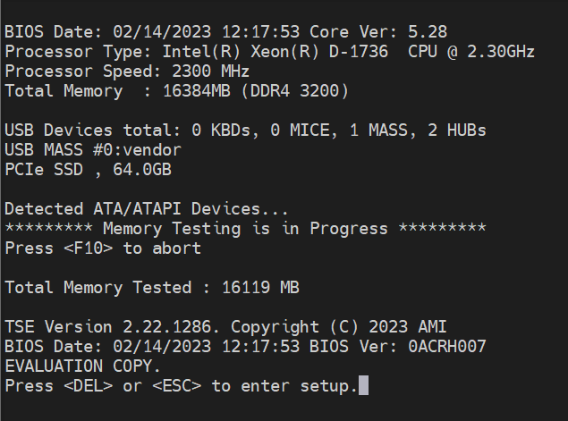

# OFS Getting Started Guide for Intel Agilex SoC Attach FPGAs 

Last updated: Last updated: **May 27, 2023** 

## Notices & Disclaimers

Intel<sup>&reg;</sup> technologies may require enabled hardware, software or service activation.
No product or component can be absolutely secure.
Performance varies by use, configuration and other factors.
Your costs and results may vary.
You may not use or facilitate the use of this document in connection with any infringement or other legal analysis concerning Intel products described herein. You agree to grant Intel a non-exclusive, royalty-free license to any patent claim thereafter drafted which includes subject matter disclosed herein.
No license (express or implied, by estoppel or otherwise) to any intellectual property rights is granted by this document, with the sole exception that you may publish an unmodified copy. You may create software implementations based on this document and in compliance with the foregoing that are intended to execute on the Intel product(s) referenced in this document. No rights are granted to create modifications or derivatives of this document.
The products described may contain design defects or errors known as errata which may cause the product to deviate from published specifications.  Current characterized errata are available on request.
Intel disclaims all express and implied warranties, including without limitation, the implied warranties of merchantability, fitness for a particular purpose, and non-infringement, as well as any warranty arising from course of performance, course of dealing, or usage in trade.
You are responsible for the safety of the overall system, including compliance with applicable safety-related requirements or standards. 
<sup>&copy;</sup> Intel Corporation.  Intel, the Intel logo, and other Intel marks are trademarks of Intel Corporation or its subsidiaries.  Other names and brands may be claimed as the property of others.
OpenCL and the OpenCL logo are trademarks of Apple Inc. used by permission of the Khronos Group™. 


## 1.0 About this Document

The purpose of this document is to help users get started in evaluating the 2023.1 version of the SoC Attach release targeting the Intel® Infrastructure Processing Unit (Intel® IPU) Platform F2000X-PL. After reviewing this document, a user shall be able to:

- Set up their server environment according to the Best Known Configuration (BKC)
- Build a Yocto image with the OPAE SDK and Linux DFL Drivers included
- Load and verify firmware targeting the SR and PR regions of the board, the BMC, the option ROM, and the ICX-D SoC NVMe and BIOS
- Verify full stack functionality offered by the SoC Attach OFS solution
- Know where to find additional information on other SoC Attach ingredients

### 1.1 Audience

The information in this document is intended for customers evaluating the Intel IPU Platform F2000X-PL platform. The card is an acceleration development platform (ADP) intended to be used as a starting point for evaluation and development. This document will cover key topics related to initial bring up and development of the Intel IPU Platform F2000X-PL SoC Attach platform, with links for deeper dives on the topics discussed therein.

#### Table 1: Terminology

Glossary 
== 

| Term       | Description                                                  |
| ---------- | ------------------------------------------------------------ |
| AER        | Advanced Error Reporting, The PCIe AER driver is the extended PCI Express error reporting capability providing more robust error reporting. |
| AFU        | Accelerator Functional Unit, Hardware Accelerator implemented in FPGA logic which offloads a computational operation for an application from the CPU to improve performance. Note: An AFU region is the part of the design where an AFU may reside. This AFU may or may not be a partial reconfiguration region |
| BBB        | Basic Building Block, Features within an AFU or part of an FPGA interface that can be reused across designs. These building blocks do not have stringent interface requirements like the FIM's AFU and host interface requires. All BBBs must have a (globally unique identifier) GUID. |
| BKC        | Best Known Configuration, The exact hardware configuration Intel has optimized and validated the solution against. |
| BMC        | Board Management Controller, Acts as the Root of Trust (RoT) on the Intel FPGA PAC platform. Supports features such as power sequence management and board monitoring through on-board sensors. |
| CSR        | Command/status registers (CSR) and software interface, OFS uses a defined set of CSR's to expose the functionality of the FPGA to the host software. |
| DFL        | Device Feature List, A concept inherited from OFS. The DFL drivers provide support for FPGA devices that are designed to support the Device Feature List. The DFL, which is implemented in RTL, consists of a self-describing data structure in PCI BAR space that allows the DFL driver to automatically load the drivers required for a given FPGA configuration. |
| FIM        | FPGA Interface Manager, Provides platform management, functionality, clocks, resets and standard interfaces to host and AFUs. The FIM resides in the static region of the FPGA and contains the FPGA Management Engine (FME) and I/O ring. |
| FME        | FPGA Management Engine, Provides a way to manage the platform and enable acceleration functions on the platform. |
| HEM        | Host Exerciser Module, Host exercisers are used to exercise and characterize the various host-FPGA interactions, including Memory Mapped Input/Output (MMIO), data transfer from host to FPGA, PR, host to FPGA memory, etc. |
| Intel VT-d | Intel Virtualization Technology for Directed I/O, Extension of the VT-x and VT-I processor virtualization technologies which adds new support for I/O device virtualization. |
| IOCTL      | Input/Output Control, System calls used to manipulate underlying device parameters of special files. |
| JTAG       | Joint Test Action Group, Refers to the IEEE 1149.1 JTAG standard; Another FPGA configuration methodology. |
| MMIO       | Memory Mapped Input/Output, Users may map and access both control registers and system memory buffers with accelerators. |
| OFS        | Open FPGA Stack, A modular collection of hardware platform components, open source software, and broad ecosystem support that provides a standard and scalable model for AFU and software developers to optimize and reuse their designs. |
| OPAE SDK   | Open Programmable Acceleration Engine Software Development Kit, A collection of libraries and tools to facilitate the development of software applications and accelerators using OPAE. |
| PAC        | Programmable Acceleration Card: FPGA based Accelerator card  |
| PIM        | Platform Interface Manager, An interface manager that comprises two components: a configurable platform specific interface for board developers and a collection of shims that AFU developers can use to handle clock crossing, response sorting, buffering and different protocols. |
| PR         | Partial Reconfiguration, The ability to dynamically reconfigure a portion of an FPGA while the remaining FPGA design continues to function. In the context of Intel FPGA PAC, a PR bitstream refers to an Intel FPGA PAC AFU. Refer to [Partial Reconfiguration](https://www.intel.com/content/www/us/en/programmable/products/design-software/fpga-design/quartus-prime/features/partial-reconfiguration.html) support page. |
| RSU        | Remote System Update, A Remote System Update operation sends an instruction to the Intel FPGA PAC D5005 device that triggers a power cycle of the card only, forcing reconfiguration. |
| SR-IOV     | Single-Root Input-Output Virtualization, Allows the isolation of PCI Express resources for manageability and performance. |
| TB         | Testbench, Testbench or Verification Environment is used to check the functional correctness of the Design Under Test (DUT) by generating and driving a predefined input sequence to a design, capturing the design output and comparing with-respect-to expected output. |
| UVM        | Universal Verification Methodology, A modular, reusable, and scalable testbench structure via an API framework. |
| VFIO       | Virtual Function Input/Output, An IOMMU/device agnostic framework for exposing direct device access to user space. |


#### Table 2: Related Documentation
| Name| Location|
| -----| -----|
| Release Notes| [link](../../f2000x/)|
| Evaluation User Guide| [link](../../f2000x/)|
| FIM Technical Reference Manual| [link](../../f2000x/)|
| Software Reference Manual| [link](../../f2000x/)|
| FIM Developer Guide| [link](../../f2000x/)|
| AFU Developer Guide| [link](../../f2000x/)|
| Security User Guide| [link](../../f2000x/)|
| BMC User Guide| [link](../../f2000x/)|
| Virtual Machine User Guide| [link](../../f2000x/)|
| Docker User Guide| [link](../../f2000x/)|

#### Table 3: Related Repositories

| Name| Location|
| -----| -----|
| Intel-FPGA-BBB | https://github.com/OPAE/intel-fpga-bbb.git |
| OFS-PLATFORM-AFU-BBB| https://github.com/OFS/ofs-platform-afu-bbb.git, tag: ofs-2023.1-1 |
| AFU-EXAMPLES| https://github.com/OFS/examples-afu.git, tag: ofs-2023.1-1|
| OneAPI-ASP| https://github.com/OFS/oneapi-asp, tag: ofs-2023.1-1|
| OPAE-SDK| https://github.com/OFS/opae-sdk.git, tag: 2.5.0-3 |
| LINUX-DFL| https://github.com/OFS/linux-dfl.git, tag: ofs-2023.1-6.1-1|
| META-OFS| https://github.com/OFS/meta-ofs, tag: ofs-2023.1-4|

#### Table 4: Software and Firmware Component Version Summary for SoC Attach

| Component| Version| Download link (where applicable)|
| -----| -----| -----|
| Available FIM Version(s)|PR Interface ID: bf2a9e1a-b05d-5130-b47c-776055c0d67e |[TBD](https://github.com/OFS/ofs-f2000x-pl/releases/tag/ofs-2023.1-1) |
| Host Operating System| Ubuntu 22.04| [Official Release Page](https://ubuntu.com/download/desktop)|
| Host OPAE SDK| 2.5.0-3| https://github.com/OFS/opae-sdk/releases/tag/2.5.0-3|
| Host Linux DFL| ofs-2023.1-6.1-1| https://github.com/OFS/linux-dfl/releases/tag/ofs-2023.1-6.1-1|
| SoC OS | meta-intel-ese Reference Distro 1.0-ESE (kirkstone)| [TBD](https://github.com/OFS/ofs-f2000x-pl/releases/tag/ofs-2023.1-1)|
| SoC Kernel Version| 5.15.92-dfl-66b0076c2c-lts| [TBD](https://github.com/OFS/ofs-f2000x-pl/releases/tag/ofs-2023.1-1)|
| SoC OPAE SDK| 2.5.0-3| https://github.com/OFS/opae-sdk/releases/tag/2.5.0-3|
| SoC Linux DFL| ofs-2023.1-6.1-1| https://github.com/OFS/linux-dfl/releases/tag/ofs-2023.1-6.1-1|
| SoC BMC and RTL| 1.1.9| [TBD](https://github.com/OFS/ofs-f2000x-pl/releases/tag/ofs-2023.1-1)|
| SoC BIOS| 0ACRH608_REL| [TBD](https://github.com/OFS/ofs-f2000x-pl/releases/tag/ofs-2023.1-1)|

Not all components shown in Table 4 will have an update available upon release. The OPAE SDK and Linux DFL software stacks are incorporated into a Yocto image and do not need to be downloaded separately. Updates required for the 2023.1 OFS SoC Attach Release for Intel IPU Platform F2000X-PL are shown under Table 9 in section *2.0 Updating the Intel IPU Platform F2000X-PL*.

## 1.2 Server Requirements

The following requirements must be met when purchasing a server to support the Intel IPU Platform F2000X-PL platform.

### 1.2.1 Host Server Specifications

The host server must meet the following minimal specifications:

- The server platform must contain at least 64GiB of RAM to run unmodified OVS demos, and to compile the Yocto or FIM images
- If using the server platform to build a Yocto image, it is recommended to have at least 200 GB of free storage space

### 1.2.2 Host BIOS

The host server BIOS must support the following features:

- PCIe slot width must be **x16** or **auto**
- PCIe slot speed must be **Gen3/4** or **auto**
- PCIe slot must have **iommu** enabled
- Intel VT for Directed I/O (VT-d) must be **enabled**
- PCIe Volume Management for the riser and PCIe slot in which the F200x-PL card is installed must be **disabled**

Specific BIOS paths are not listed here, as they can differ between BIOS vendors and versions.

### 1.2.3 Host Server Kernel and GRUB Configuration

While many host Linux kernel and OS distributions may work with this design, only the following configuration(s) have been tested:

- Ubuntu 22.04, 5.15-lts

## 1.3 Server Forced Air Cooling

The Intel IPU Platform F2000X-PL is a high-performance processing card with a
passive heat sink to dissipate device heat and must be installed
in a server with sufficient forced airflow cooling to keep all devices
operating below maximum temperature. The table below lists the
thermal terms and descriptions used the thermal analysis.

#### Table 5: Thermal Terms and Descriptions

| **Term**                    | **Description**                       |
| ---                         |  ---                                  |
| Cubic Feet per Minute (CFM) | Volumetric airflow rate, in cubic feet per minute, of air passing through faceplate. |
| T<sub>j</sub>                        | FPGA Junction Temperature             |
| T<sub>LA</sub>                       | Local Ambient temperature. Temperature of forced air as it enters the Intel IPU Platform F2000X-PL. &nbsp; **Note:** In many systems, this is higher than the room ambient due to  heating effects of chassis components.  |

**Note:** The FPGA junction temperature must not exceed 100°C. The case
temperature of the QSFP modules must meet the module vendor's
specification.

**Note:** The table below provides the thermal targets for which the Intel IPU Platform F2000X-PL
was designed. As a card manufacturer, you must
qualify your own production cards.

The maximum card inlet air temperatures must support continuous
operation under the worst-case power scenario of 150W TDP.

The airflow requirements for optimal heat sink performance at minimum is
characteristic of CAT 3 servers or PCIe SIG Level 7 thermal profiles, in
both, forward & reverse flow, see figure below:

 

As the Intel IPU Platform F2000X-PL is a development platform, it is not
integrated into the server baseband management controller closed loop
cooling control. It is strongly recommended that you set your server's
fan settings to run constantly at 100% with the server chassis lid closed to prevent unwanted Intel IPU Platform F2000X-PL thermal shutdown.

## 1.4 External Connections

Figure 1 External Connections


The items listed Table in are known to work for external connectivity. Specific links are given for convenience, other products may be used but have not been tested.

#### Table 6: External Connection Cables

| **Item** | **Part Number** | **Link to source** |
| --- | --- | --- |
| RS-232 to USB Adapter | DTECH FTDI USB to TTL Serial Adapter, 3 m | [USB to TTL Serial](https://www.amazon.com/gp/product/B08BLJ9NFF/ref=ppx_yo_dt_b_search_asin_title?ie=UTF8&psc=1) |
| USB to Ethernet Adapter, Aluminum 3 Port USB 3.0 |   Teknet |                                                      [USB Hub with Ethernet adapter](https://www.amazon.com/TeckNet-Aluminum-Converter-Ultrabooks-Notebooks/dp/B0178HOTOU/ref=sxin_16_ac_d_mf_brs?ac_md=1-0-VEVDS05FVA%3D%3D-ac_d_mf_brs_brs&content-id=amzn1.sym.37d5b521-1d59-436f-8d1e-f9aa8f2d7ab6%3Aamzn1.sym.37d5b521-1d) |
|Flash Drive, 64 GB or larger     |                  SanDisk                     | |                                     
|QSFP DAC Cable             |                         FS.com Generic 2m 100G QSP28 Passive Direct Attach Copper |  [QSFP28 DAC](https://www.fs.com/products/74661.html?attribute=10134&id=197229)|
|(optional) Intel FPGA Download Cable II            |           PL-USB2-BLASTER                  |                            [USB-Blaster II](https://www.intel.com/content/www/us/en/products/sku/215664/intel-fpga-download-cable-ii/specifications.html)|

## 1.5 Preparing the Intel IPU Platform F2000X-PL for Installation

Turn the board over to back side and remove the Kapton tape covering
switches SW1 and SW2 and make sure the switches are set as shown in
*Figure 1*.

#### Table 7: Switch Settings

| Name | Value|
| ----- | ----- |
| SW3.1| off|
| SW3.2| off|
| SW3.2| on|
| SW3.2| off|
| SW2| off|

#### Figure 1: Board Switch Settings


### 1.5.1 USB to Serial Adapter

The Intel IPU Platform F2000X-PL has a serial UART for access located on
back edge of the board. This connection is useful for making BIOS and
boot settings and for monitoring the SoC. In most servers, you will need
to remove a riser card and route the USB to serial cable and (optional) Intel FPGA
USB Blaster through an unused PCIe slot above or below where the IPU is
installed. See *Figure 2* for an example of cable routing.

#### Figure 2: Cable Routing


The USB to serial connection is shown in *Figure 3* where the White wire
is TXD, Black wire is ground and Green wire is RXD.

#### Figure 7: USB to Serial Adapter connection


### 1.5.2 IPU JTAG

The Intel IPU Platform F2000X-PL provides a 10 pin JTAG header for FPGA and
Cyclone 10 Board Management Controller development work using a [Intel
FPGA Download Cable
II](https://www.intel.com/content/www/us/en/products/sku/215664/intel-fpga-download-cable-ii/specifications.html).
This JTAG connection is optional for initial bring-up but is useful for manual image reprogramming and debug. See *Figure 4* noting the orientation of the connection. The
orientation of the USB Blaster II requires careful installation in a PCIe bay that
has additional room in the adjacent bay. This may require you to either install the board over the PSU of the server, or to temporarily remove an adjacent
riser while programming.

#### Figure 4: USB Blaster II Connection


#### Figure 5: USB Blaster II Installation


### 1.5.3 Power

The Intel IPU Platform F2000X-PL must receive power from both the 12 V and 3.3V
PCIe slot and the 12 V Auxiliary 2×4 power connector. The board does not power up if any of the 12 V and 3.3 V PCIe slot,
or 12 V Auxiliary power sources are disconnected.

PCIe specifications define 12 V Auxiliary power connector pin
assignment. The Intel IPU Platform F2000X-PL implements an 8-position right
angle (R/A) through-hole PCB header assembly on the top right side of
the board as depicted in the picture below.

#### Figure 6: 12V PCIe AUX Connector Location


Refer the table below for pinout details.

#### Table 8: 12V (2x3) AUX Connector Pin Out

| Pin |   Description |
| --- | --- |
|  1  |     +12V |
|  2  |     +12V |
|  3  |     +12V |
|  4  |     Sense 1 |
|  5  |     Ground |
|  6  |     Sense 0 |
|  7  |     Ground |
|  8  |     Ground |

See Auxiliary power connection in *Figure 7*.

#### Figure 7: Auxiliary Power Connection


### 1.5.4 USB Hub Connection

The USB Hub is connected to the USB type A connector on the front panel.
Additionally, attach a network connected Ethernet connection to the USB
hub. See *Figure 8*.

#### Figure 8 USB Hub Connection


### 1.5.5 Creating a Bootable USB Flash Drive for the SoC

Connect your flash drive to an available Linux host. In this section the USB will set up to be used as a secondary boot source for the SoC and will also be used to update the NVMe from which the ICX-D SoC boots in section *2.1 Updating the F200X-PL ICX-D SoC NVMe*.

You will load the latest pre-compiled Yocto `core-image-minimal` WIC image into USB flash. This image can be downloaded from
[TBD](https://github.com/OFS/ofs-f2000x-pl/releases/tag/ofs-2023.1-1) or compiled from [meta-ofs](https://github.com/OFS/meta-ofs/releases/tag/ofs-2023.1-2). Compilation is discussed in section *4.0 Compiling a Custom Yocto SoC Image*.

1. Insert a 64 GB or larger USB Flash Drive into the USB slot of a computer/server you can use to format the drive. The following instructions assume you are using some flavor of GNU+Linux. You need sudo access privileges on this machine.

2. In a terminal window, find the device name of the USB flash drive and unmount the device:

```bash session
$ lsblk

NAME MAJ:MIN RM SIZE RO TYPE MOUNTPOINT
sda 8:0 0 1.8T 0 disk
├─sda1 8:1 0 600M 0 part /boot/efi
├─sda2 8:2 0 1G 0 part /boot
└─sda3 8:3 0 1.8T 0 part
├─rhel-root 253:0 0 50G 0 lvm /
├─rhel-swap 253:1 0 4G 0 lvm \[SWAP\]
└─rhel-home 253:6 0 1.7T 0 lvm /home
sdb 8:16 0 447.1G 0 disk
├─sdb1 8:17 0 600M 0 part
├─sdb2 8:18 0 1G 0 part
└─sdb3 8:19 0 445.5G 0 part
├─fedora_localhost\--live-swap 253:2 0 4G 0 lvm
├─fedora_localhost\--live-home 253:3 0 301G 0 lvm
├─fedora_localhost\--live-root 253:4 0 70G 0 lvm
└─fedora_localhost\--live-centos_root 253:5 0 70.5G 0 lvm
sdd 8:48 1 57.3G 0 disk
└─sdd1 8:49 1 57.3G 0 part
```

In the above example, the 64 GB USB Flash device is designated `sdd`. Note, your device file name may be different. You are looking for an entry that matches the size of
your USB Flash. You can also check the output of `dmesg` after manually plugging in your USB Flash device to view the name the kernel has given it in an auto-generated event.

3. Unmount the USB flash (if not already unmounted).

```bash session
$ sudo umount /dev/sdd1
umount: /dev/sdd1: not mounted.
```

4. Download the Yocto WIC image to the Linux computer.

```bash session
$ wget https://github.com/OFS/meta-ofs/archive/refs/tags/ofs-2023.1-4.tar.gz
$ tar xf meta-ofs-${{ env.F2000X_META_OFS_TAG_WITHOUT_OFS }}.tar.gz
# Verify the checksum of the downloaded image
sha256sum -c core-image-full-cmdline-intel-corei7-64-20230428022313.rootfs.wic.gz.sha256
# Uncompress the package
$ gzip -d core-image-full-cmdline-intel-corei7-64-20230428022313.rootfs.wic.gz
```

5. Copy core-image-full-cmdline-intel-corei7-64-20230428022313.rootfs.wic to the USB flash. This process may take several minutes.

```bash session
$ sudo dd if=core-image-full-cmdline-intel-corei7-64-20230428022313.rootfs.wic of=/dev/sdd1 bs=512k status=progress conv=sync
$ sgdisk -e /dev/sdd
```

6. Create a partition to store the Yocto image, which will be used to overwrite on-board NVMe as the default boot target.

```bash session
	$ sudo fdisk /dev/sdd
	Command (m for help): p
	Command (m for help): n
	Partition number (4-128, default 4): <<press enter>>
	First sector (14617908-125045390, default 14618624): <<press enter>>
	Last sector, +/-sectors or +/-size{K,M,G,T,P} (14618624-125045390, default
	125045390): <<press enter>>
	Created a new partition 4 of type 'Linux filesystem' and of size 92 GiB.
	Command (m for help): p
Command (m for help): w
```

7. Verify USB flash is partitioned.

```bash session
$ lsblk
	NAME        MAJ:MIN RM   SIZE RO TYPE MOUNTPOINTS
	sdd           8:0    1 114.6G  0 disk
	|-sdd1        8:1    1   300M  0 part
	|-sdd2        8:2    1  22.1G  0 part
	|-sdd3        8:3    1    44M  0 part
	`-sdd4        8:4    1  92.2G  0 part
```

8. Format the new partition.

```bash session
$ mkfs -t ext4 /dev/sdd4
$ mount /dev/sda4 /mnt
```

9. Copy compressed `core-image-minimal` WIC into /mnt.

```bash session
$ cp core-image-full-cmdline-intel-corei7-64-20230428022313.rootfs.wic.gz /mnt
```

Remove the USB flash from the Linux computer and install the flash drive in the USB hub attached to the Intel IPU Platform F2000X-PL.

## 2.0 Updating the Intel IPU Platform F2000X-PL

Every Intel IPU Platform F2000X-PL ships with pre-programmed firmware for the FPGA *user1*, *user2*, and *factory* images, the Cyclone 10 *BMC RTL and FW*, the *SoC NVMe*, and the *SoC BIOS*. The combination of FW images in *Table 4* compose the official 2023.1 OFS SoC Attach Release for Intel IPU Platform F2000X-PL. Upon initial receipt of the board from manufacturing you will need to update two of these regions of flash to conform with the best known configuration for SoC Attach.  As shown in Table 9, not all devices require firmware updates. To instruct users in the process of updating on-board Intel IPU Platform F2000X-PL firmware, examples are provided in this guide illustrating the firmware update process for all devices.  

#### Table 9: Intel IPU Platform F2000X-PL FW Components

| HW Component| File Name | Version | Update Required (Yes/No) |Download Location|
| ----- | ----- | ----- | ----- | ----- |
| FPGA SR Image<sup>1</sup> | user1: ofs_top_page1_unsigned_user1.bin<br>user2: ofs_top_page2_unsigned_user2.bin<br>factory: ofs_top_page0_unsigned_factory.bin |PR Interface ID: bf2a9e1a-b05d-5130-b47c-776055c0d67e | Yes| [TBD](https://github.com/OFS/ofs-f2000x-pl/releases/tag/ofs-2023.1-1)|
| FPGA PR IMAGE<sup>2</sup>| ofs_pr_afu.green_region_unsigned.gbs | N/A | Yes | Compiled with FIM|
| ICX-D NVMe | core-image-full-cmdline-intel-corei7-64-20230428022313.rootfs.wic| N/A | Yes | [TBD](https://github.com/OFS/ofs-f2000x-pl/releases/tag/ofs-2023.1-1)|
| BMC RTL and FW | AC_BMC_RSU_user_retail_1.1.9_unsigned.rsu| 1.1.9| No | [TBD](https://github.com/OFS/ofs-f2000x-pl/releases/tag/ofs-2023.1-1)|
| Option ROM | N/A | N/A| No | [TBD](https://github.com/OFS/ofs-f2000x-pl/releases/tag/ofs-2023.1-1) |
| BIOS Version | 0ACRH608_REL.BIN | 0ACRH608_REL| Yes| [TBD](https://github.com/OFS/ofs-f2000x-pl/releases/tag/ofs-2023.1-1)|

If a component does not have a required update, it will not have an entry on [TBD](https://github.com/OFS/ofs-f2000x-pl/releases/tag/ofs-2023.1-1).

<sup>1</sup>To check the PR Interface ID of the currently programmed FIM and the BMC RTL and FW version, use `fpgainfo fme` from the SoC.
<sup>2</sup>Must be programmed if using AFU-enabled exercisers, not required otherwise.

```bash session
$ fpgainfo fme
Intel IPU Platform F2000X-PL
**Board Management Controller NIOS FW version: 1.1.9**
**Board Management Controller Build version: 1.1.9**
//****** FME ******//
Object Id                        : 0xEF00000
PCIe s:b:d.f                     : 0000:15:00.0
Vendor Id                        : 0x8086
Device Id                        : 0xBCCE
SubVendor Id                     : 0x8086
SubDevice Id                     : 0x17D4
Socket Id                        : 0x00
Ports Num                        : 01
**Bitstream Id                     : 360572756236924878**
Bitstream Version                : 5.0.1
**Pr Interface Id                  : bf2a9e1a-b05d-5130-b47c-776055c0d67e**
Boot Page                        : user1
User1 Image Info                 : 9e3db8b6a4d25a4e3e46f2088b495899
User2 Image Info                 : None
Factory Image Info               : None
```

## 2.1 Updating the F200X-PL ICX-D SoC NVMe

The Intel IPU Platform F2000X-PL ships with an OSC Yocto image pre-programmed in NVMe, which is not the same as the SoC Attach OFS image that we will be using. The latter provides only the OPAE SDK and Linux DFL drivers and is fully open source. This section will show how you can use an attached USB drive to load a new image into flash. You will use a serial terminal to install the new image - Minicom and PuTTy terminal emulators have both been tested. `minicom` is used for demonstration purposes as the serial terminal to access the ICX-D SoC UART connection in this section. Information on compiling your own Yocto image for use with the Intel IPU Platform F2000X-PL is discussed in section *4.0 Compiling a Custom Yocto SoC Image*.

**Note:** Username and password for the default SoC NVMe boot image are "root" and "root@123".

1. First, make sure to complete the steps in section *1.5.5 Creating a Bootable USB Flash Drive for the SoC*, and attach the USB drive either directly into the rear of the Intel IPU Platform F2000X-PL, or into a USB Hub that itself is connected to the board.

2. Ensure your Minicom terminal settings match those shown below. You must direct Minicom to the USB device created in `/dev` associated with your RS-232 to USB Adapter cable. This cable must be attached to a server that is *separate* from the one housing your Intel IPU Platform F2000X-PL. Check the server logs in `dmesg` to figure out which device is associated with your cable: `[    7.637291] usb 1-4: FTDI USB Serial Device converter now attached to ttyUSB0`. In this example the special character file `/dev/ttyUSB0` is associated with our cable, and can be connected to using the following command: `sudo minicom --color=on -D /dev/ttyUSB0`.


3. Change the SoC boot order to boot from USB first. Reboot the server. From your
    serial Minicom terminal, watch your screen and
    press \'ESC\' key to go into BIOS setup mode. Once BIOS setup comes
    up as shown below, click the right arrow key six times to move from
    \'Main\' set up menu to \'Boot\' setup:

 Main setup menu:


 Your order of boot devices may differ. You need to move the USB flash
 up to Boot Option \#1 by first using the down arrow key to highlight
 the USB device then use \'+\' key to move the USB device to \#1 as
 shown below:


 Press \'F4\' to save and exit.

4. You will boot into Yocto automatically. Log in with username `root` and an empty password using Minicom. Take note of the IP address of the board, you can use this to log in without needing the serial cable.

 

Verify that you have booted from the USB and not the on-board NVMe `lsblk -no pkname $(findmnt -n / | awk '{ print $2 }')`. You should see a device matching `/dev/sd*`, and *not* `nvme*n*p*`. If you do, then review the previous steps.

Record the IP address of the SoC at this time `ip -4 addr`. This will be used to log in remotely using SSH.

5. Check that 4 partitions created in section 1.5.5 are visible to the SoC in /dev/sd*:

```bash session
$ lsblk -l
root@intel-corei7-64:/mnt# lsblk -l
NAME      MAJ:MIN RM   SIZE RO TYPE MOUNTPOINTS
sda         8:0    1 117.2G  0 disk
sda1        8:1    1  38.5M  0 part /boot
sda2        8:2    1    20G  0 part /
sda3        8:3    1    44M  0 part [SWAP]
sda4        8:4    1  97.1G  0 part /mnt
nvme0n1   259:0    0  59.6G  0 disk
nvme0n1p1 259:1    0   300M  0 part
nvme0n1p2 259:2    0  22.1G  0 part
nvme0n1p3 259:3    0    44M  0 part
```

Mount partition 4, and `cd` into it.

```bash session
$ mount /dev/sda4 /mnt`
$ cd /mnt
```

6. Uncomporess and install the Yocto release image in the SoC NVMe.

```bash session
$ zcat core-image-full-cmdline-intel-corei7-64-20230428022313.rootfs.wic
$ dd if=core-image-full-cmdline-intel-corei7-64-20230428022313.rootfs.wic of=/dev/nvme0n1 bs=1M status=progress conv=sync
$ sync
$ sgdisk -e /dev/nvme0n1
```

The transfer from USB to NVMe will take several minutes.

7. Reboot the SoC and update the SoC BIOS to boot from NVMe. Follow steps 2 and 3 from this section again, and this time move the NVME back to the front of the boot order. The NVMe is named `UEFI OS (PCIe SSD)` by the BIOS. Press F4 to save and exit.

You can use `wget` to retrieve a new version of the Yocto release image from [meta-ofs](https://github.com/OFS/meta-ofs/releases/tag/ofs-2023.1-2 once the SoC's network connection is up. Use `wget` to copy the image to the SoC over the network under `/mnt`. You may need to delete previous Yocto images to save on space: `$ wget --no-check-certificate --user <Git username> --ask-password https://github.com/OFS/meta-ofs/releases/download/ofs-2023.1-2/core-image-full-cmdline-intel-corei7-64-20230428022313.rootfs.wic.gz`. Uncompress the newly retrieved file: `gzip -d core-image-full-cmdline-intel-corei7-64-20230428022313.rootfs.wic.gz`. This may take several minutes.

### 2.1.1 Setting the Time

1. Use Linux command to set system time using format: `date --set="STRING"`.

```bash session
date -s "26 APRIL 2023 18:00:00"
```

2. Set HWCLOCK to current system time:

```bash session
hwclock --systohc
```

Verify time is set properly

```bash session
date
...
hwclock --show
...
```

## 3.0 Updating the Intel IPU Platform F2000X-PL

### 3.1 Preparing the Intel IPU Platform F2000X-PL SoC for Updates

Updating the Intel IPU Platform F2000X-PL firmware often requires reboots of the SoC or reconfiguration of the FPGA region. If there are processes connected from the host to the SoC that do not expect the downtime to occur, or if the host is not tolerant to a surprise PCie link down, the following instructions can be used to properly orchestrate updates with the host when reboots occur.

1. Shut down all VMs and software applications attached to any PFs/VFs on the host
2. Issue the command `pci_device unplug <<PCIe BDF>>` on the host to remove the PCIe device from the PCIe bus
3. Shut down all software applications on the SoC accessing non-management PFs/VFs (ex. ovs_dpdk)
4. Issue the command on the SoC which will cause an SoC reboot or surprise PCIe link down on the host (ex. `reboot`, `rsu bmc/bmcimg/fpga`)
5. Once you have completed all firmware updates, you may restart application software on the SoC
6. Issue command `pci_device plug` on the host to rescan the PCIe bus and rebind the device to its native driver
7. Restart software applications on the host

### 3.2 Updating FIM, BMC, AFU, and Option ROM with `fpgasupdate`

The `fpgasupdate` tool updates the Intel<sup>&reg;</sup> Max 10 BMC image and firmware, root entry hash, FPGA Static Region (SR), user image (PR) and option ROM. The `fpgasupdate` will only accept images that have been formatted using PACSign. If a root entry hash has been programmed onto the board, then the image will also need to be signed using the correct keys. Please refer to the [Security User Guide](../../f2000x/) for information on creating signed images and on programming and managing the root entry hash. The `fpgasupdate` tool updates loads images into flash memory, to program FPGA/BMC or switch between user1 vs user2 images use the `RSU` tool. All images received from an official Intel release will be "unsigned", as described in the [Security User Guide](../../f2000x/).

There are two regions of flash the user may store FIM images for general usage, and one backup region. These locations are referred to as **user1**, **user2**, and **factory**. The factory, user1, and user2 regions are not programmed by default. The BMC FW and RTL will come pre-programmed with version 1.1.9.

Updating the FIM from the SoC requires the SoC be running a Yocto image that includes the OPAE SDK and Linux DFL drivers. You need to transfer any update files to the SoC over SSH. The OPAE SDK utility `fpgasupdate` will be used to update the board's firmware. This utility will accept files of the form \*.rsu, \*.bin, and \*.gbs, provided the proper security data blocks have been prepended by PACSign. The default configuration the IPU platform ships with will match the below:

```bash session
$ fpgainfo fme
Intel IPU Platform F2000X-PL
**Board Management Controller NIOS FW version: 1.1.9**
**Board Management Controller Build version: 1.1.9**
//****** FME ******//
Object Id                        : 0xEF00000
PCIe s:b:d.f                     : 0000:15:00.0
Vendor Id                        : 0x8086
Device Id                        : 0xBCCE
SubVendor Id                     : 0x8086
SubDevice Id                     : 0x17D4
Socket Id                        : 0x00
Ports Num                        : 01
**Bitstream Id                     : 360572756236924878**
Bitstream Version                : 5.0.1
**Pr Interface Id                  : bf2a9e1a-b05d-5130-b47c-776055c0d67e**
Boot Page                        : user1
User1 Image Info                 : 9e3db8b6a4d25a4e3e46f2088b495899
User2 Image Info                 : None
Factory Image Info               : None
```

To load a new update image, you need to pass the IPU's PCIe BDF and the file name to `fpgasupdate` on the SoC. The below example will update the user1 image in flash:

```bash session
$ fpgasupdate ofs_top_page1_unsigned_user1.bin 15:00.0
```

After loading an update image, `rsu fpga/bmc/bmcimg` can be used to reload the firmware and apply the change, as discussed below. An RSU of the BMC will always cause a reload of both the BMC and FPGA images.

### 3.3 Loading images with `rsu`

 RSU performs a **R**emote **S**ystem **U**pdate operation on an Intel IPU Platform F2000X-PL, given its PCIe address. An `rsu` operation sends an instruction to the device to trigger a power cycle of the card only if run with `bmcimg`. `rsu` will force reconfiguration from flash for either the BMC or FPGA. PCIe Advanced Error Reporting (AER) is temporarily disabled for the card when RSU is in progress

The Intel IPU Platform F2000X-PL contains two regions of flash the user may store FIM images. These locations are referred to as **user1** and **user2**. After an image has been programmed with fpgasupdate in either of these regions the user may choose to perform a rsu to switch. This operation will indicate to the BMC which region to configure the FPGA device from after power-on.

If the factory image has been updated, Intel strongly recommends the user to immediately RSU to the factory image to ensure the image is functional.

The user can determine which region of flash was used to configure their FPGA device using the command `fpgainfo fme` and looking at the row labelled **Boot Page**.

When loading a new FPGA SR image, use the command `rsu fpga`. When loading a new BMC image, use the command `rsu bmc`. RSU can also swap between the **user1**, **user2**, and **factory** partitions in flash. An RSU operation sends an instruction to the device to trigger a power cycle of the card only. This will force reconfiguration from flash for either BMC, SDM, (on devices that support these) or the FPGA.

```bash session
$ rsu fpga --page=user1 15:00.0
```

Synopsis:

```bash session
rsu bmc --page=(user|factory) [PCIE_ADDR]
rsu fpga --page=(user1|user2|factory) [PCIE_ADDR]
rsu sdm [PCIE_ADDR]
```

You can use RSU to change which page in memory the FPGA will boot from by default.

Synopsis:

```bash session
rsu fpgadefault --page=(user1|user2|factory) --fallback=<csv> 15:00.0
```

Use to set the default FPGA boot sequence. The `--page` option determines the primary FPGA boot image. The `--fallback` option allows a comma-separated list of values to specify fallback images.

### 3.4 Updating the ICX-D SoC BIOS

The ICX-D SoC NVMe comes pre-programmed with BIOS v7 (0ACRH007). This version will need to be replaced with 0ACRH608_REL. BIOS update files come in the form 0ACRH\<\<version\>\>.bin, and can be downloaded on [TBD](https://github.com/OFS/ofs-f2000x-pl/releases/tag/ofs-2023.1-1). This update process in in-band, and requires the user to download and install a BIOS UEFI utility from AMI called "APTIO V AMI Firmware Update Utility", available [here](https://www.ami.com/bios-uefi-utilities/#aptiov). This package will install a utility in the UEFI shell called AfuEfix64.efi which will be used to overwrite the ICX-D BIOS.

1. Check your BIOS Version. Reboot the SoC and wait for the BIOS version to be shown. In this example, the BIOS will need to be updated.



2. Download both the ICX-D SoC Update image and [APTIO V AMI Firmware Update Utility](https://www.ami.com/bios-uefi-utilities/#aptiov). Unzip the BIOS update image and locate your BIOS update binary. Unzip Aptio_V_AMI_Firmware_Update_Utility.zip, and then navigate to Aptio_V_AMI_Firmware_Update_Utility\afu\afuefi\64 and unzip AfuEfi64.zip. The file we need from this package is called AfuEfix64.efi.


3. Copy both files over to the SoC into /boot/EFI using the SoC's IP.

```bash session
$ scp 0ACRH608_REL.BIN root@XX.XX.XX.XX:/boot/EFI
$ scp AfuEfix64.efi root@XX.XX.XX.XX:/boot/EFI
```

4. Reboot the SoC from a TTY Serial terminal. Watch your screen and press \'ESC\' key to go into BIOS setup mode. Select 'Built-in EFI Shell'.


5. At EFI prompt enter the following:

```bash session
Shell> FS0:
FS0:> cd EFI
FS0:\EFI\> AfuEfix64.efi 0ACRH608_REL.BIN /p /n /b
```

Press 'E'. When the update has completed type 'reset -w' to reboot.


6. Watch your screen and press \'ESC\' key to go into BIOS setup mode. Verify BIOS version matches expectation.

~[](./images/correctbios_Version.png)

7. Click the right arrow key six times to move from \'Main\' set up menu to \'Boot\' setup. Select NVMe as the primary boot source.

~[](./images/post_bios_update_nvme.png)

## 4.0 Compiling a Custom Yocto SoC Image

Current Yocto image architecture for SoC Attach is based off of the [IOTG Yoct-based ESE BSP](https://github.com/intel/iotg-yocto-ese-manifest) and substitutes the [Linux DFL kernel](https://github.com/OFS/linux-dfl) including the [latest DFL drivers for FPGA devices](https://docs.kernel.org/fpga/dfl.html) along with the [OPAE SDK](https://github.com/OFS/opae-sdk) user space. The image targets x86_64 SoC FPGA devices but should boot on most UEFI-based machines. The source code and documentation for this image is hosted on the [meta-ofs](https://github.com/OFS/meta-ofs
) repository.

Build requirements exceed 100 GiB of disk space, depending on which image is built. As a reference point, on a system with two Intel(R) Xeon(R) E5-2699 v4 for a total of 44 CPU cores, the initial, non-incremental build takes less than an hour of wall time.

The `repo` tool is needed to clone the various Yocto layer repositories used in this example.

**Note:** If you are behind a firewall that prevents you from accessing references using the git:// protocol, you can use the following to redirect Git to use the corresponding https repositories for Yocto only: `git config --global url.https://git.yoctoproject.org/.insteadOf git://git.yoctoproject.org/`

To compile the image as-is, use the following steps (as provided in meta-ofs):

1. Create and initialize the source directory.

```bash session
mkdir ofs-yocto && cd ofs-yocto
repo init -m examples/iotg-yocto-ese/manifest.xml https://github.com/OFS/meta-ofs
```

2. Fetch repositories and update the working tree.

```bash session
repo sync -j 16
```

3. Build packages and create an image.

```bash session
cd build
. ../intel-embedded-system-enabling/oe-init-build-env .
bitbake mc:x86-2021-minimal:core-image-full-cmdline
```

The resulting GPT disk image is available in uncompressed (.wic) and compressed form (.wic.gz) in `build/tmp-x86-2021-minimal-glibc/deploy/images/intel-corei7-64/`. With no changes the uncompressed image size is ~21 GB.

The image type [core-image-full-cmdline](https://docs.yoctoproject.org/ref-manual/images.html) includes the familiar GNU core utilities, as opposed to core-image-minimal which uses BusyBox instead.

The example build configuration files under build/conf/ are symlinked from [examples/iotg-yocto-ese/](https://github.com/OFS/meta-ofs/tree/main/examples/iotg-yocto-ese). To customise the image, start by modifying [local.conf](https://github.com/OFS/meta-ofs/tree/main/examples/iotg-yocto-ese/local.conf) and [bblayers.conf](https://github.com/OFS/meta-ofs/tree/main/examples/iotg-yocto-ese/bblayers.conf).

The uncompressed Yocto image can be loaded onto a flash drive as discussed in section *1.5.5 Creating a Bootable USB Flash Drive for the SoC* and written to NVMe as the default boot target for the SoC as demonstrated in section *2.1 Updating the F200X-PL ICX-D SoC NVMe*.

## 5.0 Verifying the ICX-D SoC OPAE SDK and DFL Drivers

The reference SoC Attach FIM and unaltered FIM compilations contain Host Exerciser Modules (HEMs). These are used to exercise and characterize the various host-FPGA interactions, including Memory Mapped Input/Output (MMIO), data transfer from host to FPGA, PR, host to FPGA memory, etc. Full supported functionality of the HEMs is documented in the [host_exerciser](https://opae.github.io/latest/docs/fpga_tools/host_exerciser/host_exerciser.html) opae.io GitHub page. SoC Attach supports HEMs run both with and without an AFU image programmed into the board's one supported PR region. This image is available on the offial [SoC Attach GitHub Page](${{ F2000X_GITHUB_RELEASE_PAGE_NAME }}), and is programmed using `fpgasupdate` as shown in section 3.2. A few select examples run from the SoC and their expected results will be shown below.

### 5.1 Checking Telemetry with `fpgainfo`

The `fpgainfo` utility displays FPGA information derived from sysfs files.

Displays FPGA information derived from sysfs files. The command argument is one of the following: `errors`, `power`, `temp`, `port`, `fme`, `bmc`, `phy`, `mac`, and `security`. Some commands may also have other arguments or options that control their behavior.

For systems with multiple FPGA devices, you can specify the BDF to limit the output to the FPGA resource with the corresponding PCIe configuration. If not specified, information displays for all resources for the given command.

An example output for `fpgainfo fme` is shown below. Your IDs may not match what is shown here:

```bash session
$ fpgainfo fme
Intel IPU Platform F2000X-PL
Board Management Controller NIOS FW version: 1.1.9
Board Management Controller Build version: 1.1.9
//****** FME ******//
Object Id                        : 0xEF00000
PCIe s:b:d.f                     : 0000:15:00.0
Vendor Id                        : 0x8086
Device Id                        : 0xBCCE
SubVendor Id                     : 0x8086
SubDevice Id                     : 0x17D4
Socket Id                        : 0x00
Ports Num                        : 01
Bitstream Id                     : 0x50103023DFBFC8E
Bitstream Version                : 5.0.1
Pr Interface Id                  : bf74e494-ad12-5509-98ab-4105d27979f3
Boot Page                        : user1
User1 Image Info                 : 98ab4105d27979f3bf74e494ad125509
User2 Image Info                 : None
Factory Image Info               : None
```

### 5.2 Host Exercisers

Of these six test listed below, the first three do not require an AFU be loaded into the board's PR region. They exercise data paths that pass exclusively through the FIM. The latter three tests exercise data through the AFU data path, and require [SoC Attach release AFU Image](https://github.com/OFS/ofs-f2000x-pl/releases/tag/ofs-2023.1-1) to be configured using `fpgasupdate`.

1. Run HE-MEM with 2 cachelines per request in `mem` mode, exercising the FPGA's connection to DDR. No AFU required.

**Note**: If you see the error message `Allocate SRC Buffer, Test mem(1): FAIL`, then you may need to manually allocate 2MiB Hugepages using the following: echo 20 > `/sys/kernel/mm/hugepages/hugepages-2048kB/nr_hugepages`

```bash session
# Create VF device
$ pci_device <PCIe Bus>00.0 vf 3
# Bind VF0 to vfio-pci
$ opaei.io init -d <PCIe Bus>:00.1 <username>:<username>
# Check for HE-MEM Accelerator GUID 8568ab4e-6ba5-4616-bb65-2a578330a8eb
$ fpgainfo port -B <PCIe Bus>:00.0
# Run desired HE-MEM test(s)
$ host_exerciser --cls cl_1 --mode lpbk mem
starting test run, count of 1
API version: 2
AFU clock: 470 MHz
Allocate SRC Buffer
Allocate DST Buffer
Allocate DSM Buffer
    Host Exerciser Performance Counter:
    Host Exerciser numReads: 1024
    Host Exerciser numWrites: 1025
    Host Exerciser numPendReads: 0
    Host Exerciser numPendWrites: 0
    Host Exerciser numPendEmifReads: 0
    Host Exerciser numPendEmifWrites: 0
    Number of clocks: 9948
    Total number of Reads sent: 1024
    Total number of Writes sent: 1024
    Bandwidth: 3.096 GB/s
    Test mem(1): PASS
```

2. Generate traffic with HE-HSSI. No AFU required.

```bash session
# Create VF device
$ pci_device <PCIe Bus>00.0 vf 3
# Bind VF2 to vfio-pci
$ opaei.io init -d <PCIe Bus>:00.2 <username>:<username>
# Check for HE-HSSI Accelerator GUID 823c334c-98bf-11ea-bb37-0242ac130002
$ fpgainfo port -B <PCIe Bus>:00.0
# Show number of configured ports
$ fpgainfo phy | grep Port
# Generate traffic for specific port number
$ hssi --pci-address <PCIe Bus>:00.2 hssi_10g --num-packets 100 --port <port number>
10G loopback test
  Tx/Rx port: 1
  Tx port: 1
  Rx port: 1
  eth_loopback: on
  he_loopback: none
  num_packets: 100
  packet_length: 64
  src_address: 11:22:33:44:55:66
    (bits): 0x665544332211
  dest_address: 77:88:99:aa:bb:cc
    (bits): 0xccbbaa998877
  random_length: fixed
  random_payload: incremental
...
```

This command will generate a log file in the directory is was run from. Check TxPackets and RxPackets for any loss. Two more supported HSSI commands are `hssistats`, which provides MAC statistics, and `hssimac`, which provides maximum TX and RX frame size.

3. Test memory traffic generation using MEM-TG. This will exercise and test available memory channels with a configurable memory pattern. Does not require an AFU image.

```bash session
# Create VF device
$ pci_device <PCIe Bus>00.0 vf 3
# Bind VF2 to vfio-pci
$ opaei.io init -d <PCIe Bus>:00.3 <username>:<username>
# Check for MEM-TG Accelerator GUID 4dadea34-2c78-48cb-a3dc-5b831f5cecbb
$ fpgainfo port -B <PCIe Bus>:00.0
# Example MEM-TG Test
$  mem_tg --loops 500 -w 1000 -r 0 -b 0x1 --stride 0x1 -m 0 tg_test
```

4. HE-LPBK is designed to demo how AFUs move data between host memory and the FPGA. Will check latency, MMIO latency, MMIO bandwidth, and PCIe bandwidth.  LPBK workload requires the SoC Attach AFU be loaded into the board's PR slot.

```bash session
# Create VF device
$ pci_device <PCIe Bus>00.0 vf 3
# Bind VF1 to vfio-pci
$ opaei.io init -d <PCIe Bus>:00.1 <username>:<username>
# Check for LPBK GUID 56e203e9-864f-49a7-b94b-12284c31e02b
$ fpgainfo port -B <PCIe Bus>:00.0
# Example loopback test
$  host_exerciser --mode lpbk lpbk
```

5. Exercise He-HSSI subsystem from the AFU. This test will generate and receieve packets from any of the 8 available ports. This HSSI workload requires the SoC Attach AFU be loaded into the board's PR slot.

```bash session
# Create VF device
$ pci_device <PCIe Bus>00.0 vf 3
# Bind VF6 to vfio-pci
$ opaei.io init -d <PCIe Bus>:00.2 <username>:<username>
# Check for HSSI GUID 823c334c-98bf-11ea-bb37-0242ac130002
$ fpgainfo port -B <PCIe Bus>:00.0
# Geneate traffic for specific port
$  hssi --pci-address <bus_num>:00.6 hssi_10g --num-packets 100 --port <port_num>
```

This command will generate a log file in the directory is was run from. Check TxPackets and RxPackets for any loss. Two more supported HSSI commands are `hssistats`, which provides MAC statistics, and `hssimac`, which provides maximum TX and RX frame size.

### 5.3 Additional OPAE SDK Utilities

This section will discuss OPAE SDK utilities that were not covered by previous sections. These commands are all available on the ICX-D SoC Yocto image by default, and those that touch the FPGA work through the [Linux DFL](https://github.com/OFS/linux-dfl)(https://github.com/OFS/linux-dfl/wiki) kernel driver framework. A full description and syntax breakdown for each command is located on the official [OPAE SDK](https://opae.github.io/latest/) github.io repo.

#### Table 6: OPAE SDK Utilities

| Utility| Description|
| -----| -----|
| fpgasupdate| Section 3.2 Updating the FIM, BMC, AFU, and Option ROM with `fpgasupdate`|
| rsu| Section 3.3 Loading images with `rsu`|
| host_exerciser| Section 5.2 Host Exercisers|
| hssi| Section 5.2 Host Exercisers|
| hssistats| Section 5.2 Host Exercisers|
| hssimac| Section 5.2 Host Exercisers|
| mem_tg| Section 5.2 Host Exercisers|
|**usrclk**| `userclk` tool is used to set high and low clock frequency to an AFU.|
|**mmlink**| Remote signaltap is software tool used for debug RTL (AFU), effectively a signal trace capability that Quartus places into a green bitstream. Remote Signal Tap provides access the RST part of the Port MMIO space, and then runs the remote protocol on top.|
|**opaevfio**|The `opaevfio` command enables the binding/unbinding of a PCIe device to/from the vfio-pci device driver. See https://kernel.org/doc/Documentation/vfio.txt for a description of vfio-pci.|
|**opae.io**| An interactive Python environment packaged on top of libopaevfio.so, which provides user space access to PCIe devices via the vfio-pci driver. The main feature of opae.io is its built-in Python command interpreter, along with some Python bindings that provide a means to access Configuration and Status Registers (CSRs) that reside on the PCIe device.|
|**bitstreaminfo**| Prints bitstream metadata.|
|**fpgaconf**| Lower level programming utility that is called automatically by `fpgasupdate`. `fpgaconf` writes accelerator configuration bitstreams (also referred to as "green bitstreams") to an FPGA device recognized by OPAE. In the process, it also checks the green bitstream file for compatibility with the targeted FPGA and its current infrastructure bitstream (the "blue bistream").|
|**fpgad**| Periodically monitors/reports the error status reflected in the device driver's error status sysfs files. Establishes the channel by which events are communicated to the OPAE application. Programs a NULL bitstream in response to AP6 event. `fpgad` is required to be running before API calls fpgaRegisterEvent and fpgaUnregisterEvent will succeed.|

## 6.0 Setting up the SoC Attach Host

External SoC Attach supports testing Host to FPGA latency, MMIO latency, and MMIO bandwidth. This testing is accomplished using the utility `host_exerciser` on the host, which itself depends on both the OPAE SDK and Linux DFL drivers to be installed. This section will cover the installation and verification flow for a host interacting with the SoC Attach workload.

Review *Section 1.2 Server Requirements* for a list of changes required on the host to support an Intel IPU Platform F2000X-PL and for a list of supported OS distributions. Installation will require an active internet connetion to resolve dependencies.

The following software checks may be run on the host to verify the FPGA has been detected and has auto-negotatiated the correct PCIe link width/speed. These commands do not require any packages to be installed. We are using PCIe BDF `b1:00.0` as an example address.

```bash session
# Check that the board has enumerated successfully.
# Your PCIe BDF may differ from what is shown below.
$ lspci | grep accel
b1:00.0 Processing accelerators: Intel Corporation Device bcce 
b1:00.1 Processing accelerators: Intel Corporation Device bcce

# Check PCIe link status and speed. Width should be x16, and speed whould be 16GT/s
sudo lspci -s b1:00.0 -vvv | grep LnkSta | grep -o -P 'Width.{0,4}'
sudo lspci -s b1:00.0 -vvv | grep LnkSta | grep -o -P 'Speed.{0,7}'

sudo lspci -s b1:00.1 -vvv | grep LnkSta | grep -o -P 'Width.{0,4}'
sudo lspci -s b1:00.1 -vvv | grep LnkSta | grep -o -P 'Speed.{0,7}'
```

### 6.1 Installing the Linux DFL Drivers on the Host

Intel OFS DFL driver software provides the bottom-most API to FPGA platforms. Libraries such as OPAE and frameworks like DPDK are consumers of the APIs provided by Intel OFS. Applications may be built on top of these frameworks and libraries. The Intel OFS software does not cover any out-of-band management interfaces. Intel OFS driver software is designed to be extendable, flexible, and provide for bare-metal and virtualized functionality. An in depth look at the various aspects of the driver architecture such as the API, an explanation of the DFL framework, and instructions on how to port DFL driver patches to other kernel distributions can be found on the [DFL Wiki page](https://github.com/OPAE/linux-dfl/wiki).

All Intel OFS DFL kernel driver code resides in the [Linux DFL](https://github.com/OFS/linux-dfl)(https://github.com/OFS/linux-dfl.git) GitHub repository. This repository is open source and should not require any permissions to access. It includes a snapshot of the Linux kernel with the Intel OFS driver included in the drivers/fpga/* directory. Downloading, configuration, and compilation will be discussed in this section. Installing a new set of DFL kernel drivers will automatically add a new kernel entry under boot and does not require you to remove any previous versions.


1. The following system and Python3 package dependencies must be installed before OPAE may be built.

```bash session
$ sudo apt-get install bison flex git ssh pandoc devscripts debhelper cmake python3-dev libjson-c-dev uuid-dev libhwloc-dev doxygen libtbb-dev libncurses-dev libspdlog-dev libspdlog1 python3-pip libedit-dev pkg-config libcli11-dev libssl-dev dkms libelf-dev gawk openssl libudev-dev libpci-dev  libiberty-dev autoconf llvm

$ python3 -m pip install setuptools pybind11 jsonschema
```

2. Clone the Linux DFL repo. In this example we will use the top level directory `OFS` for our package installs.

```bash session
$ mkdir OFS && cd OFS
$ git init
$ git clone https://github.com/OFS/linux-dfl.git
$ cd opae-sdk
$ git checkout tags/ofs-2023.1-5.15-1

# Verifying we are on the correct release tag
$ git describe --tags
ofs-2023.1-5.15-1
```

3. Copy an existing kernel configuration file on your system and change parameter configuration.

```bash session
$ cp /boot/config-5.19.0-41-generic .config
$ cat configs/dfl-config >> .config
$ echo 'CONFIG_LOCALVERSION="-dfl"' >> .config
$ echo 'CONFIG_LOCALVERSION_AUTO=y' >> .config
$ sed -i -r 's/CONFIG_SYSTEM_TRUSTED_KEYS=.*/CONFIG_SYSTEM_TRUSTED_KEYS=""/' .config
$ sed -i '/^CONFIG_DEBUG_INFO_BTF/ s/./#&/' .config
$ echo 'CONFIG_DEBUG_ATOMIC_SLEEP=y' >> .config
$ export LOCALVERSION=
$ make olddefconfig
```
(Optional) To use the built-in GUI menu for editing kernel configuration parameters, you can opt to run make menuconfig.

4. Kernel builds take advantage of multiple processors to parallelize the build process. Display how many processors are available with the `nproc` command, and then specify how many make threads to utilize with the `-j` option. Note that number of threads can exceed the number of processors. In this case, the number of threads are set to the number of processors in the system.

```bash session
$ make -j `nproc`
$ make -j `nproc` modules
```

3. You have three options for installation from here: To directly build and install, to build a set of standalone DEB packages, or to download pre-compiled artifacts and install without the need to build (works only on Ubuntu 22.04).

3.a. This first flow will directly install the kernel and kernel module files without the need to create a package first.

```bash session
$ cd OFS/linux-dfl
$ sudo make -j `nproc` modules_install
$ sudo make -j `nproc` install
```

3.b. This second flow will locally build a set of packages. The package options for this flow as as follows.

- deb-pkg: Build both source and binary deb kernel packages
- bindeb-pkg: Build only the binary kernel deb package

To show all package installation options, run `make help`. If you are concerned about the size of the resulting package and binaries, you can significantly reduce the size of the package and object files by invoking the make variable `INSTALL_MOD_STRIP`.

```bash session
$ make INSTALL_MOD_STRIP=1 bindeb-pkg -j `nproc`
```

Thee files will placed in the `OFS` directory.

```bash session
$ cd OFS
# Verify all files are present.
$ ls | grep linux.*.deb
linux-headers-5.15.92-dfl_5.15.92-dfl-1_amd64.deb
linux-image-5.15.92-dfl_5.15.92-dfl-1_amd64.deb
linux-image-5.15.92-dfl-dbg_5.15.92-dfl-1_amd64.deb
linux-libc-dev_5.15.92-dfl-1_amd64.deb
# Install
$ sudo dpkg -i linux*.deb
```

3.c. A set of pre-compiled Linux DFL artifacts are included in this release. These can be downloaded from [TBD](https://github.com/OFS/ofs-f2000x-pl/releases/tag/ofs-2023.1-1) and installed without building/configuring.

```bash session
$ tar xf kernel-*.tar.gz 
$ sudo dpkg -i kernel*.deb
```

4. Use `grub-reboot` to change the kernel boot target for only the next reboot on Ubuntu. Read the contents of `/boot/grub/grub.cfg` to find the full name of the DFL kernel submenu option.

```bash session
# "Advanced options for Ubuntu" is the top level menu entry for which all submenus fall under in this example.
sudo grub-reboot "Advanced options for Ubuntu>Ubuntu, with Linux 5.15.92-dfl"
```

The same string can be used to permanently change your default boot target on Ubuntu.

```bash session
$ sudo vim /etc/default/grub
# Find line GRUB_DEFAULT and set the value to the same string used for grub-reboot with double quotes.
# ex. GRUB_DEFAULT="Advanced options for Ubuntu>Ubuntu, with Linux 5.15.92-dfl"
$ sudo update-grub
```

5. Reboot the system for changes to take affect. Verify you have booted into the correct kernel.

```bash session
$ sudo reboot now
# After boot
$ uname -r
5.15.92-dfl
```

6. Update your kernel parameters with the following values.

```bash session
$ sudo vim /etc/default/grub
# Edit the line GRUB_CMDLINE_LINUX_DEFAULT to include "intel_iommu=on pcie=realloc hugepages=20" within double quotes.
$ sudo update-grub
$ sudo reboot
```

### 6.2 Installing the OPAE SDK On the Host

The OPAE SDK software stack sits in user space on top of the Intel OFS kernel drivers. It is a common software infrastructure layer that simplifies and streamlines integration of programmable accelerators such as FPGAs into software applications and environments. OPAE consists of a set of drivers, user-space libraries, and tools to discover, enumerate, share, query, access, manipulate, and reconfigure programmable accelerators. OPAE is designed to support a layered, common programming model across different platforms and devices. To learn more about OPAE, its documentation, code samples, an explanation of the available tools, and an overview of the software architecture, visit the [opae.io](https://opae.github.io/2.1.0/docs/fpga_tools/opae.io/opae.io.html) page.

The OPAE SDK source code is contained within a single [GitHub repository](https://github.com/OFS/opae-sdk.git) hosted at the OPAE Github. This repository is open source and does not require any permissions to access.

1. Before Installing the newest version of OPAE you must remove any prior OPAE framework installations.

```bash session
$ sudo apt-get remove opae*
```

2. The following system and Python3 package dependencies must be installed before OPAE may be built.

```bash session
$ sudo apt-get install bison flex git ssh pandoc devscripts debhelper cmake python3-dev libjson-c-dev uuid-dev libhwloc-dev doxygen libtbb-dev libncurses-dev libspdlog-dev libspdlog1 python3-pip libedit-dev pkg-config libcli11-dev libssl-dev dkms libelf-dev gawk openssl libudev-dev libpci-dev  libiberty-dev autoconf llvm

$ python3 -m pip install setuptools pybind11 jsonschema
```

3. Clone the OPAE SDK repo. In this example we will use the top level directory `OFS` for our package installs.

```bash session
$ mkdir OFS && cd OFS
$ git init
$ git clone https://github.com/OFS/opae-sdk.git
$ cd opae-sdk
$ git checkout tags/2.5.0-3

# Verifying we are on the correct release tag
$ git describe --tags
2.5.0-3
```

4. Navigate to the automatic DEB package build script location and execute.

```bash session
$ cd OFS/opae-sdk/packaging/opae/deb 
$ ./create

# Verify all packages are present
$ ls | grep opae.*.deb
opae_2.5.0-1_amd64.deb
opae-dbgsym_2.5.0-1_amd64.ddeb
opae-devel_2.5.0-1_amd64.deb
opae-devel-dbgsym_2.5.0-1_amd64.ddeb
opae-extra-tools_2.5.0-1_amd64.deb
opae-extra-tools-dbgsym_2.5.0-1_amd64.ddeb
```

5. Install your newly built OPAE SDK packages.

```bash session
$ cd OFS/opae-sdk/packaging/opae/deb
$ sudo dpkg -i opae*.deb
```

The OPAE tools installed on the host are identical to those installed on the SoC as shown in sections 5.0 through 5.3. A set of pre-compiled OPAE SDK artifacts are included in this release. These can be downloaded from [TBD](https://github.com/OFS/ofs-f2000x-pl/releases/tag/ofs-2023.1-1) and installed without building/configuring.

```bash session
$ tar xf opae-*.tar.gz
$ sudo dpkg -i opae*.deb
```

### 6.3 Verifying the SoC Attach Solution on the Host

The SoC Attach workload supports testing MMIO HW and Latency and PCIe BW and latency out of box. Execution of the `host_exerciser` binary on the host requires both the OPAE SDK and Linux DFL drivers to be installed shown in sections 6.1 through 6.2. You will also need to have a proper SoC Attach FIM configured on your board as shown in section 3.2. 

1. Initialize PF attached to HSSI LPBK GUID with *vfio-pci* driver.

```bash session
$ sudo opae.io init -d 0000:b1:00.0 <username>:<username>
$ sudo opae.io init -d 0000:b1:00.1 <username>:<username>
```

2. Run `host_exerciser` loopback tests (only *lpbk* is supported). There are more methods of operation than are shown below - read the HE help message for more information.

```bash session
# Example lpbk tests.
sudo host_exerciser lpbk
sudo host_exerciser --mode lpbk lpbk
sudo host_exerciser --cls cl_4  lpbk
sudo host_exerciser --perf true --cls cl_4  lpbk
# Number of cachelines per request 4.
sudo host_exerciser --mode lpbk --cls cl_4 lpbk
sudo host_exerciser --perf true --mode lpbk --cls cl_4 lpbk
# vNumber of cachelines per request 4.
sudo host_exerciser --mode read --cls cl_4 lpbk
sudo host_exerciser --perf true --mode read --cls cl_4 lpbk
# Number of cachelines per request 4.
sudo host_exerciser --mode write --cls cl_4 lpbk
sudo host_exerciser --perf true --mode write --cls cl_4 lpbk
# Number of cachelines per request 4.
sudo host_exerciser --mode trput --cls cl_4 lpbk
sudo host_exerciser --perf true --mode trput --cls cl_4 lpbk
# Enable interleave requests in throughput mode
sudo host_exerciser --mode trput --interleave 2 lpbk
sudo host_exerciser --perf true --mode trput --interleave 2 lpbk
#with delay option.
sudo host_exerciser --mode read --delay true lpbk
sudo host_exerciser --mode write --delay true lpbk
# Test all modes of operation
host_exerciser --testall=true lpbk
```

## Notices & Disclaimers

Intel<sup>&reg;</sup> technologies may require enabled hardware, software or service activation.
No product or component can be absolutely secure. 
Performance varies by use, configuration and other factors.
Your costs and results may vary. 
You may not use or facilitate the use of this document in connection with any infringement or other legal analysis concerning Intel products described herein. You agree to grant Intel a non-exclusive, royalty-free license to any patent claim thereafter drafted which includes subject matter disclosed herein.
No license (express or implied, by estoppel or otherwise) to any intellectual property rights is granted by this document, with the sole exception that you may publish an unmodified copy. You may create software implementations based on this document and in compliance with the foregoing that are intended to execute on the Intel product(s) referenced in this document. No rights are granted to create modifications or derivatives of this document.
The products described may contain design defects or errors known as errata which may cause the product to deviate from published specifications.  Current characterized errata are available on request.
Intel disclaims all express and implied warranties, including without limitation, the implied warranties of merchantability, fitness for a particular purpose, and non-infringement, as well as any warranty arising from course of performance, course of dealing, or usage in trade.
You are responsible for safety of the overall system, including compliance with applicable safety-related requirements or standards. 
<sup>&copy;</sup> Intel Corporation.  Intel, the Intel logo, and other Intel marks are trademarks of Intel Corporation or its subsidiaries.  Other names and brands may be claimed as the property of others. 

OpenCL and the OpenCL logo are trademarks of Apple Inc. used by permission of the Khronos Group™.   
