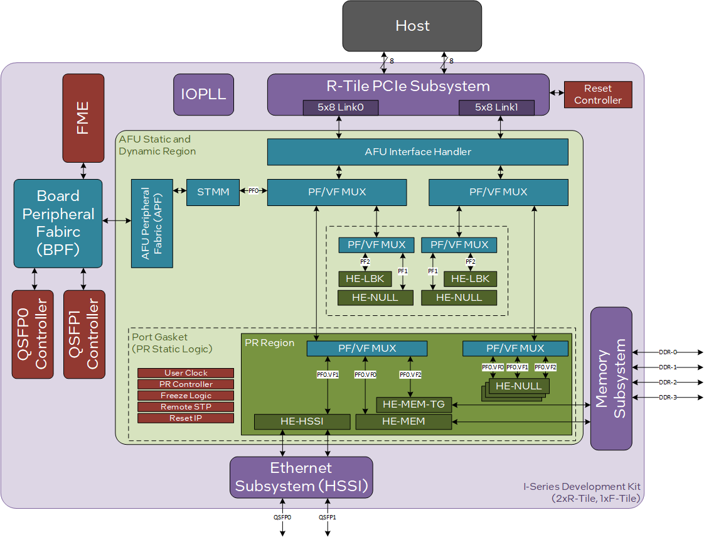
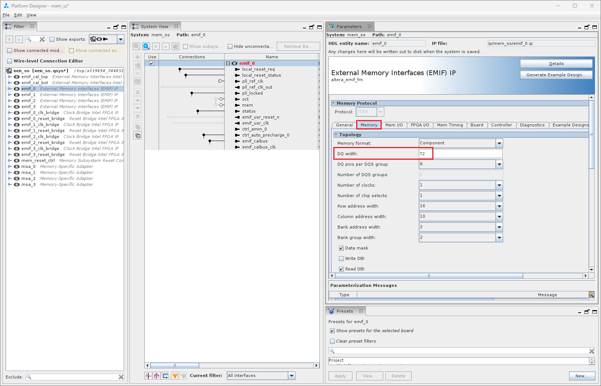

# FPGA Interface Manager Developer Guide for Open FPGA Stack: Agilex™ 7 FPGA I-Series Development Kit (2x R-Tile and 1xF-Tile) PCIe Attach

Last updated: **February 26, 2025** 

## **1. Introduction**

### **1.1. About This Document**

This document serves as a guide for OFS Agilex PCIe Attach developers targeting the Agilex™ 7 FPGA I-Series Development Kit (2x R-Tile and 1xF-Tile). The following topics are covered in this guide:

* Compiling the OFS Agilex PCIe Attach FIM design
* Simulating the OFS Agilex PCIe Attach design
* Customizing the OFS Agilex PCIe Attach FIM design
* Configuring the FPGA with an OFS Agilex PCIe Attach FIM design

The *FIM Development Walkthroughs Table* lists all of the walkthroughs provided in this guide. These walkthroughs provide step-by-step instructions for performing different FIM Development tasks.

*Table: FIM Development Walkthroughs*

| Walkthrough Name | Category |
| --- | --- |
| [Install Quartus Prime Pro Software](https://ofs.github.io/ofs-2024.3-1/hw/iseries_devkit/dev_guides/fim_dev/ug_ofs_iseries_dk_fim_dev/#1311-walkthrough-install-quartus-prime-pro-software) | Setup |
| [Clone FIM Repository](https://ofs.github.io/ofs-2024.3-1/hw/iseries_devkit/dev_guides/fim_dev/ug_ofs_iseries_dk_fim_dev/#1321-walkthrough-clone-fim-repository) | Setup |
| [Set Development Environment Variables](https://ofs.github.io/ofs-2024.3-1/hw/iseries_devkit/dev_guides/fim_dev/ug_ofs_iseries_dk_fim_dev/#1331-walkthrough-set-development-environment-variables) | Setup |
| [Set Up Development Environment](https://ofs.github.io/ofs-2024.3-1/hw/iseries_devkit/dev_guides/fim_dev/ug_ofs_iseries_dk_fim_dev/#134-walkthrough-set-up-development-environment) | Setup |
| [Compile OFS FIM](https://ofs.github.io/ofs-2024.3-1/hw/iseries_devkit/dev_guides/fim_dev/ug_ofs_iseries_dk_fim_dev/#225-walkthrough-compile-ofs-fim) | Compilation |
| [Manually Generate OFS Out-Of-Tree PR FIM](https://ofs.github.io/ofs-2024.3-1/hw/iseries_devkit/dev_guides/fim_dev/ug_ofs_iseries_dk_fim_dev/#226-walkthrough-manually-generate-ofs-out-of-tree-pr-fim) | Compilation |
| [Change the Compilation Seed](https://ofs.github.io/ofs-2024.3-1/hw/iseries_devkit/dev_guides/fim_dev/ug_ofs_iseries_dk_fim_dev/#2271-walkthrough-change-the-compilation-seed) | Compilation |
| [Running Individual Unit Level Simulation](https://ofs.github.io/ofs-2024.3-1/hw/iseries_devkit/dev_guides/fim_dev/ug_ofs_iseries_dk_fim_dev/#321-walkthrough-running-individual-unit-level-simulation) | Simulation |
| [Running Regression Unit Level Simulation](https://ofs.github.io/ofs-2024.3-1/hw/iseries_devkit/dev_guides/fim_dev/ug_ofs_iseries_dk_fim_dev/#331-walkthrough-running-regression-unit-level-simulation) | Simulation |
| [Add a new module to the OFS FIM](https://ofs.github.io/ofs-2024.3-1/hw/iseries_devkit/dev_guides/fim_dev/ug_ofs_iseries_dk_fim_dev/#412-walkthrough-add-a-new-module-to-the-ofs-fim) | Customization |
| [Modify and run unit tests for a FIM that has a new module](https://ofs.github.io/ofs-2024.3-1/hw/iseries_devkit/dev_guides/fim_dev/ug_ofs_iseries_dk_fim_dev/#413-walkthrough-modify-and-run-unit-tests-for-a-fim-that-has-a-new-module) | Customization |
| [Hardware test a FIM that has a new module](https://ofs.github.io/ofs-2024.3-1/hw/iseries_devkit/dev_guides/fim_dev/ug_ofs_iseries_dk_fim_dev/#414-walkthrough-hardware-test-a-fim-that-has-a-new-module) | Customization |
| [Debug the FIM with Signal Tap](https://ofs.github.io/ofs-2024.3-1/hw/iseries_devkit/dev_guides/fim_dev/ug_ofs_iseries_dk_fim_dev/#415-walkthrough-debug-the-fim-with-signal-tap) | Customization |
| [Compile the FIM in preparation for designing your AFU](https://ofs.github.io/ofs-2024.3-1/hw/iseries_devkit/dev_guides/fim_dev/ug_ofs_iseries_dk_fim_dev/#421-walkthrough-compile-the-fim-in-preparation-for-designing-your-afu) | Customization |
| [Resize the Partial Reconfiguration Region](https://ofs.github.io/ofs-2024.3-1/hw/iseries_devkit/dev_guides/fim_dev/ug_ofs_iseries_dk_fim_dev/#431-walkthrough-resize-the-partial-reconfiguration-region) | Customization |
| [Modify the PCIe Sub-System and PF/VF MUX Configuration Using OFSS](https://ofs.github.io/ofs-2024.3-1/hw/iseries_devkit/dev_guides/fim_dev/ug_ofs_iseries_dk_fim_dev/#4431-walkthrough-modify-the-pcie-sub-system-and-pfvf-mux-configuration-using-ofss) | Customization |
| [Modify PCIe Configuration Using IP Presets](https://ofs.github.io/ofs-2024.3-1/hw/iseries_devkit/dev_guides/fim_dev/ug_ofs_iseries_dk_fim_dev/#4441-walkthrough-modify-pcie-configuration-using-ip-presets) | Customization |
| [Migrate to a Different Agilex Device Number](https://ofs.github.io/ofs-2024.3-1/hw/iseries_devkit/dev_guides/fim_dev/ug_ofs_iseries_dk_fim_dev/#461-walkthrough-migrate-to-a-different-agilex-device-number) | Customization |
| [Modify the Ethernet Sub-System to 1x400GbE](https://ofs.github.io/ofs-2024.3-1/hw/iseries_devkit/dev_guides/fim_dev/ug_ofs_iseries_dk_fim_dev/#471-walkthrough-modify-the-ethernet-sub-system-to-1x400gbe) | Customization |
| [Set up JTAG](https://ofs.github.io/ofs-2024.3-1/hw/iseries_devkit/dev_guides/fim_dev/ug_ofs_iseries_dk_fim_dev/#51-walkthrough-set-up-jtag) | Configuration |
| [Program the FPGA via JTAG](https://ofs.github.io/ofs-2024.3-1/hw/iseries_devkit/dev_guides/fim_dev/ug_ofs_iseries_dk_fim_dev/#52-walkthrough-program-the-fpga-via-jtag) | Configuration |

#### **1.1.1 Knowledge Pre-Requisites**

It is recommended that you have the following knowledge and skills before using this developer guide.

* Basic understanding of OFS and the difference between OFS designs. Refer to the [OFS Welcome Page](https://ofs.github.io/ofs-2024.3-1).
* Review the [release notes](https://github.com/OFS/ofs-agx7-pcie-attach/releases/tag/ofs-2024.3-1) for the Agilex 7 PCIe Attach Reference Shells, with careful consideration of the **Known Issues**.
* Review of [Getting Started Guide: OFS for Agilex™ 7 PCIe Attach FPGAs (I-Series Development Kit (2xR-Tile, 1xF-Tile))](https://ofs.github.io/ofs-2024.3-1/hw/iseries_devkit/user_guides/ug_qs_ofs_iseries/ug_qs_ofs_iseries/)
* FPGA compilation flows using Quartus® Prime Pro Edition.
* Static Timing closure, including familiarity with the Timing Analyzer tool in Quartus® Prime Pro Edition, applying timing constraints, Synopsys* Design Constraints (.sdc) language and Tcl scripting, and design methods to close on timing critical paths.
* RTL (System Verilog) and coding practices to create synthesized logic.
* RTL simulation tools.
* Quartus® Prime Pro Edition Signal Tap Logic Analyzer tool software.

### **1.2. FIM Development Theory**

This section will help you understand how the OFS Agilex PCIe Attach FIM can be developed to fit your design goals.

The [Default FIM Features](https://ofs.github.io/ofs-2024.3-1/hw/iseries_devkit/dev_guides/fim_dev/ug_ofs_iseries_dk_fim_dev/#121-default-fim-features) section provides general information about the default features of the OFS Agilex PCIe Attach FIM so you can become familiar with the default design. For more detailed information about the FIM architecture, refer to the [Shell Technical Reference Manual: OFS for Agilex™ 7 PCIe Attach FPGAs](https://ofs.github.io/ofs-2024.3-1/hw/n6001/reference_manuals/ofs_fim/mnl_fim_ofs_n6001/).

The [Customization Options](https://ofs.github.io/ofs-2024.3-1/hw/iseries_devkit/dev_guides/fim_dev/ug_ofs_iseries_dk_fim_dev/#122-customization-options) section then gives suggestions of how this default design can be customized. Step-by-step walkthroughs for many of the suggested customizations are later described in the [FIM Customization](https://ofs.github.io/ofs-2024.3-1/hw/iseries_devkit/dev_guides/fim_dev/ug_ofs_iseries_dk_fim_dev/#4-fim-customization) section.

FIM development for a new acceleration card generally consists of the following steps:

1. Install OFS and familiarize yourself with provided scripts and source code
2. Develop high level design with your specific functionality
  1. Determine requirements and key performance metrics
  2. Select IP cores
  3. Select FPGA device
  4. Develop software memory map
3. Select and implement FIM Physical interfaces including:
  1. External clock sources and creation of internal PLL clocks
  2. General I/O
  3. Ethernet modules
  4. External memories
  5. FPGA programming methodology
4. Develop device physical implementation
  1. FPGA device pin assignment
  2. Create logic lock regions
  3. Create of timing constraints
  4. Create Quartus Prime Pro FIM test project and validate:
    1. Placement
    2. Timing constraints
    3. Build script process
    4. Review test FIM FPGA resource usage
5. Select FIM to AFU interfaces and development of PIM
6. Implement FIM design
  1. Develop RTL
  2. Instantiate IPs
  3. Develop test AFU to validate FIM
  4. Develop unit and device level simulation
  5. Develop timing constraints and build scripts
  6. Perform timing closure and build validation
7. Create FIM documentation to support AFU development and synthesis
8. Software Device Feature discovery
9. Integrate, validate, and debug hardware/software
10. Prepare for high volume production

### **1.2.1 Default FIM Features**

#### **1.2.1.1 Top Level**

*Figure: OFS Agilex PCIe Attach iseries-dk FIM PCIe 1x16 Top-Level Diagram*


*Figure: OFS Agilex PCIe Attach iseries-dk FIM PCIe 2x8 Top-Level Diagram*



#### **1.2.1.2 Interfaces**

The key interfaces in the OFS Agilex PCIe Attach design are listed in the *Release Capabilities Table*. It describes the capabilities of the iseries-dk hardware as well as the capabilities of the default OFS Agilex PCIe Attach design targeting the iseries-dk.

*Table: Release Capabilities*

| Interface | iseries-dk Hardware Capabilities<sup>**1**</sup> | OFS Agilex PCIe Attach Provided Design Implementation |
| --- | --- | --- |
| Host Interface | PCIe Gen5x16 | &bull; PCIe 1xGen5x16 (Default) <br>&bull; Bifurcated PCIe 2xGen5x8<br>&bull; PCIe 1xGen4x16 |
| Network Interface | 2 - QSFP-DD | 3 Build Options:</br> 1. QSFP 1,0 = 25 GbE</br>2. QSFP 1,0 = 200 GbE  </br>3. QSFP 0 = 400 GbE |
| External Memory | 2 - board mounted independent single rank DDR4-2666 8GB (1 Gb x 64 + 8b ECC)</br>2 - DIMM sockets where each socket is single memory channels or independent channels (Check Dev Kit OPN for support option)<sup>**2**</sup>. | &bull; Four Fabric DDR4 channels consisting of:<br>&nbsp;&nbsp;&nbsp;&nbsp;&bull; Two x64 (no ECC), 2666 MHz, 8GB Component memory<br>&nbsp;&nbsp;&nbsp;&nbsp;&bull; Two x64 (no ECC), 2666 MHz, 8GB UDIMM memory <br>OR<br>&bull; Three Fabric DDR4 channels consisting of:<br>&nbsp;&nbsp;&nbsp;&nbsp;&bull; Two x64 (no ECC), 2666 MHz, 8GB Component memory<br>&nbsp;&nbsp;&nbsp;&nbsp;&bull; One x64 (no ECC), 2666 MHz, 8GB RDIMM memory|

<sup>**1**</sup> The iseries-dk FIM design was validated on DK-DEV-AGI027RA with Agilex 7 device number AGIB027R29A1E1VB. If you wish to use the Early Silicon development kit (DK-DEV-AGI027-RBES), you will need to use OFS version 2024.2-1 or earlier.

<sup>**2**</sup> The iseries-dk was validated with 2 [Micron MTA8ATF1G64AZ-2G6E1 DDR4 SDRAM](https://www.micron.com/products/memory/dram-modules/udimm/part-catalog/part-detail/mta8atf1g64az-2g6e1) UDIMM modules in DIMM slots A and B. Note that the DK-DEV-AGI027RA development kit comes with a single 16GB RDIMM module. If you would like to use the RDIMM module that comes with the development kit, install it in DIMM Slot B on the board, and build the OFS Shell Design with the `memory_rtile_8g_rdimm.ofss` configuration and RDIMM pinout. Refer to the [Modify the Memory Sub-System for 1xRDIMM Configuration] section for step-by-step instructions.

#### **1.2.1.3 Subsystems**

The *FIM Subsystems* Table  describes the Platform Designer IP subsystems used in the OFS Agilex PCIe Attach iseries-dk FIM.

*Table: FIM Subsystems*

| Subsystem | User Guide | Document ID |
| --- | --- | --- |
| PCIe Subsystem | [AXI Streaming IP for PCI Express User Guide](https://www.intel.com/content/www/us/en/docs/programmable/790711/24-3-1/introduction.html) | 790711  |
| Memory Subsystem | [Memory Subsystem Intel FPGA IP User Guide for Agilex™ OFS](https://www.intel.com/content/www/us/en/docs/programmable/789391/23-4-1-0-1/f-series-and-i-series-fpga-memory-subsystem-61448.html) | 686148<sup>**[1]**</sup> |
| Ethernet Subsystem | [Ethernet Subsystem Intel FPGA IP User Guide](https://www.intel.com/content/www/us/en/docs/programmable/773413/23-4-24-0-0/introduction.html) | 773413<sup>**[1]**</sup> |

<sup>**[1]**</sup> You must request entitled access to these documents.

#### **1.2.1.4 Host Exercisers**

The default AFU workload in the OFS Agilex PCIe Attach iseries-dk FIM contains several modules called Host Exercisers which are used to exercise the interfaces on the board. The *Host Exerciser Descriptions* Table describes these modules.

*Table: Host Exerciser Descriptions*

|Name | Acronym | Description | OPAE Command |
| --- | --- | --- | --- |
| Host Exerciser Loopback | HE-LB | Used to exercise and characterize host to FPGA data transfer. | `host_exerciser` |
| Host Exerciser Memory | HE_MEM | Used to exercise and characterize host to Memory data transfer. | `host_exerciser` |
| Host Exerciser Memory Traffic Generator| HE_MEM_TG | Used to exercise and test available memory channels with a configurable traffic pattern. | `mem_tg`
| Host Exerciser High Speed Serial Interface | HE-HSSI | Used to exercise and characterize HSSI interfaces. | `hssi` |

The host exercisers can be removed from the design at compile-time using command line arguments for the build script.

#### **1.2.1.5 Module Access via APF/BPF**

The OFS Agilex PCIe Attach iseries-dk FIM uses AXI4-Lite interconnect logic named the AFU Peripheral Fabric (APF) and Board Peripheral Fabric (BPF) to access the registers of the various modules in the design. The APF/BPF modules define master/slave interactions, namely between the host software and AFU and board peripherals. The *APF Address Map Table* describes the address mapping of the APF, followed by the *BPF Address Map Table* which describes the address mapping of the BPF.

*Table: APF Address Map*

| Address | Size (Bytes) | Feature |
| --- | --- | --- |
| 0x00000–0x3FFFF | 256K | Board Peripherals (See *BPF Address Map* table) |
| 0x40000 – 0x4FFFF | 64K | ST2MM
| 0x50000 – 0x5FFFF | 64K | Reserved
| 0x60000 – 0x60FFF | 4K | UART (not used)
| 0x61000 – 0x6FFFF | 4K | Reserved
| 0x70000 – 0x7FFFF | 56K | PR Gasket:4K= PR Gasket DFH, control and status4K= Port DFH4K=User Clock52K=Remote STP
| 0x80000 – 0x80FFF | 4K | AFU Error Reporting

*Table: BPF Address Mapping*

| Address | Size (Bytes) | Feature |
| --- | --- | --- |
| 0x00000 - 0x0FFFF | 64K | FME |
| 0x10000 - 0x10FFF | 4K | PCIe |
| 0x11000 - 0x11FFF | 4K | Reserved |
| 0x12000 - 0x12FFF | 4K | QSFP0 |
| 0x13000 - 0x13FFF | 4K | QSFP1 |
| 0x14000 - 0x14FFF | 4K | HSSI |
| 0x15000 - 0x15FFF | 4K | EMIF |
| 0x20000 - 0x3FFFF | 128K | PMCI (note, PMCI is not implemented) | 

### **1.2.2 Customization Options**

OFS is designed to be easily customizable to meet your design needs. The *OFS FIM Customizations Table* lists the general user flows for OFS Agilex PCIe Attach iseries-dk FIM development, along with example customizations for each user flow, plus links to step-by-step walkthroughs where available.

*Table: OFS FIM Customizations*

| Customization Walkthrough Name |
| --- |
| [Add a new module to the OFS FIM](https://ofs.github.io/ofs-2024.3-1/hw/iseries_devkit/dev_guides/fim_dev/ug_ofs_iseries_dk_fim_dev/#412-walkthrough-add-a-new-module-to-the-ofs-fim) |
| [Modify and run unit tests for a FIM that has a new module](https://ofs.github.io/ofs-2024.3-1/hw/iseries_devkit/dev_guides/fim_dev/ug_ofs_iseries_dk_fim_dev/#413-walkthrough-modify-and-run-unit-tests-for-a-fim-that-has-a-new-module) |
| [Hardware test a FIM that has a new module](https://ofs.github.io/ofs-2024.3-1/hw/iseries_devkit/dev_guides/fim_dev/ug_ofs_iseries_dk_fim_dev/#414-walkthrough-hardware-test-a-fim-that-has-a-new-module) |
| [Debug the FIM with Signal Tap](https://ofs.github.io/ofs-2024.3-1/hw/iseries_devkit/dev_guides/fim_dev/ug_ofs_iseries_dk_fim_dev/#415-walkthrough-debug-the-fim-with-signal-tap) |
| [Compile the FIM in preparation for designing your AFU](https://ofs.github.io/ofs-2024.3-1/hw/iseries_devkit/dev_guides/fim_dev/ug_ofs_iseries_dk_fim_dev/#421-walkthrough-compile-the-fim-in-preparation-for-designing-your-afu) |
| [Resize the Partial Reconfiguration Region](https://ofs.github.io/ofs-2024.3-1/hw/iseries_devkit/dev_guides/fim_dev/ug_ofs_iseries_dk_fim_dev/#431-walkthrough-resize-the-partial-reconfiguration-region) |
| [Modify the PCIe Sub-System and PF/VF MUX Configuration Using OFSS](https://ofs.github.io/ofs-2024.3-1/hw/iseries_devkit/dev_guides/fim_dev/ug_ofs_iseries_dk_fim_dev/#4431-walkthrough-modify-the-pcie-sub-system-and-pfvf-mux-configuration-using-ofss) |
| [Modify PCIe Configuration Using IP Presets](https://ofs.github.io/ofs-2024.3-1/hw/iseries_devkit/dev_guides/fim_dev/ug_ofs_iseries_dk_fim_dev/#4441-walkthrough-modify-pcie-configuration-using-ip-presets) |
| [Migrate to a Different Agilex Device Number](https://ofs.github.io/ofs-2024.3-1/hw/iseries_devkit/dev_guides/fim_dev/ug_ofs_iseries_dk_fim_dev/#461-walkthrough-migrate-to-a-different-agilex-device-number) |
| [Modify the Ethernet Sub-System to 1x400GbE](https://ofs.github.io/ofs-2024.3-1/hw/iseries_devkit/dev_guides/fim_dev/ug_ofs_iseries_dk_fim_dev/#471-walkthrough-modify-the-ethernet-sub-system-to-1x400gbe) |

### **1.3 Development Environment**

This section describes the components required for OFS FIM development, and provides a walkthrough for setting up the environment on your development machine.

Note that your development machine may be different than your deployment machine where the FPGA acceleration card is installed. FPGA development work and deployment work can be performed either on the same machine, or on different machines as desired. Please see the [Getting Started Guide: OFS for Agilex™ 7 PCIe Attach FPGAs (I-Series Development Kit (2xR-Tile, 1xF-Tile))](https://ofs.github.io/ofs-2024.3-1/hw/iseries_devkit/user_guides/ug_qs_ofs_iseries/ug_qs_ofs_iseries/) for instructions on setting up the environment for deployment machines.

#### **1.3.1 Development Tools**

The *Development Environment Table* describes the Best Known Configuration (BKC) for the tools that are required for OFS FIM development.

*Table: Development Environment BKC*

| Component | Version | Installation Walkthrough |
| --- | --- | --- |
| Operating System | RedHat® Enterprise Linux® (RHEL) 9.4 | N/A |
| Quartus Prime Software | Quartus Prime Pro Version 24.3 for Linux + Patches No patches for this release | Section 1.3.1.1 |
| Python | 3.8.10 or later | N/A |
| GCC | 11.5.0 or later | N/A |
| cmake | 3.26.5 or later | N/A |
| git | 2.43.0 or later | Section 1.3.1.2 |
| FIM Source Files | ofs-2024.3-1 | Section 1.3.2.1 |

##### **1.3.1.1 Walkthrough: Install Quartus Prime Pro Software**

**Intel Quartus Prime Pro Version 24.3** is verified to work with the latest OFS release ofs-2024.3-1.  However, you have the option to port and verify the release on newer versions of Intel Quartus Prime Pro software.

Use RedHat® Enterprise Linux® (RHEL) 9.4 for compatibility with your development flow and also testing your FIM design in your platform. 

Prior to installing Quartus:

1. Ensure you have sufficient free disk space for Quartus Prime Pro installation and your development work.

  * The disk space may be significantly more based on the device families included in the install. Prior to installation, the disk space should be enough to hold both zipped tar files and uncompressed installation files. After successful installation, delete the downloaded zipped files and uncompressed zip files to release the disk space.

2. Ensure you have sufficient RAM available for OFS compilations with Quartus

  * It is recommended you have at least 128 GB of RAM to compile OFS designs.

3. Perform the following steps to satisfy the required dependencies.

  ```bash
  $ sudo dnf install -y gcc gcc-c++ make cmake libuuid-devel rpm-build autoconf automake bison boost boost-devel libxml2 libxml2-devel make ncurses grub2 bc csh flex glibc-locale-source libnsl ncurses-compat-libs 
  ```

  Apply the following configurations.

  ```bash
  $ sudo localedef -f UTF-8 -i en_US en_US.UTF-8 
  $ sudo ln -s /usr/lib64/libncurses.so.6 /usr/lib64/libncurses.so.5 
  $ sudo ln -s /usr/bin/python3 /usr/bin/python
  ```

4. Create the default installation path: <home directory>/intelFPGA_pro/<version number>, where <home directory> is the default path of the Linux workstation, or as set by the system administrator and <version> is your Quartus version number.

  The installation path must satisfy the following requirements:

  * Contain only alphanumeric characters
  * No special characters or symbols, such as !$%@^&*<>,
  * Only English characters
  * No spaces

5. Download your required Quartus Prime Pro Linux version [here](https://www.intel.com/content/www/us/en/products/details/fpga/development-tools/quartus-prime/resource.html).

6. After running the Quartus Prime Pro installer, set the PATH environment variable to make utilities `quartus`, `jtagconfig`, and `quartus_pgm` discoverable. Edit your bashrc file `~/.bashrc` to add the following line:

  ```bash
  export PATH=<Quartus install directory>/quartus/bin:$PATH
  export PATH=<Quartus install directory>/qsys/bin:$PATH
  ```

  For example, if the Quartus install directory is /home/intelFPGA_pro/24.3 then the new line is:

  ```bash
  export PATH=/home/intelFPGA_pro/24.3/quartus/bin:$PATH
  export PATH=/home/intelFPGA_pro/24.3/qsys/bin:$PATH
  ```

7. Verify, Quartus is discoverable by opening a new shell:

  ```
  $ which quartus
  /home/intelFPGA_pro/24.3/quartus/bin/quartus
  ```


#### **1.3.2 FIM Source Files**

The source files for the OFS Agilex PCIe Attach FIM are provided in the following repository: [https://github.com/OFS/ofs-agx7-pcie-attach/releases/tag/ofs-2024.3-1](https://github.com/OFS/ofs-agx7-pcie-attach/releases/tag/ofs-2024.3-1)

Some essential directories in the repository are described as follows:

```bash
ofs-agx7-pcie-attach
|  syn						// Contains files related to synthesis
|  |  board						// Contains synthesis files for several cards, including the iseries-dk 
|  |  |  iseries-dk					// Contains synthesis files for iseries-dk
|  |  |  |  setup						// Contains setup files, including pin constraints and location constraints
|  |  |  |  syn_top						// Contains Quartus project files
|  verification				// Contains files for UVM testing
|  ipss						// Contains files for IP Sub-Systems
|  |  qsfp						// Contains source files for QSFP Sub-System
|  |  hssi						// Contains source files for HSSI Sub-System
|  |  pmci						// Contains source files for PMCI Sub-System (not used in F-Tile FIM)
|  |  pcie						// Contains source files for PCIe Sub-System
|  |  mem						// Contains source files for Memory Sub-System
|  sim						// Contains simulation files
|  |  unit_test					// Contains files for all unit tests
|  |  |  scripts					// Contains script to run regression unit tests
|  license					// Contains Quartus patch
|  ofs-common				// Contains files which are common across OFS platforms
|  |  verification				// Contains common UVM files
|  |  scripts					// Contains common scripts
|  |  |  common
|  |  |  |  syn							// Contains common scripts for synthesis, including build script
|  |  |  |  sim							// Contains common scripts for simulation
|  |  tools						// Contains common tools files
|  |  |  mk_csr_module				// Contains common files for CSR modules
|  |  |  fabric_generation			// Contains common files for APF/BPF fabric generation
|  |  |  ofss_config				// Contains common files for OFSS configuration tool
|  |  |  |  ip_params					// Contains default IP parameters for certain Sub-Systems when using OFSS
|  |  src						// Contains common source files, including host exercisers
|  tools					//
|  |  ofss_config				// Contains top level OFSS files for each pre-made board configuration
|  |  |  hssi						// Contains OFSS files for Ethernet-SS configuraiton
|  |  |  memory						// Contains OFSS files for Memory-SS configuration
|  |  |  pcie						// Contains OFSS files for PCIe-SS configuration
|  |  |  iopll						// Contains OFSS files for IOPLL configuration
|  src						// Contains source files for Agilex PCIe Attach FIM
|  |  pd_qsys					// Contains source files related to APF/BPF fabric
|  |  includes					// Contains source file header files
|  |  top						// Contains top-level source files, including design top module
|  |  afu_top					// Contains top-level source files for AFU
```

>**Note:** UVM simulation is not supported for the I-Series Development Kit.

##### **1.3.2.1 Walkthrough: Clone FIM Repository**

Perform the following steps to clone the OFS Agilex™ 7 PCIe Attach FIM Repository:

1. Create a new directory to use as a clean starting point to store the retrieved files.
    ```bash
    mkdir OFS_BUILD_ROOT
    cd OFS_BUILD_ROOT
    export OFS_BUILD_ROOT=$PWD
    ```

2. Clone GitHub repository using the HTTPS git method
    ```bash
    git clone --recurse-submodules https://github.com/OFS/ofs-agx7-pcie-attach.git
    ```

3. Check out the correct tag of the repository
    ```bash
    cd ofs-agx7-pcie-attach
    git checkout --recurse-submodules tags/ofs-2024.3-1
    ```

4. Ensure that `ofs-common` has been cloned as well

    ```bash
    git submodule status
    ```

    Example output:

    ```bash
    ofs-common (ofs-2024.3-1)
    ```

#### **1.3.3 Environment Variables**

The OFS FIM compilation and simulation scripts require certain environment variables be set prior to execution.

##### **1.3.3.1 Walkthrough: Set Development Environment Variables**

Perform the following steps to set the required environment variables. These environment variables must be set prior to simulation or compilation tasks so it is recommended that you create a script to set these variables.

1. Navigate to the top level directory of the cloned OFS FIM repository.

  ```bash
  cd ofs-agx7-pcie-attach
  ```

2. Set project variables
  ```bash
  # Set OFS Root Directory - e.g. this is the top level directory of the cloned OFS FIM repository
  export OFS_ROOTDIR=$PWD
  ```

2. Set variables based on your development environment
  ```bash
  # Set proxies if required for your server
  export http_proxy=<YOUR_HTTP_PROXY>
  export https_proxy=<YOUR_HTTPS_PROXY>
  export ftp_proxy=<YOUR_FTP_PROXY>
  export socks_proxy=<YOUR_SOCKS_PROXY>
  export no_proxy=<YOUR_NO_PROXY>

  # Set Quartus license path
  export LM_LICENSE_FILE=<YOUR_LM_LICENSE_FILE>

  # Set Synopsys License path (if using Synopsys for simulation)
  export SNPSLMD_LICENSE_FILE=<YOUR_SNPSLMD_LICENSE_FILE>

  # Set Quartus Installation Directory - e.g. $QUARTUS_ROOTDIR/bin contains Quartus executables
  export QUARTUS_ROOTDIR=<YOUR_QUARTUS_INSTALLATION_DIRECTORY>

  # Set the Tools Directory - e.g. $TOOLS_LOCATION contains the 'synopsys' directory if you are using Synopsys. Refer to the $VCS_HOME variable for an example.
  export TOOLS_LOCATION=<YOUR_TOOLS_LOCATION>
  ```

3. Set generic environment variables

  ```bash
  # Set Work directory 
  export WORKDIR=$OFS_ROOTDIR

  # Set Quartus Tools variables
  export QUARTUS_HOME=$QUARTUS_ROOTDIR
  export QUARTUS_INSTALL_DIR=$QUARTUS_ROOTDIR
  export QUARTUS_ROOTDIR_OVERRIDE=$QUARTUS_ROOTDIR
  export QUARTUS_VER_AC=$QUARTUS_ROOTDIR
  export IP_ROOTDIR=$QUARTUS_ROOTDIR/../ip
  export IMPORT_IP_ROOTDIR=$IP_ROOTDIR
  export QSYS_ROOTDIR=$QUARTUS_ROOTDIR/../qsys/bin

  # Set Verification Tools variables (if running simulations)
  export DESIGNWARE_HOME=$TOOLS_LOCATION/synopsys/vip_common/vip_Q-2020.03A
  export UVM_HOME=$TOOLS_LOCATION/synopsys/vcsmx/${{ env.ISERIES_DK_SIM_VCS_VER_SH }}/linux64/rhel/etc/uvm
  export VCS_HOME=$TOOLS_LOCATION/synopsys/vcsmx/${{ env.ISERIES_DK_SIM_VCS_VER_SH }}/linux64/rhel
  export VCS_TARGET_ARCH=linux64
  export VMR_MODE_FLAG=64
  export MTI_HOME=$QUARTUS_ROOTDIR/../questa_fse
  export VERDIR=$OFS_ROOTDIR/verification
  export VIPDIR=$VERDIR

  # Set OPAE variables
  export OPAE_SDK_REPO_BRANCH=release/2.14.0

  # Set PATH to include compilation and simulation tools
  export PATH=$QUARTUS_HOME/bin:$QUARTUS_HOME/../qsys/bin:$QUARTUS_HOME/sopc_builder/bin/:$OFS_ROOTDIR/opae-sdk/install-opae-sdk/bin:$MTI_HOME/linux_x86_64/:$MTI_HOME/bin/:$DESIGNWARE_HOME/bin:$VCS_HOME/bin:$PATH
  ```


#### **1.3.4 Walkthrough: Set Up Development Environment**

This walkthrough guides you through the process of setting up your development environment in preparation for FIM development. This flow only needs to be done once on your development machine.

1. Ensure that Quartus Prime Pro Version 24.3 for Linux with Agilex FPGA device support is installed on your development machine. Refer to the [Install Quartus Prime Pro Software](https://ofs.github.io/ofs-2024.3-1/hw/iseries_devkit/dev_guides/fim_dev/ug_ofs_iseries_dk_fim_dev/#1311-walkthrough-install-quartus-prime-pro-software) section for step-by-step installation instructions.

  1. Verify version number

      ```bash
      quartus_sh --version
      ```

      Example Output:

      ```bash
      Quartus Prime Shell
      Version 24.3 Build 94 06/14/2023 SC Pro Edition
      ```

2. Ensure that all support tools are installed on your development machine, and that they meet the version requirements.

  1. Python 3.8.10 or later

    1. Verify version number

      ```bash
      python --version
      ```

      Example Output:

      ```bash
      Python 3.8.10
      ```

  2. GCC 11.5.0 or later
    1. Verify version number

      ```bash
      gcc --version
      ```

      Example output:

      ```bash
      gcc (GCC) 11.5.0
      ```

  3. cmake 3.26.5 or later
    1. Verify version number

      ```bash
      cmake --version
      ```

      Example output:

      ```bash
      cmake version 3.26.5
      ```

  4. git 2.43.0 or later.

    1. Verify version number

      ```bash
      git --version
      ```

      Example output:

      ```bash
      git version 2.43.0
      ```

3. Clone the ofs-agx7-pcie-attach repository. Refer to the [Clone FIM Repository](https://ofs.github.io/ofs-2024.3-1/hw/iseries_devkit/dev_guides/fim_dev/ug_ofs_iseries_dk_fim_dev/#1321-walkthrough-clone-fim-repository) section for step-by-step instructions.

4. Install UART IP license patch `.02`.

  1. Navigate to the `license` directory

    ```bash
    cd $OFS_ROOTDIR/license
    ```

  2. Install Patch 0.02

    ```bash
    sudo ./quartus-0.0-0.02iofs-linux.run
    ```


6. Verify that patches have been installed correctly. They should be listed in the output of the following command.

  ```bash
  quartus_sh --version
  ```

  Example output:

  ```bash
  Quartus Prime Shell
  Version 24.3.0 Build 115 03/21/2024 Patches 0.02iofs SC Pro Edition
  ```

5. Set required environment variables. Refer to the [Set Development Environment Variables](https://ofs.github.io/ofs-2024.3-1/hw/iseries_devkit/dev_guides/fim_dev/ug_ofs_iseries_dk_fim_dev/#1331-walkthrough-set-development-environment-variables) section for step-by-step instructions.

This concludes the walkthrough for setting up your development environment. At this point you are ready to begin FIM development.

## **2. FIM Compilation**

This section describes the process of compiling OFS FIM designs using the provided build scripts. It contains two main sections:

* [Compilation Theory](https://ofs.github.io/ofs-2024.3-1/hw/iseries_devkit/dev_guides/fim_dev/ug_ofs_iseries_dk_fim_dev/#21-compilation-theory) - Describes the theory behind FIM compilation
* [Compilation Flows](https://ofs.github.io/ofs-2024.3-1/hw/iseries_devkit/dev_guides/fim_dev/ug_ofs_iseries_dk_fim_dev/#22-compilation-flows) - Describes the process of compiling a FIM

The walkthroughs provided in this section are:

* [Compile OFS FIM](https://ofs.github.io/ofs-2024.3-1/hw/iseries_devkit/dev_guides/fim_dev/ug_ofs_iseries_dk_fim_dev/#225-walkthrough-compile-ofs-fim)
* [Manually Generate OFS Out-Of-Tree PR FIM](https://ofs.github.io/ofs-2024.3-1/hw/iseries_devkit/dev_guides/fim_dev/ug_ofs_iseries_dk_fim_dev/#226-walkthrough-manually-generate-ofs-out-of-tree-pr-fim)
* [Change the Compilation Seed](https://ofs.github.io/ofs-2024.3-1/hw/iseries_devkit/dev_guides/fim_dev/ug_ofs_iseries_dk_fim_dev/#2271-walkthrough-change-the-compilation-seed)

### **2.1 Compilation Theory**

This section describes the theory behind FIM compilation.

#### **2.1.1 FIM Build Script**

The OFS Common Repository contains a script named `build_top.sh` which is used to build OFS FIM designs and generate output files that can be programmed to the board. After cloning the OFS FIM repository (with the ofs-common repository included), the build script can be found in the following location:

```bash
$OFS_ROOTDIR/ofs-common/scripts/common/syn/build_top.sh
```

The usage of the `build_top.sh` script is as follows:

```bash
build_top.sh [-k] [-p] [-e] [--stage=<action>] [--ofss=<ip_config>] <build_target>[:<fim_options>] [<work_dir_name>]
```

| Field | Options | Description | Requirement |
| --- | --- | --- | --- |
| `-k` | None | Keep. Preserves and rebuilds within an existing work tree instead of overwriting it. | Optional |
| `-p` | None | When set, and if the FIM supports partial reconfiguration, a PR template tree is generated at the end of the FIM build. The PR template tree is located in the top of the work directory but is relocatable and uses only relative paths. See $OFS_ROOTDIR/syn/common/scripts generate_pr_release.sh for details. | Optional |
| `-e` | None | Run only Quartus analysis and elaboration. It completes the `setup` stage, passes `-end synthesis` to the Quartus compilation flow and exits without running the `finish` stage. | Optional |
| `--stage` | `all` \| `setup` \| `compile` \| `finish` | Controls which portion of the OFS build is run.</br>&nbsp;&nbsp;- `all`: Run all build stages (default)</br>&nbsp;&nbsp;- `setup`: Initialize a project in the work directory</br>&nbsp;&nbsp;- `compile`: Run the Quartus compilation flow on a project that was already initialized with `setup`</br>&nbsp;&nbsp;- `finish`: Complete OFS post-compilation tasks, such as generating flash images and, if `-p` is set, generating a release. | Optional |
| `--ofss` | `<ip_config>.ofss` \| `nodefault` | OFS Settings. OFSS files are used to modify IP in the design. This parameter is consumed during the setup stage and IP is updated only inside the work tree. More than one .ofss file may be passed to the `--ofss` switch by concatenating them separated by commas. For example: `--ofss config_a.ofss,config_b.ofss`. If no OFSS files are provided, the script will default to using the <build_target>.ofss file to configure the design. You may specify `--ofss nodefault` to prevent the script from using the default OFSS configuration; the resulting build will only use the source files as-is, plus any OFSS files you specify. | Optional |
| `<build_target>` | `n6000` \| `n6001` \| `fseries-dk` \| `iseries-dk` | Specifies which board is being targeted. | Required |
| `<fim_options>` | `flat` \| `null_he_lb` \| `null_he_hssi` \| `null_he_mem` \| `null_he_mem_tg` \| `no_hssi` | Used to change how the FIM is built.</br>&nbsp;&nbsp;&bull; `flat` - Compiles a flat design (no PR assignments). This is useful for bringing up the design on a new board without dealing with PR complexity.</br>&nbsp;&nbsp;&bull; `null_he_lb` - Replaces the Host Exerciser Loopback (HE_LBK) with `he_null`.</br>&nbsp;&nbsp;&bull; `null_he_hssi` - Replaces the Host Exerciser HSSI (HE_HSSI) with `he_null`.</br>&nbsp;&nbsp;&bull; `null_he_mem` - Replaces the Host Exerciser Memory (HE_MEM) with `he_null`.</br>&nbsp;&nbsp;&bull; `null_he_mem_tg` - Replaces the Host Exerciser Memory Traffic Generator with `he_null`. </br>&nbsp;&nbsp;&bull; `no_hssi` - Removes the HSSI-SS from the FIM. </br>More than one FIM option may be passed included in the `<fim_options>` list by concatenating them separated by commas. For example: `<build_target>:flat,null_he_lb,null_he_hssi` | Optional | 
| `<work_dir_name>` | String | Specifies the name of the work directory in which the FIM will be built. If not specified, the default target is `$OFS_ROOTDIR/work` | Optional |


Refer to [Compile OFS FIM](https://ofs.github.io/ofs-2024.3-1/hw/iseries_devkit/dev_guides/fim_dev/ug_ofs_iseries_dk_fim_dev/#225-walkthrough-compile-ofs-fim) which provides step-by-step instructions for running the build_top.sh script with some of the different available options.

#### **2.1.1.1 Build Work Directory**


The build script copies source files from the existing cloned repository into the specified work directory, which are then used for compilation. As such, any changes made in the base source files will be included in all subsequent builds, unless the `-k` option is used, in which case an existing work directories files are used as-is. Likewise, any changes made in a work directory is only applied to that work directory, and will not be updated in the base repository by default. When using OFSS files to modify the design, the build script will create a work directory and make the modifications in the work directory.

#### **2.1.1.2 Null Host Exercisers**

When using the `he_null_x` command command line options, the specified Host Exerciser is replaced by an `he_null` block. The `he_null` is a minimal block with CSRs that responds to PCIe MMIO requests in order to keep PCIe alive. You may use any of the build flows (flat, in-tree, out-of-tree) with the HE_NULL compile options. The HE_NULL compile options are as follows:

* `null_he_lb` - Replaces the Host Exerciser Loopback (HE_LBK) with `he_null`
* `null_he_hssi` - Replaces the Host Exerciser HSSI (HE_HSSI) with `he_null`
* `null_he_mem` - Replaces the Host Exerciser Memory (HE_MEM) with `he_null`
* `null_he_mem_tg` - Replaces the Host Exerciser Memory Traffic Generator with `he_null`


The [Compile OFS FIM](https://ofs.github.io/ofs-2024.3-1/hw/iseries_devkit/dev_guides/fim_dev/ug_ofs_iseries_dk_fim_dev/#225-walkthrough-compile-ofs-fim) section gives step-by-step instructions for this flow.

#### **2.1.2 OFSS File Usage**

The OFS FIM build script uses OFSS files to configure the design IP prior to compilation using preset configurations. The OFSS files specify certain parameters for different IPs. Using OFSS is provided as a convenience feature for building different FIM configurations. You can specify the IP OFSS files you wish to use on the command line, by editing the default Platform OFSS file, or by creating a custom Platform OFSS file and calling it on the command line. Any IP OFSS file type not explicitly specified will default to the one defined in the default Platform OFSS file.

The following video describes OFS Settings files, and provides demonstrations showing how to easily customize the OFS reference shell designs and accelerate your development flow.

<iframe width="560" height="315" src="https://www.youtube.com/embed/VLXL9xHg9rM?si=EC0mFup7D0FPYxFF" title="YouTube video player" frameborder="0" allow="accelerometer; autoplay; clipboard-write; encrypted-media; gyroscope; picture-in-picture; web-share" referrerpolicy="strict-origin-when-cross-origin" allowfullscreen></iframe>

##### **2.1.2.1 Top Level OFSS File**

Top-level OFSS files are OFSS files that contain a list of IP OFSS files that will be used during compilation when the Top-level OFSS file is provided to the build script. You may make your own custom Top-level OFSS files for convenient compilation. The *Provided Top-level OFSS Files* table describes the Top-level OFSS files that are provided to you. 

Top-level OFSS files contain a `[default]` header, followed by all of the IP OFSS files that will be used by the build script when this Platform OFSS file is called. Ensure that any environment variables (e.g. `$OFS_ROOTDIR`) are set correctly. The OFSS Config tool uses breadth first search to include all of the specified OFSS files; the ordering of OFSS files does not matter.

The general structure of a Top-level OFSS file is as follows:

```bash
[default]
<PATH_TO_BASE_OFSS_FILE>
<PATH_TO_PCIE_OFSS_FILE>
<PATH_TO_IOPLL_OFSS_FILE>
<PATH_TO_MEMORY_OFSS_FILE>
<PATH_TO_HSSI_OFSS_FILE>
```

Any IP OFSS file types that are not explicitly defined by the user will default to using the IP OFSS files specified in the default Top-level OFSS file of the target board. The default Top-level OFSS file for each target is `/tools/ofss_config/<target_board>.ofss`. You can use the `--ofss nodefault` option to prevent the build script from using the default Top-level OFSS file. You can still provide other OFSS files while using the `nodefault` option, e.g. `--ofss nodefault tools/ofss_config/pcie/pcie_host_2link.ofss` will implement the settings within `pcie_host_2link.ofss`, and will not use any default settings for the other IP types.

*Table: Provided Top-Level OFSS Files*

| OFSS File Name | Location | Type | Description | Supported Board |
| --- | --- | --- | --- | --- |
| `n6001.ofss` | `$OFS_ROOTDIR/tools/ofss_config` | Top-level | This is the default for N6001. Includes the following OFSS files:</br> &nbsp;&nbsp;&bull; `n6001_base.ofss`</br> &nbsp;&nbsp;&bull; `pcie_host.ofss`</br> &nbsp;&nbsp;&bull; `iopll_500MHz.ofss`</br> &nbsp;&nbsp;&bull; `memory.ofss`</br> &nbsp;&nbsp;&bull; `hssi_8x25.ofss` | N6001 |
| `n6000.ofss` | `$OFS_ROOTDIR/tools/ofss_config` | Top-level | This is the default for N6000. Includes the following OFSS files:</br> &nbsp;&nbsp;&bull; `n6000_base.ofss`</br> &nbsp;&nbsp;&bull; `pcie_host_n6000.ofss`</br> &nbsp;&nbsp;&bull; `iopll_350MHz.ofss`</br> &nbsp;&nbsp;&bull; `hssi_4x100.ofss` | N6000 |
| `fseries-dk.ofss` | `$OFS_ROOTDIR/tools/ofss_config` | Top-level | This is the default for fseries-dk. Includes the following OFSS files:</br> &nbsp;&nbsp;&bull; `fseries-dk_base.ofss`</br> &nbsp;&nbsp;&bull; `pcie_host.ofss`</br> &nbsp;&nbsp;&bull; `iopll_500MHz.ofss`</br> &nbsp;&nbsp;&bull; `memory_ftile.ofss`</br> &nbsp;&nbsp;&bull; `hssi_8x25_ftile.ofss` | fseries-dk |
| `iseries-dk.ofss` | `$OFS_ROOTDIR/tools/ofss_config` | Top-level | This is the default for iseries-dk. Includes the following OFSS files:</br> &nbsp;&nbsp;&bull; `iseries-dk_base.ofss` </br> &nbsp;&nbsp;&bull; `pcie_host.ofss`</br> &nbsp;&nbsp;&bull; `iopll_500MHz.ofss`</br> &nbsp;&nbsp;&bull; `memory_rtile.ofss`</br> &nbsp;&nbsp;&bull; `hssi_8x25_ftile.ofss` | iseries-dk |


##### **2.1.2.2 Base OFSS File**

An OFSS file with IP type `ofs` contains board specific information for the target board. It defines certain attributes of the design, including the platform name, device family, fim type, part number, and device ID. It can also contain settings for system information like PCIe generation and subsystem device IDs. Note that PCIe settings defined in the PCIe OFSS file will take precedence over any PCIe settings defined in the Base OFSS file.

Currently supported configuration options for an OFSS file with IP type `ofs` are described in the *OFS IP OFSS File Options* table.

*Table: OFS IP OFSS File Options*

| Section | Parameter | n6001 Default Value | n6000 Default Value | fseries-dk Default Value | iseries-dk Default Value |
| --- | --- | --- | --- | --- | --- |
| `[ip]` | `type` | `ofs` | `ofs` | `ofs` | `ofs` |
| `[settings]` | `platform` | `n6001` | `n6000` | `n6001` | `n6001` |
| | `family` | `agilex` | `agilex` | `agilex` | `agilex` |
| | `fim` | `base_x16` | `base_x16` | `base_x16` | `base_x16` |
| | `part` | `AGFB014R24A2E2V` | `AGFB014R24A2E2V` | `AGFB027R24C2E2VR2` | `AGIB027R29A1E1VB` |
| | `device_id` | `6001` | `6000` | `6001` | `6001` |
| `[pcie.settings]` | `pcie_gen` | `4` | `4` | `4` | `5` |
| `[pcie]` | `subsys_dev_id` | `1771` | `1770` | `1` | `1` |
| | `exvf_subsysid` | `1771` | `1770` | `1` | `1` |

The *Provided Base OFSS Files* table describes the Base OFSS files that are provided to you.

*Table: Provided Base OFSS Files*

| OFSS File Name | Location | Type | Supported Board |
| --- | --- | --- | --- |
| `n6001_base.ofss` | `$OFS_ROOTDIR/tools/ofss_config/base` | ofs | N6001 |
| `n6000_base.ofss` | `$OFS_ROOTDIR/tools/ofss_config/base` | ofs | N6000 |
| `fseries-dk_base.ofss` | `$OFS_ROOTDIR/tools/ofss_config/base` | ofs | fseries-dk |
| `iseries-dk_base.ofss` | `$OFS_ROOTDIR/tools/ofss_config/base` | ofs | iseries-dk |


##### **2.1.2.3 PCIe OFSS File**

An OFSS file with IP type `pcie` is used to configure the PCIe-SS and PF/VF MUX in the FIM.

The PCIe OFSS file has a special section type (`[pf*]`) which is used to define physical functions (PFs) in the FIM. Each PF has a dedicated section, where the `*` character is replaced with the PF number. For example, `[pf0]`, `[pf1]`, etc. For reference FIM configurations, you must have at least 1 PF with 1VF, or 2PFs. This is because the PR region cannot be left unconnected. PFs must be consecutive. The *PFVF Limitations* table describes the supported number of PFs and VFs.

*Table: PF/VF Limitations*

| Parameter | Value |
| --- | --- |
| Min # of PFs | 1 PF if 1 or more VFs present \| 2 PFs if 0 VFs present (PFs must start at PF0) |
| Max # of PFs | 8 |
| Min # of VFs | 0 VFs if 2 or more PFs present \| 1 VF if only 1 PF present |
| Max # of VFs | 2000 distributed across all PFs |

Currently supported configuration options for an OFSS file with IP type `pcie` are described in the *PCIe IP OFSS File Options* table.

*Table: PCIe IP OFSS File Options*

| Section | Parameter | Options | Description | n6001 Default Value | n6000 Default Value | fseries-dk Default Value | iseries-dk Default Value |
| --- | --- | --- | --- | --- | --- | --- | --- |
| `[ip]` | `type` | `pcie` | Specifies that this OFSS file configures the PCIe-SS | `pcie` | `pcie` | `pcie` | `pcie` |
| `[settings]` | `output_name` | `pcie_ss` | Specifies the output name of the PCIe-SS IP | `pcie_ss` | `pcie_ss` | `pcie_ss` | `pcie_ss` |
| | `ip_component` |  `intel_pcie_ss_axi` \| `pcie_ss` | Specifies the PCIe SS IP that will be used. </br> &nbsp;&nbsp;&bull; `intel_pcie_ss_axi`: AXI Streaming Intel FPGA IP for PCI Express </br> &nbsp;&nbsp;&bull; `pcie_ss`: Intel FPGA IP Subsystem for PCI Express | `intel_pcie_ss_axi` | `intel_pcie_ss_axi` | `intel_pcie_ss_axi` | `intel_pcie_ss_axi` | `intel_pcie_ss_axi` |
| | `preset` | *String* | OPTIONAL - Specifies the name of a PCIe-SS IP presets file to use when building the FIM. When used, a presets file will take priority over any other parameters set in this OFSS file. | N/A | N/A | N/A | N/A |
| `[pf*]` | `num_vfs` | Integer | Specifies the number of Virtual Functions in the current PF | Variable<sup>**[1]**</sup> | Variable<sup>**[2]**</sup> | Variable<sup>**[1]**</sup> | Variable<sup>**[1]**</sup> |
| | `bar0_address_width` | Integer | | Variable<sup>**[1]**</sup> | Variable<sup>**[2]**</sup> | Variable<sup>**[1]**</sup> | Variable<sup>**[1]**</sup> |
| | `bar4_address_width` | Integer | | Variable<sup>**[1]**</sup> | Variable<sup>**[2]**</sup> | Variable<sup>**[1]**</sup> | Variable<sup>**[1]**</sup> |
| | `vf_bar0_address_width` | Integer | | Variable<sup>**[1]**</sup> | Variable<sup>**[2]**</sup> | Variable<sup>**[1]**</sup> | Variable<sup>**[1]**</sup> |
| | `ats_cap_enable` | `0` \| `1` | | Variable<sup>**[1]**</sup> | Variable<sup>**[2]**</sup> | Variable<sup>**[1]**</sup> | Variable<sup>**[1]**</sup> |
| | `vf_ats_cap_enable` | `0` \| `1` | | Variable<sup>**[1]**</sup> | Variable<sup>**[2]**</sup> | Variable<sup>**[1]**</sup> | Variable<sup>**[1]**</sup> |
| | `prs_ext_cap_enable` | `0` \| `1` | | Variable<sup>**[1]**</sup> | Variable<sup>**[2]**</sup> | Variable<sup>**[1]**</sup> | Variable<sup>**[1]**</sup> |
| | `pasid_cap_enable` | `0` \| `1` | | Variable<sup>**[1]**</sup> | Variable<sup>**[2]**</sup> | Variable<sup>**[1]**</sup> | Variable<sup>**[1]**</sup> |
| | `pci_type0_vendor_id` | 32'h Value | | Variable<sup>**[1]**</sup> | Variable<sup>**[2]**</sup> | Variable<sup>**[1]**</sup> | Variable<sup>**[1]**</sup> |
| | `pci_type0_device_id` | 32'h Value | | Variable<sup>**[1]**</sup> | Variable<sup>**[2]**</sup> | Variable<sup>**[1]**</sup> | Variable<sup>**[1]**</sup> |
| | `revision_id` | 32'h Value | | Variable<sup>**[1]**</sup> | Variable<sup>**[2]**</sup> | Variable<sup>**[1]**</sup> | Variable<sup>**[1]**</sup> |
| | `class_code` | 32'h Value | | Variable<sup>**[1]**</sup> | Variable<sup>**[2]**</sup> | Variable<sup>**[1]**</sup> | Variable<sup>**[1]**</sup> |
| | `subsys_vendor_id` | 32'h Value | | Variable<sup>**[1]**</sup> | Variable<sup>**[2]**</sup> | Variable<sup>**[1]**</sup> | Variable<sup>**[1]**</sup> |
| | `subsys_dev_id` | 32'h Value | | Variable<sup>**[1]**</sup> | Variable<sup>**[2]**</sup> | Variable<sup>**[1]**</sup> | Variable<sup>**[1]**</sup> |
| | `sriov_vf_device_id` | 32'h Value | | Variable<sup>**[1]**</sup> | Variable<sup>**[2]**</sup> | Variable<sup>**[1]**</sup> | Variable<sup>**[1]**</sup> |
| | `exvf_subsysid` | 32'h Value | | Variable<sup>**[1]**</sup> | Variable<sup>**[2]**</sup> | Variable<sup>**[1]**</sup> | Variable<sup>**[1]**</sup> |


> <sup>**[1]**</sup> Refer to `pcie_host.ofss`

> <sup>**[2]**</sup> Refer to `pcie_host_n6000.ofss`

Any parameter that is not specified in the PCIe OFSS file will default to the values defined in `$OFS_ROOTDIR/ofs-common/tools/ofss_config/ip_params/pcie_ss_component_parameters.py`. When using a PCIe IP OFSS file during compilation, the PCIe-SS IP that is used will be defined based on the values in the PCIe IP OFSS file plus the parameters defined in `pcie_ss_component_parameters.py`.

The *Provided PCIe OFSS Files* table describes the PCIe OFSS files that are provided to you.

*Table: Provided PCIe OFSS Files*

| OFSS File Name | Location | Type | Description | Supported Boards |
| --- | --- | --- | --- | --- |
| `pcie_host.ofss` | `$OFS_ROOTDIR/tools/ofss_config/pcie` | pcie | Defines the PCIe Subsystem with the following configuration:</br>&nbsp;&nbsp;&bull; PF0 (3 VFs)</br>&nbsp;&nbsp;&bull; PF1 (0 VFs)</br>&nbsp;&nbsp;&bull; PF2 (0 VFs)</br>&nbsp;&nbsp;&bull; PF3 (0 VFs)</br>&nbsp;&nbsp;&bull; PF4 (0 VFs) | N6001 \| fseries-dk \| iseries-dk |
| `pcie_host_1pf_1vf.ofss` | `$OFS_ROOTDIR/tools/ofss_config/pcie` | pcie | Defines the PCIe Subsystem with the following configuration: </br>&nbsp;&nbsp;&bull; PF0 (1 VF) | N6001 \| fseries-dk \| iseries-dk |
| `pcie_host_2link.ofss` | `$OFS_ROOTDIR/tools/ofss_config/pcie` | pcie | Defines the PCIe Subsystem with the following configuration:</br>&nbsp;&nbsp;&bull; 2x8 PCIe</br>&nbsp;&nbsp;&bull; PF0 (3 VFs)</br>&nbsp;&nbsp;&bull; PF1 (0 VFs)</br>&nbsp;&nbsp;&bull; PF2 (0 VFs)</br>&nbsp;&nbsp;&bull; PF3 (0 VFs)</br>&nbsp;&nbsp;&bull; PF4 (0 VFs) | iseries-dk |
| `pcie_host_2link_1pf_1vf.ofss` | `$OFS_ROOTDIR/tools/ofss_config/pcie` | pcie | Defines the PCIe Subsystem with the following configuration: </br>&nbsp;&nbsp;&bull; 2x8 PCIe</br>&nbsp;&nbsp;&bull; PF0 (1 VF)| iseries-dk |
| `pcie_host_2pf.ofss` | `$OFS_ROOTDIR/tools/ofss_config/pcie` | pcie | Defines the PCIe Subsystem with the following configuration:</br>&nbsp;&nbsp;&bull; PF0 (0 VFs)</br>&nbsp;&nbsp;&bull; PF1 (0 VFs) | N6001 \| fseries-dk \| iseries-dk |
| `pcie_host_gen4.ofss` | `$OFS_ROOTDIR/tools/ofss_config/pcie` | pcie | Defines the PCIe Subsystem with the following configuration:</br>&nbsp;&nbsp;&bull; PF0 (3 VFs)</br>&nbsp;&nbsp;&bull; PF1 (0 VFs)</br>&nbsp;&nbsp;&bull; PF2 (0 VFs)</br>&nbsp;&nbsp;&bull; PF3 (0 VFs)</br>&nbsp;&nbsp;&bull; PF4 (0 VFs) | iseries-dk |
| `pcie_host_n6000.ofss` | `$OFS_ROOTDIR/tools/ofss_config/pcie` | pcie | Defines the PCIe Subsystem for the N6000 with the following configuration:</br>&nbsp;&nbsp;&bull; PF0 (3 VFs)</br>&nbsp;&nbsp;&bull; PF1 (0 VFs)</br>&nbsp;&nbsp;&bull; PF2 (0 VFs)</br>&nbsp;&nbsp;&bull; PF3 (0 VFs)</br>&nbsp;&nbsp;&bull; PF4 (0 VFs) | N6001 |


##### **2.1.2.4 IOPLL OFSS File**

An OFSS file with IP type `iopll` is used to configure the IOPLL in the FIM.

The IOPLL OFSS file has a special section type (`[p_clk]`) which is used to define the IOPLL clock frequency.

Currently supported configuration options for an OFSS file with IP type `iopll` are described in the *IOPLL OFSS File Options* table.

*Table: IOPLL OFSS File Options*

| Section | Parameter | Options | Description | n6001 Default Value | n6000 Default Value | fseries-dk Default Value | iseries-dk Default Value |
| --- | --- | --- | --- | --- | --- | --- | --- |
| `[ip]` | `type` | `iopll` | Specifies that this OFSS file configures the IOPLL | `iopll` | `iopll` | `iopll` | `iopll` |
| `[settings]` | `output_name` | `sys_pll` | Specifies the output name of the IOPLL. | `sys_pll` | `sys_pll` | `sys_pll` | `sys_pll` |
| | `instance_name` | `iopll_0` | Specifies the instance name of the IOPLL. | `iopll_0` | `iopll_0` | `iopll_0` | `iopll_0` |
| `[p_clk]` | `freq` | Integer: 250 - 500 | Specifies the IOPLL clock frequency in MHz. | `500` | `350` | `500` | `500` |

The *Provided IOPLL OFSS Files* table describes the IOPLL OFSS files that are provided to you.

*Table: Provided IOPLL OFSS Files*

| OFSS File Name | Location | Type | Description | Supported Board |
| --- | --- | --- | --- | --- |
| `iopll_500MHz.ofss` | `$OFS_ROOTDIR/tools/ofss_config/iopll` | iopll | Sets the IOPLL frequency to `500 MHz` | N6001 \| fseries-dk \| iseries-dk |
| `iopll_470MHz.ofss` | `$OFS_ROOTDIR/tools/ofss_config/iopll` | iopll | Sets the IOPLL frequency to `470 MHz` | N6001 \| fseries-dk \| iseries-dk |
| `iopll_350MHz.ofss` | `$OFS_ROOTDIR/tools/ofss_config/iopll` | iopll | Sets the IOPLL frequency to `350 MHz` | N6001 \| N6000 \| fseries-dk \| iseries-dk |


##### **2.1.2.5 Memory OFSS File**

An OFSS file with IP type `memory` is used to configure the Memory-SS in the FIM.

The Memory OFSS file specifies a `preset` value, which selects a presets file (`.qprs`) to configure the Memory-SS.

Currently supported configuration options for an OFSS file with IP type `memory` are described in the *Memory OFSS File Options* table.

*Table: Memory OFSS File Options*

| Section | Parameter | Options | Description | n6001 Default Value | n6000 Default Value | fseries-dk Default Value | iseries-dk Default Value |
| --- | --- | --- | --- | --- | --- | --- | --- |
| `[ip]` | `type` | `memory` | Specifies that this OFSS file configures the Memory-SS | `memory` | N/A | `memory` | `memory` |
| `[settings]` | `output_name` | `mem_ss_fm` | Specifies the output name of the Memory-SS. | `mem_ss_fm` | N/A | `mem_ss_fm` | `mem_ss_fm` |
| | `preset` | *String*<sup>**[1]**</sup> | Specifies the name of the `.qprs` presets file that will be used to build the Memory-SS. | `n6001` | N/A | `fseries-dk` | `iseries-dk` |

<sup>**[1]**</sup> You may generate your own `.qprs` presets file with a unique name using Quartus. 

Memory-SS presets files are stored in the `$OFS_ROOTDIR/ipss/mem/qip/presets` directory.

The *Provided Memory OFSS Files* table describes the Memory OFSS files that are provided to you.

*Table: Provided Memory OFSS Files*

| OFSS File Name | Location | Type | Description | Supported Board |
| --- | --- | --- | --- | --- |
| `memory.ofss` | `$OFS_ROOTDIR/tools/ofss_config/memory` | memory | Defines the memory IP preset file to be used during the build as: | N6001 \| N6000 <sup>**[1]**</sup> |
| `memory_ftile.ofss` | `$OFS_ROOTDIR/tools/ofss_config/memory` | memory | Defines the memory IP preset file to be used during the build as `fseries-dk` | fseries-dk |
| `memory_rtile.ofss` | `$OFS_ROOTDIR/tools/ofss_config/memory` | memory | Defines the memory IP preset file to be used during the build as `iseries-dk` when using two UDIMMs populating DIMM slots A and B | iseries-dk |
| `memory_rtile_8g_rdimm.ofss` | `$OFS_ROOTDIR/tools/ofss_config/memory` | memory | Defines the memory IP preset file to be used during the build as `iseries-dk` when using a single RDIMM populating DIMM slot B.  | iseries-dk |
| `memory_rtile_no_dimm.ofss` | `$OFS_ROOTDIR/tools/ofss_config/memory` | memory | Defines the memory IP preset file to be used during the build as `iseries-dk` when there are no DIMMs populated on the board. | iseries-dk |

<sup>**[1]**</sup> The `memory.ofss` file can be used for the N6000, however, the default N6000 FIM does not implement the Memory Sub-system. Refer to Section 4.7.2 for step-by-step instructions on how to enable the Memory sub-system


##### **2.1.2.6 HSSI IP OFSS File**

An OFSS file with IP type `hssi` is used to configure the Ethernet-SS in the FIM.

Currently supported configuration options for an OFSS file with IP type `hssi` are described in the *HSSI OFSS File Options* table.

*Table: HSSI OFSS File Options*

| Section | Parameter | Options | Description | n6001 Default Value | n6000 Default Value | fseries-dk Default Value | iseries-dk Default Value |
| --- | --- | --- | --- | --- | --- | --- | --- |
| `[ip]` | `type` | `hssi` | Specifies that this OFSS file configures the Ethernet-SS | `hssi` | `hssi` | `hssi` | `hssi` |
| `[settings]` | `output_name` | `hssi_ss` | Specifies the output name of the Ethernet-SS | `hssi_ss` | `hssi_ss` | `hssi_ss` | `hssi_ss` |
| | `num_channels` | Integer | Specifies the number of channels. | `8` | `4` | `8` | `8` |
| | `data_rate` | `10GbE` \| `25GbE` \| `100GCAUI-4` \| `200GAUI-4` \| `400GAUI-8` | Specifies the data rate<sup>**[1]**</sup> | `25GbE` | `100GCAUI-4` | `25GbE` | `25GbE` |
| | `preset` | None \| `fseries-dk` \| `200g-fseries-dk` \| `400g-fseries-dk` \| *String*<sup>**[1]**</sup> | OPTIONAL - Selects the platform whose preset `.qprs` file will be used to build the Ethernet-SS. When used, this will overwrite the other settings in this OFSS file. | N/A | N/A | N/A | N/A |

<sup>**[1]**</sup> The presets file will take priority over the `data_rate` parameter, so this value will not take effect if using a presets file.

<sup>**[2]**</sup> You may generate your own `.qprs` presets file with a unique name using Quartus. 

Ethernet-SS presets are stored in  `$OFS_ROOTDIR/ipss/hssi/qip/hssi_ss/presets` directory.

The *Provided HSSI OFSS Files* table describes the HSSI OFSS files that are provided to you.

*Table: Provided HSSI OFSS Files*

| OFSS File Name | Location | Type | Description | Supported Board |
| --- | --- | --- | --- | --- |
| `hssi_8x10.ofss` | `$OFSS_ROOTDIR/tools/ofss_config/hssi` | hssi | Defines the Ethernet-SS IP configuration to be 8x10 GbE | N6001 |
| `hssi_8x25.ofss` | `$OFSS_ROOTDIR/tools/ofss_config/hssi` | hssi | Defines the Ethernet-SS IP configuration to be 8x25 GbE | N6001 |
| `hssi_2x100.ofss` | `$OFSS_ROOTDIR/tools/ofss_config/hssi` | hssi | Defines the Ethernet-SS IP configuration to be 2x100 GbE | N6001 |
| `hssi_1x400_ftile.ofss` | `$OFSS_ROOTDIR/tools/ofss_config/hssi` | hssi | Defines the Ethernet-SS IP configuration to be F-Tile 1x400 GbE | iseries-dk |
| `hssi_4x100.ofss` | `$OFSS_ROOTDIR/tools/ofss_config/hssi` | hssi | Defines the Ethernet-SS IP configuration to be 4x100 GbE | N6000 |
| `hssi_8x25_ftile.ofss` | `$OFSS_ROOTDIR/tools/ofss_config/hssi` | hssi | Defines the Ethernet-SS IP configuration to be F-Tile 8x25 GbE | fseries-dk \| iseries-dk |
| `hssi_2x200_ftile.ofss` | `$OFSS_ROOTDIR/tools/ofss_config/hssi` | hssi | Defines the Ethernet-SS IP to be 2x200 GbE | iseries-dk |


#### **2.1.3 OFS Build Script Outputs**

The output files resulting from running the the OFS FIM `build_top.sh` build script are copied to a single directory during the `finish` stage of the build script. The path for this directory is: `$OFS_ROOTDIR/<WORK_DIRECTORY>/syn/board/iseries-dk/syn_top/output_files`.

The output files include programmable images and compilation reports. The *OFS Build Script Output Descriptions* table describes the images that are generated by the build script.

*Table: OFS Build Script Output Descriptions*

| File Name | Description |
| --- | --- |
| ofs_top.sof | The FIM design SRAM Object File; a binary file of the compiled FIM image. |

### **2.2 Compilation Flows**

This section provides information for using the build script to generate different FIM types. Walkthroughs are provided for each compilation flow. These walkthroughs require that the development environment has been set up as described in the [Set Up Development Environment](https://ofs.github.io/ofs-2024.3-1/hw/iseries_devkit/dev_guides/fim_dev/ug_ofs_iseries_dk_fim_dev/#134-walkthrough-set-up-development-environment) section.

#### **2.2.1 Flat FIM**

A flat FIM is compiled such that there is no partial reconfiguration region, and the entire design is built as a flat design. This is useful for compiling new designs without worrying about the complexity introduced by partial reconfiguration. The flat compile removes the PR region and PR IP; thus, you cannot use the `-p` build flag when using the `flat` compile setting. Refer to the [Compile OFS FIM](https://ofs.github.io/ofs-2024.3-1/hw/iseries_devkit/dev_guides/fim_dev/ug_ofs_iseries_dk_fim_dev/#225-walkthrough-compile-ofs-fim) Section for step-by-step instructions for this flow.

#### **2.2.2 In-Tree PR FIM**

An In-Tree PR FIM is the default compilation if no compile flags or compile settings are used. This flow will compile the design with the partial reconfiguration region, but it will not create a relocatable PR directory tree to aid in AFU development. Refer to the [Compile OFS FIM](https://ofs.github.io/ofs-2024.3-1/hw/iseries_devkit/dev_guides/fim_dev/ug_ofs_iseries_dk_fim_dev/#225-walkthrough-compile-ofs-fim) Section for step-by-step instructions for this flow.

#### **2.2.3 Out-of-Tree PR FIM**

An Out-of-Tree PR FIM will compile the design with the partial reconfiguration region, and will create a relocatable PR directory tree to aid in AFU workload development. This is especially useful if you are developing a FIM to be used by another team developing AFU workloads. This is the recommended build flow in most cases. There are two ways to create the relocatable PR directory tree:

* Run the FIM build script with the `-p` option. Refer to the [Compile OFS FIM](https://ofs.github.io/ofs-2024.3-1/hw/iseries_devkit/dev_guides/fim_dev/ug_ofs_iseries_dk_fim_dev/#225-walkthrough-compile-ofs-fim) Section for step-by-step instructions for this flow.
* Run the `generate_pr_release.sh` script after running the FIM build script. Refer to the [Manually Generate OFS Out-Of-Tree PR FIM](https://ofs.github.io/ofs-2024.3-1/hw/iseries_devkit/dev_guides/fim_dev/ug_ofs_iseries_dk_fim_dev/#226-walkthrough-manually-generate-ofs-out-of-tree-pr-fim) Section step-by-step instructions for this flow.

In both cases, the `generate_pr_release.sh` is run to create the relocatable build tree. This script is located at `$OFS_ROOTDIR/ofs-common/scripts/common/syn/generate_pr_release.sh`. Usage for this script is as follows:

```bash
generate_pr_release.sh -t <PATH_OF_RELOCATABLE_PR_TREE> <BOARD_TARGET> <WORK_DIRECTORY>
```

The *Generate PR Release Script Options* table describes the options for the `generate_pr_release.sh` script.

*Table: Generate PR Release Script Options*

| Parameter | Options | Description |
| --- | --- | --- |
| `<PATH_OF_RELOCATABLE_PR_TREE>` | String | Specifies the location of the relocatable PR directory tree to be created. |
| `<BOARD_TARGET>` | `iseries-dk` | Specifies the name of the board target. |
| `<WORK_DIRECTORY>` | String | Specifies the existing work directory from which the relocatable PR directory tree will be created from. |

After generating the relocatable build tree, it is located in the `$OFS_ROOTDIR/<WORK_DIRECTORY>/pr_build_template` directory (or the directory you specified if generated separately). The contents of this directory have the following structure:

```bash
├── bin
├── ├── afu_synth
├── ├── qar_gen
├── ├── update_pim
├── ├── run.sh
├── ├── build_env_config
├── README
├── hw
├── ├── lib
├── ├── ├── build
├── ├── ├── fme-ifc-id.txt
├── ├── ├── platform
├── ├── ├── fme-platform-class.txt
├── ├── blue_bits
└── ├── ├── ofs_top.sof
```

#### **2.2.4 HE_NULL FIM**

An HE_NULL FIM refers to a design with one, some, or all of the Host Exercisers replaced by `he_null` blocks. The `he_null` is a minimal block with CSRs that responds to PCIe MMIO requests in order to keep PCIe alive. You may use any of the build flows (flat, in-tree, out-of-tree) with the HE_NULL compile options. The HE_NULL compile options are as follows:

* `null_he_lb` - Replaces the Host Exerciser Loopback (HE_LBK) with `he_null`
* `null_he_hssi` - Replaces the Host Exerciser HSSI (HE_HSSI) with `he_null`
* `null_he_mem` - Replaces the Host Exerciser Memory (HE_MEM) with `he_null`
* `null_he_mem_tg` - Replaces the Host Exerciser Memory Traffic Generator with `he_null`

The [Compile OFS FIM](https://ofs.github.io/ofs-2024.3-1/hw/iseries_devkit/dev_guides/fim_dev/ug_ofs_iseries_dk_fim_dev/#225-walkthrough-compile-ofs-fim) section gives step-by-step instructions for this flow.

#### **2.2.5 Walkthrough: Compile OFS FIM**

Perform the following steps to compile the OFS Agilex PCIe Attach FIM for iseries-dk:

Pre-requisites:

* This walkthrough requires a development environment. Refer to the [Set Up Development Environment](https://ofs.github.io/ofs-2024.3-1/hw/iseries_devkit/dev_guides/fim_dev/ug_ofs_iseries_dk_fim_dev/#134-walkthrough-set-up-development-environment) Section for instructions on setting up a development environment.

Steps:

1. Clone the OFS PCIe Attach FIM repository (or use an existing cloned repository). Refer to the [Clone FIM Repository](https://ofs.github.io/ofs-2024.3-1/hw/iseries_devkit/dev_guides/fim_dev/ug_ofs_iseries_dk_fim_dev/#1321-walkthrough-clone-fim-repository) section for step-by-step instructions.

2. Set development environment variables. Refer to the [Set Development Environment Variables](https://ofs.github.io/ofs-2024.3-1/hw/iseries_devkit/dev_guides/fim_dev/ug_ofs_iseries_dk_fim_dev/#1331-walkthrough-set-development-environment-variables) section for step-by-step instructions.

3. Navigate to the root directory.

  ```bash
  cd $OFS_ROOTDIR
  ```

4. Run the `build_top.sh` script with the desired compile options. The following is used build the default iseries-dk design:

  ```bash
  ./ofs-common/scripts/common/syn/build_top.sh iseries-dk work_iseries-dk
  ```

  The build command options allow for many modifications to the shell design at build time. The following tool is provided to help you conveniently get the build command for a specific shell configuration:

<div id="myBox">
  <h1>OFS Build Command Generator</h1><form id="myForm">
    <fieldset>
      <legend>Build Flow Options</legend>  
      <fieldset>
        <legend>Build Target</legend>
        <select id="select_build_target">
          <option value="n6001">n6001</option>
          <option value="n6000">n6000</option>
          <option value="fseries-dk">fseries-dk</option>
          <option value="iseries-dk">iseries-dk</option>
        </select><br>
      </fieldset>
    </fieldset>
    <fieldset>
      <legend>Partial Reconfiguration Settings</legend>
      <input type="checkbox" title="Disabling partial reconfiguration will build a flat design." id="check1" name="check_pr" value="check1">
      <label for="check1">Disable Partial Reconfiguration</label><br>
      <input type="checkbox" title="When this option is enabled the build script will automatically run the generate_pr_release.sh script after the design is compiled. This creates a self-contained working directory for a workload developer to create their AFU/workload." id="check2" name="check_proot" value="check2">
      <label for="check2">Generate Relocatable PR Tree</label><br>
    </fieldset>
    <fieldset>
      <legend>Add/Remove Subsystems</legend>
      <input type="checkbox" id="check8" name="check_no_hssi" value="check8">
      <label for="check8">Remove HSSI-SS (Ethernet Sub-System)</label><br>
    </fieldset>
    <fieldset>
      <legend>Add/Remove Host Exercisers</legend>
      <input type="checkbox" title="When checked the HE_HSSI is replaced with an HE_NULL which ties off the associated VF, leaving a stub with minimal registers." id="check3" name="check_null_he_hssi" value="check3">
      <label for="check3">Remove HE_HSSI (Ethernet Host Exerciser)</label><br>
      <input type="checkbox" title="When checked the HE_LBK is replaced with an HE_NULL which ties off the associated PF, leaving a stub with minimal registers." id="check4" name="check_null_he_lb" value="check4">
      <label for="check4">Remove HE_LBK (PCIe Loopback)</label><br>
      <input type="checkbox" title="When checked the HE_MEM is replaced with an HE_NULL which ties off the associated VF, leaving a stub with minimal registers." id="check5" name="check_null_he_mem" value="check5">
      <label for="check5">Remove HE_MEM (Read/Write Memory Exerciser)</label><br>
      <input type="checkbox" title="When checked the HE_MEM_TG is replaced with an HE_NULL which ties off the associated VF, leaving a stub with minimal registers." id="check6" name="check_null_he_mem_tg" value="check6">
      <label for="check6">Remove HE_MEM_TG (Pseudo random memory traffic generator)</label><br>
    </fieldset>
    <fieldset>
      <legend>IP Configuration</legend>
      <fieldset>
        <legend>HSSI</legend>
        <select id="ofss_hssi">
          <option value="default">default</option>
          <option value="8x10">8x10 GbE</option>
          <option value="8x25">8x25 GbE</option>
          <option value="2x100">2x100 GbE</option>
          <option value="2x200">2x200 GbE</option>
          <option value="1x400">1x400 GbE</option>
        </select><br>
      </fieldset>
      <fieldset>
        <legend>IOPLL</legend>
        <select id="ofss_iopll">
          <option value="default">default</option>
          <option value="500MHz">500 MHz</option>
          <option value="470MHz">470 MHz</option>
          <option value="350MHz">350 MHz</option>
        </select><br>
      </fieldset>
      <fieldset>
        <legend>PCIe</legend>
        <select id="ofss_pcie">
          <option value="default">default</option>
          <option value="1x16_5pf_3vf">1x16 5PF/3VF</option>
          <option value="1x16_1pf_1vf">1x16 1PF/1VF</option>
          <option value="1x16_2pf_0vf">1x16 2PF/0VF</option>
          <option value="2x8_3pf_3vf">2x8 3PF/3VF</option>
          <option value="2x8_1pf_1vf">2x8 1PF/1VF</option><br>
		  <input type="radio" id="pcie_gen4" name="pcie_gen" value="pcie_gen4" checked>
		  <label for="pcie_gen4">Gen4</label>
          <input type="radio" title="Only the iseries-dk supports PCIe Gen5" id="pcie_gen5" name="pcie_gen" value="pcie_gen5">
          <label for="pcie_gen5">Gen5</label>
        </select><br>
      </fieldset>
    </fieldset>
    <br><input type="submit" value="Submit">
  </form>
  <fieldset>
  <div id="result" style="font-family: monospace; whitespace: pre-wrap; word-wrap: break-word; overflow-wrap: break-word;">Press submit to generate the build command.</div>
  </fieldset>
</div>
<style>
  #myBox {
    border: 1px solid black;
    padding: 10px;
  }
</style>


<script>

var target_board = document.getElementById("select_build_target");
var disable_pr = document.getElementById("check1");
var enable_proot = document.getElementById("check2");
var rm_he_hssi = document.getElementById("check3");
var rm_he_lbk = document.getElementById("check4");
var rm_he_mem = document.getElementById("check5");
var rm_he_mem_tg = document.getElementById("check6");
var rm_hssi_ss = document.getElementById("check8");
var ofss_hssi = document.getElementById("ofss_hssi");
var ofss_hssi_option_default = ofss_hssi.querySelector('option[value="default"]');
var ofss_hssi_option_source = ofss_hssi.querySelector('option[value="source"]');
var ofss_iopll = document.getElementById("ofss_iopll");
var ofss_iopll_option_default = ofss_iopll.querySelector('option[value="default"]');
var ofss_iopll_option_source = ofss_iopll.querySelector('option[value="source"]');
var ofss_pcie = document.getElementById("ofss_pcie");
var ofss_pcie_option_default = ofss_pcie.querySelector('option[value="default"]');
var ofss_pcie_option_source = ofss_pcie.querySelector('option[value="source"]');
var pcie_gen4 = document.getElementById("pcie_gen4");
var pcie_gen5 = document.getElementById("pcie_gen5");

function resize_result () {
  var windowWidth = window.innerWidth;
  var resultFieldset = document.getElementById("result");
  resultFieldset.style.maxWidth = (windowWidth * 0.6) + "px";
}

document.addEventListener("DOMContentLoaded", function() {
  function initialize_check_enable_proot() {
    if (disable_pr.checked) {
	  enable_proot.checked = false;
	  enable_proot.disabled = true;
    } else {
	  enable_proot.disabled = false;
    }
  }

  function limit_target_selection () {
	switch (target_board.value) {
	  case "n6001":
	    ofss_hssi.querySelector('option[value="8x10"]').disabled = false;
		  ofss_hssi.querySelector('option[value="8x25"]').disabled = false;
		  ofss_hssi.querySelector('option[value="2x100"]').disabled = false;
	    ofss_hssi.querySelector('option[value="2x200"]').disabled = true;
		  ofss_hssi.querySelector('option[value="1x400"]').disabled = true;
		  if (ofss_hssi.value == "2x200" | ofss_hssi.value == "1x400") {
			  ofss_hssi.value = "default";
		  }
		
		  ofss_iopll.querySelector('option[value="500MHz"]').disabled = false;
		  ofss_iopll.querySelector('option[value="470MHz"]').disabled = false;
		  ofss_iopll.querySelector('option[value="350MHz"]').disabled = false;
		
		  ofss_pcie.querySelector('option[value="1x16_5pf_3vf"]').disabled = false;
      ofss_pcie.querySelector('option[value="1x16_1pf_1vf"]').disabled = false;
      ofss_pcie.querySelector('option[value="1x16_2pf_0vf"]').disabled = false;
      ofss_pcie.querySelector('option[value="2x8_3pf_3vf"]').disabled = true;
      ofss_pcie.querySelector('option[value="2x8_1pf_1vf"]').disabled = true;
		  if (ofss_pcie.value == "2x8_3pf_3vf" | ofss_pcie.value == "2x8_1pf_1vf") {
			  ofss_pcie.value = "default";
		  }
	  break;
		
	  case "n6000":
	    ofss_hssi.querySelector('option[value="8x10"]').disabled = false;
		  ofss_hssi.querySelector('option[value="8x25"]').disabled = false;
		  ofss_hssi.querySelector('option[value="2x100"]').disabled = false;
	    ofss_hssi.querySelector('option[value="2x200"]').disabled = true;
		  ofss_hssi.querySelector('option[value="1x400"]').disabled = true;
		  if (ofss_hssi.value == "2x200" | ofss_hssi.value == "1x400") {
			ofss_hssi.value = "default";
		  }
		  ofss_iopll.querySelector('option[value="500MHz"]').disabled = true;
		  ofss_iopll.querySelector('option[value="470MHz"]').disabled = true;
		  ofss_iopll.querySelector('option[value="350MHz"]').disabled = false;
		  if (ofss_iopll.value == "500MHz" | ofss_iopll.value == "470MHz") {
		  	ofss_iopll.value = "default";
		  }
		
		  ofss_pcie.querySelector('option[value="1x16_5pf_3vf"]').disabled = false;
      ofss_pcie.querySelector('option[value="1x16_1pf_1vf"]').disabled = true;
      ofss_pcie.querySelector('option[value="1x16_2pf_0vf"]').disabled = true;
      ofss_pcie.querySelector('option[value="2x8_3pf_3vf"]').disabled = true;
      ofss_pcie.querySelector('option[value="2x8_1pf_1vf"]').disabled = true;
		  if (ofss_pcie.value == "1x16_1pf_1vf" | ofss_pcie.value == "1x16_2pf_0vf" | ofss_pcie.value == "2x8_3pf_3vf" | ofss_pcie.value == "2x8_1pf_1vf") {
			ofss_pcie.value = "default";
		  }
	  break;
		
	  case "fseries-dk":
	    ofss_hssi.querySelector('option[value="8x10"]').disabled = true;
		  ofss_hssi.querySelector('option[value="8x25"]').disabled = false;
		  ofss_hssi.querySelector('option[value="2x100"]').disabled = true;
	    ofss_hssi.querySelector('option[value="2x200"]').disabled = true;
		  ofss_hssi.querySelector('option[value="1x400"]').disabled = true;
		  if (ofss_hssi.value == "8x10" | ofss_hssi.value == "2x100" | ofss_hssi.value == "2x200" | ofss_hssi.value == "1x400") {
			  ofss_hssi.value = "default";
		  }

		  ofss_iopll.querySelector('option[value="500MHz"]').disabled = false;
		  ofss_iopll.querySelector('option[value="470MHz"]').disabled = false;
		  ofss_iopll.querySelector('option[value="350MHz"]').disabled = false;
	    
		  ofss_pcie.querySelector('option[value="1x16_5pf_3vf"]').disabled = false;
      ofss_pcie.querySelector('option[value="1x16_1pf_1vf"]').disabled = false;
      ofss_pcie.querySelector('option[value="1x16_2pf_0vf"]').disabled = false;
      ofss_pcie.querySelector('option[value="2x8_3pf_3vf"]').disabled = true;
      ofss_pcie.querySelector('option[value="2x8_1pf_1vf"]').disabled = true;
		  if (ofss_pcie.value == "2x8_3pf_3vf" | ofss_pcie.value == "2x8_1pf_1vf") {
			  ofss_pcie.value = "default";
		  }
		break;
		
	  case "iseries-dk":
	    ofss_hssi.querySelector('option[value="8x10"]').disabled = true;
		  ofss_hssi.querySelector('option[value="8x25"]').disabled = false;
		  ofss_hssi.querySelector('option[value="2x100"]').disabled = true;
	    ofss_hssi.querySelector('option[value="2x200"]').disabled = false;
		  ofss_hssi.querySelector('option[value="1x400"]').disabled = false;
		  if (ofss_hssi.value == "8x10" | ofss_hssi.value == "2x100") {
			  ofss_hssi.value = "default";
		  }

		  ofss_iopll.querySelector('option[value="500MHz"]').disabled = false;
		  ofss_iopll.querySelector('option[value="470MHz"]').disabled = false;
		  ofss_iopll.querySelector('option[value="350MHz"]').disabled = false;
	    
	    if (pcie_gen4.checked == true) {
        ofss_pcie.querySelector('option[value="1x16_5pf_3vf"]').disabled = false;
        ofss_pcie.querySelector('option[value="1x16_1pf_1vf"]').disabled = true;
        ofss_pcie.querySelector('option[value="1x16_2pf_0vf"]').disabled = true;
        ofss_pcie.querySelector('option[value="2x8_3pf_3vf"]').disabled = true;
        ofss_pcie.querySelector('option[value="2x8_1pf_1vf"]').disabled = true;
		    if (ofss_pcie.value != "1x16_5pf_3vf") {
		  	  ofss_pcie.value = "default";
		    }
	    }
	    else {
	      ofss_pcie.querySelector('option[value="1x16_5pf_3vf"]').disabled = false;
        ofss_pcie.querySelector('option[value="1x16_1pf_1vf"]').disabled = false;
        ofss_pcie.querySelector('option[value="1x16_2pf_0vf"]').disabled = false;
        ofss_pcie.querySelector('option[value="2x8_3pf_3vf"]').disabled = false;
        ofss_pcie.querySelector('option[value="2x8_1pf_1vf"]').disabled = false;
	    }
		break;
	}
  }
  
  function handle_pcie_gen () {
    switch (target_board.value) {
	  case "n6001":
		  pcie_gen5.disabled = true;
		  pcie_gen4.disabled = false;
		  pcie_gen4.checked = true;
	  break;
	  
	  case "n6000":
	    pcie_gen5.disabled = true;
		  pcie_gen4.disabled = false;
		  pcie_gen4.checked = true;
	  break;
	  
	  case "fseries-dk":
	    pcie_gen5.disabled = true;
		  pcie_gen4.disabled = false;
		  pcie_gen4.checked = true;
	  break;
	  
	  case "iseries-dk":
	    if (ofss_pcie.value == "source") {
		    pcie_gen4.disabled = true;
		    pcie_gen5.disabled = true;
		    pcie_gen4.checked = false;
		    pcie_gen5.checked = false;
		  }
		  else if (ofss_pcie.value == "default") {
		    pcie_gen4.disabled = true;
		    pcie_gen5.disabled = false;
		    pcie_gen4.checked = false;
		    pcie_gen5.checked = true;
		  }
		  else if (ofss_pcie.value == "1x16_5pf_3vf") {
	      pcie_gen5.disabled = false;
		    pcie_gen4.disabled = false;
		    if (!pcie_gen4.checked & !pcie_gen5.checked) {
		      pcie_gen5.checked = true;
		    }
		  }
		  else {
		    pcie_gen5.disabled = false;
		    pcie_gen4.disabled = true;
		    pcie_gen5.checked = true;
		    pcie_gen4.checked = false;
		  }
	  break;
	}
	limit_target_selection();
  }

  window.addEventListener('resize', resize_result);
  disable_pr.addEventListener("change", initialize_check_enable_proot);
  target_board.addEventListener("change", handle_pcie_gen);
  ofss_pcie.addEventListener("change", handle_pcie_gen);
  pcie_gen4.addEventListener("change", handle_pcie_gen);
  pcie_gen5.addEventListener("change", handle_pcie_gen);
  initialize_check_enable_proot();
  limit_target_selection();
  handle_pcie_gen();
  resize_result();
  
});

document.getElementById("myForm").addEventListener("submit", function(event) {
  event.preventDefault();
  let target_board_st = document.getElementById("select_build_target").value;
  let disable_pr_st = document.getElementById("check1").checked;
  let enable_proot_st = document.getElementById("check2").checked;
  let rm_he_hssi_st = document.getElementById("check3").checked;
  let rm_he_lbk_st = document.getElementById("check4").checked;
  let rm_he_mem_st = document.getElementById("check5").checked;
  let rm_he_mem_tg_st = document.getElementById("check6").checked;
  let rm_hssi_ss_st = document.getElementById("check8").checked;
  let ofss_hssi_st = document.getElementById("ofss_hssi").value;
  let ofss_iopll_st = document.getElementById("ofss_iopll").value;
  let ofss_pcie_st = document.getElementById("ofss_pcie").value;
  let pcie_gen4_st = document.getElementById("pcie_gen4").checked;
  let pcie_gen5_st = document.getElementById("pcie_gen5").checked;
  let result = "./ofs-common/scripts/common/syn/build_top.sh";

  if (ofss_iopll_st != "default") {
    ofss_iopll_st = "tools/ofss_config/iopll/iopll_" + ofss_iopll_st + ".ofss";
  }

  if (ofss_hssi_st != "default") {
    if (target_board_st == "n6001" | target_board_st == "n6000") {
      ofss_hssi_st = "tools/ofss_config/hssi/hssi_" + ofss_hssi_st + ".ofss";
    }
    else if (target_board_st == "fseries-dk" | target_board_st == "iseries-dk") {
      ofss_hssi_st = "tools/ofss_config/hssi/hssi_" + ofss_hssi_st + "_ftile.ofss";
    }
  }
  
  if (ofss_pcie_st != "default") {
    if (ofss_pcie_st == "1x16_5pf_3vf") {
      if (target_board_st == "n6000") {
        ofss_pcie_st = "tools/ofss_config/pcie/pcie_host_n6000.ofss";
      }
	  else if (target_board_st == "iseries-dk" & pcie_gen4_st) {
		ofss_pcie_st = "tools/ofss_config/pcie/pcie_host_gen4.ofss";
	  }
      else {
        ofss_pcie_st = "tools/ofss_config/pcie/pcie_host.ofss";
      }
    }
    else if (ofss_pcie_st == "1x16_1pf_1vf") {
      ofss_pcie_st = "tools/ofss_config/pcie/pcie_host_1pf_1vf.ofss";
    }
    else if (ofss_pcie_st == "1x16_2pf_0vf") {
      ofss_pcie_st = "tools/ofss_config/pcie/pcie_host_2pf.ofss";
    }
    else if (ofss_pcie_st == "2x8_3pf_3vf") {
      ofss_pcie_st = "tools/ofss_config/pcie/pcie_host_2link.ofss";
    }
    else if (ofss_pcie_st == "2x8_1pf_1vf") {
      ofss_pcie_st = "tools/ofss_config/pcie/pcie_host_2link_1pf_1vf.ofss";
    }
  }

  if (enable_proot_st) {
    result += " -p";
  }

  if (ofss_hssi_st != "default" | ofss_iopll_st != "default" | ofss_pcie_st != "default") {
    result += " --ofss ";
    if (ofss_hssi_st != "default" & (ofss_iopll_st != "default" | ofss_pcie_st != "default")) {
      result += ofss_hssi_st + ",";
    }
    else if (ofss_hssi_st != "default") {
      result += ofss_hssi_st;
    }
    if (ofss_iopll_st != "default" & ofss_pcie_st != "default") {
      result += ofss_iopll_st + ",";
    }
    else if (ofss_iopll_st != "default") {
      result += ofss_iopll_st;
    }
    if (ofss_pcie_st != "default") {
      result += ofss_pcie_st;
    }
  }

  result += " " + target_board_st;

  if (disable_pr_st | rm_he_hssi_st | rm_he_lbk_st | rm_he_mem_st | rm_he_mem_tg_st | rm_hssi_ss_st) {
    result += ":";
    if (disable_pr_st & (rm_he_hssi_st | rm_he_lbk_st | rm_he_mem_st | rm_he_mem_tg_st | rm_hssi_ss_st)) {
      result += "flat,";
    } else if (disable_pr_st) {
      result += "flat";
    }
    if (rm_he_hssi_st & (rm_he_lbk_st | rm_he_mem_st | rm_he_mem_tg_st | rm_hssi_ss_st)) {
      result += "null_he_hssi,";
    } else if (rm_he_hssi_st) {
      result += "null_he_hssi";
    }
    if (rm_he_lbk_st & (rm_he_mem_st | rm_he_mem_tg_st | rm_hssi_ss_st)) {
      result += "null_he_lb,";
    } else if (rm_he_lbk_st) {
      result += "null_he_lb";
    }
    if (rm_he_mem_st & (rm_he_mem_tg_st | rm_hssi_ss_st)) {
      result += "null_he_mem,";
    } else if (rm_he_mem_st) {
      result += "null_he_mem";
    }
    if (rm_he_mem_tg_st & rm_hssi_ss_st) {
      result += "null_he_mem_tg,";
    } else if (rm_he_mem_tg_st) {
      result += "null_he_mem_tg";
    }
    if (rm_hssi_ss_st) {
      result += "no_hssi";
    }
  }

  result += " work_" + target_board_st;
  
  resize_result();

  document.getElementById("result").innerText = result;
  document.getElementById("result").style.fontFamily = "monospace";
  document.getElementById("result").style.whiteSpace = "pre-wrap";
  document.getElementById("result").style.wordWrap = "break-word";
  document.getElementById("result").style.overflowWrap = "break-word";
  
});
</script>

  > Note: If no OFSS file is specified, the build script will use the <target\>.ofss file by default.
  
5. Once the build script is complete, the build summary should report that the build is complete and passes timing. For example:

    ```bash
    ***********************************
    ***
    ***        OFS_PROJECT: ofs-agx7-pcie-attach
    ***        OFS_BOARD: iseries-dk
    ***        Q_PROJECT:  ofs_top
    ***        Q_REVISION: ofs_top
    ***        SEED: 1
    ***        Build Complete
    ***        Timing Passed!
    ***
    ***********************************
    ```

#### **2.2.6 Walkthrough: Manually Generate OFS Out-Of-Tree PR FIM**

This walkthrough describes how to manually generate an Out-Of-Tree PR FIM. This can be automatically done for you if you run the build script with the `-p` option. This process is not applicable if you run the build script with the `flat` option.

Pre-requisites:

* This walkthrough requires a development environment. Refer to the [Set Up Development Environment](https://ofs.github.io/ofs-2024.3-1/hw/iseries_devkit/dev_guides/fim_dev/ug_ofs_iseries_dk_fim_dev/#134-walkthrough-set-up-development-environment) Section for instructions on setting up a development environment.

Steps:

1. Clone the OFS PCIe Attach FIM repository (or use an existing cloned repository). Refer to the [Clone FIM Repository](https://ofs.github.io/ofs-2024.3-1/hw/iseries_devkit/dev_guides/fim_dev/ug_ofs_iseries_dk_fim_dev/#1321-walkthrough-clone-fim-repository) section for step-by-step instructions.

2. Set development environment variables. Refer to the [Set Development Environment Variables](https://ofs.github.io/ofs-2024.3-1/hw/iseries_devkit/dev_guides/fim_dev/ug_ofs_iseries_dk_fim_dev/#1331-walkthrough-set-development-environment-variables) section for step-by-step instructions.

3. Navigate to the root directory.

  ```bash
  cd $OFS_ROOTDIR
  ```

4. Run the `build_top.sh` script with the desired compile options using the iseries-dk OFSS presets. In order to create the relocatable PR tree, you may not compile with the `flat` option. For example:

  ```bash
  ./ofs-common/scripts/common/syn/build_top.sh iseries-dk work_iseries-dk
  ```

5. Run the `generate_pr_release.sh` script to create the relocatable PR tree.

  ```bash
  ./ofs-common/scripts/common/syn/generate_pr_release.sh -t work_iseries-dk/pr_build_template iseries-dk work_iseries-dk
  ```

#### **2.2.7 Compilation Seed**

You may change the seed which is used by the build script during Quartus compilation to change the starting point of the fitter. Trying different seeds is useful when your design is failing timing by a small amount.

##### **2.2.7.1 Walkthrough: Change the Compilation Seed**

Perform the following steps to change the compilation seed for the FIM build.

Pre-requisites:

* This walkthrough requires a development environment. Refer to the [Set Up Development Environment](https://ofs.github.io/ofs-2024.3-1/hw/iseries_devkit/dev_guides/fim_dev/ug_ofs_iseries_dk_fim_dev/#134-walkthrough-set-up-development-environment) Section for instructions on setting up a development environment.

Steps:

1. Clone the OFS PCIe Attach FIM repository (or use an existing cloned repository). Refer to the [Clone FIM Repository](https://ofs.github.io/ofs-2024.3-1/hw/iseries_devkit/dev_guides/fim_dev/ug_ofs_iseries_dk_fim_dev/#1321-walkthrough-clone-fim-repository) section for step-by-step instructions.

2. Set development environment variables. Refer to the [Set Development Environment Variables](https://ofs.github.io/ofs-2024.3-1/hw/iseries_devkit/dev_guides/fim_dev/ug_ofs_iseries_dk_fim_dev/#1331-walkthrough-set-development-environment-variables) section for step-by-step instructions.

3. Edit the `SEED` assignment in the `$OFS_ROOTDIR/syn/board/iseries-dk/syn_top/ofs_top.qsf` file to your desired seed value. The value can be any non-negative integer value.

  ```
  set_global_assignment -name SEED 2
  ```

4. Build the FIM. Refer to the [Compile OFS FIM](https://ofs.github.io/ofs-2024.3-1/hw/iseries_devkit/dev_guides/fim_dev/ug_ofs_iseries_dk_fim_dev/#225-walkthrough-compile-ofs-fim) section for instructions.

## **3. FIM Simulation**

Unit level simulation of key components in the FIM is provided for verification of the following areas:

* Ethernet
* PCIe
* External Memory
* Core FIM

The Unit Level simulations work with Synopsys VCS/VCSMX or Mentor Graphics Questasim simulators. The scripts to run each unit level simulation are located in `$OFS_ROOTDIR/sim/unit_test`. Each unit test directory contains a README which describes the test in detail.

Refer to the *Supported Unit Tests* table for a list of the supported unit tests.

*Table: Supported Unit Tests*

| Test Name | Description | n6001 | n6000 | fseries-dk | iseries-dk |
| --- | --- | :---: | :---: | :---: | :---: |
| bfm_test | This is the unit test for PCIe BFM. The test uses HE-LB to perform memory loopback between FIM and the host. | &check; | &check; | &check; | &check; |
| csr_test | This is the unit test for FIM CSR access and AFU memory write/read<br><br>The Verilog macro 'SIM_USE_PCIE_DUMMY_CSR' is enabled to switch to a dummy CSR instance in pcie_top.<br><br>The dummy CSR implements full RW registers which is useful to test MMIO write/read burst to FIM CSR region.<br><br>It covers the following test scenarios:<br>&nbsp;&nbsp;&bull; MMIO write 32-bit address and 64-bit address (FIM and AFU)<br>&nbsp;&nbsp;&bull; MMIO read 32-bit address and 64-bit address (FIM and AFU)<br>&nbsp;&nbsp;&bull; Simple memory loopback test using he_lb - this is similar to simple_test_pcie except that it uses a simple pcie BFM | &check; | &check; | &check; | &check; |
| dfh_walker | This is the unit test for FME DFH walking  | &check; | &check; | &check; | &check; |
| flr | This is the unit test for PCIe PF/VF FLR.<br><br>It covers the following test scenarios:<br>&nbsp;&nbsp;&bull; PF FLR request and response<br>&nbsp;&nbsp;&bull; VF FLR request and response | &check; | &check; | &check; | &check; |
| fme_csr_access | This is the a unit test for the register access logic for $OFS_ROOTDIR/ofs-common/src/common/fme/fme_csr.sv<br><br>It covers the following test scenarios:<br>&nbsp;&nbsp;&bull; Ensures CSR registers do not have any unknown "x" bits.<br>&nbsp;&nbsp;&bull; Checks that CSR register read accesses to not return with any unknown "x" bits.<br>&nbsp;&nbsp;&bull; Returning read and write AXI responses to CSR register addresses are checked to make sure all return with "RESP_OKAY".<br>&nbsp;&nbsp;&bull; Checks that all register access types operate correctly:<br>&nbsp;&nbsp;&nbsp;&nbsp;&nbsp;&nbsp;&bull; Lower 32-bit read/writes.<br>&nbsp;&nbsp;&nbsp;&nbsp;&nbsp;&nbsp;&bull; Upper 32-bit read/writes.<br>&nbsp;&nbsp;&nbsp;&nbsp;&nbsp;&nbsp;&bull; Full 64-bit read/writes.<br>&nbsp;&nbsp;&bull;  Checks all non-CSR reads return with all zeros. | &check; | &check; | &check; | &check; |
| fme_csr_directed | This is the unit test for $OFS_ROOTDIR/ofs-common/src/common/fme/fme_csr.sv<br><br>It covers the following test scenarios:<br>&nbsp;&nbsp;&bull; MMIO reads to FME registers.<br>&nbsp;&nbsp;&bull; MMIO writes to FME registers.<br>&nbsp;&nbsp;&bull; Test of Register bit attributes.<br>&nbsp;&nbsp;&bull; Test of update/status values read from FME inputs through FME registers.<br>&nbsp;&nbsp;&bull; Test of update/control values written to FME registers and driven on FME outputs.<br>&nbsp;&nbsp;&bull; Test of reads/writes outside of valid register range in valid FME Ranges. | &check; | &check; | &check; | &check; |
| he_lb_test | This is the unit test for HE_LPBK. The test uses HE-LB to perform memory loopback between FIM and the host. | &check; | &check; | &check; | &check; |
| he_mem_lb_test | This is the unit test for HE_LPBK. The test uses HE-LB to perform memory loopback between FIM and the host. | &check; | &check; | &check; | &check; |
| he_null_test | This is the unit test for HE-NULL Exerciser. The test issues basic mmio Rd/Wr requests targetting HE-NULL CSRs. | &check; | &check; | &check; | &check; |
| hssi_csr_test |This is the unit test for HE_HSSI/HSSI SS CSR access test | &check; | &check; | &check; | &check; |
| hssi_kpi_test | This is the unit test for HE_HSSI/HSSI SS CSR access and HSSI traffic test.<br><br>It covers the following test scenarios:<br>&nbsp;&nbsp;&bull; MMIO write 32-bit address and 64-bit address<br>&nbsp;&nbsp;&bull; Simple ethernet traffic loopback test using HE_HSSI | &check; | &check; | &check; | &check; |
| hssi_test | This is the unit test for HE_HSSI/HSSI SS CSR access and HSSI traffic test.<br><br>It covers the following test scenarios:<br>&nbsp;&nbsp;&bull; MMIO write 32-bit address and 64-bit address<br>&nbsp;&nbsp;&bull; Simple ethernet traffic loopback test using HE_HSSI | &check; | &check; | &check; | &check; |
| indirect_csr | This is the unit test for axi4lite_indirect_csr_if module.<br><br>It covers the following test scenarios:<br>&nbsp;&nbsp;&bull; Indirect CSR write<br>&nbsp;&nbsp;&bull; Indirect CSR read | &check; | &check; | &check; | &check; |
| mem_ss_csr_test | This is the unit test for the Mem SS CSRs. It checks the contents of the EMIF DFH and MemSS CSRs and compares them to the expected startup configuration. | &check; | &check; | &check; | &check; |
| mem_ss_rst_test | This is the unit test for the Mem SS reset sequence. It enables the reset port on the Mem SS so that a reset is performed after EMIF initialization/calibration. | &check; | &check; | &check; | &check; |
| mem_tg_test | This is the unit test for HE-MEM Traffic generators. The test exercises MMIO access to the HE-MEM TG AFU at PF2 VF2 and runs the traffic generators to test the memory interface. | &check; | &check; | &check; | &check; |
| pcie_ats_basic_test | This is a basic test of PCIe ATS messages and ATS invalidation handling.<br><br>PCIe ATS must be enabled in the FIM Quartus project being simulated. If ATS is not enabled the test will pass but do nothing.<br><br>The FIM has an ATS invalidation handler that generates responses for AFUs that are not holding address translations. The test begins by sending an inval to each AFU in the port gasket and confirms that the FIM responds. It then requests ATS translations on each port and confirms they are successful. After that, more ATS invalidations are sent and the test confirms that the AFUs see them and respond -- not the FIM. | &check; | &check; | &check; | &check; |
| pcie_csr_test | This is the unit test for PCIE CSR access.<br><br>It covers the following test scenarios:<br>&nbsp;&nbsp;&bull; MMIO access 32-bit address and 64-bit address to PCIe CSR<br>&nbsp;&nbsp;&bull; MMIO access 32-bit address and 64-bit address to unused PCIe CSR region | &check; | &check; | &check; | &check; |
| pf_vf_access_test | This is the unit test for PCIe PF/VF MMIO. Each function has a feature GUID at offset 0x8 with an associated register map. For testing CSR access we only exercise a single 64b scratchpad who's offset is determined from the GUID.<br><br>It covers the following test scenarios:<br>&nbsp;&nbsp;&bull; PF MMIO request and response<br>&nbsp;&nbsp;&bull; VF MMIO request and response | &check; | &check; | &check; | &check; |
| pmci_csr_test | This is the unit test for PMCI CSR access.<br><br>It covers the following test scenarios:<br>&nbsp;&nbsp;&bull; MMIO access 32-bit address and 64-bit address to PMCI CSR<br>&nbsp;&nbsp;&bull; MMIO access 32-bit address and 64-bit address to unused PMCI CSR region | &check; | &check; | | |
| pmci_mailbox_test | This is the unit test for PMCI M10 accessible registers and RW mailbox registers.<br><br>It covers the following test scenarios:<br>&nbsp;&nbsp;&bull; Accessing PMCI RW mailbox register through SPI loopback | &check; | &check; | | |
| pmci_rd_default_value_test | This is the unit test for PMCI Flash Write Read access.<br><br>It covers the following test scenarios:<br>&nbsp;&nbsp;&bull; PMCI Flash Write Read<br>&nbsp;&nbsp;&bull; accessing PMCI mailbox register through SPI loopback | &check; | &check; | | |
| pmci_ro_mailbox_test | This is the unit test for PMCI RO mailbox registers.<br><br>It covers the following test scenarios:<br>&nbsp;&nbsp;&bull; accessing PMCI RO mailbox register through SPI loopback | &check; | &check; | | |
| pmci_vdm_b2b_drop_err_scenario_test | This is the unit test for error testing of MCTP Back to back Drop scenario.<br><br>It covers the following test scenarios:<br>&nbsp;&nbsp;&bull; RX payload will be sent back to back immediately to test this condition.<br>&nbsp;&nbsp;&bull; PMCI_SS requires some time to process the previous packets before sending this packet since this criteria is not met it will drop the present packet. | &check; | &check; | | |
| pmci_vdm_len_err_scenario_test | This is the unit test for Error scenario testing of MCTP VDM packets.<br><br>It covers the following test scenarios:<br>&nbsp;&nbsp;&bull; Error scenario related to length is tested in this testcase. Scenarios include packet length greater than MCTP_BASELINE_MTU, packet length equal to 0. | &check; | &check; | | |
| pmci_vdm_mctp_mmio_b2b_test | This is the unit test for MCTP VDM packets and CSR transactions sent back to back.<br><br>It covers the following test scenarios:<br>&nbsp;&nbsp;&bull; MCTP RX transactions are done b2b with CSR transactions. | &check; | &check; | | |
| pmci_vdm_multipkt_error_scenario_test | This is the unit test for multipacket error scenarios in case of MCTP VDM messages.<br><br>It covers the following test scenarios:<br>&nbsp;&nbsp;&bull; This testcase covers error scenarios for MCTP VDM multipackets.<br>&nbsp;&nbsp;&bull; Various scenarios include<br>&nbsp;&nbsp;&nbsp;&nbsp;&bull; Multipacket with NO EOM<br>&nbsp;&nbsp;&nbsp;&nbsp;&bull; Multipacket with NO SOM<br>&nbsp;&nbsp;&nbsp;&nbsp;&bull; Singlepacket with NO SOM<br>&nbsp;&nbsp;&nbsp;&nbsp;&bull; Multipacket with Middle packet having greater length than the first packet<br>&nbsp;&nbsp;&nbsp;&nbsp;&bull; Multipacket with Last packet having greater lenght than previous packets. | &check; | &check; | | |
| pmci_vdm_multipkt_tlp_err_test | This is the unit test for checking Error scnearios in multipacket MCTP VDM packets.<br><br>It covers the following test scenarios:<br>&nbsp;&nbsp;&bull; This test covers certain error scenarios for multipacket VDM messages<br>&nbsp;&nbsp;&bull; Error scenarios include:<br>&nbsp;&nbsp;&nbsp;&nbsp;&bull; Multipackets with different deid,seid,tag,pkt_sequence number etc | &check; | &check; | | |
| pmci_vdm_tlp_error_scenario_test | This is the unit test for covering certain tlp error for single MCTP VDM packets.<br><br>It covers the following test scenarios:<br>&nbsp;&nbsp;&bull; Error scenarios include invalid tlp fields for DW0,DW1,DW3 like invalid t9,t8,tc,at,ep,attr,MCTP header version ,tag fields,invalid DEID | &check; | &check; | | |
| pmci_vdm_tx_rx_all_random_lpbk_test | This testcase is written just to cover certain fields like randomizing seid,msg_tag,target_id etc. It is functionally equivalent to pmci_vdm_tx_rx_lpbk_test. | &check; | &check; | | |
| pmci_vdm_tx_rx_all_toggle_test | This testcase is added for improving coverage for MCTP VDM packets TX/RX flow. Functionally same as pmci_vdm_tx_rx_lpbk_test. | &check; | &check; | | |
| pmci_vdm_tx_rx_lpbk_test | This is the unit test for MCTP VDM packets TX/RX flow<br><br>It covers the following test scenarios:<br>&nbsp;&nbsp;&bull; BMC component ( inside Testbench) will intiate a MCTP txn with 16DW in TX path.<br>&nbsp;&nbsp;&bull; This MCTP VDM packets will be formed in PMCI_SS and will be sent to PCIe top (through mctp_tx_bridge).<br>&nbsp;&nbsp;&bull; These transaction will be looped back at PCIe top (PCIe BFM) and will be sent back in the RX path.<br>&nbsp;&nbsp;&bull; RX and TX payload comparison is done at BMC side.<br>&nbsp;&nbsp;&bull; BMC->PMCI->PCIe->PMCI->BMC ( flow of packets). | &check; | &check; | | |
| port_gasket_test | This is the unit test for pg_csr block and it's connectivity to fabric. The test issues mmio Rd/Wr requests targetting the csrs in port_gasket. This test does not do any functional testing of partial reconfiguration, user clock or remote stp. | &check; | &check; | &check; | &check; |
| qsfp_test | This is the unit test for QSFP contrtoller CSR access.<br><br>It covers the following test scenarios:<br>&nbsp;&nbsp;&bull; MMIO read-write to common csr with 64-bit address | &check; | &check; | &check; | &check; |
| remote_stp_test | This is the unit test for remote stp. It covers mmio read access to remote_stp registers.  | &check; | &check; | &check; | &check; |
| uart_csr | This is the unit test for UART CSR accesses. | &check; | &check; | &check; | &check; |


### **3.1 Simulation File Generation**

The simulation files must be generated prior to running unit level simulations. The script to generate simulation files is in the following location:

```bash
$OFS_ROOTDIR/ofs-common/scripts/common/sim/gen_sim_files.sh
```

The usage of the `gen_sim_files.sh` script is as follows:

```bash
gen_sim_files.sh [--ofss=<ip_config>] <build_target>[:<fim_options>] [<device>] [<family>]
```

The *Gen Sim Files Script Options* table describes the options for the `gen_sim_files.sh` script.

*Table: Gen Sim Files Script Options*

| Field | Options | Description | Requirement |
| --- | --- | --- | --- |
| `--ofss` | `<ip_config>` | OFS Settings. OFSS files are used to modify IP in the design. More than one .ofss file may be passed to the `--ofss` switch by concatenating them separated by commas. For example: `--ofss config_a.ofss,config_b.ofss`. If no OFSS files are provided, the script will default to using the <build_target>.ofss file to configure the design. You may specify `--ofss nodefault` to prevent the script from using the default OFSS configuration; the resulting build will only use the source files as-is, plus any OFSS files you specify. | Optional |
| `<build_target>` | `iseries-dk` | Specifies which board is being targeted. | Required |
| `<fim_options>` | `null_he_lb` \| `null_he_hssi` \| `null_he_mem` \| `null_he_mem_tg` | Used to change how the FIM is built.</br>&nbsp;&nbsp;- `null_he_lb` - Replaces the Host Exerciser Loopback (HE_LBK) with `he_null`.</br>&nbsp;&nbsp;- `null_he_hssi` - Replaces the Host Exerciser HSSI (HE_HSSI) with `he_null`.</br>&nbsp;&nbsp;- `null_he_mem` - Replaces the Host Exerciser Memory (HE_MEM) with `he_null`.</br>&nbsp;&nbsp;- `null_he_mem_tg` - Replaces the Host Exerciser Memory Traffic Generator with `he_null`. </br>More than one FIM option may be passed included in the `<fim_options>` list by concatenating them separated by commas. For example: `<build_target>:null_he_lb,null_he_hssi` | Optional | 
| `<device>` | string | Specifies the device ID for the target FPGA. If not specified, the default device is parsed from the `QSF` file for the project. | Optional |
| `<family>` | string | Specifies the family for the target FPGA. If not specified, the default family is parsed from the `QSF` file for the project. | Optional |

Refer to the [Running Individual Unit Level Simulation](https://ofs.github.io/ofs-2024.3-1/hw/iseries_devkit/dev_guides/fim_dev/ug_ofs_iseries_dk_fim_dev/#321-walkthrough-running-individual-unit-level-simulation) section for an example of the simulation files generation flow.

When running regression tests, you may use the `-g` command line argument to generate simulation files automatically; refer to the [Run Regression Unit Level Simulation] section for step-by-step instructions.

### **3.2 Individual Unit Tests**

Each unit test may be run individually using the `run_sim.sh` script located in the following directory:

```bash
$OFS_ROOTDIR/ofs-common/scripts/common/sim/run_sim.sh
```

The usage for the `run_sim.sh` script is as follows:

```bash
sh run_sim.sh TEST=<test> [VCSMX=<0|1> | MSIM=<0|1>]
```

The *Run Sim Script Options* table describes the options for the `run_sim.sh` script.

*Table: Run Sim Script Options*

| Field | Options | Description | 
| --- | --- | --- |
| `TEST` | String | Specify the name of the test to run, e.g. `dfh_walker` |
| `VCSMX` | `0` \| `1` | When set, the VCSMX simulator will be used |
| `MSIM` | `0` \| `1` | When set, the QuestaSim simulator will be used |

>**Note:** The default simulator is VCS if neither `VCSMX` nor `MSIM` are set.

The log for a unit test is stored in a transcript file in the simulation directory of the test that was run.

```bash
$OFS_ROOTDIR/sim/unit_test/<TEST_NAME>/<SIMULATOR>/transcript
```

For example, the log for the DFH walker test using VCSMX would be found at:

```bash
$OFS_ROOTDIR/sim/unit_test/dfh_walker/sim_vcsmx/transcript
```

The simulation waveform database is saved as vcdplus.vpd for post simulation review.

#### **3.2.1 Walkthrough: Running Individual Unit Level Simulation**

Perform the following steps to run an individual unit test.

Pre-requisites:

* This walkthrough requires a development environment. Refer to the [Set Up Development Environment](https://ofs.github.io/ofs-2024.3-1/hw/iseries_devkit/dev_guides/fim_dev/ug_ofs_iseries_dk_fim_dev/#134-walkthrough-set-up-development-environment) Section for instructions on setting up a development environment.

Steps:

1. Clone the FIM repository (or use an existing cloned repository). Refer to the [Clone FIM Repository](https://ofs.github.io/ofs-2024.3-1/hw/iseries_devkit/dev_guides/fim_dev/ug_ofs_iseries_dk_fim_dev/#1321-walkthrough-clone-fim-repository) section for step-by-step instructions.

2. Set development environment variables. Refer to the [Set Development Environment Variables](https://ofs.github.io/ofs-2024.3-1/hw/iseries_devkit/dev_guides/fim_dev/ug_ofs_iseries_dk_fim_dev/#1331-walkthrough-set-development-environment-variables) section for step-by-step instructions.

3. Navigate to the simulation directory.

    ```bash
    cd $OFS_ROOTDIR/ofs-common/scripts/common/sim
    ```

4. Generate the simulation files for the iseries-dk

  ```bash
  ./gen_sim_files.sh iseries-dk
  ```

5. Navigate to the common simulation directory
  ```bash
  cd $OFS_ROOTDIR/ofs-common/scripts/common/sim
  ```

6. Run the desired unit test using your desired simulator
  * Using VCS

    ```bash
    sh run_sim.sh TEST=<test_name>
    ```

  * Using VCSMX

    ```bash
    sh run_sim.sh TEST=<test_name> VCSMX=1
    ```

  * Using QuestaSim

    ```bash
    sh run_sim.sh TEST=<test_name> MSIM=1
    ```
  
  * For example, to run the DFH walker test using VCSMX:

    ```bash
    sh run_sim.sh TEST=dfh_walker VCSMX=1
    ```

7. Once the test is complete, check the output for the simulation results. Review the log for detailed test results.

  ```bash
  Test status: OK

  ********************
    Test summary
  ********************
     test_dfh_walking (id=0) - pass
  Test passed!
  Assertion count: 0
  $finish called from file "/home/ofs-agx7-pcie-attach/sim/unit_test/scripts/../../bfm/rp_bfm_simple/tester.sv", line 210.
  $finish at simulation time         356233750000
             V C S   S i m u l a t i o n   R e p o r t
  Time: 356233750000 fs
  CPU Time:     57.730 seconds;       Data structure size:  47.2Mb
  Tue Sep  5 09:44:19 2023
  run_sim.sh: USER_DEFINED_SIM_OPTIONS +vcs -l ./transcript
  run_sim.sh: run_sim.sh DONE!
  ```

### **3.3 Regression Unit Tests**

You may use the regression script `regress_run.py` to run some or all of the unit tests available with a single command. The regression script is in the following location:

```bash
$OFS_ROOTDIR/sim/unit_test/scripts/regress_run.py
```

The usage of the regression script is as follows:

```bash
regress_run.py [-h] [-l] [-n <num_procs>] [-k <test_package>] [-s <simulator>] [-g] [--ofss <ip_config>] [-b <board_name>] [-e]
```

The *Regression Unit Test Script Options* table describes the options for the `regress_run.py` script.

*Table: Regression Unit Test Script Options*

| Field | Options | Description |
| --- | --- | --- |
| `-h` \| `--help` | N/A | Show the help message and exit |
| `-l` \| `--local` | N/A | Run regression locally |
| `-n` \| `--n_procs` | Integer | Maximum number of processes/tests to run in parallel when run locally. This has no effect on farm runs. |
| `-k` \| `--pack` | `all` \| `fme` \| `he` \| `hssi` \| `list` \| `mem` \| `pmci` | Test package to run during regression. The "list" option will look for a text file named "list.txt" in the "unit_test" directory for a text list of tests to run (top directory names). The default test package is `all`. |
| `-s` \| `--sim` | `vcs` \| `vcsmx` \| `msim` | Specifies the simulator used for the regression tests. The default simulator is `vcs` |
| `-g` \| `--gen_sim_files` | N/A | Generate simulation files. This only needs to be done once per repo update. This is the equivalent of running the `gen_sim_files.sh` script. |
| `-o` \| `--ofss` | `<ip_config>.ofss` \| `nodefault` | OFS Settings. OFSS files are used to modify IP in the design. More than one .ofss file may be passed to the `--ofss` switch by concatenating them separated by commas. For example: `--ofss config_a.ofss,config_b.ofss`. If no OFSS files are provided, the script will default to using the <build_target>.ofss file to configure the design. You may specify `--ofss nodefault` to prevent the script from using the default OFSS configuration; the resulting build will only use the source files as-is, plus any OFSS files you specify. | Optional |
| `-b` \| `--board_name` | `iseries-dk` | Specifies the board target |
| `-e` \| `--email_list` | String | Specifies email list to send results to multiple recipients |

The log for each unit test that is run by the regression script is stored in a transcript file in the simulation directory of the test that was run.

```bash
$OFS_ROOTDIR/sim/unit_test/<TEST_NAME>/<SIMULATOR>/transcript
```

For example, the log for the DFH walker test using VCSMX would be found at:

```bash
$OFS_ROOTDIR/sim/unit_test/dfh_walker/sim_vcsmx/transcript
```

The simulation waveform database is saved as vcdplus.vpd for post simulation review.

#### **3.3.1 Walkthrough: Running Regression Unit Level Simulation**

Pre-requisites:

* This walkthrough requires a development environment. Refer to the [Set Up Development Environment](https://ofs.github.io/ofs-2024.3-1/hw/iseries_devkit/dev_guides/fim_dev/ug_ofs_iseries_dk_fim_dev/#134-walkthrough-set-up-development-environment) Section for instructions on setting up a development environment.

Steps:

1. Clone the OFS PCIe Attach FIM repository (or use an existing cloned repository). Refer to the [Clone FIM Repository](https://ofs.github.io/ofs-2024.3-1/hw/iseries_devkit/dev_guides/fim_dev/ug_ofs_iseries_dk_fim_dev/#1321-walkthrough-clone-fim-repository) section for step-by-step instructions.

2. Set development environment variables. Refer to the [Set Development Environment Variables](https://ofs.github.io/ofs-2024.3-1/hw/iseries_devkit/dev_guides/fim_dev/ug_ofs_iseries_dk_fim_dev/#1331-walkthrough-set-development-environment-variables) section for step-by-step instructions.

3. Navigate to the unit test scripts directory.

  ```bash
  cd $OFS_ROOTDIR/sim/unit_test/scripts
  ```

4. Run regression test with the your desired options. For example, to simulate with the options to generate simulation files, run locally, use 8 processes, run all tests, use VCS simulator, and target the iseries-dk:

  ```bash
  python regress_run.py -g -l -n 8 -k all -s vcs -b iseries-dk
  ```

  > **Note:** You may run a subset of available tests by creating a file called `$OFS_ROOTDIR/sim/unit_test/list.txt`. In this file, add a line for each test you wish to run; for example: `./csr_test/set_params.sh` . Then use `-k list` instead of `-k all` when running `regress_run.py`.

5. Once all tests are complete, check that the tests have passed.

  ```bash
  Passing Unit Tests:24/24 >>>>>>>>>>>>>>>>>>>>>>>>>>>>>>>>>>>>>>>
     bfm_test:............... PASS -- Time Elapsed:0:01:14.600452
     csr_test:............... PASS -- Time Elapsed:0:01:30.972054
     dfh_walker:............. PASS -- Time Elapsed:0:01:15.179127
     flr:.................... PASS -- Time Elapsed:0:01:14.579890
     fme_csr_access:......... PASS -- Time Elapsed:0:00:48.545993
     fme_csr_directed:....... PASS -- Time Elapsed:0:00:54.702789
     he_lb_test:............. PASS -- Time Elapsed:0:02:11.371956
     he_mem_lb_test:......... PASS -- Time Elapsed:0:41:32.226191
     he_null_test:........... PASS -- Time Elapsed:0:01:11.791063
     hssi_csr_test:.......... PASS -- Time Elapsed:0:44:10.611323
     hssi_kpi_test:.......... PASS -- Time Elapsed:2:28:24.465424
     hssi_test:.............. PASS -- Time Elapsed:2:23:52.603328
     indirect_csr:........... PASS -- Time Elapsed:0:01:02.535460
     mem_ss_csr_test:........ PASS -- Time Elapsed:0:23:37.683859
     mem_ss_rst_test:........ PASS -- Time Elapsed:0:45:19.603426
     mem_tg_test:............ PASS -- Time Elapsed:0:28:59.823955
     pcie_ats_basic_test:.... PASS -- Time Elapsed:0:01:10.104139
     pcie_csr_test:.......... PASS -- Time Elapsed:0:01:10.891950
     pcie_ss_axis_components: PASS -- Time Elapsed:0:02:04.448343
     pf_vf_access_test:...... PASS -- Time Elapsed:0:01:09.465886
     port_gasket_test:....... PASS -- Time Elapsed:0:01:11.912088
     qsfp_test:.............. PASS -- Time Elapsed:0:05:10.887379
     remote_stp_test:........ PASS -- Time Elapsed:0:01:14.684407
     uart_csr:............... PASS -- Time Elapsed:0:01:34.763679
  Failing Unit Tests: 0/24 >>>>>>>>>>>>>>>>>>>>>>>>>>>>>>>>>>>>>>>
  >>>>>>>>>>>>>>>>>>>>>>>>>>>>>>>>>>>>>>>>>>>>>>>>>>>>>>>>>>>>>>>>
        Number of Unit test results captured: 24
        Number of Unit test results passing.: 24
        Number of Unit test results failing.:  0
  ```


## **4. FIM Customization**

This section describes how to perform specific customizations of the FIM, and provides step-by-step walkthroughs for these customizations. Each walkthrough can be done independently. These walkthroughs require a development environment. Refer to the [Set Up Development Environment](https://ofs.github.io/ofs-2024.3-1/hw/iseries_devkit/dev_guides/fim_dev/ug_ofs_iseries_dk_fim_dev/#134-walkthrough-set-up-development-environment) Section for instructions on setting up a development environment. The *FIM Customization Walkthroughs* table lists the walkthroughs that are provided in this section. Some walkthroughs include steps for testing on hardware. Testing on hardware requires that you have a deployment environment set up. Refer to the [Getting Started Guide: OFS for Agilex™ 7 PCIe Attach FPGAs (I-Series Development Kit (2xR-Tile, 1xF-Tile))](https://ofs.github.io/ofs-2024.3-1/hw/iseries_devkit/user_guides/ug_qs_ofs_iseries/ug_qs_ofs_iseries/) for instructions on setting up a deployment environment.

*Table: FIM Customization Walkthroughs*

| Customization Walkthrough Name |
| --- |
| [Add a new module to the OFS FIM](https://ofs.github.io/ofs-2024.3-1/hw/iseries_devkit/dev_guides/fim_dev/ug_ofs_iseries_dk_fim_dev/#412-walkthrough-add-a-new-module-to-the-ofs-fim) |
| [Modify and run unit tests for a FIM that has a new module](https://ofs.github.io/ofs-2024.3-1/hw/iseries_devkit/dev_guides/fim_dev/ug_ofs_iseries_dk_fim_dev/#413-walkthrough-modify-and-run-unit-tests-for-a-fim-that-has-a-new-module) |
| [Hardware test a FIM that has a new module](https://ofs.github.io/ofs-2024.3-1/hw/iseries_devkit/dev_guides/fim_dev/ug_ofs_iseries_dk_fim_dev/#414-walkthrough-hardware-test-a-fim-that-has-a-new-module) |
| [Debug the FIM with Signal Tap](https://ofs.github.io/ofs-2024.3-1/hw/iseries_devkit/dev_guides/fim_dev/ug_ofs_iseries_dk_fim_dev/#415-walkthrough-debug-the-fim-with-signal-tap) |
| [Compile the FIM in preparation for designing your AFU](https://ofs.github.io/ofs-2024.3-1/hw/iseries_devkit/dev_guides/fim_dev/ug_ofs_iseries_dk_fim_dev/#421-walkthrough-compile-the-fim-in-preparation-for-designing-your-afu) |
| [Resize the Partial Reconfiguration Region](https://ofs.github.io/ofs-2024.3-1/hw/iseries_devkit/dev_guides/fim_dev/ug_ofs_iseries_dk_fim_dev/#431-walkthrough-resize-the-partial-reconfiguration-region) |
| [Modify the PCIe Sub-System and PF/VF MUX Configuration Using OFSS](https://ofs.github.io/ofs-2024.3-1/hw/iseries_devkit/dev_guides/fim_dev/ug_ofs_iseries_dk_fim_dev/#4431-walkthrough-modify-the-pcie-sub-system-and-pfvf-mux-configuration-using-ofss) |
| [Modify PCIe Configuration Using IP Presets](https://ofs.github.io/ofs-2024.3-1/hw/iseries_devkit/dev_guides/fim_dev/ug_ofs_iseries_dk_fim_dev/#4441-walkthrough-modify-pcie-configuration-using-ip-presets) |
| [Migrate to a Different Agilex Device Number](https://ofs.github.io/ofs-2024.3-1/hw/iseries_devkit/dev_guides/fim_dev/ug_ofs_iseries_dk_fim_dev/#461-walkthrough-migrate-to-a-different-agilex-device-number) |
| [Modify the Ethernet Sub-System to 1x400GbE](https://ofs.github.io/ofs-2024.3-1/hw/iseries_devkit/dev_guides/fim_dev/ug_ofs_iseries_dk_fim_dev/#471-walkthrough-modify-the-ethernet-sub-system-to-1x400gbe) |

### **4.1 Adding a new module to the FIM**

This section provides a information for adding a custom module to the FIM, simulating the new design, compiling the new design, implementing and testing the new design on hardware, and debugging the new design on hardware.

#### **4.1.1 Hello FIM Theory of Operation**

If you intend to add a new module to the FIM area, then you will need to inform the host software of the new module. The FIM exposes its functionalities to host software through a set of CSR registers that are mapped to an MMIO region (Memory Mapped IO). This set of CSR registers and their operation is described in FIM MMIO Regions.

See FPGA Device Feature List (DFL) Framework Overview for a description of the software process to read and process the linked list of Device Feature Header (DFH) CSRs within a FPGA.

This example will add a `hello_fim` module to the design. The Hello FIM example adds a simple DFH register and 64bit scratchpad register connected to the Board Peripheral Fabric (BPF) that can be accessed by the Host. You can use this example as the basis for adding a new feature to your FIM.

For the purposes of this example, the `hello_fim` module instantiation sets the DFH feature ID (`FEAT_ID`) to 0x100 which is not currently defined. Using an undefined feature ID will result in no driver being used. Normally, a defined feature ID will be used to associate a specific driver with the FPGA module. Refer to the [Device Feature List Feature IDs](https://github.com/OFS/dfl-feature-id/blob/main/dfl-feature-ids.rst) for a list of DFL feature types and IDs. If you are adding a new module to your design, make sure the Type/ID pair does not conflict with existing Type/ID pairs. You may reserve Type/ID pairs by submitting a pull request at the link above.

The Hello FIM design can be verified by Unit Level simulation and running in hardware on the iseries-dk card. The process for these are described in this section.

##### **4.1.1.1 Hello FIM Board Peripheral Fabric (BPF)**

The Hello FIM module will be connected to the Board Peripheral Fabric (BPF), and will be connected such that it can be mastered by the Host. The BPF is an interconnect generated by Platform Designer. The *Hello FIM BPF Interface Diagram* figure shows the APF/BPF Master/Slave interactions, as well as the added Hello FIM module.

*Figure: Hello FIM BPF Interface Diagram*


The BPF fabric is defined in `$OFS_ROOTDIR/src/pd_qsys/fabric/bpf.txt`.

We will add the Hello FIM module to an un-used address space in the MMIO region. The *Hello FIM MMIO Address Layout* table below shows the MMIO region for the Host with the Hello FIM module added at base address 0x16000.

*Table: Hello FIM MMIO Address Layout*

|Offset|Feature CSR set|
|:---|:---|
|0x00000|FME AFU|
|0x10000|PCIe Interface|
|0x12000|QSFP Controller 0|
|0x13000|QSFP Controller 1|
|0x14000|HSSI Interface|
|0x15000|EMIF Interface|
|**0x16000**|**Hello FIM**|

##### **4.1.1.2 Hello FIM CSR**

The Hello FIM CSR will consist of the three registers shown in the *Hello FIM CSR* table below. The DFH and Hello FIM ID registers are read-only. The Scratchpad register supports read and write accesses.

*Table: Hello FIM CSR*

|Offset|Attribute|Description|Default Value|
|:---|:---|:---|:---|
|0x016000|RO|DFH(Device Feature Headers) register|0x30000006a0000100|
|0x016030|RW|Scrachpad register|0x0|
|0x016038|RO|Hello FIM ID register|0x6626070150000034|

#### **4.1.2 Walkthrough: Add a new module to the OFS FIM**

Perform the following steps to add a new module to the OFS FIM that can be accessed by the Host.

Pre-requisites:

* This walkthrough requires a development environment. Refer to the [Set Up Development Environment](https://ofs.github.io/ofs-2024.3-1/hw/iseries_devkit/dev_guides/fim_dev/ug_ofs_iseries_dk_fim_dev/#134-walkthrough-set-up-development-environment) Section for instructions on setting up a development environment.

Steps:

1. Clone the FIM repository (or use an existing cloned repository). Refer to the [Clone FIM Repository](https://ofs.github.io/ofs-2024.3-1/hw/iseries_devkit/dev_guides/fim_dev/ug_ofs_iseries_dk_fim_dev/#1321-walkthrough-clone-fim-repository) section for step-by-step instructions.

2. Set development environment variables. Refer to the [Set Development Environment Variables](https://ofs.github.io/ofs-2024.3-1/hw/iseries_devkit/dev_guides/fim_dev/ug_ofs_iseries_dk_fim_dev/#1331-walkthrough-set-development-environment-variables) section for step-by-step instructions.

3. Make hello_fim source directory

  ```bash
  mkdir $OFS_ROOTDIR/src/hello_fim
  ```

4. Create `hello_fim_top.sv` file.

  ```bash
  touch $OFS_ROOTDIR/src/hello_fim/hello_fim_top.sv
  ```

  Copy the following code into `hello_fim_top.sv`:

  ```verilog
  // ***************************************************************************
  //                               INTEL CONFIDENTIAL
  //
  //        Copyright (C) 2023 Intel Corporation All Rights Reserved.
  //
  // The source code contained or described herein and all  documents related to
  // the  source  code  ("Material")  are  owned  by  Intel  Corporation  or its
  // suppliers  or  licensors.    Title  to  the  Material  remains  with  Intel
  // Corporation or  its suppliers  and licensors.  The Material  contains trade
  // secrets  and  proprietary  and  confidential  information  of  Intel or its
  // suppliers and licensors.  The Material is protected  by worldwide copyright
  // and trade secret laws and treaty provisions. No part of the Material may be
  // used,   copied,   reproduced,   modified,   published,   uploaded,  posted,
  // transmitted,  distributed,  or  disclosed  in any way without Intel's prior
  // express written permission.
  //
  // No license under any patent,  copyright, trade secret or other intellectual
  // property  right  is  granted  to  or  conferred  upon  you by disclosure or
  // delivery  of  the  Materials, either expressly, by implication, inducement,
  // estoppel or otherwise.  Any license under such intellectual property rights
  // must be express and approved by Intel in writing.
  //
  // You will not, and will not allow any third party to modify, adapt, enhance, 
  // disassemble, decompile, reverse engineer, change or create derivative works 
  // from the Software except and only to the extent as specifically required by 
  // mandatory applicable laws or any applicable third party license terms 
  // accompanying the Software.
  //
  // -----------------------------------------------------------------------------
  // Engineer     : 
  // Create Date  : September 2023
  // Module Name  : hello_fim_top.sv
  // Project      : OFS
  // -----------------------------------------------------------------------------
  //
  // Description: 
  // This is a simple module that implements DFH registers and 
  // AVMM address decoding logic.
  
  module hello_fim_top  #(
     parameter ADDR_WIDTH  = 12, 
     parameter DATA_WIDTH = 64, 
     parameter bit [11:0] FEAT_ID = 12'h100,
     parameter bit [3:0]  FEAT_VER = 4'h0,
     parameter bit [23:0] NEXT_DFH_OFFSET = 24'h1000,
     parameter bit END_OF_LIST = 1'b0
  )(
     input  logic    clk,
     input  logic    reset,
  // -----------------------------------------------------------
  //  AXI4LITE Interface
  // -----------------------------------------------------------
     ofs_fim_axi_lite_if.slave   csr_lite_if
  );
  
  import ofs_fim_cfg_pkg::*;
  import ofs_csr_pkg::*;
  
  //-------------------------------------
  // Signals
  //-------------------------------------
     logic [ADDR_WIDTH-1:0]              csr_waddr;
     logic [DATA_WIDTH-1:0]              csr_wdata;
     logic [DATA_WIDTH/8-1:0]            csr_wstrb;
     logic                               csr_write;
     logic                               csr_slv_wready;
     csr_access_type_t                   csr_write_type;
  
     logic [ADDR_WIDTH-1:0]              csr_raddr;
     logic                               csr_read;
     logic                               csr_read_32b;
     logic [DATA_WIDTH-1:0]              csr_readdata;
     logic                               csr_readdata_valid;
     logic [ADDR_WIDTH-1:0]              csr_addr;
  
     logic [63:0]                        com_csr_writedata;
     logic                               com_csr_read;
     logic                               com_csr_write;
     logic [63:0]                        com_csr_readdata;
     logic                               com_csr_readdatavalid;
     logic [5:0]                         com_csr_address;
  
  // AXI-M CSR interfaces
  ofs_fim_axi_mmio_if #(
     .AWID_WIDTH   (ofs_fim_cfg_pkg::MMIO_TID_WIDTH),
     .AWADDR_WIDTH (ADDR_WIDTH),
     .WDATA_WIDTH  (ofs_fim_cfg_pkg::MMIO_DATA_WIDTH),
     .ARID_WIDTH   (ofs_fim_cfg_pkg::MMIO_TID_WIDTH),
     .ARADDR_WIDTH (ADDR_WIDTH),
     .RDATA_WIDTH  (ofs_fim_cfg_pkg::MMIO_DATA_WIDTH)
  ) csr_if();
  
  // AXI4-lite to AXI-M adapter
  axi_lite2mmio axi_lite2mmio (
     .clk       (clk),
     .rst_n     (~reset),
     .lite_if   (csr_lite_if),
     .mmio_if   (csr_if)
  );
  
  //---------------------------------
  // Map AXI write/read request to CSR write/read,
  // and send the write/read response back
  //---------------------------------
  ofs_fim_axi_csr_slave #(
     .ADDR_WIDTH (ADDR_WIDTH),
     .USE_SLV_READY (1'b1)
  
     ) csr_slave (
     .csr_if             (csr_if),
  
     .csr_write          (csr_write),
     .csr_waddr          (csr_waddr),
     .csr_write_type     (csr_write_type),
     .csr_wdata          (csr_wdata),
     .csr_wstrb          (csr_wstrb),
     .csr_slv_wready     (csr_slv_wready),
     .csr_read           (csr_read),
     .csr_raddr          (csr_raddr),
     .csr_read_32b       (csr_read_32b),
     .csr_readdata       (csr_readdata),
     .csr_readdata_valid (csr_readdata_valid)
  );
  
  // Address mapping
  assign csr_addr             = csr_write ? csr_waddr : csr_raddr;
  assign com_csr_address      = csr_addr[5:0];  // byte address
  assign csr_slv_wready       = 1'b1 ;
  // Write data mapping
  assign com_csr_writedata    = csr_wdata;
  
  // Read-Write mapping
  always_comb
  begin
     com_csr_read             = 1'b0;
     com_csr_write            = 1'b0;
     casez (csr_addr[11:6])
        6'h00 : begin // Common CSR
           com_csr_read       = csr_read;
           com_csr_write      = csr_write;
        end   
        default: begin
           com_csr_read       = 1'b0;
           com_csr_write      = 1'b0;
        end
     endcase
  end
  
  // Read data mapping
  always_comb begin
     if (com_csr_readdatavalid) begin
        csr_readdata       = com_csr_readdata;
        csr_readdata_valid = 1'b1;
     end
     else begin
        csr_readdata       = '0;
        csr_readdata_valid = 1'b0;
     end
  end
  
  hello_fim_com  #(
     .FEAT_ID          (FEAT_ID),
     .FEAT_VER         (FEAT_VER),
     .NEXT_DFH_OFFSET  (NEXT_DFH_OFFSET),
     .END_OF_LIST      (END_OF_LIST)
  ) hello_fim_com_inst (
     .clk                   (clk                     ),
     .reset                 (reset                   ),
     .writedata             (com_csr_writedata       ),
     .read                  (com_csr_read            ),
     .write                 (com_csr_write           ),
     .byteenable            (4'hF                    ),
     .readdata              (com_csr_readdata        ),
     .readdatavalid         (com_csr_readdatavalid   ),
     .address               (com_csr_address         )
     );
  endmodule
  ```

5. Create `hello_fim_com.sv` file.
    
  ```bash
  touch $OFS_ROOTDIR/src/hello_fim/hello_fim_com.sv
  ```

  Copy the following code to `hello_fim_com.sv`:

  ```verilog
  module hello_fim_com #(
    parameter bit [11:0] FEAT_ID = 12'h100,
    parameter bit [3:0]  FEAT_VER = 4'h0,
    parameter bit [23:0] NEXT_DFH_OFFSET = 24'h1000,
    parameter bit END_OF_LIST = 1'b0
  )(
  input clk,
  input reset,
  input [63:0] writedata,
  input read,
  input write,
  input [3:0] byteenable,
  output reg [63:0] readdata,
  output reg readdatavalid,
  input [5:0] address
  );
	
  wire reset_n = !reset;  
  reg [63:0] rdata_comb;
  reg [63:0] scratch_reg;
	
  always @(negedge reset_n ,posedge clk)  
     if (!reset_n) readdata[63:0] <= 64'h0; else readdata[63:0] <= rdata_comb[63:0];
	
  always @(negedge reset_n , posedge clk)
     if (!reset_n) readdatavalid <= 1'b0; else readdatavalid <= read;
	
  wire wr = write;
  wire re = read;
  wire [5:0] addr = address[5:0];
  wire [63:0] din  = writedata [63:0];
  wire wr_scratch_reg = wr & (addr[5:0]  == 6'h30)? byteenable[0]:1'b0;
	
  // 64 bit scratch register
  always @( negedge  reset_n,  posedge clk)
     if (!reset_n)  begin
        scratch_reg <= 64'h0;
     end
     else begin
     if (wr_scratch_reg) begin 
        scratch_reg <=  din;  
     end
  end
	
  always @ (*)
  begin
  rdata_comb = 64'h0000000000000000;
     if(re) begin
        case (addr)  
          6'h00 : begin
                  rdata_comb [11:0]   = FEAT_ID ;  // dfh_feature_id  is reserved or a constant value, a read access gives the reset value
                  rdata_comb [15:12]  = FEAT_VER ;  // dfh_feature_rev    is reserved or a constant value, a read access gives the reset value
                  rdata_comb [39:16]  = NEXT_DFH_OFFSET ;  // dfh_dfh_ofst is reserved or a constant value, a read access gives the reset value
                  rdata_comb [40]     = END_OF_LIST ;        //dfh_end_of_list
                  rdata_comb [59:40]  = 20'h00000 ;  // dfh_rsvd1     is reserved or a constant value, a read access gives the reset value
                  rdata_comb [63:60]  = 4'h3 ;  // dfh_feat_type  is reserved or a constant value, a read access gives the reset value
          end
          6'h30 : begin
                  rdata_comb [63:0]   = scratch_reg; 
          end
          6'h38 : begin
                  rdata_comb [63:0]       = 64'h6626_0701_5000_0034;
          end
          default : begin
                  rdata_comb = 64'h0000000000000000;
          end
        endcase
     end
  end
	
  endmodule
  ```

6. Create `hello_fim_design_files.tcl` file.

  ```bash
  touch $OFS_ROOTDIR/src/hello_fim/hello_fim_design_files.tcl
  ```

  Copy the following code into `hello_fim_design_files.tcl`

  ```tcl
  # Copyright 2023 Intel Corporation.
  #
  # THIS SOFTWARE MAY CONTAIN PREPRODUCTION CODE AND IS PROVIDED BY THE
  # COPYRIGHT HOLDERS AND CONTRIBUTORS "AS IS" AND ANY EXPRESS OR IMPLIED
  # WARRANTIES, INCLUDING, BUT NOT LIMITED TO, THE IMPLIED WARRANTIES OF
  # MERCHANTABILITY AND FITNESS FOR A PARTICULAR PURPOSE ARE
  # DISCLAIMED. IN NO EVENT SHALL THE COPYRIGHT HOLDER OR CONTRIBUTORS BE
  # LIABLE FOR ANY DIRECT, INDIRECT, INCIDENTAL, SPECIAL, EXEMPLARY, OR
  # CONSEQUENTIAL DAMAGES (INCLUDING, BUT NOT LIMITED TO, PROCUREMENT OF
  # SUBSTITUTE GOODS OR SERVICES; LOSS OF USE, DATA, OR PROFITS; OR
  # BUSINESS INTERRUPTION) HOWEVER CAUSED AND ON ANY THEORY OF LIABILITY,
  # WHETHER IN CONTRACT, STRICT LIABILITY, OR TORT (INCLUDING NEGLIGENCE
  # OR OTHERWISE) ARISING IN ANY WAY OUT OF THE USE OF THIS SOFTWARE,
  # EVEN IF ADVISED OF THE POSSIBILITY OF SUCH DAMAGE.
  #
  # Hello FIM Files
  #--------------------
  set_global_assignment -name SYSTEMVERILOG_FILE $::env(BUILD_ROOT_REL)/src/hello_fim/hello_fim_com.sv
  set_global_assignment -name SYSTEMVERILOG_FILE $::env(BUILD_ROOT_REL)/src/hello_fim/hello_fim_top.sv
  ```

7. Modify `$OFS_ROOTDIR/syn/board/iseries-dk/syn_top/ofs_top.qsf` to include Hello FIM module

  ```tcl
  ######################################################
  # Verilog Macros
  ######################################################
  .....
  set_global_assignment -name VERILOG_MACRO "INCLUDE_HELLO_FIM"     # Includes Hello FIM
  ```

8. Modify `$OFS_ROOTDIR/syn/board/iseries-dk/syn_top/ofs_top_sources.tcl` to include Hello FIM design files

  ```tcl
  ############################################
  # Design Files
  ############################################
  ...
  # Subsystems
  ...
  set_global_assignment -name SOURCE_TCL_SCRIPT_FILE $::env(BUILD_ROOT_REL)/src/hello_fim/hello_fim_design_files.tcl
  ```

9. Modify `$OFS_ROOTDIR/src/pd_qsys/fabric/fabric_design_files.tcl` to include BPF Hello FIM Slave IP.

  ```tcl
  #--------------------
  # BPF
  #--------------------
  ...
  set_global_assignment -name IP_FILE   $::env(BUILD_ROOT_REL)/src/pd_qsys/fabric/ip/bpf/bpf_hello_fim_slv.ip
  ```

10. Modify `$OFS_ROOTDIR/src/includes/fabric_width_pkg.sv` to add Hello FIM slave information and update EMIF slave next offset.

  ```verilog
  localparam bpf_hello_fim_slv_baseaddress = 'h16000;    // New
  localparam bpf_hello_fim_slv_address_width = 12;       // New
  localparam bpf_emif_slv_next_dfh_offset = 'h1000;      // Old value: 'hB000
  localparam bpf_hello_fim_slv_next_dfh_offset = 'hA000; // New
  localparam bpf_hello_fim_slv_eol = 'b0;                // New
  ```

11. Modify `$OFS_ROOTDIR/src/top/top.sv`
  1. Add `bpf_hello_fim_slv_if` to AXI interfaces
        
    ```verilog
    // AXI4-lite interfaces
    ...
    ofs_fim_axi_lite_if #(.AWADDR_WIDTH(fabric_width_pkg::bpf_hello_fim_slv_address_width), .ARADDR_WIDTH(fabric_width_pkg::bpf_hello_fim_slv_address_width)) bpf_hello_fim_slv_if();
    ```

  2. Add Hello FIM instantiation

    ```verilog
    //*******************************
    // Hello FIM Subsystem
    //*******************************
    
    `ifdef INCLUDE_HELLO_FIM
    hello_fim_top #(
       .ADDR_WIDTH       (fabric_width_pkg::bpf_hello_fim_slv_address_width),
       .DATA_WIDTH       (64),
       .FEAT_ID          (12'h100),
       .FEAT_VER         (4'h0),
       .NEXT_DFH_OFFSET  (fabric_width_pkg::bpf_hello_fim_slv_next_dfh_offset),
       .END_OF_LIST      (fabric_width_pkg::bpf_hello_fim_slv_eol)
    ) hello_fim_top_inst (
        .clk (clk_csr),
        .reset(~rst_n_csr),
        .csr_lite_if    (bpf_hello_fim_slv_if)
    );
    `else
    dummy_csr #(
       .FEAT_ID          (12'h100),
       .FEAT_VER         (4'h0),
       .NEXT_DFH_OFFSET  (fabric_width_pkg::bpf_hello_fim_slv_next_dfh_offset),
       .END_OF_LIST      (fabric_width_pkg::bpf_hello_fim_slv_eol)
    ) hello_fim_dummy (
       .clk         (clk_csr),
       .rst_n       (rst_n_csr),
       .csr_lite_if (bpf_hello_fim_slv_if)
    );
    
    `endif
    ```

  3. Add interfaces for Hello FIM slv to bpf instantiation
        
    ```verilog
    bpf bpf (
    ...
      .bpf_hello_fim_slv_awaddr   (bpf_hello_fim_slv_if.awaddr  ),
      .bpf_hello_fim_slv_awprot   (bpf_hello_fim_slv_if.awprot  ),
      .bpf_hello_fim_slv_awvalid  (bpf_hello_fim_slv_if.awvalid ),
      .bpf_hello_fim_slv_awready  (bpf_hello_fim_slv_if.awready ),
      .bpf_hello_fim_slv_wdata    (bpf_hello_fim_slv_if.wdata   ),
      .bpf_hello_fim_slv_wstrb    (bpf_hello_fim_slv_if.wstrb   ),
      .bpf_hello_fim_slv_wvalid   (bpf_hello_fim_slv_if.wvalid  ),
      .bpf_hello_fim_slv_wready   (bpf_hello_fim_slv_if.wready  ),
      .bpf_hello_fim_slv_bresp    (bpf_hello_fim_slv_if.bresp   ),
      .bpf_hello_fim_slv_bvalid   (bpf_hello_fim_slv_if.bvalid  ),
      .bpf_hello_fim_slv_bready   (bpf_hello_fim_slv_if.bready  ),
      .bpf_hello_fim_slv_araddr   (bpf_hello_fim_slv_if.araddr  ),
      .bpf_hello_fim_slv_arprot   (bpf_hello_fim_slv_if.arprot  ),
      .bpf_hello_fim_slv_arvalid  (bpf_hello_fim_slv_if.arvalid ),
      .bpf_hello_fim_slv_arready  (bpf_hello_fim_slv_if.arready ),
      .bpf_hello_fim_slv_rdata    (bpf_hello_fim_slv_if.rdata   ),
      .bpf_hello_fim_slv_rresp    (bpf_hello_fim_slv_if.rresp   ),
      .bpf_hello_fim_slv_rvalid   (bpf_hello_fim_slv_if.rvalid  ),
      .bpf_hello_fim_slv_rready   (bpf_hello_fim_slv_if.rready  ),
    ...
    );
    ```

12. Modify `$OFS_ROOTDIR/src/pd_qsys/fabric/bpf.txt` to add the `hello_fim` module as a slave to the `apf`.

  ```
  # NAME   FABRIC      BASEADDRESS    ADDRESS_WIDTH SLAVES
  apf         mst     n/a             18            fme,pcie,pmci,qsfp0,qsfp1,emif,hssi,hello_fim
  ...
  hello_fim   slv     0x16000         12            n/a
  ```

13. Execute helper script to generate BPF design files

  ```bash
  cd $OFS_ROOTDIR/src/pd_qsys/fabric/

  sh gen_fabrics.sh
  ```

14. Once the script completes, the following new IP is created: `$OFS_ROOTDIR/src/pd_qsys/fabric/ip/bpf/bpf_hello_fim_slv.ip`.

15. [OPTIONAL] You may verify the BPF changes have been made correctly by opening `bpf.qsys` to analyze the BPF.

  ```bash
  cd $OFS_ROOTDIR/src/pd_qsys/fabric

  qsys-edit bpf.qsys --quartus-project=$OFS_ROOTDIR/syn/board/iseries-dk/syn_top/ofs_top.qpf
  ```

  Find the `bpf_hello_fim_slv` instance:

  

16. Compile the Hello FIM design

  ```bash
  cd $OFS_ROOTDIR

  ./ofs-common/scripts/common/syn/build_top.sh -p iseries-dk work_iseries-dk_hello_fim
  ```

#### **4.1.3 Walkthrough: Modify and run unit tests for a FIM that has a new module**

Perform the following steps to modify the unit test files to support a FIM that has had a new module added to it.

Pre-requisites:

* This walkthrough requires a development environment. Refer to the [Set Up Development Environment](https://ofs.github.io/ofs-2024.3-1/hw/iseries_devkit/dev_guides/fim_dev/ug_ofs_iseries_dk_fim_dev/#134-walkthrough-set-up-development-environment) Section for instructions on setting up a development environment.

* This walkthrough uses a FIM design that has had a Hello FIM module added to it. Refer to the [Add a new module to the OFS FIM](https://ofs.github.io/ofs-2024.3-1/hw/iseries_devkit/dev_guides/fim_dev/ug_ofs_iseries_dk_fim_dev/#412-walkthrough-add-a-new-module-to-the-ofs-fim) section for step-by-step instructions for creating a Hello FIM design. You do not need to compile the design in order to simulate.

Steps:

2. Set development environment variables. Refer to the [Set Development Environment Variables](https://ofs.github.io/ofs-2024.3-1/hw/iseries_devkit/dev_guides/fim_dev/ug_ofs_iseries_dk_fim_dev/#1331-walkthrough-set-development-environment-variables) section for step-by-step instructions.

2. Modify `$OFS_ROOTDIR/sim/unit_test/dfh_walker/test_csr_defs.sv`
  1. Add `HELLO_FIM_IDX` entry to `t_dfh_idx` enumeration.

    ```verilog
    ...
    typedef enum {
        FME_DFH_IDX,
        THERM_MNGM_DFH_IDX,
        GLBL_PERF_DFH_IDX,
        GLBL_ERROR_DFH_IDX,
        QSFP0_DFH_IDX,
        QSFP1_DFH_IDX,
        HSSI_DFH_IDX,
        EMIF_DFH_IDX,
        HELLO_FIM_DFH_IDX,  // New
        PMCI_DFH_IDX,
        ST2MM_DFH_IDX,
        VUART_DFH_IDX,
        PG_PR_DFH_IDX,
        PG_PORT_DFH_IDX,
        PG_USER_CLK_DFH_IDX,
        PG_REMOTE_STP_DFH_IDX,
        AFU_ERR_DFH_IDX,
        MAX_DFH_IDX
    } t_dfh_idx;
    ...
    ```

  2. Add `HELLO_FIM_DFH` to `get_dfh_names` function.

    ```verilog
    ...
    function automatic dfh_name[MAX_DFH_IDX-1:0] get_dfh_names();
    ...
      dfh_names[PMCI_DFH_IDX]        = "PMCI_DFH";
      dfh_names[HELLO_FIM_DFH_IDX]   = "HELLO_FIM_DFH";  // New
      dfh_names[ST2MM_DFH_IDX]       = "ST2MM_DFH";
    ...
    return dfh_names;
    ...
    ```

  3. Add expected DFH value for Hello FIM to the `get_dfh_values` function.

    ```verilog
    ...
    function automatic [MAX_DFH_IDX-1:0][63:0] get_dfh_values();
    ...
      dfh_values[PMCI_DFH_IDX]       = 64'h3_00000_xxxxxx_1012;
      dfh_values[PMCI_DFH_IDX][39:16] = fabric_width_pkg::bpf_pmci_slv_next_dfh_offset;

      dfh_values[HELLO_FIM_DFH_IDX]  = 64'h3_00000_xxxxxx_0100;  // New
      dfh_values[HELLO_FIM_DFH_IDX][39:16] = fabric_width_pkg::bpf_hello_fim_slv_next_dfh_offset; // New

      dfh_values[ST2MM_DFH_IDX]      = 64'h3_00000_xxxxxx_0014;
      dfh_values[ST2MM_DFH_IDX][39:16] = fabric_width_pkg::apf_st2mm_slv_next_dfh_offset;
    ...
    return dfh_values;
    ...
    ```
    
3. Generate simulation files

  ```bash
  cd $OFS_ROOTDIR/ofs-common/scripts/common/sim

  ./gen_sim_files.sh iseries-dk
  ```

4. Run DFH Walker Simulation
  ```bash
  cd $OFS_ROOTDIR/ofs-common/scripts/common/sim

  sh run_sim.sh TEST=dfh_walker
  ```

5. Verify that the test passes, and that the output shows the Hello FIM in the DFH sequence

  ```bash
  ********************************************
   Running TEST(0) : test_dfh_walking
  ********************************************
  
  ...
  
  TX: Tag Search Comparison: CPLD Tag: 00a   Active Tag: 00a
  TX: PU Completion ADDED to transaction!
  TX: Match found for PU CPLD!
  Read64  Method Data Transaction: Address: 0000_0000_0001_5000   Data: 3000_0000_1000_1009
  EMIF_DFH
     Address   (0x15000)
     DFH value (0x3000000010001009)
  
  TX: Tag Search Comparison: CPLD Tag: 00b   Active Tag: 00b
  TX: PU Completion ADDED to transaction!
  TX: Match found for PU CPLD!
  Read64  Method Data Transaction: Address: 0000_0000_0001_6000   Data: 3000_0000_a000_0100
  HELLO_FIM_DFH
     Address   (0x16000)
     DFH value (0x30000000a0000100)
  
  TX: Tag Search Comparison: CPLD Tag: 00c   Active Tag: 00c
  TX: PU Completion ADDED to transaction!
  TX: Match found for PU CPLD!
  Read64  Method Data Transaction: Address: 0000_0000_0002_0000   Data: 3000_0002_0000_1012
  PMCI_DFH
     Address   (0x20000)
     DFH value (0x3000000200001012)
  
  ...
  
  Test status: OK
  
  ********************
    Test summary
  ********************
     test_dfh_walking (id=0) - pass
  Test passed!
  $finish called from file "/home/applications.fpga.ofs.fim-n6001/sim/unit_test/dfh_walker/unit_test.sv", line 236.
  $finish at simulation time 13720.141ns
             V C S   S i m u l a t i o n   R e p o r t
  Time: 13720141000 fs
  CPU Time:      3.290 seconds;       Data structure size:   5.8Mb
  Mon Dec  4 09:27:50 2023
  Total of 5 minutes elapsed for dfh_walker
  run_sim.sh: USER_DEFINED_SIM_OPTIONS +vcs -l ./transcript
  run_sim.sh: run_sim.sh DONE!
  ```

#### **4.1.4 Walkthrough: Hardware test a FIM that has a new module**

Perform the following steps to program and hardware test a FIM that has had a new module added to it.

Pre-requisites:

* This walkthrough requires an OFS Agilex PCIe Attach deployment environment. Refer to the [Getting Started Guide: OFS for Agilex™ 7 PCIe Attach FPGAs (I-Series Development Kit (2xR-Tile, 1xF-Tile))](https://ofs.github.io/ofs-2024.3-1/hw/iseries_devkit/user_guides/ug_qs_ofs_iseries/ug_qs_ofs_iseries/) for instructions on setting up a deployment environment.

* This walkthrough uses a FIM design that has been generated with a Hello FIM module added to it. Refer to the [Add a new module to the OFS FIM](https://ofs.github.io/ofs-2024.3-1/hw/iseries_devkit/dev_guides/fim_dev/ug_ofs_iseries_dk_fim_dev/#412-walkthrough-add-a-new-module-to-the-ofs-fim) section for step-by-step instructions for generating a Hello FIM design.

Steps:

1. [OPTIONAL] In the work directory where the FIM was compiled, determine the PR Interface ID of your design. You can use this value at the end of the walkthrough to verify that the design has been configured to the FPGA.

  ```bash
  cd $OFS_ROOTDIR/<work_directory>/syn/board/iseries-dk/syn_top/

  cat fme-ifc-id.txt
  ```

  Example output:

  ```bash
  e09af8b2-4760-5e7f-813a-a606201ce3dc
  ```

2. Switch to your deployment environment.

3. Program the FPGA with the Hello FIM image. Refer to the [Program the FPGA via JTAG](https://ofs.github.io/ofs-2024.3-1/hw/iseries_devkit/dev_guides/fim_dev/ug_ofs_iseries_dk_fim_dev/#52-walkthrough-program-the-fpga-via-jtag) Section for step-by-step programming instructions.

4. Run `fpgainfo` to determine the PCIe B:D.F of your board, and to verify the PR Interface ID matches the ID you found in Step 1.

  ```bash
  fpgainfo fme
  ```

  Example output:

  ```bash
  Intel Acceleration JTAG PCI Development Kit
  //****** FME ******//
  Interface                        : DFL
  Object Id                        : 0xF100000
  PCIe s:b:d.f                     : 0000:B1:00.0
  Vendor Id                        : 0x8086
  Device Id                        : 0xBCCE
  SubVendor Id                     : 0x8086
  SubDevice Id                     : 0x0001
  Socket Id                        : 0x00
  Ports Num                        : 01
  Bitstream Id                     : 360571656009101231 
  Bitstream Version                : 5.0.1
  Pr Interface Id                  : e09af8b2-4760-5e7f-813a-a606201ce3dc
  Boot Page                        : user
  ```

5. Initialize opae.io

  ```bash
  sudo opae.io init -d <B:D.F>
  ```
  
  For example:

  ```bash
  sudo opae.io init -d b1:00.0
  ```

6. Run DFH walker. Note the value read back from offset `0x16000` indicates the DFH ID is `0x100` which matches the Hello FIM module.

  ```bash
  sudo opae.io walk -d <B:D.F>
  ```

  For example:

  ```bash
  sudo opae.io walk -d b1:00.0
  ```

  Example output:

  ```bash
  ...
  offset: 0x15000, value: 0x3000000010001009
      dfh: id = 0x9, rev = 0x1, next = 0x1000, eol = 0x0, reserved = 0x0, feature_type = 0x3
  offset: 0x16000, value: 0x30000000a0000100
      dfh: id = 0x100, rev = 0x0, next = 0xa000, eol = 0x0, reserved = 0x0, feature_type = 0x3
  offset: 0x20000, value: 0x3000000200001012
      dfh: id = 0x12, rev = 0x1, next = 0x20000, eol = 0x0, reserved = 0x0, feature_type = 0x3
  ...
  ```

7. Read all of the registers in the Hello FIM module
  1. Read the DFH Register

    ```bash
    opae.io -d b1:00.0 -r 0 peek 0x16000
    ```

    Example Output:

    ```bash
    0x30000006a0000100
    ```

  2. Read the Scratchpad Register

    ```bash
    opae.io -d b1:00.0 -r 0 peek 0x16030
    ```

    Example Output:

    ```bash
    0x0
    ```

  3. Read the ID Register

    ```bash
    opae.io -d b1:00.0 -r 0 peek 0x16038
    ```

    Example Output:

    ```bash
    0x6626070150000034
    ```

8. Verify the scratchpad register at 0x16030 by writing and reading back from it.
  1. Write to Scratchpad register

    ```bash
    opae.io -d b1:00.0 -r 0 poke 0x16030 0x123456789abcdef
    ```

  2. Read from Scratchpad register

    ```bash
    opae.io -d b1:00.0 -r 0 peek 0x16030
    ```

    Expected output:

    ```bash
    0x123456789abcdef
    ```

  3. Write to Scratchpad register

    ```bash
    opae.io -d b1:00.0 -r 0 poke 0x16030 0xfedcba9876543210
    ```

  4. Read from Scratchpad register

    ```bash
    opae.io -d b1:00.0 -r 0 peek 0x16030
    ```

    Expected output:

    ```bash
    0xfedcba9876543210
    ```

9. Release the opae.io tool

  ```bash
  opae.io release -d b1:00.0
  ```

10. Confirm the driver has been set back to `dfl-pci`

  ```bash
  opae.io ls
  ```

  Example output:

  ```bash
  [0000:b1:00.0] (0x8086:0xbcce 0x8086:0x1771) Intel Acceleration JTAG PCI Development Kit (Driver: dfl-pci)
  ```

#### **4.1.5 Walkthrough: Debug the FIM with Signal Tap**

The following steps guide you through the process of adding a Signal Tap instance to your design. The added Signal Tap instance provides hardware to capture the desired internal signals and connect the stored trace information via JTAG. Please be aware that the added Signal Tap hardware will consume FPGA resources and may require additional floorplanning steps to accommodate these resources. Some areas of the FIM use logic lock regions and these regions may need to be re-sized.

Pre-requisites:

* This walkthrough requires a development environment. Refer to the [Set Up Development Environment](https://ofs.github.io/ofs-2024.3-1/hw/iseries_devkit/dev_guides/fim_dev/ug_ofs_iseries_dk_fim_dev/#134-walkthrough-set-up-development-environment) Section for instructions on setting up a development environment.

* This walkthrough requires an OFS Agilex PCIe Attach deployment environment. Refer to the [Getting Started Guide: OFS for Agilex™ 7 PCIe Attach FPGAs (I-Series Development Kit (2xR-Tile, 1xF-Tile))](https://ofs.github.io/ofs-2024.3-1/hw/iseries_devkit/user_guides/ug_qs_ofs_iseries/ug_qs_ofs_iseries/) for instructions on setting up a deployment environment.

* This walkthrough uses a FIM design that has had a Hello FIM module added to it. Refer to the [Add a new module to the OFS FIM](https://ofs.github.io/ofs-2024.3-1/hw/iseries_devkit/dev_guides/fim_dev/ug_ofs_iseries_dk_fim_dev/#412-walkthrough-add-a-new-module-to-the-ofs-fim) section for step-by-step instructions for creating a Hello FIM design. You do not need to compile the design.

Perform the following steps in your development environment:

1. Clone the OFS PCIe Attach FIM repository (or use an existing cloned repository). Refer to the [Clone FIM Repository](https://ofs.github.io/ofs-2024.3-1/hw/iseries_devkit/dev_guides/fim_dev/ug_ofs_iseries_dk_fim_dev/#1321-walkthrough-clone-fim-repository) section for step-by-step instructions.

2. Set development environment variables. Refer to the [Set Development Environment Variables](https://ofs.github.io/ofs-2024.3-1/hw/iseries_devkit/dev_guides/fim_dev/ug_ofs_iseries_dk_fim_dev/#1331-walkthrough-set-development-environment-variables) section for step-by-step instructions.

3. Synthesize the design using the `-e` build script option. You may skip this step if you are using a pre-synthesized design.

  ```bash
  cd $OFS_ROOTDIR

  ./ofs-common/scripts/common/syn/build_top.sh -e iseries-dk work_hello_fim_with_stp
  ```

4. Open the design in Quartus. The **Compilation Dashboard** should show that the `Analysis & Synthesis` step has completed.

  ```bash
  quartus $OFS_ROOTDIR/work_hello_fim_with_stp/syn/board/iseries-dk/syn_top/ofs_top.qpf
  ```

  

5. Open **Tools -> Signal Tap Logic Analyzer**

  

  1. Select the `Default` template and click **Create**

  2. Assign the clock for sampling the Signal Tap instrumented signals of interest. Note that the clock selected should correspond to the signals you want to view for best trace fidelity. Different clocks can be used, however, there maybe issues with trace inaccuracy due to sampling time differences. This example instruments the hello_fim_top module previously intetegrated into the FIM. If unfamiliar with code, it is helpful to use the Quartus Project Navigator to find the block of interest and open the design instance for review.

    1. In the **Signal Configuration -> Clock** box of the **Signal Tap Logic Analyzer** window, click the "**...**" button

      

    2. In the **Node Finder** tool that opens, type `clock` into the **Named** field, and select `hello_fim_top_inst` in the **Look in** field, then click **Search**. Select the `hello_fim_top_inst|clk` signal from the **Matching Nodes** box and click the **">"** button to move it to the **Nodes Found** box. Click **OK** to close the Node Finder dialog.

      

  3. Update the sample depth and other Signal Tap settings as needed for your debugging criteria.
  
    

  4. In the Signal Tap GUI add the nodes to be instrumented by double-clicking on the "Double-click to add nodes" legend.
  
    

  5. This brings up the Node Finder to add the signals to be traced. In this example we will monitor the memory mapped interface to the Hello FIM. 
  
    1. In the **Named** field, enter `csr_lite_if*`. In the **Look In** field, select `hello_fim_top_inst`.

    2. Select the nets that appear in the **Matching Nodes** box. Click the **>** button to add them to the **Nodes Found** box.

      
    
    3. Click Insert and close the Node Finder dialog.

  8. To provide a unique name for your Signal Tap instance, select "auto_signaltap_0", right-click, and select **Rename Instance (F2)**. Provide a descriptive name for your instance, for example, `stp_for_hello_fim`.
  
    

  9. Save the newly created Signal Tap file, in the `$OFS_ROOTDIR/work_hello_fim_with_stp/syn/board/iseries-dk/syn_top/` directory, and give it the same name as the instance. Ensure that the **Add file to current project** checkbox is ticked.

    

  10. In the dialog that pops up, click "Yes" to add the newly created Signal Tap file to the project settings files.

    
  
    This will aurtomatically add the following lines to `$OFS_ROOTDIR/work_hello_fim_with_stp/syn/board/iseries-dk/syn_top/ofs_top.qsf`:

    ```tcl
    set_global_assignment -name ENABLE_SIGNALTAP ON
    set_global_assignment -name USE_SIGNALTAP_FILE STP_For_Hello_FIM.stp
    set_global_assignment -name SIGNALTAP_FILE STP_For_Hello_FIM.stp
    ```

6. Close all Quartus GUIs.

7. Compile the project with the Signal Tap file added to the project. Use the **-k** switch to perform the compilation using the files in a specified working directory and not the original ones from the cloned repository. 

  ```bash
  ./ofs-common/scripts/common/syn/build_top.sh -p -k iseries-dk work_hello_fim_with_stp
  ```

8. Ensure that the compile completes successfully and meets timing:

  ```bash
  ***********************************
  ***
  ***        OFS_PROJECT: ofs-agx7-pcie-attach
  ***        OFS_BOARD: iseries-dk
  ***        Q_PROJECT:  ofs_top
  ***        Q_REVISION: ofs_top
  ***        SEED: 1
  ***        Build Complete
  ***        Timing Passed!
  ***
  ***********************************
  ```

9. Set up a JTAG connection to the iseries-dk. Refer to [Set up JTAG](https://ofs.github.io/ofs-2024.3-1/hw/iseries_devkit/dev_guides/fim_dev/ug_ofs_iseries_dk_fim_dev/#51-walkthrough-set-up-jtag) section for step-by-step instructions.

10. Copy the `ofs_top.sof` and `stp_for_hello_fim.stp` files to the machine which is connected to the iseries-dk via JTAG.

11. From the JTAG connected machine, program the `$OFS_ROOTDIR/work_hello_fim_with_stp/syn/board/iseries-dk/syn_top/output_files/ofs_top.sof` image to the iseries-dk FPGA. Refer to the [Program the FPGA via JTAG](https://ofs.github.io/ofs-2024.3-1/hw/iseries_devkit/dev_guides/fim_dev/ug_ofs_iseries_dk_fim_dev/#52-walkthrough-program-the-fpga-via-jtag) section for step-by-step programming instructions.

12. Open the Quartus Signal Tap GUI

  ```bash
  $QUARTUS_ROOTDIR/bin/quartus_stpw
  ```

13. In the Signal Tap Logic Analyzer window, select **File -> Open**, and choose the `stp_for_hello_fim.stp` file.

  
   
14. In the right pane of the Signal Tap GUI, in the **Hardware:** selection box select the cable for the iseries-dk. In the **Device:** selection box select the Agilex device.

  
   
15.   If the Agilex Device is not displayed in the **Device:** list, click the **'Scan Chain'** button to re-scan the JTAG device chain.

16. Create the trigger conditions. In this example, we will capture data on a rising edge of the Read Address Valid signal.
   
  
   
17. Start analysis by selecting the **'stp_for_hello_fim'** instance and pressing **'F5'** or clicking the **Run Analysis** icon in the toolbar. You should see a green message indicating the Acquisition is in progress. Then, move to the **Data** Tab to observe the signals captured.

  

19. To generate traffic in the **csr_lite_if** signals of the Hello FIM module, walk the DFH list or peek/poke the Hello FIM registers.

  ```
  opae.io init -d 0000:b1:00.0
  opae.io walk -d 0000:b1:00.0
  opae.io release -d 0000:b1:00.0
  ```

  The signals should be captured on the rising edge of `arvalid` in this example. Zoom in to get a better view of the signals.

  

### **4.2 Preparing FIM for AFU Development**

#### **4.2.1 Changing the AFU in the FIM Port Gasket**

In the FIM build, the standard AFUs in the port gasket can be replaced with PIM-based AFUs, wrapped by the ofs_plat_afu() top-level module. Before invoking build_top.sh, set the environment variable AFU_WITH_PIM to the path of a sources text file -- the same sources file from examples such as sources.txt in hello_world:

  ```bash
  export AFU_WITH_PIM=<path to>/tutorial/afu_types/01_pim_ifc/hello_world/hw/rtl/axi/sources.txt
  ```

When set during the build_top.sh setup stage, the FIM build is configured to load the specified AFU. PR will continue to work, if enabled. The only difference with AFU_WITH_PIM is the change to the AFUs present at power-on. Keep in mind that the default exercisers were chosen to attach to all devices and force reasonable routing decisions during the FIM build across the PR boundary. AFU_WITH_PIM is best used for FIMs that disable PR.

Configuration of the user clock from an AFU's JSON file is ignored in a FIM build.

The AFU_WITH_PIM setting matters only during the setup stage of build_top.sh. It is not consumed by later stages.

#### **4.2.2 Compiling the FIM in preparation for designing your AFU**

To save area, the default Host Excercisers in the FIM can be replaced by a "he_null" blocks. There are a few things to note:

* "he_null" is a minimal block with registers that responds to PCIe MMIO request. MMIO responses are required to keep PCIe alive (end points enabled in PCIe-SS needs service downstream requests).
* If an exerciser with other I/O connections such as "he_mem" or "he_hssi" is replaced, then then those I/O ports are simply tied off.
* The options supported are `null_he_lb`, `null_he_hssi`, `null_he_mem` and `null_he_mem_tg`. Any combination, order or all can be enabled at the same time. 
* Finer grain control is provided for you to, for example, turn off only the exercisers in the Static Region in order to save area.

#### **4.2.2.1 Walkthrough: Compile the FIM in preparation for designing your AFU**

Perform the following steps to compile a FIM for where the exercisers are removed and replaced with an he_null module while keeping the PF/VF multiplexor connections.

Pre-requisites:

* This walkthrough requires a development environment. Refer to the [Set Up Development Environment](https://ofs.github.io/ofs-2024.3-1/hw/iseries_devkit/dev_guides/fim_dev/ug_ofs_iseries_dk_fim_dev/#134-walkthrough-set-up-development-environment) Section for instructions on setting up a development environment.

Steps:

1. Clone the FIM repository (or use an existing cloned repository). Refer to the [Clone FIM Repository](https://ofs.github.io/ofs-2024.3-1/hw/iseries_devkit/dev_guides/fim_dev/ug_ofs_iseries_dk_fim_dev/#1321-walkthrough-clone-fim-repository) section for step-by-step instructions.

2. Set development environment variables. Refer to the [Set Development Environment Variables](https://ofs.github.io/ofs-2024.3-1/hw/iseries_devkit/dev_guides/fim_dev/ug_ofs_iseries_dk_fim_dev/#1331-walkthrough-set-development-environment-variables) section for step-by-step instructions.

3. Compile the FIM with the HE_NULL compile options

  ```bash
  cd $OFS_ROOTDIR

  ./ofs-common/scripts/common/syn/build_top.sh -p iseries-dk:null_he_lb,null_he_hssi,null_he_mem,null_he_mem_tg work_iseries-dk
  ```

### **4.3 Partial Reconfiguration Region**

To take advantage of the available resources in the Agilex™ 7 FPGA for an AFU design, you can adjust the size of the AFU PR partition. An example reason for the changing the size of PR region is if you add more logic to the FIM region, then you may need to adjust the PR region to fit the additional logic into the static region.  Similarly, if you reduce logic in the FIM region, then you can adjust the PR region to provide more logic resources for the AFU.

After the compilation of the FIM, the resources usage broken down by partitions as reported in the following file:

```bash
$OFS_ROOTDIR/<WORDK_DIRECTORY>/syn/board/iseries-dk/syn_top/output_files/ofs_top.fit.rpt
```

An example report of the resources usage by partitions defined for the FIM is shown as follows:

```tcl
+------------------------------------------------------------------------------------------+
; Logic Lock Region Constraints                                                            ;
+--------------------------------------+-------------------------+-------------------------+
; Name                                 ; Place Region Constraint ; Route Region Constraint ;
+--------------------------------------+-------------------------+-------------------------+
; afu_top|port_gasket|pr_slot|afu_main ; (90, 40) to (350, 220)  ; (0, 0) to (385, 329)    ;
+--------------------------------------+-------------------------+-------------------------+


+----------------------------------------------------------------------------------------------+
; Logic Lock Region Usage Summary                                                              ;
+-------------------------------------------------------+--------------------------------------+
; Statistic                                             ; afu_top|port_gasket|pr_slot|afu_main ;
+-------------------------------------------------------+--------------------------------------+
; ALMs needed [=A-B+C]                                  ; 48011.2 / 351140 ( 13 % )            ;
;     [A] ALMs used in final placement                  ; 53324.4 / 351140 ( 15 % )            ;
;     [B] Estimate of ALMs recoverable by dense packing ; 5452.3 / 351140 ( 1 % )              ;
;     [C] Estimate of ALMs unavailable                  ; 139.0 / 351140 ( < 1 % )             ;
; ALMs used for memory                                  ; 450.0                                ;
; Combinational ALUTs                                   ; 67166                                ;
; Dedicated Logic Registers                             ; 87533 / 1404560 ( 6 % )              ;
; I/O Registers                                         ; 0                                    ;
; Block Memory Bits                                     ; 1737568                              ;
; M20Ks                                                 ; 137 / 5049 ( 2 % )                   ;
; DSP Blocks needed [=A-B]                              ; 0 / 3439 ( 0 % )                     ;
;     [A] DSP Blocks used in final placement            ; 0 / 3439 ( 0 % )                     ;
;     [B] Estimate of DSPs recoverable by dense merging ; 0 / 3439 ( 0 % )                     ;
; Pins                                                  ; 0                                    ;
; IOPLLs                                                ; 0                                    ;
;                                                       ;                                      ;
; Region Placement                                      ; (90, 40) to (350, 220)               ;
+-------------------------------------------------------+--------------------------------------+
```

In this case, the default size for the `afu_top|port_gasket|pr_slot|afu_main` PR partition is large enough to hold the logic of the default AFU, which is mainly occupied by the Host Exercisers. However, larger designs might require additional resources.

#### **4.3.1 Walkthrough: Resize the Partial Reconfiguration Region**

Perform the following steps to first analyze the PR logic lock regions in a default FIM design, then resize the PR region:

Pre-requisites:

* This walkthrough requires a development environment. Refer to the [Set Up Development Environment](https://ofs.github.io/ofs-2024.3-1/hw/iseries_devkit/dev_guides/fim_dev/ug_ofs_iseries_dk_fim_dev/#134-walkthrough-set-up-development-environment) Section for instructions on setting up a development environment.

Steps:

1. Clone the OFS PCIe Attach FIM repository (or use an existing cloned repository). Refer to the [Clone FIM Repository](https://ofs.github.io/ofs-2024.3-1/hw/iseries_devkit/dev_guides/fim_dev/ug_ofs_iseries_dk_fim_dev/#1321-walkthrough-clone-fim-repository) section for step-by-step instructions.

2. Set development environment variables. Refer to the [Set Development Environment Variables](https://ofs.github.io/ofs-2024.3-1/hw/iseries_devkit/dev_guides/fim_dev/ug_ofs_iseries_dk_fim_dev/#1331-walkthrough-set-development-environment-variables) section for step-by-step instructions.

3. The OFS flow provides the TCL file `$OFS_ROOTDIR/syn/board/iseries-dk/setup/pr_assignments.tcl` which defines the PR partition where the AFU is allocated. Each region is a rectangle defined by the origin coordinate (X0, Y0) and the top right corner coordinate (X1, Y1).

  ```tcl
  #####################################################
  # Main PR Partition -- green_region
  #####################################################
  set_instance_assignment -name PARTITION green_region -to afu_top|pg_afu.port_gasket|pr_slot|afu_main
  set_instance_assignment -name CORE_ONLY_PLACE_REGION ON -to afu_top|pg_afu.port_gasket|pr_slot|afu_main
  set_instance_assignment -name RESERVE_PLACE_REGION ON -to afu_top|pg_afu.port_gasket|pr_slot|afu_main
  set_instance_assignment -name PARTIAL_RECONFIGURATION_PARTITION ON -to afu_top|pg_afu.port_gasket|pr_slot|afu_main
  
  
  set_instance_assignment -name PLACE_REGION "X90 Y40 X350 Y220" -to afu_top|pg_afu.port_gasket|pr_slot|afu_main
  set_instance_assignment -name ROUTE_REGION "X0 Y0 X385 Y329" -to afu_top|pg_afu.port_gasket|pr_slot|afu_main
  ```

4. [OPTIONAL] Use Quartus Chip Planner to visualize the default PR region allocation.

  1. Compile the design.

    ```bash
    ./ofs-common/scripts/common/syn/build_top.sh iseries-dk work_iseries-dk
    ```

  4. Once the design is compiled, open it in Quartus.
  
    ```bash
    quartus $OFS_ROOTDIR/work_iseries-dk/syn/board/iseries-dk/syn_top/ofs_top.qpf
    ```

  3. Switch to the `ofs_top` view if necessary.

    

  6. Click **Tools -> Chip Planner** to open the Chip Planner.

  7. Analyze the regions shown. Note that the regions are made of rectangles described by an origin coordinate, region height, and region width. If you are modifying the regions, you will need to identify the coordinates of your desired region.

      

  8. Close the Quartus GUI.

5. Make changes to the partial reconfiguraton region in the `$OFS_ROOTDIR/syn/board/iseries-dk/setup/pr_assignments.tcl` file. You can modify the size and location of existing lock regions or add new ones and assign them to the AFU PR partition.

6. Recompile your FIM and create the PR relocatable build tree using the following commands.

  ```bash
  cd $OFS_ROOTDIR    

  ofs-common/scripts/common/syn/build_top.sh -p iseries-dk work_iseries-dk_resize_pr
  ```

6. Analyze the resource utilization report `$OFS_ROOTDIR/work_iseries-dk/syn/board/iseries-dk/syn_top/output_files/ofs_top.fit.rpt` produced after recompiling the FIM.

7. Perform further modification to the PR regions until the results are satisfactory. Make sure timing constraints are met.

For more information on how to optimize the floor plan of your Partial Reconfiguration design refer to the following online documentation.

* [Analyzing and Optimizing the Design Floorplan](https://www.intel.com/content/www/us/en/docs/programmable/683641/21-4/analyzing-and-optimizing-the-design-03170.html "Analyzing and Optimizing the Design Floorplan")

* [Partial Reconfiguration Design Flow - Step 3 - Floorplan the Design](https://www.intel.com/content/www/us/en/docs/programmable/683834/21-4/step-3-floorplan-the-design.html)

### **4.4 PCIe Configuration**

The PCIe Subsystem can be easily modified using OFS provided script and the PCIe subsystem IP core.  In this section both the PCIe SR-IOV configuration and PCIe configuration registers will be modified.  You can use this process for setting up your specific settings.

The PCIe configuration for the iseries-dk can be set to 1x16 or bifurcated 2x8. You must ensure that the server you are using is set according to the design you are using. You can use OFSS to select which configuration to build with. Refer to the [PCIe Configuration Using OFSS](https://ofs.github.io/ofs-2024.3-1/hw/iseries_devkit/dev_guides/fim_dev/ug_ofs_iseries_dk_fim_dev/#443-pcie-configuration-using-ofss) section for details. The following OFSS files are provided to you in the source repository:

* PCIe 1xGen5x16: $OFS_ROOTDIR/tools/ofss_config/pcie/pcie_host.ofss
* PCIe 2xGen5x8: $OFS_ROOTDIR/tools/ofss_config/pcie/pcie_host_2link.ofss
* PCIe 1xGen4x16:  $OFS_ROOTDIR/tools/ofss_config/pcie/pcie_host_gen4.ofss

As of the OFS 2024.2 release, the PCIe-SS uses the *AXI Streaming Intel FPGA IP for PCI Express* by default, which does not support Data Mover Mode. OFS releases prior to OFS 2024.2 used the *PCIe Subsystem Intel FPGA IP* which does support Data Mover Mode. If Data Mover Mode is required, you must change the target IP in the PCIe OFSS file. A walkthrough is provided later in this section. Note that the older IP does not support the PCIe Gen5x16 configuration; it only supports Gen5 2x8 or Gen4 1x16. A walkthrough for these changes is provided later in this section.

#### **4.4.1 PF/VF MUX Configuration**

The default PF/VF MUX configuration for OFS PCIe Attach FIM for the n6001 can support up to 8 PFs and 2000 VFs distributed accross all PFs.

For reference FIM configurations, you must have at least 1 PF with 1VF, or 2PFs. This is because the PR region cannot be left unconnected. PFs must be consecutive. The *PFVF Limitations* table describes the supported number of PFs and VFs.

*Table: PF/VF Limitations*

| Parameter | Value |
| --- | --- |
| Min # of PFs | 1 (if at least 1 VF present) \| 2 (if no VFs present) |
| Max # of PFs | 8 |
| Min # of VFs | 1 on PF0 (if only 1 PF present) \| 0 (if 2PFs present) |
| Max # of VFs | 2000 distributed across all PFs |

Note that as the number of VFs goes up, timing closure can become more difficult.

The scripts provided in ${OFS_ROOTDIR}/ofs-common/tools/ofss_config allows you to easily reconfigure the number of PFs and VFs, bar addresses, vendor/device ID values and more.  The PCIe Subsystem IP parameters that can be modified can be seen by reviewing ${OFS_ROOTDIR}/ofs-common/tools/ofss_config/ip_params/pcie_ss_component_parameters.py 

New PF or VF instances will automatically have a null_afu module instantiated and connected to the new PF or VF.

#### **4.4.2 PCIe-SS Configuration Registers**

The PCIe-SS configuration registers contain the Vendor, Device and Subsystem Vendor ID registers which are used in PCIe add-in cards to uniquely identify the card for assignment to software drivers. OFS has these registers set with Intel values for out of the box usage. If you are using OFS for a PCIe add in card that your company manufactures, then update the PCIe Subsytem Subsystem ID and Vendor ID registers as described below and change OPAE provided software code to properly operate with your company's register values.

The Vendor ID is assigned to your company by the PCI-SIG (Special Interest Group). The PCI-SIG is the only body officially licensed to give out IDs. You must be a member of PCI-SIG to request your own ID. Information about joining PCI-SIG is available here: PCI-SIG. You select the Subsystem Device ID for your PCIe add in card.

#### **4.4.3 PCIe Configuration Using OFSS**

The general flow for using OFSS to modify the PCIe Sub-system and PF/VF MUX is as follows:

1. Create or modify a PCIe OFSS file with the desired PCIe configuration. 
2. Call this PCIe OFSS file when running the FIM build script.

The *PCIe IP OFSS File Options* table lists all of the configuration options supported by the OFSS flow. Any other customizations to the PCIe sub-system must be done with the IP Presets Flow.

*Table: PCIe IP OFSS File Options*

| Section | Parameter | Options | Default | Description |
| --- | --- | --- | --- | --- |
| `[ip]` | `type` | `pcie` | N/A | Specifies that this OFSS file configures the PCIe-SS |
| `[settings]` | `output_name` | `pcie_ss` | N/A | Specifies the output name of the PCIe-SS IP |
| | `preset` | *String* | N/A | OPTIONAL - Specifies the name of a PCIe-SS IP presets file to use when building the FIM. When used, a presets file will take priority over any other parameters set in this OFSS file. |
| | `pcie_gen` | `4` \| `5` | N/A | Specifies the PCIe generation |
| | `pcie_instances` | `1` \| `2` | N/A | Specifies the number of PCIe instances. When set to `1` the PCIe configuration will be 1x16. When set to `2` the PCIe configuration will be x8; the `pcie_instances_enabled` parameter will determine if it is 2x8 or 1x8. |
| | `pcie_instances_enabled` | `1` \| `2` | N/A | Specifies the number of PCIe instances that are enabled. When set to `2` the PCIe configuration will be 2x8 if; when set to `1` the PCIe configuration will be 1x16. Use only when the `pcie_instances` parameter is set to `2`.  |
| `[pf*]` | `num_vfs` | Integer | `0` | Specifies the number of Virtual Functions in the current PF |
| | `bar0_address_width` | Integer | `12` | |
| | `bar4_address_width` | Integer | `14` | |
| | `vf_bar0_address_width` | Integer | `12` | |
| | `ats_cap_enable` | `0` \| `1` | `0` | |
| | `vf_ats_cap_enable` | `0` \| `1` | `0` | |
| | `prs_ext_cap_enable` | `0` \| `1` | `0` | |
| | `pasid_cap_enable` | `0` \| `1` | `0` | |
| | `pci_type0_vendor_id` | 32'h Value | `0x00008086` | |
| | `pci_type0_device_id` | 32'h Value | `0x0000bcce` | |
| | `revision_id` | 32'h Value | `0x00000001` | |
| | `class_code` | 32'h Value | `0x00120000` | |
| | `subsys_vendor_id` | 32'h Value | `0x00008086` | |
| | `subsys_dev_id` | 32'h Value | `0x00000001` | |
| | `sriov_vf_device_id` | 32'h Value | `0x0000bccf` | |
| | `exvf_subsysid` | 32'h Value | `0x00000001` | |

##### **4.4.3.1 Walkthrough: Modify the PCIe Sub-System and PF/VF MUX Configuration Using OFSS**

Perform the following steps to use OFSS files to configure the PCIe Sub-system and PF/VF MUX. In this example both the PCIe SR-IOV configuration and PCIe configuration registers will be modified.

Pre-requisites:

* This walkthrough requires a development environment. Refer to the [Set Up Development Environment](https://ofs.github.io/ofs-2024.3-1/hw/iseries_devkit/dev_guides/fim_dev/ug_ofs_iseries_dk_fim_dev/#134-walkthrough-set-up-development-environment) Section for instructions on setting up a development environment.

* To demonstrate updated PCIe PF/VF in hardware, use an OFS Agilex I-Series PCIe Attach deployment environment. Refer to the [Getting Started Guide: OFS for Agilex™ 7 PCIe Attach FPGAs (I-Series Development Kit (2xR-Tile, 1xF-Tile))](https://ofs.github.io/ofs-2024.3-1/hw/iseries_devkit/user_guides/ug_qs_ofs_iseries/ug_qs_ofs_iseries/) for instructions on setting up a deployment environment.

Steps:

1. Clone the OFS PCIe Attach FIM repository (or use an existing cloned repository). Refer to the [Clone FIM Repository](https://ofs.github.io/ofs-2024.3-1/hw/iseries_devkit/dev_guides/fim_dev/ug_ofs_iseries_dk_fim_dev/#1321-walkthrough-clone-fim-repository) section for step-by-step instructions.

2. Set development environment variables. Refer to the [Set Development Environment Variables](https://ofs.github.io/ofs-2024.3-1/hw/iseries_devkit/dev_guides/fim_dev/ug_ofs_iseries_dk_fim_dev/#1331-walkthrough-set-development-environment-variables) section for step-by-step instructions.

3. View the default OFS PCIe Attach FIM for the iseries-dk PF/VF configuration in the the `$OFS_ROOTDIR/tools/ofss_config/pcie/pcie_host.ofss` file.

  ```bash
  [ip]
  type = pcie

  [settings]
  output_name = pcie_ss

  [pf0]
  num_vfs = 3
  bar0_address_width = 20
  vf_bar0_address_width = 20

  [pf1]

  [pf2]
  bar0_address_width = 18

  [pf3]

  [pf4]
  ```


4. Create a new PCIe OFSS file from the existing `pcie_host.ofss` file

  ```bash
  cp $OFS_ROOTDIR/tools/ofss_config/pcie/pcie_host.ofss $OFS_ROOTDIR/tools/ofss_config/pcie/pcie_pfvf_mod.ofss
  ```

5. Configure the new `pcie_pfvf_mod.ofss` with your desired PCIe settings. In this example we will add PF5 with 2 VFs.

  ```bash
  [ip]
  type = pcie

  [settings]
  output_name = pcie_ss

  [pf0]
  num_vfs = 3
  bar0_address_width = 20
  vf_bar0_address_width = 20

  [pf1]

  [pf2]
  bar0_address_width = 18

  [pf3]

  [pf4]

  [pf5]
  num_vfs = 2
  ```

6. Compile the FIM with the new PCIe OFSS file. 

  ```bash
  cd $OFS_ROOTDIR

  ./ofs-common/scripts/common/syn/build_top.sh -p --ofss tools/ofss_config/pcie/pcie_pfvf_mod.ofss iseries-dk work_iseries-dk_pfvf_mod
  ```

7. Copy the resulting `$OFS_ROOTDIR/work_iseries-dk_pfvf_mod/syn/board/iseries-dk/syn_top/output_files/ofs_top.sof` image to your deployment environmenment.

8. Switch to your deployment environment.

9. Program the `ofs_top.sof` image to the iseries-dk FPGA. Refer to the [Program the FPGA via JTAG](https://ofs.github.io/ofs-2024.3-1/hw/iseries_devkit/dev_guides/fim_dev/ug_ofs_iseries_dk_fim_dev/#52-walkthrough-program-the-fpga-via-jtag) Section for step-by-step programming instructions.

10. Verify the number of VFs on the newly added PF5. In this example, we defined 2 VFs on PF5 in Step 5.

  ```bash
  sudo lspci -vvv -s b1:00.5 | grep VF
  ```

  Example output:

  ```bash
  Initial VFs: 2, Total VFs: 2, Number of VFs: 0, Function Dependency Link: 05
  VF offset: 4, stride: 1, Device ID: bccf
  VF Migration: offset: 00000000, BIR: 0
  ```

11. Verify communication with the newly added PF5. New PF/VF are seamlessly connected to their own CSR stub, which can be read at DFH Offset 0x0. You can bind to the function and perform `opae.io peek` commands to read from the stub CSR. Similarly, perform `opae.io poke` commands to write into the stub CSRs. Use this mechanism to verify that the new PF/VF Mux configuration allows to write and read back values from the stub CSRs. 

  The GUID for every new PF/VF CSR stub is the same.

  ```
  * NULL_GUID_L           = 64'haa31f54a3e403501
  * NULL_GUID_H           = 64'h3e7b60a0df2d4850
  ```

  1. Initialize the driver on PF5

    ```bash
    sudo opae.io init -d b1:00.5
    ```

  2. Read the GUID for the PF5 CSR stub.

    ```bash
    sudo opae.io -d b1:00.5 -r 0 peek 0x8
    sudo opae.io -d b1:00.5 -r 0 peek 0x10
    ```

    Example output:

    ```bash
    0xaa31f54a3e403501
    0x3e7b60a0df2d4850
    ```

##### **4.4.3.2 Walkthrough: Build the 2x8 PCIe Sub-System**

Perform the following steps to use OFSS files to build the FIM with a 2xGen5x8 PCIe configuration.

Pre-requisites:

* This walkthrough requires a development environment. Refer to the [Set Up Development Environment](https://ofs.github.io/ofs-2024.3-1/hw/iseries_devkit/dev_guides/fim_dev/ug_ofs_iseries_dk_fim_dev/#134-walkthrough-set-up-development-environment) Section for instructions on setting up a development environment.

* To demonstrate updated PCIe PF/VF in hardware, use an OFS Agilex I-Series PCIe Attach deployment environment. Refer to the [Getting Started Guide: OFS for Agilex™ 7 PCIe Attach FPGAs (I-Series Development Kit (2xR-Tile, 1xF-Tile))](https://ofs.github.io/ofs-2024.3-1/hw/iseries_devkit/user_guides/ug_qs_ofs_iseries/ug_qs_ofs_iseries/) for instructions on setting up a deployment environment.

Steps:

1. Clone the OFS PCIe Attach FIM repository (or use an existing cloned repository). Refer to the [Clone FIM Repository](https://ofs.github.io/ofs-2024.3-1/hw/iseries_devkit/dev_guides/fim_dev/ug_ofs_iseries_dk_fim_dev/#1321-walkthrough-clone-fim-repository) section for step-by-step instructions.

2. Set development environment variables. Refer to the [Set Development Environment Variables](https://ofs.github.io/ofs-2024.3-1/hw/iseries_devkit/dev_guides/fim_dev/ug_ofs_iseries_dk_fim_dev/#1331-walkthrough-set-development-environment-variables) section for step-by-step instructions.

3. Build the FIM with the 2xGen5x16 PCIe configuration.

    ```bash
    cd $OFS_ROOTDIR
    
    ./ofs-common/scripts/common/syn/build_top.sh --ofss $OFS_ROOTDIR/tools/ofss_config/pcie/pcie_host_2link.ofss iseries-dk work_iseries-dk
    ```
  
4. When the build script completes, copy the resulting `$OFS_ROOTDIR/work_iseries-dk/syn/board/iseries-dk/syn_top/output_files/ofs_top.sof` to your deployment environment if it is different than your development environment.

5. Switch to your deployment environment.

    > Note: Ensure that your server is configured for PCIe 2x8 bifurcated mode before continuing.

6. Program the `ofs_top.sof` image to the iseries-dk FPGA. Refer to the [Program the FPGA via JTAG](https://ofs.github.io/ofs-2024.3-1/hw/iseries_devkit/dev_guides/fim_dev/ug_ofs_iseries_dk_fim_dev/#52-walkthrough-program-the-fpga-via-jtag) Section for step-by-step programming instructions.

7. Verify the 6 PFs (3 for each link) are present with proper device ID. Not the PCIe B:D.F for each as this will be used later.
    
    ```bash
    $ lspci | grep bcce
    ```
    
    Example output:
    
    ```bash
    ac:00.0 Processing accelerators: Intel Corporation Device bcce (rev 01)
    ac:00.1 Processing accelerators: Intel Corporation Device bcce (rev 01)
    ac:00.2 Processing accelerators: Intel Corporation Device bcce (rev 01)
    ad:00.0 Processing accelerators: Intel Corporation Device bcce (rev 01)
    ad:00.1 Processing accelerators: Intel Corporation Device bcce (rev 01)
    ad:00.2 Processing accelerators: Intel Corporation Device bcce (rev 01)
    ```
  
8. Verify the new VFs can be added.  Use the OPAE SDK command `pci_device` to create VFs.  Verify PF 0 has the proper number of VFs and have device ID of `bccf`.

    ```bash
    sudo pci_device ac:00.0 vf 3
    sudo pci_device ad:00.3 vf 3
    ```

9. Verify that the VFs have been added.

    ```bash
    sudo lspci -vvv -s ac:00.0 | grep VF
    sudo lspci -vvv -s ad:00.0 | grep VF
    ```
    
    Example Outputs:
    
    ```bash
    Initial VFs: 3, Total VFs: 3, Number of VFs: 3, Function Dependency Link: 00
    VF offset: 3, stride: 1, Device ID: bccf
    VF Migration: offset: 00000000, BIR: 0
    
    Initial VFs: 3, Total VFs: 3, Number of VFs: 3, Function Dependency Link: 00
    VF offset: 3, stride: 1, Device ID: bccf
    VF Migration: offset: 00000000, BIR: 0
    ```

#### **4.4.4 PCIe Configuration Using IP Presets**

The general flow for using IP Presets to modify he PCIe Sub-system is as follows:

1. [OPTIONAL] Create a work directory using OFSS files if you wish to use OFSS configuration settings.
2. Open the PCIe-SS IP and make desired modifications.
3. Create an IP Presets file.
4. Create an PCIe OFSS file that uses the IP Presets file.
5. Build the FIM with the PCIe OFSS file from Step 4.

##### **4.4.4.1 Walkthrough: Modify PCIe Configuration Using IP Presets**

Perform the following steps to use OFSS files to configure the PCIe Sub-system and PF/VF MUX. In this example, we will change the Revision ID of PF0. While this modification can be done with the OFSS flow, this walkthrough is intended to show the procedure for making any PCIe configuration change using IP presets.

Pre-requisites:

* This walkthrough requires a development environment. Refer to the [Set Up Development Environment](https://ofs.github.io/ofs-2024.3-1/hw/iseries_devkit/dev_guides/fim_dev/ug_ofs_iseries_dk_fim_dev/#134-walkthrough-set-up-development-environment) Section for instructions on setting up a development environment.

* To demonstrate updated PCIe PF/VF in hardware, use an OFS Agilex I-Series PCIe Attach deployment environment. Refer to the [Getting Started Guide: OFS for Agilex™ 7 PCIe Attach FPGAs (I-Series Development Kit (2xR-Tile, 1xF-Tile))](https://ofs.github.io/ofs-2024.3-1/hw/iseries_devkit/user_guides/ug_qs_ofs_iseries/ug_qs_ofs_iseries/) for instructions on setting up a deployment environment.

Steps:

1. Clone the OFS PCIe Attach FIM repository (or use an existing cloned repository). Refer to the [Clone FIM Repository](https://ofs.github.io/ofs-2024.3-1/hw/iseries_devkit/dev_guides/fim_dev/ug_ofs_iseries_dk_fim_dev/#1321-walkthrough-clone-fim-repository) section for step-by-step instructions.

2. Set development environment variables. Refer to the [Set Development Environment Variables](https://ofs.github.io/ofs-2024.3-1/hw/iseries_devkit/dev_guides/fim_dev/ug_ofs_iseries_dk_fim_dev/#1331-walkthrough-set-development-environment-variables) section for step-by-step instructions.

3. Run the `setup` stage of the build script using your desired OFSS configration to create a working directory for the iseries-dk design.

  ```bash
  ./ofs-common/scripts/common/syn/build_top.sh --stage setup iseries-dk work_iseries-dk
  ```

4. Open the PCIe-SS in the work directory using Quartus Parameter Editor.

  ```bash
  qsys-edit $OFS_ROOTDIR/work_iseries-dk/ipss/pcie/qip/pcie_ss.ip
  ```

5. In the **IP Parameter Editor** window, scroll down and select the **PCIe Interfaces Port Settings -> Port 0 -> PCIe0 Device Identification Registers -> PCIe0 PF0 IDs** tab. Modify the settings as desired. In this case, we are changing the **Revision ID** to `0x00000002`. You may make any desired modifications.

  

6. Once you are satisfied with your modifcations, create a new IP Preset file.

  1. click **New...** in the **Presets** window.

    

  2. In the **New Preset** window, set a unique **Name** for the preset; for example, `iseries-dk-rev2`.

    

  3. Click the **...** button to set the save location for the IP Preset file to `$OFS_ROOTDIR/ipss/pcie/presets`. Set the **File Name** to match the name selected in Step 9. Click **OK**.

    

  4. In the **New Preset** window, click **Save**. Click **No** when prompted to add the file to the IP search path.

    

7. Close **IP Parameter Editor** without saving or generating HDL.

8. Create a new PCIe OFSS file in the `$OFS_ROOTDIR/tools/ofss_config/pcie` directory. For example:

  ```bash
  touch $OFS_ROOTDIR/tools/ofss_config/pcie/pcie_host_mod_preset.ofss
  ```

  Insert the following into the OFSS file to specify the IP Preset file created in Step 8. 

  ```
  [ip]
  type = pcie
  
  [settings]
  output_name = pcie_ss
  preset = iseries-dk-rev2
  ```

9. Compile the design with the modified new `pcie_host_mod_preset.ofss` file.

  ```bash
  cd $OFS_ROOTDIR
  
  ./ofs-common/scripts/common/syn/build_top.sh -p --ofss tools/ofss_config/pcie/pcie_host_mod_preset.ofss iseries-dk work_iseries-dk_pcie_mod
  ```

10. Copy the resulting `$OFS_ROOTDIR/work_fseries-dk_pcie_mod/syn/board/fseries-dk/syn_top/output_files/ofs_top.sof` image to your deployment environmenment.

11. Switch to your deployment environment.

12. Program the `ofs_top.sof` image to the iseries-dk FPGA. Refer to the [Program the FPGA via JTAG](https://ofs.github.io/ofs-2024.3-1/hw/iseries_devkit/dev_guides/fim_dev/ug_ofs_iseries_dk_fim_dev/#52-walkthrough-program-the-fpga-via-jtag) Section for step-by-step programming instructions.

13. Determing the PCIe B:D.F of your board. You may use the OPAE command `fpgainfo fme` to determine this.

  ```bash
  fpgainfo fme
  ```

  Example output:

  ```bash
  Intel Acceleration JTAG PCI Development Kit
  //****** FME ******//
  Interface                        : DFL
  Object Id                        : 0xF100000
  PCIe s:b:d.f                     : 0000:B1:00.0
  Vendor Id                        : 0x8086
  Device Id                        : 0xBCCE
  SubVendor Id                     : 0x8086
  SubDevice Id                     : 0x0001
  Socket Id                        : 0x00
  Ports Num                        : 01
  Bitstream Id                     : 360571656009101231 
  Bitstream Version                : 5.0.1
  Pr Interface Id                  : e09af8b2-4760-5e7f-813a-a606201ce3dc
  Boot Page                        : user
  ```

14. Use `lspci` with the PCIe B:D.F of your board to verify that the PCIe changes have been implemented. In this example, the **Rev** for PF0 is `02`.

  ```bash
  lspci -nvmms 84:00.0
  ```

  Example output:

  ```bash
  Slot:   84:00.0
  Class:  1200
  Vendor: 8086
  Device: bcce
  SVendor:        8086
  SDevice:        0001
  PhySlot:        1-1
  Rev:    01
  NUMANode:       1
  IOMMUGroup:     190
  ```

#### **4.4.5 PCIe Sub-System Target IP**

As of the OFS 2024.2 release, the PCIe-SS uses the *AXI Streaming Intel FPGA IP for PCI Express* by default, which does not support Data Mover Mode. OFS releases prior to OFS 2024.2 used the *PCIe Subsystem Intel FPGA IP* which does support Data Mover Mode. If Data Mover Mode is required, you must change the target IP in the PCIe OFSS file. A walkthrough is provided later in this section. Note that the older IP does not support the PCIe Gen5x16 configuration; it only supports Gen5 2x8 or Gen4 1x16.

##### **4.4.5.1 Walkthrough: Change the PCIe Sub-System Target IP**

Perform the following steps to change the target PCIe IP from *AXI Streaming Intel FPGA IP for PCI Express* to *Intel FPGA IP Subsystem for PCI Express*.

Pre-requisites:

* This walkthrough requires a development environment to build the FIM. Refer to the [Set Up Development Environment](https://ofs.github.io/ofs-2024.3-1/hw/iseries_devkit/dev_guides/fim_dev/ug_ofs_iseries_dk_fim_dev/#134-walkthrough-set-up-development-environment) Section for instructions on setting up a development environment.

Steps:

1. Clone the OFS PCIe Attach FIM repository (or use an existing cloned repository). Refer to the [Clone FIM Repository](https://ofs.github.io/ofs-2024.3-1/hw/iseries_devkit/dev_guides/fim_dev/ug_ofs_iseries_dk_fim_dev/#1321-walkthrough-clone-fim-repository) section for step-by-step instructions.

2. Set development environment variables. Refer to the [Set Development Environment Variables](https://ofs.github.io/ofs-2024.3-1/hw/iseries_devkit/dev_guides/fim_dev/ug_ofs_iseries_dk_fim_dev/#1331-walkthrough-set-development-environment-variables) section for step-by-step instructions.

3. Add the following line to the `[settings]` section of the PCIe OFSS file you are using. In this example, it will be added to the `$OFS_ROOTDIR/tools/ofss_config/pcie/pcie_host_2link.ofss` file. Note that the older IP does not support the PCIe Gen5x16 configuration; it only supports Gen5 2x8 or Gen4 1x16. By using the `pcie_host_2link.ofss` file, the PCIe configuration will be Gen5 2x8.

  ```bash
  ip_component = pcie_ss
  ```

  >**Note:** To change back to using the *AXI Streaming Intel FPGA IP for PCI Express*, simply remove this line.

4. Build the FIM using the 470 MHz IOPLL and the PCIe OFSS file that was modified in step 3.

  ```bash
  ./ofs-common/scripts/common/syn/build_top.sh --ofss tools/ofss_config/iopll/iopll_470MHz.ofss,tools/ofss_config/pcie/pcie_host_2link.ofss iseries-dk work_${{ env.ISERIS_DK_MODEL}}
  ```

5. When the build completes, the output files can be found in `$OFS_ROOTDIR/work_iseries-dk/syn/board/iseries-dk/output_files`.

### **4.5 Minimal FIM**

In a minimal FIM, the exercisers and Ethernet subsystem are removed from the design, the PF/VF configuration is reduced to either 2PF/0VF or 1PF/1VF, and the AFU PR area is expanded to make use of the available area previously used by the removed components.

There are two pre-provided PCIe configurations that can be used to create minimal FIM.

* 2PF: this PCIe configuration has two physical functions, with the APF/BPF on PF0, and the AFU PR region on PF1.

* 1PF/1VF: This PCIe configuration has a single physical function, with the APF/BPF on PF0, and the AFU PR region on PF0-VF0.

Block diagrams for the PCIe 2x8 and PCIe 1x16 configurations are shown below.

* PCIe 1x16 Minimal Fim

  

* PCIe 2x8 Minimal Fim

  

The FIM source repository contains OFSS file that can be used to configure the PCIe IP for the minimal FIM.


* `$OFS_ROOTDIR/tools/ofss_config/pcie/pcie_host_2pf.ofss`
* `$OFS_ROOTDIR/tools/ofss_config/pcie/pcie_host_1pf_1vf.ofss`
* `$OFS_ROOTDIR/tools/ofss_config/pcie/pcie_host_2link_1pf_1vf.ofss`

#### **4.5.1 Create a Minimal FIM**

Perform the following steps to create a Minimal FIM.

Pre-requisites:

* This walkthrough requires a development environment. Refer to the [Set Up Development Environment](https://ofs.github.io/ofs-2024.3-1/hw/iseries_devkit/dev_guides/fim_dev/ug_ofs_iseries_dk_fim_dev/#134-walkthrough-set-up-development-environment) Section for instructions on setting up a development environment.

* This walkthrough requires an OFS Agilex PCIe Attach deployment environment for hardware testing. Refer to the [Getting Started Guide: OFS for Agilex™ 7 PCIe Attach FPGAs (I-Series Development Kit (2xR-Tile, 1xF-Tile))](https://ofs.github.io/ofs-2024.3-1/hw/iseries_devkit/user_guides/ug_qs_ofs_iseries/ug_qs_ofs_iseries/) for instructions on setting up a deployment environment.

Steps:

1. Clone the OFS PCIe Attach FIM repository (or use an existing cloned repository). Refer to the [Clone FIM Repository](https://ofs.github.io/ofs-2024.3-1/hw/iseries_devkit/dev_guides/fim_dev/ug_ofs_iseries_dk_fim_dev/#1321-walkthrough-clone-fim-repository) section for step-by-step instructions.

2. Set development environment variables. Refer to the [Set Development Environment Variables](https://ofs.github.io/ofs-2024.3-1/hw/iseries_devkit/dev_guides/fim_dev/ug_ofs_iseries_dk_fim_dev/#1331-walkthrough-set-development-environment-variables) section for step-by-step instructions.

3. The OFS FIM repo provides a PR assignments TCL file which optimizes the PR region for the minimal FIM for the iseries-dk design. Compile the FIM with Null HEs compile option, the No HSSI compile option, desired PCIe PF/VF configuration, and the slim PR assignemnts TCL file.

  ```bash
  cd $OFS_ROOTDIR
  ```

  * PCIe 1x16 2PF Minimal FIM
    
    ```bash
    ./ofs-common/scripts/common/syn/build_top.sh -p --ofss tools/ofss_config/pcie/pcie_host_2pf.ofss iseries-dk:null_he_lb,null_he_hssi,null_he_mem,null_he_mem_tg,no_hssi,pr_floorplan=$OFS_ROOTDIR/syn/board/iseries-dk/setup/pr_assignments_slim.tcl work_iseries-dk_minimal_fim
    ```

  * PCIe 1x16 1PF/1VF Minimal FIM

    ```bash
    ./ofs-common/scripts/common/syn/build_top.sh -p --ofss tools/ofss_config/pcie/pcie_host_1pf_1vf.ofss iseries-dk:null_he_lb,null_he_hssi,null_he_mem,null_he_mem_tg,no_hssi,pr_floorplan=$OFS_ROOTDIR/syn/board/iseries-dk/setup/pr_assignments_slim.tcl work_iseries-dk_minimal_fim
    ```

  * PCIe 2x8 1PF/1VF Minimal FIM

    ```bash
    ./ofs-common/scripts/common/syn/build_top.sh -p --ofss tools/ofss_config/pcie/pcie_host_2link_1pf_1vf.ofss iseries-dk:null_he_lb,null_he_hssi,null_he_mem,null_he_mem_tg,no_hssi,pr_floorplan=$OFS_ROOTDIR/syn/board/iseries-dk/setup/pr_assignments_slim.tcl work_iseries-dk_minimal_fim
    ```

4. Review the `$OFS_ROOTDIR/work_iseries-dk/syn/board/iseries-dk/syn_top/output_files/ofs_top.fit.rpt` utilization report to see the utilization statistics for the Minimal fim. Refer to [Appendix A: Resource Utilization Tables](https://ofs.github.io/ofs-2024.3-1/hw/iseries_devkit/dev_guides/fim_dev/ug_ofs_iseries_dk_fim_dev/#appendix-a-resource-utilization-tables) Table A-4 for the expected utilization for this Minimal FIM.

5. Copy the resulting `$OFS_ROOTDIR/work_iseries-dk/syn/board/iseries/syn_top/output_files/ofs_top.sof` image to your deployment environmenment.

6. Switch to your deployment environment, if different than your development environment.

7. Program the `ofs_top.sof` image to the iseries-dk FPGA. Refer to the [Program the FPGA via JTAG](https://ofs.github.io/ofs-2024.3-1/hw/iseries_devkit/dev_guides/fim_dev/ug_ofs_iseries_dk_fim_dev/#52-walkthrough-program-the-fpga-via-jtag) Section for step-by-step programming instructions.

8. Use `lspci` to verify that the PCIe changes have been implemented.

  ```bash
  sudo lspci -vvv -s b1:00.0 | grep VF
  ```

  Example output for a 1PF/1VF image:
  ```bash
  Initial VFs: 1, Total VFs: 1, Number of VFs: 0, Function Dependency Link: 00
  VF offset: 1, stride: 1, Device ID: bcce
  VF Migration: offset: 00000000, BIR: 0
  ```

### **4.6 Migrating to a Different Agilex Device Number**

The following instructions enable a user to change the device part number of the Agilex™ 7 FPGA I-Series Development Kit (2x R-Tile and 1xF-Tile). Please be aware that this release works with Agilex™ 7 FPGA devices that have F-tile for PCIe and Ethernet.  Other tiles will take further work.

You may wish to change the device part number for the following reasons

1. Migrate to same device package but with a different density
2. Migrate to a different package and with a different or same density

The default device for the Agilex™ 7 FPGA I-Series Development Kit (2x R-Tile and 1xF-Tile) is AGIB027R29A1E1VB

#### **4.6.1 Walkthrough: Migrate to a Different Agilex Device Number**

Perform the following steps to migrate to a different Agilex Device. In this example, we will migrate from the default AGIB027R29A1E1VB device to AGIB027R31A1E2VB. The package will change from R29A to R31A.

Pre-requisites:

* This walkthrough requires a development environment. Refer to the [Set Up Development Environment](https://ofs.github.io/ofs-2024.3-1/hw/iseries_devkit/dev_guides/fim_dev/ug_ofs_iseries_dk_fim_dev/#134-walkthrough-set-up-development-environment) Section for instructions on setting up a development environment.

Steps:

1. Clone the OFS PCIe Attach FIM repository (or use an existing cloned repository). Refer to the [Clone FIM Repository](https://ofs.github.io/ofs-2024.3-1/hw/iseries_devkit/dev_guides/fim_dev/ug_ofs_iseries_dk_fim_dev/#1321-walkthrough-clone-fim-repository) section for step-by-step instructions.

2. Set development environment variables. Refer to the [Set Development Environment Variables](https://ofs.github.io/ofs-2024.3-1/hw/iseries_devkit/dev_guides/fim_dev/ug_ofs_iseries_dk_fim_dev/#1331-walkthrough-set-development-environment-variables) section for step-by-step instructions.

3. Modify the `part` field in the `$OFS_ROOTDIR/tools/ofss_config/base/iseries-dk_base.ofss` file to use `AGIB027R31A1E2VB`.

  ```bash
  [ip]
  type = ofs
	
  [settings]
  platform = n6001
  family = agilex
  fim = base_x16
  part = AGIB027R31A1E2VB 
  device_id = 6001
  ```

4. Modify the `DEVICE` field in the `$OFS_ROOTDIR/syn/board/iseries-dk/syn_top/ofs_top.qsf` file to use `AGIB027R31A1E2VB`.

  ```bash
  ############################################################################################
  # FPGA Device
  ############################################################################################
	
  set_global_assignment -name FAMILY "Agilex 7"
  set_global_assignment -name DEVICE AGIB027R31A1E2VB 
  ```

5. Modify the `DEVICE` field in the `$OFS_ROOTDIR/syn/board/iseries-dk/syn_top/ofs_pr_afu.qsf` file to use `AGIB027R31A1E2VB`.

  ```bash
  ############################################################################################
  # FPGA Device
  ############################################################################################
	
  set_global_assignment -name FAMILY Agilex 7
  set_global_assignment -name DEVICE AGIB027R31A1E2VB 
  ```

6. If the device you are migrating to uses the same package and pinout, you do not need to modify the pinout constraints. In this example, because we are migrating from package R29A to R31A, we need to modify the pinout to match the new device. If you would like Quartus to attempt to pin out the design automatically, you may remove all pin assignments. Typically, you will still need to set certain pins manually in order to guide Quartus for a successful compile (e.g. transceiver reference clocks).

  1. Commment out all pin assignments in the following files:
      * `$OFS_ROOTDIR/syn/board/iseries-dk/setup/emif_loc.tcl`
      * `$OFS_ROOTDIR/syn/board/iseries-dk/setup/top_loc.tcl`

  2. Identify the pins in the design that will be constrained. In this example we will manually constrain the QSFP reference clock and the PCIe reference clock to help guide the fitter. The *Device Migration Pinout* Table shows the pin assignments that will be set, along with the pin number for both the old R24C package and the new R31C package.

    | Net Name | R29A Pin Name | R31A Pin Name | AGI 027 R29A Pin # | AGI 027 R31A Pin # |
    | --- | --- | --- | --- | --- |
    | qsfp_ref_clk | REFCLK_FGTL12A_Q2_RX_CH4p | REFCLK_FGTL12C_Q2_RX_CH4p | JD74 | AM57 |
    | PCIE_REFCLK0 | REFCLK_GXRL14C_CH0p | REFCLK_GXRL14A_CH0p | DR68 | BU56 |
    | PCIE_REFCLK1 | REFCLK_GXRL14C_CH1p | REFCLK_GXRL14A_CH1p | CU68 | BP57 |

  3. Re-pin the pins identified in the previous step in the `$OFS_ROOTDIR/syn/board/iseries-dk/setup/top_loc.tcl` file for the new pinout for the AGF 027 R31C package. 

    ```tcl
   	set_location_assignment PIN_AM57 -to qsfp_ref_clk
	
    set_location_assignment PIN_BU56 -to PCIE_REFCLK0
    set_location_assignment PIN_BP57 -to PCIE_REFCLK1
    ```

  4. Uncomment the instance assignments related to he QSFP and PCIe reference clocks in the `$OFS_ROOTDIR/syn/board/iseries-dk/setup/top_loc.tcl` file.

    ```tcl
    set_instance_assignment -name IO_STANDARD "CURRENT MODE LOGIC (CML)" -to qsfp_ref_clk
    
    set_instance_assignment -name IO_STANDARD HCSL -to PCIE_REFCLK0
    set_instance_assignment -name IO_STANDARD HCSL -to PCIE_REFCLK1
    ```

7. Compile a flat design. It is recommended to compile a flat design first before incorporating a PR region in the design. This reduces design complexity while you determine the correct pinout for your design.

  ```bash
  cd $OFS_ROOTDIR

  ./ofs-common/scripts/common/syn/build_top.sh iseries-dk:flat work_iseries-dk
  ```

8. Verify that the build completes successfuly. If the compilation fails with errors relating to the pinout, review the error messages and modify the pinout accordingly. If there are timing violations, try building with a different seed. Refer to the [Change the Compilation Seed](https://ofs.github.io/ofs-2024.3-1/hw/iseries_devkit/dev_guides/fim_dev/ug_ofs_iseries_dk_fim_dev/#2271-walkthrough-change-the-compilation-seed) section for instructions on changing the build seed.

9. When you are satisfied with the pinout, preserve it by hard-coding the desired pinout back to the followig files:

  * `$OFS_ROOTDIR/syn/board/iseries-dk/setup/emif_loc.tcl`
  * `$OFS_ROOTDIR/syn/board/iseries-dk/setup/top_loc.tcl`

10. When you are ready to re-incorporate PR into the design, modify the PR region to be compatible with the new device. Refer to the [Resize the Partial Reconfiguration Region](https://ofs.github.io/ofs-2024.3-1/hw/iseries_devkit/dev_guides/fim_dev/ug_ofs_iseries_dk_fim_dev/#431-walkthrough-resize-the-partial-reconfiguration-region) section for instructions.

### **4.7 Modify the Memory Sub-System**

OFS allows modifications on the Memory Sub-System in the FIM. This section provides an example walkthrough for modifiying the Memory-SS.

#### **4.7.1 Walkthrough: Modify the Memory Sub-System Using IP Presets With OFSS**

This walkthrough will go through the flow of modifying the Memory-SS in the OFS FIM. In this example, we will enable ECC on memory channels 0-3. 

Pre-requisites:

* This walkthrough requires a development environment. Refer to the [Set Up Development Environment](https://ofs.github.io/ofs-2024.3-1/hw/iseries_devkit/dev_guides/fim_dev/ug_ofs_iseries_dk_fim_dev/#134-walkthrough-set-up-development-environment) Section for instructions on setting up a development environment.

Steps:

1. Clone the OFS PCIe Attach FIM repository (or use an existing cloned repository). Refer to the [Clone FIM Repository](https://ofs.github.io/ofs-2024.3-1/hw/iseries_devkit/dev_guides/fim_dev/ug_ofs_iseries_dk_fim_dev/#1321-walkthrough-clone-fim-repository) section for step-by-step instructions.

2. Set development environment variables. Refer to the [Set Development Environment Variables](https://ofs.github.io/ofs-2024.3-1/hw/iseries_devkit/dev_guides/fim_dev/ug_ofs_iseries_dk_fim_dev/#1331-walkthrough-set-development-environment-variables) section for step-by-step instructions.

3. Run the setup stage of the build script to create a work directory with the Memory-SS configured for the iseries-dk

  ```bash
  ./ofs-common/scripts/common/syn/build_top.sh --stage setup iseries-dk work_iseries-dk
  ```

3. Open the Memory Subsystem `mem_ss.ip` in IP Parameter Editor

  ```bash
  qsys-edit $OFS_ROOTDIR/work_iseries-dk/ipss/mem/qip/mem_ss/mem_ss.ip
  ```

4. The Memory Subsystem IP will open in IP Parameter Editor. Click **Dive Into Packaged Subsystem**.

  

5. The Platform Designer mem_ss view opens. All of the EMIFs are shown in the **Filter** window.

  

6. Click each EMIF 0 through 3 and perform the following actions.

  1. In the **Parameters** window, click the **Memory** tab and change the **DQ width** to `72`.

    

  2. In the **Parameters** window, click the **Controller** tab. Scroll down and check the box for `Enable Error Detection and Correction Logic with ECC`. 

    

7. Once Step 6 has been done for each EMIF 0-3, click **File -> Save**. Close the Platform Designer window.

8. In the IP Parameter Editor **Presets** window, click **New** to create an IP Presets file.

  

9. In the **New Preset** window, set the **Name** for the preset to `iseries-dk`.

  

10. Click the **...** button to select the location for the **Preset file**.

11. In the **Save As** window, change the save location to `$OFS_ROOTDIR/ipss/mem/qip/presets` and change the **File Name** to `mem_presets.qprs` to overwrite the existing presets file. Click **OK**.

  

12. Click **Save** in the **New Preset** window. Click **No** when prompted to add the file to the IP search path.

  

13. Close the **IP Parameter Editor**. You do not need to generate or save the IP.

14. Edit the `$OFS_ROOTDIR/syn/board/iseries-dk/setup/emif_loc.tcl` file to add pin assignments for the new signals supporting ECC on Channels 0-3. 

  ```bash
  # CH0 DQS8
	set_location_assignment PIN_BC29 -to ddr4_mem[0].dbi_n[8]
	set_location_assignment PIN_AT30 -to ddr4_mem[0].dqs_n[8]
	set_location_assignment PIN_AV29 -to ddr4_mem[0].dqs[8]
	set_location_assignment PIN_AT28 -to ddr4_mem[0].dq[64]
	set_location_assignment PIN_AV27 -to ddr4_mem[0].dq[66]
	set_location_assignment PIN_AT32 -to ddr4_mem[0].dq[65]
	set_location_assignment PIN_BC31 -to ddr4_mem[0].dq[67]
	set_location_assignment PIN_BF32 -to ddr4_mem[0].dq[68]
	set_location_assignment PIN_AV31 -to ddr4_mem[0].dq[69]
	set_location_assignment PIN_BC27 -to ddr4_mem[0].dq[70]
	set_location_assignment PIN_BF28 -to ddr4_mem[0].dq[71]
	
	# CH1 DQS8
	set_location_assignment PIN_BC59 -to ddr4_mem[1].dbi_n[8]
	set_location_assignment PIN_AT60 -to ddr4_mem[1].dqs_n[8]
	set_location_assignment PIN_AV59 -to ddr4_mem[1].dqs[8]
	set_location_assignment PIN_BC61 -to ddr4_mem[1].dq[64]
	set_location_assignment PIN_AT62 -to ddr4_mem[1].dq[65]
	set_location_assignment PIN_AV61 -to ddr4_mem[1].dq[66]
	set_location_assignment PIN_BC57 -to ddr4_mem[1].dq[67]
	set_location_assignment PIN_BF62 -to ddr4_mem[1].dq[68]
	set_location_assignment PIN_AT58 -to ddr4_mem[1].dq[69]
	set_location_assignment PIN_BF58 -to ddr4_mem[1].dq[70]
	set_location_assignment PIN_AV57 -to ddr4_mem[1].dq[71]
	
	# CH2 DQS8
	set_location_assignment PIN_MD30 -to ddr4_mem[2].dbi_n[8]
	set_location_assignment PIN_MK31 -to ddr4_mem[2].dqs_n[8]
	set_location_assignment PIN_MH30 -to ddr4_mem[2].dqs[8]
	set_location_assignment PIN_MD32 -to ddr4_mem[2].dq[64]
	set_location_assignment PIN_MH32 -to ddr4_mem[2].dq[65]
	set_location_assignment PIN_MK33 -to ddr4_mem[2].dq[66]
	set_location_assignment PIN_MC33 -to ddr4_mem[2].dq[67]
	set_location_assignment PIN_MD28 -to ddr4_mem[2].dq[68]
	set_location_assignment PIN_MH28 -to ddr4_mem[2].dq[69]
	set_location_assignment PIN_MK29 -to ddr4_mem[2].dq[70]
	set_location_assignment PIN_MC29 -to ddr4_mem[2].dq[71]
	
	# CH3 DQS8
	set_location_assignment PIN_MD42 -to ddr4_mem[3].dbi_n[8]
	set_location_assignment PIN_MK43 -to ddr4_mem[3].dqs_n[8]
	set_location_assignment PIN_MH42 -to ddr4_mem[3].dqs[8]
	set_location_assignment PIN_MH40 -to ddr4_mem[3].dq[64]
	set_location_assignment PIN_MD40 -to ddr4_mem[3].dq[65]
	set_location_assignment PIN_MC41 -to ddr4_mem[3].dq[66]
	set_location_assignment PIN_MK41 -to ddr4_mem[3].dq[67]
	set_location_assignment PIN_MH44 -to ddr4_mem[3].dq[68]
	set_location_assignment PIN_MK45 -to ddr4_mem[3].dq[69]
	set_location_assignment PIN_MD44 -to ddr4_mem[3].dq[70]
	set_location_assignment PIN_MC45 -to ddr4_mem[3].dq[71]
  ```

10. Compile the design.

  ```bash
  ./ofs-common/scripts/common/syn/build_top.sh -p iseries-dk work_iseries-dk_mem_ecc_preset
  ```

#### **4.7.2 Walkthrough: Add or remove the Memory Sub-System**

The Memory Sub-System can be added or removed to the FIM design using the `INCLUDE_DDR4` macro defined in the `ofs_top.qsf` file. The Memory-SS is enabled by default in the iseries-dk.

Pre-requisites:

* This walkthrough requires a development environment. Refer to the [Set Up Development Environment](https://ofs.github.io/ofs-2024.3-1/hw/iseries_devkit/dev_guides/fim_dev/ug_ofs_iseries_dk_fim_dev/#134-walkthrough-set-up-development-environment) Section for instructions on setting up a development environment.

Steps:

1. Clone the OFS PCIe Attach FIM repository (or use an existing cloned repository). Refer to the [Clone FIM Repository](https://ofs.github.io/ofs-2024.3-1/hw/iseries_devkit/dev_guides/fim_dev/ug_ofs_iseries_dk_fim_dev/#1321-walkthrough-clone-fim-repository) section for step-by-step instructions.

2. Set development environment variables. Refer to the [Set Development Environment Variables](https://ofs.github.io/ofs-2024.3-1/hw/iseries_devkit/dev_guides/fim_dev/ug_ofs_iseries_dk_fim_dev/#1331-walkthrough-set-development-environment-variables) section for step-by-step instructions.

3. Edit the `ofs_top.qsf` file to either enable or disable the `INCLUDE_DDR4` macro. Comment out this macro assignemnt if you wish to remove the Memory-SS.

4. Compile the design. Refer to the [Compile OFS FIM](https://ofs.github.io/ofs-2024.3-1/hw/iseries_devkit/dev_guides/fim_dev/ug_ofs_iseries_dk_fim_dev/#225-walkthrough-compile-ofs-fim) section for step-by-step instructions.

#### **4.7.3 Walkthrough: Modify the Memory Sub-System for 1xRDIMM Configuration**

The default Memory Subsystem in the OFS Shell Design targets 2 8GB UDIMM modules in DIMM slots A and B. However, the DK-DEV-AGI027RA development kit comes with a single 16GB RDIMM module. If you would like to use only the single RDIMM module that comes with the development kit, you must build the OFS Shell design with the RDIMM configuration by performing the following steps.

>**Note:** The OFS Shell Design does not support varied AXI interface widths to the Memory Subsystem. The soldered component memory modules on memory channels 0 and 1 are 8GB each, so the external DIMM channel in the Memory Subsystem must also configured for 8GB. Therefore, only 8GB of the 16GB RDIMM is accessable from the Shell Design with this configuration.

Pre-requisites:

* This walkthrough requires a development environment. Refer to the [Set Up Development Environment](https://ofs.github.io/ofs-2024.3-1/hw/iseries_devkit/dev_guides/fim_dev/ug_ofs_iseries_dk_fim_dev/#134-walkthrough-set-up-development-environment) Section for instructions on setting up a development environment.
* This walkthrough requires an OFS Agilex PCIe Attach deployment environment for hardware testing. Refer to the [Getting Started Guide: OFS for Agilex™ 7 PCIe Attach FPGAs (I-Series Development Kit (2xR-Tile, 1xF-Tile))](https://ofs.github.io/ofs-2024.3-1/hw/iseries_devkit/user_guides/ug_qs_ofs_iseries/ug_qs_ofs_iseries/) for instructions on setting up a deployment environment.

Steps:

1. Clone the OFS PCIe Attach FIM repository (or use an existing cloned repository). Refer to the [Clone FIM Repository](https://ofs.github.io/ofs-2024.3-1/hw/iseries_devkit/dev_guides/fim_dev/ug_ofs_iseries_dk_fim_dev/#1321-walkthrough-clone-fim-repository) section for step-by-step instructions.

2. Set development environment variables. Refer to the [Set Development Environment Variables](https://ofs.github.io/ofs-2024.3-1/hw/iseries_devkit/dev_guides/fim_dev/ug_ofs_iseries_dk_fim_dev/#1331-walkthrough-set-development-environment-variables) section for step-by-step instructions.

3. Compile the design with the `memory_rtile_8g_rdimm.ofss` settings file and specify use of the RDIMM pin assignment `emif_rdimm_pin_assn`. This will tell the script to use the Memory Subsystem that is configured for 3 channels (2 component channels, 1 DIMM channel) where the DIMM is configured as an RDIMM instead of the default UDIMM, and it uses a pinout file that supports the RDIMM configuration.

  ```bash
  ./ofs-common/scripts/common/syn/build_top.sh -p --ofss tools/ofss_config/memory/memory_rtile_8g_rdimm.ofss iseries-dk:emif_rdimm_pin_assn work_iseries-dk
  ```

4. Confirm that the compilation is successful.

5. Install the RDIMM in Slot B on the DK-DEV-AGI027RA development kit in your deployment environment.

6. Program the board. Refer to the [Program the FPGA via JTAG](https://ofs.github.io/ofs-2024.3-1/hw/iseries_devkit/dev_guides/fim_dev/ug_ofs_iseries_dk_fim_dev/#52-walkthrough-program-the-fpga-via-jtag) section for step-by-step instructions.

7. Run the HE-MEM and HE-MEM-TG host exercizers to verify proper communication with the memory modules.

  1. Get PCIe B:D.F using `fpgainfo`

    ```bash
    fpgainfo fme
    ```

    Example output (in this example the PCIe B:D.F is `B1:00.0`):

    ```bash
    Intel Acceleration JTAG PCI Development Kit
    //****** FME ******//
    Interface                        : DFL
    Object Id                        : 0xEC00000
    PCIe s:b:d.f                     : 0000:B1:00.0
    Vendor Id                        : 0x8086
    Device Id                        : 0xBCCE
    SubVendor Id                     : 0x8086
    SubDevice Id                     : 0x0001
    Socket Id                        : 0x00
    Ports Num                        : 01
    Bitstream Id                     : 0x5010202C5BC2348
    Bitstream Version                : 5.0.1
    Pr Interface Id                  : c2389152-e22f-5d62-b05a-19954403edd9
    Boot Page                        : user
    ```
    
  2. Initialize three VFs

    ```bash
    sudo pci_device B1:00.0 vf 3
    ```

  3. Bind the VF for HE-MEM

    ```bash
    sudo opae.io init -d B1:00.5
    ```

  4. Run HE-MEM test. Note that this will exercise Memory Subsystem Channel 0, which is one of the soldered component memory modules on the board.

    ```bash
    sudo host_exerciser mem
    ```
    
    Example output:

    ```bash
    API version: 4
    Bus width: 128 bytes
    Local memory bus width: 64 bytes
    AFU clock: 500 MHz
    Allocate SRC Buffer
    Allocate DST Buffer
    Allocate DSM Buffer
    Host Exerciser Performance Counter:
    Host Exerciser numReads: 512
    Host Exerciser numWrites: 513
    Host Exerciser numPendReads: 0
    Host Exerciser numPendWrites: 0
    Host Exerciser numPendEmifReads: 0
    Host Exerciser numPendEmifWrites: 0
    Number of clocks: 3626
    Total number of Reads sent: 512
    Total number of Writes sent: 512
    Bandwidth: 4.518 GB/s
    Test mem(1): PASS
    ```
    
  5. Release the VF for HE-MEM

    ```bash
    sudo opae.io release -d B1:00.5
    ```

  6. Bind the VF for HE-MEM-TG

    ```bash
    sudo opae.io init -d B1:00.7
    ```

  7. Run HE-MEM-TG test. Note that this will exercise Memory Subsystem Channels 1 and 2, which are a soldered component memory module and the external RDIMM respectively.

    ```bash
    sudo mem_tg --loops 100 -r 100 -w 100 --bls 255 --stride 255 -m all --data fixed tg_test
    ```

    Example output. Note that in the reported information, `Channel 0` corresponds to Memory Subsystem Channel 1 (the soldered memory module), and `Channel 1` corresponds to Memory Subsystem Channel 2 (the external RDIMM):

    ```bash
    [2025-02-05 12:03:41.288] [tg_test] [info] starting test run, count of 1
    Memory channel clock frequency unknown. Assuming 300 MHz.
    Channel 1:
    TG PASS
    Mem Clock Cycles: 5378149
    DEBUG: wcnt_ 100
    DEBUG: rcnt_ 100
    DEBUG: bcnt_ 255
    DEBUG: loop_ 100
    DEBUG: num_ticks 5378149
    Write BW: 9.1035 GB/s
    Read BW: 9.1035 GB/s
    
    Channel 0:
    TG PASS
    Mem Clock Cycles: 5400988
    DEBUG: wcnt_ 100
    DEBUG: rcnt_ 100
    DEBUG: bcnt_ 255
    DEBUG: loop_ 100
    DEBUG: num_ticks 5400988
    Write BW: 9.06501 GB/s
    Read BW: 9.06501 GB/s
    
    Thread on channel 0 exited with status 0
    Thread on channel 1 exited with status 0
    [2025-02-05 12:03:41.305] [tg_test] [info] Test tg_test(1): PASS
    ```
    
  8. Release the VF for HE-MEM

    ```bash
    sudo opae.io release -d B1:00.7
    ```  

### **4.8 Modify the Ethernet Sub-System**

This section describes the flows for modifying the Ethernet Sub-System.

>**Note:** The default HSSI-SS configuration for the iseries-dk is 2x4x25GbE.

#### **4.8.1 Walkthrough: Modify the Ethernet Sub-System to 1x400GbE**

OFS provides a preconfigured `ofss` file so the build script produces a FIM with a 1x400GbE Ethernet subsystem set for 400 GAUI-8.  You can build this system with the following:

1. Clone the OFS PCIe Attach FIM repository (or use an existing cloned repository). Refer to the [Clone FIM Repository](https://ofs.github.io/ofs-2024.3-1/hw/iseries_devkit/dev_guides/fim_dev/ug_ofs_iseries_dk_fim_dev/#1321-walkthrough-clone-fim-repository) section for step-by-step instructions.

2. Set development environment variables. Refer to the [Set Development Environment Variables](https://ofs.github.io/ofs-2024.3-1/hw/iseries_devkit/dev_guides/fim_dev/ug_ofs_iseries_dk_fim_dev/#1331-walkthrough-set-development-environment-variables) section for step-by-step instructions.

3. Build the I-Series FIM with 1x400GbE FIM:

  ```bash
  ./ofs-common/scripts/common/syn/build_top.sh -p --ofss tools/ofss_config/hssi/hssi_1x400_ftile.ofss iseries-dk work_iseries-dk_400
  ```

The resulting FIM with 1x400GbE has the following MAC settings:

*Table: 1x400GbE MAC Settings*

|MAC Setting| Value |
| --- | --- |
| Client Interface | Segmented |
| FEC mode | IEEE 802.3 RS(544.514) (CL 134) |
| Auto Negotiation and link training | Disabled |
| Maximum Frame Size | 1518 |

You can change the MAC settings by opening the Ethernet Subsystem IP in IP Parameter Editor, update the setting and then save the update as a new preset.  You will then edit the ofss_config/hssi/hssi_1x400_ftile.ofss to use the new preset.

The following steps describe the steps to change the 400 GbE MAC frame size to 9600 bytes.  Note, the 2x200 and 8x25 GbE MAC implementations can be changed using this process.

1. Invoke IP Parameter editor to make changes to the Ethernet Subsystem IP.

  ```bash
  cd $OFS_ROOTDIR/ipss/hssi/qip/hssi_ss
  qsys-edit hssi_ss.ip --quartus-project=$OFS_ROOTDIR/syn/board/iseries-dk/syn_top/ofs_top.qpf
  ```

2. In IP Parameter editor, load the `400g-fseries-dk` preset by selecting and then click `Apply`

  

3. In the `Device 0 Configuration` tab, go to the `F-Tile IP Configuration` tab and scroll down to `P8 MAC Options - P8 Basic` and change the TX and RX maximum framesize to 9600.

  

4. Click `New` in the `Presets` panel and in the New Preset pop up window, Name the new preset 400g-fseries-dk-9600 and in `File` enter $OFS_ROOTDIR/ipss/hssi/qip/hssi_ss/presets/400g-fseries-dk-9600.qprs and click `Save`

  

5. Close IP Parameter Editor and do not save changes to hssi_ss.ip.  The new preset captured the changes and this new preset will be used in the following updates to re-generate the Ethernet IP subsystem with the updated frame size.

6. Create a new ofss file for the new preset.

  ```bash
  cp $OFS_ROOTDIR/tools/ofss_config/hssi/hssi_1x400_ftile.ofss $OFS_ROOTDIR/tools/ofss_config/hssi/hssi_1x400_ftile_9600.ofss
  ```

7. Edit $OFS_ROOTDIR/tools/ofss_config/hssi/hssi_1x400_ftile_9600.ofss to use the new `400g-fseries-dk-9600` preset as listed below:

  ```bash
  [ip]
  type = hssi
  
  [settings]
  output_name = hssi_ss
  num_channels = 1
  data_rate = 400GAUI-8
  preset = 400g-fseries-dk-9600
  ```

8. Build the FIM with 9600 byte frame size by using the new hssi_1x400_ftile_9600.ofss file

  ```bash
  ./ofs-common/scripts/common/syn/build_top.sh -p --ofss tools/ofss_config/hssi/hssi_1x400_ftile_9600.ofss iseries-dk work_iseries-dk_400_9600
  ```

## **5. FPGA Configuration**

Configuring the Agilex FPGA on the iseries-dk is done by programming a `SOF` image to the FPGA the embedded USvia JTAG using Quartus Programer.

#### **5.1 Walkthrough: Set up JTAG**

The Agilex™ 7 FPGA I-Series Development Kit (2x R-Tile and 1xF-Tile) has an on-board FPGA Download Cable II module which is used to program the FPGA via JTAG.

Perform the following steps to establish a JTAG connection with the iseries-dk.

Pre-requisites:

* This walkthrough requires an OFS Agilex PCIe Attach deployment environment. Refer to the [Getting Started Guide: OFS for Agilex™ 7 PCIe Attach FPGAs (I-Series Development Kit (2xR-Tile, 1xF-Tile))](https://ofs.github.io/ofs-2024.3-1/hw/iseries_devkit/user_guides/ug_qs_ofs_iseries/ug_qs_ofs_iseries/) for instructions on setting up a deployment environment.

* This walkthrough requires a workstation with Quartus Prime Pro Version 24.3 tools installed, specifically the `jtagconfig` tool.

Steps:

1. Refer to the following figure showing the location of the on-board Intel FPGA Download Cable II micro USB connector.

  

2. Verify all switches are set to default as defined in Agilex™ 7 FPGA I-Series Development Kit User Guide.

3. Connect a Micro-USB to USB-A cable between the front panel J8 micro USB port and either the deployment server or an external computer that has Quartus Prime Pro Programming tools installed.

4. Use the `jtagconfig` tool to check that the JTAG chain contains the AGIB027R29A1E1VB device.

  ```bash
  <QUARTUS_INSTALL_DIR>/24.3/quartus/bin/jtagconfig
  ```

  Example expected output:

  ```bash
  1) AGI FPGA Development Kit [1-5]
  034BB0DD   AGIB027R29A(.|B|C|R0|R1|R3)/..
  020D10DD   VTAP10

  ```

#### **5.2 Walkthrough: Program the FPGA via JTAG**

This walkthrough describes the steps to program the Agilex FPGA on the Agilex™ 7 FPGA I-Series Development Kit (2x R-Tile and 1xF-Tile) with a `SOF` image via JTAG.

Pre-Requisites:

* This walkthrough requires an OFS Agilex PCIe Attach deployment environment. Refer to the [Getting Started Guide: OFS for Agilex™ 7 PCIe Attach FPGAs (I-Series Development Kit (2xR-Tile, 1xF-Tile))](https://ofs.github.io/ofs-2024.3-1/hw/iseries_devkit/user_guides/ug_qs_ofs_iseries/ug_qs_ofs_iseries/) for instructions on setting up a deployment environment.

* This walkthrough requires a `SOF` image which will be programmed to the Agilex FPGA. Refer to the [Compile OFS FIM](https://ofs.github.io/ofs-2024.3-1/hw/iseries_devkit/dev_guides/fim_dev/ug_ofs_iseries_dk_fim_dev/#225-walkthrough-compile-ofs-fim) Section for step-by-step instructions for generating a `SOF` image.

* This walkthrough requires a JTAG connection to the iseries-dk. Refer to the [Set up JTAG](https://ofs.github.io/ofs-2024.3-1/hw/iseries_devkit/dev_guides/fim_dev/ug_ofs_iseries_dk_fim_dev/#51-walkthrough-set-up-jtag) section for step-by-step instructions.

* This walkthrough requires a Full Quartus Installation or Standalone Quartus Prime Programmer & Tools running on the machine where the Agilex™ 7 FPGA I-Series Development Kit (2x R-Tile and 1xF-Tile) is connected via JTAG. The Quartus programmer version must be the same as the version of Quartus used to build the design.

Steps:

1. Start in your deployment environment.

2. If the card is already programmed with an OFS enabled design, determine the PCIe B:D.F of the card using OPAE command `fpgainfo fme`. In this example, the PCIe B:D.F is `B1:00.0`.

  ```bash
  fpgainfo fme
  ```

  Example output:

  ```bash
  Intel Acceleration JTAG PCI Development Kit
  //****** FME ******//
  Interface                        : DFL
  Object Id                        : 0xF100000
  PCIe s:b:d.f                     : 0000:B1:00.0
  Vendor Id                        : 0x8086
  Device Id                        : 0xBCCE
  SubVendor Id                     : 0x8086
  SubDevice Id                     : 0x0001
  Socket Id                        : 0x00
  Ports Num                        : 01
  Bitstream Id                     : 360571656009101231 
  Bitstream Version                : 5.0.1
  Pr Interface Id                  : e09af8b2-4760-5e7f-813a-a606201ce3dc
  Boot Page                        : user
  ```

  If you see the PCIe B:D.F, continue to Step 3.

  Otherwise, if the card has not been programmed, the output will show the following:

  ```bash
  main.c:263:main() **ERROR** : No FPGA resources found.
  ```

  If this is the case, continue to Step 4. Note that you will have to reboot the server after programming in this scenario.
  

3. Remove the card from PCIe prior to programming using the PCIe B:D.F found in Step 2. This will disable AER for the PCIe root port to prevent a surprise link-down event during programming.

  ```bash
  sudo pci_device B1:00.0 unplug
  ```

4. Switch to the machine with JTAG connection to the iseries-dk, if different than your deployment machine.

5. Open the Quartus programmer GUI

  > Note: the Quartus programmer version must be the same as the version of Quartus used to build the design.

  ```bash
  quartus_pgmw
  ```

  

6. Click **Hardware Setup** to open the Hardware Setup dialog window.

  1. In the **Currently selected hardware** field select the iseries-dk.

  2. In the **Hardware frequency** field enter `16000000` Hz

    

  3. Click **Close**

7. In the **Quartus Prime Programmer** window, click **Auto Detect**.

8. If prompted, select the AGIB027R29A1E1VB device. The JTAG chain should show the device.

  

9. Right click the AGIB027R29A1E1VB row and selct **Change File**.

  

10. In the **Select New Programming File** window that opens, select the `.sof` image you wish to program and click **Open**.

11. Check the **Program/Configure** box for the AGIB027R29A1E1VB row, then click **Start**. Wait for the **Progress** bar to show `100% (Success)`.

  

12. Close the Quartus Programmer GUI.

13. Switch to the deployment environment, if different than the JTAG connected machine.

14. If you know the PCIe B:D.F from Step 2, use it to replug the board PCIe.

  ```bash
  sudo pci_device B1:00.0 plug
  ```

  If you don't know the PCIe B:D.F, perform a soft reboot of the server instead.

  ```bash
  sudo reboot
  ```
  
15. Run `fpgainfo fme` to verify communication with the board, and to check the PR Interface ID.

  ```bash
  Intel Acceleration JTAG PCI Development Kit
  //****** FME ******//
  Interface                        : DFL
  Object Id                        : 0xF100000
  PCIe s:b:d.f                     : 0000:B1:00.0
  Vendor Id                        : 0x8086
  Device Id                        : 0xBCCE
  SubVendor Id                     : 0x8086
  SubDevice Id                     : 0x0001
  Socket Id                        : 0x00
  Ports Num                        : 01
  Bitstream Id                     : 360571656009101231 
  Bitstream Version                : 5.0.1
  Pr Interface Id                  : e09af8b2-4760-5e7f-813a-a606201ce3dc
  Boot Page                        : user
  ```

## **Appendix**

### **Appendix A: Resource Utilization Tables**

**Table A-1** Default FIM Resource Utilization with PR (PCIe 1x16)

| Compilation Hierarchy Node | ALMs needed  | ALM Utilization % | M20Ks | M20K Utilization % |
| --- | --- | --- | --- | --- |
|  | 261647.7  | 28.66 | 821 | 6.19 |
| PCIE_RST_CTRL.rst_ctrl | 465.6  | 0.05 | 0 | 0.0 |
| afu_top | 177715.5  | 19.47 | 393 | 2.96 |
| auto_fab_0 | 1278.7  | 0.14 | 8 | 0.06 |
| bpf | 732.3  | 0.08 | 0 | 0.0 |
| fme_top | 625.1  | 0.07 | 6 | 0.05 |
| hssi_wrapper | 15867.4  | 1.74 | 80 | 0.6 |
| local_mem_wrapper | 10712.7  | 1.17 | 60 | 0.45 |
| ofs_top_auto_tiles | 7619.0  | 0.83 | 10 | 0.08 |
| pcie_wrapper | 44687.6  | 4.9 | 256 | 1.93 |
| pmci_dummy_csr | 682.6  | 0.07 | 0 | 0.0 |
| qsfp_0 | 629.3  | 0.07 | 4 | 0.03 |
| qsfp_1 | 629.0  | 0.07 | 4 | 0.03 |
| sys_pll | 0.5  | 0.0 | 0 | 0.0 |


**Table A-2** Default FIM Resource Utilization with PR (PCIe 2x8)

| Compilation Hierarchy Node | ALMs needed  | ALM Utilization % | M20Ks | M20K Utilization % |
| --- | --- | --- | --- | --- |
|  | 239719.6  | 26.26 | 840 | 6.33 |
| PCIE_RST_CTRL.rst_ctrl | 458.3  | 0.05 | 0 | 0.0 |
| PCIE_RST_CTRL.rst_ctrl | 79.0  | 0.01 | 0 | 0.0 |
| afu_top | 157249.2  | 17.23 | 309 | 2.33 |
| auto_fab_0 | 1288.1  | 0.14 | 8 | 0.06 |
| bpf | 703.5  | 0.08 | 0 | 0.0 |
| fme_top | 626.6  | 0.07 | 6 | 0.05 |
| hssi_wrapper | 16164.1  | 1.77 | 80 | 0.6 |
| local_mem_wrapper | 10901.9  | 1.19 | 60 | 0.45 |
| ofs_top_auto_tiles | 7563.1  | 0.83 | 10 | 0.08 |
| pcie_wrapper | 42755.4  | 4.68 | 359 | 2.7 |
| pmci_dummy_csr | 676.5  | 0.07 | 0 | 0.0 |
| qsfp_0 | 627.2  | 0.07 | 4 | 0.03 |
| qsfp_1 | 624.0  | 0.07 | 4 | 0.03 |
| sys_pll | 0.5  | 0.0 | 0 | 0.0 |


**Table A-3** Minimal FIM Resource Utilization (PCIe 2x8, 2PF)

| Compilation Hierarchy Node | ALMs needed  | ALM Utilization % | M20Ks | M20K Utilization % |
| --- | --- | --- | --- | --- |
|  | 122157.7  | 13.38 | 598 | 4.51 |
| PCIE_RST_CTRL.rst_ctrl | 366.5  | 0.04 | 0 | 0.0 |
| PCIE_RST_CTRL.rst_ctrl | 65.4  | 0.01 | 0 | 0.0 |
| afu_top | 62450.5  | 6.84 | 190 | 1.43 |
| auto_fab_0 | 1273.8  | 0.14 | 8 | 0.06 |
| bpf | 835.0  | 0.09 | 0 | 0.0 |
| fme_top | 614.6  | 0.07 | 6 | 0.05 |
| hssi_dummy_csr | 704.7  | 0.08 | 0 | 0.0 |
| local_mem_wrapper | 11229.5  | 1.23 | 60 | 0.45 |
| pcie_wrapper | 42541.4  | 4.66 | 334 | 2.52 |
| pmci_dummy_csr | 688.1  | 0.08 | 0 | 0.0 |
| qsfp0_dummy_csr | 697.4  | 0.08 | 0 | 0.0 |
| qsfp1_dummy_csr | 689.8  | 0.08 | 0 | 0.0 |
| sys_pll | 0.5  | 0.0 | 0 | 0.0 |


### **Appendix B: Glossary**

| Term                      | Abbreviation | Description                                                  |
| :------------------------------------------------------------:| :------------:| ------------------------------------------------------------ |
|Advanced Error Reporting	|AER	|The PCIe AER driver is the extended PCI Express error reporting capability providing more robust error reporting. [(link)](https://docs.kernel.org/PCI/pcieaer-howto.html?highlight=aer)|
|Accelerator Functional Unit	|AFU	|Hardware Accelerator implemented in FPGA logic which offloads a computational operation for an application from the CPU to improve performance. Note: An AFU region is the part of the design where an AFU may reside. This AFU may or may not be a partial reconfiguration region.|
|Basic Building Block	|BBB|	Features within an AFU or part of an FPGA interface that can be reused across designs. These building blocks do not have stringent interface requirements like the FIM's AFU and host interface requires. All BBBs must have a (globally unique identifier) GUID.|
|Best Known Configuration	|BKC	|The software and hardware configuration Intel uses to verify the solution.|
|Board Management Controller|	BMC	|Supports features such as board power managment, flash management, configuration management, and board telemetry monitoring and protection. The majority of the BMC logic is in a separate component, such as an Intel® Max® 10 or Intel Cyclone® 10 device; a small portion of the BMC known as the PMCI resides in the main Agilex FPGA.
|Configuration and Status Register	|CSR	|The generic name for a register space which is accessed in order to interface with the module it resides in (e.g. AFU, BMC, various sub-systems and modules).|
|Data Parallel C++	|DPC++|	DPC++ is Intel’s implementation of the SYCL standard. It supports additional attributes and language extensions which ensure DCP++ (SYCL) is efficiently implanted on Intel hardware.
|Device Feature List	|DFL	| The DFL, which is implemented in RTL, consists of a self-describing data structure in PCI BAR space that allows the DFL driver to automatically load the drivers required for a given FPGA configuration. This concept is the foundation for the OFS software framework. [(link)](https://docs.kernel.org/fpga/dfl.html)|
|FPGA Interface Manager	|FIM|	Provides platform management, functionality, clocks, resets and standard interfaces to host and AFUs. The FIM resides in the static region of the FPGA and contains the FPGA Management Engine (FME) and I/O ring.|
|FPGA Management Engine	|FME	|Performs reconfiguration and other FPGA management functions. Each FPGA device only has one FME which is accessed through PF0.|
|Host Exerciser Module	|HEM	|Host exercisers are used to exercise and characterize the various host-FPGA interactions, including Memory Mapped Input/Output (MMIO), data transfer from host to FPGA, PR, host to FPGA memory, etc.|
|Input/Output Control|	IOCTL	|System calls used to manipulate underlying device parameters of special files.|
|Intel Virtualization Technology for Directed I/O	|Intel VT-d	|Extension of the VT-x and VT-I processor virtualization technologies which adds new support for I/O device virtualization.|
|Joint Test Action Group	|JTAG	| Refers to the IEEE 1149.1 JTAG standard; Another FPGA configuration methodology.|
|Memory Mapped Input/Output	|MMIO|	The memory space users may map and access both control registers and system memory buffers with accelerators.|
|oneAPI Accelerator Support Package	|oneAPI-asp	|A collection of hardware and software components that enable oneAPI kernel to communicate with oneAPI runtime and OFS shell components. oneAPI ASP hardware components and oneAPI kernel form the AFU region of a oneAPI system in OFS.|
|Open FPGA Stack	|OFS|	OFS is a software and hardware infrastructure providing an efficient approach to develop a custom FPGA-based platform or workload using an Intel, 3rd party, or custom board. |
|Open Programmable Acceleration Engine Software Development Kit|	OPAE SDK|	The OPAE SDK is a software framework for managing and accessing programmable accelerators (FPGAs). It consists of a collection of libraries and tools to facilitate the development of software applications and accelerators. The OPAE SDK resides exclusively in user-space.|
|Platform Interface Manager	|PIM|	An interface manager that comprises two components: a configurable platform specific interface for board developers and a collection of shims that AFU developers can use to handle clock crossing, response sorting, buffering and different protocols.|
|Platform Management Controller Interface|	PMCI|	The portion of the BMC that resides in the Agilex FPGA and allows the FPGA to communicate with the primary BMC component on the board.|
|Partial Reconfiguration	|PR	|The ability to dynamically reconfigure a portion of an FPGA while the remaining FPGA design continues to function. For OFS designs, the PR region is referred to as the pr_slot.|
|Port|	N/A	|When used in the context of the fpgainfo port command it represents the interfaces between the static FPGA fabric and the PR region containing the AFU.|
|Remote System Update|	RSU	|The process by which the host can remotely update images stored in flash through PCIe. This is done with the OPAE software command "fpgasupdate".|
|Secure Device Manager	|SDM|	The SDM is the point of entry to the FPGA for JTAG commands and interfaces, as well as for device configuration data (from flash, SD card, or through PCI Express* hard IP).|
|Static Region|	SR	|The portion of the FPGA design that cannot be dynamically reconfigured during run-time.|
|Single-Root Input-Output Virtualization|	SR-IOV	|Allows the isolation of PCI Express resources for manageability and performance.|
|SYCL	|SYCL|	SYCL (pronounced "sickle") is a royalty-free, cross-platform abstraction layer that enables code for heterogeneous and offload processors to be written using modern ISO C++ (at least C++ 17). It provides several features that make it well-suited for programming heterogeneous systems, allowing the same code to be used for CPUs, GPUs, FPGAs or any other hardware accelerator. SYCL was developed by the Khronos Group, a non-profit organization that develops open standards (including OpenCL) for graphics, compute, vision, and multimedia. SYCL is being used by a growing number of developers in a variety of industries, including automotive, aerospace, and consumer electronics.|
|Test Bench	|TB	|Testbench or Verification Environment is used to check the functional correctness of the Design Under Test (DUT) by generating and driving a predefined input sequence to a design, capturing the design output and comparing with-respect-to expected output.|
|Universal Verification Methodology	|UVM	|A modular, reusable, and scalable testbench structure via an API framework.  In the context of OFS, the UVM enviroment provides a system level simulation environment for your design.|
|Virtual Function Input/Output	|VFIO	|An Input-Output Memory Management Unit (IOMMU)/device agnostic framework for exposing direct device access to userspace. (link)|


## Notices & Disclaimers

Altera® Corporation technologies may require enabled hardware, software or service activation. No product or component can be absolutely secure. Performance varies by use, configuration and other factors. Your costs and results may vary. You may not use or facilitate the use of this document in connection with any infringement or other legal analysis concerning Altera or Intel products described herein. You agree to grant Altera Corporation a non-exclusive, royalty-free license to any patent claim thereafter drafted which includes subject matter disclosed herein. No license (express or implied, by estoppel or otherwise) to any intellectual property rights is granted by this document, with the sole exception that you may publish an unmodified copy. You may create software implementations based on this document and in compliance with the foregoing that are intended to execute on the Altera or Intel product(s) referenced in this document. No rights are granted to create modifications or derivatives of this document. The products described may contain design defects or errors known as errata which may cause the product to deviate from published specifications. Current characterized errata are available on request. Altera disclaims all express and implied warranties, including without limitation, the implied warranties of merchantability, fitness for a particular purpose, and non-infringement, as well as any warranty arising from course of performance, course of dealing, or usage in trade. You are responsible for safety of the overall system, including compliance with applicable safety-related requirements or standards. © Altera Corporation. Altera, the Altera logo, and other Altera marks are trademarks of Altera Corporation. Other names and brands may be claimed as the property of others.

OpenCL* and the OpenCL* logo are trademarks of Apple Inc. used by permission of the Khronos Group™.


