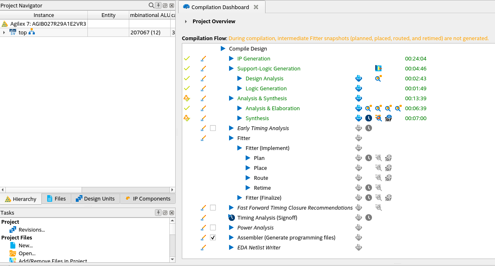
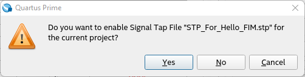
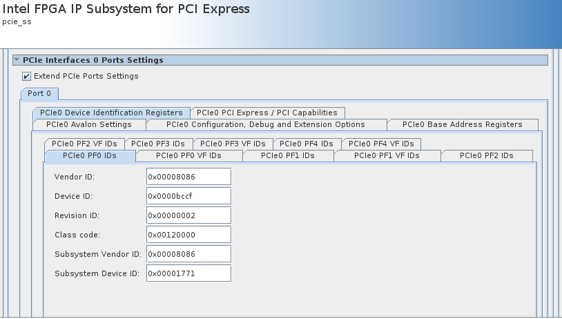
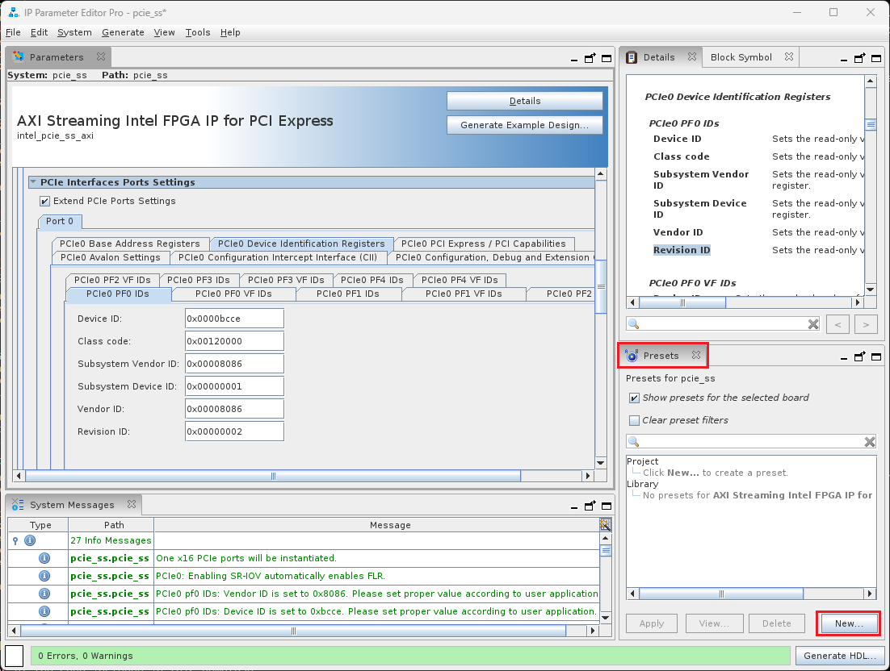
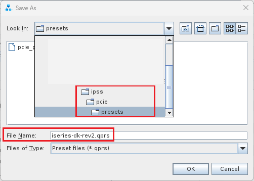

# FPGA Interface Manager Developer Guide for Open FPGA Stack: Intel Agilex® 7 FPGA I-Series Development Kit (2x R-Tile and 1xF-Tile) PCIe Attach

Last updated: **February 03, 2024** 

## **1. Introduction**

### **1.1. About This Document**

This document serves as a guide for OFS Agilex PCIe Attach developers targeting the Intel Agilex® 7 FPGA I-Series Development Kit (2x R-Tile and 1xF-Tile). The following topics are covered in this guide:

* Compiling the OFS Agilex PCIe Attach FIM design
* Simulating the OFS Agilex PCIe Attach design
* Customizing the OFS Agilex PCIe Attach FIM design
* Configuring the FPGA with an OFS Agilex PCIe Attach FIM design

The *FIM Development Walkthroughs Table* lists all of the walkthroughs provided in this guide. These walkthroughs provide step-by-step instructions for performing different FIM Development tasks.

*Table: FIM Development Walkthroughs*

| Walkthrough Name | Category |
| --- | --- |
| [Install Quartus Prime Pro Software](https://ofs.github.io/ofs-2023.3-2/hw/iseries_devkit/dev_guides/fim_dev/ug_ofs_iseries_dk_fim_dev/#1311-walkthrough-install-quartus-prime-pro-software) | Setup |
| [Install Git Large File Storage Extension](https://ofs.github.io/ofs-2023.3-2/hw/iseries_devkit/dev_guides/fim_dev/ug_ofs_iseries_dk_fim_dev/#1312-walkthrough-install-git-large-file-storage-extension) | Setup |
| [Clone FIM Repository](https://ofs.github.io/ofs-2023.3-2/hw/iseries_devkit/dev_guides/fim_dev/ug_ofs_iseries_dk_fim_dev/#1321-walkthrough-clone-fim-repository) | Setup |
| [Set Development Environment Variables](https://ofs.github.io/ofs-2023.3-2/hw/iseries_devkit/dev_guides/fim_dev/ug_ofs_iseries_dk_fim_dev/#1331-walkthrough-set-development-environment-variables) | Setup |
| [Set Up Development Environment](https://ofs.github.io/ofs-2023.3-2/hw/iseries_devkit/dev_guides/fim_dev/ug_ofs_iseries_dk_fim_dev/#134-walkthrough-set-up-development-environment) | Setup |
| [Compile OFS FIM](https://ofs.github.io/ofs-2023.3-2/hw/iseries_devkit/dev_guides/fim_dev/ug_ofs_iseries_dk_fim_dev/#225-walkthrough-compile-ofs-fim) | Compilation |
| [Manually Generate OFS Out-Of-Tree PR FIM](https://ofs.github.io/ofs-2023.3-2/hw/iseries_devkit/dev_guides/fim_dev/ug_ofs_iseries_dk_fim_dev/#226-walkthrough-manually-generate-ofs-out-of-tree-pr-fim) | Compilation |
| [Change the Compilation Seed](https://ofs.github.io/ofs-2023.3-2/hw/iseries_devkit/dev_guides/fim_dev/ug_ofs_iseries_dk_fim_dev/#2271-walkthrough-change-the-compilation-seed) | Compilation |
| [Running Individual Unit Level Simulation](https://ofs.github.io/ofs-2023.3-2/hw/iseries_devkit/dev_guides/fim_dev/ug_ofs_iseries_dk_fim_dev/#321-walkthrough-running-individual-unit-level-simulation) | Simulation |
| [Running Regression Unit Level Simulation](https://ofs.github.io/ofs-2023.3-2/hw/iseries_devkit/dev_guides/fim_dev/ug_ofs_iseries_dk_fim_dev/#331-walkthrough-running-regression-unit-level-simulation) | Simulation |
| [Add a new module to the OFS FIM](https://ofs.github.io/ofs-2023.3-2/hw/iseries_devkit/dev_guides/fim_dev/ug_ofs_iseries_dk_fim_dev/#412-walkthrough-add-a-new-module-to-the-ofs-fim) | Customization |
| [Modify and run unit tests for a FIM that has a new module](https://ofs.github.io/ofs-2023.3-2/hw/iseries_devkit/dev_guides/fim_dev/ug_ofs_iseries_dk_fim_dev/#413-walkthrough-modify-and-run-unit-tests-for-a-fim-that-has-a-new-module) | Customization |
| [Hardware test a FIM that has a new module](https://ofs.github.io/ofs-2023.3-2/hw/iseries_devkit/dev_guides/fim_dev/ug_ofs_iseries_dk_fim_dev/#414-walkthrough-hardware-test-a-fim-that-has-a-new-module) | Customization |
| [Debug the FIM with Signal Tap](https://ofs.github.io/ofs-2023.3-2/hw/iseries_devkit/dev_guides/fim_dev/ug_ofs_iseries_dk_fim_dev/#415-walkthrough-debug-the-fim-with-signal-tap) | Customization |
| [Compile the FIM in preparation for designing your AFU](https://ofs.github.io/ofs-2023.3-2/hw/iseries_devkit/dev_guides/fim_dev/ug_ofs_iseries_dk_fim_dev/#421-walkthrough-compile-the-fim-in-preparation-for-designing-your-afu) | Customization |
| [Resize the Partial Reconfiguration Region](https://ofs.github.io/ofs-2023.3-2/hw/iseries_devkit/dev_guides/fim_dev/ug_ofs_iseries_dk_fim_dev/#431-walkthrough-resize-the-partial-reconfiguration-region) | Customization |
| [Modify the PCIe Sub-System and PF/VF MUX Configuration Using OFSS](https://ofs.github.io/ofs-2023.3-2/hw/iseries_devkit/dev_guides/fim_dev/ug_ofs_iseries_dk_fim_dev/#4431-walkthrough-modify-the-pcie-sub-system-and-pfvf-mux-configuration-using-ofss) | Customization |
| [Modify PCIe Configuration Using IP Presets](https://ofs.github.io/ofs-2023.3-2/hw/iseries_devkit/dev_guides/fim_dev/ug_ofs_iseries_dk_fim_dev/#4441-walkthrough-modify-pcie-configuration-using-ip-presets) | Customization |
| [Migrate to a Different Agilex Device Number](https://ofs.github.io/ofs-2023.3-2/hw/iseries_devkit/dev_guides/fim_dev/ug_ofs_iseries_dk_fim_dev/#461-walkthrough-migrate-to-a-different-agilex-device-number) | Customization |
| [Modify the Ethernet Sub-System to 1x400GbE](https://ofs.github.io/ofs-2023.3-2/hw/iseries_devkit/dev_guides/fim_dev/ug_ofs_iseries_dk_fim_dev/#471-walkthrough-modify-the-ethernet-sub-system-to-1x400gbe) | Customization |
| [Set up JTAG](https://ofs.github.io/ofs-2023.3-2/hw/iseries_devkit/dev_guides/fim_dev/ug_ofs_iseries_dk_fim_dev/#51-walkthrough-set-up-jtag) | Configuration |
| [Program the FPGA via JTAG](https://ofs.github.io/ofs-2023.3-2/hw/iseries_devkit/dev_guides/fim_dev/ug_ofs_iseries_dk_fim_dev/#52-walkthrough-program-the-fpga-via-jtag) | Configuration |

#### **1.1.1 Knowledge Pre-Requisites**

It is recommended that you have the following knowledge and skills before using this developer guide.

* Basic understanding of OFS and the difference between OFS designs. Refer to the [OFS Welcome Page](https://ofs.github.io/ofs-2023.3/).
* Review the [release notes](https://github.com/OFS/ofs-agx7-pcie-attach/releases/tag/ofs-2023.3-1) for the Intel Agilex 7 PCIe Attach Reference Shells, with careful consideration of the **Known Issues**.
* Review of [Getting Started Guide: Open FPGA Stack for Intel® Agilex® 7 PCIe Attach FPGAs (Intel Agilex 7 FPGA I-Series Development Kit (2xR-Tile, F-Tile))](https://ofs.github.io/ofs-2023.3-2/hw/iseries_devkit/user_guides/ug_qs_ofs_iseries/ug_qs_ofs_iseries/)
* FPGA compilation flows using Intel® Quartus® Prime Pro Edition.
* Static Timing closure, including familiarity with the Timing Analyzer tool in Intel® Quartus® Prime Pro Edition, applying timing constraints, Synopsys* Design Constraints (.sdc) language and Tcl scripting, and design methods to close on timing critical paths.
* RTL (System Verilog) and coding practices to create synthesized logic.
* RTL simulation tools.
* Intel® Quartus® Prime Pro Edition Signal Tap Logic Analyzer tool software.

### **1.2. FIM Development Theory**

This section will help you understand how the OFS Agilex PCIe Attach FIM can be developed to fit your design goals.

The [Default FIM Features](https://ofs.github.io/ofs-2023.3-2/hw/iseries_devkit/dev_guides/fim_dev/ug_ofs_iseries_dk_fim_dev/#121-default-fim-features) section provides general information about the default features of the OFS Agilex PCIe Attach FIM so you can become familiar with the default design. For more detailed information about the FIM architecture, refer to the [OFS Agilex PCIe Attach FIM Technical Reference Manual](https://ofs.github.io/ofs-2023.3-2/hw/n6001/reference_manuals/ofs_fim/mnl_fim_ofs_n6001/).

The [Customization Options](https://ofs.github.io/ofs-2023.3-2/hw/iseries_devkit/dev_guides/fim_dev/ug_ofs_iseries_dk_fim_dev/#122-customization-options) section then gives suggestions of how this default design can be customized. Step-by-step walkthroughs for many of the suggested customizations are later described in the [FIM Customization](https://ofs.github.io/ofs-2023.3-2/hw/iseries_devkit/dev_guides/fim_dev/ug_ofs_iseries_dk_fim_dev/#4-fim-customization) section.

FIM development for a new acceleration card generally consists of the following steps:

1. Install OFS and familiarize yourself with provided scripts and source code
2. Develop high level design with your specific functionality
  1. Determine requirements and key performance metrics
  2. Select IP cores
  3. Select FPGA device
  4. Develop software memory map
3. Select and implement FIM Physical interfaces including:
  1. External clock sources and creation of internal PLL clocks
  2. General I/O
  3. Ethernet modules
  4. External memories
  5. FPGA programming methodology
4. Develop device physical implementation
  1. FPGA device pin assignment
  2. Create logic lock regions
  3. Create of timing constraints
  4. Create Intel Quartus Prime Pro FIM test project and validate:
    1. Placement
    2. Timing constraints
    3. Build script process
    4. Review test FIM FPGA resource usage
5. Select FIM to AFU interfaces and development of PIM
6. Implement FIM design
  1. Develop RTL
  2. Instantiate IPs
  3. Develop test AFU to validate FIM
  4. Develop unit and device level simulation
  5. Develop timing constraints and build scripts
  6. Perform timing closure and build validation
7. Create FIM documentation to support AFU development and synthesis
8. Software Device Feature discovery
9. Integrate, validate, and debug hardware/software
10. Prepare for high volume production

### **1.2.1 Default FIM Features**

#### **1.2.1.1 Top Level**

*Figure: OFS Agilex PCIe Attach iseries-dk FIM Top-Level Diagram*


#### **1.2.1.2 Interfaces**

The key interfaces in the OFS Agilex PCIe Attach design are listed in the *Release Capabilities Table*. It describes the capabilities of the iseries-dk hardware as well as the capabilities of the default OFS Agilex PCIe Attach design targeting the iseries-dk.

*Table: Release Capabilities*

| Interface | iseries-dk Hardware Capabilities | OFS Agilex PCIe Attach Default Design Implementation |
| --- | --- | --- |
| Host Interface<sup>**[1]**</sup> | PCIe Gen5x16 | Bifurcated PCIe Gen5x8 (Only 1 PCIe interface implemented) |
| Network Interface | 2 - QSFP-DD | 3 Build Options:</br> 1. QSFP 1,0 = 25 GbE</br>2. QSFP 1,0 = 200 GbE  </br>3. QSFP 0 = 400 GbE |
| External Memory | 2 - board mounted independent single rank DDR4-2666 8GB (1 Gb x 64 + 8b ECC)</br>Two DIMM sockets where each socket is single memory channels or independent channels (Check Dev Kit OPN for support option).</br>DIMM socket supports DDR4 x72 (ECC) and can operate up to DDR-3200
(depending on the speed of the FPGA used)  | 2xDDR4-2666 - 8GB (1Gb x 64 bits) - ECC not implemented</br>|

> <sup>**[1]**</sup> The I-Series development kit has a form factor of PCIe x16, however in this release the PCIe Subsystem only supports bifurcated PCIe Gen5 x 8.  The FIM only connects 1 of the 2 PCIe links.  Future releases will support Gen5 x 16.

#### **1.2.1.3 Subsystems**

The *FIM Subsystems* Table  describes the Platform Designer IP subsystems used in the OFS Agilex PCIe Attach iseries-dk FIM.

*Table: FIM Subsystems*

| Subsystem | User Guide | Document ID |
| --- | --- | --- |
| PCIe Subsystem | [PCIe Subsystem Intel FPGA IP User Guide for Intel Agilex OFS](https://ofs.github.io/ofs-2023.3-2/hw/common/user_guides/ug_qs_pcie_ss.pdf) | N/A |
| Memory Subsystem | [Memory Subsystem Intel FPGA IP User Guide for Intel Agilex OFS](https://www.intel.com/content/www/us/en/docs/programmable/789391/23-3-1-0-0/f-series-and-i-series-fpga-memory-subsystem-61448.html) | 686148<sup>**[1]**</sup> |
| Ethernet Subsystem | [Ethernet Subsystem Intel FPGA IP User Guide](https://www.intel.com/content/www/us/en/docs/programmable/773413/23-3-23-0-0/introduction.html) | 773413<sup>**[1]**</sup> |

<sup>**[1]**</sup> You must log in to myIntel and request entitled access.

#### **1.2.1.4 Host Exercisers**

The default AFU workload in the OFS Agilex PCIe Attach iseries-dk FIM contains several modules called Host Exercisers which are used to exercise the interfaces on the board. The *Host Exerciser Descriptions* Table describes these modules.

*Table: Host Exerciser Descriptions*

|Name | Acronym | Description | OPAE Command |
| --- | --- | --- | --- |
| Host Exerciser Loopback | HE-LB | Used to exercise and characterize host to FPGA data transfer. | `host_exerciser` |
| Host Exerciser Memory | HE_MEM | Used to exercise and characterize host to Memory data transfer. | `host_exerciser` |
| Host Exerciser Memory Traffic Generator| HE_MEM_TG | Used to exercise and test available memory channels with a configurable traffic pattern. | `mem_tg`
| Host Exerciser High Speed Serial Interface | HE-HSSI | Used to exercise and characterize HSSI interfaces. | `hssi` |

The host exercisers can be removed from the design at compile-time using command line arguments for the build script.

#### **1.2.1.5 Module Access via APF/BPF**

The OFS Agilex PCIe Attach iseries-dk FIM uses AXI4-Lite interconnect logic named the AFU Peripheral Fabric (APF) and Board Peripheral Fabric (BPF) to access the registers of the various modules in the design. The APF/BPF modules define master/slave interactions, namely between the host software and AFU and board peripherals. The *APF Address Map Table* describes the address mapping of the APF, followed by the *BPF Address Map Table* which describes the address mapping of the BPF.

*Table: APF Address Map*

| Address | Size (Bytes) | Feature |
| --- | --- | --- |
| 0x00000–0x3FFFF | 256K | Board Peripherals (See *BPF Address Map* table) |
| 0x40000 – 0x4FFFF | 64K | ST2MM
| 0x50000 – 0x5FFFF | 64K | Reserved
| 0x60000 – 0x60FFF | 4K | UART (not used)
| 0x61000 – 0x6FFFF | 4K | Reserved
| 0x70000 – 0x7FFFF | 56K | PR Gasket:4K= PR Gasket DFH, control and status4K= Port DFH4K=User Clock52K=Remote STP
| 0x80000 – 0x80FFF | 4K | AFU Error Reporting

*Table: BPF Address Mapping*

| Address | Size (Bytes) | Feature |
| --- | --- | --- |
| 0x00000 - 0x0FFFF | 64K | FME |
| 0x10000 - 0x10FFF | 4K | PCIe |
| 0x11000 - 0x11FFF | 4K | Reserved |
| 0x12000 - 0x12FFF | 4K | QSFP0 |
| 0x13000 - 0x13FFF | 4K | QSFP1 |
| 0x14000 - 0x14FFF | 4K | HSSI |
| 0x15000 - 0x15FFF | 4K | EMIF |
| 0x20000 - 0x3FFFF | 128K | PMCI (note, PMCI is not implemented) | 

### **1.2.2 Customization Options**

OFS is designed to be easily customizable to meet your design needs. The *OFS FIM Customizations Table* lists the general user flows for OFS Agilex PCIe Attach iseries-dk FIM development, along with example customizations for each user flow, plus links to step-by-step walkthroughs where available.

*Table: OFS FIM Customizations*

| Customization Walkthrough Name |
| --- |
| [Add a new module to the OFS FIM](https://ofs.github.io/ofs-2023.3-2/hw/iseries_devkit/dev_guides/fim_dev/ug_ofs_iseries_dk_fim_dev/#412-walkthrough-add-a-new-module-to-the-ofs-fim) |
| [Modify and run unit tests for a FIM that has a new module](https://ofs.github.io/ofs-2023.3-2/hw/iseries_devkit/dev_guides/fim_dev/ug_ofs_iseries_dk_fim_dev/#413-walkthrough-modify-and-run-unit-tests-for-a-fim-that-has-a-new-module) |
| [Hardware test a FIM that has a new module](https://ofs.github.io/ofs-2023.3-2/hw/iseries_devkit/dev_guides/fim_dev/ug_ofs_iseries_dk_fim_dev/#414-walkthrough-hardware-test-a-fim-that-has-a-new-module) |
| [Debug the FIM with Signal Tap](https://ofs.github.io/ofs-2023.3-2/hw/iseries_devkit/dev_guides/fim_dev/ug_ofs_iseries_dk_fim_dev/#415-walkthrough-debug-the-fim-with-signal-tap) |
| [Compile the FIM in preparation for designing your AFU](https://ofs.github.io/ofs-2023.3-2/hw/iseries_devkit/dev_guides/fim_dev/ug_ofs_iseries_dk_fim_dev/#421-walkthrough-compile-the-fim-in-preparation-for-designing-your-afu) |
| [Resize the Partial Reconfiguration Region](https://ofs.github.io/ofs-2023.3-2/hw/iseries_devkit/dev_guides/fim_dev/ug_ofs_iseries_dk_fim_dev/#431-walkthrough-resize-the-partial-reconfiguration-region) |
| [Modify the PCIe Sub-System and PF/VF MUX Configuration Using OFSS](https://ofs.github.io/ofs-2023.3-2/hw/iseries_devkit/dev_guides/fim_dev/ug_ofs_iseries_dk_fim_dev/#4431-walkthrough-modify-the-pcie-sub-system-and-pfvf-mux-configuration-using-ofss) |
| [Modify PCIe Configuration Using IP Presets](https://ofs.github.io/ofs-2023.3-2/hw/iseries_devkit/dev_guides/fim_dev/ug_ofs_iseries_dk_fim_dev/#4441-walkthrough-modify-pcie-configuration-using-ip-presets) |
| [Migrate to a Different Agilex Device Number](https://ofs.github.io/ofs-2023.3-2/hw/iseries_devkit/dev_guides/fim_dev/ug_ofs_iseries_dk_fim_dev/#461-walkthrough-migrate-to-a-different-agilex-device-number) |
| [Modify the Ethernet Sub-System to 1x400GbE](https://ofs.github.io/ofs-2023.3-2/hw/iseries_devkit/dev_guides/fim_dev/ug_ofs_iseries_dk_fim_dev/#471-walkthrough-modify-the-ethernet-sub-system-to-1x400gbe) |

### **1.3 Development Environment**

This section describes the components required for OFS FIM development, and provides a walkthrough for setting up the environment on your development machine.

Note that your development machine may be different than your deployment machine where the FPGA acceleration card is installed. FPGA development work and deployment work can be performed either on the same machine, or on different machines as desired. Please see the [Getting Started Guide: Open FPGA Stack for Intel® Agilex® 7 PCIe Attach FPGAs (Intel Agilex 7 FPGA I-Series Development Kit (2xR-Tile, F-Tile))](https://ofs.github.io/ofs-2023.3-2/hw/iseries_devkit/user_guides/ug_qs_ofs_iseries/ug_qs_ofs_iseries/) for instructions on setting up the environment for deployment machines.

#### **1.3.1 Development Tools**

The *Development Environment Table* describes the Best Known Configuration (BKC) for the tools that are required for OFS FIM development.

*Table: Development Environment BKC*

| Component | Version | Installation Walkthrough |
| --- | --- | --- |
| Operating System | RedHat® Enterprise Linux® (RHEL) 8.6 | N/A |
| Intel Quartus Prime Software | Quartus Prime Pro Version 23.3 for Linux + Patches 0.13 patch (Generic Serial Flash Interface IP), 0.21 patch (PCIe) | Section 1.3.1.1 |
| Python | 3.6.8 or later | N/A |
| GCC | 7.4.0 or later | N/A |
| cmake | 3.15 or later | N/A |
| git with git-lfs | 1.8.3.1 or later | Section 1.3.1.2 |
| FIM Source Files | ofs-2023.3-2 | Section 1.3.2.1 |

##### **1.3.1.1 Walkthrough: Install Quartus Prime Pro Software**

**Intel Quartus Prime Pro Version 23.3** is verified to work with the latest OFS release ofs-2023.3-2.  However, you have the option to port and verify the release on newer versions of Intel Quartus Prime Pro software.

Use RedHat® Enterprise Linux® (RHEL) 8.6 for compatibility with your development flow and also testing your FIM design in your platform. 

Prior to installing Quartus:

1. Ensure you have at least 64 GB of free space for Quartus Prime Pro installation and your development work.
  * Intel® recommends that your system be configured to provide virtual memory equal in size or larger than the recommended physical RAM size that is required to process your design.
  * The disk space may be significantly more based on the device families included in the install. Prior to installation, the disk space should be enough to hold both zipped tar files and uncompressed installation files. After successful installation, delete the downloaded zipped files and uncompressed zip files to release the disk space.

2. Perform the following steps to satisfy the required dependencies.

  ```bash
  $ sudo dnf install -y gcc gcc-c++ make cmake libuuid-devel rpm-build autoconf automake bison boost boost-devel libxml2 libxml2-devel make ncurses grub2 bc csh flex glibc-locale-source libnsl ncurses-compat-libs 
  ```

  Apply the following configurations.

  ```bash
  $ sudo localedef -f UTF-8 -i en_US en_US.UTF-8 
  $ sudo ln -s /usr/lib64/libncurses.so.6 /usr/lib64/libncurses.so.5 
  $ sudo ln -s /usr/bin/python3 /usr/bin/python
  ```

3. Create the default installation path: <home directory>/intelFPGA_pro/<version number>, where <home directory> is the default path of the Linux workstation, or as set by the system administrator and <version> is your Quartus version number.

  The installation path must satisfy the following requirements:

  * Contain only alphanumeric characters
  * No special characters or symbols, such as !$%@^&*<>,
  * Only English characters
  * No spaces

4. Download your required Quartus Prime Pro Linux version [here](https://www.intel.com/content/www/us/en/products/details/fpga/development-tools/quartus-prime/resource.html).

5. Install required Quartus patches. The Quartus patch `.run` files can be found in the **Assets** tab on the [OFS Release GitHub page](https://github.com/OFS/ofs-agx7-pcie-attach/releases/tag/ofs-2023.3-2). The patches for this release are 0.13 patch (Generic Serial Flash Interface IP), 0.21 patch (PCIe).

6. After running the Quartus Prime Pro installer, set the PATH environment variable to make utilities `quartus`, `jtagconfig`, and `quartus_pgm` discoverable. Edit your bashrc file `~/.bashrc` to add the following line:

  ```bash
  export PATH=<Quartus install directory>/quartus/bin:$PATH
  export PATH=<Quartus install directory>/qsys/bin:$PATH
  ```

  For example, if the Quartus install directory is /home/intelFPGA_pro/23.3 then the new line is:

  ```bash
  export PATH=/home/intelFPGA_pro/23.3/quartus/bin:$PATH
  export PATH=/home/intelFPGA_pro/23.3/qsys/bin:$PATH
  ```

7. Verify, Quartus is discoverable by opening a new shell:

  ```
  $ which quartus
  /home/intelFPGA_pro/23.3/quartus/bin/quartus
  ```


##### **1.3.1.2 Walkthrough: Install Git Large File Storage Extension**

To install the Git Large File Storage (LFS) extension, execute the following commands:

1. Obtain Git LFS package
    ```bash
    curl -s https://packagecloud.io/install/repositories/github/git-lfs/script.rpm.sh | sudo bash
    ```
2. Install Git LFS package
    ```bash
    sudo dnf install git-lfs
    ```
3. Install Git LFS
    ```bash
    git lfs install
    ```

#### **1.3.2 FIM Source Files**

The source files for the OFS Agilex PCIe Attach FIM are provided in the following repository: [https://github.com/OFS/ofs-agx7-pcie-attach/releases/tag/ofs-2023.3-2](https://github.com/OFS/ofs-agx7-pcie-attach/releases/tag/ofs-2023.3-2)

Some essential directories in the repository are described as follows:

```bash
ofs-agx7-pcie-attach
|  syn						// Contains files related to synthesis
|  |  board						// Contains synthesis files for several cards, including the iseries-dk 
|  |  |  iseries-dk					// Contains synthesis files for iseries-dk
|  |  |  |  setup						// Contains setup files, including pin constraints and location constraints
|  |  |  |  syn_top						// Contains Quartus project files
|  verification				// Contains files for UVM testing
|  ipss						// Contains files for IP Sub-Systems
|  |  qsfp						// Contains source files for QSFP Sub-System
|  |  hssi						// Contains source files for HSSI Sub-System
|  |  pmci						// Contains source files for PMCI Sub-System (not used in F-Tile FIM)
|  |  pcie						// Contains source files for PCIe Sub-System
|  |  mem						// Contains source files for Memory Sub-System
|  sim						// Contains simulation files
|  |  unit_test					// Contains files for all unit tests
|  |  |  scripts					// Contains script to run regression unit tests
|  license					// Contains Quartus patch
|  ofs-common				// Contains files which are common across OFS platforms
|  |  verification				// Contains common UVM files
|  |  scripts					// Contains common scripts
|  |  |  common
|  |  |  |  syn							// Contains common scripts for synthesis, including build script
|  |  |  |  sim							// Contains common scripts for simulation
|  |  tools						// Contains common tools files
|  |  |  mk_csr_module				// Contains common files for CSR modules
|  |  |  fabric_generation			// Contains common files for APF/BPF fabric generation
|  |  |  ofss_config				// Contains common files for OFSS configuration tool
|  |  |  |  ip_params					// Contains default IP parameters for certain Sub-Systems when using OFSS
|  |  src						// Contains common source files, including host exercisers
|  tools					//
|  |  ofss_config				// Contains top level OFSS files for each pre-made board configuration
|  |  |  hssi						// Contains OFSS files for Ethernet-SS configuraiton
|  |  |  memory						// Contains OFSS files for Memory-SS configuration
|  |  |  pcie						// Contains OFSS files for PCIe-SS configuration
|  |  |  iopll						// Contains OFSS files for IOPLL configuration
|  src						// Contains source files for Agilex PCIe Attach FIM
|  |  pd_qsys					// Contains source files related to APF/BPF fabric
|  |  includes					// Contains source file header files
|  |  top						// Contains top-level source files, including design top module
|  |  afu_top					// Contains top-level source files for AFU
```

##### **1.3.2.1 Walkthrough: Clone FIM Repository**

Perform the following steps to clone the OFS Agilex PCIe Attach FIM Repository:

1. Create a new directory to use as a clean starting point to store the retrieved files.
    ```bash
    mkdir OFS_BUILD_ROOT
    cd OFS_BUILD_ROOT
    export OFS_BUILD_ROOT=$PWD
    ```
2. Clone GitHub repository using the HTTPS git method
    ```bash
    git clone --recurse-submodules https://github.com/OFS/ofs-agx7-pcie-attach.git
    ```
3. Check out the correct tag of the repository
    ```bash
    cd ofs-agx7-pcie-attach
    git checkout --recurse-submodules tags/ofs-2023.3-2
    ```

#### **1.3.3 Environment Variables**

The OFS FIM compilation and simulation scripts require certain environment variables be set prior to execution.

##### **1.3.3.1 Walkthrough: Set Development Environment Variables**

Perform the following steps to set the required environment variables. These environment variables must be set prior to simulation or compilation tasks so it is recommended that you create a script to set these variables.

1. Navigate to the top level directory of the cloned OFS FIM repository.

  ```bash
  cd ofs-agx7-pcie-attach
  ```

2. Set project variables
  ```bash
  # Set OFS Root Directory - e.g. this is the top level directory of the cloned OFS FIM repository
  export OFS_ROOTDIR=$PWD
  ```

2. Set variables based on your development environment
  ```bash
  # Set proxies if required for your server
  export http_proxy=<YOUR_HTTP_PROXY>
  export https_proxy=<YOUR_HTTPS_PROXY>
  export ftp_proxy=<YOUR_FTP_PROXY>
  export socks_proxy=<YOUR_SOCKS_PROXY>
  export no_proxy=<YOUR_NO_PROXY>

  # Set Quartus license path
  export LM_LICENSE_FILE=<YOUR_LM_LICENSE_FILE>

  # Set Synopsys License path (if using Synopsys for simulation)
  export DW_LICENSE_FILE=<YOUR_DW_LICENSE_FILE>
  export SNPSLMD_LICENSE_FILE=<YOUR_SNPSLMD_LICENSE_FILE>

  # Set Quartus Installation Directory - e.g. $QUARTUS_ROOTDIR/bin contains Quartus executables
  export QUARTUS_ROOTDIR=<YOUR_QUARTUS_INSTALLATION_DIRECTORY>

  # Set the Tools Directory - e.g. $TOOLS_LOCATION contains the 'synopsys' directory if you are using Synopsys. Refer to the $VCS_HOME variable for an example.
  export TOOLS_LOCATION=<YOUR_TOOLS_LOCATION>
  ```

3. Set generic environment variables

  ```bash
  # Set Work directory 
  export WORKDIR=$OFS_ROOTDIR

  # Set Quartus Tools variables
  export QUARTUS_HOME=$QUARTUS_ROOTDIR
  export QUARTUS_INSTALL_DIR=$QUARTUS_ROOTDIR
  export QUARTUS_ROOTDIR_OVERRIDE=$QUARTUS_ROOTDIR
  export QUARTUS_VER_AC=$QUARTUS_ROOTDIR
  export IP_ROOTDIR=$QUARTUS_ROOTDIR/../ip
  export IMPORT_IP_ROOTDIR=$IP_ROOTDIR
  export QSYS_ROOTDIR=$QUARTUS_ROOTDIR/../qsys/bin

  # Set Verification Tools variables (if running simulations)
  export DESIGNWARE_HOME=$TOOLS_LOCATION/synopsys/vip_common/vip_Q-2020.03A
  export UVM_HOME=$TOOLS_LOCATION/synopsys/vcsmx/S-2021.09-SP1/linux64/rhel/etc/uvm
  export VCS_HOME=$TOOLS_LOCATION/synopsys/vcsmx/S-2021.09-SP1/linux64/rhel
  export MTI_HOME=$QUARTUS_ROOTDIR/../questa_fse
  export VERDIR=$OFS_ROOTDIR/verification
  export VIPDIR=$VERDIR

  # Set PATH to include compilation and simulation tools
  export PATH=$QUARTUS_HOME/bin:$QUARTUS_HOME/../qsys/bin:$QUARTUS_HOME/sopc_builder/bin/:$IOFS_BUILD_ROOT/opae-sdk/install-opae-sdk/bin:$MTI_HOME/linux_x86_64/:$MTI_HOME/bin/:$DESIGNWARE_HOME/bin:$VCS_HOME/bin:$PATH
  ```


#### **1.3.4 Walkthrough: Set Up Development Environment**

This walkthrough guides you through the process of setting up your development environment in preparation for FIM development. This flow only needs to be done once on your development machine.

1. Ensure that Quartus Prime Pro Version 23.3 for Linux with Intel Agilex FPGA device support is installed on your development machine. Refer to the [Install Quartus Prime Pro Software](https://ofs.github.io/ofs-2023.3-2/hw/iseries_devkit/dev_guides/fim_dev/ug_ofs_iseries_dk_fim_dev/#1311-walkthrough-install-quartus-prime-pro-software) section for step-by-step installation instructions.

  1. Verify version number

      ```bash
      quartus_sh --version
      ```

      Example Output:

      ```bash
      Quartus Prime Shell
      Version 23.3 Build 94 06/14/2023 SC Pro Edition
      Copyright (C) 2023  Intel Corporation. All rights reserved.
      ```

2. Ensure that all support tools are installed on your development machine, and that they meet the version requirements.

  1. Python 3.6.8 or later

    1. Verify version number

      ```bash
      python --version
      ```

      Example Output:

      ```bash
      Python 3.6.8
      ```

  2. GCC 7.4.0 or later
    1. Verify version number

      ```bash
      gcc --version
      ```

      Example output:

      ```bash
      gcc (GCC) 7.4.0
      ```

  3. cmake 3.15 or later
    1. Verify version number

      ```bash
      cmake --version
      ```

      Example output:

      ```bash
      cmake version 3.15
      ```

  4. git with git-lfs 1.8.3.1 or later. Refer to the [Install Git Large File Storage Extension](https://ofs.github.io/ofs-2023.3-2/hw/iseries_devkit/dev_guides/fim_dev/ug_ofs_iseries_dk_fim_dev/#1312-walkthrough-install-git-large-file-storage-extension) section for step-by-step instructions on installing the Git Large File Storage (LFS) extension.

    1. Verify version number

      ```bash
      git --version
      ```

      Example output:

      ```bash
      git version 1.8.3.1
      ```

3. Clone the ofs-agx7-pcie-attach repository. Refer to the [Clone FIM Repository](https://ofs.github.io/ofs-2023.3-2/hw/iseries_devkit/dev_guides/fim_dev/ug_ofs_iseries_dk_fim_dev/#1321-walkthrough-clone-fim-repository) section for step-by-step instructions.

4. Install UART IP license patch `.02`.

  1. Navigate to the `license` directory

    ```bash
    cd $IOFS_BUILD_ROOT/license
    ```

  2. Install Patch 0.02

    ```bash
    sudo ./quartus-0.0-0.02iofs-linux.run
    ```

5. Install Quartus Patches 0.13 patch (Generic Serial Flash Interface IP), 0.21 patch (PCIe). All required patches are provided in the **Assets** of the OFS FIM Release Tag: [https://github.com/OFS/ofs-agx7-pcie-attach/releases/tag/ofs-2023.3-2](https://github.com/OFS/ofs-agx7-pcie-attach/releases/tag/ofs-2023.3-2)

6. Verify that patches have been installed correctly. They should be listed in the output of the following command.

  ```bash
  quartus_sh --version
  ```

5. Set required environment variables. Refer to the [Set Environment Variables] section for step-by-step instructions.

This concludes the walkthrough for setting up your development environment. At this point you are ready to begin FIM development.

## **2. FIM Compilation**

This section describes the process of compiling OFS FIM designs using the provided build scripts. It contains two main sections:

* [Compilation Theory](https://ofs.github.io/ofs-2023.3-2/hw/iseries_devkit/dev_guides/fim_dev/ug_ofs_iseries_dk_fim_dev/#21-compilation-theory) - Describes the theory behind FIM compilation
* [Compilation Flows](https://ofs.github.io/ofs-2023.3-2/hw/iseries_devkit/dev_guides/fim_dev/ug_ofs_iseries_dk_fim_dev/#22-compilation-flows) - Describes the process of compiling a FIM

The walkthroughs provided in this section are:

* [Compile OFS FIM](https://ofs.github.io/ofs-2023.3-2/hw/iseries_devkit/dev_guides/fim_dev/ug_ofs_iseries_dk_fim_dev/#225-walkthrough-compile-ofs-fim)
* [Manually Generate OFS Out-Of-Tree PR FIM](https://ofs.github.io/ofs-2023.3-2/hw/iseries_devkit/dev_guides/fim_dev/ug_ofs_iseries_dk_fim_dev/#226-walkthrough-manually-generate-ofs-out-of-tree-pr-fim)
* [Change the Compilation Seed](https://ofs.github.io/ofs-2023.3-2/hw/iseries_devkit/dev_guides/fim_dev/ug_ofs_iseries_dk_fim_dev/#2271-walkthrough-change-the-compilation-seed)

### **2.1 Compilation Theory**

This section describes the theory behind FIM compilation.

#### **2.1.1 FIM Build Script**

The OFS Common Repository contains a script named `build_top.sh` which is used to build OFS FIM designs and generate output files that can be programmed to the board. After cloning the OFS FIM repository (with the ofs-common repository included), the build script can be found in the following location:

```bash
$OFS_ROOTDIR/ofs-common/scripts/common/syn/build_top.sh
```

The usage of the `build_top.sh` script is as follows:

```bash
build_top.sh [-k] [-p] [-e] [--stage=<action>] [--ofss=<ip_config>] <build_target>[:<fim_options>] [<work_dir_name>]
```

| Field | Options | Description | Requirement |
| --- | --- | --- | --- |
| `-k` | None | Keep. Preserves and rebuilds within an existing work tree instead of overwriting it. | Optional |
| `-p` | None | When set, and if the FIM supports partial reconfiguration, a PR template tree is generated at the end of the FIM build. The PR template tree is located in the top of the work directory but is relocatable and uses only relative paths. See $OFS_ROOTDIR/syn/common/scripts generate_pr_release.sh for details. | Optional |
| `-e` | None | Run only Quartus analysis and elaboration. It completes the `setup` stage, passes `-end synthesis` to the Quartus compilation flow and exits without running the `finish` stage. | Optional |
| `--stage` | `all` \| `setup` \| `compile` \| `finish` | Controls which portion of the OFS build is run.</br>&nbsp;&nbsp;- `all`: Run all build stages (default)</br>&nbsp;&nbsp;- `setup`: Initialize a project in the work directory</br>&nbsp;&nbsp;- `compile`: Run the Quartus compilation flow on a project that was already initialized with `setup`</br>&nbsp;&nbsp;- `finish`: Complete OFS post-compilation tasks, such as generating flash images and, if `-p` is set, generating a release. | Optional |
| `--ofss` | `<ip_config>` | Used to modify IP, such as the PCIe SS, using .ofss configuration files. This parameter is consumed during the setup stage and IP is updated only inside the work tree. More than one .ofss file may be passed to the `--ofss` switch by concatenating them separated by commas. For example: `--ofss config_a.ofss,config_b.ofss`. | Optional |
| `<build_target>` | `iseries-dk` | Specifies which board is being targeted. | Required |
| `<fim_options>` | `flat` \| `null_he_lb` \| `null_he_hssi` \| `null_he_mem` \| `null_he_mem_tg` \| `no_hssi` | Used to change how the FIM is built.</br>&nbsp;&nbsp;&bull; `flat` - Compiles a flat design (no PR assignments). This is useful for bringing up the design on a new board without dealing with PR complexity.</br>&nbsp;&nbsp;&bull; `null_he_lb` - Replaces the Host Exerciser Loopback (HE_LBK) with `he_null`.</br>&nbsp;&nbsp;&bull; `null_he_hssi` - Replaces the Host Exerciser HSSI (HE_HSSI) with `he_null`.</br>&nbsp;&nbsp;&bull; `null_he_mem` - Replaces the Host Exerciser Memory (HE_MEM) with `he_null`.</br>&nbsp;&nbsp;&bull; `null_he_mem_tg` - Replaces the Host Exerciser Memory Traffic Generator with `he_null`.</br>&nbsp;&nbsp;&bull; `no_hssi` - Removes the HSSI-SS from the design. </br>More than one FIM option may be passed included in the `<fim_options>` list by concatenating them separated by commas. For example: `<build_target>:flat,null_he_lb,null_he_hssi` | Optional | 
| `<work_dir_name>` | String | Specifies the name of the work directory in which the FIM will be built. If not specified, the default target is `$OFS_ROOTDIR/work` | Optional |

> **Note:** The `he_null` is a minimal block with CSRs that responds to PCIe MMIO requests in order to keep PCIe alive.

The build script copies source files from the existing cloned repository into the specified work directory, which are then used for compilation. As such, any changes made in the base source files will be included in all subsequent builds, unless the `-k` option is used, in which case an existing work directories files are used as-is. Likewise, any changes made in a work directory is only applied to that work directory, and will not be updated in the base repository by default.


Refer to [Compile OFS FIM](https://ofs.github.io/ofs-2023.3-2/hw/iseries_devkit/dev_guides/fim_dev/ug_ofs_iseries_dk_fim_dev/#225-walkthrough-compile-ofs-fim) which provides step-by-step instructions for running the `build_top.sh` script with some of the different available options.

#### **2.1.2 OFSS File Usage**

The OFS FIM build script can use OFSS files to easily customize design IP prior to compilation using preset configurations. The OFSS files specify certain parameters for different IPs. Pre-made OFSS files can be found in the `$OFS_ROOTDIR/tools/ofss_config` directory. Using OFSS is provided as a convenience tool for building pre-defined FIMs.

*Table: Provided OFSS Files*

| OFSS File Name | Location | Type | Description |
| --- | --- | --- | --- |
| `iseries-dk.ofss` | `$OFS_ROOTDIR/tools/ofss_config` | Top | Includes the following OFSS files <sup>**[1]**</sup>:</br> &nbsp;&nbsp;&bull; `iseries-dk_base.ofss`</br> &nbsp;&nbsp;&bull; `pcie_host.ofss`</br> &nbsp;&nbsp;&bull; `iopll.ofss`</br> &nbsp;&nbsp;&bull; `memory_ftile.ofss` |
| `iseries-dk_base.ofss` | `$OFS_ROOTDIR/tools/ofss_config` | ofs | Defines certain attributes of the design, including the platform name, device family, fim type, part number, and device ID. |
| `pcie_host_rtile.ofss` | `$OFS_ROOTDIR/tools/ofss_config/pcie` | pcie | Defines the PCIe Subsystem with the following configuration:</br>&nbsp;&nbsp;&bull; PF0 (3 VFs)</br>&nbsp;&nbsp;&bull; PF1 (0 VFs)</br>&nbsp;&nbsp;&bull; PF2 (0 VFs)</br>&nbsp;&nbsp;&bull; PF3 (0 VFs)</br>&nbsp;&nbsp;&bull; PF4 (0 VFs) |
| `iopll.ofss` | `$OFS_ROOTDIR/tools/ofss_config/iopll` | iopll | Sets the IOPLL frequency to `470 MHz` |
| `memory_rtile.ofss` | `$OFS_ROOTDIR/tools/ofss_config/memory` | memory | Defines the memory IP preset file to be used during the build as `iseries-dk` |
| `hssi_8x25_ftile.ofss` | `$OFSS_ROOTDIR/tools/ofss_config/hssi` | hssi | Defines the Ethernet-SS IP preset file to be used during the build as `fseries-dk` |
| `hssi_2x200_ftile.ofss` | `$OFSS_ROOTDIR/tools/ofss_config/hssi` | hssi | Defines the Ethernet-SS IP preset file to be used during the build as `200g-fseries-dk` |
| `hssi_1x400_ftile.ofss` | `$OFSS_ROOTDIR/tools/ofss_config/hssi` | hssi | Defines the Ethernet-SS IP preset file to be used during the build as `400g-fseries-dk` |

<sup>**[1]**</sup> The `iseries-dk.ofss` file does not include an HSSI OFSS file by default. If you are using the `iseries-dk.ofss` file when building the FIM, you must also specify an HSSI OFSS file for F-tile. Refer to the [Compile OFS FIM](https://ofs.github.io/ofs-2023.3-2/hw/iseries_devkit/dev_guides/fim_dev/ug_ofs_iseries_dk_fim_dev/#225-walkthrough-compile-ofs-fim) Section for examples of this flow.

>**Note:** Using OFSS is required for FIM builds targeting the I-Series Development Kit.

There are typically three sections contained within an OFSS file.

* **`[include]`**

  * This section of an OFSS file contains elements separated by a newline, where each element is the path to an OFSS file that is to be included for configuration by the OFSS Configuration Tool. Ensure that any environment variables (e.g. `$OFS_ROOTDIR`) is set correctly. The OFSS Config tool uses breadth first search to include all of the specified OFSS files; the ordering of OFSS files does not matter

* **`[ip]`**

  * This section of an OFSS file contains a key value pair that allows the OFSS Config tool to determine which IP configuration is being passed in. The currently supported values of IP are `ofs`, `iopll`, `pcie`, `memory`, and `hssi`.

* **`[settings]`**

  * This section of an OFSS file contains IP specific settings. Refer to an existing IP OFSS file to see what IP settings are set. For the IP type `ofss``, the settings will be information of the OFS device (platform, family, fim, part #, device_id)

##### **2.1.2.1 Platform OFSS File**

The `<platform>.ofss` file (e.g. `$OFS_ROOTDIR/tools/ofss_config/iseries-dk.ofss`) is the platform level OFSS wrapper file. This is typically the OFSS file that is provided to the build script. It only contains an `include` section which lists all other OFSS files that are to be used when the `<platform>.ofss` file is passed to the build script.

The generic structure of a `<platform>.ofss` file is as follows:

```bash
[include]
<PATH_TO_PLATFORM_BASE_OFSS_FILE>
<PATH_TO_PCIE_OFSS_FILE>
<PATH_TO_IOPLL_OFSS_FILE>
<PATH_TO_MEMORY_OFSS_FILE>
<PATH_TO_HSSI_OFSS_FILE>
```

##### **2.1.2.2 OFS IP OFSS File**

An OFSS file with IP type `ofs` (e.g. `$OFS_ROOTDIR/tools/ofss_config/iseries-dk_base.ofss`) contains board specific information for the target board.

Currently supported configuration options for an OFSS file with IP type `ofs` are described in the *OFS IP OFSS File Options* table.

*Table: OFS IP OFSS File Options*

| Section | Parameter | iseries-dk Default Value |
| --- | --- | --- |
| `[ip]` | `type` | `ofs` |
| `[settings]` | `platform` | N6001 |
| | `family` | agilex |
| | `fim` | base_x16 |
| | `part` | AGIB027R29A1E2VR3 |
| | `device_id` | 6001 |

##### **2.1.2.3 PCIe IP OFSS File**

An OFSS file with IP type `pcie` (e.g. `$OFS_ROOTDIR/tools/ofss_config/pcie/pcie_host.ofss`) is used to configure the PCIe-SS in the FIM.

The PCIe OFSS file has a special section type (`[pf*]`) which is used to define physical functions (PFs) in the FIM. Each PF has a dedicated section, where the `*` character is replaced with the PF number. For example, `[pf0]`, `[pf1]`, etc. For reference FIM configurations, 0 virtual functions (VFs) on PF0 is not supported. This is because the PR region cannot be left unconnected. A NULL AFU may need to be instantiated in this special case. PFs must be consecutive. The *PFVF Limitations* table describes the supported number of PFs and VFs.

*Table: PF/VF Limitations*

| Parameter | Value |
| --- | --- |
| Min # of PFs | 1 (on PF0) |
| Max # of PFs | 8 |
| Min # of VFs | 1 on PF0 |
| Max # of VFs | 2000 distributed across all PFs |

Currently supported configuration options for an OFSS file with IP type `pcie` are described in the *PCIe IP OFSS File Options* table.

*Table: PCIe IP OFSS File Options*

| Section | Parameter | Options | Default | Description |
| --- | --- | --- | --- | --- |
| `[ip]` | `type` | `pcie` | N/A | Specifies that this OFSS file configures the PCIe-SS |
| `[settings]` | `output_name` | `pcie_ss` | N/A | Specifies the output name of the PCIe-SS IP |
| | `preset` | *String* | N/A | OPTIONAL - Specifies the name of a PCIe-SS IP presets file to use when building the FIM. When used, a presets file will take priority over any other parameters set in this OFSS file. |
| `[pf*]` | `num_vfs` | Integer | `0` | Specifies the number of Virtual Functions in the current PF |
| | `bar0_address_width` | Integer | `12` | |
| | `bar4_address_width` | Integer | `14` | |
| | `vf_bar0_address_width` | Integer | `12` | |
| | `ats_cap_enable` | `0` \| `1` | `0` | |
| | `vf_ats_cap_enable` | `0` \| `1` | `0` | |
| | `prs_ext_cap_enable` | `0` \| `1` | `0` | |
| | `pasid_cap_enable` | `0` \| `1` | `0` | |
| | `pci_type0_vendor_id` | 32'h Value | `0x00008086` | |
| | `pci_type0_device_id` | 32'h Value | `0x0000bcce` | |
| | `revision_id` | 32'h Value | `0x00000001` | |
| | `class_code` | 32'h Value | `0x00120000` | |
| | `subsys_vendor_id` | 32'h Value | `0x00008086` | |
| | `subsys_dev_id` | 32'h Value | `0x00001771` | |
| | `sriov_vf_device_id` | 32'h Value | `0x0000bccf` | |
| | `exvf_subsysid` | 32'h Value | `0x00001771` | |

The default values for all PCIe-SS parameters (that are not defined in the PCIe IP OFSS file) are defined in `$OFS_ROOTDIR/ofs-common/tools/ofss_config/ip_params/pcie_ss_component_parameters.py`. When using a PCIe IP OFSS file during compilation, the PCIe-SS IP that is used will be defined based on the values in the PCIe IP OFSS file plus the parameters defined in `pcie_ss_component_parameters.py`.

##### **2.1.2.4 IOPLL IP OFSS File**

An OFSS file with IP type `iopll` (e.g. `$OFS_ROOTDIR/tools/ofss_config/iopll/iopll.ofss`) is used to configure the IOPLL in the FIM.

The IOPLL OFSS file has a special section type (`[p_clk]`) which is used to define the IOPLL clock frequency.

Currently supported configuration options for an OFSS file with IP type `iopll` are described in the *IOPLL OFSS File Options* table.

*Table: IOPLL OFSS File Options*

| Section | Parameter | Options | Description |
| --- | --- | --- | --- |
| `[ip]` | `type` | `iopll` | Specifies that this OFSS file configures the IOPLL |
| `[settings]` | `output_name` | `sys_pll` | Specifies the output name of the IOPLL. |
| | `instance_name` | `iopll_0` | Specifies the instance name of the IOPLL. |
| `[p_clk]` | `freq` | Integer: 250 - 470 | Specifies the IOPLL clock frequency in MHz. |

>**Note:** The following frequencies have been tested on reference boards: 350MHz, 400MHz, 470MHz.

##### **2.1.2.5 Memory IP OFSS File**

An OFSS file with IP type `memory` (e.g. `$OFS_ROOTDIR/tools/ofss_config/memory/memory_iseries.ofss`) is used to configure the Memory-SS in the FIM.

The Memory OFSS file specifies a `preset` value, which selects a presets file (`.qprs`) to configure the Memory-SS.

Currently supported configuration options for an OFSS file with IP type `memory` are described in the *Memory OFSS File Options* table.

*Table: Memory OFSS File Options*

| Section | Parameter | Options | Description |
| --- | --- | --- | --- |
| `[ip]` | `type` | `memory` | Specifies that this OFSS file configures the Memory-SS |
| `[settings]` | `output_name` | `mem_ss_fm` | Specifies the output name of the Memory-SS. |
| | `preset` | `iseries-dk` \| *String*<sup>**[1]**</sup> | Specifies the name of the `.qprs` presets file that will be used to build the Memory-SS. |

<sup>**[1]**</sup> You may generate your own `.qprs` presets file with a unique name using Quartus. 

Pre-provided Memory-SS presets files are located in the `$OFS_ROOTDIR/ipss/mem/qip/presets` directory.

##### **2.1.2.6 HSSI IP OFSS File**

An OFSS file with IP type `hssi` (e.g. `$OFS_ROOTDIR/tools/ofss_config/hssi/hssi_8x25_ftile.ofss`) is used to configure the Ethernet-SS in the FIM.

Currently supported configuration options for an OFSS file with IP type `hssi` are described in the *HSSI OFSS File Options* table.

*Table: HSSI OFSS File Options*

| Section | Parameter | Options | Description |
| --- | --- | --- | --- |
| `[ip]` | `type` | `hssi` | Specifies that this OFSS file configures the Ethernet-SS |
| `[settings]` | `output_name` | `hssi_ss` | Specifies the output name of the Ethernet-SS |
| | `num_channels` | Integer | Specifies the number of channels. |
| | `data_rate` | `10GbE` \| `25GbE` \| `200GAUI-4` \| `400GAUI-8` | Specifies the data rate<sup>**[1]**</sup> |
| | `preset` | `fseries-dk` \| `200g-fseries-dk` \| `400g-fseries-dk` \| *String*<sup>**[2]**</sup> | Specifies the name of the `.qprs` preset file that will be used to build the Ethernet-SS. This will overwrite the other settings in this OFSS file. |

<sup>**[1]**</sup> The presets file will take priority over the `data_rate` parameter, so this value will not take effect when using a presets file.

<sup>**[2]**</sup> You may generate your own `.qprs` presets file with a unique name using Quartus. 

Pre-provided Ethernet-SS presets are located in the  `$OFS_ROOTDIR/ipss/hssi/qip/hssi_ss/presets` directory.

#### **2.1.3 OFS Build Script Outputs**

The output files resulting from running the the OFS FIM `build_top.sh` build script are copied to a single directory during the `finish` stage of the build script. The path for this directory is: `$OFS_ROOTDIR/<WORK_DIRECTORY>/syn/board/iseries-dk/syn_top/output_files`.

The output files include programmable images and compilation reports. The *OFS Build Script Output Descriptions* table describes the images that are generated by the build script.

*Table: OFS Build Script Output Descriptions*

| File Name | Description |
| --- | --- |
| ofs_top.sof | The FIM design SRAM Object File; a binary file of the compiled FIM image. |

### **2.2 Compilation Flows**

This section provides information for using the build script to generate different FIM types. Walkthroughs are provided for each compilation flow. These walkthroughs require that the development environment has been set up as described in the [Set Up Development Environment](https://ofs.github.io/ofs-2023.3-2/hw/iseries_devkit/dev_guides/fim_dev/ug_ofs_iseries_dk_fim_dev/#134-walkthrough-set-up-development-environment) section.

#### **2.2.1 Flat FIM**

A flat FIM is compiled such that there is no partial reconfiguration region, and the entire design is built as a flat design. This is useful for compiling new designs without worrying about the complexity introduced by partial reconfiguration. The flat compile removes the PR region and PR IP; thus, you cannot use the `-p` build flag when using the `flat` compile setting. Refer to the [Compile OFS FIM](https://ofs.github.io/ofs-2023.3-2/hw/iseries_devkit/dev_guides/fim_dev/ug_ofs_iseries_dk_fim_dev/#225-walkthrough-compile-ofs-fim) Section for step-by-step instructions for this flow.

#### **2.2.2 In-Tree PR FIM**

An In-Tree PR FIM is the default compilation if no compile flags or compile settings are used. This flow will compile the design with the partial reconfiguration region, but it will not create a relocatable PR directory tree to aid in AFU development. Refer to the [Compile OFS FIM](https://ofs.github.io/ofs-2023.3-2/hw/iseries_devkit/dev_guides/fim_dev/ug_ofs_iseries_dk_fim_dev/#225-walkthrough-compile-ofs-fim) Section for step-by-step instructions for this flow.

#### **2.2.3 Out-of-Tree PR FIM**

An Out-of-Tree PR FIM will compile the design with the partial reconfiguration region, and will create a relocatable PR directory tree to aid in AFU workload development. This is especially useful if you are developing a FIM to be used by another team developing AFU workloads. This is the recommended build flow in most cases. There are two ways to create the relocatable PR directory tree:

* Run the FIM build script with the `-p` option. Refer to the [Compile OFS FIM](https://ofs.github.io/ofs-2023.3-2/hw/iseries_devkit/dev_guides/fim_dev/ug_ofs_iseries_dk_fim_dev/#225-walkthrough-compile-ofs-fim) Section for step-by-step instructions for this flow.
* Run the `generate_pr_release.sh` script after running the FIM build script. Refer to the [Manually Generate OFS Out-Of-Tree PR FIM](https://ofs.github.io/ofs-2023.3-2/hw/iseries_devkit/dev_guides/fim_dev/ug_ofs_iseries_dk_fim_dev/#226-walkthrough-manually-generate-ofs-out-of-tree-pr-fim) Section step-by-step instructions for this flow.

In both cases, the `generate_pr_release.sh` is run to create the relocatable build tree. This script is located at `$OFS_ROOTDIR/ofs-common/scripts/common/syn/generate_pr_release.sh`. Usage for this script is as follows:

```bash
generate_pr_release.sh -t <PATH_OF_RELOCATABLE_PR_TREE> <BOARD_TARGET> <WORK_DIRECTORY>
```

The *Generate PR Release Script Options* table describes the options for the `generate_pr_release.sh` script.

*Table: Generate PR Release Script Options*

| Parameter | Options | Description |
| --- | --- | --- |
| `<PATH_OF_RELOCATABLE_PR_TREE>` | String | Specifies the location of the relocatable PR directory tree to be created. |
| `<BOARD_TARGET>` | `iseries-dk` | Specifies the name of the board target. |
| `<WORK_DIRECTORY>` | String | Specifies the existing work directory from which the relocatable PR directory tree will be created from. |

After generating the relocatable build tree, it is located in the `$OFS_ROOTDIR/<WORK_DIRECTORY>/pr_build_template` directory (or the directory you specified if generated separately). The contents of this directory have the following structure:

```bash
├── bin
├── ├── afu_synth
├── ├── qar_gen
├── ├── update_pim
├── ├── run.sh
├── ├── build_env_config
├── README
├── hw
├── ├── lib
├── ├── ├── build
├── ├── ├── fme-ifc-id.txt
├── ├── ├── platform
├── ├── ├── fme-platform-class.txt
├── ├── blue_bits
└── ├── ├── ofs_top.sof
```

#### **2.2.4 HE_NULL FIM**

An HE_NULL FIM refers to a design with one, some, or all of the Host Exercisers replaced by `he_null` blocks. The `he_null` is a minimal block with CSRs that responds to PCIe MMIO requests in order to keep PCIe alive. You may use any of the build flows (flat, in-tree, out-of-tree) with the HE_NULL compile options. The HE_NULL compile options are as follows:

* `null_he_lb` - Replaces the Host Exerciser Loopback (HE_LBK) with `he_null`
* `null_he_hssi` - Replaces the Host Exerciser HSSI (HE_HSSI) with `he_null`
* `null_he_mem` - Replaces the Host Exerciser Memory (HE_MEM) with `he_null`
* `null_he_mem_tg` - Replaces the Host Exerciser Memory Traffic Generator with `he_null`

The [Compile OFS FIM](https://ofs.github.io/ofs-2023.3-2/hw/iseries_devkit/dev_guides/fim_dev/ug_ofs_iseries_dk_fim_dev/#225-walkthrough-compile-ofs-fim) section gives step-by-step instructions for this flow.

#### **2.2.5 Walkthrough: Compile OFS FIM**

Perform the following steps to compile the OFS Agilex PCIe Attach FIM for iseries-dk:

Pre-requisites:

* This walkthrough requires a development environment. Refer to the [Set Up Development Environment](https://ofs.github.io/ofs-2023.3-2/hw/iseries_devkit/dev_guides/fim_dev/ug_ofs_iseries_dk_fim_dev/#134-walkthrough-set-up-development-environment) Section for instructions on setting up a development environment.

Steps:

1. Clone the OFS PCIe Attach FIM repository (or use an existing cloned repository). Refer to the [Clone FIM Repository](https://ofs.github.io/ofs-2023.3-2/hw/iseries_devkit/dev_guides/fim_dev/ug_ofs_iseries_dk_fim_dev/#1321-walkthrough-clone-fim-repository) section for step-by-step instructions.

2. Set development environment variables. Refer to the [Set Development Environment Variables](https://ofs.github.io/ofs-2023.3-2/hw/iseries_devkit/dev_guides/fim_dev/ug_ofs_iseries_dk_fim_dev/#1331-walkthrough-set-development-environment-variables) section for step-by-step instructions.

3. Navigate to the root directory.

    ```bash
    cd $OFS_ROOTDIR
    ```

4. Run the `build_top.sh` script with the desired compile options using the iseries-dk OFSS presets. In the examples below, the `iseries-dk.ofss` file is used to call the OFS OFSS file, the IOPLL OFSS File, the PCIe OFSS file, and the Memory OFSS file. The HSSI OFSS file is specified in the command, in this case, the `hssi_8x25_ftile.ofss` file is used. This is not necessary if using the `no_hssi` compile option.

  * Flat FIM

    ```bash
    ./ofs-common/scripts/common/syn/build_top.sh --ofss tools/ofss_config/iseries-dk.ofss,tools/ofss_config/hssi/hssi_8x25_ftile.ofss iseries-dk:flat work_iseries-dk_flat
    ```

  * In-Tree PR FIM

    ```bash
    ./ofs-common/scripts/common/syn/build_top.sh --ofss tools/ofss_config/iseries-dk.ofss,tools/ofss_config/hssi/hssi_8x25_ftile.ofss iseries-dk work_iseries-dk_in_tree_pr
    ```

  * Out-of-Tree PR FIM

    ```bash
    ./ofs-common/scripts/common/syn/build_top.sh -p --ofss tools/ofss_config/iseries-dk.ofss,tools/ofss_config/hssi/hssi_8x25_ftile.ofss iseries-dk work_iseries-dk_oot_pr
    ```

  * HE_NULL Flat FIM

    ```bash
    ./ofs-common/scripts/common/syn/build_top.sh --ofss tools/ofss_config/iseries-dk.ofss,tools/ofss_config/hssi/hssi_8x25_ftile.ofss iseries-dk:flat,null_he_lb,null_he_hssi,null_he_mem,null_he_mem_tg work_iseries-dk_flat
    ```

5. Once the build script is complete, the build summary should report that the build is complete and passes timing. For example:

    ```bash
    ***********************************
    ***
    ***        OFS_PROJECT: ofs-agx7-pcie-attach
    ***        OFS_BOARD: iseries-dk
    ***        Q_PROJECT:  ofs_top
    ***        Q_REVISION: ofs_top
    ***        SEED: 1
    ***        Build Complete
    ***        Timing Passed!
    ***
    ***********************************
    ```

#### **2.2.6 Walkthrough: Manually Generate OFS Out-Of-Tree PR FIM**

Pre-requisites:

* This walkthrough requires a development environment. Refer to the [Set Up Development Environment](https://ofs.github.io/ofs-2023.3-2/hw/iseries_devkit/dev_guides/fim_dev/ug_ofs_iseries_dk_fim_dev/#134-walkthrough-set-up-development-environment) Section for instructions on setting up a development environment.

Steps:

1. Clone the OFS PCIe Attach FIM repository (or use an existing cloned repository). Refer to the [Clone FIM Repository](https://ofs.github.io/ofs-2023.3-2/hw/iseries_devkit/dev_guides/fim_dev/ug_ofs_iseries_dk_fim_dev/#1321-walkthrough-clone-fim-repository) section for step-by-step instructions.

2. Set development environment variables. Refer to the [Set Development Environment Variables](https://ofs.github.io/ofs-2023.3-2/hw/iseries_devkit/dev_guides/fim_dev/ug_ofs_iseries_dk_fim_dev/#1331-walkthrough-set-development-environment-variables) section for step-by-step instructions.

3. Navigate to the root directory.

  ```bash
  cd $OFS_ROOTDIR
  ```

4. Run the `build_top.sh` script with the desired compile options using the iseries-dk OFSS presets. In order to create the relocatable PR tree, you may not compile with the `flat` option. For example:

  ```bash
  ./ofs-common/scripts/common/syn/build_top.sh --ofss tools/ofss_config/iseries-dk.ofss,tools/ofss_config/hssi/hssi_8x25_ftile.ofss iseries-dk work_iseries-dk
  ```

5. Run the `generate_pr_release.sh` script to create the relocatable PR tree.

  ```bash
  ./ofs-common/scripts/common/syn/generate_pr_release.sh -t work_iseries-dk/pr_build_template iseries-dk work_iseries-dk
  ```

#### **2.2.7 Compilation Seed**

You may change the seed which is used by the build script during Quartus compilation to change the starting point of the fitter. Trying different seeds is useful when your design is failing timing by a small amount.

##### **2.2.7.1 Walkthrough: Change the Compilation Seed**

Perform the following steps to change the compilation seed for the FIM build.

Pre-requisites:

* This walkthrough requires a development environment. Refer to the [Set Up Development Environment](https://ofs.github.io/ofs-2023.3-2/hw/iseries_devkit/dev_guides/fim_dev/ug_ofs_iseries_dk_fim_dev/#134-walkthrough-set-up-development-environment) Section for instructions on setting up a development environment.

Steps:

1. Clone the OFS PCIe Attach FIM repository (or use an existing cloned repository). Refer to the [Clone FIM Repository](https://ofs.github.io/ofs-2023.3-2/hw/iseries_devkit/dev_guides/fim_dev/ug_ofs_iseries_dk_fim_dev/#1321-walkthrough-clone-fim-repository) section for step-by-step instructions.

2. Set development environment variables. Refer to the [Set Development Environment Variables](https://ofs.github.io/ofs-2023.3-2/hw/iseries_devkit/dev_guides/fim_dev/ug_ofs_iseries_dk_fim_dev/#1331-walkthrough-set-development-environment-variables) section for step-by-step instructions.

3. Edit the `SEED` assignment in the `$OFS_ROOTDIR/syn/board/iseries-dk/syn_top/ofs_top.qsf` file to your desired seed value. The value can be any non-negative integer value.

  ```
  set_global_assignment -name SEED 2
  ```

4. Build the FIM. Refer to the [Compile OFS FIM](https://ofs.github.io/ofs-2023.3-2/hw/iseries_devkit/dev_guides/fim_dev/ug_ofs_iseries_dk_fim_dev/#225-walkthrough-compile-ofs-fim) section for instructions.

## **3. FIM Simulation**

Unit level simulation of key components in the FIM is provided for verification of the following areas:

* Ethernet
* PCIe
* External Memory
* Core FIM

The Unit Level simulations work with Synopsys VCS/VCSMX or Mentor Graphics Questasim simulators. The scripts to run each unit level simulation are located in `$OFS_ROOTDIR/sim/unit_test`. Each unit test directory contains a README which describes the test in detail.  Refer to the *Supported Unit Tests* table for a list of the supported unit tests.

>**Note:** The OFS Agilex PCIe Attach FIM for the F-Tile Development Kit does not support all of the unit tests that are provided in the `unit_test` directory.

*Table: Supported Unit Tests*

| Test Name | Description |
| --- | --- |
| bfm_test | This is the unit test for PCIe BFM. The test uses HE-LB to perform memory loopback between FIM and the host. |
| csr_test | This is the unit test for FIM CSR access and AFU memory write/read  |
| dfh_walker | This is the unit test for FME DFH walking  |
| flr | This is the unit test for PCIe PF/VF FLR  |
| fme_csr_access | This is the a unit test for the register access logic for $OFS_ROOTDIR/ofs-common/src/common/fme/fme_csr.sv |
| fme_csr_directed | This is the unit test for $OFS_ROOTDIR/ofs-common/src/common/fme/fme_csr.sv |
| he_lb_test | This is the unit test for HE_LPBK. The test uses HE-LB to perform memory loopback between FIM and the host. |
| he_null_test | This is the unit test for HE-NULL Exerciser. The test issues basic mmio Rd/Wr requests targetting HE-NULL CSRs. |
| indirect_csr | This is the unit test for axi4lite_indirect_csr_if module. |
| pcie_csr_test | This is the unit test for PCIE CSR access. |
| pf_vf_access_test | This is the unit test for PCIe PF/VF MMIO. Each function has a feature GUID at offset 0x8 with an associated register map. |
| port_gasket_test | This is the unit test for pg_csr block and it's connectivity to fabric. The test issues mmio Rd/Wr requests targetting the csrs in port_gasket. This test does not do any functional testing of partial reconfiguration, user clock or remote stp. |
| remote_stp_test | This is the unit test for remote stp. It covers mmio read access to remote_stp registers.  |
| uart_csr | This is the unit test for UART CSR accesses. |

### **3.1 Simulation File Generation**

The simulation files must be generated prior to running unit level simulations. The script to generate simulation files is in the following location:

```bash
$OFS_ROOTDIR/ofs-common/scripts/common/sim/gen_sim_files.sh
```

The usage of the `gen_sim_files.sh` script is as follows:

```bash
gen_sim_files.sh [--ofss=<ip_config>] <build_target>[:<fim_options>] [<device>] [<family>]
```

The *Gen Sim Files Script Options* table describes the options for the `gen_sim_files.sh` script.

*Table: Gen Sim Files Script Options*

| Field | Options | Description | Requirement |
| --- | --- | --- | --- |
| `--ofss` | `<ip_config>` | Used to modify IP, such as the PCIe SS, using .ofss configuration files. More than one .ofss file may be passed to the `--ofss` switch by concatenating them separated by commas. For example: `--ofss config_a.ofss,config_b.ofss`. | Platform Dependent<sup>**[1]**</sup> |
| `<build_target>` | `iseries-dk` | Specifies which board is being targeted. | Required |
| `<fim_options>` | `null_he_lb` \| `null_he_hssi` \| `null_he_mem` \| `null_he_mem_tg` | Used to change how the FIM is built.</br>&nbsp;&nbsp;- `null_he_lb` - Replaces the Host Exerciser Loopback (HE_LBK) with `he_null`.</br>&nbsp;&nbsp;- `null_he_hssi` - Replaces the Host Exerciser HSSI (HE_HSSI) with `he_null`.</br>&nbsp;&nbsp;- `null_he_mem` - Replaces the Host Exerciser Memory (HE_MEM) with `he_null`.</br>&nbsp;&nbsp;- `null_he_mem_tg` - Replaces the Host Exerciser Memory Traffic Generator with `he_null`. </br>More than one FIM option may be passed included in the `<fim_options>` list by concatenating them separated by commas. For example: `<build_target>:null_he_lb,null_he_hssi` | Optional | 
| `<device>` | string | Specifies the device ID for the target FPGA. If not specified, the default device is parsed from the `QSF` file for the project. | Optional |
| `<family>` | string | Specifies the family for the target FPGA. If not specified, the default family is parsed from the `QSF` file for the project. | Optional |

<sup>**[1]**</sup> Using OFSS is required for the F-Tile Development Kit.

Refer to the [Running Individual Unit Level Simulation](https://ofs.github.io/ofs-2023.3-2/hw/iseries_devkit/dev_guides/fim_dev/ug_ofs_iseries_dk_fim_dev/#321-walkthrough-running-individual-unit-level-simulation) section for an example of the simulation files generation flow.

When running regression tests, you may use the `-g` command line argument to generate simulation files; refer to the [Running Regression Unit Level Simulation](https://ofs.github.io/ofs-2023.3-2/hw/iseries_devkit/dev_guides/fim_dev/ug_ofs_iseries_dk_fim_dev/#331-walkthrough-running-regression-unit-level-simulation) section for step-by-step instructions.

### **3.2 Individual Unit Tests**

Each unit test may be run individually using the `run_sim.sh` script located in the following directory:

```bash
$OFS_ROOTDIR/ofs-common/scripts/common/sim/run_sim.sh
```

The usage for the `run_sim.sh` script is as follows:

```bash
sh run_sim.sh TEST=<test> [VCSMX=<0|1> | MSIM=<0|1>]
```

The *Run Sim Script Options* table describes the options for the `run_sim.sh` script.

*Table: Run Sim Script Options*

| Field | Options | Description | 
| --- | --- | --- |
| `TEST` | String | Specify the name of the test to run, e.g. `dfh_walker` |
| `VCSMX` | `0` \| `1` | When set, the VCSMX simulator will be used |
| `MSIM` | `0` \| `1` | When set, the QuestaSim simulator will be used |

>**Note:** The default simulator is VCS if neither `VCSMX` nor `MSIM` are set.

The log for a unit test is stored in a transcript file in the simulation directory of the test that was run.

```bash
$OFS_ROOTDIR/sim/unit_test/<TEST_NAME>/<SIMULATOR>/transcript
```

For example, the log for the DFH walker test using VCSMX would be found at:

```bash
$OFS_ROOTDIR/sim/unit_test/dfh_walker/sim_vcsmx/transcript
```

The simulation waveform database is saved as vcdplus.vpd for post simulation review.

#### **3.2.1 Walkthrough: Running Individual Unit Level Simulation**

Perform the following steps to run an individual unit test.

Pre-requisites:

* This walkthrough requires a development environment. Refer to the [Set Up Development Environment](https://ofs.github.io/ofs-2023.3-2/hw/iseries_devkit/dev_guides/fim_dev/ug_ofs_iseries_dk_fim_dev/#134-walkthrough-set-up-development-environment) Section for instructions on setting up a development environment.

Steps:

1. Clone the FIM repository (or use an existing cloned repository). Refer to the [Clone FIM Repository](https://ofs.github.io/ofs-2023.3-2/hw/iseries_devkit/dev_guides/fim_dev/ug_ofs_iseries_dk_fim_dev/#1321-walkthrough-clone-fim-repository) section for step-by-step instructions.

2. Set development environment variables. Refer to the [Set Development Environment Variables](https://ofs.github.io/ofs-2023.3-2/hw/iseries_devkit/dev_guides/fim_dev/ug_ofs_iseries_dk_fim_dev/#1331-walkthrough-set-development-environment-variables) section for step-by-step instructions.

3. Generate the simulation files for the iseries-dk

  ```bash
  cd $OFS_ROOTDIR/ofs-common/scripts/common/sim

  ./gen_sim_files.sh --ofss=$OFS_ROOTDIR/tools/ofss_config/iseries-dk.ofss iseries-dk
  ```

4. Navigate to the common simulation directory
  ```bash
  cd $OFS_ROOTDIR/ofs-common/scripts/common/sim
  ```

5. Run the desired unit test using your desired simulator
  * Using VCS

    ```bash
    sh run_sim.sh TEST=<test_name>
    ```

  * Using VCSMX

    ```bash
    sh run_sim.sh TEST=<test_name> VCSMX=1
    ```

  * Using QuestaSim

    ```bash
    sh run_sim.sh TEST=<test_name> MSIM=1
    ```
  
  * For example, to run the DFH walker test using VCSMX:

    ```bash
    sh run_sim.sh TEST=dfh_walker VCSMX=1
    ```

6. Once the test is complete, check the output for the simulation results. Review the log for detailed test results.

  ```bash
  Test status: OK

  ********************
    Test summary
  ********************
     test_dfh_walking (id=0) - pass
  Test passed!
  Assertion count: 0
  $finish called from file "/home/ofs-agx7-pcie-attach/sim/unit_test/scripts/../../bfm/rp_bfm_simple/tester.sv", line 210.
  $finish at simulation time         356233750000
             V C S   S i m u l a t i o n   R e p o r t
  Time: 356233750000 fs
  CPU Time:     57.730 seconds;       Data structure size:  47.2Mb
  Tue Sep  5 09:44:19 2023
  run_sim.sh: USER_DEFINED_SIM_OPTIONS +vcs -l ./transcript
  run_sim.sh: run_sim.sh DONE!
  ```

### **3.3 Regression Unit Tests**

You may use the regression script `regress_run.py` to run some or all of the unit tests available with a single command. The regression script is in the following location:

```bash
$OFS_ROOTDIR/sim/unit_test/scripts/regress_run.py
```

The usage of the regression script is as follows:

```bash
regress_run.py [-h] [-l] [-n <num_procs>] [-k <test_package>] [-s <simulator>] [-g] [--ofss <ip_config>] [-b <board_name>] [-e]
```

The *Regression Unit Test Script Options* table describes the options for the `regress_run.py` script.

*Table: Regression Unit Test Script Options*

| Field | Options | Description |
| --- | --- | --- |
| `-h` \| `--help` | N/A | Show the help message and exit |
| `-l` \| `--local` | N/A | Run regression locally |
| `-n` \| `--n_procs` | Integer | Maximum number of processes/tests to run in parallel when run locally. This has no effect on farm runs. |
| `-k` \| `--pack` | `all` \| `fme` \| `he` \| `hssi` \| `list` \| `mem` \| `pmci` | Test package to run during regression. The "list" option will look for a text file named "list.txt" in the "unit_test" directory for a text list of tests to run (top directory names). The default test package is `all`. |
| `-s` \| `--sim` | `vcs` \| `vcsmx` \| `msim` | Specifies the simulator used for the regression tests. The default simulator is `vcs` |
| `-g` \| `--gen_sim_files` | N/A | Generate simulation files. This only needs to be done once per repo update. This is the equivalent of running the `gen_sim_files.sh` script. |
| `-o` \| `--ofss` | `<ip_config>` | Used to modify IP, such as the PCIe SS, using .ofss configuration files. More than one .ofss file may be passed to the `--ofss` switch by concatenating them separated by commas. For example: `--ofss config_a.ofss,config_b.ofss`. | 
| `-b` \| `--board_name` | `iseries-dk` | Specifies the board target |
| `-e` \| `--email_list` | String | Specifies email list to send results to multiple recipients |

The log for each unit test that is run by the regression script is stored in a transcript file in the simulation directory of the test that was run.

```bash
$OFS_ROOTDIR/sim/unit_test/<TEST_NAME>/<SIMULATOR>/transcript
```

For example, the log for the DFH walker test using VCSMX would be found at:

```bash
$OFS_ROOTDIR/sim/unit_test/dfh_walker/sim_vcsmx/transcript
```

The simulation waveform database is saved as vcdplus.vpd for post simulation review.

#### **3.3.1 Walkthrough: Running Regression Unit Level Simulation**

Pre-requisites:

* This walkthrough requires a development environment. Refer to the [Set Up Development Environment](https://ofs.github.io/ofs-2023.3-2/hw/iseries_devkit/dev_guides/fim_dev/ug_ofs_iseries_dk_fim_dev/#134-walkthrough-set-up-development-environment) Section for instructions on setting up a development environment.

Steps:

1. Clone the OFS PCIe Attach FIM repository (or use an existing cloned repository). Refer to the [Clone FIM Repository](https://ofs.github.io/ofs-2023.3-2/hw/iseries_devkit/dev_guides/fim_dev/ug_ofs_iseries_dk_fim_dev/#1321-walkthrough-clone-fim-repository) section for step-by-step instructions.

2. Set development environment variables. Refer to the [Set Development Environment Variables](https://ofs.github.io/ofs-2023.3-2/hw/iseries_devkit/dev_guides/fim_dev/ug_ofs_iseries_dk_fim_dev/#1331-walkthrough-set-development-environment-variables) section for step-by-step instructions.

3. Create a test list file to only run the unit level simulations that are supported for the iseries-dk FIM.

  ```bash
  touch $OFS_ROOTDIR/sim/unit_test/list.txt
  ```

  Copy the following list into the new file. You may remove tests from this list as desired.

  ```bash
  ./bfm_test/set_params.sh
  ./csr_test/set_params.sh
  ./dfh_walker/set_params.sh
  ./flr/set_params.sh
  ./fme_csr_access/set_params.sh
  ./fme_csr_directed/set_params.sh
  ./he_lb_test/set_params.sh
  ./he_null_test/set_params.sh
  ./hssi_csr_test/set_params.sh
  ./hssi_kpi_test/set_params.sh
  ./hssi_test/set_params.sh
  ./indirect_csr/set_params.sh
  ./pcie_csr_test/set_params.sh
  ./pf_vf_access_test/set_params.sh
  ./port_gasket_test/set_params.sh
  ./qsfp_test/set_params.sh
  ./remote_stp_test/set_params.sh
  ./uart_csr/set_params.sh
  ```

4. Run regression test with the your desired options. For example, to simulate with the options to generate simulation files, run locally, use 8 processes, run the specified test list, use VCSMX simulator, and target the iseries-dk:

  ```bash
  cd $OFS_ROOTDIR/sim/unit_test/scripts

  python regress_run.py --ofss $OFS_ROOTDIR/tools/ofss_config/iseries-dk.ofss -g -l -n 8 -k list -s vcsmx -b iseries-dk
  ```

5. Once all tests are complete, check that the tests have passed.

  ```bash
  2023-08-30 15:00:50,256: Passing Unit Tests:13/13 >>>>>>>>>>>>>>>>>>>>>>>>>>>>>>>>>
  2023-08-30 15:00:50,256:    bfm_test:......... PASS -- Time Elapsed:0:22:23.940917
  2023-08-30 15:00:50,256:    csr_test:......... PASS -- Time Elapsed:0:22:46.262916
  2023-08-30 15:00:50,256:    dfh_walker:....... PASS -- Time Elapsed:0:22:16.544732
  2023-08-30 15:00:50,256:    flr:.............. PASS -- Time Elapsed:0:22:21.332386
  2023-08-30 15:00:50,256:    fme_csr_access:... PASS -- Time Elapsed:0:17:12.454034
  2023-08-30 15:00:50,256:    fme_csr_directed:. PASS -- Time Elapsed:0:17:22.947134
  2023-08-30 15:00:50,256:    he_lb_test:....... PASS -- Time Elapsed:0:28:38.962424
  2023-08-30 15:00:50,256:    indirect_csr:..... PASS -- Time Elapsed:0:21:15.387478
  2023-08-30 15:00:50,256:    pcie_csr_test:.... PASS -- Time Elapsed:0:22:33.838949
  2023-08-30 15:00:50,256:    pf_vf_access_test: PASS -- Time Elapsed:0:22:28.704149
  2023-08-30 15:00:50,256:    port_gasket_test:. PASS -- Time Elapsed:0:22:32.592301
  2023-08-30 15:00:50,256:    remote_stp_test:.. PASS -- Time Elapsed:0:22:01.485914
  2023-08-30 15:00:50,256:    uart_csr:......... PASS -- Time Elapsed:0:22:31.848882
  2023-08-30 15:00:50,256: Failing Unit Tests: 0/13 >>>>>>>>>>>>>>>>>>>>>>>>>>>>>>>>>
  2023-08-30 15:00:50,256: >>>>>>>>>>>>>>>>>>>>>>>>>>>>>>>>>>>>>>>>>>>>>>>>>>>>>>>>>>
  2023-08-30 15:00:50,256:       Number of Unit test results captured: 13
  2023-08-30 15:00:50,256:       Number of Unit test results passing.: 13
  2023-08-30 15:00:50,256:       Number of Unit test results failing.:  0
  2023-08-30 15:00:50,256:     End Unit regression running at date/time................: 2023-08-30 15:00:50.256725
  2023-08-30 15:00:50,256:     Elapsed time for Unit regression run....................: 0:54:48.172625
  ```

## **4. FIM Customization**

This section describes how to perform specific customizations of the FIM, and provides step-by-step walkthroughs for these customizations. Each walkthrough can be done independently. These walkthroughs require a development environment. Refer to the [Set Up Development Environment](https://ofs.github.io/ofs-2023.3-2/hw/iseries_devkit/dev_guides/fim_dev/ug_ofs_iseries_dk_fim_dev/#134-walkthrough-set-up-development-environment) Section for instructions on setting up a development environment. The *FIM Customization Walkthroughs* table lists the walkthroughs that are provided in this section. Some walkthroughs include steps for testing on hardware. Testing on hardware requires that you have a deployment environment set up. Refer to the [Getting Started Guide: Open FPGA Stack for Intel® Agilex® 7 PCIe Attach FPGAs (Intel Agilex 7 FPGA I-Series Development Kit (2xR-Tile, F-Tile))](https://ofs.github.io/ofs-2023.3-2/hw/iseries_devkit/user_guides/ug_qs_ofs_iseries/ug_qs_ofs_iseries/) for instructions on setting up a deployment environment.

*Table: FIM Customization Walkthroughs*

| Customization Walkthrough Name |
| --- |
| [Add a new module to the OFS FIM](https://ofs.github.io/ofs-2023.3-2/hw/iseries_devkit/dev_guides/fim_dev/ug_ofs_iseries_dk_fim_dev/#412-walkthrough-add-a-new-module-to-the-ofs-fim) |
| [Modify and run unit tests for a FIM that has a new module](https://ofs.github.io/ofs-2023.3-2/hw/iseries_devkit/dev_guides/fim_dev/ug_ofs_iseries_dk_fim_dev/#413-walkthrough-modify-and-run-unit-tests-for-a-fim-that-has-a-new-module) |
| [Hardware test a FIM that has a new module](https://ofs.github.io/ofs-2023.3-2/hw/iseries_devkit/dev_guides/fim_dev/ug_ofs_iseries_dk_fim_dev/#414-walkthrough-hardware-test-a-fim-that-has-a-new-module) |
| [Debug the FIM with Signal Tap](https://ofs.github.io/ofs-2023.3-2/hw/iseries_devkit/dev_guides/fim_dev/ug_ofs_iseries_dk_fim_dev/#415-walkthrough-debug-the-fim-with-signal-tap) |
| [Compile the FIM in preparation for designing your AFU](https://ofs.github.io/ofs-2023.3-2/hw/iseries_devkit/dev_guides/fim_dev/ug_ofs_iseries_dk_fim_dev/#421-walkthrough-compile-the-fim-in-preparation-for-designing-your-afu) |
| [Resize the Partial Reconfiguration Region](https://ofs.github.io/ofs-2023.3-2/hw/iseries_devkit/dev_guides/fim_dev/ug_ofs_iseries_dk_fim_dev/#431-walkthrough-resize-the-partial-reconfiguration-region) |
| [Modify the PCIe Sub-System and PF/VF MUX Configuration Using OFSS](https://ofs.github.io/ofs-2023.3-2/hw/iseries_devkit/dev_guides/fim_dev/ug_ofs_iseries_dk_fim_dev/#4431-walkthrough-modify-the-pcie-sub-system-and-pfvf-mux-configuration-using-ofss) |
| [Modify PCIe Configuration Using IP Presets](https://ofs.github.io/ofs-2023.3-2/hw/iseries_devkit/dev_guides/fim_dev/ug_ofs_iseries_dk_fim_dev/#4441-walkthrough-modify-pcie-configuration-using-ip-presets) |
| [Migrate to a Different Agilex Device Number](https://ofs.github.io/ofs-2023.3-2/hw/iseries_devkit/dev_guides/fim_dev/ug_ofs_iseries_dk_fim_dev/#461-walkthrough-migrate-to-a-different-agilex-device-number) |
| [Modify the Ethernet Sub-System to 1x400GbE](https://ofs.github.io/ofs-2023.3-2/hw/iseries_devkit/dev_guides/fim_dev/ug_ofs_iseries_dk_fim_dev/#471-walkthrough-modify-the-ethernet-sub-system-to-1x400gbe) |

### **4.1 Adding a new module to the FIM**

This section provides a information for adding a custom module to the FIM, simulating the new design, compiling the new design, implementing and testing the new design on hardware, and debugging the new design on hardware.

#### **4.1.1 Hello FIM Theory of Operation**

If you intend to add a new module to the FIM area, then you will need to inform the host software of the new module. The FIM exposes its functionalities to host software through a set of CSR registers that are mapped to an MMIO region (Memory Mapped IO). This set of CSR registers and their operation is described in FIM MMIO Regions.

See FPGA Device Feature List (DFL) Framework Overview for a description of the software process to read and process the linked list of Device Feature Header (DFH) CSRs within a FPGA.

This example will add a `hello_fim` module to the design. The Hello FIM example adds a simple DFH register and 64bit scratchpad register connected to the Board Peripheral Fabric (BPF) that can be accessed by the Host. You can use this example as the basis for adding a new feature to your FIM.

The Hello FIM design can be verified by Unit Level simulation, Universal Verification Methodology (UVM) simulation, and running in hardware on the iseries-dk card. The process for these are described in this section.

##### **4.1.1.1 Hello FIM Board Peripheral Fabric (BPF)**

The Hello FIM module will be connected to the Board Peripheral Fabric (BPF), and will be connected such that it can be mastered by the Host. The BPF is an interconnect generated by Platform Designer. The *Hello FIM BPF Interface Diagram* figure shows the APF/BPF Master/Slave interactions, as well as the added Hello FIM module.

*Figure: Hello FIM BPF Interface Diagram*


The BPF fabric is defined in `$OFS_ROOTDIR/src/pd_qsys/fabric/bpf.txt`.

We will add the Hello FIM module to an un-used address space in the MMIO region. The *Hello FIM MMIO Address Layout* table below shows the MMIO region for the Host with the Hello FIM module added at base address 0x16000.

*Table: Hello FIM MMIO Address Layout*

|Offset|Feature CSR set|
|:---|:---|
|0x00000|FME AFU|
|0x10000|PCIe Interface|
|0x12000|QSFP Controller 0|
|0x13000|QSFP Controller 1|
|0x14000|HSSI Interface|
|0x15000|EMIF Interface|
|**0x16000**|**Hello FIM**|

##### **4.1.1.2 Hello FIM CSR**

The Hello FIM CSR will consist of the three registers shown in the *Hello FIM CSR* table below. The DFH and Hello FIM ID registers are read-only. The Scratchpad register supports read and write accesses.

*Table: Hello FIM CSR*

|Offset|Attribute|Description|Default Value|
|:---|:---|:---|:---|
|0x016000|RO|DFH(Device Feature Headers) register|0x30000006a0000100|
|0x016030|RW|Scrachpad register|0x0|
|0x016038|RO|Hello FIM ID register|0x6626070150000034|

#### **4.1.2 Walkthrough: Add a new module to the OFS FIM**

Perform the following steps to add a new module to the OFS FIM that can be accessed by the Host.

Pre-requisites:

* This walkthrough requires a development environment. Refer to the [Set Up Development Environment](https://ofs.github.io/ofs-2023.3-2/hw/iseries_devkit/dev_guides/fim_dev/ug_ofs_iseries_dk_fim_dev/#134-walkthrough-set-up-development-environment) Section for instructions on setting up a development environment.

Steps:

1. Clone the FIM repository (or use an existing cloned repository). Refer to the [Clone FIM Repository](https://ofs.github.io/ofs-2023.3-2/hw/iseries_devkit/dev_guides/fim_dev/ug_ofs_iseries_dk_fim_dev/#1321-walkthrough-clone-fim-repository) section for step-by-step instructions.

2. Set development environment variables. Refer to the [Set Development Environment Variables](https://ofs.github.io/ofs-2023.3-2/hw/iseries_devkit/dev_guides/fim_dev/ug_ofs_iseries_dk_fim_dev/#1331-walkthrough-set-development-environment-variables) section for step-by-step instructions.

3. Make hello_fim source directory

  ```bash
  mkdir $OFS_ROOTDIR/src/hello_fim
  ```

4. Create `hello_fim_top.sv` file.

  ```bash
  touch $OFS_ROOTDIR/src/hello_fim/hello_fim_top.sv
  ```

  Copy the following code into `hello_fim_top.sv`:

  ```verilog
  // ***************************************************************************
  //                               INTEL CONFIDENTIAL
  //
  //        Copyright (C) 2023 Intel Corporation All Rights Reserved.
  //
  // The source code contained or described herein and all  documents related to
  // the  source  code  ("Material")  are  owned  by  Intel  Corporation  or its
  // suppliers  or  licensors.    Title  to  the  Material  remains  with  Intel
  // Corporation or  its suppliers  and licensors.  The Material  contains trade
  // secrets  and  proprietary  and  confidential  information  of  Intel or its
  // suppliers and licensors.  The Material is protected  by worldwide copyright
  // and trade secret laws and treaty provisions. No part of the Material may be
  // used,   copied,   reproduced,   modified,   published,   uploaded,  posted,
  // transmitted,  distributed,  or  disclosed  in any way without Intel's prior
  // express written permission.
  //
  // No license under any patent,  copyright, trade secret or other intellectual
  // property  right  is  granted  to  or  conferred  upon  you by disclosure or
  // delivery  of  the  Materials, either expressly, by implication, inducement,
  // estoppel or otherwise.  Any license under such intellectual property rights
  // must be express and approved by Intel in writing.
  //
  // You will not, and will not allow any third party to modify, adapt, enhance, 
  // disassemble, decompile, reverse engineer, change or create derivative works 
  // from the Software except and only to the extent as specifically required by 
  // mandatory applicable laws or any applicable third party license terms 
  // accompanying the Software.
  //
  // -----------------------------------------------------------------------------
  // Engineer     : 
  // Create Date  : September 2023
  // Module Name  : hello_fim_top.sv
  // Project      : OFS
  // -----------------------------------------------------------------------------
  //
  // Description: 
  // This is a simple module that implements DFH registers and 
  // AVMM address decoding logic.
  
  module hello_fim_top  #(
     parameter ADDR_WIDTH  = 12, 
     parameter DATA_WIDTH = 64, 
     parameter bit [11:0] FEAT_ID = 12'h001,
     parameter bit [3:0]  FEAT_VER = 4'h1,
     parameter bit [23:0] NEXT_DFH_OFFSET = 24'h1000,
     parameter bit END_OF_LIST = 1'b0
  )(
     input  logic    clk,
     input  logic    reset,
  // -----------------------------------------------------------
  //  AXI4LITE Interface
  // -----------------------------------------------------------
     ofs_fim_axi_lite_if.slave   csr_lite_if
  );
  
  import ofs_fim_cfg_pkg::*;
  import ofs_csr_pkg::*;
  
  //-------------------------------------
  // Signals
  //-------------------------------------
     logic [ADDR_WIDTH-1:0]              csr_waddr;
     logic [DATA_WIDTH-1:0]              csr_wdata;
     logic [DATA_WIDTH/8-1:0]            csr_wstrb;
     logic                               csr_write;
     logic                               csr_slv_wready;
     csr_access_type_t                   csr_write_type;
  
     logic [ADDR_WIDTH-1:0]              csr_raddr;
     logic                               csr_read;
     logic                               csr_read_32b;
     logic [DATA_WIDTH-1:0]              csr_readdata;
     logic                               csr_readdata_valid;
     logic [ADDR_WIDTH-1:0]              csr_addr;
  
     logic [63:0]                        com_csr_writedata;
     logic                               com_csr_read;
     logic                               com_csr_write;
     logic [63:0]                        com_csr_readdata;
     logic                               com_csr_readdatavalid;
     logic [5:0]                         com_csr_address;
  
  // AXI-M CSR interfaces
  ofs_fim_axi_mmio_if #(
     .AWID_WIDTH   (ofs_fim_cfg_pkg::MMIO_TID_WIDTH),
     .AWADDR_WIDTH (ADDR_WIDTH),
     .WDATA_WIDTH  (ofs_fim_cfg_pkg::MMIO_DATA_WIDTH),
     .ARID_WIDTH   (ofs_fim_cfg_pkg::MMIO_TID_WIDTH),
     .ARADDR_WIDTH (ADDR_WIDTH),
     .RDATA_WIDTH  (ofs_fim_cfg_pkg::MMIO_DATA_WIDTH)
  ) csr_if();
  
  // AXI4-lite to AXI-M adapter
  axi_lite2mmio axi_lite2mmio (
     .clk       (clk),
     .rst_n     (~reset),
     .lite_if   (csr_lite_if),
     .mmio_if   (csr_if)
  );
  
  //---------------------------------
  // Map AXI write/read request to CSR write/read,
  // and send the write/read response back
  //---------------------------------
  ofs_fim_axi_csr_slave #(
     .ADDR_WIDTH (ADDR_WIDTH),
     .USE_SLV_READY (1'b1)
  
     ) csr_slave (
     .csr_if             (csr_if),
  
     .csr_write          (csr_write),
     .csr_waddr          (csr_waddr),
     .csr_write_type     (csr_write_type),
     .csr_wdata          (csr_wdata),
     .csr_wstrb          (csr_wstrb),
     .csr_slv_wready     (csr_slv_wready),
     .csr_read           (csr_read),
     .csr_raddr          (csr_raddr),
     .csr_read_32b       (csr_read_32b),
     .csr_readdata       (csr_readdata),
     .csr_readdata_valid (csr_readdata_valid)
  );
  
  // Address mapping
  assign csr_addr             = csr_write ? csr_waddr : csr_raddr;
  assign com_csr_address      = csr_addr[5:0];  // byte address
  assign csr_slv_wready       = 1'b1 ;
  // Write data mapping
  assign com_csr_writedata    = csr_wdata;
  
  // Read-Write mapping
  always_comb
  begin
     com_csr_read             = 1'b0;
     com_csr_write            = 1'b0;
     casez (csr_addr[11:6])
        6'h00 : begin // Common CSR
           com_csr_read       = csr_read;
           com_csr_write      = csr_write;
        end   
        default: begin
           com_csr_read       = 1'b0;
           com_csr_write      = 1'b0;
        end
     endcase
  end
  
  // Read data mapping
  always_comb begin
     if (com_csr_readdatavalid) begin
        csr_readdata       = com_csr_readdata;
        csr_readdata_valid = 1'b1;
     end
     else begin
        csr_readdata       = '0;
        csr_readdata_valid = 1'b0;
     end
  end
  
  hello_fim_com  #(
     .FEAT_ID          (FEAT_ID),
     .FEAT_VER         (FEAT_VER),
     .NEXT_DFH_OFFSET  (NEXT_DFH_OFFSET),
     .END_OF_LIST      (END_OF_LIST)
  ) hello_fim_com_inst (
     .clk                   (clk                     ),
     .reset                 (reset                   ),
     .writedata             (com_csr_writedata       ),
     .read                  (com_csr_read            ),
     .write                 (com_csr_write           ),
     .byteenable            (4'hF                    ),
     .readdata              (com_csr_readdata        ),
     .readdatavalid         (com_csr_readdatavalid   ),
     .address               (com_csr_address         )
     );
  endmodule
  ```

5. Create `hello_fim_com.sv` file.
    
  ```bash
  touch $OFS_ROOTDIR/src/hello_fim/hello_fim_com.sv
  ```

  Copy the following code to `hello_fim_com.sv`:

  ```verilog
  module hello_fim_com #(
    parameter bit [11:0] FEAT_ID = 12'h001,
    parameter bit [3:0]  FEAT_VER = 4'h1,
    parameter bit [23:0] NEXT_DFH_OFFSET = 24'h1000,
    parameter bit END_OF_LIST = 1'b0
  )(
  input clk,
  input reset,
  input [63:0] writedata,
  input read,
  input write,
  input [3:0] byteenable,
  output reg [63:0] readdata,
  output reg readdatavalid,
  input [5:0] address
  );
	
  wire reset_n = !reset;  
  reg [63:0] rdata_comb;
  reg [63:0] scratch_reg;
	
  always @(negedge reset_n ,posedge clk)  
     if (!reset_n) readdata[63:0] <= 64'h0; else readdata[63:0] <= rdata_comb[63:0];
	
  always @(negedge reset_n , posedge clk)
     if (!reset_n) readdatavalid <= 1'b0; else readdatavalid <= read;
	
  wire wr = write;
  wire re = read;
  wire [5:0] addr = address[5:0];
  wire [63:0] din  = writedata [63:0];
  wire wr_scratch_reg = wr & (addr[5:0]  == 6'h30)? byteenable[0]:1'b0;
	
  // 64 bit scratch register
  always @( negedge  reset_n,  posedge clk)
     if (!reset_n)  begin
        scratch_reg <= 64'h0;
     end
     else begin
     if (wr_scratch_reg) begin 
        scratch_reg <=  din;  
     end
  end
	
  always @ (*)
  begin
  rdata_comb = 64'h0000000000000000;
     if(re) begin
        case (addr)  
          6'h00 : begin
                  rdata_comb [11:0]   = FEAT_ID ;  // dfh_feature_id  is reserved or a constant value, a read access gives the reset value
                  rdata_comb [15:12]  = FEAT_VER ;  // dfh_feature_rev    is reserved or a constant value, a read access gives the reset value
                  rdata_comb [39:16]  = NEXT_DFH_OFFSET ;  // dfh_dfh_ofst is reserved or a constant value, a read access gives the reset value
                  rdata_comb [40]     = END_OF_LIST ;        //dfh_end_of_list
                  rdata_comb [59:40]  = 20'h00000 ;  // dfh_rsvd1     is reserved or a constant value, a read access gives the reset value
                  rdata_comb [63:60]  = 4'h3 ;  // dfh_feat_type  is reserved or a constant value, a read access gives the reset value
          end
          6'h30 : begin
                  rdata_comb [63:0]   = scratch_reg; 
          end
          6'h38 : begin
                  rdata_comb [63:0]       = 64'h6626_0701_5000_0034;
          end
          default : begin
                  rdata_comb = 64'h0000000000000000;
          end
        endcase
     end
  end
	
  endmodule
  ```

6. Create `hello_fim_design_files.tcl` file.

  ```bash
  touch $OFS_ROOTDIR/src/hello_fim/hello_fim_design_files.tcl
  ```

  Copy the following code into `hello_fim_design_files.tcl`

  ```tcl
  # Copyright 2023 Intel Corporation.
  #
  # THIS SOFTWARE MAY CONTAIN PREPRODUCTION CODE AND IS PROVIDED BY THE
  # COPYRIGHT HOLDERS AND CONTRIBUTORS "AS IS" AND ANY EXPRESS OR IMPLIED
  # WARRANTIES, INCLUDING, BUT NOT LIMITED TO, THE IMPLIED WARRANTIES OF
  # MERCHANTABILITY AND FITNESS FOR A PARTICULAR PURPOSE ARE
  # DISCLAIMED. IN NO EVENT SHALL THE COPYRIGHT HOLDER OR CONTRIBUTORS BE
  # LIABLE FOR ANY DIRECT, INDIRECT, INCIDENTAL, SPECIAL, EXEMPLARY, OR
  # CONSEQUENTIAL DAMAGES (INCLUDING, BUT NOT LIMITED TO, PROCUREMENT OF
  # SUBSTITUTE GOODS OR SERVICES; LOSS OF USE, DATA, OR PROFITS; OR
  # BUSINESS INTERRUPTION) HOWEVER CAUSED AND ON ANY THEORY OF LIABILITY,
  # WHETHER IN CONTRACT, STRICT LIABILITY, OR TORT (INCLUDING NEGLIGENCE
  # OR OTHERWISE) ARISING IN ANY WAY OUT OF THE USE OF THIS SOFTWARE,
  # EVEN IF ADVISED OF THE POSSIBILITY OF SUCH DAMAGE.
  #
  # Hello FIM Files
  #--------------------
  set_global_assignment -name SYSTEMVERILOG_FILE $::env(BUILD_ROOT_REL)/src/hello_fim/hello_fim_com.sv
  set_global_assignment -name SYSTEMVERILOG_FILE $::env(BUILD_ROOT_REL)/src/hello_fim/hello_fim_top.sv
  ```

7. Modify `$OFS_ROOTDIR/syn/board/iseries-dk/syn_top/ofs_top.qsf` to include Hello FIM module

  ```tcl
  ######################################################
  # Verilog Macros
  ######################################################
  .....
  set_global_assignment -name VERILOG_MACRO "INCLUDE_HELLO_FIM"     # Includes Hello FIM
  ```

8. Modify `$OFS_ROOTDIR/syn/board/iseries-dk/syn_top/ofs_top_sources.tcl` to include Hello FIM design files

  ```tcl
  ############################################
  # Design Files
  ############################################
  ...
  # Subsystems
  ...
  set_global_assignment -name SOURCE_TCL_SCRIPT_FILE $::env(BUILD_ROOT_REL)/src/hello_fim/hello_fim_design_files.tclset_global_assignment -name SOURCE_TCL_SCRIPT_FILE ../setup/hello_fim_design_files.tcl
  ```

9. Modify `$OFS_ROOTDIR/src/pd_qsys/fabric/fabric_design_files.tcl` to include BPF Hello FIM Slave IP.

  ```tcl
  #--------------------
  # BPF
  #--------------------
  ...
  set_global_assignment -name IP_FILE   $::env(BUILD_ROOT_REL)/src/pd_qsys/fabric/ip/bpf/bpf_hello_fim_slv.ip
  ```

10. Modify `$OFS_ROOTDIR/src/includes/fabric_width_pkg.sv` to add Hello FIM slave information and update EMIF slave next offset.

  ```verilog
  localparam bpf_hello_fim_slv_baseaddress = 'h16000;    // New
  localparam bpf_hello_fim_slv_address_width = 12;       // New
  localparam bpf_emif_slv_next_dfh_offset = 'h1000;      // Old value: 'hB000
  localparam bpf_hello_fim_slv_next_dfh_offset = 'hA000; // New
  localparam bpf_hello_fim_slv_eol = 'b0;                // New
  ```

11. Modify `$OFS_ROOTDIR/src/top/top.sv`
  1. Add `bpf_hello_fim_slv_if` to AXI interfaces
        
    ```verilog
    // AXI4-lite interfaces
    ...
    ofs_fim_axi_lite_if #(.AWADDR_WIDTH(fabric_width_pkg::bpf_hello_fim_slv_address_width), .ARADDR_WIDTH(fabric_width_pkg::bpf_hello_fim_slv_address_width)) bpf_hello_fim_slv_if();
    ```

  2. Add Hello FIM instantiation

    ```verilog
    //*******************************
    // Hello FIM Subsystem
    //*******************************
    
    `ifdef INCLUDE_HELLO_FIM
    hello_fim_top #(
       .ADDR_WIDTH       (fabric_width_pkg::bpf_hello_fim_slv_address_width),
       .DATA_WIDTH       (64),
       .FEAT_ID          (12'h100),
       .FEAT_VER         (4'h0),
       .NEXT_DFH_OFFSET  (fabric_width_pkg::bpf_hello_fim_slv_next_dfh_offset),
       .END_OF_LIST      (fabric_width_pkg::bpf_hello_fim_slv_eol)
    ) hello_fim_top_inst (
        .clk (clk_csr),
        .reset(~rst_n_csr),
        .csr_lite_if    (bpf_hello_fim_slv_if)
    );
    `else
    dummy_csr #(
       .FEAT_ID          (12'h100),
       .FEAT_VER         (4'h0),
       .NEXT_DFH_OFFSET  (fabric_width_pkg::bpf_hello_fim_slv_next_dfh_offset),
       .END_OF_LIST      (fabric_width_pkg::bpf_hello_fim_slv_eol)
    ) hello_fim_dummy (
       .clk         (clk_csr),
       .rst_n       (rst_n_csr),
       .csr_lite_if (bpf_hello_fim_slv_if)
    );
    
    `endif
    ```

  3. Add interfaces for Hello FIM slv to bpf instantiation
        
    ```verilog
    bpf bpf (
    ...
      .bpf_hello_fim_slv_awaddr   (bpf_hello_fim_slv_if.awaddr  ),
      .bpf_hello_fim_slv_awprot   (bpf_hello_fim_slv_if.awprot  ),
      .bpf_hello_fim_slv_awvalid  (bpf_hello_fim_slv_if.awvalid ),
      .bpf_hello_fim_slv_awready  (bpf_hello_fim_slv_if.awready ),
      .bpf_hello_fim_slv_wdata    (bpf_hello_fim_slv_if.wdata   ),
      .bpf_hello_fim_slv_wstrb    (bpf_hello_fim_slv_if.wstrb   ),
      .bpf_hello_fim_slv_wvalid   (bpf_hello_fim_slv_if.wvalid  ),
      .bpf_hello_fim_slv_wready   (bpf_hello_fim_slv_if.wready  ),
      .bpf_hello_fim_slv_bresp    (bpf_hello_fim_slv_if.bresp   ),
      .bpf_hello_fim_slv_bvalid   (bpf_hello_fim_slv_if.bvalid  ),
      .bpf_hello_fim_slv_bready   (bpf_hello_fim_slv_if.bready  ),
      .bpf_hello_fim_slv_araddr   (bpf_hello_fim_slv_if.araddr  ),
      .bpf_hello_fim_slv_arprot   (bpf_hello_fim_slv_if.arprot  ),
      .bpf_hello_fim_slv_arvalid  (bpf_hello_fim_slv_if.arvalid ),
      .bpf_hello_fim_slv_arready  (bpf_hello_fim_slv_if.arready ),
      .bpf_hello_fim_slv_rdata    (bpf_hello_fim_slv_if.rdata   ),
      .bpf_hello_fim_slv_rresp    (bpf_hello_fim_slv_if.rresp   ),
      .bpf_hello_fim_slv_rvalid   (bpf_hello_fim_slv_if.rvalid  ),
      .bpf_hello_fim_slv_rready   (bpf_hello_fim_slv_if.rready  ),
    ...
    );
    ```

12. Modify `$OFS_ROOTDIR/src/pd_qsys/fabric/bpf.txt` to add the `hello_fim` module as a slave to the `apf`.

  ```
  # NAME   FABRIC      BASEADDRESS    ADDRESS_WIDTH SLAVES
  apf         mst     n/a             18            fme,pcie,pmci,qsfp0,qsfp1,emif,hssi,hello_fim
  ...
  hello_fim   slv     0x16000         12            n/a
  ```

13. Execute helper script to generate BPF design files

  ```bash
  cd $OFS_ROOTDIR/src/pd_qsys/fabric/

  sh gen_fabrics.sh
  ```

14. Once the script completes, the following new IP is created: `$OFS_ROOTDIR/src/pd_qsys/fabric/ip/bpf/bpf_hello_fim_slv.ip`.

15. [OPTIONAL] You may verify the BPF changes have been made correctly by opening `bpf.qsys` to analyze the BPF.

  ```bash
  cd $OFS_ROOTDIR/src/pd_qsys/fabric

  qsys-edit bpf.qsys --quartus-project=$OFS_ROOTDIR/syn/board/iseries-dk/syn_top/ofs_top.qpf
  ```

  Find the `bpf_hello_fim_slv` instance:

  

16. Compile the Hello FIM design

  ```bash
  cd $OFS_ROOTDIR

  ./ofs-common/scripts/common/syn/build_top.sh -p --ofss tools/ofss_config/iseries-dk.ofss,tools/ofss_config/hssi/hssi_8x25_ftile.ofss iseries-dk work_iseries-dk_hello_fim
  ```

#### **4.1.3 Walkthrough: Modify and run unit tests for a FIM that has a new module**

Perform the following steps to modify the unit test files to support a FIM that has had a new module added to it.

Pre-requisites:

* This walkthrough requires a development environment. Refer to the [Set Up Development Environment](https://ofs.github.io/ofs-2023.3-2/hw/iseries_devkit/dev_guides/fim_dev/ug_ofs_iseries_dk_fim_dev/#134-walkthrough-set-up-development-environment) Section for instructions on setting up a development environment.

* This walkthrough uses a FIM design that has had a Hello FIM module added to it. Refer to the [Add a new module to the OFS FIM](https://ofs.github.io/ofs-2023.3-2/hw/iseries_devkit/dev_guides/fim_dev/ug_ofs_iseries_dk_fim_dev/#412-walkthrough-add-a-new-module-to-the-ofs-fim) section for step-by-step instructions for creating a Hello FIM design. You do not need to compile the design in order to simulate.

Steps:

2. Set development environment variables. Refer to the [Set Development Environment Variables](https://ofs.github.io/ofs-2023.3-2/hw/iseries_devkit/dev_guides/fim_dev/ug_ofs_iseries_dk_fim_dev/#1331-walkthrough-set-development-environment-variables) section for step-by-step instructions.

2. Modify `$OFS_ROOTDIR/sim/unit_test/dfh_walker/test_csr_defs.sv`
  1. Add `HELLO_FIM_IDX` entry to `t_dfh_idx` enumeration.

    ```verilog
    ...
    typedef enum {
        FME_DFH_IDX,
        THERM_MNGM_DFH_IDX,
        GLBL_PERF_DFH_IDX,
        GLBL_ERROR_DFH_IDX,
        QSFP0_DFH_IDX,
        QSFP1_DFH_IDX,
        HSSI_DFH_IDX,
        EMIF_DFH_IDX,
        HELLO_FIM_DFH_IDX,  // New
        PMCI_DFH_IDX,
        ST2MM_DFH_IDX,
        VUART_DFH_IDX,
        PG_PR_DFH_IDX,
        PG_PORT_DFH_IDX,
        PG_USER_CLK_DFH_IDX,
        PG_REMOTE_STP_DFH_IDX,
        AFU_ERR_DFH_IDX,
        MAX_DFH_IDX
    } t_dfh_idx;
    ...
    ```

  2. Add `HELLO_FIM_DFH` to `get_dfh_names` function.

    ```verilog
    ...
    function automatic dfh_name[MAX_DFH_IDX-1:0] get_dfh_names();
    ...
      dfh_names[PMCI_DFH_IDX]        = "PMCI_DFH";
      dfh_names[HELLO_FIM_DFH_IDX]   = "HELLO_FIM_DFH";  // New
      dfh_names[ST2MM_DFH_IDX]       = "ST2MM_DFH";
    ...
    return dfh_names;
    ...
    ```

  3. Add expected DFH value for Hello FIM to the `get_dfh_values` function.

    ```verilog
    ...
    function automatic [MAX_DFH_IDX-1:0][63:0] get_dfh_values();
    ...
      dfh_values[PMCI_DFH_IDX]       = 64'h3_00000_xxxxxx_1012;
      dfh_values[PMCI_DFH_IDX][39:16] = fabric_width_pkg::bpf_pmci_slv_next_dfh_offset;

      dfh_values[HELLO_FIM_DFH_IDX]  = 64'h3_00000_xxxxxx_0100;  // New
      dfh_values[HELLO_FIM_DFH_IDX][39:16] = fabric_width_pkg::bpf_hello_fim_slv_next_dfh_offset; // New

      dfh_values[ST2MM_DFH_IDX]      = 64'h3_00000_xxxxxx_0014;
      dfh_values[ST2MM_DFH_IDX][39:16] = fabric_width_pkg::apf_st2mm_slv_next_dfh_offset;
    ...
    return dfh_values;
    ...
    ```
    
3. Generate simulation files

  ```bash
  cd $OFS_ROOTDIR/ofs-common/scripts/common/sim

  ./gen_sim_files.sh --ofss=$OFS_ROOTDIR/tools/ofss_config/iseries-dk.ofss iseries-dk
  ```

4. Run DFH Walker Simulation
  ```bash
  cd $OFS_ROOTDIR/ofs-common/scripts/common/sim

  sh run_sim.sh TEST=dfh_walker
  ```

5. Verify that the test passes, and that the output shows the Hello FIM in the DFH sequence

  ```bash
  ********************************************
   Running TEST(0) : test_dfh_walking
  ********************************************
  
  ...
  
  TX: Tag Search Comparison: CPLD Tag: 00a   Active Tag: 00a
  TX: PU Completion ADDED to transaction!
  TX: Match found for PU CPLD!
  Read64  Method Data Transaction: Address: 0000_0000_0001_5000   Data: 3000_0000_1000_1009
  EMIF_DFH
     Address   (0x15000)
     DFH value (0x3000000010001009)
  
  TX: Tag Search Comparison: CPLD Tag: 00b   Active Tag: 00b
  TX: PU Completion ADDED to transaction!
  TX: Match found for PU CPLD!
  Read64  Method Data Transaction: Address: 0000_0000_0001_6000   Data: 3000_0000_a000_0100
  HELLO_FIM_DFH
     Address   (0x16000)
     DFH value (0x30000000a0000100)
  
  TX: Tag Search Comparison: CPLD Tag: 00c   Active Tag: 00c
  TX: PU Completion ADDED to transaction!
  TX: Match found for PU CPLD!
  Read64  Method Data Transaction: Address: 0000_0000_0002_0000   Data: 3000_0002_0000_1012
  PMCI_DFH
     Address   (0x20000)
     DFH value (0x3000000200001012)
  
  ...
  
  Test status: OK
  
  ********************
    Test summary
  ********************
     test_dfh_walking (id=0) - pass
  Test passed!
  $finish called from file "/home/applications.fpga.ofs.fim-n6001/sim/unit_test/dfh_walker/unit_test.sv", line 236.
  $finish at simulation time 13720.141ns
             V C S   S i m u l a t i o n   R e p o r t
  Time: 13720141000 fs
  CPU Time:      3.290 seconds;       Data structure size:   5.8Mb
  Mon Dec  4 09:27:50 2023
  Total of 5 minutes elapsed for dfh_walker
  run_sim.sh: USER_DEFINED_SIM_OPTIONS +vcs -l ./transcript
  run_sim.sh: run_sim.sh DONE!
  ```

 

#### **4.1.4 Walkthrough: Hardware test a FIM that has a new module**

Perform the following steps to program and hardware test a FIM that has had a new module added to it.

Pre-requisites:

* This walkthrough requires an OFS Agilex PCIe Attach deployment environment. Refer to the [Getting Started Guide: Open FPGA Stack for Intel® Agilex® 7 PCIe Attach FPGAs (Intel Agilex 7 FPGA I-Series Development Kit (2xR-Tile, F-Tile))](https://ofs.github.io/ofs-2023.3-2/hw/iseries_devkit/user_guides/ug_qs_ofs_iseries/ug_qs_ofs_iseries/) for instructions on setting up a deployment environment.

* This walkthrough uses a FIM design that has been generated with a Hello FIM module added to it. Refer to the [Add a new module to the OFS FIM](https://ofs.github.io/ofs-2023.3-2/hw/iseries_devkit/dev_guides/fim_dev/ug_ofs_iseries_dk_fim_dev/#412-walkthrough-add-a-new-module-to-the-ofs-fim) section for step-by-step instructions for generating a Hello FIM design.

Steps:

1. [OPTIONAL] In the work directory where the FIM was compiled, determine the PR Interface ID of your design. You can use this value at the end of the walkthrough to verify that the design has been configured to the FPGA.

  ```bash
  cd $OFS_ROOTDIR/<work_directory>/syn/board/iseries-dk/syn_top/

  cat fme-ifc-id.txt
  ```

  Example output:

  ```bash
  5bcd682f-5093-5fc7-8cd2-ae8073e19452
  ```

2. Switch to your deployment environment.

3. Program the FPGA with the Hello FIM image. Refer to the [Program the FPGA via JTAG](https://ofs.github.io/ofs-2023.3-2/hw/iseries_devkit/dev_guides/fim_dev/ug_ofs_iseries_dk_fim_dev/#52-walkthrough-program-the-fpga-via-jtag) Section for step-by-step programming instructions.

4. Run `fpgainfo` to determine the PCIe B:D.F of your board, and to verify the PR Interface ID matches the ID you found in Step 1.

  ```bash
  fpgainfo fme
  ```

  Example output:

  ```bash
  Intel Acceleration Development Platform N6001
  board_n6000.c:306:read_bmcfw_version() **ERROR** : Failed to get read object
  board_n6000.c:482:print_board_info() **ERROR** : Failed to read bmc version
  board_n6000.c:332:read_max10fw_version() **ERROR** : Failed to get read object
  board_n6000.c:488:print_board_info() **ERROR** : Failed to read max10 version
  Board Management Controller NIOS FW version:
  Board Management Controller Build version:
  //****** FME ******//
  Interface                        : DFL
  Object Id                        : 0xED00000
  PCIe s:b:d.f                     : 0000:b1:00.0
  Vendor Id                        : 0x8086
  Device Id                        : 0xBCCE
  SubVendor Id                     : 0x8086
  SubDevice Id                     : 0x1771
  Socket Id                        : 0x00
  Ports Num                        : 01
  Bitstream Id                     : TBD 
  Bitstream Version                : 5.0.1
  Pr Interface Id                  : 5bcd682f-5093-5fc7-8cd2-ae8073e19452
  Boot Page                        : N/A
  ```

  >**Note:** The errors related to the BMC are the result of the OFS BMC not being present on the iseries-dk design. These will be removed in a future release.

5. Initialize opae.io

  ```bash
  sudo opae.io init -d <B:D.F>
  ```
  
  For example:

  ```bash
  sudo opae.io init -d b1:00.0
  ```

6. Run DFH walker. Note the value read back from offset `0x16000` indicates the DFH ID is `0x100` which matches the Hello FIM module.

  ```bash
  sudo opae.io walk -d <B:D.F>
  ```

  For example:

  ```bash
  sudo opae.io walk -d b1:00.0
  ```

  Example output:

  ```bash
  ...
  offset: 0x15000, value: 0x3000000010001009
      dfh: id = 0x9, rev = 0x1, next = 0x1000, eol = 0x0, reserved = 0x0, feature_type = 0x3
  offset: 0x16000, value: 0x30000000a0000100
      dfh: id = 0x100, rev = 0x0, next = 0xa000, eol = 0x0, reserved = 0x0, feature_type = 0x3
  offset: 0x20000, value: 0x3000000200001012
      dfh: id = 0x12, rev = 0x1, next = 0x20000, eol = 0x0, reserved = 0x0, feature_type = 0x3
  ...
  ```

7. Read all of the registers in the Hello FIM module
  1. Read the DFH Register

    ```bash
    opae.io -d b1:00.0 -r 0 peek 0x16000
    ```

    Example Output:

    ```bash
    0x30000006a0000100
    ```

  2. Read the Scratchpad Register

    ```bash
    opae.io -d b1:00.0 -r 0 peek 0x16030
    ```

    Example Output:

    ```bash
    0x0
    ```

  3. Read the ID Register

    ```bash
    opae.io -d b1:00.0 -r 0 peek 0x16038
    ```

    Example Output:

    ```bash
    0x6626070150000034
    ```

8. Verify the scratchpad register at 0x16030 by writing and reading back from it.
  1. Write to Scratchpad register

    ```bash
    opae.io -d b1:00.0 -r 0 poke 0x16030 0x123456789abcdef
    ```

  2. Read from Scratchpad register

    ```bash
    opae.io -d b1:00.0 -r 0 peek 0x16030
    ```

    Expected output:

    ```bash
    0x123456789abcdef
    ```

  3. Write to Scratchpad register

    ```bash
    opae.io -d b1:00.0 -r 0 poke 0x16030 0xfedcba9876543210
    ```

  4. Read from Scratchpad register

    ```bash
    opae.io -d b1:00.0 -r 0 peek 0x16030
    ```

    Expected output:

    ```bash
    0xfedcba9876543210
    ```

9. Release the opae.io tool

  ```bash
  opae.io release -d b1:00.0
  ```

10. Confirm the driver has been set back to `dfl-pci`

  ```bash
  opae.io ls
  ```

  Example output:

  ```bash
  [0000:b1:00.0] (0x8086:0xbcce 0x8086:0x1771) Intel Acceleration Development Platform N6001 (Driver: dfl-pci)
  ```

#### **4.1.5 Walkthrough: Debug the FIM with Signal Tap**

The following steps guide you through the process of adding a Signal Tap instance to your design. The added Signal Tap instance provides hardware to capture the desired internal signals and connect the stored trace information via JTAG. Please be aware that the added Signal Tap hardware will consume FPGA resources and may require additional floorplanning steps to accommodate these resources. Some areas of the FIM use logic lock regions and these regions may need to be re-sized.

Pre-requisites:

* This walkthrough requires a development environment. Refer to the [Set Up Development Environment](https://ofs.github.io/ofs-2023.3-2/hw/iseries_devkit/dev_guides/fim_dev/ug_ofs_iseries_dk_fim_dev/#134-walkthrough-set-up-development-environment) Section for instructions on setting up a development environment.

* This walkthrough requires an OFS Agilex PCIe Attach deployment environment. Refer to the [Getting Started Guide: Open FPGA Stack for Intel® Agilex® 7 PCIe Attach FPGAs (Intel Agilex 7 FPGA I-Series Development Kit (2xR-Tile, F-Tile))](https://ofs.github.io/ofs-2023.3-2/hw/iseries_devkit/user_guides/ug_qs_ofs_iseries/ug_qs_ofs_iseries/) for instructions on setting up a deployment environment.

* This walkthrough uses a FIM design that has had a Hello FIM module added to it. Refer to the [Add a new module to the OFS FIM](https://ofs.github.io/ofs-2023.3-2/hw/iseries_devkit/dev_guides/fim_dev/ug_ofs_iseries_dk_fim_dev/#412-walkthrough-add-a-new-module-to-the-ofs-fim) section for step-by-step instructions for creating a Hello FIM design. You do not need to compile the design.

Perform the following steps in your development environment:

1. Clone the OFS PCIe Attach FIM repository (or use an existing cloned repository). Refer to the [Clone FIM Repository](https://ofs.github.io/ofs-2023.3-2/hw/iseries_devkit/dev_guides/fim_dev/ug_ofs_iseries_dk_fim_dev/#1321-walkthrough-clone-fim-repository) section for step-by-step instructions.

2. Set development environment variables. Refer to the [Set Development Environment Variables](https://ofs.github.io/ofs-2023.3-2/hw/iseries_devkit/dev_guides/fim_dev/ug_ofs_iseries_dk_fim_dev/#1331-walkthrough-set-development-environment-variables) section for step-by-step instructions.

3. Synthesize the design using the `-e` build script option. You may skip this step if you are using a pre-synthesized design.

  ```bash
  cd $OFS_ROOTDIR

  ./ofs-common/scripts/common/syn/build_top.sh -e --ofss tools/ofss_config/iseries-dk.ofss,tools/ofss_config/hssi/hssi_8x25_ftile.ofss iseries-dk work_hello_fim_with_stp
  ```

4. Open the design in Quartus. The **Compilation Dashboard** should show that the `Analysis & Synthesis` step has completed.

  ```bash
  quartus $OFS_ROOTDIR/work_hello_fim_with_stp/syn/board/iseries-dk/syn_top/ofs_top.qpf
  ```

  

5. Open **Tools -> Signal Tap Logic Analyzer**

  

  1. Select the `Default` template and click **Create**

  2. Assign the clock for sampling the Signal Tap instrumented signals of interest. Note that the clock selected should correspond to the signals you want to view for best trace fidelity. Different clocks can be used, however, there maybe issues with trace inaccuracy due to sampling time differences. This example instruments the hello_fim_top module previously intetegrated into the FIM. If unfamiliar with code, it is helpful to use the Quartus Project Navigator to find the block of interest and open the design instance for review.

    1. In the **Signal Configuration -> Clock** box of the **Signal Tap Logic Analyzer** window, click the "**...**" button

      

    2. In the **Node Finder** tool that opens, select `hello_fim_top_inst` in the **Look in:** field. Type `clk` into the **Named** field, then click **Search**. Select the `hello_fim_top_inst|clk` signal from the **Matching Nodes** box and click the **">"** button to move it to the **Nodes Found** box. Click **OK** to close the Node Finder dialog.

      

  3. Update the sample depth and other Signal Tap settings as needed for your debugging criteria.
  
    

  4. In the Signal Tap GUI add the nodes to be instrumented by double-clicking on the "Double-click to add nodes" legend.
  
    

  5. This brings up the Node Finder to add the signals to be traced. In this example we will monitor the memory mapped interface to the Hello FIM. Enter `csr_lite_if*` in the **Named:** field. Select `hello_fim_top_inst` in the **Look in:** field.

  6. Set the **Object type:** field to `net_bus` then click **Search**. Select the signals that appear in the **Matching Nodes** column, then click the `>` button.
  
    

  7. Set the **Object type:** field to `net` then click **Search**. Select the non-bus signals that appear in the **Matching Nodes** column, then click the `>` button. Click Insert and close the Node Finder dialog.

    

  8. To provide a unique name for your Signal Tap instance, select "auto_signaltap_0", right-click, and select **Rename Instance (F2)**. Provide a descriptive name for your instance, for example, `stp_for_hello_fim`.
  
    

  9. Save the newly created Signal Tap file, in the `$OFS_ROOTDIR/work_hello_fim_with_stp/syn/board/iseries-dk/syn_top/` directory, and give it the same name as the instance. Ensure that the **Add file to current project** checkbox is ticked.

    

  10. In the dialog that pops up, click "Yes" to add the newly created Signal Tap file to the project settings files.

    
  
    This will aurtomatically add the following lines to `$OFS_ROOTDIR/work_hello_fim_with_stp/syn/board/iseries-dk/syn_top/ofs_top.qsf`:

    ```tcl
    set_global_assignment -name ENABLE_SIGNALTAP ON
    set_global_assignment -name USE_SIGNALTAP_FILE STP_For_Hello_FIM.stp
    set_global_assignment -name SIGNALTAP_FILE STP_For_Hello_FIM.stp
    ```

6. Close all Quartus GUIs.

7. Compile the project with the Signal Tap file added to the project. Use the **-k** switch to perform the compilation using the files in a specified working directory and not the original ones from the cloned repository. 

  ```bash
  ./ofs-common/scripts/common/syn/build_top.sh -p -k --ofss tools/ofss_config/iseries-dk.ofss,tools/ofss_config/hssi/hssi_8x25_ftile.ofss iseries-dk work_hello_fim_with_stp
  ```

8. Ensure that the compile completes successfully and meets timing:

  ```bash
  ***********************************
  ***
  ***        OFS_PROJECT: ofs-agx7-pcie-attach
  ***        OFS_BOARD: iseries-dk
  ***        Q_PROJECT:  ofs_top
  ***        Q_REVISION: ofs_top
  ***        SEED: 1
  ***        Build Complete
  ***        Timing Passed!
  ***
  ***********************************
  ```

9. Set up a JTAG connection to the iseries-dk. Refer to [Set up JTAG](https://ofs.github.io/ofs-2023.3-2/hw/iseries_devkit/dev_guides/fim_dev/ug_ofs_iseries_dk_fim_dev/#51-walkthrough-set-up-jtag) section for step-by-step instructions.

10. Copy the `ofs_top.sof` and `stp_for_hello_fim.stp` files to the machine which is connected to the iseries-dk via JTAG.

11. From the JTAG connected machine, program the `$OFS_ROOTDIR/work_hello_fim_with_stp/syn/board/iseries-dk/syn_top/output_files/ofs_top.sof` image to the iseries-dk FPGA. Refer to the [Program the FPGA via JTAG](https://ofs.github.io/ofs-2023.3-2/hw/iseries_devkit/dev_guides/fim_dev/ug_ofs_iseries_dk_fim_dev/#52-walkthrough-program-the-fpga-via-jtag) section for step-by-step programming instructions.

12. Open the Quartus Signal Tap GUI

  ```bash
  $QUARTUS_ROOTDIR/bin/quartus_stpw
  ```

13. In the Signal Tap Logic Analyzer window, select **File -> Open**, and choose the `stp_for_hello_fim.stp` file.

  
   
14. In the right pane of the Signal Tap GUI, in the **Hardware:** selection box select the cable for the iseries-dk. In the **Device:** selection box select the Agilex device.

  
   
15.   If the Agilex Device is not displayed in the **Device:** list, click the **'Scan Chain'** button to re-scan the JTAG device chain.

16. Create the trigger conditions. In this example, we will capture data on a rising edge of the Read Address Valid signal.
   
  
   
17. Start analysis by selecting the **'stp_for_hello_fim'** instance and pressing **'F5'** or clicking the **Run Analysis** icon in the toolbar. You should see a green message indicating the Acquisition is in progress. Then, move to the **Data** Tab to observe the signals captured.

  

19. To generate traffic in the **csr_lite_if** signals of the Hello FIM module, walk the DFH list or peek/poke the Hello FIM registers.

  ```
  opae.io init -d 0000:b1:00.0
  opae.io walk -d 0000:b1:00.0
  opae.io release -d 0000:b1:00.0
  ```

  The signals should be captured on the rising edge of `arvalid` in this example. Zoom in to get a better view of the signals.

  

### **4.2 Preparing FIM for AFU Development**

To save area, the default Host Excercisers in the FIM can be replaced by a "he_null" blocks. There are a few things to note:

* "he_null" is a minimal block with registers that responds to PCIe MMIO request. MMIO responses are required to keep PCIe alive (end points enabled in PCIe-SS needs service downstream requests).
* If an exerciser with other I/O connections such as "he_mem" or "he_hssi" is replaced, then then those I/O ports are simply tied off.
* The options supported are `null_he_lb`, `null_he_hssi`, `null_he_mem` and `null_he_mem_tg`. Any combination, order or all can be enabled at the same time. 
* Finer grain control is provided for you to, for example, turn off only the exercisers in the Static Region in order to save area.

#### **4.2.1 Walkthrough: Compile the FIM in preparation for designing your AFU**

Perform the following steps to compile a FIM for where the exercisers are removed and replaced with an he_null module while keeping the PF/VF multiplexor connections.

Pre-requisites:

* This walkthrough requires a development environment. Refer to the [Walkthrough: Set Up Development Environment] Section for instructions on setting up a development environment.

Steps:

1. Clone the FIM repository (or use an existing cloned repository). Refer to the [Walkthrough: Clone FIM Repository] section for step-by-step instructions.

2. Set development environment variables. Refer to the [Walkthrough: Set Development Environment Variables] section for step-by-step instructions.

3. Compile the FIM with the HE_NULL compile options

  ```bash
  cd $OFS_ROOTDIR

  ./ofs-common/scripts/common/syn/build_top.sh -p --ofss tools/ofss_config/iseries-dk.ofss iseries-dk:null_he_lb,null_he_hssi,null_he_mem,null_he_mem_tg work_iseries-dk
  ```


### **4.3 Partial Reconfiguration Region**

To take advantage of the available resources in the Intel® Agilex® 7 FPGA for an AFU design, you can adjust the size of the AFU PR partition. An example reason for the changing the size of PR region is if you add more logic to the FIM region, then you may need to adjust the PR region to fit the additional logic into the static region.  Similarly, if you reduce logic in the FIM region, then you can adjust the PR region to provide more logic resources for the AFU.

After the compilation of the FIM, the resources usage broken down by partitions as reported in the following file:

```bash
$OFS_ROOTDIR/<WORDK_DIRECTORY>/syn/board/iseries-dk/syn_top/output_files/ofs_top.fit.rpt
```

An example report of the resources usage by partitions defined for the FIM is shown as follows:

```tcl
+------------------------------------------------------------------------------------------+
; Logic Lock Region Constraints                                                            ;
+--------------------------------------+-------------------------+-------------------------+
; Name                                 ; Place Region Constraint ; Route Region Constraint ;
+--------------------------------------+-------------------------+-------------------------+
; afu_top|port_gasket|pr_slot|afu_main ; (90, 40) to (350, 220)  ; (0, 0) to (385, 329)    ;
+--------------------------------------+-------------------------+-------------------------+


+----------------------------------------------------------------------------------------------+
; Logic Lock Region Usage Summary                                                              ;
+-------------------------------------------------------+--------------------------------------+
; Statistic                                             ; afu_top|port_gasket|pr_slot|afu_main ;
+-------------------------------------------------------+--------------------------------------+
; ALMs needed [=A-B+C]                                  ; 48011.2 / 351140 ( 13 % )            ;
;     [A] ALMs used in final placement                  ; 53324.4 / 351140 ( 15 % )            ;
;     [B] Estimate of ALMs recoverable by dense packing ; 5452.3 / 351140 ( 1 % )              ;
;     [C] Estimate of ALMs unavailable                  ; 139.0 / 351140 ( < 1 % )             ;
; ALMs used for memory                                  ; 450.0                                ;
; Combinational ALUTs                                   ; 67166                                ;
; Dedicated Logic Registers                             ; 87533 / 1404560 ( 6 % )              ;
; I/O Registers                                         ; 0                                    ;
; Block Memory Bits                                     ; 1737568                              ;
; M20Ks                                                 ; 137 / 5049 ( 2 % )                   ;
; DSP Blocks needed [=A-B]                              ; 0 / 3439 ( 0 % )                     ;
;     [A] DSP Blocks used in final placement            ; 0 / 3439 ( 0 % )                     ;
;     [B] Estimate of DSPs recoverable by dense merging ; 0 / 3439 ( 0 % )                     ;
; Pins                                                  ; 0                                    ;
; IOPLLs                                                ; 0                                    ;
;                                                       ;                                      ;
; Region Placement                                      ; (90, 40) to (350, 220)               ;
+-------------------------------------------------------+--------------------------------------+
```

In this case, the default size for the `afu_top|port_gasket|pr_slot|afu_main` PR partition is large enough to hold the logic of the default AFU, which is mainly occupied by the Host Exercisers. However, larger designs might require additional resources.

#### **4.3.1 Walkthrough: Resize the Partial Reconfiguration Region**

Perform the following steps to first analyze the PR logic lock regions in a default FIM design, then resize the PR region:

Pre-requisites:

* This walkthrough requires a development environment. Refer to the [Set Up Development Environment](https://ofs.github.io/ofs-2023.3-2/hw/iseries_devkit/dev_guides/fim_dev/ug_ofs_iseries_dk_fim_dev/#134-walkthrough-set-up-development-environment) Section for instructions on setting up a development environment.

Steps:

1. Clone the OFS PCIe Attach FIM repository (or use an existing cloned repository). Refer to the [Clone FIM Repository](https://ofs.github.io/ofs-2023.3-2/hw/iseries_devkit/dev_guides/fim_dev/ug_ofs_iseries_dk_fim_dev/#1321-walkthrough-clone-fim-repository) section for step-by-step instructions.

2. Set development environment variables. Refer to the [Set Development Environment Variables](https://ofs.github.io/ofs-2023.3-2/hw/iseries_devkit/dev_guides/fim_dev/ug_ofs_iseries_dk_fim_dev/#1331-walkthrough-set-development-environment-variables) section for step-by-step instructions.

3. The OFS flow provides the TCL file `$OFS_ROOTDIR/syn/board/iseries-dk/setup/pr_assignments.tcl` which defines the PR partition where the AFU is allocated. Each region is a rectangle defined by the origin coordinate (X0, Y0) and the top right corner coordinate (X1, Y1).

  ```tcl
  #####################################################
  # Main PR Partition -- green_region
  #####################################################
  set_instance_assignment -name PARTITION green_region -to afu_top|pg_afu.port_gasket|pr_slot|afu_main
  set_instance_assignment -name CORE_ONLY_PLACE_REGION ON -to afu_top|pg_afu.port_gasket|pr_slot|afu_main
  set_instance_assignment -name RESERVE_PLACE_REGION ON -to afu_top|pg_afu.port_gasket|pr_slot|afu_main
  set_instance_assignment -name PARTIAL_RECONFIGURATION_PARTITION ON -to afu_top|pg_afu.port_gasket|pr_slot|afu_main
  
  
  set_instance_assignment -name PLACE_REGION "X90 Y40 X350 Y220" -to afu_top|pg_afu.port_gasket|pr_slot|afu_main
  set_instance_assignment -name ROUTE_REGION "X0 Y0 X385 Y329" -to afu_top|pg_afu.port_gasket|pr_slot|afu_main
  ```

4. [OPTIONAL] Use Quartus Chip Planner to visualize the default PR region allocation.

  1. Compile the design.

    ```bash
    ./ofs-common/scripts/common/syn/build_top.sh --ofss tools/ofss_config/iseries-dk.ofss,tools/ofss_config/hssi/hssi_8x25_ftile.ofss iseries-dk work_iseries-dk
    ```

  4. Once the design is compiled, open it in Quartus.
  
    ```bash
    quartus $OFS_ROOTDIR/work_iseries-dk/syn/board/iseries-dk/syn_top/ofs_top.qpf
    ```

  5. Switch to ofs_top.

    

  6. click **Tools -> Chip Planner** to open the Chip Planner.

  7. Analyze the regions shown. Note that the regions are made of rectangles described by an origin coordinate, region height, and region width. If you are modifying the regions, you will need to identify the coordinates of your desired region.

      

  8. Close the Quartus GUI.

5. Make changes to the partial reconfiguraton region in the `$OFS_ROOTDIR/syn/board/iseries-dk/setup/pr_assignments.tcl` file. You can modify the size and location of existing lock regions or add new ones and assign them to the AFU PR partition.

6. Recompile your FIM and create the PR relocatable build tree using the following commands.

  ```bash
  cd $OFS_ROOTDIR    

  ofs-common/scripts/common/syn/build_top.sh -p --ofss tools/ofss_config/iseries-dk.ofss,tools/ofss_config/hssi/hssi_8x25_ftile.ofss iseries-dk work_iseries-dk_resize_pr
  ```

6. Analyze the resource utilization report `$OFS_ROOTDIR/work_iseries-dk/syn/board/iseries-dk/syn_top/output_files/ofs_top.fit.rpt` produced after recompiling the FIM.

7. Perform further modification to the PR regions until the results are satisfactory. Make sure timing constraints are met.

For more information on how to optimize the floor plan of your Partial Reconfiguration design refer to the following online documentation.

* [Analyzing and Optimizing the Design Floorplan](https://www.intel.com/content/www/us/en/docs/programmable/683641/21-4/analyzing-and-optimizing-the-design-03170.html "Analyzing and Optimizing the Design Floorplan")

* [Partial Reconfiguration Design Flow - Step 3 - Floorplan the Design](https://www.intel.com/content/www/us/en/docs/programmable/683834/21-4/step-3-floorplan-the-design.html)

### **4.4 PCIe Configuration**

The PCIe Subsystem can be easily modified using OFS provided script and the PCIe subsystem IP core.  In this section both the PCIe SR-IOV configuration and PCIe configuration registers will be modified.  You can use this process for setting up your specific settings.

#### **4.4.1 PCIe-SS Configuration Registers**

The PCIe-SS configuration registers contain the Vendor, Device and Subsystem Vendor ID registers which are used in PCIe add-in cards to uniquely identify the card for assignment to software drivers. OFS has these registers set with Intel values for out of the box usage. If you are using OFS for a PCIe add in card that your company manufactures, then update the PCIe Subsytem Subsystem ID and Vendor ID registers as described below and change OPAE provided software code to properly operate with your company's register values.

The Vendor ID is assigned to your company by the PCI-SIG (Special Interest Group). The PCI-SIG is the only body officially licensed to give out IDs. You must be a member of PCI-SIG to request your own ID. Information about joining PCI-SIG is available here: PCI-SIG. You select the Subsystem Device ID for your PCIe add in card.

#### **4.4.2 PF/VF MUX Configuration**

The default PF/VF MUX configuration for OFS PCIe Attach FIM for the iseries-dk can support up to 8 PFs and 2000 VFs distributed accross all PFs.

For reference FIM configurations, 0 VFs on PF0 is not supported. This is because the PR region cannot be left unconnected. A NULL AFU may need to be instantiated in this special case. PFs must be consecutive. the *PF/VF Limitations* table describes the supported number of PFs and VFs.

*Table: PF/VF Limitations*

| Parameter | Value |
| --- | --- |
| Min # of PFs | 1 (on PF0) |
| Max # of PFs | 8 |
| Min # of VFs | 1 on PF0 |
| Max # of VFs | 2000 distributed across all PFs |

Please be aware, as the number of VFs goes up, timing closure can become more difficult.

The scripts provided in ${OFS_ROOTDIR}/ofs-common/tools/ofss_config allows you to easily reconfigure the number of PFs and VFs, bar addresses, vendor/device ID values and more.  The PCIe Subsystem IP parameters that can be modified can be seen by reviewing ${OFS_ROOTDIR}/ofs-common/tools/ofss_config/ip_params/pcie_ss_component_parameters.py 

New PF or VF instances will automatically have a null_afu module instantiated and connected to the new PF or VF.

#### **4.4.3 PCIe Configuration Using OFSS**

The general flow for using OFSS to modify the PCIe Sub-system and PF/VF MUX is as follows:

1. Create or modify a PCIe OFSS file with the desired PCIe configuration. 
2. Call this PCIe OFSS file when running the FIM build script.

The *PCIe IP OFSS File Options* table lists all of the configuration options supported by the OFSS flow. Any other customizations to the PCIe sub-system must be done with the IP Presets Flow.

*Table: PCIe IP OFSS File Options*

| Section | Parameter | Options | Default | Description |
| --- | --- | --- | --- | --- |
| `[ip]` | `type` | `pcie` | N/A | Specifies that this OFSS file configures the PCIe-SS |
| `[settings]` | `output_name` | `pcie_ss` | N/A | Specifies the output name of the PCIe-SS IP |
| | `preset` | *String* | N/A | OPTIONAL - Specifies the name of a PCIe-SS IP presets file to use when building the FIM. When used, a presets file will take priority over any other parameters set in this OFSS file. |
| | `pcie_gen` | `4` \| `5` <sup>**[1]**</sup> | N/A | Specifies the PCIe generation |
| | `pcie_instances` | `1` \| `2` <sup>**[1]**</sup> | N/A | Specifies the number of PCIe instances |
| `[pf*]` | `num_vfs` | Integer | `0` | Specifies the number of Virtual Functions in the current PF |
| | `bar0_address_width` | Integer | `12` | |
| | `bar4_address_width` | Integer | `14` | |
| | `vf_bar0_address_width` | Integer | `12` | |
| | `ats_cap_enable` | `0` \| `1` | `0` | |
| | `vf_ats_cap_enable` | `0` \| `1` | `0` | |
| | `prs_ext_cap_enable` | `0` \| `1` | `0` | |
| | `pasid_cap_enable` | `0` \| `1` | `0` | |
| | `pci_type0_vendor_id` | 32'h Value | `0x00008086` | |
| | `pci_type0_device_id` | 32'h Value | `0x0000bcce` | |
| | `revision_id` | 32'h Value | `0x00000001` | |
| | `class_code` | 32'h Value | `0x00120000` | |
| | `subsys_vendor_id` | 32'h Value | `0x00008086` | |
| | `subsys_dev_id` | 32'h Value | `0x00001771` | |
| | `sriov_vf_device_id` | 32'h Value | `0x0000bccf` | |
| | `exvf_subsysid` | 32'h Value | `0x00001771` | |

<sup>**[1]**</sup> For the iseries-dk Gen5 2x8 is supported. Gen5 1x16 is not supported. Gen4 1x16 has not been validated.

##### **4.4.3.1 Walkthrough: Modify the PCIe Sub-System and PF/VF MUX Configuration Using OFSS**

Perform the following steps to use OFSS files to configure the PCIe Sub-system and PF/VF MUX. In this example both the PCIe SR-IOV configuration and PCIe configuration registers will be modified.

Pre-requisites:

* This walkthrough requires a development environment. Refer to the [Set Up Development Environment](https://ofs.github.io/ofs-2023.3-2/hw/iseries_devkit/dev_guides/fim_dev/ug_ofs_iseries_dk_fim_dev/#134-walkthrough-set-up-development-environment) Section for instructions on setting up a development environment.

* To demonstrate updated PCIe PF/VF in hardware, use an OFS Agilex I-Series PCIe Attach deployment environment. Refer to the [Getting Started Guide: Open FPGA Stack for Intel® Agilex® 7 PCIe Attach FPGAs (Intel Agilex 7 FPGA I-Series Development Kit (2xR-Tile, F-Tile))](https://ofs.github.io/ofs-2023.3-2/hw/iseries_devkit/user_guides/ug_qs_ofs_iseries/ug_qs_ofs_iseries/) for instructions on setting up a deployment environment.

Steps:

1. Clone the OFS PCIe Attach FIM repository (or use an existing cloned repository). Refer to the [Clone FIM Repository](https://ofs.github.io/ofs-2023.3-2/hw/iseries_devkit/dev_guides/fim_dev/ug_ofs_iseries_dk_fim_dev/#1321-walkthrough-clone-fim-repository) section for step-by-step instructions.

2. Set development environment variables. Refer to the [Set Development Environment Variables](https://ofs.github.io/ofs-2023.3-2/hw/iseries_devkit/dev_guides/fim_dev/ug_ofs_iseries_dk_fim_dev/#1331-walkthrough-set-development-environment-variables) section for step-by-step instructions.

3. View the default OFS PCIe Attach FIM for the iseries-dk PF/VF configuration in the the `$OFS_ROOTDIR/tools/ofss_config/pcie/pcie_host_rtile.ofss` file.

  ```bash
  [ip]
  type = pcie
  
  [settings]
  output_name = pcie_ss
  # pcie_ss top_topology_hw.tcl parameter using the variables below
  # assuming x16 lane, following will map to  "Gen<pcie_gen> <pcie_instances>x<16/pcie_instances>"
  # i.e. for R-tile PCIe SS example "Gen5 2x8". For combinations supported.
  # Note:
  # - "Gen5 2x8" is supported at the moment
  # - "Gen5 1x16" is not supported in PCIe SS
  # - "Gen4 1x16" should work but not validated
  pcie_gen = 5
  pcie_instances = 2
  
  [pf0]
  num_vfs = 3
  bar0_address_width = 20
  vf_bar0_address_width = 20
  
  [pf1]
  
  [pf2]
  bar0_address_width = 18
  
  [pf3]
  
  [pf4]
  ```

4. Create a new PCIe OFSS file from the existing `pcie_host_rtile.ofss` file

  ```bash
  cp $OFS_ROOTDIR/tools/ofss_config/pcie/pcie_host_rtile.ofss $OFS_ROOTDIR/tools/ofss_config/pcie/pcie_host_rtile_pfvf_new.ofss
  ```

5. Configure the new `pcie_host_rtile_pfvf_new.ofss` with updated PF/VF settings. In this example the following changes are made:

  1. PF0: 1 VF is added by changing num_vfs from 3 to 4.
  2. PF1, PF2: Vendor, device, subsystem vendor and subsystem device IDs are changed.
  3. PF3: 1 VF is added by inserting num_vfs = 1
  4. PF5, PF6 and PF7 are added to use the maximum supported number (8) PFs

  The block diagram of the updated afu_top is shown below:

  

  You can use this example as a template for creating PCI settings for your specific requirements.

  ```bash
  [ip]
  type = pcie
  
  [settings]
  output_name = pcie_ss
  # pcie_ss top_topology_hw.tcl parameter using the variables below
  # assuming x16 lane, following will map to  "Gen<pcie_gen> <pcie_instances>x<16/pcie_instances>"
  # i.e. for R-tile PCIe SS example "Gen5 2x8". For combinations supported.
  # Note:
  # - "Gen5 2x8" is supported at the moment
  # - "Gen5 1x16" is not supported in PCIe SS
  # - "Gen4 1x16" should work but not validated
  pcie_gen = 5
  pcie_instances = 2
  
  [pf0]
  num_vfs = 4
  bar0_address_width = 20
  vf_bar0_address_width = 20
  
  [pf1]
  pci_type0_vendor_id = "0x00001172"
  pci_type0_device_id = "0x0000c001"
  subsys_vendor_id = "0x00001172"
  subsys_dev_id = "0x0000bad1"
  
  [pf2]
  bar0_address_width = 18
  pci_type0_vendor_id = "0x00001172"
  pci_type0_device_id = "0x00001122"
  subsys_vendor_id = "0x00001172"
  subsys_dev_id = "0x0000ddcc"
  
  [pf3]
  num_vfs = 1
  [pf4]
  
  [pf5]
  
  [pf6]
  
  [pf7]
  ```

6. Edit the `$OFS_ROOTDIR/tools/ofss_config/tools/ofss_config/iseries-dk.ofss` file to use the new PCIe configuration file `pcie_pfvf_new.ofss`

  ```bash
  [include]
  "$OFS_ROOTDIR"/tools/ofss_config/iseries-dk_base.ofss
  "$OFS_ROOTDIR"/tools/ofss_config/pcie/pcie_host_rtile_pfvf_new.ofss
  "$OFS_ROOTDIR"/tools/ofss_config/iopll/iopll.ofss
  "$OFS_ROOTDIR"/tools/ofss_config/memory/memory_rtile.ofss
  ```

7. Compile the FIM. 

  ```bash
  cd $OFS_ROOTDIR

  ./ofs-common/scripts/common/syn/build_top.sh -p --ofss tools/ofss_config/iseries-dk.ofss,tools/ofss_config/hssi/hssi_8x25_ftile.ofss iseries-dk work_iseries-dk_pf8
  ```

8. If needed, copy the resulting `$OFS_ROOTDIR/work_iseries-dk_pfvf_pf8/syn/board/iseries-dk/syn_top/output_files/ofs_top.sof` image to your deployment environmenment.

9. Switch to your deployment environment.

10. Program the `ofs_top.sof` image to the iseries-dk FPGA. Refer to the [Program the FPGA via JTAG](https://ofs.github.io/ofs-2023.3-2/hw/iseries_devkit/dev_guides/fim_dev/ug_ofs_iseries_dk_fim_dev/#52-walkthrough-program-the-fpga-via-jtag) Section for step-by-step programming instructions.

11. Verify the 8 PFs are present with proper device ID.

  ```bash
  $ lspci | grep bcce
  ad:00.0 Processing accelerators: Intel Corporation Device bcce (rev 01)
  ad:00.3 Processing accelerators: Intel Corporation Device bcce (rev 01)
  ad:00.4 Processing accelerators: Intel Corporation Device bcce (rev 01)
  ad:00.5 Processing accelerators: Intel Corporation Device bcce (rev 01)
  ad:00.6 Processing accelerators: Intel Corporation Device bcce (rev 01)
  ad:00.7 Processing accelerators: Intel Corporation Device bcce (rev 01)
  
    $ lspci | grep c001
  ad:00.1 Processing accelerators: Altera Corporation Device c001 (rev 01)
  
   $ lspci | grep 1122
  ad:00.2 Processing accelerators: Altera Corporation Device 1122 (rev 01)
  ```

12. The PCIe Subssytem is setup in bifurcation mode so the unused PCIe channel will enumerate.  You can see this enumeration:
  
  ```bash
  $ lspci | grep Altera
  ac:00.0 Non-VGA unclassified device: Altera Corporation Device 0000 (rev 01)
  ad:00.1 Processing accelerators: Altera Corporation Device c001 (rev 01)
  ad:00.2 Processing accelerators: Altera Corporation Device 1122 (rev 01)
  
  Note, ac:00.0 is unused PCIe channel.
  ```

13. Verify the new VFs can be added.  Use the OPAE SDK command `pci_device` to create VFs.  Verify PF 0 and PF 3 have proper number of VFs and have device ID of `bccf`.

  ```bash
  $ sudo pci_device ad:00.0 vf 4
  $ sudo pci_device ad:00.3 vf 1
  $ sudo lspci -vvv -s ad:00.0 | grep VF
                  Initial VFs: 4, Total VFs: 4, Number of VFs: 4, Function Dependency Link: 00
                  VF offset: 8, stride: 1, Device ID: bccf
                  VF Migration: offset: 00000000, BIR: 0
  $ sudo lspci -vvv -s ad:00.3 | grep VF
                  Initial VFs: 1, Total VFs: 1, Number of VFs: 1, Function Dependency Link: 03
                  VF offset: 9, stride: 1, Device ID: bccf
                  VF Migration: offset: 00000000, BIR: 0
  ```
 
14. Verify communication with the newly added PF5. The OFSS script creates a Null AFU with a basic set of command/status (CSR) registers connected to new PF/VF instances.  This basic set of CSRs can be used as the starting point for your new function.  In this step, the PF/VF is bound to the VFIO driver and the OPAE SDK commands `opae.io peek` is used to read the CSR registers in the Null AFU instance coonected to PF5.  

  You can use this mechanism to verify access to your newly developed AFU.

  The GUID for every new PF/VF that has the automatically instantiated null_afu is:

  ```
  * NULL_GUID_L           = 64'haa31f54a3e403501
  * NULL_GUID_H           = 64'h3e7b60a0df2d4850
  ```

  1. Initialize the driver on PF5

    ```bash
    sudo opae.io init -d ad:00.5 $USER
    ```

    Example output:

    ```bash
    Unbinding (0x8086,0xbcce) at 0000:ad:00.5 from dfl-pci
    Binding (0x8086,0xbcce) at 0000:ad:00.5 to vfio-pci
    iommu group for (0x8086,0xbcce) at 0000:ad:00.5 is 414
    Assigning /dev/vfio/414 to $USER
    Changing permissions for /dev/vfio/414 to rw-rw----
    ```

  2. Read the GUID for the PF5 CSR stub.

    ```bash
    opae.io -d ad:00.5 -r 0 peek 0x8
    ```

    Example output:

    ```bash
    0xaa31f54a3e403501
    ```
  
    ```bash
    opae.io -d ad:00.5 -r 0 peek 0x10
    ```

    Example output:

    ```bash
    0x3e7b60a0df2d4850
    ```

#### **4.4.4 PCIe Configuration Using IP Presets**

The general flow for using IP Presets to modify he PCIe Sub-system is as follows:

1. [OPTIONAL] Create a work directory using OFSS files if you wish to use OFSS configuration settings.
2. Open the PCIe-SS IP and make desired modifications.
3. Create an IP Presets file.
4. Create an PCIe OFSS file that uses the IP Presets file.
5. Build the FIM with the PCIe OFSS file from Step 4.

##### **4.4.4.1 Walkthrough: Modify PCIe Configuration Using IP Presets**

Perform the following steps to use OFSS files to configure the PCIe Sub-system and PF/VF MUX. In this example, we will change the Revision ID of PF0. While this modification can be done with the OFSS flow, this walkthrough is intended to show the procedure for making any PCIe configuration change using IP presets.

Pre-requisites:

* This walkthrough requires a development environment. Refer to the [Set Up Development Environment](https://ofs.github.io/ofs-2023.3-2/hw/iseries_devkit/dev_guides/fim_dev/ug_ofs_iseries_dk_fim_dev/#134-walkthrough-set-up-development-environment) Section for instructions on setting up a development environment.

* To demonstrate updated PCIe PF/VF in hardware, use an OFS Agilex I-Series PCIe Attach deployment environment. Refer to the [Getting Started Guide: Open FPGA Stack for Intel® Agilex® 7 PCIe Attach FPGAs (Intel Agilex 7 FPGA I-Series Development Kit (2xR-Tile, F-Tile))](https://ofs.github.io/ofs-2023.3-2/hw/iseries_devkit/user_guides/ug_qs_ofs_iseries/ug_qs_ofs_iseries/) for instructions on setting up a deployment environment.

Steps:

1. Clone the OFS PCIe Attach FIM repository (or use an existing cloned repository). Refer to the [Clone FIM Repository](https://ofs.github.io/ofs-2023.3-2/hw/iseries_devkit/dev_guides/fim_dev/ug_ofs_iseries_dk_fim_dev/#1321-walkthrough-clone-fim-repository) section for step-by-step instructions.

2. Set development environment variables. Refer to the [Set Development Environment Variables](https://ofs.github.io/ofs-2023.3-2/hw/iseries_devkit/dev_guides/fim_dev/ug_ofs_iseries_dk_fim_dev/#1331-walkthrough-set-development-environment-variables) section for step-by-step instructions.

3. Run the `setup` stage of the build script using your desired OFSS configration to create a working directory for the iseries-dk design.

  ```bash
  ./ofs-common/scripts/common/syn/build_top.sh --stage setup --ofss tools/ofss_config/iseries-dk.ofss,tools/ofss_config/hssi/hssi_8x25_ftile.ofss iseries-dk work_iseries-dk
  ```

4. Open the PCIe-SS in the work directory using Quartus Parameter Editor.

  ```bash
  qsys-edit $OFS_ROOTDIR/work_iseries-dk/ipss/pcie/qip/pcie_ss.ip
  ```

7. In the **IP Parameter Editor** window, scroll down and select the **PCIe Interfaces Port Settings -> Port 0 -> PCIe0 Device Identification Registers -> PCIe0 PF0 IDs** tab. Modify the settings as desired. In this case, we are changing the **Revision ID** to `0x00000002`. You may make any desired modifications.

  

8. Once you are satisfied with your modifcations, create a new IP Preset file.

  1. click **New...** in the **Presets** window.

    

  2. In the **New Preset** window, set a unique **Name** for the preset; for example, `iseries-dk-rev2`.

    

  3. Click the **...** button to set the save location for the IP Preset file to `$OFS_ROOTDIR/ipss/pcie/presets`. Set the **File Name** to match the name selected in Step 9. Click **OK**.

    

  4. In the **New Preset** window, click **Save**. Click **No** when prompted to add the file to the IP search path.

    

9. Close **IP Parameter Editor** without saving or generating HDL.

10. Create a new PCIe OFSS file in the `$OFS_ROOTDIR/tools/ofss_config/pcie` directory. For example:

  ```bash
  touch $OFS_ROOTDIR/tools/ofss_config/pcie/pcie_host_rtile_mod_preset.ofss
  ```

  Insert the following into the OFSS file to specify the IP Preset file created in Step 8. 

  ```
  [ip]
  type = pcie
  
  [settings]
  output_name = pcie_ss
  preset = iseries-dk-rev2
  ```

11. Edit the `$OFS_ROOTDIR/tools/ofss_config/iseries-dk.ofss` file to call new OFSS file created in Step 10.

  ```
  [include]
 "$OFS_ROOTDIR"/tools/ofss_config/iseries-dk_base.ofss
 "$OFS_ROOTDIR"/tools/ofss_config/pcie/pcie_host_rtile_mod_preset.ofss
 "$OFS_ROOTDIR"/tools/ofss_config/iopll/iopll.ofss
 "$OFS_ROOTDIR"/tools/ofss_config/memory/memory_rtile.ofss
  ```

12. Compile the design with the modified iseries-dk.ofss file.

  ```bash
  cd $OFS_ROOTDIR
  
  ./ofs-common/scripts/common/syn/build_top.sh -p --ofss tools/ofss_config/iseries-dk.ofss,tools/ofss_config/hssi/hssi_8x25_ftile.ofss iseries-dk work_iseries-dk_pcie_mod
  ```

13. Copy the resulting `$OFS_ROOTDIR/work_iseries-dk_pcie_mod/syn/board/iseries-dk/syn_top/output_files/ofs_top.sof` image to your deployment environmenment.

14. Switch to your deployment environment.

15. Program the `ofs_top.sof` image to the iseries-dk FPGA. Refer to the [Program the FPGA via JTAG](https://ofs.github.io/ofs-2023.3-2/hw/iseries_devkit/dev_guides/fim_dev/ug_ofs_iseries_dk_fim_dev/#52-walkthrough-program-the-fpga-via-jtag) Section for step-by-step programming instructions.

16. Determing the PCIe B:D.F of your board. You may use the OPAE command `fpgainfo fme` to determine this.

  ```bash
  fpgainfo fme
  ```

  Example output:

  ```bash
  Intel Acceleration Development Platform N6001
  board_n6000.c:306:read_bmcfw_version() **ERROR** : Failed to get read object
  board_n6000.c:482:print_board_info() **ERROR** : Failed to read bmc version
  board_n6000.c:332:read_max10fw_version() **ERROR** : Failed to get read object
  board_n6000.c:488:print_board_info() **ERROR** : Failed to read max10 version
  Board Management Controller NIOS FW version:
  Board Management Controller Build version:
  //****** FME ******//
  Interface                        : DFL
  Object Id                        : 0xED00000
  PCIe s:b:d.f                     : 0000:84:00.0
  Vendor Id                        : 0x8086
  Device Id                        : 0xBCCE
  SubVendor Id                     : 0x8086
  SubDevice Id                     : 0x1771
  Socket Id                        : 0x00
  Ports Num                        : 01
  Bitstream Id                     : 0x501020226F0E360
  Bitstream Version                : 5.0.1
  Pr Interface Id                  : 7428037b-5408-52f2-8b1d-707870ec518a
  Boot Page                        : N/A
  ```

  >**Note:** The errors related to the BMC are the result of the OFS BMC not being present on the iseries-dk design. These will be removed in a future release.

16. Use `lspci` with the PCIe B:D.F of your board to verify that the PCIe changes have been implemented. In this example, the **Rev** for PF0 is `02`.

  ```bash
  lspci -nvmms 84:00.0
  ```

  Example output:

  ```bash
  Slot:   84:00.0
  Class:  1200
  Vendor: 8086
  Device: bcce
  SVendor:        8086
  SDevice:        1771
  Rev:    02
  NUMANode:       1
  IOMMUGroup:     70
  ```

### **4.5 Minimal FIM**

In a minimal FIM, the exercisers are removed and the PCIe SR-IOV PF/VF infrastructure is reduced to 1 PF and 1 VF. This minimal FIM is useful for oneAPI BSP applications.


#### **4.5.1 Create a Minimal FIM**

Perform the following steps to create a Minimal FIM.

Pre-requisites:

* This walkthrough requires a development environment. Refer to the [Set Up Development Environment](https://ofs.github.io/ofs-2023.3-2/hw/iseries_devkit/dev_guides/fim_dev/ug_ofs_iseries_dk_fim_dev/#134-walkthrough-set-up-development-environment) Section for instructions on setting up a development environment.

* This walkthrough requires an OFS Agilex PCIe Attach deployment environment. Refer to the [Getting Started Guide: Open FPGA Stack for Intel® Agilex® 7 PCIe Attach FPGAs (Intel Agilex 7 FPGA I-Series Development Kit (2xR-Tile, F-Tile))](https://ofs.github.io/ofs-2023.3-2/hw/iseries_devkit/user_guides/ug_qs_ofs_iseries/ug_qs_ofs_iseries/) for instructions on setting up a deployment environment.

Steps:

1. Clone the OFS PCIe Attach FIM repository (or use an existing cloned repository). Refer to the [Clone FIM Repository](https://ofs.github.io/ofs-2023.3-2/hw/iseries_devkit/dev_guides/fim_dev/ug_ofs_iseries_dk_fim_dev/#1321-walkthrough-clone-fim-repository) section for step-by-step instructions.

2. Set development environment variables. Refer to the [Set Development Environment Variables](https://ofs.github.io/ofs-2023.3-2/hw/iseries_devkit/dev_guides/fim_dev/ug_ofs_iseries_dk_fim_dev/#1331-walkthrough-set-development-environment-variables) section for step-by-step instructions.

3. Create a new platform OFSS file that will use a 1PF/1VF PCIe configuration.

  ```bash
  cp $OFS_ROOTDIR/tools/ofss_config/pcie_host_rtile.ofss $OFS_ROOTDIR/tools/ofss_config/pcie_host_rtile_1pf_1vf.ofss
  ```

4. Edit the `$OFS_ROOTDIR/tools/ofss_config/pcie_host_rtile.ofss_1pf_1vf.ofss` file to use the 1PF/1VF PCIe configuration as shown below:
   
  ```bash
  [ip]
  type = pcie
  
  [settings]
  output_name = pcie_ss
  # pcie_ss top_topology_hw.tcl parameter using the variables below
  # assuming x16 lane, following will map to  "Gen<pcie_gen> <pcie_instances>x<16/pcie_instances>"
  # i.e. for R-tile PCIe SS example "Gen5 2x8". For combinations supported.
  # Note:
  # - "Gen5 2x8" is supported at the moment
  # - "Gen5 1x16" is not supported in PCIe SS
  # - "Gen4 1x16" should work but not validated
  pcie_gen = 5
  pcie_instances = 2
  
  [pf0]
  num_vfs = 1
  bar0_address_width = 20
  vf_bar0_address_width = 20
  ```

5. Edit `$OFS_ROOTDIR/tools/ofss_config/iseries-dk.ofss` to use new PCIe file pcie_host_rtile_1pf_1vf.ofss as shown below:
	
  ```bash 
  [include]
  "$OFS_ROOTDIR"/tools/ofss_config/iseries-dk_base.ofss
  "$OFS_ROOTDIR"/tools/ofss_config/pcie/pcie_host_rtile_1pf_1vf.ofss
  "$OFS_ROOTDIR"/tools/ofss_config/iopll/iopll.ofss
  "$OFS_ROOTDIR"/tools/ofss_config/memory/memory_rtile.ofss
  ```

6. Compile the FIM with Null HEs compile option, the No HSSI compile option, and 1PF/1VF configuration OFSS file.

  ```bash
  cd $OFS_ROOTDIR

  ./ofs-common/scripts/common/syn/build_top.sh -p --ofss tools/ofss_config/iseries-dk.ofss,tools/ofss_config/hssi/hssi_8x25_ftile.ofss iseries-dk:null_he_lb,null_he_hssi,null_he_mem,null_he_mem_tg,no_hssi work_iseries-dk_min
  ```

6. Review the `$OFS_ROOTDIR/work_iseries-dk_min/syn/board/iseries/syn_top/output_files/ofs_top.fit.rpt` utilization report to see the utilization statistics for the Minimal fim. Refer to [Appendix A] Table A-4 for the expected utilization for this Minimal FIM.

7. Copy the resulting `$OFS_ROOTDIR/work_iseries-dk_min/syn/board/iseries/syn_top/output_files/ofs_top.sof` image to your deployment environmenment.

8. Switch to your deployment environment, if different than your development environment.

9. Program the `ofs_top.sof` image to the iseries-dk FPGA. Refer to the [Program the FPGA via JTAG](https://ofs.github.io/ofs-2023.3-2/hw/iseries_devkit/dev_guides/fim_dev/ug_ofs_iseries_dk_fim_dev/#52-walkthrough-program-the-fpga-via-jtag) Section for step-by-step programming instructions.

10. Use `lspci` to verify that the PCIe changes have been implemented.

  ```bash
  sudo lspci -vvv -s b1:00.0 | grep VF
  ```

  Example output:
  ```bash
  Initial VFs: 1, Total VFs: 1, Number of VFs: 0, Function Dependency Link: 00
  VF offset: 1, stride: 1, Device ID: bcce
  VF Migration: offset: 00000000, BIR: 0
  ```

11. You may wish to adjust the PR logic lock regions to maximize the resources available for the AFU. Refer to the [Resize the Partial Reconfiguration Region](https://ofs.github.io/ofs-2023.3-2/hw/iseries_devkit/dev_guides/fim_dev/ug_ofs_iseries_dk_fim_dev/#431-walkthrough-resize-the-partial-reconfiguration-region) section for instructions.

### **4.6 Migrating to a Different Agilex Device Number**

The following instructions enable a user to change the device part number of the Intel Agilex® 7 FPGA I-Series Development Kit (2x R-Tile and 1xF-Tile). Please be aware that this release works with Intel® Agilex® 7 FPGA devices that have F-tile for PCIe and Ethernet.  Other tiles will take further work.

You may wish to change the device part number for the following reasons

1. Migrate to same device package but with a different density
2. Migrate to a different package and with a different or same density

The default device for the Intel Agilex® 7 FPGA I-Series Development Kit (2x R-Tile and 1xF-Tile) is AGIB027R29A1E2VR3

#### **4.6.1 Walkthrough: Migrate to a Different Agilex Device Number**

Perform the following steps to migrate to a different Agilex Device. In this example, we will migrate from the default AGIB027R29A1E2VR3 device to AGIB027R31A1E2VB. The package will change from R29A to R31A.

Pre-requisites:

* This walkthrough requires a development environment. Refer to the [Set Up Development Environment](https://ofs.github.io/ofs-2023.3-2/hw/iseries_devkit/dev_guides/fim_dev/ug_ofs_iseries_dk_fim_dev/#134-walkthrough-set-up-development-environment) Section for instructions on setting up a development environment.

Steps:

1. Clone the OFS PCIe Attach FIM repository (or use an existing cloned repository). Refer to the [Clone FIM Repository](https://ofs.github.io/ofs-2023.3-2/hw/iseries_devkit/dev_guides/fim_dev/ug_ofs_iseries_dk_fim_dev/#1321-walkthrough-clone-fim-repository) section for step-by-step instructions.

2. Set development environment variables. Refer to the [Set Development Environment Variables](https://ofs.github.io/ofs-2023.3-2/hw/iseries_devkit/dev_guides/fim_dev/ug_ofs_iseries_dk_fim_dev/#1331-walkthrough-set-development-environment-variables) section for step-by-step instructions.

3. Modify the `part` field in the `$OFS_ROOTDIR/tools/ofss_config/iseries-dk_base.ofss` file to use `AGIB027R31A1E2VB`.

  ```bash
  [ip]
  type = ofs
	
  [settings]
  platform = n6001
  family = agilex
  fim = base_x16
  part = AGIB027R31A1E2VB 
  device_id = 6001
  ```

4. Modify the `DEVICE` field in the `$OFS_ROOTDIR/syn/board/iseries-dk/syn_top/ofs_top.qsf` file to use `AGIB027R31A1E2VB`.

  ```bash
  ############################################################################################
  # FPGA Device
  ############################################################################################
	
  set_global_assignment -name FAMILY "Agilex 7"
  set_global_assignment -name DEVICE AGIB027R31A1E2VB 
  ```

5. Modify the `DEVICE` field in the `$OFS_ROOTDIR/syn/board/iseries-dk/syn_top/ofs_pr_afu.qsf` file to use `AGIB027R31A1E2VB`.

  ```bash
  ############################################################################################
  # FPGA Device
  ############################################################################################
	
  set_global_assignment -name FAMILY Agilex 7
  set_global_assignment -name DEVICE AGIB027R31A1E2VB 
  ```

6. If the device you are migrating to uses the same package and pinout, you do not need to modify the pinout constraints. In this example, because we are migrating from package R29A to R31A, we need to modify the pinout to match the new device. If you would like Quartus to attempt to pin out the design automatically, you may remove all pin assignments. Typically, you will still need to set certain pins manually in order to guide Quartus for a successful compile (e.g. transceiver reference clocks).

  1. Commment out all pin assignments in the following files:
      * `$OFS_ROOTDIR/syn/board/iseries-dk/setup/emif_loc.tcl`
      * `$OFS_ROOTDIR/syn/board/iseries-dk/setup/top_loc.tcl`

  2. Identify the pins in the design that will be constrained. In this example we will manually constrain the QSFP reference clock and the PCIe reference clock to help guide the fitter. The *Device Migration Pinout* Table shows th pin assignments that will be set, along with the pin number for both the old R24C package and the new R31C package.

    | Net Name | R29A Pin Name | R31A Pin Name | AGI 027 R29A Pin # | AGI 027 R31A Pin # |
    | --- | --- | --- | --- | --- |
    | qsfp_ref_clk | REFCLK_FGTL12A_Q2_RX_CH4p | REFCLK_FGTL12C_Q2_RX_CH4p | JD74 | AM57 |
    | PCIE_REFCLK0 | REFCLK_GXRL14C_CH0p | REFCLK_GXRL14A_CH0p | DR68 | BU56 |
    | PCIE_REFCLK1 | REFCLK_GXRL14C_CH1p | REFCLK_GXRL14A_CH1p | CU68 | BP57 |

  3. Constrain the pins identified in Step 6.B in the `$OFS_ROOTDIR/syn/board/iseries-dk/setup/top_loc.tcl` file for the new pinout for the AGF 027 R31C package. 

    ```tcl
   	set_location_assignment PIN_AM57 -to qsfp_ref_clk
	
    set_location_assignment PIN_BU56 -to PCIE_REFCLK0
    set_location_assignment PIN_BP57 -to PCIE_REFCLK1
    ```

  4. Uncomment the instance assignments related to he QSFP and PCIe reference clocks in the `$OFS_ROOTDIR/syn/board/iseries-dk/setup/top_loc.tcl` file.

    ```tcl
    set_instance_assignment -name IO_STANDARD "CURRENT MODE LOGIC (CML)" -to qsfp_ref_clk
    
    set_instance_assignment -name IO_STANDARD HCSL -to PCIE_REFCLK0
    set_instance_assignment -name IO_STANDARD HCSL -to PCIE_REFCLK1
    ```

7. Compile a flat design. It is recommended to compile a flat design first before incorporating a PR region in the design.

  ```bash
  cd $OFS_ROOTDIR

  ./ofs-common/scripts/common/syn/build_top.sh --ofss tools/ofss_config/iseries-dk.ofss,tools/ofss_config/hssi/hssi_8x25_ftile.ofss iseries-dk:flat work_iseries-dk_lrgdev
  ```

8. Verify that the build completes successfuly. If there are timing violation, try building with a different seed. Refer to the [Change the Compilation Seed](https://ofs.github.io/ofs-2023.3-2/hw/iseries_devkit/dev_guides/fim_dev/ug_ofs_iseries_dk_fim_dev/#2271-walkthrough-change-the-compilation-seed) section for instructions on changing the build seed.

9. When you are satisfied with the pinout, preserve it by hard-coding the desired pinout to followig files:
  * `$OFS_ROOTDIR/syn/board/iseries-dk/setup/emif_loc.tcl`
  * `$OFS_ROOTDIR/syn/board/iseries-dk/setup/top_loc.tcl`

10. When you are ready to re-incorporate PR into the design, modify the PR region to be compatible with the new device. Refer to the [Resize the Partial Reconfiguration Region](https://ofs.github.io/ofs-2023.3-2/hw/iseries_devkit/dev_guides/fim_dev/ug_ofs_iseries_dk_fim_dev/#431-walkthrough-resize-the-partial-reconfiguration-region) section for instructions.


### **4.7 Modify the Ethernet Sub-System**

This section describes the flows for modifying the Ethernet Sub-System.

>**Note:** The default HSSI-SS configuration for the iseries-dk is 2x4x25GbE.

#### **4.7.1 Walkthrough: Modify the Ethernet Sub-System to 1x400GbE**

OFS provides a preconfigured `ofss` file so the build script produces a FIM with a 1x400GbE Ethernet subsystem set for 400 GAUI-8.  You can build this system with the following:

1. Clone the OFS PCIe Attach FIM repository (or use an existing cloned repository). Refer to the [Clone FIM Repository](https://ofs.github.io/ofs-2023.3-2/hw/iseries_devkit/dev_guides/fim_dev/ug_ofs_iseries_dk_fim_dev/#1321-walkthrough-clone-fim-repository) section for step-by-step instructions.

2. Set development environment variables. Refer to the [Set Development Environment Variables](https://ofs.github.io/ofs-2023.3-2/hw/iseries_devkit/dev_guides/fim_dev/ug_ofs_iseries_dk_fim_dev/#1331-walkthrough-set-development-environment-variables) section for step-by-step instructions.

3. Build the I-Series FIM with 1x400GbE FIM:

  ```bash
  ./ofs-common/scripts/common/syn/build_top.sh -p --ofss tools/ofss_config/iseries-dk.ofss,tools/ofss_config/hssi/hssi_1x400_ftile.ofss iseries-dk work_iseries-dk_400
  ```

The resulting FIM with 1x400GbE has the following MAC settings:

*Table: 1x400GbE MAC Settings*

|MAC Setting| Value |
| --- | --- |
| Client Interface | Segmented |
| FEC mode | IEEE 802.3 RS(544.514) (CL 134) |
| Auto Negotiation and link training | Disabled |
| Maximum Frame Size | 1518 |

You can change the MAC settings by opening the Ethernet Subsystem IP in IP Parameter Editor, update the setting and then save the update as a new preset.  You will then edit the ofss_config/hssi/hssi_1x400_ftile.ofss to use the new preset.

The following steps describe the steps to change the 400 GbE MAC frame size to 9600 bytes.  Note, the 2x200 and 8x25 GbE MAC implementations can be changed using this process.

1. Invoke IP Parameter editor to make changes to the Ethernet Subsystem IP.

  ```bash
  cd $OFS_ROOTDIR/ipss/hssi/qip/hssi_ss
  qsys-edit hssi_ss.ip --quartus-project=$OFS_ROOTDIR/syn/board/iseries-dk/syn_top/ofs_top.qpf
  ```

2. In IP Parameter editor, load the `400g-fseries-dk` preset by selecting and then click `Apply`

  

3. In the `Device 0 Configuration` tab, go to the `F-Tile IP Configuration` tab and scroll down to `P8 MAC Options - P8 Basic` and change the TX and RX maximum framesize to 9600.

  

4. Click `New` in the `Presets` panel and in the New Preset pop up window, Name the new preset 400g-fseries-dk-9600 and in `File` enter $OFS_ROOTDIR/ipss/hssi/qip/hssi_ss/presets/400g-fseries-dk-9600.qprs and click `Save`

  

5. Close IP Parameter Editor and do not save changes to hssi_ss.ip.  The new preset captured the changes and this new preset will be used in the following updates to re-generate the Ethernet IP subsystem with the updated frame size.

6. Create a new ofss file for the new preset.

  ```bash
  cp $OFS_ROOTDIR/tools/ofss_config/hssi/hssi_1x400_ftile.ofss $OFS_ROOTDIR/tools/ofss_config/hssi/hssi_1x400_ftile_9600.ofss
  ```

7. Edit $OFS_ROOTDIR/tools/ofss_config/hssi/hssi_1x400_ftile_9600.ofss to use the new `400g-fseries-dk-9600` preset as listed below:

  ```bash
  [ip]
  type = hssi
  
  [settings]
  output_name = hssi_ss
  num_channels = 1
  data_rate = 400GAUI-8
  preset = 400g-fseries-dk-9600
  ```

8. Build the FIM with 9600 byte frame size by using the new hssi_1x400_ftile_9600.ofss file

  ```bash
  ./ofs-common/scripts/common/syn/build_top.sh -p --ofss tools/ofss_config/iseries-dk.ofss,tools/ofss_config/hssi/hssi_1x400_ftile_9600.ofss iseries-dk work_iseries-dk_400_9600
  ```

## **5. FPGA Configuration**

Configuring the Agilex FPGA on the iseries-dk is done by programming a `SOF` image to the FPGA the embedded USvia JTAG using Quartus Programer.

#### **5.1 Walkthrough: Set up JTAG**

The Intel Agilex® 7 FPGA I-Series Development Kit (2x R-Tile and 1xF-Tile) has an on-board FPGA Download Cable II module which is used to program the FPGA via JTAG.

Perform the following steps to establish a JTAG connection with the iseries-dk.

Pre-requisites:

* This walkthrough requires an OFS Agilex PCIe Attach deployment environment. Refer to the [Getting Started Guide: Open FPGA Stack for Intel® Agilex® 7 PCIe Attach FPGAs (Intel Agilex 7 FPGA I-Series Development Kit (2xR-Tile, F-Tile))](https://ofs.github.io/ofs-2023.3-2/hw/iseries_devkit/user_guides/ug_qs_ofs_iseries/ug_qs_ofs_iseries/) for instructions on setting up a deployment environment.

* This walkthrough requires a workstation with Quartus Prime Pro Version 23.3 tools installed, specifically the `jtagconfig` tool.

Steps:

1. Refer to the following figure showing the location of the on-board Intel FPGA Download Cable II micro USB connector.

  

2. Verify all switches are set to default as defined in Intel Agilex® 7 FPGA I-Series Development Kit User Guide.

3. Connect a Micro-USB to USB-A cable between the front panel J8 micro USB port and either the deployment server or an external computer that has Quartus Prime Pro Programming tools installed.

4. Use the `jtagconfig` tool to check that the JTAG chain contains the AGIB027R29A1E2VR3 device.

  ```bash
  <QUARTUS_INSTALL_DIR>/23.3/quartus/bin/jtagconfig
  ```

  Example expected output:

  ```bash
  1) AGI FPGA Development Kit [1-13]
    034BB0DD   AGIB027R29A(.|R2|R3)/..
    020D10DD   VTAP10
  ```

#### **5.2 Walkthrough: Program the FPGA via JTAG**

This walkthrough describes the steps to program the Agilex FPGA on the Intel Agilex® 7 FPGA I-Series Development Kit (2x R-Tile and 1xF-Tile) with a `SOF` image via JTAG.

Pre-Requisites:

* This walkthrough requires an OFS Agilex PCIe Attach deployment environment. Refer to the [Getting Started Guide: Open FPGA Stack for Intel® Agilex® 7 PCIe Attach FPGAs (Intel Agilex 7 FPGA I-Series Development Kit (2xR-Tile, F-Tile))](https://ofs.github.io/ofs-2023.3-2/hw/iseries_devkit/user_guides/ug_qs_ofs_iseries/ug_qs_ofs_iseries/) for instructions on setting up a deployment environment.

* This walkthrough requires a `SOF` image which will be programmed to the Agilex FPGA. Refer to the [Compile OFS FIM](https://ofs.github.io/ofs-2023.3-2/hw/iseries_devkit/dev_guides/fim_dev/ug_ofs_iseries_dk_fim_dev/#225-walkthrough-compile-ofs-fim) Section for step-by-step instructions for generating a `SOF` image.

* This walkthrough requires a JTAG connection to the iseries-dk. Refer to the [Set up JTAG](https://ofs.github.io/ofs-2023.3-2/hw/iseries_devkit/dev_guides/fim_dev/ug_ofs_iseries_dk_fim_dev/#51-walkthrough-set-up-jtag) section for step-by-step instructions.

* This walkthrough requires a Full Quartus Installation or Standalone Quartus Prime Programmer & Tools running on the machine where the Intel Agilex® 7 FPGA I-Series Development Kit (2x R-Tile and 1xF-Tile) is connected via JTAG.

Steps:

1. Start in your deployment environment.

2. If the card is already programmed with an OFS enabled design, determine the PCIe B:D.F of the card using OPAE command `fpgainfo fme`. In this example, the PCIe B:D.F is `B1:00.0`.

  ```bash
  fpgainfo fme
  ```

  Example output:

  ```bash
  Intel Acceleration Development Platform N6001
  board_n6000.c:306:read_bmcfw_version() **ERROR** : Failed to get read object
  board_n6000.c:482:print_board_info() **ERROR** : Failed to read bmc version
  board_n6000.c:332:read_max10fw_version() **ERROR** : Failed to get read object
  board_n6000.c:488:print_board_info() **ERROR** : Failed to read max10 version
  Board Management Controller NIOS FW version:
  Board Management Controller Build version:
  //****** FME ******//
  Interface                        : DFL
  Object Id                        : 0xED00000
  PCIe s:b:d.f                     : 0000:84:00.0
  Vendor Id                        : 0x8086
  Device Id                        : 0xBCCE
  SubVendor Id                     : 0x8086
  SubDevice Id                     : 0x1771
  Socket Id                        : 0x00
  Ports Num                        : 01
  Bitstream Id                     : 0x5010202FAB46E6A
  Bitstream Version                : 5.0.1
  Pr Interface Id                  : b00b675b-a674-5849-9195-f662c92f5250
  Boot Page                        : N/A
  ```

  >**Note:** The errors related to the BMC are the result of the OFS BMC not being present on the iseries-dk design. These will be removed in a future release.

3. Remove the card from PCIe prior to programming. This will disable AER for the PCIe root port to prevent a surprise link-down event during programming.

  ```bash
  sudo pci_device 84:00.0 unplug
  ```

4. Switch to the machine with JTAG connection to the iseries-dk, if different than your deployment machine.

5. Open the Quartus programmer GUI

  ```bash
  quartus_pgmw
  ```

  

6. Click **Hardware Setup** to open the Hardware Setup dialog window.

  1. In the **Currently selected hardware** field select the iseries-dk.

  2. In the **Hardware frequency** field enter `16000000` Hz

    

  3. Click **Close**

7. In the **Quartus Prime Programmer** window, click **Auto Detect**.

8. If prompted, select the AGIB027R29A1E2VR3 device. The JTAG chain should show the device.

  

9. Right click the AGIB027R29A1E2VR3 row and selct **Change File**.

  

10. In the **Select New Programming File** window that opens, select the `.sof` image you wish to program and click **Open**.

11. Check the **Program/Configure** box for the AGIB027R29A1E2VR3 row, then click **Start**. Wait for the **Progress** bar to show `100% (Success)`.

  

12. Close the Quartus Programmer GUI.

13. Switch to the deployment environment, if different than the JTAG connected machine.

14. Replug the board PCIe

  ```bash
  sudo pci_device 84:00.0 plug
  ```

15. Run `fpgainfo fme` to verify communication with the board, and to check the PR Interface ID.

  ```bash
  Intel Acceleration Development Platform N6001
  board_n6000.c:306:read_bmcfw_version() **ERROR** : Failed to get read object
  board_n6000.c:482:print_board_info() **ERROR** : Failed to read bmc version
  board_n6000.c:332:read_max10fw_version() **ERROR** : Failed to get read object
  board_n6000.c:488:print_board_info() **ERROR** : Failed to read max10 version
  Board Management Controller NIOS FW version:
  Board Management Controller Build version:
  //****** FME ******//
  Interface                        : DFL
  Object Id                        : 0xED00000
  PCIe s:b:d.f                     : 0000:84:00.0
  Vendor Id                        : 0x8086
  Device Id                        : 0xBCCE
  SubVendor Id                     : 0x8086
  SubDevice Id                     : 0x1771
  Socket Id                        : 0x00
  Ports Num                        : 01
  Bitstream Id                     : 0x5010202FAB46E6A
  Bitstream Version                : 5.0.1
  Pr Interface Id                  : ce31fe41-1d9b-572d-9ff1-9deae5c98b61
  Boot Page                        : N/A
  ```

  >**Note:** The errors related to the BMC are the result of the OFS BMC not being present on the iseries-dk design. These will be removed in a future release.

## **Appendix**

### **Appendix A: Resource Utilization Tables**

**Table A-1** Default Flat FIM Resource Utilization

| Compilation Hierarchy Node | ALMs needed  | ALM Utilization % | M20Ks | M20K Utilization % |
| --- | --- | --- | --- | --- |
|  | 171138.4  | 18.75 | 767 | 5.78 |
| afu_top | 78519.0  | 8.6 | 249 | 1.88 |
| auto_fab_0 | 1347.1  | 0.15 | 9 | 0.07 |
| bpf | 686.4  | 0.08 | 0 | 0.0 |
| fme_top | 633.0  | 0.07 | 6 | 0.05 |
| hssi_wrapper | 11887.5  | 1.3 | 81 | 0.61 |
| mem_ss_top | 5205.5  | 0.57 | 30 | 0.23 |
| ofs_top_auto_tiles | 4237.3  | 0.46 | 10 | 0.08 |
| pcie_wrapper | 66661.9  | 7.3 | 374 | 2.82 |
| pmci_dummy_csr | 670.5  | 0.07 | 0 | 0.0 |
| qsfp_0 | 634.7  | 0.07 | 4 | 0.03 |
| qsfp_1 | 633.6  | 0.07 | 4 | 0.03 |
| rst_ctrl | 17.3  | 0.0 | 0 | 0.0 |
| sys_pll | 0.5  | 0.0 | 0 | 0.0 |

**Table A-2** Default Out-of-Tree FIM Resource Utilization

| Compilation Hierarchy Node | ALMs needed  | ALM Utilization % | M20Ks | M20K Utilization % |
| --- | --- | --- | --- | --- |
|  | 176794.4  | 19.37 | 767 | 5.78 |
| afu_top | 84201.6  | 9.22 | 249 | 1.88 |
| auto_fab_0 | 1308.1  | 0.14 | 9 | 0.07 |
| bpf | 726.8  | 0.08 | 0 | 0.0 |
| fme_top | 630.2  | 0.07 | 6 | 0.05 |
| hssi_wrapper | 11957.6  | 1.31 | 81 | 0.61 |
| mem_ss_top | 5565.0  | 0.61 | 30 | 0.23 |
| ofs_top_auto_tiles | 4257.4  | 0.47 | 10 | 0.08 |
| pcie_wrapper | 66195.2  | 7.25 | 374 | 2.82 |
| pmci_dummy_csr | 671.0  | 0.07 | 0 | 0.0 |
| qsfp_0 | 627.8  | 0.07 | 4 | 0.03 |
| qsfp_1 | 631.0  | 0.07 | 4 | 0.03 |
| rst_ctrl | 18.6  | 0.0 | 0 | 0.0 |
| sys_pll | 0.5  | 0.0 | 0 | 0.0 |


**Table A-3** Minimal FIM Resource Utilization

| Compilation Hierarchy Node | ALMs needed  | ALM Utilization % | M20Ks | M20K Utilization % |
| --- | --- | --- | --- | --- |
|  | 104858.0  | 11.49 | 524 | 3.95 |
| afu_top | 28211.9  | 3.09 | 107 | 0.81 |
| auto_fab_0 | 1279.7  | 0.14 | 9 | 0.07 |
| bpf | 709.0  | 0.08 | 0 | 0.0 |
| fme_top | 617.9  | 0.07 | 6 | 0.05 |
| hssi_dummy_csr | 672.0  | 0.07 | 0 | 0.0 |
| mem_ss_top | 5513.7  | 0.6 | 30 | 0.23 |
| pcie_wrapper | 65808.3  | 7.21 | 372 | 2.8 |
| pmci_dummy_csr | 677.4  | 0.07 | 0 | 0.0 |
| qsfp0_dummy_csr | 677.3  | 0.07 | 0 | 0.0 |
| qsfp1_dummy_csr | 671.2  | 0.07 | 0 | 0.0 |
| rst_ctrl | 16.5  | 0.0 | 0 | 0.0 |
| sys_pll | 0.4  | 0.0 | 0 | 0.0 |


### **Appendix B: Glossary**

| Term                      | Abbreviation | Description                                                  |
| :------------------------------------------------------------:| :------------:| ------------------------------------------------------------ |
|Advanced Error Reporting	|AER	|The PCIe AER driver is the extended PCI Express error reporting capability providing more robust error reporting. [(link)](https://docs.kernel.org/PCI/pcieaer-howto.html?highlight=aer)|
|Accelerator Functional Unit	|AFU	|Hardware Accelerator implemented in FPGA logic which offloads a computational operation for an application from the CPU to improve performance. Note: An AFU region is the part of the design where an AFU may reside. This AFU may or may not be a partial reconfiguration region.|
|Basic Building Block	|BBB|	Features within an AFU or part of an FPGA interface that can be reused across designs. These building blocks do not have stringent interface requirements like the FIM's AFU and host interface requires. All BBBs must have a (globally unique identifier) GUID.|
|Best Known Configuration	|BKC	|The software and hardware configuration Intel uses to verify the solution.|
|Board Management Controller|	BMC	|Supports features such as board power managment, flash management, configuration management, and board telemetry monitoring and protection. The majority of the BMC logic is in a separate component, such as an Intel® Max® 10 or Intel Cyclone® 10 device; a small portion of the BMC known as the PMCI resides in the main Agilex FPGA.
|Configuration and Status Register	|CSR	|The generic name for a register space which is accessed in order to interface with the module it resides in (e.g. AFU, BMC, various sub-systems and modules).|
|Data Parallel C++	|DPC++|	DPC++ is Intel’s implementation of the SYCL standard. It supports additional attributes and language extensions which ensure DCP++ (SYCL) is efficiently implanted on Intel hardware.
|Device Feature List	|DFL	| The DFL, which is implemented in RTL, consists of a self-describing data structure in PCI BAR space that allows the DFL driver to automatically load the drivers required for a given FPGA configuration. This concept is the foundation for the OFS software framework. [(link)](https://docs.kernel.org/fpga/dfl.html)|
|FPGA Interface Manager	|FIM|	Provides platform management, functionality, clocks, resets and standard interfaces to host and AFUs. The FIM resides in the static region of the FPGA and contains the FPGA Management Engine (FME) and I/O ring.|
|FPGA Management Engine	|FME	|Performs reconfiguration and other FPGA management functions. Each FPGA device only has one FME which is accessed through PF0.|
|Host Exerciser Module	|HEM	|Host exercisers are used to exercise and characterize the various host-FPGA interactions, including Memory Mapped Input/Output (MMIO), data transfer from host to FPGA, PR, host to FPGA memory, etc.|
|Input/Output Control|	IOCTL	|System calls used to manipulate underlying device parameters of special files.|
|Intel Virtualization Technology for Directed I/O	|Intel VT-d	|Extension of the VT-x and VT-I processor virtualization technologies which adds new support for I/O device virtualization.|
|Joint Test Action Group	|JTAG	| Refers to the IEEE 1149.1 JTAG standard; Another FPGA configuration methodology.|
|Memory Mapped Input/Output	|MMIO|	The memory space users may map and access both control registers and system memory buffers with accelerators.|
|oneAPI Accelerator Support Package	|oneAPI-asp	|A collection of hardware and software components that enable oneAPI kernel to communicate with oneAPI runtime and OFS shell components. oneAPI ASP hardware components and oneAPI kernel form the AFU region of a oneAPI system in OFS.|
|Open FPGA Stack	|OFS|	OFS is a software and hardware infrastructure providing an efficient approach to develop a custom FPGA-based platform or workload using an Intel, 3rd party, or custom board. |
|Open Programmable Acceleration Engine Software Development Kit|	OPAE SDK|	The OPAE SDK is a software framework for managing and accessing programmable accelerators (FPGAs). It consists of a collection of libraries and tools to facilitate the development of software applications and accelerators. The OPAE SDK resides exclusively in user-space.|
|Platform Interface Manager	|PIM|	An interface manager that comprises two components: a configurable platform specific interface for board developers and a collection of shims that AFU developers can use to handle clock crossing, response sorting, buffering and different protocols.|
|Platform Management Controller Interface|	PMCI|	The portion of the BMC that resides in the Agilex FPGA and allows the FPGA to communicate with the primary BMC component on the board.|
|Partial Reconfiguration	|PR	|The ability to dynamically reconfigure a portion of an FPGA while the remaining FPGA design continues to function. For OFS designs, the PR region is referred to as the pr_slot.|
|Port|	N/A	|When used in the context of the fpgainfo port command it represents the interfaces between the static FPGA fabric and the PR region containing the AFU.|
|Remote System Update|	RSU	|The process by which the host can remotely update images stored in flash through PCIe. This is done with the OPAE software command "fpgasupdate".|
|Secure Device Manager	|SDM|	The SDM is the point of entry to the FPGA for JTAG commands and interfaces, as well as for device configuration data (from flash, SD card, or through PCI Express* hard IP).|
|Static Region|	SR	|The portion of the FPGA design that cannot be dynamically reconfigured during run-time.|
|Single-Root Input-Output Virtualization|	SR-IOV	|Allows the isolation of PCI Express resources for manageability and performance.|
|SYCL	|SYCL|	SYCL (pronounced "sickle") is a royalty-free, cross-platform abstraction layer that enables code for heterogeneous and offload processors to be written using modern ISO C++ (at least C++ 17). It provides several features that make it well-suited for programming heterogeneous systems, allowing the same code to be used for CPUs, GPUs, FPGAs or any other hardware accelerator. SYCL was developed by the Khronos Group, a non-profit organization that develops open standards (including OpenCL) for graphics, compute, vision, and multimedia. SYCL is being used by a growing number of developers in a variety of industries, including automotive, aerospace, and consumer electronics.|
|Test Bench	|TB	|Testbench or Verification Environment is used to check the functional correctness of the Design Under Test (DUT) by generating and driving a predefined input sequence to a design, capturing the design output and comparing with-respect-to expected output.|
|Universal Verification Methodology	|UVM	|A modular, reusable, and scalable testbench structure via an API framework.  In the context of OFS, the UVM enviroment provides a system level simulation environment for your design.|
|Virtual Function Input/Output	|VFIO	|An Input-Output Memory Management Unit (IOMMU)/device agnostic framework for exposing direct device access to userspace. (link)|


## Notices & Disclaimers

Intel<sup>&reg;</sup> technologies may require enabled hardware, software or service activation.
No product or component can be absolutely secure. 
Performance varies by use, configuration and other factors.
Your costs and results may vary. 
You may not use or facilitate the use of this document in connection with any infringement or other legal analysis concerning Intel products described herein. You agree to grant Intel a non-exclusive, royalty-free license to any patent claim thereafter drafted which includes subject matter disclosed herein.
No license (express or implied, by estoppel or otherwise) to any intellectual property rights is granted by this document, with the sole exception that you may publish an unmodified copy. You may create software implementations based on this document and in compliance with the foregoing that are intended to execute on the Intel product(s) referenced in this document. No rights are granted to create modifications or derivatives of this document.
The products described may contain design defects or errors known as errata which may cause the product to deviate from published specifications.  Current characterized errata are available on request.
Intel disclaims all express and implied warranties, including without limitation, the implied warranties of merchantability, fitness for a particular purpose, and non-infringement, as well as any warranty arising from course of performance, course of dealing, or usage in trade.
You are responsible for safety of the overall system, including compliance with applicable safety-related requirements or standards. 
<sup>&copy;</sup> Intel Corporation.  Intel, the Intel logo, and other Intel marks are trademarks of Intel Corporation or its subsidiaries.  Other names and brands may be claimed as the property of others. 

OpenCL and the OpenCL logo are trademarks of Apple Inc. used by permission of the Khronos Group™. 


