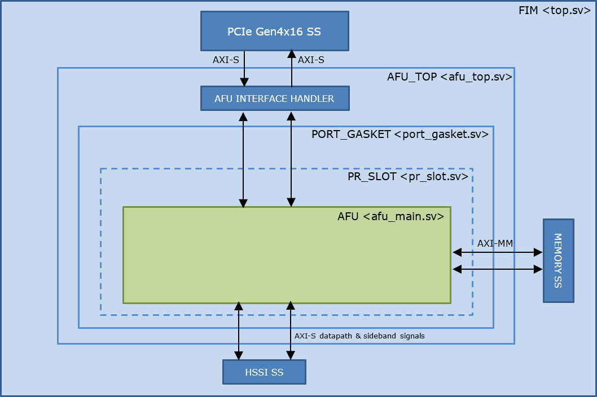

# Intel<sup>&reg;</sup> Accelerator Functional Unit Developer Guide: Open FPGA Stack for Intel® Agilex® FPGAs PCIe Attach


# 1. Introduction


This document is a design guide for the creation of an Accelerator Functional Unit (AFU) using Open FPGA Stack (OFS) for Intel® Agilex® FPGAs PCIe Attach. The AFU concept consists of separating the FPGA design development process into two parts, the construction of the foundational FPGA Interface Manager (FIM), and the development of the Acceleration Function Unit (AFU), as shown in the diagram below.


This diagram shows the separation of FPGA board interface development from the internal FPGA workload creation.  This separation starts with the FPGA Interface Manager (FIM) which consists of the external interfaces and board management functions.  The FIM is the base system layer and is typically provided by board vendors. The FIM interface is specific to a particular physical platform.  The AFU makes use of the external interfaces with user defined logic to perform a specific application.  By separating out the lengthy and complicated process of developing and integrating external interfaces for an FPGA into a board allows the AFU developer to focus on the needs of their workload.  OFS for Intel® Agilex® FPGAs PCIe Attach provides the following tools for rapid AFU development:

- Scripts for both compilation and simulation setup
- Optional Platform Interface Manager (PIM) which is a set of SystemVerilog shims and scripts for flexible FIM to AFU interfacing
- Acceleration Simulation Environment (ASE) which is a hardware/software co-simulation environment scripts for compilation and Acceleration
- Integration with Open Programmable Acceleration Engine (OPAE) SDK for rapid software development for your AFU application
  

Please notice in the above block diagram that the AFU region consists of static and partial reconfiguration (PR) regions where the PR region can be dynamically reconfigured while the remaining FPGA design continues to function.  Creating AFU logic for the static region is described in [FPGA Interface Manager Developer Guide: Open FPGA Stack for Intel® Agilex® FPGAs PCIe Attach].  This guide covers logic in the AFU Main region.

## 1.1. Document Organization


This document is organized as follows:

- Description of design flow
- Interfaces and functionality provided in the Intel® FPGA SmartNIC N6001-PL FIM
- Downloading and installing OFS and OPAE SDK
- Building the FIM to support the AFU example
- Synthesize the AFU example
- Hardware/Software co-simulation using ASE
- Testing the AFU example in the Intel® FPGA SmartNIC N6001-PL card
- Debugging an AFU with Remote Signal Tap

This guide provides theory followed by tutorial steps to solidify your AFU development knowledge.

This guide uses the Intel® FPGA SmartNIC N6001-PL as the platform for all tutorial steps. Additionally, this guide and the tutorial steps can be used with other platforms.

If you have worked with previous Intel Programmable Acceleration products, you will find out that OFS for Intel® Agilex® FPGAs PCIe Attach is similar. However, there are differences and you are advised to carefully read and follow the tutorial steps to fully understand the design tools and flow.

| Term                      | Abbreviation | Description                                                  |
| :------------------------------------------------------------:| :------------:| ------------------------------------------------------------ |
|Advanced Error Reporting	|AER	|The PCIe AER driver is the extended PCI Express error reporting capability providing more robust error reporting. [(link)](https://docs.kernel.org/PCI/pcieaer-howto.html?highlight=aer)|
|Accelerator Functional Unit	|AFU	|Hardware Accelerator implemented in FPGA logic which offloads a computational operation for an application from the CPU to improve performance. Note: An AFU region is the part of the design where an AFU may reside. This AFU may or may not be a partial reconfiguration region.|
|Basic Building Block	|BBB|	Features within an AFU or part of an FPGA interface that can be reused across designs. These building blocks do not have stringent interface requirements like the FIM's AFU and host interface requires. All BBBs must have a (globally unique identifier) GUID.|
|Best Known Configuration	|BKC	|The software and hardware configuration Intel uses to verify the solution.|
|Board Management Controller|	BMC	|Supports features such as board power managment, flash management, configuration management, and board telemetry monitoring and protection. The majority of the BMC logic is in a separate component, such as an Intel® Max® 10 or Intel Cyclone® 10 device; a small portion of the BMC known as the PMCI resides in the main Agilex FPGA.
|Configuration and Status Register	|CSR	|The generic name for a register space which is accessed in order to interface with the module it resides in (e.g. AFU, BMC, various sub-systems and modules).|
|Data Parallel C++	|DPC++|	DPC++ is Intel’s implementation of the SYCL standard. It supports additional attributes and language extensions which ensure DCP++ (SYCL) is efficiently implanted on Intel hardware.
|Device Feature List	|DFL	| The DFL, which is implemented in RTL, consists of a self-describing data structure in PCI BAR space that allows the DFL driver to automatically load the drivers required for a given FPGA configuration. This concept is the foundation for the OFS software framework. [(link)](https://docs.kernel.org/fpga/dfl.html)|
|FPGA Interface Manager	|FIM|	Provides platform management, functionality, clocks, resets and standard interfaces to host and AFUs. The FIM resides in the static region of the FPGA and contains the FPGA Management Engine (FME) and I/O ring.|
|FPGA Management Engine	|FME	|Performs reconfiguration and other FPGA management functions. Each FPGA device only has one FME which is accessed through PF0.|
|Host Exerciser Module	|HEM	|Host exercisers are used to exercise and characterize the various host-FPGA interactions, including Memory Mapped Input/Output (MMIO), data transfer from host to FPGA, PR, host to FPGA memory, etc.|
|Input/Output Control|	IOCTL	|System calls used to manipulate underlying device parameters of special files.|
|Intel Virtualization Technology for Directed I/O	|Intel VT-d	|Extension of the VT-x and VT-I processor virtualization technologies which adds new support for I/O device virtualization.|
|Joint Test Action Group	|JTAG	| Refers to the IEEE 1149.1 JTAG standard; Another FPGA configuration methodology.|
|Memory Mapped Input/Output	|MMIO|	The memory space users may map and access both control registers and system memory buffers with accelerators.|
|oneAPI Accelerator Support Package	|oneAPI-asp	|A collection of hardware and software components that enable oneAPI kernel to communicate with oneAPI runtime and OFS shell components. oneAPI ASP hardware components and oneAPI kernel form the AFU region of a oneAPI system in OFS.|
|Open FPGA Stack	|OFS|	OFS is a software and hardware infrastructure providing an efficient approach to develop a custom FPGA-based platform or workload using an Intel, 3rd party, or custom board. |
|Open Programmable Acceleration Engine Software Development Kit|	OPAE SDK|	The OPAE SDK is a software framework for managing and accessing programmable accelerators (FPGAs). It consists of a collection of libraries and tools to facilitate the development of software applications and accelerators. The OPAE SDK resides exclusively in user-space.|
|Platform Interface Manager	|PIM|	An interface manager that comprises two components: a configurable platform specific interface for board developers and a collection of shims that AFU developers can use to handle clock crossing, response sorting, buffering and different protocols.|
|Platform Management Controller Interface|	PMCI|	The portion of the BMC that resides in the Agilex FPGA and allows the FPGA to communicate with the primary BMC component on the board.|
|Partial Reconfiguration	|PR	|The ability to dynamically reconfigure a portion of an FPGA while the remaining FPGA design continues to function. For OFS designs, the PR region is referred to as the pr_slot.|
|Port|	N/A	|When used in the context of the fpgainfo port command it represents the interfaces between the static FPGA fabric and the PR region containing the AFU.|
|Remote System Update|	RSU	|The process by which the host can remotely update images stored in flash through PCIe. This is done with the OPAE software command "fpgasupdate".|
|Secure Device Manager	|SDM|	The SDM is the point of entry to the FPGA for JTAG commands and interfaces, as well as for device configuration data (from flash, SD card, or through PCI Express* hard IP).|
|Static Region|	SR	|The portion of the FPGA design that cannot be dynamically reconfigured during run-time.|
|Single-Root Input-Output Virtualization|	SR-IOV	|Allows the isolation of PCI Express resources for manageability and performance.|
|SYCL	|SYCL|	SYCL (pronounced "sickle") is a royalty-free, cross-platform abstraction layer that enables code for heterogeneous and offload processors to be written using modern ISO C++ (at least C++ 17). It provides several features that make it well-suited for programming heterogeneous systems, allowing the same code to be used for CPUs, GPUs, FPGAs or any other hardware accelerator. SYCL was developed by the Khronos Group, a non-profit organization that develops open standards (including OpenCL) for graphics, compute, vision, and multimedia. SYCL is being used by a growing number of developers in a variety of industries, including automotive, aerospace, and consumer electronics.|
|Test Bench	|TB	|Testbench or Verification Environment is used to check the functional correctness of the Design Under Test (DUT) by generating and driving a predefined input sequence to a design, capturing the design output and comparing with-respect-to expected output.|
|Universal Verification Methodology	|UVM	|A modular, reusable, and scalable testbench structure via an API framework.  In the context of OFS, the UVM enviroment provides a system level simulation environment for your design.|
|Virtual Function Input/Output	|VFIO	|An Input-Output Memory Management Unit (IOMMU)/device agnostic framework for exposing direct device access to userspace. (link)|


## 1.2. Prerequisite


This guide assumes you have the following FPGA logic design-related knowledge and skills:

* FPGA compilation flows including the Intel® Quartus® Prime Pro Edition design flow
* Static Timing closure, including familiarity with the Timing Analyzer tool in Intel® Quartus® Prime Pro Edition software, applying timing constraints, Synopsys* Design Constraints (.sdc) language and Tcl scripting, and design methods to close on timing critical paths.
* RTL and coding practices to create synthesizable logic.
* Understanding of AXI and Avalon memory mapped and streaming interfaces.
* Simulation of complex RTL using industry standard simulators (Synopsys® VCS® or Siemens® QuestaSim®).
* Signal Tap Logic Analyzer tool in the Intel® Quartus® Prime Pro Edition software.

You are strongly encouraged to review the [FPGA Interface Manager Developer Guide: Open FPGA Stack for Intel® Agilex® FPGAs PCIe Attach]

## 1.3. Acceleration Functional Unit (AFU) Development Flow


The AFU development flow is shown below:


### 1.3.1. Understanding Platform Capabilities


The block diagram of the N6001 Board is shown below:


The FIM provided with this release is shown below:


This release FIM provides the following features:

- Host interface
  - PCIe Gen4 x 16
  - 5 - PF, 4 - VF, AXI-S TLP packets
  - MSI-X interrupts
  - Logic to demonstrate simple PCIe loopback
- Network interface
  - 2 - QSFP28/56 cages
  - 2 x 4 x 25 GbE with exerciser logic demonstrating traffic generation/monitoring
- External Memory - DDR4 - 2400
  - HPS - 1GB organized as 256 Mb x 32 with 256 Mb x 8 ECC
  - Channel 0, 1  -  4 GB organized as 1 Gb x 32
  - Channel 2, 3 - 4 GB organized as 1 Gb x 32 with 1 Gb x 8 ECC (ECC is not implemented in this release)
  - Memory exerciser logic demonstrating external memory operation
- Board Management
  - SPI interface
  - FPGA configuration
  - Example logic showing DFH operation
- Remote Signal Tap logic
- Partial reconfiguration control logic
- ARM HPS subsystem with embedded Linux
  - HPS Copy engine

### 1.3.2. High Level Data Flow


The OFS high level data flow is shown below:


### 1.3.3. Considerations for PIM Usage


An early decision for your AFU development is determining if the PIM will be included in your design flow. The PIM is an abstraction layer encompassed of a collection of SystemVerilog interfaces and shims to enable partial AFU portability across hardware despite variations in hardware topology and native interfaces. The PIM adds a level of logic between an accelerator (an AFU) and the platform (the FIM). The use of the PIM is optional for AFU development.  Please see [Connecting an AFU to a Platform using PIM](https://github.com/OFS/ofs-platform-afu-bbb/blob/master/plat_if_develop/ofs_plat_if/docs/PIM_AFU_interface.md) for details on using the PIM and its capabilities. Please see [PIM Tutorial](https://github.com/OFS/examples-afu/tree/main/tutorial) for a detailed tutorial on using the PIM. The learning steps in the tutorial can be run with the OFS for Agilex FIM package. The installation of the FIM package is described later in this guide.  

If you choose not to use the PIM, please see [Non-PIM AFU Development](https://github.com/OFS/examples-afu/tree/main/tutorial) for instruction on using a traditional RTL design flow. Note, the example AFU provided in OFS does not include PIM.

### 1.3.4. AFU Interfaces Included with Intel® FPGA SmartNIC N6001-PL


The figure below shows the interfaces available to the AFU in this architecture. It also shows the design hierarchy with module names from the fim (top.sv) to the PR region AFU (afu_main.sv).
One of the main differences from the Stratix 10 PAC OFS architecture to this one is the presence of the static port gasket region (port_gasket.sv) that has components to facilitate the AFU and also consists of the PR region (afu_main.sv) via the PR slot. The Port Gasket contains all the PR specific modules and logic, e.g., PR slot reset/freeze control, user clock, remote STP etc. Architecturally, a Port Gasket can have multiple PR slots where user workload can be programmed into. However, only one PR slot is supported for OFS Release for Intel Agilex. Everything in the Port Gasket until the PR slot should be provided by the FIM developer. The task of the AFU developer is to add their desired application in the afu_main.sv module by stripping out unwanted logic and instantiating the target accelerator.
As shown in the figure below, here are the interfaces connected to the AFU (highlighted in green) via ac_adp fim:

1. AXI Streaming (AXI-S) interface to the Host via PCIe Gen4x16
2. AXI Memory Mapped Channels (4) to the DDR4 EMIF interface
3. AXI Streaming (AXI-S) interface to the HSSI 25 Gb Ethernet



# 2. Set Up AFU Development Environment


This section covers:

- Setup of the development environment.
- Retrieving and installing OFS, OPAE SDK.
- Building the base_x16 FIM
- Generating a relocatable AFU build-tree or build-template from the base_x16 FIM.
- Compiling the host_chan_mmio example AFU for the base_x16 FIM.

Additionally, this section includes steps to demonstrate loading and running the host_chan_mmio example AFU in an N6001 equipped Linux server.

## 2.1. Prepare AFU development environment


A typical development and hardware test environment consists of a development server or workstation with FPGA development tools installed and a separate server with the target OFS compatible FPGA PCIe card installed.  The typical usage and flow of data between these two servers is shown below:


Note: both development and hardware testing can be performed on the same server if desired.

This guide uses Intel® FPGA SmartNIC N6001-PL as the target OFS compatible FPGA PCIe card for demonstration steps.  The Intel® FPGA SmartNIC N6001-PL must be fully installed following the [Getting Started Guide: Open FPGA Stack for Intel Agilex FPGAs Targeting the Intel® FPGA SmartNIC N6001-PL]. If using a different OFS FPGA PCIe card, contact your supplier for instructions on how to install and operate user developed AFUs.

## 2.2. Installation of Quartus and OFS


Building AFUs with OFS for Agilex requires the build machine to have at least 64 GB of RAM.  

The following is a summary of the steps to set up for AFU development:

1. Install Quartus Prime Pro Version 23.1  for Linux with Agilex device support.
2. Make sure support tools are installed and meet version requirements.
3. Clone and install the `applications.fpga.ofs.fim-n6001` repository.
4. Review the files provided in the repository.
5. Install the required Quartus patches.
6. Build a relocatable AFU PR-able build-tree. This will be the base FIM for your AFUs.


> Note: For the Intel® FPGA SmartNIC N6001-PL platforms a relocatable AFU build-tree is not provided, so you will build it from the base_x16 FIM. The base_x16 FIM will then be loaded in your Intel® FPGA SmartNIC N6001-PL card to support your AFUs. If you are using different OFS compatible PCIe card, skip step 6 and follow the instructions provided by your supplier.

1. Install Quartus Prime Pro Version 23.1 for Linux with Agilex device support. 

Intel Quartus Prime Pro Version 23.1  is the currently verified version of Quartus used for building the FIM and AFU images. The recommended Best Known Configuration (BKC) for development with OFS is RedHat® Enterprise Linux® (RHEL) 8.6 , which is the assumed operating system for this developer guide.

- Make sure to install the following linux packages to satisfy Quartus and OFS dependencies.

```sh
$ sudo dnf install -y gcc gcc-c++ make cmake libuuid-devel rpm-build autoconf automake bison boost boost-devel libxml2 libxml2-devel make ncurses grub2 bc csh flex glibc-locale-source libnsl ncurses-compat-libs 
```
- Apply the following configurations.

```sh
$ sudo localedef -f UTF-8 -i en_US en_US.UTF-8 
$ sudo ln -s /usr/lib64/libncurses.so.6 /usr/lib64/libncurses.so.5 
$ sudo ln -s /usr/bin/python3 /usr/bin/python
```

- Download Quartus Prime Pro Version 23.1 from [Quartus Pro Prime Download].

- After running the Quartus Prime Pro installer, set the PATH environment variable to make the utilities `quartus`, `jtagconfig`, and `quartus_pgm` discoverable. Edit your bashrc file `~/.bashrc` to add the following line:

```sh
$ export PATH=$PATH:<Quartus install directory>/quartus/bin
```

For example, if the Quartus install directory is **/home/intelFPGA_pro/23.1**, then:

```sh
$ export PATH=$PATH:/home/intelFPGA_pro/23.1/quartus/bin
```

- Verify that Quartus is discoverable by opening a new shell:

```sh
$ which quartus
  
  /home/intelFPGA_pro/23.1/quartus/bin/quartus
```

2. Make sure support tools are installed and meet version requirements.

The OFS provided Quartus build scripts require the following tools. Verify these are installed in your development environment.


| Item              |  Version            |
| ----              |  ----               |
| Python            | 3.7.7        |
| GCC               | 7.2.0         |
| cmake             | 3.11.4      |
| git and git-lfs   | 1.8.3.1     |
| perl              | 5.8.8                |

To install the ```Git Large File Storage``` extension execute the next commands

```sh
$ curl -s https://packagecloud.io/install/repositories/github/git-lfs/script.rpm.sh | sudo bash
$ sudo dnf install git-lfs
$ git lfs install
```

3. Clone the `applications.fpga.ofs.fim-n6001` repository.

The OFS FIM source code is included in the public GitHub OFS repository. Create a new directory to use as a clean starting point to store the retrieved files.  The following is a short description of each repository, followed by the git commands for cloning.  The instructions section uses the HTTPS git method for cloning repositories.  Cloning the repo using the HTTPS method requires a personal access token.  Please see this blog post for information about obtaining a personal access token [Token authentication requirements for Git operations].

- Navigate to the location for storage of OFS source, create the top-level source directory and clone OFS repositories.

```sh
$ mkdir ofs_fim_build_root
$ cd ofs_fim_build_root
$ export OFS_BUILD_ROOT=$PWD
$ git clone --branch ofs-2023.1-1 --recurse-submodules https://github.com/OFS/ofs-n6001.git
    
    Cloning into 'applications.fpga.ofs.fim-n6001' ...
    Username for 'https://github.com': <<Enter your git hub username>>
    Password for 'https://<<Your username>>': <<Enter your personal access token>>
    remote: Enumerating objects:  ....
    ...
    ...
    Resolving deltas  ..., done.

$ cd $OFS_BUILD_ROOT/applications.fpga.ofs.fim-n6001

```

4. Review the files provided in the repository.

Verify the following directories are present in ```$OFS_BUILD_ROOT``` directory.  

```sh
$ ls
eval_scripts  ipss  license  LICENSE.txt  ofs-common README.md  sim  src  syn  tools  verification
```

The directories are arranged as shown below:

```
.
├── eval_scripts           ** Support tools 
│   ├── ofs_n6001_eval.sh
│   └── README_ofs_n6001_eval.txt
├── ipss    **Directory ipss consists of Platform Designer subsystems used in FIM**
│   ├── hssi           **2 x 4 x 25 GbE HSSI subsystem** 
│   ├── mem            **External Memory interface subsystem**
│   ├── pcie           **PCIe subsystem**
│   ├── pmci           **BMC PMCI subsystem**
│   ├── qsfp           **QSFP internal register access subsystem**
│   └── README.md
├── LICENSE.txt
├── ofs-common             **Common files**
│   ├── LICENSE.txt
│   ├── README.md
│   ├── scripts
│   │   ├── common
│   │   │   ├── sim
│   │   │   └── syn
│   │   └── fpga_family
│   ├── src
│   │   ├── common
│   │   │   ├── afu_top
│   │   │   ├── copy_engine
│   │   │   ├── flr
│   │   │   ├── fme
│   │   │   ├── fme_id_rom
│   │   │   ├── he_hssi
│   │   │   ├── he_lb
│   │   │   ├── he_null
│   │   │   ├── includes
│   │   │   ├── interrupt
│   │   │   ├── lib
│   │   │   ├── mem_tg
│   │   │   ├── port_gasket
│   │   │   ├── protocol_checker
│   │   │   ├── remote_stp
│   │   │   └── st2mm
│   │   └── fpga_family
│   
├── README.md
├── sim                    **Unit level simulation files**
│   ├── bfm
│   ├── common
│   ├── readme.txt
│   ├── scripts
│   └── unit_test
├── src                    **Source RTL files**
│   ├── afu_top
│   ├── includes
│   ├── pd_qsys
│   ├── README.md
│   └── top
├── syn                    **Quartus compilation settings**
│   ├── common
│   ├── README
│   ├── scripts
│   ├── setup
│   └── syn_top
├── tools                  
│   └── pfvf_config_tool  **Tools to configure the PF/VF Mux**
└── verification          **Verification**
    ├── coverage
    ├── README
    ├── scripts
    ├── testbench
    ├── tests
    ├── unit_tb   
    └── verifplan

```


## 2.3. Installation of OPAE SDK


Follow the instructions in the Getting Started Guide: Open FPGA Stack for Intel® FPGA SmartNIC N6001-PL, section [4.0 OPAE Software Development Kit] to build and install the required OPAE SDK for the Intel® FPGA SmartNIC N6001-PL.

Working with the Intel® Intel® FPGA SmartNIC N6001-PL card requires **opae-2.5.0-1**. Follow the instructions in the Getting Started Guide: Intel® Open FPGA Stack for Intel® FPGA SmartNIC N6001-PL section [4.0 OPAE Software Development Kit]. However, just make sure to check out the cloned repository to tag **2.5.0-1** and branch **release/2.5.0**.

```sh
$ git checkout tags/2.5.0-1 -b release/2.5.0
```

> Note: The tutorial steps provided in the next sections assume the OPAE SDK is installed in default system locations, under the directory, ```/usr```. In most system configurations, this will allow the OS and tools to automatically locate the OPAE binaries, scripts, libraries and include files required for the compilation and simulation of the FIM and AFUs.


## 2.4. Download the Basic Building Blocks repositories


The ```ofs-platform-afu-bbb``` repository contains the PIM files as well as example PIM-based AFUs that can be used for testing and demonstration purposes. Similarly, the platform-independent BBB repository, ```intel-fpga-bbb```, contains infrastructure shims, PIM-based AFU sample designs, and tutorials for further testing OFS. This guide will use the ```host_chan_mmio``` AFU example in the ofs-platform-afu-bbb repository and the ```hello_world``` sample accompanying the intel-fpga-bbb repository to demonstrate how to synthesize, load, simulate, and test a PIM-based PIM-based AFU using the Intel® FPGA SmartNIC N6001-PL card with the base_x16 FIM.

Execute the next commands to clone the BBB repositories.

```sh

  # Clone the ofs-platform-afu-bbb repository.
$ cd $OFS_BUILD_ROOT
$ git clone https://github.com/OFS/ofs-platform-afu-bbb.git
  
  # Verify retrieval
$ cd $OFS_BUILD_ROOT/ofs-platform-afu-bbb
$ ls
LICENSE  plat_if_develop  plat_if_release  plat_if_tests  README.md

  # Clone the intel-fpga-bbb repository.
$ cd $OFS_BUILD_ROOT 
$ git clone https://github.com/OPAE/intel-fpga-bbb.git 
 
  # Verify retrieval
$ cd $OFS_BUILD_ROOT/intel-fpga-bbb
$ ls
AUTHORS  BBB_cci_gemm  BBB_cci_mpf  BBB_ccip_async  BBB_ccip_mux  BBB_mpf_vtp  cmake  CMakeLists.txt  CONTRIBUTING.md  COPYING  drivers  platform-ifc-mgr-compat  README.md  samples
```

The documentation in the [ofs-platform-afu-bbb](https://github.com/OFS/ofs-platform-afu-bbb)(https://github.com/OFS/ofs-platform-afu-bbb.git) and [intel-fpga-bbb](https://github.com/OPAE/intel-fpga-bbb.git) repositories further address
  - The PIM concept.
  - The structure of the PIM-based AFU examples.
  - How to generate a release and configure the PIM.
  - How to connect an AFU to an FIM.


## 2.5. Compiling the OFS FIM for the Intel® FPGA SmartNIC N6001-PL


Before synthesizing an AFU, one must build the FIM that will support the AFU by facilitating the infrastructure to access the FPGA, board resources, and enabling communication with the host server. To synthesize an AFUs for this FIM a relocatable PR build-tree or build-template should be generated out of the FIM.

OFS provides a build script with the following FPGA image creation options:

- **Flat compile**, which combines the FIM and AFU into one FPGA image that is loaded into the entire FPGA device as a static image.
- **PR compile**, which creates an FPGA image consisting of the FIM that is loaded into the static region of the FPGA and a default AFU that is loaded into dynamic region. Additional AFUs may be loaded into the dynamic region using partial reconfiguration.

The build scripts included with OFS are verified to run in a bash shell. Other shells have not been tested. Each build script step will take several hours to complete. Please note, building in Quartus GUI is not supported - you must build with the provided scripts.

The following sections describe how to set up the environment and build the provided FIM with a relocatable build-tree supporting PR. You will use this relocatable PR build-tree for all example AFU simulation and compilation steps in this guide.

> Note: For instructions to compile FIMs available for the Intel® FPGA SmartNIC N6001-PL FPGA SmartNIC Platform SKU1, refer to [FPGA Interface Manager Developer Guide: Open FPGA Stack for Intel® Agilex® FPGAs PCIe Attach]. 

### 2.5.1. Setting Up the Required Environment Variables to build the FIM


Set the required environment variables as shown below. These environment variables must be set prior to simulation or compilation tasks. Please, create a simple script to set these variables and save time going forward.

```sh
$ cd $OFS_BUILD_ROOT/applications.fpga.ofs.fim-n6001
$ export OFS_ROOTDIR=$PWD

# Note, OFS_ROOTDIR is the directory where you cloned the repo, e.g. /home/MyProject/applications.fpga.ofs.fim-n6001 *

# Quartus Tools
# Note, QUARTUS_HOME is your Quartus installation directory, e.g. $QUARTUS_HOME/bin contains Quartus executable.

$ export WORKDIR=$OFS_ROOTDIR	
$ export QUARTUS_HOME=<user_path>/intelFPGA_pro/23.1/quartus
$ export QUARTUS_ROOTDIR=$QUARTUS_HOME
$ export QUARTUS_INSTALL_DIR=$QUARTUS_ROOTDIR
$ export QUARTUS_ROOTDIR_OVERRIDE=$QUARTUS_ROOTDIR
$ export IMPORT_IP_ROOTDIR=$QUARTUS_ROOTDIR/../ip
$ export IP_ROOTDIR=$QUARTUS_ROOTDIR/../ip
$ export QSYS_ROOTDIR=$QUARTUS_ROOTDIR/../qsys/bin
$ export PATH=$QUARTUS_HOME/bin:$QUARTUS_HOME/qsys/bin:$QUARTUS_HOME/sopc_builder/bin/:$PATH

# Synopsys Verification Tools

$ export DESIGNWARE_HOME=<user_path>/synopsys/vip_common/vip_Q-2020.03A
$ export PATH=$DESIGNWARE_HOME/bin:$PATH
$ export VCS_HOME=<user_path>/synopsys/vcsmx/S-2021.09-SP1/linux64/rhel
$ export PATH=$VCS_HOME/bin:$PATH

# OPAE SDK release
$ export OPAE_SDK_REPO_BRANCH=release/2.5.0
      
# The following environment variables are required for compiling the AFU examples. 

# Location to clone the ofs-platform-afu-bbb repository which contains PIM files and AFU examples.
$ export OFS_PLATFORM_AFU_BBB=$OFS_BUILD_ROOT/ofs-platform-afu-bbb

# Location to clone the intel-fpga-bbb repository which contain infrastructure shims, AFU samples and tutorials.
$ export FPGA_BBB_CCI_SRC=$OFS_BUILD_ROOT/intel-fpga-bbb  

# OPAE_PLATFORM_ROOT points to a release tree configured with the Platform Interface Manager (PIM).  
$ export OPAE_PLATFORM_ROOT=$OFS_ROOTDIR/work_adp_base_x16_pr/pr_build_template

# OPAE and MPF libraries must either be on the default linker search paths or on both LIBRARY_PATH and LD_LIBRARY_PATH.  
$ export OPAE_LOC=/usr
$ export LIBRARY_PATH=$OPAE_LOC/lib:$LIBRARY_PATH
$ export LD_LIBRARY_PATH=$OPAE_LOC/lib64:$LD_LIBRARY_PATH

# Header files from OPAE and MPF must either be on the default compiler search paths or on both C_INCLUDE_PATH and CPLUS_INCLUDE_PATH.
$ export C_INCLUDE_PATH=/usr/src/debug/opae-2.5.0-1.el8.x86_64/tests/framework

```

### 2.5.2 Compiling the Base_x16 FIM


The usage of the compile build script is shown below:

```sh
syn/build_top.sh [-p] target_configuration work_dir 

    * target_configuration - Specifies the project, FIM and board for this script run.  
              Target Configuration is in the format of <OFS_PROJECT>/<OFS_FIM>/<OFS_BOARD>.  
              
              For example: n6001/base_x16/adp:A1
              
        * <OFS_PROJECT> is the high level project.  For this release, n6001 is supported by the provided files.
        * <OFS_FIM> the name of the FIM to built.  This name corresponds to FIM directory name containing source 
              files.  For this release, base_x16 is supported by the provided files.
        * <OFS_BOARD> is the target board for the build.  For this release, adp:A1 is supported by the provided
              files.
  
    * work_dir - Work Directory for this build in the form a directory name. 
                   It is created in the <local repo directory>/applications.fpga.ofs.fim-n6001/<work_dir> 
          - NOTE: The directory name must start with "work".  If the work directory exists,
                  then the script stops and asks if you want to overwrite the directory.
                  
                  - e.g. 
                  
                    syn/build_top.sh n6001/base_x16/adp:A1 work_adp_base_x16
                
                A work directory as a name will be created in <local repo directory>/applications.fpga.ofs.fim-n6001/work_adp_base_x16
                
                The omission of <work_dir> results in a default work directory 
                    (<local repo directory>/applications.fpga.ofs.fim-n6001/work)

        - compile reports and artifacts (.rpt, .sof, etc) are stored in 
            <work_dir>/syn/<OFS_PROJECT>/<OFS_FIM>/<OFS_BOARD>/syn_top/output_files
  
        - log file created in applications.fpga.ofs.fim-n6001 directory
          
    * [-p]  Optional switch for creation of a relocatable PR build tree supporting the creation of a PR-able 
            AFU workload.  The "-p" switch invokes generate_pr_release.sh at the end of the FIM build and 
            writes the PR build tree to the top of the work directory.  More information on this option is
            provided below. 
```

The next example command, builds the FIM base_x16 for the Intel® FPGA SmartNIC N6001-PL and generates the relocatable PR build-tree in ```$OFS_ROOTDIR/work_adp_base_x16_pr/pr_build_template```.

```sh
# Build the provided base example design:
$ cd $OFS_ROOTDIR
    
$ ofs-common/scripts/common/syn/build_top.sh -p n6001/base_x16/adp work_adp_base_x16_pr


  ... build takes ~5 hours to complete

Compile work directory:     <$OFS_ROOTDIR>/work_adp_base_x16_pr/syn/syn_top
Compile artifact directory: <$OFS_ROOTDIR>/work_adp_base_x16_pr/syn/syn_top/output_files

***********************************
***
***        OFS_PROJECT: n6001
***        Q_PROJECT:  ofs_top
***        Q_REVISION: ofs_top
***        SEED: XXX
***        Build Complete
***        Timing Passed!
***
***********************************

```

The build script copies the ```ipss```, ```sim```, ```src``` and ```syn``` directories to the specified work directory and then these copied files are used in the Quartus compilation process. The build reports and FPGA programming files are stored under ```<work_dir>/syn/syn_top/output_files```. The directory ```.../output_files/timing_report``` contains the clocks reports, failing paths, and passing margin reports.


The build script will run PACSign (if installed) and create unsigned FPGA programming files for user1 and user2 locations of the Intel® FPGA SmartNIC N6001-PL, FPGA flash. Please note if the Intel® FPGA SmartNIC N6001-PL has the root entry hash key loaded, then PACsign must be run to add the proper key to the FPGA binary file.

The following table provides a detailed description of the generated *.bin output files.

| File            | Description                        |
|-----------------|------------------------------------|
| ofs_top[_hps].bin | This is an intermediate, raw binary file. This intermediate raw binary file is produced by taking the Quartus generated *.sof file, convertint it to*.pof using quartus_pfg, then converting the *.pof to*.hexout using quartus_cpf, and finally converting the *.hexout to*.bin using objcopy. Depending on whether the FPGA design contains an HPS block, a different file will be generated. <br /><br />**ofs_top.bin** - Raw binary image of the FPGA generated if there is no HPS present in the design. <br />**ofs_top_hps.bin** - Raw binary image of the FPGA generated if there is an HPS present in the design. |
| ofs_top_page1_unsigned_user1.bin | This is the unsigned FPGA binary image generated by the PACSign utility for the User1 Image. This file is used to load the FPGA flash User1 Image using the fpgasupdate tool. |
| ofs_top_page1_user1.bin | This is an input file to PACSign to generate **ofs_top_page1_unsigned_user1.bin**. This file is created by taking the ofs_top_[hps].bin file and assigning the User1 or appending factory block information. |
| ofs_top_page2_unsigned_user2.bin | This is the unsigned FPGA binary image generated by the PACSign utility for the User2 Image. This file is used to load the FPGA flash User2 Image using the fpgasupdate tool.|
| ofs_top_page2_user2.bin |  This is an input file to PACSign to generate **ofs_top_page2_unsigned_user2.bin**. This file is created by taking the ofs_top_[hps].bin file and assigning the User2 or appending factory block information. |

### 2.5.3. Compiling the FIM in preparation for designing your AFU


  To test the functionality and capabilities of OFS, the default FIMs integrate the following traffic generators: hssi, memory, memory-traffic-generator, and loopback.

  To save the FPGA area, the default host exercisers in the FIM can be replaced by a lightweight "he_null" block during compile time. Specify which host exercisers to replace in the **target_configuration** option provided to the build_top.sh script.

  The options supported are ```null_he_lb```, ```null_he_hssi```, ```null_he_mem``` and ```null_he_mem_tg```. All options or any subset of these are supported by the build_top.sh script. To compile a FIM for minimal area consumption execute the following command.

```sh
$ cd $OFS_ROOTDIR
$ ofs-common/scripts/common/syn/build_top.sh -p n6001/base_x16/adp:null_he,null_he_hssi,null_he_mem,null_he_mem_tg work_x16_adp_null_he
```

  A few important points to keep in mind.

  * **he_null** is a minimal block with registers that responds to PCIe MMIO request. MMIO responses are required to keep PCIe alive (the end-points enabled in PCIe-SS need to service downstream requests).

  * If an exerciser with other I/O connections such has **he_mem** or **he_hssi** is replaced, then those I/O ports are simply tied off.

  * Finer grain control is provided since the user may just turn off the exercisers in Static region to save area. 


### 2.5.4. Load the FIM into the Flash of the Intel® FPGA SmartNIC N6001-PL


In this step, you will load the previously compiled base_x16 FIM binary into the flash of the Intel® FPGA SmartNIC N6001-PL board. AFUs developed in this guide using the base_x16 FIM and the generated build-tree will be compatible with the image loaded on the Intel® FPGA SmartNIC N6001-PL board.

```sh
$ cd $OFS_ROOTDIR/work_adp_base_x16_pr/syn/syn_top/output_files
$ sudo fpgasupdate ofs_top_page1_unsigned_user1.bin <N6001 SKU2 PCIe b:d.f>
$ sudo fpgasupdate ofs_top_page2_unsigned_user2.bin <N6001 SKU2 PCIe b:d.f>
$ sudo rsu fpga --page=user1 <N6001 SKU2 PCIe b:d.f>
```
# 3. Compiling an AFU

In this section, you will use the relocatable PR build-tree created in the previous steps from the FIM to compile an example PIM-based AFU. This section will be developed around the ```host_chan_mmio``` AFU example to showcase the synthesis of a PIM-based AFU.

The ```$OFS_PLATFORM_AFU_BBB/plat_if_tests/host_chan_mmio``` is a simple example demonstrating both hardware and software access to an AFU. The ```host_chan_mmio``` example AFU consists of the following files.

```sh
host_chan_mmio
├── hw
│   └── rtl
│       ├── avalon
│       │   ├── afu_avalon512.sv
│       │   ├── afu_avalon.sv
│       │   ├── ofs_plat_afu_avalon512.sv
│       │   ├── ofs_plat_afu_avalon_from_ccip.sv
│       │   └── ofs_plat_afu_avalon.sv
│       ├── axi
│       │   ├── afu_axi512.sv
│       │   ├── afu_axi.sv
│       │   ├── ofs_plat_afu_axi512.sv
│       │   ├── ofs_plat_afu_axi_from_ccip.sv
│       │   └── ofs_plat_afu_axi.sv
│       ├── host_chan_mmio.json
│       ├── test_mmio_avalon0_from_ccip.txt
│       ├── test_mmio_avalon1.txt
│       ├── test_mmio_avalon2_512rw.txt
│       ├── test_mmio_axi0_from_ccip.txt
│       ├── test_mmio_axi1.txt
│       └── test_mmio_axi2_512rw.txt
└── sw
    ├── main.c
    ├── Makefile
```

This example AFU contains examples using both Avalon and AXI interfaces. The hw directory contains the RTL to implement the hardware functionality using Avalon and AXI interfaces. However, this guide will use the AXI version of the ```host_chan_mmio``` AFU to go through the compilation steps. The sw directory of the AFU contains the source code of the host application that communicates with the actual AFU hardware.

The build steps presented below demonstrate the ease in building and running an actual AFU on the Intel® FPGA SmartNIC N6001-PL board. To successfully execute the instructions in this section, you must have set up your development environment and compiled the intel OFS FIM base_x16 as instructed in section 2 of this document.

Additionally, you need to set the ```OPAE_PLATFORM_ROOT``` environment variable to the path where the PR build-tree was generated during the base_x16 FIM compilation through the [-p] switch.

```sh
$ export OPAE_PLATFORM_ROOT=$OFS_ROOTDIR/work_adp_base_x16_pr/pr_build_template
```

## 3.1. Create the AFU Synthesis Environment


Here, you will create the synthesis environment to build the ```host_chan_mmio``` example. For this task, the PIM flow provides the script ```afu_synth_setup```. See how to use it below.

```
usage: afu_synth_setup [-h] -s SOURCES [-p PLATFORM] [-l LIB] [-f] dst

Generate a Quartus build environment for an AFU. A build environment is
instantiated from a release and then configured for the specified AFU. AFU
source files are specified in a text file that is parsed by rtl_src_config,
which is part of the OPAE base environment.

positional arguments:
  dst                   Target directory path (directory must not exist).

optional arguments:
  -h, --help            show this help message and exit
  -s SOURCES, --sources SOURCES
                        AFU source specification file that will be passed to
                        rtl_src_config. See "rtl_src_config --help" for the
                        file's syntax. rtl_src_config translates the source
                        list into either Quartus or RTL simulator syntax.
  -p PLATFORM, --platform PLATFORM
                        FPGA platform name.
  -l LIB, --lib LIB     FPGA platform release hw/lib directory. If not
                        specified, the environment variables OPAE_FPGA_HW_LIB
                        and then BBS_LIB_PATH are checked.
  -f, --force           Overwrite target directory if it exists.
```

Execute ```afu_synth_setup``` as follows to create the synthesis environment for a ```host_chan_mmio``` AFU that fits the base_x16 FIM previously constructed.

```sh
$ cd $OFS_PLATFORM_AFU_BBB/plat_if_tests/host_chan_mmio

$ mkdir -p $OFS_PLATFORM_AFU_BBB/plat_if_tests/host_chan_mmio/n6001/base_x16
$ cd $OFS_PLATFORM_AFU_BBB/plat_if_tests/host_chan_mmio/n6001/base_x16
$ afu_synth_setup -s $OFS_PLATFORM_AFU_BBB/plat_if_tests/host_chan_mmio/hw/rtl/test_mmio_axi1.txt hardware


Now, move into the synthesis environment ```hardware``` directory just created. From there, execute the ```afu_synth``` command. The successful completion of the command will produce the ```host_chan_mmio.gbs``` file under the synthesis environment directory, ```$OFS_PLATFORM_AFU_BBB/plat_if_tests/host_chan_mmio/n6001/base_x16/hardware```.


$ cd hardware
$ $OPAE_PLATFORM_ROOT/bin/afu_synth


Loading platform database: /home/<user_area>/ofs-X.X.X/applications.fpga.ofs.fim-n6001/work_adp_base_x16_pr/pr_build_template/hw/lib/platform/platform_db/ofs_agilex_adp.json
Loading platform-params database: /usr/share/opae/platform/platform_db/platform_defaults.json
Loading AFU database: /usr/share/opae/platform/afu_top_ifc_db/ofs_plat_afu.json
Writing platform/platform_afu_top_config.vh
Writing platform/platform_if_addenda.qsf
Writing ../hw/afu_json_info.vh
Copying build from /home/<user_area>/ofs-X.X.X/applications.fpga.ofs.fim-n6001/work_adp_base_x16_pr/pr_build_template/hw/lib/build...
Configuring Quartus build directory: hardware/build
Restoring blue bitstream lib files


...
...
Wrote host_chan_mmio.gbs

===========================================================================
 PR AFU compilation complete
 AFU gbs file is 'host_chan_mmio.gbs'
 Design meets timing
===========================================================================
```

The previous output indicates the successful compilation of the AFU and the compliance with the timing requirements. Analyze the reports generated in case the design does not meet timing. The timing reports are stored in the directory, ```$OFS_PLATFORM_AFU_BBB/plat_if_tests/host_chan_mmio/n6001/base_x16/hardware/build/syn/syn_top/output_files/timing_report```.

## 3.2. Loading and Running **host_chan_mmio** example AFU


Once the compilation finishes successfully, load the new ```host_chan_mmio.gbs``` bitstream file into the partial reconfiguration region of the target Intel® FPGA SmartNIC N6001-PL board. Keep in mind, that the loaded image is dynamic - this image is not stored in flash and if the card is power cycled, then the PR region is re-loaded with the default AFU.

To load the image, perform the following steps:

```sh
 $ cd $OFS_PLATFORM_AFU_BBB/plat_if_tests/host_chan_mmio/n6001/base_x16/hardware
 $ sudo fpgasupdate host_chan_mmio.gbs <N6001 SKU2 PCIe b:d.f>
[sudo] password for <<Your username>>: 
[2022-04-15 20:22:18.85] [WARNING ] Update starting. Please do not interrupt.
[2022-04-15 20:22:19.75] [INFO    ] 
Partial Reconfiguration OK
[2022-04-15 20:22:19.75] [INFO    ] Total time: 0:00:00.90
```

Set up your board to work with the newly loaded AFU.

```sh
# For the following example, the N6001 SKU2 PCIe b:d.f is assumed to be b1:00.0,
# however this may be different in your system

# Create the Virtual Functions (VFs):
$ sudo pci_device b1:00.0 vf 3
 
# Verify:
 $ lspci -s b1:00
 b1:00.0 Processing accelerators: Intel Corporation Device bcce (rev 01)
 b1:00.1 Processing accelerators: Intel Corporation Device bcce
 b1:00.2 Processing accelerators: Intel Corporation Device bcce
 b1:00.3 Processing accelerators: Red Hat, Inc. Virtio network device
 b1:00.4 Processing accelerators: Intel Corporation Device bcce
 b1:00.5 Processing accelerators: Intel Corporation Device bccf
 b1:00.6 Processing accelerators: Intel Corporation Device bccf
 b1:00.7 Processing accelerators: Intel Corporation Device bccf

# Bind VFs to VFIO driver.  Enter your username 
 
 $ sudo opae.io init -d 0000:b1:00.1 <<Your username>>
 [sudo] password for <<Your username>>:
 Unbinding (0x8086,0xbcce) at 0000:b1:00.1 from dfl-pci
 Binding (0x8086,0xbcce) at 0000:b1:00.1 to vfio-pci
 iommu group for (0x8086,0xbcce) at 0000:b1:00.1 is 183
 Assigning /dev/vfio/183 to ceg
 Changing permissions for /dev/vfio/183 to rw-rw----
 
 $ sudo opae.io init -d 0000:b1:00.2 <<Your username>>
 [sudo] password for <<Your username>>:
 Unbinding (0x8086,0xbcce) at 0000:b1:00.2 from dfl-pci
 Binding (0x8086,0xbcce) at 0000:b1:00.2 to vfio-pci
 iommu group for (0x8086,0xbcce) at 0000:b1:00.2 is 184
 Assigning /dev/vfio/184 to ceg
 Changing permissions for /dev/vfio/184 to rw-rw----
 
 $ sudo opae.io init -d 0000:b1:00.3 <<Your username>>
 [sudo] password for <<Your username>>:
 Unbinding (0x1af4,0x1000) at 0000:b1:00.3 from virtio-pci
 Binding (0x1af4,0x1000) at 0000:b1:00.3 to vfio-pci
 iommu group for (0x1af4,0x1000) at 0000:b1:00.3 is 185
 Assigning /dev/vfio/185 to ceg
 Changing permissions for /dev/vfio/185 to rw-rw----
    
 $ sudo opae.io init -d 0000:b1:00.4 <<Your username>>
 [sudo] password for <<Your username>>: 
 Unbinding (0x8086,0xbcce) at 0000:b1:00.4 from dfl-pci
 Binding (0x8086,0xbcce) at 0000:b1:00.4 to vfio-pci
 iommu group for (0x8086,0xbcce) at 0000:b1:00.4 is 186
 Assigning /dev/vfio/186 to ceg
 Changing permissions for /dev/vfio/186 to rw-rw----
 
 $ sudo opae.io init -d 0000:b1:00.5 <<Your username>>
 [sudo] password for <<Your username>>:
 Binding (0x8086,0xbccf) at 0000:b1:00.5 to vfio-pci
 iommu group for (0x8086,0xbccf) at 0000:b1:00.5 is 315
 Assigning /dev/vfio/315 to ceg
 Changing permissions for /dev/vfio/315 to rw-rw----
 
 $ sudo opae.io init -d 0000:b1:00.6 <<Your username>>
 [sudo] password for <<Your username>>:
 Binding (0x8086,0xbccf) at 0000:b1:00.6 to vfio-pci
 iommu group for (0x8086,0xbccf) at 0000:b1:00.6 is 316
 Assigning /dev/vfio/316 to ceg
 Changing permissions for /dev/vfio/316 to rw-rw----
 
 $ sudo opae.io init -d 0000:b1:00.7 <<Your username>>
 [sudo] password for <<Your username>>:
 Binding (0x8086,0xbccf) at 0000:b1:00.7 to vfio-pci
 iommu group for (0x8086,0xbccf) at 0000:b1:00.7 is 317
 Assigning /dev/vfio/317 to ceg
 Changing permissions for /dev/vfio/317 to rw-rw----


# Verify the new AFU is loaded.  The host_chan_mmio AFU GUID is "76d7ae9c-f66b-461f-816a-5428bcebdbc5".

$ fpgainfo port
//****** PORT ******//
Object Id                        : 0xEC00001
PCIe s:b:d.f                     : 0000:B1:00.0
Vendor Id                        : 0x8086
Device Id                        : 0xBCCE
SubVendor Id                     : 0x8086
SubDevice Id                     : 0x1771
Socket Id                        : 0x00
//****** PORT ******//
Object Id                        : 0xE0B1000000000000
PCIe s:b:d.f                     : 0000:B1:00.7
Vendor Id                        : 0x8086
Device Id                        : 0xBCCF
SubVendor Id                     : 0x8086
SubDevice Id                     : 0x1771
Socket Id                        : 0x01
Accelerator GUID                 : d15ab1ed-0000-0000-0210-000000000000
//****** PORT ******//
Object Id                        : 0xC0B1000000000000
PCIe s:b:d.f                     : 0000:B1:00.6
Vendor Id                        : 0x8086
Device Id                        : 0xBCCF
SubVendor Id                     : 0x8086
SubDevice Id                     : 0x1771
Socket Id                        : 0x01
Accelerator GUID                 : d15ab1ed-0000-0000-0110-000000000000
//****** PORT ******//
Object Id                        : 0xA0B1000000000000
PCIe s:b:d.f                     : 0000:B1:00.5
Vendor Id                        : 0x8086
Device Id                        : 0xBCCF
SubVendor Id                     : 0x8086
SubDevice Id                     : 0x1771
Socket Id                        : 0x01
Accelerator GUID                 : 76d7ae9c-f66b-461f-816a-5428bcebdbc5
//****** PORT ******//
Object Id                        : 0x80B1000000000000
PCIe s:b:d.f                     : 0000:B1:00.4
Vendor Id                        : 0x8086
Device Id                        : 0xBCCE
SubVendor Id                     : 0x8086
SubDevice Id                     : 0x1771
Socket Id                        : 0x01
Accelerator GUID                 : 44bfc10d-b42a-44e5-bd42-57dc93ea7f91
//****** PORT ******//
Object Id                        : 0x6098000000000000
PCIe s:b:d.f                     : 0000:B1:00.3
Vendor Id                        : 0x8086
Device Id                        : 0xBCCE
SubVendor Id                     : 0x8086
SubDevice Id                     : 0x1771
Socket Id                        : 0x01
Accelerator GUID                 : 1aae155c-acc5-4210-b9ab-efbd90b970c4
//****** PORT ******//
Object Id                        : 0x40B1000000000000
PCIe s:b:d.f                     : 0000:B1:00.2
Vendor Id                        : 0x8086
Device Id                        : 0xBCCE
SubVendor Id                     : 0x8086
SubDevice Id                     : 0x1771
Socket Id                        : 0x01
Accelerator GUID                 : 56e203e9-864f-49a7-b94b-12284c31e02b
//****** PORT ******//
Object Id                        : 0x20B1000000000000
PCIe s:b:d.f                     : 0000:B1:00.1
Vendor Id                        : 0x8086
Device Id                        : 0xBCCE
SubVendor Id                     : 0x8086
SubDevice Id                     : 0x1771
Socket Id                        : 0x01
Accelerator GUID                 : 3e7b60a0-df2d-4850-aa31-f54a3e403501

```

 Now, navigate to the directory of the ```host_chan_mmio``` AFU containing the host application's source code, ```$OFS_PLATFORM_AFU_BBB/plat_if_tests/host_chan_mmio/sw```. Once there, compile the ```host_chan_mmio``` host application and execute it on the host server to excercise the functionality of the AFU.

> Note: If OPAE SDK libraries were not installed in the default systems directories under ```/usr```, you need to set the ```OPAE_LOC```, ```LIBRARY_PATH```, and ```LD_LIBRARY_PATH``` environment variables to the custom locations where the OPAE SDK libraries were installed.

```sh
# Move to the sw directory of the the host_chan_mmio AFU. This directory holds the source for the host application.
$ cd $OFS_PLATFORM_AFU_BBB/plat_if_tests/host_chan_mmio/sw
$ export OPAE_LOC=/usr
$ export LIBRARY_PATH=$OPAE_LOC/lib:$LIBRARY_PATH
$ export LD_LIBRARY_PATH=$OPAE_LOC/lib64:$LD_LIBRARY_PATH
$ make

# Run the application

$  ./host_chan_mmio
AFU ID:  76d7ae9cf66b461f 816a5428bcebdbc5
AFU MMIO interface: AXI Lite
AFU MMIO read bus width: 64 bits
512 bit MMIO write supported: yes
AFU pClk frequency: 400 MHz

Testing 32 bit MMIO reads:
  PASS - 4 tests

Testing 32 bit MMIO writes:
  PASS - 5 tests

Testing 64 bit MMIO writes:
  PASS - 5 tests

Testing 512 bit MMIO writes:
  PASS
```

## 3.3. Loading and running the **hello_world** example AFU


The platform-independent Examples AFU repository, https://github.com/OFS/examples-afu.git, also provides some interesting example AFUs. In this section, you will compile and execute the PIM based ```hello_world``` AFU. The RTL of the ```hello_world``` AFU receives from the host application an address via memory mapped I/O (MMIO) write and generates a DMA write to the memory line at that address. The content written to memory is the string "Hello world!". The host application spins, waiting for the memory line to be updated. Once available, the software prints out the string.

The ```hello_world``` example AFU consists of the following files. 

```sh
hello_world
├── hw
│   └── rtl
│       ├── avalon
│       │   ├── hello_world_avalon.sv
│       │   ├── ofs_plat_afu.sv
│       │   └── sources.txt
│       ├── axi
│       │   ├── hello_world_axi.sv
│       │   ├── ofs_plat_afu.sv
│       │   └── sources.txt
│       ├── ccip
│       │   ├── hello_world_ccip.sv
│       │   ├── ofs_plat_afu.sv
│       │   └── sources.txt
│       └── hello_world.json
├── README.md
└── sw
    ├── hello_world
    ├── hello_world.c
    ├── Makefile
    └── obj
        ├── afu_json_info.h
        └── hello_world.o
```
The **hw** directory contains the RTL to implement the hardware functionality using CCIP, Avalon, and AXI interfaces. However, this guide will use the AXI version of the AFU to go through the compilation steps. The **sw** directory of the AFU contains the source code of the host application that communicates with the AFU hardware.

The following instructions can be used to compile other AFU samples accompanying this repository.

1. If not done already, download and clone the repository.

```sh
$ cd $OFS_BUILD_ROOT 
$ git clone https://github.com/OFS/examples-afu.git
```

2. Install the Basic Building Blocks include files and libraries. 

```sh
$ cd $OFS_BUILD_ROOT/intel-fpga-bbb
$ mkdir build
$ cd build
$ cmake -DCMAKE_INSTALL_PREFIX=/usr ..
$ make
$ sudo make install
```

By default, the Basic Building Blocks include and library files will be installed in ```/usr/local```. You can change this installation prefix to another path by adding ```-DCMAKE_INSTALL_PREFIX=<<custom_path>>``` to the cmake command, as above. In most cases, you should choose the same prefix for both the OPAE SDK and the Basic Building Blocks.

If OPAE and the Basic Building Blocks are installed to standard system directories, such as ```/usr/``` and ```/usr/local```, they may already be found on C and C++ header and library search paths. Otherwise, their installation directories must be added explicitly.

&nbsp;&nbsp;&nbsp;&nbsp; * Header files from OPAE and BBB must either be on the default compiler search paths or on both C_INCLUDE_PATH and CPLUS_INCLUDE_PATH.

&nbsp;&nbsp;&nbsp;&nbsp; * OPAE and BBB libraries must either be on the default linker search paths or on both LIBRARY_PATH and LD_LIBRARY_PATH.

3. Make sure to set the next environment variables.

```sh 
# Set the FPGA_BBB_CCI_SRC variable to the full path of the intel-fpga-bbb directory created in the git clone step above.
$ export FPGA_BBB_CCI_SRC=$OFS_BUILD_ROOT/intel-fpga-bbb  

# Header files from OPAE and MPF must either be on the default compiler search paths or on both C_INCLUDE_PATH and CPLUS_INCLUDE_PATH.
$ export C_INCLUDE_PATH=/usr/src/debug/opae-2.5.0-1.el8.x86_64/tests/framework

# OPAE and MPF libraries must either be on the default linker search paths or on both LIBRARY_PATH and LD_LIBRARY_PATH.  
$ export OPAE_LOC=/usr
$ export LIBRARY_PATH=$OPAE_LOC/lib:$LIBRARY_PATH
$ export LD_LIBRARY_PATH=$OPAE_LOC/lib64:$LD_LIBRARY_PATH

# OPAE_PLATFORM_ROOT points to a release tree that has been configured with the Platform Interface Manager (PIM).  
$ export OPAE_PLATFORM_ROOT=$OFS_ROOTDIR/work_adp_base_x16_pr/pr_build_template
```

4. Compile the ```hello_word``` sample AFU. 
```sh
$ cd $OFS_BUILD_ROOT/examples-afu/tutorial/afu_types/01_pim_ifc/hello_world
$ afu_synth_setup --source hw/rtl/axi/sources.txt build
$ cd build
$ ${OPAE_PLATFORM_ROOT}/bin/afu_synth

.
.
.
Info (19538): Reading SDC files took 00:00:06 cumulatively in this process.
Wrote hello_world.gbs

===========================================================================
 PR AFU compilation complete
 AFU gbs file is 'hello_world.gbs'
 Design meets timing
===========================================================================

```

5. To test the AFU in actual hardware, load the ```hello_world.gbs``` to the Intel® FPGA SmartNIC N6001-PL card. For this step to be successful, the base_x16 FIM must have already been loaded to the Intel® FPGA SmartNIC N6001-PL card following the steps described in Section 2 of this document.

```sh
$ cd $OFS_BUILD_ROOT/examples-afu/tutorial/afu_types/01_pim_ifc/hello_world/build
$ sudo fpgasupdate hello_world.gbs <N6001 SKU2 PCIe b:d.f>
  [sudo] password for <<Your username>>: 
[2022-04-15 20:22:18.85] [WARNING ] Update starting. Please do not interrupt.
[2022-04-15 20:22:19.75] [INFO    ] 
Partial Reconfiguration OK
[2022-04-15 20:22:19.75] [INFO    ] Total time: 0:00:00.90
```

Set up your Intel® FPGA SmartNIC N6001-PL board to work with the newly loaded ```hello_world.gbs``` file.

```sh
 # For the following example, the N6001 SKU2 PCIe b:d.f is assumed to be b1:00.0,
 # however this may be different in your system

 # Create the Virtual Functions (VFs):
 $ sudo pci_device b1:00.0 vf 3
 
 # Verify:
 $ lspci -s b1:00
 b1:00.0 Processing accelerators: Intel Corporation Device bcce (rev 01)
 b1:00.1 Processing accelerators: Intel Corporation Device bcce
 b1:00.2 Processing accelerators: Intel Corporation Device bcce
 b1:00.3 Processing accelerators: Intel Corporation Device bcce
 b1:00.4 Processing accelerators: Intel Corporation Device bcce
 b1:00.5 Processing accelerators: Intel Corporation Device bccf
 b1:00.6 Processing accelerators: Intel Corporation Device bccf
 b1:00.7 Processing accelerators: Intel Corporation Device bccf

 # Bind VFs to VFIO driver.  Enter <<Your username>>
 
 $ sudo opae.io init -d 0000:b1:00.1 <<Your username>>
 [sudo] password for <<Your username>>:
 Unbinding (0x8086,0xbcce) at 0000:b1:00.1 from dfl-pci
 Binding (0x8086,0xbcce) at 0000:b1:00.1 to vfio-pci
 iommu group for (0x8086,0xbcce) at 0000:b1:00.1 is 183
 Assigning /dev/vfio/183 to ceg
 Changing permissions for /dev/vfio/183 to rw-rw----
 
 $ sudo opae.io init -d 0000:b1:00.2 <<Your username>>
 [sudo] password for <<Your username>>:
 Unbinding (0x8086,0xbcce) at 0000:b1:00.2 from dfl-pci
 Binding (0x8086,0xbcce) at 0000:b1:00.2 to vfio-pci
 iommu group for (0x8086,0xbcce) at 0000:b1:00.2 is 184
 Assigning /dev/vfio/184 to ceg
 Changing permissions for /dev/vfio/184 to rw-rw----
 
 $ sudo opae.io init -d 0000:b1:00.3 <<Your username>>
 [sudo] password for <<Your username>>:
 Unbinding (0x8086,0xbcce)  at 0000:b1:00.3 from virtio-pci
 Binding (0x8086,0xbcce)  at 0000:b1:00.3 to vfio-pci
 iommu group for (0x8086,0xbcce)  at 0000:b1:00.3 is 185
 Assigning /dev/vfio/185 to ceg
 Changing permissions for /dev/vfio/185 to rw-rw----

 $ sudo opae.io init -d 0000:b1:00.4 <<Your username>>
 [sudo] password for <<Your username>>: 
 Unbinding (0x8086,0xbcce) at 0000:v1:00.4 from dfl-pci
 Binding (0x8086,0xbcce) at 0000:b1:00.4 to vfio-pci
 iommu group for (0x8086,0xbcce) at 0000:b1:00.4 is 186
 Assigning /dev/vfio/186 to ceg
 Changing permissions for /dev/vfio/186 to rw-rw----

 $ sudo opae.io init -d 0000:b1:00.5 <<Your username>>
 [sudo] password for <<Your username>>:
 Binding (0x8086,0xbccf) at 0000:b1:00.5 to vfio-pci
 iommu group for (0x8086,0xbccf) at 0000:b1:00.5 is 315
 Assigning /dev/vfio/315 to ceg
 Changing permissions for /dev/vfio/315 to rw-rw----

 $ sudo opae.io init -d 0000:b1:00.6 <<Your username>>
 [sudo] password for <<Your username>>:
 Binding (0x8086,0xbccf) at 0000:b1:00.6 to vfio-pci
 iommu group for (0x8086,0xbccf) at 0000:b1:00.6 is 316
 Assigning /dev/vfio/316 to ceg
 Changing permissions for /dev/vfio/316 to rw-rw----

 $ sudo opae.io init -d 0000:b1:00.7 <<Your username>>
 [sudo] password for <<Your username>>:
 Binding (0x8086,0xbccf) at 0000:b1:00.7 to vfio-pci
 iommu group for (0x8086,0xbccf) at 0000:b1:00.7 is 317
 Assigning /dev/vfio/317 to ceg
 Changing permissions for /dev/vfio/317 to rw-rw----

# < Verify the new AFU is loaded.  The hello_world AFU GUID is "c6aa954a-9b91-4a37-abc1-1d9f0709dcc3".

$ fpgainfo port

//****** PORT ******//
Object Id                        : 0xEC00001
PCIe s:b:d.f                     : 0000:B1:00.0
Vendor Id                        : 0x8086
Device Id                        : 0xBCCE
SubVendor Id                     : 0x8086
SubDevice Id                     : 0x1771
Socket Id                        : 0x00
//****** PORT ******//
Object Id                        : 0xEC00000
PCIe s:b:d.f                     : 0000:b1:00.0
Vendor Id                        : 0x8086
Device Id                        : 0xBCCE
SubVendor Id                     : 0x8086
SubDevice Id                     : 0x1771
Socket Id                        : 0x00
//****** PORT ******//
Object Id                        : 0xE098000000000000
PCIe s:b:d.f                     : 0000:b1:00.7
Vendor Id                        : 0x8086
Device Id                        : 0xBCCF
SubVendor Id                     : 0x8086
SubDevice Id                     : 0x1771
Socket Id                        : 0x01
Accelerator GUID                 : d15ab1ed-0000-0000-0210-000000000000
//****** PORT ******//
Object Id                        : 0xC098000000000000
PCIe s:b:d.f                     : 0000:b1:00.6
Vendor Id                        : 0x8086
Device Id                        : 0xBCCF
SubVendor Id                     : 0x8086
SubDevice Id                     : 0x1771
Socket Id                        : 0x01
Accelerator GUID                 : d15ab1ed-0000-0000-0110-000000000000
//****** PORT ******//
Object Id                        : 0xA098000000000000
PCIe s:b:d.f                     : 0000:b1:00.5
Vendor Id                        : 0x8086
Device Id                        : 0xBCCF
SubVendor Id                     : 0x8086
SubDevice Id                     : 0x1771
Socket Id                        : 0x01
Accelerator GUID                 : c6aa954a-9b91-4a37-abc1-1d9f0709dcc3
//****** PORT ******//
Object Id                        : 0x8098000000000000
PCIe s:b:d.f                     : 0000:b1:00.4
Vendor Id                        : 0x8086
Device Id                        : 0xBCCE
SubVendor Id                     : 0x8086
SubDevice Id                     : 0x1771
Socket Id                        : 0x01
Accelerator GUID                 : 44bfc10d-b42a-44e5-bd42-57dc93ea7f91
//****** PORT ******//
Object Id                        : 0x6098000000000000
PCIe s:b:d.f                     : 0000:b1:00.3
Vendor Id                        : 0x8086
Device Id                        : 0xBCCE
SubVendor Id                     : 0x8086
SubDevice Id                     : 0x1771
Socket Id                        : 0x01
Accelerator GUID                 : 1aae155c-acc5-4210-b9ab-efbd90b970c4
//****** PORT ******//
Object Id                        : 0x4098000000000000
PCIe s:b:d.f                     : 0000:b1:00.2
Vendor Id                        : 0x8086
Device Id                        : 0xBCCE
SubVendor Id                     : 0x8086
SubDevice Id                     : 0x1771
Socket Id                        : 0x01
Accelerator GUID                 : 56e203e9-864f-49a7-b94b-12284c31e02b
//****** PORT ******//
Object Id                        : 0x2098000000000000
PCIe s:b:d.f                     : 0000:b1:00.1
Vendor Id                        : 0x8086
Device Id                        : 0xBCCE
SubVendor Id                     : 0x8086
SubDevice Id                     : 0x1771
Socket Id                        : 0x01
Accelerator GUID                 : 3e7b60a0-df2d-4850-aa31-f54a3e403501

```

8. Compile and execute the host application of the ```hello_world``` AFU. You should see the application outputs the "Hello world!" message in the terminal.

```sh
# Move to the sw directory of the hello_world AFU
$ cd $OFS_BUILD_ROOT/examples-afu/tutorial/afu_types/01_pim_ifc/hello_world/sw
  
$ make

# Launch the host application
$ ./hello_world
  Hello world!
```

## 3.4. Modify the AFU user clocks frequency


An OPAE compliant AFU specifies the frequency of the ```uclk_usr``` and ``` uclk_usr_div2 ``` clocks through the JSON file for AFU configuration located under the ```<afu_example>/hw/rtl``` directory of an AFU design. For instance, the AFU configuration file of the ```host_chan_mmio``` example is ```$OFS_PLATFORM_AFU_BBB/plat_if_tests/host_chan_mmio/hw/rtl/host_chan_mmio.json```.

The AFU specifies the frequency for uClk_usr in its platform configuration file using the following key:value pairs:

      "clock-frequency-high": [<float-value>|”auto”|”auto-<float-value>”]
      "clock-frequency-low": [<float-value>|”auto”|”auto-<float-value>”]

These ```key:value``` tuples are used to configure the PLL of the target platform that provides the user clocks through the AFU clocks interface. In addition, the specified frequency affects the timing closure process on the user clocks during AFU compilation. 

Setting the value field to a float number (e.g., 315.0 to specify 315 MHz) drives the AFU generation process to close timing within the bounds set by the low and high values and sets the AFU's JSON metadata to specify the user clock PLL  frequency values.

The following example shows the JSON file of the ```host_chan_mmio``` to set the AFU uClk to 300 MHz and uClk_div2 to 150 MHz.

```
{
   "version": 1,
   "afu-image": {
      "power": 0,
      "clock-frequency-high": 300,
      "clock-frequency-low": 150,
      "afu-top-interface":
         {
            "class": "ofs_plat_afu"
         },
      "accelerator-clusters":
         [
            {
               "name": "host_chan_mmio",
               "total-contexts": 1,
               "accelerator-type-uuid": "76d7ae9c-f66b-461f-816a-5428bcebdbc5"
            }
         ]
   }
}

```

Save the changes to ```host_chan_mmio.json``` file, then execute the ```afu_synth_setup``` script to create a new copy of the AFU files with the modified user clock settigns.

```sh
$ mkdir -p $OFS_PLATFORM_AFU_BBB/plat_if_tests/host_chan_mmio/n6001/base_x16
$ cd $OFS_PLATFORM_AFU_BBB/plat_if_tests/host_chan_mmio/n6001/base_x16
$ afu_synth_setup -s $OFS_PLATFORM_AFU_BBB/plat_if_tests/host_chan_mmio/hw/rtl/test_mmio_axi1.txt build_n6001_afu_clks

Copying build from /home/<user_area>/ofs-X.X.X/applications.fpga.ofs.fim-n6001/work_adp_base_x16_pr/pr_build_template/hw/lib/build...
Configuring Quartus build directory: build_n6001_afu_clks/build
Loading platform database: /home/<user_area>/ofs-X.X.X/applications.fpga.ofs.fim-n6001/work_adp_base_x16_pr/pr_build_template/hw/lib/platform/platform_db/ofs_agilex_adp.json
Loading platform-params database: /usr/share/opae/platform/platform_db/platform_defaults.json
Loading AFU database: /usr/share/opae/platform/afu_top_ifc_db/ofs_plat_afu.json
Writing platform/platform_afu_top_config.vh
Writing platform/platform_if_addenda.qsf
Writing ../hw/afu_json_info.vh

```
Compile the ```host_chan_mmio``` AFU with the new frequency values.

```sh
$ cd hardware
$ $OPAE_PLATFORM_ROOT/bin/afu_synth
```

During the compilation phase, you will observe the Timing Analyzer uses the specified user clock frequency values as the target to close timing.


AFU developers must ensure the AFU hardware design meets timing. The compilation of an AFU that fails timing shows a message similar to the following.

```sh
.
.
.

Wrote host_chan_mmio.gbs

===========================================================================
 PR AFU compilation complete
 AFU gbs file is 'host_chan_mmio.gbs'

  *** Design does not meet timing
  *** See build/syn/syn_top/output_files/timing_report

===========================================================================

```

The previous output indicates the location of the timing reports for the AFU designer to identify the failing paths and perform the necessary design changes. Next, is a listing of the timing report files from a ```host_chan_mmio``` AFU that fails to meet timing after modifying the user clock frequency values.

```sh
$ cd $OFS_PLATFORM_AFU_BBB/plat_if_tests/host_chan_mmio/n6001/base_x16/hardware
$ ls build/syn/syn_top/output_files/timing_report

clocks.rpt  clocks.sta.fail.summary  clocks.sta.pass.summary
```

> **Warning:** AFU developers must inform software developers of the maximum operating frequency (Fmax) of the user clocks to avoid any unexpected behavior of the accelerator and potentially of the overall system.


# 4. Simulating an AFU using ASE


The Application Simulation Environment (ASE) is a hardware/software co-simulation environment for your AFU. See diagram below illustrating ASE operation:


ASE uses the simulator Direct Programming Interface (DPI) to provide HW/SW connectivity.  The PCIe connection to the AFU under testing is emulated with a transactional model.

The following list describes ASE operation:

- Attempts to replicate the transactions that will be seen in real system.
- Provides a memory model to AFU, so illegal memory accesses can be identified early.
- Not a cache simulator.
- Does not guarantee synthesizability or timing closure.
- Does not model system latency.
- No administrator privileges are needed to run ASE.  All code is user level.

The remainder of this section is a tutorial providing the steps on how to run ASE with either Synopsys® VCS® or Siemens® QuestaSim® using an example AFU and the AFU build tree previously created in this guide.


## 4.1. Set Up Steps to Run ASE


In this section you will set up your server to support ASE by independently downloading and installing OPAE SDK and ASE. Then, set up the required environment variables.


### 4.1.1. Install OPAE SDK


Follow the instructions documented in the Getting Started Guide: Open FPGA Stack for Intel® Agilex® FPGAs Targeting the Intel® FPGA SmartNIC N6001-PL, section [4.0 OPAE Software Development Kit] to build and install the required OPAE SDK for the Intel® FPGA SmartNIC N6001-PL card.

The N6001 SKU2 card requires **2.5.0-1**. Follow the instructions provided in the Getting Started Guide: Open FPGA Stack for Intel® Agilex® FPGAs Targeting the Intel® FPGA SmartNIC N6001-PL, section [4.0 OPAE Software Development Kit]. However, just make sure to check out the cloned repository to tag **2.5.0-1** and branch **release/2.5.0**.

```sh
$ git checkout tags/2.5.0-1 -b release/2.5.0
```

### 4.1.2 Install ASE Tools


ASE is an RTL simulator for OPAE-based AFUs. The simulator emulates both the OPAE SDK software user space API and the AFU RTL interface. The majority of the FIM as well as devices such as PCIe and local memory are emulated with simple functional models.

ASE must be installed separatedly from the OPAE SDK. However, the recommendation is to install it in the same target directory as OPAE SDK.

1. If not done already, set the environment variables as described in section, [Set Up AFU Development Environment](#2-set-up-afu-development-environment).

1. Clone the ```opae-sim``` repository.

```sh

$ cd $OFS_BUILD_ROOT
$ git clone https://github.com/OFS/opae-sim.git
$ cd opae-sim  
$ git checkout tags/2.5.0-1 -b release/2.5.0
```
2. Building ASE requires the include file ```mock/opae_std.h```. If the OPAE SDK was installed under the default system directories, the **C_INCLUDE_PATH** variable must be set as follows. 

```sh
$ export C_INCLUDE_PATH=/usr/src/debug/opae-2.5.0-1.el8.x86_64/tests/framework/
```

3. Create a build directory and build ASE to be installed under the default system directories along with OPAE SDK.

```sh 
$ mkdir build
$ cd build
$ cmake  -DCMAKE_INSTALL_PREFIX=/usr ..
$ make
```

Optionally, if the desire is to install ASE binaries in a different location to the system's default, provide the path to CMAKE through the CMAKE_INSTALL_PREFIX switch, as follows.

```sh
$ cmake -DCMAKE_INSTALL_PREFIX=<</some/arbitrary/path>> ..  
```

4. Install ASE binaries and libraries under the system directory ```/usr```.

```sh
$ sudo make install  
```


### 4.1.3. Setup Required ASE Environment Variables


The values set to the following environment variables assume the OPAE SDK and ASE were installed in the default system directories below ```/usr```. Setup these variables in the shell where ASE will be executed. You may wish to add these variables to the script you created to facilitate configuring your environment.

```sh
$ cd /usr/bin
$ export PATH=$PWD:$PATH
$ cd /usr/lib/python*/site-packages
$ export PYTHONPATH=$PWD
$ cd /usr/lib
$ export LIBRARY_PATH=$PWD
$ cd /usr/lib64
$ export LD_LIBRARY_PATH=$PWD
$ cd $OFS_BUILD_ROOT/ofs-platform-afu-bbb
$ export OFS_PLATFORM_AFU_BBB=$PWD
$ cd $OFS_ROOTDIR/work_adp_base_x16_pr/pr_build_template
$ export OPAE_PLATFORM_ROOT=$PWD

  ## For VCS, set the following:

$ export VCS_HOME=<Set the path to VCS installation directory>
$ export PATH=$VCS_HOME/bin:$PATH

  ## For QuestaSIM, set the following:
$ export MTI_HOME=<path to Modelsim installation directory>
$ export PATH=$MTI_HOME/linux_x86_64/:$MTI_HOME/bin/:$PATH
```


## 4.2. Simulating the **host_chan_mmio** AFU


The ```$OFS_PLATFORM_AFU_BBB/plat_if_tests/host_chan_mmio``` is a simple example demonstrating both hardware and software access to an AFU. The ```host_chan_mmio``` example AFU consists of the following files:

```
host_chan_mmio
├── hw
│   └── rtl
│       ├── avalon
│       │   ├── afu_avalon512.sv
│       │   ├── afu_avalon.sv
│       │   ├── ofs_plat_afu_avalon512.sv
│       │   ├── ofs_plat_afu_avalon_from_ccip.sv
│       │   └── ofs_plat_afu_avalon.sv
│       ├── axi
│       │   ├── afu_axi512.sv
│       │   ├── afu_axi.sv
│       │   ├── ofs_plat_afu_axi512.sv
│       │   ├── ofs_plat_afu_axi_from_ccip.sv
│       │   └── ofs_plat_afu_axi.sv
│       ├── host_chan_mmio.json
│       ├── test_mmio_avalon0_from_ccip.txt
│       ├── test_mmio_avalon1.txt
│       ├── test_mmio_avalon2_512rw.txt
│       ├── test_mmio_axi0_from_ccip.txt
│       ├── test_mmio_axi1.txt
│       └── test_mmio_axi2_512rw.txt
└── sw
    ├── main.c
    ├── Makefile
```

This example AFU contains examples using both Avalon and AXI interface buses. This guide will use the AXI version of the ```host_chan_mmio``` AFU.

ASE uses client-server application architecture to deliver hardware/software co-simulation.  You require one shell for the hardware based simulation and another shell where the software application is running. The hardware is started first with a simulation compilation and simulator startup script, once the simulator has loaded the design, it will wait until the software process starts. Once the software process starts, the simulator proceeds.  Transaction logging and waveform capture is performed.


### 4.2.1 Set Up and Run the HW Simulation Process


You will run the ```afu_sim_setup``` script to create the scripts for running the ASE environment.  The ```afu_sim_setup``` script has the following usage:

```
usage: afu_sim_setup [-h] -s SOURCES [-p PLATFORM] [-t {VCS,QUESTA,MODELSIM}]
                     [-f] [--ase-mode ASE_MODE] [--ase-verbose]
                     dst

Generate an ASE simulation environment for an AFU. An ASE environment is
instantiated from the OPAE installation and then configured for the specified
AFU. AFU source files are specified in a text file that is parsed by
rtl_src_config, which is also part of the OPAE base environment.

positional arguments:
  dst                   Target directory path (directory must not exist).

optional arguments:
  -h, --help            show this help message and exit
  -s SOURCES, --sources SOURCES
                        AFU source specification file that will be passed to
                        rtl_src_config. See "rtl_src_config --help" for the
                        file's syntax. rtl_src_config translates the source
                        list into either Quartus or RTL simulator syntax.
  -p PLATFORM, --platform PLATFORM
                        FPGA Platform to simulate.
  -t {VCS,QUESTA,MODELSIM}, --tool {VCS,QUESTA,MODELSIM}
                        Default simulator.
  -f, --force           Overwrite target directory if it exists.
  --ase-mode ASE_MODE   ASE execution mode (default, mode 3, exits on
                        completion). See ase.cfg in the target directory.
  --ase-verbose         When set, ASE prints each CCI-P transaction to the
                        command line. Transactions are always logged to
                        work/ccip_transactions.tsv, even when not set. This
                        switch sets ENABLE_CL_VIEW in ase.cfg.
```

Run ```afu_sim_setup``` to create the ASE simulation environment for the ```host_chan_mmio``` example AFU. The ```'-t VCS'``` option indicates to prepare the ASE simulation environment for VCS®.

```
$ mkdir -p $OFS_PLATFORM_AFU_BBB/plat_if_tests/host_chan_mmio/n6001/base_x16
$ cd $OFS_PLATFORM_AFU_BBB/plat_if_tests/host_chan_mmio/n6001/base_x16

$ afu_sim_setup -s $OFS_PLATFORM_AFU_BBB/plat_if_tests/host_chan_mmio/hw/rtl/test_mmio_axi1.txt -t VCS simulation

Copying ASE from /opae-sdk/install-opae-sdk/share/opae/ase...
#################################################################
#                                                               #
#             OPAE Intel(R) Xeon(R) + FPGA Library              #
#               AFU Simulation Environment (ASE)                #
#                                                               #
#################################################################

Tool Brand: VCS
Loading platform database: /applications.fpga.ofs.fim-n6001/work_adp_base_x16_pr/build_tree/hw/lib/platform/platform_db/ofs_agilex_adp.json
Loading platform-params database: /install-opae-sdk/share/opae/platform/platform_db/platform_defaults.json
Loading AFU database: /install-opae-sdk/share/opae/platform/afu_top_ifc_db/ofs_plat_afu.json
Writing rtl/platform_afu_top_config.vh
Writing rtl/platform_if_addenda.txt
Writing rtl/platform_if_includes.txt
Writing rtl/ase_platform_name.txt
Writing rtl/ase_platform_config.mk and rtl/ase_platform_config.cmake
ASE Platform: discrete (FPGA_PLATFORM_DISCRETE)
```

The ```afu_sim_setup``` creates the ASE scripts in the directory ```host_chan_mmio_sim``` where the ```afu_sim_setup``` script was run.  Start the simulator as shown below:

```sh
$ cd simulation
$ make
$ make sim
```

This process launches the AFU hardware simulator. Before moving to the next section, pay attention to the simulator output highlighted in the image below.


The simulation artifacts are stored in host_chan_mmio/work and consist of:

```
log_ase_events.tsv
log_ofs_plat_host_chan.tsv 
log_ofs_plat_local_mem.tsv 
log_pf_vf_mux_A.tsv 
log_pf_vf_mux_B.tsv 
```


### 4.2.2 Set Up and Run the SW Process


Open an additional shell to build and run the host application that communicates with the actual AFU hardware. Set up the same environment variable you have set up in the shell you have been working on until this point. 

Additionally, as indicated by the hardware simulator output that is currently executing in the "simulator shell", copy and paste the line ```"export ASE_WORKDIR=..."```, into the new "software shell". See the last image of the previous section.

```sh
$ export ASE_WORKDIR= <<as directed in HW simulation shell>>
```
Then, go to the sw directory of the ```host_chan_mmio``` AFU example to compile the host application.

```sh   
$ cd $OFS_PLATFORM_AFU_BBB/plat_if_tests/host_chan_mmio/sw  
$ make

afu_json_mgr json-info --afu-json=../hw/rtl/host_chan_mmio.json --c-hdr=obj/afu_json_info.h
Writing obj/afu_json_info.h
cc -g -O2 -std=gnu99 -fstack-protector -fPIE -fPIC -D_FORTIFY_SOURCE=2 -Wformat -Wformat-security -I../../common/sw -I./obj -c main.c -o obj/main.o
cc -g -O2 -std=gnu99 -fstack-protector -fPIE -fPIC -D_FORTIFY_SOURCE=2 -Wformat -Wformat-security -I../../common/sw -I./obj -c test_host_chan_mmio.c -o obj/test_host_chan_mmio.o
cc -g -O2 -std=gnu99 -fstack-protector -fPIE -fPIC -D_FORTIFY_SOURCE=2 -Wformat -Wformat-security -I../../common/sw -I./obj -c ../../common/sw/connect.c -o obj/connect.o
cc -g -O2 -std=gnu99 -fstack-protector -fPIE -fPIC -D_FORTIFY_SOURCE=2 -Wformat -Wformat-security -I../../common/sw -I./obj -c ../../common/sw/csr_mgr.c -o obj/csr_mgr.o
cc -g -O2 -std=gnu99 -fstack-protector -fPIE -fPIC -D_FORTIFY_SOURCE=2 -Wformat -Wformat-security -I../../common/sw -I./obj -c ../../common/sw/hash32.c -o obj/hash32.o
cc -g -O2 -std=gnu99 -fstack-protector -fPIE -fPIC -D_FORTIFY_SOURCE=2 -Wformat -Wformat-security -I../../common/sw -I./obj -c ../../common/sw/test_data.c -o obj/test_data.o
cc -o host_chan_mmio obj/main.o obj/test_host_chan_mmio.o obj/connect.o obj/csr_mgr.o obj/hash32.o obj/test_data.o  -z noexecstack -z relro -z now -pie -luuid -lopae-c-ase
```

Now, launch the host application to exercise the AFU hardware running on the simulator shell. The next image shows the AFU hardware simulation process on the left side shell. The right hand shell shows the host application's output of a successful simulation.

```sh
$ with_ase ./host_chan_mmio
```


<br/><br/>


Finally, on the hardware simulation shell, you can view the wave forms by invoking the following command.

```sh
$ make wave
```

This brings up the VCS® simulator GUI and loads the simulation waveform files. Use the Hierarchy window to navigate to the **afu** instance located under, ```ase_top | ase_top_plat | ofs_plat_afu | afu``` , as shown below.


Right click on the ```afu (afu)``` entry to display the drop-down menu. Then, click on ```Add to Waves | New Wave View``` to display the following waveforms window.


</br></br>


## 4.3 Simulating the **hello_world** AFU
 

In this section you will quickly simulate the PIM-based ```hello_world``` sample AFU accompanying the examples-afu repository.

1. Set the environment variables as described in section [4.1. Set Up Steps to Run ASE](Set_Up_Steps_to_Run_ASE).

2. Prepare an RTL simulation environment for the AXI version of the ```hello_world``` AFU.
  
    Simulation with ASE requires two software processes, one to simulate the AFU RTL and the other to run the host software that excercises the AFU. To construct an RTL simulation environment under the directory ```$OFS_ROOTDIR/work_x16_adp```, execute the following.

    ```sh
    
    $ cd $OFS_BUILD_ROOT/examples-afu/tutorial/afu_types/01_pim_ifc/hello_world
    $ mkdir -p $OFS_BUILD_ROOT/examples-afu/tutorial/afu_types/01_pim_ifc/hello_world/n6001/base_x16
    $ cd $OFS_BUILD_ROOT/examples-afu/tutorial/afu_types/01_pim_ifc/hello_world/n6001/base_x16
    $ afu_sim_setup -s $OFS_BUILD_ROOT/examples-afu/tutorial/afu_types/01_pim_ifc/hello_world/hw/rtl/axi/sources.txt simulation
    
      
    Copying ASE from /usr/local/share/opae/ase...
    #################################################################
    #                                                               #
    #             OPAE Intel(R) Xeon(R) + FPGA Library              #
    #               AFU Simulation Environment (ASE)                #
    #                                                               #
    #################################################################
    
    Tool Brand: VCS
    Loading platform database: /home/<user_area>/applications.fpga.ofs.fim-n6001/work_adp_base_x16_pr/pr_build_template/hw/lib/platform/platform_db/ofs_agilex_adp.json
    Loading platform-params database: /usr/share/opae/platform/platform_db/platform_defaults.json
    Loading AFU database: /usr/share/opae/platform/afu_top_ifc_db/ofs_plat_afu.json
    Writing rtl/platform_afu_top_config.vh
    Writing rtl/platform_if_addenda.txt
    Writing rtl/platform_if_includes.txt
    Writing rtl/ase_platform_name.txt
    Writing rtl/ase_platform_config.mk and rtl/ase_platform_config.cmake
    ASE Platform: discrete (FPGA_PLATFORM_DISCRETE)
    
    ```

    The ```afu_sim_setup``` script constructs an ASE environment in the ```hello_world_sim``` subdirectory. If the command fails, confirm that the path to the afu_sim_setup is on your PATH environment variable (in the OPAE SDK bin directory) and that your Python version is at least 2.7.

3. Build and execute the AFU RTL simulator.

    ```sh 
    $ cd $OFS_BUILD_ROOT/examples-afu/tutorial/afu_types/01_pim_ifc/hello_world/n6001/base_x16/simulation
    $ make
    $ make sim  
    ```

    The previous commands will build and run the VCS® RTL simulator, which prints a message saying it is ready for simulation. The simulation process also prints a message instructing you to set the ASE_WORKDIR environment variable in a second shell.
    
4. Open a second shell where you will build and execute the host software. In this new "software shell", set up the environment variables you have set up so far in the "hardware simulation" shell.
  
5. Also, set the ASE_WORKDIR environment variable following the instructions given in the "hardware simulation" shell.

  ```sh
  $ export ASE_WORKDIR=$OFS_BUILD_ROOT/examples-afu/tutorial/afu_types/01_pim_ifc/hello_world/n6001/base_x16/simulation/work
  ```
6. Then, move to the **sw** directory of the ```hello_world``` AFU sample to build the host software.

  ```sh      
  $ cd $OFS_BUILD_ROOT/examples-afu/tutorial/afu_types/01_pim_ifc/hello_world/sw
  $ make      
  ```

7. Run the ```hello_world``` host application to resume the work of the RTL simulation. The host software process and the RTL simulation execute in lockstep. If successful, you should see the **Hello world!** output.

  ```sh      
  $ with_ase ./hello_world

    [APP]  Initializing simulation session ...
  Hello world!
    [APP]  Deinitializing simulation session
    [APP]         Took 43,978,424 nsec
    [APP]  Session ended
  ```

   The image below shows the simulation of the AFU hardware and the execution of the host application side-by-side.

  </br>


  </br>

8. Finally, on the hardware simulation shell, you can view the wave forms by invoking the following command.

  ```sh
  make wave
  ```

  This brings up the DVE GUI and loads the simulation waveform files. Use the Hierarchy window to navigate to the **afu** instance located under, ```ase_top | ase_top_plat | ofs_plat_afu | hello_afu```, as shown below.


  Right click on the ```hello_afu``` entry to display the drop-down menu. Then, click on ```Add to Waves | New Wave View``` to display the following waveforms window.


  </br></br>


# 5. Adding Remote Signal Tap Logic Analyzer to debug the AFU


The OPAE SDK provides a remote Signal Tap facility. It also supports the following in system debug tools included with the Intel Quartus Prime Pro Edition:

- In-system Sources and Probes
- In-system Memory Content Editor
- Signal Probe
- System Console

This section is a short guide on adding remote Signal Tap instances to an AFU for in system debugging. You can follow the steps in the following sections, in order of execution to create an instrumented AFU. The ```host_chan_mmio``` AFU is used in this guide as the target AFU to be instrumented.

You need a basic understanding of Signal Tap. Please see the [Signal Tap Logic Analyzer: Introduction & Getting Started] Web Based Training for more information.

You will run with a Signal Tap GUI running locally on the server with the Intel® FPGA SmartNIC N6001-PL as shown below:


## 5.1. Adding RSTP to the **host_chan_mmio** AFU


RSTP is added to an AFU by:

1. Defining signals to be instrumented in Signal Tap.  This creates a new *.stp file.
2. Modify ofs_top.qpf to include the new *.stp file
3. Modify ofs_top.qsf
4. Modify ofs_pr_afu.qsf 
5. Run $OPAE_PLATFORM_ROOT/bin/afu_synth to build the PR-able image containing the RSTP instance

You can use these detailed steps to add Signal Tap to your AFU.

1. Set path to platform root directory and create the host_chan_mmio AFU Quartus project for adding Signal Tap.:
```
$ export OPAE_PLATFORM_ROOT=$OFS_ROOTDIR/work_adp_base_x16_pr/pr_build_template

 # we will now build a new host_chahnel_mmio example based on Signal Tap

$ cd $OFS_PLATFORM_AFU_BBB/plat_if_tests/host_chan_mmio

$ mkdir -p $OFS_PLATFORM_AFU_BBB/plat_if_tests/host_chan_mmio/n6001/base_x16
$ cd $OFS_PLATFORM_AFU_BBB/plat_if_tests/host_chan_mmio/n6001/base_x16
$ afu_synth_setup -s $OFS_PLATFORM_AFU_BBB/plat_if_tests/host_chan_mmio/hw/rtl/test_mmio_axi1.txt hardware_stp
```

2. Navigate to host_chan_mmio AFU Quartus project and open the project using Quartus GUI.

```
$ cd $OFS_PLATFORM_AFU_BBB/plat_if_tests/host_chan_mmio/n6001/base_x16/hardware_stp/build/syn/syn_top
      
$ quartus ofs_top.qpf &
```

3. Once the project is loaded in Quartus, run Analysis & Synthesis ```Processing | Start | Start Analysis & Synthesis```. When complete, review the project hierarchy as shown in the Project Navigator.  This example will add Signal Tap probe points to the AFU region.  Reviewing the code will give insight into the function of this block.  You can bring up the code in the Project Navigator by expanding afu_top - port_gasket - pr_slot - afu_main - ofs_plat_afu, then select instance afu, right click, select Locacte Node - Locate in Design File as shown below.


4. Bring up Signal Tap to create the *.stp file.  In the Quartus GUI, go to Tools - Signal Tap Logic Analyzer.  In the New File from Template pop up, click `Create` to accept the default template.  The Signal Tap Logic Analyzer window comes up.

5. Set up the clock for the Signal Tap logic instance by clicking `...` button as shown below:


6. The Node Finder comes up and you will click `...` as shown below to bring up the hierarchy navigator:


7. In the Select Hierarchy Level, navigate to top - afu_top - port_gasket - pr_slot - afu_main - ofs_plat_afu, then select instance afu and click ```Ok```.

8. Enter ```*clk*``` in the ```Named:``` box and click ```Search```.  This brings up matching terms.  Click ```mmio64_if.clk``` and ```>```.  Verify your Node Finder is as shown below and then click ```Ok```:


9. Double click the ```Double-click to add nodes``` and once again, click ```...``` and navigate to top - afu_top - port_gasket - pr_slot - afu_main - ofs_plat_afu, then select instance afu and click ```Ok```.  Enter ```mmio64_reg*``` and click ```Search```. Then click ```>>``` to add these signals to the STP instance as shown below:
   

    Then click ```Insert``` and ```Close```.


10. Save the newly created STP by clicking ```File - Save As``` and in the save as navigate to $OFS_PLATFORM_AFU_BBB/plat_if_tests/host_chan_mmio/n6001/base_x16/hardware_stp/build/syn/syn_top and save the STP file as ```host_chan_mmio.stp``` as shown below:


Select ```Yes``` when asked to add host_chan_mmio.stp to current project.  Close Signal Tap window.

11. Edit ```ofs_top.qsf``` to add host_chan_mmio.stp file and enable STP.  Open $OFS_PLATFORM_AFU_BBB/plat_if_tests/host_chan_mmio/n6001/base_x16/hardware_stp/build/syn/syn_top/ofs_top.qsf in an editor and add the lines shown below:

```
set_global_assignment -name ENABLE_SIGNALTAP ON
set_global_assignment -name USE_SIGNALTAP_FILE host_chan_mmio.stp
set_global_assignment -name SIGNALTAP_FILE host_chan_mmio.stp
```

Save the ofs_top.qsf.

12. Edit ```ofs_pr_afu.qsf``` to add host_chan_mmio.stp file and enable STP.  Open $OFS_PLATFORM_AFU_BBB/plat_if_tests/host_chan_mmio/n6001/base_x16/hardware_stp/build/syn/syn_top/ofs_pr_afu.qsf in an editor and add the lines shown below:

```
set_global_assignment -name VERILOG_MACRO "INCLUDE_REMOTE_STP"
set_global_assignment -name ENABLE_SIGNALTAP ON
set_global_assignment -name USE_SIGNALTAP_FILE host_chan_mmio.stp
set_global_assignment -name SIGNALTAP_FILE host_chan_mmio.stp
```
Save the ofs_pr_afu.qsf and close Quartus.

13. The host_chan_mmio AFU Quartus project is ready to be built.  In your original build shell enter the following commands:

```
$ cd $OFS_PLATFORM_AFU_BBB/plat_if_tests/host_chan_mmio/n6001/base_x16/hardware_stp
$ $OPAE_PLATFORM_ROOT/bin/afu_synth

...
...
Wrote host_chan_mmio.gbs

===========================================================================
 PR AFU compilation complete
 AFU gbs file is 'host_chan_mmio.gbs'
  Design meets timing
===========================================================================
```

14. Once compilation completes, the new host_chan_mmio.gbs file that contains the Signal Tap instance can be loaded.

```
 # For the following example, the N6001 SKU2 PCIe b:d.f is assumed to be b1:00.0,
 # however this may be different in your system

# Load FIM
$ sudo fpgasupdate $OFS_ROOTDIR/work_adp_base_x16_pr/syn/syn_top/output_files/ofs_top_page1_unsigned_user1.bin b1:00.0
$ sudo fpgasupdate $OFS_ROOTDIR/work_adp_base_x16_pr/syn/syn_top/output_files/ofs_top_page2_unsigned_user2.bin b1:00.0
$ sudo rsu bmcimg b1:00.0

# Load AFU
$ sudo fpgasupdate host_chan_mmio.gbs b1:00.0
[2021-12-04 07:16:59,101] [WARNING ] Update starting. Please do not interrupt.
[2021-12-04 07:16:59,740] [INFO    ] 
Partial Reconfiguration OK
```

15. Use the OPAE SDK mmlink tool to create a TCP/IP connection to your Intel Agilex card under test.  The mmlink command has the following format:

```

Usage:
mmlink
<Segment>             --segment=<SEGMENT NUMBER>
<Bus>                 --bus=<BUS NUMBER>           OR  -B <BUS NUMBER>
<Device>              --device=<DEVICE NUMBER>     OR  -D <DEVICE NUMBER>
<Function>            --function=<FUNCTION NUMBER> OR  -F <FUNCTION NUMBER>
<Socket-id>           --socket-id=<SOCKET NUMBER>  OR  -S <SOCKET NUMBER>
<TCP PORT>            --port=<PORT>                OR  -P <PORT>
<IP ADDRESS>          --ip=<IP ADDRESS>            OR  -I <IP ADDRESS>
<Version>             -v,--version Print version and exit

```

Enter the command below to create a connection using port 3333:

```
$ sudo mmlink -P 3333 -B 0xb1

 ------- Command line Input START ----

 Socket-id             : -1
 Port                  : 3333
 IP address            : 0.0.0.0
 ------- Command line Input END   ----

PORT Resource found.
Server socket is listening on port: 3333

```

Leave this shell open with the mmlink connection.

16. In this step you will open a new shell and enable JTAG over protocol.  You must have Quartus 23.1 Programmer loaded on the N6001 server for local debugging.

```

$ jtagconfig --add JTAG-over-protocol sti://localhost:0/intel/remote-debug/127.0.0.1:3333/0

# Verify connectivity with jtagconfig --debug

$ jtagconfig --debug
1) JTAG-over-protocol [sti://localhost:0/intel/remote-debug/127.0.0.1:3333/0]
   (JTAG Server Version 21.4.0 Build 67 12/06/2021 SC Pro Edition)
    020D10DD   VTAP10 (IR=10)
    Design hash    86099113E08364C07CC4
    + Node 00406E00  Virtual JTAG #0

  Captured DR after reset = (020D10DD) [32]
  Captured IR after reset = (155) [10]
  Captured Bypass after reset = (0) [1]
  Captured Bypass chain = (0) [1]
```

17. Start Quartus Signal Tap GUI, connect to target, load stp file by navigating to $OFS_PLATFORM_AFU_BBB/plat_if_tests/host_chan_mmio/n6001/base_x16/hardware_stp/build/syn/syn_top. The Quartus Signal Tap must be the same version of Quartus used to compile the host_chan_mmio.gbs. Quartus Prime Pro Version 23.1 is used in the steps below:

```
$ cd $OFS_PLATFORM_AFU_BBB/plat_if_tests/host_chan_mmio/n6001/base_x16/hardware_stp/build/syn/syn_top
$ quartus_stpw host_chan_mmio.stp &
```

This command brings up Signal Tap GUI. Connect to the Signal Tap over protocol by selecting the `Hardware` button on the right side of the GUI and click the "Please Select" pull down as shown below:


JTAG over protocol selected:


This connection process will take approximately 2-3 minutes for the Signal Tap instance to indicate "Ready to acquire".

18. Set the trigger condition for a rising edge on signal `arvalid` signal.

19. In the Signal Tap window, enable acquisition by pressing key `F5`, the Signal Tap GUI will indicate "Acquisition in progress". Create and bind the VFs, then run the host_chan_mmio application following [3.2. Loading and Running host_chan_mmio example AFU](#32-loading-and-running-hostchanmmio-example-afu), and observe that the Signal Tap instance has triggered. You should see signals being captured in the Signaltap GUI.

See captured image below:


To end your Signal Tap session, close the Signal Tap GUI, then in the mmlink shell, enter `ctrl c` to kill the mmlink process.  
To remove the JTAG over protocol connection:
```
# This is assuming the JTAG over protocol is instance '1', as shown during jtagconfig --debug
$ jtagconfig --remove 1
```

# 6. How to modify the PF/VF MUX configuration


For information on how to modify the PF/VF mapping for your own design, refer to the [OFS FIM Developer User Guide].


## Notices & Disclaimers

Intel<sup>&reg;</sup> technologies may require enabled hardware, software or service activation.
No product or component can be absolutely secure. 
Performance varies by use, configuration and other factors.
Your costs and results may vary. 
You may not use or facilitate the use of this document in connection with any infringement or other legal analysis concerning Intel products described herein. You agree to grant Intel a non-exclusive, royalty-free license to any patent claim thereafter drafted which includes subject matter disclosed herein.
No license (express or implied, by estoppel or otherwise) to any intellectual property rights is granted by this document, with the sole exception that you may publish an unmodified copy. You may create software implementations based on this document and in compliance with the foregoing that are intended to execute on the Intel product(s) referenced in this document. No rights are granted to create modifications or derivatives of this document.
The products described may contain design defects or errors known as errata which may cause the product to deviate from published specifications.  Current characterized errata are available on request.
Intel disclaims all express and implied warranties, including without limitation, the implied warranties of merchantability, fitness for a particular purpose, and non-infringement, as well as any warranty arising from course of performance, course of dealing, or usage in trade.
You are responsible for safety of the overall system, including compliance with applicable safety-related requirements or standards. 
<sup>&copy;</sup> Intel Corporation.  Intel, the Intel logo, and other Intel marks are trademarks of Intel Corporation or its subsidiaries.  Other names and brands may be claimed as the property of others. 

OpenCL and the OpenCL logo are trademarks of Apple Inc. used by permission of the Khronos Group™.  
