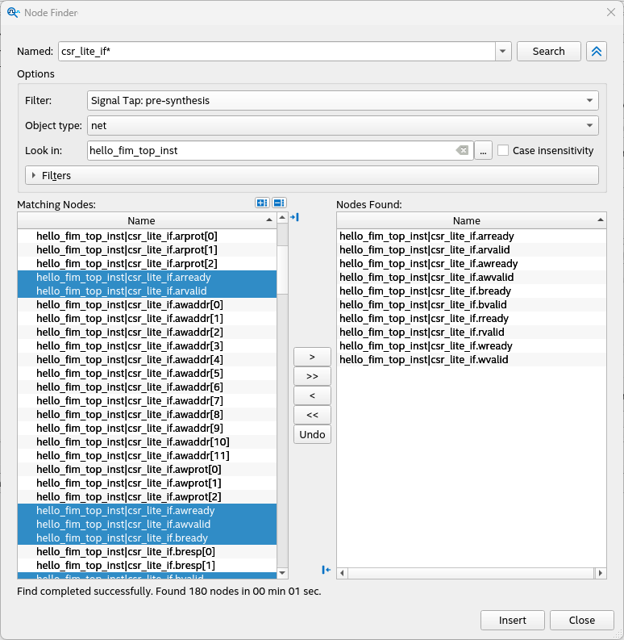
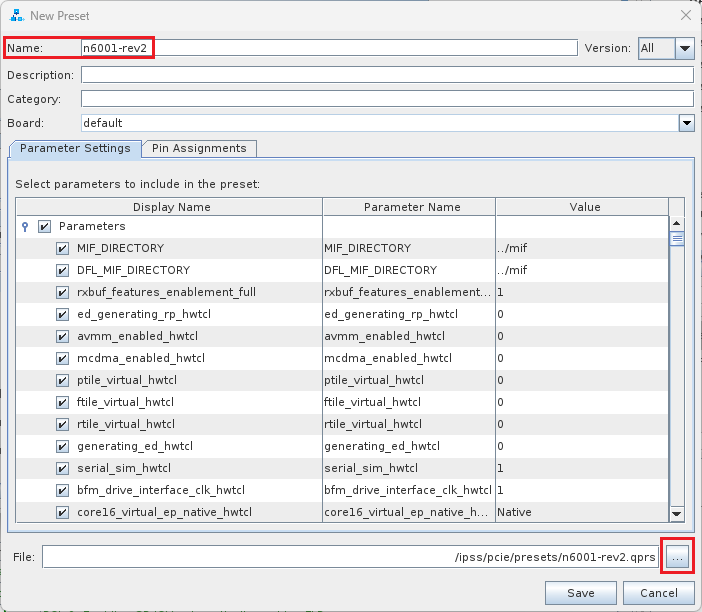
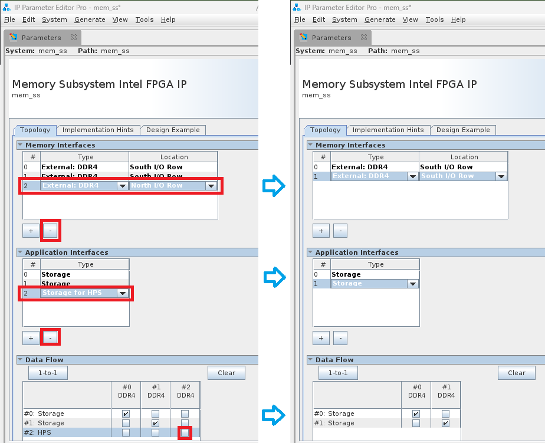
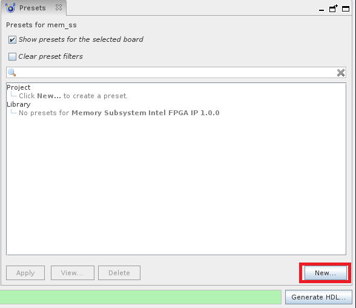

# Shell Developer Guide for Open FPGA Stack: Intel® FPGA SmartNIC N6000-PL / Intel® FPGA SmartNIC N6001-PL PCIe Attach

Last updated: **February 26, 2025** 

## **1. Introduction**

### **1.1. About This Document**

This document serves as a guide for OFS Agilex PCIe Attach developers targeting the Intel® FPGA SmartNIC N6000-PL and Intel® FPGA SmartNIC N6001-PL. The following topics are covered in this guide:

* Compiling the OFS Agilex PCIe Attach FIM design
* Simulating the OFS Agilex PCIe Attach design
* Customizing the OFS Agilex PCIe Attach FIM design
* Configuring the FPGA with an OFS Agilex PCIe Attach FIM design

The *FIM Development Walkthroughs Table* lists all of the walkthroughs provided in this guide. These walkthroughs provide step-by-step instructions for performing different FIM Development tasks.

*Table: FIM Development Walkthroughs*

| Walkthrough Name | Category |
| --- | --- |
| [Install Quartus Prime Pro Software](https://ofs.github.io/ofs-2024.3-1/hw/n6001/dev_guides/fim_dev/ug_dev_fim_ofs_n6001/#1311-walkthrough-install-quartus-prime-pro-software) | Setup |
| [Clone FIM Repository](https://ofs.github.io/ofs-2024.3-1/hw/n6001/dev_guides/fim_dev/ug_dev_fim_ofs_n6001/#1321-walkthrough-clone-fim-repository) | Setup |
| [Set Development Environment Variables](https://ofs.github.io/ofs-2024.3-1/hw/n6001/dev_guides/fim_dev/ug_dev_fim_ofs_n6001/#1331-walkthrough-set-development-environment-variables) | Setup |
| [Set Up Development Environment](https://ofs.github.io/ofs-2024.3-1/hw/n6001/dev_guides/fim_dev/ug_dev_fim_ofs_n6001/#134-walkthrough-set-up-development-environment) | Setup |
| [Compile OFS FIM](https://ofs.github.io/ofs-2024.3-1/hw/n6001/dev_guides/fim_dev/ug_dev_fim_ofs_n6001/#225-walkthrough-compile-ofs-fim) | Compilation |
| [Manually Generate OFS Out-Of-Tree PR FIM](https://ofs.github.io/ofs-2024.3-1/hw/n6001/dev_guides/fim_dev/ug_dev_fim_ofs_n6001/#226-walkthrough-manually-generate-ofs-out-of-tree-pr-fim) | Compilation |
| [Change the Compilation Seed](https://ofs.github.io/ofs-2024.3-1/hw/n6001/dev_guides/fim_dev/ug_dev_fim_ofs_n6001/#2271-walkthrough-change-the-compilation-seed) | Compilation |
| [Run Individual Unit Level Simulation](https://ofs.github.io/ofs-2024.3-1/hw/n6001/dev_guides/fim_dev/ug_dev_fim_ofs_n6001/#321-walkthrough-run-individual-unit-level-simulation) | Simulation |
| [Run Regression Unit Level Simulation](https://ofs.github.io/ofs-2024.3-1/hw/n6001/dev_guides/fim_dev/ug_dev_fim_ofs_n6001/#331-walkthrough-run-regression-unit-level-simulation) | Simulation |
| [Add a new module to the OFS FIM](https://ofs.github.io/ofs-2024.3-1/hw/n6001/dev_guides/fim_dev/ug_dev_fim_ofs_n6001/#412-walkthrough-add-a-new-module-to-the-ofs-fim) | Customization |
| [Modify and run unit tests for a FIM that has a new module](https://ofs.github.io/ofs-2024.3-1/hw/n6001/dev_guides/fim_dev/ug_dev_fim_ofs_n6001/#413-walkthrough-modify-and-run-unit-tests-for-a-fim-that-has-a-new-module) | Customization |
| [Modify and run UVM tests for a FIM that has a new module](https://ofs.github.io/ofs-2024.3-1/hw/n6001/dev_guides/fim_dev/ug_dev_fim_ofs_n6001/#414-walkthrough-modify-and-run-uvm-tests-for-a-fim-that-has-a-new-module) | Customization |
| [Hardware test a FIM that has a new module](https://ofs.github.io/ofs-2024.3-1/hw/n6001/dev_guides/fim_dev/ug_dev_fim_ofs_n6001/#415-walkthrough-hardware-test-a-fim-that-has-a-new-module) | Customization |
| [Debug the FIM with Signal Tap](https://ofs.github.io/ofs-2024.3-1/hw/n6001/dev_guides/fim_dev/ug_dev_fim_ofs_n6001/#416-walkthrough-debug-the-fim-with-signal-tap) | Customization |
| [Compile the FIM in preparation for designing your AFU](https://ofs.github.io/ofs-2024.3-1/hw/n6001/dev_guides/fim_dev/ug_dev_fim_ofs_n6001/#421-walkthrough-compile-the-fim-in-preparation-for-designing-your-afu) | Customization |
| [Resize the Partial Reconfiguration Region](https://ofs.github.io/ofs-2024.3-1/hw/n6001/dev_guides/fim_dev/ug_dev_fim_ofs_n6001/#431-walkthrough-resize-the-partial-reconfiguration-region) | Customization |
| [Modify the PCIe Sub-System and PF/VF MUX Configuration Using OFSS](https://ofs.github.io/ofs-2024.3-1/hw/n6001/dev_guides/fim_dev/ug_dev_fim_ofs_n6001/#4431-walkthrough-modify-the-pcie-sub-system-and-pfvf-mux-configuration-using-ofss) | Customization |
| [Modify PCIe Sub-System and PF/VF MUX Configuration Using IP Presets](https://ofs.github.io/ofs-2024.3-1/hw/n6001/dev_guides/fim_dev/ug_dev_fim_ofs_n6001/#4441-walkthrough-modify-pcie-sub-system-and-pfvf-mux-configuration-using-ip-presets) | Customization |
| [Create a Minimal FIM](https://ofs.github.io/ofs-2024.3-1/hw/n6001/dev_guides/fim_dev/ug_dev_fim_ofs_n6001/#451-walkthrough-create-a-minimal-fim) | Customization |
| [Migrate to a Different Agilex Device Number](https://ofs.github.io/ofs-2024.3-1/hw/n6001/dev_guides/fim_dev/ug_dev_fim_ofs_n6001/#461-walkthrough-migrate-to-a-different-agilex-device-number) | Customization |
| [Modify the Memory Sub-System Using IP Presets With OFSS](https://ofs.github.io/ofs-2024.3-1/hw/n6001/dev_guides/fim_dev/ug_dev_fim_ofs_n6001/#471-walkthrough-modify-the-memory-sub-system-using-ip-presets-with-ofss) | Customization |
| [Modify the Ethernet Sub-System Channels With Pre-Made HSSI OFSS](https://ofs.github.io/ofs-2024.3-1/hw/n6001/dev_guides/fim_dev/ug_dev_fim_ofs_n6001/#481-walkthrough-modify-the-ethernet-sub-system-channels-with-pre-made-hssi-ofss) | Customization |
| [Add Channels to the Ethernet Sub-System Channels With Custom HSSI OFSS](https://ofs.github.io/ofs-2024.3-1/hw/n6001/dev_guides/fim_dev/ug_dev_fim_ofs_n6001/#482-walkthrough-add-channels-to-the-ethernet-sub-system-channels-with-custom-hssi-ofss) | Customization |
| [Modify the Ethernet Sub-System With Pre-Made HSSI OFSS Plus Additional Modifications](https://ofs.github.io/ofs-2024.3-1/hw/n6001/dev_guides/fim_dev/ug_dev_fim_ofs_n6001/#483-walkthrough-modify-the-ethernet-sub-system-with-pre-made-hssi-ofss-plus-additional-modifications) | Customization |
| [Modify the Ethernet Sub-System Without HSSI OFSS](https://ofs.github.io/ofs-2024.3-1/hw/n6001/dev_guides/fim_dev/ug_dev_fim_ofs_n6001/#484-walkthrough-modify-the-ethernet-sub-system-without-hssi-ofss) | Customization |
| [Remove the HPS](https://ofs.github.io/ofs-2024.3-1/hw/n6001/dev_guides/fim_dev/ug_dev_fim_ofs_n6001/#491-walkthrough-remove-the-hps) | Customization |
| [Set up JTAG](https://ofs.github.io/ofs-2024.3-1/hw/n6001/dev_guides/fim_dev/ug_dev_fim_ofs_n6001/#51-walkthrough-set-up-jtag) | Configuration |
| [Program the FPGA via JTAG](https://ofs.github.io/ofs-2024.3-1/hw/n6001/dev_guides/fim_dev/ug_dev_fim_ofs_n6001/#52-walkthrough-program-the-fpga-via-jtag) | Configuration |
| [Program the FPGA via RSU](https://ofs.github.io/ofs-2024.3-1/hw/n6001/dev_guides/fim_dev/ug_dev_fim_ofs_n6001/#531-walkthrough-program-the-fpga-via-rsu) | Configuration |

#### **1.1.1 Knowledge Pre-Requisites**

It is recommended that you have the following knowledge and skills before using this developer guide.

* Basic understanding of OFS and the difference between OFS designs. Refer to the [OFS Welcome Page](https://ofs.github.io/ofs-2024.3-1).
* Review the [release notes](https://github.com/OFS/ofs-agx7-pcie-attach/releases/tag/ofs-2024.3-1) for the Agilex™ 7 PCIe Attach Reference Shells, with careful consideration of the **Known Issues**.
* Review of [Getting Started Guide: OFS for Agilex™ 7 PCIe Attach FPGAs (Intel® FPGA SmartNIC N6001-PL/N6000-PL)](https://ofs.github.io/ofs-2024.3-1/hw/n6001/user_guides/ug_qs_ofs_n6001/ug_qs_ofs_n6001/).
* FPGA compilation flows using Quartus® Prime Pro Edition Software.
* Static Timing closure, including familiarity with the Timing Analyzer tool in Quartus® Prime Pro Edition Software, applying timing constraints, Synopsys* Design Constraints (.sdc) language and Tcl scripting, and design methods to close on timing critical paths.
* RTL (System Verilog) and coding practices to create synthesized logic.
* RTL simulation tools.
* Quartus® Prime Pro Edition Software Signal Tap Logic Analyzer tool software.

### **1.2. FIM Development Theory**

This section will help you understand how the OFS Agilex PCIe Attach FIM can be developed to fit your design goals.

The [Default FIM Features](https://ofs.github.io/ofs-2024.3-1/hw/n6001/dev_guides/fim_dev/ug_dev_fim_ofs_n6001/#121-default-fim-features) section provides general information about the default features of the OFS Agilex PCIe Attach FIM so you can become familiar with the default design. For more detailed information about the FIM architecture, refer to the [Shell Technical Reference Manual: OFS for Agilex™ 7 PCIe Attach FPGAs](https://ofs.github.io/ofs-2024.3-1/hw/n6001/reference_manuals/ofs_fim/mnl_fim_ofs_n6001/).

The [Customization Options](https://ofs.github.io/ofs-2024.3-1/hw/n6001/dev_guides/fim_dev/ug_dev_fim_ofs_n6001/#122-customization-options) section then gives suggestions of how this default design can be customized. Step-by-step walkthroughs for many of the suggested customizations are later described in the [FIM Customization](https://ofs.github.io/ofs-2024.3-1/hw/n6001/dev_guides/fim_dev/ug_dev_fim_ofs_n6001/#4-fim-customization) section.

FIM development for a new acceleration card generally consists of the following steps:

1. Install OFS and familiarize yourself with provided scripts and source code
2. Develop high level design with your specific functionality
  1. Determine requirements and key performance metrics
  2. Select IP cores
  3. Select FPGA device
  4. Develop software memory map
3. Select and implement FIM Physical interfaces including:
  1. External clock sources and creation of internal PLL clocks
  2. General I/O
  3. Ethernet modules
  4. External memories
  5. FPGA programming methodology
4. Develop device physical implementation
  1. FPGA device pin assignment
  2. Create logic lock regions
  3. Create of timing constraints
  4. Create Quartus Prime Pro FIM test project and validate:
    1. Placement
    2. Timing constraints
    3. Build script process
    4. Review test FIM FPGA resource usage
5. Select FIM to AFU interfaces and development of PIM
6. Implement FIM design
  1. Develop RTL
  2. Instantiate IPs
  3. Develop test AFU to validate FIM
  4. Develop unit and device level simulation
  5. Develop timing constraints and build scripts
  6. Perform timing closure and build validation
7. Create FIM documentation to support AFU development and synthesis
8. Software Device Feature discovery
9. Integrate, validate, and debug hardware/software
10. Prepare for high volume production

### **1.2.1 Default FIM Features**

#### **1.2.1.1 Top Level**

The top level block diagram for the OFS Agilex PCIe Attach reference design is shown below.

*Figure: OFS Agilex PCIe Attach FIM Top-Level Diagram*


#### **1.2.1.2 Interfaces**

The key interfaces in the OFS Agilex PCIe Attach design are listed in the *Release Capabilities* tables below. They describe the capabilities of the n6001 and n6000 hardware as well as the capabilities of the default OFS Agilex PCIe Attach reference designs targeting the n6001 and the n6000.

*Table: Intel® FPGA SmartNIC N6001-PL OFS Release Capabilities*

| Interface | Intel® FPGA SmartNIC N6001-PL Hardware Capabilities | n6001 OFS Agilex PCIe Attach Reference Design Implementation |
| --- | --- | --- |
| Host Interface | PCIe Gen4x16 | PCIe Gen4x16 |
| Network Interface | 2 x QSFP-28/56 cages | 2x4x25GbE \| 2x1x100GbE \| 2x4x10GbE |
| External Memory | 5xDDR4 DIMMs sockets - 40-bits (1 available for HPS) | 4xDDR4 - 2400MHz - 4GB (1Gb x 32) - 32-bits - No ECC</br>1xDDR4 - 2400MHz - 1GB (256Mb x 32 with 256 Mb x8 ECC) - 40-bits - With ECC - For HPS|

*Table: Intel® FPGA SmartNIC N6000-PL OFS Release Capabilities*

| Interface | Intel® FPGA SmartNIC N6000-PL Hardware Capabilities | n6000 OFS Agilex PCIe Attach Reference Design Implementation |
| --- | --- | --- |
| Host Interface | To Agilex 7: PCIe Gen4x8 </br> To E810: PCIe Gen4x8 | To Agilex 7: PCIe Gen4x8 </br> To E810: PCIe Gen4x8 |
| Network Interface | 2 x QSFP-28/56 cages | 2x2x100GbE |
| External Memory | 5xDDR4 DIMMs sockets - 40-bits (1 available for HPS) | Not enabled by default, but can support:</br> 4xDDR4 - 2400MHz - 4GB (1Gb x 32) - 32-bits - No ECC</br>1xDDR4 - 2400MHz - 1GB (256Mb x 32 with 256 Mb x8 ECC) - 40-bits - With ECC - For HPS|

#### **1.2.1.3 Subsystems**

The *FIM Subsystems* Table  describes the Platform Designer IP subsystems used in the OFS Agilex PCIe Attach n6001 FIM.

*Table: FIM Subsystems*

| Subsystem | User Guide | Document ID |
| --- | --- | --- |
| PCIe Subsystem | [AXI Streaming IP for PCI Express User Guide](https://www.intel.com/content/www/us/en/docs/programmable/790711/24-3-1/introduction.html) | 790711 |
| Memory Subsystem | [Memory Subsystem Intel FPGA IP User Guide for Agilex™ OFS](https://www.intel.com/content/www/us/en/secure/content-details/686148/memory-subsystem-intel-fpga-ip-user-guide-for-intel-agilex-ofs.html?wapkw=686148&DocID=686148) | 686148<sup>**[1]**</sup> |
| Ethernet Subsystem | [Ethernet Subsystem Intel FPGA IP User Guide](https://www.intel.com/content/www/us/en/docs/programmable/773413/24-1-25-0-0/introduction.html) | 773413<sup>**[1]**</sup> |

<sup>**[1]**</sup> You must request entitled access to these documents.

#### **1.2.1.4 Host Exercisers**

The default AFU workload in the OFS Agilex PCIe Attach n6001/n6000 FIM contains several modules called Host Exercisers which are used to exercise the interfaces on the board. The *Host Exerciser Descriptions* Table describes these modules.

*Table: Host Exerciser Descriptions*

|Name | Acronym | Description | OPAE Command |
| --- | --- | --- | --- |
| Host Exerciser Loopback | HE-LB | Used to exercise and characterize host to FPGA data transfer. | `host_exerciser` |
| Host Exerciser Memory | HE_MEM | Used to exercise and characterize host to Memory data transfer. | `host_exerciser` |
| Host Exerciser Memory Traffic Generator| HE_MEM_TG | Used to exercise and test available memory channels with a configurable traffic pattern. | `mem_tg`
| Host Exerciser High Speed Serial Interface | HE-HSSI | n6001: Used to exercise and characterize HSSI interfaces. </br> n6000: Used to pass through data between the E810 to the QSFPs. | `hssi` |

The host exercisers can be removed from the design at compile-time using command line arguments for the build script.

#### **1.2.1.5 Module Access via APF/BPF**

The OFS Agilex PCIe Attach n6001 FIM uses AXI4-Lite interconnect logic named the AFU Peripheral Fabric (APF) and Board Peripheral Fabric (BPF) to access the registers of the various modules in the design. The APF/BPF modules define master/slave interactions, namely between the host software and AFU and board peripherals. The *APF Address Map Table* describes the address mapping of the APF, followed by the *BPF Address Map Table* which describes the address mapping of the BPF.

*Table: APF Address Map*

| Address | Size (Bytes) | Feature |
| --- | --- | --- |
| 0x00000–0x3FFFF | 256K | Board Peripherals (See *BPF Address Map* table) |
| 0x40000 – 0x4FFFF | 64K | ST2MM
| 0x50000 – 0x5FFFF | 64K | Reserved
| 0x60000 – 0x60FFF | 4K | UART
| 0x61000 – 0x6FFFF | 4K | Reserved
| 0x70000 – 0x7FFFF | 56K | PR Gasket:4K= PR Gasket DFH, control and status4K= Port DFH4K=User Clock52K=Remote STP
| 0x80000 – 0x80FFF | 4K | AFU Error Reporting

*Table: BPF Address Map*

| Address | Size (Bytes) | Feature |
| --- | --- | --- |
| 0x00000 - 0x0FFFF | 64K | FME |
| 0x10000 - 0x10FFF | 4K | PCIe |
| 0x11000 - 0x11FFF | 4K | Reserved |
| 0x12000 - 0x12FFF | 4K | QSFP0 |
| 0x13000 - 0x13FFF | 4K | QSFP1 |
| 0x14000 - 0x14FFF | 4K | HSSI |
| 0x15000 - 0x15FFF | 4K | EMIF |
| 0x20000 - 0x3FFFF | 128K | PMCI Controller |

### **1.2.2 Customization Options**

OFS is designed to be easily customizable to meet your design needs. The *OFS FIM Customization Examples Table* lists the general user flows for OFS Agilex PCIe Attach n6001/n6000 FIM development, along with example customizations for each user flow, plus links to step-by-step walkthroughs where available.

*Table: OFS FIM Customization Examples*

| Walkthrough Name |
| --- |
| [Add a new module to the OFS FIM](https://ofs.github.io/ofs-2024.3-1/hw/n6001/dev_guides/fim_dev/ug_dev_fim_ofs_n6001/#412-walkthrough-add-a-new-module-to-the-ofs-fim) |
| [Modify and run unit tests for a FIM that has a new module](https://ofs.github.io/ofs-2024.3-1/hw/n6001/dev_guides/fim_dev/ug_dev_fim_ofs_n6001/#413-walkthrough-modify-and-run-unit-tests-for-a-fim-that-has-a-new-module) |
| [Modify and run UVM tests for a FIM that has a new module](https://ofs.github.io/ofs-2024.3-1/hw/n6001/dev_guides/fim_dev/ug_dev_fim_ofs_n6001/#414-walkthrough-modify-and-run-uvm-tests-for-a-fim-that-has-a-new-module) |
| [Hardware test a FIM that has a new module](https://ofs.github.io/ofs-2024.3-1/hw/n6001/dev_guides/fim_dev/ug_dev_fim_ofs_n6001/#415-walkthrough-hardware-test-a-fim-that-has-a-new-module) |
| [Debug the FIM with Signal Tap](https://ofs.github.io/ofs-2024.3-1/hw/n6001/dev_guides/fim_dev/ug_dev_fim_ofs_n6001/#416-walkthrough-debug-the-fim-with-signal-tap) |
| [Compile the FIM in preparation for designing your AFU](https://ofs.github.io/ofs-2024.3-1/hw/n6001/dev_guides/fim_dev/ug_dev_fim_ofs_n6001/#421-walkthrough-compile-the-fim-in-preparation-for-designing-your-afu) |
| [Resize the Partial Reconfiguration Region](https://ofs.github.io/ofs-2024.3-1/hw/n6001/dev_guides/fim_dev/ug_dev_fim_ofs_n6001/#431-walkthrough-resize-the-partial-reconfiguration-region) |
| [Modify the PCIe Sub-System and PF/VF MUX Configuration Using OFSS](https://ofs.github.io/ofs-2024.3-1/hw/n6001/dev_guides/fim_dev/ug_dev_fim_ofs_n6001/#4431-walkthrough-modify-the-pcie-sub-system-and-pfvf-mux-configuration-using-ofss) |
| [Modify PCIe Sub-System and PF/VF MUX Configuration Using IP Presets](https://ofs.github.io/ofs-2024.3-1/hw/n6001/dev_guides/fim_dev/ug_dev_fim_ofs_n6001/#4441-walkthrough-modify-pcie-sub-system-and-pfvf-mux-configuration-using-ip-presets) |
| [Create a Minimal FIM](https://ofs.github.io/ofs-2024.3-1/hw/n6001/dev_guides/fim_dev/ug_dev_fim_ofs_n6001/#451-walkthrough-create-a-minimal-fim) |
| [Migrate to a Different Agilex Device Number](https://ofs.github.io/ofs-2024.3-1/hw/n6001/dev_guides/fim_dev/ug_dev_fim_ofs_n6001/#461-walkthrough-migrate-to-a-different-agilex-device-number) |
| [Modify the Memory Sub-System Using IP Presets With OFSS](https://ofs.github.io/ofs-2024.3-1/hw/n6001/dev_guides/fim_dev/ug_dev_fim_ofs_n6001/#471-walkthrough-modify-the-memory-sub-system-using-ip-presets-with-ofss) |
| [Modify the Ethernet Sub-System Channels With Pre-Made HSSI OFSS](https://ofs.github.io/ofs-2024.3-1/hw/n6001/dev_guides/fim_dev/ug_dev_fim_ofs_n6001/#481-walkthrough-modify-the-ethernet-sub-system-channels-with-pre-made-hssi-ofss) |
| [Add Channels to the Ethernet Sub-System Channels With Custom HSSI OFSS](https://ofs.github.io/ofs-2024.3-1/hw/n6001/dev_guides/fim_dev/ug_dev_fim_ofs_n6001/#482-walkthrough-add-channels-to-the-ethernet-sub-system-channels-with-custom-hssi-ofss) |
| [Modify the Ethernet Sub-System With Pre-Made HSSI OFSS Plus Additional Modifications](https://ofs.github.io/ofs-2024.3-1/hw/n6001/dev_guides/fim_dev/ug_dev_fim_ofs_n6001/#483-walkthrough-modify-the-ethernet-sub-system-with-pre-made-hssi-ofss-plus-additional-modifications) |
| [Modify the Ethernet Sub-System Without HSSI OFSS](https://ofs.github.io/ofs-2024.3-1/hw/n6001/dev_guides/fim_dev/ug_dev_fim_ofs_n6001/#484-walkthrough-modify-the-ethernet-sub-system-without-hssi-ofss) |
| [Remove the HPS](https://ofs.github.io/ofs-2024.3-1/hw/n6001/dev_guides/fim_dev/ug_dev_fim_ofs_n6001/#491-walkthrough-remove-the-hps) |


### **1.3 Development Environment**

This section describes the components required for OFS FIM development, and provides a walkthrough for setting up the environment on your development machine.

Note that your development machine may be different than your deployment machine where the FPGA acceleration card is installed. FPGA development work and deployment work can be performed either on the same machine, or on different machines as desired. Please see the [Getting Started Guide: OFS for Agilex™ 7 PCIe Attach FPGAs (Intel® FPGA SmartNIC N6001-PL/N6000-PL)](https://ofs.github.io/ofs-2024.3-1/hw/n6001/user_guides/ug_qs_ofs_n6001/ug_qs_ofs_n6001/) for instructions on setting up the environment for deployment machines.

#### **1.3.1 Development Tools**

The *Development Environment Table* describes the Best Known Configuration (BKC) for the tools that are required for OFS FIM development.

*Table: Development Environment BKC*

| Component | Version | Installation Walkthrough |
| --- | --- | --- |
| Operating System | RedHat® Enterprise Linux® (RHEL) 9.4 | N/A |
| Quartus® Prime Pro Edition Software | Quartus Prime Pro Version 24.3 for Linux + Patches No patches for this release | Section 1.3.1.1 |
| Python | 3.8.10 or later | N/A |
| GCC | 11.5.0 or later | N/A |
| cmake | 3.26.5 or later | N/A |
| FIM Source Files | ofs-2024.3-1 | Section 1.3.2.1 |

##### **1.3.1.1 Walkthrough: Install Quartus Prime Pro Software**

**Intel Quartus Prime Pro Version 24.3** is verified to work with the latest OFS release ofs-2024.3-1.  However, you have the option to port and verify the release on newer versions of Intel Quartus Prime Pro software.

Use RedHat® Enterprise Linux® (RHEL) 9.4 for compatibility with your development flow and also testing your FIM design in your platform. 

Prior to installing Quartus:

1. Ensure you have sufficient free disk space for Quartus Prime Pro installation and your development work.

  * The disk space may be significantly more based on the device families included in the install. Prior to installation, the disk space should be enough to hold both zipped tar files and uncompressed installation files. After successful installation, delete the downloaded zipped files and uncompressed zip files to release the disk space.

2. Ensure you have sufficient RAM available for OFS compilations with Quartus

  * It is recommended you have at least 128 GB of RAM to compile OFS designs.

3. Perform the following steps to satisfy the required dependencies.

  ```bash
  $ sudo dnf install -y gcc gcc-c++ make cmake libuuid-devel rpm-build autoconf automake bison boost boost-devel libxml2 libxml2-devel make ncurses grub2 bc csh flex glibc-locale-source libnsl ncurses-compat-libs 
  ```

  Apply the following configurations.

  ```bash
  $ sudo localedef -f UTF-8 -i en_US en_US.UTF-8 
  $ sudo ln -s /usr/lib64/libncurses.so.6 /usr/lib64/libncurses.so.5 
  $ sudo ln -s /usr/bin/python3 /usr/bin/python
  ```

4. Create the default installation path: <home directory>/intelFPGA_pro/<version number>, where <home directory> is the default path of the Linux workstation, or as set by the system administrator and <version> is your Quartus version number.

  The installation path must satisfy the following requirements:

  * Contain only alphanumeric characters
  * No special characters or symbols, such as !$%@^&*<>,
  * Only English characters
  * No spaces

5. Download your required Quartus Prime Pro Linux version [here](https://www.intel.com/content/www/us/en/products/details/fpga/development-tools/quartus-prime/resource.html).

6. After running the Quartus Prime Pro installer, set the PATH environment variable to make utilities `quartus`, `jtagconfig`, and `quartus_pgm` discoverable. Edit your bashrc file `~/.bashrc` to add the following line:

  ```bash
  export PATH=<Quartus install directory>/quartus/bin:$PATH
  export PATH=<Quartus install directory>/qsys/bin:$PATH
  ```

  For example, if the Quartus install directory is /home/intelFPGA_pro/24.3 then the new line is:

  ```bash
  export PATH=/home/intelFPGA_pro/24.3/quartus/bin:$PATH
  export PATH=/home/intelFPGA_pro/24.3/qsys/bin:$PATH
  ```

7. Verify, Quartus is discoverable by opening a new shell:

  ```
  $ which quartus
  /home/intelFPGA_pro/24.3/quartus/bin/quartus
  ```


#### **1.3.2 FIM Source Files**

The source files for the OFS Agilex PCIe Attach FIM are provided in the following repository: [https://github.com/OFS/ofs-agx7-pcie-attach/releases/tag/ofs-2024.3-1](https://github.com/OFS/ofs-agx7-pcie-attach/releases/tag/ofs-2024.3-1).

Some essential directories in the repository are described as follows:

```bash
ofs-agx7-pcie-attach
|  syn						// Contains files related to synthesis
|  |  board						// Contains synthesis files for several cards, including the n6001 and n6000
|  |  |  n6001					// Contains synthesis files for n6001 and n6000
|  |  |  |  setup						// Contains setup files, including pin constraints and location constraints
|  |  |  |  syn_top						// Contains Quartus project files
|  verification				// Contains files for UVM testing
|  ipss						// Contains files for IP Sub-Systems
|  |  qsfp						// Contains source files for QSFP Sub-System
|  |  hssi						// Contains source files for HSSI Sub-System
|  |  pmci						// Contains source files for PMCI Sub-System (not used in F-Tile FIM)
|  |  pcie						// Contains source files for PCIe Sub-System
|  |  mem						// Contains source files for Memory Sub-System
|  sim						// Contains simulation files
|  |  unit_test					// Contains files for all unit tests
|  |  |  scripts					// Contains script to run regression unit tests
|  license					// Contains Quartus patch
|  ofs-common				// Contains files which are common across OFS platforms
|  |  verification				// Contains common UVM files
|  |  scripts					// Contains common scripts
|  |  |  common
|  |  |  |  syn							// Contains common scripts for synthesis, including build script
|  |  |  |  sim							// Contains common scripts for simulation
|  |  tools						// Contains common tools files
|  |  |  mk_csr_module				// Contains common files for CSR modules
|  |  |  fabric_generation			// Contains common files for APF/BPF fabric generation
|  |  |  ofss_config				// Contains common files for OFSS configuration tool
|  |  |  |  ip_params					// Contains default IP parameters for certain Sub-Systems when using OFSS
|  |  src						// Contains common source files, including host exercisers
|  tools					//
|  |  ofss_config				// Contains top level OFSS files for each pre-made board configuration
|  |  |  hssi						// Contains OFSS files for Ethernet-SS configuraiton
|  |  |  memory						// Contains OFSS files for Memory-SS configuration
|  |  |  pcie						// Contains OFSS files for PCIe-SS configuration
|  |  |  iopll						// Contains OFSS files for IOPLL configuration
|  src						// Contains source files for Agilex PCIe Attach FIM
|  |  pd_qsys					// Contains source files related to APF/BPF fabric
|  |  includes					// Contains source file header files
|  |  top						// Contains top-level source files, including design top module
|  |  afu_top					// Contains top-level source files for AFU
```

##### **1.3.2.1 Walkthrough: Clone FIM Repository**

Perform the following steps to clone the OFS Agilex™ 7 PCIe Attach FIM Repository:

1. Create a new directory to use as a clean starting point to store the retrieved files.
    ```bash
    mkdir OFS_BUILD_ROOT
    cd OFS_BUILD_ROOT
    export OFS_BUILD_ROOT=$PWD
    ```

2. Clone GitHub repository using the HTTPS git method
    ```bash
    git clone --recurse-submodules https://github.com/OFS/ofs-agx7-pcie-attach.git
    ```

3. Check out the correct tag of the repository
    ```bash
    cd ofs-agx7-pcie-attach
    git checkout --recurse-submodules tags/ofs-2024.3-1
    ```

4. Ensure that `ofs-common` has been cloned as well

    ```bash
    git submodule status
    ```

    Example output:

    ```bash
    ofs-common (ofs-2024.3-1)
    ```

#### **1.3.3 Environment Variables**

The OFS FIM compilation and simulation scripts require certain environment variables be set prior to execution.

##### **1.3.3.1 Walkthrough: Set Development Environment Variables**

Perform the following steps to set the required environment variables. These environment variables must be set prior to simulation or compilation tasks so it is recommended that you create a script to set these variables.

1. Navigate to the top level directory of the cloned OFS FIM repository.

  ```bash
  cd ofs-agx7-pcie-attach
  ```

2. Set project variables
  ```bash
  # Set OFS Root Directory - e.g. this is the top level directory of the cloned OFS FIM repository
  export OFS_ROOTDIR=$PWD
  ```

2. Set variables based on your development environment
  ```bash
  # Set proxies if required for your server
  export http_proxy=<YOUR_HTTP_PROXY>
  export https_proxy=<YOUR_HTTPS_PROXY>
  export ftp_proxy=<YOUR_FTP_PROXY>
  export socks_proxy=<YOUR_SOCKS_PROXY>
  export no_proxy=<YOUR_NO_PROXY>

  # Set Quartus license path
  export LM_LICENSE_FILE=<YOUR_LM_LICENSE_FILE>

  # Set Synopsys License path (if using Synopsys for simulation)
  export SNPSLMD_LICENSE_FILE=<YOUR_SNPSLMD_LICENSE_FILE>

  # Set Quartus Installation Directory - e.g. $QUARTUS_ROOTDIR/bin contains Quartus executables
  export QUARTUS_ROOTDIR=<YOUR_QUARTUS_INSTALLATION_DIRECTORY>

  # Set the Tools Directory - e.g. $TOOLS_LOCATION contains the 'synopsys' directory if you are using Synopsys. Refer to the $VCS_HOME variable for an example.
  export TOOLS_LOCATION=<YOUR_TOOLS_LOCATION>
  ```

3. Set generic environment variables

  ```bash
  # Set Work directory 
  export WORKDIR=$OFS_ROOTDIR

  # Set Quartus Tools variables
  export QUARTUS_HOME=$QUARTUS_ROOTDIR
  export QUARTUS_INSTALL_DIR=$QUARTUS_ROOTDIR
  export QUARTUS_ROOTDIR_OVERRIDE=$QUARTUS_ROOTDIR
  export QUARTUS_VER_AC=$QUARTUS_ROOTDIR
  export IP_ROOTDIR=$QUARTUS_ROOTDIR/../ip
  export IMPORT_IP_ROOTDIR=$IP_ROOTDIR
  export QSYS_ROOTDIR=$QUARTUS_ROOTDIR/../qsys/bin

  # Set Verification Tools variables (if running simulations)
  export DESIGNWARE_HOME=$TOOLS_LOCATION/synopsys/vip_common/vip_Q-2020.03A
  export UVM_HOME=$TOOLS_LOCATION/synopsys/vcsmx/${{ env.N6001_SIM_VCS_VER_SH }}/linux64/rhel/etc/uvm
  export VCS_HOME=$TOOLS_LOCATION/synopsys/vcsmx/${{ env.N6001_SIM_VCS_VER_SH }}/linux64/rhel
  export VCS_TARGET_ARCH=linux64
  export VMR_MODE_FLAG=64
  export MTI_HOME=$QUARTUS_ROOTDIR/../questa_fse
  export VERDIR=$OFS_ROOTDIR/verification
  export VIPDIR=$VERDIR

  # Set OPAE variables
  export OPAE_SDK_REPO_BRANCH=release/2.14.0

  # Set PATH to include compilation and simulation tools
  export PATH=$QUARTUS_HOME/bin:$QUARTUS_HOME/../qsys/bin:$QUARTUS_HOME/sopc_builder/bin/:$OFS_ROOTDIR/opae-sdk/install-opae-sdk/bin:$MTI_HOME/linux_x86_64/:$MTI_HOME/bin/:$DESIGNWARE_HOME/bin:$VCS_HOME/bin:$PATH
  ```


#### **1.3.4 Walkthrough: Set Up Development Environment**

This walkthrough guides you through the process of setting up your development environment in preparation for FIM development. This flow only needs to be done once on your development machine.

1. Ensure that Quartus Prime Pro Version 24.3 for Linux with Agilex™ 7 FPGA device support is installed on your development machine. Refer to the [Install Quartus Prime Pro Software](https://ofs.github.io/ofs-2024.3-1/hw/n6001/dev_guides/fim_dev/ug_dev_fim_ofs_n6001/#1311-walkthrough-install-quartus-prime-pro-software) section for step-by-step installation instructions.

  1. Verify version number

      ```bash
      quartus_sh --version
      ```

      Example Output:

      ```bash
      Quartus Prime Shell
      Version 24.3 SC Pro Edition
      ```

2. Ensure that all support tools are installed on your development machine, and that they meet the version requirements.

  1. Python 3.8.10 or later

    1. Verify version number

      ```bash
      python --version
      ```

      Example Output:

      ```bash
      Python 3.8.10
      ```

  2. GCC 11.5.0 or later

    1. Verify version number

      ```bash
      gcc --version
      ```

      Example output:

      ```bash
      gcc (GCC) 11.5.0
      ```

  3. cmake 3.26.5 or later

    1. Verify version number

      ```bash
      cmake --version
      ```

      Example output:

      ```bash
      cmake version 3.26.5
      ```

3. Clone the ofs-agx7-pcie-attach repository. Refer to the [Clone FIM Repository](https://ofs.github.io/ofs-2024.3-1/hw/n6001/dev_guides/fim_dev/ug_dev_fim_ofs_n6001/#1321-walkthrough-clone-fim-repository) section for step-by-step instructions.

4. Install UART IP license patch `.02`.

  1. Navigate to the `license` directory

    ```bash
    cd $OFS_ROOTDIR/license
    ```

  2. Install Patch 0.02

    ```bash
    sudo ./quartus-0.0-0.02iofs-linux.run
    ```


6. Verify that patches have been installed correctly. They should be listed in the output of the following command.

  ```bash
  quartus_sh --version
  ```

  Example Output:

  ```bash
  Quartus Prime Shell
  Version 24.3.0 Build 115 03/21/2024 Patches 0.02iofs SC Pro Edition
  ```

5. Set required environment variables. Refer to the [Set Development Environment Variables](https://ofs.github.io/ofs-2024.3-1/hw/n6001/dev_guides/fim_dev/ug_dev_fim_ofs_n6001/#1331-walkthrough-set-development-environment-variables) section for step-by-step instructions.

This concludes the walkthrough for setting up your development environment. At this point you are ready to begin FIM development.

## **2. FIM Compilation**

This section describes the process of compiling OFS FIM designs using the provided build scripts. It contains two main sections:

* [Compilation Theory](https://ofs.github.io/ofs-2024.3-1/hw/n6001/dev_guides/fim_dev/ug_dev_fim_ofs_n6001/#21-compilation-theory) - Describes the theory behind FIM compilation
* [Compilation Flows](https://ofs.github.io/ofs-2024.3-1/hw/n6001/dev_guides/fim_dev/ug_dev_fim_ofs_n6001/#22-compilation-flows) - Describes the process of compiling a FIM

The walkthroughs provided in this section are:

* [Compile OFS FIM](https://ofs.github.io/ofs-2024.3-1/hw/n6001/dev_guides/fim_dev/ug_dev_fim_ofs_n6001/#225-walkthrough-compile-ofs-fim)
* [Manually Generate OFS Out-Of-Tree PR FIM](https://ofs.github.io/ofs-2024.3-1/hw/n6001/dev_guides/fim_dev/ug_dev_fim_ofs_n6001/#226-walkthrough-manually-generate-ofs-out-of-tree-pr-fim)
* [Change the Compilation Seed](https://ofs.github.io/ofs-2024.3-1/hw/n6001/dev_guides/fim_dev/ug_dev_fim_ofs_n6001/#2271-walkthrough-change-the-compilation-seed)


### **2.1 Compilation Theory**

This section describes the theory behind FIM compilation.

#### **2.1.1 FIM Build Script**

The OFS Common Repository contains a script named `build_top.sh` which is used to build OFS FIM designs and generate output files that can be programmed to the board. After cloning the OFS FIM repository (with the ofs-common repository included), the build script can be found in the following location:

```bash
$OFS_ROOTDIR/ofs-common/scripts/common/syn/build_top.sh
```

The usage of the `build_top.sh` script is as follows:

```bash
build_top.sh [-k] [-p] [-e] [--stage=<action>] [--ofss=<ip_config>] <build_target>[:<fim_options>] [<work_dir_name>]
```

| Field | Options | Description | Requirement |
| --- | --- | --- | --- |
| `-k` | None | Keep. Preserves and rebuilds within an existing work tree instead of overwriting it. | Optional |
| `-p` | None | When set, and if the FIM supports partial reconfiguration, a PR template tree is generated at the end of the FIM build. The PR template tree is located in the top of the work directory but is relocatable and uses only relative paths. See $OFS_ROOTDIR/syn/common/scripts generate_pr_release.sh for details. | Optional |
| `-e` | None | Run only Quartus analysis and elaboration. It completes the `setup` stage, passes `-end synthesis` to the Quartus compilation flow and exits without running the `finish` stage. | Optional |
| `--stage` | `all` \| `setup` \| `compile` \| `finish` | Controls which portion of the OFS build is run.</br>&nbsp;&nbsp;- `all`: Run all build stages (default)</br>&nbsp;&nbsp;- `setup`: Initialize a project in the work directory</br>&nbsp;&nbsp;- `compile`: Run the Quartus compilation flow on a project that was already initialized with `setup`</br>&nbsp;&nbsp;- `finish`: Complete OFS post-compilation tasks, such as generating flash images and, if `-p` is set, generating a release. | Optional |
| `--ofss` | `<ip_config>.ofss` \| `nodefault` | OFS Settings. OFSS files are used to modify IP in the design. This parameter is consumed during the setup stage and IP is updated only inside the work tree. More than one .ofss file may be passed to the `--ofss` switch by concatenating them separated by commas. For example: `--ofss config_a.ofss,config_b.ofss`. If no OFSS files are provided, the script will default to using the <build_target>.ofss file to configure the design. You may specify `--ofss nodefault` to prevent the script from using the default OFSS configuration; the resulting build will only use the source files as-is, plus any OFSS files you specify. | Optional |
| `<build_target>` | `n6000` \| `n6001` \| `fseries-dk` \| `iseries-dk` | Specifies which board is being targeted. | Required |
| `<fim_options>` | `flat` \| `null_he_lb` \| `null_he_hssi` \| `null_he_mem` \| `null_he_mem_tg` \| `no_hssi` | Used to change how the FIM is built.</br>&nbsp;&nbsp;&bull; `flat` - Compiles a flat design (no PR assignments). This is useful for bringing up the design on a new board without dealing with PR complexity.</br>&nbsp;&nbsp;&bull; `null_he_lb` - Replaces the Host Exerciser Loopback (HE_LBK) with `he_null`.</br>&nbsp;&nbsp;&bull; `null_he_hssi` - Replaces the Host Exerciser HSSI (HE_HSSI) with `he_null`.</br>&nbsp;&nbsp;&bull; `null_he_mem` - Replaces the Host Exerciser Memory (HE_MEM) with `he_null`.</br>&nbsp;&nbsp;&bull; `null_he_mem_tg` - Replaces the Host Exerciser Memory Traffic Generator with `he_null`. </br>&nbsp;&nbsp;&bull; `no_hssi` - Removes the HSSI-SS from the FIM. </br>More than one FIM option may be passed included in the `<fim_options>` list by concatenating them separated by commas. For example: `<build_target>:flat,null_he_lb,null_he_hssi` | Optional | 
| `<work_dir_name>` | String | Specifies the name of the work directory in which the FIM will be built. If not specified, the default target is `$OFS_ROOTDIR/work` | Optional |


Refer to [Compile OFS FIM](https://ofs.github.io/ofs-2024.3-1/hw/n6001/dev_guides/fim_dev/ug_dev_fim_ofs_n6001/#225-walkthrough-compile-ofs-fim) which provides step-by-step instructions for running the build_top.sh script with some of the different available options.

#### **2.1.1.1 Build Work Directory**


The build script copies source files from the existing cloned repository into the specified work directory, which are then used for compilation. As such, any changes made in the base source files will be included in all subsequent builds, unless the `-k` option is used, in which case an existing work directories files are used as-is. Likewise, any changes made in a work directory is only applied to that work directory, and will not be updated in the base repository by default. When using OFSS files to modify the design, the build script will create a work directory and make the modifications in the work directory.

#### **2.1.1.2 Null Host Exercisers**

When using the `he_null_x` command command line options, the specified Host Exerciser is replaced by an `he_null` block. The `he_null` is a minimal block with CSRs that responds to PCIe MMIO requests in order to keep PCIe alive. You may use any of the build flows (flat, in-tree, out-of-tree) with the HE_NULL compile options. The HE_NULL compile options are as follows:

* `null_he_lb` - Replaces the Host Exerciser Loopback (HE_LBK) with `he_null`
* `null_he_hssi` - Replaces the Host Exerciser HSSI (HE_HSSI) with `he_null`
* `null_he_mem` - Replaces the Host Exerciser Memory (HE_MEM) with `he_null`
* `null_he_mem_tg` - Replaces the Host Exerciser Memory Traffic Generator with `he_null`


The [Compile OFS FIM](https://ofs.github.io/ofs-2024.3-1/hw/n6001/dev_guides/fim_dev/ug_dev_fim_ofs_n6001/#225-walkthrough-compile-ofs-fim) section gives step-by-step instructions for this flow.

#### **2.1.2 OFSS File Usage**

The OFS FIM build script uses OFSS files to configure the design IP prior to compilation using preset configurations. The OFSS files specify certain parameters for different IPs. Using OFSS is provided as a convenience feature for building different FIM configurations. You can specify the IP OFSS files you wish to use on the command line, by editing the default Platform OFSS file, or by creating a custom Platform OFSS file and calling it on the command line. Any IP OFSS file type not explicitly specified will default to the one defined in the default Platform OFSS file.

The following video describes OFS Settings files, and provides demonstrations showing how to easily customize the OFS reference shell designs and accelerate your development flow.

<iframe width="560" height="315" src="https://www.youtube.com/embed/VLXL9xHg9rM?si=EC0mFup7D0FPYxFF" title="YouTube video player" frameborder="0" allow="accelerometer; autoplay; clipboard-write; encrypted-media; gyroscope; picture-in-picture; web-share" referrerpolicy="strict-origin-when-cross-origin" allowfullscreen></iframe>

##### **2.1.2.1 Top Level OFSS File**

Top-level OFSS files are OFSS files that contain a list of IP OFSS files that will be used during compilation when the Top-level OFSS file is provided to the build script. You may make your own custom Top-level OFSS files for convenient compilation. The *Provided Top-level OFSS Files* table describes the Top-level OFSS files that are provided to you. 

Top-level OFSS files contain a `[default]` header, followed by all of the IP OFSS files that will be used by the build script when this Platform OFSS file is called. Ensure that any environment variables (e.g. `$OFS_ROOTDIR`) are set correctly. The OFSS Config tool uses breadth first search to include all of the specified OFSS files; the ordering of OFSS files does not matter.

The general structure of a Top-level OFSS file is as follows:

```bash
[default]
<PATH_TO_BASE_OFSS_FILE>
<PATH_TO_PCIE_OFSS_FILE>
<PATH_TO_IOPLL_OFSS_FILE>
<PATH_TO_MEMORY_OFSS_FILE>
<PATH_TO_HSSI_OFSS_FILE>
```

Any IP OFSS file types that are not explicitly defined by the user will default to using the IP OFSS files specified in the default Top-level OFSS file of the target board. The default Top-level OFSS file for each target is `/tools/ofss_config/<target_board>.ofss`. You can use the `--ofss nodefault` option to prevent the build script from using the default Top-level OFSS file. You can still provide other OFSS files while using the `nodefault` option, e.g. `--ofss nodefault tools/ofss_config/pcie/pcie_host_2link.ofss` will implement the settings within `pcie_host_2link.ofss`, and will not use any default settings for the other IP types.

*Table: Provided Top-Level OFSS Files*

| OFSS File Name | Location | Type | Description | Supported Board |
| --- | --- | --- | --- | --- |
| `n6001.ofss` | `$OFS_ROOTDIR/tools/ofss_config` | Top-level | This is the default for N6001. Includes the following OFSS files:</br> &nbsp;&nbsp;&bull; `n6001_base.ofss`</br> &nbsp;&nbsp;&bull; `pcie_host.ofss`</br> &nbsp;&nbsp;&bull; `iopll_500MHz.ofss`</br> &nbsp;&nbsp;&bull; `memory.ofss`</br> &nbsp;&nbsp;&bull; `hssi_8x25.ofss` | N6001 |
| `n6000.ofss` | `$OFS_ROOTDIR/tools/ofss_config` | Top-level | This is the default for N6000. Includes the following OFSS files:</br> &nbsp;&nbsp;&bull; `n6000_base.ofss`</br> &nbsp;&nbsp;&bull; `pcie_host_n6000.ofss`</br> &nbsp;&nbsp;&bull; `iopll_350MHz.ofss`</br> &nbsp;&nbsp;&bull; `hssi_4x100.ofss` | N6000 |
| `fseries-dk.ofss` | `$OFS_ROOTDIR/tools/ofss_config` | Top-level | This is the default for fseries-dk. Includes the following OFSS files:</br> &nbsp;&nbsp;&bull; `fseries-dk_base.ofss`</br> &nbsp;&nbsp;&bull; `pcie_host.ofss`</br> &nbsp;&nbsp;&bull; `iopll_500MHz.ofss`</br> &nbsp;&nbsp;&bull; `memory_ftile.ofss`</br> &nbsp;&nbsp;&bull; `hssi_8x25_ftile.ofss` | fseries-dk |
| `iseries-dk.ofss` | `$OFS_ROOTDIR/tools/ofss_config` | Top-level | This is the default for iseries-dk. Includes the following OFSS files:</br> &nbsp;&nbsp;&bull; `iseries-dk_base.ofss` </br> &nbsp;&nbsp;&bull; `pcie_host.ofss`</br> &nbsp;&nbsp;&bull; `iopll_500MHz.ofss`</br> &nbsp;&nbsp;&bull; `memory_rtile.ofss`</br> &nbsp;&nbsp;&bull; `hssi_8x25_ftile.ofss` | iseries-dk |


##### **2.1.2.2 Base OFSS File**

An OFSS file with IP type `ofs` contains board specific information for the target board. It defines certain attributes of the design, including the platform name, device family, fim type, part number, and device ID. It can also contain settings for system information like PCIe generation and subsystem device IDs. Note that PCIe settings defined in the PCIe OFSS file will take precedence over any PCIe settings defined in the Base OFSS file.

Currently supported configuration options for an OFSS file with IP type `ofs` are described in the *OFS IP OFSS File Options* table.

*Table: OFS IP OFSS File Options*

| Section | Parameter | n6001 Default Value | n6000 Default Value | fseries-dk Default Value | iseries-dk Default Value |
| --- | --- | --- | --- | --- | --- |
| `[ip]` | `type` | `ofs` | `ofs` | `ofs` | `ofs` |
| `[settings]` | `platform` | `n6001` | `n6000` | `n6001` | `n6001` |
| | `family` | `agilex` | `agilex` | `agilex` | `agilex` |
| | `fim` | `base_x16` | `base_x16` | `base_x16` | `base_x16` |
| | `part` | `AGFB014R24A2E2V` | `AGFB014R24A2E2V` | `AGFB027R24C2E2VR2` | `AGIB027R29A1E1VB` |
| | `device_id` | `6001` | `6000` | `6001` | `6001` |
| `[pcie.settings]` | `pcie_gen` | `4` | `4` | `4` | `5` |
| `[pcie]` | `subsys_dev_id` | `1771` | `1770` | `1` | `1` |
| | `exvf_subsysid` | `1771` | `1770` | `1` | `1` |

The *Provided Base OFSS Files* table describes the Base OFSS files that are provided to you.

*Table: Provided Base OFSS Files*

| OFSS File Name | Location | Type | Supported Board |
| --- | --- | --- | --- |
| `n6001_base.ofss` | `$OFS_ROOTDIR/tools/ofss_config/base` | ofs | N6001 |
| `n6000_base.ofss` | `$OFS_ROOTDIR/tools/ofss_config/base` | ofs | N6000 |
| `fseries-dk_base.ofss` | `$OFS_ROOTDIR/tools/ofss_config/base` | ofs | fseries-dk |
| `iseries-dk_base.ofss` | `$OFS_ROOTDIR/tools/ofss_config/base` | ofs | iseries-dk |


##### **2.1.2.3 PCIe OFSS File**

An OFSS file with IP type `pcie` is used to configure the PCIe-SS and PF/VF MUX in the FIM.

The PCIe OFSS file has a special section type (`[pf*]`) which is used to define physical functions (PFs) in the FIM. Each PF has a dedicated section, where the `*` character is replaced with the PF number. For example, `[pf0]`, `[pf1]`, etc. For reference FIM configurations, you must have at least 1 PF with 1VF, or 2PFs. This is because the PR region cannot be left unconnected. PFs must be consecutive. The *PFVF Limitations* table describes the supported number of PFs and VFs.

*Table: PF/VF Limitations*

| Parameter | Value |
| --- | --- |
| Min # of PFs | 1 PF if 1 or more VFs present \| 2 PFs if 0 VFs present (PFs must start at PF0) |
| Max # of PFs | 8 |
| Min # of VFs | 0 VFs if 2 or more PFs present \| 1 VF if only 1 PF present |
| Max # of VFs | 2000 distributed across all PFs |

Currently supported configuration options for an OFSS file with IP type `pcie` are described in the *PCIe IP OFSS File Options* table.

*Table: PCIe IP OFSS File Options*

| Section | Parameter | Options | Description | n6001 Default Value | n6000 Default Value | fseries-dk Default Value | iseries-dk Default Value |
| --- | --- | --- | --- | --- | --- | --- | --- |
| `[ip]` | `type` | `pcie` | Specifies that this OFSS file configures the PCIe-SS | `pcie` | `pcie` | `pcie` | `pcie` |
| `[settings]` | `output_name` | `pcie_ss` | Specifies the output name of the PCIe-SS IP | `pcie_ss` | `pcie_ss` | `pcie_ss` | `pcie_ss` |
| | `ip_component` |  `intel_pcie_ss_axi` \| `pcie_ss` | Specifies the PCIe SS IP that will be used. </br> &nbsp;&nbsp;&bull; `intel_pcie_ss_axi`: AXI Streaming Intel FPGA IP for PCI Express </br> &nbsp;&nbsp;&bull; `pcie_ss`: Intel FPGA IP Subsystem for PCI Express | `intel_pcie_ss_axi` | `intel_pcie_ss_axi` | `intel_pcie_ss_axi` | `intel_pcie_ss_axi` | `intel_pcie_ss_axi` |
| | `preset` | *String* | OPTIONAL - Specifies the name of a PCIe-SS IP presets file to use when building the FIM. When used, a presets file will take priority over any other parameters set in this OFSS file. | N/A | N/A | N/A | N/A |
| `[pf*]` | `num_vfs` | Integer | Specifies the number of Virtual Functions in the current PF | Variable<sup>**[1]**</sup> | Variable<sup>**[2]**</sup> | Variable<sup>**[1]**</sup> | Variable<sup>**[1]**</sup> |
| | `bar0_address_width` | Integer | | Variable<sup>**[1]**</sup> | Variable<sup>**[2]**</sup> | Variable<sup>**[1]**</sup> | Variable<sup>**[1]**</sup> |
| | `bar4_address_width` | Integer | | Variable<sup>**[1]**</sup> | Variable<sup>**[2]**</sup> | Variable<sup>**[1]**</sup> | Variable<sup>**[1]**</sup> |
| | `vf_bar0_address_width` | Integer | | Variable<sup>**[1]**</sup> | Variable<sup>**[2]**</sup> | Variable<sup>**[1]**</sup> | Variable<sup>**[1]**</sup> |
| | `ats_cap_enable` | `0` \| `1` | | Variable<sup>**[1]**</sup> | Variable<sup>**[2]**</sup> | Variable<sup>**[1]**</sup> | Variable<sup>**[1]**</sup> |
| | `vf_ats_cap_enable` | `0` \| `1` | | Variable<sup>**[1]**</sup> | Variable<sup>**[2]**</sup> | Variable<sup>**[1]**</sup> | Variable<sup>**[1]**</sup> |
| | `prs_ext_cap_enable` | `0` \| `1` | | Variable<sup>**[1]**</sup> | Variable<sup>**[2]**</sup> | Variable<sup>**[1]**</sup> | Variable<sup>**[1]**</sup> |
| | `pasid_cap_enable` | `0` \| `1` | | Variable<sup>**[1]**</sup> | Variable<sup>**[2]**</sup> | Variable<sup>**[1]**</sup> | Variable<sup>**[1]**</sup> |
| | `pci_type0_vendor_id` | 32'h Value | | Variable<sup>**[1]**</sup> | Variable<sup>**[2]**</sup> | Variable<sup>**[1]**</sup> | Variable<sup>**[1]**</sup> |
| | `pci_type0_device_id` | 32'h Value | | Variable<sup>**[1]**</sup> | Variable<sup>**[2]**</sup> | Variable<sup>**[1]**</sup> | Variable<sup>**[1]**</sup> |
| | `revision_id` | 32'h Value | | Variable<sup>**[1]**</sup> | Variable<sup>**[2]**</sup> | Variable<sup>**[1]**</sup> | Variable<sup>**[1]**</sup> |
| | `class_code` | 32'h Value | | Variable<sup>**[1]**</sup> | Variable<sup>**[2]**</sup> | Variable<sup>**[1]**</sup> | Variable<sup>**[1]**</sup> |
| | `subsys_vendor_id` | 32'h Value | | Variable<sup>**[1]**</sup> | Variable<sup>**[2]**</sup> | Variable<sup>**[1]**</sup> | Variable<sup>**[1]**</sup> |
| | `subsys_dev_id` | 32'h Value | | Variable<sup>**[1]**</sup> | Variable<sup>**[2]**</sup> | Variable<sup>**[1]**</sup> | Variable<sup>**[1]**</sup> |
| | `sriov_vf_device_id` | 32'h Value | | Variable<sup>**[1]**</sup> | Variable<sup>**[2]**</sup> | Variable<sup>**[1]**</sup> | Variable<sup>**[1]**</sup> |
| | `exvf_subsysid` | 32'h Value | | Variable<sup>**[1]**</sup> | Variable<sup>**[2]**</sup> | Variable<sup>**[1]**</sup> | Variable<sup>**[1]**</sup> |


> <sup>**[1]**</sup> Refer to `pcie_host.ofss`

> <sup>**[2]**</sup> Refer to `pcie_host_n6000.ofss`

Any parameter that is not specified in the PCIe OFSS file will default to the values defined in `$OFS_ROOTDIR/ofs-common/tools/ofss_config/ip_params/pcie_ss_component_parameters.py`. When using a PCIe IP OFSS file during compilation, the PCIe-SS IP that is used will be defined based on the values in the PCIe IP OFSS file plus the parameters defined in `pcie_ss_component_parameters.py`.

The *Provided PCIe OFSS Files* table describes the PCIe OFSS files that are provided to you.

*Table: Provided PCIe OFSS Files*

| OFSS File Name | Location | Type | Description | Supported Boards |
| --- | --- | --- | --- | --- |
| `pcie_host.ofss` | `$OFS_ROOTDIR/tools/ofss_config/pcie` | pcie | Defines the PCIe Subsystem with the following configuration:</br>&nbsp;&nbsp;&bull; PF0 (3 VFs)</br>&nbsp;&nbsp;&bull; PF1 (0 VFs)</br>&nbsp;&nbsp;&bull; PF2 (0 VFs)</br>&nbsp;&nbsp;&bull; PF3 (0 VFs)</br>&nbsp;&nbsp;&bull; PF4 (0 VFs) | N6001 \| fseries-dk \| iseries-dk |
| `pcie_host_1pf_1vf.ofss` | `$OFS_ROOTDIR/tools/ofss_config/pcie` | pcie | Defines the PCIe Subsystem with the following configuration: </br>&nbsp;&nbsp;&bull; PF0 (1 VF) | N6001 \| fseries-dk \| iseries-dk |
| `pcie_host_2link.ofss` | `$OFS_ROOTDIR/tools/ofss_config/pcie` | pcie | Defines the PCIe Subsystem with the following configuration:</br>&nbsp;&nbsp;&bull; 2x8 PCIe</br>&nbsp;&nbsp;&bull; PF0 (3 VFs)</br>&nbsp;&nbsp;&bull; PF1 (0 VFs)</br>&nbsp;&nbsp;&bull; PF2 (0 VFs)</br>&nbsp;&nbsp;&bull; PF3 (0 VFs)</br>&nbsp;&nbsp;&bull; PF4 (0 VFs) | iseries-dk |
| `pcie_host_2link_1pf_1vf.ofss` | `$OFS_ROOTDIR/tools/ofss_config/pcie` | pcie | Defines the PCIe Subsystem with the following configuration: </br>&nbsp;&nbsp;&bull; 2x8 PCIe</br>&nbsp;&nbsp;&bull; PF0 (1 VF)| iseries-dk |
| `pcie_host_2pf.ofss` | `$OFS_ROOTDIR/tools/ofss_config/pcie` | pcie | Defines the PCIe Subsystem with the following configuration:</br>&nbsp;&nbsp;&bull; PF0 (0 VFs)</br>&nbsp;&nbsp;&bull; PF1 (0 VFs) | N6001 \| fseries-dk \| iseries-dk |
| `pcie_host_gen4.ofss` | `$OFS_ROOTDIR/tools/ofss_config/pcie` | pcie | Defines the PCIe Subsystem with the following configuration:</br>&nbsp;&nbsp;&bull; PF0 (3 VFs)</br>&nbsp;&nbsp;&bull; PF1 (0 VFs)</br>&nbsp;&nbsp;&bull; PF2 (0 VFs)</br>&nbsp;&nbsp;&bull; PF3 (0 VFs)</br>&nbsp;&nbsp;&bull; PF4 (0 VFs) | iseries-dk |
| `pcie_host_n6000.ofss` | `$OFS_ROOTDIR/tools/ofss_config/pcie` | pcie | Defines the PCIe Subsystem for the N6000 with the following configuration:</br>&nbsp;&nbsp;&bull; PF0 (3 VFs)</br>&nbsp;&nbsp;&bull; PF1 (0 VFs)</br>&nbsp;&nbsp;&bull; PF2 (0 VFs)</br>&nbsp;&nbsp;&bull; PF3 (0 VFs)</br>&nbsp;&nbsp;&bull; PF4 (0 VFs) | N6001 |


##### **2.1.2.4 IOPLL OFSS File**

An OFSS file with IP type `iopll` is used to configure the IOPLL in the FIM.

The IOPLL OFSS file has a special section type (`[p_clk]`) which is used to define the IOPLL clock frequency.

Currently supported configuration options for an OFSS file with IP type `iopll` are described in the *IOPLL OFSS File Options* table.

*Table: IOPLL OFSS File Options*

| Section | Parameter | Options | Description | n6001 Default Value | n6000 Default Value | fseries-dk Default Value | iseries-dk Default Value |
| --- | --- | --- | --- | --- | --- | --- | --- |
| `[ip]` | `type` | `iopll` | Specifies that this OFSS file configures the IOPLL | `iopll` | `iopll` | `iopll` | `iopll` |
| `[settings]` | `output_name` | `sys_pll` | Specifies the output name of the IOPLL. | `sys_pll` | `sys_pll` | `sys_pll` | `sys_pll` |
| | `instance_name` | `iopll_0` | Specifies the instance name of the IOPLL. | `iopll_0` | `iopll_0` | `iopll_0` | `iopll_0` |
| `[p_clk]` | `freq` | Integer: 250 - 500 | Specifies the IOPLL clock frequency in MHz. | `500` | `350` | `500` | `500` |

The *Provided IOPLL OFSS Files* table describes the IOPLL OFSS files that are provided to you.

*Table: Provided IOPLL OFSS Files*

| OFSS File Name | Location | Type | Description | Supported Board |
| --- | --- | --- | --- | --- |
| `iopll_500MHz.ofss` | `$OFS_ROOTDIR/tools/ofss_config/iopll` | iopll | Sets the IOPLL frequency to `500 MHz` | N6001 \| fseries-dk \| iseries-dk |
| `iopll_470MHz.ofss` | `$OFS_ROOTDIR/tools/ofss_config/iopll` | iopll | Sets the IOPLL frequency to `470 MHz` | N6001 \| fseries-dk \| iseries-dk |
| `iopll_350MHz.ofss` | `$OFS_ROOTDIR/tools/ofss_config/iopll` | iopll | Sets the IOPLL frequency to `350 MHz` | N6001 \| N6000 \| fseries-dk \| iseries-dk |


##### **2.1.2.5 Memory OFSS File**

An OFSS file with IP type `memory` is used to configure the Memory-SS in the FIM.

The Memory OFSS file specifies a `preset` value, which selects a presets file (`.qprs`) to configure the Memory-SS.

Currently supported configuration options for an OFSS file with IP type `memory` are described in the *Memory OFSS File Options* table.

*Table: Memory OFSS File Options*

| Section | Parameter | Options | Description | n6001 Default Value | n6000 Default Value | fseries-dk Default Value | iseries-dk Default Value |
| --- | --- | --- | --- | --- | --- | --- | --- |
| `[ip]` | `type` | `memory` | Specifies that this OFSS file configures the Memory-SS | `memory` | N/A | `memory` | `memory` |
| `[settings]` | `output_name` | `mem_ss_fm` | Specifies the output name of the Memory-SS. | `mem_ss_fm` | N/A | `mem_ss_fm` | `mem_ss_fm` |
| | `preset` | *String*<sup>**[1]**</sup> | Specifies the name of the `.qprs` presets file that will be used to build the Memory-SS. | `n6001` | N/A | `fseries-dk` | `iseries-dk` |

<sup>**[1]**</sup> You may generate your own `.qprs` presets file with a unique name using Quartus. 

Memory-SS presets files are stored in the `$OFS_ROOTDIR/ipss/mem/qip/presets` directory.

The *Provided Memory OFSS Files* table describes the Memory OFSS files that are provided to you.

*Table: Provided Memory OFSS Files*

| OFSS File Name | Location | Type | Description | Supported Board |
| --- | --- | --- | --- | --- |
| `memory.ofss` | `$OFS_ROOTDIR/tools/ofss_config/memory` | memory | Defines the memory IP preset file to be used during the build as: | N6001 \| N6000 <sup>**[1]**</sup> |
| `memory_ftile.ofss` | `$OFS_ROOTDIR/tools/ofss_config/memory` | memory | Defines the memory IP preset file to be used during the build as `fseries-dk` | fseries-dk |
| `memory_rtile.ofss` | `$OFS_ROOTDIR/tools/ofss_config/memory` | memory | Defines the memory IP preset file to be used during the build as `iseries-dk` when using two UDIMMs populating DIMM slots A and B | iseries-dk |
| `memory_rtile_8g_rdimm.ofss` | `$OFS_ROOTDIR/tools/ofss_config/memory` | memory | Defines the memory IP preset file to be used during the build as `iseries-dk` when using a single RDIMM populating DIMM slot B.  | iseries-dk |
| `memory_rtile_no_dimm.ofss` | `$OFS_ROOTDIR/tools/ofss_config/memory` | memory | Defines the memory IP preset file to be used during the build as `iseries-dk` when there are no DIMMs populated on the board. | iseries-dk |

<sup>**[1]**</sup> The `memory.ofss` file can be used for the N6000, however, the default N6000 FIM does not implement the Memory Sub-system. Refer to Section 4.7.2 for step-by-step instructions on how to enable the Memory sub-system


##### **2.1.2.6 HSSI IP OFSS File**

An OFSS file with IP type `hssi` is used to configure the Ethernet-SS in the FIM.

Currently supported configuration options for an OFSS file with IP type `hssi` are described in the *HSSI OFSS File Options* table.

*Table: HSSI OFSS File Options*

| Section | Parameter | Options | Description | n6001 Default Value | n6000 Default Value | fseries-dk Default Value | iseries-dk Default Value |
| --- | --- | --- | --- | --- | --- | --- | --- |
| `[ip]` | `type` | `hssi` | Specifies that this OFSS file configures the Ethernet-SS | `hssi` | `hssi` | `hssi` | `hssi` |
| `[settings]` | `output_name` | `hssi_ss` | Specifies the output name of the Ethernet-SS | `hssi_ss` | `hssi_ss` | `hssi_ss` | `hssi_ss` |
| | `num_channels` | Integer | Specifies the number of channels. | `8` | `4` | `8` | `8` |
| | `data_rate` | `10GbE` \| `25GbE` \| `100GCAUI-4` \| `200GAUI-4` \| `400GAUI-8` | Specifies the data rate<sup>**[1]**</sup> | `25GbE` | `100GCAUI-4` | `25GbE` | `25GbE` |
| | `preset` | None \| `fseries-dk` \| `200g-fseries-dk` \| `400g-fseries-dk` \| *String*<sup>**[1]**</sup> | OPTIONAL - Selects the platform whose preset `.qprs` file will be used to build the Ethernet-SS. When used, this will overwrite the other settings in this OFSS file. | N/A | N/A | N/A | N/A |

<sup>**[1]**</sup> The presets file will take priority over the `data_rate` parameter, so this value will not take effect if using a presets file.

<sup>**[2]**</sup> You may generate your own `.qprs` presets file with a unique name using Quartus. 

Ethernet-SS presets are stored in  `$OFS_ROOTDIR/ipss/hssi/qip/hssi_ss/presets` directory.

The *Provided HSSI OFSS Files* table describes the HSSI OFSS files that are provided to you.

*Table: Provided HSSI OFSS Files*

| OFSS File Name | Location | Type | Description | Supported Board |
| --- | --- | --- | --- | --- |
| `hssi_8x10.ofss` | `$OFSS_ROOTDIR/tools/ofss_config/hssi` | hssi | Defines the Ethernet-SS IP configuration to be 8x10 GbE | N6001 |
| `hssi_8x25.ofss` | `$OFSS_ROOTDIR/tools/ofss_config/hssi` | hssi | Defines the Ethernet-SS IP configuration to be 8x25 GbE | N6001 |
| `hssi_2x100.ofss` | `$OFSS_ROOTDIR/tools/ofss_config/hssi` | hssi | Defines the Ethernet-SS IP configuration to be 2x100 GbE | N6001 |
| `hssi_1x400_ftile.ofss` | `$OFSS_ROOTDIR/tools/ofss_config/hssi` | hssi | Defines the Ethernet-SS IP configuration to be F-Tile 1x400 GbE | iseries-dk |
| `hssi_4x100.ofss` | `$OFSS_ROOTDIR/tools/ofss_config/hssi` | hssi | Defines the Ethernet-SS IP configuration to be 4x100 GbE | N6000 |
| `hssi_8x25_ftile.ofss` | `$OFSS_ROOTDIR/tools/ofss_config/hssi` | hssi | Defines the Ethernet-SS IP configuration to be F-Tile 8x25 GbE | fseries-dk \| iseries-dk |
| `hssi_2x200_ftile.ofss` | `$OFSS_ROOTDIR/tools/ofss_config/hssi` | hssi | Defines the Ethernet-SS IP to be 2x200 GbE | iseries-dk |


#### **2.1.3 OFS Build Script Outputs**

The output files resulting from running the the OFS FIM `build_top.sh` build script are copied to a single directory during the `finish` stage of the build script. The path for this directory is: 

* For N6001: `$OFS_ROOTDIR/<WORK_DIRECTORY>/syn/board/n6001/syn_top/output_files`
* For N6000: `$OFS_ROOTDIR/<WORK_DIRECTORY>/syn/board/n6000/syn_top/output_files`

The output files include programmable images and compilation reports. The *OFS Build Script Output Descriptions* table describes the images that are generated by the build script.

*Table: OFS Build Script Output Descriptions*

| File            | Description                        |
|-----------------|------------------------------------|
| ofs_top[_hps].bin | This is an intermediate, raw binary file. This intermediate raw binary file is produced by taking the Quartus generated *.sof file, and converting it to *.pof using quartus_pfg, then converting the *.pof to *.hexout using quartus_cpf, and finally converting the *.hexout to *.bin using objcopy. Depending on whether the FPGA design contains an HPS block, a different file will be generated. <br /><br />**ofs_top.bin** - Raw binary image of the FPGA generated if there is no HPS present in the design. <br />**ofs_top_hps.bin** - Raw binary image of the FPGA generated if there is an HPS present in the design. |
| ofs_top_page1.bin | This is the binary of the Factory Image and is the input to PACSign utility to generate **ofs_top_page1_unsigned.bin** binary image file. <br />This image will carry binary content for the HPS if it is included in the SOF image. |
| ofs_top_page0_factory.bin | This is an input file to PACSign to generate **ofs_top_page0_unsigned_factory.bin**.  |
| ofs_top_page0_unsigned_factory.bin | This is the unsigned PACSign output generated for the Factory Image.   |
| ofs_top_page1_user1.bin | This is an input file to PACSign to generate **ofs_top_page1_unsigned_user1.bin**. This file is created by taking the ofs_top_[hps].bin file and assigning the User1 or appending factory block information. |
| ofs_top_page1_unsigned_user1.bin | This is the unsigned FPGA binary image generated by the PACSign utility for the User1 Image. This file is used to load the FPGA flash User1 Image using the fpgasupdate tool. |
| ofs_top_page2_user2.bin |  This is an input file to PACSign to generate **ofs_top_page2_unsigned_user2.bin**. This file is created by taking the ofs_top_[hps].bin file and assigning the User2 or appending factory block information. |
| ofs_top_page2_unsigned_user2.bin | This is the unsigned FPGA binary image generated by the PACSign utility for the User2 Image. This file is used to load the FPGA flash User2 Image using the fpgasupdate tool.|
| ofs_top_hps.sof | If your design contains an Agilex™ 7 FPGA Hard Processor System, then the build assembly process combines the FPGA ofs_top.sof programming file with `u-boot-spl-dtb.hex` to produce this file. |

### **2.2 Compilation Flows**

This section provides information for using the build script to generate different FIM types. Walkthroughs are provided for each compilation flow. These walkthroughs require that the development environment has been set up as described in the [Set Up Development Environment](https://ofs.github.io/ofs-2024.3-1/hw/n6001/dev_guides/fim_dev/ug_dev_fim_ofs_n6001/#134-walkthrough-set-up-development-environment) section.

#### **2.2.1 Flat FIM**

A flat FIM is compiled such that there is no partial reconfiguration region, and the entire design is built as a flat design. This is useful for compiling new designs without worrying about the complexity introduced by partial reconfiguration. The flat compile removes the PR region and PR IP; thus, you cannot use the `-p` build flag when using the `flat` compile setting. Refer to the [Compile OFS FIM](https://ofs.github.io/ofs-2024.3-1/hw/n6001/dev_guides/fim_dev/ug_dev_fim_ofs_n6001/#225-walkthrough-compile-ofs-fim) Section for step-by-step instructions for this flow.

#### **2.2.2 In-Tree PR FIM**

An In-Tree PR FIM is the default compilation if no compile flags or compile settings are used. This flow will compile the design with the partial reconfiguration region, but it will not create a relocatable PR directory tree to aid in AFU development. Refer to the [Compile OFS FIM](https://ofs.github.io/ofs-2024.3-1/hw/n6001/dev_guides/fim_dev/ug_dev_fim_ofs_n6001/#225-walkthrough-compile-ofs-fim) Section for step-by-step instructions for this flow.

#### **2.2.3 Out-of-Tree PR FIM**

An Out-of-Tree PR FIM will compile the design with the partial reconfiguration region, and will create a relocatable PR directory tree to aid in AFU workload development. This is especially useful if you are developing a FIM to be used by another team developing AFU workloads. This is the recommended build flow in most cases. There are two ways to create the relocatable PR directory tree:

* Run the FIM build script with the `-p` option. Refer to the [Compile OFS FIM](https://ofs.github.io/ofs-2024.3-1/hw/n6001/dev_guides/fim_dev/ug_dev_fim_ofs_n6001/#225-walkthrough-compile-ofs-fim) Section for step-by-step instructions for this flow.
* Run the `generate_pr_release.sh` script after running the FIM build script. Refer to the **Walkthrough: Manually Generate OFS Out-Of-Tree PR FIM** Section step-by-step instructions for this flow.

In both cases, the `generate_pr_release.sh` is run to create the relocatable build tree. This script is located at `$OFS_ROOTDIR/ofs-common/scripts/common/syn/generate_pr_release.sh`. Usage for this script is as follows:

```bash
generate_pr_release.sh -t <tgt dir> [-f] <build target> <work dir name>
```

The *Generate PR Release Script Options* table describes the options for the `generate_pr_release.sh` script.

*Table: Generate PR Release Script Options*

| Parameter | Options | Description |
| --- | --- | --- |
| `<tgt dir>` | String | Specifies the location of the relocatable PR directory tree to be created. |
| `[-f]` | - | If <tgt dir> exists, the script will abort unless -f is specified. |
| `<build target>` | `n6001` \| `n6000` \| `fseries-dk` \| `iseries-dk` | Specifies the name of the board target. |
| `<work dir name>` | String | Specifies the existing work directory from which the relocatable PR directory tree will be created from. |

After generating the relocatable build tree, it is located in the `$OFS_ROOTDIR/<WORK_DIRECTORY>/pr_build_template` directory (or the directory you specified if generated separately). The contents of this directory have the following structure:

```bash
├── bin
├── ├── afu_synth
├── ├── qar_gen
├── ├── update_pim
├── ├── run.sh
├── ├── build_env_config
├── README
├── hw
├── ├── lib
├── ├── ├── build
├── ├── ├── fme-ifc-id.txt
├── ├── ├── platform
├── ├── ├── fme-platform-class.txt
├── ├── blue_bits
├── ├── ├── ofs_top_hps.sof
└── ├── ├── ofs_top.sof
```

#### **2.2.4 HE_NULL FIM**

An HE_NULL FIM refers to a design with one, some, or all of the Host Exercisers replaced by `he_null` blocks. The `he_null` is a minimal block with CSRs that responds to PCIe MMIO requests in order to keep PCIe alive. You may use any of the build flows (flat, in-tree, out-of-tree) with the HE_NULL compile options. The HE_NULL compile options are as follows:

* `null_he_lb` - Replaces the Host Exerciser Loopback (HE_LBK) with `he_null`
* `null_he_hssi` - Replaces the Host Exerciser HSSI (HE_HSSI) with `he_null`
* `null_he_mem` - Replaces the Host Exerciser Memory (HE_MEM) with `he_null`
* `null_he_mem_tg` - Replaces the Host Exerciser Memory Traffic Generator with `he_null`

The [Compile OFS FIM](https://ofs.github.io/ofs-2024.3-1/hw/n6001/dev_guides/fim_dev/ug_dev_fim_ofs_n6001/#225-walkthrough-compile-ofs-fim) section gives step-by-step instructions for this flow.

#### **2.2.5 Walkthrough: Compile OFS FIM**

Perform the following steps to compile the OFS Agilex PCIe Attach FIM for n6001 or n6000:

Pre-requisites:

* This walkthrough requires a development environment. Refer to the [Set Up Development Environment](https://ofs.github.io/ofs-2024.3-1/hw/n6001/dev_guides/fim_dev/ug_dev_fim_ofs_n6001/#134-walkthrough-set-up-development-environment) Section for instructions on setting up a development environment.

Steps:

1. Clone the OFS PCIe Attach FIM repository (or use an existing cloned repository). Refer to the [Clone FIM Repository](https://ofs.github.io/ofs-2024.3-1/hw/n6001/dev_guides/fim_dev/ug_dev_fim_ofs_n6001/#1321-walkthrough-clone-fim-repository) section for step-by-step instructions.

2. Set development environment variables. Refer to the [Set Development Environment Variables](https://ofs.github.io/ofs-2024.3-1/hw/n6001/dev_guides/fim_dev/ug_dev_fim_ofs_n6001/#1331-walkthrough-set-development-environment-variables) section for step-by-step instructions.

3. Navigate to the root directory.

  ```bash
  cd $OFS_ROOTDIR
  ```

4. Run the `build_top.sh` script with the desired compile options. The following command would build the default n6001 design:

  ```bash
  ./ofs-common/scripts/common/syn/build_top.sh n6001 work_n6001
  ```

  The build command options allow for many modifications to the shell design at build time. The following tool is provided to help you conveniently get the build command for a specific shell configuration:

<div id="myBox">
  <h1>OFS Build Command Generator</h1><form id="myForm">
    <fieldset>
      <legend>Build Flow Options</legend>  
      <fieldset>
        <legend>Build Target</legend>
        <select id="select_build_target">
          <option value="n6001">n6001</option>
          <option value="n6000">n6000</option>
          <option value="fseries-dk">fseries-dk</option>
          <option value="iseries-dk">iseries-dk</option>
        </select><br>
      </fieldset>
    </fieldset>
    <fieldset>
      <legend>Partial Reconfiguration Settings</legend>
      <input type="checkbox" title="Disabling partial reconfiguration will build a flat design." id="check1" name="check_pr" value="check1">
      <label for="check1">Disable Partial Reconfiguration</label><br>
      <input type="checkbox" title="When this option is enabled the build script will automatically run the generate_pr_release.sh script after the design is compiled. This creates a self-contained working directory for a workload developer to create their AFU/workload." id="check2" name="check_proot" value="check2">
      <label for="check2">Generate Relocatable PR Tree</label><br>
    </fieldset>
    <fieldset>
      <legend>Add/Remove Subsystems</legend>
      <input type="checkbox" id="check8" name="check_no_hssi" value="check8">
      <label for="check8">Remove HSSI-SS (Ethernet Sub-System)</label><br>
    </fieldset>
    <fieldset>
      <legend>Add/Remove Host Exercisers</legend>
      <input type="checkbox" title="When checked the HE_HSSI is replaced with an HE_NULL which ties off the associated VF, leaving a stub with minimal registers." id="check3" name="check_null_he_hssi" value="check3">
      <label for="check3">Remove HE_HSSI (Ethernet Host Exerciser)</label><br>
      <input type="checkbox" title="When checked the HE_LBK is replaced with an HE_NULL which ties off the associated PF, leaving a stub with minimal registers." id="check4" name="check_null_he_lb" value="check4">
      <label for="check4">Remove HE_LBK (PCIe Loopback)</label><br>
      <input type="checkbox" title="When checked the HE_MEM is replaced with an HE_NULL which ties off the associated VF, leaving a stub with minimal registers." id="check5" name="check_null_he_mem" value="check5">
      <label for="check5">Remove HE_MEM (Read/Write Memory Exerciser)</label><br>
      <input type="checkbox" title="When checked the HE_MEM_TG is replaced with an HE_NULL which ties off the associated VF, leaving a stub with minimal registers." id="check6" name="check_null_he_mem_tg" value="check6">
      <label for="check6">Remove HE_MEM_TG (Pseudo random memory traffic generator)</label><br>
    </fieldset>
    <fieldset>
      <legend>IP Configuration</legend>
      <fieldset>
        <legend>HSSI</legend>
        <select id="ofss_hssi">
          <option value="default">default</option>
          <option value="8x10">8x10 GbE</option>
          <option value="8x25">8x25 GbE</option>
          <option value="2x100">2x100 GbE</option>
          <option value="2x200">2x200 GbE</option>
          <option value="1x400">1x400 GbE</option>
        </select><br>
      </fieldset>
      <fieldset>
        <legend>IOPLL</legend>
        <select id="ofss_iopll">
          <option value="default">default</option>
          <option value="500MHz">500 MHz</option>
          <option value="470MHz">470 MHz</option>
          <option value="350MHz">350 MHz</option>
        </select><br>
      </fieldset>
      <fieldset>
        <legend>PCIe</legend>
        <select id="ofss_pcie">
          <option value="default">default</option>
          <option value="1x16_5pf_3vf">1x16 5PF/3VF</option>
          <option value="1x16_1pf_1vf">1x16 1PF/1VF</option>
          <option value="1x16_2pf_0vf">1x16 2PF/0VF</option>
          <option value="2x8_3pf_3vf">2x8 3PF/3VF</option>
          <option value="2x8_1pf_1vf">2x8 1PF/1VF</option><br>
		  <input type="radio" id="pcie_gen4" name="pcie_gen" value="pcie_gen4" checked>
		  <label for="pcie_gen4">Gen4</label>
          <input type="radio" title="Only the iseries-dk supports PCIe Gen5" id="pcie_gen5" name="pcie_gen" value="pcie_gen5">
          <label for="pcie_gen5">Gen5</label>
        </select><br>
      </fieldset>
    </fieldset>
    <br><input type="submit" value="Submit">
  </form>
  <fieldset>
  <div id="result" style="font-family: monospace; whitespace: pre-wrap; word-wrap: break-word; overflow-wrap: break-word;">Press submit to generate the build command.</div>
  </fieldset>
</div>
<style>
  #myBox {
    border: 1px solid black;
    padding: 10px;
  }
</style>


<script>

var target_board = document.getElementById("select_build_target");
var disable_pr = document.getElementById("check1");
var enable_proot = document.getElementById("check2");
var rm_he_hssi = document.getElementById("check3");
var rm_he_lbk = document.getElementById("check4");
var rm_he_mem = document.getElementById("check5");
var rm_he_mem_tg = document.getElementById("check6");
var rm_hssi_ss = document.getElementById("check8");
var ofss_hssi = document.getElementById("ofss_hssi");
var ofss_hssi_option_default = ofss_hssi.querySelector('option[value="default"]');
var ofss_hssi_option_source = ofss_hssi.querySelector('option[value="source"]');
var ofss_iopll = document.getElementById("ofss_iopll");
var ofss_iopll_option_default = ofss_iopll.querySelector('option[value="default"]');
var ofss_iopll_option_source = ofss_iopll.querySelector('option[value="source"]');
var ofss_pcie = document.getElementById("ofss_pcie");
var ofss_pcie_option_default = ofss_pcie.querySelector('option[value="default"]');
var ofss_pcie_option_source = ofss_pcie.querySelector('option[value="source"]');
var pcie_gen4 = document.getElementById("pcie_gen4");
var pcie_gen5 = document.getElementById("pcie_gen5");

function resize_result () {
  var windowWidth = window.innerWidth;
  var resultFieldset = document.getElementById("result");
  resultFieldset.style.maxWidth = (windowWidth * 0.6) + "px";
}

document.addEventListener("DOMContentLoaded", function() {
  function initialize_check_enable_proot() {
    if (disable_pr.checked) {
	  enable_proot.checked = false;
	  enable_proot.disabled = true;
    } else {
	  enable_proot.disabled = false;
    }
  }

  function limit_target_selection () {
	switch (target_board.value) {
	  case "n6001":
	    ofss_hssi.querySelector('option[value="8x10"]').disabled = false;
		  ofss_hssi.querySelector('option[value="8x25"]').disabled = false;
		  ofss_hssi.querySelector('option[value="2x100"]').disabled = false;
	    ofss_hssi.querySelector('option[value="2x200"]').disabled = true;
		  ofss_hssi.querySelector('option[value="1x400"]').disabled = true;
		  if (ofss_hssi.value == "2x200" | ofss_hssi.value == "1x400") {
			  ofss_hssi.value = "default";
		  }
		
		  ofss_iopll.querySelector('option[value="500MHz"]').disabled = false;
		  ofss_iopll.querySelector('option[value="470MHz"]').disabled = false;
		  ofss_iopll.querySelector('option[value="350MHz"]').disabled = false;
		
		  ofss_pcie.querySelector('option[value="1x16_5pf_3vf"]').disabled = false;
      ofss_pcie.querySelector('option[value="1x16_1pf_1vf"]').disabled = false;
      ofss_pcie.querySelector('option[value="1x16_2pf_0vf"]').disabled = false;
      ofss_pcie.querySelector('option[value="2x8_3pf_3vf"]').disabled = true;
      ofss_pcie.querySelector('option[value="2x8_1pf_1vf"]').disabled = true;
		  if (ofss_pcie.value == "2x8_3pf_3vf" | ofss_pcie.value == "2x8_1pf_1vf") {
			  ofss_pcie.value = "default";
		  }
	  break;
		
	  case "n6000":
	    ofss_hssi.querySelector('option[value="8x10"]').disabled = false;
		  ofss_hssi.querySelector('option[value="8x25"]').disabled = false;
		  ofss_hssi.querySelector('option[value="2x100"]').disabled = false;
	    ofss_hssi.querySelector('option[value="2x200"]').disabled = true;
		  ofss_hssi.querySelector('option[value="1x400"]').disabled = true;
		  if (ofss_hssi.value == "2x200" | ofss_hssi.value == "1x400") {
			ofss_hssi.value = "default";
		  }
		  ofss_iopll.querySelector('option[value="500MHz"]').disabled = true;
		  ofss_iopll.querySelector('option[value="470MHz"]').disabled = true;
		  ofss_iopll.querySelector('option[value="350MHz"]').disabled = false;
		  if (ofss_iopll.value == "500MHz" | ofss_iopll.value == "470MHz") {
		  	ofss_iopll.value = "default";
		  }
		
		  ofss_pcie.querySelector('option[value="1x16_5pf_3vf"]').disabled = false;
      ofss_pcie.querySelector('option[value="1x16_1pf_1vf"]').disabled = true;
      ofss_pcie.querySelector('option[value="1x16_2pf_0vf"]').disabled = true;
      ofss_pcie.querySelector('option[value="2x8_3pf_3vf"]').disabled = true;
      ofss_pcie.querySelector('option[value="2x8_1pf_1vf"]').disabled = true;
		  if (ofss_pcie.value == "1x16_1pf_1vf" | ofss_pcie.value == "1x16_2pf_0vf" | ofss_pcie.value == "2x8_3pf_3vf" | ofss_pcie.value == "2x8_1pf_1vf") {
			ofss_pcie.value = "default";
		  }
	  break;
		
	  case "fseries-dk":
	    ofss_hssi.querySelector('option[value="8x10"]').disabled = true;
		  ofss_hssi.querySelector('option[value="8x25"]').disabled = false;
		  ofss_hssi.querySelector('option[value="2x100"]').disabled = true;
	    ofss_hssi.querySelector('option[value="2x200"]').disabled = true;
		  ofss_hssi.querySelector('option[value="1x400"]').disabled = true;
		  if (ofss_hssi.value == "8x10" | ofss_hssi.value == "2x100" | ofss_hssi.value == "2x200" | ofss_hssi.value == "1x400") {
			  ofss_hssi.value = "default";
		  }

		  ofss_iopll.querySelector('option[value="500MHz"]').disabled = false;
		  ofss_iopll.querySelector('option[value="470MHz"]').disabled = false;
		  ofss_iopll.querySelector('option[value="350MHz"]').disabled = false;
	    
		  ofss_pcie.querySelector('option[value="1x16_5pf_3vf"]').disabled = false;
      ofss_pcie.querySelector('option[value="1x16_1pf_1vf"]').disabled = false;
      ofss_pcie.querySelector('option[value="1x16_2pf_0vf"]').disabled = false;
      ofss_pcie.querySelector('option[value="2x8_3pf_3vf"]').disabled = true;
      ofss_pcie.querySelector('option[value="2x8_1pf_1vf"]').disabled = true;
		  if (ofss_pcie.value == "2x8_3pf_3vf" | ofss_pcie.value == "2x8_1pf_1vf") {
			  ofss_pcie.value = "default";
		  }
		break;
		
	  case "iseries-dk":
	    ofss_hssi.querySelector('option[value="8x10"]').disabled = true;
		  ofss_hssi.querySelector('option[value="8x25"]').disabled = false;
		  ofss_hssi.querySelector('option[value="2x100"]').disabled = true;
	    ofss_hssi.querySelector('option[value="2x200"]').disabled = false;
		  ofss_hssi.querySelector('option[value="1x400"]').disabled = false;
		  if (ofss_hssi.value == "8x10" | ofss_hssi.value == "2x100") {
			  ofss_hssi.value = "default";
		  }

		  ofss_iopll.querySelector('option[value="500MHz"]').disabled = false;
		  ofss_iopll.querySelector('option[value="470MHz"]').disabled = false;
		  ofss_iopll.querySelector('option[value="350MHz"]').disabled = false;
	    
	    if (pcie_gen4.checked == true) {
        ofss_pcie.querySelector('option[value="1x16_5pf_3vf"]').disabled = false;
        ofss_pcie.querySelector('option[value="1x16_1pf_1vf"]').disabled = true;
        ofss_pcie.querySelector('option[value="1x16_2pf_0vf"]').disabled = true;
        ofss_pcie.querySelector('option[value="2x8_3pf_3vf"]').disabled = true;
        ofss_pcie.querySelector('option[value="2x8_1pf_1vf"]').disabled = true;
		    if (ofss_pcie.value != "1x16_5pf_3vf") {
		  	  ofss_pcie.value = "default";
		    }
	    }
	    else {
	      ofss_pcie.querySelector('option[value="1x16_5pf_3vf"]').disabled = false;
        ofss_pcie.querySelector('option[value="1x16_1pf_1vf"]').disabled = false;
        ofss_pcie.querySelector('option[value="1x16_2pf_0vf"]').disabled = false;
        ofss_pcie.querySelector('option[value="2x8_3pf_3vf"]').disabled = false;
        ofss_pcie.querySelector('option[value="2x8_1pf_1vf"]').disabled = false;
	    }
		break;
	}
  }
  
  function handle_pcie_gen () {
    switch (target_board.value) {
	  case "n6001":
		  pcie_gen5.disabled = true;
		  pcie_gen4.disabled = false;
		  pcie_gen4.checked = true;
	  break;
	  
	  case "n6000":
	    pcie_gen5.disabled = true;
		  pcie_gen4.disabled = false;
		  pcie_gen4.checked = true;
	  break;
	  
	  case "fseries-dk":
	    pcie_gen5.disabled = true;
		  pcie_gen4.disabled = false;
		  pcie_gen4.checked = true;
	  break;
	  
	  case "iseries-dk":
	    if (ofss_pcie.value == "source") {
		    pcie_gen4.disabled = true;
		    pcie_gen5.disabled = true;
		    pcie_gen4.checked = false;
		    pcie_gen5.checked = false;
		  }
		  else if (ofss_pcie.value == "default") {
		    pcie_gen4.disabled = true;
		    pcie_gen5.disabled = false;
		    pcie_gen4.checked = false;
		    pcie_gen5.checked = true;
		  }
		  else if (ofss_pcie.value == "1x16_5pf_3vf") {
	      pcie_gen5.disabled = false;
		    pcie_gen4.disabled = false;
		    if (!pcie_gen4.checked & !pcie_gen5.checked) {
		      pcie_gen5.checked = true;
		    }
		  }
		  else {
		    pcie_gen5.disabled = false;
		    pcie_gen4.disabled = true;
		    pcie_gen5.checked = true;
		    pcie_gen4.checked = false;
		  }
	  break;
	}
	limit_target_selection();
  }

  window.addEventListener('resize', resize_result);
  disable_pr.addEventListener("change", initialize_check_enable_proot);
  target_board.addEventListener("change", handle_pcie_gen);
  ofss_pcie.addEventListener("change", handle_pcie_gen);
  pcie_gen4.addEventListener("change", handle_pcie_gen);
  pcie_gen5.addEventListener("change", handle_pcie_gen);
  initialize_check_enable_proot();
  limit_target_selection();
  handle_pcie_gen();
  resize_result();
  
});

document.getElementById("myForm").addEventListener("submit", function(event) {
  event.preventDefault();
  let target_board_st = document.getElementById("select_build_target").value;
  let disable_pr_st = document.getElementById("check1").checked;
  let enable_proot_st = document.getElementById("check2").checked;
  let rm_he_hssi_st = document.getElementById("check3").checked;
  let rm_he_lbk_st = document.getElementById("check4").checked;
  let rm_he_mem_st = document.getElementById("check5").checked;
  let rm_he_mem_tg_st = document.getElementById("check6").checked;
  let rm_hssi_ss_st = document.getElementById("check8").checked;
  let ofss_hssi_st = document.getElementById("ofss_hssi").value;
  let ofss_iopll_st = document.getElementById("ofss_iopll").value;
  let ofss_pcie_st = document.getElementById("ofss_pcie").value;
  let pcie_gen4_st = document.getElementById("pcie_gen4").checked;
  let pcie_gen5_st = document.getElementById("pcie_gen5").checked;
  let result = "./ofs-common/scripts/common/syn/build_top.sh";

  if (ofss_iopll_st != "default") {
    ofss_iopll_st = "tools/ofss_config/iopll/iopll_" + ofss_iopll_st + ".ofss";
  }

  if (ofss_hssi_st != "default") {
    if (target_board_st == "n6001" | target_board_st == "n6000") {
      ofss_hssi_st = "tools/ofss_config/hssi/hssi_" + ofss_hssi_st + ".ofss";
    }
    else if (target_board_st == "fseries-dk" | target_board_st == "iseries-dk") {
      ofss_hssi_st = "tools/ofss_config/hssi/hssi_" + ofss_hssi_st + "_ftile.ofss";
    }
  }
  
  if (ofss_pcie_st != "default") {
    if (ofss_pcie_st == "1x16_5pf_3vf") {
      if (target_board_st == "n6000") {
        ofss_pcie_st = "tools/ofss_config/pcie/pcie_host_n6000.ofss";
      }
	  else if (target_board_st == "iseries-dk" & pcie_gen4_st) {
		ofss_pcie_st = "tools/ofss_config/pcie/pcie_host_gen4.ofss";
	  }
      else {
        ofss_pcie_st = "tools/ofss_config/pcie/pcie_host.ofss";
      }
    }
    else if (ofss_pcie_st == "1x16_1pf_1vf") {
      ofss_pcie_st = "tools/ofss_config/pcie/pcie_host_1pf_1vf.ofss";
    }
    else if (ofss_pcie_st == "1x16_2pf_0vf") {
      ofss_pcie_st = "tools/ofss_config/pcie/pcie_host_2pf.ofss";
    }
    else if (ofss_pcie_st == "2x8_3pf_3vf") {
      ofss_pcie_st = "tools/ofss_config/pcie/pcie_host_2link.ofss";
    }
    else if (ofss_pcie_st == "2x8_1pf_1vf") {
      ofss_pcie_st = "tools/ofss_config/pcie/pcie_host_2link_1pf_1vf.ofss";
    }
  }

  if (enable_proot_st) {
    result += " -p";
  }

  if (ofss_hssi_st != "default" | ofss_iopll_st != "default" | ofss_pcie_st != "default") {
    result += " --ofss ";
    if (ofss_hssi_st != "default" & (ofss_iopll_st != "default" | ofss_pcie_st != "default")) {
      result += ofss_hssi_st + ",";
    }
    else if (ofss_hssi_st != "default") {
      result += ofss_hssi_st;
    }
    if (ofss_iopll_st != "default" & ofss_pcie_st != "default") {
      result += ofss_iopll_st + ",";
    }
    else if (ofss_iopll_st != "default") {
      result += ofss_iopll_st;
    }
    if (ofss_pcie_st != "default") {
      result += ofss_pcie_st;
    }
  }

  result += " " + target_board_st;

  if (disable_pr_st | rm_he_hssi_st | rm_he_lbk_st | rm_he_mem_st | rm_he_mem_tg_st | rm_hssi_ss_st) {
    result += ":";
    if (disable_pr_st & (rm_he_hssi_st | rm_he_lbk_st | rm_he_mem_st | rm_he_mem_tg_st | rm_hssi_ss_st)) {
      result += "flat,";
    } else if (disable_pr_st) {
      result += "flat";
    }
    if (rm_he_hssi_st & (rm_he_lbk_st | rm_he_mem_st | rm_he_mem_tg_st | rm_hssi_ss_st)) {
      result += "null_he_hssi,";
    } else if (rm_he_hssi_st) {
      result += "null_he_hssi";
    }
    if (rm_he_lbk_st & (rm_he_mem_st | rm_he_mem_tg_st | rm_hssi_ss_st)) {
      result += "null_he_lb,";
    } else if (rm_he_lbk_st) {
      result += "null_he_lb";
    }
    if (rm_he_mem_st & (rm_he_mem_tg_st | rm_hssi_ss_st)) {
      result += "null_he_mem,";
    } else if (rm_he_mem_st) {
      result += "null_he_mem";
    }
    if (rm_he_mem_tg_st & rm_hssi_ss_st) {
      result += "null_he_mem_tg,";
    } else if (rm_he_mem_tg_st) {
      result += "null_he_mem_tg";
    }
    if (rm_hssi_ss_st) {
      result += "no_hssi";
    }
  }

  result += " work_" + target_board_st;
  
  resize_result();

  document.getElementById("result").innerText = result;
  document.getElementById("result").style.fontFamily = "monospace";
  document.getElementById("result").style.whiteSpace = "pre-wrap";
  document.getElementById("result").style.wordWrap = "break-word";
  document.getElementById("result").style.overflowWrap = "break-word";
  
});
</script>

  > Note: If no OFSS file is specified, the build script will use the <target\>.ofss file by default.

5. Once the build script is complete, the build summary should report that the build is complete and passes timing. For example:

    ```bash
    ***********************************
    ***
    ***        OFS_PROJECT: n6001
    ***        OFS_BOARD: n6001
    ***        Q_PROJECT:  ofs_top
    ***        Q_REVISION: ofs_top
    ***        SEED: 6
    ***        Build Complete
    ***        Timing Passed!
    ***
    ***********************************
    ```

#### **2.2.6 Walkthrough: Manually Generate OFS Out-Of-Tree PR FIM**

This walkthrough describes how to manually generate an Out-Of-Tree PR FIM. This can be automatically done for you if you run the build script with the `-p` option. This process is not applicable if you run the build script with the `flat` option.

Pre-requisites:

* This walkthrough requires a development environment. Refer to the [Set Up Development Environment](https://ofs.github.io/ofs-2024.3-1/hw/n6001/dev_guides/fim_dev/ug_dev_fim_ofs_n6001/#134-walkthrough-set-up-development-environment) Section for instructions on setting up a development environment.

Steps:

1. Clone the OFS PCIe Attach FIM repository (or use an existing cloned repository). Refer to the [Clone FIM Repository](https://ofs.github.io/ofs-2024.3-1/hw/n6001/dev_guides/fim_dev/ug_dev_fim_ofs_n6001/#1321-walkthrough-clone-fim-repository) section for step-by-step instructions.

2. Set development environment variables. Refer to the [Set Development Environment Variables](https://ofs.github.io/ofs-2024.3-1/hw/n6001/dev_guides/fim_dev/ug_dev_fim_ofs_n6001/#1331-walkthrough-set-development-environment-variables) section for step-by-step instructions.

3. Navigate to the root directory.

  ```bash
  cd $OFS_ROOTDIR
  ```

4. Run the `build_top.sh` script with the desired compile options using the n6001 OFSS presets. In order to create the relocatable PR tree, you may not compile with the `flat` option. For example:

  * N6001

    ```bash
    ./ofs-common/scripts/common/syn/build_top.sh n6001 work_n6001
    ```

  * N6000

    ```bash
    ./ofs-common/scripts/common/syn/build_top.sh n6000 work_n6000
    ```

5. Run the `generate_pr_release.sh` script to create the relocatable PR tree.

  * N6001

    ```bash
    ./ofs-common/scripts/common/syn/generate_pr_release.sh -t work_n6001/pr_build_template n6001 work_n6001
    ```

  * N6000

    ```bash
    ./ofs-common/scripts/common/syn/generate_pr_release.sh -t work_n6000/pr_build_template n6000 work_n6000
    ```

#### **2.2.7 Compilation Seed**

You may change the seed which is used by the build script during Quartus compilation to change the starting point of the fitter. Trying different seeds is useful when your design is failing timing by a small amount.

##### **2.2.7.1 Walkthrough: Change the Compilation Seed**

Perform the following steps to change the compilation seed for the FIM build.

Pre-requisites:

* This walkthrough requires a development environment. Refer to the [Set Up Development Environment](https://ofs.github.io/ofs-2024.3-1/hw/n6001/dev_guides/fim_dev/ug_dev_fim_ofs_n6001/#134-walkthrough-set-up-development-environment) Section for instructions on setting up a development environment.

Steps:

1. Clone the OFS PCIe Attach FIM repository (or use an existing cloned repository). Refer to the [Clone FIM Repository](https://ofs.github.io/ofs-2024.3-1/hw/n6001/dev_guides/fim_dev/ug_dev_fim_ofs_n6001/#1321-walkthrough-clone-fim-repository) section for step-by-step instructions.

2. Set development environment variables. Refer to the [Set Development Environment Variables](https://ofs.github.io/ofs-2024.3-1/hw/n6001/dev_guides/fim_dev/ug_dev_fim_ofs_n6001/#1331-walkthrough-set-development-environment-variables) section for step-by-step instructions.

3. Edit the `SEED` assignment in the `$OFS_ROOTDIR/syn/board/<board_name>/syn_top/ofs_top.qsf` file to your desired seed value. The value can be any non-negative integer value.

  For example, for n6001:

  ```
  vim $OFS_ROOTDIR/syn/board/n6001/syn_top/ofs_top.qsf
  ```

  ```
  set_global_assignment -name SEED 1
  ```

4. Build the FIM. Refer to the [Compile OFS FIM](https://ofs.github.io/ofs-2024.3-1/hw/n6001/dev_guides/fim_dev/ug_dev_fim_ofs_n6001/#225-walkthrough-compile-ofs-fim) section for instructions.

## **3. FIM Simulation**

Unit level simulation of key components in the FIM is provided for verification of the following areas:

* Ethernet
* PCIe
* External Memory
* Core FIM

The Unit Level simulations work with Synopsys VCS/VCSMX or Mentor Graphics Questasim simulators. The scripts to run each unit level simulation are located in `$OFS_ROOTDIR/sim/unit_test`. Each unit test directory contains a README which describes the test in detail.

Refer to the *Supported Unit Tests* table for a list of the supported unit tests.

*Table: Supported Unit Tests*

| Test Name | Description | n6001 | n6000 | fseries-dk | iseries-dk |
| --- | --- | :---: | :---: | :---: | :---: |
| bfm_test | This is the unit test for PCIe BFM. The test uses HE-LB to perform memory loopback between FIM and the host. | &check; | &check; | &check; | &check; |
| csr_test | This is the unit test for FIM CSR access and AFU memory write/read<br><br>The Verilog macro 'SIM_USE_PCIE_DUMMY_CSR' is enabled to switch to a dummy CSR instance in pcie_top.<br><br>The dummy CSR implements full RW registers which is useful to test MMIO write/read burst to FIM CSR region.<br><br>It covers the following test scenarios:<br>&nbsp;&nbsp;&bull; MMIO write 32-bit address and 64-bit address (FIM and AFU)<br>&nbsp;&nbsp;&bull; MMIO read 32-bit address and 64-bit address (FIM and AFU)<br>&nbsp;&nbsp;&bull; Simple memory loopback test using he_lb - this is similar to simple_test_pcie except that it uses a simple pcie BFM | &check; | &check; | &check; | &check; |
| dfh_walker | This is the unit test for FME DFH walking  | &check; | &check; | &check; | &check; |
| flr | This is the unit test for PCIe PF/VF FLR.<br><br>It covers the following test scenarios:<br>&nbsp;&nbsp;&bull; PF FLR request and response<br>&nbsp;&nbsp;&bull; VF FLR request and response | &check; | &check; | &check; | &check; |
| fme_csr_access | This is the a unit test for the register access logic for $OFS_ROOTDIR/ofs-common/src/common/fme/fme_csr.sv<br><br>It covers the following test scenarios:<br>&nbsp;&nbsp;&bull; Ensures CSR registers do not have any unknown "x" bits.<br>&nbsp;&nbsp;&bull; Checks that CSR register read accesses to not return with any unknown "x" bits.<br>&nbsp;&nbsp;&bull; Returning read and write AXI responses to CSR register addresses are checked to make sure all return with "RESP_OKAY".<br>&nbsp;&nbsp;&bull; Checks that all register access types operate correctly:<br>&nbsp;&nbsp;&nbsp;&nbsp;&nbsp;&nbsp;&bull; Lower 32-bit read/writes.<br>&nbsp;&nbsp;&nbsp;&nbsp;&nbsp;&nbsp;&bull; Upper 32-bit read/writes.<br>&nbsp;&nbsp;&nbsp;&nbsp;&nbsp;&nbsp;&bull; Full 64-bit read/writes.<br>&nbsp;&nbsp;&bull;  Checks all non-CSR reads return with all zeros. | &check; | &check; | &check; | &check; |
| fme_csr_directed | This is the unit test for $OFS_ROOTDIR/ofs-common/src/common/fme/fme_csr.sv<br><br>It covers the following test scenarios:<br>&nbsp;&nbsp;&bull; MMIO reads to FME registers.<br>&nbsp;&nbsp;&bull; MMIO writes to FME registers.<br>&nbsp;&nbsp;&bull; Test of Register bit attributes.<br>&nbsp;&nbsp;&bull; Test of update/status values read from FME inputs through FME registers.<br>&nbsp;&nbsp;&bull; Test of update/control values written to FME registers and driven on FME outputs.<br>&nbsp;&nbsp;&bull; Test of reads/writes outside of valid register range in valid FME Ranges. | &check; | &check; | &check; | &check; |
| he_lb_test | This is the unit test for HE_LPBK. The test uses HE-LB to perform memory loopback between FIM and the host. | &check; | &check; | &check; | &check; |
| he_mem_lb_test | This is the unit test for HE_LPBK. The test uses HE-LB to perform memory loopback between FIM and the host. | &check; | &check; | &check; | &check; |
| he_null_test | This is the unit test for HE-NULL Exerciser. The test issues basic mmio Rd/Wr requests targetting HE-NULL CSRs. | &check; | &check; | &check; | &check; |
| hssi_csr_test |This is the unit test for HE_HSSI/HSSI SS CSR access test | &check; | &check; | &check; | &check; |
| hssi_kpi_test | This is the unit test for HE_HSSI/HSSI SS CSR access and HSSI traffic test.<br><br>It covers the following test scenarios:<br>&nbsp;&nbsp;&bull; MMIO write 32-bit address and 64-bit address<br>&nbsp;&nbsp;&bull; Simple ethernet traffic loopback test using HE_HSSI | &check; | &check; | &check; | &check; |
| hssi_test | This is the unit test for HE_HSSI/HSSI SS CSR access and HSSI traffic test.<br><br>It covers the following test scenarios:<br>&nbsp;&nbsp;&bull; MMIO write 32-bit address and 64-bit address<br>&nbsp;&nbsp;&bull; Simple ethernet traffic loopback test using HE_HSSI | &check; | &check; | &check; | &check; |
| indirect_csr | This is the unit test for axi4lite_indirect_csr_if module.<br><br>It covers the following test scenarios:<br>&nbsp;&nbsp;&bull; Indirect CSR write<br>&nbsp;&nbsp;&bull; Indirect CSR read | &check; | &check; | &check; | &check; |
| mem_ss_csr_test | This is the unit test for the Mem SS CSRs. It checks the contents of the EMIF DFH and MemSS CSRs and compares them to the expected startup configuration. | &check; | &check; | &check; | &check; |
| mem_ss_rst_test | This is the unit test for the Mem SS reset sequence. It enables the reset port on the Mem SS so that a reset is performed after EMIF initialization/calibration. | &check; | &check; | &check; | &check; |
| mem_tg_test | This is the unit test for HE-MEM Traffic generators. The test exercises MMIO access to the HE-MEM TG AFU at PF2 VF2 and runs the traffic generators to test the memory interface. | &check; | &check; | &check; | &check; |
| pcie_ats_basic_test | This is a basic test of PCIe ATS messages and ATS invalidation handling.<br><br>PCIe ATS must be enabled in the FIM Quartus project being simulated. If ATS is not enabled the test will pass but do nothing.<br><br>The FIM has an ATS invalidation handler that generates responses for AFUs that are not holding address translations. The test begins by sending an inval to each AFU in the port gasket and confirms that the FIM responds. It then requests ATS translations on each port and confirms they are successful. After that, more ATS invalidations are sent and the test confirms that the AFUs see them and respond -- not the FIM. | &check; | &check; | &check; | &check; |
| pcie_csr_test | This is the unit test for PCIE CSR access.<br><br>It covers the following test scenarios:<br>&nbsp;&nbsp;&bull; MMIO access 32-bit address and 64-bit address to PCIe CSR<br>&nbsp;&nbsp;&bull; MMIO access 32-bit address and 64-bit address to unused PCIe CSR region | &check; | &check; | &check; | &check; |
| pf_vf_access_test | This is the unit test for PCIe PF/VF MMIO. Each function has a feature GUID at offset 0x8 with an associated register map. For testing CSR access we only exercise a single 64b scratchpad who's offset is determined from the GUID.<br><br>It covers the following test scenarios:<br>&nbsp;&nbsp;&bull; PF MMIO request and response<br>&nbsp;&nbsp;&bull; VF MMIO request and response | &check; | &check; | &check; | &check; |
| pmci_csr_test | This is the unit test for PMCI CSR access.<br><br>It covers the following test scenarios:<br>&nbsp;&nbsp;&bull; MMIO access 32-bit address and 64-bit address to PMCI CSR<br>&nbsp;&nbsp;&bull; MMIO access 32-bit address and 64-bit address to unused PMCI CSR region | &check; | &check; | | |
| pmci_mailbox_test | This is the unit test for PMCI M10 accessible registers and RW mailbox registers.<br><br>It covers the following test scenarios:<br>&nbsp;&nbsp;&bull; Accessing PMCI RW mailbox register through SPI loopback | &check; | &check; | | |
| pmci_rd_default_value_test | This is the unit test for PMCI Flash Write Read access.<br><br>It covers the following test scenarios:<br>&nbsp;&nbsp;&bull; PMCI Flash Write Read<br>&nbsp;&nbsp;&bull; accessing PMCI mailbox register through SPI loopback | &check; | &check; | | |
| pmci_ro_mailbox_test | This is the unit test for PMCI RO mailbox registers.<br><br>It covers the following test scenarios:<br>&nbsp;&nbsp;&bull; accessing PMCI RO mailbox register through SPI loopback | &check; | &check; | | |
| pmci_vdm_b2b_drop_err_scenario_test | This is the unit test for error testing of MCTP Back to back Drop scenario.<br><br>It covers the following test scenarios:<br>&nbsp;&nbsp;&bull; RX payload will be sent back to back immediately to test this condition.<br>&nbsp;&nbsp;&bull; PMCI_SS requires some time to process the previous packets before sending this packet since this criteria is not met it will drop the present packet. | &check; | &check; | | |
| pmci_vdm_len_err_scenario_test | This is the unit test for Error scenario testing of MCTP VDM packets.<br><br>It covers the following test scenarios:<br>&nbsp;&nbsp;&bull; Error scenario related to length is tested in this testcase. Scenarios include packet length greater than MCTP_BASELINE_MTU, packet length equal to 0. | &check; | &check; | | |
| pmci_vdm_mctp_mmio_b2b_test | This is the unit test for MCTP VDM packets and CSR transactions sent back to back.<br><br>It covers the following test scenarios:<br>&nbsp;&nbsp;&bull; MCTP RX transactions are done b2b with CSR transactions. | &check; | &check; | | |
| pmci_vdm_multipkt_error_scenario_test | This is the unit test for multipacket error scenarios in case of MCTP VDM messages.<br><br>It covers the following test scenarios:<br>&nbsp;&nbsp;&bull; This testcase covers error scenarios for MCTP VDM multipackets.<br>&nbsp;&nbsp;&bull; Various scenarios include<br>&nbsp;&nbsp;&nbsp;&nbsp;&bull; Multipacket with NO EOM<br>&nbsp;&nbsp;&nbsp;&nbsp;&bull; Multipacket with NO SOM<br>&nbsp;&nbsp;&nbsp;&nbsp;&bull; Singlepacket with NO SOM<br>&nbsp;&nbsp;&nbsp;&nbsp;&bull; Multipacket with Middle packet having greater length than the first packet<br>&nbsp;&nbsp;&nbsp;&nbsp;&bull; Multipacket with Last packet having greater lenght than previous packets. | &check; | &check; | | |
| pmci_vdm_multipkt_tlp_err_test | This is the unit test for checking Error scnearios in multipacket MCTP VDM packets.<br><br>It covers the following test scenarios:<br>&nbsp;&nbsp;&bull; This test covers certain error scenarios for multipacket VDM messages<br>&nbsp;&nbsp;&bull; Error scenarios include:<br>&nbsp;&nbsp;&nbsp;&nbsp;&bull; Multipackets with different deid,seid,tag,pkt_sequence number etc | &check; | &check; | | |
| pmci_vdm_tlp_error_scenario_test | This is the unit test for covering certain tlp error for single MCTP VDM packets.<br><br>It covers the following test scenarios:<br>&nbsp;&nbsp;&bull; Error scenarios include invalid tlp fields for DW0,DW1,DW3 like invalid t9,t8,tc,at,ep,attr,MCTP header version ,tag fields,invalid DEID | &check; | &check; | | |
| pmci_vdm_tx_rx_all_random_lpbk_test | This testcase is written just to cover certain fields like randomizing seid,msg_tag,target_id etc. It is functionally equivalent to pmci_vdm_tx_rx_lpbk_test. | &check; | &check; | | |
| pmci_vdm_tx_rx_all_toggle_test | This testcase is added for improving coverage for MCTP VDM packets TX/RX flow. Functionally same as pmci_vdm_tx_rx_lpbk_test. | &check; | &check; | | |
| pmci_vdm_tx_rx_lpbk_test | This is the unit test for MCTP VDM packets TX/RX flow<br><br>It covers the following test scenarios:<br>&nbsp;&nbsp;&bull; BMC component ( inside Testbench) will intiate a MCTP txn with 16DW in TX path.<br>&nbsp;&nbsp;&bull; This MCTP VDM packets will be formed in PMCI_SS and will be sent to PCIe top (through mctp_tx_bridge).<br>&nbsp;&nbsp;&bull; These transaction will be looped back at PCIe top (PCIe BFM) and will be sent back in the RX path.<br>&nbsp;&nbsp;&bull; RX and TX payload comparison is done at BMC side.<br>&nbsp;&nbsp;&bull; BMC->PMCI->PCIe->PMCI->BMC ( flow of packets). | &check; | &check; | | |
| port_gasket_test | This is the unit test for pg_csr block and it's connectivity to fabric. The test issues mmio Rd/Wr requests targetting the csrs in port_gasket. This test does not do any functional testing of partial reconfiguration, user clock or remote stp. | &check; | &check; | &check; | &check; |
| qsfp_test | This is the unit test for QSFP contrtoller CSR access.<br><br>It covers the following test scenarios:<br>&nbsp;&nbsp;&bull; MMIO read-write to common csr with 64-bit address | &check; | &check; | &check; | &check; |
| remote_stp_test | This is the unit test for remote stp. It covers mmio read access to remote_stp registers.  | &check; | &check; | &check; | &check; |
| uart_csr | This is the unit test for UART CSR accesses. | &check; | &check; | &check; | &check; |


### **3.1 Simulation File Generation**

The simulation files must be generated prior to running unit level simulations. The script to generate simulation files is in the following location:

```bash
$OFS_ROOTDIR/ofs-common/scripts/common/sim/gen_sim_files.sh
```

The usage of the `gen_sim_files.sh` script is as follows:

```bash
gen_sim_files.sh [--ofss=<ip_config>] <build_target>[:<fim_options>] [<device>] [<family>]
```

The *Gen Sim Files Script Options* table describes the options for the `gen_sim_files.sh` script.

*Table: Gen Sim Files Script Options*

| Field | Options | Description | Requirement |
| --- | --- | --- | --- |
| `--ofss` | `<ip_config>.ofss` \| `nodefault` | OFS Settings. OFSS files are used to modify IP in the design. More than one .ofss file may be passed to the `--ofss` switch by concatenating them separated by commas. For example: `--ofss config_a.ofss,config_b.ofss`. If no OFSS files are provided, the script will default to using the <build_target>.ofss file to configure the design. You may specify `--ofss nodefault` to prevent the script from using the default OFSS configuration; the resulting build will only use the source files as-is, plus any OFSS files you specify. | Optional |
| `<build_target>` | `n6001` \| `n6000` \| `fseries-dk` \| `iseries-dk` | Specifies which board is being targeted. | Required |
| `<fim_options>` | `null_he_lb` \| `null_he_hssi` \| `null_he_mem` \| `null_he_mem_tg` | Used to change how the FIM is built.</br>&nbsp;&nbsp;- `null_he_lb` - Replaces the Host Exerciser Loopback (HE_LBK) with `he_null`.</br>&nbsp;&nbsp;- `null_he_hssi` - Replaces the Host Exerciser HSSI (HE_HSSI) with `he_null`.</br>&nbsp;&nbsp;- `null_he_mem` - Replaces the Host Exerciser Memory (HE_MEM) with `he_null`.</br>&nbsp;&nbsp;- `null_he_mem_tg` - Replaces the Host Exerciser Memory Traffic Generator with `he_null`. </br>More than one FIM option may be passed included in the `<fim_options>` list by concatenating them separated by commas. For example: `<build_target>:null_he_lb,null_he_hssi` | Optional | 
| `<device>` | string | Specifies the device ID for the target FPGA. If not specified, the default device is parsed from the `QSF` file for the project. | Optional |
| `<family>` | string | Specifies the family for the target FPGA. If not specified, the default family is parsed from the `QSF` file for the project. | Optional |

Refer to the [Run Individual Unit Level Simulation](https://ofs.github.io/ofs-2024.3-1/hw/n6001/dev_guides/fim_dev/ug_dev_fim_ofs_n6001/#321-walkthrough-run-individual-unit-level-simulation) section for an example of the simulation files generation flow.

When running regression tests, you may use the `-g` command line argument to generate simulation files automatically; refer to the [Run Regression Unit Level Simulation](https://ofs.github.io/ofs-2024.3-1/hw/n6001/dev_guides/fim_dev/ug_dev_fim_ofs_n6001/#331-walkthrough-run-regression-unit-level-simulation) section for step-by-step instructions.

### **3.2 Individual Unit Tests**

Each unit test may be run individually using the `run_sim.sh` script located in the following directory:

```bash
$OFS_ROOTDIR/ofs-common/scripts/common/sim/run_sim.sh
```

The usage for the `run_sim.sh` script is as follows:

```bash
sh run_sim.sh TEST=<test> [VCSMX=<0|1> | MSIM=<0|1>]
```

The *Run Sim Script Options* table describes the options for the `run_sim.sh` script.

*Table: Run Sim Script Options*

| Field | Options | Description | 
| --- | --- | --- |
| `TEST` | String | Specify the name of the test to run, e.g. `dfh_walker` |
| `VCSMX` | `0` \| `1` | When set, the VCSMX simulator will be used |
| `MSIM` | `0` \| `1` | When set, the QuestaSim simulator will be used |

>**Note:** The default simulator is VCS if neither `VCSMX` nor `MSIM` are set.

The log for a unit test is stored in a transcript file in the simulation directory of the test that was run.

```bash
$OFS_ROOTDIR/sim/unit_test/<TEST_NAME>/<SIMULATOR>/transcript
```

For example, the log for the DFH walker test using VCSMX would be found at:

```bash
$OFS_ROOTDIR/sim/unit_test/dfh_walker/sim_vcsmx/transcript
```

The simulation waveform database is saved as vcdplus.vpd for post simulation review.

#### **3.2.1 Walkthrough: Run Individual Unit Level Simulation**

Perform the following steps to run an individual unit test.

Pre-requisites:

* This walkthrough requires a development environment. Refer to the [Set Up Development Environment](https://ofs.github.io/ofs-2024.3-1/hw/n6001/dev_guides/fim_dev/ug_dev_fim_ofs_n6001/#134-walkthrough-set-up-development-environment) Section for instructions on setting up a development environment.

Steps:

1. Clone the FIM repository (or use an existing cloned repository). Refer to the [Clone FIM Repository](https://ofs.github.io/ofs-2024.3-1/hw/n6001/dev_guides/fim_dev/ug_dev_fim_ofs_n6001/#1321-walkthrough-clone-fim-repository) section for step-by-step instructions.

2. Set development environment variables. Refer to the [Set Development Environment Variables](https://ofs.github.io/ofs-2024.3-1/hw/n6001/dev_guides/fim_dev/ug_dev_fim_ofs_n6001/#1331-walkthrough-set-development-environment-variables) section for step-by-step instructions.

3. Navigate to the simulation directory.

    ```bash
    cd $OFS_ROOTDIR/ofs-common/scripts/common/sim
    ```

4. Generate the simulation files for the target design.

  * N6001

    ```bash
    ./gen_sim_files.sh n6000
    ```

  * N6000

    ```bash
    ./gen_sim_files.sh n6000
    ```

5. Navigate to the common simulation directory

  ```bash
  cd $OFS_ROOTDIR/ofs-common/scripts/common/sim
  ```

6. Run the desired unit test using your desired simulator

  * Using VCS

    ```bash
    sh run_sim.sh TEST=<test_name>
    ```

  * Using VCSMX

    ```bash
    sh run_sim.sh TEST=<test_name> VCSMX=1
    ```

  * Using QuestaSim

    ```bash
    sh run_sim.sh TEST=<test_name> MSIM=1
    ```
  
  * For example, to run the DFH walker test using VCSMX:

    ```bash
    sh run_sim.sh TEST=dfh_walker VCSMX=1
    ```

7. Once the test is complete, check the output for the simulation results. Review the log for detailed test results.

  Example output:

  ```bash
  Test status: OK

  ********************
    Test summary
  ********************
     test_dfh_walking (id=0) - pass
  Test passed!
  Assertion count: 0
  $finish called from file "/home/ofs-agx7-pcie-attach/sim/unit_test/scripts/../../bfm/rp_bfm_simple/tester.sv", line 210.
  $finish at simulation time         356233750000
             V C S   S i m u l a t i o n   R e p o r t
  Time: 356233750000 fs
  CPU Time:     57.730 seconds;       Data structure size:  47.2Mb
  Tue Sep  5 09:44:19 2023
  run_sim.sh: USER_DEFINED_SIM_OPTIONS +vcs -l ./transcript
  run_sim.sh: run_sim.sh DONE!
  ```

### **3.3 Regression Unit Tests**

You may use the regression script `regress_run.py` to run some or all of the unit tests available with a single command. The regression script is in the following location:

```bash
$OFS_ROOTDIR/sim/unit_test/scripts/regress_run.py
```

The usage of the regression script is as follows:

```bash
regress_run.py [-h] [-l] [-n <num_procs>] [-k <test_package>] [-s <simulator>] [-g] [--ofss <ip_config>] [-b <board_name>] [-e]
```

The *Regression Unit Test Script Options* table describes the options for the `regress_run.py` script.

*Table: Regression Unit Test Script Options*

| Field | Options | Description |
| --- | --- | --- |
| `-h` \| `--help` | N/A | Show the help message and exit |
| `-l` \| `--local` | N/A | Run regression locally |
| `-n` \| `--n_procs` | Integer | Maximum number of processes/tests to run in parallel when run locally. This has no effect on farm runs. |
| `-k` \| `--pack` | `all` \| `fme` \| `he` \| `hssi` \| `list` \| `mem` \| `pmci` | Test package to run during regression. The "list" option will look for a text file named "list.txt" in the "unit_test" directory for a text list of tests to run (top directory names). The default test package is `all`. |
| `-s` \| `--sim` | `vcs` \| `vcsmx` \| `msim` | Specifies the simulator used for the regression tests. The default simulator is `vcs` |
| `-g` \| `--gen_sim_files` | N/A | Generate simulation files. This only needs to be done once per repo update. This is the equivalent of running the `gen_sim_files.sh` script. |
| `-o` \| `--ofss` | `<ip_config>.ofss` \| `nodefault` | OFS Settings. OFSS files are used to modify IP in the design. More than one .ofss file may be passed to the `--ofss` switch by concatenating them separated by commas. For example: `--ofss config_a.ofss,config_b.ofss`. If no OFSS files are provided, the script will default to using the <build_target>.ofss file to configure the design. You may specify `--ofss nodefault` to prevent the script from using the default OFSS configuration; the resulting build will only use the source files as-is, plus any OFSS files you specify. | Optional |
| `-b` \| `--board_name` | `n6001` \| `n6000` \| `fseries-dk` \| `iseries-dk` | Specifies the board target |
| `-e` \| `--email_list` | String | Specifies email list to send results to multiple recipients |

The log for each unit test that is run by the regression script is stored in a transcript file in the simulation directory of the test that was run.

```bash
$OFS_ROOTDIR/sim/unit_test/<TEST_NAME>/<SIMULATOR>/transcript
```

For example, the log for the DFH walker test using VCSMX would be found at:

```bash
$OFS_ROOTDIR/sim/unit_test/dfh_walker/sim_vcsmx/transcript
```

The simulation waveform database is saved as vcdplus.vpd for post simulation review.

#### **3.3.1 Walkthrough: Run Regression Unit Level Simulation**

Pre-requisites:

* This walkthrough requires a development environment. Refer to the [Set Up Development Environment](https://ofs.github.io/ofs-2024.3-1/hw/n6001/dev_guides/fim_dev/ug_dev_fim_ofs_n6001/#134-walkthrough-set-up-development-environment) Section for instructions on setting up a development environment.

Steps:

1. Clone the OFS PCIe Attach FIM repository (or use an existing cloned repository). Refer to the [Clone FIM Repository](https://ofs.github.io/ofs-2024.3-1/hw/n6001/dev_guides/fim_dev/ug_dev_fim_ofs_n6001/#1321-walkthrough-clone-fim-repository) section for step-by-step instructions.

2. Set development environment variables. Refer to the [Set Development Environment Variables](https://ofs.github.io/ofs-2024.3-1/hw/n6001/dev_guides/fim_dev/ug_dev_fim_ofs_n6001/#1331-walkthrough-set-development-environment-variables) section for step-by-step instructions.

3. Navigate to the unit test scripts directory.

  ```bash
  cd $OFS_ROOTDIR/sim/unit_test/scripts
  ```

4. Run regression test with the your desired options. For example, to simulate with the options to generate simulation files, run locally, use 8 processes, run all tests, use VCS simulator, and target the desired board:

  * N6001

    ```bash
    python regress_run.py -g -l -n 8 -k all -s vcs -b n6001
    ```

  * N6000

    ```bash
    python regress_run.py -g -l -n 8 -k all -s vcs -b n6000
    ```

  > **Note:** You may run a subset of available tests by creating a file called `$OFS_ROOTDIR/sim/unit_test/list.txt`. In this file, add a line for each test you wish to run; for example: `./csr_test/set_params.sh` . Then use `-k list` instead of `-k all` when running `regress_run.py`.

5. Once all tests are complete, check that the tests have passed.

  Example output:

  ```bash
  Passing Unit Tests:37/37 >>>>>>>>>>>>>>>>>>>>>>>>>>>>>>>>>>>>>>>>>>>>>>>>>>>>>
     bfm_test:............................. PASS -- Time Elapsed:0:01:09.697671
     csr_test:............................. PASS -- Time Elapsed:0:01:25.629880
     dfh_walker:........................... PASS -- Time Elapsed:0:01:10.426995
     flr:.................................. PASS -- Time Elapsed:0:01:09.624240
     fme_csr_access:....................... PASS -- Time Elapsed:0:00:37.512457
     fme_csr_directed:..................... PASS -- Time Elapsed:0:00:45.458114
     he_lb_test:........................... PASS -- Time Elapsed:0:02:07.375008
     he_mem_lb_test:....................... PASS -- Time Elapsed:0:38:52.066694
     he_null_test:......................... PASS -- Time Elapsed:0:01:04.939156
     hssi_csr_test:........................ PASS -- Time Elapsed:0:06:23.029516
     hssi_kpi_test:........................ PASS -- Time Elapsed:2:29:26.521521
     hssi_test:............................ PASS -- Time Elapsed:2:26:59.511113
     indirect_csr:......................... PASS -- Time Elapsed:0:00:53.041156
     mem_ss_csr_test:...................... PASS -- Time Elapsed:0:18:43.020948
     mem_ss_rst_test:...................... PASS -- Time Elapsed:0:37:35.095748
     mem_tg_test:.......................... PASS -- Time Elapsed:0:25:07.194488
     pcie_ats_basic_test:.................. PASS -- Time Elapsed:0:01:08.777231
     pcie_csr_test:........................ PASS -- Time Elapsed:0:01:10.284642
     pcie_ss_axis_components:.............. PASS -- Time Elapsed:0:02:06.266695
     pf_vf_access_test:.................... PASS -- Time Elapsed:0:01:08.948374
     pmci_csr_test:........................ PASS -- Time Elapsed:0:01:16.863665
     pmci_mailbox_test:.................... PASS -- Time Elapsed:0:02:40.877768
     pmci_rd_default_value_test:........... PASS -- Time Elapsed:0:01:13.951152
     pmci_ro_mailbox_test:................. PASS -- Time Elapsed:0:08:40.948176
     pmci_vdm_b2b_drop_err_scenario_test:.. PASS -- Time Elapsed:0:08:53.753526
     pmci_vdm_len_err_scenario_test:....... PASS -- Time Elapsed:0:14:18.816711
     pmci_vdm_mctp_mmio_b2b_test:.......... PASS -- Time Elapsed:0:01:55.465110
     pmci_vdm_multipkt_error_scenario_test: PASS -- Time Elapsed:1:37:57.808918
     pmci_vdm_multipkt_tlp_err_test:....... PASS -- Time Elapsed:0:20:29.416693
     pmci_vdm_tlp_error_scenario_test:..... PASS -- Time Elapsed:0:19:57.978144
     pmci_vdm_tx_rx_all_random_lpbk_test:.. PASS -- Time Elapsed:0:10:54.756589
     pmci_vdm_tx_rx_all_toggle_test:....... PASS -- Time Elapsed:0:07:54.360796
     pmci_vdm_tx_rx_lpbk_test:............. PASS -- Time Elapsed:0:08:13.492743
     port_gasket_test:..................... PASS -- Time Elapsed:0:01:09.992123
     qsfp_test:............................ PASS -- Time Elapsed:0:05:48.597337
     remote_stp_test:...................... PASS -- Time Elapsed:0:01:12.008778
     uart_csr:............................. PASS -- Time Elapsed:0:01:33.400947
  Failing Unit Tests: 0/37 >>>>>>>>>>>>>>>>>>>>>>>>>>>>>>>>>>>>>>>>>>>>>>>>>>>>>
  >>>>>>>>>>>>>>>>>>>>>>>>>>>>>>>>>>>>>>>>>>>>>>>>>>>>>>>>>>>>>>>>>>>>>>>>>>>>>>
      Number of Unit test results captured: 37
      Number of Unit test results passing.: 37
      Number of Unit test results failing.:  0
  ```

## **4. FIM Customization**

This section describes how to perform specific customizations of the FIM, and provides step-by-step walkthroughs for these customizations. Each walkthrough can be done independently. These walkthroughs require a development environment. Refer to the [Set Up Development Environment](https://ofs.github.io/ofs-2024.3-1/hw/n6001/dev_guides/fim_dev/ug_dev_fim_ofs_n6001/#134-walkthrough-set-up-development-environment) Section for instructions on setting up a development environment. The *FIM Customization Walkthroughs* table lists the walkthroughs that are provided in this section. Some walkthroughs include steps for testing on hardware. Testing on hardware requires that you have a deployment environment set up. Refer to the [Getting Started Guide: OFS for Agilex™ 7 PCIe Attach FPGAs (Intel® FPGA SmartNIC N6001-PL/N6000-PL)](https://ofs.github.io/ofs-2024.3-1/hw/n6001/user_guides/ug_qs_ofs_n6001/ug_qs_ofs_n6001/) for instructions on setting up a deployment environment.

*Table: OFS FIM Customization Examples*

| Walkthrough Name |
| --- |
| [Add a new module to the OFS FIM](https://ofs.github.io/ofs-2024.3-1/hw/n6001/dev_guides/fim_dev/ug_dev_fim_ofs_n6001/#412-walkthrough-add-a-new-module-to-the-ofs-fim) |
| [Modify and run unit tests for a FIM that has a new module](https://ofs.github.io/ofs-2024.3-1/hw/n6001/dev_guides/fim_dev/ug_dev_fim_ofs_n6001/#413-walkthrough-modify-and-run-unit-tests-for-a-fim-that-has-a-new-module) |
| [Modify and run UVM tests for a FIM that has a new module](https://ofs.github.io/ofs-2024.3-1/hw/n6001/dev_guides/fim_dev/ug_dev_fim_ofs_n6001/#414-walkthrough-modify-and-run-uvm-tests-for-a-fim-that-has-a-new-module) |
| [Hardware test a FIM that has a new module](https://ofs.github.io/ofs-2024.3-1/hw/n6001/dev_guides/fim_dev/ug_dev_fim_ofs_n6001/#415-walkthrough-hardware-test-a-fim-that-has-a-new-module) |
| [Debug the FIM with Signal Tap](https://ofs.github.io/ofs-2024.3-1/hw/n6001/dev_guides/fim_dev/ug_dev_fim_ofs_n6001/#416-walkthrough-debug-the-fim-with-signal-tap) |
| [Compile the FIM in preparation for designing your AFU](https://ofs.github.io/ofs-2024.3-1/hw/n6001/dev_guides/fim_dev/ug_dev_fim_ofs_n6001/#421-walkthrough-compile-the-fim-in-preparation-for-designing-your-afu) |
| [Resize the Partial Reconfiguration Region](https://ofs.github.io/ofs-2024.3-1/hw/n6001/dev_guides/fim_dev/ug_dev_fim_ofs_n6001/#431-walkthrough-resize-the-partial-reconfiguration-region) |
| [Modify the PCIe Sub-System and PF/VF MUX Configuration Using OFSS](https://ofs.github.io/ofs-2024.3-1/hw/n6001/dev_guides/fim_dev/ug_dev_fim_ofs_n6001/#4431-walkthrough-modify-the-pcie-sub-system-and-pfvf-mux-configuration-using-ofss) |
| [Modify PCIe Sub-System and PF/VF MUX Configuration Using IP Presets](https://ofs.github.io/ofs-2024.3-1/hw/n6001/dev_guides/fim_dev/ug_dev_fim_ofs_n6001/#4441-walkthrough-modify-pcie-sub-system-and-pfvf-mux-configuration-using-ip-presets) |
| [Create a Minimal FIM](https://ofs.github.io/ofs-2024.3-1/hw/n6001/dev_guides/fim_dev/ug_dev_fim_ofs_n6001/#451-walkthrough-create-a-minimal-fim) |
| [Migrate to a Different Agilex Device Number](https://ofs.github.io/ofs-2024.3-1/hw/n6001/dev_guides/fim_dev/ug_dev_fim_ofs_n6001/#461-walkthrough-migrate-to-a-different-agilex-device-number) |
| [Modify the Memory Sub-System Using IP Presets With OFSS](https://ofs.github.io/ofs-2024.3-1/hw/n6001/dev_guides/fim_dev/ug_dev_fim_ofs_n6001/#471-walkthrough-modify-the-memory-sub-system-using-ip-presets-with-ofss) |
| [Modify the Ethernet Sub-System Channels With Pre-Made HSSI OFSS](https://ofs.github.io/ofs-2024.3-1/hw/n6001/dev_guides/fim_dev/ug_dev_fim_ofs_n6001/#481-walkthrough-modify-the-ethernet-sub-system-channels-with-pre-made-hssi-ofss) |
| [Add Channels to the Ethernet Sub-System Channels With Custom HSSI OFSS](https://ofs.github.io/ofs-2024.3-1/hw/n6001/dev_guides/fim_dev/ug_dev_fim_ofs_n6001/#482-walkthrough-add-channels-to-the-ethernet-sub-system-channels-with-custom-hssi-ofss) |
| [Modify the Ethernet Sub-System With Pre-Made HSSI OFSS Plus Additional Modifications](https://ofs.github.io/ofs-2024.3-1/hw/n6001/dev_guides/fim_dev/ug_dev_fim_ofs_n6001/#483-walkthrough-modify-the-ethernet-sub-system-with-pre-made-hssi-ofss-plus-additional-modifications) |
| [Modify the Ethernet Sub-System Without HSSI OFSS](https://ofs.github.io/ofs-2024.3-1/hw/n6001/dev_guides/fim_dev/ug_dev_fim_ofs_n6001/#484-walkthrough-modify-the-ethernet-sub-system-without-hssi-ofss) |
| [Remove the HPS](https://ofs.github.io/ofs-2024.3-1/hw/n6001/dev_guides/fim_dev/ug_dev_fim_ofs_n6001/#491-walkthrough-remove-the-hps) |

### **4.1 Adding a new module to the FIM**

This section provides a information for adding a custom module to the FIM, simulating the new design, compiling the new design, implementing and testing the new design on hardware, and debugging the new design on hardware.

#### **4.1.1 Hello FIM Theory of Operation**

If you intend to add a new module to the FIM area, then you will need to inform the host software of the new module. The FIM exposes its functionalities to host software through a set of CSR registers that are mapped to an MMIO region (Memory Mapped IO). This set of CSR registers and their operation is described in FIM MMIO Regions.

See FPGA Device Feature List (DFL) Framework Overview for a description of the software process to read and process the linked list of Device Feature Header (DFH) CSRs within a FPGA.

This example will add a `hello_fim` module to the design. The Hello FIM example adds a simple DFH register and 64bit scratchpad register connected to the Board Peripheral Fabric (BPF) that can be accessed by the Host. You can use this example as the basis for adding a new feature to your FIM.

For the purposes of this example, the `hello_fim` module instantiation sets the DFH feature ID (`FEAT_ID`) to 0x100 which is not currently defined. Using an undefined feature ID will result in no driver being used. Normally, a defined feature ID will be used to associate a specific driver with the FPGA module. Refer to the [Device Feature List Feature IDs](https://github.com/OFS/dfl-feature-id/blob/main/dfl-feature-ids.rst) for a list of DFL feature types and IDs. If you are adding a new module to your design, make sure the Type/ID pair does not conflict with existing Type/ID pairs. You may reserve Type/ID pairs by submitting a pull request at the link above.

The Hello FIM design can be verified by Unit Level simulation, Universal Verification Methodology (UVM) simulation, and running in hardware on the n6001 card. The process for these are described in this section.

##### **4.1.1.1 Hello FIM Board Peripheral Fabric (BPF)**

The Hello FIM module will be connected to the Board Peripheral Fabric (BPF), and will be connected such that it can be mastered by the Host. The BPF is an interconnect generated by Platform Designer. The *Hello FIM BPF Interface Diagram* figure shows the APF/BPF Master/Slave interactions, as well as the added Hello FIM module.

*Figure: Hello FIM BPF Interface Diagram*


The BPF fabric is defined in `$OFS_ROOTDIR/src/pd_qsys/fabric/bpf.txt`.

We will add the Hello FIM module to an un-used address space in the MMIO region. The *Hello FIM MMIO Address Layout* table below shows the MMIO region for the Host with the Hello FIM module added at base address 0x16000.

*Table: Hello FIM MMIO Address Layout*

|Offset|Feature CSR set|
|:---|:---|
|0x00000|FME AFU|
|0x10000|PCIe Interface|
|0x12000|QSFP Controller 0|
|0x13000|QSFP Controller 1|
|0x14000|E-Tile Ethernet  Interface|
|0x15000|EMIF|
|**0x16000**|**Hello FIM**|
|0x20000|PMCI Controller|
|0x40000|ST2MM (Streaming to Memory-Mapped)|
|0x60000|VUART |
|0x70000|PR Control & Status (Port Gasket)|
|0x71000|Port CSRs (Port Gasket)|
|0x72000|User Clock (Port Gasket)|
|0x74000|Remote SignalTap (Port Gasket)|
|0x80000|AFU Errors (AFU Interface Handler)|

##### **4.1.1.2 Hello FIM CSR**

The Hello FIM CSR will consist of the three registers shown in the *Hello FIM CSR* table below. The DFH and Hello FIM ID registers are read-only. The Scratchpad register supports read and write accesses.

*Table: Hello FIM CSR*

|Offset|Attribute|Description|Default Value|
|:---|:---|:---|:---|
|0x016000|RO|DFH(Device Feature Headers) register|0x30000006a0000100|
|0x016030|RW|Scrachpad register|0x0|
|0x016038|RO|Hello FIM ID register|0x6626070150000034|

#### **4.1.2 Walkthrough: Add a new module to the OFS FIM**

Perform the following steps to add a new module to the OFS FIM that can be accessed by the Host.

Pre-requisites:

* This walkthrough requires a development environment. Refer to the [Set Up Development Environment](https://ofs.github.io/ofs-2024.3-1/hw/n6001/dev_guides/fim_dev/ug_dev_fim_ofs_n6001/#134-walkthrough-set-up-development-environment) Section for instructions on setting up a development environment.

Steps:

1. Clone the FIM repository (or use an existing cloned repository). Refer to the [Clone FIM Repository](https://ofs.github.io/ofs-2024.3-1/hw/n6001/dev_guides/fim_dev/ug_dev_fim_ofs_n6001/#1321-walkthrough-clone-fim-repository) section for step-by-step instructions.

2. Set development environment variables. Refer to the [Set Development Environment Variables](https://ofs.github.io/ofs-2024.3-1/hw/n6001/dev_guides/fim_dev/ug_dev_fim_ofs_n6001/#1331-walkthrough-set-development-environment-variables) section for step-by-step instructions.

3. Make `hello_fim` source directory

  ```bash
  mkdir $OFS_ROOTDIR/src/hello_fim
  ```

4. Create `hello_fim_top.sv` file.

  ```bash
  touch $OFS_ROOTDIR/src/hello_fim/hello_fim_top.sv
  ```

  Copy the following code into `hello_fim_top.sv`:

  ```verilog
  // ***************************************************************************
  //                               INTEL CONFIDENTIAL
  //
  //        Copyright (C) 2023 Intel Corporation All Rights Reserved.
  //
  // The source code contained or described herein and all  documents related to
  // the  source  code  ("Material")  are  owned  by  Intel  Corporation  or its
  // suppliers  or  licensors.    Title  to  the  Material  remains  with  Intel
  // Corporation or  its suppliers  and licensors.  The Material  contains trade
  // secrets  and  proprietary  and  confidential  information  of  Intel or its
  // suppliers and licensors.  The Material is protected  by worldwide copyright
  // and trade secret laws and treaty provisions. No part of the Material may be
  // used,   copied,   reproduced,   modified,   published,   uploaded,  posted,
  // transmitted,  distributed,  or  disclosed  in any way without Intel's prior
  // express written permission.
  //
  // No license under any patent,  copyright, trade secret or other intellectual
  // property  right  is  granted  to  or  conferred  upon  you by disclosure or
  // delivery  of  the  Materials, either expressly, by implication, inducement,
  // estoppel or otherwise.  Any license under such intellectual property rights
  // must be express and approved by Intel in writing.
  //
  // You will not, and will not allow any third party to modify, adapt, enhance, 
  // disassemble, decompile, reverse engineer, change or create derivative works 
  // from the Software except and only to the extent as specifically required by 
  // mandatory applicable laws or any applicable third party license terms 
  // accompanying the Software.
  //
  // -----------------------------------------------------------------------------
  // Engineer     : 
  // Create Date  : September 2023
  // Module Name  : hello_fim_top.sv
  // Project      : OFS
  // -----------------------------------------------------------------------------
  //
  // Description: 
  // This is a simple module that implements DFH registers and 
  // AVMM address decoding logic.
  
  module hello_fim_top  #(
     parameter ADDR_WIDTH  = 12, 
     parameter DATA_WIDTH = 64, 
     parameter bit [11:0] FEAT_ID = 12'h100,
     parameter bit [3:0]  FEAT_VER = 4'h0,
     parameter bit [23:0] NEXT_DFH_OFFSET = 24'h1000,
     parameter bit END_OF_LIST = 1'b0
  )(
     input  logic    clk,
     input  logic    reset,
  // -----------------------------------------------------------
  //  AXI4LITE Interface
  // -----------------------------------------------------------
     ofs_fim_axi_lite_if.slave   csr_lite_if
  );
  
  import ofs_fim_cfg_pkg::*;
  import ofs_csr_pkg::*;
  
  //-------------------------------------
  // Signals
  //-------------------------------------
     logic [ADDR_WIDTH-1:0]              csr_waddr;
     logic [DATA_WIDTH-1:0]              csr_wdata;
     logic [DATA_WIDTH/8-1:0]            csr_wstrb;
     logic                               csr_write;
     logic                               csr_slv_wready;
     csr_access_type_t                   csr_write_type;
  
     logic [ADDR_WIDTH-1:0]              csr_raddr;
     logic                               csr_read;
     logic                               csr_read_32b;
     logic [DATA_WIDTH-1:0]              csr_readdata;
     logic                               csr_readdata_valid;
     logic [ADDR_WIDTH-1:0]              csr_addr;
  
     logic [63:0]                        com_csr_writedata;
     logic                               com_csr_read;
     logic                               com_csr_write;
     logic [63:0]                        com_csr_readdata;
     logic                               com_csr_readdatavalid;
     logic [5:0]                         com_csr_address;
  
  // AXI-M CSR interfaces
  ofs_fim_axi_mmio_if #(
     .AWID_WIDTH   (ofs_fim_cfg_pkg::MMIO_TID_WIDTH),
     .AWADDR_WIDTH (ADDR_WIDTH),
     .WDATA_WIDTH  (ofs_fim_cfg_pkg::MMIO_DATA_WIDTH),
     .ARID_WIDTH   (ofs_fim_cfg_pkg::MMIO_TID_WIDTH),
     .ARADDR_WIDTH (ADDR_WIDTH),
     .RDATA_WIDTH  (ofs_fim_cfg_pkg::MMIO_DATA_WIDTH)
  ) csr_if();
  
  // AXI4-lite to AXI-M adapter
  axi_lite2mmio axi_lite2mmio (
     .clk       (clk),
     .rst_n     (~reset),
     .lite_if   (csr_lite_if),
     .mmio_if   (csr_if)
  );
  
  //---------------------------------
  // Map AXI write/read request to CSR write/read,
  // and send the write/read response back
  //---------------------------------
  ofs_fim_axi_csr_slave #(
     .ADDR_WIDTH (ADDR_WIDTH),
     .USE_SLV_READY (1'b1)
  
     ) csr_slave (
     .csr_if             (csr_if),
  
     .csr_write          (csr_write),
     .csr_waddr          (csr_waddr),
     .csr_write_type     (csr_write_type),
     .csr_wdata          (csr_wdata),
     .csr_wstrb          (csr_wstrb),
     .csr_slv_wready     (csr_slv_wready),
     .csr_read           (csr_read),
     .csr_raddr          (csr_raddr),
     .csr_read_32b       (csr_read_32b),
     .csr_readdata       (csr_readdata),
     .csr_readdata_valid (csr_readdata_valid)
  );
  
  // Address mapping
  assign csr_addr             = csr_write ? csr_waddr : csr_raddr;
  assign com_csr_address      = csr_addr[5:0];  // byte address
  assign csr_slv_wready       = 1'b1 ;
  // Write data mapping
  assign com_csr_writedata    = csr_wdata;
  
  // Read-Write mapping
  always_comb
  begin
     com_csr_read             = 1'b0;
     com_csr_write            = 1'b0;
     casez (csr_addr[11:6])
        6'h00 : begin // Common CSR
           com_csr_read       = csr_read;
           com_csr_write      = csr_write;
        end   
        default: begin
           com_csr_read       = 1'b0;
           com_csr_write      = 1'b0;
        end
     endcase
  end
  
  // Read data mapping
  always_comb begin
     if (com_csr_readdatavalid) begin
        csr_readdata       = com_csr_readdata;
        csr_readdata_valid = 1'b1;
     end
     else begin
        csr_readdata       = '0;
        csr_readdata_valid = 1'b0;
     end
  end
  
  hello_fim_com  #(
     .FEAT_ID          (FEAT_ID),
     .FEAT_VER         (FEAT_VER),
     .NEXT_DFH_OFFSET  (NEXT_DFH_OFFSET),
     .END_OF_LIST      (END_OF_LIST)
  ) hello_fim_com_inst (
     .clk                   (clk                     ),
     .reset                 (reset                   ),
     .writedata             (com_csr_writedata       ),
     .read                  (com_csr_read            ),
     .write                 (com_csr_write           ),
     .byteenable            (4'hF                    ),
     .readdata              (com_csr_readdata        ),
     .readdatavalid         (com_csr_readdatavalid   ),
     .address               (com_csr_address         )
     );
  endmodule
  ```

5. Create `hello_fim_com.sv` file.
    
  ```bash
  touch $OFS_ROOTDIR/src/hello_fim/hello_fim_com.sv
  ```

  Copy the following code to `hello_fim_com.sv`:

  ```verilog
  module hello_fim_com #(
    parameter bit [11:0] FEAT_ID = 12'h100,
    parameter bit [3:0]  FEAT_VER = 4'h0,
    parameter bit [23:0] NEXT_DFH_OFFSET = 24'h1000,
    parameter bit END_OF_LIST = 1'b0
  )(
  input clk,
  input reset,
  input [63:0] writedata,
  input read,
  input write,
  input [3:0] byteenable,
  output reg [63:0] readdata,
  output reg readdatavalid,
  input [5:0] address
  );
	
  wire reset_n = !reset;  
  reg [63:0] rdata_comb;
  reg [63:0] scratch_reg;
	
  always @(negedge reset_n ,posedge clk)  
     if (!reset_n) readdata[63:0] <= 64'h0; else readdata[63:0] <= rdata_comb[63:0];
	
  always @(negedge reset_n , posedge clk)
     if (!reset_n) readdatavalid <= 1'b0; else readdatavalid <= read;
	
  wire wr = write;
  wire re = read;
  wire [5:0] addr = address[5:0];
  wire [63:0] din  = writedata [63:0];
  wire wr_scratch_reg = wr & (addr[5:0]  == 6'h30)? byteenable[0]:1'b0;
	
  // 64 bit scratch register
  always @( negedge  reset_n,  posedge clk)
     if (!reset_n)  begin
        scratch_reg <= 64'h0;
     end
     else begin
     if (wr_scratch_reg) begin 
        scratch_reg <=  din;  
     end
  end
	
  always @ (*)
  begin
  rdata_comb = 64'h0000000000000000;
     if(re) begin
        case (addr)  
          6'h00 : begin
                  rdata_comb [11:0]   = FEAT_ID ;  // dfh_feature_id  is reserved or a constant value, a read access gives the reset value
                  rdata_comb [15:12]  = FEAT_VER ;  // dfh_feature_rev    is reserved or a constant value, a read access gives the reset value
                  rdata_comb [39:16]  = NEXT_DFH_OFFSET ;  // dfh_dfh_ofst is reserved or a constant value, a read access gives the reset value
                  rdata_comb [40]     = END_OF_LIST ;        //dfh_end_of_list
                  rdata_comb [59:40]  = 20'h00000 ;  // dfh_rsvd1     is reserved or a constant value, a read access gives the reset value
                  rdata_comb [63:60]  = 4'h3 ;  // dfh_feat_type  is reserved or a constant value, a read access gives the reset value
          end
          6'h30 : begin
                  rdata_comb [63:0]   = scratch_reg; 
          end
          6'h38 : begin
                  rdata_comb [63:0]       = 64'h6626_0701_5000_0034;
          end
          default : begin
                  rdata_comb = 64'h0000000000000000;
          end
        endcase
     end
  end
	
  endmodule
  ```

6. Create `hello_fim_design_files.tcl` file.

  ```bash
  touch $OFS_ROOTDIR/src/hello_fim/hello_fim_design_files.tcl
  ```

  Copy the following code into `hello_fim_design_files.tcl`

  ```tcl
  # Copyright 2023 Intel Corporation.
  #
  # THIS SOFTWARE MAY CONTAIN PREPRODUCTION CODE AND IS PROVIDED BY THE
  # COPYRIGHT HOLDERS AND CONTRIBUTORS "AS IS" AND ANY EXPRESS OR IMPLIED
  # WARRANTIES, INCLUDING, BUT NOT LIMITED TO, THE IMPLIED WARRANTIES OF
  # MERCHANTABILITY AND FITNESS FOR A PARTICULAR PURPOSE ARE
  # DISCLAIMED. IN NO EVENT SHALL THE COPYRIGHT HOLDER OR CONTRIBUTORS BE
  # LIABLE FOR ANY DIRECT, INDIRECT, INCIDENTAL, SPECIAL, EXEMPLARY, OR
  # CONSEQUENTIAL DAMAGES (INCLUDING, BUT NOT LIMITED TO, PROCUREMENT OF
  # SUBSTITUTE GOODS OR SERVICES; LOSS OF USE, DATA, OR PROFITS; OR
  # BUSINESS INTERRUPTION) HOWEVER CAUSED AND ON ANY THEORY OF LIABILITY,
  # WHETHER IN CONTRACT, STRICT LIABILITY, OR TORT (INCLUDING NEGLIGENCE
  # OR OTHERWISE) ARISING IN ANY WAY OUT OF THE USE OF THIS SOFTWARE,
  # EVEN IF ADVISED OF THE POSSIBILITY OF SUCH DAMAGE.
  #
  # Hello FIM Files
  #--------------------
  set_global_assignment -name SYSTEMVERILOG_FILE $::env(BUILD_ROOT_REL)/src/hello_fim/hello_fim_com.sv
  set_global_assignment -name SYSTEMVERILOG_FILE $::env(BUILD_ROOT_REL)/src/hello_fim/hello_fim_top.sv
  ```

7. Modify `ofs_top.qsf` for the target board to include Hello FIM module

  * N6001

    ```bash
    vim $OFS_ROOTDIR/syn/board/n6001/syn_top/ofs_top.qsf
    ```

  * N6000

    ```bash
    vim $OFS_ROOTDIR/syn/board/n6000/syn_top/ofs_top.qsf
    ```

  Add the following line:

  ```tcl
  ######################################################
  # Verilog Macros
  ######################################################
  .....
  set_global_assignment -name VERILOG_MACRO "INCLUDE_HELLO_FIM"     # Includes Hello FIM
  ```

8. Modify `ofs_top_sources.tcl` for the target board to include Hello FIM design files

  * N6001

    ```bash
    vim $OFS_ROOTDIR/syn/board/n6001/syn_top/ofs_top_sources.tcl
    ```

  * N6000

    ```bash
    vim $OFS_ROOTDIR/syn/board/n6000/syn_top/ofs_top_sources.tcl
    ```

  Add the following line:

  ```tcl
  ############################################
  # Design Files
  ############################################
  ...
  # Subsystems
  ...
  set_global_assignment -name SOURCE_TCL_SCRIPT_FILE $::env(BUILD_ROOT_REL)/src/hello_fim/hello_fim_design_files.tcl
  ```

9. Modify `fabric_design_files.tcl` to include BPF Hello FIM Slave IP.

  ```bash
  vim $OFS_ROOTDIR/src/pd_qsys/fabric/fabric_design_files.tcl
  ```
  
  Add the following line:

  ```tcl
  #--------------------
  # BPF
  #--------------------
  ...
  set_global_assignment -name IP_FILE   $::env(BUILD_ROOT_REL)/src/pd_qsys/fabric/ip/bpf/bpf_hello_fim_slv.ip
  ```

10. Modify `fabric_width_pkg.sv` to add Hello FIM slave information and update EMIF slave next offset.

  1. Open `fabric_width_pkg.sv`

    ```bash
    vim $OFS_ROOTDIR/src/includes/fabric_width_pkg.sv
    ```

  2. Add/modify the following lines:

    ```verilog
    localparam bpf_hello_fim_slv_baseaddress = 'h16000;    // New
    localparam bpf_hello_fim_slv_address_width = 12;       // New
    localparam bpf_emif_slv_next_dfh_offset = 'h1000;      // Old value: 'hB000
    localparam bpf_hello_fim_slv_next_dfh_offset = 'hA000; // New
    localparam bpf_hello_fim_slv_eol = 'b0;                // New
    ```

11. Modify `top.sv` to support the Hello FIM module.

  1. Open `top.sv`

    ```bash
    vim $OFS_ROOTDIR/src/top/top.sv
    ```

  2. Add `bpf_hello_fim_slv_if` to AXI interfaces
        
    ```verilog
    // AXI4-lite interfaces
    ...
    ofs_fim_axi_lite_if #(.AWADDR_WIDTH(fabric_width_pkg::bpf_hello_fim_slv_address_width), .ARADDR_WIDTH(fabric_width_pkg::bpf_hello_fim_slv_address_width)) bpf_hello_fim_slv_if();
    ```

  3. Add Hello FIM instantiation

    ```verilog
    //*******************************
    // Hello FIM Subsystem
    //*******************************
    
    `ifdef INCLUDE_HELLO_FIM
    hello_fim_top #(
       .ADDR_WIDTH       (fabric_width_pkg::bpf_hello_fim_slv_address_width),
       .DATA_WIDTH       (64),
       .FEAT_ID          (12'h100),
       .FEAT_VER         (4'h0),
       .NEXT_DFH_OFFSET  (fabric_width_pkg::bpf_hello_fim_slv_next_dfh_offset),
       .END_OF_LIST      (fabric_width_pkg::bpf_hello_fim_slv_eol)
    ) hello_fim_top_inst (
        .clk (clk_csr),
        .reset(~rst_n_csr),
        .csr_lite_if    (bpf_hello_fim_slv_if)
    );
    `else
    dummy_csr #(
       .FEAT_ID          (12'h100),
       .FEAT_VER         (4'h0),
       .NEXT_DFH_OFFSET  (fabric_width_pkg::bpf_hello_fim_slv_next_dfh_offset),
       .END_OF_LIST      (fabric_width_pkg::bpf_hello_fim_slv_eol)
    ) hello_fim_dummy (
       .clk         (clk_csr),
       .rst_n       (rst_n_csr),
       .csr_lite_if (bpf_hello_fim_slv_if)
    );
    
    `endif
    ```

  4. Add interfaces for Hello FIM slv to bpf instantiation
        
    ```verilog
    bpf bpf (
    ...
      .bpf_hello_fim_slv_awaddr   (bpf_hello_fim_slv_if.awaddr  ),
      .bpf_hello_fim_slv_awprot   (bpf_hello_fim_slv_if.awprot  ),
      .bpf_hello_fim_slv_awvalid  (bpf_hello_fim_slv_if.awvalid ),
      .bpf_hello_fim_slv_awready  (bpf_hello_fim_slv_if.awready ),
      .bpf_hello_fim_slv_wdata    (bpf_hello_fim_slv_if.wdata   ),
      .bpf_hello_fim_slv_wstrb    (bpf_hello_fim_slv_if.wstrb   ),
      .bpf_hello_fim_slv_wvalid   (bpf_hello_fim_slv_if.wvalid  ),
      .bpf_hello_fim_slv_wready   (bpf_hello_fim_slv_if.wready  ),
      .bpf_hello_fim_slv_bresp    (bpf_hello_fim_slv_if.bresp   ),
      .bpf_hello_fim_slv_bvalid   (bpf_hello_fim_slv_if.bvalid  ),
      .bpf_hello_fim_slv_bready   (bpf_hello_fim_slv_if.bready  ),
      .bpf_hello_fim_slv_araddr   (bpf_hello_fim_slv_if.araddr  ),
      .bpf_hello_fim_slv_arprot   (bpf_hello_fim_slv_if.arprot  ),
      .bpf_hello_fim_slv_arvalid  (bpf_hello_fim_slv_if.arvalid ),
      .bpf_hello_fim_slv_arready  (bpf_hello_fim_slv_if.arready ),
      .bpf_hello_fim_slv_rdata    (bpf_hello_fim_slv_if.rdata   ),
      .bpf_hello_fim_slv_rresp    (bpf_hello_fim_slv_if.rresp   ),
      .bpf_hello_fim_slv_rvalid   (bpf_hello_fim_slv_if.rvalid  ),
      .bpf_hello_fim_slv_rready   (bpf_hello_fim_slv_if.rready  ),
    ...
    );
    ```

12. Modify `$OFS_ROOTDIR/src/pd_qsys/fabric/bpf.txt` to add the `hello_fim` module as a slave to the `apf`.

  ```
  # NAME   FABRIC      BASEADDRESS    ADDRESS_WIDTH SLAVES
  apf         mst     n/a             18            fme,pcie,pmci,qsfp0,qsfp1,emif,hssi,hello_fim
  ...
  hello_fim   slv     0x16000         12            n/a
  ```

13. Execute helper script to generate BPF design files

  ```bash
  cd $OFS_ROOTDIR/src/pd_qsys/fabric/

  sh gen_fabrics.sh
  ```

14. Once the script completes, the following new IP is created: `$OFS_ROOTDIR/src/pd_qsys/fabric/ip/bpf/bpf_hello_fim_slv.ip`.

15. [OPTIONAL] You may verify the BPF changes have been made correctly by opening `bpf.qsys` to analyze the BPF.

  1. Navigate to the `$OFS_ROOTDIR/src/pd_qsys/fabric` directory.

    ```bash
    cd $OFS_ROOTDIR/src/pd_qsys/fabric
    ```

  2. Open the `bpf.qsys` file.

    * N6001
      
      ```bash
      qsys-edit bpf.qsys --quartus-project=$OFS_ROOTDIR/syn/board/n6001/syn_top/ofs_top.qpf
      ```

    * N6000
      
      ```bash
      qsys-edit bpf.qsys --quartus-project=$OFS_ROOTDIR/syn/board/n6000/syn_top/ofs_top.qpf
      ```

  3. Find the `bpf_hello_fim_slv` instance:

    

16. Compile the Hello FIM design:

  1. Return to the OFS root directory.

    ```bash
    cd $OFS_ROOTDIR
    ```

  2. Call the `build_top.sh` script for the target board.

    * N6001

      ```bash
      ./ofs-common/scripts/common/syn/build_top.sh -p n6001 work_n6001_hello_fim
      ```

    * N6000

      ```bash
      ./ofs-common/scripts/common/syn/build_top.sh -p n6000 work_n6000_hello_fim
      ```

#### **4.1.3 Walkthrough: Modify and run unit tests for a FIM that has a new module**

Perform the following steps to modify the unit test files to support a FIM that has had a new module added to it.

Pre-requisites:

* This walkthrough requires a development environment. Refer to the [Set Up Development Environment](https://ofs.github.io/ofs-2024.3-1/hw/n6001/dev_guides/fim_dev/ug_dev_fim_ofs_n6001/#134-walkthrough-set-up-development-environment) Section for instructions on setting up a development environment.

Steps:

1. This walkthrough uses a FIM design that has had a Hello FIM module added to it. Refer to the [Add a new module to the OFS FIM](https://ofs.github.io/ofs-2024.3-1/hw/n6001/dev_guides/fim_dev/ug_dev_fim_ofs_n6001/#412-walkthrough-add-a-new-module-to-the-ofs-fim) section for step-by-step instructions for creating a Hello FIM design. You do not need to compile the design in order to simulate.

2. Set development environment variables. Refer to the [Set Development Environment Variables](https://ofs.github.io/ofs-2024.3-1/hw/n6001/dev_guides/fim_dev/ug_dev_fim_ofs_n6001/#1331-walkthrough-set-development-environment-variables) section for step-by-step instructions.

2. Modify `$OFS_ROOTDIR/sim/unit_test/dfh_walker/test_csr_defs.sv`

  1. Add `HELLO_FIM_IDX` entry to `t_dfh_idx` enumeration.

    ```verilog
    ...
    typedef enum {
        FME_DFH_IDX,
        THERM_MNGM_DFH_IDX,
        GLBL_PERF_DFH_IDX,
        GLBL_ERROR_DFH_IDX,
        QSFP0_DFH_IDX,
        QSFP1_DFH_IDX,
        HSSI_DFH_IDX,
        EMIF_DFH_IDX,
        HELLO_FIM_DFH_IDX,  // New
        PMCI_DFH_IDX,
        ST2MM_DFH_IDX,
        VUART_DFH_IDX,
        PG_PR_DFH_IDX,
        PG_PORT_DFH_IDX,
        PG_USER_CLK_DFH_IDX,
        PG_REMOTE_STP_DFH_IDX,
        AFU_ERR_DFH_IDX,
        MAX_DFH_IDX
    } t_dfh_idx;
    ...
    ```

  2. Add `HELLO_FIM_DFH` to `get_dfh_names` function.

    ```verilog
    ...
    function automatic dfh_name[MAX_DFH_IDX-1:0] get_dfh_names();
    ...
      dfh_names[PMCI_DFH_IDX]        = "PMCI_DFH";
      dfh_names[HELLO_FIM_DFH_IDX]   = "HELLO_FIM_DFH";  // New
      dfh_names[ST2MM_DFH_IDX]       = "ST2MM_DFH";
    ...
    return dfh_names;
    ...
    ```

  3. Add expected DFH value for Hello FIM to the `get_dfh_values` function.

    ```verilog
    ...
    function automatic [MAX_DFH_IDX-1:0][63:0] get_dfh_values();
    ...
      dfh_values[PMCI_DFH_IDX]       = 64'h3_00000_xxxxxx_1012;
      dfh_values[PMCI_DFH_IDX][39:16] = fabric_width_pkg::bpf_pmci_slv_next_dfh_offset;

      dfh_values[HELLO_FIM_DFH_IDX]  = 64'h3_00000_xxxxxx_0100;  // New
      dfh_values[HELLO_FIM_DFH_IDX][39:16] = fabric_width_pkg::bpf_hello_fim_slv_next_dfh_offset; // New

      dfh_values[ST2MM_DFH_IDX]      = 64'h3_00000_xxxxxx_0014;
      dfh_values[ST2MM_DFH_IDX][39:16] = fabric_width_pkg::apf_st2mm_slv_next_dfh_offset;
    ...
    return dfh_values;
    ...
    ```
    
3. Generate simulation files:

  1. Navigate to the sim directory. 

    ```bash
    cd $OFS_ROOTDIR/ofs-common/scripts/common/sim
    ```

  2. Run the `gen_sim_files.sh` script.

    * N6001

      ```bash
      ./gen_sim_files.sh n6001
      ```

    * N6000

      ```bash
      ./gen_sim_files.sh n6000
      ```

4. Run DFH Walker Simulation

  ```bash
  cd $OFS_ROOTDIR/ofs-common/scripts/common/sim

  sh run_sim.sh TEST=dfh_walker
  ```

5. Verify that the test passes, and that the output shows the Hello FIM in the DFH sequence.

  ```bash
  ********************************************
   Running TEST(0) : test_dfh_walking
  ********************************************
  ...

  READ64: address=0x00015000 bar=0 vf_active=0 pfn=0 vfn=0

     ** Sending TLP packets **
     ** Waiting for ack **
     READDATA: 0x3000000010001009

  EMIF_DFH
     Address   (0x15000)
     DFH value (0x3000000010001009)

  READ64: address=0x00016000 bar=0 vf_active=0 pfn=0 vfn=0

     ** Sending TLP packets **
     ** Waiting for ack **
     READDATA: 0x30000000a0000100

  HELLO_FIM_DFH
     Address   (0x16000)
     DFH value (0x30000000a0000100)

  READ64: address=0x00020000 bar=0 vf_active=0 pfn=0 vfn=0

     ** Sending TLP packets **
     ** Waiting for ack **
     READDATA: 0x3000000200001012

  PMCI_DFH
     Address   (0x20000)
     DFH value (0x3000000200001012)

  ...

  Test status: OK

  ********************
    Test summary
  ********************
     test_dfh_walking (id=0) - pass
  Test passed!
  Assertion count: 0
  $finish called from file "/home/ofs-agx7-pcie-attach/sim/unit_test/scripts/../../bfm/rp_bfm_simple/tester.sv", line 210.
  $finish at simulation time         356791250000
             V C S   S i m u l a t i o n   R e p o r t
  Time: 356791250000 fs
  CPU Time:     61.560 seconds;       Data structure size:  47.4Mb
  Tue Aug 15 16:29:45 2023
  run_sim.sh: USER_DEFINED_SIM_OPTIONS +vcs -l ./transcript
  run_sim.sh: run_sim.sh DONE!
  ```

#### **4.1.4 Walkthrough: Modify and run UVM tests for a FIM that has a new module**

Perform the following steps to modify the UVM simulation files to support the Hello FIM design.

Pre-requisites:

* This walkthrough requires a development environment. Refer to the [Set Up Development Environment](https://ofs.github.io/ofs-2024.3-1/hw/n6001/dev_guides/fim_dev/ug_dev_fim_ofs_n6001/#134-walkthrough-set-up-development-environment) Section for instructions on setting up a development environment.

* This walkthrough uses a FIM design that has had a Hello FIM module added to it. Refer to the [Add a new module to the OFS FIM](https://ofs.github.io/ofs-2024.3-1/hw/n6001/dev_guides/fim_dev/ug_dev_fim_ofs_n6001/#412-walkthrough-add-a-new-module-to-the-ofs-fim) section for step-by-step instructions for creating a Hello FIM design. You do not need to compile the design in order to simulate.

Steps:

1. Modify `$OFS_ROOTDIR/verification/tests/sequences/dfh_walking_seq.svh`

  1. Modify the `dfh_offset_array` to insert the Hello FIM at `dfh_offset_array[8]`.

    ```verilog
    dfh_offset_array = new[17];
    dfh_offset_array[0] = tb_cfg0.PF0_BAR0;                    // FME_DFH                   0x8000_0000
    dfh_offset_array[1] = dfh_offset_array[0] + 64'h0_1000;  // THERM_MNGM_DFH            0x8000_1000
    dfh_offset_array[2] = dfh_offset_array[1] + 64'h0_2000;  // GLBL_PERF_DFH             0x8000_3000
    dfh_offset_array[3] = dfh_offset_array[2] + 64'h0_1000;  // GLBL_ERROR_DFH            0x8000_4000
    dfh_offset_array[4] = dfh_offset_array[3] + 64'h0_E000;  // QSFP0_DFH                 0x8001_2000
    dfh_offset_array[5] = dfh_offset_array[4] + 64'h0_1000;  // QSFP1_DFH                 0x8001_3000
    dfh_offset_array[6] = dfh_offset_array[5] + 64'h0_1000;  // HSSI_DFH                  0x8001_4000
    dfh_offset_array[7] = dfh_offset_array[6] + 64'h0_1000;  // EMIF_DFH                  0x8001_5000
    dfh_offset_array[8] = dfh_offset_array[7] + 64'h0_1000;  // HELLO_FIM_DFH                  0x8001_6000
    dfh_offset_array[9] = dfh_offset_array[8] + 64'h0_A000;  // PMCI_DFH                  0x8002_0000
    dfh_offset_array[10] = dfh_offset_array[9] + 64'h2_0000;  // ST2MM_DFH                 0x8004_0000
    dfh_offset_array[11] = dfh_offset_array[10] + 64'h2_0000;  // VUART_DFH                 0x8006_0000
    dfh_offset_array[12] = dfh_offset_array[11] + 64'h1_0000;  // PG_PR_DFH_IDX             0x8007_0000
    dfh_offset_array[13] = dfh_offset_array[12] + 64'h0_1000;  // PG_PORT_DFH_IDX           0x8007_1000
    dfh_offset_array[14] = dfh_offset_array[13] + 64'h0_1000;  // PG_USER_CLK_DFH_IDX       0x8007_2000
    dfh_offset_array[15] = dfh_offset_array[14] + 64'h0_1000;  // PG_REMOTE_STP_DFH_IDX     0x8007_3000
    dfh_offset_array[16] = dfh_offset_array[15] + 64'h0_D000;  // PG_AFU_ERR_DFH_IDX        0x8008_0000
    ```

2. Modify `$OFS_ROOTDIR/verification/tests/sequences/mmio_seq.svh``

  1. Add test code related to the Hello FIM. This code will verify the scratchpad register at 0x16030 and read only the register at 0x16038.

    ```verilog
    // HELLO_FIM_Scratchpad 64 bit access
    `uvm_info(get_name(), $psprintf("////Accessing PF0 HELLO_FIM_Scratchpad Register %0h+'h16030////", tb_cfg0.PF0_BAR0), UVM_LOW)
    
    assert(std::randomize(wdata));
    addr = tb_cfg0.PF0_BAR0+'h1_6000+'h30;
    
    mmio_write64(.addr_(addr), .data_(wdata));
    mmio_read64 (.addr_(addr), .data_(rdata));
    
    if(wdata !== rdata)
        `uvm_error(get_name(), $psprintf("Data mismatch 64! Addr = %0h, Exp = %0h, Act = %0h", addr, wdata, rdata))
    else
        `uvm_info(get_name(), $psprintf("Data match 64! addr = %0h, data = %0h", addr, rdata), UVM_LOW)
    
    addr = tb_cfg0.PF0_BAR0+'h1_6000+'h38;
    wdata = 64'h6626_0701_5000_0034;
    mmio_read64 (.addr_(addr), .data_(rdata));
    if(wdata !== rdata)
        `uvm_error(get_name(), $psprintf("Data mismatch 64! Addr = %0h, Exp = %0h, Act = %0h", addr, wdata, rdata))
    else
        `uvm_info(get_name(), $psprintf("Data match 64! addr = %0h, data = %0h", addr, rdata), UVM_LOW)
    ```

    > Note: uvm_info and uvm_error statements will put a message into log file.

3. Modify `$OFS_ROOTDIR/verification/scripts/Makefile_VCS.mk`

  1. Add `INCLUDE_HELLO_FIM` define option to enable Hello FIM on UVM

    ```bash
    VLOG_OPT += +define+INCLUDE_HELLO_FIM
    ```

4. Re-generate the UVM files

  1. Navigate to the verification scripts directory

    ```bash
    cd $VERDIR/scripts
    ```

  2. Clean the output of previous builds

    ```bash
    gmake -f Makefile_VCS.mk clean
    ```

  3. Compile the IP files

    * N6001

      ```bash
      gmake -f Makefile_VCS.mk cmplib_adp
      ```
    
    * N6000

      ```bash
      gmake -f Makefile_VCS.mk cmplib_adp n6000_100G=1 DISABLE_EMIF=1
      ```

      > **Note:** The default N6000 shell has the Memory Sub-System removed, so the `DISABLE_EMIF` flag must be set when compiling IP files for UVM simulation. If you add the Memory Sub-System back to the shell design, you must run this command without the `DISABLE_EMIF` flag.
      

  4. Build the RTL and Test Benches

    * N6001

      ```bash
      gmake -f Makefile_VCS.mk build_adp DUMP=1 DEBUG=1
      ```

    * N6000

      ```bash
      gmake -f Makefile_VCS.mk build_adp DUMP=1 DEBUG=1 n6000_100G=1 DISABLE_EMIF=1
      ```

      > **Note:** The default N6000 shell has the Memory Sub-System removed, so the `DISABLE_EMIF` flag must be set when building the RTL and Test Benches for UVM simulation. If you add the Memory Sub-System back to the shell design, you must run this command without the `DISABLE_EMIF` flag.

5. Run the UVM DFH Walker Simulation 

  * N6001

    ```bash
    gmake -f Makefile_VCS.mk run TESTNAME=dfh_walking_test DUMP=1 DEBUG=1
    ```

  * N6000

    ```bash
    gmake -f Makefile_VCS.mk run TESTNAME=dfh_walking_test DUMP=1 DEBUG=1 n6000_100G=1 DISABLE_EMIF=1
    ```

    > **Note:** The default N6000 shell has the Memory Sub-System removed, so the `DISABLE_EMIF` flag must be set when running UVM simulations. If you add the Memory Sub-System back to the shell design, you must run this command without the `DISABLE_EMIF` flag.

6. Verify the DFH Walker test results

  1. The output logs are stored in the $VERDIR/sim/dfh_walking_test directory. The main files to note are described in Table 5-3:

    **Table 5-3** UVM Output Logs

    | File Name  | Description                            |
    | ---------- | -------------------------------------- |
    | runsim.log | A log file of UVM                      |
    | trans.log  | A log file of transactions on PCIe bus |
    | inter.vpd  | A waveform for VCS                     |

  2. Run the following command to quickly verify that the Hello FIM module was successfully accessed. In the example below, the message `DFH offset Match! Exp = 80016000 Act = 80016000` shows that the Hello FIM module was successfully accessed.

    ```bash
    cd $VERDIR/sim/dfh_walking_test
    cat runsim.log | grep "DFH offset"
    ```

    Expected output:

    ```bash
    UVM_INFO /home/ofs-agx7-pcie-attach/verification/tests/sequences/dfh_walking_seq.svh(73) @ 111950000000: uvm_test_top.tb_env0.v_sequencer@@m_seq [m_seq] DFH offset Match! Exp = 80000000 Act = 80000000
    UVM_INFO /home/ofs-agx7-pcie-attach/verification/tests/sequences/dfh_walking_seq.svh(73) @ 112586000000: uvm_test_top.tb_env0.v_sequencer@@m_seq [m_seq] DFH offset Match! Exp= 80001000 Act = 80001000
    UVM_INFO /home/ofs-agx7-pcie-attach/verification/tests/sequences/dfh_walking_seq.svh(73) @ 113222000000: uvm_test_top.tb_env0.v_sequencer@@m_seq [m_seq] DFH offset Match! Exp= 80003000 Act = 80003000
    UVM_INFO /home/ofs-agx7-pcie-attach/verification/tests/sequences/dfh_walking_seq.svh(73) @ 113858000000: uvm_test_top.tb_env0.v_sequencer@@m_seq [m_seq] DFH offset Match! Exp= 80004000 Act = 80004000
    UVM_INFO /home/ofs-agx7-pcie-attach/verification/tests/sequences/dfh_walking_seq.svh(73) @ 114494000000: uvm_test_top.tb_env0.v_sequencer@@m_seq [m_seq] DFH offset Match! Exp= 80012000 Act = 80012000
    UVM_INFO /home/ofs-agx7-pcie-attach/verification/tests/sequences/dfh_walking_seq.svh(73) @ 115147000000: uvm_test_top.tb_env0.v_sequencer@@m_seq [m_seq] DFH offset Match! Exp= 80013000 Act = 80013000
    UVM_INFO /home/ofs-agx7-pcie-attach/verification/tests/sequences/dfh_walking_seq.svh(73) @ 115801000000: uvm_test_top.tb_env0.v_sequencer@@m_seq [m_seq] DFH offset Match! Exp= 80014000 Act = 80014000
    UVM_INFO /home/ofs-agx7-pcie-attach/verification/tests/sequences/dfh_walking_seq.svh(73) @ 116628000000: uvm_test_top.tb_env0.v_sequencer@@m_seq [m_seq] DFH offset Match! Exp= 80015000 Act = 80015000
    UVM_INFO /home/ofs-agx7-pcie-attach/verification/tests/sequences/dfh_walking_seq.svh(73) @ 117283000000: uvm_test_top.tb_env0.v_sequencer@@m_seq [m_seq] DFH offset Match! Exp= 80016000 Act = 80016000
    UVM_INFO /home/ofs-agx7-pcie-attach/verification/tests/sequences/dfh_walking_seq.svh(73) @ 117928000000: uvm_test_top.tb_env0.v_sequencer@@m_seq [m_seq] DFH offset Match! Exp= 80080000 Act = 80080000
    UVM_INFO /home/ofs-agx7-pcie-attach/verification/tests/sequences/dfh_walking_seq.svh(73) @ 118594000000: uvm_test_top.tb_env0.v_sequencer@@m_seq [m_seq] DFH offset Match! Exp= 80100000 Act = 80100000
    UVM_INFO /home/ofs-agx7-pcie-attach/verification/tests/sequences/dfh_walking_seq.svh(73) @ 119248000000: uvm_test_top.tb_env0.v_sequencer@@m_seq [m_seq] DFH offset Match! Exp= 80130000 Act = 80130000
    UVM_INFO /home/ofs-agx7-pcie-attach/verification/tests/sequences/dfh_walking_seq.svh(73) @ 119854000000: uvm_test_top.tb_env0.v_sequencer@@m_seq [m_seq] DFH offset Match! Exp= 80131000 Act = 80131000
    UVM_INFO /home/ofs-agx7-pcie-attach/verification/tests/sequences/dfh_walking_seq.svh(73) @ 120460000000: uvm_test_top.tb_env0.v_sequencer@@m_seq [m_seq] DFH offset Match! Exp= 80132000 Act = 80132000
    UVM_INFO /home/ofs-agx7-pcie-attach/verification/tests/sequences/dfh_walking_seq.svh(73) @ 121065000000: uvm_test_top.tb_env0.v_sequencer@@m_seq [m_seq] DFH offset Match! Exp= 80133000 Act = 80133000
    UVM_INFO /home/ofs-agx7-pcie-attach/verification/tests/sequences/dfh_walking_seq.svh(73) @ 121672000000: uvm_test_top.tb_env0.v_sequencer@@m_seq [m_seq] DFH offset Match! Exp= 80140000 Act = 80140000
    ```

7. Run the UVM MMIO Simulation 

  * N6001

    ```bash
    gmake -f Makefile_VCS.mk run TESTNAME=mmio_test DUMP=1 DEBUG=1
    ```

  * N6000

    ```bash
    gmake -f Makefile_VCS.mk run TESTNAME=mmio_test DUMP=1 DEBUG=1 n6000_100G=1 DISABLE_EMIF=1
    ```

    > **Note:** The default N6000 shell has the Memory Sub-System removed, so the `DISABLE_EMIF` flag must be set when running UVM simulations. If you add the Memory Sub-System back to the shell design, you must run this command without the `DISABLE_EMIF` flag.

8. Verify the MMIO test results. Run the following commands to show the result of the scratchpad register and Hello FIM ID register. You can see the "Data match" message indicating that the registers are successfuly verified.

    ```bash
    cd $VERDIR/sim/mmio_test
    cat runsim.log | grep "Data" | grep 1603
    ```

    Expected output:

    ```bash
    UVM_INFO /home/ofs-agx7-pcie-attach/verification/tests/sequences/mmio_seq.svh(68) @ 115466000000: uvm_test_top.tb_env0.v_sequencer@@m_seq [m_seq] Data match 64! addr = 80016030, data = 880312f9558c00e1
    UVM_INFO /home/ofs-agx7-pcie-attach/verification/tests/sequences/mmio_seq.svh(76) @ 116112000000: uvm_test_top.tb_env0.v_sequencer@@m_seq [m_seq] Data match 64! addr = 80016038, data = 6626070150000034
    ```

#### **4.1.5 Walkthrough: Hardware test a FIM that has a new module**

Perform the following steps to program and hardware test a FIM that has had a new module added to it.

Pre-requisites:

* This walkthrough requires an OFS Agilex PCIe Attach deployment environment. Refer to the [Getting Started Guide: OFS for Agilex™ 7 PCIe Attach FPGAs (Intel® FPGA SmartNIC N6001-PL/N6000-PL)](https://ofs.github.io/ofs-2024.3-1/hw/n6001/user_guides/ug_qs_ofs_n6001/ug_qs_ofs_n6001/) for instructions on setting up a deployment environment.

* This walkthrough uses a FIM design that has been generated with a Hello FIM module added to it. Refer to the [Add a new module to the OFS FIM](https://ofs.github.io/ofs-2024.3-1/hw/n6001/dev_guides/fim_dev/ug_dev_fim_ofs_n6001/#412-walkthrough-add-a-new-module-to-the-ofs-fim) section for step-by-step instructions for generating a Hello FIM design.

Steps:

1. [OPTIONAL] In the work directory where the FIM was compiled, determine the PR Interface ID of your design. You can use this value at the end of the walkthrough to verify that the design has been configured to the FPGA.

  1. Navigate to the `syn_top` directory of the target board in the work directory.

    ```bash
    cd $OFS_ROOTDIR/<work_directory>/syn/board/<target_board>/syn_top/
    ```

    As an example:

    ```bash
    cd $OFS_ROOTDIR/work_n6001/syn/board/n6001/syn_top/
    ```

  2. View the contents of `fme-ifc-id.txt`.

    ```bash
    cat fme-ifc-id.txt
    ```

    Example output:

    ```bash
    e376f074-6a22-55b1-a162-f734ff17e253
    ```

2. Switch to your deployment environment.

3. Program the FPGA with the Hello FIM image. Refer to the [Program the FPGA via RSU](https://ofs.github.io/ofs-2024.3-1/hw/n6001/dev_guides/fim_dev/ug_dev_fim_ofs_n6001/#531-walkthrough-program-the-fpga-via-rsu) Section for step-by-step programming instructions.

4. Run `fpgainfo` to determine the PCIe B:D.F of your board, and to verify the PR Interface ID matches the ID you found in Step 1.

  ```bash
  fpgainfo fme
  ```

  Example output:

  ```bash
  Intel Acceleration Development Platform N6001
  Board Management Controller NIOS FW version: 3.15.2
  Board Management Controller Build version: 3.15.2
  PBA: B#FB2CG1@AGF14-A0P2
  MMID: 217000
  SN: Q171211700050
  //****** FME ******//
  Interface                        : DFL
  Object Id                        : 0xEF00000
  PCIe s:b:d.f                     : 0000:98:00.0
  Vendor Id                        : 0x8086
  Device Id                        : 0xBCCE
  SubVendor Id                     : 0x8086
  SubDevice Id                     : 0x1771
  Socket Id                        : 0x00
  Ports Num                        : 01
  Bitstream Id                     : 360571656009101231
  Bitstream Version                : 5.0.1
  Pr Interface Id                  : e376f074-6a22-55b1-a162-f734ff17e253
  Boot Page                        : user1
  Factory Image Info               : 9035190d637c383453173deb5de25fdd
  User1 Image Info                 : 893e691edfccfd0aecb1c332ad69551b
  User2 Image Info                 : 8cd2ae8073e194525bcd682f50935fc7
  ```

5. Initialize opae.io

  ```bash
  sudo opae.io init -d <B:D.F>
  ```
  
  For example:

  ```bash
  sudo opae.io init -d 98:00.0
  ```

6. Run DFH walker. Note the value read back from offset `0x16000` indicates the DFH ID is `0x100` which matches the Hello FIM module.

  ```bash
  sudo opae.io walk -d <B:D.F>
  ```

  For example:

  ```bash
  sudo opae.io walk -d 98:00.0
  ```

  Example output:

  ```bash
  ...
  offset: 0x15000, value: 0x3000000010001009
      dfh: id = 0x9, rev = 0x1, next = 0x1000, eol = 0x0, reserved = 0x0, feature_type = 0x3
  offset: 0x16000, value: 0x30000000a0000100
      dfh: id = 0x100, rev = 0x0, next = 0xa000, eol = 0x0, reserved = 0x0, feature_type = 0x3
  offset: 0x20000, value: 0x3000000200001012
      dfh: id = 0x12, rev = 0x1, next = 0x20000, eol = 0x0, reserved = 0x0, feature_type = 0x3
  ...
  ```

7. Read all of the registers in the Hello FIM module
  1. Read the DFH Register

    ```bash
    opae.io -d 98:00.0 -r 0 peek 0x16000
    ```

    Example Output:

    ```bash
    0x30000006a0000100
    ```

  2. Read the Scratchpad Register

    ```bash
    opae.io -d 98:00.0 -r 0 peek 0x16030
    ```

    Example Output:

    ```bash
    0x0
    ```

  3. Read the ID Register

    ```bash
    opae.io -d 98:00.0 -r 0 peek 0x16038
    ```

    Example Output:

    ```bash
    0x6626070150000034
    ```

8. Verify the scratchpad register at 0x16030 by writing and reading back from it.
  1. Write to Scratchpad register

    ```bash
    opae.io -d 0000:15:00.0 -r 0 poke 0x16030 0x123456789abcdef
    ```

  2. Read from Scratchpad register

    ```bash
    opae.io -d 15:00.0 -r 0 peek 0x16030
    ```

    Expected output:

    ```bash
    0x123456789abcdef
    ```

  3. Write to Scratchpad register

    ```bash
    opae.io -d 15:00.0 -r 0 poke 0x16030 0xfedcba9876543210
    ```

  4. Read from Scratchpad register

    ```bash
    opae.io -d 15:00.0 -r 0 peek 0x16030
    ```

    Expected output:

    ```bash
    0xfedcba9876543210
    ```

9. Release the opae.io tool

  ```bash
  opae.io release -d 15:00.0
  ```

10. Confirm the driver has been set back to `dfl-pci`

  ```bash
  opae.io ls
  ```

  Example output:

  ```bash
  [0000:98:00.0] (0x8086:0xbcce 0x8086:0x1771) Intel Acceleration Development Platform N6001 (Driver: dfl-pci)
  ```

#### **4.1.6 Walkthrough: Debug the FIM with Signal Tap**

The following steps guide you through the process of adding a Signal Tap instance to your design. The added Signal Tap instance provides hardware to capture the desired internal signals and connect the stored trace information via JTAG. Please be aware that the added Signal Tap hardware will consume FPGA resources and may require additional floorplanning steps to accommodate these resources. Some areas of the FIM use logic lock regions and these regions may need to be re-sized.

Pre-requisites:

* This walkthrough requires a development environment. Refer to the [Set Up Development Environment](https://ofs.github.io/ofs-2024.3-1/hw/n6001/dev_guides/fim_dev/ug_dev_fim_ofs_n6001/#134-walkthrough-set-up-development-environment) Section for instructions on setting up a development environment.

* This walkthrough requires an OFS Agilex PCIe Attach deployment environment. Refer to the [Getting Started Guide: OFS for Agilex™ 7 PCIe Attach FPGAs (Intel® FPGA SmartNIC N6001-PL/N6000-PL)](https://ofs.github.io/ofs-2024.3-1/hw/n6001/user_guides/ug_qs_ofs_n6001/ug_qs_ofs_n6001/) for instructions on setting up a deployment environment.

* This walkthrough uses a FIM design that has had a Hello FIM module added to it. Refer to the [Add a new module to the OFS FIM](https://ofs.github.io/ofs-2024.3-1/hw/n6001/dev_guides/fim_dev/ug_dev_fim_ofs_n6001/#412-walkthrough-add-a-new-module-to-the-ofs-fim) section for step-by-step instructions for creating a Hello FIM design. You do not need to compile the design.

Perform the following steps in your development environment:

1. Clone the OFS PCIe Attach FIM repository (or use an existing cloned repository). Refer to the [Clone FIM Repository](https://ofs.github.io/ofs-2024.3-1/hw/n6001/dev_guides/fim_dev/ug_dev_fim_ofs_n6001/#1321-walkthrough-clone-fim-repository) section for step-by-step instructions.

2. Set development environment variables. Refer to the [Set Development Environment Variables](https://ofs.github.io/ofs-2024.3-1/hw/n6001/dev_guides/fim_dev/ug_dev_fim_ofs_n6001/#1331-walkthrough-set-development-environment-variables) section for step-by-step instructions.

3. Synthesize the design using the `-e` build script option. You may skip this step if you are using a pre-synthesized design.

  1. Navigate to the OFS root directory

  ```bash
  cd $OFS_ROOTDIR
  ```

  2. Run the `build_top.sh` script for the target board with the `-e` option.

    * N6001

      ```bash
      ./ofs-common/scripts/common/syn/build_top.sh -e n6001 work_hello_fim_with_stp
      ```

    * N6000

      ```bash
      ./ofs-common/scripts/common/syn/build_top.sh -e n6000 work_hello_fim_with_stp
      ```

4. Open the design in Quartus. The **Compilation Dashboard** should show that the `Analysis & Elaboration` step has completed.

  * N6001

    ```bash
    quartus $OFS_ROOTDIR/work_hello_fim_with_stp/syn/board/n6001/syn_top/ofs_top.qpf
    ```

  * N6000

    ```bash
    quartus $OFS_ROOTDIR/work_hello_fim_with_stp/syn/board/n6000/syn_top/ofs_top.qpf
    ```

    

  > **Note:** If a full compile has been done in the work directory you are using, you may need to switch from the `ofs_pr_afu` view to the `ofs_top` view.

5. Open **Tools -> Signal Tap Logic Analyzer**

  

  1. Select the `Default` template and click **Create**

  2. Assign the clock for sampling the Signal Tap instrumented signals of interest. Note that the clock selected should correspond to the signals you want to view for best trace fidelity. Different clocks can be used, however, there maybe issues with trace inaccuracy due to sampling time differences. This example instruments the hello_fim_top module previously intetegrated into the FIM. If unfamiliar with code, it is helpful to use the Quartus Project Navigator to find the block of interest and open the design instance for review.

    1. In the **Signal Configuration -> Clock** box of the **Signal Tap Logic Analyzer** window, click the "**...**" button

      

    2. In the **Node Finder** tool that opens, type `clock` into the **Named** field, and select `hello_fim_top_inst` in the **Look in** field, then click **Search**. Select the `hello_fim_top_inst|clk` signal from the **Matching Nodes** box and click the **">"** button to move it to the **Nodes Found** box. Click **OK** to close the Node Finder dialog.

      

  3. Update the sample depth and other Signal Tap settings as needed for your debugging criteria.
  
    

  4. In the Signal Tap GUI add the nodes to be instrumented by double-clicking on the "Double-click to add nodes" legend.
  
    

  5. This brings up the Node Finder to add the signals to be traced. In this example we will monitor the memory mapped interface to the Hello FIM. 
  
    1. In the **Named** field, enter `csr_lite_if*`. In the **Look In** field, select `hello_fim_top_inst`.

    2. Select the nets that appear in the **Matching Nodes** box. Click the **>** button to add them to the **Nodes Found** box.

      
    
    3. Click Insert and close the Node Finder dialog.

  6. To provide a unique name for your Signal Tap instance, select "auto_signaltap_0", right-click, and select **Rename Instance (F2)**. Provide a descriptive name for your instance, for example, `stp_for_hello_fim`.
  
    

  7. Save the newly created Signal Tap file, in the `$OFS_ROOTDIR/work_hello_fim_with_stp/syn/board/n6001/syn_top/` directory, and give it the same name as the instance. Ensure that the **Add file to current project** checkbox is ticked.

    

  8. In the dialog that pops up, click "Yes" to add the newly created Signal Tap file to the project settings files.

    
  
    This will automatically add the following lines to `$OFS_ROOTDIR/work_hello_fim_with_stp/syn/board/<board_target>/syn_top/ofs_top.qsf`:

    ```tcl
    set_global_assignment -name ENABLE_SIGNALTAP ON
    set_global_assignment -name USE_SIGNALTAP_FILE stp_for_hello_fim.stp
    set_global_assignment -name SIGNALTAP_FILE stp_for_hello_fim.stp
    ```

6. Close all Quartus GUIs.

7. Compile the project with the Signal Tap file added to the project. Use the **-k** switch to perform the compilation using the files in a specified working directory and not the original ones from the cloned repository. 

  * N6001

    ```bash
    ./ofs-common/scripts/common/syn/build_top.sh -p -k n6001 work_hello_fim_with_stp
    ```

  * N6000

    ```bash
    ./ofs-common/scripts/common/syn/build_top.sh -p -k n6000 work_hello_fim_with_stp
    ```

8. Ensure that the compile completes successfully and meets timing.

  As an example:

    ```bash
    ***********************************
    ***
    ***        OFS_PROJECT: ofs-agx7-pcie-attach
    ***        OFS_BOARD: n6001
    ***        Q_PROJECT:  ofs_top
    ***        Q_REVISION: ofs_top
    ***        SEED: 6
    ***        Build Complete
    ***        Timing Passed!
    ***
    ***********************************
    ```

9. Set up a JTAG connection to the n6001 or n6000. Refer to [Set up JTAG](https://ofs.github.io/ofs-2024.3-1/hw/n6001/dev_guides/fim_dev/ug_dev_fim_ofs_n6001/#51-walkthrough-set-up-jtag) section for step-by-step instructions.

10. Copy the `ofs_top.sof` and `stp_for_hello_fim.stp` files to the machine which is connected to the n6001/n6000 via JTAG.

11. From the JTAG connected machine, program the `$OFS_ROOTDIR/work_hello_fim_with_stp/syn/board/<board_target>/syn_top/output_files/ofs_top.sof` image to the n6001 or n6000 FPGA. Refer to the [Program the FPGA via JTAG](https://ofs.github.io/ofs-2024.3-1/hw/n6001/dev_guides/fim_dev/ug_dev_fim_ofs_n6001/#52-walkthrough-program-the-fpga-via-jtag) section for step-by-step programming instructions.

12. Open the Quartus Signal Tap GUI

  ```bash
  $QUARTUS_ROOTDIR/bin/quartus_stpw
  ```

13. In the Signal Tap Logic Analyzer window, select **File -> Open**, and choose the `stp_for_hello_fim.stp` file.

  
   
14. In the right pane of the Signal Tap GUI, in the **Hardware:** selection box select the cable for the n6001/n6000. In the **Device:** selection box select the Agilex device.

  
   
15.   If the Agilex Device is not displayed in the **Device:** list, click the **'Scan Chain'** button to re-scan the JTAG device chain.

16. Create the trigger conditions. In this example, we will capture data on a rising edge of the Read Address Valid signal.
   
  
   
17. Start analysis by selecting the **'stp_for_hello_fim'** instance and pressing **'F5'** or clicking the **Run Analysis** icon in the toolbar. You should see a green message indicating the Acquisition is in progress. Then, move to the **Data** Tab to observe the signals captured.

  

19. To generate traffic in the **csr_lite_if** signals of the Hello FIM module, walk the DFH list or peek/poke the Hello FIM registers.

  ```
  opae.io init -d 0000:98:00.0
  opae.io walk -d 0000:98:00.0
  opae.io release -d 0000:98:00.0
  ```

  The signals should be captured on the rising edge of `arvalid` in this example. Zoom in to get a better view of the signals.

  

### **4.2 Preparing FIM for AFU Development**

#### **4.2.1 Changing the AFU in the FIM Port Gasket**

In the FIM build, the standard AFUs in the port gasket can be replaced with PIM-based AFUs, wrapped by the ofs_plat_afu() top-level module. Before invoking build_top.sh, set the environment variable AFU_WITH_PIM to the path of a sources text file -- the same sources file from examples such as sources.txt in hello_world:

  ```bash
  export AFU_WITH_PIM=<path to>/tutorial/afu_types/01_pim_ifc/hello_world/hw/rtl/axi/sources.txt
  ```

When set during the build_top.sh setup stage, the FIM build is configured to load the specified AFU. PR will continue to work, if enabled. The only difference with AFU_WITH_PIM is the change to the AFUs present at power-on. Keep in mind that the default exercisers were chosen to attach to all devices and force reasonable routing decisions during the FIM build across the PR boundary. AFU_WITH_PIM is best used for FIMs that disable PR.

Configuration of the user clock from an AFU's JSON file is ignored in a FIM build.

The AFU_WITH_PIM setting matters only during the setup stage of build_top.sh. It is not consumed by later stages.

#### **4.2.2 Compiling the FIM in preparation for designing your AFU**

To save area, the default Host Excercisers in the FIM can be replaced by a "he_null" blocks. There are a few things to note:

* "he_null" is a minimal block with registers that responds to PCIe MMIO request. MMIO responses are required to keep PCIe alive (end points enabled in PCIe-SS needs service downstream requests).
* If an exerciser with other I/O connections such as "he_mem" or "he_hssi" is replaced, then then those I/O ports are simply tied off.
* The options supported are `null_he_lb`, `null_he_hssi`, `null_he_mem` and `null_he_mem_tg`. Any combination and order can be enabled at the same time. 
* Finer grain control is provided for you to, for example, turn off only the exercisers in the Static Region in order to save area.

##### **4.2.2.1 Walkthrough: Compile the FIM in preparation for designing your AFU**

Perform the following steps to compile a FIM for where the exercisers are removed and replaced with an he_null module while keeping the PF/VF multiplexor connections.

Pre-requisites:

* This walkthrough requires a development environment. Refer to the [Set Up Development Environment](https://ofs.github.io/ofs-2024.3-1/hw/n6001/dev_guides/fim_dev/ug_dev_fim_ofs_n6001/#134-walkthrough-set-up-development-environment) Section for instructions on setting up a development environment.

Steps:

1. Clone the FIM repository (or use an existing cloned repository). Refer to the [Clone FIM Repository](https://ofs.github.io/ofs-2024.3-1/hw/n6001/dev_guides/fim_dev/ug_dev_fim_ofs_n6001/#1321-walkthrough-clone-fim-repository) section for step-by-step instructions.

2. Set development environment variables. Refer to the [Set Development Environment Variables](https://ofs.github.io/ofs-2024.3-1/hw/n6001/dev_guides/fim_dev/ug_dev_fim_ofs_n6001/#1331-walkthrough-set-development-environment-variables) section for step-by-step instructions.

3. Compile the FIM with the HE_NULL compile options

  1. Navigate to the OFS root directory

    ```bash
    cd $OFS_ROOTDIR
    ```

  2. Run the `build_top.sh` script with the null host exerciser options.

    * N6001

      ```bash
      ./ofs-common/scripts/common/syn/build_top.sh -p n6001:null_he_lb,null_he_hssi,null_he_mem,null_he_mem_tg work_n6001
      ```

    * N6000

      ```bash
      ./ofs-common/scripts/common/syn/build_top.sh -p n6000:null_he_lb,null_he_hssi,null_he_mem,null_he_mem_tg work_n6000
      ```

### **4.3 Partial Reconfiguration Region**

To take advantage of the available resources in the Agilex™ 7 FPGA for an AFU design, you can adjust the size of the AFU PR partition. An example reason for the changing the size of PR region is if you add more logic to the FIM region, then you may need to adjust the PR region to fit the additional logic into the static region.  Similarly, if you reduce logic in the FIM region, then you can adjust the PR region to provide more logic resources for the AFU.

After the compilation of the FIM, the resources usage broken down by partitions as reported in the following two files

```bash
$OFS_ROOTDIR/<WORDK_DIRECTORY>/syn/board/<TARGET_BOARD>/syn_top/output_files/ofs_top.fit.place.rpt
$OFS_ROOTDIR/<WORDK_DIRECTORY>/syn/board/<TARGET_BOARD>/syn_top/output_files/ofs_top.fit.rpt
```

An example report of the resources usage by partitions defined for the FIM is shown below.


In this case, the default size for the afu_top|port_gasket|pr_slot|afu_main PR partition is large enough to hold the logic of the default AFU, which is mainly occupied by the Host Exercisers. However, larger designs might require additional resources.

#### **4.3.1 Walkthrough: Resize the Partial Reconfiguration Region**

Perform the following steps to customize the resources allocated to the AFU in the PR regions:

1. The OFS flow provides the TCL file `$OFS_ROOTDIR/syn/board/<TARGET_BOARD>/setup/pr_assignments.tcl` which defines the PR partition where the AFU is allocated.

  Example contents of this file for the n6000 are shown as follows:

  ```tcl
  #####################################################
  # Main PR Partition -- green_region
  #####################################################
  set_instance_assignment -name PARTITION green_region -to afu_top|pg_afu.port_gasket|pr_slot|afu_main
  set_instance_assignment -name CORE_ONLY_PLACE_REGION ON -to afu_top|pg_afu.port_gasket|pr_slot|afu_main
  set_instance_assignment -name RESERVE_PLACE_REGION ON -to afu_top|pg_afu.port_gasket|pr_slot|afu_main
  set_instance_assignment -name PARTIAL_RECONFIGURATION_PARTITION ON -to afu_top|pg_afu.port_gasket|pr_slot|afu_main
  
  set_instance_assignment -name PLACE_REGION "X76 Y30 X300 Y195" -to afu_top|pg_afu.port_gasket|pr_slot|afu_main
  set_instance_assignment -name ROUTE_REGION "X0 Y0 X344 Y212" -to afu_top|pg_afu.port_gasket|pr_slot|afu_main
  ```

2. Use Quartus Chip Planner to identify the locations of the resources available within the Agilex™ 7 FPGA chip for placement and routing your AFU. You need to identify a pair of coordinates, the origin (X0, Y0) and top right corner (X1, Y1) of the new or existing rectangles to modify as shown in the following image of the n6000 Chip Planner view.

  

The coordinates of the top right corner of the lock regions are computed indirectly based on the Width and Height, as follows.

  ```
  X1 = X0 + Width 
  Y1 = Y0 + Height
  ```

3. Make changes to the partial reconfiguraton region in the `$OFS_ROOTDIR/syn/board/n6001/setup/pr_assignments.tcl` file. You can modify the size and location of existing lock regions or add new ones and assign them to the AFU PR partition.

4. Build your FIM and create the PR relocatable build tree using the `build_top.sh` script. Refer to the [Compile OFS FIM](https://ofs.github.io/ofs-2024.3-1/hw/n6001/dev_guides/fim_dev/ug_dev_fim_ofs_n6001/#225-walkthrough-compile-ofs-fim) section for step-by-step compilation instructions.

5. Analyze the resource utilization report per partition produced after recompiling the FIM.

6. Perform further modification to the PR regions until the results are satisfactory. Make sure timing constraints are met.

For more information on how to optimize the floor plan of your Partial Reconfiguration design refer to the following online documentation.

* [Analyzing and Optimizing the Design Floorplan](https://www.intel.com/content/www/us/en/docs/programmable/683641/21-4/analyzing-and-optimizing-the-design-03170.html )

* [Partial Reconfiguration Design Flow - Step 3 - Floorplan the Design](https://www.intel.com/content/www/us/en/docs/programmable/683834/21-4/step-3-floorplan-the-design.html)

### **4.4 PCIe Configuration**

The PCIe sub-system IP and PF/VF MUX can be modified either using the OFSS flow or the IP Presets flow. The OFSS flow supports a subset of all available PCIe Sub-system settings, while the IP Preset flow can make any available PCIe Sub-system settings change. With PCIe-SS modifcations related to the PFs and VFs, the PF/VF MUX logic is automatically configured based on the PCIe-SS configuration when using OFSS.

As of the OFS 2024.2 release, the PCIe-SS uses the *AXI Streaming Intel FPGA IP for PCI Express* by default, which does not support Data Mover Mode. OFS releases prior to OFS 2024.2 used the *PCIe Subsystem Intel FPGA IP* which does support Data Mover Mode. If Data Mover Mode is required, you must change the target IP in the PCIe OFSS file. A walkthrough is provided later in this section.

The sections below describe each modification.

* [PCIe Configuration Using OFSS](https://ofs.github.io/ofs-2024.3-1/hw/n6001/dev_guides/fim_dev/ug_dev_fim_ofs_n6001/#443-pcie-configuration-using-ofss)
* [PCIe Sub-System configuration Using IP Presets](https://ofs.github.io/ofs-2024.3-1/hw/n6001/dev_guides/fim_dev/ug_dev_fim_ofs_n6001/#444-pcie-sub-system-configuration-using-ip-presets)
* [PCIe Sub-System Target IP]

#### **4.4.1 PF/VF MUX Configuration**

The default PF/VF MUX configuration for OFS PCIe Attach FIM for the n6001 can support up to 8 PFs and 2000 VFs distributed accross all PFs.

For reference FIM configurations, you must have at least 1 PF with 1VF, or 2PFs. This is because the PR region cannot be left unconnected. PFs must be consecutive. The *PFVF Limitations* table describes the supported number of PFs and VFs.

*Table: PF/VF Limitations*

| Parameter | Value |
| --- | --- |
| Min # of PFs | 1 (if at least 1 VF present) \| 2 (if no VFs present) |
| Max # of PFs | 8 |
| Min # of VFs | 1 on PF0 (if only 1 PF present) \| 0 (if 2PFs present) |
| Max # of VFs | 2000 distributed across all PFs |

Note that as the number of VFs goes up, timing closure can become more difficult.

The scripts provided in ${OFS_ROOTDIR}/ofs-common/tools/ofss_config allows you to easily reconfigure the number of PFs and VFs, bar addresses, vendor/device ID values and more.  The PCIe Subsystem IP parameters that can be modified can be seen by reviewing ${OFS_ROOTDIR}/ofs-common/tools/ofss_config/ip_params/pcie_ss_component_parameters.py 

New PF or VF instances will automatically have a null_afu module instantiated and connected to the new PF or VF.

#### **4.4.2 PCIe-SS Configuration Registers**

The PCIe-SS configuration registers contain the Vendor, Device and Subsystem Vendor ID registers which are used in PCIe add-in cards to uniquely identify the card for assignment to software drivers. OFS has these registers set with Intel values for out of the box usage. If you are using OFS for a PCIe add in card that your company manufactures, then update the PCIe Subsytem Subsystem ID and Vendor ID registers as described below and change OPAE provided software code to properly operate with your company's register values.

The Vendor ID is assigned to your company by the PCI-SIG (Special Interest Group). The PCI-SIG is the only body officially licensed to give out IDs. You must be a member of PCI-SIG to request your own ID. Information about joining PCI-SIG is available here: PCI-SIG. You select the Subsystem Device ID for your PCIe add in card.

#### **4.4.3 PCIe Configuration Using OFSS**

The general flow for using OFSS to modify the PCIe Sub-system and PF/VF MUX is as follows:

1. Create or modify a PCIe OFSS file with the desired PCIe configuration. 
2. Call this PCIe OFSS file when running the FIM build script.

The *PCIe IP OFSS File Options* table lists all of the configuration options supported by the OFSS flow. Any other customizations to the PCIe sub-system must be done with the IP Presets Flow.

*Table: PCIe IP OFSS File Options*

| Section | Parameter | Options | Default | Description |
| --- | --- | --- | --- | --- |
| `[ip]` | `type` | `pcie` | N/A | Specifies that this OFSS file configures the PCIe-SS |
| `[settings]` | `output_name` | `pcie_ss` | N/A | Specifies the output name of the PCIe-SS IP |
| | `preset` | *String* | N/A | OPTIONAL - Specifies the name of a PCIe-SS IP presets file to use when building the FIM. When used, a presets file will take priority over any other parameters set in this OFSS file. |
| `[pf*]` | `num_vfs` | Integer | `0` | Specifies the number of Virtual Functions in the current PF |
| | `bar0_address_width` | Integer | `12` | |
| | `bar4_address_width` | Integer | `14` | |
| | `vf_bar0_address_width` | Integer | `12` | |
| | `ats_cap_enable` | `0` \| `1` | `0` | |
| | `vf_ats_cap_enable` | `0` \| `1` | `0` | |
| | `prs_ext_cap_enable` | `0` \| `1` | `0` | |
| | `pasid_cap_enable` | `0` \| `1` | `0` | |
| | `pci_type0_vendor_id` | 32'h Value | `0x00008086` | |
| | `pci_type0_device_id` | 32'h Value | `0x0000bcce` | |
| | `revision_id` | 32'h Value | `0x00000001` | |
| | `class_code` | 32'h Value | `0x00120000` | |
| | `subsys_vendor_id` | 32'h Value | `0x00008086` | |
| | `subsys_dev_id` | 32'h Value | `0x00001771` | |
| | `sriov_vf_device_id` | 32'h Value | `0x0000bccf` | |
| | `exvf_subsysid` | 32'h Value | `0x00001771` | |

##### **4.4.3.1 Walkthrough: Modify the PCIe Sub-System and PF/VF MUX Configuration Using OFSS**

Perform the following steps to modify the PF/VF MUX configuration.

Pre-requisites:

* This walkthrough requires a development environment. Refer to the [Set Up Development Environment](https://ofs.github.io/ofs-2024.3-1/hw/n6001/dev_guides/fim_dev/ug_dev_fim_ofs_n6001/#134-walkthrough-set-up-development-environment) Section for instructions on setting up a development environment.

* This walkthrough requires an OFS Agilex PCIe Attach deployment environment. Refer to the [Getting Started Guide: OFS for Agilex™ 7 PCIe Attach FPGAs (Intel® FPGA SmartNIC N6001-PL/N6000-PL)](https://ofs.github.io/ofs-2024.3-1/hw/n6001/user_guides/ug_qs_ofs_n6001/ug_qs_ofs_n6001/) for instructions on setting up a deployment environment.

Steps:

1. Clone the OFS PCIe Attach FIM repository (or use an existing cloned repository). Refer to the [Clone FIM Repository](https://ofs.github.io/ofs-2024.3-1/hw/n6001/dev_guides/fim_dev/ug_dev_fim_ofs_n6001/#1321-walkthrough-clone-fim-repository) section for step-by-step instructions.

2. Set development environment variables. Refer to the [Set Development Environment Variables](https://ofs.github.io/ofs-2024.3-1/hw/n6001/dev_guides/fim_dev/ug_dev_fim_ofs_n6001/#1331-walkthrough-set-development-environment-variables) section for step-by-step instructions.

3. View the default PCIe OFSS file contents. For example, the n6001 default PCIe OFSS configuration is defined in the `$OFS_ROOTDIR/tools/ofss_config/pcie/pcie_host.ofss` file.

  ```bash
  [ip]
  type = pcie

  [settings]
  output_name = pcie_ss

  [pf0]
  num_vfs = 3
  bar0_address_width = 20
  vf_bar0_address_width = 20

  [pf1]

  [pf2]
  bar0_address_width = 18

  [pf3]

  [pf4]
  ```

4. Create a new PCIe OFSS file from the existing `pcie_host.ofss` file

  ```bash
  cp $OFS_ROOTDIR/tools/ofss_config/pcie/pcie_host.ofss $OFS_ROOTDIR/tools/ofss_config/pcie/pcie_pfvf_mod.ofss
  ```

5. Configure the new `pcie_pfvf_mod.ofss` with your desired settings. In this example we will add PF5 with 2 VFs.

  ```bash
  [ip]
  type = pcie

  [settings]
  output_name = pcie_ss

  [pf0]
  num_vfs = 3
  bar0_address_width = 20
  vf_bar0_address_width = 20

  [pf1]

  [pf2]
  bar0_address_width = 18

  [pf3]

  [pf4]

  [pf5]
  num_vfs = 2
  ```

6. Compile the FIM with the new PCIe OFSS file. In this example we are targeting the n6001 board.

  ```bash
  cd $OFS_ROOTDIR

  ./ofs-common/scripts/common/syn/build_top.sh -p --ofss tools/ofss_config/pcie/pcie_pfvf_mod.ofss n6001 work_n6001_pfvf_mod
  ```

7. Copy the resulting `.bin` user 1 image to your deployment environmenment.

8. Switch to your deployment environment.

9. Program the `.bin` image to the n6001 FPGA. Refer to the [Program the FPGA via RSU](https://ofs.github.io/ofs-2024.3-1/hw/n6001/dev_guides/fim_dev/ug_dev_fim_ofs_n6001/#531-walkthrough-program-the-fpga-via-rsu) Section for step-by-step programming instructions.

10. Verify the number of VFs on the newly added PF8. In this example, we defined 2 VFs on PF5 in Step 5.

  ```bash
  sudo lspci -vvv -s 98:00.5 | grep VF
  ```

  Example output:

  ```bash
  Initial VFs: 2, Total VFs: 2, Number of VFs: 0, Function Dependency Link: 05
  VF offset: 4, stride: 1, Device ID: bccf
  VF Migration: offset: 00000000, BIR: 0
  ```

11. Verify communication with the newly added PF5. New PF/VF are seamlessly connected to their own CSR stub, which can be read at DFH Offset 0x0. You can bind to the function and perform `opae.io peek` commands to read from the stub CSR. Similarly, perform `opae.io poke` commands to write into the stub CSRs. Use this mechanism to verify that the new PF/VF Mux configuration allows to write and read back values from the stub CSRs. 

    The GUID for every new PF/VF CSR stub is the same.
    
    ```bash
    * NULL_GUID_L           = 64'haa31f54a3e403501
    * NULL_GUID_H           = 64'h3e7b60a0df2d4850
    ```

  1. Initialize the driver on PF5

    ```bash
    sudo opae.io init -d 98:00.5
    ```

  2. Read the GUID for the PF5 CSR stub.

    ```bash
    sudo opae.io -d 98:00.5 -r 0 peek 0x8
    sudo opae.io -d 98:00.5 -r 0 peek 0x10
    ```

    Example output:

    ```bash
    0xaa31f54a3e403501
    0x3e7b60a0df2d4850
    ```

#### **4.4.4 PCIe Sub-System configuration Using IP Presets**

The general flow for using IP Presets to modify he PCIe Sub-system is as follows:

1. [OPTIONAL] Create a work directory using OFSS files if you wish to use OFSS configuration settings as a starting point.
2. Open the PCIe-SS IP and make desired modifications.
3. Create an IP Presets file.
4. Create an PCIe OFSS file that uses the IP Presets file.
5. Build the FIM with the PCIe OFSS file from Step 4.

##### **4.4.4.1 Walkthrough: Modify PCIe Sub-System Configuration Using IP Presets**

Perform the following steps to use an IP preset file to configure the PCIe Sub-system and PF/VF MUX. In this example, we will change the Revision ID on PF0. While this modification can be done with the OFSS flow, this walkthrough is intended to show the procedure for making any PCIe configuration change using IP presets. This walkthrough targets the n6001, but similar steps can be applied to the n6000.

Pre-requisites:

* This walkthrough requires a development environment to build the FIM. Refer to the [Set Up Development Environment](https://ofs.github.io/ofs-2024.3-1/hw/n6001/dev_guides/fim_dev/ug_dev_fim_ofs_n6001/#134-walkthrough-set-up-development-environment) Section for instructions on setting up a development environment.

* This walkthrough requires an OFS Agilex PCIe Attach deployment environment to test the design. Refer to the [Getting Started Guide: OFS for Agilex™ 7 PCIe Attach FPGAs (Intel® FPGA SmartNIC N6001-PL/N6000-PL)](https://ofs.github.io/ofs-2024.3-1/hw/n6001/user_guides/ug_qs_ofs_n6001/ug_qs_ofs_n6001/) for instructions on setting up a deployment environment.

Steps:

1. Clone the OFS PCIe Attach FIM repository (or use an existing cloned repository). Refer to the [Clone FIM Repository](https://ofs.github.io/ofs-2024.3-1/hw/n6001/dev_guides/fim_dev/ug_dev_fim_ofs_n6001/#1321-walkthrough-clone-fim-repository) section for step-by-step instructions.

2. Set development environment variables. Refer to the [Set Development Environment Variables](https://ofs.github.io/ofs-2024.3-1/hw/n6001/dev_guides/fim_dev/ug_dev_fim_ofs_n6001/#1331-walkthrough-set-development-environment-variables) section for step-by-step instructions.

3. Run the `setup` stage of the build script using your desired OFSS configration to create a working directory for the target board. In this example we will target the n6001.

  ```bash
  ./ofs-common/scripts/common/syn/build_top.sh --stage setup n6001 work_n6001
  ```

4. Open the PCIe-SS in the work directory using Quartus Parameter Editor. If you performed Step 3, open the PCIe-SS IP from the work directory; otherwise, open the PCIe-SS IP from the source files.

  ```bash
  qsys-edit $OFS_ROOTDIR/work_n6001/ipss/pcie/qip/pcie_ss.ip
  ```

5. Modify the settings as desired. In this example we are changing **Revision ID** to `0x2`. In the **IP Parameter Editor**, scroll down and expand the **PCIe Interfaces Ports Settings -> Port 0 -> PCIe0 Device Identification Registers -> PCIe0 PF0 IDs** tab and make these changes.

  

6. Once you are satisfied with your modifcations, create a new IP Preset file.

  1. click **New...** in the **Presets** window.

    

  2. In the **New Preset** window, set a unique **Name** for the preset; for example, `n6001-rev2`.

    

  3. Click the **...** button to set the save location for the IP Preset file to `$OFS_ROOTDIR/ipss/pcie/presets`. Set the **File Name** to match the name selected in Step 9. Click **OK**.

    

  4. In the **New Preset** window, click **Save**. Click **No** when prompted to add the file to the IP search path.

    

7. Close **IP Parameter Editor** without saving or generating HDL.

8. Create a new PCIe OFSS file in the `$OFS_ROOTDIR/tools/ofss_config/pcie` directory. For example:

  ```bash
  touch $OFS_ROOTDIR/tools/ofss_config/pcie/pcie_host_mod_preset.ofss
  ```

  Insert the following into the OFSS file to specify the IP Preset file created in Step 6. 

  ```
  [ip]
  type = pcie
  
  [settings]
  output_name = pcie_ss
  preset = n6001-rev2
  ```

9. Compile the design with the modified new `pcie_host_mod_preset.ofss` file.

  ```bash
  ./ofs-common/scripts/common/syn/build_top.sh -p --ofss tools/ofss_config/pcie/pcie_host_mod_preset.ofss n6001 work_n6001_pcie_mod
  ```

10. Copy the resulting `$OFS_ROOTDIR/work_n6001_pcie_mod/syn/board/n6001/syn_top/output_files/ofs_top_hps.sof` image to your deployment environmenment for JTAG programming, or copy a `bin` file (e.g. `ofs_top_page1_unsigned_user1.bin`) for RSU programming.

  >**Note:** OPAE FPGA management commands require recognition of the FPGA PCIe Device ID for control.  If there is a problem between OPAE management recognition of FPGA PCIe values, then control of the card will be lost.  For this reason, you are strongly encouraged to program the FPGA via JTAG to load the test FPGA image.  If there is a problem with the SOF image working with your host software that is updated for the new PCIe settings, then you can load a known good SOF file to recover.  Once you sure that both the software and FPGA work properly, you can load the FPGA into FPGA flash using the OPAE command `fpgasupdate`.

11. Switch to your deployment environment.

12. Program the image to the n6001 FPGA. Refer to the [Program the FPGA via JTAG](https://ofs.github.io/ofs-2024.3-1/hw/n6001/dev_guides/fim_dev/ug_dev_fim_ofs_n6001/#52-walkthrough-program-the-fpga-via-jtag) Section for step-by-step JTAG programming instructions, or the [Program the FPGA via RSU](https://ofs.github.io/ofs-2024.3-1/hw/n6001/dev_guides/fim_dev/ug_dev_fim_ofs_n6001/#531-walkthrough-program-the-fpga-via-rsu) Section for step-by-step RSU programming instructions.

13. Determing the PCIe B:D.F of your board. You may use the OPAE command `fpgainfo fme` to determine this.

  ```bash
  fpgainfo fme
  ```

  Example output:

  ```bash
  Intel Acceleration Development Platform N6001
  Board Management Controller NIOS FW version: 3.15.2
  Board Management Controller Build version: 3.15.2
  //****** FME ******//
  Interface                        : DFL
  Object Id                        : 0xEF00000
  PCIe s:b:d.f                     : 0000:98:00.0
  Vendor Id                        : 0x8086
  Device Id                        : 0xBCCE
  SubVendor Id                     : 0x8086
  SubDevice Id                     : 0x1771
  Socket Id                        : 0x00
  Ports Num                        : 01
  Bitstream Id                     : 360571656009101231
  Bitstream Version                : 5.0.1
  Pr Interface Id                  : e376f074-6a22-55b1-a162-f734ff17e253
  Boot Page                        : user1
  Factory Image Info               : bdea3c8cdf144c7c227b416cac1358f7
  User1 Image Info                 : bbe54f1804c88bbd5a555b072c9f5d80
  User2 Image Info                 : bdea3c8cdf144c7c227b416cac1358f7
  ```

14. Use `lspci` to verify that the PCIe changes have been implemented.

  ```bash
  lspci -nvmms 98:00.0
  ```

  Example output:

  ```bash
  Slot:   98:00.0
  Class:  1200
  Vendor: 8086
  Device: bcce
  SVendor:        8086
  SDevice:        1771
  PhySlot:        1
  Rev:    02
  NUMANode:       1
  IOMMUGroup:     180
  ```

#### **4.4.5 PCIe Sub-System Target IP**

As of the OFS 2024.2 release, the PCIe-SS uses the *AXI Streaming Intel FPGA IP for PCI Express* by default, which does not support Data Mover Mode. OFS releases prior to OFS 2024.2 used the *Intel FPGA IP Subsystem for PCI Express* which does support Data Mover Mode. If Data Mover Mode is required, you must change the target IP in the PCIe OFSS file. You must also reduce the IOPLL frequency to a maximum of 470 MHz.

##### **4.4.5.1 Walkthrough: Change the PCIe Sub-System Target IP**

Perform the following steps to change the target PCIe IP from *AXI Streaming Intel FPGA IP for PCI Express* to *Intel FPGA IP Subsystem for PCI Express*.

Pre-requisites:

* This walkthrough requires a development environment to build the FIM. Refer to the [Set Up Development Environment](https://ofs.github.io/ofs-2024.3-1/hw/n6001/dev_guides/fim_dev/ug_dev_fim_ofs_n6001/#134-walkthrough-set-up-development-environment) Section for instructions on setting up a development environment.

Steps:

1. Clone the OFS PCIe Attach FIM repository (or use an existing cloned repository). Refer to the [Clone FIM Repository](https://ofs.github.io/ofs-2024.3-1/hw/n6001/dev_guides/fim_dev/ug_dev_fim_ofs_n6001/#1321-walkthrough-clone-fim-repository) section for step-by-step instructions.

2. Set development environment variables. Refer to the [Set Development Environment Variables](https://ofs.github.io/ofs-2024.3-1/hw/n6001/dev_guides/fim_dev/ug_dev_fim_ofs_n6001/#1331-walkthrough-set-development-environment-variables) section for step-by-step instructions.

3. Add the following line to the `[settings]` section of the PCIe OFSS file you are using. In this example, it will be added to the `$OFS_ROOTDIR/tools/ofss_config/pcie/pcie_host.ofss` file, which is the default PCIe OFSS file used for n6001.

  ```bash
  ip_component = pcie_ss
  ```

  >**Note:** To change back to using the *AXI Streaming Intel FPGA IP for PCI Express*, simply remove this line.

4. Build the FIM using the 470 MHz IOPLL and the PCIe OFSS file that was modified in step 3.

  ```bash
  ./ofs-common/scripts/common/syn/build_top.sh --ofss tools/ofss_config/iopll/iopll_470MHz.ofss,tools/ofss_config/pcie/pcie_host.ofss n6001 work_n6001
  ```

5. When the build completes, the output files can be found in `$OFS_ROOTDIR/work_n6001/syn/board/n6001/output_files`.

### **4.5 Minimal FIM**

In a minimal FIM, the exercisers and Ethernet subsystem are removed from the design, the PF/VF configuration is reduced to either 2PF/0VF or 1PF/1VF, and the AFU PR area is expanded to make use of the available area previously used by the removed components.

There are two pre-provided PCIe configurations that can be used to create minimal FIM:

* 2PF: this PCIe configuration has two physical functions, with the APF/BPF on PF0, and the AFU PR region on PF1.

    

* 1PF/1VF: This PCIe configuration has a single physical function, with the APF/BPF on PF0, and the AFU PR region on PF0-VF0.

    

The FIM source repository contains OFSS file that can be used to configure the PCIe IP for the minimal FIM.

* `$OFS_ROOTDIR/tools/ofss_config/pcie/pcie_host_2pf.ofss`
* `$OFS_ROOTDIR/tools/ofss_config/pcie/pcie_host_1pf_1vf.ofss`

#### **4.5.1 Walkthrough: Create a Minimal FIM**

Perform the following steps to create a Minimal FIM. A minimal FIM is one that has the host exercisers and ethernet subsystem removed. This frees up resources that can be used.

Pre-requisites:

* This walkthrough requires a development environment. Refer to the [Set Up Development Environment](https://ofs.github.io/ofs-2024.3-1/hw/n6001/dev_guides/fim_dev/ug_dev_fim_ofs_n6001/#134-walkthrough-set-up-development-environment) Section for instructions on setting up a development environment.

* This walkthrough requires an OFS Agilex PCIe Attach deployment environment for hardware testing. Refer to the [Getting Started Guide: OFS for Agilex™ 7 PCIe Attach FPGAs (F-Series Development Kit (2xF-Tile))](https://ofs.github.io/ofs-2024.3-1/hw/ftile_devkit/user_guides/ug_qs_ofs_ftile/ug_qs_ofs_ftile/) for instructions on setting up a deployment environment.

Steps:

1. Clone the OFS PCIe Attach FIM repository (or use an existing cloned repository). Refer to the [Clone FIM Repository](https://ofs.github.io/ofs-2024.3-1/hw/n6001/dev_guides/fim_dev/ug_dev_fim_ofs_n6001/#1321-walkthrough-clone-fim-repository) section for step-by-step instructions.

2. Set development environment variables. Refer to the [Set Development Environment Variables](https://ofs.github.io/ofs-2024.3-1/hw/n6001/dev_guides/fim_dev/ug_dev_fim_ofs_n6001/#1331-walkthrough-set-development-environment-variables) section for step-by-step instructions.

3. The OFS FIM repo provides a PR assignments TCL file which optimizes the PR region for the minimal FIM for the n6001 design. Compile the FIM with Null HEs compile option, the No HSSI compile option, desired PCIe PF/VF configuration, and the slim PR assignemnts TCL file.

  ```bash
  cd $OFS_ROOTDIR
  ```

  * 2PF Minimal FIM
    
    ```bash
    ./ofs-common/scripts/common/syn/build_top.sh -p --ofss tools/ofss_config/pcie/pcie_host_2pf.ofss n6001:null_he_lb,null_he_hssi,null_he_mem,null_he_mem_tg,no_hssi,pr_floorplan=$OFS_ROOTDIR/syn/board/n6001/setup/pr_assignments_slim.tcl work_n6001_minimal_fim
    ```

  * 1PF/1VF Minimal FIM

    ```bash
    ./ofs-common/scripts/common/syn/build_top.sh -p --ofss tools/ofss_config/pcie/pcie_host_1pf_1vf.ofss n6001:null_he_lb,null_he_hssi,null_he_mem,null_he_mem_tg,no_hssi,pr_floorplan=$OFS_ROOTDIR/syn/board/n6001/setup/pr_assignments_slim.tcl work_n6001_minimal_fim
    ```

4. Review the `$OFS_ROOTDIR/work_n6001_minimal_fim/syn/board/n6001/syn_top/output_files/ofs_top.fit.rpt` utilization report to see the utilization statistics for the Minimal fim. Refer to [Appendix A: Resource Utilization Tables](https://ofs.github.io/ofs-2024.3-1/hw/n6001/dev_guides/fim_dev/ug_dev_fim_ofs_n6001/#appendix-a-resource-utilization-tables) *Table A-4* for the expected utilization for this Minimal FIM.

5. Copy the resulting `$OFS_ROOTDIR/work_n6001_minimal_fim/syn/board/n6001/syn_top/output_files/ofs_top_page1_unsigned_user1.bin` image to your deployment environmenment.

6. Switch to your deployment environment, if different than your development environment.

7. Program the `.bin` image to the n6001 FPGA. Refer to the [Program the FPGA via RSU](https://ofs.github.io/ofs-2024.3-1/hw/n6001/dev_guides/fim_dev/ug_dev_fim_ofs_n6001/#531-walkthrough-program-the-fpga-via-rsu) Section for step-by-step programming instructions.

8. Verify the minimal FIM design on the board.

  * For 2PF Minimal FIM:

    1. Use `opae.io ls` to verify that there are two PFs

    ```bash
    sudo opae.io ls
    ```

    Example output:
    
    ```bash
    [0000:98:00.1] (0x8086:0xbcce 0x8086:0x1771) Intel Acceleration Development Platform N6001 (Driver: dfl-pci)
    [0000:98:00.0] (0x8086:0xbcce 0x8086:0x1771) Intel Acceleration Development Platform N6001 (Driver: dfl-pci)
    ```

    2. Use `fpgainfo port` to verify the ports.

      ```bash
      sudo fpgainfo port
      ```

      Example output:

      ```bash
      //****** PORT ******//
      Interface                        : DFL
      Object Id                        : 0xEE00000
      PCIe s:b:d.f                     : 0000:98:00.0
      Vendor Id                        : 0x8086
      Device Id                        : 0xBCCE
      SubVendor Id                     : 0x8086
      SubDevice Id                     : 0x1771
      Socket Id                        : 0x00
      //****** PORT ******//
      Interface                        : UIO
      Object Id                        : 0xED00000
      PCIe s:b:d.f                     : 0000:98:00.0
      Vendor Id                        : 0x8086
      Device Id                        : 0xBCCE
      SubVendor Id                     : 0x8086
      SubDevice Id                     : 0x1771
      Socket Id                        : 0x01
      Accelerator GUID                 : 00000000-0000-0000-0000-000000000000
      ```

    3. Bind the VFIO driver on PF1.

      ```bash
      sudo opae.io init -d 98:00.1
      ```

      Example output:

      ```bash
      Unbinding (0x8086,0xbcce) at 0000:98:00.1 from dfl-pci
      Binding (0x8086,0xbcce) at 0000:98:00.1 to vfio-pci
      iommu group for (0x8086,0xbcce) at 0000:98:00.1 is 15
      ```

    4. Use `fpgainfo port` to verify the ports. There should now be a port entry for PF1. The **Accelerator GUID** for PF1 should be as shown below, which is the GUID for the HE-MEM.

      ```bash
	    //****** PORT ******//
	    Interface                        : DFL
	    Object Id                        : 0xEE00000
	    PCIe s:b:d.f                     : 0000:98:00.0
	    Vendor Id                        : 0x8086
	    Device Id                        : 0xBCCE
	    SubVendor Id                     : 0x8086
	    SubDevice Id                     : 0x1771
	    Socket Id                        : 0x00
	    //****** PORT ******//
	    Interface                        : VFIO
	    Object Id                        : 0x2098000000000000
	    PCIe s:b:d.f                     : 0000:98:00.1
	    Vendor Id                        : 0x8086
	    Device Id                        : 0xBCCE
	    SubVendor Id                     : 0x8086
	    SubDevice Id                     : 0x1771
	    Socket Id                        : 0x01
	    Accelerator GUID                 : 8568ab4e-6ba5-4616-bb65-2a578330a8eb
	    //****** PORT ******//
	    Interface                        : UIO
	    Object Id                        : 0xED00000
	    PCIe s:b:d.f                     : 0000:98:00.0
	    Vendor Id                        : 0x8086
	    Device Id                        : 0xBCCE
	    SubVendor Id                     : 0x8086
	    SubDevice Id                     : 0x1771
	    Socket Id                        : 0x01
	    Accelerator GUID                 : 00000000-0000-0000-0000-000000000000
      ``` 

  * For 1PF/1VF Minimal FIM:
    1. Use `opae.io ls` to verify that there is one PF.

    ```bash
    sudo opae.io ls
    ```

    Example output:

    ```bash
    [0000:98:00.0] (0x8086:0xbcce 0x8086:0x1771) Intel Acceleration Development Platform N6001 (Driver: dfl-pci)
    ```

    2. Use `lspci` to verify that there is 1 VF on PF0.

      ```bash
      sudo lspci -vvv -s 98:00.0 | grep VF
      ```

      Example output:

      ```bash
      Initial VFs: 1, Total VFs: 1, Number of VFs: 0, Function Dependency Link: 00
      VF offset: 1, stride: 1, Device ID: bcce
      VF Migration: offset: 00000000, BIR: 0
      ```

    3. Use `fpgainfo port` to verify the ports.

      ```bash
      sudo fpgainfo port
      ```

      Example output:

      ```bash
      //****** PORT ******//
      Interface                        : DFL
      Object Id                        : 0xEE00000
      PCIe s:b:d.f                     : 0000:98:00.0
      Vendor Id                        : 0x8086
      Device Id                        : 0xBCCE
      SubVendor Id                     : 0x8086
      SubDevice Id                     : 0x1771
      Socket Id                        : 0x00
      //****** PORT ******//
      Interface                        : UIO
      Object Id                        : 0xED00000
      PCIe s:b:d.f                     : 0000:98:00.0
      Vendor Id                        : 0x8086
      Device Id                        : 0xBCCE
      SubVendor Id                     : 0x8086
      SubDevice Id                     : 0x1771
      Socket Id                        : 0x01
      Accelerator GUID                 : 00000000-0000-0000-0000-000000000000
      ```

    4. Initialize one virtual function

      ```bash
      sudo pci_device 0000:98:00.0 vf 1
      ```

    5. Use `opae.io ls` to verify the VF has been initialized.

      ```bash
      sudo opae.io ls
      ```

      Example output:

      ```bash
      [0000:98:00.0] (0x8086:0xbcce 0x8086:0x1771) Intel Acceleration Development Platform N6001 (Driver: dfl-pci)
      [0000:98:00.1] (0x8086:0xbccf 0x8086:0x1771) Intel Acceleration Development Platform N6001 (Driver: dfl-pci)
      ```

    6. Bind the VFIO driver on VF0

      ```bash
      sudo opae.io init -d 0000:98:00.1
      ```

    7. Use `fpgainfo port` to verify the ports. There should now be a port entry for VF0. The **Accelerator GUID** for VF0 should be as shown below, which is the GUID for the HE-MEM.

      ```bash
      sudo fpgainfo port
      ```

      Example output:

      ```bash
      //****** PORT ******//
      Interface                        : DFL
      Object Id                        : 0xEE00000
      PCIe s:b:d.f                     : 0000:98:00.0
      Vendor Id                        : 0x8086
      Device Id                        : 0xBCCE
      SubVendor Id                     : 0x8086
      SubDevice Id                     : 0x1771
      Socket Id                        : 0x00
      //****** PORT ******//
      Interface                        : VFIO
      Object Id                        : 0x2098000000000000
      PCIe s:b:d.f                     : 0000:98:00.1
      Vendor Id                        : 0x8086
      Device Id                        : 0xBCCF
      SubVendor Id                     : 0x8086
      SubDevice Id                     : 0x1771
      Socket Id                        : 0x01
      Accelerator GUID                 : 8568ab4e-6ba5-4616-bb65-2a578330a8eb
      //****** PORT ******//
      Interface                        : UIO
      Object Id                        : 0xED00000
      PCIe s:b:d.f                     : 0000:98:00.0
      Vendor Id                        : 0x8086
      Device Id                        : 0xBCCE
      SubVendor Id                     : 0x8086
      SubDevice Id                     : 0x1771
      Socket Id                        : 0x01
      Accelerator GUID                 : 00000000-0000-0000-0000-000000000000
      ```

### **4.6 Migrate to a Different Agilex Device Number**

The following instructions enable a user to change the device part number of the Intel® FPGA SmartNIC N6001-PL. Please be aware that this release works with Agilex™ 7 FPGA devices that have P tile for PCIe and E tile for Ethernet.  Other tiles will take further work.

You may wish to change the device part number for the following reasons

1. Migrate to same device package but with a different density
2. Migrate to a different package and with a different or same density

The default device for the Intel® FPGA SmartNIC N6001-PL is AGFB014R24A2E2V

#### **4.6.1 Walkthrough: Migrate to a Different Agilex Device Number**

Perform the following steps to migrate your design to target a different Agilex device using the OFSS build flow. In this example we will change the device from the default `AGFB014R24A2E2V` to a new device `AGFB022R25A2E2V`. This walkthrough will target the n6001, but similar steps can be used for the n6000.

Pre-requisites:

* This walkthrough requires a development environment. Refer to the [Set Up Development Environment](https://ofs.github.io/ofs-2024.3-1/hw/n6001/dev_guides/fim_dev/ug_dev_fim_ofs_n6001/#134-walkthrough-set-up-development-environment) Section for instructions on setting up a development environment.

Steps:

1. Clone the OFS PCIe Attach FIM repository (or use an existing cloned repository). Refer to the [Clone FIM Repository](https://ofs.github.io/ofs-2024.3-1/hw/n6001/dev_guides/fim_dev/ug_dev_fim_ofs_n6001/#1321-walkthrough-clone-fim-repository) section for step-by-step instructions.

2. Set development environment variables. Refer to the [Set Development Environment Variables](https://ofs.github.io/ofs-2024.3-1/hw/n6001/dev_guides/fim_dev/ug_dev_fim_ofs_n6001/#1331-walkthrough-set-development-environment-variables) section for step-by-step instructions.

3. Modify the `part` field in the `$OFS_ROOTDIR/tools/ofss_config/base/n6001_base.ofss` file to use `AGFB022R25A2E2V`. This is only necessary if you are using the OFSS flow.

  ```bash
  [ip]
  type = ofs
  
  [settings]
  platform = n6001
  family = agilex
  fim = base_x16
  part = AGFB022R25A2E2V
  device_id = 6001
  ```

4. Modify the `DEVICE` field in the `$OFS_ROOTDIR/syn/board/n6001/syn_top/ofs_top.qsf` file.

  ```bash
  ############################################################################################
  # FPGA Device
  ############################################################################################
	
  set_global_assignment -name FAMILY Agilex
  set_global_assignment -name DEVICE AGFB022R25A2E2V
  ```

5. Modify the `DEVICE` field in the `$OFS_ROOTDIR/syn/board/n6001/syn_top/ofs_pr_afu.qsf` file.

  ```bash
  ############################################################################################
  # FPGA Device
  ############################################################################################
	
  set_global_assignment -name FAMILY Agilex
  set_global_assignment -name DEVICE AGFB022R25A2E2V
  ```

6. Modify the `DEVICE` field in te `$OFS_ROOTDIR/ipss/pmci/pmci_ss.qsf` file.

  ```bash
  set_global_assignment -name DEVICE AGFB022R25A2E2V
  ```

7. If you are changing to a device with a different package, you must change the pin assignments in the location files. If you would like Quartus to attempt to pin out the design automatically, you may remove all pin assignments instead. Typically you will be required to set certain pins manually in order to guide Quartus for a successful compile (e.g. transceiver reference clocks).

  1. Comment out all of the pin constraints in the following files and attempt to let Quartus pin out the design as much as possibe:

    * `$OFS_ROOTDIR/syn/board/n6001/setup/emif_loc.tcl`
    * `$OFS_ROOTDIR/syn/board/n6001/setup/hps_loc.tcl`
    * `$OFS_ROOTDIR/syn/board/n6001/setup/pmci_loc.tcl`
    * `$OFS_ROOTDIR/syn/board/n6001/setup/top_loc.tcl`

  2. Identify the pins you wish to assign prior to compiling. In this example, we will re-pin some of the reference clocks to help guide the fitter. Refer to the [Pin-Out Files for Altera FPGAs](https://www.intel.com/content/www/us/en/support/programmable/support-resources/devices/lit-dp.html) for the pin list of your device. In this example, the *Migration Re-Pin Mapping* table below shows the pins we will re-pin in the constraints files.
  
    *Table: Migration Re-Pin Mapping*
    
    | Pin Name | FIM Signal Name | AGF 014 R24A Pin # | AGF 022 R25A Pin # |
    | --- | --- | --- | --- |
    | REFCLK_GXER9A_CH0p | `cr3_cpri_reflclk_clk[0]`           | PIN_AT13 | PIN_CE18 |
    | REFCLK_GXER9A_CH0n | `"cr3_cpri_reflclk_clk[0](n)"`      | PIN_AP13 | PIN_CA18 |
    | REFCLK_GXER9A_CH1p | `cr3_cpri_refclk_clk[1]`            | PIN_AR14 | PIN_CC19 |
    | REFCLK_GXER9A_CH1n | `"cr3_cpri_refclk_clk[1](n)"`       | PIN_AN14 | PIN_BW19 |
    | REFCLK_GXER9A_CH2p | `cr3_cpri_refclk_clk[2]`            | PIN_AJ12 | PIN_BL17 |
    | REFCLK_GXER9A_CH2n | `"cr3_cpri_refclk_clk[2](n)"`       | PIN_AH11 | PIN_BJ15 |
    | REFCLK_GXER9A_CH3p | `qsfp_ref_clk`                      | PIN_AK13 | PIN_BN18 |
    | REFCLK_GXER9A_CH3n | `"qsfp_ref_clk(n)"`                 | PIN_AH13 | PIN_BJ18 |
    | REFCLK_GXER9A_CH4p | `cr3_cpri_reflclk_clk_184_32m`      | PIN_AJ14 | PIN_BL19 |
    | REFCLK_GXER9A_CH4n | `"cr3_cpri_reflclk_clk_184_32m(n)"` | PIN_AL14 | PIN_BR19 |
    | REFCLK_GXER9A_CH5p | `cr3_cpri_reflclk_clk_153_6m`       | PIN_AR16 | PIN_CC21 |
    | REFCLK_GXER9A_CH5n | `"cr3_cpri_reflclk_clk_153_6m(n)"`  | PIN_AN16 | PIN_BW21 |
    | REFCLK_GXPL10A_CH0n | `"PCIE_REFCLK0(n)"`                 | PIN_AH49 | PIN_DD56 |
    | REFCLK_GXPL10A_CH0p | `PCIE_REFCLK0`                      | PIN_AJ48 | PIN_DF57 |
    | REFCLK_GXPL10A_CH2n | `"PCIE_REFCLK1(n)"`                 | PIN_AD49 | PIN_CT56 |
    | REFCLK_GXPL10A_CH2p | `PCIE_REFCLK1`                      | PIN_AE48 | PIN_CV57 |

  3. Re-pin the pins identified in the previous step in the `$OFS_ROOTDIR/syn/board/n6001/setup/top_loc.tcl` file for the new pinout.
  
    ```bash
    set_location_assignment PIN_BN18 -to qsfp_ref_clk
    set_location_assignment PIN_BJ18 -to "qsfp_ref_clk(n)"
    set_location_assignment PIN_CC19 -to cr3_cpri_refclk_clk[1]
    set_location_assignment PIN_BW19 -to "cr3_cpri_refclk_clk[1](n)"
    set_location_assignment PIN_BL17 -to cr3_cpri_refclk_clk[2]
    set_location_assignment PIN_BJ15 -to "cr3_cpri_refclk_clk[2](n)"
    set_location_assignment PIN_CE18 -to cr3_cpri_reflclk_clk[0]
    set_location_assignment PIN_CA18 -to "cr3_cpri_reflclk_clk[0](n)"
    set_location_assignment PIN_BL19 -to cr3_cpri_reflclk_clk_184_32m
    set_location_assignment PIN_BR19 -to "cr3_cpri_reflclk_clk_184_32m(n)"
    set_location_assignment PIN_CC21 -to cr3_cpri_reflclk_clk_153_6m
    set_location_assignment PIN_BW21 -to "cr3_cpri_reflclk_clk_153_6m(n)"
    
    set_location_assignment PIN_DD56 -to "PCIE_REFCLK0(n)"
    set_location_assignment PIN_DF57 -to PCIE_REFCLK0
    set_location_assignment PIN_CT56 -to "PCIE_REFCLK1(n)"
    set_location_assignment PIN_CV57 -to PCIE_REFCLK1
    ```

  4. Un-comment the instance assignemnts for the transceiver reference clocks defined in `$OFS_ROOTDIR/syn/board/n6001/setup/top_loc.tcl`.
  
    ```bash
    set_instance_assignment -name IO_STANDARD "DIFFERENTIAL LVPECL" -to qsfp_ref_clk
    set_instance_assignment -name HSSI_PARAMETER "refclk_divider_enable_termination=enable_term" -to qsfp_ref_clk
    set_instance_assignment -name HSSI_PARAMETER "refclk_divider_enable_3p3v=disable_3p3v_tol" -to qsfp_ref_clk
    set_instance_assignment -name HSSI_PARAMETER "refclk_divider_disable_hysteresis=enable_hyst" -to qsfp_ref_clk
    set_instance_assignment -name HSSI_PARAMETER "refclk_divider_input_freq=156250000" -to qsfp_ref_clk
    set_instance_assignment -name HSSI_PARAMETER "refclk_divider_powerdown_mode=false" -to qsfp_ref_clk
    set_instance_assignment -name HSSI_PARAMETER "refclk_divider_use_as_bti_clock=TRUE" -to qsfp_ref_clk
    set_instance_assignment -name IO_STANDARD "DIFFERENTIAL LVPECL" -to cr3_cpri_refclk_clk[1]
    set_instance_assignment -name HSSI_PARAMETER "refclk_divider_enable_termination=enable_term" -to cr3_cpri_refclk_clk[1]
    set_instance_assignment -name HSSI_PARAMETER "refclk_divider_enable_3p3v=disable_3p3v_tol" -to cr3_cpri_refclk_clk[1]
    set_instance_assignment -name HSSI_PARAMETER "refclk_divider_disable_hysteresis=enable_hyst" -to cr3_cpri_refclk_clk[1]
    set_instance_assignment -name HSSI_PARAMETER "refclk_divider_input_freq=184320000" -to cr3_cpri_refclk_clk[1]
    set_instance_assignment -name HSSI_PARAMETER "refclk_divider_powerdown_mode=false" -to cr3_cpri_refclk_clk[1]
    set_instance_assignment -name HSSI_PARAMETER "refclk_divider_use_as_bti_clock=FALSE" -to cr3_cpri_refclk_clk[1]
    set_instance_assignment -name IO_STANDARD "DIFFERENTIAL LVPECL" -to cr3_cpri_refclk_clk[2]
    set_instance_assignment -name HSSI_PARAMETER "refclk_divider_enable_termination=enable_term" -to cr3_cpri_refclk_clk[2]
    set_instance_assignment -name HSSI_PARAMETER "refclk_divider_enable_3p3v=disable_3p3v_tol" -to cr3_cpri_refclk_clk[2]
    set_instance_assignment -name HSSI_PARAMETER "refclk_divider_disable_hysteresis=enable_hyst" -to cr3_cpri_refclk_clk[2]
    set_instance_assignment -name HSSI_PARAMETER "refclk_divider_input_freq=153600000" -to cr3_cpri_refclk_clk[2]
    set_instance_assignment -name HSSI_PARAMETER "refclk_divider_powerdown_mode=false" -to cr3_cpri_refclk_clk[2]
    set_instance_assignment -name HSSI_PARAMETER "refclk_divider_use_as_bti_clock=FALSE" -to cr3_cpri_refclk_clk[2]
    set_instance_assignment -name IO_STANDARD "DIFFERENTIAL LVPECL" -to cr3_cpri_reflclk_clk[0]
    set_instance_assignment -name HSSI_PARAMETER "refclk_divider_enable_termination=enable_term" -to cr3_cpri_reflclk_clk[0]
    set_instance_assignment -name HSSI_PARAMETER "refclk_divider_enable_3p3v=disable_3p3v_tol" -to cr3_cpri_reflclk_clk[0]
    set_instance_assignment -name HSSI_PARAMETER "refclk_divider_disable_hysteresis=enable_hyst" -to cr3_cpri_reflclk_clk[0]
    set_instance_assignment -name HSSI_PARAMETER "refclk_divider_input_freq=245760000" -to cr3_cpri_reflclk_clk[0]
    set_instance_assignment -name HSSI_PARAMETER "refclk_divider_powerdown_mode=false" -to cr3_cpri_reflclk_clk[0]
    set_instance_assignment -name HSSI_PARAMETER "refclk_divider_use_as_bti_clock=FALSE" -to cr3_cpri_reflclk_clk[0]
    set_instance_assignment -name IO_STANDARD "DIFFERENTIAL LVPECL" -to cr3_cpri_reflclk_clk_184_32m
    set_instance_assignment -name HSSI_PARAMETER "refclk_divider_enable_termination=enable_term" -to cr3_cpri_reflclk_clk_184_32m
    set_instance_assignment -name HSSI_PARAMETER "refclk_divider_enable_3p3v=enable_3p3v_tol" -to cr3_cpri_reflclk_clk_184_32m
    set_instance_assignment -name HSSI_PARAMETER "refclk_divider_disable_hysteresis=enable_hyst" -to cr3_cpri_reflclk_clk_184_32m
    set_instance_assignment -name HSSI_PARAMETER "refclk_divider_input_freq=184320000" -to cr3_cpri_reflclk_clk_184_32m
    set_instance_assignment -name HSSI_PARAMETER "refclk_divider_powerdown_mode=false" -to cr3_cpri_reflclk_clk_184_32m
    set_instance_assignment -name HSSI_PARAMETER "refclk_divider_use_as_bti_clock=FALSE" -to cr3_cpri_reflclk_clk_184_32m
    set_instance_assignment -name IO_STANDARD "DIFFERENTIAL LVPECL" -to cr3_cpri_reflclk_clk_153_6m
    set_instance_assignment -name HSSI_PARAMETER "refclk_divider_enable_termination=enable_term" -to cr3_cpri_reflclk_clk_153_6m
    set_instance_assignment -name HSSI_PARAMETER "refclk_divider_enable_3p3v=enable_3p3v_tol" -to cr3_cpri_reflclk_clk_153_6m
    set_instance_assignment -name HSSI_PARAMETER "refclk_divider_disable_hysteresis=enable_hyst" -to cr3_cpri_reflclk_clk_153_6m
    set_instance_assignment -name HSSI_PARAMETER "refclk_divider_input_freq=153600000" -to cr3_cpri_reflclk_clk_153_6m
    set_instance_assignment -name HSSI_PARAMETER "refclk_divider_powerdown_mode=false" -to cr3_cpri_reflclk_clk_153_6m
    set_instance_assignment -name HSSI_PARAMETER "refclk_divider_use_as_bti_clock=FALSE" -to cr3_cpri_reflclk_clk_153_6m
    ```

8. Compile a flat design. It is recommended to compile a flat design first before incorporating a PR region in the design. This reduces design complexity while you determine the correct pinout for your design.

  ```bash
  cd $OFS_ROOTDIR

  ./ofs-common/scripts/common/syn/build_top.sh n6001:flat work_n6001
  ```

9. Verify that the build completes successfuly. If the compilation fails with errors relating to the pinout, review the error messages and modify the pinout accordingly. If there are timing violations, try building with a different seed. Refer to the [Change the Compilation Seed](https://ofs.github.io/ofs-2024.3-1/hw/n6001/dev_guides/fim_dev/ug_dev_fim_ofs_n6001/#2271-walkthrough-change-the-compilation-seed) section for instructions on changing the build seed.

  ```bash
  ***********************************
  ***
  ***        OFS_PROJECT: n6001
  ***        OFS_BOARD: n6001
  ***        Q_PROJECT:  ofs_top
  ***        Q_REVISION: ofs_top
  ***        SEED: 3
  ***        Build Complete
  ***        Timing Passed!
  ***
  ***********************************
  ```

10. When you are satisfied with the pinout, preserve it by hard-coding the desired pinout back to the followig files:

  * `$OFS_ROOTDIR/syn/board/n6001/setup/emif_loc.tcl`
  * `$OFS_ROOTDIR/syn/board/n6001/setup/hps_loc.tcl`
  * `$OFS_ROOTDIR/syn/board/n6001/setup/pmci_loc.tcl`
  * `$OFS_ROOTDIR/syn/board/n6001/setup/top_loc.tcl`

10. When you are ready to re-incorporate PR into the design, modify the PR region to be compatible with the new device. Refer to the [Resize the Partial Reconfiguration Region](https://ofs.github.io/ofs-2024.3-1/hw/n6001/dev_guides/fim_dev/ug_dev_fim_ofs_n6001/#431-walkthrough-resize-the-partial-reconfiguration-region) section for instructions.

### **4.7 Modify the Memory Sub-System**

OFS allows modifications on the Memory Sub-System in the FIM. This section provides an example walkthrough for modifiying the Memory-SS.

#### **4.7.1 Walkthrough: Modify the Memory Sub-System Using IP Presets With OFSS**

This walkthrough will go through the flow of modifying the Memory-SS in the OFS FIM. In this example, we will enable ECC on memory channels 0-3. Note that routes for the ECC pins on Channels 0 and 1 are not physiclly present on standard n6001/n6000 board hardware; the purpose of this walkthrough is only to show an example of how to make modifications to the IP. This walkthrough targets the n6001 board, but similar steps can be used for the n6000.

Pre-requisites:

* This walkthrough requires a development environment. Refer to the [Set Up Development Environment](https://ofs.github.io/ofs-2024.3-1/hw/n6001/dev_guides/fim_dev/ug_dev_fim_ofs_n6001/#134-walkthrough-set-up-development-environment) Section for instructions on setting up a development environment.

Steps:

1. Clone the OFS PCIe Attach FIM repository (or use an existing cloned repository). Refer to the [Clone FIM Repository](https://ofs.github.io/ofs-2024.3-1/hw/n6001/dev_guides/fim_dev/ug_dev_fim_ofs_n6001/#1321-walkthrough-clone-fim-repository) section for step-by-step instructions.

2. Set development environment variables. Refer to the [Set Development Environment Variables](https://ofs.github.io/ofs-2024.3-1/hw/n6001/dev_guides/fim_dev/ug_dev_fim_ofs_n6001/#1331-walkthrough-set-development-environment-variables) section for step-by-step instructions.

3. Open the Memory Subsystem `mem_ss.ip` in IP Parameter Editor

  ```bash
  qsys-edit $OFS_ROOTDIR/ipss/mem/qip/mem_ss/mem_ss.ip
  ```

4. The Memory Subsystem IP will open in IP Parameter Editor. Click **Dive Into Packaged Subsystem**.

  

5. The Platform Designer mem_ss view opens. All of the EMIFs are shown in the **Filter** window.

  

6. Click each EMIF 0 through 3 and perform the following actions.

  1. In the **Parameters** window, click the **Memory** tab and change the **DQ width** to `40`.

    

  2. In the **Parameters** window, click the **Controller** tab.
  
    

  3. Scroll down and check the box for `Enable Error Detection and Correction Logic with ECC`. 

    

7. Once Step 6 has been done for each EMIF 0-3, click **File -> Save**. Close the Platform Designer window.

8. In the IP Parameter Editor **Presets** window, click **New** to create an IP Presets file.

  

9. In the **New Preset** window, set the **Name** for the preset. In this case we will name it `n6001`.

  

10. Click the **...** button to select the location for the **Preset file**.

11. In the **Save As** window, change the save location to `$OFS_ROOTDIR/ipss/mem/qip/presets` and change the **File Name** to `n6001.qprs`. Click **OK**.

  

12. Click **Save** in the **New Preset** window. Click **No** when prompted to add the file to the IP search path.

  

13. Close the **IP Parameter Editor**. You do not need to generate or save the IP.

14. Edit the `$OFS_ROOTDIR/syn/board/n6001/setup/emif_loc.tcl` file to add pin assignments for the new signals supporting ECC on Channels 0-3. Note that routes for the ECC pins on Channels 0 and 1 are not physiclly present on a standard n6001 board.

  ```bash
  # CH0 DQS4 (ECC)
  set_location_assignment PIN_CG48  -to ddr4_mem[0].dbi_n[4]
  set_location_assignment PIN_CF47  -to ddr4_mem[0].dqs_n[4]
  set_location_assignment PIN_CH47  -to ddr4_mem[0].dqs[4]
  set_location_assignment PIN_CE50  -to ddr4_mem[0].dq[32]
  set_location_assignment PIN_CG50  -to ddr4_mem[0].dq[33]
  set_location_assignment PIN_CF49  -to ddr4_mem[0].dq[34]
  set_location_assignment PIN_CH49  -to ddr4_mem[0].dq[35]
  set_location_assignment PIN_CE46  -to ddr4_mem[0].dq[36]
  set_location_assignment PIN_CG46  -to ddr4_mem[0].dq[37]
  set_location_assignment PIN_CF45  -to ddr4_mem[0].dq[38]
  set_location_assignment PIN_CH45  -to ddr4_mem[0].dq[39]
  
  # CH1 DQS4 (ECC)
  set_location_assignment PIN_DC34  -to ddr4_mem[1].dbi_n[4]
  set_location_assignment PIN_CY33  -to ddr4_mem[1].dqs_n[4]
  set_location_assignment PIN_DB33  -to ddr4_mem[1].dqs[4]
  set_location_assignment PIN_DA36  -to ddr4_mem[1].dq[32]
  set_location_assignment PIN_DC36  -to ddr4_mem[1].dq[33]
  set_location_assignment PIN_CY35  -to ddr4_mem[1].dq[34]
  set_location_assignment PIN_DB35  -to ddr4_mem[1].dq[35]
  set_location_assignment PIN_DA32  -to ddr4_mem[1].dq[36]
  set_location_assignment PIN_DC32  -to ddr4_mem[1].dq[37]
  set_location_assignment PIN_CY31  -to ddr4_mem[1].dq[38]
  set_location_assignment PIN_DB31  -to ddr4_mem[1].dq[39]
  
  
  # CH2 DQS4 (ECC)
  set_location_assignment PIN_G36  -to ddr4_mem[2].dbi_n[4]
  set_location_assignment PIN_H35  -to ddr4_mem[2].dqs_n[4]
  set_location_assignment PIN_F35  -to ddr4_mem[2].dqs[4]
  set_location_assignment PIN_G38  -to ddr4_mem[2].dq[32]
  set_location_assignment PIN_J38  -to ddr4_mem[2].dq[33]
  set_location_assignment PIN_H33  -to ddr4_mem[2].dq[34]
  set_location_assignment PIN_J34  -to ddr4_mem[2].dq[35]
  set_location_assignment PIN_F33  -to ddr4_mem[2].dq[36]
  set_location_assignment PIN_H37  -to ddr4_mem[2].dq[37]
  set_location_assignment PIN_F37  -to ddr4_mem[2].dq[38]
  set_location_assignment PIN_G34  -to ddr4_mem[2].dq[39]
  
  # CH3 DQS4 (ECC)
  set_location_assignment PIN_L50 -to ddr4_mem[3].dbi_n[4]
  set_location_assignment PIN_P49 -to ddr4_mem[3].dqs_n[4]
  set_location_assignment PIN_M49 -to ddr4_mem[3].dqs[4]
  set_location_assignment PIN_M51 -to ddr4_mem[3].dq[32]
  set_location_assignment PIN_N48 -to ddr4_mem[3].dq[33]
  set_location_assignment PIN_M47 -to ddr4_mem[3].dq[34]
  set_location_assignment PIN_L48 -to ddr4_mem[3].dq[35]
  set_location_assignment PIN_P47 -to ddr4_mem[3].dq[36]
  set_location_assignment PIN_P51 -to ddr4_mem[3].dq[37]
  set_location_assignment PIN_N52 -to ddr4_mem[3].dq[38]
  set_location_assignment PIN_L52 -to ddr4_mem[3].dq[39]
  ```

10. Compile the design. In this example we are targeting the n6001.

  ```bash
  ./ofs-common/scripts/common/syn/build_top.sh -p n6001 work_n6001_mem_ecc_preset
  ```

#### **4.7.2 Walkthrough: Add or remove the Memory Sub-System**

The Memory Sub-System can be added or removed to the FIM design using the `INCLUDE_DDR4` macro defined in the `ofs_top.qsf` file. The Memory-SS is enabled by default in the n6001, and is disabled by default in the n6000.

Pre-requisites:

* This walkthrough requires a development environment. Refer to the [Set Up Development Environment](https://ofs.github.io/ofs-2024.3-1/hw/n6001/dev_guides/fim_dev/ug_dev_fim_ofs_n6001/#134-walkthrough-set-up-development-environment) Section for instructions on setting up a development environment.

Steps:

1. Clone the OFS PCIe Attach FIM repository (or use an existing cloned repository). Refer to the [Clone FIM Repository](https://ofs.github.io/ofs-2024.3-1/hw/n6001/dev_guides/fim_dev/ug_dev_fim_ofs_n6001/#1321-walkthrough-clone-fim-repository) section for step-by-step instructions.

2. Set development environment variables. Refer to the [Set Development Environment Variables](https://ofs.github.io/ofs-2024.3-1/hw/n6001/dev_guides/fim_dev/ug_dev_fim_ofs_n6001/#1331-walkthrough-set-development-environment-variables) section for step-by-step instructions.

3. Edit the `ofs_top.qsf` file to either enable or disable the `INCLUDE_DDR4` macro. Comment out this macro assignemnt if you wish to remove the Memory-SS.

  > **Note:** The default Memory-SS has connections to the HPS. When enabling the Memory-SS, you must either ensure that the `INCLUDE_HPS` and `INCLUDE_UART` macros are also enabled, or you must remove the connections from the Memory-SS to the HPS. Refer to the [Remove the HPS](https://ofs.github.io/ofs-2024.3-1/hw/n6001/dev_guides/fim_dev/ug_dev_fim_ofs_n6001/#491-walkthrough-remove-the-hps) section for step-by-step instructions on removing the HPS from the design.

4. Compile the design. Refer to the [Compile OFS FIM](https://ofs.github.io/ofs-2024.3-1/hw/n6001/dev_guides/fim_dev/ug_dev_fim_ofs_n6001/#225-walkthrough-compile-ofs-fim) section for step-by-step instructions.

### **4.8 Modify the Ethernet Sub-System**

This section describes the flows for modifying the Ethernet Sub-System. There are three flows you may use to make modifications.

* Modify the Ethernet Sub-System with OFSS supported changes only. These modifications are supported natively by the build script, and are made at run-time of the build script. This flow is useful for users who only need to leverage natively supported HSSI OFSS settings.
* Modify the Ethernet Sub-System with OFSS supported changes, then make additional custom modifications not covered by OFSS. These modifications will be captured in a presets file which can be used in future compiles. This flow is useful for users who whish to leverage pre-made HSSI OFSS settings, but make additional modifications not natively supported by HSSI OFSS.
* Modify the Ethernet Sub-System without HSSI OFSS. These modification will be made directly in the source files.

#### **4.8.1 Walkthrough: Modify the Ethernet Sub-System Channels With Pre-Made HSSI OFSS**

This walkthrough describes how to use OFSS to configure the Ethernet-SS. Refer to section [HSSI IP OFSS File](https://ofs.github.io/ofs-2024.3-1/hw/n6001/dev_guides/fim_dev/ug_dev_fim_ofs_n6001/#2126-hssi-ip-ofss-file) for detailed information about modifications supported by Ethernet-SS OFSS files. This walkthrough is useful for users who only need to leverage the pre-made, natively supported HSSI OFSS settings.

Pre-Requisites:

* This walkthrough requires a development environment. Refer to the [Set Up Development Environment](https://ofs.github.io/ofs-2024.3-1/hw/n6001/dev_guides/fim_dev/ug_dev_fim_ofs_n6001/#134-walkthrough-set-up-development-environment) Section for instructions on setting up a development environment.

Steps:

1. Clone the OFS PCIe Attach FIM repository (or use an existing cloned repository). Refer to the [Clone FIM Repository](https://ofs.github.io/ofs-2024.3-1/hw/n6001/dev_guides/fim_dev/ug_dev_fim_ofs_n6001/#1321-walkthrough-clone-fim-repository) section for step-by-step instructions.

2. Set development environment variables. Refer to the [Set Development Environment Variables](https://ofs.github.io/ofs-2024.3-1/hw/n6001/dev_guides/fim_dev/ug_dev_fim_ofs_n6001/#1331-walkthrough-set-development-environment-variables) section for step-by-step instructions.

3. Compile the FIM using the desired HSSI configuration.

    ```bash
    cd $OFS_ROOTDIR
    ```

  * N6001 - 2x4x25GbE 

    ```bash
    ./ofs-common/scripts/common/syn/build_top.sh -p --ofss tools/ofss_config/hssi/hssi_8x25.ofss n6001 work_n6001
    ```

  * N6001 - 2x4x10GbE  

    ```bash
    ./ofs-common/scripts/common/syn/build_top.sh -p --ofss tools/ofss_config/hssi/hssi_8x10.ofss.ofss n6001 work_n6001
    ```

  * N6001 - 2x1x100GbE 

    ```bash
    ./ofs-common/scripts/common/syn/build_top.sh -p --ofss tools/ofss_config/hssi/hssi_2x100.ofss n6001 work_n6001
    ```

  * N6000 - 4x1x100GbE

    ```bash
    ./ofs-common/scripts/common/syn/build_top.sh -p --ofss tools/ofss_config/hssi/hssi_4x100.ofss n6000 work_n6000
    ```

4. The resulting FIM will contain the Ethernet-SS configuration specified in Step 3. The Ethernet-SS IP in the resulting work directory shows the parameter settings that are used.

#### **4.8.2 Walkthrough: Add Channels to the Ethernet Sub-System Channels With Custom HSSI OFSS**

This walkthrough describes how to create an use a custom OFSS file to add channels to the Ethernet-SS and compile a design with a 3x4x10GbE Ethernet-SS configuration. This walkthrough is useful for users who wish to leverage the natively supported HSSI OFSS settings.

> **Note:** The n6000 uses 16 channels in the HSSI-SS by default: 8 to the QSFPs, and 8 to the E810 device. Thus, this walkthrough applies only to the n6001.

Pre-Requisites:

* This walkthrough requires a development environment. Refer to the [Set Up Development Environment](https://ofs.github.io/ofs-2024.3-1/hw/n6001/dev_guides/fim_dev/ug_dev_fim_ofs_n6001/#134-walkthrough-set-up-development-environment) Section for instructions on setting up a development environment.

Steps:

1. Clone the OFS PCIe Attach FIM repository (or use an existing cloned repository). Refer to the [Clone FIM Repository](https://ofs.github.io/ofs-2024.3-1/hw/n6001/dev_guides/fim_dev/ug_dev_fim_ofs_n6001/#1321-walkthrough-clone-fim-repository) section for step-by-step instructions.

2. Set development environment variables. Refer to the [Set Development Environment Variables](https://ofs.github.io/ofs-2024.3-1/hw/n6001/dev_guides/fim_dev/ug_dev_fim_ofs_n6001/#1331-walkthrough-set-development-environment-variables) section for step-by-step instructions.

3. Create a new HSSI OFSS file `$OFS_ROOTDIR/tools/ofss_config/hssi/hssi_12x10.ofss` with the following contents.

  ```bash
  [ip]
  type = hssi
	
  [settings]
  output_name = hssi_ss
  num_channels = 12
  data_rate = 10GbE
  ```

5. Identify the which channels will be added. You may use the [E-Tile Channel Placement Tool](https://www.intel.com/content/www/us/en/content-details/652292/intel-e-tile-channel-placement-tool.html?wapkw=e-tile%20channel%20placement%20tool&DocID=652292) to aid in your design. In this example we will add the 4 new 10GbE channels to Channels 8-11.

  

6. Based on your channel selection, identify which pins will be used. Refer to the [Pin-Out Files for Altera FPGAs](https://www.intel.com/content/www/us/en/support/programmable/support-resources/devices/lit-dp.html) determine the required pins for your device. In this example we are targeting the AGFB014R24A2E2V device. Set the pin assignments in the `$OFS_ROOTDIR/syn/board/n6001/setup/top_loc.tcl` file.

  ```bash
  set_location_assignment PIN_AV7  -to qsfp_serial[2].rx_p[0]
  set_location_assignment PIN_AW10 -to qsfp_serial[2].rx_p[1]
  set_location_assignment PIN_BB7  -to qsfp_serial[2].rx_p[2]
  set_location_assignment PIN_BC10 -to qsfp_serial[2].rx_p[3]
  
  set_location_assignment PIN_AV1 -to qsfp_serial[2].tx_p[0]
  set_location_assignment PIN_AW4 -to qsfp_serial[2].tx_p[1]
  set_location_assignment PIN_BB1 -to qsfp_serial[2].tx_p[2]
  set_location_assignment PIN_BC4 -to qsfp_serial[2].tx_p[3]
  ```

7. Change the number of QSFP ports from `2` to `3` in the `$OFS_ROOTDIR/ofs-common/src/fpga_family/agilex/hssi_ss/inc/ofs_fim_eth_plat_if_pkg.sv` file.

  ```verilog
  localparam NUM_QSFP_PORTS_USED  = 3; // Number of QSFP cages on board used by target hssi configuration
  ```

8. Edit `$OFS_ROOTDIR/ofs-common/src/fpga_family/agilex/hssi_ss/hssi_wrapper.sv` so that the QSFP LED signals use `NUM_QSFP_PORTS_USED` defined in the previous step.

  ```verilog
  // Speed and activity LEDS
  output logic [NUM_QSFP_PORTS_USED-1:0]     o_qsfp_speed_green,       // Link up in Nx25G or 2x56G or 1x100G speed
  output logic [NUM_QSFP_PORTS_USED-1:0]     o_qsfp_speed_yellow,      // Link up in Nx10G speed
  output logic [NUM_QSFP_PORTS_USED-1:0]     o_qsfp_activity_green,    // Link up and activity seen
  output logic [NUM_QSFP_PORTS_USED-1:0]     o_qsfp_activity_red       // LOS, TX Fault etc
  ```

9. Compile the design using the OFSS file created previously. It is recommended to compile a flat design first before incorporating a PR region in the design. This reduces design complexity while you determine the correct pinout for your design.

  ```bash
  cd $OFS_ROOTDIR

  ./ofs-common/scripts/common/syn/build_top.sh --ofss tools/ofss_config/hssi/hssi_12x10.ofss n6001:flat work_n6001_12x10
  ```

#### **4.8.3 Walkthrough: Modify the Ethernet Sub-System With Pre-Made HSSI OFSS Plus Additional Modifications**

This walkthrough describes how to use OFSS to first modify the Ethernet-SS, then make additional modifications on top. Refer to section [HSSI IP OFSS File](https://ofs.github.io/ofs-2024.3-1/hw/n6001/dev_guides/fim_dev/ug_dev_fim_ofs_n6001/#2126-hssi-ip-ofss-file) for detailed information about modifications supported by Ethernet-SS OFSS files. This flow is useful for users who whish to leverage pre-made OFSS settings, but make additional modifications not natively supported by OFSS. This walkthorugh targets the n6001, however, similiar steps can be performed on the n6000.

Pre-Requisites:

* This walkthrough requires a development environment. Refer to the [Set Up Development Environment](https://ofs.github.io/ofs-2024.3-1/hw/n6001/dev_guides/fim_dev/ug_dev_fim_ofs_n6001/#134-walkthrough-set-up-development-environment) Section for instructions on setting up a development environment.

Steps:

1. Clone the OFS PCIe Attach FIM repository (or use an existing cloned repository). Refer to the [Clone FIM Repository](https://ofs.github.io/ofs-2024.3-1/hw/n6001/dev_guides/fim_dev/ug_dev_fim_ofs_n6001/#1321-walkthrough-clone-fim-repository) section for step-by-step instructions.

2. Set development environment variables. Refer to the [Set Development Environment Variables](https://ofs.github.io/ofs-2024.3-1/hw/n6001/dev_guides/fim_dev/ug_dev_fim_ofs_n6001/#1331-walkthrough-set-development-environment-variables) section for step-by-step instructions.

3. Run the `setup` stage of the build script with the desired HSSI OFSS file to create a work directory whith the desired HSSI configuration. For example, to create a work directory for n6001 with HSSI configuration 8x25 GbE.

  ```bash
  cd $OFS_ROOTDIR

  ./ofs-common/scripts/common/syn/build_top.sh --stage setup --ofss tools/ofss_config/hssi/hssi_8x25.ofss n6001 work_n6001
  ```

4. Open the Ethernet-SS IP in Quartus Parameter Editor. The IP settings will match te configuration of the OFSS file defined in Step 3. Make any additional modifications in the Parameter Editor.

  ```bash
  qsys-edit $OFS_ROOTDIR/work_n6001/ipss/hssi/qip/hssi_ss/hssi_ss.ip
  ```

5. Once you are satisfied with your changes, click the **New...** button in the **Presets** pane of IP Parameter Editor.

  

6. In the **New Preset** window, create a unique **Name**. In this example the name is `n6001-hssi-presets`.

  

7. Click the **...** button to select where to save the preset file. Give it a name, and save it to `$OFS_ROOTDIR/ipss/hssi/qip/hssi_ss/presets`

  

8. Click **Save** in the **New Preset** window. Click **No** when prompted to add the file to the IP search path.

9. Close out of all Quartus GUIs. You do not need to save or compile the IP.

10. Create a new HSSI OFSS file in the `$OFS_ROOTDIR/tools/ofss_config/hssi` directory named `hssi_preset_n6001.ofss` with the following contents. Note that the `num_channels` and `data_rate` settings will be overwritten by the contents of the preset file. The `preset` setting must match the name you selected in Step 7.

  ```bash
  [ip]
  type = hssi
	
  [settings]
  output_name = hssi_ss
  num_channels = 8
  data_rate = 25GbE
  preset = n6001-hssi-presets
  ```

11. Compile the design using the new HSSI OFSS file. It is recommended to compile a flat design first before incorporating a PR region in the design. This reduces design complexity while you modify the FIM.

  ```bash
  ./ofs-common/scripts/common/syn/build_top.sh --ofss tools/ofss_config/hssi/hssi_preset_n6001.ofss n6001:flat work_n6001_hssi_preset
  ```

12. The resulting FIM will contain the Ethernet-SS configuration specified by the presets file. The Ethernet-SS IP in the resulting work directory shows the parameter settings that are used.

#### **4.8.4 Walkthrough: Modify the Ethernet Sub-System Without HSSI OFSS**

This walkthrough describes how to modify the Ethernet-SS wihout using OFSS. This flow will edit the Ethernet-SS IP source directly. This walkthrough is useful for users who wish to make all Ethernet-SS modifications manually, without leveraging HSSI OFSS.

Pre-Requisites:

* This walkthrough requires a development environment. Refer to the [Set Up Development Environment](https://ofs.github.io/ofs-2024.3-1/hw/n6001/dev_guides/fim_dev/ug_dev_fim_ofs_n6001/#134-walkthrough-set-up-development-environment) Section for instructions on setting up a development environment.

Steps:

1. Clone the OFS PCIe Attach FIM repository (or use an existing cloned repository). Refer to the [Clone FIM Repository](https://ofs.github.io/ofs-2024.3-1/hw/n6001/dev_guides/fim_dev/ug_dev_fim_ofs_n6001/#1321-walkthrough-clone-fim-repository) section for step-by-step instructions.

2. Set development environment variables. Refer to the [Set Development Environment Variables](https://ofs.github.io/ofs-2024.3-1/hw/n6001/dev_guides/fim_dev/ug_dev_fim_ofs_n6001/#1331-walkthrough-set-development-environment-variables) section for step-by-step instructions.

3. Open the Ethernet-SS IP in Quartus Parameter Editor. Make your modifications in the Parameter Editor.

  ```bash
  qsys-edit $OFS_ROOTDIR/ipss/hssi/qip/hssi_ss/hssi_ss.ip
  ```

4. Once you are satisfied with your changes, click the **Generate HDL**. Save the design if prompted.

5. Compile the design with the `nodefault` option to ensure that the source files are used during compilation. You may specify OFSS files for any component other than the HSSI if desired.

  * If you are not using any other OFSS files in your compilation flow (i.e. only the source files configuration will be used), use the following command to compile. It is recommended to compile a flat design before incorporating a PR region in the design. This reduces design complexity while you modify the FIM.

    ```bash
    ./ofs-common/scripts/common/syn/build_top.sh --ofss nodefault n6001:flat work_n6001
    ```

  * If you are using OFSS files for other IP in the design, list them after `nodefault`, but ensure that an HSSI OFSS file is not specified. It is recommended to compile a flat design first before incorporating a PR region in the design. This reduces design complexity while you modify the FIM.

  ```bash
  ./ofs-common/scripts/common/syn/build_top.sh --ofss nodefault, <pcie_ofss_file>,<memory_ofss_file>,<iopll_ofss_file>,<base_ofss_file> n6001:flat work_n6001
  ```

6. The resulting FIM will contain the Ethernet-SS configuration contained in the `hssi_ss.ip` source file.

### **4.9 Modifying the HPS**

This section describes ways to modify the HPS.

#### **4.9.1 Walkthrough: Remove the HPS**

Perform the following steps to remove the HPS from the FIM design.

> **Note:** The n6000 default FIM has the HPS and Memory-SS disabled by default. This walkthrough targets the n6001.

Pre-requisites:

* This walkthrough requires a development environment. Refer to the [Set Up Development Environment](https://ofs.github.io/ofs-2024.3-1/hw/n6001/dev_guides/fim_dev/ug_dev_fim_ofs_n6001/#134-walkthrough-set-up-development-environment) Section for instructions on setting up a development environment.

Steps:

1. Clone the OFS PCIe Attach FIM repository (or use an existing cloned repository). Refer to the [Clone FIM Repository](https://ofs.github.io/ofs-2024.3-1/hw/n6001/dev_guides/fim_dev/ug_dev_fim_ofs_n6001/#1321-walkthrough-clone-fim-repository) section for step-by-step instructions.

2. Set development environment variables. Refer to the [Set Development Environment Variables](https://ofs.github.io/ofs-2024.3-1/hw/n6001/dev_guides/fim_dev/ug_dev_fim_ofs_n6001/#1331-walkthrough-set-development-environment-variables) section for step-by-step instructions.

3. Create a Memory Sub-system IP presets file with the connection to the HPS removed.

  1. Open the the Memory Sub-System IP

    ```bash
    qsys-edit $OFS_ROOTDIR/ipss/mem/qip/mem_ss/mem_ss.ip
    ```

  2. In the IP Parameter Editor window that opens, remove the entries corresponding to the HPS (row #4) in the **Memory Interfaces** and **Application Interfaces** sections. To do this, click the row to be removed, then click the minus (`-`) button.

      

  3. In the **Presets** pane, click **New...** to create a new IP presets file.

      

  4. In the **New Preset** window set the preset name to `n6001`.

      

  5. Click the **...** button to select the save location of the IP presets file. In the **Save As** window, set the **Look In** field to the memory IP presets directory `$OFS_ROOTDIR/ipss/mem/qip/presets`. Set the **File Name** field to overwrite the existing `mem_presets.qprs` file. Click **OK**.

      

  6. Click **Save** in the **New Preset** window. Click **No** when prompted to add the file to the IP search path.

       

  7. Close **IP Parameter Editor** without saving or generating HDL.

6. Edit `$OFS_ROOTDIR/syn/board/n6001/syn_top/ofs_top.qsf` to comment out the `INCLUDE_HPS` and `INCLUDE_UART` macro definitions.

  ```
  #set_global_assignment -name VERILOG_MACRO "INCLUDE_HPS"
  #set_global_assignment -name VERILOG_MACRO "INCLUDE_UART"
  ```

7. Build the FIM.

  ```bash
  ./ofs-common/scripts/common/syn/build_top.sh -p n6001 work_n6001_no_hps
  ```

#### **4.9.1 Walkthrough: Add the HPS**

> **Note:** The n6001 default FIM has the HPS and Memory-SS enabled by default. This walkthrough targets the n6000.

Pre-requisites:

* This walkthrough requires a development environment. Refer to the [Set Up Development Environment](https://ofs.github.io/ofs-2024.3-1/hw/n6001/dev_guides/fim_dev/ug_dev_fim_ofs_n6001/#134-walkthrough-set-up-development-environment) Section for instructions on setting up a development environment.

Steps:

1. Clone the OFS PCIe Attach FIM repository (or use an existing cloned repository). Refer to the [Clone FIM Repository](https://ofs.github.io/ofs-2024.3-1/hw/n6001/dev_guides/fim_dev/ug_dev_fim_ofs_n6001/#1321-walkthrough-clone-fim-repository) section for step-by-step instructions.

2. Set development environment variables. Refer to the [Set Development Environment Variables](https://ofs.github.io/ofs-2024.3-1/hw/n6001/dev_guides/fim_dev/ug_dev_fim_ofs_n6001/#1331-walkthrough-set-development-environment-variables) section for step-by-step instructions.

3. Edit `$OFS_ROOTDIR/syn/board/n6000/syn_top/ofs_top.qsf` to un-comment the `INCLUDE_DDR4`, `INCLUDE_HPS`, and `INCLUDE_UART` macro definitions.

  ```
  set_global_assignment -name VERILOG_MACRO "INCLUDE_DDR4"

  set_global_assignment -name VERILOG_MACRO "INCLUDE_HPS"
  set_global_assignment -name VERILOG_MACRO "INCLUDE_UART"
  ```

4. Build the FIM.

  ```bash
  ./ofs-common/scripts/common/syn/build_top.sh -p work_n6000_w_hps
  ```

## **5. FPGA Configuration**

Configuring the Agilex FPGA on the n6001 and n6001 can be done by Remote System Update (RSU) using OPAE commands, or by programming a `SOF` image to the FPGA via JTAG using Quartus Programer.

Programming via RSU will program the flash device on the board for non-volatile image updates. Programming via JTAG will configure the FPGA for volatile image updates.

#### **5.1 Walkthrough: Set up JTAG**

Perform the following steps to set up a JTAG connection to the Intel® FPGA SmartNIC N6001-PL/Intel® FPGA SmartNIC N6001-PL.

Pre-requisites:

* This walkthrough requires an OFS Agilex PCIe Attach deployment environment. Refer to the [Getting Started Guide: OFS for Agilex™ 7 PCIe Attach FPGAs (Intel® FPGA SmartNIC N6001-PL/N6000-PL)](https://ofs.github.io/ofs-2024.3-1/hw/n6001/user_guides/ug_qs_ofs_n6001/ug_qs_ofs_n6001/) for instructions on setting up a deployment environment.

* This walkthrough requires a workstation with Quartus Prime Pro Version 24.3 tools installed, specifically the `jtagconfig` tool.

* This walkthrough requires an [Intel FPGA Download Cable II](https://www.intel.com/content/www/us/en/products/sku/215664/intel-fpga-download-cable-ii/specifications.html).

Steps:

1. Set the board switches to dynamically select either the Agilex™ 7 FPGA or MAX® 10 device on the JTAG chain.

   1. Set SW1.1=ON as shown in the next image. The switches are located at the back of the Intel® FPGA SmartNIC N6001-PL.

   

2. The Intel® FPGA SmartNIC N6001-PL has a 10 pin JTAG header on the top side of the board. Connect an Intel FPGA Download II Cable to the JTAG header of the Intel® FPGA SmartNIC N6001-PL as shown in picture below. This picture shows the Intel® FPGA SmartNIC N6001-PL card installed in the middle bay, top slot of a SuperMicro® SYS-220HE-FTNR server where the lower slot does not have card installed allowing the Intel® FPGA Download II cables to pass through removed the slot access. 

  

  >**Note:** If using the Intel FGPA download Cable on Linux, add the udev rule as described in [Intel FPGA Download Cable Driver for Linux](https://www.intel.com/content/www/us/en/support/programmable/support-resources/download/dri-usb-b-lnx.html ).

3. Set the JTAG chain to select the Agilex™ 7 FPGA as the target by writing to the JTAG enable register in the BMC (Register `0x378`). This is done via PMCI registers `0x2040C` and `0x20400`.

  >**Note:** The commands below are targeted to a board with PCIe B:D.F of 98:00.0. Use the correct PCIe B:D.F of your card.

  ```bash
  sudo opae.io init -d 0000:98:00.0 $USER
  sudo opae.io -d 0000:98:00.0 -r 0 poke 0x2040c 0x100000000
  sudo opae.io -d 0000:98:00.0 -r 0 poke 0x20400 0x37800000002
  sudo opae.io release -d 0000:98:00.0
  ```

  >**Note:** To later re-direct the JTAG back to the MAX 10 device, execute the following commands.

  ```bash
  sudo opae.io init -d 0000:b1:00.0 $USER
  sudo opae.io -d 0000:b1:00.0 -r 0 poke 0x2040c 0x000000000
  sudo opae.io -d 0000:b1:00.0 -r 0 poke 0x20400 0x37800000002
  sudo opae.io release -d 0000:b1:00.0
  ```

  Optionally, rather than dynamically commanding Agilex™ 7 FPGA/MAX10 selection with the PMCI register settings, you can fix the selection with the following switch settings shown in the table below:

  | SW1.1 | SW2  | JTAG Target                                                  |
  | ----- | ---- | ------------------------------------------------------------ |
  | OFF   | OFF  | Agilex™ 7 FPGA                                             |
  | OFF   | ON   | MAX® 10 FPGA                                                 |
  | ON    | X    | Agilex™ 7 FPGA if BMC register `0x378=0x1` |
  | ON    | X    | MAX® 10 FPGA if BMC register `0x378=0x0` |

4. Use the `jtagconfig` tool to check that the JTAG chain contains the AGFB014R24A2E2V device.

  ```bash
  <QUARTUS_INSTALL_DIR>/24.3/quartus/bin/jtagconfig
  ```

#### **5.2 Walkthrough: Program the FPGA via JTAG**

This walkthrough describes the steps to program the Agilex FPGA on the Intel® FPGA SmartNIC N6001-PL/Intel® FPGA SmartNIC N6000-PL with a `SOF` image via JTAG.

Pre-Requisites:

* This walkthrough requires an OFS Agilex PCIe Attach deployment environment. Refer to the [Getting Started Guide: OFS for Agilex™ 7 PCIe Attach FPGAs (Intel® FPGA SmartNIC N6001-PL/N6000-PL)](https://ofs.github.io/ofs-2024.3-1/hw/n6001/user_guides/ug_qs_ofs_n6001/ug_qs_ofs_n6001/) for instructions on setting up a deployment environment.

* This walkthrough requires a `SOF` image which will be programmed to the Agilex FPGA. Refer to the [Compile OFS FIM](https://ofs.github.io/ofs-2024.3-1/hw/n6001/dev_guides/fim_dev/ug_dev_fim_ofs_n6001/#225-walkthrough-compile-ofs-fim) Section for step-by-step instructions for generating a `SOF` image.

* This walkthrough requires a JTAG connection to the n6001. Refer to the [Set up JTAG](https://ofs.github.io/ofs-2024.3-1/hw/n6001/dev_guides/fim_dev/ug_dev_fim_ofs_n6001/#51-walkthrough-set-up-jtag) section for step-by-step instructions.

* This walkthrough requires a Full Quartus Installation or Standalone Quartus Prime Programmer & Tools running on the machine where the Intel® FPGA SmartNIC N6001-PL is connected via JTAG. The version of the programmer must be the same as the Quartus version used to build the FIM.

Steps:

1. Start in your deployment environment.

2. If the card is already programmed with an OFS enabled design, determine the PCIe B:D.F of the card using OPAE command `fpgainfo fme`. In this example, the PCIe B:D.F is `B1:00.0`.

  ```bash
  fpgainfo fme
  ```

  Example output:

  ```bash
  Intel Acceleration Development Platform N6001
  Board Management Controller NIOS FW version: 3.15.2
  Board Management Controller Build version: 3.15.2
  PBA: B#FB2CG1@AGF14-A0P2
  MMID: 217000
  SN: Q171211700050
  //****** FME ******//
  Interface                        : DFL
  Object Id                        : 0xEF00000
  PCIe s:b:d.f                     : 0000:98:00.0
  Vendor Id                        : 0x8086
  Device Id                        : 0xBCCE
  SubVendor Id                     : 0x8086
  SubDevice Id                     : 0x1771
  Socket Id                        : 0x00
  Ports Num                        : 01
  Bitstream Id                     : 360571656009101231
  Bitstream Version                : 5.0.1
  Pr Interface Id                  : e376f074-6a22-55b1-a162-f734ff17e253
  Boot Page                        : user1
  Factory Image Info               : 9035190d637c383453173deb5de25fdd
  User1 Image Info                 : 893e691edfccfd0aecb1c332ad69551b
  User2 Image Info                 : 8cd2ae8073e194525bcd682f50935fc7
  ```

3. Remove the card from PCIe prior to programming. This will disable AER for the PCIe root port to prevent a surprise link-down event during programming.

  ```bash
  sudo pci_device b1:00.0 unplug
  ```

4. Switch to the machine with JTAG connection to the n6001, if different than your deployment machine.

5. Open the Quartus programmer GUI

  > Note: the Quartus programmer version must be the same as the version of Quartus used to build the design.

  ```bash
  quartus_pgmw
  ```

  

6. Click **Hardware Setup** to open the Hardware Setup dialog window.

  1. In the **Currently selected hardware** field select the n6001.

  2. In the **Hardware frequency** field enter `16000000` Hz

      

  3. Click **Close**

7. In the **Quartus Prime Programmer** window, click **Auto Detect**.

8. If prompted, select the AGFB014R24A2E2V device. The JTAG chain should show the divice.

  

9. Right click the AGFB014R24A2E2V row and selct **Change File**.

  

10. In the **Select New Programming File** window that opens, select the `.sof` image you wish to program and click **Open**.

11. Check the **Program/Configure** box for the AGFB014R24A2E2V row, then click **Start**. Wait for the **Progress** bar to show `100% (Success)`.

12. Close the Quartus Programmer GUI. You can answer 'No' if a dialog pops up asking to save the **'Chain.cdf'** file

13. Switch to the deployment environment, if different than the JTAG connected machine.

14. Replug the board PCIe

  ```bash
  sudo pci_device b1:00.0 plug
  ```

15. Run `fpgainfo fme` to verify communication with the board, and to check the PR Interface ID.

  ```bash
  Intel Acceleration Development Platform N6001
  Board Management Controller NIOS FW version: 3.15.2
  Board Management Controller Build version: 3.15.2
  PBA: B#FB2CG1@AGF14-A0P2
  MMID: 217000
  SN: Q171211700050
  //****** FME ******//
  Interface                        : DFL
  Object Id                        : 0xEF00000
  PCIe s:b:d.f                     : 0000:98:00.0
  Vendor Id                        : 0x8086
  Device Id                        : 0xBCCE
  SubVendor Id                     : 0x8086
  SubDevice Id                     : 0x1771
  Socket Id                        : 0x00
  Ports Num                        : 01
  Bitstream Id                     : 360571656009101231
  Bitstream Version                : 5.0.1
  Pr Interface Id                  : e376f074-6a22-55b1-a162-f734ff17e253
  Boot Page                        : user1
  Factory Image Info               : 9035190d637c383453173deb5de25fdd
  User1 Image Info                 : 893e691edfccfd0aecb1c332ad69551b
  User2 Image Info                 : 8cd2ae8073e194525bcd682f50935fc7
  ```


#### **5.3 Remote System Update**

The OPAE `fpgasupdate` tool can be used to update the Max10 Board Management Controller (BMC) image and firmware (FW), root entry hash, and FPGA Static Region (SR) and user image (PR). The `fpgasupdate` tool only accepts images that have been formatted using PACsign. If a root entry hash has been programmed onto the board, then you must also sign the image using the correct keys. Refer to the [Security User Guide: Open FPGA Stack](https://github.com/otcshare/ofs-bmc/blob/main/docs/user_guides/security/) for information on created signed images and on programming and managing the root entry hash.  

The Intel® FPGA SmartNIC N6001-PL ships with a factory, user1, and user2 programmed image for both the FIM and BMC FW and RTL on all cards. The platform ships with a single FIM image that can be programmed into either user1 or user2, depending in the image selected.

##### **5.3.1 Walkthrough: Program the FPGA via RSU**

This walkthrough describes the steps to program the Agilex FPGA on the Intel® FPGA SmartNIC N6001-PL with a `BIN` image via RSU.

Pre-Requisites:

* This walkthrough requires an OFS Agilex PCIe Attach deployment environment. Refer to the [Getting Started Guide: OFS for Agilex™ 7 PCIe Attach FPGAs (Intel® FPGA SmartNIC N6001-PL/N6000-PL)](https://ofs.github.io/ofs-2024.3-1/hw/n6001/user_guides/ug_qs_ofs_n6001/ug_qs_ofs_n6001/) for instructions on setting up a deployment environment.

* This walkthrough requires a `BIN` image which will be programmed to the Agilex FPGA. Refer to the [Compile OFS FIM](https://ofs.github.io/ofs-2024.3-1/hw/n6001/dev_guides/fim_dev/ug_dev_fim_ofs_n6001/#225-walkthrough-compile-ofs-fim) Section for step-by-step instructions for generating a `BIN` image. The image used for programming must be formatted with PACsign before programming. This is done automatically by the build script.

Steps:

1. Start in your deployment environment.

2. Determine the PCIe B:D.F of the card using OPAE command `fpgainfo fme`. In this example, the PCIe B:D.F is `B1:00.0`.

  ```bash
  fpgainfo fme
  ```

  Example output:

  ```bash
  Intel Acceleration Development Platform N6001
  Board Management Controller NIOS FW version: 3.15.0
  Board Management Controller Build version: 3.15.0
  PBA: B#FB2CG1@AGF14-A0P2
  MMID: 217000
  SN: Q171211700050
  //****** FME ******//
  Interface                        : DFL
  Object Id                        : 0xEF00000
  PCIe s:b:d.f                     : 0000:98:00.0
  Vendor Id                        : 0x8086
  Device Id                        : 0xBCCE
  SubVendor Id                     : 0x8086
  SubDevice Id                     : 0x1771
  Socket Id                        : 0x00
  Ports Num                        : 01
  Bitstream Id                     : 360571656009101231
  Bitstream Version                : 5.0.1
  Pr Interface Id                  : e376f074-6a22-55b1-a162-f734ff17e253
  Boot Page                        : user1
  Factory Image Info               : 9035190d637c383453173deb5de25fdd
  User1 Image Info                 : 893e691edfccfd0aecb1c332ad69551b
  User2 Image Info                 : 8cd2ae8073e194525bcd682f50935fc7
  ```

3. Use the OPAE `fpgasupdate` command to program a PACsign signed image to flash. The flash slot which will be programmed is determined by the PACsign header.

  ```bash
  sudo fpgasupdate <IMAGE> <PCIe B:D.F>
  ```

  * Example: update User Image 1 in flash

    ```bash
    sudo fpgasupdate ofs_top_page1_unsigned_user1.bin 98:00.0
    ```

  * Example: update User Image 2 in flash

    ```bash
    sudo fpgasupdate ofs_top_page2_unsigned_user2.bin 98:00.0
    ```

  * Example: update Factory Image in flash

    ```bash
    sudo fpgasupdate ofs_top_page0_unsigned_factory.bin 98:00.0
    ```

4. Use the OPAE `rsu` command to reconfigure the FPGA with the new image. You may select which image to configure from (User 1, User 2, Factory).

  ```bash
  sudo rsu fpga --page <PAGE> <PCIe B:D.F>
  ```

  * Example: configure FPGA with User 1 Image

    ```bash
    sudo rsu fpga --page user1 98:00.0
    ```

  * Example: configure FPGA with User 2 Image

    ```bash
    sudo rsu fpga --page user2 98:00.0
    ```

  * Example: configure FPGA with Factory Image

    ```bash
    sudo rsu fpga --page factory 98:00.0
    ```

## **Appendix**

### **Appendix A: Resource Utilization Tables**

**Table A-1** Default Out-of-Tree FIM Resource Utilization

| Compilation Hierarchy Node | ALMs needed  | ALM Utilization % | M20Ks | M20K Utilization % |
| --- | --- | --- | --- | --- |
|  | 207715.9  | 42.63 | 689 | 9.69 |
| PCIE_RST_CTRL.rst_ctrl | 476.7  | 0.1 | 0 | 0.0 |
| afu_top | 145973.9  | 29.96 | 331 | 4.66 |
| auto_fab_0 | 2839.6  | 0.58 | 12 | 0.17 |
| bpf | 1286.6  | 0.26 | 0 | 0.0 |
| fme_top | 615.7  | 0.13 | 6 | 0.08 |
| hps_ss | 0.0  | 0.0 | 0 | 0.0 |
| hssi_wrapper | 22143.5  | 4.55 | 131 | 1.84 |
| local_mem_wrapper | 8456.9  | 1.74 | 60 | 0.84 |
| pcie_wrapper | 18449.2  | 3.79 | 114 | 1.6 |
| pmci_wrapper | 6225.3  | 1.28 | 27 | 0.38 |
| qsfp_0 | 622.5  | 0.13 | 4 | 0.06 |
| qsfp_1 | 622.7  | 0.13 | 4 | 0.06 |
| sys_pll | 0.5  | 0.0 | 0 | 0.0 |

**Table A-2** Minimal FIM Resource Utilization

| Compilation Hierarchy Node | ALMs needed  | ALM Utilization % | M20Ks | M20K Utilization % |
| --- | --- | --- | --- | --- |
|  | 90688.0  | 18.61 | 410 | 5.77 |
| PCIE_RST_CTRL.rst_ctrl | 384.0  | 0.08 | 0 | 0.0 |
| afu_top | 49696.4  | 10.2 | 197 | 2.77 |
| auto_fab_0 | 1742.0  | 0.36 | 8 | 0.11 |
| bpf | 1380.2  | 0.28 | 0 | 0.0 |
| fme_top | 667.2  | 0.14 | 6 | 0.08 |
| hps_ss | 0.0  | 0.0 | 0 | 0.0 |
| hssi_dummy_csr | 688.1  | 0.14 | 0 | 0.0 |
| local_mem_wrapper | 9020.6  | 1.85 | 60 | 0.84 |
| pcie_wrapper | 18899.2  | 3.88 | 112 | 1.58 |
| pmci_wrapper | 6838.5  | 1.4 | 27 | 0.38 |
| qsfp0_dummy_csr | 688.5  | 0.14 | 0 | 0.0 |
| qsfp1_dummy_csr | 682.4  | 0.14 | 0 | 0.0 |
| sys_pll | 0.4  | 0.0 | 0 | 0.0 |


### **Appendix B: Glossary**

| Term                      | Abbreviation | Description                                                  |
| :------------------------------------------------------------:| :------------:| ------------------------------------------------------------ |
|Advanced Error Reporting	|AER	|The PCIe AER driver is the extended PCI Express error reporting capability providing more robust error reporting. [(link)](https://docs.kernel.org/PCI/pcieaer-howto.html?highlight=aer)|
|Accelerator Functional Unit	|AFU	|Hardware Accelerator implemented in FPGA logic which offloads a computational operation for an application from the CPU to improve performance. Note: An AFU region is the part of the design where an AFU may reside. This AFU may or may not be a partial reconfiguration region.|
|Basic Building Block	|BBB|	Features within an AFU or part of an FPGA interface that can be reused across designs. These building blocks do not have stringent interface requirements like the FIM's AFU and host interface requires. All BBBs must have a (globally unique identifier) GUID.|
|Best Known Configuration	|BKC	|The software and hardware configuration Intel uses to verify the solution.|
|Board Management Controller|	BMC	|Supports features such as board power managment, flash management, configuration management, and board telemetry monitoring and protection. The majority of the BMC logic is in a separate component, such as an Intel® Max® 10 or Intel Cyclone® 10 device; a small portion of the BMC known as the PMCI resides in the main Agilex FPGA.
|Configuration and Status Register	|CSR	|The generic name for a register space which is accessed in order to interface with the module it resides in (e.g. AFU, BMC, various sub-systems and modules).|
|Data Parallel C++	|DPC++|	DPC++ is Intel’s implementation of the SYCL standard. It supports additional attributes and language extensions which ensure DCP++ (SYCL) is efficiently implanted on Intel hardware.
|Device Feature List	|DFL	| The DFL, which is implemented in RTL, consists of a self-describing data structure in PCI BAR space that allows the DFL driver to automatically load the drivers required for a given FPGA configuration. This concept is the foundation for the OFS software framework. [(link)](https://docs.kernel.org/fpga/dfl.html)|
|FPGA Interface Manager	|FIM|	Provides platform management, functionality, clocks, resets and standard interfaces to host and AFUs. The FIM resides in the static region of the FPGA and contains the FPGA Management Engine (FME) and I/O ring.|
|FPGA Management Engine	|FME	|Performs reconfiguration and other FPGA management functions. Each FPGA device only has one FME which is accessed through PF0.|
|Host Exerciser Module	|HEM	|Host exercisers are used to exercise and characterize the various host-FPGA interactions, including Memory Mapped Input/Output (MMIO), data transfer from host to FPGA, PR, host to FPGA memory, etc.|
|Input/Output Control|	IOCTL	|System calls used to manipulate underlying device parameters of special files.|
|Intel Virtualization Technology for Directed I/O	|Intel VT-d	|Extension of the VT-x and VT-I processor virtualization technologies which adds new support for I/O device virtualization.|
|Joint Test Action Group	|JTAG	| Refers to the IEEE 1149.1 JTAG standard; Another FPGA configuration methodology.|
|Memory Mapped Input/Output	|MMIO|	The memory space users may map and access both control registers and system memory buffers with accelerators.|
|oneAPI Accelerator Support Package	|oneAPI-asp	|A collection of hardware and software components that enable oneAPI kernel to communicate with oneAPI runtime and OFS shell components. oneAPI ASP hardware components and oneAPI kernel form the AFU region of a oneAPI system in OFS.|
|Open FPGA Stack	|OFS|	OFS is a software and hardware infrastructure providing an efficient approach to develop a custom FPGA-based platform or workload using an Intel, 3rd party, or custom board. |
|Open Programmable Acceleration Engine Software Development Kit|	OPAE SDK|	The OPAE SDK is a software framework for managing and accessing programmable accelerators (FPGAs). It consists of a collection of libraries and tools to facilitate the development of software applications and accelerators. The OPAE SDK resides exclusively in user-space.|
|Platform Interface Manager	|PIM|	An interface manager that comprises two components: a configurable platform specific interface for board developers and a collection of shims that AFU developers can use to handle clock crossing, response sorting, buffering and different protocols.|
|Platform Management Controller Interface|	PMCI|	The portion of the BMC that resides in the Agilex FPGA and allows the FPGA to communicate with the primary BMC component on the board.|
|Partial Reconfiguration	|PR	|The ability to dynamically reconfigure a portion of an FPGA while the remaining FPGA design continues to function. For OFS designs, the PR region is referred to as the pr_slot.|
|Port|	N/A	|When used in the context of the fpgainfo port command it represents the interfaces between the static FPGA fabric and the PR region containing the AFU.|
|Remote System Update|	RSU	|The process by which the host can remotely update images stored in flash through PCIe. This is done with the OPAE software command "fpgasupdate".|
|Secure Device Manager	|SDM|	The SDM is the point of entry to the FPGA for JTAG commands and interfaces, as well as for device configuration data (from flash, SD card, or through PCI Express* hard IP).|
|Static Region|	SR	|The portion of the FPGA design that cannot be dynamically reconfigured during run-time.|
|Single-Root Input-Output Virtualization|	SR-IOV	|Allows the isolation of PCI Express resources for manageability and performance.|
|SYCL	|SYCL|	SYCL (pronounced "sickle") is a royalty-free, cross-platform abstraction layer that enables code for heterogeneous and offload processors to be written using modern ISO C++ (at least C++ 17). It provides several features that make it well-suited for programming heterogeneous systems, allowing the same code to be used for CPUs, GPUs, FPGAs or any other hardware accelerator. SYCL was developed by the Khronos Group, a non-profit organization that develops open standards (including OpenCL) for graphics, compute, vision, and multimedia. SYCL is being used by a growing number of developers in a variety of industries, including automotive, aerospace, and consumer electronics.|
|Test Bench	|TB	|Testbench or Verification Environment is used to check the functional correctness of the Design Under Test (DUT) by generating and driving a predefined input sequence to a design, capturing the design output and comparing with-respect-to expected output.|
|Universal Verification Methodology	|UVM	|A modular, reusable, and scalable testbench structure via an API framework.  In the context of OFS, the UVM enviroment provides a system level simulation environment for your design.|
|Virtual Function Input/Output	|VFIO	|An Input-Output Memory Management Unit (IOMMU)/device agnostic framework for exposing direct device access to userspace. (link)|


## Notices & Disclaimers

Altera® Corporation technologies may require enabled hardware, software or service activation. No product or component can be absolutely secure. Performance varies by use, configuration and other factors. Your costs and results may vary. You may not use or facilitate the use of this document in connection with any infringement or other legal analysis concerning Altera or Intel products described herein. You agree to grant Altera Corporation a non-exclusive, royalty-free license to any patent claim thereafter drafted which includes subject matter disclosed herein. No license (express or implied, by estoppel or otherwise) to any intellectual property rights is granted by this document, with the sole exception that you may publish an unmodified copy. You may create software implementations based on this document and in compliance with the foregoing that are intended to execute on the Altera or Intel product(s) referenced in this document. No rights are granted to create modifications or derivatives of this document. The products described may contain design defects or errors known as errata which may cause the product to deviate from published specifications. Current characterized errata are available on request. Altera disclaims all express and implied warranties, including without limitation, the implied warranties of merchantability, fitness for a particular purpose, and non-infringement, as well as any warranty arising from course of performance, course of dealing, or usage in trade. You are responsible for safety of the overall system, including compliance with applicable safety-related requirements or standards. © Altera Corporation. Altera, the Altera logo, and other Altera marks are trademarks of Altera Corporation. Other names and brands may be claimed as the property of others.

OpenCL* and the OpenCL* logo are trademarks of Apple Inc. used by permission of the Khronos Group™.

 


