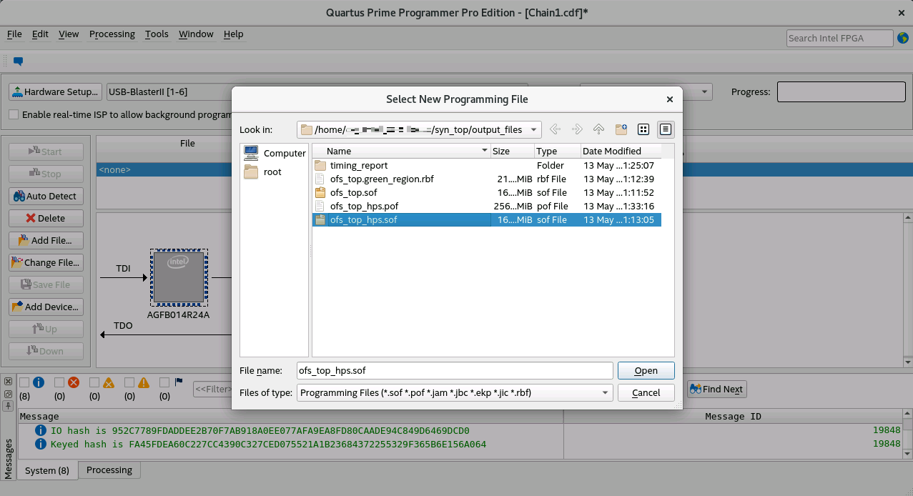
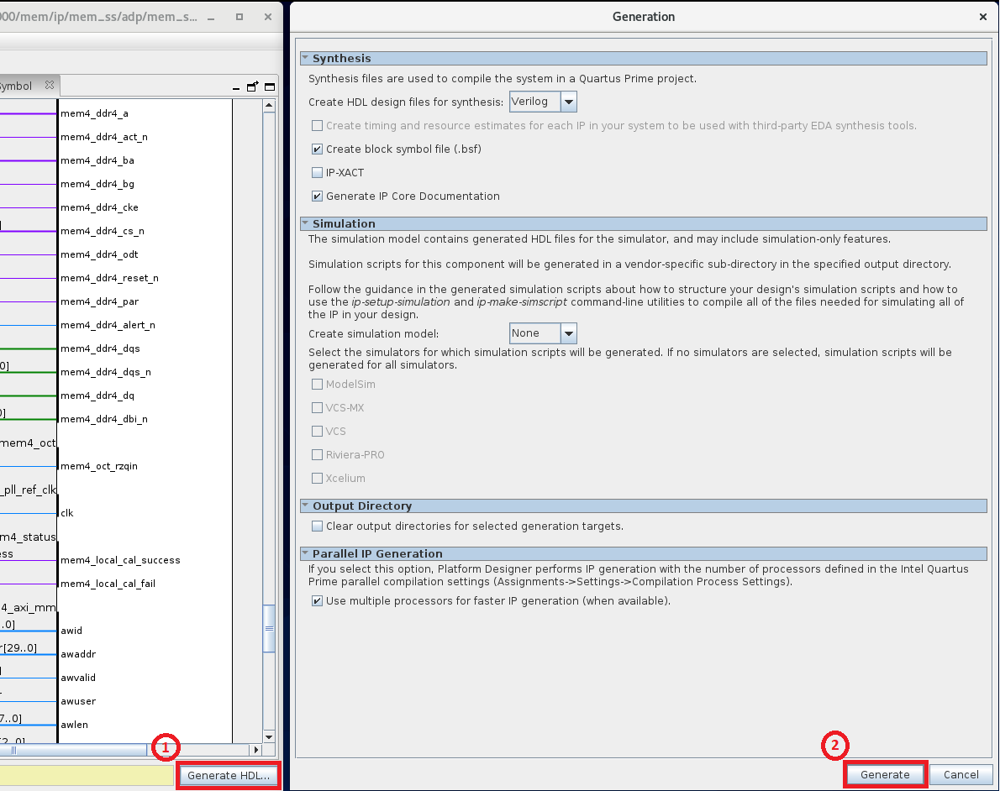

# FPGA Interface Manager Developer Guide for Intel Agilex PCIe Attach: Open FPGA Stack

Last updated: **August 01, 2023** 

## **1. Introduction**
### **1.1. About This Document**


Open FPGA Stack (OFS) addresses the demand for FPGA acceleration boards and workloads by providing a powerful methodology for the rapid development of FPGA Acceleration systems.  This methodology addresses the challenges and responsibilities of the board, platform, and workload developers by providing a complete FPGA project consisting of RTL and simulation code, build scripts, and software.  This provided FPGA project can be rapidly customized to meet new market requirements.

OFS separates the FPGA design into two areas: FPGA Interface Manager (FIM) and workload (or Acceleration Function Unit) as shown in the figure below:


As can be seen in this diagram, the OFS FPGA structure has a natural separation into two distinct areas: 

* FPGA Interface Manager (FIM or sometimes called the "the shell") containing:
  * FPGA external interfaces and IP cores (e.g. Ethernet, DDR-4, PCIe, etc)
  * PLLs/resets
  * FPGA - Board management infrastructure
  * Interface to Acceleration Function Unit (AFU)
* Acceleration Function Unit ("the workload")
  * Uses the FIM interfaces to perform useful work inside the FPGA
  * Contains logic supporting partial reconfiguration
  * Remote Signal Tap core for remote debugging of workload
  

This document serves as a design guide for FPGA developers, system architects, and hardware developers using OFS as a starting point for the creation of an FPGA Interface Manager (FIM) for a custom FPGA acceleration board.   

This guide is organized as follows: 

* Introduction
* Top Level Block Diagram description
  * Control and data flow
* Description of Sub-systems
  * Command/status registers (CSR) and software interface
  * Clocking, resets, and interfaces
  * E-Tile Ethernet Subsystem
  * Externally attached memory
* High-level development flow description
  * Installation of OFS RTL and development packages
  * Compiling FIM
  * Simulation  
* Demonstration steps illustrating how to change areas of the design
* Debugging

This document uses the Intel® FPGA SmartNIC N6001-PL as the main example platform to illustrate key points and demonstrate how to extend the capabilities provided in OFS.  The demonstration steps serve as a tutorial for the development of your OFS knowledge.  

This document covers OFS architecture lightly. For more details on the OFS architecture, please see [Open FPGA Stack Technical Reference Manual for Intel Agilex FPGA PCIe Attach](https://ofs.github.io/hw/n6001/reference_manuals/ofs_fim/mnl_fim_ofs_n6001/)

### **1.1.1. Glossary**

| Term                      | Abbreviation | Description                                                  |
| :------------------------------------------------------------:| :------------:| ------------------------------------------------------------ |
|Advanced Error Reporting	|AER	|The PCIe AER driver is the extended PCI Express error reporting capability providing more robust error reporting. [(link)](https://docs.kernel.org/PCI/pcieaer-howto.html?highlight=aer)|
|Accelerator Functional Unit	|AFU	|Hardware Accelerator implemented in FPGA logic which offloads a computational operation for an application from the CPU to improve performance. Note: An AFU region is the part of the design where an AFU may reside. This AFU may or may not be a partial reconfiguration region.|
|Basic Building Block	|BBB|	Features within an AFU or part of an FPGA interface that can be reused across designs. These building blocks do not have stringent interface requirements like the FIM's AFU and host interface requires. All BBBs must have a (globally unique identifier) GUID.|
|Best Known Configuration	|BKC	|The software and hardware configuration Intel uses to verify the solution.|
|Board Management Controller|	BMC	|Supports features such as board power managment, flash management, configuration management, and board telemetry monitoring and protection. The majority of the BMC logic is in a separate component, such as an Intel® Max® 10 or Intel Cyclone® 10 device; a small portion of the BMC known as the PMCI resides in the main Agilex FPGA.
|Configuration and Status Register	|CSR	|The generic name for a register space which is accessed in order to interface with the module it resides in (e.g. AFU, BMC, various sub-systems and modules).|
|Data Parallel C++	|DPC++|	DPC++ is Intel’s implementation of the SYCL standard. It supports additional attributes and language extensions which ensure DCP++ (SYCL) is efficiently implanted on Intel hardware.
|Device Feature List	|DFL	| The DFL, which is implemented in RTL, consists of a self-describing data structure in PCI BAR space that allows the DFL driver to automatically load the drivers required for a given FPGA configuration. This concept is the foundation for the OFS software framework. [(link)](https://docs.kernel.org/fpga/dfl.html)|
|FPGA Interface Manager	|FIM|	Provides platform management, functionality, clocks, resets and standard interfaces to host and AFUs. The FIM resides in the static region of the FPGA and contains the FPGA Management Engine (FME) and I/O ring.|
|FPGA Management Engine	|FME	|Performs reconfiguration and other FPGA management functions. Each FPGA device only has one FME which is accessed through PF0.|
|Host Exerciser Module	|HEM	|Host exercisers are used to exercise and characterize the various host-FPGA interactions, including Memory Mapped Input/Output (MMIO), data transfer from host to FPGA, PR, host to FPGA memory, etc.|
|Input/Output Control|	IOCTL	|System calls used to manipulate underlying device parameters of special files.|
|Intel Virtualization Technology for Directed I/O	|Intel VT-d	|Extension of the VT-x and VT-I processor virtualization technologies which adds new support for I/O device virtualization.|
|Joint Test Action Group	|JTAG	| Refers to the IEEE 1149.1 JTAG standard; Another FPGA configuration methodology.|
|Memory Mapped Input/Output	|MMIO|	The memory space users may map and access both control registers and system memory buffers with accelerators.|
|oneAPI Accelerator Support Package	|oneAPI-asp	|A collection of hardware and software components that enable oneAPI kernel to communicate with oneAPI runtime and OFS shell components. oneAPI ASP hardware components and oneAPI kernel form the AFU region of a oneAPI system in OFS.|
|Open FPGA Stack	|OFS|	OFS is a software and hardware infrastructure providing an efficient approach to develop a custom FPGA-based platform or workload using an Intel, 3rd party, or custom board. |
|Open Programmable Acceleration Engine Software Development Kit|	OPAE SDK|	The OPAE SDK is a software framework for managing and accessing programmable accelerators (FPGAs). It consists of a collection of libraries and tools to facilitate the development of software applications and accelerators. The OPAE SDK resides exclusively in user-space.|
|Platform Interface Manager	|PIM|	An interface manager that comprises two components: a configurable platform specific interface for board developers and a collection of shims that AFU developers can use to handle clock crossing, response sorting, buffering and different protocols.|
|Platform Management Controller Interface|	PMCI|	The portion of the BMC that resides in the Agilex FPGA and allows the FPGA to communicate with the primary BMC component on the board.|
|Partial Reconfiguration	|PR	|The ability to dynamically reconfigure a portion of an FPGA while the remaining FPGA design continues to function. For OFS designs, the PR region is referred to as the pr_slot.|
|Port|	N/A	|When used in the context of the fpgainfo port command it represents the interfaces between the static FPGA fabric and the PR region containing the AFU.|
|Remote System Update|	RSU	|The process by which the host can remotely update images stored in flash through PCIe. This is done with the OPAE software command "fpgasupdate".|
|Secure Device Manager	|SDM|	The SDM is the point of entry to the FPGA for JTAG commands and interfaces, as well as for device configuration data (from flash, SD card, or through PCI Express* hard IP).|
|Static Region|	SR	|The portion of the FPGA design that cannot be dynamically reconfigured during run-time.|
|Single-Root Input-Output Virtualization|	SR-IOV	|Allows the isolation of PCI Express resources for manageability and performance.|
|SYCL	|SYCL|	SYCL (pronounced "sickle") is a royalty-free, cross-platform abstraction layer that enables code for heterogeneous and offload processors to be written using modern ISO C++ (at least C++ 17). It provides several features that make it well-suited for programming heterogeneous systems, allowing the same code to be used for CPUs, GPUs, FPGAs or any other hardware accelerator. SYCL was developed by the Khronos Group, a non-profit organization that develops open standards (including OpenCL) for graphics, compute, vision, and multimedia. SYCL is being used by a growing number of developers in a variety of industries, including automotive, aerospace, and consumer electronics.|
|Test Bench	|TB	|Testbench or Verification Environment is used to check the functional correctness of the Design Under Test (DUT) by generating and driving a predefined input sequence to a design, capturing the design output and comparing with-respect-to expected output.|
|Universal Verification Methodology	|UVM	|A modular, reusable, and scalable testbench structure via an API framework.  In the context of OFS, the UVM enviroment provides a system level simulation environment for your design.|
|Virtual Function Input/Output	|VFIO	|An Input-Output Memory Management Unit (IOMMU)/device agnostic framework for exposing direct device access to userspace. (link)|


## **1.2. Release Capabilities**

The OFS FIM BASE  Agilex supports the following features.

|                                     | FIM                          |
| ----------------------------------- | ---------------------------- |
| Intel Platform                      | Intel® FPGA PAC D5005 |
| PCIe Configuration                  | Gen4 x16                     |
| SR-IOV support                      | Yes - (5-PF, 4-VF)           |
| AXI ST datapath                     | 512b @ 400MHz                |
| Transceiver Subsystem Configuration | 2x4x25G                      |


The FIM also integrates:


- Exercisers demonstrating PCIe, external memory, and E-Tile Ethernet Subsystem
- FME CSR
- Remote Signal Tap
- Partial Reconfiguration


The Host exercisers are provided for the quick evaluation of the FIM and can be leveraged for the verification of the platform's functionality and capabilities.  The host exercisers can be removed by the designer to release FPGA real estate to accommodate a new workload functions. To compile the FIM without host exercisers go to [Compiling the FIM in preparation for designing your AFU].


OFS is extensible to meet the needs of a broad set of customer applications.  The general use cases listed below are examples where the OFS base design is easily extended to build a custom FIM:


1. Use OFSdesign example as-is
    - Porting the code to another platform that is identical to OFSreference platform changing targeted FPGA device and pinout
    - Change I/O assignments without changing design
2. Update the configuration of peripheral IP in OFSdesign example, not affecting FIM architecture
    - External memory settings
    - E-Tile Ethernet Subsystem analog settings
3. Remove/update peripheral feature in OFSdesign example, not affecting FIM architecture
    - External memory speed/width change
    - Change 25G Ethernet to 10G or 100G Ethernet IP
    - Change number of VFs supported
4. Add new features as an extension to OFSdesign example, not affecting the FIM architecture
    - Add/remove external memory interface to the design
    - Add/remove user clocks for the AFU
    - Add/remove IP to the design with connection to the AFU


## **1.3. Prerequisites**

### **1.3.1. Tutorial Prerequisites**

To run the FPGA compilation steps covered in this guide, requires the following:


1. Workstation or server with a Quartus Prime Pro Version 23.1  installed on a Quartus supported Linux distribution.  See [Operating System Support].  The Linux distribution known to work with this version of OFS is {{ env.N6001_HOST_OS_L }}. Note, Windows is not supported.
2. Compilation targeting Intel® Agilex® FPGA devices requires a minimum of 64 GB of RAM.
3. Simulation of lower level functionality (not chip level) is supported by Synopsys<sup>&reg;</sup> VCS and Mentor Graphics<sup>&reg;</sup> QuestaSim SystemVerilog simulators.
4. Simulation of chip level requires Synopsys<sup>&reg;</sup> VCS and VIP
  

To test FPGA image files on hardware, this version of OFS only targets Intel® FPGA SmartNIC N6001-PL. You may modify the build scripts and pin files to target different boards with Intel® Agilex® FPGA devices.

### **1.3.2. Base Knowledge and Skills Prerequisites**

The OFS is an advanced application of FPGA technology. This guide assumes you have the following FPGA logic design-related knowledge and skills:

- FPGA compilation flows using Intel<sup>&reg;</sup> Quartus<sup>&reg;</sup> Prime Pro Edition.
- Static Timing closure, including familiarity with the Timing Analyzer tool in Intel<sup>&reg;</sup> Quartus<sup>&reg;</sup> Prime Pro Edition, applying timing constraints, Synopsys* Design Constraints (.sdc) language and Tcl scripting, and design methods to close on timing critical paths.
- RTL (System Verilog) and codingOFS hardware GitHub site practices to create synthesized logic.
- RTL simulation tools.
-  Intel<sup>&reg;</sup> Quartus<sup>&reg;</sup> Prime Pro Edition Signal Tap Logic Analyzer tool software.

### **1.3.3. Development Environment**

To run the tutorial steps in this guide requires this development environment:

| Component                                        | Version                                                      |
| ------------------------------------------------ | ------------------------------------------------------------ |
| FPGA Platform                                    | [Intel® FPGA SmartNIC N6001-PL](https://cdrdv2.intel.com/v1/dl/getContent/723837?explicitVersion=true), [release notes](https://github.com/OFS/ofs-n6001/releases/tag/ofs-2023.1-1) |
| OPAE SDK                                         | [2.5.0-3](https://github.com/OFS/opae-sdk/releases/tag/2.5.0-3) |
| Kernel Drivers                                   | [ofs-2023.1-6.1-1](https://github.com/OFS/linux-dfl/releases/tag/ofs-2023.1-6.1-1) |
| OneAPI-ASP                                       | [ofs-2023.1-1](https://github.com/OFS/oneapi-asp/releases/tag/ofs-2023.1-1) |
| OFS FIM Source Code for Intel® FPGA SmartNIC N6001-PL          | [ofs-2023.1-1](https://github.com/OFS/ofs-n6001/releases/tag/ofs-2023.1-1)      |
| OFS Platform AFU BBB                             | [ofs-2023.1-1](https://github.com/OFS/ofs-platform-afu-bbb/releases/tag/ofs-2023.1-1) |
| Intel Quartus Prime Pro Edition Design Software* | [Quartus Prime Pro Version 23.1 for Linux](https://www.intel.com/content/www/us/en/software-kit/776241/intel-quartus-prime-pro-edition-design-software-version-23-1-for-linux.html) |
| Operating System                                 | [RedHat® Enterprise Linux® (RHEL) 8.6](https://access.redhat.com/downloads/content/479/ver=/rhel---8/8.6/x86_64/product-software) |


## 2. Top Level Description

The FIM targets operation in the Intel® FPGA SmartNIC N6001-PL, the block diagram is shown below.  

 </br>

The Intel® FPGA SmartNIC N6001-PL FPGA I/O banking is shown below: </br>


The key Intel® FPGA SmartNIC N6001-PL FPGA interfaces are:

- Host interface 
    - PCIe Gen4 x 16
- Network interface
  - 2 - QSFP28/56 cages
  - Current FIM supports 8 x 25 GbE, other interfaces can be created  
- External Memory - DDR4 - 2400
  - HPS - 1GB organized as 256 Mb x 32 with 256 Mb x 8 ECC
  - Channel 0, 1  -  4 GB organized as 1 Gb x 32
  - Channel 2, 3 - 4 GB organized as 1 Gb x 32 with 1 Gb x 8 ECC (ECC is not implemented this release) 
- Board Management
  - SPI interface
  - FPGA configuration
  
### **2.1. Top Level FPGA**

The internal FPGA architecture is shown below:


The following Platform Designer IP subsystems are used to implement the following:

- 690604: PCIe Subsystem IP User Guide (Note: you must login to myIntel and request entitled access)
- 686148: Memory Subsystem IP User Guide (Note: you must login to myIntel and request entitled access)
- 773413: [Ethernet Subsystem Intel FPGA IP](https://www.intel.com/content/www/us/en/docs/programmable/773413/23-1-22-5-0/ethernet-subsystem-intel-fpga-ip-overview.html)

Documentation on the above Platform Designer IP subsystems is available by request to your Intel support team.

To access these Intel FPGA IP Subsystem documents. Please go [here](https://rdc.intel.com) and search for the previous ID numbers.

### **2.2. FIM FPGA Resource Usage**

The provided design includes both required board management and control functions as well as optional interface exerciser logic that both creates transactions and validates operation.  These exceriser modules include:

* HE_MEM - this module creates external memory transactions to the DDR4 memmory and then verifies the responses.
* HE_MEM-TG -The Memory Traffic Generator (**TG**) AFU provides a way for users to characterize local memory channel bandwidth with a variety of traffic configuration features including request burst size, read/write interleave count, address offset, address strobe, and data pattern.
* HE_HSSI - this module creates ethernet transactions to the E-Tile Ethernet Subsystem and then verifies the responses.
The FIM uses a small portion of the available FPGA resources.  The table below shows resource usage for a base FIM built with 2 channels of external memory, a small AFU instantiated that has host CSR read/write, external memory test and Ethernet test functionality.

**Note:** The host exerciser modules allow you to evaluate the FIM in hardware and are removed when you begin development. 

The resource usage for a Base FIM :

| Entity Name   | ALMs needed | ALM Utilization % | M20Ks | M20K Utilization % |
| ------------- | ----------- | ----------------- | ----- | ------------------ |
| top           | 181,018.30  | 37.15             | 784   | 11.03              |
| afu_top       | 104,994.20  | 21.55             | 287   | 4.04               |
| pcie_wrapper  | 36,565.00   | 7.51              | 195   | 2.74               |
| hssi_wrapper  | 20,132.10   | 4.13              | 173   | 2.43               |
| mem_ss_top    | 9,092.80    | 1.87              | 76    | 1.07               |
| pmci_wrapper  | 4,269.30    | 0.88              | 26    | 0.37               |
| alt_sld_fab_0 | 2,726.90    | 0.56              | 13    | 0.18               |
| bpf           | 1,364.60    | 0.28              | 0     | 0.00               |
| qsfp_top      | 620.10      | 0.13              | 4     | 0.06               |
| fme_top       | 615.30      | 0.13              | 6     | 0.08               |
| qsfp_top      | 614.00      | 0.13              | 4     | 0.06               |
| rst_ctrl      | 17.90       | 0.00              | 0     | 0.00               |
| sys_pll       | 0.50        | 0.00              | 0     | 0.00               |
| hps_ss        | 0.00        | 0.00              | 0     | 0.00               |

The resource usage for a Minimal FIM :

| Entity Name   | ALMs needed | ALM Utilization % | M20Ks | M20K Utilization % |
| ------------- | ----------- | ----------------- | ----- | ------------------ |
| top           | 91,564.60   | 18.79             | 422   | 5.94               |
| pcie_wrapper  | 36,736.80   | 7.54              | 193   | 2.71               |
| afu_top       | 35,113.70   | 7.21              | 112   | 1.58               |
| mem_ss_top    | 9,429.30    | 1.94              | 76    | 1.07               |
| pmci_wrapper  | 4,390.50    | 0.90              | 26    | 0.37               |
| alt_sld_fab_0 | 1,771.20    | 0.36              | 9     | 0.13               |
| bpf           | 1,349.20    | 0.28              | 0     | 0.00               |
| dummy_csr     | 703.40      | 0.14              | 0     | 0.00               |
| dummy_csr     | 701.00      | 0.14              | 0     | 0.00               |
| dummy_csr     | 694.10      | 0.14              | 0     | 0.00               |
| fme_top       | 657.20      | 0.13              | 6     | 0.08               |
| rst_ctrl      | 16.50       | 0.00              | 0     | 0.00               |
| sys_pll       | 0.50        | 0.00              | 0     | 0.00               |
| hps_ss        | 0.00        | 0.00              | 0     | 0.00               |

## **3. Description of Sub-Systems**

### **3.1. Host Control and Data Flow**
The host control and data flow is shown in the diagram below:


The control and data paths are composed of the following:

* Host Interface Adapter (PCIe)
* Low Performance Peripherals
  * Slow speed peripherals (JTAG, I2C, Smbus, etc)
  * Management peripherals (FME)

* High Performance Peripherals
  * Memory peripherals
  * Acceleration Function peripherals (eg. AFUs)
  * HPS Peripheral

* Fabrics
   * Peripheral Fabric (multi drop)
   * AFU Streaming fabric (point to point)

Peripherals are connected to one another using AXI in either:

* Via the peripheral fabric (AXI4-Lite, multi drop)
* Via the AFU streaming fabric (AXI-S, point to point)

Peripherals are presented to software as:

* OFS managed peripherals that implement DFH CSR structure.  
* Native driver managed peripherals (i.e. Exposed via an independent PF, VF)

The peripherals connected to the peripheral fabric are primarily Intel OPAE managed resources, whereas the peripherals connected to the AFU are “primarily” managed by native OS drivers. The word “primarily” is used since the AFU is not mandated to expose all its peripherals to Intel OPAE. 

OFS uses a defined set of CSRs to expose the functionality of the FPGA to the host software.  These registers are described in [FIM MMIO Regions](https://ofs.github.io/hw/n6001/reference_manuals/ofs_fim/mnl_fim_ofs_n6001/#6-mmio-regions)


If you make changes to the FIM that affect the software operation, then OFS provides a mechanism to communicate that information to the proper software driver that works with your new hardware.  The [FPGA Device Feature List (DFL) Framework Overview](https://github.com/OFS/linux-dfl/blob/fpga-ofs-dev/Documentation/fpga/dfl.rst#fpga-device-feature-list-dfl-framework-overview) is followed to provide compatibility with OPAE software.  Please see [FPGA Device Feature List (DFL) Framework Overview](https://github.com/OFS/linux-dfl/blob/fpga-ofs-dev/Documentation/fpga/dfl.rst#fpga-device-feature-list-dfl-framework-overview) for a description of DFL operation from the driver perspective.

## **4. High Level Development Flow**

The OFS provides a framework of FPGA synthesizable code, simulation environment, and synthesis/simulation scripts.  FIM designers can take the provided code and scripts and modify existing code or add new code to meet your specific product requirements.

FIM development for a new acceleration card consists of the following steps:

1. Installation of OFS and familiarization with scripts and source code 
2. Development of high level block diagram with your specific functionality 
  1. Determination of requirements and key performance metrics
  2. Selection of IP cores
  3. Selection of FPGA device
  4. Software memory map
3. Selection and implementation of FIM Physical interfaces including: 
  1. External clock sources and creation of internal PLL clocks
  2. General I/O
  3. Transceivers
  4. External memories
  5. FPGA programming methodology
4. Device physical implementation 
  1. FPGA device pin assignment
  2. Inclusion of logic lock regions
  3. Creation of timing constraints
  4. Create Quartus FIM test project and validate: 
    1. Placement
    2. Timing constraints
    3. Build script process
    4. Review test FIM FPGA resource usage
5. Select FIM to AFU interfaces and development of PIM 
6. FIM design implementation 
  1. RTL coding
  2. IP instantiation
  3. Development of test AFU to validate FIM
  4. Unit and device level simulation
  5. Timing constraints and build scripts
  6. Timing closure and build validation
7. Creation of FIM documentation to support AFU development and synthesis 
8. Software Device Feature discovery 
9. Hardware/software integration, validation and debugging 
10. High volume production preparation 

The FIM developer works closely with the hardware design of the target board, software development and system validation.

### **4.1. Installation of OFS**

In this section you set up a development machine for compiling the OFS FIM. These steps are separate from the setup for a deployment machine where the FPGA acceleration card is installed.  Typically, FPGA development and deployment work is performed on separate machines, however, both development and deployment can be performed on the same server if desired.  Please see the [Getting Started Guide: Open FPGA Stack] for instructions on installing software for deployment of your FPGA FIM, AFU and software application on a server.  

Building the OFS FIM requires the build machine to have at least 64 GB of RAM.  

The following is a summary of the steps to set up for FIM development:

1. Install Quartus Prime Pro Version 23.1 Linux with Intel® Agilex® FPGA device support
2. Make sure support tools are installed and meet version requirements
3. Clone the `ofs-n6001` repository
4. Install required Quartus patches which are included in the cloned `ofs-n6001` repository
5. Review the files provided in the repo
6. Test installation by building the FIM

**Intel Quartus Prime Pro Version 23.1** is the currently verified version of Quartus used for building the FIM and AFU images.  Porting to newer versions of Quartus may be performed by developers, however, you will need to verify operation.
The recommended Best Known Configuration (BKC) for development of the OFS FIM is RedHat® Enterprise Linux® (RHEL) 8.6, which is the assumed operating system for this developer guide. 

Prior to installing Quartus, perform the following steps to satisfy the required dependencies.

```bash
  $ sudo dnf install -y gcc gcc-c++ make cmake libuuid-devel rpm-build autoconf automake bison boost boost-devel libxml2 libxml2-devel make ncurses grub2 bc csh flex glibc-locale-source libnsl ncurses-compat-libs 
```
- Apply the following configurations.

```bash
  $ sudo localedef -f UTF-8 -i en_US en_US.UTF-8 
  $ sudo ln -s /usr/lib64/libncurses.so.6 /usr/lib64/libncurses.so.5 
  $ sudo ln -s /usr/bin/python3 /usr/bin/python
```


1. Download [Quartus Prime Pro Linux version].

2. After running the Quartus Prime Pro installer, set the PATH environment variable to make utilities `quartus`, `jtagconfig`, and `quartus_pgm` discoverable. Edit your bashrc file `~/.bashrc` to add the following line:

    ```bash
    export PATH=<Quartus install directory>/quartus/bin:$PATH
    export PATH=<Quartus install directory>/qsys/bin:$PATH
    ```

    For example, if the Quartus install directory is /home/intelFPGA_pro/23.1 then the new line is:

    ```
    export PATH=/home/intelFPGA_pro/23.1/quartus/bin:$PATH
    export PATH=/home/intelFPGA_pro/23.1/qsys/bin:$PATH
    ```

3. Verify, Quartus is discoverable by opening a new shell:

    ```
    $ which quartus
    /home/intelFPGA_pro/23.1/quartus/bin/quartus
    ```

The OFS provided Quartus build scripts require the following tools:

| Item              |  Version            |
| ----              |  ----               |
| Python            | 3.7.7 |
| GCC               | 7.2.0 |
| cmake             | 3.11.4 |
| git with git-lfs  | 1.8.3.1 |


To install the ```Git Large File Storage (LFS)``` extension execute the next commands

```bash
curl -s https://packagecloud.io/install/repositories/github/git-lfs/script.rpm.sh | sudo bash
sudo dnf install git-lfs
git lfs install
```
#### **4.1.1. Clone the OFS Git Repo**

Retrieve the OFS FIM source code from the [GitHub repository](https://github.com/OFS/ofs-n6001). Create a new directory to use as a clean starting point to store the retrieved files.  The following is a short description of each repository, followed by the git commands for cloning.  The instructions section uses the HTTPS git method for cloning repositories.  Cloning the repo using the HTTPS method requires a personal access token.  Please see this blog post for background information the need for personal access token [Token authentication requirements for Git operations]. Please see [Creating a personal access token].  The classic personal access token has been verified to work properly. 

- Navigate to location for storage of OFS source, create the top-level source directory and clone OFS repositories using the clone command listed below.

```bash
mkdir IOFS_BUILD_ROOT
cd IOFS_BUILD_ROOT
export IOFS_BUILD_ROOT=$PWD
git clone --recurse-submodules https://github.com/OFS/ofs-n6001
    ... 
    Cloning into 'ofs-n6001' ...
    remote: Enumerating objects:  ....
    ...
    ...
    Resolving deltas  ..., done.

cd ofs-n6001
git checkout --recurse-submodules tags/ofs-2023.1-1

#check if you have ofs-common
git submodule status
```

### **4.2. Directory Structure of OFS**

First verify the following directories and files are present in $IOFS_BUILD_ROOT/ofs-n6001 directory.  

```bash
ls -1
......
eval_scripts
ipss
license
LICENSE.txt
ofs-common
README.md
sim
src
syn
tools
verification
```

The directories are arranged as shown below:
```bash
find . -mindepth 1 -maxdepth 2 -type d -not -path '*/\.*' -print | sed -e 's/[^-][^\/]*\//--/g' -e 's/--/|  /g' -e 's/|-/|   /g'

|  eval_scripts
|  ipss
|  |  hssi
|  |  mem
|  |  pcie
|  |  pmci
|  |  qsfp
|  license
|  ofs-common
|  |  scripts
|  |  src
|  |  tools
|  |  verification
|  sim
|  |  bfm
|  |  common
|  |  scripts
|  |  unit_test
|  src
|  |  afu_top
|  |  includes
|  |  pd_qsys
|  |  top
|  syn
|  |  scripts
|  |  setup
|  |  syn_top
|  tools
|  |  pfvf_config_tool
|  verification
|  |  coverage
|  |  scripts
|  |  testbench
|  |  tests
|  |  unit_tb
|  |  verifplan
```
#### **4.2.1. Install Quartus Patches**

The FIM uses a UART IP core that requires a license in order to create programming files.  The patch for installing the license is located in $IOFS_BUILD_ROOT/ofs-n6001/license.  Please follow the steps below to install this license patch.

```bash
cd $IOFS_BUILD_ROOT/ofs-n6001/license
sudo ./quartus-0.0-0.02iofs-linux.run
```

Once patch install is complete, verify successful installation:

```bash
quartus_sh --version

Quartus Prime Shell
Version 23.1

```

### **4.3. Compiling the OFS FIM**

The following sections describe how to set up the environment and build the provided FIM and AFU. Follow these steps as a tutorial to learn the build flow.  You will use this environment and build scripts for the creation of your specialized FIM.

#### **4.3.1. Setting Up Required Environment Variables**

Set required environment variables as shown below.  These environment variables must be set prior to simulation or compilation tasks so creating a simple script to set these variables saves time. 

```bash
cd /home/user/IOFS_BUILD_ROOT
export IOFS_BUILD_ROOT=$PWD

export QUARTUS_MAINPATH=/home/intelFPGA_pro/23.1 
export QUARTUS_ROOTDIR=$QUARTUS_MAINPATH/quartus 
export QUARTUS_HOME=$QUARTUS_ROOTDIR 
export QUARTUS_INSTALL_DIR=$QUARTUS_ROOTDIR 
export QUARTUS_ROOTDIR_OVERRIDE=$QUARTUS_ROOTDIR 
export IMPORT_IP_ROOTDIR=$QUARTUS_ROOTDIR/../ip 
export IP_ROOTDIR=$QUARTUS_ROOTDIR/../ip 
export INTELFPGAOCLSDKROOT=$QUARTUS_MAINPATH/hld 
export QSYS_ROOTDIR=$QUARTUS_ROOTDIR/../qsys/bin 
export OFS_ROOTDIR=$IOFS_BUILD_ROOT/ofs-n6001
export WORKDIR=$OFS_ROOTDIR 
export VERDIR=$OFS_ROOTDIR/verification/ofs-n6001/common:$OFS_ROOTDIR/verification 
export OFS_PLATFORM_AFU_BBB=$IOFS_BUILD_ROOT/ofs-platform-afu-bbb 
export OPAE_SDK_REPO_BRANCH=release/$OPAE_SDK_VERSION
export OPAE_PLATFORM_ROOT=$OFS_ROOTDIR/work_dir/build_tree    
export LIBRARY_PATH=$IOFS_BUILD_ROOT/opae-sdk/install-opae-sdk/lib 
export LD_LIBRARY_PATH=$IOFS_BUILD_ROOT/opae-sdk/install-opae-sdk/lib64 
export OPAE_LOC=/install-opae-sdk 
export PYTHONPATH=/root/.local/lib/python3.7.7/site-packages/ 
export QUARTUS_NUM_PARALLEL_PROCESSORS=8 
export TOOLS_LOCATION=/home/guest 
export DESIGNWARE_HOME=$TOOLS_LOCATION/synopsys/vip_common/vip_Q-2020.03A
export UVM_HOME=$TOOLS_LOCATION/synopsys/vcsmx/S-2021.09-SP1/linux64/rhel/etc/uvm 
export VCS_HOME=$TOOLS_LOCATION/synopsys/vcsmx/S-2021.09-SP1/linux64/rhel 
export MTI_HOME=$TOOLS_LOCATION/intelFPGA_pro/questa_fse 
export PATH=$PATH:$QUARTUS_HOME/bin:$QUARTUS_HOME/qsys/bin:$QUARTUS_HOME/sopc_builder/bin/:$IOFS_BUILD_ROOT/opae-sdk/install-opae-sdk/bin:$MTI_HOME/linux_x86_64/:$MTI_HOME/bin/:$DESIGNWARE_HOME/bin:$VCS_HOME/bin

export LM_LICENSE_FILE="your_path"
export DW_LICENSE_FILE="your_path"
export SNPSLMD_LICENSE_FILE="your_path"

#in case your need proxy
export no_proxy="your_path"
export http_proxy="your_path" 
export https_proxy="your_path"
```

#### **4.3.2. Compiling the Intel® FPGA SmartNIC N6001-PL FIM**

The Intel® FPGA SmartNIC N6001-PL FIM is built with bash script `$OFS_ROOTDIR/ofs-common/scripts/common/syn/build_top.sh`.  There are several setup files that must be put in place before and during the compile - as a result, building the Intel® FPGA SmartNIC N6001-PL FIM from the Quartus GUI is not supported - you must use the the `build_top.sh` script for Intel® FPGA SmartNIC N6001-PL FIM compilation.

The usage of the compile build script is shown below:
```bash
cd $OFS_ROOTDIR

./ofs-common/scripts/common/syn/build_top.sh [-p] n6001 work_dir 

# --Please see  $OFS_ROOTDIR/ofs-common/scripts/common/syn/README for detailed information on this script
```

The `build_top.sh` script copies files from the files in ofs-n6001 to your specified work_dir, then the files in work_dir are used for the Quartus compile process.  In most cases, you will perform design work the `ipss`, `src`, `sim`, `syn` and `verification` directories and run the build_top.sh script to copy the source design files into work_dir for the Quartus build process.  

The build_top.sh script has the -k option which will do the build process on an existing work_dir without copying source files.  The -k option is useful when you want to add Signal Tap to a build.

The `build_top.sh` script has the following build options:

- A PR (default build option) compile which creates a FPGA image with design partitions consisting of the FIM that is loaded into the static region of the FPGA and a default AFU that is loaded into dynamic region. The AFU image may be loaded into the dynamic region using partial reconfiguration.  
- Flat compile which combines the FIM and AFU into one FPGA image that is loaded into the entire FPGA device.  The Flat compile removes all floorplanning design partitions and partial reconfiguration control logic.  Removal of patitions can be useful for some designs and FIM development scenarios.

The build_top.sh script has options for removing exercisers.  These options are described in [Compiling the FIM in preparation for designing your AFU].


The `build_top.sh` script includes the -p option which creates a re-locatable design tree for use design flows where the FIM development and AFU workload are separate design teams.  See [Create a Relocatable PR Directory Tree] for more details.

The build scripts included with OFS are verified to run in a bash shell. Other shells have not been tested.   

In the next example, you will build the provided example design using the default build options with partial reconfiguation blocks, partial reconfigation region and all exercisers AFU blocks included.  

```bash

#Build the provided base example design:
cd $OFS_ROOTDIR
    
./ofs-common/scripts/common/syn/build_top.sh n6001 work_n6001


#    ... build takes ~3 hours to complete

Compile work directory:     <$IOFS_BUILD_ROOT>/ofs-n6001/work_n6001/syn/syn_top
Compile artifact directory: <$IOFS_BUILD_ROOT>/ofs-n6001/work_n6001/syn/syn_top/output_files

***********************************
***
***        OFS_PROJECT: n6001
***        Q_PROJECT:  ofs_top
***        Q_REVISION: ofs_top
***        SEED: 1
***        Build Complete
***        Timing Passed!
***
***********************************
```

The build script copies the ```ipss```, ```ofs-common```, ```sim```, ```src```,```syn``` and ```tools``` directories to the specified work directory and then these copied files are used in the Quartus compilation process.

Some key output files are described below:

**<work_dir>/syn/syn_top** == Quartus project (ofs_top.qpf) and other Quartus specific files
**<work_dir>/syn/syn_top/output_files** == Directory with build reports and FPGA programming files.  The programming files are:

The build script will run PACSign (if installed) and create an unsigned FPGA programming files for both user1 and user2 locations of the Intel® FPGA SmartNIC N6001-PL FPGA flash.  Please note, if the Intel® FPGA SmartNIC N6001-PL has the root entry hash key loaded, then PACsign must be run to add the proper key to the FPGA binary file.

The following table provides a detailed description of the generated *.bin files.

| File            | Description                        |
|-----------------|------------------------------------|
| ofs_top[_hps].bin | This is an intermediate, raw binary file. This intermediate raw binary file is produced by taking the Quartus generated *.sof file, and converting it to *.pof using quartus_pfg, then converting the *.pof to *.hexout using quartus_cpf, and finally converting the *.hexout to *.bin using objcopy. Depending on whether the FPGA design contains an HPS block, a different file will be generated. <br /><br />**ofs_top.bin** - Raw binary image of the FPGA generated if there is no HPS present in the design. <br />**ofs_top_hps.bin** - Raw binary image of the FPGA generated if there is an HPS present in the design. |
| ofs_top_page1.bin | This is the binary of the Factory Image and is the input to PACSign utility to generate **ofs_top_page1_unsigned.bin** binary image file. <br />This image will carry binary content for the HPS if it is included in the SOF image. |
| ofs_top_page0_factory.bin | This is an input file to PACSign to generate **ofs_top_page0_unsigned_factory.bin**.  |
| ofs_top_page0_unsigned_factory.bin | This is the unsigned PACSign output generated for the Factory Image.   |
| ofs_top_page1_user1.bin | This is an input file to PACSign to generate **ofs_top_page1_unsigned_user1.bin**. This file is created by taking the ofs_top_[hps].bin file and assigning the User1 or appending factory block information. |
| ofs_top_page1_unsigned_user1.bin | This is the unsigned FPGA binary image generated by the PACSign utility for the User1 Image. This file is used to load the FPGA flash User1 Image using the fpgasupdate tool. |
| ofs_top_page2_user2.bin |  This is an input file to PACSign to generate **ofs_top_page2_unsigned_user2.bin**. This file is created by taking the ofs_top_[hps].bin file and assigning the User2 or appending factory block information. |
| ofs_top_page2_unsigned_user2.bin | This is the unsigned FPGA binary image generated by the PACSign utility for the User2 Image. This file is used to load the FPGA flash User2 Image using the fpgasupdate tool.|
|If your design contains an Intel® Agilex® FPGA Hard Processor System, then the build assembly process combines the FPGA ofs_top.sof programming file with /syn/n6001/common/setup/u-boot-spl-dtb.hex to produce:|ofs_top_hps.sof.|

>The **build/output_files/timing_report** Directory contains clocks report, failing paths and passing margin reports. 

#### **4.3.3. Create a Relocatable PR Directory Tree**

If you are developing a FIM to be used by another team developing AFU workload(s), scripts are provided that create a relocatable PR directory tree. ODM and board developers will make use of this capability to enable a broad set of AFUs to be loaded on a board using PR.


You can create this relocatable PR directory tree by either:

* Build FIM and AFU using ofs-common/scripts/common/syn/build_top.sh followed by running /ofs-common/scripts/common/syn/generate_pr_release.sh
* Build FIM and AFU using ofs-common/scripts/common/syn/build_top.sh with optional -p switch included

The generate_pr_release.sh has the following command structure:

```bash
cd $OFS_ROOTDIR
    
./ofs-common/scripts/common/syn/generate_pr_release.sh -t <path to generated release tree> *Board Build Target* <work dir from build_top.sh>

#Where:

# -t <path to generated release tree> = location for your relocatable PR directory tree
# *Board Build Target* is the name of the board target/FIM e.g. n6001
# <work dir from build_top.sh> 


```
Here is an example of running the generate_pr_release.sh script:

```bash
cd $OFS_ROOTDIR
./ofs-common/scripts/common/syn/generate_pr_release.sh -t work_n6001/build_tree n6001  work_n6001
```


The resulting relocatable build tree has the following structure:

```bash
cd $OFS_ROOTDIR/work_n6001/build_tree

find . -mindepth 1 -maxdepth 3 -not -path '*/\.*' -print | sed -e 's/[^-][^\/]*\//--/g' -e 's/--/├── /g' -e 's/|-/│   ├── /g' -e '$s/├──/└──/' -e 's/│   ├── \([^ ]\)/│   ├── \1/' -e 's/│   ├── │   ├──/│   │   ├──/'

├── bin
├── ├── afu_synth
├── ├── qar_gen
├── ├── update_pim
├── ├── run.sh
├── ├── build_env_config
├── README
├── hw
├── ├── lib
├── ├── ├── build
├── ├── ├── fme-ifc-id.txt
├── ├── ├── platform
├── ├── ├── fme-platform-class.txt
├── ├── blue_bits
├── ├── ├── ofs_top_hps.sof
├── ├── ├── ofs_top.sof
├── ├── ├── ofs_top_page0_unsigned_factory.bin
├── ├── ├── ofs_top_page1_unsigned_user1.bin
└── ├── ├── ofs_top_page2_unsigned_user2.bin

```
This build tree can be moved to a different location and used for AFU development of PR-able AFU to be used with this board.

#### **4.3.4. Flat Build**

To run the `build_top.sh` script for a flat compile, add the build setting `n6001:flat` as shown below:

```bash
cd $OFS_ROOTDIR
./ofs-common/scripts/common/syn/build_top.sh n6001:flat work_n6001_flat
```
**Note:** The flat compile removes the PR region and PR IP.  You cannot use the -P `build_top.sh` option when using the `n6001:flat` compile setting.

### **4.4. Unit Level Simulation**

Unit level simulation of key components is provided. These simulations provide verification of the following areas:

* E-Tile Ethernet Subsystem
* PCIe
* External Memory
* Core FIM
  

The Unit Level simulations work with Synopsys VCS and Mentor Graphics Questa sim simulators. Readme files are provided explaining how to run the simulation of each component.  To run a simulation of ```dfh_walker``` that simulates host access to the internal DFH registers, perform the following steps.

1. Set the environment variables listed in section, [Setting Up Required Environment Variables](https://ofs.github.io/hw/n6001/dev_guides/fim_dev/ug_dev_fim_ofs_n6001/#431-setting-up-required-environment-variables).

2. Generate the IP simulation files for all Unit level simulations.  Once the IP simulation files are generated, you can run all of the Unit Simulation tests.
  
```bash
cd $OFS_ROOTDIR/ofs-common/scripts/common/sim

# Run the script "sh gen_sim_files.sh <target>"
sh gen_sim_files.sh n6001
```

3. Launch the actual DFH Walker unite test.

```bash 
cd $OFS_ROOTDIR/sim/unit_test/dfh_walker/
# If simulator is not specified, then VCS simulator is used
sh run_sim.sh

# For Questasim, use the following command:
sh run_sim.sh MSIM=1

# For VCS-MX, use the following command:

sh run_sim.sh VCSMX=1

.
.
.

AFU is out of reset ...

********************************************
 Running TEST(0) : test_dfh_walking
********************************************
READ64: address=0x00000000 bar=0 vf_active=0 pfn=0 vfn=0

   ** Sending TLP packets **
   ** Waiting for ack **
   READDATA: 0x4000000010000000

FME_DFH
   Address   (0x0)
   DFH value (0x4000000010000000)

READ64: address=0x00001000 bar=0 vf_active=0 pfn=0 vfn=0

   ** Sending TLP packets **
   ** Waiting for ack **
   READDATA: 0x3000000020000001

THERM_MNGM_DFH
   Address   (0x1000)
   DFH value (0x3000000020000001)

READ64: address=0x00003000 bar=0 vf_active=0 pfn=0 vfn=0

   ** Sending TLP packets **
   ** Waiting for ack **
   READDATA: 0x3000000010000007

GLBL_PERF_DFH
   Address   (0x3000)
   DFH value (0x3000000010000007)

READ64: address=0x00004000 bar=0 vf_active=0 pfn=0 vfn=0

   ** Sending TLP packets **
   ** Waiting for ack **
   READDATA: 0x30000000e0001004

GLBL_ERROR_DFH
   Address   (0x4000)
   DFH value (0x30000000e0001004)

READ64: address=0x00012000 bar=0 vf_active=0 pfn=0 vfn=0

   ** Sending TLP packets **
   ** Waiting for ack **
   READDATA: 0x3000000010000013

QSFP0_DFH
   Address   (0x12000)
   DFH value (0x3000000010000013)

READ64: address=0x00013000 bar=0 vf_active=0 pfn=0 vfn=0

   ** Sending TLP packets **
   ** Waiting for ack **
   READDATA: 0x30000000d0000013

QSFP1_DFH
   Address   (0x13000)
   DFH value (0x30000000d0000013)

READ64: address=0x00020000 bar=0 vf_active=0 pfn=0 vfn=0

   ** Sending TLP packets **
   ** Waiting for ack **
   READDATA: 0x3000000200001012

PMCI_DFH
   Address   (0x20000)
   DFH value (0x3000000200001012)

READ64: address=0x00040000 bar=0 vf_active=0 pfn=0 vfn=0

   ** Sending TLP packets **
   ** Waiting for ack **
   READDATA: 0x3000000200000014

ST2MM_DFH
   Address   (0x40000)
   DFH value (0x3000000200000014)

READ64: address=0x00060000 bar=0 vf_active=0 pfn=0 vfn=0

   ** Sending TLP packets **
   ** Waiting for ack **
   READDATA: 0x300000001000100f

HSSI_DFH
   Address   (0x60000)
   DFH value (0x300000001000100f)

READ64: address=0x00061000 bar=0 vf_active=0 pfn=0 vfn=0

   ** Sending TLP packets **
   ** Waiting for ack **
   READDATA: 0x3000000010000024

VUART_DFH
   Address   (0x61000)
   DFH value (0x3000000010000024)

READ64: address=0x00062000 bar=0 vf_active=0 pfn=0 vfn=0

   ** Sending TLP packets **
   ** Waiting for ack **
   READDATA: 0x30000000e0001009

EMIF_DFH
   Address   (0x62000)
   DFH value (0x30000000e0001009)

READ64: address=0x00070000 bar=0 vf_active=0 pfn=0 vfn=0

   ** Sending TLP packets **
   ** Waiting for ack **
   READDATA: 0x3000000010001005

PG_PR_DFH
   Address   (0x70000)
   DFH value (0x3000000010001005)

READ64: address=0x00071000 bar=0 vf_active=0 pfn=0 vfn=0

   ** Sending TLP packets **
   ** Waiting for ack **
   READDATA: 0x4000000010001001

PG_PORT_DFH
   Address   (0x71000)
   DFH value (0x4000000010001001)

READ64: address=0x00072000 bar=0 vf_active=0 pfn=0 vfn=0

   ** Sending TLP packets **
   ** Waiting for ack **
   READDATA: 0x3000000010001014

PG_USER_CLK_DFH
   Address   (0x72000)
   DFH value (0x3000000010001014)

READ64: address=0x00073000 bar=0 vf_active=0 pfn=0 vfn=0

   ** Sending TLP packets **
   ** Waiting for ack **
   READDATA: 0x30000000d0002013

PG_REMOTE_STP_DFH
   Address   (0x73000)
   DFH value (0x30000000d0002013)

READ64: address=0x00080000 bar=0 vf_active=0 pfn=0 vfn=0

   ** Sending TLP packets **
   ** Waiting for ack **
   READDATA: 0x3000010000002010

AFU_ERR_DFH
   Address   (0x80000)
   DFH value (0x3000010000002010)


Test status: OK

********************
  Test summary
********************
   test_dfh_walking (id=0) - pass
Test passed!
Assertion count: 0


```
The simulation transcript is displayed while the simulation runs.  The transcript is saved in $OFS_ROOTDIR/sim/unit_test/dfh_walker/sim_vcs/transcript for review after the simulation completes.  The simulation waveform database is saved as vcdplus.vpd for post simulation review. You are encouraged to run the additional simulation examples to learn about each key area of the OFS shell.

## **5. Creating a Custom FIM**

The remaining sections of this guide describe how to perform customizations of areas of the FIM.  In each section, it is assumed that:

1. You have a clean, unmodified clone of the OFS repo.  See [Clone the OFS Git Repo].
2. After cloning, you set environment variables.  See [Setting Up Required Environment Variables](https://ofs.github.io/hw/n6001/dev_guides/fim_dev/ug_dev_fim_ofs_n6001/#431-setting-up-required-environment-variables).

### **5.1. Creating the Hello FIM example**

If you intend to add a new module to the FIM area, then you will need to inform the host software of the new module. The FIM exposes its functionalities to host software through a set of CSR registers that are mapped to an MMIO region (Memory Mapped IO). This set of CSR registers and their operation is described in FIM MMIO Regions.
See [FPGA Device Feature List (DFL) Framework Overview](https://github.com/OFS/linux-dfl/blob/fpga-ofs-dev/Documentation/fpga/dfl.rst#fpga-device-feature-list-dfl-framework-overview) for a description of the software process to read and process the linked list of Device Feature Header (DFH) CSRs within a FPGA.

This example adds a simple DFH register and 64bit scratchpad register connected to the Board Peripheral Fabric (BPF). You can use this example as the basis for adding a new feature to your FIM. 

Hello FIM register can be verified by Unit Level simulation, Universal Verification Methodology (UVM) simulation, and running in hardware on the Intel® FPGA SmartNIC N6001-PL card. 


#### **5.1.1. Board Peripheral Fabric (BPF)**

Hello FIM is connected to Board Peripheral Fabric (BPF). BPF is an interconnect generated by Platform Designer.


You can create/Modify/generate the BPF manually in Platform Designer or more conveniently by executing an auxiliary script. Both methods will be described shortly.


#### **5.1.2. MMIO Region**

This section shows the base addresses of all modules. 

|Offset|Feature CSR set|
|:---|:---|
|0x00000|FME AFU|
|0x10000|PCIe Interface|
|0x12000|QSFP Controller 0|
|0x13000|QSFP Controller 1|
|0x14000|E-Tile Ethernet  Interface|
|0x15000|EMIF|
|**0x16000**|**Hello FIM**|
|0x20000|PMCI Controller|
|0x40000|ST2MM (Streaming to Memory-Mapped)|
|0x60000|VUART |
|0x70000|PR Control & Status (Port Gasket)|
|0x71000|Port CSRs (Port Gasket)|
|0x72000|User Clock (Port Gasket)|
|0x74000|Remote SignalTap (Port Gasket)|
|0x80000|AFU Errors (AFU Interface Handler)|

#### **5.1.3. Hello FIM CSR**

Hello FIM CSR consists of three registers below. The DFH and Hello FIM ID registers are read-only. The Scratchpad register supports read and write accesses.

|Offset|Attribute|Description|Default Value|
|:---|:---|:---|:---|
|0x016000|RO|DFH(Device Feature Headers) register|0x30000000c0000100|
|0x016030|RW|Scrachpad register|0x0|
|0x016038|RO|Hello FIM ID register|0x6626070150000034|


#### **5.1.4. List of all files to edit**

A list below shows all files in $OFS_ROOTDIR that will be modified or created. The build_top.sh script copies files from $OFS_ROOTDIR into the target work directory and then the copied files are used in the Quartus build process.

|Category|Status|Path|File|Description|
|:---|:---|:---|:---|:---|
|Design Files|Modify|syn/syn_top|ofs_top.qsf|Quartus setting file|
|Source|Modify|src/top|top.sv|Top RTL|
|Platform Designer|Modify|src/pd_qsys/fabric|bpf.txt|DFL region define file|
||Modify|src/pd_qsys/fabric|bpf.qsys|BPF Qsys file|
|Simulation|Modify|sim/scripts|rtl_pcie.f|	Define RTL files for simulation|
|Verification|Modify|verification/tests/sequences|mmio_seq.svh|MMIO testbench|
||Modify|verification/tests/sequences|dfh_walking_seq.svh|DFH Walking testbench|
||Modify|verification/scripts|Makefile_VCS.mk|Makefile for VCS|


#### **5.1.5. Setup Enviroment Variables**

To compile and simulate this design, tools and environment must be set up as previously described for the compilation of the Intel® FPGA SmartNIC N6001-PL FIM.
#### **5.1.6. File Modification**

This section describes the steps to add the Hello FIM module to the FIM. The steps in this simple example are the basis for modifying the FIM for more complex functions.

1. syn/syn_top/ofs_top.qsf

   a. Define the `INCLUDE_HELLO_FIM` Verilog macro to the `Verilog Macros` section. This will enable instantiation of the Hello FIM module. If this is not set, a dummy register will be instantiation instead.

   ```bash
   ######################################################
   # Verilog Macros
   ######################################################
   .....
   set_global_assignment -name VERILOG_MACRO "INCLUDE_HELLO_FIM"     # Includes Hello FIM
   ```

   

2. syn/syn_top/ofs_top_sources.tcl
   a. Add `hello_fim_design_files.tcl` to the list of subsystems in the Design Files section.
   
   ```tcl
   ############################################
   # Design Files
   ############################################
   ...
   # Subsystems
   ...
   set_global_assignment -name SOURCE_TCL_SCRIPT_FILE ../setup/hello_fim_design_files.tcl
   ```
   
   
   
3. syn/setup/hello_fim_design_files.tcl

   a. Create `hello_fim_design_files.tcl` with the following contents:

   ```tcl
   # Copyright 2023 Intel Corporation.
   #
   # THIS SOFTWARE MAY CONTAIN PREPRODUCTION CODE AND IS PROVIDED BY THE
   # COPYRIGHT HOLDERS AND CONTRIBUTORS "AS IS" AND ANY EXPRESS OR IMPLIED
   # WARRANTIES, INCLUDING, BUT NOT LIMITED TO, THE IMPLIED WARRANTIES OF
   # MERCHANTABILITY AND FITNESS FOR A PARTICULAR PURPOSE ARE
   # DISCLAIMED. IN NO EVENT SHALL THE COPYRIGHT HOLDER OR CONTRIBUTORS BE
   # LIABLE FOR ANY DIRECT, INDIRECT, INCIDENTAL, SPECIAL, EXEMPLARY, OR
   # CONSEQUENTIAL DAMAGES (INCLUDING, BUT NOT LIMITED TO, PROCUREMENT OF
   # SUBSTITUTE GOODS OR SERVICES; LOSS OF USE, DATA, OR PROFITS; OR
   # BUSINESS INTERRUPTION) HOWEVER CAUSED AND ON ANY THEORY OF LIABILITY,
   # WHETHER IN CONTRACT, STRICT LIABILITY, OR TORT (INCLUDING NEGLIGENCE
   # OR OTHERWISE) ARISING IN ANY WAY OUT OF THE USE OF THIS SOFTWARE,
   # EVEN IF ADVISED OF THE POSSIBILITY OF SUCH DAMAGE.
   #
   # Hello FIM Files
   #--------------------
   set_global_assignment -name SYSTEMVERILOG_FILE $::env(BUILD_ROOT_REL)/src/hello_fim/hello_fim_com.sv
   set_global_assignment -name SYSTEMVERILOG_FILE $::env(BUILD_ROOT_REL)/src/hello_fim/hello_fim_top.sv
   ```

   

4. src/pd_qsys/fabric/fabric_design_files.tcl

   a. Add `bpf_hello_fim_slv.ip` to the list of files in the BPF section.

   ```tcl
   #--------------------
   # BPF
   #--------------------
   ...
   set_global_assignment -name IP_FILE ../ip_lib/src/pd_qsys/fabric/ip/bpf/bpf_hello_fim_slv.ip
   ```

   

5. src/top/top.sv

   a. Add `bpf_hello_fim_slv_if` to AXI4-Lite Interfaces:

   ```bash
   // AXI4-lite interfaces
   ofs_fim_axi_lite_if #(.AWADDR_WIDTH(12), .ARADDR_WIDTH(12)) bpf_hello_fim_slv_if();
   ```

   

   b. Modify the value of `NEXT_DFH_OFFSET` of `mem_ss_top` from `24'h6B000` to `24'h1000`

   ```verilog
   //*******************************
   // Memory Subsystem
   //*******************************
   `ifdef INCLUDE_DDR4
      mem_ss_top #(
         .FEAT_ID          (12'h009),
         .FEAT_VER         (4'h1),
         .NEXT_DFH_OFFSET  (24'h1000),
         .END_OF_LIST      (1'b0)
      ) mem_ss_top (
   ```

   

   c. Modify the value of `NEXT_DFH_OFFSET` of the Memory Subsystem `dummy_csr` from `24'h6B000` to `24'h1000`

   ```verilog
   // Placeholder logic if no mem_ss
   dummy_csr #(
      .FEAT_ID          (12'h009),
      .FEAT_VER         (4'h1),
      .NEXT_DFH_OFFSET  (24'h1000),
      .END_OF_LIST      (1'b0)
   ) emif_dummy_csr (
   ```

   

   d. Add Hello FIM instance and dummy CSR after the Memory Subsystem. Set the `NEXT_DFH_OFFSET` to `24'h6A000` for both

   ```verilog
   //*******************************
   // Hello FIM Subsystem
   //*******************************
   
   `ifdef INCLUDE_HELLO_FIM
   hello_fim_top #(
      .ADDR_WIDTH       (12),
      .DATA_WIDTH       (64),
      .FEAT_ID          (12'h100),
      .FEAT_VER         (4'h0),
      .NEXT_DFH_OFFSET  (24'h6A000),
      .END_OF_LIST      (1'b0)
   ) hello_fim_top_inst (
       .clk (clk_csr),
       .reset(~rst_n_csr),
   	.csr_lite_if	(bpf_hello_fim_slv_if)		   
   );
   `else
   dummy_csr #(   
      .FEAT_ID          (12'h100),
      .FEAT_VER         (4'h0),
      .NEXT_DFH_OFFSET  (24'h6A000),
      .END_OF_LIST      (1'b0)
   ) hello_fim_dummy (
      .clk         (clk_csr),
      .rst_n       (rst_n_csr),
      .csr_lite_if (bpf_hello_fim_slv_if)
   );
   
   `endif 
   ```

   

6. /src/top/top.sv

   a. Add `bpf_hello_fim_slv_if to the interface descriptions

   ```verilog
   ...
   ...
   ofs_fim_axi_lite_if.master bpf_hello_fim_slv_if
   ```

   

   b. Add `bpf_hello_fim_slv_if` to the module

   ```verilog
   module top (
   ...
   );
   
   //*******************************
   // BPF
   //*******************************
      bpf 
      bpf (
               .clk_clk              (clk_csr                   ),
               .rst_n_reset_n        (rst_n_csr                 ),
    .....
    .....
          
               .bpf_hello_fim_slv_awaddr    (bpf_hello_fim_slv_if.awaddr     ),
               .bpf_hello_fim_slv_awprot    (bpf_hello_fim_slv_if.awprot     ),
               .bpf_hello_fim_slv_awvalid   (bpf_hello_fim_slv_if.awvalid    ),
               .bpf_hello_fim_slv_awready   (bpf_hello_fim_slv_if.awready    ),
               .bpf_hello_fim_slv_wdata     (bpf_hello_fim_slv_if.wdata      ),
               .bpf_hello_fim_slv_wstrb     (bpf_hello_fim_slv_if.wstrb      ),
               .bpf_hello_fim_slv_wvalid    (bpf_hello_fim_slv_if.wvalid     ),
               .bpf_hello_fim_slv_wready    (bpf_hello_fim_slv_if.wready     ),
               .bpf_hello_fim_slv_bresp     (bpf_hello_fim_slv_if.bresp      ),
               .bpf_hello_fim_slv_bvalid    (bpf_hello_fim_slv_if.bvalid     ),
               .bpf_hello_fim_slv_bready    (bpf_hello_fim_slv_if.bready     ),
               .bpf_hello_fim_slv_araddr    (bpf_hello_fim_slv_if.araddr     ),
               .bpf_hello_fim_slv_arprot    (bpf_hello_fim_slv_if.arprot     ),
               .bpf_hello_fim_slv_arvalid   (bpf_hello_fim_slv_if.arvalid    ),
               .bpf_hello_fim_slv_arready   (bpf_hello_fim_slv_if.arready    ),
               .bpf_hello_fim_slv_rdata     (bpf_hello_fim_slv_if.rdata      ),
               .bpf_hello_fim_slv_rresp     (bpf_hello_fim_slv_if.rresp      ),
               .bpf_hello_fim_slv_rvalid    (bpf_hello_fim_slv_if.rvalid     ),
               .bpf_hello_fim_slv_rready    (bpf_hello_fim_slv_if.rready     ),
   
   ```

   

7. src/hello_fim

   a. Create `src/hello_fim` directory

   ```bash
   mkdir $OFS_ROOTDIR/src/hello_fim
   ```

   

8. src/hello_fim/hello_fim_top.sv

   a. Create `hello_fim_top.sv` with the following contents:

   ```verilog
   // ***************************************************************************
    //                               INTEL CONFIDENTIAL
    //
    //        Copyright (C) 2023 Intel Corporation All Rights Reserved.
    //
    // The source code contained or described herein and all  documents related to
    // the  source  code  ("Material")  are  owned  by  Intel  Corporation  or its
    // suppliers  or  licensors.    Title  to  the  Material  remains  with  Intel
    // Corporation or  its suppliers  and licensors.  The Material  contains trade
    // secrets  and  proprietary  and  confidential  information  of  Intel or its
    // suppliers and licensors.  The Material is protected  by worldwide copyright
    // and trade secret laws and treaty provisions. No part of the Material may be
    // used,   copied,   reproduced,   modified,   published,   uploaded,  posted,
    // transmitted,  distributed,  or  disclosed  in any way without Intel's prior
    // express written permission.
    //
    // No license under any patent,  copyright, trade secret or other intellectual
    // property  right  is  granted  to  or  conferred  upon  you by disclosure or
    // delivery  of  the  Materials, either expressly, by implication, inducement,
    // estoppel or otherwise.  Any license under such intellectual property rights
    // must be express and approved by Intel in writing.
    //
    // You will not, and will not allow any third party to modify, adapt, enhance, 
    // disassemble, decompile, reverse engineer, change or create derivative works 
    // from the Software except and only to the extent as specifically required by 
    // mandatory applicable laws or any applicable third party license terms 
    // accompanying the Software.
    //
    // -----------------------------------------------------------------------------
    // Engineer     : 
    // Create Date  : Nov 2021
    // Module Name  : hello_fim_top.sv
    // Project      : IOFS
    // -----------------------------------------------------------------------------
    //
    // Description: 
    // This is a simple module that implements DFH registers and 
    // AVMM address decoding logic.
    
    
    module hello_fim_top  #(
       parameter ADDR_WIDTH  = 12, 
       parameter DATA_WIDTH = 64, 
       parameter bit [11:0] FEAT_ID = 12'h001,
       parameter bit [3:0]  FEAT_VER = 4'h1,
       parameter bit [23:0] NEXT_DFH_OFFSET = 24'h1000,
       parameter bit END_OF_LIST = 1'b0
    )(
       input  logic    clk,
       input  logic    reset,
    // -----------------------------------------------------------
    //  AXI4LITE Interface
    // -----------------------------------------------------------
       ofs_fim_axi_lite_if.slave   csr_lite_if
    );
    
    import ofs_fim_cfg_pkg::*;
    import ofs_csr_pkg::*;
    
    //-------------------------------------
    // Signals
    //-------------------------------------
       logic [ADDR_WIDTH-1:0]              csr_waddr;
       logic [DATA_WIDTH-1:0]              csr_wdata;
       logic [DATA_WIDTH/8-1:0]            csr_wstrb;
       logic                               csr_write;
       logic                               csr_slv_wready;
       csr_access_type_t                   csr_write_type;
    
       logic [ADDR_WIDTH-1:0]              csr_raddr;
       logic                               csr_read;
       logic                               csr_read_32b;
       logic [DATA_WIDTH-1:0]              csr_readdata;
       logic                               csr_readdata_valid;
       logic [ADDR_WIDTH-1:0]              csr_addr;
    
       logic [63:0]                        com_csr_writedata;
       logic                               com_csr_read;
       logic                               com_csr_write;
       logic [63:0]                        com_csr_readdata;
       logic                               com_csr_readdatavalid;
       logic [5:0]                         com_csr_address;
    
    // AXI-M CSR interfaces
    ofs_fim_axi_mmio_if #(
       .AWID_WIDTH   (ofs_fim_cfg_pkg::MMIO_TID_WIDTH),
       .AWADDR_WIDTH (ADDR_WIDTH),
       .WDATA_WIDTH  (ofs_fim_cfg_pkg::MMIO_DATA_WIDTH),
       .ARID_WIDTH   (ofs_fim_cfg_pkg::MMIO_TID_WIDTH),
       .ARADDR_WIDTH (ADDR_WIDTH),
       .RDATA_WIDTH  (ofs_fim_cfg_pkg::MMIO_DATA_WIDTH)
    ) csr_if();
    
    // AXI4-lite to AXI-M adapter
    axi_lite2mmio axi_lite2mmio (
       .clk       (clk),
       .rst_n     (~reset),
       .lite_if   (csr_lite_if),
       .mmio_if   (csr_if)
    );
    
    //---------------------------------
    // Map AXI write/read request to CSR write/read,
    // and send the write/read response back
    //---------------------------------
    ofs_fim_axi_csr_slave #(
       .ADDR_WIDTH (ADDR_WIDTH),
       .USE_SLV_READY (1'b1)
       
       ) csr_slave (
       .csr_if             (csr_if),
    
       .csr_write          (csr_write),
       .csr_waddr          (csr_waddr),
       .csr_write_type     (csr_write_type),
       .csr_wdata          (csr_wdata),
       .csr_wstrb          (csr_wstrb),
       .csr_slv_wready     (csr_slv_wready),
       .csr_read           (csr_read),
       .csr_raddr          (csr_raddr),
       .csr_read_32b       (csr_read_32b),
       .csr_readdata       (csr_readdata),
       .csr_readdata_valid (csr_readdata_valid)
    );
    
    // Address mapping
    assign csr_addr          	= csr_write ? csr_waddr : csr_raddr;
    assign com_csr_address     	= csr_addr[5:0];  // byte address
    assign csr_slv_wready 		= 1'b1 ;
    // Write data mapping
    assign com_csr_writedata   	= csr_wdata;
    
    // Read-Write mapping
    always_comb
    begin
       com_csr_read            	= 1'b0;
       com_csr_write        	= 1'b0;
       casez (csr_addr[11:6])
          6'h00 : begin // Common CSR
             com_csr_read       = csr_read;
             com_csr_write 		= csr_write;
          end   
          default: begin
             com_csr_read     	= 1'b0;
             com_csr_write    	= 1'b0;
          end
       endcase
    end
    
    // Read data mapping
    always_comb begin
       if (com_csr_readdatavalid) begin
          csr_readdata       = com_csr_readdata;
          csr_readdata_valid = 1'b1;
       end
       else begin
          csr_readdata       = '0;
          csr_readdata_valid = 1'b0;
       end
    end
    
    hello_fim_com  #(
       .FEAT_ID          (FEAT_ID),
       .FEAT_VER         (FEAT_VER),
       .NEXT_DFH_OFFSET  (NEXT_DFH_OFFSET),
       .END_OF_LIST      (END_OF_LIST)
    ) hello_fim_com_inst (
       .clk                   (clk                     ),
       .reset                 (reset                   ),
       .writedata             (com_csr_writedata       ),
       .read                  (com_csr_read            ),
       .write                 (com_csr_write           ),
       .byteenable            (4'hF                    ),
       .readdata              (com_csr_readdata        ),
       .readdatavalid         (com_csr_readdatavalid   ),
       .address               (com_csr_address         )
       );
    endmodule
   ```

   

9. src/hello_fim/hello_fim_com.sv

   a. Create `hello_fim_com.sv` with the following contents:

   ```verilog
   module hello_fim_com #(
       parameter bit [11:0] FEAT_ID = 12'h001,
       parameter bit [3:0]  FEAT_VER = 4'h1,
       parameter bit [23:0] NEXT_DFH_OFFSET = 24'h1000,
       parameter bit END_OF_LIST = 1'b0
    )(
    input clk,
    input reset,
    input [63:0] writedata,
    input read,
    input write,
    input [3:0] byteenable,
    output reg [63:0] readdata,
    output reg readdatavalid,
    input [5:0] address
    );
    
    wire reset_n = !reset;	
    reg [63:0] rdata_comb;
    reg [63:0] scratch_reg;
    
    always @(negedge reset_n ,posedge clk)  
       if (!reset_n) readdata[63:0] <= 64'h0; else readdata[63:0] <= rdata_comb[63:0];
    
    always @(negedge reset_n , posedge clk)
       if (!reset_n) readdatavalid <= 1'b0; else readdatavalid <= read;
    
    wire wr = write;
    wire re = read;
    wire [5:0] addr = address[5:0];
    wire [63:0] din  = writedata [63:0];
    wire wr_scratch_reg = wr & (addr[5:0]  == 6'h30)? byteenable[0]:1'b0;
    
    // 64 bit scratch register
    always @( negedge  reset_n,  posedge clk)
       if (!reset_n)  begin
          scratch_reg <= 64'h0;
       end
       else begin
       if (wr_scratch_reg) begin 
          scratch_reg <=  din;  
       end
    end
    
    always @ (*)
    begin
    rdata_comb = 64'h0000000000000000;
       if(re) begin
          case (addr)  
            6'h00 : begin
                    rdata_comb [11:0]	= FEAT_ID ;  // dfh_feature_id 	is reserved or a constant value, a read access gives the reset value
                    rdata_comb [15:12]	= FEAT_VER ;  // dfh_feature_rev 	is reserved or a constant value, a read access gives the reset value
                    rdata_comb [39:16]	= NEXT_DFH_OFFSET ;  // dfh_dfh_ofst is reserved or a constant value, a read access gives the reset value
                    rdata_comb [40]	    = END_OF_LIST ;        //dfh_end_of_list
                    rdata_comb [59:40]	= 20'h00000 ;  // dfh_rsvd1 	is reserved or a constant value, a read access gives the reset value
                    rdata_comb [63:60]	= 4'h3 ;  // dfh_feat_type 	is reserved or a constant value, a read access gives the reset value
            end
            6'h30 : begin
                    rdata_comb [63:0]	= scratch_reg; 
            end
            6'h38 : begin
                    rdata_comb [63:0]       = 64'h6626_0701_5000_0034;
            end
            default : begin
                    rdata_comb = 64'h0000000000000000;
            end
          endcase
       end
    end
   
    endmodule
   ```

   

10. src/pd_qsys/fabric/bpf.txt

    a. Add `hello_fim` as a slave in the BPF, and enable as a master for it.

    ```
    #### - '#' means comment
    # NAME   TYPE      BASEADDRESS    ADDRESS_WIDTH    SLAVES
    apf         mst     n/a             21             fme,pcie,hssi,qsfp0,qsfp1,emif,pmci,hello_fim
    ...
    hello_fim   slv     0x16000         12             n/a
    ```

    

11. Execute the helper script to re-generate the BPF design files

    ```bash
    cd $OFS_ROOTDIR/src/pd_qsys/fabric/
    sh gen_fabrics.sh
    ```

    

12. After the script completes, the `bpf_hello_fim_slv.ip` can be found in `$OFS_ROOTDIR/src/pd_qsys/fabric/ip/bpf`

After the shell script finishes, you can find the generated **bpf_hello_fim_slv.ip** file in **src/pd_qsys/fabric/ip/bpf/**. This is the ip variant of the axi4lite shim that bridges the Hello FIM module with the BPF. The updated **bpf.qsys** file is located in **src/pd_qsys/fabric**. You can view the updated bpf file in Platform designer as follows.

```bash
cd $OFS_ROOTDIR/src/pd_qsys/fabric
qsys-edit bpf.qsys --quartus-project=$OFS_ROOTDIR/syn/syn_top/ofs_top.qpf
```


The image below shows the BPF that integrates the **bpf_hello_fim_slv** axi4lite shim, generated through the helper script gen_fabrics.sh.

#### **5.1.7. Platform Designer for BPF**

##### **5.1.7.1. Modify BPF automatically through helper script**

1. Define into the DFL region define file, **src/pd_qsys/fabric/bpf.txt** the hello_fim Device Feature Header at base addres **0x16000**. Follow the example below.


| REGISTER NAME | FABRIC      | BASE ADDRESS | ADDRESS WIDTH |
| :------------ | :---------- | :----------- | :------------ |
| ...           | ...         | ...          | ...           |
| qsfp0         | bpf-slv     | 0x12000      | 12            |
| qsfp1         | bpf-slv     | 0x13000      | 12            |
| hssi          | bpf-slv     | 0x14000      | 12            |
| **hello_fim** | **bpf-slv** | **0x16000**  | **12**        |
| pmci          | bpf-slv     | 0x20000      | 17            |
| ...           | ...         | ...          | ...           |

This DFL definition file will be later used by the helper script for the automatic generation of the Board Peripheral Fabric.

2. Modify the DFL unused range definition file  **src/pd_qsys/fabric/bpf.txt**.


```Verilog
# NAME   FABRIC      BASEADDRESS    ADDRESS_WIDTH SLAVES
apf         mst     n/a             18            fme,pcie,pmci,qsfp0,qsfp1,emif,hssi
fme         mst     n/a             20            apf          
pmci        mst     n/a             21            fme,pcie,pmci,qsfp0,qsfp1,pmci_lpbk,emif,hssi
pmci_lpbk   mst     n/a             20            apf
fme         slv     0x00000         16 		  n/a
apf         slv     0x00000         20 		  n/a
pcie        slv     0x10000         12		  n/a
qsfp0       slv     0x12000         12		  n/a
qsfp1       slv     0x13000         12		  n/a
hssi        slv     0x14000         12		  n/a
emif        slv     0x15000         12		  n/a
hello_fim   slv     0x16000         12		  n/a
pmci        slv     0x20000         17		  n/a
pmci_lpbk   slv     0x100000        20 		  n/a
```
This update is very important since the ST2MM bridge filters out any communication that fall within the unused ranges.

3. Execute the helper script, **src/pd_qsys/fabric/gen_fabrics.sh**, to update the BPF.

```bash
cd $OFS_ROOTDIR/src/pd_qsys/fabric
sh gen_fabrics.sh
```
After the shell script finishes, you can find the generated **bpf_hello_fim_slv.ip** file in **src/pd_qsys/fabric/ip/bpf/**. This is the ip variant of the axi4lite shim that bridges the Hello FIM module with the BPF. The updated **bpf.qsys** file is located in **src/pd_qsys/fabric**. You can view the updated bpf file in Platform designer as follows.

```bash
cd $OFS_ROOTDIR/src/pd_qsys/fabric
qsys-edit bpf.qsys --quartus-project=$OFS_ROOTDIR/syn/syn_top/ofs_top.qpf
```

The image below shows the BPF that integrates the **bpf_hello_fim_slv** axi4lite shim, generated through the helper script gen_fabrics.sh.

##### **5.1.7.2. Modify BPF manually in Platform Designer**

The following steps show how to manually add in Platform Designer the new axi4lite port for the HelloFIM module.

Run commands below, and launch Platform Designer.

```bash
cd $OFS_ROOTDIR/src/pd_qsys/fabric
qsys-edit bpf.qsys --quartus-project=$OFS_ROOTDIR/syn/syn_top/ofs_top.qpf
```

Double click axi4lite_shim in the Project Window to add a new port.


In the dialog box that appears, set 12 to AW as address width, set "bpf_hello_fim_slv" as HDL entry name, and click "Finish". 


- Modify the export label to "**bpf_hello_fim_slv**".
- Set the Start Address to "**0x0001_6000**". 
- Connect the input **clock** port to the **out_clk** port of the **bpf_clock_bridge** component.
- Connect the input **reset** port to the **out_reset** port of the **bpf_reset_bridge** component.
- Connect the input **altera_axi4lite_slave** port to the **altera_axi4lite_master** output port of both **bpf_pmci_mst** and **bpf_apf_mst** components.
- Click "Generate HDL...".

Then, in the Generation dialog that appears Modify the simulation settings as below, and click "Generate".


After generation, close Platform Designer.


#### **5.1.8. Unit Level Simulation of Hello FIM Design**

The following section describes the file modifications that need to be made to perform unit level simulations of the Hello FIM design, followed by instructions for running the unit level simulations simulations.

##### **5.1.8.1. Unit Level Simulation File Modification**

Perform the following steps to modify the Unit Level simulation files to support the Hello FIM design.

1. $OFS_ROOTDIR/sim/unit_test/dfh_walker/test_csr_defs.sv

   a. Add a `HELLO_FIM_IDX` entry to the `t_dfh_idx` enumeration:

   ```verilog
   typedef enum {
      FME_DFH_IDX,
      THERM_MNGM_DFH_IDX,
      GLBL_PERF_DFH_IDX,
      GLBL_ERROR_DFH_IDX,
      QSFP0_DFH_IDX,
      QSFP1_DFH_IDX,
      HSSI_DFH_IDX,
      EMIF_DFH_IDX,
      HELLO_FIM_DFH_IDX,
      PMCI_DFH_IDX,
      ST2MM_DFH_IDX,
      PG_PR_DFH_IDX,
      PG_PORT_DFH_IDX,
      PG_USER_CLK_DFH_IDX,
      PG_REMOTE_STP_DFH_IDX,
      AFU_ERR_DFH_IDX,
      MAX_DFH_IDX
   } t_dfh_idx;
   ```

   

   b. Add an entry for `HELLO_FIM_IDX` into the `get_dfh_names()` function:

   ```verilog
   function automatic dfh_name[MAX_DFH_IDX-1:0] get_dfh_names();
      dfh_name[MAX_DFH_IDX-1:0] dfh_names;
   
      dfh_names[FME_DFH_IDX]         = "FME_DFH";
      dfh_names[THERM_MNGM_DFH_IDX]  = "THERM_MNGM_DFH";
      dfh_names[GLBL_PERF_DFH_IDX]   = "GLBL_PERF_DFH";
      dfh_names[GLBL_ERROR_DFH_IDX]  = "GLBL_ERROR_DFH";
      dfh_names[QSFP0_DFH_IDX]       = "QSFP0_DFH";
      dfh_names[QSFP1_DFH_IDX]       = "QSFP1_DFH";
      dfh_names[HSSI_DFH_IDX]        = "HSSI_DFH";
      dfh_names[EMIF_DFH_IDX]        = "EMIF_DFH";
      dfh_names[HELLO_FIM_DFH_IDX]   = "HELLO_FIM_DFH";
      dfh_names[PMCI_DFH_IDX]        = "PMCI_DFH";
      dfh_names[ST2MM_DFH_IDX]       = "ST2MM_DFH";
      dfh_names[PG_PR_DFH_IDX]       = "PG_PR_DFH";
      dfh_names[PG_PORT_DFH_IDX]     = "PG_PORT_DFH";
      dfh_names[PG_USER_CLK_DFH_IDX] = "PG_USER_CLK_DFH";
      dfh_names[PG_REMOTE_STP_DFH_IDX] = "PG_REMOTE_STP_DFH";
      dfh_names[AFU_ERR_DFH_IDX] = "AFU_ERR_DFH";
   
      return dfh_names;
   endfunction
   ```

   

   c. Modify the expected DFH value of the EMIF and from `64'h3_00000_06B000_1009` to `64'h3_00000_001000_1009` and add the expected value for `HELLO_FIM` as `64'h3_00000_06A000_0100`:

   ```verilog
   function automatic [MAX_DFH_IDX-1:0][63:0] get_dfh_values();
      logic[MAX_DFH_IDX-1:0][63:0] dfh_values;
   
      dfh_values[FME_DFH_IDX]        = 64'h4000_0000_1000_0000;
      dfh_values[THERM_MNGM_DFH_IDX] = 64'h3_00000_002000_0001;
      dfh_values[GLBL_PERF_DFH_IDX]  = 64'h3_00000_001000_0007;
      dfh_values[GLBL_ERROR_DFH_IDX] = 64'h3_00000_00e000_1004;
      dfh_values[QSFP0_DFH_IDX]      = 64'h3_00000_001000_0013;
      dfh_values[QSFP1_DFH_IDX]      = 64'h3_00000_001000_0013;
      dfh_values[HSSI_DFH_IDX]       = 64'h3_00000_001000_100f;
      dfh_values[EMIF_DFH_IDX]       = 64'h3_00000_001000_1009;
      dfh_values[HELLO_FIM_DFH_IDX]  = 64'h3_00000_06A000_0100;
      dfh_values[PMCI_DFH_IDX]       = 64'h3_00000_080000_1012;
      dfh_values[ST2MM_DFH_IDX]      = 64'h3_00000_030000_0014;
      dfh_values[PG_PR_DFH_IDX]      = 64'h3_00000_001000_1005;
      dfh_values[PG_PORT_DFH_IDX]     = 64'h4_00000_001000_1001;
      dfh_values[PG_USER_CLK_DFH_IDX] = 64'h3_00000_001000_1014;
      dfh_values[PG_REMOTE_STP_DFH_IDX] = 64'h3_00000_00d000_2013;
      dfh_values[AFU_ERR_DFH_IDX] = 64'h3_00001_000000_2010;
   
      return dfh_values;
   endfunction
   ```

   

2. Regenerate the simulation files

```bash
cd $OFS_ROOTDIR/ofs-common/scripts/common/sim
sh gen_sim_files.sh n6001
```


#### **5.1.9. Unit Level test of the HelloFIM**  

To quickly check whether the BPF can successfully communicate with the HelloFIM, execute the **test_dfh_walking** Unit Level Simulation. Go to **sim/unit_test/dfh_walker** and execute the **run_sim.sh** script as follows.

```bash
cd $OFS_ROOTDIR/sim/unit_test/dfh_walker
sh run_sim.sh 
```

Check the output for the presence of the `HELLO_FiM` module at address `0x16000`:

```bash
********************************************
Running TEST(0) : test_dfh_walking
********************************************

...

READ64: address=0x00016000 bar=0 vf_active=0 pfn=0 vfn=0

   ** Sending TLP packets **
   ** Waiting for ack **
   READDATA: 0x3000000010001009

EMIF_DFH
   Address   (0x15000)
   DFH value (0x3000000010001009)

READ64: address=0x00016000 bar=0 vf_active=0 pfn=0 vfn=0

   ** Sending TLP packets **
   ** Waiting for ack **
   READDATA: 0x30000006a0000100

HELLO_FIM_DFH
   Address   (0x16000)
   DFH value (0x30000006a0000100)

READ64: address=0x00080000 bar=0 vf_active=0 pfn=0 vfn=0

   ** Sending TLP packets **
   ** Waiting for ack **
   READDATA: 0x3000000800001012

PMCI_DFH
   Address   (0x80000)
   DFH value (0x3000000800001012)

...

Test status: OK

********************
Test summary
********************
   test_dfh_walking (id=0) - pass
Test passed!
Assertion count: 0

```


#### **5.1.10. UVM Verfication of the HelloFIM**


Perform the following steps to modify the UVM simulation files to support the Hello FIM design.

1. $OFS_ROOTDIR/verification/tests/sequences/dfh_walking_seq.svh

   a. Modify the `dfh_offset_array` to insert the Hello FIM.

```Verilog
dfh_offset_array = new[16];
dfh_offset_array[ 0] = tb_cfg0.PF0_BAR0;                    // FME_DFH                0x8000_0000
dfh_offset_array[ 1] = dfh_offset_array[ 0] + 64'h0_1000;   // THERM_MNGM_DFH         0x8000_1000
dfh_offset_array[ 2] = dfh_offset_array[ 1] + 64'h0_2000;   // GLBL_PERF_DFH          0x8000_3000
dfh_offset_array[ 3] = dfh_offset_array[ 2] + 64'h0_1000;   // GLBL_ERROR_DFH         0x8000_4000
dfh_offset_array[ 4] = dfh_offset_array[ 3] + 64'h0_E000;   // QSFP0_DFH              0x8001_2000
dfh_offset_array[ 5] = dfh_offset_array[ 4] + 64'h0_1000;   // QSFP1_DFH              0x8001_3000
dfh_offset_array[ 6] = dfh_offset_array[ 5] + 64'h0_1000;   // HSSI_DFH               0x8001_4000
dfh_offset_array[ 7] = dfh_offset_array[ 6] + 64'h0_1000;   // EMIF_DFH               0x8001_5000
dfh_offset_array[ 8] = dfh_offset_array[ 7] + 64'h0_1000;   // HELLO_FIM_DFH          0x8001_6000
dfh_offset_array[ 9] = dfh_offset_array[ 8] + 64'h6_a000;   // PMCI_DFH               0x8008_0000
dfh_offset_array[ 10] = dfh_offset_array[ 9] + 64'h8_0000;  // ST2MM_DFH              0x8010_0000
dfh_offset_array[ 11] = dfh_offset_array[10] + 64'h3_0000;  // PG_PR_DFH_IDX          0x8013_0000
dfh_offset_array[ 12] = dfh_offset_array[11] + 64'h0_1000;  // PG_PORT_DFH_IDX        0x8013_1000
dfh_offset_array[ 13] = dfh_offset_array[12] + 64'h0_1000;  // PG_USER_CLK_DFH_IDX    0x8013_2000
dfh_offset_array[ 14] = dfh_offset_array[13] + 64'h0_1000;  // PG_REMOTE_STP_DFH_IDX  0x8013_3000
dfh_offset_array[ 15] = dfh_offset_array[14] + 64'h0_D000;  // PG_AFU_ERR_DFH_IDX     0x8014_0000
```

2. $OFS_ROOTDIR/verification/tests/sequences/mmio_seq.svh

a. Add test code related to the Hello FIM. This code will verify the scratchpad register at 0x16030 and read only the register at 0x16038.

```verilog
// HELLO_FIM_Scratchpad 64 bit access
`uvm_info(get_name(), $psprintf("////Accessing PF0 HELLO_FIM_Scratchpad Register %0h+'h16030////", tb_cfg0.PF0_BAR0), UVM_LOW)

assert(std::randomize(wdata));
addr = tb_cfg0.PF0_BAR0+'h1_6000+'h30;

mmio_write64(.addr_(addr), .data_(wdata));
mmio_read64 (.addr_(addr), .data_(rdata));

if(wdata !== rdata)
    `uvm_error(get_name(), $psprintf("Data mismatch 64! Addr = %0h, Exp = %0h, Act = %0h", addr, wdata, rdata))
else
    `uvm_info(get_name(), $psprintf("Data match 64! addr = %0h, data = %0h", addr, rdata), UVM_LOW)

addr = tb_cfg0.PF0_BAR0+'h1_6000+'h38;
wdata = 64'h6626_0701_5000_0034;
mmio_read64 (.addr_(addr), .data_(rdata));
if(wdata !== rdata)
    `uvm_error(get_name(), $psprintf("Data mismatch 64! Addr = %0h, Exp = %0h, Act = %0h", addr, wdata, rdata))
else
    `uvm_info(get_name(), $psprintf("Data match 64! addr = %0h, data = %0h", addr, rdata), UVM_LOW)
```


> Note: uvm_info and uvm_error statements will put a message into log file.

1. $OFS_ROOTDIR/verification/scripts/Makefile_VCS.mk

   a. Add `INCLUDE_HELLO_FIM` define option to enable Hello FIM on UVM

   ```bash
   VLOG_OPT += +define+INCLUDE_HELLO_FIM
   ```

   

2. Re-generate the UVM files

   ```bash
   cd $VERDIR/scripts
   ```

   

   a. Clean the output of previous builds

   ```bash
   gmake -f Makefile_VCS.mk clean
   ```

   

   b. Compile the IP files

   ```bash
   gmake -f Makefile_VCS.mk cmplib_adp
   ```

   

   c. Build the RTL and Test Benches

   ```bash
   gmake -f Makefile_VCS.mk build_adp DUMP=1 
   ```

   

##### **5.1.9.2. Run UVM DFH Walker Simulation**

Perform the following steps to run the UVM DFH Walker Simulation.

1. Run the DFH Walker simulation

   ```bash
   cd $VERDIR/scripts
   gmake -f Makefile_VCS.mk run TESTNAME=dfh_walking_test DUMP=1
   ```

   

2. The output logs are stored in the $VERDIR/sim/dfh_walking_test directory. The main files to note are described in Table 5-3:

   **Table 5-3** UVM Output Logs

   | File Name  | Description                            |
   | ---------- | -------------------------------------- |
   | runsim.log | A log file of UVM                      |
   | trans.log  | A log file of transactions on PCIe bus |
   | inter.vpd  | A waveform for VCS                     |

3. Run the following command to quickly verify- that the Hello FIM module was successfully accessed. In the example below, the message `DFH offset Match! Exp = 80016000 Act = 80016000` shows that the Hello FIM module was successfully accessed.

   ```bash
   cd $VERDIR/sim/dfh_walking_test
   cat runsim.log | grep "DFH offset"
   ```

   

   Expected output:

   ```bash
   UVM_INFO /home/ofs-n6001/verification/tests/sequences/dfh_walking_seq.svh(73) @ 111950000000: uvm_test_top.tb_env0.v_sequencer@@m_seq [m_seq] DFH offset Match! Exp = 80000000 Act = 80000000
   UVM_INFO /home/ofs-n6001/verification/tests/sequences/dfh_walking_seq.svh(73) @ 112586000000: uvm_test_top.tb_env0.v_sequencer@@m_seq [m_seq] DFH offset Match! Exp= 80001000 Act = 80001000
   UVM_INFO /home/ofs-n6001/verification/tests/sequences/dfh_walking_seq.svh(73) @ 113222000000: uvm_test_top.tb_env0.v_sequencer@@m_seq [m_seq] DFH offset Match! Exp= 80003000 Act = 80003000
   UVM_INFO /home/ofs-n6001/verification/tests/sequences/dfh_walking_seq.svh(73) @ 113858000000: uvm_test_top.tb_env0.v_sequencer@@m_seq [m_seq] DFH offset Match! Exp= 80004000 Act = 80004000
   UVM_INFO /home/ofs-n6001/verification/tests/sequences/dfh_walking_seq.svh(73) @ 114494000000: uvm_test_top.tb_env0.v_sequencer@@m_seq [m_seq] DFH offset Match! Exp= 80012000 Act = 80012000
   UVM_INFO /home/ofs-n6001/verification/tests/sequences/dfh_walking_seq.svh(73) @ 115147000000: uvm_test_top.tb_env0.v_sequencer@@m_seq [m_seq] DFH offset Match! Exp= 80013000 Act = 80013000
   UVM_INFO /home/ofs-n6001/verification/tests/sequences/dfh_walking_seq.svh(73) @ 115801000000: uvm_test_top.tb_env0.v_sequencer@@m_seq [m_seq] DFH offset Match! Exp= 80014000 Act = 80014000
   UVM_INFO /home/ofs-n6001/verification/tests/sequences/dfh_walking_seq.svh(73) @ 116628000000: uvm_test_top.tb_env0.v_sequencer@@m_seq [m_seq] DFH offset Match! Exp= 80015000 Act = 80015000
   UVM_INFO /home/ofs-n6001/verification/tests/sequences/dfh_walking_seq.svh(73) @ 117283000000: uvm_test_top.tb_env0.v_sequencer@@m_seq [m_seq] DFH offset Match! Exp= 80016000 Act = 80016000
   UVM_INFO /home/ofs-n6001/verification/tests/sequences/dfh_walking_seq.svh(73) @ 117928000000: uvm_test_top.tb_env0.v_sequencer@@m_seq [m_seq] DFH offset Match! Exp= 80080000 Act = 80080000
   UVM_INFO /home/ofs-n6001/verification/tests/sequences/dfh_walking_seq.svh(73) @ 118594000000: uvm_test_top.tb_env0.v_sequencer@@m_seq [m_seq] DFH offset Match! Exp= 80100000 Act = 80100000
   UVM_INFO /home/ofs-n6001/verification/tests/sequences/dfh_walking_seq.svh(73) @ 119248000000: uvm_test_top.tb_env0.v_sequencer@@m_seq [m_seq] DFH offset Match! Exp= 80130000 Act = 80130000
   UVM_INFO /home/ofs-n6001/verification/tests/sequences/dfh_walking_seq.svh(73) @ 119854000000: uvm_test_top.tb_env0.v_sequencer@@m_seq [m_seq] DFH offset Match! Exp= 80131000 Act = 80131000
   UVM_INFO /home/ofs-n6001/verification/tests/sequences/dfh_walking_seq.svh(73) @ 120460000000: uvm_test_top.tb_env0.v_sequencer@@m_seq [m_seq] DFH offset Match! Exp= 80132000 Act = 80132000
   UVM_INFO /home/ofs-n6001/verification/tests/sequences/dfh_walking_seq.svh(73) @ 121065000000: uvm_test_top.tb_env0.v_sequencer@@m_seq [m_seq] DFH offset Match! Exp= 80133000 Act = 80133000
   UVM_INFO /home/ofs-n6001/verification/tests/sequences/dfh_walking_seq.svh(73) @ 121672000000: uvm_test_top.tb_env0.v_sequencer@@m_seq [m_seq] DFH offset Match! Exp= 80140000 Act = 80140000
   ```

   

##### **5.1.9.3. Run UVM MMIO Simulation**

Perform the following steps to run the UVM MMIO Simulation.

1. Run the MMIO test

   ```bash
   cd $VERDIR/scripts
   gmake -f Makefile_VCS.mk run TESTNAME=mmio_test DUMP=1
   ```

   

2. Run the following commands to show the result of the scratchpad register and Hello FIM ID register. You can see the "Data match" message indicating that the registers are successfuly verified.

   ```bash
   cd $VERDIR/sim/mmio_test
   cat runsim.log | grep "Data" | grep 1603
   ```

   

   Expected output:

   ```bash
   UVM_INFO /home/ofs-n6001/verification/tests/sequences/mmio_seq.svh(68) @ 115466000000: uvm_test_top.tb_env0.v_sequencer@@m_seq [m_seq] Data match 64! addr = 80016030, data = 880312f9558c00e1
   UVM_INFO /home/ofs-n6001/verification/tests/sequences/mmio_seq.svh(76) @ 116112000000: uvm_test_top.tb_env0.v_sequencer@@m_seq [m_seq] Data match 64! addr = 80016038, data = 6626070150000034
   ```

   

#### **5.1.10 Compile the Intel® FPGA SmartNIC N6001-PL Design with Hello FIM**

Perform the following to compile the Hello FIM design.

1. Ensure the pre-requisites described in Section 5.1.5 are satisfied.

2. Ensure that Quartus Prime Pro Version 23.1 is in your $PATH

3. Compile the design

   ```bash
   $OFS_ROOTDIR/ofs-common/scripts/common/syn/build_top.sh n6001 work_hello_fim
   ```

4. Once compilation is complete, the output files can be found in the `$OFS_ROOTDIR/work_hello_fim/syn/syn_top/output_files` directory.

#### **5.1.11 Program the Intel® FPGA SmartNIC N6001-PL with the hello_fim**


Program the OFS FIM to Intel® FPGA SmartNIC N6001-PL card.

Run ```fpgainfo``` command to confirm current design. The PCIe ```s:b:d.f``` and Bitstream Id are 0000:B1:00.0 and 360571655976424377, respectively.

```bash
$ sudo fpgainfo fme
Intel Acceleration Development Platform n6001
Board Management Controller NIOS FW version: 3.11.0
Board Management Controller Build version: 3.11.0
//****** FME ******//
Object Id                        : 0xED00000
PCIe s:b:d.f                     : 0000:B1:00.0
Vendor Id                        : 0x8086
Device Id                        : 0xBCCE
SubVendor Id                     : 0x8086
SubDevice Id                     : 0x1771
Socket Id                        : 0x00
Ports Num                        : 01
Bitstream Id                     : 360571655976424377
Bitstream Version                : 
Pr Interface Id                  : 4514ee67-ca01-5def-9fa5-a1ef30d0c76c
Boot Page                        : user1
Factory Image Info               : 
User1 Image Info                 : 
User2 Image Info                 : 
```

Move to ```$OFS_ROOTDIR/work_hello_fim/syn/syn_top/output_files```. You can see ```ofs_top_page1_unsigned_user1.bin``` file to run 'ls'.

```bash
$ ls
hps_bootloader_handoff.bin        ofs_top.fit.rpt                          ofs_top_page2_unsigned_user2.bin  
mfg_ofs_fim_reversed.bin          ofs_top.fit.summary                      ofs_top_page2_user2.bin           
ofs_pr_afu.done                   ofs_top.flow.rpt                         ofs_top.pin                       
ofs_pr_afu.drc.partitioned.rpt    ofs_top.green_region.pmsf                ofs_top.sld                       
ofs_pr_afu.syn.rpt                ofs_top.green_region.rbf                 ofs_top.sof                       
ofs_top.asm.rpt                   ofs_top_hps.bin                          ofs_top.sta.rpt
ofs_top.done                      ofs_top_hps.hexout                       ofs_top.sta.summary
ofs_top.drc.partitioned.rpt       ofs_top_hps.pof                          ofs_top.static.msf     
ofs_top.drc.synthesized.rpt       ofs_top_hps_pof.map                      ofs_top.syn.rpt
ofs_top.fit.finalize.rpt          ofs_top_hps.sof                          ofs_top.syn.summary
ofs_top.fit.place.rpt             ofs_top_page0_factory.bin                ofs_top.tq.drc.signoff.rpt
ofs_top.fit.plan.rpt              ofs_top_page0_unsigned_factory.bin       timing_report
ofs_top.fit.retime.rpt            ofs_top_page1_unsigned_user1.bin  
ofs_top.fit.route.rpt             ofs_top_page1_user1.bin           
```

Run the ```fpgasupdate``` command to program the HelloFim to the Intel® FPGA SmartNIC N6001-PL.

```bash
$  sudo fpgasupdate ofs_top_page1_unsigned_user1.bin 0000:b1:00.0
```

Run the ```rsu``` command to re-configure FPGA on the Intel® FPGA SmartNIC N6001-PL.

```bash
$ sudo rsu bmcimg --page=user1 0000:b1:00.0
```

Run the ```fpgainfo``` command again to verify the HelloFIM Bitstream Id.

```bash
$ sudo fpgainfo fme

Open FPGA Stack Platform
Board Management Controller NIOS FW version: 3.11.0
Board Management Controller Build version: 3.11.0
PBA: B#FB2CG1@AGF14-A0P2
MMID: 217000
SN: Q171211700050
//****** FME ******//
Object Id                        : 0xED00000
PCIe s:b:d.f                     : 0000:b1:00.0
Vendor Id                        : 0x8086
Device Id                        : 0xBCCE
SubVendor Id                     : 0x8086
SubDevice Id                     : 0x0000
Socket Id                        : 0x00
Ports Num                        : 01
Bitstream Id                     : 360571655976424377
Bitstream Version                : 
Pr Interface Id                  : 4514ee67-ca01-5def-9fa5-a1ef30d0c76c
Boot Page                        : user1
Factory Image Info               : 
User1 Image Info                 : 
User2 Image Info                 : 
```

#### **5.1.12 Verify the Hello FIM on the Intel® FPGA SmartNIC N6001-PL Using opae.io Tool**

This section will describe how to access Hello FIM register via opae.io tool.

Run the following command to confirm driver software on 0000:b1:00.0.

```bash
$ opae.io ls
opae.io 0.2.3
[0000:b1:00.0] (0x8086, 0xbcce) Intel n6001 ADP (Driver: dfl-pci)
[0000:b1:00.1] (0x8086, 0xbcce) Intel n6001 ADP (Driver: dfl-pci)
[0000:b1:00.4] (0x8086, 0xbcce) Intel n6001 ADP (Driver: dfl-pci)
[0000:b1:00.2] (0x8086, 0xbcce) Intel n6001 ADP (Driver: dfl-pci)
```

Run the following command to initialize opae.io tool.

```bash
$ sudo opae.io init -d 0000:b1:00.0 $USER
Unbinding (0x8086,0xbcce) at 0000:b1:00.0 from dfl-pci
Binding (0x8086,0xbcce) at 0000:b1:00.0 to vfio-pci
iommu group for (0x8086,0xbcce) at 0000:b1:00.0 is 186
Assigning /dev/vfio/186 to $USER
Changing permissions for /dev/vfio/186 to rw-rw----
```

Run the following command again to confirm driver software on 0000:b1:00.0.

```bash
$ opae.io ls
opae.io 0.2.3
[0000:b1:00.0] (0x8086, 0xbcce) Intel n6001 ADP (Driver: vfio-pci)
[0000:b1:00.1] (0x8086, 0xbcce) Intel n6001 ADP (Driver: dfl-pci)
[0000:b1:00.4] (0x8086, 0xbcce) Intel n6001 ADP (Driver: dfl-pci)
[0000:b1:00.2] (0x8086, 0xbcce) Intel n6001 ADP (Driver: dfl-pci)
```

Run the following command to walk through DFH register. You can see "offset: 0x16000" message.

```bash
$ opae.io walk -d 0000:b1:00.0

fset: 0x0000, value: 0x4000000010000000
   dfh: id = 0x0, rev = 0x0, next = 0x1000, eol = 0x0, reserved = 0x0, feature_type = 0x4
offset: 0x1000, value: 0x3000000020000001
    dfh: id = 0x1, rev = 0x0, next = 0x2000, eol = 0x0, reserved = 0x0, feature_type = 0x3
offset: 0x3000, value: 0x3000000010000007
    dfh: id = 0x7, rev = 0x0, next = 0x1000, eol = 0x0, reserved = 0x0, feature_type = 0x3
offset: 0x4000, value: 0x30000000e0001004
    dfh: id = 0x4, rev = 0x1, next = 0xe000, eol = 0x0, reserved = 0x0, feature_type = 0x3
offset: 0x12000, value: 0x3000000010000013
    dfh: id = 0x13, rev = 0x0, next = 0x1000, eol = 0x0, reserved = 0x0, feature_type = 0x3
offset: 0x13000, value: 0x3000000010000013
    dfh: id = 0x13, rev = 0x0, next = 0x1000, eol = 0x0, reserved = 0x0, feature_type = 0x3
offset: 0x14000, value: 0x3000000010002015
    dfh: id = 0x15, rev = 0x2, next = 0x1000, eol = 0x0, reserved = 0x0, feature_type = 0x3
offset: 0x15000, value: 0x3000000010001009
    dfh: id = 0x9, rev = 0x1, next = 0x1000, eol = 0x0, reserved = 0x0, feature_type = 0x3
offset: 0x16000, value: 0x30000006a0000100
    dfh: id = 0x100, rev = 0x0, next = 0x6a000, eol = 0x0, reserved = 0x0, feature_type = 0x3
offset: 0x80000, value: 0x3000000800002012
    dfh: id = 0x12, rev = 0x2, next = 0x80000, eol = 0x0, reserved = 0x0, feature_type = 0x3
offset: 0x100000, value: 0x3000000300000014
    dfh: id = 0x14, rev = 0x0, next = 0x30000, eol = 0x0, reserved = 0x0, feature_type = 0x3
offset: 0x130000, value: 0x3000000010001005
    dfh: id = 0x5, rev = 0x1, next = 0x1000, eol = 0x0, reserved = 0x0, feature_type = 0x3
offset: 0x131000, value: 0x4000000010001001
    dfh: id = 0x1, rev = 0x1, next = 0x1000, eol = 0x0, reserved = 0x0, feature_type = 0x4
offset: 0x132000, value: 0x3000000010001014
    dfh: id = 0x14, rev = 0x1, next = 0x1000, eol = 0x0, reserved = 0x0, feature_type = 0x3
offset: 0x133000, value: 0x30000000d0002013
    dfh: id = 0x13, rev = 0x2, next = 0xd000, eol = 0x0, reserved = 0x0, feature_type = 0x3
offset: 0x140000, value: 0x3000010000002010
    dfh: id = 0x10, rev = 0x2, next = 0x0, eol = 0x1, reserved = 0x0, feature_type = 0x3
```

Run the following commands to read all registers in Hello FIM.

```bash
$ opae.io -d 0000:b1:00.0 -r 0 peek 0x16000
0x30000000c0000100

$ opae.io -d 0000:b1:00.0 -r 0 peek 0x16030
0x0

$ opae.io -d 0000:b1:00.0 -r 0 peek 0x16038
0x6626070150000034
```

Run the following commands to verify the scratchpad register at 0x16030.

```bash
$ opae.io -d 0000:b1:00.0 -r 0 poke 0x16030 0x123456789abcdef

$ opae.io -d 0000:b1:00.0 -r 0 peek 0x16030
0x123456789abcdef

$ opae.io -d 0000:b1:00.0 -r 0 poke 0x16030 0xfedcba9876543210
$ opae.io -d 0000:b1:00.0 -r 0 peek 0x16030
0xfedcba9876543210

$ opae.io -d 0000:b1:00.0 -r 0 poke 0x16030 0x0123456789abcdef
$ opae.io -d 0000:b1:00.0 -r 0 peek 0x16030
0x123456789abcdef

```

Run the following commands to release opae.io tool.

```bash
$ sudo opae.io release -d 0000:b1:00.0
Releasing (0x8086,0xbcce) at 0000:b1:00.0 from vfio-pci
Rebinding (0x8086,0xbcce) at 0000:b1:00.0 to dfl-pci
```

Run the following command again to confirm driver software on 0000:b1:00.0.

```bash
$ opae.io ls
[0000:b1:00.0] (0x8086, 0xbcce) Intel n6001 ADP (Driver: dfl-pci)
[0000:b1:00.1] (0x8086, 0xbcce) Intel n6001 ADP (Driver: dfl-pci)
[0000:b1:00.4] (0x8086, 0xbcce) Intel n6001 ADP (Driver: dfl-pci)
[0000:b1:00.2] (0x8086, 0xbcce) Intel n6001 ADP (Driver: dfl-pci)
```

### **5.2. Debugging the FIM with Signal Tap**

For debugging issues within the FIM, Signal Tap can be used to gain internal visibility into your design. This section describes the process of adding a Signal Tap instance to your Hello FIM design example described previously.

For more detailed information on Signal Tap please see:

- Understanding of Signal Tap fundamentals - please review [Quartus Prime Pro Edition User Guide: Debug Tools](https://www.intel.com/content/www/us/en/docs/programmable/683819/22-4/faq.html) (RDC Document ID 683819).

Signal Tap uses the Intel FPGA Download Cable II USB device to provide access. Please see [Intel FPGA Download Cable II] for more information and this device is widely available via distributors for purchase.

#### **5.2.1. Adding Signal Tap to the Hello FIM example**

2. The following steps guide you through the process of adding a Signal Tap instance to your design. The added Signal Tap instance provides hardware to capture the desired internal signals and connect the stored trace information via JTAG. Please be aware that the added Signal Tap hardware will consume FPGA resources and may require additional floorplanning steps to accommodate these resources. Some areas of the FIM use logic lock regions and these regions may need to be re-sized. These steps assume the use of the n6001.

   The steps below use the hello_fim example to add Signal Tap, however the general process can be used for any design.

   1. The design must have been compiled before adding Signal Tap. If using the previously built Hello FIM design, copy the work directory and rename it so that we have a work directory dedicated to the Hello FIM Signal Tap design.

      ```bash
      cp -r $OFS_ROOTDIR/work_hello_fim $OFS_ROOTDIR/work_hello_fim_with_stp
      ```

      

   2. Open the Hello FIM Signal Tap project in the Intel Quartus Prime Pro GUI. The Intel Quartus Prime Pro project is named ofs_top.qpf and is located in the work directory **$OFS_ROOTDIR/work_hello_fim_with_stp/syn/syn_top/ofs_top.qpf**.

   3. Once the project is loaded, select **Tools** > **Signal Tap Logic Analyzer** to open the Signal Tap GUI.


   4. Accept the "Default" selection and click "Create".


5. This brings up the Signal Tap Logic Analyzer window as shown below


</p>

6. Set up the clock for the STP instance. This example instruments the **hello_fim_top** module previously intetegrated into the FIM. If unfamiliar with code, it is helpful to use the Quartus Project Navigator to find the block of interest and open the design instance for review. For example, see the image below using Project Navigator to open the **top** module where **hello_fim_top_inst** is instantiated.


</p>
7. Assign the clock for sampling the Signal Tap instrumented signals of interest. Note, that the clock selected should correspond to the signals you want to view for best trace fidelity. Different clocks can be used, however, there maybe issues with trace inaccuracy due to sampling time differences. In the middle right of the Signal Tap window, under **Signal Configuration, Clock:**, select **"…"** as shown below:


</p>
8. In the Node Finder tool that popped up, input **"hello_fim_top_inst|clk"** into the "Named:" textbox and click "Search". Select "clk" in the Matching Nodes list and click the ">" button to select this clock as shown below. Click "OK" to close the Node Finder dialog.


</p>
9. Update the sample depth and other Signal Tap settings as needed for your debugging criteria.


</p>


10. In the Signal Tap GUI add the nodes to be instrumented by double-clicking on the "Double-click to add nodes" legend.


</p>
11. This brings up the Node Finder to add the signals to be traced. Select the signals that appear from the  search patterns **hello_fim_top_inst|reset** and **hello_fim_top_inst|csr_lite_if\***. Click Insert and close the Node Finder dialog.


</p> 
12. To provide a unique name for your Signal Tap instance, select "auto signaltap_0", right-click, and select **Rename Instance (F2)**. Provide a descriptive name for your instance, for example, "STP_For_Hello_FIM".


   </p>
13. Save the newly created Signal Tap file, and give it the same name as the instance.


   </p>
14. In the dialog that pops up, click "Yes" to add the newly created Signal Tap file to the project settings files.


   </p> 

   ```tcl
      # Answer 'Yes' to add the following lines to the end of the project's **ofs_top.qsf** file.
      set_global_assignment -name ENABLE_SIGNALTAP ON
      set_global_assignment -name USE_SIGNALTAP_FILE STP_For_Hello_FIM.stp
      set_global_assignment -name SIGNALTAP_FILE STP_For_Hello_FIM.stp
   ```
Close all Quartus GUIs.


15. Compile the project with the Signal Tap file added to the project. Use the **-k** switch to perform the compilation using the files under the working directory you just edited and not the original ones from the cloned repository. 

   ```bash
      $ ofs-common/scripts/common/syn/build_top.sh -k n6001 work_hello_fim_with_stp
   ```


16. Make sure the compile completes successfully and meets timing, see below.

   ```bash
      ***********************************
      ***
      ***        OFS_PROJECT: n6001
      ***        Q_PROJECT:  ofs_top
      ***        Q_REVISION: ofs_top
      ***        SEED: 106
      ***        Build Complete
      ***        Timing Passed!
      ***
      ***********************************
   ```


Alternatively, you can copy the **ofs_top.qsf** and **STP_For_Hello_FIM.stp** files from the Hello FIM with STP work directory to replace the original files in the cloned OFS repository. In this scenario, all further FIM compilation projects will include the Signal Tap instance integrated into the design. Execute the following commands for this alternative flow:

Copy the modified file "work_hello_fim_with_stp/syn/syn_top/ofs_top.qsf" over to the source OFS repository, into "syn/syn_top/".

```bash
cd $OFS_ROOTDIR/work_hello_fim_with_stp/syn/syn_top
cp ofs_top.qsf $OFS_ROOTDIR/syn/syn_top
cp STP_For_Hello_FIM.stp $OFS_ROOTDIR/syn/syn_top
```

Compile the FIM using the files from the OFS repository to create a new work directory.

```bash
cd $OFS_ROOTDIR
ofs-common/scripts/common/syn/build_top.sh n6001 work_hello_fim_with_stp_from_src_repo
```


#### **5.2.2 Downloading ofs_top_hps.sof into the FPGA using JTAG**

Every successful run of ```build_top.sh``` script creates the file **$OFS_ROOTDIR/syn/syn_top/output_files/ofs_top_hps.sof** which can be used with the Intel Download Cable II to load the image into the FPGA using the Intel® FPGA SmartNIC N6001-PL JTAG access connector. 

**NOTE: You are encouraged to initially load the **ofs_fim_hps.sof** file for testing new versions of your FIM because if there is an issue with your new FIM that prevents the host from accessing the FPGA via PCIe, then you can load a known good **ofs_fim_hps.sof** file to recover.**

The following steps load the **ofs_fim_hps.sof** created in the previous section into the Intel® Agilex® FPGA using the Intel FPGA Download Cable.  Use these FPGA loading steps for initial testing of newly created FIMs. You will also use the Intel Download II Cable to access the Signal Tap instance via JTAG.

##### **5.2.2.1 Connecting to Intel Download Cable II**

The Intel® FPGA SmartNIC N6001-PL has a 10 pin JTAG header on the top side of the board.  This JTAG header provides access to either the Intel® Agilex® FPGA or MAX® 10 BMC device.  The steps below instruct you in how to set DIP switches on the back side of the board to dynamically select either the Intel® Agilex® FPGA or MAX® 10 device on the JTAG chain.

   1. Set SW1.1=ON as shown in the next image. The switches are located at the back of the Intel® FPGA SmartNIC N6001-PL.

   

Connect an Intel® FPGA Download II Cable to the JTAG header of the Intel® FPGA SmartNIC N6001-PL as shown in picture below.   This picture shows the Intel® FPGA SmartNIC N6001-PL card installed in the middle bay, top slot of a SuperMicro® SYS-220HE-FTNR server where the lower slot does not have card installed allowing the Intel® Download II cables to pass through removed the slot access. 


##### **5.2.2.2 Programming the FPGA Image using JTAG**

Access the Intel® Agilex® FPGA through the JTAG interface by writing the FIM's PMCI PMCI registers at address 0x2040c and 0x20400.

   **Important**: Execute the commands as root user.

   **Note**: The commands below use Intel® FPGA SmartNIC N6001-PL board PCIe B.D.f of b1:00, please use the correct PCIe B.D.f for your target Intel® FPGA SmartNIC N6001-PL card.

```bash
 sudo su
# Enter the root password.
    
opae.io init -d 0000:b1:00.0 $USER
opae.io -d 0000:b1:00.0 -r 0 poke 0x2040c 0x100000000
opae.io -d 0000:b1:00.0 -r 0 poke 0x20400 0x37800000002
opae.io release -d 0000:b1:00.0

exit
```

**Note:** Every time you load a new FPGA SOF file, you will need to execute the above commands prior to running the Quartus programmer.


1. The SOF file is located in the work directory **$OFS_ROOTDIR/work_hello_fim_with_stp/syn/syn_top/output_files/ofs_top_hps.sof**. If the target FPGA is on a different server, then transfer **ofs_top_hps.sof** and **STP_For_Hello_FIM.stp** files to the server with the target FPGA.

2. You can use a Full Quartus Installation or Standalone Quartus Prime Programmer & Tools running on the machine where the Intel® FPGA SmartNIC N6001-PL is installed or on a separte machine sucha as a laptop.

   >You can download the Quartus II Prime Programmer and Tools by clicking on the "Additional Software" tab as shown in the FPGA download page. The Quartus II prime Programmer and Tools come with Quartus programmer as well as System Console which are needed to program the flash devices.

**Note** If using the Intel FGPA download Cable on Linux, add the udev rule as described in [Intel® FPGA Download Cable (formerly USB-Blaster) Driver for Linux*](https://www.intel.com/content/www/us/en/support/programmable/support-resources/download/dri-usb-b-lnx.html).

4. Verify the cable is successfully connected with the **jtagconfig** command. You should see the next output, which indicates the JTAG interface targets the Intel® Agilex® FPGA.

   ```bash
   jtagconfig

      1) USB-BlasterII [1-6]
         4341A0DD   AGFB014R24A
   ```
   > **Note:** The jtagconfig command is located in **$QUARTUS_ROOTDIR/bin**.
   If you are running jtagconfig from another directory, you may see "jtagconfig: command not found...". The  workaround is to add the location of the command to the PATH environment variable.      
   ```bash
   export PATH=$PATH:$QUARTUS_ROOTDIR/bin
   ```

5. Temporarily disable the PCIe AER feature. This is required because when you program the FPGA using JTAG, the Intel® FPGA SmartNIC N6001-PL PCIe link goes down for a moment causing a server surprise link down event. To prevent this server event, temporarily disable PCIe AER and remove the root port connected to the Intel® FPGA SmartNIC N6001-PL PCIe slot using the following steps:


Find the root port connected to the Intel® FPGA SmartNIC N6001-PL.  In this example, the Intel® FPGA SmartNIC N6001-PL is assigned PCIe BDF b1:00, so you will use Linux lspci tree command to determine the root port.  

```bash

    $ lspci -t

    ...
    ...
     +-[0000:e2]-+-00.0
 |           +-00.1
 |           +-00.2
 |           \-00.4
 +-[0000:c9]-+-00.0
 |           +-00.1
 |           +-00.2
 |           \-00.4
 +-[0000:b0]-+-00.0
 |           +-00.1
 |           +-00.2
 |           +-00.4
 |           \-02.0-[b1]--+-00.0   *****Here is the desired Intel® FPGA SmartNIC N6001-PL on B1:00*****
 |                        +-00.1
 |                        +-00.2
 |                        +-00.3
 |                        \-00.4
...
...

```
From the lspci -t command, the root port PCIe BDF is b0:02.0.

Disable AER on the Intel® FPGA SmartNIC N6001-PL PCIe root port and remove the root port using the commands entered as root.


   ```bash
   sudo su
   # type in the root password.      
   ```
   ```bash
   setpci -s 0000:b0:02.0 ECAP_AER+0x08.L=0xFFFFFFFF
   setpci -s 0000:b0:02.0 ECAP_AER+0x14.L=0xFFFFFFFF
   echo 1 > /sys/bus/pci/devices/0000\:b0\:02.0/remove
   ```

6. Launch "Quartus Prime Programmer" software with the following command.

   ```bash
   quartus_pgmw
   ```

   Click on **Hardware Setup**, select **USB-Blaster II** in the **Current Selected Hardware** list, and ensure the JTAG **Hardware Frequency** is set to 16Mhz (The default is 24MHz).

   
   
   
> The following command can be used alternatively, `jtagconfig –setparam “USB-BlasterII” JtagClock 16M`.


7. Click the **Auto Detect** and make sure the Intel® Agilex® FPGA Device is shown in the JTAG chain.

   
   
   
   
8. Intel® Agilex® FPGA .sof Programming.
      Right-click on the first cell below the **'File'** column and click on **'Change file'**

    
   
9. Select the generated **ofs_top_hps.sof** file for the Intel® Agilex® FPGA with the Signal Tap instrumented Hello FIM example. Remember that the output files are located under **work_x16_adp_hello_fim_with_stp/syn/syn_top/output_files/**.

   
   
10. Check the checkbox below "Program/Configure" column and click on **'Start'** to program this .sof file. After successful programming, you can close the "Quartus Prime Programmer" software. You can answer 'No' if a dialog pops up asking to save the **'Chain.cdf'** file. This completes the Intel® Agilex® FPGA .sof programming.

11. Rescan PCIe Bus as root user. **Important**, enter the command as root:

   ```bash
   sudo su
      # type in the root password.
   ```
   ```bash
   echo 1 > /sys/bus/pci/rescan
   exit
   ```

12. Verify the Intel® FPGA SmartNIC N6001-PL is present by comparing the **$OFS_ROOTDIR/work_hello_fim_with_stp/syn/syn_top/fme_id.txt** value to the PR Interface Id value read from `fpgainfo fme` - the two values should be identical:

   ```bash
   sudo fpgainfo fme   
      Intel Acceleration Development Platform
      Board Management Controller NIOS FW version: 3.11.0 
      Board Management Controller Build version: 3.11.0 
      //****** FME ******//
      Object Id                        : 0xEE00000
      PCIe s:b:d.f                     : 0000:98:00.0
      Device Id                        : 0xBCCE
      Socket Id                        : 0x00
      Ports Num                        : 01
      Bitstream Id                     : 360571655976424377 
      Bitstream Version                : 
      Pr Interface Id                  : 4514ee67-ca01-5def-9fa5-a1ef30d0c76c 
      Boot Page                        : user1

cat $OFS_ROOTDIR/work_hello_fim_with_stp/syn/syn_top/fme_id.txt
    4514ee67-ca01-5def-9fa5-a1ef30d0c76c 
   ```
 >**Note:** To later re-direct the JTAG back to the MAX 10 device, execute the following commands.

   ```
         # opae.io init -d 0000:b1:00.0 $USER
         # opae.io -d 0000:b1:00.0 -r 0 poke 0x2040c 0x000000000
         # opae.io -d 0000:b1:00.0 -r 0 poke 0x20400 0x37800000002
         # opae.io release -d 0000:b1:00.0
      ```

   Optionally, rather than dynamically commanding Intel® Agilex® FPGA/MAX10 selection with the PMCI register settings, you can fix the selection with the following switch settings shown in the table below:

| SW1.1 | SW2  | JTAG Target                                                  |
| ----- | ---- | ------------------------------------------------------------ |
| OFF   | OFF  | Intel® Agilex® FPGA                                             |
| OFF   | ON   | MAX® 10 FPGA                                                 |
| ON    | X    | Intel® Agilex® FPGA if PMCI register `0x2040c=0x1`, `0x20404=0x378`, and `0x20400=0x2` |
| ON    | X    | Intel® Agilex® FPGA if PMCI register `0x2040c=0x1`, `0x20404=0x378`, and `0x20400=0x2` |

#### **5.2.3. Signal Tap trace acquisition of Hello FIM signals**

1. Once the instrumented HelloFIM SOF file is downloaded into the Intel® Agilex® FPGA, start the Quartus Signal Tap GUI.

   ```bash
   quartus_stpw
   #The Signal Tap GUI comes up.
   ```
2. In the Signal Tap GUI, open your STP file. Your STP file settings will load.
  
   
3. In the right pane of the Signal Tap GUI, in Hardware: selection box, select the cable "USB-BlasterII".

   
   
4.   Make sure the Intel® Agilex® FPGA Device is displayed in the Device: list as shown below. If not, click the **'Scan Chain'** button to re-scan the JTAG device chain.

   
   
5. If not already set, you can create the trigger conditions, for example.
  
   
   
6. Start analysis by selecting the **'STP_For_Hello_FIM'** instance and pressing **'F5'**. You should see a green message indicating the Acquisition is in progress. Then, move to the **'Data** Tab to observe the signals captured.

   


7. To generate traffic in the **'csr_lite_if'** signals of the Hello FIM module, go back to the terminal and walk the DFH list or peek/poke the Hello FIM registers as was done during the creation of the Hello FIM design example. For instance, the next image shows the activity of the instrumented signals when walking the DFH list with the commands below.

   ```
      $ opae.io init -d 0000:b1:00.0 $USER
      $ opae.io walk -d 0000:b1:00.0
      $ opae.io release -d 0000:b1:00.0
   ```

   
   
8. The PCIe AER feature is automatically re-enabled by rebooting the server. 

This concludes the example on how to instrument an OFS FIM with the Quartus Prime Signal Tap Logic Analyzer.

## **6. Compiling the FIM in preparation for designing your AFU**

The default Host Exercisers in the FIM can be replaced by a "he_null" block during compile-time. There are a few things to note:

  * "he_null" is a minimal block with registers that responds to PCIe MMIO request. MMIO responses are required to keep PCIe alive (end points enabled in PCIe-SS needs service downstream requests).

  * If an exerciser with other I/O connections such has "he_mem" or "he_hssi" is replaced, then then those I/O ports are simply tied off.

  * The options supported are ```null_he_lb```, ```null_he_hssi```, ```null_he_mem``` and ```null_he_mem_tg```. Any combination, order or all can be enabled at the same time. 

  * Finer grain control is provided since the user may just turn off the exercisers in Static region to save area. 


To compile a FIM for where the exercisers are removed and replaced with a he_null module and keeping the PF/VF multiplexor connections, execute the following command.


```bash
cd $OFS_ROOTDIR
ofs-common/scripts/common/syn/build_top.sh -p n6001:null_he_lp          ,null_he_hssi,null_he_mem,null_he_mem_tg work_null_he
```


## **7. How to resize the Partial Reconfiguration region**


The OFS for Intel® Agilex® FPGA flow provides the FIM code to the user to enable full customization for your application needs.

To take advantage of the available resources in the Intel® Agilex® FPGA for an AFU design, you can adjust the size of the AFU PR partition. An example reason for the changing the size of PR region is if you add more logic to the FIM region, then you may need to adjust the PR region to fit the additional logic into the static region.  Similarly, if you reduce logic in the FIM region, then you can adjust the PR region to provide more logic resources for the AFU.

After the compilation of the FIM, the resources usage broken down by partitions as reported in the following two files
```bash
$OFS_ROOTDIR/syn/syn_top/output_files/ofs_top.fit.place.rpt
$OFS_ROOTDIR/syn/syn_top/output_files/ofs_top.fit.rpt
```

The next is a report of the resources usage by partitions defined for the FIM. 


In this case, the default size for the afu_top|port_gasket|pr_slot|afu_main PR partition is large enough to hold the logic of the default AFU, which is mainly occupied by the Host Exercisers. However, larger designs might require additional resources.

To customize the resources allocated to the AFU in the PR regions follow the next iterative process.

1. The OFS flow provides the TCL file ```$OFS_ROOTDIR/syn/setup/pr_assignments.tcl``` which defines the PR partition where the AFU is allocated.


2. Use Quartus Chip Planner to identify the locations of the resources available within the Intel® Agilex® FPGA chip for placement and routing your AFU. You need to identify a pair of coordinates, the origin (X0, Y0) and top right corner (X1, Y1) of the new or existing rectangles to modify as shown in the following image. 

   The image below shows the coodinates for Region1.<br />


The coordinates of the top right corner of the lock regions are computed indirectly based on the Width and Height, as follows.

```
X1 = X0 + Width 
Y1 = Y0 + Height
```

4. Make changes to the pr_assignments.tcl based on your findings in Quartus Chip Planner. You can modify the size and location of existing lock regions or add new ones and assign them to the AFU PR partition.

5. Recompile your FIM and create the PR relocatable build tree using the following commands.

```bash
cd $OFS_ROOTDIR    
ofs-common/scripts/common/syn/build_top.sh -p n6001 work_<your directory>
```
6. Analyze the resource utilization report per partition produced after recompiling the FIM.

7. Perform further modification to the PR regions until the results are satisfactory. Make sure timing constraints are met.


For more information on how to optimize the floor plan of your Partial Reconfiguration design refer to the following online documentation.

* [Analyzing and Optimizing the Design Floorplan](https://www.intel.com/content/www/us/en/docs/programmable/683641/21-4/analyzing-and-optimizing-the-design-03170.html "Analyzing and Optimizing the Design Floorplan")

* [Partial Reconfiguration Design Flow - Step 3: Floorplan the Design]( https://www.intel.com/content/www/us/en/docs/programmable/683834/21-4/step-3-floorplan-the-design.html)


## **8. How to modify the Memory Subsystem**


OFS allows performing modifications on the subsystems in the FIM. To customize the Memory Subsystem follow these instructions.


1. Within the cloned OFS repository, go to the directory containing the Memory Subsystem IP file ```mem_ss_fm.ip```.

```bash
cd $OFS_ROOTDIR/ipss/mem/qip/mem_ss
```

3. Open the Memory Subsystem IP file in Platform Designer to perform the required edits. 


```bash
qsys-edit mem_ss_fm.ip  
```

   The IP Parameter Editor GUI comes up with the default tab "TCAM" selected as shown below:

   

4. Select the "Memory Interfaces" tab and then select the tab "Interface 4"
   The figure below shows the GUI of the platform designer with the current configuration of the Memory Subsystem.


As an example, the figure below highlights the drop-down list option to change the width of the data bus (Memory DQ width) to the HPS subsystem, from a 40-bits wide (with ECC) configuration to a 32-bits wide (no ECC) configuration. Similarly, Platform Designer allows performing configuration edits to any of the available memory interfaces.


The next step is to generate the HDL code that reflects the configuration edits performed. For this, click the Generate HDL... button at the bottom right corner of the Platform Designer window. In the dialog that appears next, review and modify the HDL generation options and click the Generate button at the bottom right corner of the dialog.




Once the generation process is finished, close the Platform designer dialogs. 

4. Open the ```$OFS_ROOTDIR/src/top/top.sv``` file. Comment out line 37, and declare a non_ecc interface in line 38, as shown in the figure below.


5. Similarly, open the ```$OFS_ROOTDIR/ipss/mem/rtl/mem_ss_top.sv``` file. Comment out line 35, and declare a non_ecc interface in line 46, as shown in the figure below.


6. Since the ECC feature of the DDR interace to the HPS has been disabled, the physical pin assignments to corresponding byte (DQ/DQS signals) are not required. Thus, comment out the location_assigments below the line "# HPS DQS4 (ECC)" in the file ```$OFS_ROOTDIR/syn/setup/emif_loc.tcl```. Use the figure below as reference.


The configuration edits were performed to affect the original set of files of the cloned OFS repository. Therefore, these modifications will be carried over to any new FIM compilation performed hereafter. Recall that the FIM compilation process links and copies files over from the cloned and just modified OFS repository to the FIM compilation work directory given as input to the compilation scripts.


7. Back in the terminal, execute the ```build_top.sh``` command to compile a new FIM that incorporates the newly configured Memory Subsystem. The next command example performs the compile of the BASE x16 FIM in a clean work directory named work_x16_adp__MemSS_HPS_32b_NoECC.


```bash
# Return to the root directory of the OFS repository
   
cd $OFS_ROOTDIR
ofs-common/scripts/common/syn/build_top.sh n6001 work_x16_adp_MemSS_HPS_32b_NoECC
```

## **9. How to compile the FIM with no hssi for the Intel® FPGA SmartNIC N6001-PL**


The FIM n6001:no_hssi is derived from the base Intel® FPGA SmartNIC N6001-PL FIM, with the transceiver subsystem removed. To perform the flat compile of the n6001:no_hssi, pass the ```no_hssi``` option to the `build_top.sh` script, as follows. 

```bash
cd $OFS_ROOTDIR
ofs-common/scripts/common/syn/build_top.sh n6001:no_hssi,flat work_N6001_base_x16_adp_no_hssi
```


## **10. How to change the PCIe device ID and Vendor ID**


The PCIe configuration registers contains the Vendor, Device and Subsystem Vendor ID registers which are used in PCIe add-in cards to uniquely identify the card for assignment to software drivers.  OFS has these registers set with Intel values for out of the box usage.  If you are using OFS for a PCIe add in card that your company manufactures, then update the PCIe Subsytem Subsystem ID and Vendor ID registers as described below and change OPAE provided software code to properly operate with your company's register values.

The Vendor ID is assigned to your company by the PCI-SIG (Special Interest Group). The PCI-SIG is the only body officially licensed to give out IDs. You must be a member of PCI-SIG to request your own ID. Information about joining PCI-SIG is available here: [PCI-SIG](http://www.pcisig.com). You select the Subsystem Device ID for your PCIe add in card.

Follow the instructions below to customize the PCIe device ID and Vendor ID of the Intel® FPGA SmartNIC N6001-PL.

You can display the current settings using the command ```lspci -nvmms <PCIe B.D.f>``` as shown below:

```dotnetcli
$ lspci -nvmms 98:00
Slot:   98:00.0
Class:  1200
Vendor: 8086
Device: bcce
SVendor:        8086
SDevice:        1771
PhySlot:        1
Rev:    01
NUMANode:       1

Slot:   98:00.1
Class:  1200
Vendor: 8086
Device: bcce
SVendor:        8086
SDevice:        1771
PhySlot:        1
NUMANode:       1

Slot:   98:00.2
Class:  1200
Vendor: 8086
Device: bcce
SVendor:        8086
SDevice:        1771
PhySlot:        1
NUMANode:       1

Slot:   98:00.3
Class:  1200
Vendor: 1af4
Device: 1000
SVendor:        1af4
SDevice:        1771
PhySlot:        1
NUMANode:       1

Slot:   98:00.4
Class:  1200
Vendor: 8086
Device: bcce
SVendor:        8086
SDevice:        1771
PhySlot:        1
NUMANode:       1

```

### **10.1. Changing the PCIe Subsystem Device ID and Vendor ID**

You will use IP Parameter Editor to modify the PCIe configuration registers.

1. Navigate to the PCIe Subsystem IP file and bring up IP Parameter Editor to change values.

```bash
cd $OFS_ROOTDIR/ipss/pcie/qip
qsys-edit pcie_ss.ip

#The above command starts up the IP Parameter Editor GUI.  Close any tool pop-ups.
```
The Editor comes up as shown below:


2. Scroll down through the PCIe subsystem settings tabs to the PCIe Interfaces 0 Ports Settings tab as shown below:


Select the PCIe0 Device Identification Registers tab. You can edit the values of Vendor ID, Device ID, Subsystem Vendor ID and Subsystem Device ID for each PF/VF in use.

3. Once you have made changes, click Generate HDL and save. 
4. Build your new FPGA image with build_top.sh script
  
```bash
cd $OFS_ROOTDIR
#Set required OFS environment variables
./ofs-common/scripts/common/syn/build_top.sh -p n6001 work_pcie_vid
```

Once your image is built and passes timing, be aware that OPAE FPGA management commands require recognition of the FPGA PCIe Device ID for control.  If there is a problem between OPAE management recognition of FPGA PCIe values, then control of the card will be lost.  For this reason, you are strongly encouraged to use the [JTAG FPGA Download method]  to load the test FPGA image.  If there is a problem with the SOF image working with your host software that is updated for the new PCIe settings, then you can load a known good SOF file to recover.  Once you sure that both the software and FPGA work properly, you can load the FPGA into FPGA flash using the OPAE command ```fpgasupdate```.

The changes to software required to work with new PCIe settings are described in [Software Reference Manual: Open FPGA Stack]


## **11. Migrating Intel® FPGA SmartNIC N6001-PL to a different device part number**


The following instructions enable a user to change the device part number of the Intel® FPGA SmartNIC N6001-PL. Please beware that this release works with Intel® Agilex® FPGA devices that have P tile for PCIe and E tile for Ethernet.  Other tiles will take further work.

A user my want to change the device part number for the following reasons

1) Migrate to same device package but with a larger density
2) Migrate to a different package and with a larger or same density


The default device for the Intel® FPGA SmartNIC N6001-PL is AGFB014R24A2E2V

The instructions below will describe how to change the device to a different package and with a larger density

```bash
cd $OFS_ROOTDIR
```


The following command will be used to to alter the device part number throughout $OFS_ROOTDIR directory

```bash
grep -rli 'default_OPN' * | xargs -i@ sed -i 's/default_OPN/new_OPN/g' @
```

where there are two fields to change

```bash
default_OPN
new_OPN
```

So in this case below the user changes the default device part number from AGFB014R24A2E2V to **AGFB022R25A2E2V**

```bash
grep -rli 'AGFB014R24A2E2V' * | xargs -i@ sed -i 's/AGFB014R24A2E2V/AGFB022R25A2E2V/g' @
```

This  changes all occurrences of the default device (AGFB014R24A2E2V) in the $OFS_ROOTDIR directory to the new device number (AGFB022R25A2E2V)


Since the new device is targeting a different package the current pin location constraints will not work and the user will have to comment out all pin location constraints in the following files located at $OFS_ROOTDIR/syn/setup

```bash
emif_loc.tcl
hps_loc.tcl
pmci_loc.tcl
top_loc.tcl
```

e.g 

```bash
#set_location_assignment PIN_CU26 -to hssi_rec_clk[0]
```


The user must then run the $OFS_ROOTDIR/ofs-common/scripts/common/syn/build_top.sh script to check if the design fits. More than likely the user will need to place some Transceiver refclk pins (normal Txcvr and PCIe refclk) to guide the fitter. Please adjust the pin constraints based on the messages in the fitter.


Quartus compilation will then be successful. To preserve the pin assignments the user must then hard code all of the new pin assignments back into the following files to provide deterministic results.

    emif_loc.tcl
    hps_loc.tcl
    pmci_loc.tcl
    top_loc.tcl


## **12. How to change E-Tile Ethernet Subsystem from 8 X 25 GbE to 8 X 10 GbE**

This section describes steps to change the E-Tile Ethernet Subsystem from 8 X 25 GbE to 8 X 10 GbE. 

1. Edit E-Tile Ethernet  IP Subsystem **$OFS_ROOTDIR/ipss/hssi/qip/hssi_ss/hssi_ss_8x25g.ip** to be 8 X 10 GbE using IP Platform Editor.
  
```bash
cd $OFS_ROOTDIR/ipss/hssi/qip/hssi_ss
qsys-edit hssi_ss_8x25g.ip
```
2. The IP Parameter Editor comes up - expect 2-5 minutes for this process to complete.  When pop-up indicates Open System Completed, click 'Close'.  The General Configuration window comes up, scroll down and switch ports 0 to 7 from 25GbE to 10GbE as shown below:

    

3. Click the IP Configuration tab and note the default settings of OFF for AN/LT and SYNCE.  You may optionally change these settings based on your application needs. The settings for P0 IP cover ports 0 to 3.  The settings for P4 cover ports 4 to 7.
  
   

4.  Click "P0 Configuration" tab and note the default settings for maximum frame size.  You may optionally change these settings based on your application needs.  Set "P4 Configuration" as needed. 

   

5. Leave other settings at default values.
6. Click `File` and `Save As` hssi_ss_8x10g.  Click `Generate HDL` in the bottom right hand corner of IP Editor and enable simulation support.
7. Edit $OFS_ROOTDIR/ipss/hssi/eth_design_files.tcl to comment out 8x25g and add in 8x10g.ip
```tcl
#-----------------
# HSSI SS IP
#-----------------
#set_global_assignment -name IP_FILE               ../ip_lib/ipss/hssi/qip/hssi_ss/hssi_ss_8x25g.ip
set_global_assignment -name IP_FILE               ../ip_lib/ipss/hssi/qip/hssi_ss/hssi_ss_8x10g.ip
set_global_assignment -name IP_FILE               ../ip_lib/ipss/hssi/qip/ptp_iopll/ptp_sample_clk_pll.ip


```


8. Edit $OFS_ROOTDIR/syn/syn_top/ofs_top.qsf and $OFS_ROOTDIR/syn/syn_top/ofs_pr_afu.qsf to add new macro definition:

```tcl
set_global_assignment -name VERILOG_MACRO "ETH_10G"                  # Change Ethernet from 8x25 to 8x10 GbE
```

9. Build new 8x10G FIM.

```bash
cd $OFS_ROOTDIR
ofs-common/scripts/common/syn/build_top.sh -p n6001 work_8x10gbe
```
## **13. How to change E-Tile Ethernet Subsystem from 8 X 25 GbE to 2 X 100 GbE**

This section describes steps to change the E-Tile Ethernet Subsystem from 8 X 25 GbE to 2 x 100 GbE. 

1. Edit E-Tile Ethernet  IP Subsystem **$OFS_ROOTDIR/ipss/hssi/qip/hssi_ss/hssi_ss_8x25g.ip** to be 2 X 100 GbE using IP Platform Editor.
  
```bash
cd $OFS_ROOTDIR/ipss/hssi/qip/hssi_ss
qsys-edit hssi_ss_8x25g.ip
```
2. The IP Parameter Editor comes up - expect 2-5 minutes for this process to complete.  When pop-up indicates Open System Completed, click 'Close'.  The General Configuration window comes up, change ports to 2 and set "PORT0_PROFILE" and "PORT4_PROFILE" to "100GCAUI-4" as shown below:
	

​	

3. Click the IP Configuration tab and note the default settings of OFF for AN/LT.  You may optionally change these settings based on your application needs.
  
   

   
   
4.  Click "P0 Configuration" tab and note the default settings for maximum frame size.  You may optionally change these settings based on your application needs.  Set "P4 Configuration" as needed. 

​	

5. Leave other settings at default values.
6. Click `File` and `Save As` hssi_ss_2x100g.  Click `Generate HDL` in the bottom right hand corner of IP Editor and enable simulation support.

7. Edit $OFS_ROOTDIR/ipss/hssi/eth_design_files.tcl to comment out 8x25g and add in 2x100g.ip
  
```tcl
#-----------------
# E-Tile Ethernet  SS IP
#-----------------
#set_global_assignment -name IP_FILE               ../ip_lib/ipss/hssi/qip/hssi_ss/hssi_ss_8x25g.ip
set_global_assignment -name IP_FILE               ../ip_lib/ipss/hssi/qip/hssi_ss/hssi_ss_2x100g.ip
set_global_assignment -name IP_FILE               ../ip_lib/ipss/hssi/qip/ptp_iopll/ptp_sample_clk_pll.ip


```

8. Edit $OFS_ROOTDIR/syn/syn_top/ofs_top.qsf and $OFS_ROOTDIR/syn/syn_top/ofs_pr_afu.qsf to add new macro definition:

```tcl
set_global_assignment -name VERILOG_MACRO "ETH_100G"         Change Ethernet from 8x25 to 2x100 GbE
```
9. In Quartus 23.1, you will need to update $OFS_ROOTDIR/syn/setup/eth_top.sdc:

```tcl
#Timing for 100G
set_false_path -from [get_clocks {sys_pll|iopll_0_clk_100m}] -to [get_clocks {hssi_wrapper|hssi_ss|hssi_ss_0|U_hssi_ss_ip_wrapper|U_hssi_ss_ip_top_p*|alt_ehipc3_fm_0|alt_ehipc3_fm_top_p*|alt_ehipc3_fm_hard_inst|E100GX4_FEC.altera_xcvr_native_inst|xcvr_native_s10_etile_0_example_design_4ln_ptp|tx_clkout|ch0}]; 
    
set_false_path -from [get_clocks {hssi_wrapper|hssi_ss|hssi_ss_0|U_hssi_ss_ip_wrapper|U_hssi_ss_ip_top_p*|alt_ehipc3_fm_0|alt_ehipc3_fm_top_p*|alt_ehipc3_fm_hard_inst|E100GX4_FEC.altera_xcvr_native_inst|xcvr_native_s10_etile_0_example_design_4ln_ptp|tx_clkout|ch0}] -to [get_clocks {sys_pll|iopll_0_clk_100m}];   
```

10. Build new 2x100G FIM.

```bash
cd $OFS_ROOTDIR
./ofs-common/scripts/common/syn/build_top.sh -p n6001 work_2x100gbe
```
## **14. How to add more Transceiver channels to an existing FIM design** 


The next section will describe how to add 4 extra ethernet channels to the existing Intel® FPGA SmartNIC N6001-PL FIM base_x16 design which uses the 8x25G (2x4x25G) as the default ethernet configuration.

In this exercise we will add 4 extra channels to make a total of 12 channels. This configuration will be called 12x25G.

Navigate to the following directory.

```bash
cd $OFS_ROOTDIR/ipss/hssi/qip/hssi_ss
```
Copy ```hssi_ss_8x25g.ip``` to ```hssi_ss_12x25g.ip```.

```bash
cp hssi_ss_8x25g.ip hssi_ss_12x25g.ip
```
Then, open the ```hssi_ss_12x25g.ip``` file in platform designer and proceed to add 4 more transceiver channels copying the same configuration as the original 8 transceiver channels. Remove any errors in platform designer before generating the IP.

The following table describes the files that need to be changed next and the modification that needs to be made to add four extra Ethernet channels.

| File                                           | Modification                                                 |
| ---------------------------------------------- | ------------------------------------------------------------ |
| ipss/hssi/eth_design_files.tcl                 | Add assignment (after line 39) set_global_assignment -name IP_FILE ../ip_lib/ipss/hssi/qip/hssi_ss/hssi_ss_12x25g.ip |
| ipss/hssi/rtl/hssi_wrapper.sv                  | Comment out old Ethernet configuration IP file (line 427) //hssi_ss_8x25g <br /> Add New Ethernet Configuration IP file (after line 427) hssi_ss_12x25g  <br />Add the following code for the 4 extra Ethernet channels (after line 1524)  `ifdef INCLUDE_HSSI_PORT_8 assign serial_rx_p[PORT_8] = qsfp_serial[2].rx_p[0]; assign serial_rx_n[PORT_8] = 1'b0; assign qsfp_serial[2].tx_p[0] = serial_tx_p[PORT_8]; `endif `ifdef INCLUDE_HSSI_PORT_9 assign serial_rx_p[PORT_9] = qsfp_serial[2].rx_p[1]; assign serial_rx_n[PORT_9] = 1'b0; assign qsfp_serial[2].tx_p[1] = serial_tx_p[PORT_9]; `endif `ifdef INCLUDE_HSSI_PORT_10 assign serial_rx_p[PORT_10] = qsfp_serial[2].rx_p[2]; assign serial_rx_n[PORT_10] = 1'b0; assign qsfp_serial[2].tx_p[2] = serial_tx_p[PORT_10]; `endif `ifdef INCLUDE_HSSI_PORT_11 assign serial_rx_p[PORT_11] = qsfp_serial[2].rx_p[3]; assign serial_rx_n[PORT_11] = 1'b0; assign qsfp_serial[2].tx_p[3] = serial_tx_p[PORT_11]; `endif |
| ipss/hssi/rtl/inc/ofs_fim_eth_plat_defines.svh | Add the following code (after line 130)  <br />`define INCLUDE_HSSI_PORT_8 `define INCLUDE_HSSI_PORT_9 `define INCLUDE_HSSI_PORT_10 `define INCLUDE_HSSI_PORT_11 |
| ipss/hssi/rtl/inc/ofs_fim_eth_plat_if_pkg.sv   | Change parameters to reflect the addition of 4 Ethernet channels ie from 8 to 12 and the addition of one extra QSFP cage ie from 2 to 3<br />  localparam MAX_NUM_ETH_CHANNELS = 12; // Ethernet Ports (line 32) localparam NUM_QSFP_PORTS = 3; // QSFP cage on board (line 34) localparam NUM_ETH_CHANNELS = 12; // Ethernet Ports (line 63) |

Since the new device is targeting a different package the current pin location constraints will not work and the user will have to comment out all pin location constraints in the following files located at $IOFS_BUILD_ROOT/ofs-n6001/syn/setup

    emif_loc.tcl
    hps_loc.tcl
    pmci_loc.tcl
    top_loc.tcl

For example:

```tcl
#set_location_assignment PIN_CU26 -to hssi_rec_clk[0]
```


the user must then run the ```ofs-common/scripts/common/syn/build_top.sh``` script to check if the design fits. More than likely the user will need to place some Transceiver refclk pins (normal Txcvr and PCIe refclk) to guide the fitter. Please adjust the pin contraints based on the messages in the fitter.


Quartus compilation will then be successful. To preserve the pin assignments the user must then hard code all of the new pin assignments back into the following files to provide deterministic results.

    emif_loc.tcl
    hps_loc.tcl
    pmci_loc.tcl
    top_loc.tcl


## **15. How to modify the PF/VF MUX configuration**


The **PF/VF Configuration Tool** allows you to easily reconfigure the default number of PFs and VFs on your design. To modify the PF/VF configuration, you must: 

1. Decide which PCIe PF/VFs require modification.  If you are modifying host side PF/VF configuration, you must edit file `pcie_host.ofss` file found in ```$OFS_ROOTDIR/tools/pfvf_config_tool```.  

   The code given below show the default pcie_host.ofss file:

   ```bash
   [ProjectSettings]
   platform = n6001 
   family = Agilex
   fim = base_x16
   Part = AGFB014R24A2E2V
   IpDeployFile = pcie_ss.sh
   IpFile = pcie_ss.ip
   OutputName = pcie_ss
   ComponentName = pcie_ss
   is_host = True
   
   [pf0]
   
   [pf1]
   ```

   This default configuration is made up of two physical functions (PF), and neither of them has any virtual functions (VF). 

2. Modify the OFSS file with the new PF/VF configuration.

   An example modification to the OFSS file is shown below.  In this example we have changed the configuration to: 6 PFs in total, 4 VFs in PF0, 1 VF in PF2, and 2 VFs on PF3.  You can add up to 8 PFs and could conceivably add up to the number of VFs supported by the PCIe IP.  Note more PFs/VFs will use more FPGA resources, which may cause fitter challenges.

   ```bash   
   [ProjectSettings]
   platform = n6001 
   family = Agilex
   fim = base_x16
   Part = AGFB014R24A2E2V
   IpDeployFile = pcie_ss.sh
   IpFile = pcie_ss.ip
   OutputName = pcie_ss
   ComponentName = pcie_ss
   is_host = True
   
   [pf0]
   num_vfs = 4
   
   [pf1]
   
   [pf2]
   num_vfs = 1
   
   [pf3]
   num_vfs = 2
   
   [pf4]
   
   [pf5]
   ```

3. Run the `gen_ofs_settings.py` script found in `$OFS_ROOTDIR/ofs-fim-common/tools/pfvf_config_tool`.

   ```bash
   ./gen_ofs_settings.py  --ini $OFS_ROOTDIR/tools/pfvf_config_tool/<PCIE_SOURCE>.ofss --platform $ADP_PLATFORM
   ```

   For example, execute the following command to generate Host settings in an n6001 design:

   ```bash
   ./gen_ofs_settings.py  --ini $OFS_ROOTDIR/tools/pfvf_config_tool/pcie_host.ofss --platform n6001
   ```

   This script reconfigures the FIM by:

   a. Updating the PF/VF Mux Package APIs:

      * $OFS_ROOTDIR/src/afu_top/mux/top_cfg_pkg.sv
      * $OFS_ROOTDIR/src/includes/ofs_fim_cfg_pkg.sv

   b. Adding/removing AFU endpoints

      * PF0 VFs - afu_main.port_afu_instances
      * All other functions: afu_top.fim_afu_instances
      * New AFUs will be instantiated as HE-NULL (he_null.sv) AFUs

   c. Updating the pcie_ss.sh "ip-deploy" file

   4. Generating the new pcie_ss.ip file ($OFS_ROOTDOR/ipss/pcie/ss/pcie_ss.ip)
   5. Adding scratch register reads/writes to sim/csr_test for added functions
   6. Updating the simulation filelists ($OFS_ROOTDIR/sim/common/pfvf_sim_pkg.sv)

   If the port gasket is enabled in the OFSS file, all functions in the PR region must be a virtual function (VF) on physical function 0 (PF0) and are routed to Port AFU Instances (port_afu_instances.sv) in the port gasket.  You can enable the port gasket in the ini (*.ofss file) by adding `pg_enable = True` under the `num_vfs` in PF0. 

   ```bash
   [ProjectSettings]
   platform = n6001 
   family = Agilex
   fim = base_x16
   Part = AGFB014R24A2E2V
   IpDeployFile = pcie_ss.sh
   IpFile = pcie_ss.ip
   OutputName = pcie_ss
   ComponentName = pcie_ss
   is_host = False
   
   [pf0]
   pg_enable = True
   num_vfs = 3
   ```

   If the port gasket is disabled, the virtual functions on PF0 are routed to FIM AFU Instances (fim_afu_instances.sv) in the static region.  All physical functions and virtual functions not on PF0 are routed to the FIM AFU Instances module (fim_afu_instances.sv) in afu_top.

   After you run the `gen_ofs_settings.py` script you should see a final success report:

   ```bash
   Info: Regenerate these scripts whenever you make any change to any Quartus-generated IP in your project.
   Info: Finished: Create simulation script
   sh: /home/applications.fpga.ofs.rtl/env_not_shipped/n6001/update_sim.sh: No such file or directory
   Success!  Thank you for using the IP-Deploy Tool
   ```

4. Recompile the FIM using the ```build_top.sh``` script described in Section 4.3.2 of this guide. 

5. Verify the correct functionality of new the PF/VF Mux configuration.

   New PF/VF are seamlessly connected to their own CSR stub, which can be read at DFH Offset 0x0. You can bind to the function and perform ```opae.io peek``` commands to read from the stub CSR. Similarly, perform ```opae.io poke``` commands to write into the stub CSRs. Use this mechanism to verify that the new PF/VF Mux configuration allows to write and read back values from the stub CSRs. 

   The GUID for every new PF/VF CSR stub is the same.   

         NULL_GUID_L           = 64'haa31f54a3e403501
         NULL_GUID_H           = 64'h3e7b60a0df2d4850

      > **Limitations:** Setting 0 virtual functions on PF0 is not supported. This is because the **PR** region cannot be left unconnected. A loopback may need to be instantiated in this special case. 

      Load the newly compiled FIM to the card to test the functionality of the new PF/VF functions. Use the following commands to verify the number of PFs/VFs created:

      ```bash 
   sudo lspci -vvv -s b1:00.0 | grep VF
      ```

      Example output:

      ```bash               
   Initial VFs: 4, Total VFs: 4, Number of VFs: 0, Function Dependency Link: 00
   VF offset: 6, stride: 1, Device ID: bccf               
      ```

      >**Note:** The PCIe B:D.F associated with your board may be different. Use the `fpgainfo fme` command to see the PCIe B:D:F for your board.


## **16. How to Create a Minimal FIM**

In this example, the exercisers and E-Tile Ethernet  subsection are removed and a new AFU PR area is used to make use of the added area from the removed components.  This minimal FIM is useful for HDL applications.

To create this minimal FIM, perform the following steps:

1. The OFS FIM repo provides a PR assignments TCL file for this minimal FIM.  You will copy the minimal PR assignments TCL file into pr_assignments.tcl file location for use in the FIM build process:

```bash
## Save current pr_assignments.tcl file into pr_assignments_base.tcl for later use
cd $OFS_ROOTDIR
mv syn/setup/pr_assignments.tcl syn/setup/pr_assignments_base.tcl
## Move "Slim" PR assignment file into pr_assignments.tcl - this file is used in the build process
cp syn/setup/pr_assignments_slim.tcl syn/setup/pr_assignments.tcl
```
2. Change the PF/VF configuration to support only 1 PF with 1 VF.  You will edit `$OFS_ROOTDIR/tools/pfvf_config_tool/pcie_host.ofss` to be as shown below:

```bash
nano $OFS_ROOTDIR/tools/pfvf_config_tool/pcie_host.ofss

[ProjectSettings]
platform = n6001 
family = Agilex
fim = base_x16
Part = AGFB014R24A2E2V
IpDeployFile = pcie_ss.sh
IpFile = pcie_ss.ip
OutputName = pcie_ss
ComponentName = pcie_ss
is_host = True

[pf0]
num_vfs = 1
pg_enable = True

cd $OFS_ROOTDIR/ofs-common/tools/pfvf_config_tool/
```
3. Save the modified ofs_dev.ofss file and build a new configuration.
  
```bash
python3 gen_ofs_settings.py --ini $OFS_ROOTDIR/tools/pfvf_config_tool/pcie_host.ofss --platform n6001
```

4. Compile the new FIM with exercisers removed.

```bash
cd $OFS_ROOTDIR
./ofs-common/scripts/common/syn/build_top.sh -p n6001:null_he_lp,null_he_hssi,null_he_mem,null_he_mem_tg,no_hssi work_null_he_no_hssi
```

The build will complete with reduced resources as compared to the base version.

## **17. Single Event Upset Reporting**


A Single Event Upset (SEU) is the change in state of a storage element inside a device or system. They are caused by ionizing radiation strikes that discharge the charge in storage elements, such as configuration memory cells, user memory and registers.

Error Detection CRC (EDCRC) circuitry in the MAX® 10 is used to detect SEU errors. The CRC function is enabled in Quartus to enable CRC status to be reported to the Intel® Agilex® FPGA via the dedicated CRC_ERROR pin.

With the EDCRC there is no method to determine the severity of whether the SEU error is non-critical or catastrophic. Hence once the SEU error is detected, the Host system must initiate the Card BMC reset procedure.

SEU errors can be read from either the MAX® 10 SEU Status Register or the PMCI Subsystem SEU Error Indication Register. The processes to read these registers are described in greater detail in the [BMC User Guide: Section 15 Single Event Upset Reporting].


Additionally, refer to the [Intel Agilex SEU Mitigation User Guide](https://www.intel.com/content/www/us/en/docs/programmable/683128/21-3/seu-mitigation-overview.html) for more information on SEU detection and mitigation.

## **18. Adding FIM Image Info**

When using your newly created FPGA images, there are fields in the OPAE fpgainfo fme tool providing information on the FPGA image that is loaded in the FPGA flash.  This information is added with the `PACSign` tool.  When loading the FPGA binary file with OPAE tool fpgasupdate, the FPGA flash is written with the binary to load the FPGA, additionally, the FPGA flash has areas to store user entered information.  The OPAE tool fpgainfo fme reads this area and presents the information read back.

The OPAE SDK tool called PACSign appends the FPGA image information to the FPGA binary file.  By default, the `ofs-common/scripts/common/syn/build_top.sh` script runs the PACSign tool with the FPGA Information field set to a checksum hex value generated by `syn_top/build_flash/gen_image_info_hex.py`.   

To change the value loaded in the FPGA info field, you can run the PACSign tool to add either hex or ASCII information.

For example, adding the hex value "DEADBEEF12349876AAAA555512345678", do the following:

```bash
PACSign SR -y -s 0 -b DEADBEEF12349876AAAA555512345678-t UPDATE -H openssl_manager -i ofs_top_page1_unsigned_user1.bin -o my_fpgainfo_user1.bin

# Once completed, you can review the binary file using OPAE SDK tool `bitstreaminfo` to read information fields

bitstreaminfo my_fpgainfo_user1.bin
#.....
File my_fpgainfo_user1.bin:
Block 0:
        Block 0 magic =         0xb6eafd19
        Content length =        0x02467100
        Content type =          SR
        Cert type =             UPDATE
        Slot number =           0
        Protected content SHA-256:
                        0x509661a69aa42e84d11573e87e75e976a47c9e6bce86253e77422f85eb4f07b1
        Calculated protected content SHA-256:
                        0x509661a69aa42e84d11573e87e75e976a47c9e6bce86253e77422f85eb4f07b1
                Match
        Protected content SHA-384:
                        0xced3a0d7837767e40be8dd9b72b6eefd121d68c42c9aa040345534cca27c45d4910fe8e917163c19a8317e7485a2f5f9
        Calculated protected content SHA-384:
                        0xced3a0d7837767e40be8dd9b72b6eefd121d68c42c9aa040345534cca27c45d4910fe8e917163c19a8317e7485a2f5f9
                Match
        Bitstream Version =             DEADBEEF12349876AAAA555512345678
Block 1:
        Block 1 magic = 0xf27f28d7
                Root Entry magic =              0xa757a046
                Root Entry curve magic =        0xc7b88c74
                Root Entry permissions =        0xffffffff
                Root Entry key ID =             0xffffffff
                Root public key X =             0x0000000000000000000000000000000000000000000000000000000000000000
                Root public key Y =             0x0000000000000000000000000000000000000000000000000000000000000000
 
                Expected root entry hash =      0xf8ff7e0a52a378483c85301df49c7d55ffd26f794121bdb8b102d7e1c3132bb9
 
                CSK magic =                     0x14711c2f
                CSK curve magic =               0xc7b88c74
                CSK permissions =               0xffffffff
                CSK key ID =                    0x00000000
                Code signing key X =            0x0000000000000000000000000000000000000000000000000000000000000000
                Code signing key Y =            0x0000000000000000000000000000000000000000000000000000000000000000
                CSK signature magic =           0xde64437d
                Signature R =                   0x0000000000000000000000000000000000000000000000000000000000000000
                Signature S =                   0x0000000000000000000000000000000000000000000000000000000000000000
 
                Expected CSK hash =             0xbe8a02e7932d98aff66584598978d84412e3c641927efac2cb786a1754cfcd4e
 
                Block 0 Entry magic =           0x15364367
                Block 0 Entry signature magic = 0xde64437d
                Signature R =                   0x0000000000000000000000000000000000000000000000000000000000000000
                Signature S =                   0x0000000000000000000000000000000000000000000000000000000000000000
Payload:
        80 20 00 04 a9 12 94 46 0c 00 00 00 00 20 00 00
        00 00 00 00 00 00 00 00 00 00 00 00 00 00 00 00
        00 00 00 00 00 00 00 00 00 00 00 00 00 00 00 00
        00 00 00 00 00 00 00 00 00 00 00 00 00 00 00 00
        00 00 00 00 00 00 00 00 00 00 00 00 00 00 00 00
        00 00 00 00 00 00 00 00 00 00 00 00 00 00 00 00
        00 00 00 00 00 00 00 00 00 00 00 00 00 00 00 00
        00 00 00 00 00 00 00 00 00 00 00 00 00 00 00 00
 
        ...
        00 00 00 00 00 00 00 00 00 00 00 00 00 00 00 00

```

You can load this image using `fpgasupdate` and then read the value using `fpgainfo fme`.

ASCII upto characters can also be loaded for upto 32 - 8 bit ASCII characters by putting the quotes as shown below:

```bash
PACSign SR -y -s 0 -b "My new FPGA 1234" -t UPDATE -H openssl_manager -i ofs_top_page1_unsigned_user1.bin -o my_new_fpga_user1.bin
```


## Notices & Disclaimers

Intel<sup>&reg;</sup> technologies may require enabled hardware, software or service activation.
No product or component can be absolutely secure. 
Performance varies by use, configuration and other factors.
Your costs and results may vary. 
You may not use or facilitate the use of this document in connection with any infringement or other legal analysis concerning Intel products described herein. You agree to grant Intel a non-exclusive, royalty-free license to any patent claim thereafter drafted which includes subject matter disclosed herein.
No license (express or implied, by estoppel or otherwise) to any intellectual property rights is granted by this document, with the sole exception that you may publish an unmodified copy. You may create software implementations based on this document and in compliance with the foregoing that are intended to execute on the Intel product(s) referenced in this document. No rights are granted to create modifications or derivatives of this document.
The products described may contain design defects or errors known as errata which may cause the product to deviate from published specifications.  Current characterized errata are available on request.
Intel disclaims all express and implied warranties, including without limitation, the implied warranties of merchantability, fitness for a particular purpose, and non-infringement, as well as any warranty arising from course of performance, course of dealing, or usage in trade.
You are responsible for safety of the overall system, including compliance with applicable safety-related requirements or standards. 
<sup>&copy;</sup> Intel Corporation.  Intel, the Intel logo, and other Intel marks are trademarks of Intel Corporation or its subsidiaries.  Other names and brands may be claimed as the property of others. 

OpenCL and the OpenCL logo are trademarks of Apple Inc. used by permission of the Khronos Group™.   
 
