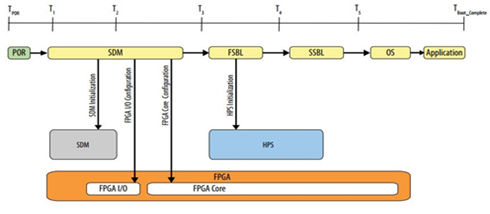
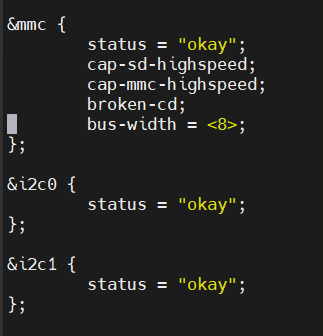

# Hard Processor System Software Developer Guide: OFS for Intel Agilex FPGAs Targeting Intel® N6000/1-PL FPGA SmartNIC Platform

[Quartus Prime Pro Version: 23.1](https://www.intel.com/content/www/us/en/search.html?ws=text#q=quartus%20prime%20pro%2023.1&sort=relevancy)

Last updated: Last updated: **August 01, 2023** 


## File Types

|Extension | Description|
| ---| --- |
| ITS File (*.its) | The image source file which describes the contents of the image and defines various properties used during boot. Actual contents to be included in the image (kernel, ramdisk, etc.) are specified in the image source file as paths to the appropriate data files. |
| ITB File (*.itb) | Produced as output from `mkimage`, using an image source file. Contains all the referenced data (kernel, ramdisk, SSBL, etc.) and other information needed by UBoot to handle the image properly. This image is transferred to the target and booted. |
| DTB File (*.dtb)| The Device Tree Blob is loaded into memory by U-Boot during the boot process, and a pointer to it is shared with the kernel. This file describes the system's hardware layout to the kernel. |
| FIT Image (*.fit)| Format used for uImage payloads developed by U-Boot. On aarch64 the kernel must be in image format and needs a device tree to boot.|
| SPL (*.spl)| The Secondary Program Loader is a small binary which is embedded in a FIM SOF and loaded into board DDR4 RAM when the FPGA is initially configured. This file is responsible for loading U-Boot into system RAM.  |

## 1.0 Introduction

The Open FPGA Stack (OFS) is a modular collection of hardware platform components, open source upstreamed software, and broad ecosystem support that enables an efficient path to develop a custom FPGA platform. OFS Provides a framework of FPGA synthesizable code, a simulation environment and synthesis/simulation scripts.  The updated OFS architecture for Intel Agilex FPGA devices improves upon the modularity, configurability and scalability of the first release of the OFS architecture while maintaining compatibility with the original design.  The primary components of the FPGA Interface Manager or shell of the reference design are:

- PCIe Subsystem
- HSSI Subsystem
- Memory Subsystem
- Hard Processor System (HPS)
- Reset Controller
- FPGA Management Engine (FME)
- AFU Peripheral Fabric for AFU accesses to other interface peripherals
- Board Peripheral Fabric for master to slave CSR accesses from Host or AFU
- SPI Interface to BMC controller

The Intel<sup>&reg;</sup> N6000-PL and N6001-PL FPGA SmartNIC Platforms are acceleration cards that use the OFS infrastructure. The key difference between these two platforms is:

- Intel<sup>&reg;</sup> N6000-PL SmartNIC Platform has a bifurcated PCIe bus with Gen4x8 interfacing to the the Intel Agilex FPGA and Gen4x8 interfacing to an Intel E810 SmartNIC.  This platform is targeted specifically for VRAN, UPF and vCSR applications.  The FPGA designs targeting these vertical market applications were generated using the OFS infrastructure.
- Intel<sup>&reg;</sup> N6001-PL SmartNIC Platform has a Gen4x16 interface directly to the Intel Agilex FPGa and is not populated with an Intel E810 SmartNIC.  This platform is the reference platform for the OFS reference designs for Intel Agilex FPGA.  

Note: throughout this document "Intel N6000/1-PL FPGA SmartNIC Platform" denotes both cards. This document describes the software package that runs on the Hard Processor System (HPS) which is a key component within both platforms.

The Intel N6000/1-PL FPGA SmartNIC Platform has a customized build script that can be used to both set up a development environment and build the essential pieces of the HPS software image. This script, `meta-bake.py`, has its own dedicated [**Section 3.1 Building U-Boot**](#31-building-u-boot) which can be used to quickly get started with the HPS build flow. It is recommended you use this build script to construct the first and second stage bootloader files, as it will handle all of the setup and patching required to build out your complete Yocto image. You can familiarize yourself with the contents of this package in its public GitHub repository located at https://github.com/OPAE/meta-opae-fpga/tree/main/tools/meta-bake. All other information included for individual components is included for learning purposes only and is not meant as a recipe for image creation.

### 1.1 Reference Documents

This document pulls much of its information from related Agilex FPGA documentation hosted on [intel.com](intel.com). Reading these references is not required for initial platform bring up, but will serve to further your knowledge of the FPGA SoC boot and configuration process.

**Table 1. Reference Documents**

| **Document Title** |
| --- |
| [Intel® Agilex™ Hard Processor System Technical Reference Manual](https://www.intel.com/content/www/us/en/programmable/documentation/slu1548263438002.html) |
| [Intel® Agilex™ SoC FPGA Boot User Guide](https://www.intel.com/content/www/us/en/programmable/documentation/pww1591206997703.html) |
| [Intel® Agilex™ Configuration User Guide](https://www.intel.com/content/www/us/en/programmable/documentation/oex1546548090650.html) |

### 1.2 Reference Images

Intel has provided a set of two pre-compiled ITB images that can be used for exploration and evaluation of the HPS bring-up flow. These images contain the complete SSBL package specific to the board and can be copied to the N6000/1-PL SmartNIC Platform with an HPS enabled FIM loaded. Refer to [**Section 4.1 Example Boot**](#41-example-boot) for an example on how to use the built-in copy engine IP in tandem with the host-side `cpeng` software to transfer an SSBL.

The package is found on the official [OFS 2023.1 Release on GitHub](https://github.com/OFS/ofs-n6001/releases/tag/ofs-2023.1-1). Two ITB artifacts are included at the bottom of the page under *Assets* - one with the Vendor Authorized Boot (VAB) certificate included, and one without. Which you choose to load depends on whether the currently loaded FIM requires VAB authentication. [**Section 4.3 Example Boot**](#43-example-boot) contains instructions on the boot flow using these files for platform bring up.

The default username for these two images is `root` and the password is empty. A good place to start after loading the ITB is to set up SSH for file transfers and the remote console, as seen in [**8.0 Connecting remotely to the HPS using `ssh`**](8.0-connecting-remotely-to-the-hps-using-`ssh`).

## 2.0 Architecture Overview

The OFS architecture is classified into:

<ul>
<li>1. Host Interface Adapters (PCIe)</li>
<li>2. Low Performance Peripherals</li>
    <ul>
    <li>2.1. Slow speed peripherals (example: JTAG, I2C, SMBus, and so on)</li>
    <li>2.2. Management peripherals (example: FPGA FME)</li>
    </ul>
<li>3. High Performance Peripherals</li>
    <ul>
    <li>3.1. Memory peripherals</li>
    <li>3.2. Acceleration Function Units (AFUs)</li>
    <li>3.3. HPS Peripheral</li>
    </ul>
<li>4. Fabrics</li>
    <ul>
    <li>4.1. Peripheral Fabric (multi drop)</li>
    <li>4.2. AFU Streaming fabric (point to point)</li>
    </ul>
</ul>

The HPS is connected to the AFU and implements all the board specific flows that customers require to begin the application development using the HPS such as host communication, firmware load and update, integration with OFS, and memory. The HPS implements a basic *Hello World* software application and is intended as a starting point for customers to begin development with HPS.

### 2.1 HPS Peripherals

**Figure 1  Intel Agilex FPGA HPS Peripherals**


The Intel Agilex™ SoC integrates a full-featured Arm<sup>&reg;</sup> Cortex-A53<sup>&reg;</sup> MPCore Processor.

The Cortex-A53 MPCore supports high-performance applications and provides the capability for secure processing and virtualization.

Each CPU in the processor has the following features:

- Support for 32-bit and 64-bit instruction sets.
- To pipeline with symmetric dual issue of most instructions.
- Arm NEON<sup>&reg;</sup> Single Instruction Multiple Data (SIMD) co-processor with a Floating-Point Unit (FPU)
- Single and double-precision IEEE-754 floating point math support
- Integer and polynomial math support.
- Symmetric Multiprocessing (SMP) and Asymmetric Multiprocessing (AMP) modes.
- Armv8 Cryptography Extension.
- Level 1 (L1) cache:
- 32 KB two-way set associative instruction cache.
- Single Error Detect (SED) and parity checking support for L1 instruction cache.
- 32 KB four-way set associative data cache.
- Error checking and correction (ECC), Single Error Correct, Double Error Detect (SECDED) protection for L1 data cache.
- Memory Management Unit (MMU) that communicates with the System MMU (SMMU).
- Generic timer.
- Governor module that controls clock and reset.
- Debug modules:
- Performance Monitor Unit.
- Embedded Trace Macrocell (ETMv4).
- Arm CoreSight<sup>&reg;</sup> cross trigger interface, the four CPUs share a 1 MB L2 cache with ECC, SECDED protection.

A Snoop Control Unit (SCU) maintains coherency between the CPUs and communicates with the system Cache Coherency Unit (CCU). At a system level, the Cortex-A53 MPCore interfaces to a Generic Interrupt Controller (GIC), CCU, and System Memory Management Unit (SMMU).

Beyond the Arm Cortex-A53 MPCore Processor, the HPS integrates a variety of useful peripherals for use in your design, such as Ethernet, USB, Memory Controller, on-chip RAM, SPI, UART and more. Refer to the [Intel® Agilex™ Hard Processor System Technical Reference Manual](https://www.intel.com/content/www/us/en/programmable/documentation/slu1548263438002.html) for more information.

### 2.2 Zarlink Device

The Microchip® Zarlink device ZL30793 is used for time synchronization. It acts as the protocol engine that drives IEEE 1588-2008 PTP protocol. The Zarlink device is connected to the HPS side and the programming interface is SPI. The FPGA bitstream containing the HPS has the First Stage Bootloader (FSBL) only. This enable commands to be given from a terminal program connected through UART.

The software in HPS can access the Clock generator through SPI to enable write and read operations controlled by the terminal program. It can also read the status of the hold over and Loss of Lock signals and control the LED.

### 2.3 Copy Engine

A host with OPAE SDK and Linux DFL installed will provide the `hps` OPAE command with related options to transfer images from host to the HPS image. The module in the OFS FIM and HPS software that performs this transfer is called the Copy Engine (CPE), which is included by default within the HPS image.

Refer to the [Getting Started Guide: <sup>&reg;</sup> Open FPGA Stack for Intel Agilex FPGAs](../../user_guides/ug_qs_ofs_n6001/ug_qs_ofs_n6001.md) for platform and software installation instructions.

The CPE software is patched into Linux on the HPS in Yocto through the *meta-intel-fpga-refdes* layer. This service is *daemonized* and requires `systemd` in order to operate. This service will communicate with the HPS IP integrated in the FIM in order to coordinate and monitor file transfers from the host CPE software to DDR connected the HPS. The CPE HPS-side software takes advantage of the built-in I/O lightweight kernel module to communicate with the FIM's HPS IP. It can restart the transfer if the initial transfer of the image is not successful. The CPE can also serve as reference on how to integrate your own *systemd* service in the Linux build running on the HPS.

### 2.4 Boot Flow

The boot flow for the Agilex OFS design for the Intel N6000/1-PL FPGA SmartNIC Platform is an FPGA-first boot flow, meaning the Intel Agilex Secure Device Manager (SDM) configures the FPGA first and then boots the HPS. Alternatively, you can boot the HPS first and then configure the FPGA core as part of the Second-Stage Boot Loader (SSBL) or after the Operating System (OS) boots. HPS-first boot is not covered in this document, but for more information please refer to the [Intel® Agilex™ SoC FPGA Boot User Guide](https://www.intel.com/content/www/us/en/programmable/documentation/pww1591206997703.html).

For the FPGA-first boot flow supported by the Intel Agilex OFS FIM, the First Stage Bootloader is part of FPGA bitstream. The available Secure Device Manager (SDM) in the FPGA initially configures the FPGA core and periphery in this mode. The first stage bootloader is produced as a part of a U-Boot build and cna be manually inserted into a Quartus generated SOF file as shown in step 7 of [**Section 9.2 Configuring the HPS**](#92-configuring-the-hps).

After completion, the HPS boots. All the I/O, including the HPS-allocated I/O, are configured, and brought out of tri-state. If the HPS is not booted:

- The HPS is held in reset
- HPS-dedicated I/O are held in reset
- HPS-allocated I/O are driven with reset values from the HPS.
- If the FPGA is configured before the HPS boots, then the boot flow looks as shown in the example figure below.

**Figure 2. Typical FPGA First Configuration Steps**



The flow includes the Time from Power-on-Reset (TPOR) to boot completion (TBoot\_Complete).

**Table 2. FPGA Configuration First Stages**

| **Time** | **Boot Stage** | **Device State** |
| --- | --- | --- |
| TPOR to T1 | POR | Power-on reset |
| T1 to T2 | SDM: Boot ROM |
| | |1. SDM samples the MSEL pins to determine the configuration scheme and boot source.
| | |2. SDM establishes the device security level based on eFuse values.
| | |3. SDM initializes the device by reading the configuration firmware (initial part of the bitstream) from the boot source.
| | |4. SDM authenticates and decrypts the configuration firmware (this process occurs as necessary throughout the configuration).
| | |5. SDM starts executing the configuration firmware.
 | | |
| T2 to T3 | SDM: Configuration Firmware |
| | |1. SDM I/O are enabled.
| | |2. SDM configures the FPGA I/O and core (full configuration) and enables the rest of your configured SDM I/O.
| | |3. SDM loads the FSBL from the bitstream into HPS on-chip RAM.
| | |4. SDM enables HPS SDRAM I/O and optionally enables HPS debug.
| | |5. FPGA is in user mode.
| | |6. HPS is released from reset. CPU1-CPU3 are in a wait-for-interrupt (WFI) state.
 | | |
| T3 to T4 | First-Stage Boot Loader (FSBL) |
| | |1. HPS verifies the FPGA is in user mode.
| | |2. The FSBL initializes the HPS, including the SDRAM.
| | |3. The user application through the host must request the copy engine using the OPAE command hps to transfer the itb image (SSBL +Linux) to the HPS DRAM.
| | |4. HPS peripheral I/O pin mux and buffers are configured. Clocks, resets, and bridges are also configured.
| | |5. HPS I/O peripherals are available.
 | | |
| T4 to T5 | Second-Stage Boot Loader (SSBL) |
| | |1. HPS bootstrap completes.
| | |2. OS is loaded into SDRAM.
 | | |
| T5 to TBoot\Complete | Operating System (OS) | The OS boots and applications are scheduled for runtime launch. |
 | | |

When using the Pre-boot Execution Environment (PXE) boot mechanism, you must use an option ROM. OFS FIM does not have PXE boot implemented in the HPS.

### 2.5 Authorization

The HPS FSBL is part of the static region (SR) FPGA bitstream. Intel provides the capability to sign the FPGA bitstream binaries so that they can be authenticated when remotely updated and when configuring the FPGA. Signing of the SR bitstream is a two-stage process where you must sign with:

    1. `quartus_sign` tool
    2. OPAE `PACSign` tool

Signing with PACSign ensures the security of the BMC RSU update process to the flash, and requires a compatible binary file. Quartus signing provides ensures security when the bitstream is configured through the SDM into the Intel Agilex FPGA device using Vendor Authorized Boot.

Vendor Authorized Bootloader (VAB) considers the SDM as a trusted root entity such that when firmware is authenticated and booted and is running on the SDM with dedicated crypto HW IP blocks, it is considered a trusted entity. As such it is trusted to perform the authentication and authorization steps for subsequent bitstreams.

Each subsequent loaded object after the SDM boot firmware does not need to re-implement the authentication and authorization functions. The authentication and authorization functions are centralized. Arm Trusted Firmware (ATF) is used to make a trusted execution environment (TEE) in the HPS. The source code for both Arm Trusted firmware and the First Stage Boot Loader (FSBL) is provided in the GitHub.

The SSBL + Linux is a part of an itb file and may also be signed with Quartus\_sign and PACSign for authentication. This process is demonstrated in [**Section 9.2 Configuring the HPS**](#92-configuring-the-hps).

## 3.0 Environment Setup
### 3.1 Building U-Boot


When creating a development environment using `meta-bake.py` both U-Boot and the patches required to work with the Intel N6000/1-PL FPGA SmartNIC Platform are located at */meta-opae-fpga/tools/meta-bake/build/agilex-n6000-rootfs/tmp/work/agilex-poky-linux/u-boot-socfpga/1_v2021.07+gitAUTOINC+24e26ba4a0-r0/build/socfpga_agilex_n6000_defconfig*. To review the required patches applied to U-Boot, navigate to */meta-opae-fpga/tools/meta-bake/build/agilex-n6000-rootfs/tmp/work/agilex-poky-linux/u-boot-socfpga/1_v2021.07+gitAUTOINC+24e26ba4a0-r0/git/patches*. From there, using git commands such as `git status` and `git branch` will show changes to the build environment. 

Currently the *meta-bake* build flow requires a specific environment and software dependencies. Refer to section [6.1 Running meta-bake.py](#61-running-meta-bakepy) for more information. 

Invoke the `meta-bake.py` build script to build your entire image, including U-Boot.

```bash
$ cd /meta-opae-fpga/tools/meta-bake
$ ./meta-bake.py --conf n6000/layers.yaml builddir
```

This build process is highly system dependent and can take upwards of 1 hour to complete. Make sure you have at least 200 GB of free space on the system before running a build.

To build U-Boot manually after execution of `meta-bake.py` navigate to */meta-bake/build/agilex-n6000-rootfs/tmp/work/agilex-poky-linux/u-boot-srcfpga/1_v2021.07+gitAUTOINC+24e26ba4a0-r0/build/socfpga_agilex_n6000_defconfig* and run `make`. After running meta-bake.py, you can rebuild U-Boot to incorporate any changes you have made. Navigate to the U-Boot directory at */meta-opae-fpga/tools/meta-bake/build/agilex-n6000-rootfs/tmp/work/agilex-poky-linux/u-boot-socfpga/1_v2021.07+gitAUTOINC+24e26ba4a0-r0/build/socfpga_agilex_n6000_defconfig* and run the following commands to rebuild.

```bash
$ wget https://developer.arm.com/-/media/Files/downloads/gnu-a/10.2-2020.11/binrel/gcc-arm-10.2-2020.11-x86_64-aarch64-none-linux-gnu.tar.xz
$ tar xf gcc-arm-10.2-2020.11-x86_64-aarch64-none-linux-gnu.tar.xz
$ rm gcc-arm-10.2-2020.11-x86_64-aarch64-none-linux-gnu.tar.xz
$ export CROSS_COMPILE=`pwd`/gcc-arm-10.2-2020.11-x86_64-aarch64-none-linux-gnu/bin/aarch64-none-linux-gnu-
$ export ARCH=arm64
$ make -j `nproc`
```

This recompile will result in a new ITB SSBL which may be loaded on an Intel FPGA SmartNIC N6000/1 platform. Several components of the ITB image are present under the U-Boot directory but are not rebuilt as a part of this flow. These files will need to be replaced before rebuilding U-Boot for changes to take affect.

U-Boot comes with its own `dumpimage` tool, which can be used to identify an image and extract and identify its contents. This tool is built by default under */u-boot-socfpga/tools*, and in the `meta-bake.py` environment setup under */meta-opae-fpga/tools/meta-bake/build/agilex-n6000-rootfs/tmp/work/agilex-poky-linux/u-boot-socfpga/1_v2021.07+gitAUTOINC+24e26ba4a0-r0/build/socfpga_agilex_n6000_defconfig/tools*. This tool can also be used to extract specific components of the ITB file.

### 3.2 Yocto

Yocto is an open source toolkit used to create Linux distributions and commonly used for creating Linux images
and bootloaders for embedded environments. A Yocto build environment is made up of one or more layers, with each
layer consisting of recipes that get processed to build/install components in a layer. The workhorse of a Yocto
build is the program called `bitbake`. This program processes the recipes to compile and build packages and images
for the target platform. For SoC platforms, like the HPS, the ARM cross compiler is required.

The build script used for the Agilex SoC GSRD, `create-linux-distro-release`, is a bash script that automates the build
of Linux images of different types (gsrd, nand, etc.) that are compatible with a target FPGA platform (agilex, stratix10, etc.). This script has been ported to Python 3 and modified to build an environment for the Intel FPGA SmartNIC N6000/1 platform, named `meta-bake.py`. This script pulls in the necessary patches and additional changes needed to support the platform.

In general, `meta-bake.py` pulls Yocto layers/recipes from public repositories, configures a Yocto build environment, and builds an image for a supported FPGA platform. The Yocto layer is always the first to be built, and includes the `bitbake` utility. The following table lists remote repositories hosting Yocto meta data source used by `meta-bake.py` and `create-linux-distro` as well as source code used for building binaries that make up the Linux image (kernel and rootfs).

**Note:** Not all repositories can be viewed in a web browser. All can be cloned using git.

Repository | Description
-----------|------------
https://git.yoctoproject.org/git/poky | Base build tools and meta data layers
https://git.openembedded.org/meta-openembedded | Layers for OE-core packages
https://git.yoctoproject.org/git/meta-intel-fpga | Meta data layers for Intel FPGA SoC platforms
https://github.com/altera-opensource/meta-intel-fpga-refdes | BSP layer for Intel SoC FPGA GSRD
https://github.com/altera-opensource/linux-socfpga | Linux kernel source repository for socfpga
https://github.com/altera-opensource/u-boot-socfpga | U-Boot bootloader source repository for socfpga
https://github.com/altera-opensource/arm-trusted-firmware | Source for ATF

Recipes in the *meta-intel-fpga-refdes* layer mostly inherit from and extend recipes in other layers.
The following table lists the new or modified recipes (in *meta-intel-fpga-refdes*) necessary to support an Intel FPGA SmartNIC N6000/1 HPS boot image.

Component | Recipe | Description
----------|--------|------------
Linux Kernel | recipes-kernel/linux/linux-socfpga-lts_5.10.bbappend | Recipe to append the GSRC SoC FPGA device tree to the Yocto build
U-Boot | recipes-bsp/u-boot/u-boot-socfpga_v2021.07.bbappend | Recipe to fetch and build socfpga U-Boot. Modified to support N6000/1 in U-Boot. This also creates a shell script, *mkuboot-fit.sh.
copy-engine | recipes-bsp/copy-engine/copy-engine-0.1.bb | New recipe to build copy-engine daemon in rootfs.
N6000/1 Image | recipes-images/poky/n6000-image-minimal.bb | New recipe to create the N6000/1 image with copy-engine and linuxptp packages installed.

*mkuboot-fit.sh* is meant to be called after a Yocto build to create the U-Boot FIT image for N6000/1, and is called automatically by `meta-bake.py`. This is a workaround for the Yocto
build order which builds the bootloader (U-Boot) before building the Linux image rootfs. Because the rootfs is part of the U-Boot FIT
image, the rootfs must be built before building the bootloader. The result of calling this script is copying the rootfs (as a .cpio file)
to the U-Boot source file tree and calling `make` in the U-Boot build tree. When called again with the rootfs present, the resulting image
will contain the rootfs. This is performed automatically as a part of the `meta-bake.py` build flow.

See [here](https://www.yoctoproject.org) for more information regarding Yocto.
Several reference designs found in rocketboards.org use Yocto for building the Linux image and/or bootloader.
For the N6000/1 image and boot flow, the Yocto build
[script](https://releases.rocketboards.org/release/2021.04/gsrd/tools/create-linux-distro-release) for the
[Agilex SoC Golden System Reference Design](https://rocketboards.org/foswiki/Documentation/AgilexSoCGSRD) has
been adapted to automate building the boot loader, Linux Image, and filesystem needed to support N6000/1 devices.

#### 3.2.1 Customizing the Yocto Image

The following is a list of customizations made for building Yocto to run on the Intel FPGA SmartNIC N6000/1-PL platform.

##### 3.2.1.1 Extending the U-Boot recipe

A recipe extension file (recipes-bsb/u-boot/u-boot-socfpga_v2021.07.bbappend) has been added to the *meta-intel-fpga-refdes* layer
which accomplishes the following:

- Adds patches using Yocto's patching mechanism
- Introduces a new U-Boot config, *socfpga_agilex_n6000_defconfig*, and associates it with a keyword, `agilex-n6000`, that can be
referenced in Yocto configuration files. These patches are necessary until those changes are merged into the public u-boot-socfpga
repository. This config works for both Smartnic Platforms.
- Creates *mkuboot-fit.sh* script file with variables for U-Boot source and build directories that will get expanded
to the actual paths that Yocto uses for fetching/building U-Boot.
Along with this recipe file, relevant patch files have been added. Once the changes are in the U-Boot repository, the patches and
any references to them must be removed.

##### 3.2.1.2 Patching The Linux Kernel

The kernel extension recipe, *meta-intel-fpga-refdes/recipes-kernel/linux/linux-socfpga-lts_5.10.bbappend*, in the *meta-intel-fpga-refdes* layer, has been
modified to add a patch file using Yocto's patching mechanism. This patch file adds the device tree for N6000/1 and is only
necessary until this change is merged into the public linux-socfpga repository.

##### 3.2.1.3 Adding Custom User Space Software

A new recipe, *meta-intel-fpga-refdes/recipes-bsp/copy-engine-0.1.bb* and relevant source files, have been added to the *meta-intel-fpga-refdes* layer.
This recipe includes instructions for building the copy-engine program as well as installing it as a systemd service.
Yocto will build this into an RPM package that gets installed into any image that includes it in the `IMAGE_INSTALL` variable.
This recipe may be used as a guide for installing additional user space software.

You may also create a new Hello World application and add it to the Yocto build as shown below.

1. Generate a BSD 3-Clause License and create an MD5 hash of it.

```bash
Copyright (c) 2023, User's Name 
All rights reserved. 

Redistribution and use in source and binary forms, with or without 
modification, are permitted provided that the following conditions are met: 

 * Redistributions of source code must retain the above copyright notice, 
   this list of conditions and the following disclaimer. 
 * Redistributions in binary form must reproduce the above copyright 
   notice, this list of conditions and the following disclaimer in the 
   documentation and/or other materials provided with the distribution. 
 * Neither the name of Company Name nor the names of its contributors may 
   be used to endorse or promote products derived from this software 
   without specific prior written permission. 

THIS SOFTWARE IS PROVIDED BY THE COPYRIGHT HOLDERS AND CONTRIBUTORS "AS IS" 
AND ANY EXPRESS OR IMPLIED WARRANTIES, INCLUDING, BUT NOT LIMITED TO, THE 
IMPLIED WARRANTIES OF MERCHANTABILITY AND FITNESS FOR A PARTICULAR PURPOSE 
ARE DISCLAIMED. IN NO EVENT SHALL THE COPYRIGHT OWNER OR CONTRIBUTORS BE 
LIABLE FOR ANY DIRECT, INDIRECT, INCIDENTAL, SPECIAL, EXEMPLARY, OR 
CONSEQUENTIAL DAMAGES (INCLUDING, BUT NOT LIMITED TO, PROCUREMENT OF 
SUBSTITUTE GOODS OR SERVICES; LOSS OF USE, DATA, OR PROFITS; OR BUSINESS 
INTERRUPTION) HOWEVER CAUSED AND ON ANY THEORY OF LIABILITY, WHETHER IN 
CONTRACT, STRICT LIABILITY, OR TORT (INCLUDING NEGLIGENCE OR OTHERWISE) 
ARISING IN ANY WAY OUT OF THE USE OF THIS SOFTWARE, EVEN IF ADVISED OF THE 
POSSIBILITY OF SUCH DAMAGE. 
```

After license creation you will need to create an MD5 Hash of the clause. On Linux you can either pipe the raw text into `echo "text" | md5sum`, or create a new file and point to it `md5sum licensefile.txt`.

2. Create a BB recipe file, following the same directory structure as other Yocto recipes.

```bash
$ cd /meta-opae-fpga/tools/meta-bake/build/meta-intel-fpga-refdes
$ mkdir -p recipe-example/helloworld && cd recipe-example/helloworld
```

Create recipe file `helloworld.bb` in directory *helloworld*.

```c
SUMMARY = "Example hello world" DESCRIPTION = "helloworld in HPS" 

AUTHOR = "Your Name <your.email@address.com>" 

LICENSE = "BSD-3-Clause" 

LIC_FILES_CHKSUM = "file://${COMMON_LICENSE_DIR}/BSD-3-Clause;md5=<Your MD5 Hash>" 

inherit systemd pkgconfig 

SRC_URI = "file://helloworld.c" 

S = "${WORKDIR}" 

do_compile() { 
        ${CC} ${CFLAGS} ${LDFLAGS} helloworld.c -o helloworld 
}

do_install() { 
        install -d ${D}${bindir} 
        install -m 0755 helloworld ${D}${bindir} 
} 
```

3. Create source file `helloworld.c` in the same *helloworld* directory.

```c
#include <stdio.h> 

void main void() 
{ 
    Printf(“\nHello World\n”) 
} 
```

4. Re-run `./meta-bake.py --conf n6000/layers.yaml <Build Directory>`. This will a new programmable SSBL that contains your Hello World program. Program the resulting ITB file as shown in [**Section 4.3 Example Boot**](#43-example-boot) and verify the application has been included in your build.

##### 3.2.1.4 Adding Kernel Driver Software

New recipes for custom kenel modules can be created at */build/meta-intel-fpga-refdes/recipes-kernel/linux/*, and instructed to include custom module code. These can be patched in, included as a part of a new branch, or included by default if upstreamed. For more information visit the YoctoProject's [Linux Kernel Development Manual](https://docs.yoctoproject.org/2.6/kernel-dev/kernel-dev.html). An example file from N6000/1 that can be used as an example is */build/meta-intel-fpga-refdes/recipes-kernel/linux/linux-socfpga-lts_5.10.bbappend*.

##### 3.2.1.5 Creating an Image Type

A new recipe, *meta-intel-fpga-refdes/recipes-images/poky/n6000-image-minimal.bb*, has been added that includes directives to install the copy-engine
package (built in this layer) as well as the `linuxptp` package (available in other layers). In addition to including these
packages, this recipe includes a rootfs post processing command that removes the Linux kernel image files from the rootfs.
This is done because the Linux kernel is part of the U-Boot FIT image and therefore not used from the rootfs. Removing this
redundant file reduces the final U-Boot FIT image by about 30Kb. This recipe may be modified or used as a guide to add additional
user space software.

##### 3.2.1.6 Testing and Debugging

As mentioned previously, the script will erase source files every time it is executed. This means that any changes
made locally will be lost when the script is run again after making these changes. The example below shows how to
test local changes without executing the script again.

```bash
$ cd build
$ source poky/oe-init-build-env agilex-gsrd-rootfs/
$ bitbake n6000-image-minimal
$ ./agilex-n6000-rootfs/tmp/deploy/images/agilex/mkuboot-fit.sh
```

## 4.0 Booting the HPS

### 4.1 OFS FIM Boot Overview

This implementation of an FPGA First boot flow requires that the FSBL poll on a given register before continuing to boot the HPS. Once this register indicates it is (copy engine) ready, the FSBL loads a monolithic U-Boot FIT image at a given offset 0x02000000.

This image is made up of the following components:

- U-Boot bootloader also referred to as second stage bootloader
- Linux Kernel image
- Root filesystem (rootfs) consisting of kernel modules as well as user space software.

### 4.2 Booting OFS FIM for Intel Agilex FPGA

As mentioned before, the Intel N6000/1-PL FPGA SmartNIC boot flow is an FPGA-first boot flow which requires that the Intel Agilex FPGA to be configured with the necessary components (SPL/FSBL, copyengine) in order for the HPS to boot.

SD/eMMC is not supported for FSBL for HPS first

- First Stage Bootloader (FSBL): u-boot-spl-dtb.hex is embedded into FPGA image
- Monolithic FIT Image Downloaded from Host, u-boot.itb contains the following components

    1) Second Stage Bootloader (SSBL): U-Boot + U-Boot Device Tree

    2) Linux kernel, Image, + Linux Device Tree

    3) Linux RAM based Root File System

- First Stage Bootloader (FSBL) is U-boot-spl
- U-boot-spl is built when U-Boot is built
- Artifact is u-boot-spl-dtb.hex
  - The user has to check into build location : [ofs-n6001/syn/setup/vab_sw/u-boot-spl-dtb.hex](https://github.com/OFS/ofs-n6001/blob/45a7dfbcdac16131aabf392457cfbbd51631888e/syn/setup/vab_sw/u-boot-spl-dtb.hex#L4)
  - Then run the command
  - quartus/pfg -c -o hps/path=u-boot-spl-dtb.hex orig.sof orig/fsbl.sof

Things to consider while developing your ITB image:

    - The size of the u-boot.itb matters.
    - FIT is downloaded to [0x2000000](https://github.com/altera-opensource/u-boot-socfpga/blob/541b6afcb183ddb350ad367c9b63cc6db94c1f6e/configs/socfpga_agilex_n6010_defconfig#L4)
    - Linux Device Tree and RootFS are unpacked to high memory
    - Linux is unpacked to an address specified in the FIT, [0xb600000](https://github.com/altera-opensource/u-boot-socfpga/blob/541b6afcb183ddb350ad367c9b63cc6db94c1f6e/arch/arm/dts/socfpga_agilex_n6010-u-boot.dtsi#L4)
    - If size of u-boot.itb is greater than 0xb600000 – 0x2000000, then FIT will be corrupted mid extraction, resulting in unpredictable kernel crashes.

This example assumes the following preconditions have been met prior to booting HPS:

 1) A SOF file synthesized with the SPL (u-boot-spl-dtb.hex).

 2) Copy engine IP with relevant registers accessible to host and HPS.

Once the host FPGA boots with the required bitstream, the SPL in the HPS begins polling a register in the copy engine. One way to get an indication that the HPS is ready to continue past the SPL is to use a terminal emulator on a host with a serial cable connected to the FPGA's UART port. To transfer the U-Boot FIT image, use the `hps cpeng` subcommand from the host. Note, the `hps` program can be installed as part of installing the OPAE SDK and Linux DFL suite of packages.

`hps` command details are located in [**Section 5.0 HPS Command Usage**](#50-hps-command-usage).

### 4.3 Example Boot

This example assumes the following preconditions have been met prior to booting HPS:

- A SOF file synthesized with the SPL (u-boot-spl-dtb.hex).
- Copy engine IP with relevant registers accessible to host and HPS.

Once the host FPGA boots with the required bitstream, the SPL in the HPS will begin polling a register in the copy engine.
One way to get an indication that the HPS is ready to continue past the SPL is to use a terminal emulator on a host with a
serial cable connected to the FPGA's UART port.

To transfer the U-Boot FIT image, use the `hps` program with `cpeng` subcommand from the host.
Note, the `hps` program is installed as part of installing the OPAE SDK suite of packages.
See [here](https://github.com/OPAE/opae-sdk/tree/master/ofs/apps/cpeng#readme) for information on running the `hps` program. The following example assumes your N6000/1 board is at PCIe BDF *0000:b1:00.0*.

```bash
# Bind vfio-pci driver to Copy Engine PCIe Physical Function
$ sudo opae.io init -d b1:00.4 root
# Load the HPS SSBL
$ hps cpeng -f u-boot.itb
[2021-09-25 01:59:25.538] [cpeng] [info] starting copy of file:u-boot.itb, size: 116725656, chunk size: 4096
[2021-09-25 01:59:29.935] [cpeng] [info] last chunk 1944, aligned 2048
[2021-09-25 01:59:29.935] [cpeng] [info] transferred file in 28498 chunk(s)
[2021-09-25 01:59:29.935] [cpeng] [info] waiting for ssbl verify...
[2021-09-25 01:59:33.848] [cpeng] [info] ssbl verified
[2021-09-25 01:59:33.848] [cpeng] [info] waiting for kernel verify...
[2021-09-25 01:59:39.626] [cpeng] [info] kernel verified
```

This will transfer the U-Boot FIT image via the copy engine IP to the HPS DDR and then signal completion of the transfer to the
copy engine. Once the copy engine completes the actual transfer, it will write to the register the HPS SPL is polling on allowing
the SPL to load the U-Boot bootloader which will in turn boot into the Linux image embedded in the U-Boot FIT image.
If a terminal emulator is connected to the UART as described above, a user can observe U-Boot and Linux running on the HPS.

3. Validate the HPS SSBL has been loaded by checking for its heartbeat.

```bash
$ hps heartbeat
[2021-09-25 01:59:42.722] [heartbeat] [info] heartbeat value: 0x30015
[2021-09-25 01:59:43.722] [heartbeat] [info] heartbeat value: 0x40015
[2021-09-25 01:59:44.722] [heartbeat] [info] heartbeat value: 0x50015
[2021-09-25 01:59:45.723] [heartbeat] [info] heartbeat value: 0x60015
[2021-09-25 01:59:46.723] [heartbeat] [info] heartbeat value: 0x70015
```

4. Login to HPS as user, root, with no password over serial connection. This process is covered in [**8.0 Connecting remotely to the HPS using `ssh`**](#8.0-connecting-remotely-to-the-hps-using-`ssh`).


``` bash
agilex login: root
root@agilex:~# ls
root@agilex:~# ls /
bin dev home lib mnt root sbin sys usr
boot etc init media proc run srv tmp var
root@agilex:~#
```

## 5.0 HPS Command Usage

### 5.1 Synopsis

<pre>hps OPTIONS SUBCOMMAND SUBCOMMAND\_OPTIONS</pre>

### 5.2 Description

hps is an application to aid in the development, deployment, and debugging of an HPS (hard processor system) on an Intel Agilex device using OFS. The current version of the hps program assumes an AFU (accelerator functional unit) is configured into the FPGA that can be discovered/accessed through an OPAE library and used for communicating with the HPS. When invoked with one of its subcommands, hps will enumerate the AFU for that subcommand before executing it.

### 5.3 Options

<pre>-h,--help

Print this help message and exit

-p,--pci-address address

Use address in the filter for locating the AFU where address must be in

the following format: [domain]\bus\:\device\.\function\

-l,--log-level \level\

stdout logging level. Must be one of:

{trace,debug,info,warning,error,critical,off}

Default is info.

-s,--shared

open in shared mode, default is off

-t,--timeout timeout

Program timeout in milliseconds. Default is 60000 ms.</pre>

### 5.4 Subcommands

#### 5.4.1 cpeng

The copy engine command is used to program copy engine AFU registers to copy an image file from the host into the FPGA DDR.
When the HPS boots, the first stage boot loader loads an image
from a specific offset in DDR that will be used to transition into the second
stage boot loader and subsequently boot into the embedded Linux that is also
part of this image.

| cpeng  options | description |
----- | -----
-h,--help | Print this help message and exit
-f,--filename filename | Path to image file to copy. Default is u-boot.itb
-d,--destination offset | DDR Offset. Default is 0x2000000.
-t,--timeout cpeng timeout| Timeout of cpeng command in microseconds. Default is 1 sec (1000000 usec).
-r,--data-request-limit size| Can be 64, 128, 512, or 1024 and represents the PCIe request size in bytes that the copy engine IP will use. This is encoded to 0, 1, 2, or 3 and written to the copy engine DATA\REQUEST\LIMIT register. Default is 512.
-c,--chunk size| Split the copy into chunks of size size. 0 indicates no chunks. Chunk sizes must be aligned with data request limit. Default is 4096.
--soft-reset| Issue a soft reset only.
--skip-ssbl-verify| Do not wait for ssbl verify.
--skip-kernel-verify| Do now wait for kernel verify.

#### 5.4.2 heartbeat

This subcommand reads the value in the HPS2HOST register
to check for a hearbeat. This compares the value to previous value
read and determines the HPS is alive if the value is incrementing.
This relies on the hps running the hello-cpeng program in *heartbeat*
mode which will increment the upper 16 bits in the HPS2HOST register.
Please see a typical sequence of using the rsu and hps commands as below for a device with BDF 15:00:0

``` bash
rsu fpga -p user1 15:00.0
sudo opae.io release -d 15:00.0
sudo opae.io init -d 15:00.4 root:root
hps cpeng -f u-boot-userkey-vab.itb
timeout 5 hps heartbeat
sudo opae.io release -d 15:00.0
hps cpeng -f u-boot-userkey-vab.itb
```

The above command will transfer the U-Boot FIT image via the copy engine IP to the HPS DDR and then signal completion of the transfer to the copy engine. After the copy engine completes the actual transfer, it writes to the register the HPS SPL is polling on allowing the SPL to load the U-Boot bootloader which in turn boots into the Linux image embedded in the U-Boot FIT image. If a terminal emulator is connected to the UART as described above, a user can observe U-Boot and Linux running on the HPS.

First FSBL is loaded and executed by FPGA configuration. Then Board/Server gets powered on. FPGA Configuration is done via JTAG followed by a reboot

The FSBL will send the following output the serial port:
``` bash
U-Boot SPL 2021.07-00312-g32c0556437 (Sep 17 2021 - 08:42:45 -0700)
Reset state: Cold
MPU 1200000 kHz
L4 Main 400000 kHz
L4 sys free 100000 kHz
L4 MP 200000 kHz
L4 SP 100000 kHz
SDMMC 50000 kHz
DDR: Warning: DRAM size from device tree (1024 MiB)
mismatch with hardware (2048 MiB).
DDR: 1024 MiB
SDRAM-ECC: Initialized success with 239 ms
waiting for host to copy image
```

## 6.0 meta-bake.py

A script called *meta-bake.py* has been added to allow for more control of configuration/customization of recipes and their dependencies.
This script separates the data from the logic by requiring that data be expressed in a yaml configuration file. This file contains the
following confiration data:

- machine - The FPGA/SoC platform to build for, choices are agilex, stratix10, arria10, cyclone5
- image - The image type to build, choices are gsrd, nand, pcie, pr, qsqpi, sgmii, tse, n6000
- target - The build target to build. This is typically a Yocto image to build.
- fit - Make a monolothic FIT image after the Yocto build. This will use U-Boot source and binaries as well as the rootfs made for the image.
- repos - A list of repositories to pull for Yocto recipes. This information is made up of:
  - name - The project name (this is also the directory where source is clone to)
  - url - The URL to pull the source from
  - branch - The branch to checkout
  - add_layers - Can be either True or a list of sub-directories to add as layers in bblayers.conf
  - patch - Path to a file to use to patch the source code
  - keep - When set to true, this will leave the source tree untouched on subsequent runs
- upstream_versions - Dependencies/versions to use for either Linux kernel, U-Boot, and/or ATF. This information is made up of:
  - name - Project name
  - version - version to configure recipes that use it
  - branch - branch to use, will use git hash in recipe
  - url - URL to pull the source from
  - disabled - when set to True, this project will be ignored
- local - Used to configure local.conf used by Yocto/bitbake build. This information is made up of:
  - remove - List of keys to remove from local.conf
  - values - Dictionary of key/value pairs to use to insert into local.conf. Any existing key/value pairs will be overwritten.

### 6.1 Running meta-bake.py

To create an U-Boot fit and spl image for N6000/1 platforms, run the following command after meeting these setup conditions:

- Host PC with Ubuntu 20.04 LTS
  - ARM cross compiler
    - set CROSS_COMPILE environment variable to: <path to cross compiler>/bin/aarch64-linux-gnu-
        - e.x. export CROSS_COMPILE=aarch64-linux-gnu-
    - set ARCH to: arm64
        - e.x. export ARCH=arm64
- At least 100 Gb of disk space
- Tested on OFS 3.0.0

This script does not require any bare-metal accesses to perform its build and can be run from a VM with no alterations. Ensure that the Ubuntu 20.04 Guest VM you create has enough to space to perform the entire build (recommend at least 200 GiB total space), as does the drive it is stored on. You will need to configure proxy access in the VM if required for your environment. You can use any VM technology; having `ssh` enabled in the VM will allow you to more easily transfer the completed build files back to the host system but is not required.

Package dependencies to build Yocto on each supported OS can be found on the [Yocto Quick Start](https://docs.yoctoproject.org/1.8/yocto-project-qs/yocto-project-qs.html) page.

```bash
wget https://developer.arm.com/-/media/Files/downloads/gnu-a/10.2-2020.11/binrel/gcc-arm-10.2-2020.11-x86_64-aarch64-none-linux-gnu.tar.xz
tar xf gcc-arm-10.2-2020.11-x86_64-aarch64-none-linux-gnu.tar.xz
rm gcc-arm-10.2-2020.11-x86_64-aarch64-none-linux-gnu.tar.xz
export CROSS_COMPILE=`pwd`/gcc-arm-10.2-2020.11-x86_64-aarch64-none-linux-gnu/bin/aarch64-none-linux-gnu-
export ARCH=arm64
./meta-bake.py build
```

After running this build, the images you need to boot the HPS are located under build/agilex-n6000-images. Follow the steps in [**Section 4.3 Example Boot**](#43-example-boot) to finish bringing up your board.

This script will do the following:

* Parse layers.yaml for configuration to use for build
* Download recipe repositories (including poky) listed in `repos` secion of layers.yaml
 * Apply refdes-n6000 patch to meta-intel-fpga-refdes source tree
* Configure Yocto build in build directory
 * Source build/poky/oe-init-build-env passing in agilex-n6000-rootfs. This will initialize conf files.
 * Configure build/agilex-n6000-rootfs/conf/local.conf using values in `local` section of layers.yaml
         * _Note_: IMAGE_FSTYPES is configured to include `cpio`
 * Configure build/agilex-n6000-rootfs/conf/bblayers.conf using layer specification in `repos` section of layers.yaml
* Run Yocto build for target listed in layers.conf
 * Call `bitbake n6000-image-minimal`
* Get environment variables to locate rootfs cpio file as well as U-Boot source and build directories
* Copy rootfs created by Yocto build for U-Boot
 * Copy rootfs cpio file (n6000-image-minimal-agilex*.rootfs.cpio) to U-Boot build directory for selected configuration (socfpga_agilex_n6000_defconfig)
* Call U-Boot build in directory for selected configuration
* Copy FIT image (u-boot.itb) to images directory, build/agilex-n6000-images
 * Many important images are copied to *build/agilex-n6000-images*, which may be useful if using VAB

### 6.2 Required Changes

The patch file applied on top of the *meta-intel-fpga-refdes* repository introduces patches to:

* Add patch files so that Yocto can modify Linux kernel to add configuration for creating a device tree binary (DTB) compatible with N6000/1
* Add patch files so that Yocto can modify the bootloader in U-Boot to support booting with the assistance of the copy engine IP
* Modify rootfs to include copy-engine daemon as well as other packages that can be useful for debug

These changes may eventually be merged into upstream repositories for *linux-socfpga*, *u-boot-socfpga*, and *meta-intel-fpga-refdes*.
Once all changes make their way into the repositories for the aforementioned projects, it will no longer be necessary to apply patches.

### 6.3 Manual Build

One may use `meta-bake.py` to only pull down required repositories and configure a Yocto build environment by using the *--skip-build* command line argument.
To initiate a build after this, `source poky/oe-init-build-env` passing in a directory as the only argument.
This will set up the user's environment to be able to run bitbake.
To build the Yocto image, run `bitbake n6000-image-minimal`.
This will build all the components necessary to build a FIT image.
Once the build is complete, U-Boot make system may be used to make the FIT.
The U-Boot build directory for the selected configuration can be found in the Yocto build environment directory at:
``` bash
$ cd tmp/work/agilex-poky-linux/u-boot-socfpga/1_v2021.07+gitAUTOINC+24e26ba4a0-r0/build/socfpga_agilex_n6000_defconfig
```
Once in this directory, ensure that the necessary files are present in here in order to assemble the FIT image (u-boot.itb)
```bash
$ cp ../../../../../../deploy/images/agilex/n6000-image-minimal-agilex.cpio rootfs.cpio
$ ls Image linux.dtb rootfs.cpio
Image  linux.dtb  rootfs.cpio
$ make
```

### 6.4 Manual VAB Signing

- By default, `meta-bake.py` will sign and certify the proper files for use with VAB. Below is an example on how to perform the manual [VAB Signing Process](https://rocketboards.org/foswiki/Documentation/IntelAgilexSoCSecureBootDemoDesign#:~:text=5.%20Generate%20Signature,qky/software0_cancel3.qky).

Make sure Quartus already installed and its tools added to environment. Example PATH=$PATH:/home/intelFPGA\pro/21.3/quartus/bin/

``` bash
$ cd HPS_VAB
$ quartus_sign --family=agilex --operation=make_private_pem --curve=secp384r1 --no_passphrase userkey_root_private.pem
$ quartus_sign --family=agilex --operation=make_public_pem userkey_root_private.pem userkey_root_public.pem
$ quartus_sign --family=agilex --operation=make_rootuserkey_root_public.pem userkey_root_public.qky
$ chmod +x fcs_prepare
$ ./fcs_prepare --hps_cert bl31.bin -v
$ quartus_sign --family=agilex --operation=SIGN --qky=userkey_root_public.qky --pem=userkey_root_private.pem unsigned_cert.ccert signed_cert_bl31.bin.ccert

# ATF Sign

$ ./fcs_prepare --finish signed_cert_bl31.bin.ccert --imagefile bl31.bin
$ mv hps_image_signed.vab signed-bl31.bin
$ rm unsigned_cert.ccert

# u-boot-nodtb

$ ./fcs_prepare --hps_cert u-boot-nodtb.bin -v

#signed_u-boot-nodtb.bin.ccert

$ quartus_sign --family=agilex --operation=SIGN --qky=userkey_root_public.qky --pem=userkey_root_private.pem unsigned_cert.ccert signed_u-boot-nodtb.bin.ccert

# u-boot-nodtb.bin Sign

$ ./fcs_prepare --finish signed_u-boot-nodtb.bin.ccert --imagefile u-boot-nodtb.bin
$ mv hps_image_signed.vab signed-u-boot-nodtb.bin
$ rm unsigned\_cert.ccert

# u-boot.dtb

$ ./fcs_prepare --hps_cert u-boot.dtb -v

#signed_u-boot.dtb.ccert

$ quartus_sign --family=agilex --operation=SIGN --qky=userkey_root_public.qky --pem=userkey_root_private.pem unsigned_cert.ccert signed_u-boot.dtb.ccert

# u-boot.dtb Sign

$ ./fcs_prepare --finish signed_u-boot.dtb.ccert --imagefile u-boot.dtb
$ mv hps_image_signed.vab signed-u-boot.dtb
$ rm unsigned_cert.ccert

# Image

$ ./fcs_prepare --hps/cert Image -v

#signed_Image.ccert

$ quartus_sign --family=agilex --operation=SIGN --qky=userkey_root_public.qky --pem=userkey_root_private.pem unsigned_cert.ccert signed_Image.ccert

# Image Sign

$ ./fcs_prepare --finish signed_Image.ccert --imagefile Image
$ mv hps_image_signed.vab signed-Image
$ rm unsigned_cert.ccert

# linux.dtb

$ ./fcs_prepare --hps_cert linux.dtb -v

#signed_linux.dtb.ccert

$ quartus_sign --family=agilex --operation=SIGN --qky=userkey_root_public.qky --pem=userkey_root_private.pem unsigned_cert.ccert signed_linux.dtb.ccert

# linux.dtb Sign

$ ./fcs_prepare --finish signed_linux.dtb.ccert --imagefile linux.dtb
$ mv hps_image_signed.vab signed-linux.dtb
$ rm unsigned_cert.ccert

# rootfs.cpio

$ ./fcs_prepare --hps_cert rootfs.cpio -v

#signed_rootfs.cpio.ccert

$ quartus_sign --family=agilex --operation=SIGN --qky=userkey_root_public.qky --pem=userkey_root_private.pem unsigned_cert.ccert signed_rootfs.cpio.ccert

# rootfs.cpio

$ ./fcs_prepare --finish signed_rootfs.cpio.ccert --imagefile rootfs.cpio
$ mv hps_image_signed.vab signed-rootfs.cpio
$ rm unsigned_cert.ccert
```

Copy the following files to *u-boot-socfpga* folder:

``` bash
#Copy the image back to uboot folder
$ cp signed-bl31.bin ../u-boot-socfpga/
$ cp signed-u-boot-nodtb.bin ../u-boot-socfpga/
$ cp signed-u-boot.dtb ../u-boot-socfpga/
$ cp signed-Image ../u-boot-socfpga/
$ cp signed-linux.dtb ../u-boot-socfpga/
$ cp signed-root
$ fs.cpio ../u-boot-socfpga/
```
Recompile the U-Boot

``` bash
$ git clone https://github.com/altera-opensource/u-boot-socfpga
$ cd u-boot-socfpga
$ export CROSS\COMPILE=aarch64-none-linux-gnu-; export ARCH=arm
$ make socfpga/agilex/n6000/vab/defconfig
$ make -j 24
$ cd ..

```

**Figure 3.1 N6000/1 Configs**


If you not see the defconfig desired, please checkout the correct branch version. Example config shown above is socfpga_v2021.10.

If the memory device tree it mismatches with your hardware (figure below), change the memory device tree at u-boot-socfpga/arch/arm/dts/socfpga_agilex_n6000-u-boot.dtsi

To make it 2GB, change as

```
memory {

\* 2GB \*

reg = <0 0x00000000 0 0x40000000>,<0 0x00000000 0 0x40000000>;

};
```
**Figure 3.2 Device tree mismatches example**


Refer to 6. Host Side Startup

``` bash
$ sudo opae.io init -d 4b:00.4 root:root
$ hps cpeng -f u-boot.itb
$ timeout 5 hps heartbeat
```
The error happen (Figure below) when the Images do not sign with VAB.

**Figure 3.3 VAB certificate error example**


## 7.0 Debugging

Debugging the HPS from the host side is standard HPS debugging. The primary debug tool is UART on the HPS and Arm DS-5 debugger.

A UART connection can be enabled on the board using the following procedure:

1. Connect the HPS Debug Card and HPS UART to the Intel N6000/1-PL FPGA SmartNIC Platform board

2. Open Putty with the following setting
```
    Port:COM4

    Baudrate:115200

    Data bits : 8

    Stop bits : 1

    Parity : None

    Flow Control : None
```
3. Reboot the Intel N6000/1-PL FPGA SmartNIC Platform board by typing `reboot` in the shell. You will be able to see the HPS UART traffic in the putty. If any issues are encountered in this step, check the HPS UART connection and the UART driver.

4. Check the PCI bdf ( **lspci | grep acc** ) or **fpgainfo fme** at the shell prompt.

5. Run the rsu and fpga\reconfig scripts with respective arguments to print the logs.

## 8.0 Connecting remotely to the HPS using `ssh`

The HPS running on the Intel FPGA N6000/1-PL SmartNIC Platform can be remotely accessed to via the utility `ssh`, allowing the user to run commands and copy files. SSH must be run over a Point-To-Point Protocol daemon that has been included in the HPS software (as a part of the *meta-openembedded* layer, in the *recipes-daemons/ippool* recipe). In this example, the HPS is set up as a PPP Server, and the host OS is set up as a PPP Client. Serial communication between the host and HPS is accomplished via HPS UART1, which communicates through the FIM to the Soft UART on the FPGA, who in turn communicates with the host over PCIe.

The following steps assume the SSBL has not yet been loaded onto the HPS. If it has, a cold boot will reset the system.

1. The HPS Copy Engine Module is available for access on PF 4 via the PF/VF Mux on the FPGA. This port needs to be bound to driver `vfio-pci` (the following example assumes PCIE BDF 0000:b1:00.0). Substitute your device's BDF address and desired user/group access permissions into the following command.

```bash
$ sudo opae.io init -d 0000:b1:00.4 <USER>[:<GROUP>]
Unbinding (0x8086,0xbcce) at 0000:b1:00.4 from dfl-pci
Binding (0x8086,0xbcce) at 0000:b1:00.4 to vfio-pci
iommu group for (0x8086,0xbcce) at 0000:b1:00.4 is 190
Assigning /dev/vfio/190 to DCPsupport
Changing permissions for /dev/vfio/190 to rw-rw----
```

2. When an HPS enabled SOF or BIN with the FSBL is loaded onto the FPGA, a message will be displayed on the host OS (seen via `dmesg`) after boot once the serial port has been registered with the dfl-uart driver. The UART driver is included as a part of the linux-dfl driver package. An example output from `dmesg` is shown below (search dmesg using `dmesg | grep dfl-uart`):

```bash
[    7.343014] dfl-uart dfl_dev.7: serial8250_register_8250_port 2
```

The device file that corresponds with serial UART port 2 is `/dev/ttyS2` (format is `/dev/ttyS<port number>`). A serial communication program can be used to view the HPS boot in realtime, then log in and run commands when boot has completed. Minicom is the program that will be used in this example, although others will work. Install Minicom using DNF `sudo dnf install minicom`. 

3. Minicom requires configuration changes before it can listen to the serial device. Using the built-in menu accessed by `sudo minicom -s`, ensure the information under "Serial port setup" matches the following, where the serial device corresponds with the serial port discussed previously:

```bash 
 +-----------------------------------------------------------------------+
    | A -    Serial Device      : /dev/ttyS2                                |
    |                                                                       |
    | C -   Callin Program      :                                           |
    | D -  Callout Program      :                                           |
    | E -    Bps/Par/Bits       : 115200 8N1                                |
    | F - Hardware Flow Control : Yes                                       |
    | G - Software Flow Control : No                                        |
    |                                                                       |
    |    Change which setting?                                              |
    +-----------------------------------------------------------------------+
```

4. Save and exit the configuration menu. Run Minicom using the command `sudo minicom` and keep the terminal open and connected.

5. Load the SSBL onto the HPS using a second terminal. This requires a built ITB image.

```bash
$ hps cpeng -f u-boot.itb
```

6. You should see the HPS boot sequence continue through your Minicom terminal. Once boot has completed, log in using the user `root` with an empty password.

```bash
...
...
...
[  OK  ] Finished Load/Save Random Seed.
[  OK  ] Finished OpenSSH Key Generation.

Poky (Yocto Project Reference Distro) 3.3.6 agilex ttyS0

agilex login: root
root@agilex:~#
```

7. Configure the running Yocto image on the HPS as a PPP server. Run the following command through Minicom on the HPS (connects address 192.168.250.2 on the HPS to 192.168.250.1 on the host):

```bash
root@agilex:~# pppd noauth passive 192.168.250.1:192.168.250.2
[  410.465450] PPP generic driver version 2.4.2
...
```

8. Exit the Minicom program running on the host using `^A X`. Execute the following command on the host to establish a PPP connection as the client (if not installed on the host, run `sudo dnf install ppp`):

```bash
$ sudo pppd ttyS2 115200 crtscts lock local noauth passive debug
```

9. A new network interface device registered to ppp should be visible.

```bash
$ ip -4 addr
...
8: ppp0: <POINTOPOINT,MULTICAST,NOARP,UP,LOWER_UP> mtu 1500 qdisc fq_codel state UNKNOWN group default qlen 3
    inet 192.168.250.2 peer 192.168.250.1/32 scope global ppp0
       valid_lft forever preferred_lft forever

```

With both the client and server communicating, `ssh` and `scp` can be used to run commands and transfer files using IPv4 address 192.168.250.1 on the host. An example operation run on the host OS is shown below:

```bash
[user@localhost ]: scp file_package.tar.gz root@192.168.250.1
```

**Note:** If you are developing software for the HPS and altering system settings, it is possible for `ssh` to prohibit a connection due to a false man-in-the-middle attack warning. The flag `<ssh/scp> -o StrictHostKeyChecking=no` can be used to ignore the warning.

## 9.0 Example Design - Enabling eMMC, I2C and UART in Platform Design

The following section will walk through the process by which eMMC, I2C, and UART can be added to the FIM and the HPS image. The goal of this section is to allow the HPS to configure eMMC memory on boot and uses WNC's [FPGA SmartNIC Series](https://www.intel.com/content/www/us/en/products/details/fpga/platforms/smartnic/n6000-pl-platform.html) as a reference.

### 9.1 Configuring the FIM

1. Configure eMMC, I2C, and UAET in Platform Designer. ACtual pin assignments are determined by the WNC board schematic. In Quartus, navigate to the HPS Processor Subsystem Intel Agilex FPGA IP -> Pin Mux and Peripherals -> Advanced -> Advanced IP Placement.


Check your pin assigments for the eMMC, UART and I2C in the Pin Planner. If these assignments are not present, then they can be found at the following [link](https://github.com/OFS/ofs-n6001/blob/45a7dfbcdac16131aabf392457cfbbd51631888e/syn/setup/hps_loc.tcl#L4). Based on the changes shown above, the UART pins are removed on HPS IO3 and IO4 what are mapped on AG6 and AB1.


2. Click Apply Selections->Generate HDL


3. Check for instantiation in `top.sv`. Click Generate -> Show Instatiation Template.


The following image demonstrates eMMC and I2C properly instatiated in `top.sv`.


4. Add the following to the hps_ss modules in `top.sv`.


5. Compile the design.


### 9.2 Configuring the HPS

1. Enable mmc and DesignWare Memory Card interface flags in U-Boot (.config). After building U-Boot with `meta-bake.py`, this file is located at *<build_directory>/agilex-n6000-rootfs/tmp/work/agilex-poky-linux/u-boot-socfpga/<version>/build/socfpga_agilex_n6000_defconfig/.config*.

```bash
CONFIG_CMD_MMC=y //Enable mmc command tool in uboot 
CONFIG_MMC_DW=y // support DesignWare Memory Card Interface
```


2. Enable and configure I2C and eMMC in U-Boot (socfpga_agilex_n6000.dts). After building U-Boot with `meta-bake.py`, this file is located at *<build_directory>/agilex-n6000-rootfs/tmp/work/agilex-poky-linux/u-boot-socfpga/<version>git/arch/arm/dts/socfpga_agilex_n6000.dts*.


3. Enable and configure I2C and eMMC in the Linux device tree (socfpga_agilex_n6000.dts). After building U-Boot with `meta-bake.py`, this file is located at *<build_directory>/agilex-n6000-rootfs/tmp/work-shared/agilex/kernel-source/arch/arm64/boot/dts/intel/socfpga_agilex_n6000.dts*.



4. Compile Linux by navigating to the directory *agilex-n6000-rootfs/tmp/work/agilex-poky-linux/linux-socfpga-lts/5.10.60-lts+gitAUTOINC+c35d63f9c7-r0/linux-agilex-standard-build* and running the following:

```bash
$ make -j `nproc` Image dtbs  
```

5. Add the software utilities`util-linux-mkfs e2fsprogs.mke2fs e2fsprogs` in to the Linux RootFS. Thes utilities will be used to create a filsystem (ext4, FAT32, etc.) and partition the eMMC. Make the following changes in *meta-intel-fpga-refdes/recipes-images/poky/n6000-image-minimal.bb*.


6. As an output from the Linux compilation from step 4 you will produce the files **Image** and **socfpga_agilex_n6000.dtb**. Transfer both over to the socfpga_agilex_n6000_defconfig directory. Rename **socfpga_agilex_n6000.dtb** to **linux.dtb**. Compile U-Boot by running `make` in directory *agilex-n6000-rootfs/tmp/work/agilex-poky-linux/u-boot-socfpga/1_v2021.07+gitAUTOINC+24e26ba4a0-r0/build/socfpga_agilex_n6000_defconfig/*. This compilation will produce both `spl/u-boot-spl-dtb.hex` and `u-boot.itb`. 

7. Combines these files with your SOF FSBL bootloader (created in [**Section 9.1 Configuring the FIM**](#91-configuring-the-fim)).

```bash
$ quartus_pfg -c ofs_top.sof ofs_top_hps.sof -o hps_path=u-boot-spl-dtb.hex
$ quartus_pfg -c  ofs_top_hps_pof_flash.pfg //to pof file and flash to qspi
```

Program the FSBL enabled SOF onto the FPGA and warm reboot the server for changes to take affect. After reboot has completed use the following commands to program the SSBL.

```bash
$ sudo opae.io release -d d8:00.0
$ sudo opae.io init -d d8:00.4 root:root
$ hps cpeng -f u-boot.itb
```

During HPS boot you should see the following message if the eMMC has been properly configured.


### 9.3 eMMC Testing from the HPS

**The following memory test was run from the U-Boot shell.**

1. Erase eMMC using a start block offset 0x400.

```bash
$ mmc erase 0x400 20
```


Write test data (at 0x00A00000) into the eMMC offset 0x400.

```bash
$ mmc write 0x00A00000 0x400 10
```


Read test data (at 0x00A00040) back from eMMC offset 0x400.

```bash
$ mmc read 0x00A00040 0x400 10
```


Data comparison at memory offset 0x00A00000 and 0x00A00040. Data should match.

```bash
$ cmp.l 0x00A00000 0x00A00040 10.
```


**The following memory test was run from Linux running on the HPS.**

1. Display the eMMC and its partitions.

```bash
$ fdisk -l
```


2. Create a primary partition on the eMMC.


3. Verify the partition has been created.


4. Format the ext3 filesystem in the partition you just created (p1).


5. Create the directory `mydata` in /mnt. Mount the eMMC p1 partition to `/mnt/mydata` and verify the filsystem mount was successful.

```bash
$ mkdir -p /mnt/mydata
$ mount /dev/mmcblk0p1 /mnt/mydata
$ df
```


6. Create a new text file and write some data in it - "Hello World!". After the device has been written to run `sync`, unmount eMMC p1 partition and verify the unmount was successful.

```bash
$ sync
$ umount /dev/mmcblk0p1
$ df
```


## layers.yaml Reference ##

```yaml
machine: agilex
image: n6000
target: n6000-image-minimal
fit: true
uboot-dtb: [u-boot-nodtb.bin, u-boot.dtb]
linux-binary: [bl31.bin, linux.dtb, rootfs.cpio, Image]
root-public-qky: userkey_root_public.qky
root-private-pem: userkey_root_private.pem
root-public-pem: userkey_root_public.pem

repos:
  - name: poky
    url: https://git.yoctoproject.org/git/poky.git
    branch: hardknott
  - name: meta-intel-fpga
    url: https://git.yoctoproject.org/git/meta-intel-fpga.git
    branch: hardknott
    add_layers: true
  - name: meta-intel-fpga-refdes
    url: https://github.com/altera-opensource/meta-intel-fpga-refdes.git
    #url__: https://github.com/intel-innersource/os.linux.yocto.reference-design.meta-intel-fpga-refdes.git
    #url: git@github.com:intel-innersource/os.linux.yocto.reference-design.meta-intel-fpga-refdes.git
    #branch: rrojo/n6000
    branch: hardknott
    patch: refdes-n6000-ppp.patch
    keep: true
    add_layers: true
  - name: meta-openembedded
    url: https://github.com/openembedded/meta-openembedded.git
    branch: hardknott
    add_layers:
      - meta-oe
      - meta-networking
      - meta-python
  - name: fcs_prepare
    url: https://github.com/altera-opensource/fcs_apps.git
    branch: fcs_prepare

ingredients:
  linux:
    name: linux-socfpga
    version: '5.10.100'
    branch: socfpga-5.10.100-lts
    url: https://github.com/altera-opensource/linux-socfpga.git
  uboot:
    name: u-boot-socfpga
    version: '2021.07'
    branch: socfpga_v2021.07
    url: https://github.com/altera-opensource/u-boot-socfpga.git
  atf:
    disabled: true
    version: '2.4.1'
    branch: socfpga_v2.4.1
    url: https://github.com/altera-opensource/arm-trusted-firmware.git
local:
  remove:
    - MACHINE
    - UBOOT_CONFIG
    - IMAGE
    - SRC_URI
  values:
    MACHINE: $machine
    DL_DIR: $build_dir/downloads
    DISTRO_FEATURES_append: " systemd"
    VIRTUAL-RUNTIME_init_manager: systemd
    IMAGE_TYPE: $image
    IMAGE_FSTYPES: "+=cpio tar.gz"
    PREFERRED_PROVIDER_virtual/kernel: linux-socfpga-lts
    PREFERRED_VERSION_linux-socfpga-lts: 5.10%
    UBOOT_CONFIG: agilex-n6000
    PREFERRED_PROVIDER_virtual/bootloader: u-boot-socfpga
    PREFERRED_VERSION_u-boot-socfpga: v2021.07%
```
## FAQs

Below are the Frequently Asked Questions:

1. How will you get the software stack for HPS (FSBL, U-Boot, Kernel)? Or will there be a package available to them on Git, Intel RDC?

    **Answer** : HPS software has been around for quite a long time. Support for the OFS and the N6000-PL FPGA SmartNIC Platform will be upstreamed and available from rocketboards.com, just like any other HPS based project.

2. What are the recommended steps for building the binaries and where will those be located?

    **Answer:** There are many documents on building the binaries at rocketboards.com. Any reference binaries can be stored at rocketboards.com as well.

3. What are the host side commands used to put the binaries to Copy Engine and from there to HPS?

    **Answer:** There is a single command, hps to download the single binary through the Copy Engine to the HPS.

4. What are the host side commands used to reset the HPS from Host side?

    **Answer:** This functionality is planned to be added to the hps command.

5. What is the procedure used to debug the HPS from Host side?

    **Answer:** Debugging the HPS from the host side is standard HPS debugging. The primary debug tool is UART on the HPS and the Arm DS debugger.

6. Do we have performance metrics about HPS, like whether any bench marking information available with any sample application is available?

    **Answer:** Any performance metrics on the HPS would be available on rocketboards.com.

7. What is the PXE boot flow and what is required to enable the same?

    **Answer:** On some configurations, HPS is treated as a fully-fledged SoC and can PXE boot itself. But you must add this functionality.

## Further Links

| Description| Link |
| -----| ----- |
|OFS Getting Started User Guide: OFS for Intel® Agilex® PCIe Attach FPGAs| https://ofs.github.io/hw/n6001/user_guides/ug_qs_ofs_n6001/ug_qs_ofs_n6001/|
|Intel® FPGA Interface Manager Developer Guide: OFS for Intel® Agilex® PCIe Attach FPGAs| https://ofs.github.io/hw/n6001/dev_guides/fim_dev/ug_dev_fim_ofs_n6001/|
|Open FPGA Stack Technical Reference Manual for Intel Agilex FPGA PCIe Attach| https://ofs.github.io/hw/n6001/reference_manuals/ofs_fim/mnl_fim_ofs_n6001/|
|AFU Development Guide: OFS for Intel® Agilex® PCIe Attach FPGAs| https://ofs.github.io/hw/N6001/dev_guides/afu_dev/ug_dev_afu_n6001/|
|Simulation User Guide: OFS for Intel® Agilex® PCIe Attach FPGAs| https://ofs.github.io/hw/n6001/user_guides/ug_sim_ofs_n6001/ug_sim_ofs_n6001/|
|FPGA Device Feature List (DFL) Framework Overview| https://github.com/OFS/linux-dfl/blob/fpga-ofs-dev/Documentation/fpga/dfl.rst#fpga-device-feature-list-dfl-framework-overview|
|ofs-platform-afu-bbb| https://github.com/OFS/ofs-platform-afu-bbb|
|Connecting an AFU to a Platform using PIM| https://github.com/OFS/ofs-platform-afu-bbb/blob/master/plat_if_develop/ofs_plat_if/docs/PIM_AFU_interface.md|
|example AFUs| https://github.com/OFS/examples-afu.git|
|PIM Tutorial| https://github.com/OFS/examples-afu/tree/main/tutorial|
|Non-PIM AFU Development| https://github.com/OFS/examples-afu/tree/main/tutorial|
|Intel FPGA IP Subsystem for PCI Express IP User Guide| https://github.com/OFS/ofs.github.io/docs/hw/common/user_guides/ug_qs_pcie_ss.pdf|
|Memory Subsystem Intel FPGA IP User Guide| https://github.com/OFS/ofs.github.io/docs/hw/common/user_guides/ug_qs_mem_ss.pdf|
|OPAE.io| https://opae.github.io/latest/docs/fpga_tools/opae.io/opae.io.html|
|OPAE GitHub| https://github.com/OFS/opae-sdk|
|README_ofs_n6001_eval.txt| https://github.com/OFS/ofs-n6001/blob/release/ofs-2023.1/eval_scripts/README_ofs_n6001_eval.txt|
|FIM MMIO Regions| https://ofs.github.io/hw/d5005/reference_manuals/ofs_fim/mnl_fim_ofs_n6001/#mmio_regions|
|evaluation script| https://github.com/OFS/ofs-n6001/tree/release/ofs-2023.1/eval_scripts|
|OFS| https://github.com/OFS|
|OFS GitHub page| https://ofs.github.io|
|DFL Wiki| https://github.com/OPAE/linux-dfl/wiki|

## Notices & Disclaimers

Intel<sup>&reg;</sup> technologies may require enabled hardware, software or service activation.
No product or component can be absolutely secure. 
Performance varies by use, configuration and other factors.
Your costs and results may vary. 
You may not use or facilitate the use of this document in connection with any infringement or other legal analysis concerning Intel products described herein. You agree to grant Intel a non-exclusive, royalty-free license to any patent claim thereafter drafted which includes subject matter disclosed herein.
No license (express or implied, by estoppel or otherwise) to any intellectual property rights is granted by this document, with the sole exception that you may publish an unmodified copy. You may create software implementations based on this document and in compliance with the foregoing that are intended to execute on the Intel product(s) referenced in this document. No rights are granted to create modifications or derivatives of this document.
The products described may contain design defects or errors known as errata which may cause the product to deviate from published specifications.  Current characterized errata are available on request.
Intel disclaims all express and implied warranties, including without limitation, the implied warranties of merchantability, fitness for a particular purpose, and non-infringement, as well as any warranty arising from course of performance, course of dealing, or usage in trade.
You are responsible for safety of the overall system, including compliance with applicable safety-related requirements or standards. 
<sup>&copy;</sup> Intel Corporation.  Intel, the Intel logo, and other Intel marks are trademarks of Intel Corporation or its subsidiaries.  Other names and brands may be claimed as the property of others. 

OpenCL and the OpenCL logo are trademarks of Apple Inc. used by permission of the Khronos Group™. 