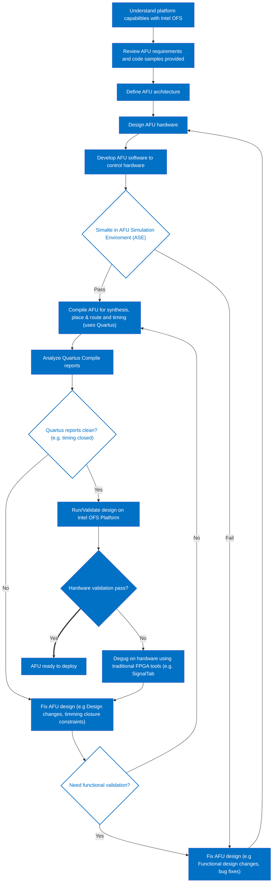

Accelerator Functional Unit Developer Guide:Intel® Open Stack for Intel® Stratix 10®
====
You may not use or facilitate the use of this document in connection with any infringement or other legal analysis concerning Intel products described herein. 
No license (express or implied, by estoppel or otherwise) to any intellectual property rights is granted by this document.

All information provided here is subject to change without notice. Contact your Intel representative to obtain the latest Intel product specifications and roadmaps.

The products described may contain design defects or errors known as errata which may cause the product to deviate from published specifications. Current characterized errata are available on request.
Intel, the Intel logo, Agilex, Altera, Arria, Cyclone, Enpirion, eASIC, easicopy, MAX, Nios, Quartus, Stratix words and logos are trademarks of Intel Corporation or its subsidiaries in the U.S. and/or other countries. Intel warrants performance of its FPGA and semiconductor products to current specifications in accordance with Intel's standard warranty, but reserves the right to make changes to any products and services at any time without notice. Intel assumes no responsibility or liability arising out of the application or use of any information, product, or service described herein except as expressly agreed to in writing by Intel. Intel customers are advised to obtain the latest version of device specifications before relying on any published information and before placing orders for products or services.

*Other names and brands may be claimed as the property of others.
‎  
Copyright © 2022, Intel Corporation. All rights reserved.

**Table of Contents**

- [1. Introduction Intel®](#1-introduction-intel)

  - [1.1 Document Organization](#11-document-organization)

  - [1.2 Prerequisite](#12-prerequisite)

    - [1.2.1 Development Environment](#121-development-environment)

  - [1.3 Acceleration Functional Unit (AFU) Development Flow](#13-acceleration-functional-unit-afu-development-flow)

    - [1.3.1. High Level Data Flow](#131-high-level-data-flow)

    - [1.3.2. Considerations for PIM Usage](#132-considerations-for-pim-usage)

    - [1.3.3 AFU Interfaces Included with Intel FPGA PAC D5005 Platform](#133-afu-interfaces-included-with-intel-fpga-pac-d5005-platform)

    - [1.3.4. Platform Capabilities](#134-platform-capabilities)

    - [1.3.5. Top Level FPGA](#135-top-level-fpga)

- [2. Set Up AFU Development Environment](#2-set-up-afu-development-environment)

  - [2.1. Prepare AFU development environment](#21-prepare-afu-development-environment)

    - [2.1.1. Installation of Quartus and Intel OFS](#211-installation-of-quartus-and-intel-ofs)

      - [2.1.1.1 Installation of Quartus](#2111-installation-of-quartus)

      - [2.1.1.2. Install Intel OFS](#2112-install-intel-ofs)

      - [2.1.1.3. Directory Structure of Intel OFS](#2113-directory-structure-of-intel-ofs)

      - [2.1.1.4 License Installation for Intel OFS](#2114-license-installation-for-intel-ofs)

      - [2.1.1.5. Retrieve PIM Files](#2115-retrieve-pim-files)

    - [2.1.2. Compiling the Intel OFS FIM](#212-compiling-the-intel-ofs-fim)

      - [2.1.2.1. Setting Up Required Environment Variables](#2121-setting-up-required-environment-variables)

      - [2.1.2.2. Compiling Your Base FIM](#2122-compiling-your-base-fim)

      - [2.1.2.2.1. Relocatable PR Directory Tree.](#21221-relocatable-pr-directory-tree)

    - [2.1.3. Relocatable PR Directory Tree](#213-relocatable-pr-directory-tree)

    - [2.1.4. Programing the FIM](#214-programing-the-fim)

      - [2.1.4.1. Load FIM into the Flash of the Intel FPGA PAC D5005](#2141-load-fim-into-the-flash-of-the-intel-fpga-pac-d5005)

  - [3.0 OPAE Software Development Kit](#30-opae-software-development-kit)

    - [3.1 OPAE SDK Build Environment Setup](#31-opae-sdk-build-environment-setup)

    - [3.2 Install OPAE SDK](#32-install-opae-sdk)

    - [3.3 Building and Installing the OPAE SDK](#33-building-and-installing-the-opae-sdk)

- [4. Compiling An AFU](#4-compiling-an-afu)

  - [4.1. Set AFU Synthesis Environment](#41-set-afu-synthesis-environment)

    - [4.1.1. Loading and Running host_chan_mmio](#411-loading-and-running-host_chan_mmio)

- [5. Adding Remote Signal Tap Logic Analyzer to debug the AFU](#5-adding-remote-signal-tap-logic-analyzer-to-debug-the-afu)

  - [5.1. Adding RSTP to the host_chan_mmio AFU](#51-adding-rstp-to-the-host_chan_mmio-afu)


# 1. Introduction Intel®

<a name="introduction"></a>

This document is a design guide for creating an Accelerator Functional Unit (<span title=' Accelerator Functional Unit, Hardware Accelerator implemented in FPGA logic which offloads a computational operation for an application from the CPU to improve performance. Note: An AFU region is the part of the design where an AFU may reside. This AFU may or may not be a partial reconfiguration region'>**AFU** </span>) using Intel® Open FPGA Stack (<span title='Open FPGA Stack,A modular collection of hardware platform components, open source software, and broad ecosystem support that provides a standard and scalable model for AFU and software developers to optimize and reuse their designs.'>**OFS** </span>) for Stratix 10®. The <span title=' Accelerator Functional Unit, Hardware Accelerator implemented in FPGA logic which offloads a computational operation for an application from the CPU to improve performance. Note: An AFU region is the part of the design where an AFU may reside. This AFU may or may not be a partial reconfiguration region'>**AFU** </span> concept consists of separating the FPGA design development process into two parts, the <span title='FPGA Interface Manager, Provides platform management, functionality, clocks, resets and standard interfaces to host and AFUs. The FIM resides in the static region of the FPGA and contains the FPGA Management Engine (FME) and I/O ring.'>**FIM** </span> and <span title=' Accelerator Functional Unit, Hardware Accelerator implemented in FPGA logic which offloads a computational operation for an application from the CPU to improve performance. Note: An AFU region is the part of the design where an AFU may reside. This AFU may or may not be a partial reconfiguration region'>**AFU** </span>, as shown in the diagram below:


</br></br>

This diagram shows the FPGA board interface development separation from the internal FPGA workload creation. This separation starts with the FPGA Interface Manager (<span title='FPGA Interface Manager, Provides platform management, functionality, clocks, resets and standard interfaces to host and AFUs. The FIM resides in the static region of the FPGA and contains the FPGA Management Engine (FME) and I/O ring.'>**FIM** </span>), which consists of the external interfaces and board management functions. The <span title='FPGA Interface Manager, Provides platform management, functionality, clocks, resets and standard interfaces to host and AFUs. The FIM resides in the static region of the FPGA and contains the FPGA Management Engine (FME) and I/O ring.'>**FIM** </span> is the base system layer typically provided by board vendors. The <span title='FPGA Interface Manager, Provides platform management, functionality, clocks, resets and standard interfaces to host and AFUs. The FIM resides in the static region of the FPGA and contains the FPGA Management Engine (FME) and I/O ring.'>**FIM** </span> interface is specific to a particular physical platform. The <span title=' Accelerator Functional Unit, Hardware Accelerator implemented in FPGA logic which offloads a computational operation for an application from the CPU to improve performance. Note: An AFU region is the part of the design where an AFU may reside. This AFU may or may not be a partial reconfiguration region'>**AFU** </span> uses the external interfaces with user-defined logic to perform a specific application. Separating the lengthy and complicated process of developing and integrating external interfaces for an FPGA into a board allows the <span title=' Accelerator Functional Unit, Hardware Accelerator implemented in FPGA logic which offloads a computational operation for an application from the CPU to improve performance. Note: An AFU region is the part of the design where an AFU may reside. This AFU may or may not be a partial reconfiguration region'>**AFU** </span> developer to focus on their workload needs.  Intel® <span title='Open FPGA Stack,A modular collection of hardware platform components, open source software, and broad ecosystem support that provides a standard and scalable model for AFU and software developers to optimize and reuse their designs.'>**OFS** </span> for Stratix 10® provides the following tools for rapid <span title=' Accelerator Functional Unit, Hardware Accelerator implemented in FPGA logic which offloads a computational operation for an application from the CPU to improve performance. Note: An AFU region is the part of the design where an AFU may reside. This AFU may or may not be a partial reconfiguration region'>**AFU** </span> development:

- Scripts for both compilation setup
- Integration with Open Programmable Acceleration Engine (<span title='Open Programmable Acceleration Engine Software Development Kit, A collection of libraries and tools to facilitate the development of software applications and accelerators using OPAE.'>**OPAE** </span>) SDK for rapid software development for your <span title=' Accelerator Functional Unit, Hardware Accelerator implemented in FPGA logic which offloads a computational operation for an application from the CPU to improve performance. Note: An AFU region is the part of the design where an AFU may reside. This AFU may or may not be a partial reconfiguration region'>**AFU** </span> application

Please notice that the <span title=' Accelerator Functional Unit, Hardware Accelerator implemented in FPGA logic which offloads a computational operation for an application from the CPU to improve performance. Note: An AFU region is the part of the design where an AFU may reside. This AFU may or may not be a partial reconfiguration region'>**AFU** </span> region consists of both static and <span title='Partial Reconfiguration, The ability to dynamically reconfigure a portion of an FPGA while the remaining FPGA design continues to function. In the context of Intel FPGA PAC, a PR bitstream refers to an Intel FPGA PAC AFU. Refer to [Partial Reconfiguration](https://www.intel.com/content/www/us/en/programmable/products/design-software/fpga-design/quartus-prime/features/partial-reconfiguration.html) support page. '>**PR** </span>-able logic in the above block diagram. Creating <span title=' Accelerator Functional Unit, Hardware Accelerator implemented in FPGA logic which offloads a computational operation for an application from the CPU to improve performance. Note: An AFU region is the part of the design where an AFU may reside. This AFU may or may not be a partial reconfiguration region'>**AFU** </span> logic for the static region is described in [***Intel® FPGA Interface Manager Developer Guide: Intel® Open Stack for Intel® Stratix 10®***](https://github.com/otcshare/intel-ofs-docs/tree/master/d5005/dev_guides/fim_dev/ug_dev_fim_ofs_d5005.md). This guide covers logic in the <span title=' Accelerator Functional Unit, Hardware Accelerator implemented in FPGA logic which offloads a computational operation for an application from the CPU to improve performance. Note: An AFU region is the part of the design where an AFU may reside. This AFU may or may not be a partial reconfiguration region'>**AFU** </span> Main region.


## 1.1 Document Organization
<a name="Document_Organization"></a>
This document is organized as follows:

- Description of design flow
- Interfaces and functionality provided in the Intel FPGA PAC D5005 Platform <span title='FPGA Interface Manager, Provides platform management, functionality, clocks, resets and standard interfaces to host and AFUs. The FIM resides in the static region of the FPGA and contains the FPGA Management Engine (FME) and I/O ring.'>**FIM** </span>
- Downloading and installing Intel® <span title='Open FPGA Stack,A modular collection of hardware platform components, open source software, and broad ecosystem support that provides a standard and scalable model for AFU and software developers to optimize and reuse their designs.'>**OFS** </span>and <span title='Open Programmable Acceleration Engine Software Development Kit, A collection of libraries and tools to facilitate the development of software applications and accelerators using OPAE.'>**OPAE** </span> SDK
- Debugging an <span title=' Accelerator Functional Unit, Hardware Accelerator implemented in FPGA logic which offloads a computational operation for an application from the CPU to improve performance. Note: An AFU region is the part of the design where an AFU may reside. This AFU may or may not be a partial reconfiguration region'>**AFU** </span> with Remote Signal Tap

This guide provides theory followed by tutorial steps to solidify your <span title=' Accelerator Functional Unit, Hardware Accelerator implemented in FPGA logic which offloads a computational operation for an application from the CPU to improve performance. Note: An AFU region is the part of the design where an AFU may reside. This AFU may or may not be a partial reconfiguration region'>**AFU** </span> development knowledge.

This guide uses the Intel FPGA PAC D5005 as the platform for all tutorial steps. Additionally, this guide and the tutorial steps can be used with other platforms; however, please consult the board and <span title='FPGA Interface Manager, Provides platform management, functionality, clocks, resets and standard interfaces to host and AFUs. The FIM resides in the static region of the FPGA and contains the FPGA Management Engine (FME) and I/O ring.'>**FIM** </span> supplier for specific instructions on the use and develop <span title=' Accelerator Functional Unit, Hardware Accelerator implemented in FPGA logic which offloads a computational operation for an application from the CPU to improve performance. Note: An AFU region is the part of the design where an AFU may reside. This AFU may or may not be a partial reconfiguration region'>**AFU** </span> for your platform.

If you have worked with previous Intel® Programmable Acceleration products, you will find Intel® <span title='Open FPGA Stack,A modular collection of hardware platform components, open source software, and broad ecosystem support that provides a standard and scalable model for AFU and software developers to optimize and reuse their designs.'>**OFS** </span> for Stratix 10® is similar; however, there are differences, and you are advised to carefully read and follow the tutorial steps to understand the design tools and flow fully.


Glossary 
== 
|Term  | Description | 
|---------|---------|
|ADP|Acceleration Development Platform, Accelerator Card or Adapter (including BMC, configuration and security solutions, board design files)  .|
|AFU| Accelerator Functional Unit, Hardware Accelerator implemented in FPGA logic which offloads a computational operation for an application from the CPU to improve performance. Note: An AFU region is the part of the design where an AFU may reside. This AFU may or may not be a partial reconfiguration region|
|BKC|Best Known Configuration, The exact hardware configuration Intel has optimized and validated the solution against.|
|BMC|Board Management Controller, Acts as the Root of Trust (RoT) on the Intel FPGA PAC platform. Supports features such as power sequence management and board monitoring through on-board sensors.|
|DFL|Device Feature List, A concept inherited from Intel OFS. The DFL drivers provide support for FPGA devices that are designed to support the Device Feature List. The DFL, which is implemented in RTL, consists of a self-describing data structure in PCI BAR space that allows the DFL driver to automatically load the drivers required for a given FPGA configuration.|
|FIM|FPGA Interface Manager, Provides platform management, functionality, clocks, resets and standard interfaces to host and AFUs. The FIM resides in the static region of the FPGA and contains the FPGA Management Engine (FME) and I/O ring.|
|FME|FPGA Management Engine, Provides a way to manage the platform and enable acceleration functions on the platform.|
|HEM|Host Exerciser Module, Host exercisers are used to exercise and characterize the various host-FPGA interactions, including Memory Mapped Input/Output (MMIO), data transfer from host to FPGA, PR, host to FPGA memory, etc.|
|JTAG|Joint Test Action Group, Refers to the IEEE 1149.1 JTAG standard; Another FPGA configuration methodology.|
|OFS|Open FPGA Stack,A modular collection of hardware platform components, open source software, and broad ecosystem support that provides a standard and scalable model for AFU and software developers to optimize and reuse their designs.|
|OPAE|Open Programmable Acceleration Engine Software Development Kit, A collection of libraries and tools to facilitate the development of software applications and accelerators using OPAE.|
|PIM|Platform Interface Manager, An interface manager that comprises two components: a configurable platform specific interface for board developers and a collection of shims that AFU developers can use to handle clock crossing, response sorting, buffering and different protocols.|
|PR|Partial Reconfiguration, The ability to dynamically reconfigure a portion of an FPGA while the remaining FPGA design continues to function. In the context of Intel FPGA PAC, a PR bitstream refers to an Intel FPGA PAC AFU. Refer to [Partial Reconfiguration](https://www.intel.com/content/www/us/en/programmable/products/design-software/fpga-design/quartus-prime/features/partial-reconfiguration.html) support page. |
|RSU|Remote System Update, A Remote System Update operation sends an instruction to the ADP device that triggers a power cycle of the card only, forcing reconfiguration.|


## 1.2 Prerequisite
<a name="PrerequisiteH"></a>
This guide assumes you understand the following FPGA logic design-related knowledge and skills:

- FPGA compilation flows, including the  Intel® Quartus® Prime Pro Edition design flow.
- Static Timing closure, including familiarity with the Timing Analyzer tool in  Intel® Quartus® Prime Pro Edition software, applying timing constraints, Synopsys* Design Constraints (.sdc) language and Tcl scripting, and design methods to close on critical timing paths.
- RTL and coding practices to create synthesized logic.
- High-level synthesis (HLS) and Platform Designer design entry tools are supported.
- RTL simulation tools.
- Signal Tap Logic Analyzer tool in the  Intel® Quartus® Prime Pro Edition software.

### 1.2.1 Development Environment
<a name="DevelopmentEnvironment"></a>
To run the tutorial steps in this guide requires this **development** environment:

| Item                          | Version         |
| ------------------------- | ---------- |
|  Operating System   |   CentOS® Stream 8   ‎  <mark>(Windows is not supported)</mark>  |
| Python    | 3.7.7 or newer  |
| cmake     | 3.11.4  or newer |
| GCC       | 7.2.0  or newer  |
| git       | 1.8.3.1  or newer    |
| perl      | 5.8.8  or newer  |

Verify your development has the above tools installed.


The following server and Intel® PAC card are required to run the examples in this guide:

1. Intel FPGA PAC D5005 with root entry hash erased (Please contact Intel® for root entry hash erase instructions). The standard Intel FPGA PAC D5005 card is programmed only to allow the <span title='FPGA Interface Manager, Provides platform management, functionality, clocks, resets and standard interfaces to host and AFUs. The FIM resides in the static region of the FPGA and contains the FPGA Management Engine (FME) and I/O ring.'>**FIM** </span> binary files signed by Intel® to be loaded. The root entry hash erases process will allow unsigned <span title='FPGA Interface Manager, Provides platform management, functionality, clocks, resets and standard interfaces to host and AFUs. The FIM resides in the static region of the FPGA and contains the FPGA Management Engine (FME) and I/O ring.'>**FIM** </span> binary files to be loaded.
2. Qualified Intel® Xeon® server see [Qualified Servers](https://www.intel.com/content/www/us/en/programmable/products/boards_and_kits/dev-kits/altera/intel-fpga-pac-d5005/buy.html)
3. Intel FPGA PAC D5005 installed in the qualified server following instructions in [IOFS Getting Started User Guide](https://github.com/otcshare/intel-ofs-docs/blob/main/d5005/user_guides/ug_qs_ofs_d5005/ug_qs_ofs_d5005.md)

## 1.3 Acceleration Functional Unit (AFU) Development Flow
<a name="afu_development_flow"></a>

Intel® <span title='Open FPGA Stack,A modular collection of hardware platform components, open source software, and broad ecosystem support that provides a standard and scalable model for AFU and software developers to optimize and reuse their designs.'>**OFS** </span> Stack provides a rapid design methodology for creating complex FPGA applications. In addition, you are provided the following:

- Hardware shell layer, known as <span title='FPGA Interface Manager, Provides platform management, functionality, clocks, resets and standard interfaces to host and AFUs. The FIM resides in the static region of the FPGA and contains the FPGA Management Engine (FME) and I/O ring.'>**FIM** </span> 
- Software stack including tools for debug/diagnostics
- FPGA design flow  with full-stack simulation support
- <span title=' Accelerator Functional Unit, Hardware Accelerator implemented in FPGA logic which offloads a computational operation for an application from the CPU to improve performance. Note: An AFU region is the part of the design where an AFU may reside. This AFU may or may not be a partial reconfiguration region'>**AFU** </span> code samples demonstrating all interfaces

For any non-Intel® platform, contact your board vendor for the above components specific to the platform.
To start with <span title=' Accelerator Functional Unit, Hardware Accelerator implemented in FPGA logic which offloads a computational operation for an application from the CPU to improve performance. Note: An AFU region is the part of the design where an AFU may reside. This AFU may or may not be a partial reconfiguration region'>**AFU** </span> development, the first step should be to understand your platform capabilities. For example, what interface is the FPGA connected to the Host machine over PCI-E, if it is AXI like the Intel® Stratix 10® Platform, or CCIP or CXL. Does the platform provide an External Memory Interface or the HSSI interface? Once you know what the platform offers, you can develop your <span title=' Accelerator Functional Unit, Hardware Accelerator implemented in FPGA logic which offloads a computational operation for an application from the CPU to improve performance. Note: An AFU region is the part of the design where an AFU may reside. This AFU may or may not be a partial reconfiguration region'>**AFU** </span> requirements and architecture as the next step. 
This document will cover example <span title=' Accelerator Functional Unit, Hardware Accelerator implemented in FPGA logic which offloads a computational operation for an application from the CPU to improve performance. Note: An AFU region is the part of the design where an AFU may reside. This AFU may or may not be a partial reconfiguration region'>**AFU** </span> architecture and things that will help build <span title=' Accelerator Functional Unit, Hardware Accelerator implemented in FPGA logic which offloads a computational operation for an application from the CPU to improve performance. Note: An AFU region is the part of the design where an AFU may reside. This AFU may or may not be a partial reconfiguration region'>**AFU** </span> for Intel® Stratix 10® reference platform and others coming in the future. In addition, this knowledge can be relatively applied for <span title=' Accelerator Functional Unit, Hardware Accelerator implemented in FPGA logic which offloads a computational operation for an application from the CPU to improve performance. Note: An AFU region is the part of the design where an AFU may reside. This AFU may or may not be a partial reconfiguration region'>**AFU** </span> development on other vendor-provided platforms.

The figure below shows a typical <span title=' Accelerator Functional Unit, Hardware Accelerator implemented in FPGA logic which offloads a computational operation for an application from the CPU to improve performance. Note: An AFU region is the part of the design where an AFU may reside. This AFU may or may not be a partial reconfiguration region'>**AFU** </span> development process independent of the platform used. 



### 1.3.1. High Level Data Flow
<a name="HighLevelDataFlow"></a>

The Intel® <span title='Open FPGA Stack,A modular collection of hardware platform components, open source software, and broad ecosystem support that provides a standard and scalable model for AFU and software developers to optimize and reuse their designs.'>**OFS** </span>high-level data flow is shown below:


The control and data are composed of the following:

* Host Interface Adapter (PCIe)
* Low-Performance Peripherals
  * Slow speed peripherals (I2C, Smbus, etc)
  * Management peripherals (FME)

* High-Performance Peripherals
  * Memory peripherals
  * Acceleration Function peripherals
  * HPS Peripheral

* Fabrics
   * Peripheral Fabric (multi-drop)
   * AFU Streaming fabric (point to point)
  
Peripherals are connected using AXI or Avalon:

* Via the peripheral fabric (AXI4-Lite, multi-drop)
* Via the <span title=' Accelerator Functional Unit, Hardware Accelerator implemented in FPGA logic which offloads a computational operation for an application from the CPU to improve performance. Note: An AFU region is the part of the design where an AFU may reside. This AFU may or may not be a partial reconfiguration region'>**AFU** </span> streaming fabric (AXI-S, point to point)

Peripherals are presented to software as:

* Intel® <span title='Open FPGA Stack,A modular collection of hardware platform components, open source software, and broad ecosystem support that provides a standard and scalable model for AFU and software developers to optimize and reuse their designs.'>**OFS** </span> managed peripherals that implement DFH CSR structure.  
* Native driver managed peripherals (i.e., Exposed via an independent PF, VF)

The peripherals connected to the peripheral fabric are primarily Intel® <span title='Open Programmable Acceleration Engine Software Development Kit, A collection of libraries and tools to facilitate the development of software applications and accelerators using OPAE.'>**OPAE** </span> managed resources, whereas the peripherals connected to the <span title=' Accelerator Functional Unit, Hardware Accelerator implemented in FPGA logic which offloads a computational operation for an application from the CPU to improve performance. Note: An AFU region is the part of the design where an AFU may reside. This AFU may or may not be a partial reconfiguration region'>**AFU** </span> are "primarily" driven by native OS drivers. The word "primarily" is used since the <span title=' Accelerator Functional Unit, Hardware Accelerator implemented in FPGA logic which offloads a computational operation for an application from the CPU to improve performance. Note: An AFU region is the part of the design where an AFU may reside. This AFU may or may not be a partial reconfiguration region'>**AFU** </span> is not mandated to expose all its peripherals to Intel® <span title='Open Programmable Acceleration Engine Software Development Kit, A collection of libraries and tools to facilitate the development of software applications and accelerators using OPAE.'>**OPAE** </span>. Instead, it can be connected to the peripheral fabric but can choose to expose only a subset of its capability to Intel® <span title='Open Programmable Acceleration Engine Software Development Kit, A collection of libraries and tools to facilitate the development of software applications and accelerators using OPAE.'>**OPAE** </span>.

Intel® <span title='Open FPGA Stack,A modular collection of hardware platform components, open source software, and broad ecosystem support that provides a standard and scalable model for AFU and software developers to optimize and reuse their designs.'>**OFS** </span> uses a defined set of CSRs to expose the functionality of the FPGA to the host software. These registers are described in [*Open FPGA Stack Reference Manual - MMIO Regions section](https://github.com/otcshare/intel-ofs-docs/blob/main/d5005/reference_manuals/ofs_fim/mnl_fim_ofs_d5005.md#7-mmio-regions).

If you make changes to the <span title='FPGA Interface Manager, Provides platform management, functionality, clocks, resets and standard interfaces to host and AFUs. The FIM resides in the static region of the FPGA and contains the FPGA Management Engine (FME) and I/O ring.'>**FIM** </span> that affect the software operation, Intel® <span title='Open FPGA Stack,A modular collection of hardware platform components, open source software, and broad ecosystem support that provides a standard and scalable model for AFU and software developers to optimize and reuse their designs.'>**OFS** </span>provides a mechanism to communicate that information to the proper software driver. The [Device Feature Header (DFH) structure](https://github.com/otcshare/intel-ofs-docs/blob/main/d5005/reference_manuals/ofs_fim/mnl_fim_ofs_d5005.md#721-device-feature-header-dfh-structure) provides a mechanism to maintain compatibility with Intel® <span title='Open Programmable Acceleration Engine Software Development Kit, A collection of libraries and tools to facilitate the development of software applications and accelerators using OPAE.'>**OPAE** </span> software. Please see [FPGA Device Feature List (DFL) Framework Overview](https://github.com/OPAE/linux-dfl/blob/fpga-ofs-dev/Documentation/fpga/dfl.rst#fpga-device-feature-list-dfl-framework-overview) for an excellent description of DFL operation from the driver perspective.

When planning your address space for your <span title='FPGA Interface Manager, Provides platform management, functionality, clocks, resets and standard interfaces to host and AFUs. The FIM resides in the static region of the FPGA and contains the FPGA Management Engine (FME) and I/O ring.'>**FIM** </span> updates, please be aware Intel® <span title='Open FPGA Stack,A modular collection of hardware platform components, open source software, and broad ecosystem support that provides a standard and scalable model for AFU and software developers to optimize and reuse their designs.'>**OFS** </span> <span title='FPGA Interface Manager, Provides platform management, functionality, clocks, resets and standard interfaces to host and AFUs. The FIM resides in the static region of the FPGA and contains the FPGA Management Engine (FME) and I/O ring.'>**FIM** </span> targeting Intel FPGA PAC D5005, 256KB of MMIO region is allocated for external <span title='FPGA Management Engine, Provides a way to manage the platform and enable acceleration functions on the platform.'>**FME** </span> features, and 128kB of MMIO region is given for external port features. Each external feature must implement a feature DFH, and the DFH needs to be placed at the 4KB boundary. The last feature in the external feature list must have the EOL bit in its DFH set to 1 to mark the end of the external feature list. Since the FPGA address space is limited, consider using an indirect addressing scheme to conserve address space.


### 1.3.2. Considerations for PIM Usage
<a name="PIMUsage"></a>

An early decision for your <span title=' Accelerator Functional Unit, Hardware Accelerator implemented in FPGA logic which offloads a computational operation for an application from the CPU to improve performance. Note: An AFU region is the part of the design where an AFU may reside. This AFU may or may not be a partial reconfiguration region'>**AFU** </span> development is determining if the <span title='Platform Interface Manager, An interface manager that comprises two components: a configurable platform specific interface for board developers and a collection of shims that AFU developers can use to handle clock crossing, response sorting, buffering and different protocols.'>**PIM** </span> will be included in your design flow. The <span title='Platform Interface Manager, An interface manager that comprises two components: a configurable platform specific interface for board developers and a collection of shims that AFU developers can use to handle clock crossing, response sorting, buffering and different protocols.'>**PIM** </span> is an abstraction layer, enabling partial <span title=' Accelerator Functional Unit, Hardware Accelerator implemented in FPGA logic which offloads a computational operation for an application from the CPU to improve performance. Note: An AFU region is the part of the design where an AFU may reside. This AFU may or may not be a partial reconfiguration region'>**AFU** </span> portability across hardware despite variations in hardware topology and native interfaces. Use of the <span title='Platform Interface Manager, An interface manager that comprises two components: a configurable platform specific interface for board developers and a collection of shims that AFU developers can use to handle clock crossing, response sorting, buffering and different protocols.'>**PIM** </span> is optional for <span title=' Accelerator Functional Unit, Hardware Accelerator implemented in FPGA logic which offloads a computational operation for an application from the CPU to improve performance. Note: An AFU region is the part of the design where an AFU may reside. This AFU may or may not be a partial reconfiguration region'>**AFU** </span> development. The use of the <span title='Platform Interface Manager, An interface manager that comprises two components: a configurable platform specific interface for board developers and a collection of shims that AFU developers can use to handle clock crossing, response sorting, buffering and different protocols.'>**PIM** </span> adds a level of logic between an accelerator (an <span title=' Accelerator Functional Unit, Hardware Accelerator implemented in FPGA logic which offloads a computational operation for an application from the CPU to improve performance. Note: An AFU region is the part of the design where an AFU may reside. This AFU may or may not be a partial reconfiguration region'>**AFU** </span>) and the platform (the <span title='FPGA Interface Manager, Provides platform management, functionality, clocks, resets and standard interfaces to host and AFUs. The FIM resides in the static region of the FPGA and contains the FPGA Management Engine (FME) and I/O ring.'>**FIM** </span>). It is a collection of SystemVerilog interfaces and shims. Please see [Connecting an <span title=' Accelerator Functional Unit, Hardware Accelerator implemented in FPGA logic which offloads a computational operation for an application from the CPU to improve performance. Note: An AFU region is the part of the design where an AFU may reside. This AFU may or may not be a partial reconfiguration region'>**AFU** </span> to a Platform using PIM](https://github.com/OPAE/ofs-platform-afu-bbb/blob/master/plat_if_develop/ofs_plat_if/docs/PIM_AFU_interface.md) for details on using the <span title='Platform Interface Manager, An interface manager that comprises two components: a configurable platform specific interface for board developers and a collection of shims that AFU developers can use to handle clock crossing, response sorting, buffering and different protocols.'>**PIM** </span> and its capabilities. Please see [PIM Tutorial](https://github.com/OPAE/intel-fpga-bbb/tree/master/samples/tutorial) for a detailed tutorial on using the <span title='Platform Interface Manager, An interface manager that comprises two components: a configurable platform specific interface for board developers and a collection of shims that AFU developers can use to handle clock crossing, response sorting, buffering and different protocols.'>**PIM** </span>. The learning steps [PIM Tutorial](https://github.com/OPAE/intel-fpga-bbb/tree/master/samples/tutorial) can be run with Intel® <span title='Open FPGA Stack,A modular collection of hardware platform components, open source software, and broad ecosystem support that provides a standard and scalable model for AFU and software developers to optimize and reuse their designs.'>**OFS** </span>for Intel® Stratix 10® <span title='FPGA Interface Manager, Provides platform management, functionality, clocks, resets and standard interfaces to host and AFUs. The FIM resides in the static region of the FPGA and contains the FPGA Management Engine (FME) and I/O ring.'>**FIM** </span> package after you have installed this package as described later in this guide.  

If you choose not to use the <span title='Platform Interface Manager, An interface manager that comprises two components: a configurable platform specific interface for board developers and a collection of shims that AFU developers can use to handle clock crossing, response sorting, buffering and different protocols.'>**PIM** </span>, please see [Non-PIM <span title=' Accelerator Functional Unit, Hardware Accelerator implemented in FPGA logic which offloads a computational operation for an application from the CPU to improve performance. Note: An AFU region is the part of the design where an AFU may reside. This AFU may or may not be a partial reconfiguration region'>**AFU** </span> Development](https://github.com/OPAE/intel-fpga-bbb/tree/master/samples/tutorial#non-pim-afu-development) for instruction on using a traditional RTL design flow. Note, the example <span title=' Accelerator Functional Unit, Hardware Accelerator implemented in FPGA logic which offloads a computational operation for an application from the CPU to improve performance. Note: An AFU region is the part of the design where an AFU may reside. This AFU may or may not be a partial reconfiguration region'>**AFU** </span> provided in Intel® <span title='Open FPGA Stack,A modular collection of hardware platform components, open source software, and broad ecosystem support that provides a standard and scalable model for AFU and software developers to optimize and reuse their designs.'>**OFS** </span>does not include <span title='Platform Interface Manager, An interface manager that comprises two components: a configurable platform specific interface for board developers and a collection of shims that AFU developers can use to handle clock crossing, response sorting, buffering and different protocols.'>**PIM** </span>.

### 1.3.3 AFU Interfaces Included with Intel FPGA PAC D5005 Platform
<a name="AFUInterfacesIncluded"></a>

The figure below shows the interfaces available to the <span title=' Accelerator Functional Unit, Hardware Accelerator implemented in FPGA logic which offloads a computational operation for an application from the CPU to improve performance. Note: An AFU region is the part of the design where an AFU may reside. This AFU may or may not be a partial reconfiguration region'>**AFU** </span> in this architecture. It also shows the design hierarchy with module names from the <span title='FPGA Interface Manager, Provides platform management, functionality, clocks, resets and standard interfaces to host and AFUs. The FIM resides in the static region of the FPGA and contains the FPGA Management Engine (FME) and I/O ring.'>**FIM** </span> (top.sv) to the <span title='Partial Reconfiguration, The ability to dynamically reconfigure a portion of an FPGA while the remaining FPGA design continues to function. In the context of Intel FPGA PAC, a PR bitstream refers to an Intel FPGA PAC AFU. Refer to [Partial Reconfiguration](https://www.intel.com/content/www/us/en/programmable/products/design-software/fpga-design/quartus-prime/features/partial-reconfiguration.html) support page. '>**PR** </span> region <span title=' Accelerator Functional Unit, Hardware Accelerator implemented in FPGA logic which offloads a computational operation for an application from the CPU to improve performance. Note: An AFU region is the part of the design where an AFU may reside. This AFU may or may not be a partial reconfiguration region'>**AFU** </span> (afu_main.sv). One of the main differences from the previous Stratix 10® PAC <span title='Open FPGA Stack,A modular collection of hardware platform components, open source software, and broad ecosystem support that provides a standard and scalable model for AFU and software developers to optimize and reuse their designs.'>**OFS** </span> architecture is a static port gasket region (port_gasket.sv) that has components to facilitate the <span title=' Accelerator Functional Unit, Hardware Accelerator implemented in FPGA logic which offloads a computational operation for an application from the CPU to improve performance. Note: An AFU region is the part of the design where an AFU may reside. This AFU may or may not be a partial reconfiguration region'>**AFU** </span> and also consists of the GBS region (afu_main.sv) via the <span title='Partial Reconfiguration, The ability to dynamically reconfigure a portion of an FPGA while the remaining FPGA design continues to function. In the context of Intel FPGA PAC, a PR bitstream refers to an Intel FPGA PAC AFU. Refer to [Partial Reconfiguration](https://www.intel.com/content/www/us/en/programmable/products/design-software/fpga-design/quartus-prime/features/partial-reconfiguration.html) support page. '>**PR** </span> slot. The Port Gasket contains all the <span title='Partial Reconfiguration, The ability to dynamically reconfigure a portion of an FPGA while the remaining FPGA design continues to function. In the context of Intel FPGA PAC, a PR bitstream refers to an Intel FPGA PAC AFU. Refer to [Partial Reconfiguration](https://www.intel.com/content/www/us/en/programmable/products/design-software/fpga-design/quartus-prime/features/partial-reconfiguration.html) support page. '>**PR** </span>-specific modules and logic, e.g., <span title='Partial Reconfiguration, The ability to dynamically reconfigure a portion of an FPGA while the remaining FPGA design continues to function. In the context of Intel FPGA PAC, a PR bitstream refers to an Intel FPGA PAC AFU. Refer to [Partial Reconfiguration](https://www.intel.com/content/www/us/en/programmable/products/design-software/fpga-design/quartus-prime/features/partial-reconfiguration.html) support page. '>**PR** </span> slot reset/freeze control, user clock, remote STP etc. Architecturally, a Port Gasket can have multiple <span title='Partial Reconfiguration, The ability to dynamically reconfigure a portion of an FPGA while the remaining FPGA design continues to function. In the context of Intel FPGA PAC, a PR bitstream refers to an Intel FPGA PAC AFU. Refer to [Partial Reconfiguration](https://www.intel.com/content/www/us/en/programmable/products/design-software/fpga-design/quartus-prime/features/partial-reconfiguration.html) support page. '>**PR** </span> slots to which user workload can be programmed. However, only one <span title='Partial Reconfiguration, The ability to dynamically reconfigure a portion of an FPGA while the remaining FPGA design continues to function. In the context of Intel FPGA PAC, a PR bitstream refers to an Intel FPGA PAC AFU. Refer to [Partial Reconfiguration](https://www.intel.com/content/www/us/en/programmable/products/design-software/fpga-design/quartus-prime/features/partial-reconfiguration.html) support page. '>**PR** </span> slot is supported for Intel® <span title='Open FPGA Stack,A modular collection of hardware platform components, open source software, and broad ecosystem support that provides a standard and scalable model for AFU and software developers to optimize and reuse their designs.'>**OFS** </span> Release for Intel® Stratix 10®. Therefore, everything in the Port Gasket until the <span title='Partial Reconfiguration, The ability to dynamically reconfigure a portion of an FPGA while the remaining FPGA design continues to function. In the context of Intel FPGA PAC, a PR bitstream refers to an Intel FPGA PAC AFU. Refer to [Partial Reconfiguration](https://www.intel.com/content/www/us/en/programmable/products/design-software/fpga-design/quartus-prime/features/partial-reconfiguration.html) support page. '>**PR** </span> slot should be provided by the <span title='FPGA Interface Manager, Provides platform management, functionality, clocks, resets and standard interfaces to host and AFUs. The FIM resides in the static region of the FPGA and contains the FPGA Management Engine (FME) and I/O ring.'>**FIM** </span> developer. The task of the <span title=' Accelerator Functional Unit, Hardware Accelerator implemented in FPGA logic which offloads a computational operation for an application from the CPU to improve performance. Note: An AFU region is the part of the design where an AFU may reside. This AFU may or may not be a partial reconfiguration region'>**AFU** </span> developer is to add their desired application in the afu_main.sv module by stripping out unwanted logic and instantiating the target accelerator. As shown in the figure below, here are the interfaces connected to the <span title=' Accelerator Functional Unit, Hardware Accelerator implemented in FPGA logic which offloads a computational operation for an application from the CPU to improve performance. Note: An AFU region is the part of the design where an AFU may reside. This AFU may or may not be a partial reconfiguration region'>**AFU** </span> (highlighted in green) via ac_adp <span title='FPGA Interface Manager, Provides platform management, functionality, clocks, resets and standard interfaces to host and AFUs. The FIM resides in the static region of the FPGA and contains the FPGA Management Engine (FME) and I/O ring.'>**FIM** </span>:

* AXI Streaming (AXI-S) interface to the Host via PCIe Gen3x16
* Avalon Memory-Mapped Channels (4) to the DDR4 EMIF interface
* AXI Streaming (AXI-S) interface to the HSSI 10G Ethernet


### 1.3.4. Platform Capabilities
<a name="PlatformCapabilities"></a>
The <span title='FPGA Interface Manager, Provides platform management, functionality, clocks, resets and standard interfaces to host and AFUs. The FIM resides in the static region of the FPGA and contains the FPGA Management Engine (FME) and I/O ring.'>**FIM** </span> targets operation in the Intel FPGA PAC D5005 card.  The block diagram of the Intel FPGA PAC D5005 is shown below:


The key Intel FPGA PAC D5005 FPGA interfaces are:

- Host interface 
    - PCIe Gen3 x 16
- Network interface
  - 2 - QSFP28 cages
  - Current <span title='FPGA Interface Manager, Provides platform management, functionality, clocks, resets and standard interfaces to host and AFUs. The FIM resides in the static region of the FPGA and contains the FPGA Management Engine (FME) and I/O ring.'>**FIM** </span> supports 1 x 10 GbE, other interfaces can be created  
- External Memory
  - 2 or 4 channels of DDR4-2400 to RDIMM modules
  - RDIMM modules =  8GB organized as 1 Gb X 72
- Board Management
  - SPI interface
  - FPGA configuration
  
### 1.3.5. Top Level FPGA
<a name="TopLevelFPGA"></a>
The internal FPGA architecture is shown below:


# 2. Set Up AFU Development Environment
<a name="SetUpAFUDevelopment"></a>
This section covers:

* Development environment set up
* Retrieving and installing IOFS
* Building a relocatable <span title=' Accelerator Functional Unit, Hardware Accelerator implemented in FPGA logic which offloads a computational operation for an application from the CPU to improve performance. Note: An AFU region is the part of the design where an AFU may reside. This AFU may or may not be a partial reconfiguration region'>**AFU** </span> tree
* Compiling the host_chan_mmio example <span title=' Accelerator Functional Unit, Hardware Accelerator implemented in FPGA logic which offloads a computational operation for an application from the CPU to improve performance. Note: An AFU region is the part of the design where an AFU may reside. This AFU may or may not be a partial reconfiguration region'>**AFU** </span>

Additionally, this section includes steps to demonstrate loading and running the host_chan_mmio example <span title=' Accelerator Functional Unit, Hardware Accelerator implemented in FPGA logic which offloads a computational operation for an application from the CPU to improve performance. Note: An AFU region is the part of the design where an AFU may reside. This AFU may or may not be a partial reconfiguration region'>**AFU** </span> in an Intel FPGA PAC D5005 equipped Linux server.


## 2.1. Prepare AFU development environment

<a name="compile_fim"></a>

Typical development and hardware test environments consist of a development server or workstation with installed FPGA development tools and a separate server installed with the target Intel® <span title='Open FPGA Stack,A modular collection of hardware platform components, open source software, and broad ecosystem support that provides a standard and scalable model for AFU and software developers to optimize and reuse their designs.'>**OFS** </span>compatible FPGA PCIe card. The typical usage and flow of data between these two servers are shown below:


Please refer to Unit Level Simulation if you would like to make any simulation [Unit Level Simulation](https://github.com/otcshare/intel-ofs-docs/blob/main/d5005/dev_guides/fim_dev/ug_dev_fim_ofs_d5005.md#412-unit-level-simulation).

Note that both development and hardware testing can be performed on the same server if desired.

This guide uses Intel FPGA PAC D5005 Platform as the target Intel® <span title='Open FPGA Stack,A modular collection of hardware platform components, open source software, and broad ecosystem support that provides a standard and scalable model for AFU and software developers to optimize and reuse their designs.'>**OFS** </span>compatible FPGA PCIe card platform for demonstration steps. The Intel FPGA PAC D5005 must be fully installed following [Getting Started Guide: Intel Open FPGA Stack for Intel FPGA PAC D5005 FPGA](https://github.com/otcshare/intel-ofs-docs/tree/master/d5005/user_guides/ug_qs_ofs_d5005/ug_qs_ofs_d5005.md). If using a different IOFS FPGA PCIe card, contact your supplier for instructions on how to install and operate user-developed <span title=' Accelerator Functional Unit, Hardware Accelerator implemented in FPGA logic which offloads a computational operation for an application from the CPU to improve performance. Note: An AFU region is the part of the design where an AFU may reside. This AFU may or may not be a partial reconfiguration region'>**AFU** </span>.


> **_NOTE:_**  
>
>The following chapters assume you use the same server for development and Deployment (Run the <span title='FPGA Interface Manager, Provides platform management, functionality, clocks, resets and standard interfaces to host and AFUs. The FIM resides in the static region of the FPGA and contains the FPGA Management Engine (FME) and I/O ring.'>**FIM** </span>/<span title=' Accelerator Functional Unit, Hardware Accelerator implemented in FPGA logic which offloads a computational operation for an application from the CPU to improve performance. Note: An AFU region is the part of the design where an AFU may reside. This AFU may or may not be a partial reconfiguration region'>**AFU** </span>/SW over the Intel FPGA PAC D5005):
>
>Development: Modify the <span title='FPGA Interface Manager, Provides platform management, functionality, clocks, resets and standard interfaces to host and AFUs. The FIM resides in the static region of the FPGA and contains the FPGA Management Engine (FME) and I/O ring.'>**FIM** </span>/<span title=' Accelerator Functional Unit, Hardware Accelerator implemented in FPGA logic which offloads a computational operation for an application from the CPU to improve performance. Note: An AFU region is the part of the design where an AFU may reside. This AFU may or may not be a partial reconfiguration region'>**AFU** </span>/SW run simulation and compile the design (Generate the binaries). 
>Deployment: Program the binaries under the Intel FPGA PAC D5005 and exercise the Hardware and Sw with real hardware
>
>

### 2.1.1. Installation of Quartus and Intel OFS
<a name="InstallationQuartus"></a>
Building <span title=' Accelerator Functional Unit, Hardware Accelerator implemented in FPGA logic which offloads a computational operation for an application from the CPU to improve performance. Note: An AFU region is the part of the design where an AFU may reside. This AFU may or may not be a partial reconfiguration region'>**AFU** </span> with Intel® <span title='Open FPGA Stack,A modular collection of hardware platform components, open source software, and broad ecosystem support that provides a standard and scalable model for AFU and software developers to optimize and reuse their designs.'>**OFS** </span> for Stratix 10® requires the build machine to have at least 64 GB of RAM.  

The following is a summary of the steps to set up for <span title=' Accelerator Functional Unit, Hardware Accelerator implemented in FPGA logic which offloads a computational operation for an application from the CPU to improve performance. Note: An AFU region is the part of the design where an AFU may reside. This AFU may or may not be a partial reconfiguration region'>**AFU** </span> development:

1. Install  Intel® Quartus® Prime Pro Edition  21.4 Linux with Stratix 10® device support.
2. Make sure support tools are installed and meet version requirements.
3. Clone the `intel-ofs-fim` repository.
4. Review the files provided in the repository.
5. Build a relocatable <span title='Partial Reconfiguration, The ability to dynamically reconfigure a portion of an FPGA while the remaining FPGA design continues to function. In the context of Intel FPGA PAC, a PR bitstream refers to an Intel FPGA PAC AFU. Refer to [Partial Reconfiguration](https://www.intel.com/content/www/us/en/programmable/products/design-software/fpga-design/quartus-prime/features/partial-reconfiguration.html) support page. '>**PR** </span> tree - this will be the base <span title='FPGA Interface Manager, Provides platform management, functionality, clocks, resets and standard interfaces to host and AFUs. The FIM resides in the static region of the FPGA and contains the FPGA Management Engine (FME) and I/O ring.'>**FIM** </span> for your <span title=' Accelerator Functional Unit, Hardware Accelerator implemented in FPGA logic which offloads a computational operation for an application from the CPU to improve performance. Note: An AFU region is the part of the design where an AFU may reside. This AFU may or may not be a partial reconfiguration region'>**AFU** </span>.

 Intel® Quartus® Prime Pro Edition version  21.4 is the currently verified version of  Intel® Quartus® Prime Pro Edition used for building the <span title=' Accelerator Functional Unit, Hardware Accelerator implemented in FPGA logic which offloads a computational operation for an application from the CPU to improve performance. Note: An AFU region is the part of the design where an AFU may reside. This AFU may or may not be a partial reconfiguration region'>**AFU** </span> images. The recommended Best Known Configuration (<span title='Best Known Configuration, The exact hardware configuration Intel has optimized and validated the solution against.'>**BKC** </span>) [ Intel® OFS 2022.1 Beta (Intel® Stratix® 10) ](https://github.com/otcshare/intel-ofs-fim/releases/tag/ofs-1.2.0-beta):

| Item                          | Version         |
| ------------------------- | ---------- |
|  Intel® Quartus® Prime Pro Edition   |  21.4  |
| Operating System   |   CentOS® Stream 8  ‎  <mark>(Windows is not supported)</mark>  |
| <span title='Open Programmable Acceleration Engine Software Development Kit, A collection of libraries and tools to facilitate the development of software applications and accelerators using OPAE.'>**OPAE** </span> SDK   |  [2.0.11-1](https://github.com/OPAE/opae-sdk/tree/2.0.11-1 )  |
| Python    | 3.7.7 or newer  |
| cmake     | 3.11.4  or newer |
| GCC       | 7.2.0  or newer  |
| git       | 1.8.3.1  or newer    |
| perl      | 5.8.8  or newer  |


#### 2.1.1.1 Installation of Quartus
<a name="InstallationQuartusIntro"></a>

1. Download [ Intel® Quartus® Prime Pro Edition  21.4 Linux ](https://www.intel.com/content/www/us/en/software-kit/706104/intel-quartus-prime-pro-edition-design-software-version-21-4-for-linux.html).

2. After running the  Intel® Quartus® Prime Pro Edition version  21.4 installer, set the PATH environment variable to make utilities `quartus`, `jtagconfig`, and `quartus_pgm` discoverable. Edit your bashrc file `~/.bashrc` to add the following line:


```Bash
export QUARTUS_MAINPATH=<Quartus install directory>
export QUARTUS_ROOTDIR=$QUARTUS_MAINPATH/quartus
export QUARTUS_HOME=$QUARTUS_ROOTDIR
export QUARTUS_INSTALL_DIR=$QUARTUS_ROOTDIR
export IMPORT_IP_ROOTDIR=$QUARTUS_ROOTDIR/../ipexport
export IP_ROOTDIR=$QUARTUS_ROOTDIR/../ip
export INTELFPGAOCLSDKROOT=$QUARTUS_MAINPATH/hld
export QSYS_ROOTDIR=$QUARTUS_MAINPATH/qsys/bin
export PATH=$PATH:$QUARTUS_ROOTDIR/bin
```

For example:

```Bash
export QUARTUS_MAINPATH=/home/<mylocaluser>/intelFPGA_pro/ 21.4
export QUARTUS_ROOTDIR=$QUARTUS_MAINPATH/quartus
export QUARTUS_HOME=$QUARTUS_ROOTDIR
export QUARTUS_INSTALL_DIR=$QUARTUS_ROOTDIR
export IMPORT_IP_ROOTDIR=$QUARTUS_ROOTDIR/../ipexport
export IP_ROOTDIR=$QUARTUS_ROOTDIR/../ip
export INTELFPGAOCLSDKROOT=$QUARTUS_MAINPATH/hld
export QSYS_ROOTDIR=$QUARTUS_MAINPATH/qsys/bin
export PATH=$PATH:/home/intelFPGA_pro/ 21.4/quartus/bin
```


3. Verify that  Intel® Quartus® Prime Pro Edition is discoverable by opening a new shell:

```Bash
$ which quartus
/home/<mylocaluser>/intelFPGA_pro/ 21.4/quartus/bin/quartus
```


> **_NOTE:_**  
>
>Ensure your proxy is set up if you use an intranet network.
>
>```Bash
>export no_proxy=<yourproxy>
>export http_proxy=<yourproxy>
>export https_proxy=<yourproxy>
>```
>‎

---
**Useful resources**

[Intel® FPGA Software Licenses](https://www.intel.com/content/www/us/en/support/programmable/licensing/quartus-licenses.html) \
[Intel® FPGA Software Installation and Licensing manual](https://www.intel.com/content/dam/www/programmable/us/en/pdfs/literature/manual/quartus_install.pdf) 

Cloning the repo using the HTTPS method requires a personal access token. Please see this blog post for information about obtaining a personal access token, [Github Creating a personal access token](https://docs.github.com/en/authentication/keeping-your-account-and-data-secure/creating-a-personal-access-token).

---


> **_Console Output:_**  
>```sh
>quartus_syn --version
>Quartus Prime Synthesis
> Version 21.4.0 Build 67 12/06/2021 Patches 0.22,0.34 SC Pro Edition
>Copyright (C) 2022  Intel Corporation. All rights reserved.
>```
> ‎  

#### 2.1.1.2. Install Intel OFS
<a name="InstallationOFSIntro"></a>
1. Retrieve Intel® <span title='Open FPGA Stack,A modular collection of hardware platform components, open source software, and broad ecosystem support that provides a standard and scalable model for AFU and software developers to optimize and reuse their designs.'>**OFS** </span> repositories:

    The Intel® <span title='Open FPGA Stack,A modular collection of hardware platform components, open source software, and broad ecosystem support that provides a standard and scalable model for AFU and software developers to optimize and reuse their designs.'>**OFS** </span> <span title='FPGA Interface Manager, Provides platform management, functionality, clocks, resets and standard interfaces to host and AFUs. The FIM resides in the static region of the FPGA and contains the FPGA Management Engine (FME) and I/O ring.'>**FIM** </span> source code is included in the OTCShare GitHub repository. First, create a new directory to store the retrieved files as a clean starting point. The following is a short description of each repository, followed by the git commands for cloning. The instructions section uses the HTTPS git method for cloning repositories.  

2. Navigate to the location for storage of Intel® <span title='Open FPGA Stack,A modular collection of hardware platform components, open source software, and broad ecosystem support that provides a standard and scalable model for AFU and software developers to optimize and reuse their designs.'>**OFS** </span> source, create the top-level source directory, and clone Intel® <span title='Open FPGA Stack,A modular collection of hardware platform components, open source software, and broad ecosystem support that provides a standard and scalable model for AFU and software developers to optimize and reuse their designs.'>**OFS** </span> repositories.

```sh
mkdir iofs_fim_build_root
cd iofs_fim_build_root
```
```sh
export IOFS_BUILD_ROOT=$PWD
```
```sh
git clone https://github.com/otcshare/intel-ofs-fim.git
```

> **_Console Output:_**  
>```sh
>Cloning into 'intel-ofs-fim' ...
>Username for 'https://github.com': <<Enter your git hub username>>
>Password for 'https://<<Your username>>': <<Enter your personal access token>>
>remote: Enumerating objects:  ....
>...
>...
>Resolving deltas  ..., done.
>```
>‎ 

Edit your bashrc file ~/.bashrc to add the following lines:
```sh
export OFS_ROOTDIR=$IOFS_BUILD_ROOT/intel-ofs-fim
export WORKDIR=$OFS_ROOTDIR
export VERDIR=$OFS_ROOTDIR/verification
```
```sh
cd intel-ofs-fim
```
Select the latest [Release avaliable](https://github.com/otcshare/intel-ofs-fim/releases/tag/ofs-1.2.0-beta)
```sh
git checkout tags/ofs-1.2.0-beta
```

> **_Console Output:_**  
>```sh
> You are in 'detached HEAD' state. You can look around, make experimental
> changes and commit them, and you can discard any commits you make in this
> state without impacting any branches by switching back to a branch.
> 
> If you want to create a new branch to retain commits you create, you may
> do so (now or later) by using -c with the switch command. Example:
> 
>   git switch -c <new-branch-name>
> 
> Or undo this operation with:
> 
>   git switch -
> 
> Turn off this advice by setting config variable advice.detachedHead to false
> 
> HEAD is now at c7cab852 OFS 1.2.0 D5005 Release WW15 - April 6 2022
>```
>‎ 


#### 2.1.1.3. Directory Structure of Intel OFS
<a name="DirectoryStructureOFS"></a>
Verify the following directories in the $IOFS_BUILD_ROOT directory with the following command.  

```sh   
cd  $OFS_ROOTDIR
ls
```
> **_Console Output:_**  
>```sh
> ipss  license  LICENSE.md  README.md  sim  src  syn  verification
>```
>‎ 


The directories are arranged as shown below:

```sh
├── ipss        **Directory ipss consists of Platform Designer subsystems used in FIM**
│  └── d5005
│     ├── emif
│     ├── eth
│     └── pcie
├── license
│   └── quartus-0.0-0.01iofs-linux.run    ** Quartus Patch with IP licenses.  
│                                         ** Note, these licenses are not used for Intel FPGA PAC D5005** 
├── sim             **Unit level simulation files**
│ ├── readme.txt
│ ├── scripts
│ └── d5005
│    ├── bfm
│    ├── rp_bfm
│    ├── scripts
│    ├── simple_test_pcie
│    ├── simple_test_sriov
│    └── unit_test
├── LICENSE.md
├── README.md
├── src             **Source RTL files**
│ ├── common
│ ├── fims
│ ├── fme
│ ├── he_hssi
│ ├── he_lb
│ ├── includes
│ ├── interrupt
│ ├── ip
│ ├── pd_qsys
│ ├── port_gasket
│ └── tod
├── external
│ └── ofs-platform-afu-bbb
├── verification     **Top level UVM simulation files**
│ ├── common
│ ├── d5005
│ ├── ip_libraries
│ ├── scripts
│ ├── sim
│ └── sim_top.sh
├── syn              **Quartus compilation settings**
│ ├── common
│ ├── d5005
│ ├── build_top.sh
│ └── README
```

#### 2.1.1.4 License Installation for Intel OFS
<a name="LicenseInstallationOFS"></a>
The required setup Intel® <span title='Open FPGA Stack,A modular collection of hardware platform components, open source software, and broad ecosystem support that provides a standard and scalable model for AFU and software developers to optimize and reuse their designs.'>**OFS** </span> license, follow the following steps :

```sh
cd $OFS_ROOTDIR/license
chmod +x quartus-0.0-0.01iofs-linux.run
sudo ./ quartus-0.0-0.01iofs-linux.run
quartus_syn --version
```

#### 2.1.1.5. Retrieve PIM Files
<a name="RetrievePIMFilesOFS"></a>
The ofs-platform-afu-bbb repository contains the <span title='Platform Interface Manager, An interface manager that comprises two components: a configurable platform specific interface for board developers and a collection of shims that AFU developers can use to handle clock crossing, response sorting, buffering and different protocols.'>**PIM** </span> files and example <span title=' Accelerator Functional Unit, Hardware Accelerator implemented in FPGA logic which offloads a computational operation for an application from the CPU to improve performance. Note: An AFU region is the part of the design where an AFU may reside. This AFU may or may not be a partial reconfiguration region'>**AFU** </span> that can be used for testing and demonstration purposes. This guide will use the host_chan_mmio example in the remaining sections to demonstrate Intel® <span title='Open FPGA Stack,A modular collection of hardware platform components, open source software, and broad ecosystem support that provides a standard and scalable model for AFU and software developers to optimize and reuse their designs.'>**OFS** </span>capabilities.

```sh
cd $IOFS_BUILD_ROOT
```
```sh
git clone https://github.com/OPAE/ofs-platform-afu-bbb
```
Edit your bashrc file ~/.bashrc to add the following lines:
```sh
export OFS_PLATFORM_AFU_BBB=$IOFS_BUILD_ROOT/ofs-platform-afu-bbb
```

Verify the following directories are present in $IOFS_BUILD_ROOT directory.
```sh
cd $OFS_PLATFORM_AFU_BBB
```
```sh
ls
```

> **_Console Output:_**  
>```sh
> COPYING  plat_if_develop  plat_if_release  plat_if_tests  README.md
>```
>‎ 

### 2.1.2. Compiling the Intel OFS FIM 
<a name="CompilingOFSFIM"></a>

Intel® <span title='Open FPGA Stack,A modular collection of hardware platform components, open source software, and broad ecosystem support that provides a standard and scalable model for AFU and software developers to optimize and reuse their designs.'>**OFS** </span> provides a build script with the following FPGA image creation options:

- Flat compile, which combines the <span title='FPGA Interface Manager, Provides platform management, functionality, clocks, resets and standard interfaces to host and AFUs. The FIM resides in the static region of the FPGA and contains the FPGA Management Engine (FME) and I/O ring.'>**FIM** </span> and <span title=' Accelerator Functional Unit, Hardware Accelerator implemented in FPGA logic which offloads a computational operation for an application from the CPU to improve performance. Note: An AFU region is the part of the design where an AFU may reside. This AFU may or may not be a partial reconfiguration region'>**AFU** </span> into one FPGA image loaded into the entire FPGA device as a static image.
- A <span title='Partial Reconfiguration, The ability to dynamically reconfigure a portion of an FPGA while the remaining FPGA design continues to function. In the context of Intel FPGA PAC, a PR bitstream refers to an Intel FPGA PAC AFU. Refer to [Partial Reconfiguration](https://www.intel.com/content/www/us/en/programmable/products/design-software/fpga-design/quartus-prime/features/partial-reconfiguration.html) support page. '>**PR** </span> compile that creates an FPGA image consisting of the <span title='FPGA Interface Manager, Provides platform management, functionality, clocks, resets and standard interfaces to host and AFUs. The FIM resides in the static region of the FPGA and contains the FPGA Management Engine (FME) and I/O ring.'>**FIM** </span> that is loaded into the static region of the FPGA and a default <span title=' Accelerator Functional Unit, Hardware Accelerator implemented in FPGA logic which offloads a computational operation for an application from the CPU to improve performance. Note: An AFU region is the part of the design where an AFU may reside. This AFU may or may not be a partial reconfiguration region'>**AFU** </span> that is loaded into dynamic region. Additional <span title=' Accelerator Functional Unit, Hardware Accelerator implemented in FPGA logic which offloads a computational operation for an application from the CPU to improve performance. Note: An AFU region is the part of the design where an AFU may reside. This AFU may or may not be a partial reconfiguration region'>**AFU** </span> may be loaded into the dynamic region using partial reconfiguration.  

The build scripts included with Intel® <span title='Open FPGA Stack,A modular collection of hardware platform components, open source software, and broad ecosystem support that provides a standard and scalable model for AFU and software developers to optimize and reuse their designs.'>**OFS** </span> are verified to run in a bash shell. Other shells have not been tested. Each build script step will take several hours to complete. Building in Quartus GUI is not supported - you must build with the provided scripts.

The following sections describe how to set up the environment and build the provided <span title='FPGA Interface Manager, Provides platform management, functionality, clocks, resets and standard interfaces to host and AFUs. The FIM resides in the static region of the FPGA and contains the FPGA Management Engine (FME) and I/O ring.'>**FIM** </span> with a relocatable tree supporting <span title='Partial Reconfiguration, The ability to dynamically reconfigure a portion of an FPGA while the remaining FPGA design continues to function. In the context of Intel FPGA PAC, a PR bitstream refers to an Intel FPGA PAC AFU. Refer to [Partial Reconfiguration](https://www.intel.com/content/www/us/en/programmable/products/design-software/fpga-design/quartus-prime/features/partial-reconfiguration.html) support page. '>**PR** </span>. You will use this relocatable <span title='Partial Reconfiguration, The ability to dynamically reconfigure a portion of an FPGA while the remaining FPGA design continues to function. In the context of Intel FPGA PAC, a PR bitstream refers to an Intel FPGA PAC AFU. Refer to [Partial Reconfiguration](https://www.intel.com/content/www/us/en/programmable/products/design-software/fpga-design/quartus-prime/features/partial-reconfiguration.html) support page. '>**PR** </span> tree for all example <span title=' Accelerator Functional Unit, Hardware Accelerator implemented in FPGA logic which offloads a computational operation for an application from the CPU to improve performance. Note: An AFU region is the part of the design where an AFU may reside. This AFU may or may not be a partial reconfiguration region'>**AFU** </span> simulation and compilation steps in this guide.

#### 2.1.2.1. Setting Up Required Environment Variables
<a name="SettingUpRequiredEnvironment"></a>
Set required environment variables as shown below. These environment variables must be set before simulation or compilation tasks, so creating a simple script to set these variables saves time.

Edit your bashrc file ~/.bashrc to add the following lines:
```sh
export OPAE_SDK_REPO_BRANCH=release/2.0.11
```
> **_Check point :_**  
>Ensure you file ~/.bashrc have all the following lines:
>
>```Bash
>export QUARTUS_MAINPATH=<Quartus install directory>
>export QUARTUS_ROOTDIR=$QUARTUS_MAINPATH/quartus
>export QUARTUS_HOME=$QUARTUS_ROOTDIR
>export QUARTUS_INSTALL_DIR=$QUARTUS_ROOTDIR
>export IMPORT_IP_ROOTDIR=$QUARTUS_ROOTDIR/../ipexport
>export IP_ROOTDIR=$QUARTUS_ROOTDIR/../ip
>export INTELFPGAOCLSDKROOT=$QUARTUS_MAINPATH/hld
>export QSYS_ROOTDIR=$QUARTUS_MAINPATH/qsys/bin
>export PATH=$PATH:$QUARTUS_ROOTDIR/bin
>export IOFS_BUILD_ROOT=<root location> ** Here should be located your intel-ofs-fim and ofs-platform-afu-bbb
>export OFS_ROOTDIR=$IOFS_BUILD_ROOT/intel-ofs-fim
>export WORKDIR=$OFS_ROOTDIR
>export VERDIR=$OFS_ROOTDIR/verification
>export OFS_PLATFORM_AFU_BBB=$IOFS_BUILD_ROOT/ofs-platform-afu-bbb
>export OPAE_SDK_REPO_BRANCH=release/2.0.11
>```
>‎ 

#### 2.1.2.2. Compiling Your Base FIM
<a name="CompilingYourBaseFIM"></a>
The usage of the compile build script is shown below:

```
syn/build_top.sh [-p] target_configuration work_dir 

      * target_configuration - Specifies the project  
         For example: d5005
  
      * work_dir - Work Directory for this build in the form a directory name. It is created in the <local repo directory>/intel-ofs-fim/<work_dir> 
          - NOTE: The directory name must start with "work". If the working directory exists, the script stops and asks if you want to overwrite the directory.
            - e.g.
                - syn/build_top.sh d5005 work_d5005
                
                work directory as a name will be created in <local repo directory>/intel-ofs-fim/work_d5005

                
                The obmission of <work_dir> results in a default work directory (<local repo  directory>/intel-ofs-fim/work)

        - compile reports and artifacts (.rpt, .sof, etc) are stored in <work_dir>/syn/<OFS_PROJECT>/<OFS_FIM>/<OFS_BOARD>/syn_top/output_files
  
        - There is a log file created in intel-ofs-fim directory.  
        - [-p]  Optional switch for creating a relocatable <span title='Partial Reconfiguration, The ability to dynamically reconfigure a portion of an FPGA while the remaining FPGA design continues to function. In the context of Intel FPGA PAC, a PR bitstream refers to an Intel FPGA PAC AFU. Refer to [Partial Reconfiguration](https://www.intel.com/content/www/us/en/programmable/products/design-software/fpga-design/quartus-prime/features/partial-reconfiguration.html) support page. '>**PR** </span> build tree supporting the creation of a <span title='Partial Reconfiguration, The ability to dynamically reconfigure a portion of an FPGA while the remaining FPGA design continues to function. In the context of Intel FPGA PAC, a PR bitstream refers to an Intel FPGA PAC AFU. Refer to [Partial Reconfiguration](https://www.intel.com/content/www/us/en/programmable/products/design-software/fpga-design/quartus-prime/features/partial-reconfiguration.html) support page. '>**PR** </span>-able AFU workload.   
        The "-p" switch invokes generate_pr_release.sh at the end of the FIM build and writes the <span title='Partial Reconfiguration, The ability to dynamically reconfigure a portion of an FPGA while the remaining FPGA design continues to function. In the context of Intel FPGA PAC, a PR bitstream refers to an Intel FPGA PAC AFU. Refer to [Partial Reconfiguration](https://www.intel.com/content/www/us/en/programmable/products/design-software/fpga-design/quartus-prime/features/partial-reconfiguration.html) support page. '>**PR** </span> build tree to the top of the working directory. More information on this option is provided below. 
```
In the following example, you will build the provided example design using a flat, non-<span title='Partial Reconfiguration, The ability to dynamically reconfigure a portion of an FPGA while the remaining FPGA design continues to function. In the context of Intel FPGA PAC, a PR bitstream refers to an Intel FPGA PAC AFU. Refer to [Partial Reconfiguration](https://www.intel.com/content/www/us/en/programmable/products/design-software/fpga-design/quartus-prime/features/partial-reconfiguration.html) support page. '>**PR** </span> build flow. If you use the -p, you could avoid the section.

#### 2.1.2.2.1. Relocatable PR Directory Tree.

Build the provided base example design:

```Bash
cd $OFS_ROOTDIR
```
```Bash
syn/build_top.sh d5005 work_d5005
```
> **_Console Output:_**  
>```sh
>    ... build takes ~5 hours to complete
>
>Compile work directory:     <$IOFS_BUILD_ROOT>/work_d5005/syn/syn_top
>Compile artifact directory: <$IOFS_BUILD_ROOT>/work_d5005/syn/syn_top/output_files
>
>
>***********************************
>***
>***        OFS_PROJECT: d5005
>***        Q_PROJECT:  d5005
>***        Q_REVISION: d5005
>***        SEED: 03
>***        Build Complete
>***        Timing Passed!
>***
>```
>‎ 

> **_Pro Tip:_**  
> if the timing report fails, try to go into the iofs_pr_afu.qsf and modify the seed number from 2 to 4, it will create multiple seed/starting points of your design to find the best timing/fit.
> ```
> /home/<myuser>/<mainfolderforOFS>/intel-ofs-fim/work_d5005/syn/d5005/syn_top/iofs_pr_afu.qsf
>```
>```sh
>set_global_assignment -name SEED 0 #0-4
>```
>‎ 


The build script copies the ipss, sim, src, and syn directories to the specified work directory, and then these copied files are used in the Quartus compilation process. Therefore, do not edit the files in the work directory; these files are copies of source files.

Some of the critical output files are described below:

$OFS_ROOTDIR/<work_dir "work_d5005">/syn/d5005/syn_top

```
├── syn_top                    // D5005 Quartus build area with Quartus files used this build
│  ├── d5005.ipregen.rpt       // IP regeneration report states the output of IP upgrade
│  ├── d5005.qpf               // Quartus Project File (qpf) mentions about Quartus version and project revision
│  ├── d5005.qsf               // Quartus Settings File (qsf) lists current project settings and entity level assignments
│  ├── d5005.stp               // Signal Tap file included in the d5005.qsf. This file can be modified as required
│  ├── fme_id.mif              // the fme id hex value is stored in a mif file format
│  ├── iofs_pr_afu.json        // PR JSON file
│  ├── iofs_pr_afu.qsf                // PR AFU qsf file
│  ├── iofs_pr_afu_sources.tcl        // AFU source file list
│  ├── ip_upgrade_port_diff_reports   // IP upgrade report files for reference

```

$OFS_ROOTDIR/<work_dir>/syn/d5005/syn_top/output_files == Directory with build reports and FPGA programming files.

The programming files consist of the Quartus generated d5005.sof and d5005.pof. The D5005 board hardware provides a 2 Gb flash device to store the FPGA programming files and a MAX10 <span title='Board Management Controller, Acts as the Root of Trust (RoT) on the Intel FPGA PAC platform. Supports features such as power sequence management and board monitoring through on-board sensors.'>**BMC** </span> that reads this flash and programs the Intel FPGA PAC D5005 Stratix 10® FPGA. The syn/build_top.sh script runs script file /syn/d5005/scripts/build_flash/build_flash.sh which takes the Quartus generated d5005.sof and creates binary files in the proper format to be loaded into the 2 Gb flash device.  You can also run build_flash.sh by itself if needed. 

The build_flash  script runs PACSign (if installed) to create unsigned FPGA programming files that can be stored in the D5005 FPGA flash. If the D5005 has the root entry hash key loaded, then PACsign must be run with d5005_page1.bin as the input with the proper key to creating an authenticated FPGA binary file. Please see [Security User Guide: Intel® Open FPGA Stack for Intel® Stratix 10® FPGA](https://github.com/otcshare/intel-ofs-docs/blob/main/d5005/user_guides/%20ug_security_ofs_d5005/ug-pac-security-d5005.md) for details on the security aspects of Intel® Open FPGA Stack.

The following table provides further detail on the generated bin files.

| File            | Description                        |
|-----------------|------------------------------------|
| d5005.sof | This is the Quartus generated programming file created by Quartus synthesis and place and route. This file can be used to program the FPGA using a <span title='Joint Test Action Group, Refers to the IEEE 1149.1 JTAG standard; Another FPGA configuration methodology.'>**JTAG** </span> programmer. This file is the source file for the binary files used to program the FPGA flash. |
| d5005.bin |  This is an intermediate raw binary image of the FPGA  |
| d5005_page1.bin | This is the binary file created from the input file, d5005.sof. This file is used as the input file to the PACSign utility to generate **d5005_page1_unsigned.bin** binary image file. |
| d5005_page1_unsigned.bin | This is the unsigned PACSign output which can be programmed into the FPGA flash of an unsigned D5005 using the <span title='Open Programmable Acceleration Engine Software Development Kit, A collection of libraries and tools to facilitate the development of software applications and accelerators using OPAE.'>**OPAE** </span> SDK utility **fpgasupdate**  |
| mfg_d5005_reversed.bin | A particular programming file for a third-party device used in board manufacturing. This file is typically not used.|


build/output_files/timing_report == Directory containing clocks report, failing paths and passing margin reports


### 2.1.3. Relocatable PR Directory Tree
<a name="RelocatablePRDirectoryTree"></a>
If you are developing <span title='FPGA Interface Manager, Provides platform management, functionality, clocks, resets and standard interfaces to host and AFUs. The FIM resides in the static region of the FPGA and contains the FPGA Management Engine (FME) and I/O ring.'>**FIM** </span> to be used by another team developing the <span title=' Accelerator Functional Unit, Hardware Accelerator implemented in FPGA logic which offloads a computational operation for an application from the CPU to improve performance. Note: An AFU region is the part of the design where an AFU may reside. This AFU may or may not be a partial reconfiguration region'>**AFU** </span> workload, scripts are provided that create a relocatable <span title='Partial Reconfiguration, The ability to dynamically reconfigure a portion of an FPGA while the remaining FPGA design continues to function. In the context of Intel FPGA PAC, a PR bitstream refers to an Intel FPGA PAC AFU. Refer to [Partial Reconfiguration](https://www.intel.com/content/www/us/en/programmable/products/design-software/fpga-design/quartus-prime/features/partial-reconfiguration.html) support page. '>**PR** </span> directory tree. ODM and board developers will use this capability to enable a broad set of <span title=' Accelerator Functional Unit, Hardware Accelerator implemented in FPGA logic which offloads a computational operation for an application from the CPU to improve performance. Note: An AFU region is the part of the design where an AFU may reside. This AFU may or may not be a partial reconfiguration region'>**AFU** </span> to be loaded on a board using <span title='Partial Reconfiguration, The ability to dynamically reconfigure a portion of an FPGA while the remaining FPGA design continues to function. In the context of Intel FPGA PAC, a PR bitstream refers to an Intel FPGA PAC AFU. Refer to [Partial Reconfiguration](https://www.intel.com/content/www/us/en/programmable/products/design-software/fpga-design/quartus-prime/features/partial-reconfiguration.html) support page. '>**PR** </span>. The relocatable <span title='Partial Reconfiguration, The ability to dynamically reconfigure a portion of an FPGA while the remaining FPGA design continues to function. In the context of Intel FPGA PAC, a PR bitstream refers to an Intel FPGA PAC AFU. Refer to [Partial Reconfiguration](https://www.intel.com/content/www/us/en/programmable/products/design-software/fpga-design/quartus-prime/features/partial-reconfiguration.html) support page. '>**PR** </span> directory contains the Quartus *.qdb file that goes the <span title='FPGA Interface Manager, Provides platform management, functionality, clocks, resets and standard interfaces to host and AFUs. The FIM resides in the static region of the FPGA and contains the FPGA Management Engine (FME) and I/O ring.'>**FIM** </span>.

Creating the relocatable <span title='Partial Reconfiguration, The ability to dynamically reconfigure a portion of an FPGA while the remaining FPGA design continues to function. In the context of Intel FPGA PAC, a PR bitstream refers to an Intel FPGA PAC AFU. Refer to [Partial Reconfiguration](https://www.intel.com/content/www/us/en/programmable/products/design-software/fpga-design/quartus-prime/features/partial-reconfiguration.html) support page. '>**PR** </span> directory tree requires a clone of the Intel® Basic Building Blocks (BBB) repository. The OFS_PLATFORM_AFU_BBB environment variable must point to the repository, for example.

```sh
cd $IOFS_BUILD_ROOT
```
```sh
git clone https://github.com/OPAE/ofs-platform-afu-bbb
```
```sh
cd $OFS_ROOTDIR
```

You can create this relocatable <span title='Partial Reconfiguration, The ability to dynamically reconfigure a portion of an FPGA while the remaining FPGA design continues to function. In the context of Intel FPGA PAC, a PR bitstream refers to an Intel FPGA PAC AFU. Refer to [Partial Reconfiguration](https://www.intel.com/content/www/us/en/programmable/products/design-software/fpga-design/quartus-prime/features/partial-reconfiguration.html) support page. '>**PR** </span> directory tree by either:

* Build <span title='FPGA Interface Manager, Provides platform management, functionality, clocks, resets and standard interfaces to host and AFUs. The FIM resides in the static region of the FPGA and contains the FPGA Management Engine (FME) and I/O ring.'>**FIM** </span> and AFU using /syn/build_top.sh followed by running /syn/common/scripts/generate_pr_release.sh (section 2.1.3. Relocatable PR Directory Tree)
* Build <span title='FPGA Interface Manager, Provides platform management, functionality, clocks, resets and standard interfaces to host and AFUs. The FIM resides in the static region of the FPGA and contains the FPGA Management Engine (FME) and I/O ring.'>**FIM** </span> and AFU using /syn/build_top.sh with optional -p switch included

The generate_pr_release.sh has the following command structure:

```
./syn/common/scripts/generate_pr_release.sh -t <path to generated release tree> *Board Build Target* <work dir from build_top.sh>
Where:
-t <path to generated release tree> = location for your relocatable <span title='Partial Reconfiguration, The ability to dynamically reconfigure a portion of an FPGA while the remaining FPGA design continues to function. In the context of Intel FPGA PAC, a PR bitstream refers to an Intel FPGA PAC AFU. Refer to [Partial Reconfiguration](https://www.intel.com/content/www/us/en/programmable/products/design-software/fpga-design/quartus-prime/features/partial-reconfiguration.html) support page. '>**PR** </span> directory tree
*Board Build Target* is the name of the board target/FIM e.g. d5005
<work dir from build_top.sh> 
```
Here is an example of running the generate_pr_release.sh script:

```sh
$ syn/common/scripts/generate_pr_release.sh -t work_d5005/build_tree d5005  work_d5005
```

> **_Console Output:_**  
>```sh
>**********************************
>********* ENV SETUP **************
>FIM Project:
>  OFS_PROJECT = d5005
>  OFS_FIM     = .
>  OFS_BOARD   = .
>  Q_PROJECT   = d5005
>  Q_REVISION  = d5005
>  Fitter SEED = 03
>FME id
>  BITSTREAM_ID = 04010002c7cab852
>  BITSTREAM_MD = 0000000002204283
>
>...
>...
>```
>‎ 

The resulting relocatable build tree has the following structure:

```sh
.
├── bin
│   ├── afu_synth
│   ├── build_env_config
│   ├── run.sh -> afu_synth
│   └── update_pim
├── hw
│   ├── blue_bits
│   │   ├── d5005_page1_unsigned.bin
│   │   └── d5005.sof -> ../lib/build/syn/d5005/syn_top/output_files/d5005.sof
│   └── lib
│       ├── build
│       ├── fme-ifc-id.txt
│       ├── fme-platform-class.txt
│       └── platform
```

Edit your bashrc file ~/.bashrc to add the following line:
```sh
export OPAE_PLATFORM_ROOT=$OFS_ROOTDIR/work_d5005/build_tree
```
### 2.1.4. Programing the FIM
<a name="ProgramingtheFIM"></a>
1.  Run the following command to find the PCIe address for your card.

```sh
sudo fpgainfo fme
```

> **_Console Output:_**  
>```sh
>
>Board Management Controller, MAX10 NIOS FW version: 2.0.13
>Board Management Controller, MAX10 Build version: 2.0.8
>//****** FME ******//
>Object Id                        : 0xEF00000
>PCIe s:b:d.f                     : 0000:86:00.0
>Device Id                        : 0xBCCE
>Socket Id                        : 0x00
>Ports Num                        : 01
>Bitstream Id                     : 0x4010002E989979D
>Bitstream Version                : 4.0.1
>Pr Interface Id                  : 2fae83fc-8568-53aa-9157-8f75e9c0ba92
>Boot Page                        : user
>```
>‎ 


#### 2.1.4.1. Load FIM into the Flash of the Intel FPGA PAC D5005
<a name="LoadtheFIM"></a>
The base <span title='FPGA Interface Manager, Provides platform management, functionality, clocks, resets and standard interfaces to host and AFUs. The FIM resides in the static region of the FPGA and contains the FPGA Management Engine (FME) and I/O ring.'>**FIM** </span> used in <span title=' Accelerator Functional Unit, Hardware Accelerator implemented in FPGA logic which offloads a computational operation for an application from the CPU to improve performance. Note: An AFU region is the part of the design where an AFU may reside. This AFU may or may not be a partial reconfiguration region'>**AFU** </span> compilation must be loaded on the board. In this step, you will load the generated <span title='FPGA Interface Manager, Provides platform management, functionality, clocks, resets and standard interfaces to host and AFUs. The FIM resides in the static region of the FPGA and contains the FPGA Management Engine (FME) and I/O ring.'>**FIM** </span> binary into the D5005 FPGA flash. By performing this step, subsequent <span title=' Accelerator Functional Unit, Hardware Accelerator implemented in FPGA logic which offloads a computational operation for an application from the CPU to improve performance. Note: An AFU region is the part of the design where an AFU may reside. This AFU may or may not be a partial reconfiguration region'>**AFU** </span> developed in this guide will use this base <span title='FPGA Interface Manager, Provides platform management, functionality, clocks, resets and standard interfaces to host and AFUs. The FIM resides in the static region of the FPGA and contains the FPGA Management Engine (FME) and I/O ring.'>**FIM** </span> and allow your newly created <span title=' Accelerator Functional Unit, Hardware Accelerator implemented in FPGA logic which offloads a computational operation for an application from the CPU to improve performance. Note: An AFU region is the part of the design where an AFU may reside. This AFU may or may not be a partial reconfiguration region'>**AFU** </span> to match the base <span title='FPGA Interface Manager, Provides platform management, functionality, clocks, resets and standard interfaces to host and AFUs. The FIM resides in the static region of the FPGA and contains the FPGA Management Engine (FME) and I/O ring.'>**FIM** </span> loaded on the board.

More information related to fpgaupdate is located [here](https://github.com/otcshare/intel-ofs-docs/blob/main/d5005/user_guides/ug_qs_ofs_d5005/ug_qs_ofs_d5005.md#531-fpgasupdate).

Run fpgasupdate to load the image into the user location of the Intel® FPGA PAC D5005 FPGA flash and the <span title='Remote System Update, A Remote System Update operation sends an instruction to the ADP device that triggers a power cycle of the card only, forcing reconfiguration.'>**RSU** </span> command to reboot the PCIE Card:

```sh
sudo fpgasupdate $OFS_ROOTDIR/work_d5005/syn/d5005/syn_top/output_files/d5005_page1_unsigned.bin 86:00.0
```
Run rsu command to re-configure FPGA on D5005.
```sh
sudo rsu bmcimg 86:00.0
``` 


## 3.0 OPAE Software Development Kit
<a name="OPAESWDevKit"></a>
The <span title='Open Programmable Acceleration Engine Software Development Kit, A collection of libraries and tools to facilitate the development of software applications and accelerators using OPAE.'>**OPAE** </span> SDK software stack sits in user space on top of the Intel® <span title='Open FPGA Stack,A modular collection of hardware platform components, open source software, and broad ecosystem support that provides a standard and scalable model for AFU and software developers to optimize and reuse their designs.'>**OFS** </span> kernel drivers. It is a common software infrastructure layer that simplifies and streamlines the integration of programmable accelerators such as FPGAs into software applications and environments. <span title='Open Programmable Acceleration Engine Software Development Kit, A collection of libraries and tools to facilitate the development of software applications and accelerators using OPAE.'>**OPAE** </span> consists of a set of drivers, user-space libraries, and tools to discover, enumerate, share, query, access, manipulate, and re-configure programmable accelerators. <span title='Open Programmable Acceleration Engine Software Development Kit, A collection of libraries and tools to facilitate the development of software applications and accelerators using OPAE.'>**OPAE** </span> is designed to support a layered, common programming model across different platforms and devices. To learn more about <span title='Open Programmable Acceleration Engine Software Development Kit, A collection of libraries and tools to facilitate the development of software applications and accelerators using OPAE.'>**OPAE** </span>, its documentation, code samples, an explanation of the available tools, and an overview of the software architecture, please visit the [OPAE.io](https://opae.github.io/2.1.0/docs/fpga_tools/opae.io/opae.io.html) page.

The <span title='Open Programmable Acceleration Engine Software Development Kit, A collection of libraries and tools to facilitate the development of software applications and accelerators using OPAE.'>**OPAE** </span> SDK source code is contained within a single GitHub repository
hosted at the [OPAE Github](https://github.com/OPAE/opae-sdk/tree/release/2.0.11). This repository is open source and should not require any permissions to access.


### 3.1 OPAE SDK Build Environment Setup
<a name="OPAESWDevKitSetup"></a>

This installation process assumes the user has access to an internet connection to pull specific GitHub repositories and satisfy package dependencies. If an offline install process is required, please reach out to your Intel® representative.

**1.** Before <span title='Open Programmable Acceleration Engine Software Development Kit, A collection of libraries and tools to facilitate the development of software applications and accelerators using OPAE.'>**OPAE** </span> SDK installation, the user must remove any prior <span title='Open Programmable Acceleration Engine Software Development Kit, A collection of libraries and tools to facilitate the development of software applications and accelerators using OPAE.'>**OPAE** </span> frameworks. To remove these packages:

```sh
sudo dnf remove opae*
```

**2.** The user must enable the following repository changes in order to install all dependencies on CentOS 8.3:

```sh
sudo dnf config-manager --set-enabled powertools
sudo dnf install epel-release
```

**3.** The following package dependencies must be satisfied by the user. Double check that all packages have been found and installed:

```sh
sudo dnf install autoconf automake bison boost boost-devel cmake doxygen dwarves elfutils-libelf-devel \
flex gcc gcc-c++ git hwloc-devel json-c-devel libarchive libedit libedit-devel libpcap libpng12 libuuid libuuid-devel libxml2 libxml2-devel make ncurses  \
ncurses-devel ncurses-libs openssl-devel python2-pip python3-devel python3-jsonschema rsync tbb-devel libudev-devel

```

All steps in this installation will use a generic top-level directory at `$IOFS_BUILD_ROOT`. If the user has created a different top-level directory, replace this path with the user's custom path.

**4.** Initialize an empty git repository and clone the tagged OPAE SDK source code:


### 3.2 Install OPAE SDK
<a name="OPAESWDevKitInstall"></a>
Perform the following steps to install <span title='Open Programmable Acceleration Engine Software Development Kit, A collection of libraries and tools to facilitate the development of software applications and accelerators using OPAE.'>**OPAE** </span> SDK:

```sh
cd $IOFS_BUILD_ROOT
git clone https://github.com/OPAE/opae-sdk.git
cd opae-sdk
git checkout tags/2.0.11-1 -b release/2.0.11
```
Verify proper branch is selected

```sh
git describe
  2.0.11-1
    
git branch
  master
  * release/2.0.11
```


### 3.3 Building and Installing the OPAE SDK
<a name="OPAESWDevKitBuilding"></a>
**1.** Build the <span title='Open Programmable Acceleration Engine Software Development Kit, A collection of libraries and tools to facilitate the development of software applications and accelerators using OPAE.'>**OPAE** </span> SDK source code, and pack it into several local RPM packages. Building the code into packages allows for easier installation and removal. This build script can use multiple processors to parallelize the build process. Display how many processors are available with the `nproc` command, and then specify how many make threads to utilize with the -j option. Note that the number of threads can exceed the number of processors. In this case, the number of threads is set to the number of processors in the system.

```sh
cd $IOFS_BUILD_ROOT/opae-sdk
mkdir install-opae-sdk
cd install-opae-sdk
cmake .. -DCPACK_GENERATOR=RPM -DOPAE_BUILD_FPGABIST=ON -DOPAE_BUILD_PYTHON_DIST=ON -DCMAKE_BUILD_PREFIX=/install-opae-sdk 
make -j `nproc`
make -j `nproc` package_rpm
```

The `install-opae-sdk` directory location was selected for ease of use. If the user wishes to build the <span title='Open Programmable Acceleration Engine Software Development Kit, A collection of libraries and tools to facilitate the development of software applications and accelerators using OPAE.'>**OPAE** </span> SDK in a different location, they will need to replace the '..' in the above command with the direct or relative path to the opae-sdk repository.

**2.** After a successful compile, there should be eight packages present:

```sh
cd $IOFS_BUILD_ROOT/opae-sdk/install-opae-sdk
ls | grep rpm
opae-2.0.11-1.x86_64.rpm                                                                                                    
opae-PACSign-2.0.11-1.x86_64.rpm                                                                                            
opae-devel-2.0.11-1.x86_64.rpm                                                                                              
opae-libs-2.0.11-1.x86_64.rpm                                                                                               
opae-opae.admin-2.0.11-1.x86_64.rpm                                                                                         
opae-packager-2.0.11-1.x86_64.rpm                                                                                           
opae-tests-2.0.11-1.x86_64.rpm                                                                                              
opae-tools-2.0.11-1.x86_64.rpm                                                                                              
opae-tools-extra-2.0.11-1.x86_64.rpm
```

**3.** Install the <span title='Open Programmable Acceleration Engine Software Development Kit, A collection of libraries and tools to facilitate the development of software applications and accelerators using OPAE.'>**OPAE** </span> SDK packages:

```sh
cd $IOFS_BUILD_ROOT/opae-sdk/install-opae-sdk
sudo dnf localinstall -y opae*.rpm
```

**4.** check that all packages have been installed:

```sh
rpm -qa | grep opae
opae-devel-2.0.11-1.x86_64                                                                                                  
opae-packager-2.0.11-1.x86_64                                                                                               
opae-2.0.11-1.x86_64                                                                                                        
opae-tools-2.0.11-1.x86_64                                                                                                  
opae-PACSign-2.0.11-1.x86_64                                                                                                
opae-tools-extra-2.0.11-1.x86_64                                                                                            
opae-opae.admin-2.0.11-1.x86_64                                                                                             
opae-tests-2.0.11-1.x86_64                                                                                                  
opae-libs-2.0.11-1.x86_64
```

**5.** Setup required environment variables


```sh
export PATH=$PATH:$IOFS_BUILD_ROOT/opae-sdk/install-opae-sdk/bin
export LIBRARY_PATH=$IOFS_BUILD_ROOT/opae-sdk/install-opae-sdk/lib
export LD_LIBRARY_PATH=$IOFS_BUILD_ROOT/opae-sdk/install-opae-sdk/lib64
```
```sh
cd ../lib/python*/site-packages
export PYTHONPATH=$PWD
```
# 4. Compiling An AFU
<a name="CompilingAnAFU"></a>

This section will use the <span title='FPGA Interface Manager, Provides platform management, functionality, clocks, resets and standard interfaces to host and AFUs. The FIM resides in the static region of the FPGA and contains the FPGA Management Engine (FME) and I/O ring.'>**FIM** </span> build tree created in the previous steps to compile an example <span title=' Accelerator Functional Unit, Hardware Accelerator implemented in FPGA logic which offloads a computational operation for an application from the CPU to improve performance. Note: An AFU region is the part of the design where an AFU may reside. This AFU may or may not be a partial reconfiguration region'>**AFU** </span>. This section will continue the work with the `host_chan_mmio` <span title=' Accelerator Functional Unit, Hardware Accelerator implemented in FPGA logic which offloads a computational operation for an application from the CPU to improve performance. Note: An AFU region is the part of the design where an AFU may reside. This AFU may or may not be a partial reconfiguration region'>**AFU** </span>.. You can perform the build steps listed below to demonstrate the ease in building and running a real example on the Intel® D5005.

To run the steps in this section, you must complete all steps in section [2. Set Up AFU Development Environment](#2-set-up-afu-development-environment), and ensure the `OPAE_PLATFORM_ROOT` "environment variable that points to the directory of the <span title='Partial Reconfiguration, The ability to dynamically reconfigure a portion of an FPGA while the remaining FPGA design continues to function. In the context of Intel FPGA PAC, a PR bitstream refers to an Intel FPGA PAC AFU. Refer to [Partial Reconfiguration](https://www.intel.com/content/www/us/en/programmable/products/design-software/fpga-design/quartus-prime/features/partial-reconfiguration.html) support page. '>**PR** </span> build tree generated previusly. .
 
Ensure your bashrc file ~/.bashrc have the following line:
```sh
export OPAE_PLATFORM_ROOT=$OFS_ROOTDIR/work_d5005/build_tree
```

## 4.1. Set AFU Synthesis Environment
<a name="SetAFUSynthesisEnvironment"></a>

Here, you will create the synthesis environment to build the `host_chan_mmio` example. The <span title='Platform Interface Manager, An interface manager that comprises two components: a configurable platform specific interface for board developers and a collection of shims that AFU developers can use to handle clock crossing, response sorting, buffering and different protocols.'>**PIM** </span> flow includes the synthesis environment creation script `afu_synth_setup` for this task. The usage of afu_synth_setup is shown below:

```
usage: afu_synth_setup [-h] -s SOURCES [-p PLATFORM] [-l LIB] [-f] dst
Generate a Quartus build environment for an AFU. A build environment is
instantiated from a release and configured for the specified AFU. AFU
source files are specified in a text file parsed by rtl_src_config,
which is part of the OPAE base environment.
positional arguments:
  dst                   Target directory path (directory must not exist).
optional arguments:
  -h, --help            show this help message and exit
  -s SOURCES, --sources SOURCES
                        AFU source specification file that will be passed to
                        rtl_src_config. See "rtl_src_config --help" for the
                        file's syntax. rtl_src_config translates the source
                        list into either Quartus or RTL simulator syntax.
  -p PLATFORM, --platform PLATFORM
                        FPGA platform name.
  -l LIB, --lib LIB     FPGA platform release hw/lib directory. If not
                        specified, the environment variables OPAE_FPGA_HW_LIB
                        and then BBS_LIB_PATH are checked.
  -f, --force           Overwrite target directory if it exists.
  ```

Execute `afu_synth_setup` "as follows to create the synthesis environment for a `host_chan_mmio` "<span title=' Accelerator Functional Unit, Hardware Accelerator implemented in FPGA logic which offloads a computational operation for an application from the CPU to improve performance. Note: An AFU region is the part of the design where an AFU may reside. This AFU may or may not be a partial reconfiguration region'>**AFU** </span> that fits the base_x16 <span title='FPGA Interface Manager, Provides platform management, functionality, clocks, resets and standard interfaces to host and AFUs. The FIM resides in the static region of the FPGA and contains the FPGA Management Engine (FME) and I/O ring.'>**FIM** </span> previously constructed.

```sh
cd $OFS_ROOTDIR/work_d5005/
afu_synth_setup -s $OFS_PLATFORM_AFU_BBB/plat_if_tests/host_chan_mmio/hw/rtl/test_mmio_axi1.txt build_d5005_x16
```


Now, execute the `afu_synth` command that resides inside the `$OFS_ROOTDIR/work_d5005/build_tree/bin` directory, to actually build the `host_chan_mmio` <span title=' Accelerator Functional Unit, Hardware Accelerator implemented in FPGA logic which offloads a computational operation for an application from the CPU to improve performance. Note: An AFU region is the part of the design where an AFU may reside. This AFU may or may not be a partial reconfiguration region'>**AFU** </span>.

```sh
cd $OFS_ROOTDIR/work_d5005/build_d5005_x16
$OPAE_PLATFORM_ROOT/bin/afu_synth
...
...
Wrote host_chan_mmio.gbs
===========================================================================
 PR AFU compilation complete
 AFU gbs file is 'host_chan_mmio.gbs'
 Design meets timing
===========================================================================
```

### 4.1.1. Loading and Running host_chan_mmio
<a name="LoadingandRunninghost_chan_mmio"></a>
Once the compilation completes successfully, load the new bitstream file, `host_chan_mmio.gbs`, into the partial reconfiguration region of the target Intel® D5005 board. Keep in mind, that the loaded image is dynamic - this image is not stored in flash, and if the card is power cycled, then the <span title='Partial Reconfiguration, The ability to dynamically reconfigure a portion of an FPGA while the remaining FPGA design continues to function. In the context of Intel FPGA PAC, a PR bitstream refers to an Intel FPGA PAC AFU. Refer to [Partial Reconfiguration](https://www.intel.com/content/www/us/en/programmable/products/design-software/fpga-design/quartus-prime/features/partial-reconfiguration.html) support page. '>**PR** </span> region is re-loaded with the default <span title=' Accelerator Functional Unit, Hardware Accelerator implemented in FPGA logic which offloads a computational operation for an application from the CPU to improve performance. Note: An AFU region is the part of the design where an AFU may reside. This AFU may or may not be a partial reconfiguration region'>**AFU** </span>.

To load the image, perform the following steps:

```sh
cd $OFS_ROOTDIR/work_d5005/build_d5005_x16
sudo fpgasupdate host_chan_mmio.gbs 86:00.0
[sudo] password for <<Your username>>: 
[WARNING ] Update starting. Please do not interrupt.
[INFO    ] 
Partial Reconfiguration OK
[INFO    ] Total time: 0:00:00.90
```

Determine the BDF of the Intel FPGA PAC D5005.

The PCIe BDF address is initially determined when the server powers on. The user can determine the addresses of all Intel FPGA PAC D5005 using lspci:

```sh
lspci -d :bcce
86:00.0 Processing accelerators: Intel Corporation Device bcce (rev 01)
```

Set up your board to work with the newly loaded host_chan_mmio.gbs


1. Create the Virtual Functions (VFs):
```sh 
sudo pci_device 86:00.0 vf 3
```

2. Verify that all three VFs have been created.

```sh
$ lspci -s 86:00
86:00.0 Processing accelerators: Intel Corporation Device bcce (rev 01)
86:00.1 Processing accelerators: Intel Corporation Device bcce (rev 01)
86:00.2 Processing accelerators: Intel Corporation Device bcce (rev 01)
86:00.3 Processing accelerators: Intel Corporation Device bcce (rev 01)
```

3. Bind the 3 VFs to the vfio-pci driver.

sudo opae.io init -d <pcie dev id> <your username>, e.g.

```sh
$ sudo opae.io init -d 0000:86:00.1 user:user
Binding (0x8086,0xbccf) at 0000:86:00.1 to vfio-pci
iommu group for (0x8086,0xbccf) at 0000:86:00.1 is 148
Assigning /dev/vfio/148 to <localuser>
Changing permissions for /dev/vfio/148 to rw-rw----

$ sudo opae.io init -d 0000:86:00.2 user:user
Binding (0x8086,0xbccf) at 0000:86:00.2 to vfio-pci
iommu group for (0x8086,0xbccf) at 0000:86:00.2 is 149
Assigning /dev/vfio/149 to <localuser>
Changing permissions for /dev/vfio/149 to rw-rw----

$ sudo opae.io init -d 0000:86:00.3 user:user
Binding (0x8086,0xbccf) at 0000:86:00.3 to vfio-pci
iommu group for (0x8086,0xbccf) at 0000:86:00.3 is 150
Assigning /dev/vfio/150 to <localuser>
Changing permissions for /dev/vfio/150 to rw-rw----
```

4. Verify the new <span title=' Accelerator Functional Unit, Hardware Accelerator implemented in FPGA logic which offloads a computational operation for an application from the CPU to improve performance. Note: An AFU region is the part of the design where an AFU may reside. This AFU may or may not be a partial reconfiguration region'>**AFU** </span> is loaded.  The host_chan_mmio <span title=' Accelerator Functional Unit, Hardware Accelerator implemented in FPGA logic which offloads a computational operation for an application from the CPU to improve performance. Note: An AFU region is the part of the design where an AFU may reside. This AFU may or may not be a partial reconfiguration region'>**AFU** </span> GUID is 76d7ae9c-f66b-461f-816a-5428bcebdbc5.

```sh
$ fpgainfo port
//****** PORT ******//
Object Id                        : 0xEE00000
PCIe s:b:d.f                     : 0000:86:00.0
Device Id                        : 0xBCCE
Socket Id                        : 0x00
//****** PORT ******//
Object Id                        : 0x6086000000000000
PCIe s:b:d.f                     : 0000:86:00.3
Device Id                        : 0xBCCF
Socket Id                        : 0x01
Accelerator GUID                 : d15ab1ed-0000-0000-0210-000000000000
//****** PORT ******//
Object Id                        : 0x4086000000000000
PCIe s:b:d.f                     : 0000:86:00.2
Device Id                        : 0xBCCF
Socket Id                        : 0x01
Accelerator GUID                 : 76d7ae9c-f66b-461f-816a-5428bcebdbc5
//****** PORT ******//
Object Id                        : 0x2086000000000000
PCIe s:b:d.f                     : 0000:86:00.1
Device Id                        : 0xBCCF
Socket Id                        : 0x01
Accelerator GUID                 : 56e203e9-864f-49a7-b94b-12284c31e02b
```

Run the host_chan_mmio software application to demonstrate the newly loaded <span title=' Accelerator Functional Unit, Hardware Accelerator implemented in FPGA logic which offloads a computational operation for an application from the CPU to improve performance. Note: An AFU region is the part of the design where an AFU may reside. This AFU may or may not be a partial reconfiguration region'>**AFU** </span> image. You navigate to $OFS_PLATFORM_AFU_BBB/plat_if_tests/host_chan_mmio/sw and compile the software application and then run.

If <span title='Open Programmable Acceleration Engine Software Development Kit, A collection of libraries and tools to facilitate the development of software applications and accelerators using OPAE.'>**OPAE** </span> SDK libraries were not installed in the default systems directory `/usr/lib64/` ", define the OPAE_LOC environment variable to point to the directory where the <span title='Open Programmable Acceleration Engine Software Development Kit, A collection of libraries and tools to facilitate the development of software applications and accelerators using OPAE.'>**OPAE** </span> SDK libraries were installed.

```sh
$ export OPAE_LOC=/usr
$ export LIBRARY_PATH=$OPAE_LOC/lib64:$LIBRARY_PATH
$ export LD_LIBRARY_PATH=$OPAE_LOC/lib64:$LD_LIBRARY_PATH
```
```sh
cd $OFS_PLATFORM_AFU_BBB/plat_if_tests/host_chan_mmio/sw
make 
./host_chan_mmio
```

> **_Console Output:_**  
>```sh
>
>AFU ID:  76d7ae9cf66b461f 816a5428bcebdbc5
>AFU MMIO interface: AXI Lite
>AFU MMIO read bus width: 64 bits
>AFU pClk frequency: 250 MHz
>
>Testing 32 bit MMIO reads:
>  PASS - 5 tests
>
>Testing 32 bit MMIO writes:
>  PASS - 5 tests
>
>Testing 64 bit MMIO writes:
>  PASS - 5 tests
>
>Testing 512 bit MMIO writes:
>  PASS
>
>```
>‎ 

# 5. Adding Remote Signal Tap Logic Analyzer to debug the AFU

<a name="afu_signaltap"></a>

The <span title='Open Programmable Acceleration Engine Software Development Kit, A collection of libraries and tools to facilitate the development of software applications and accelerators using OPAE.'>**OPAE** </span> SDK provides a remote Signal Tap facility. It also supports the following in system debug tools included with the Intel®  Intel® Quartus® Prime Pro Edition:

- In-system Sources and Probes
- In-system Memory Content Editor
- Signal Probe
- System Console

This section is a short guide on adding remote Signal Tap instances to an <span title=' Accelerator Functional Unit, Hardware Accelerator implemented in FPGA logic which offloads a computational operation for an application from the CPU to improve performance. Note: An AFU region is the part of the design where an AFU may reside. This AFU may or may not be a partial reconfiguration region'>**AFU** </span> for in-system debugging. In order of execution, you can follow the steps in the following sections to create an instrumented <span title=' Accelerator Functional Unit, Hardware Accelerator implemented in FPGA logic which offloads a computational operation for an application from the CPU to improve performance. Note: An AFU region is the part of the design where an AFU may reside. This AFU may or may not be a partial reconfiguration region'>**AFU** </span>. The host_chan_mmio <span title=' Accelerator Functional Unit, Hardware Accelerator implemented in FPGA logic which offloads a computational operation for an application from the CPU to improve performance. Note: An AFU region is the part of the design where an AFU may reside. This AFU may or may not be a partial reconfiguration region'>**AFU** </span> is used in this guide as the target <span title=' Accelerator Functional Unit, Hardware Accelerator implemented in FPGA logic which offloads a computational operation for an application from the CPU to improve performance. Note: An AFU region is the part of the design where an AFU may reside. This AFU may or may not be a partial reconfiguration region'>**AFU** </span> to be instrumented.

You need a basic understanding of Signal Tap. Please see the [Signal Tap Logic Analyzer: Introduction & Getting Started](https://www.intel.com/content/www/us/en/programmable/support/training/course/odsw1164.html) Web-Based Training for more information.

You will run with a Signal Tap GUI running locally on the server with the Intel FPGA PAC D5005 as shown below:


‎ 

## 5.1. Adding RSTP to the host_chan_mmio AFU
<a name="afu_signaltaphost_chan_mmio"></a>
RSTP is added to an <span title=' Accelerator Functional Unit, Hardware Accelerator implemented in FPGA logic which offloads a computational operation for an application from the CPU to improve performance. Note: An AFU region is the part of the design where an AFU may reside. This AFU may or may not be a partial reconfiguration region'>**AFU** </span> by:

1. Defining signals to be instrumented in Signal Tap. Create a new *.stp file.
2. Modify ofs_top.qpf to include the new *.stp file
3. Modify ofs_top.qsf
4. Modify ofs_pr_afu.qsf 
5. Re-run afu_synth_setup to update project settings
6. Re-run $OPAE_PLATFORM_ROOT/bin/afu_synth to build the <span title='Partial Reconfiguration, The ability to dynamically reconfigure a portion of an FPGA while the remaining FPGA design continues to function. In the context of Intel FPGA PAC, a PR bitstream refers to an Intel FPGA PAC AFU. Refer to [Partial Reconfiguration](https://www.intel.com/content/www/us/en/programmable/products/design-software/fpga-design/quartus-prime/features/partial-reconfiguration.html) support page. '>**PR** </span>-able image containing the RSTP instance

The following steps use the previously built host_chan_mmio <span title=' Accelerator Functional Unit, Hardware Accelerator implemented in FPGA logic which offloads a computational operation for an application from the CPU to improve performance. Note: An AFU region is the part of the design where an AFU may reside. This AFU may or may not be a partial reconfiguration region'>**AFU** </span> example. You can use these detailed steps to instrument your <span title=' Accelerator Functional Unit, Hardware Accelerator implemented in FPGA logic which offloads a computational operation for an application from the CPU to improve performance. Note: An AFU region is the part of the design where an AFU may reside. This AFU may or may not be a partial reconfiguration region'>**AFU** </span>.

1. Navigate to host_chan_mmio <span title=' Accelerator Functional Unit, Hardware Accelerator implemented in FPGA logic which offloads a computational operation for an application from the CPU to improve performance. Note: An AFU region is the part of the design where an AFU may reside. This AFU may or may not be a partial reconfiguration region'>**AFU** </span> Quartus project and open the project using Quartus GUI.

   ```
    cd $OFS_ROOTDIR/work_d5005/build_d5005_x16/build/syn/d5005/syn_top
    $ quartus d5005.qpf &
   ```

2. Once the project is loaded in Quartus, review the project hierarchy as shown in the Project Navigator. This example will add Signal Tap probe points to the <span title=' Accelerator Functional Unit, Hardware Accelerator implemented in FPGA logic which offloads a computational operation for an application from the CPU to improve performance. Note: An AFU region is the part of the design where an AFU may reside. This AFU may or may not be a partial reconfiguration region'>**AFU** </span> region. Reviewing the code will give insight into the function of this block. You can up the code in the Project Navigator by expanding afu_top - port_gasket - pr_slot - afu_main - ofs_plat_afu, then select instance afu, right-click, select Locate Node - Locate in Design File as shown below.


3. Bring up Signal Tap to create the *.stp file. In the Quartus GUI, go to Tools - Signal Tap Logic Analyzer. Click `Create` to accept the default template in the New File from Template pop-up. The Signal Tap Logic Analyzer window comes up.

4. Set up the clock for the Signal Tap logic instance by clicking `...` button as shown below:


5. The Node Finder comes up, and you will click `...` as shown below to bring up the hierarchy navigator or copy-paste the following location at `Look in`:

```sh
iofs_top|afu_top|port_gasket|pr_slot|afu_main|ofs_plat_afu|afu
```

   

6. In the Select Hierarchy Level, navigate to top - afu_top - port_gasket - pr_slot - afu_main - ofs_plat_afu, then select instance afu and click ```Ok```.

7. Enter `*clk*` in the `Named:` box and click `Search`.  This brings up matching terms.  Click `mmio64_if.clk` and `>`.  Verify your Node Finder is as shown below and then click `Ok`:
   

8. Double click the `Double-click to add nodes` and once again, click `...` and navigate to top - afu_top - port_gasket - pr_slot - afu_main - ofs_plat_afu, then select instance afu and click `Ok`.  Enter `mmio64` then click `>>` to add these signals to the STP instance as shown below:
    

    Then click `Insert` and `Close`.

10. Save the newly created STP by clicking `File - Save As` in the save as navigate to $OFS_ROOTDIR/work_d5005/build_d5005_x16/build/syn/d5005/syn_top and save the STP file as `host_chan_mmio.stp` as shown below:
   
11. Edit `ofs_top.qsf` to add host_chan_mmio.stp file and enable STP.  Open $OFS_ROOTDIR/work_d5005/build_d5005_x16/build/syn/d5005/syn_top/d5005.qpf in an editor and modify lines as shown below:

```sh
set_global_assignment -name ENABLE_SIGNALTAP ON
set_global_assignment -name USE_SIGNALTAP_FILE host_chan_mmio.stp
set_global_assignment -name SIGNALTAP_FILE host_chan_mmio.stp
```

Save the d5005.qpf and close Quartus.

12. Edit `iofs_pr_afu.qsf` to add host_chan_mmio.stp file and enable STP.  Open
$OPAE_PLATFORM_ROOT/hw/lib/build/syn/d5005/syn_top/iofs_pr_afu.qsf in an editor and ensure the lines are included as  below (note: the verilog macro `INCLUDE_REMOTE_STP` will already be present), also copy and paste the file `host_chan_mmio.stp` in this location:

The updated lines are:
```sh
set_global_assignment -name VERILOG_MACRO "INCLUDE_REMOTE_STP"
set_global_assignment -name ENABLE_SIGNALTAP ON
set_global_assignment -name USE_SIGNALTAP_FILE host_chan_mmio.stp
set_global_assignment -name SIGNALTAP_FILE host_chan_mmio.stp
```
Save the iofs_pr_afu.qsf and ensure Quartus is closed.

13. The afu_synth script is run to create a new copy of AFU files. In your original build shell, enter the following commands:

```
    $ cd $OFS_ROOTDIR/build_d5005_x16
    $ afu_synth_setup -s $OFS_PLATFORM_AFU_BBB/plat_if_tests/host_chan_mmio/hw/rtl/test_mmio_axi1.txt build_d5005_x16_stp

    Notice that your previous build_d5005_x16_stp directory is preserved, and a new build_d5005_x16_stp directory is created. You will use build_d5005_x16_stp to build the STP-enabled image.

    $ cd build_d5005_x16_stp
    $ $OPAE_PLATFORM_ROOT/bin/afu_synth

...
...
Wrote host_chan_mmio.gbs

===========================================================================
 PR AFU compilation complete
 AFU gbs file is 'host_chan_mmio.gbs'
  Design meets timing
===========================================================================
```

14. Once compilation completes, the new host_chan_mmio.gbs file that contains the Signal Tap instance can be loaded.

```
$ sudo fpgasupdate host_chan_mmio.gbs 86:00.0
[sudo] password for <myuser>: 
[WARNING ] Update starting. Please do not interrupt.
 [INFO    ] 
Partial Reconfiguration OK
[INFO    ] Total time: 0:00:01.74
```

15. Use the <span title='Open Programmable Acceleration Engine Software Development Kit, A collection of libraries and tools to facilitate the development of software applications and accelerators using OPAE.'>**OPAE** </span> SDK mmlink tool to create a TCP/IP connection to your Intel® Stratix 10® card under test. The mmlink command has the following format:

```

Usage:
mmlink
<Segment>             --segment=<SEGMENT NUMBER>
<Bus>                 --bus=<BUS NUMBER>           OR  -B <BUS NUMBER>
<Device>              --device=<DEVICE NUMBER>     OR  -D <DEVICE NUMBER>
<Function>            --function=<FUNCTION NUMBER> OR  -F <FUNCTION NUMBER>
<Socket-id>           --socket-id=<SOCKET NUMBER>  OR  -S <SOCKET NUMBER>
<TCP PORT>            --port=<PORT>                OR  -P <PORT>
<IP ADDRESS>          --ip=<IP ADDRESS>            OR  -I <IP ADDRESS>
<Version>             -v,--version Print version and exit

```
> **_ProTip:_**  
>‎ 
> Open a new shell session for mmlink; this console needs to remain open to allow mmlink connection.
>‎ 
>‎

Enter the command below to create a connection using port 3333:

```sh
$ sudo mmlink -P 3333 -B 0x86
 
 ------- Command line Input START ----

 Socket-id             : -1
 Port                  : 3333
 IP address            : 0.0.0.0
 ------- Command line Input END   ----

PORT Resource found.
Server socket is listening on port: 3333

```

Leave this shell open with the mmlink connection.

16. In this step, you will open a new shell and enable <span title='Joint Test Action Group, Refers to the IEEE 1149.1 JTAG standard; Another FPGA configuration methodology.'>**JTAG** </span> over protocol. You must have Quartus  21.4 Programmer loaded on the Intel FPGA PAC D5005 server for local debugging.

```sh
$ jtagconfig --add JTAG-over-protocol sti://localhost:0/intel/remote-debug/127.0.0.1:3333/0

Verify connectivity with jtagconfig --debug

$ jtagconfig --debug
1) JTAG-over-protocol [sti://localhost:0/intel/remote-debug/127.0.0.1:3333/0]
   (JTAG Server  Version 21.4.0 Build 67 12/06/2021 Patches 0.22,0.34 SC Pro Edition)
  020D10DD   VTAP10 (IR=10)
    Design hash    D41D8CD98F00B204E980
    + Node 00406E00  Virtual JTAG #0
    + Node 30006E00  Signal Tap #0

  Captured DR after reset = (020D10DD) [32]
  Captured IR after reset = (155) [10]
  Captured Bypass after reset = (0) [1]
  Captured Bypass chain = (0) [1]
```

17. Start Quartus Signal Tap GUI, connect to target, load stp file by navigating to 
$OPAE_PLATFORM_ROOT/hw/lib/build/syn/d5005/syn_top/ . The Quartus Signal Tap must be the same version of Quartus used to compile the host_chan_mmio.gbs. Quartus  21.4 Pro is used in the steps below:

```sh
cd $OPAE_PLATFORM_ROOT/hw/lib/build/syn/d5005/syn_top/
quartus_stpw host_chan_mmio.stp
```

This command brings up Signal Tap GUI. Connect to the Signal Tap over protocol by selecting the `Hardware` button on the right side of the GUI and clicking the "Please Select" pull-down as shown below:


<span title='Joint Test Action Group, Refers to the IEEE 1149.1 JTAG standard; Another FPGA configuration methodology.'>**JTAG** </span> over protocol selected:


This connection process will take approximately 2-3 minutes for the Signal Tap instance to indicate "Ready to acquire".

8) Set the trigger condition for a rising edge on signal `valid` signal.
9) In the Signal Tap window, enable acquisition by pressing key `F5`. The Signal Tap GUI will indicate "Acquisition in progress". Run the hello_world application and observe that the Signal Tap instance has triggered. You should see signals being captured in the Signaltap GUI.

See captured image below:


To end your Signal Tap session, close the Signal Tap GUI, then in the mmlink shell, enter `ctrl c` to kill the mmlink process.
