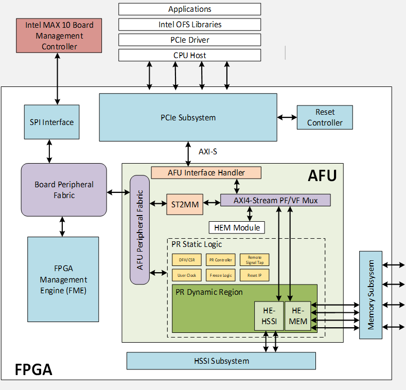
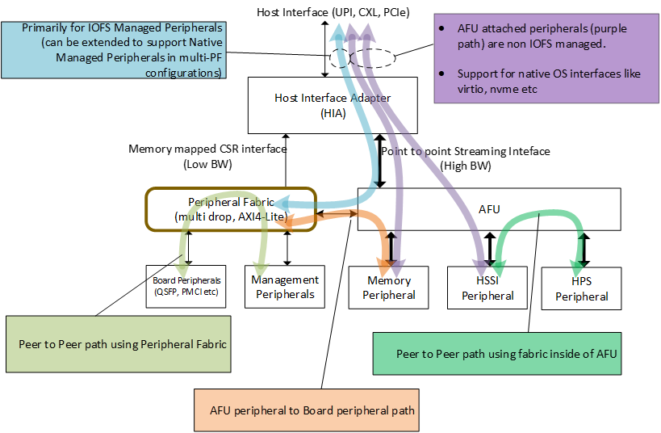
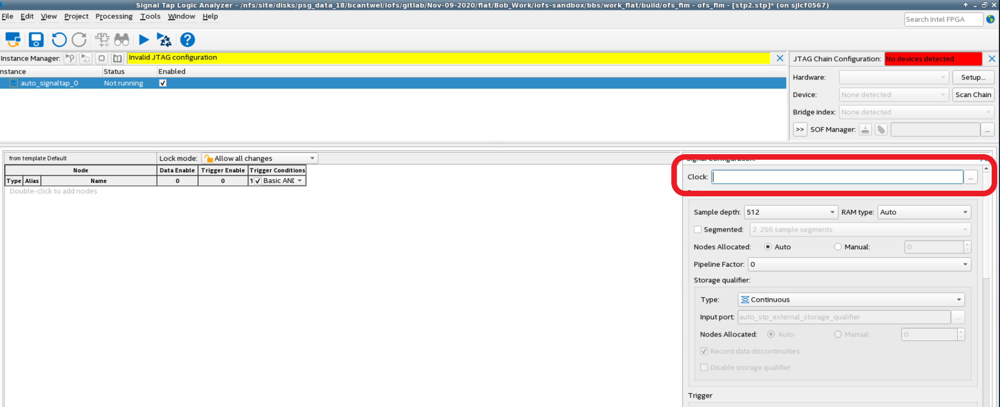
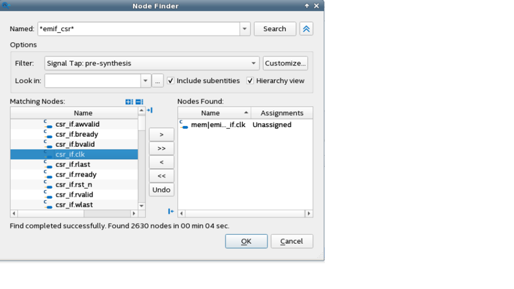
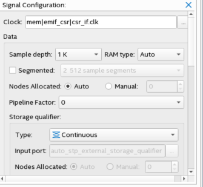

<h1>Intel<sup>&reg;</sup> FPGA Interface Manager Developer Guide: Open FPGA Stack for Intel Stratix 10</h1>

- [1. Introduction](#1-introduction)
  - [1.1. About This Document](#11-about-this-document)
    - [1.1.1. Terminology](#111-terminology)
  - [1.2. Release Capabilities](#12-release-capabilities)
  - [1.3. Prerequisites](#13-prerequisites)
    - [1.3.1. Base Knowledge and Skills Prerequisites](#131-base-knowledge-and-skills-prerequisites)
    - [1.3.2. Development Environment](#132-development-environment)
- [2. High Level Description](#2-high-level-description)
  - [2.1. FPGA Interface Manager Overview](#21-fpga-interface-manager-overview)
  - [2.2. FIM FPGA Resource Usage](#22-fim-fpga-resource-usage)
  - [2.3. OFS Directory Structure](#23-ofs-directory-structure)
- [3. Description of Sub-Systems](#3-description-of-sub-systems)
  - [3.1. Host Control and Data Flow](#31-host-control-and-data-flow)
- [4. FIM Development Flow](#4-FIM-development-flow)
  - [4.1. Installation of OFS](#41-installation-of-ofs)
  - [4.2. Compiling OFS FIM](#42-compiling-ofs-fim)
      - [4.2.1. Setting Up Required Environment Variables](#421-setting-up-required-environment-variables)
      - [4.2.2. Compiling](#422-compiling)
      - [4.2.3. Relocatable PR Directory Tree](#423-relocatable-pr-directory-tree)
      - [4.2.4. Unit Level Simulation](#424-unit-level-simulation)
         - [4.2.4.1. DFH Walking Unit Simulation Output](#4241-dfh-walking-unit-simulation-output)
   - [4.3. Compiling the OFS FIM using Eval Script](#43-compiling-the-ofs-fim-using-eval-script)
   - [4.4. Debugging](#44-debugging)
    - [4.4.1. Signal Tap Prerequisites](#441-signal-tap-prerequisites)
    - [4.4.2. Adding Signal Tap](#442-adding-signal-tap)
    - [4.4.3. Signal Tap trace acquisition](#443-signal-tap-trace-acquisition)
- [5. FIM Modification Example](#5-fim-modification-example)
    - [5.1. Hello FIM example](#51-hello-fim-example)
      - [5.1.1. src/fims/iofs_top.sv](#511-srctopiofs_topsv)
      - [5.1.2. ipss/emif/emif_csr.sv](#512-ipssmememif_csrsv)
      - [5.1.3. src/hello_fim/hello_fim_top.sv](#513-srchello_fimhello_fim_topsv)
      - [5.1.4. src/hello_fim/hello_fim_com.sv](#514-srchello_fimhello_fim_comsv)
      - [5.1.5. Unit Level Simulations](#515-unit-level-simulations)
      - [5.1.6. syn/syn_top/d5005.qsf](#516-synsyn_topd5005qsf)
      - [5.1.7. syn/setup/hello_fim_design_files.tcl](#517-synsetuphello_fim_design_filestcl)
      - [5.1.8. Build hello_fim example](#518-build-hello_fim-example)
      - [5.1.9. Test the hello_fim on a D5005](#519-test-the-hello_fim-on-a-d5005)
    - [5.2. Memory Subsystem modification](#52-Memory-Subsystem-Modification)
- [6 Conclusion](#6-conclusion)
# 1. Introduction
## 1.1. About This Document

This document serves as a design guide for FPGA developers, system architects and hardware developers using OFS as a starting point for the creating the FPGA Interface Manager (FIM) for a custom FPGA acceleration board or Platform with Intel FPGAs.

This development guide is organized as follows: 

* Introduction
* Top Level Block Diagram description
  * Control and data flow
* Description of Subsystems
  * Command/status registers (CSR) and software interface
  * Clocking, resets and interfaces
  * High speed interface (HSSI)
  * External attached memory
* High Level development flow description
  * Installation of OFS RTL and development packages
  * Compiling FIM
  * Simulation  
* Demonstration steps illustrating how to change areas of the design
* Debugging using JTAG

This document uses the Intel Programmable Acceleration Card (PAC) D5005 as an example platform to illustrate key points and demonstrate how to extend the capabilities provided in OFS (Open FPGA Stack) to custom platforms. The demonstration steps serves as a tutorial for the development of your OFS knowledge.

This document covers OFS architecture lightly.  For more details on the OFS architecture, please see [*Open FPGA Stack Technical Reference Manual*](https://github.com/OFS/ofs.github.io/blob/main/hw/d5005/reference_manuals/ofs_fim/mnl_fim_ofs_d5005.md).

You are encouraged to read [*OFS AFU Development Guide*](https://github.com/OFS/ofs.github.io/blob/main/hw/d5005/dev_guides/afu_dev/ug_dev_afu_d5005.md) to fully understand how AFU Developers will use your newly developed FIM.


### 1.1.1. **Terminology**
<a name="terminology"></a>

<table>
<caption><p><span id="Table-1-1" class="anchor"></span>Table 1-1: Terminology</p></caption>
<colgroup>
<col style="width: 13%" />
<col style="width: 86%" />
</colgroup>
<thead>
<tr class="header">
<th>Term</th>
<th>Definition</th>
</tr>
</thead>
<tbody>
<tr class="odd">
<td>ADP</td>
<td><strong>A</strong>cceleration <strong>D</strong>evelopment <strong>P</strong>latform: FPGA based Acceleration platform</td>
</tr>
<tr class="even">
<td>PAC</td>
<td><strong>P</strong>rogrammable <strong>A</strong>cceleration <strong>C</strong>ard: FPGA based Accelerator card</td>
</tr>
<tr class="odd">
<td>BMC</td>
<td><strong>B</strong>oard <strong>M</strong>anagement<strong>C</strong>ontroller. Distinct from the server BMC. Acts as the Root of Trust (RoT) on the Intel FPGA ADP platform. Supports features such as power sequence management and board monitoring through on-board sensors.</td>
</tr>
<tr class="even">
<td>BKC</td>
<td><strong>B</strong>est <strong>K</strong>nown <strong>C</strong>onfiguration</td>
</tr>
<tr class="odd">
<td>OFS</td>
<td><strong>O</strong>pen <strong>F</strong>PGA <strong>S</strong>tack: A modular collection of hardware platform components, open-source software, and broad ecosystem support that provides a standard and scalable model for AFU and software developers to optimize and reuse their designs.</td>
</tr>
<tr class="even">
<td>FME</td>
<td><strong>F</strong>PGA <strong>M</strong>anagement <strong>E</strong>ngine. Provides a way to manage the platform and enable acceleration functions on the platform.</td>
</tr>
<tr class="odd">
<td>FIM</td>
<td><strong>F</strong>PGA <strong>I</strong>nterface <strong>M</strong>anager. Provides platform management, functionality, clocks, resets and standard interfaces to host and AFUs.  The FIM resides in the static region of the FPGA and contains the FPGA Management Engine (FME) and I/O ring.</td>
</tr>
<tr class="even">
<td>JTAG</td>
<td><strong>J</strong>oint <strong>T</strong>est <strong>A</strong>ction <strong>G</strong>roup: Refers to the IEEE 1149.1 JTAG standard; Another FPGA configuration methodology.</td>
</tr>
<tr class="odd">
<td>AFU</td>
<td><strong>A</strong>ccelerator <strong>F</strong>unctional <strong>U</strong>nit. A hardware Accelerator implemented in FPGA logic which offloads a computational operation for an application from the CPU to improve performance.  Note: An AFU region is the part of the design where an AFU may reside.  This AFU may or may not be a partial reconfiguration region.</em></td>
</tr>
<tr class="even">
<td>RSU</td>
<td>A <strong>R</strong>emote <strong>S</strong>ystem <strong>U</strong>pdate operation sends an instruction to the ADP device that triggers a power cycle of the card only, forcing
reconfiguration.</td>
</tr>
<tr class="odd">
<td>DFL</td>
<td><strong>D</strong>evice <strong>F</strong>eature <strong>L</strong>ist. A concept inherited from Intel OFS. The DFL drivers provide support for FPGA devices that are designed to support the Device Feature List. The DFL, which is implemented in RTL, consists of a self-describing data structure in PCI BAR space that allows the DFL driver to automatically load the drivers required for a given FPGA configuration.</td>
</tr>
<tr class="even">
<td>PR</td>
<td><strong>P</strong>artial <strong>R</strong>econfiguration allows for a portion of the FPGA to change its configuration. while the other parts of the FPGA configuration stay intact</td>
</tr>
<tr class="odd">
<td>OPAE</td>
<td><strong>O</strong>pen <strong>P</strong>rogrammable <strong>A</strong>cceleration <strong>E</strong>ngine is a software framework for managing and accessing programmable accelerators (FPGAs)</td>
</tr>
<tr class="even">
<td>PIM</td>
<td><strong>P</strong>latform <strong>I</strong>nterface <strong>M</strong>anager An interface manager that comprises two components: a configurable platform specific interface for board developers and a collection of shims that AFU developers can use to handle clock crossing, response sorting, buffering and different protocols.</td>
</tr>
</tbody>
</table>

## 1.2. Introduction

Open FPGA Stack (OFS) addresses the scalability for FPGA acceleration boards and workloads by providing a powerful and systematic methodology for the rapid development of FPGA-based Acceleration systems.  This methodology addresses the key challenges of hardware, software and workload developers by providing a complete FPGA project consisting of RTL and simulation code, build scripts and software. The FPGA project released in OFS can be rapidly customized to meet new market requirements by adding new features, custom IPs and Intel interface subsystems IPs. 

A high-level overview of the Intel OFS Stratix 10 hardware architecture on the Stratix 10 reference platform, Intel FPGA PAC D5005 is shown in the below figure. The provided FPGA architecture is divided into two main components 
   - The outer area in white, the FPGA Interface manager (or FIM)
   - The inner area in green, the Acceleration Function Unit or AFU Region. 

The outer area, the FIM, provides the core infrastructure and interfaces within the FPGA. The AFU region is where a user’s custom logic would reside for their specific workload. 
  * FPGA external interfaces and IP cores (e.g. Ethernet, DDR-4, PCIe, etc)
  * PLLs/resets
  * FPGA - Board management infrastructure
  * Interface to Acceleration Function Unit (AFU)

The AFU region has both static and dynamic partial reconfiguration regions enabling a lot of customization. 
  * Uses the FIM interfaces to perform useful work inside the FPGA
  * Contains logic supporting partial reconfiguration
  * Remote Signal Tap core for remote debugging of workload

Outside of the FPGA is the Board Management Controller which provides board management, root of trust, board monitoring, and remote system updates. 

The overall architecture is built to be very composable and modular in blocks that can be modified while leaving the rest of the infrastructure intact so you may only need to modify a few of these blocks. 

<p style="text-align: center;">

## 1.2. Release Capabilities

This release of OFS FIM supports the following key features:

- 1 - Host channel interface via PCIe Gen 3 x 16 SRIOV (1PF, 3 VF, AXI-S TLP packets)
- DDR4 SDRAM External memory interface (AXI-M)
- 1 - 10G Ethernet interfaces (1x10G)
- MSI-X Interrupts (PF, VF)
- 1 - AFU
- Exercisers demonstrating PCIe, external memory and Ethernet interfaces
- Port, FME CSR
- Remote Signal Tap

OFS is extensible to meet the needs of a broad set of customer applications, however not all use cases are easily served.  The general uses cases listed below are examples where the OFS base design can be easily re-used to build a custom FIM:
1. Use OFS reference design as-is
    - Porting the code to another platform that is identical to the OFS reference platform only changing target FPGA device and pinout
    - Change I/O assignments without changing design
2. Update the configuration of peripheral IP in OFS reference design, not affecting FIM architecture
    - External memory settings
    - HSSI analog settings
3. Remove/update peripheral feature in OFS reference design, not affecting FIM architecture
    - External memory speed/width change
    - Change 10G Ethernet to 25 or 100G Ethernet IP
    - Change number of VFs supported
4. Add new features as an extension to OFS reference design, not affecting FIM architecture
    - Add/remove external memory interface to the design
    - Add/remove user clocks for AFU
    - Add/remove IP to the design with connection to AFU

More advanced use cases requiring changes or additions to the host PCIe channel are not easily supported with this release of the OFS FIM.

Reuse of the provided host management FPGA logic and software is the fastest and most simple approach to FIM customization.
## 1.3. Prerequisites

### 1.3.1. Base Knowledge and Skills Prerequisites

OFS is an advanced application of FPGA technology. This guide assumes you have the following FPGA logic design-related knowledge and skills:

- FPGA compilation flows using Intel<sup>&reg;</sup> Quartus<sup>&reg;</sup> Prime Pro Edition design flow.
- Static Timing closure, including familiarity with the Timing Analyzer tool in Intel<sup>&reg;</sup> Quartus<sup>&reg;</sup> Prime Pro Edition, applying timing constraints, Synopsys* Design Constraints (.sdc) language and Tcl scripting, and design methods to close on timing critical paths.
- RTL and coding practices for FPGA implementation.
- RTL simulation tools.
-  Intel<sup>&reg;</sup> Quartus<sup>&reg;</sup> Prime Pro Edition Signal Tap Logic Analyzer tool software.

### 1.3.2. Development Environment

To run the tutorial steps in this guide requires this development environment:

| Item                          | Version         |
| ------------------------- | ---------- |
| Intel Quartus Prime Pro   | Intel Quartus Prime Pro 22.3 (with license patch) |
| Target D5005 Sever Operating System   |  Red Hat RHEL 8.2  (Windows is not supported)   |
| OPAE SDK   | https://github.com/OFS/opae-sdk/releases/tag/2.3.0-1    |
| Linux DFL    | https://github.com/OFS/linux-dfl/releases/tag/ofs-2022.3-1   | 
| Simulator  | Synopsys VCSMX S-2021.09-SP1 or newer for UVM simulation of top level FIM  |
| Python    | 3.6.8 or newer  |
| cmake     | 3.11.4 or newer |
| GCC       | 7.2.0 or newer  |
| perl      | 5.8.8 or newer  |

The following server and Intel PAC card are required to run the examples in this guide:

1. Qualified Intel Xeon <sup>&reg;</sup> server see [Qualified Servers](https://www.intel.in/content/www/in/en/products/details/fpga/platforms/pac/d5005/view.html)
2. Intel FPGA PAC D5005 with root entry hash erased (Please contact Intel for root entry hash erase instructions).  The standard PAC D5005 card is programmed to only allow the FIM binary files signed by Intel to be loaded.  The root entry hash erase process will allow newly created, unsigned FIM binary files to be loaded.
3. Intel FPGA PAC D5005 installed in the qualified server following instructions in [OFS Getting Started User Guide](https://github.com/OFS/ofs.github.io/blob/main/hw/d5005/user_guides/ug_qs_ofs_d5005/ug_qs_ofs_d5005.md)

The steps included in this guide have been verified in the Dell R740 and HPE ProLiant DL380 Gen10 servers.
# 2. High Level Description

The FIM targets operation in the Intel PAC D5005 card.  The block diagram of the D5005 is shown below:

<p style="text-align: center;">

The key D5005 FPGA interfaces are:

- Host interface 
    - PCIe Gen3 x 16
- Network interface
  - 2 - QSFP28 cages
  - Current FIM supports 1 x 10 GbE, other interfaces can be created  
- External Memory
  - 2 or 4 channels of DDR4-2400 to RDIMM modules
  - RDIMM modules =  8GB organized as 1 Gb X 72
- Board Management
  - SPI interface
  - FPGA configuration
  
## 2.1. FPGA Interface Manager Overview

The FPGA Interface Manager architecture is shown in the below diagram:

<p style="text-align: center;">

The FIM consists of the following components
   - PCIe Subsystem
   - Memory Subsystem
   - HSSI Subsystem
   - Platform Management Component Intercommunications (PMCI) 
   - Board Peripheral Fabric (BPF) 
   - AFU Peripheral Fabric (APF)
   - Port Gasket
   - AXI-S PF/VF Demux/Mux
   - Host Exerciser Modules - HE-MEM, HE-LB, HE-HSSI
   - FPGA Management Engine (FME)


## 2.2. FIM FPGA Resource Usage

The FIM uses a small portion of the available FPGA resources.  The table below shows resource usage for a base FIM built with 2 channels of external memory, a small AFU instantiated that has host CSR read/write, external memory test and Ethernet test functionality.
| Entity         | ALMs Used | % ALMS Used | M20Ks  | % M20Ks used | DSP Blocks | Pins | IOPLLs |
|----------------|-----------|-------------|--------|--------------|------------|------|--------|
| OFS_top        | 125009.4  | 13.0%       | 661    | 5.4%         | 0          | 630  | 15      |
| afu_top        | 70522.7  | 7.0%        | 228    | 2.4%         | 0          | 0    | 1      |
| auto_fab_0     | 1305.7    | 0.0%        | 9      | 0.1%         | 0          | 0    | 0      |
| bpf_rsv_5_slv  | 0.6         | 0.0%        | 0      | 0.0%         | 0          | 0    | 0      |
| bpf_rsv_6_slv  | 0.6       | 0.0%        | 0      | 0.0%         | 0          | 0    | 0      |
| bpf_rsv_7_slv  | 0.4         | 0.0%        | 0      | 0.0%         | 0          | 0    | 0      |
| bpf            | 241.9     | 0.0%        | 0      | 0.0%         | 0          | 0    | 0      |
| emif_top_inst  | 10508.6    | 1.0%        | 0      | 0.0%         | 0          | 0    | 12      |
| eth_ac_wrapper | 6024.8       | 0.5%        | 9      | 0.1%         | 0          | 0    | 0      |
| fme_top        | 615.5   | 0.2%        | 7      | 0.1%         | 0          | 0    | 0      |
| pcie_wrapper   | 35424.7    | 3.5%        | 348    | 2.9%         | 0          | 0    | 1     |
| pmci_top       | 318.5     | 0.1%        | 0      | 0.0%         | 0          | 0    | 0      |
| rst_ctrl       | 40.2      | 0.0%        | 0      | 0.0%         | 0          | 0    | 0      |
| sys_pll        | 0.5       | 0.0%        | 0      | 0.0%         | 0          | 0    | 1      |
|                |           |             |        |              |            |      |        |
|                |           |             |        |              |            |      |        |
| Total ALMS     | 933,120   |             |        |              |            |      |        |
| Total M20Ks    | 11,721    |             |        |              |            |      |        |


| Summary                          | FPGA Resource Utilization        |
|----------------------------------|----------------------------------|
| Logic utilization (in ALMs)      | 124,092 / 933,120 ( 13 % )       |
| Total dedicated logic registers  | 282822                           |
| Total pins                       | 630 / 912 ( 69 % )               |
| Total block memory bits          | 3,425,120 / 240,046,080 ( 1 % )  |
| Total RAM Blocks                 | 661 / 11,721 ( 6 % )             |
| Total DSP Blocks                 | 0 / 5,760 ( 0 % )                |
| Total eSRAMs                     | 0 / 75 ( 0 % )                   |
| Total HSSI P-Tiles               | 17 / 48 ( 35 % )                 |
| Total HSSI E-Tile Channels       | 17 / 48 ( 35 % )                 |
| Total HSSI HPS                   | 0 / 1 ( 0 % )                    |
| Total HSSI EHIPs                 | 0 / 2 ( 0 % )                    |
| Total PLLs                       | 36 / 104 ( 35 % )                |


##  2.3. OFS Directory Structure

The OFS Git OFS repository ofs-d5005 directory structure is shown below:
```bash session
├── eval_script
|   ├── ofs_d5005_eval.sh
|   └── README_ofs_d5005_eval.txt
├── ipss
│   ├── hssi
|   ├── mem
|   ├── pcie
|   ├── pmci
|   ├── spi
|   └── README.md
├── license
│   └── quartus-0.0-0.01Intel OFS-linux.run
├── ofs-common
|   ├── scripts
|   ├── src
|   ├── verification
|   ├── LICENSE.txt
|   └── README.md
├── sim
|   ├── bfm
|   ├── rp_bfm
│   ├── scripts
|   ├── unit_test 
│   └── readme.txt
├── src
│   ├── afu_top
│   ├── includes
│   ├── pd_qsys
│   ├── README.md
│   └── top
├── syn
│   ├── scripts
│   ├── setup
│   ├── syn_top
│   ├── readme.txt
│   └── README
└── verification
|   ├── scripts
|   ├── regress_d5005.pl
|   └── README.d5005
├── LICENSE.txt
└── README.md
```

The contents of each directory are described below:

**Eval Script** - Contains scripts for evaluation of OFS for D5005 including compiling FIM/AFU from source, unit level test, UVM verification. Also includes resources to report and setup D5005 development environment

**ipss** - Contains the code and supporting files that define or set up the IP subsystems (HSSI, PCIe, memory, PMCI, SPI, etc...) contained in the D5005 FPGA Interface Manager (FIM).   

**license** - License file for the Low Latency 10Gbps Ethernet MAC (6AF7 0119) IP core.

**ofs-common** - This directory contains resources that may be used across the board-specific repositories. This directory is referenced via a link within each of the FPGA-specific repositories.

**sim** - Contains the testbenches and supporting code for all the unit test simulations. 
   - Bus Functional Model code is contained here.
   - Scripts are included for automating a myriad of tasks.
   - All of the individual unit tests and their supporting code is also located here.

**src** - SystemVerilog source and script files  
   - Contains all of the structural and behavioral code for the FIM.
   - Scripts for generating the AXI buses for module interconnect.
   - Top-level RTL for synthesis is located in this directory.
   - Accelerated Functional Unit (AFU) infrastructure code is contained in this directory.

**syn** - This directory contains all of the scripts, settings, and setup files for running synthesis on the FIM.

**verification**  - This directory contains all of the scripts, testbenches, and test cases for the supported UVM tests for the D5005 FIM.


# 3. Description of Sub-Systems

## 3.1. Host Control and Data Flow
The host control and data flow are shown in the diagram below:

<p style="text-align: center;">

The control and data flow is composed of the following:

* Host Interface Adapter (PCIe)
* Low Performance Peripherals
  * Slow speed peripherals (I2C, Smbus, etc)
  * Management peripherals (FME)

* High Performance Peripherals
  * Memory peripherals
  * Acceleration Function peripherals
  * HPS Peripheral

* Fabrics
   * Peripheral Fabric (multi drop)
   * AFU Streaming fabric (point to point)

Peripherals are connected to one another using AXI:

* Via the peripheral fabric (AXI4-Lite, multi drop)
* Via the AFU streaming fabric (AXI-S, point to point)

Peripherals are presented to software as:

* OFS managed peripherals that implement DFH CSR structure.  
* Native driver managed peripherals (i.e. Exposed via an independent PF, VF)

The peripherals connected to the peripheral fabric are primarily Intel OPAE managed resources, whereas the peripherals connected to the AFU are “primarily” managed by native OS drivers. The word “primarily” is used since the AFU is not mandated to expose all its peripherals to Intel OPAE. It can be connected to the peripheral fabric, but can choose to expose only a subset of its capability to Intel OPAE.

OFS uses a defined set of CSRs to expose the functionality of the FPGA to the host software.  These registers are described in [*Open FPGA Stack Reference Manual - MMIO Regions section](https://github.com/OFS/ofs.github.io/blob/main/hw/d5005/reference_manuals/ofs_fim/mnl_fim_ofs_d5005.md#mmio_regions).

If you make changes to the FIM that affect the software operation, then OFS provides a mechanism to communicate that information to the proper software driver.  The [Device Feature Header (DFH) structure](https://github.com/OFS/ofs.github.io/blob/main/hw/d5005/reference_manuals/ofs_fim/mnl_fim_ofs_d5005.md#dfh_structure) provides a mechanism to maintain compatibility with OPAE software.  Please see [FPGA Device Feature List (DFL) Framework Overview](https://github.com/OPAE/linux-dfl/blob/fpga-ofs-dev/Documentation/fpga/dfl.rst#fpga-device-feature-list-dfl-framework-overview) for an excellent description of DFL operation from the driver perspective.

When you are planning your address space for your FIM updates, please be aware that the OFS FIM targeting Intel FPGA PAC D5005, 256KB of MMIO region is allocated for external FME features and 128kB of MMIO region is allocated for external port features. Each external feature must implement a feature DFH, and the DFH needs to be placed at 4KB boundary. The last feature in the external feature list must have the EOL bit in its DFH set to 1 to mark the end of external feature list.  Since the FPGA address space is limited, consider using an indirect addressing scheme to conserve address space.

# 4. FIM Development Flow

OFS provides a framework of FPGA synthesizable code, simulation environment, and synthesis/simulation scripts.  FIM designers can take the provided code and scripts and modify existing code or add new code to meet their specific product requirements.

FIM development for a new acceleration card consists of the following steps:

1. Installation of OFS and familiarization with scripts and source code
1. Development of high-level block diagram with your specific functionality
    1. Determination of requirements and key performance metrics
    1. Selection of IP cores
    1. Selection of FPGA device
    2. Software memory map
2. Selection and implementation of FIM Physical interfaces including:
    1. External clock sources and creation of internal PLL clocks
    2. General I/O
    3. Transceivers
    4. External memories
    5. FPGA programming methodology
3. Device physical implementation
    1. FPGA device pin assignment
    2. Inclusion of logic lock regions
    3. Creation of timing constraints
    4. Create Quartus FIM test project and validate:
        1. Placement
        2. Timing constraints
        3. Build script process
        4. Review test FIM FPGA resource usage
4. Select FIM to AFU interfaces and development of PIM
5. FIM design implementation
    1. RTL coding
    2. IP instantiation
    3. Development of test AFU to validate FIM
    4. Unit and device level simulation
    5. Timing constraints and build scripts
    6. Timing closure and build validation
6. Creation of FIM documentation to support AFU development and synthesis
7. Software Device Feature discovery
8. Hardware/software integration, validation and debugging
9.  High volume production preparation

The FIM developer works closely with the hardware design of the target board, software development and system validation.

Understanding how the AFU developer utilizes the FIM is important for FIM development success.  Please read [*OFS AFU Development Guide*](https://github.com/OFS/ofs.github.io/blob/main/hw/d5005/dev_guides/afu_dev/ug_dev_afu_d5005.md) for a detailed description of AFU development.

## 4.1. Installation of OFS

In this section you set up a development machine for compiling the OFS FIM. These steps are separate from the setup for a deployment machine where the FPGA acceleration card is installed.  Typically, FPGA development and deployment work is performed on separate machines, however, both development and deployment can be performed on the same server if desired.  Please see [*OFS Getting Started User Guide*](https://github.com/OFS/ofs.github.io/blob/main/hw/d5005/user_guides/ug_qs_ofs_d5005/ug_qs_ofs_d5005.md) for instructions on installing software for deployment of your FPGA FIM, AFU and software application on a server.  

Building the OFS FIM requires the development machine to have at least 64 GB of RAM.

The following is a summary of the steps to set up for FIM development:

1. Install Quartus Prime Pro 22.3 Linux and setup environment
2. Clone the github `ofs-d5005` repository
3. Test installation by building the provided FIM

Intel Quartus Prime Pro version 22.3 is the currently verified version of Quartus used for building the FIM and AFU images for this release.  Porting to newer versions of Quartus may be performed by developers.  Download Quartus Prime Pro Linux version 22.3 from <https://www.intel.com/content/www/us/en/software-kit/746666/intel-quartus-prime-pro-edition-design-software-version-22-3-for-linux.html>.

After running the Quartus Prime Pro installer, set the PATH environment variable to make utilities `quartus`, `jtagconfig`, and `quartus_pgm` discoverable. Edit your bashrc file `~/.bashrc` to add the following line:

```bash session
export PATH=$PATH:<Quartus install directory>/quartus/bin
```

For example, if the Quartus install directory is /home/intelFPGA_pro/22.3 then the new line is:

```bash session
export PATH=$PATH:/home/intelFPGA_pro/22.3/quartus/bin
```

Verify, Quartus is discoverable by opening a new shell:

```bash session
which quartus
## Output
/home/intelFPGA_pro/22.3/quartus/bin/quartus
```
Note, for some Linux distributions such as Red Hat 8.2, Quartus requires installation of the following libraries:
```bash session
sudo dnf install libnsl
sudo dnf install ncurses-compat-libs
sudo ln -s /usr/bin/python3 /usr/bin/python
```

You will need to obtain a license for Quartus Pro to compile the design.  This license is obtained from Intel.  Additionally, OFS for Stratix 10 requires a license for the Low Latency 10Gbps Ethernet MAC (6AF7 0119) IP core.  This license is required to generate a programming file using the provided OFS source code.  The Low Latency 10Gbps Ethernet MAC (6AF7 0119) IP core license patch installer is provided in the ofs-d5005 git repository in the /license directory.  After cloning the OFS release in step 4 below, you can install this IP license.  


3. Install git and install git lfs to extract large files within the repository that are compressed with git lfs.  Please note, for proper operation of files retrieved from OFS repository, you will require git lfs. 

```bash session
sudo dnf install git
```
   ## Install git lfs:
```bash session
curl -s https://packagecloud.io/install/repositories/github/git-lfs/script.rpm.sh | sudo bash
sudo dnf install git-lfs
git lfs install
```

4. Retrieve OFS repositories:

The OFS FIM source code is included in the GitHub repository. Create a new directory to use as a clean starting point to store the retrieved files.  

1. Navigate to location for storage of OFS source, create the top-level source directory and clone OFS repositories.

```bash session
mkdir OFS_fim_build_root
cd OFS_fim_build_root
export OFS_BUILD_ROOT=$PWD
git clone --recurse-submodules  https://github.com/OFS/ofs-d5005.git
cd ofs-d5005
git checkout tags/ofs-d5005-1.0.0-rc3
```
Verify proper tag is selected:

```bash session   
git describe --tags
ofs-d5005-1.0.0-rc3
```
2. Install the Low Latency 10Gbps Ethernet MAC (6AF7 0119) IP license by running provided license installer.

```bash session
cd license
chmod +x quartus-0.0-0.01Intel OFS-linux.run
sudo ./quartus-0.0-0.01Intel OFS-linux.run
```

3. Verify patch installed
```bash session
quartus_sh --version
##Output
Quartus Prime Shell
Version 22.3.0 Build 104 09/14/2022 Patches 0.01Intel OFS SC Pro Edition
```

## 4.2. Compiling OFS FIM

OFS provides a build script with the following FPGA image creation options:

* Flat compile which combines the FIM and AFU into one FPGA image that is loaded into the entire FPGA device

* A PR compile which creates a FPGA image consisting of the FIM that is loaded into the static region of the FPGA and a default AFU that is loaded into dynamic region. Additional AFUs maybe loaded into the dynamic region using partial reconfiguration.

The build scripts included with OFS are verified to run in a bash shell. Other shells have not been tested. Each build script step will take several hours to complete.s Please note, building directly in Quartus GUI is not supported - you must build with the provided scripts.

The following sections describe how to set up the environment and build the provided FIM and AFU. Follow these steps as a tutorial to learn the build flow. You will use this environment and build scripts for the creation of your specialized FIM.

### 4.2.1. Setting Up Required Environment Variables
Set required environment variables as shown below. These environment variables must be set prior to simulation or compilation tasks so creating a simple script to set these variables saves time.

```bash session
cd $OFS_BUILD_ROOT/ofs-d5005
export OFS_ROOTDIR=$PWD

##   *Note, OFS_ROOTDIR is the directory where you cloned the repo, e.g. /home/MyProject/ofs-d5005 *

export WORKDIR=$OFS_ROOTDIR
export VERDIR=$OFS_ROOTDIR/verification
export QUARTUS_HOME=$QUARTUS_ROOTDIR

##   *Note, QUARTUS_ROOTDIR is your Quartus installation directory, e.g. $QUARTUS_ROOTDIR/bin contains Quartus executuable*

export QUARTUS_INSTALL_DIR=$QUARTUS_ROOTDIR
export IMPORT_IP_ROOTDIR=$QUARTUS_ROOTDIR/../ip
export IP_ROOTDIR=$QUARTUS_ROOTDIR/../ip
export OPAE_SDK_REPO_BRANCH=release/2.3.0
```

### 4.2.2. Compiling

The usage of the compile build script is shown below:
```bash session
ofs-common/scripts/common/syn/build_top.sh [-p] target_configuration work_dir 
Usage: ofs-common/scripts/common/syn/build_top.sh [-k] [-p] <build target> [<work dir name>]

  Build a FIM instance specified by <build target>. The target names an FPGA architecture, board and configuration.

  The FIM is built in <work dir name>. If not specified, the target is ${OFS_ROOTDIR}/work.

  The -k option preserves and rebuilds within an existing work tree instead of overwriting it.

  When -p is set, if the FIM is able then a partial reconfiguration template tree is generated at the end of the FIM build. The PR template tree is located in the top of the work directory but is relocatable
  and uses only relative paths. See syn/common/scripts/generate_pr_release.sh for details.

  The -e option runs only Quartus analysis and elaboration.

      * target_configuration - Specifies the project  
         For example: d5005
  
      * work_dir - Work Directory for this build in the form a directory name. It is created in the <local repo directory>/ofs-d5005/<work_dir> 
          - NOTE: The directory name must start with "work".  If the work directory exists, then the script stops and asks if you want to overwrite the directory.
            - e.g.
                - ofs-common/scripts/common/syn/build_top.sh d5005 work_d5005
                
                work directory as a name will be created in <local repo directory>/ofs-d5005/work_d5005

                
                The obmission of <work_dir> results in a default work directory (<local repo  directory>/ofs-d5005/work)

        - compile reports and artifacts (.rpt, .sof, etc) are stored in <work_dir>/syn/syn_top/output_files
  
        - There is a log file created in ofs-d5005 directory.  
        - [-p]  Optional switch for creation of a relocatable PR build tree supporting the creation of a PR-able AFU workload.   
        The "-p" switch invokes generate_pr_release.sh at the end of the FIM build and writes the PR build tree to the top of the work directory.  More information on this option is provided below. 
```
In the next example, you will build the provided example design using a flat, non-PR build flow.


 Build the provided base example design:

 ```bash session
cd $OFS_BUILD_ROOT/ofs-d5005
    
ofs-common/scripts/common/syn/build_top.sh d5005 work_d5005
 ```

```bash session
    ... build takes ~5 hours to complete

Compile work directory:     <$OFS_BUILD_ROOT>/work_d5005/syn/syn_top
Compile artifact directory: <$OFS_BUILD_ROOT>/work_d5005/syn/syn_top/output_files


***********************************
***
***        OFS_PROJECT: d5005
***        Q_PROJECT:  d5005
***        Q_REVISION: d5005
***        SEED: 03
***        Build Complete
***        Timing Passed!
***
***********************************
```
The build script copies the ipss, sim, src and syn directories to the specified work directory and then these copied files are used in the Quartus compilation process.  Do not edit the files in the work directory, these files are copies of source files.

Some of the key files are described below:

<work_dir>/syn/syn_top == 
```bash session
├── syn_top                    // D5005 Quartus build area with Quartus files used this build
│  ├── d5005.ipregen.rpt       // IP regeneration report states the output of IP upgrade
│  ├── d5005.qpf               // Quartus Project File (qpf) mentions about Quartus version and project revision
│  ├── d5005.qsf               // Quartus Settings File (qsf) lists current project settings and entity level assignments
│  ├── d5005.stp               // Signal Tap file included in the d5005.qsf. This file can be modified as required if you need to add an Signal Tap instance
│  ├── fme_id.mif              // the fme id hex value is stored in a mif file format
│  ├── Intel OFS_pr_afu.json        // PR JSON file
│  ├── Intel OFS_pr_afu.qsf                // PR AFU qsf file
│  ├── Intel OFS_pr_afu_sources.tcl        // AFU source file list
│  ├── ip_upgrade_port_diff_reports   // IP upgrade report files for reference
```
<work_dir>/syn/syn_top/output_files == Directory with build reports and FPGA programming files. 

The programming files consist of the Quartus generated d5005.sof and d5005.pof.  The D5005 board hardware provides a 2 Gb flash device to store the FPGA programming files and a MAX10 BMC that reads this flash and programs the D5005 Stratix 10 FPGA. The syn/build_top.sh script runs script file syn/syn_top/build_flash/build_flash.s which takes the Quartus generated d5005.sof and creates binary files in the proper format to be loaded into the 2 Gb flash device.  You can also run build_flash.sh by yourself if needed.  The build_flash  script runs PACSign (if installed) to create an unsigned FPGA programming file that can be stored in the D5005 FPGA flash. Please note, if the D5005 has the root entry hash key loaded, then PACsign must be run with d5005_page1.bin as the input with the proper key to create an authenticated FPGA binary file.  Please see [Security User Guide: Intel® Open FPGA Stack for Intel® Stratix 10 FPGA](https://github.com/OFS/ofs.github.io/blob/main/hw/d5005/user_guides/ug_security_ofs_d5005/ug-pac-security-d5005.md) for details on the security aspects of Intel® Open FPGA Stack.

The following table provides further detail on the generated bin files.

| File            | Description                        |
|-----------------|------------------------------------|
| d5005.sof | This is the Quartus generated programming file created by Quartus synthesis and place and route.  This file can be used to programming the FPGA using a JTAG programmer.  This file is used as the source file for the binary files used to program the FPGA flash. |
| d5005.bin |  This is an intermediate raw binary image of the FPGA  |
| d5005_page1.bin | This is the binary file created from input file, d5005.sof.  This file is used as the input file to the PACSign utility to generate **d5005_page1_unsigned.bin** binary image file. |
| d5005_page1_unsigned.bin | This is the unsigned PACSign output which can be programmed into the FPGA flash of an unsigned D5005 usign the OPAE SDK utility **fpgasupdate**  |
| mfg_d5005_reversed.bin | A special programming file for a third party programming device used in board manufacturing.  This file is typically not used.|


build/output_files/timing_report == Directory containing clocks report, failing paths and passing margin reports

### 4.2.3. Relocatable PR Directory Tree

If you are developing a FIM to be used by another team developing the AFU workload, scripts are provided that create a relocatable PR directory tree. ODM and board developers will make use of this capability to enable a broad set of AFUs to be loaded on a board using PR.  The relocatable PR directory contains the Quartus *.qdb file that goes the FIM.

The creation of the relocatable PR directory tree requires a clone of the Intel Basic Building Blocks (BBB) repository. The OFS_PLATFORM_AFU_BBB environment variable must point to the repository, for example.

```bash session
cd $OFS_BUILD_ROOT
git clone https://github.com/OPAE/ofs-platform-afu-bbb
cd ofs-platform-afu-bbb
export OFS_PLATFORM_AFU_BBB=$PWD
cd $OFS_ROOTDIR
```

You can create this relocatable PR directory tree by either:

* Build FIM and AFU using /syn/build_top.sh followed by running /syn/common/scripts/generate_pr_release.sh
* Build FIM and AFU using /syn/build_top.sh with optional -p switch included

The generate_pr_release.sh has the following command structure:

```bash session
./syn/common/scripts/generate_pr_release.sh -t <path to generated release tree> *Board Build Target* <work dir from build_top.sh>

Where:

-t <path to generated release tree> = location for your relocatable PR directory tree
*Board Build Target* is the name of the board target/FIM e.g. d5005
<work dir from build_top.sh> 
```
Here is an example of running the generate_pr_release.sh script:

```bash session
syn/common/scripts/generate_pr_release.sh -t work_d5005/build_tree d5005  work_d5005
```
```bash session

**********************************
********* ENV SETUP **************

FIM Project:
  OFS_PROJECT = d5005
  OFS_FIM     = .
  OFS_BOARD   = .
  Q_PROJECT   = d5005
  Q_REVISION  = d5005
  Fitter SEED = 03
FME id
  BITSTREAM_ID = 04010002c7cab852
  BITSTREAM_MD = 0000000002204283

...
...
```
The resulting relocatable build tree has the following structure:
```bash session
.
├── bin
│   ├── afu_synth
│   ├── build_env_config
│   ├── run.sh -> afu_synth
│   └── update_pim
├── hw
│   ├── blue_bits
│   │   ├── d5005_page1_unsigned.bin
│   │   └── d5005.sof -> ../lib/build/syn/syn_top/output_files/d5005.sof
│   └── lib
│       ├── build
│       ├── fme-ifc-id.txt
│       ├── fme-platform-class.txt
│       └── platform
```

This build tree can be moved to a different location and used for AFU development of a PR capable AFU to be used with this board.
### 4.2.4. Unit Level Simulation

Unit level simulation of key components is provided. These simulations provide verification of the following areas:

* HSSI
* PCIe
* External Memory
* FIM management
  

These simulations use the Synopsys VCS simulator. Each simulation contains a readme file explaining how to run the simulation. Refer to [Simulation User Guide: Open FPGA Stack for Intel Stratix 10](#https://github.com/OFS/ofs.github.io/blob/main/hw/d5005/user_guides/ug_sim_ofs_d5005/ug_sim_ofs_d5005.md) for details of simulation examples. Your simulation shell requires Python, Quartus, and VCS to run.  To run a simulation of the dfh_walker that simulates host access to the internal DFH registers, perform the following steps:

```bash session
Before running unit simulation, you must set environment variables as described below:
cd $OFS_BUILD_ROOT/ofs-d5005
export OFS_ROOTDIR=$PWD

##   *Note, OFS_ROOTDIR is the directory where you cloned the repo, e.g. /home/MyProject/ofs-d5005 *

export WORKDIR=$OFS_ROOTDIR
export VERDIR=$OFS_ROOTDIR/verification
export QUARTUS_HOME=$QUARTUS_ROOTDIR

##   *Note, QUARTUS_ROOTDIR is your Quartus installation directory, e.g. $QUARTUS_ROOTDIR/bin contains Quartus executuable*

export QUARTUS_INSTALL_DIR=$QUARTUS_ROOTDIR
export IMPORT_IP_ROOTDIR=$QUARTUS_ROOTDIR/../ip
export IP_ROOTDIR=$QUARTUS_ROOTDIR/../ip
export OPAE_SDK_REPO_BRANCH=release/2.3.0
```

To compile all IPs:

To Generate Simulation Files & compile all IPs, run the following command:
```bash session     
cd $OFS_ROOTDIR/ofs-common/scripts/common/sim
sh gen_sim_files.sh d5005
```
The RTL file list for unit_test is located here: $OFS_ROOTDIR/sim/scripts/rtl_comb.f

The IPs are generated here: 
```bash session
$OFS_ROOTDIR/sim/scripts/qip_gen
```
The IP simulation filelist is generated here: 
```bash session
$OFS_ROOTDIR/sim/scripts/ip_flist.f
```
Once the IPs are generated, they can be used for any unit test.

To run the simulation, run the following command:

```bash session
cd $OFS_ROOTDIR/sim/unit_test/<Unit Test Name>/scripts
sh run_sim.sh VCS=1
```
Simulation files are located in the sim/unit_test/<test_name>/sim directory.

```
To view simulation waveform:
```bash session
cd $OFS_ROOTDIR/sim/unit_test/<test_name>/script/sim/unit_test/<test_name>/scripts/sim_vcs
dve -full64 -vpd vcdplus.vpd &
```

#### 4.2.4.1. DFH Walking Unit Simulation Output

```bash session
********************************************
 Running TEST(0) : test_fme_dfh_walking
********************************************
READ64: address=0x00000000 bar=0 vf_active=0 pfn=0 vfn=0

   READDATA: 0x4000000010000000

FME_DFH
   Address   (0x0)
   DFH value (0x4000000010000000)
READ64: address=0x00001000 bar=0 vf_active=0 pfn=0 vfn=0

   READDATA: 0x3000000020000001

THERM_MNGM_DFH
   Address   (0x1000)
   DFH value (0x3000000020000001)
READ64: address=0x00003000 bar=0 vf_active=0 pfn=0 vfn=0

   READDATA: 0x3000000010000007

GLBL_PERF_DFH
   Address   (0x3000)
   DFH value (0x3000000010000007)
READ64: address=0x00004000 bar=0 vf_active=0 pfn=0 vfn=0

   READDATA: 0x30000000c0001004

GLBL_ERROR_DFH
   Address   (0x4000)
   DFH value (0x30000000c0001004)
READ64: address=0x00010000 bar=0 vf_active=0 pfn=0 vfn=0

   READDATA: 0x300000010000000e

SPI_DFH
   Address   (0x10000)
   DFH value (0x300000010000000e)
READ64: address=0x00020000 bar=0 vf_active=0 pfn=0 vfn=0

   READDATA: 0x3000000100000020

PCIE_DFH
   Address   (0x20000)
   DFH value (0x3000000100000020)
READ64: address=0x00030000 bar=0 vf_active=0 pfn=0 vfn=0

   READDATA: 0x300000010000100f

HSSI_DFH
   Address   (0x30000)
   DFH value (0x300000010000100f)
READ64: address=0x00040000 bar=0 vf_active=0 pfn=0 vfn=0

   READDATA: 0x3000000500000009

EMIF_DFH
   Address   (0x40000)
   DFH value (0x3000000500000009)
READ64: address=0x00090000 bar=0 vf_active=0 pfn=0 vfn=0

   READDATA: 0x3000000010001005

FME_PR_DFH
   Address   (0x90000)
   DFH value (0x3000000010001005)
READ64: address=0x00091000 bar=0 vf_active=0 pfn=0 vfn=0

   READDATA: 0x4000000010001001

PORT_DFH
   Address   (0x91000)
   DFH value (0x4000000010001001)
READ64: address=0x00092000 bar=0 vf_active=0 pfn=0 vfn=0

   READDATA: 0x3000000010000014

USER_CLOCK_DFH
   Address   (0x92000)
   DFH value (0x3000000010000014)
READ64: address=0x00093000 bar=0 vf_active=0 pfn=0 vfn=0

   READDATA: 0x30000000d0002013

PORT_STP_DFH
   Address   (0x93000)
   DFH value (0x30000000d0002013)
READ64: address=0x000a0000 bar=0 vf_active=0 pfn=0 vfn=0

   READDATA: 0x3000010000002010

AFU_INTF_DFH
   Address   (0xa0000)
   DFH value (0x3000010000002010)
MMIO error count matches: x

Test status: OK

********************
  Test summary
********************
   test_fme_dfh_walking (id=0) - pass
Test passed!
Assertion count: 0
```
The simulation transcript is displayed while the simulation runs.  The transcript is saved to the file transcript.out for review after the simulation completes.  The simulation waveform database is saved as vcdplus.vpd for post simulation review. You are encouraged to run the additional simulation examples to learn about each key area of the OFS shell.

## 4.3. Compiling the OFS FIM using Eval Script

The Evalulation Script provides resources to setup and report D5005 development environment. You can use the evaluation script to compile and simulate the FIM. Refer to [README_ofs_d5005_eval.txt](#https://github.com/OFS/ofs-d5005/blob/release/1.0.x/eval_scripts/README_ofs_d5005_eval.txt) for details of using the evaluation script.
## 4.4. Debugging

For debugging issues within the FIM, Signal Tap can be used to gain internal visibility into your design.  This section describes the process of adding a Signal Tap instance to your FIM design

### 4.4.1. Signal Tap Prerequisites

To use Signal Tap with OFS, you will need the following:

* Understanding of Signal Tap fundamentals - please review [*Quartus Prime Pro Edition User Guide: Debug Tools*](https://www.intel.com/content/www/us/en/programmable/documentation/nfc1513989909783.html).  
section 2. Design Debugging with the Signal Tap Logic Analyzer.

* The Intel FPGA PAC D5005 has a built in Intel FPGA Download Cable II allowing JTAG access to the S10 FPGA. You can access the D5005 built in Intel FPGA Download Cable II by connecting your server to the Micro USB connector as shown below:

<p style="text-align: center;">

*  If you are using a custom board without a built-in Intel FPGA Download Cable then an external Intel FPGA Download Cable II (see [Download Cables](https://www.intel.com/content/www/us/en/programmable/products/boards_and_kits/download-cables.html) for more information) can be used for Signal Tap access.  The custom board must have JTAG access to the target FPGA for the Intel FPGA Download Cable II.

### 4.4.2. Adding Signal Tap

The following steps guide you through the process of adding a Signal Tap instance to your design.  The added Signal Tap instance provides hardware to capture the desired internal signals and connect the stored trace information via JTAG.  Please be aware, the added Signal Tap hardware will consume FPGA resources and may require additional floorplanning steps to accommodate these resources.  Some areas of the FIM use logic lock regions and these regions may need to be re-sized. These steps assume the use of the Intel PAC D5005.

1. Perform a full compile using the script build_top.sh.
2. Once the compile completes open the Quartus GUI using the FIM project.  The Quartus project is named d5005 and is located in the work directory syn/syn_top/d5005.qpf.  Once the project is loaded, go to Tools > Signal Tap Logic Analyzer to bring up the Signal Tap GUI.

<p style="text-align: center;">

3. Accept the "Default" selection and click "Create".
   
<p style="text-align: center;">

4. 	This brings up Signal Tap Logic Analyzer window as shown below:

<p style="text-align: center;">

5. 	Set up clock for STP instance.  In this example, the EMIF CSR module is being instrumented.  If unfamiliar with code, it is helpful to use the Quartus Project Navigator to find the specific block of interest and open the design instance for review.  For example, see snip below using Project Navigator to open emif_csr block:

<p style="text-align: center;">	

6. 	After reviewing code, assign clock for sampling Signal Tap instrumented signals of interest.  Note, the clock selected and the signals you want to view should be the same for best trace fidelity.  Different clocks can be used however there maybe issues with trace inaccuracy due sampling time differences.  In the middle right of the Signal Tap window under Signal Configuration, Clock:  select "…" as shown below: 
	
<p style="text-align: center;">

7. 	After reviewing code, assign clock for sampling Signal Tap instrumented signals of interest.  In the middle right of the Signal Tap window under Signal Configuration, Clock:  select "…" as shown below:   This brings up the Node Finder tool.  Input "*emif_csr*" into Named and select "Search".  This brings up all nodes from the pre-synthesis view.  Expand, "mem" and "emif_csr" and scroll through this list to become familiar with nodes, and then select csr_if.clk and click ">"  to select this clock as shown below and click "OK": 

<p style="text-align: center;">

8. Update the sample depth and other Signal Tap settings as needed for your debugging criteria.

<p style="text-align: center;"> 

9. In the Signal Tap GUI add nodes to be instrumented by double clicking on "Double-click to add nodes".

<p style="text-align: center;">


1.  This brings up the Node Finder.  Add signals to be traced by the Signal Tap instance.  Click "Insert" to add the signals.
2.  To provide a unique name for your Signal Tap instance, select "auto signaltap_0", right click and select rename instance and provide a descriptive name for your instance.
3.  Save the newly created Signal Tap file and click "Yes" to add the new Signal Tap file to the project.
4.  Compile the project with the Signal Tap file added to the project.
5.  Once the compile successfully completes with proper timing, you can load the generated d5005.sof using the Intel FPGA Downloader cable.
    
### 4.4.3. Signal Tap trace acquisition

To acquire signals using SignalTap, first load the Signal Tap instrumented SOF file into your target board, open the STP file in the Signal Tap GUI and start the signal acquisition. 

Avoid system hang during programming the sof file, mask AER regsiter using below steps 

Find Root complex - End Point mapping using the below command

```bash session
lspci -vt
```

```bash session
+-[0000:3a]-+-00.0-[3b-3c]----00.0  Intel Corporation Device bcce
 |           +-05.0  Intel Corporation Sky Lake-E VT-d
 |           +-05.2  Intel Corporation Sky Lake-E RAS Configuration Registers
 |           +-05.4  Intel Corporation Sky Lake-E IOxAPIC Configuration Registers
 |           +-08.0  Intel Corporation Sky Lake-E Integrated Memory Controller
 |           +-09.0  Intel Corporation Sky Lake-E Integrated Memory Controller
 |           +-0a.0  Intel Corporation Sky Lake-E Integrated Memory Controller
 |           +-0a.1  Intel Corporation Sky Lake-E Integrated Memory Controller
 |           +-0a.2  Intel Corporation Sky Lake-E Integrated Memory Controller
 |           +-0a.3  Intel Corporation Sky Lake-E Integrated Memory Controller
 |           +-0a.4  Intel Corporation Sky Lake-E Integrated Memory Controller
 |           +-0a.5  Intel Corporation Sky Lake-E LM Channel 1
```

Use the bus information from the lspci logs to mask the AER (Advanced Error Reporting) register

```bash session
sudo su

setpci -s 0000:3b:00.0 ECAP_AER+0x08.L=0xFFFFFFFF 
setpci -s 0000:3b:00.0 ECAP_AER+0x14.L=0xFFFFFFFF
setpci -s 0000:3a:00.0 ECAP_AER+0x08.L=0xFFFFFFFF
setpci -s 0000:3a:00.0 ECAP_AER+0x14.L=0xFFFFFFFF
echo "1" > /sys/bus/pci/devices/0000:3b:00.0/remove

exit
```

1. The SOF file is located in the work directory work_d5005/syn/syn_top/output_files/d5005.sof.  If the target FPGA is on a different server, then transfer d5005.sof and STP files to the server with the target FPGA. Load the SOF using the Intel FPGA PAC D5005 built-in Intel FPGA Download Cable II. 

```bash session
sudo su
echo "1" > /sys/bus/pci/rescan
```

2. Make sure D5005 is present by checking expected bitstream ID using command:

```bash session
sudo fpgainfo fme
Intel FPGA Programmable Acceleration Card D5005
Board Management Controller, MAX10 NIOS FW version: 2.0.13 
Board Management Controller, MAX10 Build version: 2.0.8 
//****** FME ******//
Object Id                        : 0xF000000
PCIe s:b:d.f                     : 0000:3B:00.0
Vendor Id                        : 0x8086
Device Id                        : 0xBCCE
SubVendor Id                     : 0x8086
SubDevice Id                     : 0x138D
Socket Id                        : 0x00
Ports Num                        : 01
Bitstream Id                     : 0x40100022C164DB1
Bitstream Version                : 4.0.1
Pr Interface Id                  : 210a4631-18bb-57d1-879f-2c3d59b26e37
Boot Page                        : user
```

3. Once the SOF file is loaded, start the Quartus Signal Tap GUI.
   
```bash session
quartus_stpw
```
The Signal Tap GUI comes up.

4. In the Signal Tap GUI, `Hardware:` selection box select the cable "Stratix10 Darby Creek [ JTAG cable number ]" as shown below:


1. In `File` open your STP file.  Your STP file settings will load.  If not already set, you can create the trigger conditions, then start analysis with `F5`.

<p style="text-align: center;">

# 5. FIM Modification Example

An example of FIM modification is provided in this section.  This example can be used in your specific application as a starting point.  This example shows the basic flow and listing of files that are to be changed.

## 5.1. Hello FIM example

If you intend to add a new module to the FIM area, then you will need to inform the host software of the new module.  The FIM exposes its functionalities to host software through a set of CSR registers that are mapped to an MMIO region (Memory Mapped IO).  This set of CSR registers and their operation is described in [FIM MMIO Regions](https://github.com/OFS/ofs.github.io/blob/main/hw/d5005/reference_manuals/ofs_fim/mnl_fim_ofs_d5005.md#mmio_regions).

See [FPGA Device Feature List (DFL) Framework Overview](https://github.com/OPAE/linux-dfl/blob/fpga-ofs-dev/Documentation/fpga/dfl.rst#fpga-device-feature-list-dfl-framework-overview) for a description of the software process to read and process the linked list of Device Feature Header (DFH) CSRs within a FPGA.

This example adds a simple DFH register set to the FIM. You can use this example as the basis for adding a new feature to your FIM.  

The steps to add this simple DFH register are described below.

1. Review current design documentation: OFS Tech Ref MMIO Regions
2. Understand FME and Port regions, DFH walking, DFH register structure 
3. Run unit level simulations and review output:
			i.  sim/unit_test/dfh_walker
1. Note DFH link list order, see [DFH Walker Unit Level Simulation Output](#dfh-walking-unit-simulation-output)
4. Make code changes to top level FIM file to instantiate new DFH register
5. The DFH registers follow a link list.  This example inserts the hello_fim DFH register after the EMIF DFH register, so the emif_csr.sv parameters are updated to insert the hello_fim DFH register as next register in the link list.
6. Create the new hello_fim SystemVerilog files.
7. Update and run the dfh_walker unit simulation files
8. Update synthesis files to include the new hello_fim source files
9. Build and test the new FIM

The following sections describe changes to add the hello_fim DFH example to the Intel provided FPGA design.

## 5.1.1. src/top/iofs_top.sv

1. Edit top level design module: src/top/iofs_top.sv
  1. Instantiate new hello_fim module in OFS_top.sv at line 294


```Verilog
//*******************************
// FME
//*******************************

  fme_top 
  fme_top(
          .clk               (clk_1x                    ),
          .rst_n             (rst_n_d_1x       ),
          .pwr_good_n        (ninit_done                ),
          .i_pcie_error      ('0                        ),
          
          .axi_lite_m_if     (bpf_fme_mst_if            ),
          .axi_lite_s_if     (bpf_fme_slv_if            )
         );


`ifdef INCLUDE_HELLO_FIM

		hello_fim_top 
           hello_fim_top (
		.clk   (clk_1x),
   
       .rst_n                      (rst_n_d_1x),
       .csr_lite_if             (bpf_rsv_5_slv_if)
		
		   
		);
`endif
		
//*******************************
// AFU
//*******************************

```

You will connect the Hello_FIM DFH register to the existing BPF reserved link 5.  The provided OFS reference design includes 3 reserved BPF interfaces available for custom usage such as new OPAE controlled modules.  The address map of BPF is shown below:

| **Address**       | **Size (Byte)** | **Feature**                 | **Master** |
| ----------------- | --------------- | --------------------------- | ---------- |
| 0x00000 – 0x0FFFF | 64K             | FME (FME, Error, etc)       | Yes        |
| 0x10000 – 0x1FFFF | 64K             | PMCI Proxy (SPI Controller) | Yes        |
| 0x20000 – 0x2FFFF | 64K             | PCIe CSR                    |            |
| 0x30000 – 0x3FFFF | 64K             | HSSI CSR                    |            |
| 0x40000 – 0x4FFFF | 64K             | EMIF CSR                    |            |
| 0x50000 – 0x5FFFF | 64K             | Reserved                    |            |
| 0x60000 – 0x6FFFF | 64K             | Reserved                    |            |
| 0x70000 – 0x7FFFF | 64K             | Reserved                    |            |

The BPF reserved link 5 is connected to a dummy connection to prevent this link from being optimized out the design during synthesis.  You will add a compiler `define that will cause this dummy connection to be removed when the variable INCLUDE_HELLO_FIM is defined by editing line 575 if iofs_top.sv as shown below:

```Verilog
    // Reserved address response
   `ifndef INCLUDE_HELLO_FIM
    bpf_dummy_slv
    bpf_rsv_5_slv (
        .clk            (clk_1x),
        .dummy_slv_if   (bpf_rsv_5_slv_if)
    );
    `endif
```
## 5.1.2. ipss/mem/emif_csr.sv

The Hello_FIM DFH is inserted in the DFH link list after the EMIF CSR DFH and before the FME_PR DFH.  The file ipss/d5005/emif/emif_csr.sv contains a parameter defining the next address for the next DFH in in the link list chain.  You will change the next address offset to be 0x10000 so the reveserved BPF AXI lite link connected to the Hello_FIM DFH register is next in the DFH link list.

```Verilog
module emif_csr #(
  parameter NUM_LOCAL_MEM_BANKS = 1,
  parameter END_OF_LIST         = 1'b0,
  `ifndef INCLUDE_HELLO_FIM
  parameter NEXT_DFH_OFFSET     = 24'h05_0000
  `else
  parameter NEXT_DFH_OFFSET     = 24'h01_0000//New for Hello_FIM, next offset now at 0x50000
  `endif
)
```
### 5.1.3. src/hello_fim/hello_fim_top.sv

Create hello_fim_top.sv, and store it in src/hello_fim directory. The main purpose of this RTL is to convert AXI4-Lite interface to a simple interface to interface with the registers in hello_fim_com.sv.  This register sets the DFH feature ID to 0xfff which is undefined.  Since this for test purposes, using an undefined feature ID will result in no driver being used.  Normally, a defined feature ID will be used to associate a specific driver with the FPGA module.

```Verilog
// ***************************************************************************
//                               INTEL CONFIDENTIAL
//
//        Copyright (C) 2021 Intel Corporation All Rights Reserved.
//
// The source code contained or described herein and all  documents related to
// the  source  code  ("Material")  are  owned  by  Intel  Corporation  or its
// suppliers  or  licensors.    Title  to  the  Material  remains  with  Intel
// Corporation or  its suppliers  and licensors.  The Material  contains trade
// secrets  and  proprietary  and  confidential  information  of  Intel or its
// suppliers and licensors.  The Material is protected  by worldwide copyright
// and trade secret laws and treaty provisions. No part of the Material may be
// used,   copied,   reproduced,   modified,   published,   uploaded,  posted,
// transmitted,  distributed,  or  disclosed  in any way without Intel's prior
// express written permission.
//
// No license under any patent,  copyright, trade secret or other intellectual
// property  right  is  granted  to  or  conferred  upon  you by disclosure or
// delivery  of  the  Materials, either expressly, by implication, inducement,
// estoppel or otherwise.  Any license under such intellectual property rights
// must be express and approved by Intel in writing.
//
// You will not, and will not allow any third party to modify, adapt, enhance, 
// disassemble, decompile, reverse engineer, change or create derivative works 
// from the Software except and only to the extent as specifically required by 
// mandatory applicable laws or any applicable third party license terms 
// accompanying the Software.
//
// -----------------------------------------------------------------------------
// Engineer     : 
// Create Date  : Nov 2021
// Module Name  : hello_fim_top.sv
// Project      : OFS
// -----------------------------------------------------------------------------
//
// Description: 
// This is a simple module that implements DFH registers and 
// AVMM address decoding logic.


module hello_fim_top  #(
   parameter ADDR_WIDTH  = 12, 
   parameter DATA_WIDTH = 64, 
   parameter bit [11:0] FEAT_ID = 12'hfff,
   parameter bit [3:0]  FEAT_VER = 4'h0,
   parameter bit [23:0] NEXT_DFH_OFFSET = 24'h04_0000,
   parameter bit END_OF_LIST = 1'b0
)(
   input  logic    clk,
   input  logic    rst_n,
// -----------------------------------------------------------
//  AXI4LITE Interface
// -----------------------------------------------------------
   ofs_fim_axi_lite_if.slave   csr_lite_if
);

import ofs_fim_cfg_pkg::*;
import ofs_csr_pkg::*;

//-------------------------------------
// Signals
//-------------------------------------
   logic [ADDR_WIDTH-1:0]              csr_waddr;
   logic [DATA_WIDTH-1:0]              csr_wdata;
   logic [DATA_WIDTH/8-1:0]            csr_wstrb;
   logic                               csr_write;
   logic                               csr_slv_wready;
   csr_access_type_t                   csr_write_type;

   logic [ADDR_WIDTH-1:0]              csr_raddr;
   logic                               csr_read;
   logic                               csr_read_32b;
   logic [DATA_WIDTH-1:0]              csr_readdata;
   logic                               csr_readdata_valid;
   logic [ADDR_WIDTH-1:0]              csr_addr;

   logic [63:0]                        com_csr_writedata;
   logic                               com_csr_read;
   logic                               com_csr_write;
   logic [63:0]                        com_csr_readdata;
   logic                               com_csr_readdatavalid;
   logic [5:0]                         com_csr_address;

// AXI-M CSR interfaces
ofs_fim_axi_mmio_if #(
   .AWID_WIDTH   (ofs_fim_cfg_pkg::MMIO_TID_WIDTH),
   .AWADDR_WIDTH (ADDR_WIDTH),
   .WDATA_WIDTH  (ofs_fim_cfg_pkg::MMIO_DATA_WIDTH),
   .ARID_WIDTH   (ofs_fim_cfg_pkg::MMIO_TID_WIDTH),
   .ARADDR_WIDTH (ADDR_WIDTH),
   .RDATA_WIDTH  (ofs_fim_cfg_pkg::MMIO_DATA_WIDTH)
) csr_if();

// AXI4-lite to AXI-M adapter
axi_lite2mmio axi_lite2mmio (
   .clk       (clk),
   .rst_n     (rst_n),
   .lite_if   (csr_lite_if),
   .mmio_if   (csr_if)
);

//---------------------------------
// Map AXI write/read request to CSR write/read,
// and send the write/read response back
//---------------------------------
ofs_fim_axi_csr_slave #(
   .ADDR_WIDTH (ADDR_WIDTH),
   .USE_SLV_READY (1'b1)
   
   ) csr_slave (
   .csr_if             (csr_if),

   .csr_write          (csr_write),
   .csr_waddr          (csr_waddr),
   .csr_write_type     (csr_write_type),
   .csr_wdata          (csr_wdata),
   .csr_wstrb          (csr_wstrb),
   .csr_slv_wready     (csr_slv_wready),
   .csr_read           (csr_read),
   .csr_raddr          (csr_raddr),
   .csr_read_32b       (csr_read_32b),
   .csr_readdata       (csr_readdata),
   .csr_readdata_valid (csr_readdata_valid)
);

// Address mapping
assign csr_addr          	= csr_write ? csr_waddr : csr_raddr;
assign com_csr_address     	= csr_addr[5:0];  // byte address
assign csr_slv_wready 		= 1'b1 ;
// Write data mapping
assign com_csr_writedata   	= csr_wdata;

// Read-Write mapping
always_comb
begin
   com_csr_read            	= 1'b0;
   com_csr_write        	= 1'b0;
   casez (csr_addr[11:6])
      6'h00 : begin // Common CSR
         com_csr_read       = csr_read;
         com_csr_write 		= csr_write;
      end   
      default: begin
         com_csr_read     	= 1'b0;
         com_csr_write    	= 1'b0;
      end
   endcase
end

// Read data mapping
   always_comb begin
      if (com_csr_readdatavalid) begin
         csr_readdata       = com_csr_readdata;
         csr_readdata_valid = 1'b1;
      end
      else begin
         csr_readdata       = '0;
         csr_readdata_valid = 1'b0;
      end
   end
   
   hello_fim_com  #(
   .FEAT_ID          (FEAT_ID),
   .FEAT_VER         (FEAT_VER),
   .NEXT_DFH_OFFSET  (NEXT_DFH_OFFSET),
   .END_OF_LIST      (END_OF_LIST)
) hello_fim_com_inst (
   .clk                   (clk                     ),
   .rst_n                 (rst_n                  ),
   .writedata             (com_csr_writedata       ),
   .read                  (com_csr_read            ),
   .write                 (com_csr_write           ),
   .byteenable            (4'hF                    ),
   .readdata              (com_csr_readdata        ),
   .readdatavalid         (com_csr_readdatavalid   ),
   .address               (com_csr_address         )
   );


endmodule

```

### 5.1.4. src/hello_fim/hello_fim_com.sv

Create hello_fim_com.sv, and store it in src/hello_fim directory. This is the simple RTL to implement the Hello FIM registers. You may use this set of registers as the basis for your custom implementation.

```Verilog
// ***************************************************************************
//                               INTEL CONFIDENTIAL
//
//        Copyright (C) 2021 Intel Corporation All Rights Reserved.
//
// The source code contained or described herein and all  documents related to
// the  source  code  ("Material")  are  owned  by  Intel  Corporation  or its
// suppliers  or  licensors.    Title  to  the  Material  remains  with  Intel
// Corporation or  its suppliers  and licensors.  The Material  contains trade
// secrets  and  proprietary  and  confidential  information  of  Intel or its
// suppliers and licensors.  The Material is protected  by worldwide copyright
// and trade secret laws and treaty provisions. No part of the Material may be
// used,   copied,   reproduced,   modified,   published,   uploaded,  posted,
// transmitted,  distributed,  or  disclosed  in any way without Intel's prior
// express written permission.
//
// No license under any patent,  copyright, trade secret or other intellectual
// property  right  is  granted  to  or  conferred  upon  you by disclosure or
// delivery  of  the  Materials, either expressly, by implication, inducement,
// estoppel or otherwise.  Any license under such intellectual property rights
// must be express and approved by Intel in writing.
//
// You will not, and will not allow any third party to modify, adapt, enhance, 
// disassemble, decompile, reverse engineer, change or create derivative works 
// from the Software except and only to the extent as specifically required by 
// mandatory applicable laws or any applicable third party license terms 
// accompanying the Software.
//
// -----------------------------------------------------------------------------
// Engineer     : 
// Create Date  : Nov 2021
// Module Name  : hello_fim_com.sv
// Project      : IOFS
// -----------------------------------------------------------------------------
//
// Description: 
// This is a simple module that implements DFH registers and 
// AVMM address decoding logic.


module hello_fim_com #(
    parameter bit [11:0] FEAT_ID = 12'h001,
    parameter bit [3:0]  FEAT_VER = 4'h1,
    parameter bit [23:0] NEXT_DFH_OFFSET = 24'h1000,
    parameter bit END_OF_LIST = 1'b0
 )(
 input clk,
 input rst_n,
 input [63:0] writedata,
 input read,
input write,
input [3:0] byteenable,
output reg [63:0] readdata,
output reg readdatavalid,
input [5:0] address
);


reg [63:0] rdata_comb;
reg [63:0] scratch_reg;

always @(posedge clk)  
   if (!rst_n) readdata[63:0] <= 64'h0; else readdata[63:0] <= rdata_comb[63:0];

always @(posedge clk)
   if (!rst_n) readdatavalid <= 1'b0; else readdatavalid <= read;

wire wr = write;
wire re = read;
wire [5:0] addr = address[5:0];
wire [63:0] din  = writedata [63:0];
wire wr_scratch_reg = wr & (addr[5:0]  == 6'h30)? byteenable[0]:1'b0;

// 64 bit scratch register
always @( posedge clk)
   if (!rst_n)  begin
      scratch_reg <= 64'h0;
   end
   else begin
   if (wr_scratch_reg) begin 
      scratch_reg <=  din;  
   end
end

always @ (*)
begin
rdata_comb = 64'h0000000000000000;
   if(re) begin
      case (addr)  
	6'h00 : begin
		rdata_comb [11:0]	= FEAT_ID ;  // dfh_feature_id 	is reserved or a constant value, a read access gives the reset value
		rdata_comb [15:12]	= FEAT_VER ;  // dfh_feature_rev 	is reserved or a constant value, a read access gives the reset value
		rdata_comb [39:16]	= NEXT_DFH_OFFSET ;  // dfh_dfh_ofst is reserved or a constant value, a read access gives the reset value
		rdata_comb [40]	    = END_OF_LIST ;        //dfh_end_of_list
		rdata_comb [59:40]	= 20'h00000 ;  // dfh_rsvd1 	is reserved or a constant value, a read access gives the reset value
		rdata_comb [63:60]	= 4'h3 ;  // dfh_feat_type 	is reserved or a constant value, a read access gives the reset value
	end
	6'h30 : begin
		rdata_comb [63:0]	= scratch_reg; 
	end
        6'h38 : begin
                rdata_comb [63:0]       = 64'h6626_0701_5000_0034;
        end
	default : begin
		rdata_comb = 64'h0000000000000000;
	end
      endcase
   end
end

endmodule

```

### 5.1.5. Unit Level Simulations
To run a unit level simulation test for the updated RTL files, make modifications to your cloned /my_ofs_project/ofs-d5005/sim/d5005/unit_test/dfh_walker files.  The following simulation files are updated to test the new hello_fim.
				
1. Edit sim/unit_test/dfh_walker/testbench/test_csr_defs.sv
  
   1. Update enum line 38
   
```Verilog
	   typedef enum {
      FME_DFH_IDX,
      THERM_MNGM_DFH_IDX,
      GLBL_PERF_DFH_IDX,
      GLBL_ERROR_DFH_IDX,
      SPI_DFH_IDX,
      PCIE_DFH_IDX,
      HSSI_DFH_IDX,
      EMIF_DFH_IDX,
      HELLO_FIM_DFH_IDX,//New for HELLO_FIM
      FME_PR_DFH_IDX,
      PORT_DFH_IDX,
      USER_CLOCK_DFH_IDX,
      PORT_STP_DFH_IDX,
      AFU_INTF_DFH_IDX,
      MAX_FME_DFH_IDX
   } t_fme_dfh_idx;
```

   1. Edit function dfh_name line 78

```Verilog
function automatic dfh_name[MAX_FME_DFH_IDX-1:0] get_fme_dfh_names();
      dfh_name[MAX_FME_DFH_IDX-1:0] fme_dfh_names;

      fme_dfh_names[FME_DFH_IDX]         = "FME_DFH";
      fme_dfh_names[THERM_MNGM_DFH_IDX]  = "THERM_MNGM_DFH";
      fme_dfh_names[GLBL_PERF_DFH_IDX]   = "GLBL_PERF_DFH";
      fme_dfh_names[GLBL_ERROR_DFH_IDX]  = "GLBL_ERROR_DFH";
      fme_dfh_names[SPI_DFH_IDX]         = "SPI_DFH";
      fme_dfh_names[PCIE_DFH_IDX]        = "PCIE_DFH";
      fme_dfh_names[HSSI_DFH_IDX]        = "HSSI_DFH";
      fme_dfh_names[EMIF_DFH_IDX]        = "EMIF_DFH";
      fme_dfh_names[HELLO_FIM_DFH_IDX]        = "HELLO_FIM_DFH";//New for HELLO_FIM
      fme_dfh_names[FME_PR_DFH_IDX]      = "FME_PR_DFH";
      fme_dfh_names[PORT_DFH_IDX]        = "PORT_DFH";
      fme_dfh_names[USER_CLOCK_DFH_IDX]  = "USER_CLOCK_DFH";
      fme_dfh_names[PORT_STP_DFH_IDX]    = "PORT_STP_DFH";
      fme_dfh_names[AFU_INTF_DFH_IDX]    = "AFU_INTF_DFH";

      return fme_dfh_names;
   endfunction
```

   1. Update get_fme_dfh_values

```Verilog
  function automatic [MAX_FME_DFH_IDX-1:0][63:0] get_fme_dfh_values();
      logic[MAX_FME_DFH_IDX-1:0][63:0] fme_dfh_values;

      fme_dfh_values[FME_DFH_IDX]        = 64'h4000_0000_1000_0000;
      fme_dfh_values[THERM_MNGM_DFH_IDX] = 64'h3_00000_002000_0001;
      fme_dfh_values[GLBL_PERF_DFH_IDX]  = 64'h3_00000_001000_0007;
      fme_dfh_values[GLBL_ERROR_DFH_IDX] = 64'h3_00000_00C000_1004;  
      fme_dfh_values[SPI_DFH_IDX]        = 64'h3_00000_010000_000e;  
      fme_dfh_values[PCIE_DFH_IDX]       = 64'h3_00000_010000_0020;  
      fme_dfh_values[HSSI_DFH_IDX]       = 64'h3_00000_010000_100f;  
      fme_dfh_values[EMIF_DFH_IDX]       = 64'h3_00000_010000_0009; //Update to link to Hello_FIM 
      fme_dfh_values[HELLO_FIM_DFH_IDX]  = 64'h3_00000_040000_0FFF;  //New for Hello_FIM
      fme_dfh_values[FME_PR_DFH_IDX]     = 64'h3_00000_001000_1005;  
      fme_dfh_values[PORT_DFH_IDX]       = 64'h4000_0000_1000_1001;
      fme_dfh_values[USER_CLOCK_DFH_IDX] = 64'h3_00000_001000_0014;
      fme_dfh_values[PORT_STP_DFH_IDX]   = 64'h3_00000_00D000_2013;
      fme_dfh_values[AFU_INTF_DFH_IDX]   = 64'h3_00001_000000_2010; 

      return fme_dfh_values;
   endfunction

```

1. Update verification/scripts/Makefile_VCS.mk to set macro for INCLUDE_HELLO_FIM starting at line 56 to add +define+INCLUDE_HELLO_FIM
```bash session
VLOG_OPT += +define+SIM_MODE +define+VCS_S10 +define+RP_MAX_TAGS=64 +define+INCLUDE_DDR4 +define+INCLUDE_SPI_BRIDGE +define+INCLUDE_USER_CLOCK +define+INCLUDE_HSSI +define+SIM_USE_PCIE_DUMMY_CSR +define+INCLUDE_HELLO_FIM
```
1. Update sim/scripts/rtl_comb.f to add the path to your new hello_fim_top and hello_top_com SystemVerilog files.  The update is shown below as the new line - 329 below:

```bash session
$WORKDIR/src/hello_fim/hello_fim_com.sv
$WORKDIR/src/hello_fim/hello_fim_top.sv

```

After making these changes, run the unit level simulation using sim/unit_test/dfh_walker test.  Before running, ensure your shell has the environment variables set properly as defined in [Setting Up Required Environment Variables](#setting-up-required-environment-variables).


```bash session
cd verification/scripts
gmake -f Makefile_VCS.mk cmplib
gmake -f Makefile_VCS.mk build run [DUMP=1]
```

Expected output:
```bash session
 ********************************************
 Running TEST(0) : test_fme_dfh_walking
********************************************
READ64: address=0x00000000 bar=0 vf_active=0 pfn=0 vfn=0

   READDATA: 0x4000000010000000

FME_DFH
   Address   (0x0)
   DFH value (0x4000000010000000)
READ64: address=0x00001000 bar=0 vf_active=0 pfn=0 vfn=0

   READDATA: 0x3000000020000001

THERM_MNGM_DFH
   Address   (0x1000)
   DFH value (0x3000000020000001)
READ64: address=0x00003000 bar=0 vf_active=0 pfn=0 vfn=0

   READDATA: 0x3000000010000007

GLBL_PERF_DFH
   Address   (0x3000)
   DFH value (0x3000000010000007)
READ64: address=0x00004000 bar=0 vf_active=0 pfn=0 vfn=0

   READDATA: 0x30000000c0001004

GLBL_ERROR_DFH
   Address   (0x4000)
   DFH value (0x30000000c0001004)
READ64: address=0x00010000 bar=0 vf_active=0 pfn=0 vfn=0

   READDATA: 0x300000010000000e

SPI_DFH
   Address   (0x10000)
   DFH value (0x300000010000000e)
READ64: address=0x00020000 bar=0 vf_active=0 pfn=0 vfn=0

   READDATA: 0x3000000100000020

PCIE_DFH
   Address   (0x20000)
   DFH value (0x3000000100000020)
READ64: address=0x00030000 bar=0 vf_active=0 pfn=0 vfn=0

   READDATA: 0x300000010000100f

HSSI_DFH
   Address   (0x30000)
   DFH value (0x300000010000100f)
READ64: address=0x00040000 bar=0 vf_active=0 pfn=0 vfn=0

   READDATA: 0x3000000100000009

EMIF_DFH
   Address   (0x40000)
   DFH value (0x3000000100000009)
READ64: address=0x00050000 bar=0 vf_active=0 pfn=0 vfn=0

   READDATA: 0x3000000400000fff

HELLO_FIM_DFH
   Address   (0x50000)
   DFH value (0x3000000400000fff)
READ64: address=0x00090000 bar=0 vf_active=0 pfn=0 vfn=0

   READDATA: 0x3000000010001005

FME_PR_DFH
   Address   (0x90000)
   DFH value (0x3000000010001005)
READ64: address=0x00091000 bar=0 vf_active=0 pfn=0 vfn=0

   READDATA: 0x4000000010001001

PORT_DFH
   Address   (0x91000)
   DFH value (0x4000000010001001)
READ64: address=0x00092000 bar=0 vf_active=0 pfn=0 vfn=0

   READDATA: 0x3000000010000014

USER_CLOCK_DFH
   Address   (0x92000)
   DFH value (0x3000000010000014)
READ64: address=0x00093000 bar=0 vf_active=0 pfn=0 vfn=0

   READDATA: 0x30000000d0002013

PORT_STP_DFH
   Address   (0x93000)
   DFH value (0x30000000d0002013)
READ64: address=0x000a0000 bar=0 vf_active=0 pfn=0 vfn=0

   READDATA: 0x3000010000002010

AFU_INTF_DFH
   Address   (0xa0000)
   DFH value (0x3000010000002010)
MMIO error count matches: x

Test status: OK

********************
  Test summary
********************
   test_fme_dfh_walking (id=0) - pass
Test passed!
Assertion count: 0

```

### 5.1.6. syn/syn_top/d5005.qsf

1. Edit syn/syn_top/d5005.qsf      
   1.  Add new macro "INCLUDE_HELLO_FIM" line 107
```bash session
		set_global_assignment -name VERILOG_MACRO "INCLUDE_HELLO_FIM"
```

  2. Add new line 211 to source TCL script with new hello_fim files
```bash session
		set_global_assignment -name SOURCE_TCL_SCRIPT_FILE ../../../syn/setup/hello_fim_design_files.tcl
```
### 5.1.7. syn/setup/hello_fim_design_files.tcl 

Create "hello_fim_design_files.tcl" file and store in the syn/setup directory. This tcl file is called from d5005.qsf.

```tcl
# Copyright 2021 Intel Corporation.
#
# THIS SOFTWARE MAY CONTAIN PREPRODUCTION CODE AND IS PROVIDED BY THE
# COPYRIGHT HOLDERS AND CONTRIBUTORS "AS IS" AND ANY EXPRESS OR IMPLIED
# WARRANTIES, INCLUDING, BUT NOT LIMITED TO, THE IMPLIED WARRANTIES OF
# MERCHANTABILITY AND FITNESS FOR A PARTICULAR PURPOSE ARE
# DISCLAIMED. IN NO EVENT SHALL THE COPYRIGHT HOLDER OR CONTRIBUTORS BE
# LIABLE FOR ANY DIRECT, INDIRECT, INCIDENTAL, SPECIAL, EXEMPLARY, OR
# CONSEQUENTIAL DAMAGES (INCLUDING, BUT NOT LIMITED TO, PROCUREMENT OF
# SUBSTITUTE GOODS OR SERVICES; LOSS OF USE, DATA, OR PROFITS; OR
# BUSINESS INTERRUPTION) HOWEVER CAUSED AND ON ANY THEORY OF LIABILITY,
# WHETHER IN CONTRACT, STRICT LIABILITY, OR TORT (INCLUDING NEGLIGENCE
# OR OTHERWISE) ARISING IN ANY WAY OUT OF THE USE OF THIS SOFTWARE,
# EVEN IF ADVISED OF THE POSSIBILITY OF SUCH DAMAGE.
#
# Hello FIM Files
#--------------------
set_global_assignment -name SYSTEMVERILOG_FILE src/hello_fim/hello_fim_com.sv
set_global_assignment -name SYSTEMVERILOG_FILE src/hello_fim/hello_fim_top.sv
```
#### 5.1.8. Build hello_fim example

With the preceding changes complete, build the new hello_fim example using the following steps:

```bash session
cd $OFS_ROOTDIR
ofs-common/scripts/common/syn/build_top.sh d5005 work_d5005_hello_fim

```

Verify the design successfully compiled and timing closure is achieved by checking work_d5005_hello_fim/syn/syn_top/output_files/timing_report/clocks.sta.fail.summary - this file should be empty.  If there are timing failures, then this file will list the failing clock domain(s).

### 5.1.9. Test the hello_fim on a D5005

Load the built FPGA binary file using an unsigned image.  The FPGA image will be in work_d5005_hello_fim/syn/syn_top/output_files/d5005_page1_unsigned.bin

Provide the file d5005_page1_unsigned.bin on the server with the Intel FPGA PAC D5005.

```bash session
sudo fpgasupdate d5005_page1_unsigned.bin <D5005 PCIe B:D.F>
sudo rsu bmcimg <D5005 PCIe B:D.F>
```
Verify FPGA image is loaded.
```bash session
sudo fpgainfo fme
## Output
Intel FPGA Programmable Acceleration Card D5005
Board Management Controller, MAX10 NIOS FW version: 2.0.13 
Board Management Controller, MAX10 Build version: 2.0.8 
//****** FME ******//
Object Id                        : 0xF000000
PCIe s:b:d.f                     : 0000:3B:00.0
Vendor Id                        : 0x8086
Device Id                        : 0xBCCE
SubVendor Id                     : 0x8086
SubDevice Id                     : 0x138D
Socket Id                        : 0x00
Ports Num                        : 01
Bitstream Id                     : 0x40100022C164DB1
Bitstream Version                : 4.0.1
Pr Interface Id                  : 7d91e0d0-4dcd-58c3-a93d-b9295e6e29b0
Boot Page                        : user

```

Use the OPAE SDK tool opae.io to check default driver binding using your card under test PCIe B:D.F.  The steps below will use 0000:12:00.0 as the card under test PCIe B:D.F.

```bash session
 sudo opae.io init -d 0000:12:00.0 $USER
 ##Output
 [0000:12:00.0] (0x8086, 0xbcce) Intel D5005 ADP (Driver: dfl-pci)
```
The dfl-pci driver is used by OPAE SDK fpgainfo commands.  The next steps will bind the card under test to the vfio driver to enable access to the registers.

```bash session
 sudo opae.io init -d 0000:12:00.0 $USER
 ##Output
 opae.io 0.2.3
Unbinding (0x8086,0xbcce) at 0000:12:00.0 from dfl-pci
Binding (0x8086,0xbcce) at 0000:12:00.0 to vfio-pci
iommu group for (0x8086,0xbcce) at 0000:12:00.0 is 35
Assigning /dev/vfio/35 to $USER
```
Confirm the vfio driver is bound to the card under test.

```bash session
opae.io ls
## Output
opae.io 0.2.3
[0000:12:00.0] (0x8086, 0xbcce) Intel D5005 ADP (Driver: vfio-pci)
```
Run the following command to walk DFH link list.  The new hello_fim register is located at offset 0x50000.

```bash session
opae.io walk -d 0000:12:00.0
## Output
opae.io 0.2.3
offset: 0x0000, value: 0x4000000010000000
    dfh: id = 0x0, rev = 0x0, next = 0x1000, eol = 0x0, reserved = 0x0, feature_type = 0x4
offset: 0x1000, value: 0x3000000020000001
    dfh: id = 0x1, rev = 0x0, next = 0x2000, eol = 0x0, reserved = 0x0, feature_type = 0x3
offset: 0x3000, value: 0x3000000010000007
    dfh: id = 0x7, rev = 0x0, next = 0x1000, eol = 0x0, reserved = 0x0, feature_type = 0x3
offset: 0x4000, value: 0x30000000c0001004
    dfh: id = 0x4, rev = 0x1, next = 0xc000, eol = 0x0, reserved = 0x0, feature_type = 0x3
offset: 0x10000, value: 0x300000010000000e
    dfh: id = 0xe, rev = 0x0, next = 0x10000, eol = 0x0, reserved = 0x0, feature_type = 0x3
offset: 0x20000, value: 0x3000000100000020
    dfh: id = 0x20, rev = 0x0, next = 0x10000, eol = 0x0, reserved = 0x0, feature_type = 0x3
offset: 0x30000, value: 0x300000010000100f
    dfh: id = 0xf, rev = 0x1, next = 0x10000, eol = 0x0, reserved = 0x0, feature_type = 0x3
offset: 0x40000, value: 0x3000000100000009
    dfh: id = 0x9, rev = 0x0, next = 0x10000, eol = 0x0, reserved = 0x0, feature_type = 0x3
offset: 0x50000, value: 0x3000000400000fff
    dfh: id = 0xfff, rev = 0x0, next = 0x40000, eol = 0x0, reserved = 0x0, feature_type = 0x3
offset: 0x90000, value: 0x3000000010001005
    dfh: id = 0x5, rev = 0x1, next = 0x1000, eol = 0x0, reserved = 0x0, feature_type = 0x3
offset: 0x91000, value: 0x4000000010001001
    dfh: id = 0x1, rev = 0x1, next = 0x1000, eol = 0x0, reserved = 0x0, feature_type = 0x4
offset: 0x92000, value: 0x3000000010000014
    dfh: id = 0x14, rev = 0x0, next = 0x1000, eol = 0x0, reserved = 0x0, feature_type = 0x3
offset: 0x93000, value: 0x30000000d0002013
    dfh: id = 0x13, rev = 0x2, next = 0xd000, eol = 0x0, reserved = 0x0, feature_type = 0x3
offset: 0xa0000, value: 0x3000010000002010
    dfh: id = 0x10, rev = 0x2, next = 0x0, eol = 0x1, reserved = 0x0, feature_type = 0x3

```
Read the default values from the hello_fim registers:

```bash session
$ opae.io -d 0000:12:00.0 -r 0 peek 0x50000
opae.io 0.2.3
0x3000000400000fff
$ opae.io -d 0000:12:00.0 -r 0 peek 0x50030
opae.io 0.2.3
0x0
$ opae.io -d 0000:12:00.0 -r 0 peek 0x50038
opae.io 0.2.3
0x6626070150000034
```
Write the scratchpad register at 0x50030

```bash session
$ opae.io -d 0000:12:00.0 -r 0 poke 0x50038 0x123456789abcdef
opae.io 0.2.3
$ opae.io -d 0000:12:00.0 -r 0 peek 0x50038
opae.io 0.2.3
0x6626070150000034
$ opae.io -d 0000:12:00.0 -r 0 poke 0x50030 0x123456789abcdef
opae.io 0.2.3
$ opae.io -d 0000:12:00.0 -r 0 peek 0x50030
opae.io 0.2.3
0x123456789abcdef
$ opae.io -d 0000:12:00.0 -r 0 poke 0x50030 0xfedcba9876543210
opae.io 0.2.3
$ opae.io -d 0000:12:00.0 -r 0 peek 0x50030
opae.io 0.2.3
0xfedcba9876543210
$ opae.io -d 0000:12:00.0 -r 0 poke 0x50030 0x55550000aaaaffff
opae.io 0.2.3
$ opae.io -d 0000:12:00.0 -r 0 peek 0x50030
opae.io 0.2.3
0x55550000aaaaffff
```

Release the card under test from the vfio driver to re-bind to the dfl-pci driver:

```bash session
sudo opae.io release -d 0000:12:00.0
## Output
opae.io 0.2.3
Releasing (0x8086,0xbcce) at 0000:12:00.0 from vfio-pci
Rebinding (0x8086,0xbcce) at 0000:12:00.0 to dfl-pci
$ sudo opae.io ls
opae.io 0.2.3
[0000:12:00.0] (0x8086, 0xbcce) Intel D5005 ADP (Driver: dfl-pci)

```

## 5.2. Memory Subsystem Modification 
Intel OFS enables modifications on the different subsystems that encompass the FIM. To customize the Memory Subsystem follow these instructions.

1. Set up the environment variables as described in section [4.2.1. Setting Up Required Environment Variables](#421-setting-up-required-environment-variables)

2. Modify the NUM_MEM_CH parameter in src/afu_top/mux/top_cfg_pkg.sv
Change NUM_MEM_CH from 4 to 2 as shown in below code 


```verilog
//=========================================================================================================================
//                         OFS Configuration Parameters                                                                 
//=========================================================================================================================
     parameter NUM_MEM_CH     = 2                                                 ,// Number of Memory/DDR Channel         
               NUM_HOST       = 1                                                 ,// Number of Host/Upstream Ports        
               NUM_PORT       = 4                                                 ,// Number of Functions/Downstream Ports 
               DATA_WIDTH     = 512                                               ,// Data Width of Interface              
               TOTAL_BAR_SIZE = 20                                                ,// Total Space for APF/BPF BARs (2^N) 
           //------------+-------------+-------------+-----------------+           //--------------------------------------
           // VF Active  |     PF #    |     VF #    |  Mux Port Map   |           //  PF/VF Mapping Parameters            
           //------------+-------------+-------------+-----------------+           //--------------------------------------
             CFG_VA = 0  , CFG_PF = 0  , CFG_VF =  0 ,  CFG_PID = 3    ,           //  Configuration Register Block        
             HLB_VA = 1  , HLB_PF = 0  , HLB_VF =  0 ,  HLB_PID = 0    ,           //  HE Loopback Engine                  
             PRG_VA = 1  , PRG_PF = 0  , PRG_VF =  1 ,  PRG_PID = 1    ,           //  Partial Reconfiguration Gasket      
             HSI_VA = 1  , HSI_PF = 0  , HSI_VF =  2 ,  HSI_PID = 2    ;           //  HSSI interface 

```

Compile a new FIM that incorporates the newly configured Memory Subsystem. 

```bash session
cd $OFS_BUILD_ROOT/ofs-d5005
ofs-common/scripts/common/syn/build_top.sh d5005 work_d5005_mem_2channel
```

```
***********************************
***
***        OFS_PROJECT: d5005
***        Q_PROJECT:  d5005
***        Q_REVISION: d5005
***        SEED: 03
***        Build Complete
***        Timing Passed!
***
***********************************
```

Program d5005_page1_unsigned.bin file using below command

```bash session
sudo fpgasupdate d5005_page1_unsigned.bin 3b:00.0
```

Run rsu command
```bash session
sudo rsu bmcimg 3b:00.0
```

Check if binary was loaded correctly
```bash session
fpgainfo fme
## Output
Intel FPGA Programmable Acceleration Card D5005
Board Management Controller, MAX10 NIOS FW version: 2.0.13 
Board Management Controller, MAX10 Build version: 2.0.8 
//****** FME ******//
Object Id                        : 0xF000000
PCIe s:b:d.f                     : 0000:3B:00.0
Vendor Id                        : 0x8086
Device Id                        : 0xBCCE
SubVendor Id                     : 0x8086
SubDevice Id                     : 0x138D
Socket Id                        : 0x00
Ports Num                        : 01
Bitstream Id                     : 0x40100022C164DB1
Bitstream Version                : 4.0.1
Pr Interface Id                  : d7be5507-667d-5189-8fe9-97fee2a09b51
Boot Page                        : user

```

Run Host Excersiser to check Memory Subsystem performance

```bash session
sudo host_exerciser mem
## Output
    starting test run, count of 1
API version: 1
AFU clock: 250 MHz
Allocate SRC Buffer
Allocate DST Buffer
Allocate DSM Buffer
    Host Exerciser Performance Counter:
    Host Exerciser numReads: 1024
    Host Exerciser numWrites: 1025
    Host Exerciser numPendReads: 0
    Host Exerciser numPendWrites: 0
    Host Exerciser numPendEmifReads: 0
    Host Exerciser numPendEmifWrites: 0
    Number of clocks: 5365
    Total number of Reads sent: 1024
    Total number of Writes sent: 1024
    Bandwidth: 3.054 GB/s
    Test mem(1): PASS
```

Verify Memory controller placement in syn/syn_top/output_files/d5005.fit.place.rpt file. Open fitter place stage report in any text editor of your choice, find keyword *emif* in the file. You should see emif[0] & emif[1] for Memory channel 0 & 1 respectively.


```verilog
|emif[0].ddr4_pr_freeze_sync|                ; 0.4 (0.0)            ; 0.5 (0.0)                        ; 0.1 (0.0)                            ;
|resync_chains[0].synchronizer_nocut|        ; 0.4 (0.4)            ; 0.5 (0.5)                        ; 0.1 (0.1)                            ;
|emif[0].ddr4_softreset_sync|                ; 0.5 (0.0)            ; 0.7 (0.0)                        ; 0.2 (0.0)                            ;
|resync_chains[0].synchronizer_nocut|        ; 0.5 (0.5)            ; 0.7 (0.7)                        ; 0.2 (0.2)                            ;
|emif[0].pr_frz_afu_avmm_if|                 ; 647.5 (647.5)        ; 917.3 (917.3)                    ; 272.8 (272.8)                        ;
|emif[1].ddr4_pr_freeze_sync|                ; 0.4 (0.0)            ; 0.8 (0.0)                        ; 0.4 (0.0)                            ;
|resync_chains[0].synchronizer_nocut|        ; 0.4 (0.4)            ; 0.8 (0.8)                        ; 0.4 (0.4)                            ;
|emif[1].ddr4_softreset_sync|                ; 0.4 (0.0)            ; 1.0 (0.0)                        ; 0.6 (0.0)                            ;
|resync_chains[0].synchronizer_nocut|        ; 0.4 (0.4)            ; 1.0 (1.0)                        ; 0.6 (0.6)                            ;
|emif[1].pr_frz_afu_avmm_if|                 ; 641.1 (641.1)        ; 914.0 (914.0)                    ; 272.9 (272.9)                        ;
|p[0].pr_frz_fn2mx_a_port|                   ; 435.4 (0.0)          ; 476.2 (0.0)                      ; 40.8 (0.0)                           ;
|r.axis_pl_stage[0].axis_reg_inst|           ; 435.4 (435.4)        ; 476.2 (476.2)                    ; 40.8 (40.8)                          ;
|p[0].pr_frz_fn2mx_b_port|                   ; 434.6 (0.0)          ; 494.3 (0.0)                      ; 59.6 (0.0)                           ;

```

# 6. Conclusion

Using the OFS reference design and OPAE SDK enables the rapid creation of market leading FPGA based Acceleration systems. OFS facilitates customization of the FIM area for your custom board or platforms. 


# Notices & Disclaimers
Intel<sup>&reg;</sup> technologies may require enabled hardware, software or service activation.
No product or component can be absolutely secure. 
Performance varies by use, configuration and other factors.
Your costs and results may vary. 
You may not use or facilitate the use of this document in connection with any infringement or other legal analysis concerning Intel products described herein. You agree to grant Intel a non-exclusive, royalty-free license to any patent claim thereafter drafted which includes subject matter disclosed herein.
No license (express or implied, by estoppel or otherwise) to any intellectual property rights is granted by this document, with the sole exception that you may publish an unmodified copy. You may create software implementations based on this document and in compliance with the foregoing that are intended to execute on the Intel product(s) referenced in this document. No rights are granted to create modifications or derivatives of this document.
The products described may contain design defects or errors known as errata which may cause the product to deviate from published specifications.  Current characterized errata are available on request.
Intel disclaims all express and implied warranties, including without limitation, the implied warranties of merchantability, fitness for a particular purpose, and non-infringement, as well as any warranty arising from course of performance, course of dealing, or usage in trade.
You are responsible for safety of the overall system, including compliance with applicable safety-related requirements or standards. 
<sup>&copy;</sup> Intel Corporation.  Intel, the Intel logo, and other Intel marks are trademarks of Intel Corporation or its subsidiaries.  Other names and brands may be claimed as the property of others.   