<h1>Platform Evaluation Script: Intel® Open FPGA Stack for Intel Stratix 10 FPGA</h1>

You may not use or facilitate the use of this document in connection with any infringement or other legal analysis concerning Intel products described herein. No license (express or implied, by estoppel or otherwise) to any intellectual property rights is granted by this document.

All information provided here is subject to change without notice. Contact your Intel representative to obtain the latest Intel product specifications and roadmaps.

The products described may contain design defects or errors known as errata which may cause the product to deviate from published specifications. Current characterized errata are available on request. Intel, the Intel logo, Agilex, Altera, Arria, Cyclone, Enpirion, eASIC, easicopy, MAX, Nios Quartus, Stratix words and logos are trademarks of Intel Corporation or its subsidiaries in the U.S. and/or other countries. Intel warrants performance of its FPGA and semiconductor products to current specifications in accordance with Intel\'s standard warranty, but reserves the right to make changes to any products and services at any time without notice. Intel assumes no responsibility or liability arising out of the application or use of any information, product, or service described herein except as expressly agreed to in writing by Intel. Intel customers are advised to obtain the latest version of device specifications before relying on any published information and before placing orders for products or services.

Other names and brands may be claimed as the property of others. Copyright © 2022, Intel Corporation. All rights reserved.

## **Table of Contents**

[**1 Overview**](#overview)
* [**1.1 About this Document**](#about_doc) 
* [**1.2 Glossary**](#glossary) 

[**2 Introduction to Evaluation Script**](#intro_to_d5005_eval_script) 
* [**2.1 Pre-Requisites**](#iofs_adp_pre-requisites) 
* [**2.2 d5005 Evaluation Script modification**](#iofs_adp_d5005_eval_script_mod) 

[**3 d5005 Evaluation Script**](#d5005_eval_script) 
* [**3.1 Overview**](#iofs_adp_overview) 
    * [**3.1.1 ADP TOOLS MENU**](#iofs_adp_tools_menu) 
    * [**3.1.2 ADP HARDWARE MENU**](#iofs_adp_hardware_menu) 
    * [**3.1.3 ADP FIM/PR BUILD MENU**](#iofs_fim_build) 
    * [**3.1.4 ADP HARDWARE PROGRAMMING/DIAGNOSTIC MENU**](#iofs_hw_programming) 
    * [**3.1.5 ADP HARDWARE AFU TESTING MENU**](#iofs_adp_afu_testing) 
    * [**3.1.6 ADP HARDWARE AFU BBB TESTING MENU**](#iofs_bbb_testing) 
    * [**3.1.7 ADP OPENCL PROJECT MENU**](#iofs_hld_menu) 
    * [**3.1.8 ADP UNIT TEST PROJECT MENU**](#iofs_adp_unit_test) 
    * [**3.1.9 ADP UVM PROJECT MENU**](#iofs_adp_uvm) 
    * [**3.1.10 ADP BUILD ALL PROJECT MENU**](#iofs_build_all) 

[**4 d5005 Common Test Scenarios**](#d5005_common_tests) 
 

## **1 Overview**

### **1.1 About this Document**

This document serves as a set-up and user guide for the checkout and evaluation of an Intel FPGA SmartNIC d5005 Platform using Open FPGA Stack (OFS). After reviewing the document, you will be able to:

-   Set-up and modify the script to the your environment

-   Compile and simulate an OFS reference design

-   Run hardware and software tests to evaluate the complete OFS flow

 

### **1.2 Terminology**

This table defines some of the common terms used when discussing Intel OFS.

#### **Table 1-1: Glossary**

| Acronym    | Expansion                                                      | Description                                                                                                                                                                                                                                                                           |
|:----------:|:--------------------------------------------------------------:|---------------------------------------------------------------------------------------------------------------------------------------------------------------------------------------------------------------------------------------------------------------------------------------|
|ADP    | Acceleration Development Platform | Intel development platform using Intel OFS framework, such as the Intel FPGA SmartNIC N6001-PL Platform |
| AFU        | Accelerator Functional Unit                                    | Hardware Accelerator implemented in FPGA logic which offloads a computational operation for an application from the CPU to improve performance.  <b>Note:</b>  An AFU region is the part of the design where an AFU may reside.  This AFU may or may not be a partial reconfiguration region. |
| BBB        | Basic Building Block                                           | Features within an AFU or part of an FPGA interface that can be reused across designs.  These building blocks do not have stringent interface requirements like the FIM's AFU and host interface requires.  All BBBs must have a (globally unique identifier) GUID.                   |
| FIM        | FPGA Interface Manager                                         | Provides platform management, functionality, clocks, resets and standard interfaces to host and AFUs.  The FIM resides in the static region of the FPGA and contains the FPGA Management Engine (FME) and I/O ring.                                       |
| FME        | FPGA Management Engine                                         | Provides a way to manage the platform and enable acceleration functions on the platform.                                                                                                                                                                                              |
|OFS    | Open FPGA Stack |A modular collection of hardware platform components, open source software, and broad ecosystem support that provides a standard and scalable model for AFU and software developers to optimize and reuse their designs.         |
| Intel FPGA SmartNIC D5005-PL Platform        | Intel FPGA SmartNIC d5005-PL Platform                   | A high performance PCI Express* (PCIe*)-based FPGA acceleration card for data centers.  This card is the target platform for the initial Intel OFS release.                              |
| OPAE SDK   | Open Programmable Acceleration Engine Software Development Kit | A collection of APIs, software tools and upstreamed Linux* drivers to facilitate the development of software applications that allow the host to manage the FPGA accelerator card in an abstracted way.                                                                                                                                                     |
|OPAE        | Open Programmable Acceleration Engine Software Development Kit (OPAE SDK)    | A collection of libraries and tools to facilitate the development of software applications and accelerators using OPAE.|
| PIM        | Platform Interface Manager                                     | An interface manager that comprises two components: a configurable platform specific interface for board developers and a collection of shims that AFU developers can use to handle clock crossing, response sorting, buffering and different protocols.                              |
| d5005       | Intel FPGA SmartNIC D5005 Platform                    | A high performance PCI Express* (PCIe*)-based FPGA acceleration card featuring an Intel Stratix FPGA.                              |
| UVM | Universal Verification Methodology                                 | A modular, reusable, and scalable testbench structure via an API framework.                                                                                                                                                                         |
| TB | Testbench                                 | Testbench or Verification Environment is used to check the functional correctness of the Design Under Test (DUT) by generating and driving a predefined input sequence to a design, capturing the design output and comparing with-respect-to expected output.                                                                                                                                                                         |
| AVST | Avalon Streaming                                 | Avalon Streaming.                                                                                                                                                                         |
| AXI | Advanced eXtenxible Interface                                 | Advanced eXtenxible Interface.                                                                                                                      |
| CSR | Command/status registers (CSR) and software interface                                 | Intel OFS uses a defined set of CSR's to expose the functionality of the FPGA to the host software.  |
|

### **1.3 Reference Documents**

Please refer to the README on the OTCshare GitHub for an updated list of collateral on the [otcshare GitHub page](https://github.com/otcshare/intel-ofs-docs).

#### **Table 1-2: Reference Documents**

<table>
<thead>
	<tr>
		<th>Intel OFS Collateral</th>
		<th>Description</th>		
	</tr>
	</thead>
	<tbody>
	<tr>
		<th><a href="https://github.com/otcshare/intel-ofs-docs/blob/main/d5005/user_guides/ug_qs_ofs_d5005/ug_qs_ofs_d5005.md">Getting Started Guide: Intel® Open FPGA Stack for Intel Stratix 10</a></th>
		<td>Guides you through the setup and build steps to evaluate the OFS solution targeting an Intel FPGA PAC D5005</td>
	</tr>
	<tr>
		<th><a href="https://github.com/otcshare/intel-ofs-docs/tree/main/d5005/reference_manuals/ofs_fim/mnl_fim_ofs_d5005.md">FPGA Interface Manager Technical Reference Manual: Intel Open FPGA Stack for Intel Stratix 10 FPGA</a></th>
		<td>Describes the OFS FIM architecture and features. </td>
	</tr>
<tr>
		<th><a href="https://github.com/otcshare/intel-ofs-docs/blob/main/common/reference_manual/ofs_sw/mnl_sw_ofs.md">Software Reference Manual: Intel Open FPGA Stack</a></th>
		<td>Describes the Open Programmable Acceleration Engine (OPAE) Software Development Kit, the OPAE C++ and Python API and management interfaces. This document also covers building the OPAE SDK, how to add a new PCIe device, and debugging the software stack.</td>
	</tr>
	<tr>
		<th><a href="https://github.com/otcshare/intel-ofs-docs/tree/main/d5005/dev_guides/fim_dev/ug_dev_fim_ofs_d5005.md">FPGA Interface Manager Developer Guide: Intel Open Stack for Intel Stratix 10 FPGA</a></th>
		<td>Provides guidance on developing an FPGA Interface Manager (FIM) for a custom FPGA acceleration board.</td>
	</tr>
	<tr>
		<th><a href="https://github.com/otcshare/intel-ofs-docs/tree/main/d5005/dev_guides/AFU%20User%20Guide/AFU_User_Guide.md">Accelerator Functional Unit Developer Guide: Intel Open FPGA Stack</a></th>
		<td>Provides guidance on how to build and test an AFU when designing to an OFS-based FPGA Interface Manager </td></tr>
<tr>
		<th><a href="https://github.com/otcshare/intel-ofs-docs/tree/main/d5005/user_guides/ug_sim_ofs_d5005/ug_sim_ofs_d5005.md">Simulation User Guide: Intel Open FPGA Stack for Intel Stratix 10 FPGA</a></th>
		<td>Provides steps for setting up the UVM verification tool suite and running UVM unit tests.</td>
	</tr>
		<tr>
		<th><a href="https://github.com/otcshare/intel-ofs-docs/tree/main/d5005/user_guides/%20ug_security_ofs_d5005/ug-pac-security-d5005.md">Security User Guide: Intel Open FPGA Stack for Intel Stratix 10 FPGA</a></th>
		<td>Describes how to create keys and sign bitstreams for your custom design.</td>
	</tr>
<tr>
		<th><a href="https://github.com/otcshare/intel-ofs-docs/tree/main/d5005/user_guides/ug_bmc_ofs_d5005/IOFS_BMC_User_Guide.md">Board Management Controller User Guide: Intel Open FPGA Stack for Intel Stratix 10 FPGA</a></th>
		<td>Describes how to modify the BMC RTL and Firmware for your custom board design.</td>
	</tr>
<tr>
		<th><a href="https://github.com/otcshare/intel-ofs-docs/blob/main/common/user_guides/ofs_hld/ug_hld_ofs.md">Intel OFS High Level (HLD) Getting Started User Guide</a></th>
		<td>Describes how to get started using OpenCL with the Intel OFS FIM BSP.</td>
	</tr>
<tr>
		<th><a href="https://github.com/otcshare/intel-ofs-docs/blob/main/common/reference_manual/ofs_hld/mnl_hld_ofs.md">Intel OFS High Level Design(HLD) Shim Reference Manual</a></th>
		<td>Describes how to use the provided shim for Intel OFS for creating your custom OpenCL board support package.</td>
	</tr>
	</tbody>
</table>

 

#### **Table 1-3: Software Version Summary**

| Component | Version |
| --------- | ------- |
| FPGA Platform | [Intel FPGA PAC D5005](https://www.intel.com/content/www/us/en/products/details/fpga/platforms/pac/d5005.html)|
| OPAE SDK | [Branch: release/2.1.1](https://github.com/OPAE/opae-sdk/tree/release/2.1.1), [Tag: 2.1.1-1](https://github.com/OPAE/opae-sdk/tree/2.1.1-1)|
| Kernel Drivers | [Branch: fpga-ofs-dev-5.15-lts](https://github.com/OPAE/linux-dfl/tree/fpga-ofs-dev-5.15-lts), [Tag: ofs-2022.2-1](https://github.com/OPAE/linux-dfl/tree/ofs-2022.2-1) |
| HLD Shim | [Branch: ofs-2.2.0](https://github.com/otcshare/ofs-hld-shim), [Tag: ofs-2.3.0-d5005](https://github.com/otcshare/ofs-hld-shim/releases/tag/ofs-2.3.0-d5005)  |
| OFS FIM Source Code| [Branch: release/d5005](https://github.com/otcshare/intel-ofs-fim/tree/release/d5005), [Tag: ofs-1.3.1](https://github.com/otcshare/intel-ofs-fim/releases/tag/ofs-1.3.0) |
| Intel Quartus Prime Pro Edition Design Software | [23.1 for Linux, ID 727906](https://www.intel.com/content/www/us/en/collections/products/fpga/software/downloads.html?edition=pro&s=Newest&q=Quartus%20Prime%20Pro%2023.1)  |
| Operating System | [Red Hat Enterprise Linux 8.2](https://access.redhat.com/downloads/content/479/ver=/rhel---8/8.2/x86_64/product-software) |

A download page containing the release and already-compiled FIM binary artifacts that you can use for immediate evaluation on the Intel FPGA PAC D5005 can be found on the [Intel OFS 2022.2](https://github.com/otcshare/intel-ofs-fim/releases/tag/ofs-1.3.0) official release drop on GitHub.

 

## **2 Introduction to d5005 Evaluation Script**

By following the setup steps and using the Intel OFS d5005 evaluation script you can quickly evaluate many features that the OFS framework provides and also leverage this script for your own development.  

### **2.1 Pre-Requisites**

This script uses on the following set of software tools which should be installed using the directory structure below. Tool versions can vary.

* Intel Quartus&reg; Prime Pro
* Synopsys&reg;
* Questasim&reg;

**Figure 2-1 Folder Hierarchy for Software Tools**

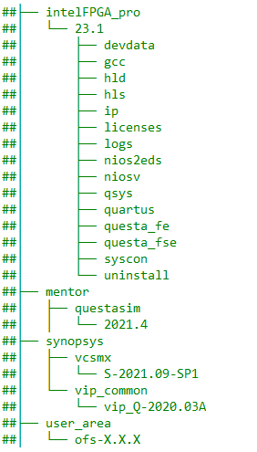

1. You must create a directory named "ofs-X.X.X" where the X represents the current release number, for example ofs-1.3.1. 

2. You must clone the required OFS repositories as per Figure 2-2 . Please refer to the BKC table for locations.

3. Assign the ofs-X.X.X folder to the $IOFS_BUILD_ROOT environment variable. 

4. Once the repositories are cloned, copy the evaluation script (iofs_d5005_eval.sh) which is located at https://github.com/OFS/ofs-d5005/eval_scripts beneath the $IOFS_BUILD_ROOT directory location as shown in the example below:

**Figure 2-2 Directory Structure for Intel OFS Project**

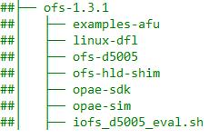

<table>
    <thead>
        <tr>
            <th>Repository Name</th>
            <th>Description</th>
        </tr>
    </thead>
    <tbody>
        <tr>
            <td>examples-afu</td>
            <td>Basic Building Blocks (BBB) for Intel FPGAs is a suite of application building blocks and shims for transforming the CCI-P interface 
             
        </tr>
</td>        
        <tr>
            <td>linux-dfl</td>
            <td>Contains mirror of linux-dfl and specific Intel OFS drivers that are being upstreamed to the Linux kernel 
             
        </tr>
</tr>
        <tr>
            <td>ofs-d5005</td>
            <td>Contains FIM or shell RTL, automated compilation scripts, unit tests and UVM test framework 
             
        </tr>
</tr>
        <tr>
            <td>ofs-hld-shim</td>
            <td>Contains the hardware and software components you need to develop your own OneAPI or OpenCL board support package for the Intel® Stratix 10® and Intel® Agilex® FPGAs 
             
        </tr>
</tr>
        <tr>
            <td>opae-sdk</td>
            <td>Contains the files for building and installing Open Programmable Acceleration Engine Software Development Kit from source 
             
        </tr>
</tr>
        <tr>
            <td>opae-sim</td>
            <td>Contains the files for an AFU developer to build the Accelerator Funcitonal Unit Simulation Environment (ASE) for workload development 
             
        </tr>
</tr>
     </tbody>
</table>

5. Open the README file named (README_ofs_d5005_eval.txt) which is located at https://github.com/OFS/ofs-d5005/eval_scripts which informs the user which sections to modify in the script prior to building the FIM and running hardware, software and simulation tests. 

### **2.2 d5005 Evaluation Script modification**

To adapt this script to the user environment please follow the instructions below which explains which line numbers to change in the iofs_d5005_eval.sh script 

### **User Directory Creation**

The user must create the top-level source directory and then clone the OFS repositories
    
    mkdir ofs-1.3.1

In the example above we have used ofs-1.3.1 as the directory name

### **Set-Up Proxy Server (lines 63-65)**

Please enter the location of your proxy server to allow access to external internet to build software packages.

Note: Failing to add proxy server will prevent cloning of repositories and the user will be unable to build the OFS framework.
    
    export http_proxy=<user_proxy>
    export https_proxy=<user_proxy>
    export no_proxy=<user_proxy>

### **License Files (lines 68-70)**

Please enter the the license file locations for the following tool variables

    export LM_LICENSE_FILE=<user_license>
    export DW_LICENSE_FILE=<user_license>
    export SNPSLMD_LICENSE_FILE=<user_license>

### **Tools Location (line 85)**

Set Location of Quartus, Synopsys and Questasim Tools

    export TOOLS_LOCATION=/home

In the example above /home is used as the base location of Quartus, Synopsys and Questasim tools

### **Quartus Tools Version (line 90)**

Set version of Quartus

    export QUARTUS_VERSION=22.3

In the example above "22.3" is used as the Quartus tools version

### **OPAE Tools (line 103)**

change OPAE SDK VERSION 

    export OPAE_SDK_VERSION=2.3.0-1

In the example above "2.3.0-1" is used as the OPAE SDK tools version

### **PCIe (Bus Number) (lines 228 and 235)**

The Bus number must be entered by the user after installing the hardware in the chosen server, in the example below "b1" is the Bus Number for a single card as defined in the evaluation script.

    export ADP_CARD0_BUS_NUMBER=b1

 The evaluation script uses the bus number as an identifier to interrogate the card. The command below will identify the accelerater card plugged into a server. 

    lspci | grep acc
    
    86:00.0 Processing accelerators: Intel Corporation Device bcce (rev 01)

The result identifies the card as being assigned "86" as the bus number so the entry in the script changes to

    export ADP_CARD0_BUS_NUMBER=86

The user can also run the following command on the ofs_d5005_eval.sh script to automatically change the bus number to 86 in the ofs_d5005_eval.sh script.

grep -rli '86' * | xargs -i@ sed -i '86' @

if the bus number is 85 for example 

85:00.0 Processing accelerators: Intel Corporation Device bcce (rev 01)

the command to change to 85 in the evaluation script would be

grep -rli '86' * | xargs -i@ sed -i '85' @

The ofs_d5005_eval.sh script has now been modified to the server set-up and the user can proceed to build, compile and simulate the OFS stack

 

## **3 d5005 Evaluation Script**

### **3.1 Overview**

The figure below shows a snapshot of the full evaluation script menu showing all 52 options and each one of 10 sub-menus which focus on different areas of evaluation. Each of these menu options are described in the next section.

**Figure 3-1 iofs_d5005_eval.sh Evaluation Menu**

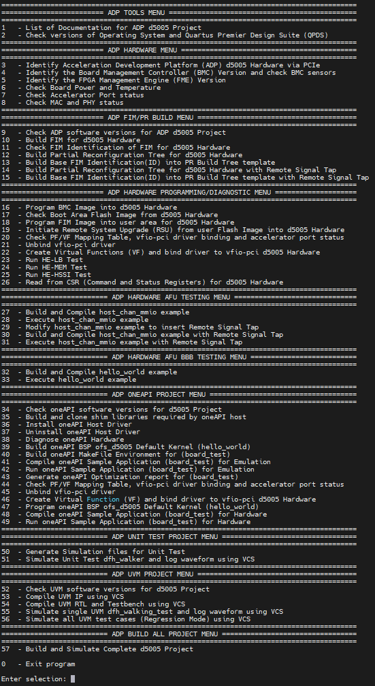

### **3.1.1 ADP TOOLS MENU**

By selecting "List of Documentation for ADP d5005 Project," a list of links to the latest OFS documentation appears. Note that these links will take you to documentation for the most recent release which may not correspond to the release version you are evaluating. To find the documentation specific to your release, ensure you clone the intel-ofs-docs tag that corresponds to your OFS version.

By selecting "Check Versions of Operating System and Quartus Premier Design Suite", the tool verifies correct Operating System, Quartus version, kernel parameters, license files and paths to installed software tools.

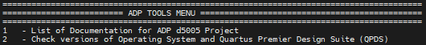

<table>
    <thead>
        <tr>
            <th>Menu Option</th>
            <th>Example Output</th>
        </tr>
    </thead>
    <tbody>
        <tr>
            <td>1 - List of Documentation for ADP d5005 Project</td>
            <td>Getting Started Guide: Intel Open FPGA Stack for Intel Stratix 10 FPGA 
                Guides you through the setup and build steps to evaluate the OFS solution targeting an Intel FPGA PAC D5005 
                https://github.com/otcshare/intel-ofs-docs/blob/main/d5005/user_guides/ug_qs_ofs_d5005/ug_qs_ofs_d5005.md 
             
                FPGA Interface Manager Technical Reference Manual: Intel Open FPGA Stack for Intel Stratix 10 FPGA 
                Describes the OFS FIM architecture and features 
                https://github.com/otcshare/intel-ofs-docs/blob/main/d5005/reference_manuals/ofs_fim/mnl_fim_ofs_d5005.md 
             
                Software Reference Manual: Intel® Open FPGA Stack 
                Describes the Open Programmable Acceleration Engine (OPAE) Software Development Kit, the OPAE C++ and Python API and management interfaces. This document also covers building the OPAE SDK, how to add a new PCIe device, and debugging the software stack 
                https://github.com/otcshare/intel-ofs-docs/blob/main/common/reference_manual/ofs_sw/mnl_sw_ofs.md 
             
                FPGA Interface Manager Developer Guide: Intel Open Stack for Intel Stratix 10 FPGA 
                Provides guidance on developing an FPGA Interface Manager (FIM) for a custom FPGA acceleration board 
                https://github.com/otcshare/intel-ofs-docs/blob/main/d5005/dev_guides/fim_dev/ug_dev_fim_ofs_d5005.md 
             
                Accelerator Functional Unit Developer Guide: Intel Open FPGA Stack 
                Provides guidance on how to build and test an AFU when designing to an OFS-based FPGA Interface Manager 
                https://github.com/otcshare/intel-ofs-docs/blob/main/d5005/dev_guides/AFU%20User%20Guide/AFU_User_Guide.md 
             
                Simulation User Guide: Intel Open FPGA Stack for Intel Stratix 10 FPGA 
                Provides steps for setting up the UVM verification tool suite and running UVM unit tests 
                https://github.com/otcshare/intel-ofs-docs/blob/main/d5005/user_guides/ug_sim_ofs_d5005/ug_sim_ofs_d5005.md 
             
                Security User Guide: Intel Open FPGA Stack for Intel Stratix 10 FPGA 
                Describes how to create keys and sign bitstreams for your custom design 
                https://github.com/otcshare/intel-ofs-docs/blob/main/d5005/user_guides/%20ug_security_ofs_d5005/ug-pac-security-d5005.md 
             
                Board Management Controller User Guide: Intel Open FPGA Stack for Intel Stratix 10 FPGA 
                Describes how to modify the BMC RTL and Firmware for your custom board design 
                https://github.com/otcshare/intel-ofs-docs/blob/main/d5005/user_guides/ug_bmc_ofs_d5005/IOFS_BMC_User_Guide.md 
             
                Intel® OFS High Level Design(HLD) Shim: Getting Started User Guide 
                Describes how to get started using OneAPI with the Intel OFS FIM BSP 
                https://github.com/otcshare/intel-ofs-docs/blob/main/common/user_guides/ofs_hld/ug_hld_ofs.md 
             
                Intel® OFS High Level Design(HLD) Shim: Reference Manual 
                Describes how to use the provided shim for Intel OFS for creating your custom OneAPI board support package 
                https://github.com/otcshare/intel-ofs-docs/blob/main/common/reference_manual/ofs_hld/mnl_hld_ofs.md 
</td>        
        </tr>
        <tr>
            <td>2 - Check versions of Operating System and Quartus Premier Design Suite (QPDS)</td>
            <td>Checking Linux release 
                Linux version 5.15.77-dfl-2022.3-1 (DCPsupport@sj-2308-a405.sj.intel.com) (gcc (GCC) 8.5.0 20210514 (Red Hat 8.5.0-15), GNU ld version 2.30-73.el8) #1 SMP Thu Dec 8 10:21:38 PST 2022 
                 
                Checking RedHat release 
                Red Hat Enterprise Linux release 8.2 
                 
                Checking Ubuntu release 
                cat: /etc/lsb-release: No such file or directory 
                 
                Checking Kernel parameters 
                BOOT_IMAGE=(hd0,msdos1)/vmlinuz-5.15.77-dfl-2022.3-1 root=/dev/mapper/rhel-root ro crashkernel=auto resume=/dev/mapper/rhel-swap rd.lvm.lv=rhel/root rd.lvm.lv=rhel/swap rhgb quiet intel_iommu=on pcie=realloc hugepagesz=2M hugepages=200 
                 
                Checking Licenses 
                LM_LICENSE_FILE is set to port@socket number:port@socket number 
                DW_LICENSE_FILE is set to port@socket number:port@socket number 
                SNPSLMD_LICENSE_FILE is set to port@socket number:port@socket number 
                 
                Checking Tool versions 
                QUARTUS_HOME is set to /home/intelFPGA_pro/22.3/quartus 
                QUARTUS_ROOTDIR is set to /home/intelFPGA_pro/22.3/quartus 
                IMPORT_IP_ROOTDIR is set to /home/intelFPGA_pro/22.3/quartus/../ip 
                QSYS_ROOTDIR is set to /home/intelFPGA_pro/22.3/quartus/../qsys/bin 
                 
                Checking QPDS Patches 
                Quartus Prime Shell 
                Version 22.3.0 Build 104 09/14/2022 SC Pro Edition 
                Copyright (C) 2022  Intel Corporation. All rights reserved. 
                 
               </td>
        </tr>
</tr>
     </tbody>
</table>

### **3.1.2 ADP HARDWARE MENU**

Identifies card by PCIe number, checks power, temperature and current firmware configuration. 

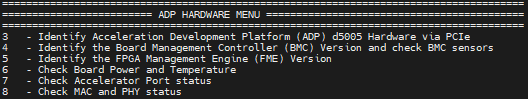

<table>
    <thead>
        <tr>
            <th>Menu Option</th>
            <th>Example Output</th>
        </tr>
    </thead>
    <tbody>
        <tr>
            <td>3 - Identify Acceleration Development Platform (ADP) d5005 Hardware via PCIe</td>
            <td>PCIe card detected as 
                86:00.0 Processing accelerators: Intel Corporation Device bcce (rev 01) 
                Host Server is connected to SINGLE card configuration 
                 
</td>        
        </tr>
        <tr>
            <td>4 - Identify the Board Management Controller (BMC) Version and check BMC sensors</td>
            <td>Intel FPGA Programmable Acceleration Card D5005 
                Board Management Controller, MAX10 NIOS FW version: 2.0.13 
                Board Management Controller, MAX10 Build version: 2.0.8 
                //****** BMC SENSORS ******// 
                Object Id                        : 0xF000000 
                PCIe s:b:d.f                     : 0000:86:00.0 
                Vendor Id                        : 0x8086 
                Device Id                        : 0xBCCE 
                SubVendor Id                     : 0x8086 
                SubDevice Id                     : 0x138D 
                Socket Id                        : 0x00 
                Ports Num                        : 01 
                Bitstream Id                     : 0x4010002278FD3AA 
                Bitstream Version                : 4.0.1 
                Pr Interface Id                  : 64c39726-fe2d-52ab-981f-ff49395db6e7 
             
        </tr>
</td>        
        </tr>
        <tr>
            <td>5 - Identify the FPGA Management Engine (FME) Version</td>
            <td>Intel FPGA Programmable Acceleration Card D5005 
                Board Management Controller, MAX10 NIOS FW version: 2.0.13 
                Board Management Controller, MAX10 Build version: 2.0.8 
                //****** FME ******// 
                Object Id                        : 0xF000000 
                PCIe s:b:d.f                     : 0000:86:00.0 
                Vendor Id                        : 0x8086 
                Device Id                        : 0xBCCE 
                SubVendor Id                     : 0x8086 
                SubDevice Id                     : 0x138D 
                Socket Id                        : 0x00 
                Ports Num                        : 01 
                Bitstream Id                     : 0x4010002278FD3AA 
                Bitstream Version                : 4.0.1 
                Pr Interface Id                  : 64c39726-fe2d-52ab-981f-ff49395db6e7 
                Boot Page                        : user 
             
        </tr>
</td>        
        </tr>
        <tr>
            <td>6 - Check Board Power and Temperature</td>
            <td>Intel FPGA Programmable Acceleration Card D5005 
                Board Management Controller, MAX10 NIOS FW version: 2.0.13 
                Board Management Controller, MAX10 Build version: 2.0.8 
                //****** POWER ******// 
                Object Id                        : 0xF000000 
                PCIe s:b:d.f                     : 0000:86:00.0 
                Vendor Id                        : 0x8086 
                Device Id                        : 0xBCCE 
                SubVendor Id                     : 0x8086 
                SubDevice Id                     : 0x138D 
                Socket Id                        : 0x00 
                Ports Num                        : 01 
                Bitstream Id                     : 0x4010002278FD3AA 
                Bitstream Version                : 4.0.1 
                Pr Interface Id                  : 64c39726-fe2d-52ab-981f-ff49395db6e7 
                ( 1) VCCERAM Voltage             : 0.90 Volts 
                etc ...................... 
             
                Intel FPGA Programmable Acceleration Card D5005 
                Board Management Controller, MAX10 NIOS FW version: 2.0.13 
                Board Management Controller, MAX10 Build version: 2.0.8 
                //****** TEMP ******// 
                Object Id                        : 0xF000000 
                PCIe s:b:d.f                     : 0000:86:00.0 
                Vendor Id                        : 0x8086 
                Device Id                        : 0xBCCE 
                SubVendor Id                     : 0x8086 
                SubDevice Id                     : 0x138D 
                Socket Id                        : 0x00 
                Ports Num                        : 01 
                Bitstream Id                     : 0x4010002278FD3AA 
                Bitstream Version                : 4.0.1 
                Pr Interface Id                  : 64c39726-fe2d-52ab-981f-ff49395db6e7 
                ( 1) VCCT Temperature            : 57.00 Celsius 
                etc ...................... 
                 
        </tr>
</td>        
        </tr>
        <tr>
            <td>7 - Check Accelerator Port status</td>
            <td>//****** PORT ******//
                Object Id                        : 0xEF00000 
                PCIe s:b:d.f                     : 0000:86:00.0 
                Vendor Id                        : 0x8086 
                Device Id                        : 0xBCCE 
                SubVendor Id                     : 0x8086 
                SubDevice Id                     : 0x138D 
                Socket Id                        : 0x00 
             
        </tr>
</td>        
        </tr>
        <tr>
            <td>8 - Check MAC and PHY status</td>
            <td>Intel FPGA Programmable Acceleration Card D5005 
                Board Management Controller, MAX10 NIOS FW version: 2.0.13 
                Board Management Controller, MAX10 Build version: 2.0.8 
                //****** MAC ******// 
                Object Id                        : 0xF000000 
                PCIe s:b:d.f                     : 0000:86:00.0 
                Vendor Id                        : 0x8086 
                Device Id                        : 0xBCCE 
                SubVendor Id                     : 0x8086 
                SubDevice Id                     : 0x138D 
                Socket Id                        : 0x00 
                Ports Num                        : 01 
                Bitstream Id                     : 0x4010002278FD3AA 
                Bitstream Version                : 4.0.1 
                Pr Interface Id                  : 64c39726-fe2d-52ab-981f-ff49395db6e7 
                MAC address                      : 64:4c:36:f:44:1f 
             
                Intel FPGA Programmable Acceleration Card D5005 
                Board Management Controller, MAX10 NIOS FW version: 2.0.13 
                Board Management Controller, MAX10 Build version: 2.0.8 
                //****** PHY ******// 
                Object Id                        : 0xF000000 
                PCIe s:b:d.f                     : 0000:86:00.0 
                Vendor Id                        : 0x8086 
                Device Id                        : 0xBCCE 
                SubVendor Id                     : 0x8086 
                SubDevice Id                     : 0x138D 
                Socket Id                        : 0x00 
                Ports Num                        : 01 
                Bitstream Id                     : 0x4010002278FD3AA 
                Bitstream Version                : 4.0.1 
                Pr Interface Id                  : 64c39726-fe2d-52ab-981f-ff49395db6e7 
        </tr>
</tr>
     </tbody>
</table>

### **3.1.4 ADP FIM/PR BUILD MENU**

Builds FIM, Partial Reconfiguration Region and Remote Signal Tap

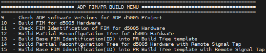

<table>
    <thead>
        <tr>
            <th>Menu Option</th>
            <th>Description</th>
        </tr>
    </thead>
    <tbody>
        <tr>
            <td>9 - Check ADP software versions for ADP d5005 Project</td>
            <td>OFS_ROOTDIR is set to /home/DCPsupport/ofs-1.3.1/ofs-d5005 
                OPAE_SDK_REPO_BRANCH is set to release/2.3.0-1 
                OPAE_SDK_ROOT is set to /home/DCPsupport/ofs-1.3.1/ofs-d5005/../opae-sdk 
                LD_LIBRARY_PATH is set to /home/DCPsupport/ofs-1.3.1/ofs-d5005/../opae-sdk/lib64: 
 
             
</td>        
        </tr>
        <tr>
            <td>10 - Build FIM for d5005 Hardware</td>
            <td>This option builds the FIM based on the setting for the $ADP_PLATFORM, $FIM_SKU1 or $FIM_SKU2 environment variable. Check these variables in the following file ofs_d5005_eval.sh 
             
        </tr>
</td>        
        </tr>
        <tr>
            <td>11 - Check FIM Identification of FIM for d5005 Hardware</td>
            <td>The FIM is identified by the following file fme-ifc-id.txt located at $OFS_ROOTDIR/$FIM_WORKDIR/syn/syn_top/ 
             
        </tr>
</td>        
        </tr>
        <tr>
            <td>12 - Build Partial Reconfiguration Tree for d5005 Hardware</td>
            <td>This option builds the Partial Reconfiguration Tree which is needed for AFU testing/development and also for the OpenCL build flow  
             
        </tr>
</td>        
        </tr>
        <tr>
            <td>13 - Build Base FIM Identification(ID) into PR Build Tree template</td>
            <td>This option copies the contents of the fme-ifc-id.txt into the Partial Reconfiguration Tree to allow the FIM amd Partial Reconfiguration Tree to match and hence allow subsequent insertion of AFU and OpenCL workloads 
             
        </tr>
</td>        
        </tr>
        <tr>
            <td>14 - Build Partial Reconfiguration Tree for d5005 Hardware with Remote Signal Tap</td>
            <td>This option builds the Partial Reconfiguration Tree which is needed for AFU testing/development and also for the OpenCL build flow and for the Remote Signal Tap flow 
             
        </tr>
</td>        
        </tr>
        <tr>
            <td>15 - Build Base FIM Identification(ID) into PR Build Tree template with Remote Signal Tap</td>
            <td>This option copies the contents of the fme-ifc-id.txt into the Partial Reconfiguration Tree for Remote Signal Tap to allow the FIM amd Partial Reconfiguration Tree to match and hence allow subsequent insertion of AFU and OpenCL workloads 
             
        </tr>
</tr>
     </tbody>
</table>

### **3.1.5 ADP HARDWARE PROGRAMMING/DIAGNOSTIC MENU**

The following submenu allows you to:
* Program and check flash 
* Perform a remote system update (RSU) of the FPGA image into the FPGA
* Bind virtual functions to VFIO PCIe driver 
* Run host exerciser (HE) commands such as loopback to test interfaces VFIO PCI driver binding
* Read the control and status registers (CSRs) for bound modules that are part of the OFS reference design.

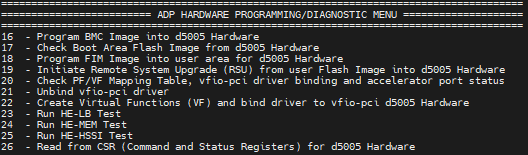

<table>
    <thead>
        <tr>
            <th>Menu Option</th>
            <th>Description</th>
        </tr>
    </thead>
    <tbody>
        <tr>
            <td>16 - Program BMC Image into d5005 Hardware</td>
            <td>The user must place a new BMC flash file in the following directory $OFS_ROOTDIR/bmc_flash_files. Once the user executes this option a new BMC image will be programmed. A remote system upgrade command is initiated to store the new BMC image 
             
</td>        
        </tr>
        <tr>
            <td>17 - Check Boot Area Flash Image from d5005 Hardware</td>
            <td>This option checks which location area in FLASH the image will boot from, the default is user1 
             
            Boot Page : user1 
             
        </tr>
</td>        
        </tr>
        <tr>
            <td>18 - Program FIM Image into user1 area for d5005 Hardware</td>
            <td>This option programs the FIM image "d5005_page1.bin" into user1 area in flash 
             
        </tr>
</td>        
        </tr>
        <tr>
            <td>19 - Initiate Remote System Upgrade (RSU) from user1 Flash Image into d5005 Hardware</td>
            <td>This option initiates a Remote System Upgrade and soft reboots the server and re-scans the PCIe bus for the new image to be loaded 
             
            2022-12-13 07:31:33,244 - [[pci_address(0000:86:00.0), pci_id(0x8086, 0xbcce, 0x8086, 0x138d)]] performing RSU operation 
            2022-12-13 07:31:33,249 - [[pci_address(0000:85:00.0), pci_id(0x8086, 0x2030, 0x1590, 0x00ea)]] removing device from PCIe bus 
            2022-12-13 07:31:34,333 - waiting 10.0 seconds for boot 
            2022-12-13 07:31:44,344 - rescanning PCIe bus: /sys/devices/pci0000:85/pci_bus/0000:85 
            2022-12-13 07:31:44,377 - RSU operation complete 
             
        </tr>
</td>        
        </tr>
        <tr>
            <td>20 - Check PF/VF Mapping Table, vfio-pci driver binding and accelerator port status</td>
            <td>This option checks the current vfio-pci driver binding for the PF's and VF's 
             
        </tr>
</td>        
        </tr>
        <tr>
            <td>21 - Unbind vfio-pci driver</td>
            <td>This option unbinds the vfio-pci driver for the PF's and VF's 
             
        </tr>
</td>        
        </tr>
        <tr>
            <td>22 - Create Virtual Functions (VF) and bind driver to vfio-pci d5005 Hardware</td>
            <td>This option creates vfio-pci driver binding for the PF's and VF's 
            Once the VF's have been bound to the driver the user can select menu option 20 to check that the new drivers are bound 
             
        </tr>
</td>        
        </tr>
</td>        
        </tr>
        <tr>
            <td>23 - Run HE-LB Test</td>
            <td>This option runs 5 tests 
             
            1) checks and generates traffic with the intention of exercising the path from the AFU to the Host at full bandwidth 
            2) run a loopback throughput test using one cacheline per request 
            3) run a loopback read test using four cachelines per request 
            4) run a loopback write test using four cachelines per request 
            5) run a loopback throughput test using four cachelines per request 
             
        </tr>
</td>        
        </tr>
        <tr>
            <td>24 - Run HE-MEM Test</td>
            <td>This option runs 2 tests 
             
            1) Checking and generating traffic with the intention of exercising the path from FPGA connected DDR; data read from the host is written to DDR, and the same data is read from DDR before sending it back to the host 
            2) run a loopback throughput test using one cacheline per request 
             
        </tr>
</td>        
        </tr>
        <tr>
            <td>25 - Run HE-HSSI Test</td>
            <td>This option runs 1 test  
             
            HE-HSSI is responsible for handling client-side ethernet traffic. It wraps the 10G and 100G HSSI AFUs, and includes a traffic generator and checker. The user-space tool hssi exports a control interface to the HE-HSSI's AFU's packet generator logic 
             
            1) Send traffic through the 10G AFU
             
        </tr>
</td>        
        </tr>
</td>        
        </tr>
        <tr>
            <td>26 - Read from CSR (Command and Status Registers) for d5005 Hardware</td>
            <td>This option reads from the following CSR's 
            HE-LB Command and Status Register Default Definitions 
            HE-MEM Command and Status Register Default Definitions 
            HE-HSSI Command and Status Register Default Definitions 
             
        </tr>
</tr>
     </tbody>
</table>

### **3.1.6  ADP HARDWARE AFU TESTING MENU**

This submenu tests partial reconfiguration by building and loading an memory-mapped I/O example AFU/workload, executes software from host, and tests remote signal tap.

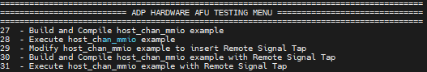

<table>
    <thead>
        <tr>
            <th>Menu Option</th>
            <th>Description</th>
        </tr>
    </thead>
    <tbody>
        <tr>
            <td>27 - Build and Compile host_chan_mmio example</td>
            <td>This option builds the host_chan_mmio example from the following repo $OFS_PLATFORM_AFU_BBB_EXTERNAL/plat_if_tests/$AFU_TEST_NAME, where AFU_TEST_NAME=host_chan_mmio. This produces a GBS(Green Bit Stream) ready for hardware programming 
             
</td>        
        </tr>
        <tr>
            <td>28 - Execute host_chan_mmio example</td>
            <td>This option builds the host code for host_chan_mmio example and programs the GBS file and then executes the test 
             
        </tr>
</td>        
        </tr>
        <tr>
            <td>29 - Modify host_chan_mmio example to insert Remote Signal Tap</td>
            <td>This option inserts a pre-defined host_chan_mmio.stp Signal Tap file into the Intel OFS code to allow a user to debug the host_chan_mmio AFU example 
             
        </tr>
</td>        
        </tr>
        <tr>
            <td>30 - Build and Compile host_chan_mmio example with Remote Signal Tap</td>
            <td>This option builds the host_chan_mmio example from the following repo $OFS_PLATFORM_AFU_BBB_EXTERNAL/plat_if_tests/$AFU_TEST_NAME, where AFU_TEST_NAME=host_chan_mmio. This produces a GBS(Green Bit Stream) ready for hardware programming with Remote Signal tap enabled 
             
        </tr>
</td>        
        </tr>
        <tr>
            <td>31 - Execute host_chan_mmio example with Remote Signal Tap</td>
            <td>This option builds the host code for host_chan_mmio example and programs the GBS file and then executes the test. The user must open the Signal Tap window when running the host code to see the transactions in the Signal tap window 
            <td> 
             
        </tr>
</tr>
     </tbody>
</table>

### **3.1.7 ADP HARDWARE AFU BBB TESTING MENU**

This submenu tests partial reconfiguration using a hello_world example AFU/workload, executes sw from the host

<table>
    <thead>
        <tr>
            <th>Menu Option</th>
            <th>Description</th>
        </tr>
    </thead>
    <tbody>
        <tr>
            <td>32 - Build and Compile hello_world example</td>
            <td>This option builds the hello_ world example from the following repo $FPGA_BBB_CCI_SRC/tutorial/afu_types/01_pim_ifc/$AFU_BBB_TEST_NAME, where AFU_BBB_NAME=hello_world. This produces a GBS (Green Bit Stream) file ready for hardware programming 
             
</td>        
        </tr>
        <tr>
            <td>33 - Execute hello_world example</td>
            <td>This option builds the host code for hello_world example and programs the GBS file and then executes the test 
             
        </tr>
</tr>
     </tbody>
</table>

### **3.1.8 ADP OPENCL PROJECT MENU**

Builds OpenCL kernel, executes software from host and runs diagnostic tests

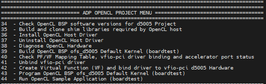

<table>
    <thead>
        <tr>
            <th>Menu Option</th>
            <th>Description</th>
        </tr>
    </thead>
    <tbody>
        <tr>
            <td>34 - Check OpenCL BSP software versions for d5005 Project</td>
            <td>This option checks the setup of the OpenCL software and adds the relevant OpenCL environment variables to the terminal 
             
</td>        
        </tr>
        <tr>
            <td>35 - Build and clone shim libraries required by OpenCL host</td>
            <td>This option builds the OpenCL directory structure 
             
        </tr>
</td>        
        </tr>
        <tr>
            <td>36 - Install OpenCL Host Driver</td>
            <td>This option Installs the OpenCL Host driver at the following location /opt/Intel/OpenCL, requires sudo permession 
             
        </tr>
</td>        
        </tr>
        <tr>
            <td>37 - Uninstall OpenCL Host Driver</td>
            <td>This option Uninstall's the OpenCL Host driver, requires sudo permessions 
             
        </tr>
</td>        
        </tr>
        <tr>
            <td>38 - Diagnose OpenCL Hardware</td>
            <td>This option Checks ICD(Intel Client Driver) and FCD(FPGA Client Driver), OpenCL library locations and dtects whether OpencL BSP is loaded into the FPGA 
        </tr>
</td>        
        </tr>
        <tr>
            <td>39 - Build OpenCL BSP ofs_d5005 Default Kernel (boardtest)</td>
            <td>This option Builds the OpenCL BSP using boardtest kernel 
        </tr>
</td>        
        </tr>
        <tr>
            <td>40 - Check PF/VF Mapping Table, vfio-pci driver binding and accelerator port status</td>
            <td>This option checks the current vfio-pci driver binding for the PF's and VF's 
        </tr>
</td>        
        </tr>
        <tr>
            <td>41 - Unbind vfio-pci driver</td>
            <td>This option unbinds the vfio-pci driver for the PF's and VF's 
             
        </tr>
</td>        
        </tr>
        <tr>
            <td>42 - Create Virtual Function (VF) and bind driver to vfio-pci d5005 Hardware</td>
            <td>This option creates vfio-pci driver binding for the PF's and VF's 
            Once the VF's have been bound to the driver the user can select menu option 40 to check that the new drivers are bound 
             
        </tr>
</td>        
        </tr>
        <tr>
            <td>43 - Program OpenCL BSP ofs_d5005 Default Kernel (boardtest)</td>
            <td>This option programs the FPGA with a aocx file based on the boardtest kernel 
             
        </tr>
</td>        
        </tr>
        <tr>
            <td>44 - Run OpenCL Sample Application (boardtest)</td>
            <td>This option builds the host code for boardtest kernel and executes the program running through kernel and host bandwidth tests 
             
        </tr>
</tr>
     </tbody>
</table>

### **3.1.10 ADP UNIT TEST PROJECT MENU**

Builds, compiles and runs standalone simulation block tests. More unit test examples are found at teh follwimng location ofs-d5005/sim/unit_test 

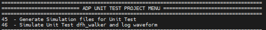

<table>
    <thead>
        <tr>
            <th>Menu Option</th>
            <th>Result</th>
        </tr>
    </thead>
    <tbody>
        <tr>
            <td>45 - Generate Simulation files for Unit Test</td>
            <td>This option builds the simulation file set for running a unit test simulation 
             
        </tr>
</td>        
        <tr>
            <td>46 - Simulate Unit Test dfh_walker and log waveform</td>
            <td>entry 
             
        </tr>
</tr>
     </tbody>
</table>

### **3.1.11 ADP UVM PROJECT MENU**

Builds, compiles and runs full chip simulation tests. The user shoudd execute the options sequenstailly ie 47, 48, 49 and 50

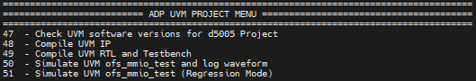

<table>
    <thead>
        <tr>
            <th>Menu Option</th>
            <th>Description</th>
        </tr>
    </thead>
    <tbody>
        <tr>
            <td>47 - Check UVM software versions for d5005 Project</td>
            <td>DESIGNWARE_HOME is set to /home/synopsys/vip_common/vip_Q-2020.03A 
                UVM_HOME  is set to /home/synopsys/vcsmx/S-2021.09-SP1/linux64/rhel/etc/uvm 
                VCS_HOME is set to /home/synopsys/vcsmx/S-2021.09-SP1/linux64/rhel 
                VERDIR is set to /home/DCPsupport/ofs-1.3.1/ofs-d5005/verification 
                VIPDIR is set to /home/DCPsupport/ofs-1.3.1/ofs-d5005/verification 
             
</td>        
        <tr>
            <td>48 - Compile UVM IP</td>
            <td>This option compiles the UVM IP  
             
        <tr>
</td>        
        <tr>
            <td>49 - Compile UVM RTL and Testbench</td>
            <td>This option compiles the UVM RTL and Testbench 
             
        <tr>
</td>        
        <tr>
            <td>50 - Simulate UVM d5005_dfh_walking_test and log waveform</td>
            <td>This option runs the dfh_walking test based on the environment variable "UVM_TEST_NAME=d5005_dfh_walking_test" in the evaluation script. A user can change the test being run by modifying this variable 
             
        <tr>
</td>        
        <tr>
            <td>51 - Simulate UVM d5005_dfh_walking_test (Regression Mode)</td>
            <td>This option runs the d5005 regression mode, cycling through all UVM tests defined in ofs-common/verification/fpga_family/stratix10/tests/ofs_test_pkg.svh file 
             
        <tr>
</tr>
     </tbody>
</table>

### **3.1.12 ADP BUILD ALL PROJECT MENU**

Builds the complete Intel OFS flow, good for regression testing and overnight builds

For this menu a user can run a sequence of tests (compilation, build and simulation) and executes them sequentially. After the script is successfully executed, a set of binary files is produced which a you can use to evaluate your hardware. Log files are also produced which checks whether the tests passed.

A user can run a sequence of tests and execute them sequentially. In the example below when the user selects option 52 from the main menu the script will execute 21 tests ie (main menu options 2, 9, 10, 11, 12, 13, 14, 15, 27, 29, 30, 32, 34, 35, 39, 45, 46, 47, 48, 49, and 50. These 21 menu option are chosen to build the complete OFS flow covering build, compile and simulation. 

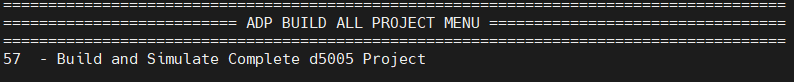

<table>
    <thead>
        <tr>
            <th>Menu Option</th>
            <th>Result</th>
        </tr>
    </thead>
    <tbody>
        <tr>
            <td>52 - Build and Simulate Complete d5005 Project</td>
            <td>Generating Log File with date and timestamp 
                Log file written to /home/DCPsupport/ofs-1.3.1/log_files/d5005_log_2022_11_10-093649/ofs_d5005_eval.log 
             
</tr>
     </tbody>
</table>

## **Definition of Multi-Test Set-up**

Menu Option 52 above in the evaluation script can be refined to tailor it to the users need and is principally defined by the variable below

MULTI_TEST[A,B]=C

where

A= Total Number of menu options in script 
B= Can be changed to a number to select the test order 
C= Menu Option in Script 

Example 1 
MULTI_TEST[52,0]=2

A= 52 is the total number of options in the script
B= 0 indicates that this is the first test to be run in the script
C= Menu option in Script ie 2- List of Documentation for ADP d5005 Project

Example 2 
MULTI_TEST[52,0]=2 
MULTI_TEST[52,1]=9 

In the example above two tests are run in order ie 0, and 1 and the following menu options are executed ie 2- List of Documentation for ADP d5005 Project and 9 - Check ADP software versions for ADP d5005 Project

The user can also modify the build time by de-selecting options they do not wish to use, see below for a couple of use-case scenarios.

## **Default User Case**

A user can run a sequence of tests and execute them sequentially. In the example below when the user selects option 52 from the main menu the script will execute 21 tests ie (main menu options 2, 9, 10, 11, 12, 13, 14, 15, 27, 29, 30, 32, 34, 35, 39, 45, 46, 47, 48, 49, and 50. All other tests with an "X" indicates do not run that test.

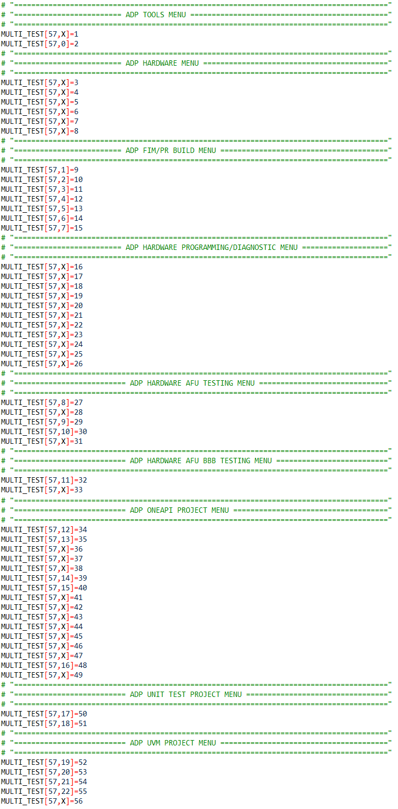

## **User Case for ADP FIM/PR BUILD MENU**

In the example below when the user selects option 52 from the main menu the script will only run options from the ADP FIM/PR BUILD MENU (7 options, main menu options 9, 10, 11, 12, 13, 14 and 15). All other tests with an "X" indicates do not run that test.

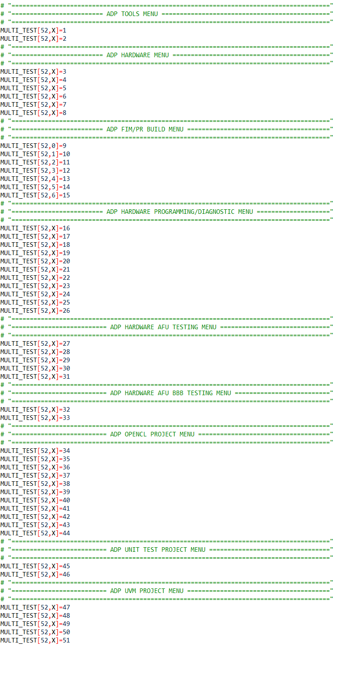

 

## **4 d5005 Common Test Scenarios**

This section will describe the most common compile build scenarios if a user wanted to evaluate an acceleration card on their server. The Pre-requisite column indicates the menu comamnds that must be run befere executing the test eg To run Test 5 then a user needs to have run option 10, 12 and 14 before running options 27, 28, 29, 30 and 31.

<table>
    <thead>
        <tr>
            <th>Test</th>
            <th>Test Scenario</th>
            <th>Pre-Requisite Menu Option</th>
            <th>Menu Option</th>
        </tr>
    </thead>
    <tbody>
        <tr>
            <tr>
            <td>Test 1</td>
            <td>FIM Build</td>
            <td>- 
            <td>10 
             
        <tr>
            <tr>
            <td>Test 2</td>
            <td>Partial Reconfiguration Build</td>
            <td>10 
            <td>12 
             
        <tr>
            <tr>
            <td>Test 3</td>
            <td>Program FIM and perform Remote System Upgrade</td>
            <td>10 
            <td>18, 19 
             
        <tr>
            <tr>
            <td>Test 4</td>
            <td>Bind PF and VF to vfio-pci drivers</td>
            <td>- 
            <td>20, 21, 22 
             
        <tr>
            <tr>
            <td>Test 5</td>
            <td>Build, compile and test AFU on hardware</td>
            <td>10, 12, 13 
            <td>27, 28 
             
        <tr>
            <tr>
            <td>Test 6</td>
            <td>Build, compile and test AFU Basic Building Blocks on hardware</td>
            <td>10, 12, 13 
            <td>32, 33 
             
        <tr>
            <tr>
            <td>Test 7</td>
            <td>Build, compile and test OpenCL on hardware</td>
            <td>10, 12, 13 
            <td>34, 35, 36, 38, 39, 40, 41, 42, 43, 44  
             
        <tr>
            <tr>
            <td>Test 8</td>
            <td>Build and Simulate Unit Tests</td>
            <td>- 
            <td>45, 46 
             
        <tr>
            <tr>
            <td>Test 9</td>
            <td>Build and Simulate UVM Tests</td>
            <td>- 
            <td>47, 48, 49, 50 
             
        <tr>
</tr>
     </tbody>
</table>